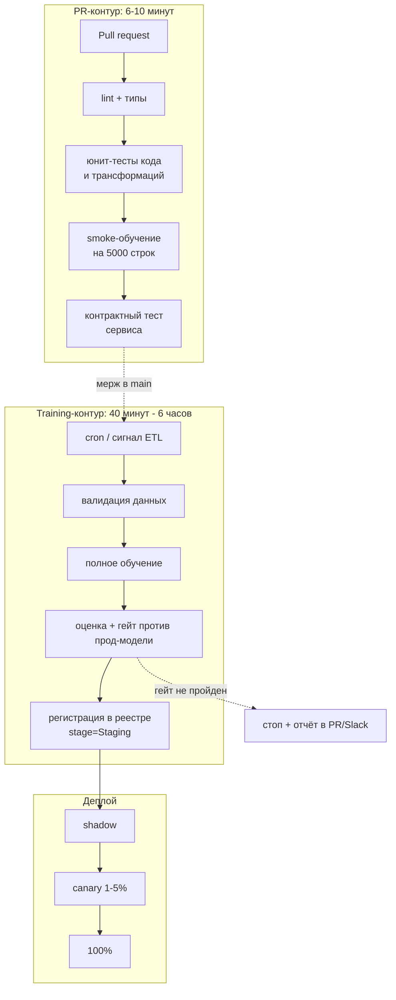
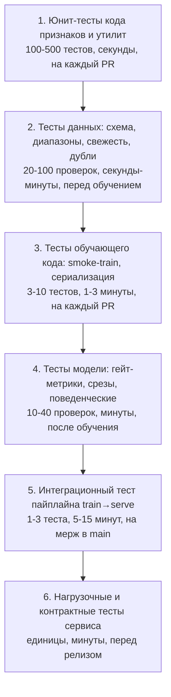

# CI/CD для ML

> **Зачем эта глава.** В обычном сервисе «все тесты зелёные» означает «можно катить».
> В ML-сервисе это означает только «код не упал». Модель может собраться, пройти все юнит-тесты,
> отдать корректный JSON — и при этом быть на 3% хуже той, что сейчас в проде, потому что
> в обучающие данные втекла битая партиция. Здесь — как устроен пайплайн, который ловит такие
> случаи автоматически: что тестировать в данных, коде и модели, как выглядит гейт-метрика,
> рабочий GitHub Actions от линта до регистрации модели, и почему автоматическое переобучение
> без человека — это способ уронить прод по расписанию.

**Уровень:** 🎯 middle → 🧠 middle+
**Предварительно нужно:** [воспроизводимость и трекинг](02-reproducibility-and-tracking.md), [упаковка модели](04-model-packaging.md), [Docker и Kubernetes](06-docker-and-k8s.md), [валидация и утечки](../02-classic-ml/13-validation-and-leakage.md)
**Как проработать:** чтение + собрать пайплайн на своём проекте

---

## Карта главы

- [1. Почему классический CI/CD ломается на ML](#1-почему-классический-cicd-ломается-на-ml)
- [2. Три оси изменений и три триггера пайплайна](#2-три-оси-изменений-и-три-триггера-пайплайна)
- [3. Пирамида тестов для ML](#3-пирамида-тестов-для-ml)
- [4. Тесты данных](#4-тесты-данных)
- [5. Тесты кода признаков: инвариантность и метаморфность](#5-тесты-кода-признаков-инвариантность-и-метаморфность)
- [6. Тесты модели и гейт-метрики](#6-тесты-модели-и-гейт-метрики)
- [7. ML Test Score: рубрика Google по четырём категориям](#7-ml-test-score-рубрика-google-по-четырём-категориям)
- [8. Пайплайн от коммита до продакшена](#8-пайплайн-от-коммита-до-продакшена)
- [9. Рабочий GitHub Actions](#9-рабочий-github-actions)
- [10. Автоматическое переобучение и его риски](#10-автоматическое-переобучение-и-его-риски)
- [11. Где нужен human-in-the-loop](#11-где-нужен-human-in-the-loop)
- [12. Подводные камни](#12-подводные-камни)
- [13. Проверь себя](#13-проверь-себя)
- [14. Практика](#14-практика)
- [15. Что читать дальше](#15-что-читать-дальше)

---

## 1. Почему классический CI/CD ломается на ML

Классический CI держится на одном свойстве: **тот же код даёт то же поведение**. Отсюда всё
остальное — тесты как булевы утверждения, воспроизводимая сборка, «зелёный пайплайн = можно катить».

В ML это свойство не выполняется ни в одной точке. Тот же код на данных, собранных на день позже,
даст другую модель. Та же модель на той же выборке даст другое число, если поменялась версия
`lightgbm`. И главное: результат обучения — не «работает / не работает», а вещественное число
на конечной выборке, у которого есть доверительный интервал.

| Аспект | Классический сервис | ML-сервис |
|---|---|---|
| Что версионируется | код | код + данные + конфиг обучения + артефакт модели + версии библиотек |
| Критерий «готово» | все тесты зелёные | тесты зелёные **и** метрика не хуже прод-модели больше чем на $\varepsilon$ |
| Детерминизм | тот же код → то же поведение | тот же код → другая модель (сид, порядок данных, версия CUDA, недетерминизм reduce на GPU) |
| Время прогона CI | 3–10 минут | юнит-тесты — минуты, обучение — от 20 минут до суток |
| Размер артефакта | 50–500 МБ образ | +100 МБ (бустинг) … +30 ГБ (LLM) весов |
| Как ломается | падает с трейсбеком | **молча**: обучилось на битых данных и отдаёт правдоподобный мусор |
| Откат | предыдущий образ | предыдущий образ + предыдущие веса + совместимая версия фич |

Последняя строка таблицы — самая дорогая. Сервис, который упал, чинят за 10 минут: его видно.
Модель, которая после переобучения стала предсказывать на 20% ниже по всем клиентам, не видно
ни по одной инфраструктурной метрике: 200 OK, латентность в норме, ошибок ноль. Обнаруживают
через неделю по выручке.

Поэтому в ML-пайплайне появляется сущность, которой нет в обычном CI: **гейт (gate)** —
автоматическое сравнение кандидата с текущей прод-моделью на общей выборке, с решением
«пускать дальше / не пускать».

> 💬 **На собеседовании.** Спросят: «Чем CI/CD для ML отличается от обычного CI/CD?»
> Хороший ответ: тремя вещами. Первое — тестируем не только код, но и данные (схема, диапазоны,
> свежесть, распределения) и саму модель (метрика на голден-сете, срезы, поведенческие тесты).
> Второе — в пайплайне появляется артефакт, который нельзя собрать детерминированно, поэтому
> вместо «сборка воспроизводима» мы требуем «обучение воспроизводимо с точностью до
> зафиксированного сида, версии данных и версии окружения», а результат сравниваем статистически.
> Третье — деплой модели не заканчивается выкаткой образа: дальше идёт shadow и канареечная
> выкатка, потому что офлайн-метрика не гарантирует онлайн-результат. Плохой ответ: «то же самое,
> только ещё модель кладём в образ».

---

## 2. Три оси изменений и три триггера пайплайна

Инженеры путаются, пытаясь запихнуть всё в один workflow. Разделите по **причине запуска**.

**Ось 1 — изменился код.** Кто-то поправил трансформацию признака, добавил эндпоинт, обновил
зависимость. Триггер: pull request. Здесь важна **скорость**: если PR-чек идёт дольше 10–12 минут,
люди перестают его ждать и начинают мержить «по глазам». Полное обучение сюда не помещается.

**Ось 2 — изменились данные.** Приехала новая неделя логов. Код тот же, модель другая.
Триггер: расписание (`cron`) или сигнал от оркестратора после успешного ETL. Здесь важна
**корректность гейта**, а не скорость: полтора часа обучения — нормально.

**Ось 3 — изменилась постановка.** Новый набор признаков, другой таргет, другой класс модели.
Триггер: ручной запуск с параметрами (`workflow_dispatch`). Обязательно ручное подтверждение
перед промоушеном: гейт по одной метрике не поймает, что вы поменяли смысл предсказания.



Обратите внимание: **обучение не находится в PR-контуре**. Оно там и не должно быть — иначе
каждое исправление опечатки будет стоить вам двух GPU-часов. В PR-контур помещается только
*smoke-обучение*: та же функция `train()`, но на 5000 строках и 20 итерациях бустинга.
Его задача — не получить хорошую модель, а доказать, что код обучения выполняется до конца
и артефакт сериализуется/загружается.

> ⚠️ **Типичная ошибка.** Держать один workflow «на всё» с `if`-ами внутри. Через два месяца
> в нём 400 строк YAML, половина шагов пропускается по невнятным условиям, и никто не может
> сказать, какие проверки реально отработали на конкретном коммите. Разделяйте по триггеру,
> общие шаги выносите в reusable workflow или composite action.

---

## 3. Пирамида тестов для ML

Пирамида тестов из классической разработки (много быстрых юнитов внизу, мало медленных e2e
наверху) остаётся в силе, но обрастает двумя новыми этажами: данные и модель.



Читать снизу вверх: чем ниже уровень, тем дешевле тест и тем чаще он гоняется.

Ключевое отличие от бэкенда — **уровень 4 не бинарный**. Тесты модели делятся на два класса:

- **Жёсткие проверки** (assert): предсказание в допустимом диапазоне, нет NaN, модель загружается,
  инференс укладывается в бюджет латентности, метрика не ниже абсолютного минимума
  (например, ROC-AUC ≥ 0.75 — «модель вообще чему-то научилась»).
- **Сравнительные проверки** (гейт): метрика кандидата против метрики прод-модели с учётом
  статистической неопределённости. Это не «правда/ложь», это решение при шуме.

> 🌱 **База.** Если у вас сейчас в проекте нет вообще ничего, начните с трёх вещей, они дают
> 80% пользы за день работы: (1) тест схемы входных данных, (2) smoke-обучение на 5000 строках
> в CI, (3) сравнение метрики новой модели со старой на **одной и той же** отложенной выборке
> с сохранением результата в файл. Остальное наращивается потом.

---

## 4. Тесты данных

Данные — источник большинства инцидентов в ML. Не «модель деградировала», а «поставщик
поменял единицу измерения цены с рублей на копейки», «джойн стал дублировать строки после
изменения гранулярности таблицы», «партиция за вчера приехала пустой, а пайплайн честно
обучился на том, что было».

Проверки делятся на три группы по стоимости ошибки.

**Группа A — блокирующие (fail build).** Нарушение означает, что данные непригодны:

```python
# tests/test_data_contract.py — гоняется перед обучением, до единой строки препроцессинга.
# Пороги подобраны по историческим данным за 12 недель: берём худшую неделю и добавляем запас.
import pandas as pd
import pytest

EXPECTED_SCHEMA = {
    "user_id": "int64",
    "event_ts": "datetime64[ns]",
    "amount": "float64",
    "merchant_category": "object",
    "is_fraud": "int8",
}

@pytest.fixture(scope="module")
def df():
    return pd.read_parquet("data/train_window.parquet")

def test_schema_exact(df):
    # Именно exact, а не "содержит": лишняя колонка чаще всего означает,
    # что апстрим поменял контракт и мы обучаемся не на том, на чём сервим.
    assert dict(df.dtypes.astype(str)) == EXPECTED_SCHEMA

def test_row_count_in_range(df):
    # Дневной объём событий стабилен в пределах +-35%. Провал вниз = недоехавшая партиция,
    # провал вверх = дубликаты после джойна. Оба случая одинаково смертельны.
    n_days = df["event_ts"].dt.date.nunique()
    per_day = len(df) / n_days
    assert 1.2e6 <= per_day <= 2.6e6, f"событий в день: {per_day:,.0f}"

def test_no_duplicate_events(df):
    # Дубли ключа — самая частая причина "модель внезапно стала лучше на валидации":
    # один и тот же объект попадает и в train, и в valid.
    dup = df.duplicated(subset=["user_id", "event_ts"]).mean()
    assert dup < 1e-4, f"доля дублей ключа: {dup:.5f}"

def test_target_rate_plausible(df):
    # Доля фрода исторически 0.4-1.1%. Скачок до 5% почти всегда означает
    # сдвиг окна подтверждения разметки, а не всплеск мошенничества.
    rate = df["is_fraud"].mean()
    assert 0.003 <= rate <= 0.015, f"доля позитивов: {rate:.4f}"

def test_freshness(df):
    # Данные должны быть свежее 36 часов: 24 часа на сбор + 12 запаса на задержку ETL.
    lag_h = (pd.Timestamp.utcnow().tz_localize(None) - df["event_ts"].max()).total_seconds() / 3600
    assert lag_h < 36, f"отставание данных: {lag_h:.1f} ч"

def test_amount_units_unchanged(df):
    # Медиана чека — грубый, но надёжный детектор смены единиц измерения (рубли->копейки).
    med = df["amount"].median()
    assert 300 <= med <= 3000, f"медиана amount: {med:.1f}"
```

**Группа B — предупреждающие (warn + запись в отчёт).** Доля пропусков в некритичном признаке
выросла с 2% до 9%; появилась новая категория мерчанта. Ломать сборку из-за этого нельзя —
данные живые, они меняются. Но это должно попадать в отчёт, который прикрепляется к прогону.

**Группа C — сравнение с обучающим распределением (drift).** PSI по каждому признаку между
текущим окном и окном, на котором училась прод-модель. Порог: PSI > 0.2 — предупреждение,
PSI > 0.25–0.3 — блокировка автоматического промоушена и требование ручного просмотра.
Механика PSI разбирается в главе про [дрифт данных](../09-monitoring/03-drift-detection.md).

> 🧠 **Middle+.** Отдельно проверяйте **консистентность train и serve**. Самый действенный тест
> в ML-CI: взять 1000 строк из **логов инференса** (то, что реально пришло в сервис вместе
> с посчитанными фичами), пропустить их через обучающий препроцессинг и сравнить значения.
> Расхождение больше чем в $10^{-6}$ по числовым фичам или любое расхождение по категориальным —
> это [train/serve skew](03-data-and-feature-store.md), и он стоит вам несколько процентов
> качества, которых вы никогда не увидите в офлайн-валидации. В рубрике ML Test Score это
> отдельный пункт (Monitoring 3), и не случайно.

---

## 5. Тесты кода признаков: инвариантность и метаморфность

Юнит-тест признака «на трёх примерах» ловит опечатки, но не ловит логические ошибки.
Мощнее — тесты, формулирующие **свойство**, которое обязано выполняться на любых входах.

**Инвариантность.** Изменение, которое не должно влиять на результат, не влияет:

```python
# Перестановка строк во входном датафрейме не должна менять признаки конкретного пользователя.
# Ловит зависимость от порядка: скрытые .shift(), .cumsum() без сортировки, groupby без явного ключа.
def test_features_permutation_invariant(raw_events, build_features):
    f1 = build_features(raw_events).set_index("user_id").sort_index()
    f2 = build_features(raw_events.sample(frac=1.0, random_state=42)).set_index("user_id").sort_index()
    pd.testing.assert_frame_equal(f1, f2, atol=1e-9)
```

**Метаморфность.** Известное изменение входа даёт предсказуемое изменение выхода:

```python
# Признак "средний чек за 30 дней" при удвоении всех сумм обязан удвоиться.
# Ловит ошибки нормализации, деления на неверный знаменатель и потерю масштаба.
def test_avg_amount_scales_linearly(raw_events, build_features):
    base = build_features(raw_events)["avg_amount_30d"]
    scaled = build_features(raw_events.assign(amount=lambda d: d["amount"] * 2))["avg_amount_30d"]
    assert np.allclose(scaled.values, base.values * 2, rtol=1e-9)
```

**Направленность (для модели, а не для признака).** Увеличение признака, который по смыслу
повышает риск, не должно снижать скор:

```python
# Поведенческий тест: больше неудачных попыток оплаты -> не меньший скор фрода.
# Это не про метрику, а про то, что модель не выучила бессмыслицу на редком сегменте.
@pytest.mark.parametrize("n_failed", [0, 1, 3, 7])
def test_monotone_in_failed_payments(model, base_row, n_failed):
    scores = []
    for k in [0, 1, 3, 7]:
        row = base_row.copy()
        row["failed_payments_1h"] = k
        scores.append(float(model.predict_proba(row.to_frame().T)[:, 1]))
    assert scores == sorted(scores), f"немонотонно: {scores}"
```

Последний тест **не всегда должен быть жёстким**: обычная градиентная модель монотонности
не гарантирует. Здесь два выхода: либо принудить монотонность в самой модели (в LightGBM
и XGBoost есть `monotone_constraints`), либо сделать тест предупреждающим и смотреть на долю
нарушений на выборке из 10 000 случайных объектов — с порогом вроде «не более 2%».

> 💬 **На собеседовании.** Спросят: «Что вы тестируете в ML-коде, чего нет в обычном коде?»
> Хороший ответ: три класса. Тесты данных (схема, объём, свежесть, доля пропусков, дубли ключа,
> правдоподобие доли таргета) — они блокируют обучение до того, как оно началось. Тесты
> инвариантности и метаморфности признаков — они ловят ошибки, которые не видны на трёх
> примерах: зависимость от порядка строк, потерю масштаба, утечку будущего в агрегат. И тесты
> модели: гейт-метрика против прод-модели, метрики по важным срезам, поведенческие проверки,
> бюджет латентности и размера артефакта. Плохой ответ: «пишу pytest на функции препроцессинга».

---

## 6. Тесты модели и гейт-метрики

Здесь появляется главная специфика ML-пайплайна: решение принимается по числу, у которого есть
шум. Наивный гейт `if auc_new > auc_prod: promote` — источник бесконечных ложных промоушенов
и откатов, потому что на выборке в 200 000 объектов разница в 0.001 ROC-AUC — это шум.

**Правильная постановка — тест на неухудшение (non-inferiority test).** Мы не доказываем,
что новая модель лучше. Мы доказываем, что она *не хуже больше чем на допустимую величину*:

$$
\Delta = M_{\text{new}} - M_{\text{prod}}, \qquad
H_0:\ \Delta \le -\varepsilon \quad \text{против} \quad H_1:\ \Delta > -\varepsilon
$$

где $M_{\text{new}}$ — метрика кандидата на отложенной выборке, $M_{\text{prod}}$ — метрика
текущей прод-модели **на той же самой выборке**, $\varepsilon > 0$ — заранее согласованная
допустимая просадка (non-inferiority margin).

Гейт проходится, если нижняя граница 95%-го доверительного интервала для $\Delta$ выше $-\varepsilon$:

$$
\mathrm{CI}^{\text{low}}_{95\%}(\Delta) > -\varepsilon
$$

**Как выбирать $\varepsilon$.** Не с потолка. Возьмите историю: посчитайте метрику прод-модели
на 8–12 последовательных недельных срезах и оцените её стандартное отклонение $\sigma_{\text{week}}$.
Разумный выбор — $\varepsilon \approx \sigma_{\text{week}}$ или чуть меньше. Для ROC-AUC на
задачах со стабильным трафиком это обычно 0.002–0.005. Если поставить $\varepsilon = 0.0001$,
гейт не пройдёт никогда; если $\varepsilon = 0.02$ — вы пропустите реальную деградацию.

**Считать интервал надо на разнице, а не на двух метриках отдельно.** Обе модели оцениваются
на одних и тех же объектах, их ошибки скоррелированы, и независимые интервалы дадут сильно
завышенную ширину. Правильный способ — парный бутстрап:

```python
# scripts/gate.py — решает, пускать ли кандидата дальше. Выход 0 = гейт пройден, 1 = нет.
# CI падает на ненулевом коде возврата, поэтому отдельная логика "остановить пайплайн" не нужна.
import json
import sys
import numpy as np
from sklearn.metrics import roc_auc_score

def paired_bootstrap_delta(y, p_new, p_old, n_boot=1000, seed=0):
    """Доверительный интервал разницы ROC-AUC на одной и той же выборке.

    Ресэмплим ОБЪЕКТЫ (а не считаем два независимых интервала): предсказания двух моделей
    на одном объекте сильно скоррелированы, и парная схема даёт интервал в разы уже —
    иначе гейт не пройдёт даже действительно лучшая модель.
    """
    rng = np.random.default_rng(seed)
    n = len(y)
    deltas = np.empty(n_boot)
    for b in range(n_boot):
        idx = rng.integers(0, n, n)
        y_b = y[idx]
        if y_b.min() == y_b.max():        # вырожденный сэмпл: один класс, AUC не определён
            deltas[b] = np.nan
            continue
        deltas[b] = roc_auc_score(y_b, p_new[idx]) - roc_auc_score(y_b, p_old[idx])
    lo, hi = np.nanpercentile(deltas, [2.5, 97.5])
    return float(lo), float(hi)

def main(path_new, path_old, path_labels, path_slices, eps=0.003, p99_budget_ms=25.0):
    y = np.load(path_labels)
    p_new, p_old = np.load(path_new), np.load(path_old)
    slices = json.load(open(path_slices))       # {"segment_name": [индексы объектов]}

    report, failed = {}, []

    # 1. Абсолютный минимум: модель вообще чему-то научилась.
    auc_new = roc_auc_score(y, p_new)
    report["auc_new"], report["auc_prod"] = auc_new, roc_auc_score(y, p_old)
    if auc_new < 0.75:
        failed.append(f"AUC {auc_new:.4f} ниже абсолютного минимума 0.75")

    # 2. Тест на неухудшение против прод-модели.
    lo, hi = paired_bootstrap_delta(y, p_new, p_old)
    report["delta_ci95"] = [lo, hi]
    if lo <= -eps:
        failed.append(f"нижняя граница CI разницы {lo:+.4f} <= -eps ({-eps:+.4f})")

    # 3. Срезы: средняя метрика может вырасти за счёт большого сегмента,
    #    а на важном маленьком (новые пользователи, дорогие заказы) — рухнуть.
    for name, idx in slices.items():
        idx = np.asarray(idx)
        if len(idx) < 2000:                      # на меньших срезах оценка слишком шумная
            continue
        d = roc_auc_score(y[idx], p_new[idx]) - roc_auc_score(y[idx], p_old[idx])
        report[f"delta_{name}"] = d
        if d < -2 * eps:                         # на срезе допускаем вдвое больший разброс
            failed.append(f"срез '{name}': просадка {d:+.4f}")

    # 4. Сдвиг распределения предсказаний: даже при равном AUC смена среднего скора
    #    ломает пороги, бизнес-правила и ёмкость ручной проверки ниже по течению.
    shift = abs(p_new.mean() - p_old.mean()) / max(p_old.mean(), 1e-9)
    report["mean_score_shift"] = shift
    if shift > 0.20:
        failed.append(f"среднее предсказание сдвинулось на {shift:.0%}")

    report["passed"] = not failed
    report["failures"] = failed
    json.dump(report, open("gate_report.json", "w"), indent=2)
    print(json.dumps(report, indent=2, ensure_ascii=False))
    return 1 if failed else 0

if __name__ == "__main__":
    sys.exit(main(*sys.argv[1:5]))
```

Обратите внимание на пункт 4. Он ловит класс проблем, который проходит мимо любой ранжирующей
метрики: модель с тем же ROC-AUC, но смещённым распределением скоров. ROC-AUC инвариантен
к монотонным преобразованиям — а порог отсечения, лимит на ручную проверку и все бизнес-правила
ниже по течению — нет. Модель «стала лучше по AUC», доля срабатываний выросла втрое, отдел
верификации захлебнулся. Это реальный сценарий инцидента.

Полный набор проверок модели, который стоит иметь:

| Проверка | Порог (пример) | Что ловит |
|---|---|---|
| Абсолютный минимум метрики | ROC-AUC ≥ 0.75 | обучение на битых данных, перепутанный таргет |
| Неухудшение против прода | $\mathrm{CI}^{\text{low}}(\Delta) > -0.003$ | реальную деградацию поверх шума |
| Метрика по срезам | просадка не больше $2\varepsilon$ на срезах ≥ 2000 объектов | «в среднем лучше, на важном сегменте хуже» |
| Сдвиг среднего предсказания | ≤ 20% относительно прода | поломку порогов и ёмкости ручной проверки |
| Калибровка | Brier / ECE не хуже прода на 10% | потерю смысла вероятностей при смешивании с бизнес-логикой |
| Латентность инференса | p99 ≤ 25 мс при batch=1 | «модель лучше, но в 4 раза толще» |
| Размер артефакта | ≤ 500 МБ | распухание образа и время холодного старта |
| Стабильность к пропускам | предсказание не NaN при любой одной пропущенной фиче | падение сервиса на реальном трафике |
| Совпадение train/serve препроцессинга | расхождение < $10^{-6}$ | skew |

> ⚠️ **Типичная ошибка.** Сравнивать метрику новой модели с числом, записанным в README
> полгода назад. Прод-модель нужно **пересчитывать на той же свежей выборке**, что и кандидата.
> Иначе вы сравниваете качество моделей с разницей во времени, и любой сезонный эффект
> выглядит как улучшение или деградация. Гейт всегда парный: обе модели, одна выборка, одна дата.

---

## 7. ML Test Score: рубрика Google по четырём категориям

Статья Breck, Cai, Nielsen, Salib, Sculley «The ML Test Score: A Rubric for ML Production
Readiness and Technical Debt Reduction» (IEEE Big Data, 2017) — самый цитируемый чек-лист
готовности ML-системы. Его спрашивают на собеседованиях в формате «как понять, что система
готова к проду», и знание структуры даёт готовый каркас ответа.

Рубрика — 28 проверок, по 7 в четырёх категориях. Каждая оценивается: **0** — не делается,
**0.5** — делается вручную и задокументировано, **1** — автоматизировано и выполняется регулярно.
Итоговый балл — **минимум по четырём категориям**, а не сумма. Это принципиально: система,
где идеальные тесты данных и нулевой мониторинг, получает 0.

**Категория 1. Признаки и данные (Features and Data).**

1. Ожидания от признаков зафиксированы в схеме.
2. Все признаки приносят пользу (есть оценка вклада, мёртвые признаки удаляются).
3. Ни один признак не стоит дороже, чем приносит.
4. Признаки соответствуют мета-требованиям (нет запрещённых регуляторикой полей).
5. В пайплайне данных есть контроль приватности.
6. Новый признак можно довести до прода быстро (метрика — время от идеи до продакшена).
7. Весь код признаков покрыт тестами.

**Категория 2. Разработка модели (Model Development).**

1. Спецификация модели проходит код-ревью и лежит в системе контроля версий.
2. Офлайн- и онлайн-метрики скоррелированы (проверено ретроспективно).
3. Все гиперпараметры затюнены (а не взяты из чужого ноутбука).
4. Известно влияние устаревания модели (насколько падает качество за день/неделю без переобучения).
5. Более простая модель не лучше (есть живой бейзлайн, с которым сравниваются).
6. Качество достаточно на всех важных срезах данных.
7. Модель проверена на инклюзивность/справедливость.

**Категория 3. Инфраструктура (ML Infrastructure).**

1. Обучение воспроизводимо.
2. Спецификация модели покрыта юнит-тестами.
3. Полный ML-пайплайн покрыт интеграционным тестом.
4. Качество модели валидируется **до** того, как она начнёт обслуживать трафик (это и есть гейт).
5. Модель позволяет отладку: можно посмотреть пошаговое вычисление на одном примере.
6. Модель проходит канареечную выкатку перед полным трафиком.
7. Модель можно быстро и безопасно откатить на предыдущую версию.

**Категория 4. Мониторинг (Monitoring).**

1. Изменения зависимостей вызывают уведомление.
2. Инварианты данных выполняются и в обучении, и в сервинге.
3. Обучение и сервинг вычисляют **одинаковые значения признаков** (тот самый skew).
4. Модель не слишком устарела.
5. Модель численно стабильна (нет NaN/Inf, нет взрывов).
6. Нет регрессии по скорости обучения, латентности сервинга, throughput и потреблению памяти.
7. Нет резкой или медленной регрессии качества предсказаний на боевом трафике.

Интерпретация итогового балла в статье:

| Балл | Что это значит |
|---|---|
| 0 | это исследовательский проект, а не продакшен-система |
| (0, 1] | какие-то тесты есть, но пробелы почти наверняка серьёзные |
| (1, 2] | базовая продакшен-готовность, надёжность держится на людях |
| (2, 3] | разумно протестированная система |
| (3, 5] | сильный уровень автоматического тестирования |
| > 5 | исключительный уровень |

> 💬 **На собеседовании.** Спросят: «Какие тесты нужно провести перед выкаткой модели в прод?»
> Хороший ответ — идти по четырём категориям ML Test Score, а не перечислять инструменты:
> данные (схема, инварианты, покрытие кода признаков тестами), модель (гейт против прод-модели
> и против простого бейзлайна, срезы, влияние устаревания), инфраструктура (воспроизводимость
> обучения, интеграционный тест пайплайна, валидация качества до сервинга, канарейка,
> проверенный откат), мониторинг (skew между train и serve, численная стабильность, регрессии
> латентности и качества). И добавить, что итоговая оценка — минимум по категориям, потому что
> идеальные офлайн-тесты не спасают при отсутствии мониторинга. Плохой ответ: «прогоню
> кросс-валидацию и посмотрю AUC».

---

## 8. Пайплайн от коммита до продакшена

Соберём всё вместе. Ниже — контур, который реально работает в командах из 3–10 человек.
Стрелки помечены тем, что должно быть выполнено для перехода.

```mermaid
flowchart LR
    A["commit / PR"] -->|"lint, mypy,<br/>unit 100-500 тестов,<br/>smoke-train"| B["merge в main"]
    B -->|"сборка образа,<br/>тег = git sha"| C["образ в registry"]
    C -->|"cron или сигнал ETL"| D["валидация данных"]
    D -->|"все блокирующие<br/>проверки прошли"| E["обучение<br/>с фиксированным сидом"]
    E -->|"артефакт + метрики<br/>в трекер"| F["гейт против<br/>прод-модели"]
    F -->|"CI низ > -eps,<br/>срезы ок,<br/>латентность ок"| G["реестр: Staging"]
    G -->|"ручное подтверждение<br/>или auto для регулярного<br/>переобучения"| H["shadow 100% трафика,<br/>2-24 часа"]
    H -->|"латентность и<br/>расхождение в норме"| I["canary 1-5%"]
    I -->|"критерии продвижения"| J["ramp-up 25-50-100%"]
    J --> K["реестр: Production"]
```



Три вещи, которые отличают взрослый пайплайн от учебного.

**Тег образа — git sha, а не `latest`.** `latest` делает откат невозможным: вы не знаете,
на что откатываться, и не можете доказать, какой код сейчас в проде.

**Модель и образ версионируются отдельно.** Образ содержит код сервинга, модель лежит в реестре
и подтягивается по алиасу (`@champion`). Это позволяет откатить модель, не пересобирая образ,
и наоборот. Обратная сторона — нужна проверка совместимости: сервис версии 2.3 обязан уметь
загрузить модель версии 17, и это отдельный тест.

**Всё, что попало в реестр, воспроизводимо.** К модели прикладываются: git sha кода, хеш или
версия датасета (DVC/Delta-версия), лок-файл окружения, сид, конфиг обучения, метрики,
`gate_report.json`. Без этого через три месяца на вопрос аудитора «почему модель приняла такое
решение в марте» ответить нечем.

---

## 9. Рабочий GitHub Actions

Ниже — два workflow: быстрый PR-контур и тренировочный. Комментарии объясняют неочевидные места.

**`.github/workflows/pr.yml` — контур на каждый pull request. Бюджет: 8 минут.**

```yaml
name: pr-checks

on:
  pull_request:
    branches: [main]

# Новый пуш в ту же ветку отменяет предыдущий прогон: иначе на активной ветке
# очередь раннеров забивается устаревшими сборками и PR-чек начинает идти по 40 минут.
concurrency:
  group: pr-${{ github.head_ref }}
  cancel-in-progress: true

env:
  PYTHON_VERSION: "3.11"

jobs:
  lint:
    runs-on: ubuntu-latest
    steps:
      - uses: actions/checkout@v4
      - uses: actions/setup-python@v5
        with:
          python-version: ${{ env.PYTHON_VERSION }}
          cache: pip                      # кэш колёс: экономит ~60-90 с на прогон
      - run: pip install -r requirements-dev.txt
      - run: ruff check src tests
      - run: ruff format --check src tests
      - run: mypy src                     # типы ловят половину ошибок контракта фич бесплатно

  unit:
    runs-on: ubuntu-latest
    steps:
      - uses: actions/checkout@v4
      - uses: actions/setup-python@v5
        with:
          python-version: ${{ env.PYTHON_VERSION }}
          cache: pip
      - run: pip install -r requirements.txt -r requirements-dev.txt
      # -n auto распараллеливает по ядрам раннера; --timeout ловит зависшие тесты,
      # которые иначе съедают весь 6-часовой лимит job и маскируют дедлок.
      - run: pytest tests/unit -n auto --timeout=120 --cov=src --cov-fail-under=70

  smoke-train:
    runs-on: ubuntu-latest
    steps:
      - uses: actions/checkout@v4
      - uses: actions/setup-python@v5
        with:
          python-version: ${{ env.PYTHON_VERSION }}
          cache: pip
      - run: pip install -r requirements.txt
      # Тот же train(), но на 5000 строк и 20 итерациях: проверяем, что код обучения
      # доходит до конца, артефакт сериализуется и снова загружается, а predict
      # на одной строке даёт число в [0, 1]. Занимает ~40 секунд.
      - run: python -m src.train --config configs/smoke.yaml --limit-rows 5000
      - run: pytest tests/model/test_artifact_contract.py

  build:
    needs: [lint, unit, smoke-train]
    runs-on: ubuntu-latest
    steps:
      - uses: actions/checkout@v4
      - uses: docker/setup-buildx-action@v3
      - uses: docker/build-push-action@v6
        with:
          context: .
          push: false                     # на PR только собираем, публикуем после мержа
          tags: ml-service:${{ github.sha }}
          cache-from: type=gha            # кэш слоёв между прогонами: сборка 6 мин -> 50 с
          cache-to: type=gha,mode=max
      # Контрактный тест: поднимаем контейнер и проверяем реальный HTTP-ответ.
      # Ловит то, что не ловят юнит-тесты: битый CMD, отсутствующий файл модели в образе,
      # несовпадение схемы запроса с pydantic-моделью.
      - run: |
          docker run -d --rm -p 8000:8000 --name svc ml-service:${{ github.sha }}
          for i in $(seq 30); do curl -sf localhost:8000/health && break || sleep 1; done
          pytest tests/contract --base-url http://localhost:8000
          docker stop svc
```

**`.github/workflows/train.yml` — обучение, гейт и регистрация.**

```yaml
name: train-and-gate

on:
  schedule:
    - cron: "0 2 * * 1"        # понедельник 02:00 UTC: данные за прошлую неделю уже закрыты
  workflow_dispatch:
    inputs:
      dataset_version:
        description: "Версия датасета (тег DVC/Delta); пусто = последняя"
        required: false
      auto_promote:
        description: "Промоутить в Staging автоматически при прохождении гейта"
        type: boolean
        default: true

permissions:
  contents: read
  id-token: write               # OIDC-доступ к облаку вместо вечных ключей в секретах

env:
  MLFLOW_TRACKING_URI: ${{ secrets.MLFLOW_TRACKING_URI }}

jobs:
  validate-data:
    runs-on: [self-hosted, linux, cpu-16]
    outputs:
      dataset_version: ${{ steps.pull.outputs.version }}
    steps:
      - uses: actions/checkout@v4
      - run: pip install -r requirements.txt
      - id: pull
        run: |
          dvc pull data/train_window.parquet
          echo "version=$(dvc data status --json | jq -r '.version // "head"')" >> "$GITHUB_OUTPUT"
      # Блокирующие проверки данных. Падение здесь означает, что обучать НЕ НАДО:
      # запуск на битой партиции стоит 40 минут CPU и, что хуже, может пройти гейт.
      - run: pytest tests/data -q --junitxml=data-report.xml
      - uses: actions/upload-artifact@v4
        if: always()
        with:
          name: data-report
          path: data-report.xml

  train:
    needs: validate-data
    runs-on: [self-hosted, linux, cpu-32]
    timeout-minutes: 180        # без этого зависшее обучение держит раннер 6 часов
    steps:
      - uses: actions/checkout@v4
      - run: pip install -r requirements.txt
      - name: Train
        run: |
          python -m src.train \
            --config configs/prod.yaml \
            --dataset-version "${{ needs.validate-data.outputs.dataset_version }}" \
            --seed 42 \
            --git-sha "${{ github.sha }}" \
            --run-name "weekly-${{ github.run_number }}"
      # Артефакты нужны следующему job: между job'ами файловая система не разделяется.
      - uses: actions/upload-artifact@v4
        with:
          name: candidate
          path: |
            artifacts/model.onnx
            artifacts/preds_new.npy
            artifacts/preds_prod.npy
            artifacts/labels.npy
            artifacts/slices.json
          retention-days: 30

  gate:
    needs: train
    runs-on: [self-hosted, linux, cpu-8]
    steps:
      - uses: actions/checkout@v4
      - uses: actions/download-artifact@v4
        with: { name: candidate, path: artifacts }
      - run: pip install -r requirements.txt
      # Гейт: неухудшение против прод-модели, срезы, сдвиг распределения предсказаний.
      - run: |
          python scripts/gate.py \
            artifacts/preds_new.npy artifacts/preds_prod.npy \
            artifacts/labels.npy artifacts/slices.json
      # Отдельно — бюджет латентности и размера: "модель лучше, но в 4 раза толще" тоже провал.
      - run: pytest tests/perf/test_inference_budget.py
      - uses: actions/upload-artifact@v4
        if: always()
        with: { name: gate-report, path: gate_report.json }

  register:
    needs: gate
    if: ${{ github.event_name == 'schedule' || inputs.auto_promote }}
    runs-on: [self-hosted, linux, cpu-8]
    environment: staging       # required reviewers в настройках environment = ручной аппрув
    steps:
      - uses: actions/checkout@v4
      - uses: actions/download-artifact@v4
        with: { name: candidate, path: artifacts }
      - uses: actions/download-artifact@v4
        with: { name: gate-report, path: . }
      # Регистрируем со ВСЕМИ метаданными: без git sha, версии данных и отчёта гейта
      # модель в реестре — это просто файл, который никто не сможет объяснить через полгода.
      - run: |
          python scripts/register_model.py \
            --model artifacts/model.onnx \
            --gate-report gate_report.json \
            --git-sha "${{ github.sha }}" \
            --dataset-version "${{ needs.validate-data.outputs.dataset_version }}" \
            --stage Staging
```

Три детали, за которые на собеседовании дают балл.

**`environment: staging` с required reviewers** — это и есть human-in-the-loop, встроенный
в CI: job физически не стартует, пока человек не нажал кнопку. Не нужен отдельный самописный
механизм подтверждения.

**`timeout-minutes` на обучении.** Без него зависший процесс держит self-hosted раннер до
дефолтного лимита в 6 часов, и все последующие запуски встают в очередь. Это самая частая
причина «CI сломался ночью, разбирались утром».

**OIDC вместо долгоживущих ключей** (`id-token: write`). Секрет с ключом от S3, лежащий
в репозитории пять лет, — стандартная находка любого аудита.

---

## 10. Автоматическое переобучение и его риски

Автоматическое переобучение выглядит как очевидное благо: данные свежие, модель не устаревает,
людей не отвлекаем. На практике это самый опасный компонент MLOps-контура, потому что он
**в цикле**: ошибка не остаётся ошибкой, она усиливается на следующей итерации.

**Риск 1. Обучение на собственных предсказаниях (петля обратной связи).** Модель ранжирует —
пользователь кликает только по тому, что показали — эти клики становятся обучающими данными.
Через несколько итераций модель уверенно предсказывает собственное прошлое поведение,
разнообразие выдачи схлопывается, а офлайн-метрики при этом растут. Лечится примесью случайной
эксплорации (1–5% трафика), логированием позиции и IPS-коррекцией.

**Риск 2. Тихое протухание данных.** Апстрим-таблица перестала обновляться. Пайплайн честно
берёт «последние доступные» данные и обучается на прошлой неделе третий раз подряд. Никаких
ошибок. Лечится проверкой свежести (`test_freshness` из §4) как блокирующей.

**Риск 3. «Штормы переобучения» (retraining storms).** Триггер по дрифту срабатывает на шум:
праздники, маркетинговая акция, сбой логирования. Пайплайн запускает обучение, модель едет
в прод, дрифт «исчезает», через день срабатывает снова. За неделю — восемь смен прод-модели,
ни одну из которых никто не проверял. Лечится тремя условиями на триггер:
дрифт держится не менее $T$ (например, 3 суток подряд), накоплено не менее $N$ наблюдений
(обычно десятки тысяч), и с прошлого переобучения прошло не меньше минимального интервала
(cooldown, например 7 дней).

**Риск 4. Дрейф разметки, а не данных.** Разметка приходит с задержкой: фрод подтверждается
через 30–60 дней, возврат товара — через 14. Если окно обучения включает последний месяц,
свежие объекты имеют **систематически заниженную** долю позитивов: их просто ещё не успели
подтвердить. Модель учится, что «недавнее = безопасное». Лечится сдвигом окна: обучаемся
на данных, где разметка уже дозрела (`event_ts < now − maturity_period`), а свежие данные
используем только для мониторинга дрифта признаков.

**Риск 5. Молчаливая смена контракта фич.** Аналитик переименовал колонку в витрине. Обучающий
пайплайн подхватил новое имя, сервинг — нет. Модель обучена на признаке, которого в проде
не существует, и получает дефолтное значение на 100% запросов. Гейт этого не увидит: офлайн
всё прекрасно. Ловится только тестом консистентности train/serve и мониторингом доли дефолтных
значений в сервинге.

Как выбирать частоту переобучения — отдельная тема, разобранная в главе
[переобучение моделей](../09-monitoring/07-retraining.md). Короткий ориентир: измерьте
**скорость устаревания** — обучите модель на данных до момента $t$ и посчитайте метрику на
неделях $t{+}1, t{+}2, \ldots$ Точка, где падение превысило $\varepsilon$, и есть ваш период.
Для рекламы и рекомендаций это часто дни, для кредитного скоринга — месяцы.

> 💬 **На собеседовании.** Спросят: «У вас настроено автоматическое переобучение. Что может
> пойти не так?» Хороший ответ перечисляет механизмы, а не общие слова: петля обратной связи
> (учимся на собственных показах), протухшие данные без проверки свежести, штормы переобучения
> от шумного триггера дрифта, незрелая разметка в свежем окне, рассинхрон контракта фич между
> обучением и сервингом. И дальше — защиты: блокирующие тесты данных, гейт с неухудшением
> и срезами, cooldown на триггер, обязательная shadow/canary-фаза, автоматический откат
> и хранение последних N моделей для быстрого возврата. Плохой ответ: «главное — следить
> за метриками».

---

## 11. Где нужен human-in-the-loop

Полная автоматизация без человека возможна только тогда, когда цена ошибки ниже стоимости
проверки. Практический критерий: **человек нужен там, где автоматический критерий не покрывает
класс возможных ошибок**.

| Ситуация | Автомат | Человек |
|---|---|---|
| Регулярное переобучение, тот же код, свежие данные, гейт пройден | да | нет (но нужен алерт и отчёт) |
| Изменился набор признаков или их источник | нет | обязательно: гейт не видит смены семантики |
| Изменился таргет или его определение | нет | обязательно + пересогласование метрик |
| Кандидат прошёл гейт, но с просадкой на важном срезе | нет | обязательно |
| Первый выкат модели в новом домене/стране/сегменте | нет | обязательно |
| Модель влияет на решения с юридическими последствиями (кредит, отказ в обслуживании) | нет | обязательно, часто требование регулятора |
| Откат при сработавшем автоматическом критерии | **да** | человек уведомляется, но не блокирует |

Последняя строка часто вызывает спор, и на собеседовании это хороший момент проявить зрелость:
**промоушен требует человека, откат — нет**. Асимметрия намеренная. Ошибочный откат стоит вам
потери улучшения на несколько часов; ошибочный промоушен, ждущий человека ночью, стоит
инцидента. Целевое время отката — меньше 5 минут от срабатывания критерия до старой версии
в проде, и это достижимо только автоматикой.

Практическая реализация human-in-the-loop в CI: GitHub Environments с required reviewers,
ручной approval-шаг в оркестраторе, или переход модели `Staging → Production` в реестре
только через API, вызываемый человеком. Важно, чтобы человек **видел, что подтверждает**:
к запросу на подтверждение должен прикладываться `gate_report.json`, дифф конфигов и ссылка
на прогон в трекере экспериментов. Кнопка «Approve» без контекста — это не human-in-the-loop,
а ритуал.

---

## 12. Подводные камни

**Гейт проходит всегда.**
Симптом: за полгода гейт не остановил ни одну модель.
Причина: $\varepsilon$ выбрана слишком большой, или сравнение идёт со старым записанным
числом, или выборка гейта совпадает с валидационной, на которой подбирались гиперпараметры.
Что делать: пересчитать $\varepsilon$ по историческому разбросу метрики; держать отдельный
**гейт-сет**, который никогда не участвует в подборе; раз в квартал прогонять заведомо плохую
модель (обученную на 10% данных) и убеждаться, что гейт её ловит. Тест, который никогда
не падает, — это не тест.

**CI зелёный, прод сломан.**
Симптом: все проверки прошли, после выката 500-е ошибки на части запросов.
Причина: тесты гоняются на «чистых» данных из parquet, а в прод приходит сырой JSON
с пропущенными полями, строками вместо чисел и категориями, которых не было в обучении.
Что делать: контрактный тест сервиса на реальных сэмплах из логов инференса (не синтетика),
включая заведомо кривые: пустые строки, `null`, неизвестные категории, значения за границами
диапазона. Правило: тестовые данные берутся из прода, а не пишутся руками.

**Обучение в CI не воспроизводится.**
Симптом: два прогона на одном коммите дают ROC-AUC 0.842 и 0.851.
Причина: не зафиксирован сид, недетерминированный порядок файлов при чтении партиций,
многопоточность бустинга с неупорядоченной редукцией, разные версии библиотек между раннерами.
Что делать: фиксировать сид в конфиге и логировать его; сортировать список файлов явно;
для оценки разброса делать 3 прогона с разными сидами и сравнивать **средние**, а не
единичные значения; пиннить окружение лок-файлом, а не диапазонами версий.

**Пайплайн стал длиннее рабочего дня.**
Симптом: полный прогон 7 часов, разработчик не может проверить гипотезу за день.
Причина: всё в одном последовательном workflow, обучение на полном датасете при каждом изменении.
Что делать: разделить контуры (§2); в PR-контуре обучать на подвыборке; кэшировать
скачивание данных и сборку признаков между прогонами; распараллелить независимые job'ы;
поставить бюджет времени как SLO пайплайна и мониторить его.

**Секреты и данные утекли в артефакты.**
Симптом: в артефакте прогона лежит parquet с персональными данными, доступный всей организации.
Причина: `upload-artifact` с путём `artifacts/` целиком.
Что делать: загружать только явно перечисленные файлы; для данных использовать хранилище
с контролем доступа, а в артефактах оставлять ссылку и хеш; `retention-days` ставить явно;
секреты передавать через OIDC/секрет-менеджер, а не через переменные окружения в логах.

**Модель обучена на данных из будущего.**
Симптом: офлайн ROC-AUC 0.95, онлайн — на уровне бейзлайна.
Причина: временная утечка в пайплайне признаков — агрегат посчитан по всему датасету,
включая период после момента предсказания.
Что делать: тест point-in-time корректности как обязательный: для случайной выборки из 1000
объектов пересобрать признаки «на дату события» отдельным медленным честным кодом и сравнить
с тем, что выдаёт продовый пайплайн. Расхождение — блокирующая ошибка. Подробно —
в главах [валидация и утечки](../02-classic-ml/13-validation-and-leakage.md) и
[feature store](03-data-and-feature-store.md).

**Артефакт нельзя откатить.**
Симптом: нужно вернуть модель недельной давности, а в реестре только `latest`.
Причина: перезапись артефакта по одному пути, тег образа `latest`, отсутствие хранения
предыдущих версий.
Что делать: неизменяемые версии в реестре, алиасы (`@champion`, `@challenger`) вместо
перезаписи, хранение последних N ≥ 5 версий, регулярная **тренировка отката** — раз в квартал
откатывайте прод на предыдущую версию в рабочее время и засекайте время. Откат, который
никогда не проверяли, не работает.

---

## 13. Проверь себя

<details>
<summary><b>🎯 Вопрос.</b> Чем CI/CD для ML отличается от классического CI/CD?</summary>

**Короткий ответ.** Тремя вещами: версионируется не только код, но и данные с артефактом модели;
критерий готовности — не «тесты зелёные», а «тесты зелёные и метрика не хуже прод-модели
с учётом шума»; деплой не заканчивается выкаткой образа — дальше идёт shadow и канарейка,
потому что офлайн-метрика не гарантирует онлайн-результат.

**Развёрнуто.** Классический CI держится на детерминизме: тот же код → то же поведение.
В ML это неверно: результат зависит от данных, сида, версий библиотек и порядка редукции.
Поэтому появляются два новых этажа тестов — данные (схема, объём, свежесть, дубли, доля таргета,
дрифт) и модель (гейт-метрика против прод-модели, срезы, поведенческие проверки, латентность,
размер артефакта). Появляется сущность «гейт» — статистическое сравнение кандидата с текущей
моделью на одной выборке. И меняется цена молчаливой ошибки: сломанный сервис виден сразу,
деградировавшая модель отвечает 200 OK и обнаруживается через неделю по выручке.

**Чего ждёт интервьюер:** понимания, что тестируются данные и модель, а не только код,
и что булев результат теста недостаточен.

**Провал:** «то же самое, только модель кладём в образ».
</details>

<details>
<summary><b>🎯 Вопрос.</b> Какие тесты вы бы запустили перед выкаткой модели в прод?</summary>

**Короткий ответ.** По четырём категориям ML Test Score: данные, модель, инфраструктура,
мониторинг. Конкретно: валидация схемы и объёма данных, юнит- и инвариантные тесты кода
признаков, гейт по метрике против прод-модели и против простого бейзлайна, метрики по важным
срезам, поведенческие тесты, бюджет латентности и размера артефакта, интеграционный тест
train→serve, контрактный тест API, проверка совпадения train- и serve-препроцессинга.

**Развёрнуто.** Важно назвать не только список, но и **где** каждая проверка стоит в пайплайне
и что она блокирует. Тесты данных — до обучения, блокируют запуск (обучение на битой партиции
стоит денег и может пройти гейт). Тесты модели — после обучения, блокируют регистрацию.
Интеграционные и контрактные — перед деплоем, блокируют выкатку. Отдельно стоит сказать
про проверку отката: восстановление предыдущей версии должно быть протестировано, а не
предполагаться работающим.

**Чего ждёт интервьюер:** структуры вместо перечисления инструментов и понимания, что часть
проверок обязана быть блокирующими.

**Провал:** «прогоню кросс-валидацию и посмотрю метрику».
</details>

<details>
<summary><b>🧠 Вопрос.</b> Как автоматически решить, что новая модель лучше текущей?</summary>

**Короткий ответ.** Через тест на неухудшение: посчитать обе модели на одной и той же
отложенной выборке, оценить парным бутстрапом доверительный интервал для разницы метрик
и требовать, чтобы нижняя граница 95%-го интервала была выше $-\varepsilon$, где $\varepsilon$ —
согласованная допустимая просадка. Плюс проверки по срезам и на сдвиг распределения предсказаний.

**Развёрнуто.** Сравнение `auc_new > auc_prod` даёт ложные срабатывания в обе стороны:
на выборке в 200 тысяч объектов разница 0.001 ROC-AUC — шум. Интервал надо строить именно
на **разнице** и парным бутстрапом (ресэмплим объекты, обе модели считаем на одном и том же
сэмпле): предсказания скоррелированы, и два независимых интервала окажутся втрое шире нужного.
$\varepsilon$ выбирается из исторического недельного разброса метрики, обычно 0.002–0.005
для ROC-AUC. Отдельно проверяются срезы (среднее может вырасти за счёт большого сегмента при
провале на важном маленьком) и сдвиг среднего скора (ROC-AUC инвариантен к монотонным
преобразованиям, а пороги и ёмкость ручной проверки — нет). И финально: офлайн-гейт — это
допуск к онлайн-проверке, а не решение о победе; решение принимается в A/B.

**Чего ждёт интервьюер:** понимания, что метрика — случайная величина, и знания про срезы.

**Провал:** сравнить два числа и остановиться.
</details>

<details>
<summary><b>🧠 Вопрос.</b> Что такое ML Test Score и как считается итоговый балл?</summary>

**Короткий ответ.** Рубрика Google (Breck et al., 2017) из 28 проверок в четырёх категориях —
данные, модель, инфраструктура, мониторинг. Каждая оценивается 0 / 0.5 / 1 (не делается /
делается вручную / автоматизировано). Итоговый балл — **минимум** по четырём категориям.

**Развёрнуто.** Минимум, а не сумма — это главная идея рубрики. Система с идеальными тестами
данных и нулевым мониторингом получает 0, потому что она сломается в проде и никто не узнает.
Из наиболее часто проваливаемых пунктов стоит назвать: корреляция офлайн- и онлайн-метрик
(проверялась ли ретроспективно), известно ли влияние устаревания модели, совпадают ли значения
признаков в обучении и сервинге, протестирован ли откат. Балл ≤ 1 в статье описывается как
«скорее исследовательский проект»; уровень 2–3 — разумно протестированная система.

**Чего ждёт интервьюер:** что вы знаете структуру, а не название, и можете применить её как
чек-лист к своему проекту.

**Провал:** «это метрика качества модели».
</details>

<details>
<summary><b>🎯 Вопрос.</b> Почему нельзя обучать модель прямо в пайплайне на каждый pull request?</summary>

**Короткий ответ.** По времени и деньгам: полное обучение — от 40 минут до часов, PR-чек
должен укладываться в 8–12 минут, иначе им перестают пользоваться. В PR-контуре гоняется
smoke-обучение на подвыборке, полное обучение — по расписанию или по сигналу от ETL.

**Развёрнуто.** Есть и содержательная причина: изменение кода и изменение данных — разные оси.
PR отвечает на вопрос «код корректен», обучение — на вопрос «модель на свежих данных не хуже».
Смешивая их, вы получаете пайплайн, который на каждую опечатку тратит GPU-часы, а на реальное
изменение данных не реагирует вовсе. Smoke-обучение (та же функция `train()`, 5000 строк,
20 итераций, ~40 секунд) проверяет ровно то, что нужно на PR: код выполняется, артефакт
сериализуется и загружается обратно, `predict` на одной строке даёт корректное значение.

**Чего ждёт интервьюер:** понимания бюджета времени CI и разделения контуров по триггеру.

**Провал:** «обучение быстрое, пусть будет в PR».
</details>

<details>
<summary><b>🧠 Вопрос.</b> Настроено автоматическое переобучение по триггеру дрифта. Что может пойти не так?</summary>

**Короткий ответ.** Штормы переобучения от шумного триггера, обучение на протухших данных,
петля обратной связи (учимся на собственных показах), незрелая разметка в свежем окне,
рассинхрон контракта фич между обучением и сервингом.

**Развёрнуто.** Триггер по дрифту срабатывает на праздники, акции и сбои логирования —
без условий устойчивости получаем несколько смен прод-модели в неделю, ни одну из которых
никто не смотрел. Защита: дрифт держится не менее 3 суток, накоплено не менее N наблюдений,
cooldown между переобучениями. Незрелая разметка — вторая по частоте: если фрод подтверждается
через 30 дней, а окно обучения включает последнюю неделю, модель учится, что «недавнее =
безопасное»; лечится сдвигом окна на период дозревания. Петля обратной связи лечится примесью
эксплорации и логированием позиций. И всегда: гейт, shadow, канарейка, автоматический откат
и хранение последних N версий.

**Чего ждёт интервьюер:** конкретных механизмов отказа, а не «нужно мониторить».

**Провал:** «ничего, если метрики в порядке».
</details>

<details>
<summary><b>🎯 Вопрос.</b> Где в ML-пайплайне обязательно нужен человек?</summary>

**Короткий ответ.** При смене набора признаков, определения таргета, выходе в новый домен,
просадке на важном срезе и в регулируемых решениях. Регулярное переобучение на том же коде
с пройденным гейтом человека не требует. Откат человека не требует **никогда** — он должен
быть автоматическим.

**Развёрнуто.** Принцип: человек нужен там, где автоматический критерий не покрывает класс
возможных ошибок. Гейт по ROC-AUC не увидит, что вы поменяли смысл предсказания или добавили
признак, недоступный части пользователей. Асимметрия «промоушен через человека, откат
автоматически» намеренная: цена ошибочного отката — потеря улучшения на несколько часов,
цена ожидания человека при инциденте — часы деградации. Целевое время отката — до 5 минут.
Технически human-in-the-loop реализуется через required reviewers в environment CI или
approval-шаг в оркестраторе, и человеку обязательно показывается отчёт гейта и дифф конфига.

**Чего ждёт интервьюер:** осознанной границы автоматизации и понимания асимметрии
промоушен/откат.

**Провал:** «всё должно быть автоматизировано» или «модель всегда катит человек».
</details>

<details>
<summary><b>🧠 Вопрос.</b> Как обеспечить воспроизводимость обучения в CI?</summary>

**Короткий ответ.** Зафиксировать четыре вещи: версию кода (git sha), версию данных
(DVC/Delta-версия или хеш), версию окружения (лок-файл, а не диапазоны), сид и все источники
недетерминизма. Всё это логировать вместе с моделью в реестр.

**Развёрнуто.** Полного детерминизма на GPU и в многопоточном бустинге добиться сложно:
порядок редукции при параллельном суммировании меняет последние разряды, а за сотни итераций
расхождение накапливается. Практический стандарт — не «бит в бит», а «воспроизводимо
в пределах шума»: три прогона с разными сидами, сравниваем среднее и разброс, а не единичные
значения. Отдельно: явная сортировка списка файлов при чтении партиций (порядок из файловой
системы недетерминирован), фиксация версии CUDA/cuDNN в образе, отключение недетерминированных
ядер там, где это дёшево. И главное — сама возможность повторить: по записи в реестре должно
быть однозначно понятно, какой код, на каких данных и в каком окружении дал эту модель.
Подробно — в главе [воспроизводимость и трекинг](02-reproducibility-and-tracking.md).

**Чего ждёт интервьюер:** четырёх осей версионирования и честности про пределы детерминизма.

**Провал:** «поставлю `random_state=42`».
</details>

<details>
<summary><b>🎯 Вопрос.</b> Модель прошла все офлайн-проверки. Можно катить на 100%?</summary>

**Короткий ответ.** Нет. Офлайн-гейт — это допуск к онлайн-проверке. Дальше shadow
(латентность и распределение предсказаний на реальном трафике), канарейка на 1–5% с критериями
продвижения и отката, потом постепенный ramp-up.

**Развёрнуто.** Офлайн-выборка не покрывает три вещи: реальное распределение входов
(включая кривые запросы и новые категории), поведение системы под нагрузкой (латентность,
память, конкуренция за ресурсы) и эффект на пользователя (который может быть отрицательным
при выросшей офлайн-метрике — например, из-за схлопывания разнообразия). Плюс сама
офлайн-метрика оценена на конечной выборке и имеет доверительный интервал. Отсюда лестница
выкатки — она разбирается в главе [стратегии выкатки](08-deployment-strategies.md).

**Чего ждёт интервьюер:** что вы не считаете офлайн-метрику достаточным основанием.

**Провал:** «AUC вырос, катим».
</details>

<details>
<summary><b>🧠 Вопрос.</b> Как поймать train/serve skew в CI?</summary>

**Короткий ответ.** Взять реальные записи из логов инференса вместе с посчитанными там
признаками, прогнать те же сырые входы через обучающий препроцессинг и сравнить значения.
Любое расхождение больше $10^{-6}$ по числовым признакам или любое по категориальным —
блокирующая ошибка.

**Развёрнуто.** Skew возникает, когда признаки в обучении и в сервинге считаются разным кодом:
в обучении — SQL/Spark по историческим таблицам, в сервинге — Python по данным из Redis.
Расходятся обработка пропусков, округление, часовые пояса, порядок применения кодировок,
границы биннинга. Офлайн-валидация этого не видит принципиально: она целиком живёт на обучающей
стороне. Помимо CI-теста, нужен постоянный мониторинг: логировать в проде **вычисленные
признаки** вместе с предсказанием и периодически сравнивать их распределения с обучающими.
Радикальное решение — один код признаков для обеих сторон (feature store с общими
трансформациями). В рубрике ML Test Score это отдельный пункт в категории мониторинга.

**Чего ждёт интервьюер:** конкретной механики проверки, а не определения термина.

**Провал:** объяснить, что такое skew, и не сказать, как его обнаружить.
</details>

---

## 14. Практика

**Задача 1. Гейт на своём проекте (2 часа).**
Возьмите любую свою модель, сохраните предсказания текущей и новой версии на одной выборке
и реализуйте `gate.py` из §6: парный бутстрап, срезы, сдвиг среднего скора.
*Сделано правильно: скрипт возвращает код 1, когда вы подсовываете ему намеренно испорченную
модель (обученную на 5% данных), и код 0 для нормальной; $\varepsilon$ обоснована историческим
разбросом метрики, а не выбрана «на глаз».*

**Задача 2. Тесты данных (1.5 часа).**
Напишите 10 блокирующих проверок для своего датасета: схема, объём в день, дубли ключа,
доля таргета, свежесть, единицы измерения, доля пропусков по каждой критичной колонке.
*Сделано правильно: каждый порог выведен из истории (минимум 8 недель), а не придуман;
для каждой проверки в комментарии написано, какой реальный сбой она ловит.*

**Задача 3. Красная кнопка (1 час).**
Испортите данные намеренно: обрежьте партицию до 30% строк, умножьте `amount` на 100,
продублируйте 5% строк, сдвиньте дату на месяц назад. Прогоните пайплайн.
*Сделано правильно: каждая из четырёх поломок остановлена **до** обучения, и по сообщению
об ошибке понятно, что именно сломалось. Если хотя бы одна прошла — у вас дыра в проверках.*

**Задача 4. Пайплайн в GitHub Actions (3 часа).**
Соберите PR-контур из §9 на учебном репозитории: lint → unit → smoke-train → build →
контрактный тест поднятого контейнера.
*Сделано правильно: полный прогон укладывается в 10 минут при холодном кэше и в 4 минуты
при тёплом; падение любого шага понятно из первых 20 строк лога.*

**Задача 5. Самооценка по ML Test Score (1 час).**
Пройдите 28 пунктов рубрики по своему текущему проекту, поставьте 0 / 0.5 / 1.
*Сделано правильно: вы получили честный минимум по категориям (у большинства команд это 0–1),
выписали три пункта с наибольшим отношением «польза / стоимость внедрения» и завели по ним
задачи.*

---

## 15. Что читать дальше

- **Breck, Cai, Nielsen, Salib, Sculley. «The ML Test Score: A Rubric for ML Production
  Readiness and Technical Debt Reduction» (IEEE Big Data, 2017)** — первоисточник рубрики
  из §7. Искать по названию в публикациях Google Research. Читать целиком: там на каждый
  из 28 пунктов есть объяснение, зачем он и что ломается без него.
- [Sculley et al. «Hidden Technical Debt in Machine Learning Systems» (NeurIPS 2015)](https://papers.nips.cc/paper/2015/hash/86df7dcfd896fcaf2674f757a2463eba-Abstract.html) —
  почему ML-код составляет малую часть системы и откуда берётся стоимость поддержки.
  Раздел про configuration debt и про «pipeline jungles» объясняет, зачем вообще нужен
  структурированный CI.
- [Google. «Rules of Machine Learning»](https://developers.google.com/machine-learning/guides/rules-of-ml) —
  правила 1–10 про инфраструктуру и метрики, правило 29 («лучший способ убедиться, что вы
  обучаете так же, как сервите — логировать признаки в момент предсказания») — прямо про §4.
- [Документация GitHub Actions](https://docs.github.com/en/actions) — разделы про
  `concurrency`, reusable workflows, environments с required reviewers и OIDC. Это ровно
  те механизмы, на которых держится пайплайн из §9.
- [Документация MLflow](https://mlflow.org/docs/latest/index.html) — Model Registry, стадии
  и алиасы, `infer_signature`. Нужна для шага регистрации из §9.
- [pytest](https://docs.pytest.org/) — фикстуры, параметризация, маркеры. Всё в §4–5 держится
  на них; см. также [тесты и качество кода в ML](../12-coding/07-testing-and-code-quality.md).
- **Chip Huyen. «Designing Machine Learning Systems» (O'Reilly, 2022)** — главы про тестирование
  в продакшене и про continual learning; там же хороший разбор частоты переобучения.

---

⬅️ [Docker и Kubernetes для MLE](06-docker-and-k8s.md) | 🏠 [Оглавление](../index.md) | ➡️ [Стратегии выкатки](08-deployment-strategies.md)
