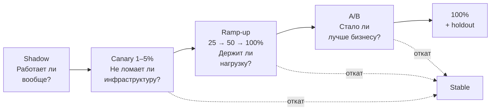

# Стратегии выкатки

> **Зачем эта глава.** Модель прошла все гейты CI, метрика на отложенной выборке выросла на 1.2%,
> артефакт лежит в реестре. Остался последний шаг — и именно на нём теряют деньги: новая версия
> в проде отвечает медленнее, ест вдвое больше памяти, а на сегменте мобильных пользователей
> отдаёт вероятности, сдвинутые на 0.15 вверх. Здесь — лестница выкатки от тени до полного
> трафика: что именно проверяет каждая ступень, какими числами формулируются критерии продвижения
> и отката, как устроены feature flags для моделей и почему кнопка «откатить» должна работать
> за секунды, а не за деплой.

**Уровень:** 🎯 middle → 🧠 middle+
**Предварительно нужно:** [CI/CD для ML](07-ci-cd-for-ml.md), [архитектуры сервинга](05-serving-architectures.md), [Docker и Kubernetes](06-docker-and-k8s.md), [упаковка модели](04-model-packaging.md), [дизайн эксперимента](../10-ab-testing/01-experiment-design.md)
**Время на проработку:** ~4 часа (чтение + собрать канареечный пайплайн на своём сервисе)

---

## Карта главы

- [1. Что мы катим: две независимые оси](#1-что-мы-катим-две-независимые-оси)
- [2. Пять стратегий на одной оси риска](#2-пять-стратегий-на-одной-оси-риска)
- [3. Shadow: что именно проверяем](#3-shadow-что-именно-проверяем)
- [4. Canary: критерии продвижения в числах](#4-canary-критерии-продвижения-в-числах)
- [5. Blue-green и цена мгновенного переключения](#5-blue-green-и-цена-мгновенного-переключения)
- [6. A/B: выкатка как измерение](#6-ab-выкатка-как-измерение)
- [7. Ramp-up: расписание ступеней](#7-ramp-up-расписание-ступеней)
- [8. Feature flags для моделей](#8-feature-flags-для-моделей)
- [9. Автоматический откат](#9-автоматический-откат)
- [10. Чек-лист выката модели: 15 пунктов](#10-чек-лист-выката-модели-15-пунктов)
- [11. Подводные камни](#11-подводные-камни)
- [12. Проверь себя](#12-проверь-себя)
- [13. Практика](#13-практика)
- [14. Что читать дальше](#14-что-читать-дальше)

> 🌱 **База.** Если тема новая, минимальный маршрут: §2 (сводная таблица стратегий),
> §4 (канарейка — то, чем пользуются каждый день) и §10 (чек-лист). Одна мысль, которую
> стоит унести целиком: **выкатка модели — это не проверка «сломалось или нет», а измерение
> при контролируемой доле риска**, и ступени лестницы отличаются тем, какой вопрос они закрывают.

---

## 1. Что мы катим: две независимые оси

В обычном бэкенде выкатка — это один артефакт: образ с кодом. В ML-сервисе артефактов два,
и они меняются независимо.

| Что изменилось | Пример | Чем катится | Время отката |
|---|---|---|---|
| Только веса модели | переобучили тот же пайплайн на свежих данных | смена версии в реестре, hot-reload или флаг | 5–30 с |
| Только код сервиса | новый эндпоинт, апгрейд FastAPI, тюнинг пула | rolling update образа | 3–10 мин |
| Код признаков | добавили фичу, поменяли импутацию пропусков | образ + новая модель одновременно | 3–10 мин |
| Рантайм инференса | перешли с PyTorch на ONNX Runtime | образ, обычно с shadow-прогоном | 3–10 мин |

Разделение важно по двум причинам. Первая — **скорость отката**: если веса меняются флагом,
а не деплоем, вы возвращаетесь к прошлой версии за время, пока сервис перечитывает конфиг.
Вторая — **атомарность**: код препроцессинга и модель связаны контрактом. Выкатили новый код
признаков со старой моделью — получили train/serve skew: модель обучалась на одних значениях,
а получает другие, и никакой тест это не поймает, потому что сервис отвечает валидным JSON.
Поэтому веса и код признаков катятся **вместе, одним артефактом**, а версия модели содержит
ссылку на версию кода препроцессинга (см. [упаковку модели](04-model-packaging.md)).

Теперь главное отличие от обычного релиза. Для кода есть понятие «правильно»: тест либо зелёный,
либо красный. Для модели правильного ответа нет — есть распределение ответов. Новая версия
не «падает», она отдаёт вероятности, сдвинутые на 0.03, и вы узнаёте об этом через неделю
по просадке конверсии. Отсюда следует принцип, на котором стоит вся глава:

> **Выкатка модели — это не проверка, а измерение.** Мы не спрашиваем «сломалось или нет»,
> мы сравниваем два распределения при контролируемой доле риска.

> 💬 **На собеседовании.** Спросят: «Модель переобучилась на свежих данных, метрика офлайн та же.
> Нужна ли полная процедура выкатки?» Хороший ответ: да, но урезанная. Офлайн-метрика не ловит
> инженерные регрессии: изменилось число деревьев — выросла латентность; поменялся словарь
> категорий — выросла память; попала битая партиция — сдвинулось распределение предсказаний.
> Минимум: канарейка на 5% с контролем p99, доли ошибок и среднего предсказания в течение
> 30–60 минут. Плохой ответ: «данные те же, пайплайн тот же, катим сразу на 100%» — именно так
> в прод уезжают модели, обученные на половине выборки из-за упавшего джоба.

---

## 2. Пять стратегий на одной оси риска

Стратегии не конкурируют — они выстраиваются в лестницу, где каждая ступень отвечает
на свой вопрос. Ключ к пониманию: **чем позже вопрос, тем дороже ответ**.



Сводная таблица — то, что стоит держать в голове на собеседовании:

| Стратегия | Что проверяет | Чего **не** проверяет | Стоимость | Когда применять |
|---|---|---|---|---|
| **Shadow** (теневой трафик) | работоспособность на реальных данных, латентность, память, распределение предсказаний, train/serve skew | качество (нет отклика пользователя), бизнес-эффект | +10–100% железа под теневую копию; риск побочных эффектов | новый рантайм, новая архитектура, первый выход модели в прод |
| **Canary** (1–5% трафика) | стабильность под реальной нагрузкой: ошибки, хвосты латентности, ресурсы, ранние прокси качества | долгосрочное качество, эффект на медленные бизнес-метрики | ~0 (часть существующих подов) + инфраструктура анализа | практически любая выкатка, всегда |
| **Blue-green** | атомарность переключения и мгновенный откат | постепенность: либо все пользователи, либо никто | ×2 железа на время переключения | несовместимые версии, миграция индекса, требование «откат за 10 секунд» |
| **A/B** | бизнес-эффект и качество модели | инженерную стабильность — её проверяют раньше | недели календарного времени + платформа экспериментов | смена модели, влияющая на продуктовую метрику |
| **Ramp-up** | всё вместе, ступенчато, с контролем на каждой ступени | — | только время | комбинируется со всеми; это способ прохождения лестницы |

> ⚠️ **Типичная ошибка.** Использовать A/B как единственную стратегию: «выкатим на 50/50
> и посмотрим». A/B отвечает на вопрос о продуктовом эффекте и требует недель. За это время
> инженерная регрессия (утечка памяти, деградация p99) успеет испортить впечатление половине
> пользователей. Инженерные вопросы закрываются за часы shadow и канарейкой — до того, как
> начинается измерение бизнес-эффекта.

---

## 3. Shadow: что именно проверяем

Теневая выкатка (shadow deployment, dark launch) — копия запроса уходит на новую версию,
её ответ **выбрасывается**, пользователь видит ответ стабильной версии.

### Механизм

Два варианта. **На уровне сети** — зеркалирование в сервис-меше или ingress. Для Istio:

```yaml
apiVersion: networking.istio.io/v1beta1
kind: VirtualService
metadata:
  name: ranker
spec:
  hosts: ["ranker"]
  http:
    - route:                      # весь боевой трафик по-прежнему на stable
        - destination:
            host: ranker
            subset: stable
          weight: 100
      mirror:                     # копия уходит сюда, ответ игнорируется
        host: ranker-shadow
        subset: candidate
      mirrorPercentage:
        value: 10.0               # 10% запросов; 100% требует второй копии кластера
      timeout: 200ms
```

Важное свойство: Istio дублирует запрос «fire-and-forget» — ответ теневого сервиса не влияет
ни на латентность, ни на код ответа основного пути. Заголовок `Host` при этом получает
суффикс `-shadow`, что удобно для разделения логов.

**На уровне приложения** — когда меша нет или нужно сравнивать ответы попарно:

```python
# Теневой вызов внутри сервиса. Главное правило: основной путь не ждёт кандидата.
import asyncio
import logging
from prometheus_client import Histogram, Counter

log = logging.getLogger("shadow")

SHADOW_DIFF = Histogram(
    "shadow_score_abs_diff", "Модуль расхождения скоров stable и candidate",
    buckets=(0.001, 0.005, 0.01, 0.05, 0.1, 0.25, 0.5, 1.0),
)
SHADOW_TOP1 = Counter("shadow_top1_total", "Совпал ли топ-1 у двух версий", ["match"])
SHADOW_FAIL = Counter("shadow_fail_total", "Отказы теневого вызова", ["reason"])

_sem = asyncio.Semaphore(32)      # тень не имеет права съесть весь event loop
_background: set[asyncio.Task] = set()


async def call_shadow(client, payload: dict, stable_scores: list[float]) -> None:
    async with _sem:
        try:
            resp = await asyncio.wait_for(
                client.post("http://ranker-shadow:8080/score", json=payload),
                timeout=0.3,      # жёстче прод-таймаута: тень не должна держать соединения
            )
            cand = resp.json()["scores"]
        except Exception as e:
            SHADOW_FAIL.labels(reason=type(e).__name__).inc()
            return

    n = min(len(cand), len(stable_scores))
    if n == 0:
        return
    # Логируем агрегаты, а не сами ответы: полное логирование теневых предсказаний
    # на 3000 RPS по 500 кандидатов — это единицы ТБ в сутки и отдельный счёт за хранение.
    SHADOW_DIFF.observe(max(abs(cand[i] - stable_scores[i]) for i in range(n)))
    top1_match = (max(range(n), key=cand.__getitem__)
                  == max(range(n), key=stable_scores.__getitem__))
    SHADOW_TOP1.labels(match=str(top1_match)).inc()


def fire_and_forget(coro) -> None:
    # Без сильной ссылки задача может быть собрана GC до завершения — известная ловушка asyncio.
    task = asyncio.create_task(coro)
    _background.add(task)
    task.add_done_callback(_background.discard)
```

### Что проверяем — конкретный список

Теневой прогон бесполезен, если по нему не собраны метрики. Минимальный набор:

| Что смотрим | Порог, при котором не идём дальше | Почему это ловится только здесь |
|---|---|---|
| p99 латентности кандидата | > SLA × 0.8 | нагрузочный тест синтетичен: реальные длины входов и распределение батчей другие |
| RSS-память после 6+ часов | рост >10% за 6 ч (утечка) | на коротком прогоне утечка не видна |
| Доля 5xx и таймаутов | > 0.1% | реальные данные содержат то, чего нет в тестах: пустые списки, эмодзи, 30 КБ строки |
| Средний скор и его дисперсия | сдвиг средней вероятности > 0.02 | прямой индикатор проблемы в данных или калибровке |
| PSI между распределениями предсказаний stable и candidate | > 0.1 — разбираться, > 0.25 — стоп | см. [дрифт](../09-monitoring/03-drift-detection.md) |
| Доля совпадения топ-1 (для ранжирования) | < 60% без объяснения | резкая смена выдачи = резкая смена бизнес-метрик |
| Доля признаков, взятых по дефолту | > 2% | признак не доехал до онлайн-хранилища — классический train/serve skew |
| Расхождение онлайн- и офлайн-значений признаков | > 1% строк с относительной разницей > 1e-6 | единственный надёжный способ поймать skew до пользователя |

Последняя строка заслуживает отдельного внимания. Берём выборку из теневых запросов, сохраняем
вектор признаков, посчитанный сервисом, и через сутки пересчитываем те же признаки офлайновым
пайплайном на точке во времени запроса. Расхождение больше эпсилона означает, что модель
в проде видит не то, на чём обучалась. Это самая частая причина «офлайн +1.2%, онлайн −0.4%».

### Чего shadow не проверяет и чем опасен

Тень **не измеряет качество**: пользователь не видел ответ кандидата, значит, нет клика,
нет покупки, нет отклика. Всё, что вы получаете, — согласованность и инженерные свойства.

И главная опасность: **побочные эффекты**. Теневой сервис работает с настоящими данными
и, если его не изолировать, сделает всё то же, что настоящий: спишет деньги, отправит пуш,
инкрементит счётчик показов в фичесторе (и отравит признаки для реальной модели), запишет
в общую таблицу логов, займёт квоту внешнего API.

> ⚠️ **Типичная ошибка.** Запустить shadow-копию с боевыми креденшелами. Симптом: после включения
> тени растёт число показов в счётчиках, обучающая выборка следующего дня содержит двойные
> события, а внешний геосервис начинает возвращать 429. Правильно: отдельный namespace,
> read-only доступ к хранилищам, отдельный префикс ключей в Redis, отключённые продюсеры
> в Kafka, отдельная квота на внешние вызовы. Проверяется это до включения — ревью списка
> всех side-effect'ов сервиса.

**Сколько держать тень.** Минимум одни полные сутки: нужно накрыть суточный цикл — ночной
батч, утренний пик, вечернее плато. Для сервиса с недельной сезонностью (B2B, будни против
выходных) — неделю. Для проверки утечки памяти — не меньше 12 часов непрерывной работы пода.

---

## 4. Canary: критерии продвижения в числах

Канарейка — небольшая доля **боевого** трафика на новую версию. В отличие от тени, ответ видит
пользователь, значит появляется отклик и появляется риск.

### Три группы, а не две

Наивная схема — сравнить канарейку со всем остальным продом. Так делать нельзя: поды прода
живут неделями, у них прогреты кэши, JIT и аллокатор; канареечный под запущен пять минут назад.
Разница метрик будет, но она будет о возрасте пода, а не о версии модели.

Правильная схема из практики SRE — **три группы**:

- **production** — весь остальной трафик, старая версия, старые поды;
- **baseline** — свежезапущенные поды со **старой** версией, столько же, сколько канареечных;
- **canary** — свежезапущенные поды с новой версией.

Сравниваем canary с baseline. Тогда всё, что различается, — это версия. Стоит это одного
лишнего пода на группу, и это лучшая инвестиция во всей главе: без baseline вы будете
ловить фантомные регрессии после каждого рестарта.

### Сколько трафика и как долго

Долю трафика выбирают не «на глаз», а из требования статистической различимости. Мы хотим
поймать удвоение доли ошибок. Для сравнения двух долей при неравных размерах групп:

$$
n_{\text{canary}} = \frac{\left(z_{1-\alpha/2} + z_{1-\beta}\right)^2 \left(p_1(1-p_1) + \dfrac{p_0(1-p_0)}{k}\right)}{(p_1 - p_0)^2}
$$

где $p_0$ — базовая доля ошибок (то, что сейчас в проде), $p_1$ — доля, которую мы хотим уверенно
детектировать, $k = n_{\text{baseline}} / n_{\text{canary}}$ — во сколько раз контрольная группа
больше канареечной, $z_{1-\alpha/2}$ — квантиль стандартного нормального распределения уровня
$1-\alpha/2$ (для $\alpha = 0.05$ это 1.96), $z_{1-\beta}$ — квантиль уровня $1-\beta$
(для мощности 80%, то есть $\beta = 0.2$, это 0.84), $n_{\text{canary}}$ — искомое число запросов
в канареечной группе.

📐 **Разбор на числах.** Базовая доля ошибок $p_0 = 0.001$ (0.1%), хотим ловить её удвоение
$p_1 = 0.002$, канарейка получает 1% трафика, значит $k = 99$:

$$
n_{\text{canary}} = \frac{(1.96 + 0.84)^2 \left(0.002 \cdot 0.998 + \dfrac{0.001 \cdot 0.999}{99}\right)}{(0.001)^2}
= \frac{7.84 \cdot 0.002006}{10^{-6}} \approx 15\,700
$$

При общем потоке 3000 RPS на канарейку приходится 30 RPS, то есть нужно $15\,700 / 30 \approx 524$
секунды — **около 9 минут**. Это нижняя граница; на практике ступень держат 15–30 минут,
чтобы накрыть циклы сборки мусора, обновление кэшей и разброс между зонами.

Второе ограничение — **хвосты**. На p99 приходится 1% наблюдений; чтобы в хвосте оказалось
хотя бы 100 точек и оценка не прыгала, нужно ≥ 10 000 запросов на ступень. При 30 RPS
это те же ~6 минут. Отсюда практическое правило: **ступень канарейки короче 15 минут
бессмысленна** — вы принимаете решение по шуму.

> 💬 **На собеседовании.** Спросят: «Сколько держать канарейку?» Хороший ответ: столько, чтобы
> набрать статистику на самой редкой отслеживаемой метрике. Считается из формулы для двух долей:
> при базовых 0.1% ошибок, 1% трафика и желании поймать удвоение — порядка 16 тысяч запросов
> на канарейку, что при 3000 RPS даёт ~9 минут, и я бы держал 20–30 минут, чтобы накрыть GC
> и прогрев кэшей. Плохой ответ: «полчаса» без объяснения, откуда полчаса, или «пока не убедимся,
> что всё хорошо» — это не критерий.

### Критерии продвижения

Метрики делятся на три класса по реакции:

| Класс | Метрика | Порог | Реакция |
|---|---|---|---|
| **Hard** | доля 5xx на канарейке | > 0.5% в окне 2 мин | автооткат немедленно |
| **Hard** | отношение p99 canary / baseline | > 1.3 два замера подряд | автооткат |
| **Hard** | OOMKilled или CrashLoopBackOff | ≥ 1 событие | автооткат |
| **Soft** | отношение p99 canary / baseline | > 1.1 | стоп продвижения, зовём дежурного |
| **Soft** | сдвиг средней вероятности | > 0.02 абсолютных | стоп продвижения |
| **Soft** | доля запросов с дефолтными фичами | > 2% | стоп продвижения |
| **Soft** | CPU / память на под | рост > 20% против baseline | стоп, пересчитать ёмкость |
| **Инфо** | CTR, конверсия | любое движение | не решает: выборки не хватает |

Последняя строка принципиальна. На 1% трафика за 20 минут бизнес-метрику измерить нельзя:
чтобы поймать эффект в 1% по CTR, нужны сотни тысяч наблюдений на группу и дни времени.
Пытаться остановить канарейку по «упавшему CTR» — значит реагировать на шум. Бизнес-метрики
измеряются в A/B (см. §6), канарейка отвечает только за инженерную стабильность и грубые
прокси качества.

### Рабочий манифест Argo Rollouts

```yaml
apiVersion: argoproj.io/v1alpha1
kind: Rollout
metadata:
  name: ranker
spec:
  replicas: 40
  strategy:
    canary:
      canaryService: ranker-canary       # Service, смотрящий только на новые поды
      stableService: ranker-stable
      maxSurge: "10%"
      maxUnavailable: 0                  # ёмкость не проседает во время выкатки
      analysis:
        templates:
          - templateName: ranker-guard
        startingStep: 1                  # анализ включается после первой паузы
        args:
          - name: canary-svc
            value: ranker-canary
          - name: stable-svc
            value: ranker-stable
      steps:
        - setWeight: 1
        - pause: {duration: 20m}         # ~16k запросов при 3000 RPS — см. расчёт выше
        - setWeight: 5
        - pause: {duration: 30m}
        - setWeight: 25
        - pause: {duration: 1h}
        - setWeight: 50
        - pause: {duration: 2h}          # первая ступень, где виден суточный профиль нагрузки
  template:
    spec:
      containers:
        - name: ranker
          image: registry.internal/ranker:2026.07.19-a3f1c2
          env:
            - name: MODEL_VERSION
              value: "ranker-v8"
          readinessProbe:                # под не получит трафик, пока модель не прогрета
            httpGet: {path: /ready, port: 8080}
            periodSeconds: 5
          startupProbe:                  # загрузка весов + прогревочный батч: до 3 минут
            httpGet: {path: /ready, port: 8080}
            failureThreshold: 36
            periodSeconds: 5
```

```yaml
apiVersion: argoproj.io/v1alpha1
kind: AnalysisTemplate
metadata:
  name: ranker-guard
spec:
  args:
    - name: canary-svc
    - name: stable-svc
  metrics:
    - name: error-rate
      interval: 1m
      count: 20                          # 20 замеров = 20 минут наблюдения на ступени
      failureLimit: 2                    # два плохих замера — провал анализа и откат
      successCondition: result[0] <= 0.005
      provider:
        prometheus:
          address: http://prometheus.monitoring.svc:9090
          query: |
            sum(rate(http_requests_total{service="{{args.canary-svc}}",code=~"5.."}[2m]))
            /
            clamp_min(sum(rate(http_requests_total{service="{{args.canary-svc}}"}[2m])), 1)

    - name: latency-ratio
      interval: 1m
      count: 20
      failureLimit: 2
      successCondition: result[0] <= 1.3
      provider:
        prometheus:
          address: http://prometheus.monitoring.svc:9090
          query: |
            histogram_quantile(0.99,
              sum by (le) (rate(http_request_duration_seconds_bucket{service="{{args.canary-svc}}"}[5m])))
            /
            histogram_quantile(0.99,
              sum by (le) (rate(http_request_duration_seconds_bucket{service="{{args.stable-svc}}"}[5m])))

    - name: prediction-shift
      interval: 2m
      count: 10
      failureLimit: 1
      successCondition: result[0] <= 0.02
      provider:
        prometheus:
          address: http://prometheus.monitoring.svc:9090
          query: |
            abs(
              sum(rate(ml_prediction_score_sum{service="{{args.canary-svc}}"}[5m]))
              / clamp_min(sum(rate(ml_prediction_score_count{service="{{args.canary-svc}}"}[5m])), 1)
              -
              sum(rate(ml_prediction_score_sum{service="{{args.stable-svc}}"}[5m]))
              / clamp_min(sum(rate(ml_prediction_score_count{service="{{args.stable-svc}}"}[5m])), 1)
            )

    - name: default-features
      interval: 2m
      count: 10
      failureLimit: 1
      successCondition: result[0] <= 0.02
      provider:
        prometheus:
          address: http://prometheus.monitoring.svc:9090
          query: |
            sum(rate(feature_default_total{service="{{args.canary-svc}}"}[5m]))
            / clamp_min(sum(rate(feature_lookup_total{service="{{args.canary-svc}}"}[5m])), 1)
```

`ml_prediction_score_sum` и `ml_prediction_score_count` — это стандартные ряды, которые
даёт `prometheus_client.Summary("ml_prediction_score", ...)`: их отношение и есть среднее
предсказание. `clamp_min(..., 1)` защищает от деления на ноль, когда трафика на канарейке
ещё нет, — без него анализ падает с `NaN` на первой же минуте и откатывает здоровый релиз.

---

## 5. Blue-green и цена мгновенного переключения

Blue-green: рядом с работающим окружением (blue) поднимается полная копия с новой версией
(green), трафик переключается разом сменой селектора в `Service` или таргет-группы в балансировщике.

```yaml
# Переключение — это одна строка. В этом вся идея.
apiVersion: v1
kind: Service
metadata:
  name: ranker
spec:
  selector:
    app: ranker
    slot: blue        # меняем на green — и весь трафик уходит на новую версию
  ports:
    - port: 8080
```

**Что это даёт.** Откат за секунды: green уже не получает трафик, blue ещё жив, возврат —
та же одна строка. Это единственная стратегия, где откат не требует ни пересборки, ни перезапуска.

**Что это стоит.** Двойная ёмкость на время переключения. Для CPU-сервиса на 40 подов это
неприятно, для GPU-сервиса на 8 картах A100 — это ещё 8 карт, то есть десятки долларов в час
и, часто, отсутствие свободных карт в квоте. Для GPU blue-green обычно заменяют канарейкой
с `maxSurge: 1`.

**Специфика ML: прогрев.** Переключить 100% трафика на непрогретое окружение — гарантированный
всплеск хвостов. Источники задержки при старте:

| Источник | Типичное время | Как убрать до переключения |
|---|---|---|
| Скачивание образа с CUDA (5–15 ГБ) | 40–200 с | предзагрузка образа на ноды, `imagePullPolicy: IfNotPresent` |
| Загрузка весов с S3 и в память GPU | 10–90 с | `startupProbe` с большим `failureThreshold` |
| Первый вызов: инициализация CUDA-контекста, автотюнинг cuDNN | 1–10 с | прогревочные запросы в `/ready` |
| Компиляция графа `torch.compile` | 30–120 с | прогрев на всех типичных формах входа (см. [оптимизацию инференса](09-inference-optimization.md)) |
| Наполнение кэша предсказаний | минуты–часы | принять и переключать постепенно |

Отсюда правило: **readiness-проба должна возвращать «готов» только после прогревочного
инференса**, а не после старта процесса. Иначе Kubernetes честно направит трафик в под,
который следующие полторы минуты будет компилировать граф.

**Когда blue-green действительно нужен**: несовместимые версии, которые не могут работать
одновременно (сменилась схема ключей в фичесторе, перестроен ANN-индекс с другой размерностью
эмбеддингов), либо жёсткое требование «откат за 10 секунд» от регуляторики или от бизнеса
в пиковый день.

---

## 6. A/B: выкатка как измерение

Канарейка и A/B часто путаются, потому что обе «делят трафик». Разница фундаментальная:

| | Canary | A/B |
|---|---|---|
| Вопрос | «не сломалось ли?» | «стало ли лучше?» |
| Единица разбиения | запрос | пользователь (устойчиво, sticky) |
| Длительность | 15 минут – несколько часов | 1–4 недели |
| Метрики | 5xx, латентность, ресурсы, сдвиг предсказаний | конверсия, GMV, удержание, guardrails |
| Решение | продвинуть или откатить | раскатить или отказаться от идеи |
| Кто смотрит | дежурный инженер, автоматика | аналитик, продукт |

Ключевая техническая деталь: в A/B разбиение должно быть **устойчивым по пользователю**.
Если делить по запросам, один человек за сессию увидит обе версии, эффект размажется,
а метрики вроде «доля сессий с покупкой» перестанут быть определёнными. Реализация —
детерминированное хеширование `user_id` (код в §8).

Обязательные проверки перед доверием результатам: A/A-прогон, контроль SRM (sample ratio
mismatch — фактическое соотношение групп отличается от заданного, признак дырявого разбиения),
guardrail-метрики. Всё это разбирается в [дизайне эксперимента](../10-ab-testing/01-experiment-design.md)
и [ловушках A/B](../10-ab-testing/04-pitfalls.md).

> 🧠 **Middle+.** Для рекомендаций и ранжирования у A/B есть неприятное свойство: **эффект
> новизны**. Первые 3–7 дней после смены модели выдача выглядит непривычно, пользователи
> кликают активнее, и метрика показывает завышенный эффект, который затем сходит на нет.
> Поэтому решение принимают не по первым дням, а по стабилизировавшемуся участку, а для
> долгосрочного эффекта держат постоянный **holdout** — 1–5% пользователей, которые год
> живут на старой версии системы. Это единственный способ измерить накопленный эффект серии
> релизов: сумма выигрышей отдельных A/B почти всегда больше, чем реальный годовой прирост.

---

## 7. Ramp-up: расписание ступеней

Ramp-up — это не отдельная стратегия, а дисциплина прохождения лестницы. Типовое расписание
для сервиса на 3000 RPS с командой на дежурстве:

| Ступень | Доля | Держим | Что реально проверяем на этой ступени |
|---|---|---|---|
| 0 | shadow, 10% зеркала | 24 ч | утечки памяти, skew признаков, распределение предсказаний |
| 1 | 1% | 20–30 мин | 5xx, латентность канарейки против baseline, отсутствие рестартов |
| 2 | 5% | 30–60 мин | стабильность на большем объёме, редкие ветки кода, ошибки внешних вызовов |
| 3 | 25% | 1–2 ч | ёмкость: хватает ли подов, не растёт ли очередь, поведение HPA |
| 4 | 50% | 2–4 ч, желательно через пик | поведение под реальным пиком нагрузки |
| 5 | 100% | сутки повышенного внимания | всё, включая ночной батч и утренний профиль |

Три правила, которые экономят инциденты:

1. **Шаг увеличивается не более чем в 5 раз.** 1 → 5 → 25 → 50 → 100. Прыжок с 5% сразу
   на 100% лишает вас ступени, на которой проявляются проблемы ёмкости.
2. **Откат всегда на ноль, а не на предыдущую ступень.** Если на 25% сработал гейт, вы не знаете,
   безопасны ли 5%: проблема могла копиться. Возвращаемся на stable, разбираемся, начинаем заново.
3. **Не катим в пятницу вечером и не катим ночью.** Ночью мало трафика — статистика не набирается,
   и некому реагировать. Оба правила выглядят суеверием ровно до первого ночного инцидента.

> ⚠️ **Типичная ошибка.** Считать, что ступень 50% проверяет ёмкость. Она проверяет её только
> если вы **не** увеличили число подов пропорционально. Классика: канареечный деплой поднимает
> дополнительные поды, суммарная ёмкость кластера на время выкатки в 1.5 раза выше обычной,
> всё летает, а через час после схлопывания старого деплоя сервис ложится под тем же трафиком.
> Проверять ёмкость нужно на конечной конфигурации: `maxSurge` в ноль хотя бы на последней
> ступени либо явный нагрузочный тест на конечном числе подов.

---

## 8. Feature flags для моделей

Постановка проблемы простая. Откат через деплой — это пересборка (2–5 мин), rolling update
(3–10 мин) и прогрев (1–3 мин): в сумме до 15 минут, в течение которых пользователи страдают.
Откат через флаг — время, за которое сервисы перечитают конфиг: 10–30 секунд.

**Флаг для модели** — это внешний по отношению к образу конфиг, определяющий, какая версия
модели обслуживает какую долю трафика и какие сегменты. Хранится в Consul / etcd / Redis /
объектном хранилище; сервис опрашивает его по таймеру.

Требования, без которых флаг превращается в источник инцидентов:

- **Детерминированное разбиение.** Один пользователь всегда попадает в одну ветку — на любом
  поде, после любого рестарта.
- **Независимость флагов.** Соль в хеше = имя флага. Иначе пользователь, попавший в канарейку
  одного эксперимента, систематически попадает в канарейку всех остальных, и эффекты
  переплетаются.
- **Kill switch.** Один флаг `ranker.enabled=false`, мгновенно переводящий сервис на фолбэк
  (популярное, эвристика, прошлая модель) без участия деплоя.
- **Аудит.** Кто, когда и на какое значение поменял. Первый вопрос на разборе инцидента —
  «что менялось за последний час», и половина ответов лежит именно здесь.
- **Живучесть при битом конфиге.** Не смогли распарсить — работаем на старом значении,
  а не падаем.

```python
# Роутер моделей на флагах: версия выбирается на каждый запрос, а не на деплое.
import hashlib
import json
import threading
import time
from dataclasses import dataclass, field
from pathlib import Path


@dataclass(frozen=True)
class Rule:
    model_version: str
    weight: int = 0                                  # доля трафика в процентах
    segment: dict = field(default_factory=dict)      # {"user_group": "internal"} — жёсткое условие


def bucket(unit_id: str, salt: str) -> int:
    """Стабильный бакет 0..99.

    blake2b, а не встроенный hash(): hash() для строк рандомизируется при каждом
    старте процесса (PYTHONHASHSEED), и один пользователь получал бы разные версии
    на разных подах — разбиение перестало бы быть устойчивым.
    """
    digest = hashlib.blake2b(f"{salt}:{unit_id}".encode(), digest_size=8).digest()
    return int.from_bytes(digest, "big") % 100


class ModelRouter:
    def __init__(self, config_path: str, salt: str, poll_interval: float = 10.0):
        self._path = Path(config_path)
        self._salt = salt
        self._lock = threading.Lock()
        self._rules: list[Rule] = []
        self._fallback = ""
        self._reload()                                # первый разбор — падаем громко, если конфиг битый
        threading.Thread(target=self._watch, args=(poll_interval,), daemon=True).start()

    def _reload(self) -> None:
        raw = json.loads(self._path.read_text())
        rules = [Rule(**r) for r in raw["rules"]]
        total = sum(r.weight for r in rules if not r.segment)
        if total != 100:
            raise ValueError(f"сумма весов процентных правил = {total}, ожидалось 100")
        with self._lock:
            self._rules, self._fallback = rules, raw["fallback"]

    def _watch(self, poll_interval: float) -> None:
        while True:
            time.sleep(poll_interval)
            try:
                self._reload()
            except Exception:
                continue                              # битый конфиг не должен ронять сервис

    def route(self, unit_id: str, context: dict) -> str:
        with self._lock:
            rules, fallback = self._rules, self._fallback
        # 1. Сегменты сильнее процентов: внутренние сотрудники всегда видят новую версию.
        for rule in rules:
            if rule.segment and all(context.get(k) == v for k, v in rule.segment.items()):
                return rule.model_version
        # 2. Процентное разбиение по устойчивому бакету.
        acc = 0
        for rule in rules:
            if rule.segment:
                continue
            acc += rule.weight
            if bucket(unit_id, self._salt) < acc:
                return rule.model_version
        return fallback
```

```json
{
  "fallback": "ranker-v7",
  "rules": [
    {"model_version": "ranker-v8", "segment": {"user_group": "internal"}},
    {"model_version": "ranker-v8", "weight": 5},
    {"model_version": "ranker-v7", "weight": 95}
  ]
}
```

Чтобы флаг работал, обе версии модели должны быть загружены в память пода. Для бустинга
на 200 МБ это ничего не стоит; для двух трансформеров по 12 ГБ на GPU — невозможно. Тогда
флаг маршрутизирует **между деплойментами**, а не внутри пода, и цена канарейки становится
ценой дополнительной карты.

> 💬 **На собеседовании.** Спросят: «Как откатить модель за 30 секунд?» Хороший ответ: держать
> версию модели в конфиге, который сервис перечитывает каждые 10–30 секунд, а не в переменной
> окружения образа; обе версии — в реестре и (если позволяет память) в памяти пода; отдельный
> kill switch на фолбэк. Откат тогда — это правка одного значения плюс время опроса, и он не
> зависит ни от CI, ни от доступности registry. Плохой ответ: «сделаем `kubectl rollout undo`» —
> это верно для кода, занимает минуты и не спасает, если проблема в весах, а не в образе.

**Флаги — это долг.** Каждый живой флаг удваивает число возможных состояний системы; пять
флагов — 32 конфигурации, из которых протестированы две. Дисциплина: у флага в тикете есть
дата удаления, а раз в квартал проводится ревизия — всё, что не удалено, удаляется вместе
с мёртвой веткой кода.

---

## 9. Автоматический откат

Автооткат нужен там, где человек не успевает: между «начал расти 5xx» и «половина пользователей
увидела ошибку» проходят минуты, а дежурный ещё должен проснуться и открыть дашборд.

**Что автоматизируем, а что нет.** Правило: автоматически откатываем по метрикам, которые
(а) считаются за минуты, (б) имеют однозначную интерпретацию, (в) не зависят от внешних
факторов. Доля 5xx — да. Конверсия — нет: она может упасть из-за маркетинговой акции
конкурента, а автооткат по ней будет откатывать здоровые релизы.

| Сигнал | Окно | Порог | Действие |
|---|---|---|---|
| Доля 5xx на канарейке | 2 мин | > 0.5% | автооткат |
| `OOMKilled` / рестарт пода | мгновенно | ≥ 1 | автооткат |
| p99 canary / p99 baseline | 5 мин | > 1.3 дважды подряд | автооткат |
| Доля запросов на фолбэк | 5 мин | > 5% | автооткат |
| Сдвиг средней вероятности | 10 мин | > 0.05 | автооткат |
| Сдвиг средней вероятности | 10 мин | 0.02–0.05 | стоп продвижения, алерт человеку |
| Guardrail-метрика в A/B | сутки | выход за границу | ручное решение |

Две детали, которые отличают работающий автооткат от флапающего.

**Игнорируйте первые минуты после старта.** Свежий под медленнее: холодные кэши, компиляция,
пустой пул соединений. Если окно анализа стартует в момент запуска, вы будете откатывать
каждый релиз. Argo Rollouts решает это `startingStep`, руками — задержкой перед первым замером
не меньше 2–3 минут.

**Окно должно быть длиннее всплеска, но короче терпения пользователя.** Практический диапазон
для онлайн-сервиса: 2–5 минут для hard-сигналов, 10–15 для мягких. Меньше — ловите шум,
больше — успеваете испортить впечатление.

```promql
# Готовое правило алерта: доля ошибок на канарейке против стабильной версии.
# for: 2m — чтобы одиночный всплеск при рестарте пода не считался регрессией.
- alert: CanaryErrorRateHigh
  expr: |
    (
      sum(rate(http_requests_total{service="ranker-canary",code=~"5.."}[2m]))
      / clamp_min(sum(rate(http_requests_total{service="ranker-canary"}[2m])), 1)
    )
    >
    (
      sum(rate(http_requests_total{service="ranker-stable",code=~"5.."}[2m]))
      / clamp_min(sum(rate(http_requests_total{service="ranker-stable"}[2m])), 1)
    ) + 0.003
  for: 2m
  labels: {severity: page, action: rollback}
  annotations:
    summary: "Канарейка ranker даёт на 0.3 п.п. больше 5xx, чем stable"
```

> 🧠 **Middle+.** Откат кода не откатывает данные. Если новая версия успела записать смещённые
> предсказания в лог, эти строки попадут в обучающую выборку следующей версии и отравят её.
> Если она инкрементила счётчики в фичесторе — признаки испорчены на глубину окна агрегации.
> Поэтому в план выката входит пункт «что делать с данными за период инцидента»: пометить
> диапазон времени флагом `deployment_id` в логах (это делается **до** выката, а не после)
> и исключать его при обучении. Ретроспективно вычистить такие строки почти невозможно —
> вы не знаете, где именно они начались.

Ещё один сигнал, о котором мало говорят: **частота автооткатов**. Если система откатывается
чаще раза в неделю, проблема не в выкатке, а в гейтах CI — регрессии должны отсеиваться
до прода. Автооткат — страховка, а не механизм контроля качества.

---

## 10. Чек-лист выката модели: 15 пунктов

Печатается и проходится глазами каждый раз. Пункты 1–7 — до выката, 8–12 — во время, 13–15 — после.

1. **Артефакт зафиксирован.** Версия модели в реестре, хеш образа, коммит кода, версия данных —
   всё записано в одном месте и связано друг с другом.
2. **Гейт-метрики CI пройдены** на неизменной валидационной выборке, и сравнение идёт
   с **текущей прод-моделью**, а не с прошлой обучающей попыткой.
3. **Контракт входа/выхода не изменился** либо изменение согласовано со всеми потребителями;
   схема ответа проверена контрактным тестом.
4. **Проверена совместимость признаков**: список фич модели совпадает со списком,
   который отдаёт онлайн-хранилище; типы и порядок совпадают.
5. **Нагрузочный тест на целевом RPS** прошёл на конечной конфигурации подов; известны p50/p99
   и потребление памяти на пике.
6. **Shadow отработал ≥ 24 часов**: нет утечки памяти, PSI предсказаний в норме, расхождение
   онлайн- и офлайн-признаков меньше эпсилона.
7. **План отката записан**: как именно откатываем (флаг / rollout undo / переключение слота),
   кто имеет права, сколько это займёт, что делаем с записанными данными.
8. **Baseline-группа поднята**: свежие поды со старой версией, столько же, сколько канареечных.
9. **Дашборд открыт**: canary против baseline по 5xx, p99, памяти, среднему предсказанию,
   доле дефолтных фич.
10. **Автооткат включён и проверен**: правила анализа применены, пороги соответствуют текущему
    базовому уровню ошибок (пороги пересматриваются, а не копируются из прошлого года).
11. **Ступени и время удержания заданы** и обоснованы расчётом статистики, а не «на глаз».
12. **Дежурный на связи** и знает, что идёт выкатка; выкатка не идёт ночью и не идёт в пятницу.
13. **Период выката помечен** в логах и в трекере (`deployment_id`, время начала и конца),
    чтобы отделить данные новой версии при следующем обучении.
14. **Сутки повышенного внимания** после 100%: проверяем ночной батч, утренний пик,
    отложенные метрики качества, когда придёт разметка.
15. **Старая версия остаётся доступной** ещё минимум неделю (образ не удалён, веса в реестре,
    флаг умеет вернуть её), а канареечный опыт зафиксирован письменно: что мониторили,
    что сработало, какие пороги менять.

---

## 11. Подводные камни

**Канарейка сравнивается со всем продом.**
Симптом: после каждого релиза анализ показывает рост p99 на 15%, но релиз откатывают, и метрика
не восстанавливается — потому что она и не росла.
Причина: канареечные поды свежие (холодные кэши, JIT, пустой пул соединений), прод-поды живут
неделями.
Что делать: поднимать baseline-группу из свежих подов со старой версией и сравнивать с ней.

**Shadow с боевыми правами.**
Симптом: после включения тени удваиваются счётчики показов, внешний API отдаёт 429,
в обучающей выборке появляются дубли событий.
Причина: теневой сервис выполняет те же побочные эффекты, что боевой.
Что делать: отдельный namespace, read-only креды, отдельный префикс ключей, отключённые
продюсеры; ревью списка всех записей и внешних вызовов до включения.

**Ступень слишком короткая.**
Симптом: релиз прошёл все ступени за 12 минут и упал на 100%.
Причина: пороги проверялись на выборках по 300–500 запросов, где доверительный интервал
доли ошибок шире самого порога.
Что делать: считать длительность ступени из формулы для двух долей; минимум 10 000 запросов
на ступень, если контролируется p99.

**Прогрев не учтён при blue-green.**
Симптом: в момент переключения p99 подскакивает в 5–10 раз на 1–3 минуты, потом приходит в норму.
Причина: `torch.compile`, инициализация CUDA-контекста и холодные кэши на непрогретом окружении.
Что делать: прогревочный инференс в readiness-пробе на всех типичных формах входа; для тяжёлых
моделей — заменить blue-green канареечным ramp-up.

**Веса модели вшиты в образ.**
Симптом: чтобы откатить модель, нужно пересобрать образ; откат занимает 15 минут вместо 30 секунд.
Причина: версия модели зафиксирована на этапе сборки.
Что делать: версия модели — в конфиге, читаемом на лету; образ содержит код, реестр — веса.
Компромисс: вшитые веса дают воспроизводимость и быстрый старт, поэтому часто держат
и то и другое — веса в образе как дефолт, флаг как переопределение.

**Флаги накапливаются.**
Симптом: в проде 14 флагов, никто не знает, какие комбинации живы; баг воспроизводится
у одного пользователя из тысячи.
Причина: флаг создать легко, удалить некому.
Что делать: дата смерти у каждого флага в тикете, квартальная ревизия, метрика «доля трафика
по каждой ветке флага» — ветка с нулём трафика удаляется вместе с кодом.

**Автооткат по бизнес-метрике.**
Симптом: релизы откатываются по ночам, когда падает конверсия, хотя причина — суточный профиль
аудитории.
Причина: в автомат заложена метрика, зависящая от внешних факторов и требующая дней на измерение.
Что делать: в автомат — только инженерные метрики и грубые прокси (сдвиг предсказаний,
доля фолбэков); бизнес-метрики — в A/B с человеческим решением.

---

## 12. Проверь себя

<details>
<summary><b>🎯 Вопрос.</b> Чем shadow-выкатка отличается от канареечной и что каждая из них проверяет?</summary>

**Короткий ответ.** В shadow ответ новой версии выбрасывается, пользователь его не видит:
проверяем работоспособность, латентность, память, распределение предсказаний и train/serve skew,
но не качество — отклика нет. В канарейке небольшая доля реального трафика получает ответ новой
версии: появляется риск для пользователей, зато появляются отклик и возможность сравнить
поведение под настоящей нагрузкой.

**Развёрнуто.** Порядок именно такой: shadow дешевле по риску, но дороже по железу (нужна вторая
копия) и ничего не говорит о качестве. Канарейка почти бесплатна по железу и отвечает на вопрос
об инженерной стабильности, но её выборки не хватает для бизнес-метрик. Ни та, ни другая
не заменяют A/B, который отвечает на вопрос «стало ли лучше» и требует недель. Shadow особенно
ценен при смене рантайма (PyTorch → ONNX Runtime), когда нужно убедиться, что новая реализация
даёт те же числа: тут прямое сравнение ответов на одинаковых входах — единственный способ.

**Чего ждёт интервьюер:** понимания, что стратегии отвечают на разные вопросы и выстраиваются
в лестницу по цене ошибки.

**Провал:** «shadow — это когда мы льём 50% трафика на новую модель».
</details>

<details>
<summary><b>🧠 Вопрос.</b> Как выбрать долю трафика и длительность канареечной ступени?</summary>

**Короткий ответ.** Из требования различить регрессию на выбранной метрике: по формуле для
сравнения двух долей. При базовом уровне ошибок 0.1%, желании поймать удвоение, доле 1%
и мощности 80% нужно порядка 16 тысяч запросов на канарейку — при 3000 RPS это ~9 минут,
на практике держат 20–30.

**Развёрнуто.** Второе ограничение — оценка хвостов: на p99 приходится 1% наблюдений, и чтобы
в хвосте было хотя бы 100 точек, нужно ≥ 10 000 запросов. Третье — циклы, которые нужно накрыть:
сборка мусора, обновление кэшей, ротация соединений. Отсюда практический минимум 15 минут
на ступень независимо от расчёта. Доля выбирается так, чтобы за приемлемое время набрать нужное
число запросов при приемлемом ущербе: 1% при 3000 RPS даёт статистику за минуты, 1% при 20 RPS —
только за сутки, и тогда доля должна быть больше.

**Чего ждёт интервьюер:** что вы считаете, а не называете «полчаса».

**Провал:** «пока не убедимся, что всё нормально».
</details>

<details>
<summary><b>🎯 Вопрос.</b> Модель на канарейке даёт p99 на 25% выше, чем прод. Ваши действия?</summary>

**Короткий ответ.** Сначала проверить, с чем сравниваю: если с прод-подами, которые работают
неделю, разница может быть возрастом пода, а не версией. Поднять baseline из свежих подов
со старой версией и сравнить с ним. Если разница сохраняется — стоп продвижения и профилирование.

**Развёрнуто.** Дальше — локализация: смотрим, где именно выросло время. Типичные причины
у ML-сервиса: выросло число деревьев или глубина; изменился размер входа (стало больше
кандидатов); добавился поход за новым признаком (сетевой round-trip 1–5 мс); поменялся рантайм
и потерялся батчинг; выросла память и начались паузы аллокатора. Разложение по стадиям
через трейсинг даёт ответ за минуты. Если регрессия объективна и невелика, решение принимает
бизнес: +25% p99 при бюджете с запасом можно принять ради роста качества, при впритык — нельзя.

**Чего ждёт интервьюер:** что вы не побежите откатывать не разобравшись и знаете про эффект
свежего пода.

**Провал:** «откатим и забудем» или «25% — это немного, катим дальше».
</details>

<details>
<summary><b>🧠 Вопрос.</b> Почему blue-green плохо подходит для GPU-сервиса?</summary>

**Короткий ответ.** Он требует двойной ёмкости на время переключения: 8 карт A100 превращаются
в 16, что дорого и часто упирается в квоту. Плюс мгновенное переключение 100% трафика
на непрогретое окружение даёт всплеск хвостов из-за компиляции графа и инициализации
CUDA-контекста.

**Развёрнуто.** Для CPU-сервиса на 40 подов дублирование терпимо: это минуты работы лишних
40 подов. Для GPU цена часа карты на порядок выше, а свободных карт может просто не быть.
Поэтому для GPU используют канареечный ramp-up с `maxSurge: 1`: добавляем одну карту, гоняем
на неё небольшую долю трафика, продвигаем ступенями. Если требование «мгновенный откат»
всё же жёсткое, компромисс — держать одну карту со старой версией до конца выката, чтобы
было куда вернуться.

**Чего ждёт интервьюер:** что вы считаете деньги и помните про прогрев.

**Провал:** обсуждать blue-green только в терминах «переключили селектор».
</details>

<details>
<summary><b>🎯 Вопрос.</b> Что такое feature flag для модели и зачем он, если есть `kubectl rollout undo`?</summary>

**Короткий ответ.** Флаг — внешний конфиг, определяющий, какая версия модели обслуживает какую
долю трафика; сервис перечитывает его каждые 10–30 секунд. Откат через флаг занимает секунды
и не зависит от CI и registry, откат через деплой — минуты и требует работающего пайплайна.

**Развёрнуто.** Флаг решает три задачи: мгновенный откат весов без пересборки; постепенный
ramp-up без изменения числа подов; kill switch на фолбэк. Требования: детерминированное
разбиение по `user_id` с солью, равной имени флага (иначе эксперименты коррелируют),
устойчивость к битому конфигу, аудит изменений. Ограничение: обе версии должны помещаться
в память пода, иначе флаг маршрутизирует между деплойментами. И флаги нужно удалять — каждый
живой флаг удваивает число непроверенных состояний системы.

**Чего ждёт интервьюер:** знания, что версия модели и версия кода откатываются разными
механизмами с разным временем.

**Провал:** «флаг — это переменная окружения» (её смена требует рестарта пода, то есть это деплой).
</details>

<details>
<summary><b>🧠 Вопрос.</b> Какие метрики можно доверить автооткату, а какие нет?</summary>

**Короткий ответ.** Автомату — то, что считается за минуты, однозначно интерпретируется
и не зависит от внешних факторов: доля 5xx, отношение p99 канарейки к baseline, рестарты
и OOM, доля фолбэков, грубый сдвиг распределения предсказаний. Бизнес-метрики — нет:
они медленные, шумные и двигаются по причинам вне вашего релиза.

**Развёрнуто.** Автооткат по конверсии будет откатывать здоровые релизы при любом изменении
профиля аудитории и не поймает настоящую регрессию раньше, чем через сутки. Правильная схема
трёхуровневая: hard-сигналы — автоматический откат за 2–5 минут; soft-сигналы (сдвиг
предсказаний, рост потребления ресурсов, рост доли дефолтных признаков) — остановка продвижения
и алерт человеку; бизнес-метрики — A/B и человеческое решение. Отдельно: окно анализа должно
начинаться через 2–3 минуты после старта пода, иначе прогрев будет читаться как регрессия.

**Чего ждёт интервьюер:** понимания, что автоматика должна быть быстрой и однозначной,
а неоднозначное — оставаться человеку.

**Провал:** «настроим автооткат по падению выручки».
</details>

<details>
<summary><b>🎯 Вопрос.</b> Мы откатили релиз через 20 минут после выката на 25%. Что нужно сделать с данными?</summary>

**Короткий ответ.** Пометить период работы новой версии в логах предсказаний и в событиях
(идентификатор релиза, время начала и конца) и исключить эти строки при обучении следующей
версии либо явно учесть, что четверть трафика обслуживалась другой моделью.

**Развёрнуто.** Проблема в петле обратной связи: логи показов и кликов за период инцидента
содержат отклик на предсказания сломанной модели. Если их взять в обучение как есть, ошибка
закрепится. Также могли пострадать счётчики в фичесторе (показы, просмотры), а они входят
в признаки с окном в дни — значит, испорчен не только период инцидента. Практика: писать
`deployment_id` и `model_version` в каждую строку лога предсказаний **всегда**, до любого
инцидента; тогда фильтрация — это одно условие в запросе. Ретроспективно восстановить границы
почти невозможно.

**Чего ждёт интервьюер:** понимания, что откат кода не откатывает данные.

**Провал:** «откатили — значит, всё вернулось как было».
</details>

<details>
<summary><b>🧠 Вопрос.</b> Офлайн-метрика выросла на 1.2%, а в A/B новая модель проигрывает. Где искать причину?</summary>

**Короткий ответ.** Три основные гипотезы: train/serve skew (в проде признаки считаются иначе,
чем при обучении), утечка в валидации (офлайн-оценка завышена) и расхождение офлайн-метрики
с продуктовой (оптимизировали не то). Первым делом — сравнение онлайн- и офлайн-значений
признаков на одних и тех же запросах.

**Развёрнуто.** Диагностический порядок: (1) сравнить распределения предсказаний офлайн и онлайн —
если они разные при одинаковых входах, проблема в рантайме или в препроцессинге; (2) сравнить
сами признаки, посчитанные сервисом, с пересчитанными офлайн на точке во времени — расхождение
даёт skew; (3) проверить валидацию на утечки и на временной сплит; (4) проверить сегменты:
средний прирост может складываться из роста на одном сегменте и падения на другом, который
важнее бизнесу; (5) проверить эффекты системы: изменилось разнообразие выдачи, сработали
бизнес-правила поверх модели, поменялась калибровка и сместились пороги ниже по пайплайну.
Именно для отсечения первых двух гипотез до A/B и нужен shadow.

**Чего ждёт интервьюер:** структурного разбора, а не одной гипотезы.

**Провал:** «офлайн-метрика плохая, надо взять другую» — без проверки skew.
</details>

<details>
<summary><b>🎯 Вопрос.</b> Сервис получает 20 RPS. Как выкатывать модель?</summary>

**Короткий ответ.** Канареечная схема по долям трафика здесь не работает: 1% — это один запрос
в пять секунд, статистика не наберётся никогда. Вариант: увеличить долю (сразу 20–50%),
удлинить ступени до часов и опереться на shadow, где можно зеркалировать 100% трафика
без риска.

**Развёрнуто.** На низком RPS меняется вся экономика выкатки. Плюсы: цена ошибки в абсолютных
числах мала, зеркалирование 100% трафика стоит одного пода. Минусы: любая метрика измеряется
долго, а автооткат по доле ошибок бессмысленен — одна ошибка из двадцати запросов даёт 5%.
Практическая схема: shadow на 100% в течение суток с попарным сравнением ответов (при низком
RPS можно логировать все пары целиком), затем blue-green или сразу 50% с ручным наблюдением
несколько часов. Пороги автоотката формулируются в абсолютных числах событий, а не в долях.

**Чего ждёт интервьюер:** что вы не применяете рецепт для 3000 RPS к сервису на 20 RPS.

**Провал:** «канарейка 1%, 15 минут» без пересчёта.
</details>

<details>
<summary><b>🧠 Вопрос.</b> Зачем нужен постоянный holdout, если каждый релиз уже прошёл A/B?</summary>

**Короткий ответ.** Чтобы измерить накопленный эффект серии релизов. Сумма выигрышей отдельных
A/B почти всегда больше реального годового прироста: мешают эффект новизны, множественные
сравнения, взаимодействие изменений и постепенный дрейф.

**Развёрнуто.** Holdout — 1–5% пользователей, которые долго (квартал, год) живут на зафиксированной
версии системы. Сравнение с ними даёт честную оценку суммарного эффекта всех изменений.
Практика показывает, что она систематически ниже суммы отдельных A/B: часть эффектов
перекрывается, часть была шумом, прошедшим порог значимости, часть исчезла после привыкания
пользователей. Издержки holdout реальны — эти пользователи получают худший продукт, — поэтому
группу делают маленькой и периодически обновляют. Подробнее — в главе про
[сложные схемы экспериментов](../10-ab-testing/05-complex-designs.md).

**Чего ждёт интервьюер:** понимания разницы между эффектом одного релиза и накопленным эффектом.

**Провал:** «каждый A/B показал плюс, значит, суммарно у нас плюс на сумму».
</details>

---

## 13. Практика

**Задача 1. Расчёт ступеней (30 минут).**
Для своего сервиса выпишите: текущий RPS в пике, текущую долю 5xx, целевую детектируемую
регрессию. Посчитайте по формуле §4 число запросов и длительность для долей 1%, 5% и 25%.
*Сделано правильно: у вас таблица из трёх строк с обоснованными длительностями, и вы можете
объяснить, почему на 1% ступень длиннее, чем на 25%.*

**Задача 2. Канарейка с автооткатом (2 часа).**
Разверните `Rollout` из §4 на любом сервисе (подойдёт заглушка, отдающая случайное число).
Добавьте `AnalysisTemplate` с проверкой доли 5xx. Выкатите заведомо сломанную версию,
которая на 1% запросов отдаёт 500.
*Сделано правильно: rollout откатился сам, в `kubectl describe rollout` виден проваленный
анализ с именем метрики, и вы знаете, через сколько минут это произошло.*

**Задача 3. Роутер на флагах (1 час).**
Возьмите код `ModelRouter` из §8, напишите тест: 100 000 случайных `user_id`, конфиг 5/95.
Проверьте, что доля попавших в новую версию — 5% ± 0.2 п.п., что при повторном вызове результат
для того же `user_id` не меняется, и что при смене соли разбиение становится другим.
*Сделано правильно: три теста зелёные; вы можете объяснить, почему нельзя использовать
встроенный `hash()`.*

**Задача 4. Ревизия побочных эффектов (45 минут).**
Выпишите все записи и внешние вызовы вашего сервиса: базы, топики Kafka, счётчики, внешние API,
отправка уведомлений. Для каждого решите, что произойдёт при запуске теневой копии.
*Сделано правильно: список полный, и по каждой строке есть решение (отключить / отдельный
префикс / read-only / отдельная квота). Найдено минимум одно место, которое сломало бы
теневой прогон.*

**Задача 5. Разбор реального выката (40 минут).**
Возьмите последний выкат модели в вашей команде и пройдите по чек-листу из §10.
*Сделано правильно: найдено минимум четыре невыполненных пункта, и для двух из них написано,
как их закрыть на следующем выкате.*

---

## 14. Что читать дальше

- [Google SRE Workbook, глава «Canarying Releases»](https://sre.google/workbook/canarying-releases/) —
  первоисточник схемы с baseline-группой и разбор того, как выбирать метрики и длительность
  ступеней. Читать целиком, это 20 страниц.
- [Argo Rollouts: документация](https://argo-rollouts.readthedocs.io/en/stable/) —
  разделы Canary Strategy и Analysis. Практический стандарт для канареек в Kubernetes;
  примеры `AnalysisTemplate` там богаче, чем в этой главе.
- [Istio: Traffic Mirroring](https://istio.io/latest/docs/tasks/traffic-management/mirroring/) —
  как включить shadow за пять минут, если у вас есть меш.
- [Pete Hodgson. «Feature Toggles (aka Feature Flags)»](https://martinfowler.com/articles/feature-toggles.html) —
  классификация флагов по времени жизни и по динамичности, и главное — про то, как они
  превращаются в технический долг.
- [Martin Fowler. «BlueGreenDeployment»](https://martinfowler.com/bliki/BlueGreenDeployment.html) —
  короткая заметка-первоисточник термина; полезна разбором проблемы с состоянием и миграциями БД.
- **Chip Huyen. «Designing Machine Learning Systems» (O'Reilly, 2022), глава про деплой
  и мониторинг** — та же лестница выкатки, но с уклоном в связь с мониторингом качества.

---

⬅️ [CI/CD для ML](07-ci-cd-for-ml.md) | 🏠 [Оглавление](../index.md) | ➡️ [Оптимизация инференса](09-inference-optimization.md)
