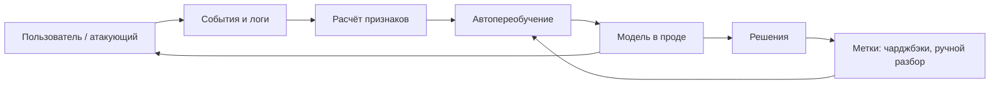

# Безопасность ML-систем

> **Зачем эта глава.** Пентест прошёл, зависимости обновлены, инъекций нет — а сервис всё равно
> выдаёт атакующему тот ответ, который тому нужен. Здесь разбираем угрозы, которые целятся не в
> код, а в статистику: состязательные примеры, отравление обучающей выборки, кражу модели через
> API и утечку данных из весов. После главы вы сможете построить модель угроз ML-сервиса, вывести
> FGSM руками и честно назвать цену защиты в качестве — потому что бесплатной защиты здесь нет.

**Уровень:** 🎯 middle → 🧠 middle+
**Предварительно нужно:** [нейросети и backprop](../03-deep-learning/01-neural-nets-and-backprop.md), [архитектуры сервинга](05-serving-architectures.md), [данные и feature store](03-data-and-feature-store.md), [дрифт данных](../09-monitoring/03-drift-detection.md)
**Как проработать:** чтение + реализация атаки + разбор модели угроз своего сервиса

---

## Карта главы

- [1. Чем атака на модель отличается от атаки на код](#1-чем-атака-на-модель-отличается-от-атаки-на-код) — почему обычный чек-лист безопасности не срабатывает
- [2. Состязательный пример как задача оптимизации](#2-состязательный-пример-как-задача-оптимизации) — что именно максимизирует атакующий
- [3. FGSM и PGD: откуда берётся знак градиента](#3-fgsm-и-pgd-откуда-берётся-знак-градиента) — вывод из линейного приближения
- [4. Атака руками: цифры до и после](#4-атака-руками-цифры-до-и-после) — 96.9% превращаются в 2.8%
- [5. Почему чужая модель обманывается тем же примером](#5-почему-чужая-модель-обманывается-тем-же-примером) — перенос и атака на чёрный ящик
- [6. Adversarial training и его цена](#6-adversarial-training-и-его-цена)
- [7. Отравление данных: конвейер уязвимее модели](#7-отравление-данных-конвейер-уязвимее-модели) — poisoning и backdoor
- [8. Кража модели через API](#8-кража-модели-через-api) — сколько запросов и чем это ограничивают
- [9. Membership inference: переобучение как утечка](#9-membership-inference-переобучение-как-утечка)
- [10. Дифференциальная приватность и её честная цена](#10-дифференциальная-приватность-и-её-честная-цена) — epsilon, DP-SGD, что теряем
- [11. Эмбеддинг — это не анонимизация](#11-эмбеддинг--это-не-анонимизация) — PII в признаках и векторах
- [12. Модель угроз для антифрода](#12-модель-угроз-для-антифрода) — разложение конкретного сервиса
- [13. Что из этого спрашивают на собеседовании](#13-что-из-этого-спрашивают-на-собеседовании)
- [14. Подводные камни](#14-подводные-камни)
- [15. Проверь себя](#15-проверь-себя)
- [16. Практика](#16-практика)
- [17. Что читать дальше](#17-что-читать-дальше)

---

## 1. Чем атака на модель отличается от атаки на код

Классическая уязвимость — это дефект реализации. SQL-инъекция существует, потому что кто-то
склеил строку вместо параметризованного запроса; переполнение буфера — потому что кто-то не
проверил длину. Дефект чинится патчем, после патча уязвимости нет.

С моделью так не выходит. Возьмите классификатор, который на тесте даёт 97% и не содержит ни
одной строки некорректного кода. Атакующий подбирает вход, на котором модель ошибается, — и
модель обрабатывает его **штатно**: считает те же скалярные произведения, возвращает валидный
ответ, не падает и не пишет ничего в лог ошибок. Мониторинг видит нормальный запрос. Патчить
нечего: ошибка не в реализации, а в том, что выученная разделяющая поверхность не совпадает с
той, которую вы имели в виду. Модель ведёт себя абсолютно правильно **по своему обучению** —
просто её обучение содержало меньше информации о мире, чем вы думали.

Отсюда два практических следствия. Первое: уязвимость нельзя закрыть, её можно только сдвинуть
в цене — сделать атаку дороже, чем выгода от неё. Второе: поверхность атаки включает не только
эндпоинт, но и всё, что попадает в обучение. Если ваш пайплайн переобучается на пользовательских
логах, то **любой пользователь имеет право записи в вашу обучающую выборку** — бесплатно и без
эксплойта.

> 💬 **На собеседовании.** Спросят: «Чем безопасность ML отличается от обычной безопасности
> приложения? Мы же и там и там защищаем сервис».
> Хороший ответ: в обычном приложении атакуют реализацию, и дефект чинится патчем; в ML атакуют
> статистику — модель выполняет ровно то, чему научилась, поэтому «исправить» нечего, можно
> только повышать стоимость атаки. Плюс появляются две поверхности, которых нет в обычном
> сервисе: обучающие данные (их поставляют те же пользователи, от которых мы защищаемся) и сама
> модель как актив — её крадут через API и из неё вытаскивают обучающие данные. Провальный
> ответ: «нужно валидировать входные данные» — валидный по формату вход и есть атака.

---

## 2. Состязательный пример как задача оптимизации

Формализуем. Есть модель $f_\theta: \mathbb{R}^d \to \mathbb{R}^K$ с параметрами $\theta$,
объект $x \in \mathbb{R}^d$ с истинной меткой $y$, функция потерь $L$. Атакующий ищет добавку
$\delta$, которая ломает предсказание, оставаясь незаметной:

$$
\max_{\delta} \; L\big(f_\theta(x + \delta),\, y\big)
\qquad \text{при} \qquad \|\delta\|_p \le \varepsilon, \quad x + \delta \in [0,1]^d
$$

где $\delta \in \mathbb{R}^d$ — возмущение, $\varepsilon > 0$ — бюджет атаки, $\|\cdot\|_p$ —
норма, задающая, что считать «незаметным», а условие $x+\delta \in [0,1]^d$ — требование
остаться в допустимой области (пиксель не бывает отрицательным, сумма транзакции тоже).

Обратите внимание на форму: это в точности задача обучения, только знак другой и оптимизируем
не $\theta$, а $x$. Тем же градиентным спуском, той же автоматической производной, теми же
библиотеками. Всё, что делает обучение эффективным, делает эффективной и атаку.

Норма $p$ — не деталь, а определение угрозы. $\ell_\infty$ ограничивает **каждую** координату
(классика для картинок: изменить каждый пиксель максимум на 8/255); $\ell_2$ — суммарную
энергию возмущения; $\ell_0$ — число изменённых координат (атака «поменяй один пиксель» или
«подмени два признака в заявке»). Для табличных данных ни одна из трёх не подходит честно:
там ограничение содержательное — какие признаки атакующий вообще способен менять и во что ему
это обходится. Сумму перевода он меняет свободно, возраст аккаунта — нет.

---

## 3. FGSM и PGD: откуда берётся знак градиента

Задача из раздела 2 в общем случае невыпуклая. Первый практичный ответ — **FGSM** (Fast Gradient
Sign Method, Goodfellow, Shlens, Szegedy, 2015): решить её приближённо за один шаг.

Разложим потери в точке $x$ по Тейлору до первого порядка, обозначив $g = \nabla_x L(f_\theta(x), y)$:

$$
L\big(f_\theta(x+\delta), y\big) \;\approx\; L\big(f_\theta(x), y\big) \;+\; g^\top \delta
$$

Первое слагаемое от $\delta$ не зависит, значит максимизировать надо $g^\top\delta$ при
$\|\delta\|_\infty \le \varepsilon$. Задача распадается на координаты: каждое $\delta_j$ входит
в сумму отдельным слагаемым $g_j\delta_j$ и ограничено только своим $|\delta_j| \le \varepsilon$.
Максимум каждого слагаемого достигается на границе — $\delta_j = \varepsilon\,\operatorname{sign}(g_j)$.
Складывая, получаем прирост потерь $g^\top\delta = \varepsilon\|g\|_1$ и саму атаку:

$$
x^{\text{adv}} \;=\; x \;+\; \varepsilon\,\operatorname{sign}\big(\nabla_x L(f_\theta(x), y)\big)
$$

> 📐 **Разбор формулы.** Знак градиента, а не сам градиент, — не «эвристика для стабильности».
> Это точное решение линеаризованной задачи под ограничением $\ell_\infty$: раз бюджет по каждой
> координате одинаков, выгоднее всего сдвинуть каждую на всю величину $\varepsilon$ в ту сторону,
> куда растут потери. Теперь главное — прирост потерь равен $\varepsilon\|g\|_1$, то есть
> $\varepsilon \cdot d \cdot \overline{|g_j|}$, где $d$ — размерность входа, а $\overline{|g_j|}$ —
> средний модуль координаты градиента. Возмущение ограничено по максимуму числом $\varepsilon$
> и не растёт с размерностью, а эффект растёт **линейно по $d$**. Вот и весь ответ на вопрос
> «почему такое маленькое возмущение даёт такой большой эффект»: в 64-мерном входе оно
> накапливается 64 раза, в 150 528-мерной картинке ImageNet — 150 528 раз. Никакой мистики,
> одна линейность.

FGSM — один шаг, поэтому он недооценивает силу атаки. **PGD** (projected gradient descent,
Madry et al., 2018) делает то же самое итеративно, каждый раз возвращаясь в допустимый шар:

$$
x^{(t+1)} \;=\; \Pi_{\mathcal{B}_\varepsilon(x)\,\cap\,[0,1]^d}\Big(x^{(t)} + \alpha\,\operatorname{sign}\big(\nabla_x L(f_\theta(x^{(t)}), y)\big)\Big)
$$

где $\alpha$ — шаг (обычно $\varepsilon/4$ или меньше), $\mathcal{B}_\varepsilon(x)$ — шар радиуса
$\varepsilon$ вокруг исходного объекта, $\Pi$ — проекция на пересечение шара с допустимой
областью, $x^{(0)}$ — случайная точка внутри шара. PGD считается стандартом оценки устойчивости:
если модель держится против PGD с многими рестартами, она, скорее всего, держится вообще.
Если защиту тестировали только FGSM — это, как правило, повод не верить заявленной робастности.

---

## 4. Атака руками: цифры до и после

Соберём атаку целиком на маленькой модели: MLP на датасете `digits` (1797 картинок 8×8,
значения приведены в $[0,1]$).

```python
# FGSM и PGD на MLP: 64 -> 64 -> 10
import torch, torch.nn as nn
from sklearn.datasets import load_digits
from sklearn.model_selection import train_test_split

torch.manual_seed(0)
X, y = load_digits(return_X_y=True)
Xtr, Xte, ytr, yte = train_test_split(X / 16.0, y, test_size=0.3, random_state=0, stratify=y)
Xtr = torch.tensor(Xtr, dtype=torch.float32); ytr_t = torch.tensor(ytr)
Xte = torch.tensor(Xte, dtype=torch.float32); yte_t = torch.tensor(yte)

def make_model(seed, hidden=64):
    torch.manual_seed(seed)
    return nn.Sequential(nn.Linear(64, hidden), nn.ReLU(), nn.Linear(hidden, 10))

def fgsm(model, x, y, eps):
    x = x.clone().requires_grad_(True)
    g, = torch.autograd.grad(nn.functional.cross_entropy(model(x), y), x)
    return (x + eps * g.sign()).clamp(0, 1).detach()   # картинка обязана остаться картинкой

def pgd(model, x, y, eps, alpha, steps):
    x0 = x
    x = (x + torch.empty_like(x).uniform_(-eps, eps)).clamp(0, 1)   # случайный старт в шаре
    for _ in range(steps):
        x = x.clone().requires_grad_(True)
        g, = torch.autograd.grad(nn.functional.cross_entropy(model(x), y), x)
        x = (x0 + (x + alpha * g.sign() - x0).clamp(-eps, eps)).clamp(0, 1).detach()  # проекция
    return x

def acc(model, x, y):
    with torch.no_grad():
        return (model(x).argmax(1) == y).float().mean().item()

def train(model, adv_eps=None, epochs=60, seed=0):
    opt = torch.optim.Adam(model.parameters(), lr=1e-3)
    g = torch.Generator().manual_seed(seed)
    for _ in range(epochs):
        perm = torch.randperm(len(Xtr), generator=g)
        for i in range(0, len(Xtr), 64):
            idx = perm[i:i + 64]
            xb, yb = Xtr[idx], ytr_t[idx]
            if adv_eps is not None:            # adversarial training: половина батча — атака
                xb = torch.cat([xb, fgsm(model, xb, yb, adv_eps)]); yb = torch.cat([yb, yb])
            opt.zero_grad()
            nn.functional.cross_entropy(model(xb), yb).backward()
            opt.step()
    return model

A = train(make_model(1))
print("A clean acc      :", round(acc(A, Xte, yte_t), 4))
for eps in (0.05, 0.1, 0.2, 0.3):
    xa = fgsm(A, Xte, yte_t, eps)
    xp = pgd(A, Xte, yte_t, eps, alpha=eps / 4, steps=20)
    l2 = (xa - Xte).norm(dim=1).mean().item() / Xte.norm(dim=1).mean().item()
    print(f"eps={eps}: FGSM acc={acc(A, xa, yte_t):.4f}  PGD acc={acc(A, xp, yte_t):.4f}"
          f"  ||dx||2/||x||2={l2:.3f}")
```

```
A clean acc      : 0.9685
eps=0.05: FGSM acc=0.8426  PGD acc=0.8352  ||dx||2/||x||2=0.090
eps=0.1: FGSM acc=0.5185  PGD acc=0.4574  ||dx||2/||x||2=0.177
eps=0.2: FGSM acc=0.0278  PGD acc=0.0019  ||dx||2/||x||2=0.347
eps=0.3: FGSM acc=0.0000  PGD acc=0.0000  ||dx||2/||x||2=0.509
```

Читаем таблицу. При $\varepsilon = 0.1$ (каждый пиксель сдвинут максимум на десятую часть
диапазона, суммарное возмущение — 17.7% от нормы картинки) точность падает с 96.9% до 51.9%.
При $\varepsilon = 0.2$ от модели не остаётся ничего: 2.8% у FGSM и 0.2% у PGD — то есть модель
ошибается почти на **каждом** объекте, что хуже случайного угадывания (10%). Это не совпадение:
атака целенаправленно уводит от правильного класса, поэтому осмысленная модель под сильной
атакой работает хуже монетки.

И обратите внимание на разрыв между FGSM и PGD при $\varepsilon = 0.2$: 2.8% против 0.2%.
Двадцать шагов находят то, что один шаг пропускает. Именно поэтому оценивать защиту по FGSM —
самообман.

> ⌨️ **Руками.** Возьмите тот же код и сделайте атаку **целевой**: вместо максимизации потерь по
> истинной метке минимизируйте потери по метке `target=8`. Формула превращается в
> $x - \varepsilon\,\operatorname{sign}(\nabla_x L(f_\theta(x), 8))$. Посмотрите, при каком
> $\varepsilon$ доля объектов, классифицированных как «8», превысит 90%. Целевая атака обычно
> требует большего бюджета — это хороший повод объяснить себе, почему.

---

## 5. Почему чужая модель обманывается тем же примером

Всё, что мы делали, требует градиентов — то есть доступа к весам. Естественная реакция:
«у нас модель за API, атакующий весов не видит, значит защищены». Проверим это на тех же данных.
Обучим ещё две модели — MLP другой ширины с другой инициализацией и вообще линейную — и подадим
им примеры, построенные **только** по градиентам первой.

```python
B = train(make_model(2, hidden=128))                    # другая ширина, другая инициализация
C = train(nn.Sequential(nn.Linear(64, 10)), seed=3)     # вообще другая модель: линейная
print("B clean:", round(acc(B, Xte, yte_t), 4), " C(linear) clean:", round(acc(C, Xte, yte_t), 4))
for eps in (0.1, 0.2, 0.3):
    xa = fgsm(A, Xte, yte_t, eps)                       # градиенты брались ТОЛЬКО у A
    print(f"eps={eps}: перенос A->B acc={acc(B, xa, yte_t):.4f}  A->C acc={acc(C, xa, yte_t):.4f}")
```

```
B clean: 0.9759  C(linear) clean: 0.9278
eps=0.1: перенос A->B acc=0.5259  A->C acc=0.6630
eps=0.2: перенос A->B acc=0.0259  A->C acc=0.1741
eps=0.3: перенос A->B acc=0.0000  A->C acc=0.0037
```

Модель B никогда не видела атакующего и не участвовала в построении примеров — её точность
падает с 97.6% до 2.6%. Даже линейная модель C, у которой другое семейство гипотез, проседает
до 17.4%. Это **переносимость** (transferability), и она — центральный факт всей темы.

Объяснение, которое сейчас считается основным: разные модели, обученные на одних данных,
опираются на одни и те же **нелокально-полезные признаки**. В работе Ilyas et al. (2019) это
сформулировано жёстко: в данных есть «хрупкие» признаки (non-robust features) — статистически
предсказательные, но чувствительные к мелким сдвигам. Любая модель, минимизирующая ошибку, их
выучит, потому что они честно работают. Атака бьёт именно по ним, а раз признаки общие для всех
моделей на этих данных, то и атака общая. Состязательный пример — это не «баг конкретной сети»,
а свойство датасета.

Практический вывод жёсткий: **закрытость модели не является защитой**. Атакующему достаточно
обучить свою модель на похожих данных (или украсть вашу — раздел 8) и атаковать её. Стратегия
называется surrogate/substitute attack и работает даже на коммерческих API.

> 💬 **На собеседовании.** Спросят: «У атакующего нет доступа к весам, он видит только ответы
> API. Он опасен?»
> Хороший ответ: да, по трём причинам. Первая — переносимость: примеры, построенные на суррогатной
> модели, обученной на публичных данных того же домена, обманывают и вашу; это измеряется, и
> перенос между сетями одного домена часто выше 50%. Вторая — атаки чёрного ящика по одним
> только меткам (boundary attack, HopSkipJump) не требуют вероятностей вообще, только ответ
> «да/нет», и оценивают градиент численно. Третья — модель можно сначала украсть, а потом
> атаковать локально с полным доступом. Провальный ответ: «нет, у нас чёрный ящик».

---

## 6. Adversarial training и его цена

Самая надёжная известная защита — включить атаку в обучение. Madry et al. записали это как
седловую задачу:

$$
\min_{\theta}\; \mathbb{E}_{(x,y)\sim \mathcal{D}}\Big[\max_{\|\delta\|_\infty \le \varepsilon} L\big(f_\theta(x+\delta),\, y\big)\Big]
$$

где $\mathcal{D}$ — распределение данных, внутренний максимум решается PGD (или FGSM — дешевле
и слабее), внешний минимум — обычным SGD/Adam по получившимся примерам. Смысл: мы больше не
минимизируем средние потери на данных, мы минимизируем потери в **худшей точке окрестности
каждого объекта**.

```python
R = train(make_model(1), adv_eps=0.2)     # половина каждого батча заменяется на FGSM-примеры
print("robust clean acc :", round(acc(R, Xte, yte_t), 4))
for eps in (0.1, 0.2, 0.3):
    print(f"eps={eps}: robust FGSM acc={acc(R, fgsm(R, Xte, yte_t, eps), yte_t):.4f} "
          f" robust PGD acc={acc(R, pgd(R, Xte, yte_t, eps, eps/4, 20), yte_t):.4f}")
```

```
robust clean acc : 0.9611
eps=0.1: robust FGSM acc=0.7630  robust PGD acc=0.7593
eps=0.2: robust FGSM acc=0.4278  robust PGD acc=0.3574
eps=0.3: robust FGSM acc=0.0759  robust PGD acc=0.0130
```

Что получилось. При $\varepsilon = 0.2$ (то самое значение, на котором обучались) устойчивость
выросла с 2.8% до 42.8% против FGSM и с 0.2% до 35.7% против PGD. Плата: чистая точность упала
с 96.9% до 96.1%. При $\varepsilon = 0.3$, за пределами тренировочного бюджета, защита почти
не работает — 1.3% против PGD. Устойчивость не обобщается на радиусы, которых не было в обучении.

На этой игрушечной задаче цена (0.8 п.п.) кажется небольшой, и это ловушка масштаба. На CIFAR-10
у Madry et al. робастная WideResNet даёт около 87% чистой точности против примерно 95% у обычной —
разрыв в 8 пунктов. Плюс стоимость обучения: PGD с $k$ шагами делает $k+1$ проход вперёд-назад на
каждый батч, то есть обучение дорожает **в 5–10 раз**. Существует и теоретический результат
(Tsipras et al., 2019) о том, что на некоторых распределениях компромисс между робастностью и
точностью неустраним в принципе, а не по недосмотру инженера.

> 💬 **На собеседовании.** Спросят: «Если adversarial training работает, почему его не включают
> по умолчанию?»
> Хороший ответ: потому что он платит чистым качеством и деньгами. Минус несколько пунктов
> метрики на честном трафике и обучение в 5–10 раз дороже — это цена, оправданная там, где
> противник реально существует и мотивирован (антифрод, модерация, биометрия), и не оправданная
> там, где ошибки модели случайны (прогноз спроса, рекомендации фильмов). Плюс защита привязана
> к конкретной норме и радиусу: обученная под $\ell_\infty$, $\varepsilon = 8/255$ модель почти
> ничего не даёт против $\ell_2$-атак и против семантических изменений вроде поворота.
> Провальный ответ: «его и включают» — почти нигде не включают, и надо понимать почему.

> ⚠️ **Типичная ошибка.** Защищаться «маскировкой градиента»: округлять вероятности, добавлять
> недифференцируемый слой, шуметь на входе. Формально FGSM перестаёт работать, в отчёте появляется
> «робастность 90%» → атакующий берёт BPDA (обходит недифференцируемый блок его гладкой
> аппроксимацией) или EOT (усредняет градиент по шуму), и защита падает до нуля. Athalye et al.
> (2018) так сломали 7 из 9 защит, принятых на ICLR того года. Правильно: проверять защиту
> адаптивной атакой, которую строят **зная** про защиту, а не библиотечным FGSM.

---

## 7. Отравление данных: конвейер уязвимее модели

Все атаки выше происходят на инференсе. Гораздо опаснее те, что происходят раньше.

**Data poisoning** — атакующий подмешивает объекты в обучающую выборку, чтобы испортить качество
или сдвинуть границу в нужную ему сторону. **Backdoor** (закладка) — тонкая версия того же:
модель обучается вести себя нормально везде, кроме объектов с триггером, на которых она выдаёт
заданный класс. У BadNets (Gu et al., 2017) триггером был квадратик 3×3 в углу картинки; доли
отравленных примеров порядка 1% (а в ряде постановок и 0.1%) хватает, чтобы вероятность
срабатывания закладки превысила 90%.

Отдельно подчеркну то, из-за чего закладку не ловят: **на чистой валидации отравленная модель
неотличима от нормальной**. Все ваши метрики зелёные, A/B честный, никакой деградации. Триггер
знает только атакующий.

Почему уязвимая точка — именно конвейер данных, а не модель. В типичном проде цепочка выглядит
так: события пользователей → логи → расчёт признаков → автоматическое переобучение по расписанию.
В ней нет ни одного места, где человек смотрит на данные. Метки часто тоже приходят от
пользователей — чарджбэки, жалобы, клики, ручная разметка на краудсорсе. Итог: атакующий не
взламывает пайплайн, он им **пользуется по назначению**. Совершив тысячу дешёвых операций
определённого вида, он объявляет их нормой, и через два цикла переобучения модель с ним согласна.



Красная стрелка здесь — обратная связь `Решения → Метки → Обучение`: атакующий видит решения и
влияет на метки. Что с этим делают:

- **Происхождение данных** (data provenance). Каждая строка обучающей выборки должна отвечать на
  вопрос «откуда взялась и кем порождена». Без этого невозможно ни расследование, ни откат.
  Технически — версионирование датасетов и линеидж признаков, см. [feature store](03-data-and-feature-store.md)
  и [воспроизводимость](02-reproducibility-and-tracking.md).
- **Ограничение влияния одного источника.** Кап на число объектов от одного пользователя, IP,
  устройства в обучающей выборке. Дёшево и режет самые массовые сценарии.
- **Обучение на подмножествах.** Разбить данные на $k$ непересекающихся частей, обучить $k$
  моделей, ответ — голосованием (deep partition aggregation). Отравитель, контролирующий $m$
  объектов, влияет максимум на $m$ моделей из $k$; при $m \ll k$ голосование это гасит. Плата —
  падение качества каждой модели и рост стоимости обучения в $k$ раз.
- **Аудит и детекция.** Влияние объекта на модель (influence functions), спектральные сигнатуры
  закладок, кластеризация активаций предпоследнего слоя — отравленные примеры часто образуют
  отдельный компактный кластер. Практичнее и дешевле: [поиск аномалий](../02-classic-ml/18-anomaly-detection.md)
  по свежим данным перед каждым переобучением и алерт на резкий сдвиг распределения — тот же
  инструментарий, что для [дрифта](../09-monitoring/03-drift-detection.md).
- **Человек в цикле для крупных решений.** Переобучение, меняющее долю одобрений больше чем на
  X процентов, не выкатывается автоматически.

> 💬 **На собеседовании.** Спросят (это любимый вопрос в антифроде): «Как бы вы отравили нашу
> модель, если бы были мошенником?»
> Хороший ответ конкретный: я бы завёл сотню аккаунтов и месяц совершал ими совершенно легальные
> операции с той сигнатурой, которую собираюсь потом использовать в атаке — то же устройство,
> та же категория, тот же коридор сумм. Эти операции попадут в обучающую выборку с меткой
> «хорошо» (никаких чарджбэков не будет), и модель выучит эту сигнатуру как признак честности.
> Дальше провожу настоящую атаку с той же сигнатурой. Защита: кап на вклад одного источника,
> задержка включения свежих меток (чарджбэк приходит до 60 дней — значит и «хорошая» метка
> должна вызревать), мониторинг сдвига распределения одобрений по сегментам. Провальный ответ:
> «мы не даём доступ к обучающим данным» — доступ у него уже есть, он ваш пользователь.

---

## 8. Кража модели через API

Модель — это актив: вы заплатили за данные, разметку и обучение. Атакующий с доступом к API
пытается воспроизвести её у себя (**model extraction**), чтобы не платить за запросы, обойти
лицензию или — что важнее для безопасности — получить белый ящик и атаковать его локально.

Сколько запросов нужно, сильно зависит от того, что возвращает API. Tramèr et al. (USENIX
Security, 2016) показали крайний случай: если модель — логистическая регрессия на $d$ признаках
и API отдаёт вероятность, то каждый запрос даёт одно линейное уравнение на веса, и **$d+1$
запроса хватает, чтобы восстановить коэффициенты точно**, решив систему. Не приблизительно —
точно. Для деревьев решений там же описано извлечение структуры по ответам на аккуратно
подобранные входы. Для глубоких сетей точного восстановления нет, но функционально близкую копию
получают за десятки тысяч — единицы миллионов запросов, и стоимость этих запросов обычно на
порядки ниже стоимости исходного обучения.

Что реально ограничивает атаку:

| Мера | Что даёт | Чем платим |
|---|---|---|
| Rate limit и квоты на ключ | поднимает стоимость и время атаки | атакующий распределяет запросы по аккаунтам |
| Отдавать только топ-1 метку, без вероятностей | убирает уравнения, оставляет 1 бит на запрос | часть клиентов реально нуждается в скорах |
| Округление вероятностей до 2 знаков | ломает точное решение системы | ломает и калибровку для честных клиентов |
| Детекция аномальных паттернов запросов | ловит перебор около границы и покрытие пространства | ложные срабатывания на легальных батчах |
| Водяные знаки (watermarking) | доказать факт кражи постфактум | не предотвращает, только фиксирует |

Про водяные знаки стоит сказать точнее, потому что механизм неочевиден: это **намеренная
закладка**. Модель дообучают так, чтобы на секретном наборе входов (которых в природе не бывает)
она давала заранее выбранные странные ответы. Если у конкурента появилась модель, выдающая тот же
странный ответ на ваш секретный вход, — это статистическое доказательство происхождения. Защита
не превентивная, а юридическая.

> 🧠 **Middle+.** Отдача только метки не спасает так, как кажется. Модель можно извлекать и по
> одним меткам — просто медленнее: запросы концентрируют около границы принятия решения, где
> метка меняется, и каждый такой запрос несёт максимум информации. Работы вроде Knockoff Nets
> показали, что даже запросы **нерелевантными публичными изображениями** дают рабочую копию:
> атакующему не нужны ваши данные, ему нужны ваши ответы как разметка. Отсюда практический
> вывод: единственная мера с понятной экономикой — делать запрос дорогим (rate limit + цена),
> а не пытаться скрыть информацию в ответе.

---

## 9. Membership inference: переобучение как утечка

Вопрос, который звучит академично, пока не подставишь домен: «был ли этот конкретный человек в
вашей обучающей выборке?» Если модель обучалась на данных пациентов онкоцентра, положительный
ответ сам по себе раскрывает диагноз. Это **membership inference attack** (MIA).

Механика (Shokri et al., 2017): атакующий обучает **shadow-модели** на данных того же
распределения, зная про каждый объект, был ли он в обучении. На выходе shadow-моделей он видит
разницу: на объектах из обучения уверенность выше, а потери ниже, чем на новых. По этим парам
«вектор вероятностей → член/не член» обучается атакующий классификатор, который затем применяется
к ответам целевой модели.

Yeom et al. показали, что почти весь сигнал берёт даже простейшая атака: **порог на значение
функции потерь**. Если $L(f_\theta(x), y)$ меньше порога — объявляем объект членом обучающей
выборки. Отсюда прямая связь: преимущество атаки ограничено **разрывом обобщения** (generalization
gap) — разницей между потерями на train и на test. Модель, у которой train loss 0.01, а test loss
0.9, буквально кричит о своей обучающей выборке; модель с почти совпадающими потерями протекает
слабо.

Отсюда список того, что снижает утечку и одновременно является просто хорошей практикой:
регуляризация, ранняя остановка, dropout, аугментации, отказ от обучения до нулевой ошибки.
И один нюанс, который нужно понимать: «средняя точность атаки около 50%» не означает
безопасности. Атака может уверенно определять членство для **выбросов** — редких, нетипичных
записей, — а это ровно те люди, которым утечка вредит сильнее всего.

---

## 10. Дифференциальная приватность и её честная цена

Хорошие практики из предыдущего раздела снижают риск, но ничего не гарантируют. Гарантию даёт
**дифференциальная приватность** (differential privacy, Dwork et al.). Механизм $\mathcal{M}$
(в нашем случае — процедура обучения) удовлетворяет $(\epsilon, \delta)$-DP, если для любых двух
наборов данных $D$ и $D'$, отличающихся **одной записью**, и любого множества исходов $S$:

$$
\Pr[\mathcal{M}(D) \in S] \;\le\; e^{\epsilon}\,\Pr[\mathcal{M}(D') \in S] \;+\; \delta
$$

где $\epsilon \ge 0$ — бюджет приватности (чем меньше, тем строже; к радиусу атаки $\varepsilon$
из раздела 2 отношения не имеет), $\delta$ — допустимая вероятность нарушения гарантии (берут
порядка $1/n$ или меньше, где $n$ — число записей).

> 📐 **Разбор формулы.** Читайте её как «ответ почти не зависит от одной записи». Слева и справа —
> вероятности одного и того же исхода обучения на двух почти одинаковых датасетах. Если их
> отношение не превосходит $e^{\epsilon}$, то, глядя на результат, нельзя уверенно сказать, была
> ли ваша запись внутри: любой вывод, который атакующий делает про вас, он сделал бы почти с той
> же вероятностью, даже если бы вас в данных не было. При $\epsilon = 0$ распределения совпадают
> (идеальная приватность и нулевая полезность), при $\epsilon = 1$ отношение до 2.7 раз, при
> $\epsilon = 10$ — до 22 тысяч раз. Именно поэтому гарантия «$\epsilon = 10$» математически
> корректна и практически почти пуста в худшем случае.

Как это встраивают в обучение — **DP-SGD** (Abadi et al., 2016). Два действия на каждом шаге:

$$
\tilde g \;=\; \frac{1}{B}\left(\sum_{i=1}^{B} \frac{g_i}{\max\big(1,\; \|g_i\|_2 / C\big)} \;+\; \mathcal{N}\big(0,\; \sigma^2 C^2 I\big)\right)
$$

где $g_i = \nabla_\theta L(f_\theta(x_i), y_i)$ — градиент по **одному** объекту, $C$ — порог
клиппинга, $B$ — размер лота, $\sigma$ — множитель шума, $I$ — единичная матрица.

Первое действие — клиппинг: каждый индивидуальный градиент обрезается по норме до $C$, чем
ограничивается влияние одной записи на шаг (та самая чувствительность, которую нужно знать,
чтобы подобрать шум). Второе — добавление гауссова шума масштаба $\sigma C$. Суммарный $\epsilon$
за всё обучение считается аккаунтантом приватности (moments accountant / Rényi-DP) и растёт
с числом шагов.

Теперь честная цена, потому что её обычно замалчивают:

- **Качество.** На CIFAR-10 при обучении с нуля с $\epsilon$ порядка единиц точность держится в
  районе 60–70% против 95%+ без DP. Разрыв резко сокращается, если DP-обучение применяют как
  дообучение поверх предобученной на публичных данных модели, — это сегодня основной рабочий
  рецепт. На табличных задачах с большими $n$ потери меньше, на маленьких выборках — катастрофа.
- **Скорость и память.** Нужны **пообъектные** градиенты, а не усреднённый по батчу. Это в 2–10
  раз медленнее и заметно прожорливее по памяти (в PyTorch — `opacus`, использующая хуки и
  функциональные преобразования).
- **Хвосты.** DP защищает всех, но качество падает сильнее всего на редких подгруппах: их сигнал
  и так слаб, а шум одинаков для всех. Это документированный эффект непропорционального влияния
  на меньшинства.
- **Какие $\epsilon$ реально используют.** В научных статьях любят 1–8. В индустриальных
  развёртываниях телеметрии значения бывали заметно больше 10 на пользователя в день, что
  вызывало обоснованную критику. Ориентир для продуктовой задачи: $\epsilon \le 10$ — «есть
  осмысленная гарантия», $\epsilon \le 3$ — «строго и дорого».

> ⚠️ **Типичная ошибка.** Считать запись = пользователь. DP по умолчанию защищает **одну строку**.
> Если один пользователь дал 500 строк, его суммарная защита деградирует (формально — по правилу
> group privacy бюджет умножается на размер группы). Нужен **user-level DP**: группировать данные
> по пользователю и клиппить вклад пользователя целиком. Об этом забывают постоянно, а гарантия
> при этом превращается в декоративную.

> 💬 **На собеседовании.** Спросят: «Что означает epsilon = 3 в дифференциальной приватности?»
> Хороший ответ: что вероятность любого исхода обучения меняется не более чем в $e^3 \approx 20$
> раз при добавлении или удалении одной записи, — то есть по результату нельзя надёжно
> восстановить факт участия конкретной записи. Дальше сразу уточняющие вопросы, которые и ждут:
> при каком $\delta$, на какой единице (запись или пользователь) и на каком горизонте — бюджет
> расходуется композицией, и десять релизов модели с $\epsilon = 3$ каждый не дают $\epsilon = 3$.
> Провальный ответ: «данные анонимизированы» — DP не про анонимизацию данных, а про свойство
> алгоритма.

---

## 11. Эмбеддинг — это не анонимизация

Отдельная категория утечек — та, где никто не атакует: PII просто попадает туда, где его быть
не должно.

Самое частое — **PII в признаках**. Хэш телефона, полный e-mail, склеенный идентификатор
устройства в feature store; поле `comment` из формы, попавшее в текстовый признак; координаты с
точностью до пяти знаков. Хэширование идентификатора — это псевдонимизация, а не анонимизация:
пространство телефонных номеров мало, и хэш перебирается за минуты. Плюс любой хэшированный ключ
остаётся ключом для связывания наборов данных — на этом строится классическая деанонимизация
(Narayanan, Shmatikov, 2008, на данных Netflix Prize: сопоставление с публичными оценками IMDb
позволило идентифицировать конкретных подписчиков).

Второе — **эмбеддинги**. Инженерная интуиция «мы отдаём подрядчику не тексты, а векторы, значит
данные защищены» неверна, и это уже не гипотеза. Song и Raghunathan (CCS 2020) показали
восстановление значительной доли входных слов из эмбеддингов предложений, а также извлечение
атрибутов автора. Morris et al. («Text Embeddings Reveal (Almost) As Much As Text», 2023)
довели это до точного восстановления: их метод `vec2text` восстанавливает **дословно** около 92%
коротких текстов (32 токена) по одному только вектору. Эмбеддинг — это сжатое, но обратимое
представление, а не хэш.

Практический минимум: PII не попадает в признаки без явного решения и записи в реестр обработки;
эмбеддинги пользовательских текстов классифицируются тем же уровнем чувствительности, что и сами
тексты; логи предсказаний (а их пишут все, ради мониторинга) проходят маскирование перед записью;
доступ к векторному хранилищу — такой же контролируемый, как к базе с персональными данными.

> ⚠️ **Типичная ошибка.** Отдавать объяснения предсказания (SHAP, топ-признаки) во внешний API
> «для прозрачности» → атакующий получает частные производные модели почти даром: это резко
> ускоряет и извлечение модели, и подбор состязательного примера, а в кредитном скоринге ещё и
> раскрывает пороги. Правильно: объяснения — во внутренний интерфейс для операторов, наружу —
> заранее согласованный набор человекочитаемых причин отказа.

---

## 12. Модель угроз для антифрода

Соберём всё на конкретном сервисе. Антифрод: онлайн-скоринг транзакций, признаки из feature store,
метки приходят чарджбэками с задержкой до 60 дней, переобучение раз в неделю (архитектура —
см. [кейс антифрода](../11-system-design/04-case-fraud-detection.md)).

Модель угроз строится тремя вопросами: **что защищаем** (активы), **от кого** (нарушители),
**через что** (векторы). Активы: качество решений, обучающие данные, веса модели, персональные
данные клиентов. Нарушители: мошенник (мотив — деньги, ресурс — тысячи дешёвых транзакций),
конкурент (мотив — модель), инсайдер (мотив — данные, ресурс — доступ).

| Вектор | Что делает атакующий | Признаки, что это происходит | Контрмера |
|---|---|---|---|
| Уклонение (evasion) | подбирает сумму/устройство/время под границу, зондируя её мелкими операциями | много операций от одного источника у порога скора | нелинейные признаки на скорости и связях, ансамбль моделей, рандомизация порога, ограничение числа попыток |
| Отравление через обратную связь | накапливает «хорошую» историю с сигнатурой будущей атаки | рост доли одобрений в узком сегменте | кап на вклад источника, вызревание положительных меток, аномалии в свежих данных |
| Извлечение модели | перебирает параметры транзакций, читая одобрено/отклонено | покрытие пространства параметров, нетипичное для человека | rate limit на попытки, отсутствие подробной причины отказа наружу |
| Манипуляция признаками | подделывает device fingerprint, геолокацию, «возраст» аккаунта | расхождение между сигналами, которые должны согласовываться | разметить признаки по контролируемости атакующим и не давать управляемым большой вес |
| Утечка данных | вытягивает PII через объяснения, логи, эмбеддинги | обращения к объяснениям вне интерфейса оператора | маскирование логов, объяснения только внутрь, контроль доступа к feature store |
| Инсайдер / цепочка поставок | пишет в реестр моделей или подменяет артефакт | деплой без ревью, артефакт без подписи | подпись артефактов, ревью изменений модели, разделение прав, `safetensors` вместо `pickle` |

Последняя строка — единственная в таблице «обычная» уязвимость, и её надо назвать явно:
**загрузка модели из pickle — это выполнение произвольного кода**. `torch.load` и `joblib.load`
на недоверенном файле равносильны запуску чужого скрипта. Формат `safetensors` придуман ровно
поэтому; про упаковку артефактов — [упаковка модели](04-model-packaging.md).

Признак «разметить по контролируемости атакующим» стоит развернуть, потому что он полезен всегда,
а делают его редко. Разделите признаки на три группы: полностью подконтрольные атакующему (сумма,
текст комментария, user-agent), частично (геолокация, устройство — подделываются, но с затратами)
и неподконтрольные (возраст аккаунта, агрегаты по контрагенту, поведение сети). Если топ модели
по важности состоит из первой группы — вы построили не антифрод, а инструкцию по его обходу.

**Специфика LLM.** Если в сервисе есть языковая модель с инструментами, добавляется вектор,
которого нет в классическом ML: **prompt injection** — текст из недоверенного источника (документ
в RAG, письмо, страница) попадает в тот же канал, что и ваши инструкции, и модель не умеет
различать «данные» и «команды», потому что для неё это один поток токенов. Промптом это не
чинится: правильная защита — привилегии инструментов и подтверждения на действия. Подробно —
[безопасность и ограничители LLM](../05-llm/10-llm-safety-and-guardrails.md) и
[агенты и инструменты](../05-llm/08-agents-and-tools.md).

> 🌱 **База.** Если вы делаете первый ML-сервис и на всё это нет ресурса, минимальный набор такой:
> (1) PII не попадает в признаки и логи; (2) наружу отдаётся метка или огрублённый скор, не
> вероятности и не объяснения; (3) стоит rate limit; (4) артефакты моделей — не pickle;
> (5) есть алерт на резкое изменение распределения входов и доли положительных решений. Это
> закрывает большую часть массовых сценариев и стоит несколько дней работы.

---

## 13. Что из этого спрашивают на собеседовании

Честная калибровка, чтобы не готовить лишнее. Безопасность ML почти никогда не бывает отдельной
секцией — она всплывает внутри system design и в вопросах «а что может пойти не так».

| Грейд | Что спрашивают |
|---|---|
| 🌱 Junior | что такое состязательный пример; почему нельзя логировать персональные данные; что метки могут приходить от пользователей |
| 🎯 Middle | вывод FGSM и зачем нужен PGD; почему примеры переносятся; чем платит adversarial training; как ограничить кражу модели через API; «как бы вы отравили эту модель» |
| 🧠 Middle+ / Senior | определение DP через $\epsilon$ и что теряется при DP-SGD; record-level против user-level; membership inference и связь с разрывом обобщения; защита пайплайна данных; полная модель угроз сервиса с контрмерами и их ценой |

На системном дизайне ML-сервиса вопрос «какие у этой системы векторы атаки» — стандартный
follow-up в антифроде, модерации, биометрии и любых сервисах с деньгами. Ответ, состоящий из
таблицы «актив → нарушитель → вектор → контрмера → цена контрмеры», выделяет кандидата
моментально.

---

## 14. Подводные камни

**Робастность измерили одной атакой.**
Симптом: «модель держит 90% под атакой» в отчёте, разгром в реальности.
Причина: тестировали FGSM или библиотечным PGD с дефолтами, без адаптации под защиту.
Что делать: адаптивная атака, знающая про защиту; PGD с рестартами; отчёт всегда с указанием
нормы, радиуса и числа шагов — «робастность 40%» без этих трёх чисел не значит ничего.

**Защиту оценили только на средней метрике.**
Симптом: точность под атакой упала на 3 п.п., решили, что всё нормально.
Причина: атакующему не нужна средняя точность, ему нужен один проходящий кейс.
Что делать: смотреть на худшие сегменты и на стоимость успешной атаки, а не на среднее.

**Переобучение по расписанию без контроля данных.**
Симптом: качество на валидации стабильно, а доля одобрений в узком сегменте ползёт вверх.
Причина: обратная связь позволяет атакующему формировать обучающую выборку.
Что делать: кап на вклад источника, вызревание положительных меток, детекция аномалий в свежих
данных, ручной гейт на большие сдвиги долей решений.

**Чувствительные данные попали в логи предсказаний.**
Симптом: в хранилище мониторинга лежат сырые фичи с телефонами и адресами.
Причина: логирование фичей включили ради разбора инцидентов и забыли про маскирование.
Что делать: маскирование на этапе записи, срок хранения, отдельные права; см.
[что мониторить](../09-monitoring/01-what-to-monitor.md).

**DP включили, гарантию не посчитали.**
Симптом: в описании «обучаем с DP-SGD», значения $\epsilon$ никто назвать не может.
Причина: без аккаунтанта приватности и учёта числа шагов клиппинг с шумом — просто регуляризация.
Что делать: считать $(\epsilon, \delta)$ явно, фиксировать единицу защиты (запись или
пользователь) и учитывать композицию по всем релизам модели.

**Секретность приняли за защиту.**
Симптом: «модель закрыта, архитектура не публикуется — атака невозможна».
Причина: переносимость и извлечение делают закрытость слабым барьером.
Что делать: исходить из того, что атакующий получит функциональную копию, и проектировать так,
чтобы это не было катастрофой (принцип Керкгоффса в применении к ML).

---

## 15. Проверь себя

<details>
<summary><b>🌱 Вопрос.</b> Что такое состязательный пример и чем он отличается от обычной ошибки модели?</summary>

**Короткий ответ.** Это вход, специально подобранный так, чтобы модель ошиблась, при том что для
человека он неотличим от исходного. Обычная ошибка случайна и редка, состязательный пример
строится целенаправленно и находится почти для любого объекта.

**Развёрнуто.** Формально ищется $\delta$, максимизирующее потери при ограничении
$\|\delta\|_p \le \varepsilon$. Ключевое отличие от обычной ошибки — не в результате, а в
процессе: обычные ошибки лежат там, где модель неуверенна, а состязательные существуют и рядом с
объектами, где модель уверена на 99%. Практический вывод: доля ошибок на тесте ничего не говорит
о поведении под атакой, это две разные метрики.

**Чего ждёт интервьюер:** понимания, что это про целенаправленный поиск, а не про «модель иногда
ошибается».

**Провал:** «это выброс» — выброс приходит из данных, состязательный пример строится под модель.
</details>

<details>
<summary><b>🎯 Вопрос.</b> Выведите FGSM. Почему берут знак градиента, а не сам градиент?</summary>

**Короткий ответ.** Линеаризуем потери: $L(x+\delta) \approx L(x) + g^\top\delta$, где
$g = \nabla_x L$. Максимум $g^\top\delta$ при $\|\delta\|_\infty \le \varepsilon$ достигается
покоординатно на границе, то есть $\delta_j = \varepsilon\,\operatorname{sign}(g_j)$. Знак —
точное решение линеаризованной задачи под $\ell_\infty$, а не эвристика.

**Развёрнуто.** Ограничение $\ell_\infty$ независимо по координатам, поэтому задача распадается:
каждое слагаемое $g_j\delta_j$ максимизируется отдельно, и выгодно потратить весь бюджет
$\varepsilon$ по каждой координате. Прирост потерь равен $\varepsilon\|g\|_1$ — он растёт линейно
с размерностью входа, тогда как само возмущение по максимуму остаётся равным $\varepsilon$.
Отсюда и ответ на «почему маленькое возмущение так сильно ломает». Если бы ограничение было
$\ell_2$, оптимальным был бы нормированный градиент $\varepsilon\, g/\|g\|_2$, а не знак — норма
определяет вид атаки.

**Чего ждёт интервьюер:** связки «ограничение по норме → вид оптимального шага» и понимания роли
размерности.

**Провал:** «знак берут для стабильности градиента».
</details>

<details>
<summary><b>🎯 Вопрос.</b> Почему состязательные примеры переносятся на модель, которой атакующий не видел?</summary>

**Короткий ответ.** Потому что модели, обученные на одних данных, опираются на одни и те же
предсказательные, но хрупкие признаки. Атака бьёт по признакам датасета, а не по конкретным весам.

**Развёрнуто.** В формулировке Ilyas et al. (2019) в данных сосуществуют robust и non-robust
features; вторые статистически полезны, поэтому их выучивает любой добросовестный оптимизатор,
и они же ломаются от малого сдвига. Практическое следствие — атака на чёрный ящик: обучаем
суррогатную модель на данных того же домена, строим примеры на ней, применяем к цели. В нашем
эксперименте примеры, построенные на одном MLP, роняли независимо обученный MLP с 97.6% до 2.6%,
а линейную модель — до 17.4%. Отсюда вывод для дизайна: секретность модели не является защитой,
считайте, что у атакующего есть функциональная копия.

**Чего ждёт интервьюер:** упоминания общих признаков и surrogate-атаки.

**Провал:** «случайное совпадение» или «переносятся только между одинаковыми архитектурами».
</details>

<details>
<summary><b>🧠 Вопрос.</b> Заказчик просит «сделать модель робастной». Что вы ответите?</summary>

**Короткий ответ.** Сначала три уточнения: робастной к чему (норма и радиус), какой ценой в чистом
качестве и кто противник. Без них «робастность» — не требование, а пожелание.

**Развёрнуто.** Устойчивость всегда привязана к угрозе: модель, обученная под $\ell_\infty$ с
$\varepsilon = 8/255$, почти не защищена от $\ell_2$-атак и от семантических изменений. Дальше
цена: adversarial training роняет чистую точность (на CIFAR-10 порядка 95% → 87%) и удорожает
обучение в 5–10 раз из-за $k+1$ проходов на батч на внутренний максимум. Есть и теоретический
результат Tsipras et al. о неустранимости компромисса на некоторых распределениях. Поэтому
разговор ведём в терминах «сколько стоит успешная атака для противника» против «сколько мы теряем
на честном трафике», а не в терминах «сделать безопасно». Часто более дешёвые меры — ограничение
попыток, признаки, неподконтрольные атакующему, ансамбль, ручной разбор дорогих решений — дают
больший эффект на рубль.

**Чего ждёт интервьюер:** что вы переведёте разговор в экономику и уточните угрозу.

**Провал:** «включим adversarial training» без обсуждения цены и модели угроз.
</details>

<details>
<summary><b>🧠 Вопрос.</b> Как понять, протекают ли обучающие данные через модель?</summary>

**Короткий ответ.** Измерить membership inference: обучить shadow-модели, построить атакующий
классификатор на их выходах и оценить его AUC на целевой модели. Простейший вариант — порог на
значении функции потерь.

**Развёрнуто.** Сигнал берётся из того, что на обучающих объектах потери ниже, чем на новых, —
поэтому преимущество атаки ограничено разрывом обобщения. Модель с train loss 0.01 и test loss
0.9 протекает сильно. Смотреть надо не только на среднюю точность атаки: она может быть около
50% в среднем и при этом уверенно определять членство для выбросов — редких записей, которым
утечка вредит больше всего. Меры по возрастанию цены: регуляризация и ранняя остановка (бесплатно,
гарантий не даёт), ограничение детализации ответа API, DP-SGD с посчитанным $(\epsilon, \delta)$
(гарантия есть, цена — качество и скорость обучения).

**Чего ждёт интервьюер:** связи «переобучение → утечка» и понимания, что среднее скрывает риск
для хвостов.

**Провал:** «мы не отдаём данные, значит утечки нет» — утечка идёт через ответы модели.
</details>

<details>
<summary><b>🧠 Вопрос.</b> Чем DP-SGD отличается от обычного SGD и что мы за это платим?</summary>

**Короткий ответ.** Двумя операциями: клиппингом градиента **каждого объекта** по норме $C$ и
добавлением гауссова шума $\mathcal{N}(0, \sigma^2C^2I)$ к сумме. Платим качеством, скоростью и
памятью.

**Развёрнуто.** Клиппинг ограничивает вклад одной записи (задаёт чувствительность), шум делает
результат почти неотличимым при её замене — вместе это даёт $(\epsilon,\delta)$-DP, а суммарный
бюджет за обучение считает аккаунтант (moments accountant / Rényi-DP) и растёт с числом шагов.
Цена: пообъектные градиенты вместо усреднённого по батчу — обучение в 2–10 раз медленнее и
существенно тяжелее по памяти; качество на CIFAR-10 с нуля при малых $\epsilon$ порядка 60–70%
против 95%+ без DP (дообучение поверх публично предобученной модели сокращает разрыв в разы);
сильнее всего страдают редкие подгруппы. Отдельно — единица защиты: по умолчанию защищается
строка, а не пользователь, и для user-level DP надо клиппить вклад пользователя целиком.

**Чего ждёт интервьюер:** обеих операций, роли аккаунтанта и честного разговора о цене.

**Провал:** «добавляем шум в данные» — шум добавляется в градиенты, и без клиппинга гарантии нет.
</details>

<details>
<summary><b>🎯 Вопрос.</b> Как защитить модель от кражи через API?</summary>

**Короткий ответ.** Полностью — никак; задача в том, чтобы копия стоила дороже, чем она нужна
атакующему. Рабочий набор: rate limit и квоты, минимальная детализация ответа, детекция
аномальных паттернов запросов, водяные знаки для доказательства факта кражи.

**Развёрнуто.** Стоимость атаки зависит от того, что отдаёт API: при отдаче вероятностей для
логистической регрессии на $d$ признаках хватает $d+1$ запроса на точное восстановление весов
решением линейной системы (Tramèr et al., 2016); для глубокой сети функциональную копию получают
за десятки тысяч — миллионы запросов, что почти всегда дешевле исходного обучения. Отдача только
метки замедляет атаку, но не отменяет: запросы концентрируют около границы решения, а подходы
вроде Knockoff Nets используют даже нерелевантные публичные данные, получая разметку от вашей
модели. Водяной знак — намеренная закладка: на секретных входах модель даёт условленный ответ,
что позволяет доказать происхождение копии, но не мешает её сделать.

**Чего ждёт интервьюер:** понимания, что это экономика, а не бинарная защита, и связи «формат
ответа → информация на запрос».

**Провал:** «поставим капчу» без разговора о том, сколько информации отдаёт один ответ.
</details>

<details>
<summary><b>🎯 Вопрос.</b> Мы отдаём внешнему подрядчику эмбеддинги вместо текстов. Это безопасно?</summary>

**Короткий ответ.** Нет. Эмбеддинг — сжатое, но обратимое представление: из вектора восстанавливают
и отдельные слова, и целые короткие тексты.

**Развёрнуто.** Song и Raghunathan (CCS 2020) показали восстановление значительной доли входных
слов и вывод атрибутов автора из эмбеддингов предложений; Morris et al. (2023) методом `vec2text`
восстанавливают дословно около 92% текстов длиной 32 токена по одному вектору. Правильная рамка:
эмбеддинг пользовательских данных наследует уровень чувствительности исходных данных, и векторное
хранилище защищается как база с персональными данными. Если данные нужно реально обезличить,
нужны другие инструменты — удаление и замена PII до векторизации, агрегация, DP.

**Чего ждёт интервьюер:** знания, что обратимость эмбеддингов — измеренный факт, а не опасение.

**Провал:** «это же просто числа».
</details>

---

## 16. Практика

**Задача 1. FGSM и PGD на своей модели (1 час).**
Возьмите код из [§4](#4-атака-руками-цифры-до-и-после) и постройте кривую «точность против
$\varepsilon$» для FGSM и PGD с 5, 20 и 50 шагами.
*Критерий: кривые PGD лежат не выше FGSM на всех $\varepsilon$, между 20 и 50 шагами разница
меньше, чем между 5 и 20, и вы можете объяснить, почему сходимость наступает.*

**Задача 2. Перенос (45 минут).**
Обучите четыре модели разной архитектуры на одних данных и постройте матрицу 4×4 «на какой
строили → какую атакуем» при фиксированном $\varepsilon$.
*Критерий: диагональ заметно ниже остального, но недиагональные ячейки далеки от чистой точности;
вы можете назвать пару архитектур с наибольшим взаимным переносом и предположить причину.*

**Задача 3. Цена робастности (1 час).**
Обучите модель с adversarial training при $\varepsilon \in \{0.05, 0.1, 0.2, 0.3\}$ и постройте
график «чистая точность против робастной точности».
*Критерий: получена монотонная кривая компромисса, и вы можете указать точку, которую выбрали бы
для сервиса с ценой ошибки 1000 рублей за пропуск и 50 рублей за ложное срабатывание.*

**Задача 4. Backdoor своими руками (1 час).**
Отравьте 1% обучающей выборки: поставьте яркую точку в правый нижний пиксель и метку «0».
Измерьте чистую точность и долю срабатывания закладки на объектах с триггером.
*Критерий: чистая точность падает меньше чем на 1 п.п., а закладка срабатывает более чем в 90%
случаев — то есть стандартная валидация атаку не видит. Дальше попробуйте найти отравленные
примеры кластеризацией активаций предпоследнего слоя.*

**Задача 5. Модель угроз (45 минут, без кода).**
Возьмите свой рабочий сервис и заполните таблицу из [§12](#12-модель-угроз-для-антифрода):
актив → нарушитель → вектор → детект → контрмера → её цена.
*Критерий: минимум шесть строк, в каждой указана цена контрмеры в качестве, деньгах или сроках, и
хотя бы одна строка честно помечена «принимаем риск».*

---

## 17. Что читать дальше

- **Goodfellow I., Shlens J., Szegedy C. «Explaining and Harnessing Adversarial Examples»
  (ICLR 2015)** — первоисточник FGSM и линейного объяснения. Читать ради аргумента про
  накопление возмущения по размерности: он объясняет всю тему за одну страницу.
- **Madry A. et al. «Towards Deep Learning Models Resistant to Adversarial Attacks» (ICLR 2018)** —
  PGD и седловая формулировка adversarial training; там же честные числа по цене робастности.
- **Athalye A., Carlini N., Wagner D. «Obfuscated Gradients Give a False Sense of Security»
  (ICML 2018)** — как ломаются защиты, маскирующие градиент. Обязательно перед тем, как поверить
  любой заявленной робастности, включая свою.
- **Ilyas A. et al. «Adversarial Examples Are Not Bugs, They Are Features» (NeurIPS 2019)** —
  объяснение переносимости через non-robust features; меняет взгляд на то, что вообще выучивает
  модель.
- **Gu T., Dolan-Gavitt B., Garg S. «BadNets: Identifying Vulnerabilities in the Machine Learning
  Model Supply Chain» (2017)** — каноническая работа про закладки; ключевое место — насколько
  малой доли отравления достаточно.
- **Tramèr F. et al. «Stealing Machine Learning Models via Prediction APIs» (USENIX Security 2016)** —
  извлечение моделей через API с точными оценками числа запросов по типам моделей.
- **Shokri R. et al. «Membership Inference Attacks Against Machine Learning Models» (IEEE S&P 2017)** —
  постановка MIA и метод shadow-моделей; отсюда вся линия про приватность моделей.
- **Abadi M. et al. «Deep Learning with Differential Privacy» (CCS 2016)** — DP-SGD, клиппинг,
  шум и moments accountant. Читать вместе с документацией [Opacus](https://opacus.ai/),
  где то же самое доведено до рабочего кода на PyTorch.
- **Dwork C., Roth A. «The Algorithmic Foundations of Differential Privacy» (2014)** — учебник по
  DP; нужен, если требуется самостоятельно считать бюджет и композицию, а не брать готовое.
- **Morris J. et al. «Text Embeddings Reveal (Almost) As Much As Text» (EMNLP 2023)** — инверсия
  эмбеддингов в исходный текст; главный аргумент в споре «эмбеддинг же анонимен».
- [MITRE ATLAS](https://atlas.mitre.org/) — каталог тактик и техник атак на ML-системы с разбором
  реальных инцидентов. Удобная рамка, чтобы не изобретать структуру модели угроз самому.
- [OWASP Top 10 for LLM Applications](https://owasp.org/www-project-top-10-for-large-language-model-applications/) —
  чек-лист по LLM-специфике (prompt injection, утечки через инструменты); продолжает
  [§12](#12-модель-угроз-для-антифрода) там, где в сервисе появляется языковая модель.
- [CleverHans](https://github.com/cleverhans-lab/cleverhans) и
  [Adversarial Robustness Toolbox](https://github.com/Trusted-AI/adversarial-robustness-toolbox) —
  библиотеки атак и защит; ART шире по покрытию (включая отравление и извлечение), CleverHans
  ближе к учебным реализациям.

---

⬅️ [Данные и разметка](11-data-and-labeling.md) | 🏠 [Оглавление](../index.md) | ➡️ [Хранение данных](../08-big-data/01-storage-and-formats.md)
