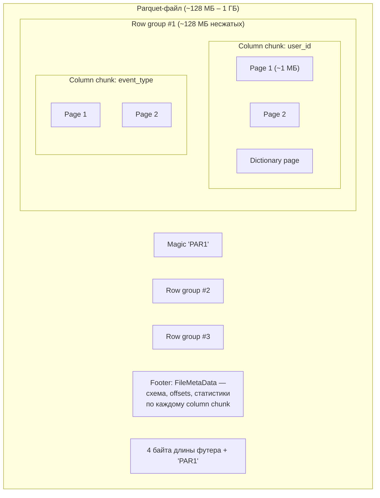
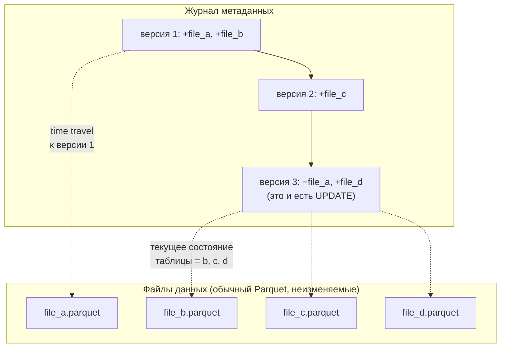
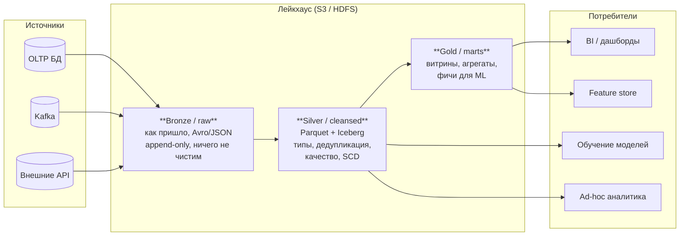

# Хранение данных

> **Зачем эта глава.** Девяносто процентов времени «медленного» ML-пайплайна уходит не на
> обучение модели, а на чтение данных. Разница между 2 ТБ и 40 ГБ прочитанных байт на одном
> и том же запросе — это выбор формата, схема партиционирования и размер файлов. После главы
> вы сможете открыть незнакомую таблицу, посмотреть её метаданные и сказать, почему запрос
> к ней стоит 40 минут вместо 40 секунд, а на собеседовании — объяснить устройство Parquet
> глубже, чем «это колоночный формат».

**Уровень:** 🎯 middle → 🧠 middle+
**Предварительно нужно:** базовое понимание ETL и того, что такое таблица в Hive/Spark; полезно [данные и feature store](../07-mlops/03-data-and-feature-store.md)
**Как проработать:** чтение + практика на своих данных

---

## Карта главы

- [1. Интуиция: почему аналитика упирается в чтение](#1-интуиция-почему-аналитика-упирается-в-чтение)
- [2. Строковые и колоночные форматы](#2-строковые-и-колоночные-форматы)
- [3. Parquet изнутри](#3-parquet-изнутри)
- [4. Кодировки: как колонка сжимается ещё до компрессора](#4-кодировки-как-колонка-сжимается-ещё-до-компрессора)
- [5. Статистики, predicate pushdown и projection pushdown](#5-статистики-predicate-pushdown-и-projection-pushdown)
- [6. Компрессия: snappy, zstd, gzip и цена решения](#6-компрессия-snappy-zstd-gzip-и-цена-решения)
- [7. ORC и Avro: когда не Parquet](#7-orc-и-avro-когда-не-parquet)
- [8. Партиционирование](#8-партиционирование)
- [9. Бакетирование](#9-бакетирование)
- [10. Small files problem](#10-small-files-problem)
- [11. Табличные форматы: Delta, Iceberg, Hudi](#11-табличные-форматы-delta-iceberg-hudi)
- [12. Data skipping и Z-ordering](#12-data-skipping-и-z-ordering)
- [13. Лейкхаус как архитектура](#13-лейкхаус-как-архитектура)
- [14. Компромиссы: как выбирать](#14-компромиссы-как-выбирать)
- [15. Подводные камни](#15-подводные-камни)
- [16. Проверь себя](#16-проверь-себя)
- [17. Практика](#17-практика)
- [18. Что читать дальше](#18-что-читать-дальше)

---

## 1. Интуиция: почему аналитика упирается в чтение

Возьмём конкретную таблицу, с которой вы будете работать в любой продуктовой компании.
Лог событий: 5 млрд строк за год, 200 колонок (id пользователя, тип события, timestamp,
устройство, гео, 150 полей всякой продуктовой телеметрии). В сыром JSON это примерно 6–8 ТБ,
в Parquet со snappy — около 2 ТБ.

Вы собираете обучающую выборку и пишете запрос:

```sql
SELECT user_id, event_type, ts
FROM events
WHERE dt = '2026-07-01' AND event_type = 'purchase';
```

Сколько байт физически прочитает движок?

**Вариант «всё лежит в JSON одной кучей».** 6 ТБ. Все 200 полей всех 5 млрд строк надо
достать с диска, распарсить (парсинг JSON — это ~50–150 МБ/с на ядро, то есть само по себе
десятки часов CPU), выкинуть 197 ненужных полей и 364 ненужных дня.

**Вариант «Parquet, партиционирование по `dt`».**
- Партиционирование срезает 364/365 данных: движок вообще не открывает лишние директории.
  Остаётся ~5.5 ГБ на один день.
- Колоночное хранение срезает ненужные колонки: читаем 3 из 200. Не ровно 3/200 — колонки
  разного «веса», но по порядку это ~100–200 МБ.
- Статистики min/max внутри файла позволяют пропустить блоки, где `event_type` заведомо
  не равен `'purchase'` (если данные хоть как-то отсортированы по нему). Останется, скажем, 60 МБ.

6 ТБ против 60 МБ. Это **пять порядков**. Никакой тюнинг Spark, никакой более мощный кластер
и никакой AQE этой разницы не дают — её даёт физическая раскладка данных на диске.

Отсюда главная мысль главы: **формат хранения — это не деталь реализации, а часть архитектуры
системы, наравне с выбором модели.** Инженер, который умеет сложить данные так, чтобы движок
читал в тысячу раз меньше, экономит компании больше, чем инженер, выжавший +0.3% ROC-AUC.

> 💬 **На собеседовании.** Спросят: «Почему для аналитики используют колоночные форматы?»
> Плохой ответ: «Потому что они быстрее и лучше сжимаются». Это правда, но это ответ джуна.
> Хороший ответ раскладывает выгоду на три независимых механизма: **(1) projection pushdown** —
> читаем только нужные колонки, экономия пропорциональна доле колонок в запросе;
> **(2) однородность данных в колонке** — рядом лежат значения одного типа с похожей энтропией,
> поэтому словарное кодирование и RLE дают 3–10× ещё до компрессора, а компрессор сверху даёт
> ещё 2–4×; **(3) статистики и predicate pushdown** — на уровне блоков хранятся min/max/null_count,
> и блок, не удовлетворяющий фильтру, вообще не читается с диска. Плюс бонусом векторизация:
> колонка — это непрерывный массив одного типа, по нему процессор идёт SIMD-инструкциями,
> а не разбирает структуру каждой строки.

---

## 2. Строковые и колоночные форматы

**Строковый (row-oriented)** формат кладёт на диск подряд все поля одной записи, потом все поля
следующей. CSV, JSON Lines, Avro, страницы в PostgreSQL, сообщения в Kafka — все строковые.

**Колоночный (columnar)** формат кладёт подряд все значения одной колонки, потом все значения
следующей. Parquet, ORC, файлы ClickHouse (MergeTree), внутреннее представление Arrow в памяти.

Схематично для таблицы из трёх строк и трёх колонок:

```
Строковая раскладка:
[u1, purchase, 100] [u2, view, 200] [u3, purchase, 300]

Колоночная раскладка:
[u1, u2, u3] [purchase, view, purchase] [100, 200, 300]
```

Отсюда сразу следуют все свойства обоих. Строковый формат дёшево пишет одну запись (append
в конец) и дёшево читает запись целиком — это профиль OLTP и стриминга. Колоночный дорого
пишет одну запись (её надо разложить по трём разным местам) и дорого читает одну строку целиком
(три похода), зато читает одну колонку из двухсот почти бесплатно — это профиль OLAP.

| Измерение | Строковый (CSV/JSON/Avro) | Колоночный (Parquet/ORC) |
|---|---|---|
| Чтение 3 колонок из 200 | читает все 200 | читает 3 |
| Чтение одной строки по ключу | 1 seek | N seek по числу колонок |
| Дозапись одной записи | дёшево (append) | дорого, поэтому пишут батчами |
| Изменение одной ячейки | относительно дёшево | практически невозможно, перезапись файла |
| Степень сжатия на реальных логах | 2–4× | 6–20× |
| Эволюция схемы | сильная сторона Avro | ограниченная, но есть |
| Векторизованное выполнение | нет | да |

> 🌱 **База.** Если у вас на диске лежит CSV с логами — вы уже платите за это в несколько раз
> больше, чем нужно, и ещё столько же в CPU на парсинг. Простейшая оптимизация, которая почти
> всегда окупается за час работы: сконвертировать в Parquet с партиционированием по дате.
> Всё остальное в этой главе — про то, как выжать оставшийся порядок.

---

## 3. Parquet изнутри

Здесь начинается то, что реально отличает ответ middle+ от ответа middle. Parquet — не просто
«колонки подряд». Это иерархия из четырёх уровней, и каждый уровень существует ради конкретной
проблемы.

### 3.1. Иерархия



**Row group (группа строк)** — горизонтальный срез таблицы, содержащий все колонки для
некоторого диапазона строк. Типовой размер — 128 МБ несжатых данных (`parquet.block.size`
в parquet-mr по умолчанию 128 МБ; Spark пишет с этим же значением). Почему вообще нужен этот
уровень? Потому что чистые колонки от начала файла до конца было бы невозможно обрабатывать
параллельно и невозможно читать, не загрузив весь файл. Row group — **единица параллелизма**:
один таск Spark читает один или несколько row group целиком.

**Column chunk (кусок колонки)** — данные одной колонки внутри одного row group. Хранится
непрерывно, поэтому читается одним последовательным чтением. Это **единица projection pushdown**:
если колонка не нужна, её chunk просто не читают, зная его смещение и длину из футера.

**Page (страница)** — единица компрессии и кодирования, обычно ~1 МБ несжатых
(`parquet.page.size`). Это **единица декодирования**: чтобы прочитать одно значение, придётся
распаковать всю страницу, но не весь chunk. С Parquet 2.x страницы получили ещё и собственные
статистики (column index / offset index), что даёт пропуск на уровне страниц, а не только
row group.

**Footer (футер)** — thrift-сериализованная структура `FileMetaData` в конце файла: схема,
число строк, список row group, для каждого column chunk — смещение, размер, кодировки,
компрессия и **статистики** (min, max, null_count, иногда distinct_count).

> 🧠 **Middle+.** Заметьте, что футер в **конце** файла. Это не случайность: писатель не знает
> заранее ни статистик, ни смещений, поэтому пишет данные потоком и дописывает метаданные
> в конце. Практическое следствие: чтобы прочитать метаданные Parquet-файла в S3, клиент делает
> два range-запроса — сначала последние 8 байт (длина футера + магия `PAR1`), потом сам футер.
> Отсюда же: **нельзя дописать строку в существующий Parquet-файл** — футер уже записан.
> Любое «обновление» — это перезапись файла целиком. Именно из этого свойства растёт вся
> необходимость в Delta/Iceberg/Hudi (см. §11).

### 3.2. Вложенные структуры: definition и repetition levels

Parquet умеет хранить не только плоские таблицы, но и вложенные структуры (`struct`, `array`,
`map`) — и делает это без потери колоночности. Механизм взят из статьи Google про Dremel:
каждое значение сопровождается двумя маленькими числами.

- **Definition level** — до какого уровня вложенности значение реально определено. Позволяет
  отличить «`user.address.city` = NULL», «`user.address` = NULL» и «`user` = NULL», не храня
  пустые структуры.
- **Repetition level** — на каком уровне вложенности началось повторение. Позволяет восстановить
  границы массивов.

Оба уровня хранятся отдельным потоком и кодируются RLE/bit-packing, поэтому для плоской
not-null колонки они занимают практически ноль. Это редко спрашивают, но если вы работаете
с логами в виде вложенного JSON — знать полезно: чтение `events.items[].price` из вложенного
Parquet тоже колоночное, а не «распакуй весь JSON».

### 3.3. Смотрим метаданные руками

Абстракции запоминаются, когда вы их увидели. Вот рабочий код на `pyarrow`, который печатает
всё, о чём шла речь выше.

```python
# Разбор физической структуры Parquet-файла: row groups, column chunks, статистики.
# Запускается на любом .parquet без Spark — нужен только pyarrow.
import pyarrow.parquet as pq

pf = pq.ParquetFile("events/dt=2026-07-01/part-00000.parquet")

md = pf.metadata
print(f"строк всего:      {md.num_rows:,}")
print(f"row groups:       {md.num_row_groups}")
print(f"колонок:          {md.num_columns}")
print(f"размер файла:     {md.serialized_size / 2**20:.1f} МБ (только футер)")
print(f"версия писателя:  {md.created_by}")

# Разбираем первый row group поколоночно: что сколько весит и какие статистики доступны.
rg = md.row_group(0)
print(f"\nrow group 0: {rg.num_rows:,} строк, {rg.total_byte_size / 2**20:.1f} МБ несжатых")

rows = []
for i in range(rg.num_columns):
    col = rg.column(i)
    st = col.statistics
    rows.append((
        col.path_in_schema,
        col.physical_type,
        # encodings — это и есть ответ на вопрос «а словарь-то применился?»
        ",".join(str(e) for e in col.encodings),
        f"{col.total_compressed_size / 2**20:.2f}",
        f"{col.total_uncompressed_size / 2**20:.2f}",
        # ratio по колонке — сразу видно, какая колонка съедает файл
        f"{col.total_uncompressed_size / max(col.total_compressed_size, 1):.1f}x",
        f"{st.min}..{st.max}" if st and st.has_min_max else "нет статистик",
        st.null_count if st else "?",
    ))

hdr = ("колонка", "тип", "кодировки", "сжато МБ", "сырых МБ", "ratio", "min..max", "nulls")
print("\n" + " | ".join(hdr))
for r in sorted(rows, key=lambda x: -float(x[3]))[:20]:   # топ-20 самых тяжёлых колонок
    print(" | ".join(str(x) for x in r))
```

Что искать в выводе, когда файл «почему-то большой»:

1. **Колонка без `RLE_DICTIONARY` в encodings, хотя значений мало.** Значит словарь переполнился
   (см. §4) и колонка пишется PLAIN. Частая причина раздутых файлов.
2. **`ratio` около 1.0** у текстовой колонки — внутри лежит что-то уже сжатое или случайное
   (base64, UUID, хеш). Такие колонки надо либо выносить в отдельную таблицу, либо не хранить.
3. **`нет статистик`** — писатель не записал min/max (частый случай для строковых колонок
   в старых версиях parquet-mr). Predicate pushdown по такой колонке не сработает.
4. **`num_row_groups == 1` при размере файла в гигабайты** — файл будет читаться одним таском,
   параллелизм убит.

> ⌨️ **Руками.** Возьмите любую свою Parquet-таблицу и прогоните этот скрипт. Найдите три самые
> тяжёлые колонки и объясните себе, почему они тяжёлые. Это упражнение на 15 минут окупается
> постоянно: в 8 случаях из 10 обнаруживается колонка, которую никто не читает, но которая
> занимает 40% таблицы.

---

## 4. Кодировки: как колонка сжимается ещё до компрессора

Это второй уровень, который путают. В Parquet сжатие двухступенчатое: сначала **кодирование**
(encoding) — структурное преобразование, знающее семантику данных; потом **компрессия**
(compression) — универсальный алгоритм, ничего про данные не знающий.

### 4.1. Dictionary encoding (словарное кодирование)

Основная рабочая лошадка. Для колонки с небольшим числом уникальных значений писатель строит
словарь и заменяет значения на индексы.

Колонка `event_type` с 5 млн строк и 12 уникальными значениями:
- PLAIN: 12 строк по ~8 байт → ~40 МБ.
- Dictionary: словарь на ~100 байт + 5 млн индексов, каждый кодируется 4 битами
  ($\lceil \log_2 12 \rceil = 4$) → ~2.5 МБ.

В 16 раз меньше **до** того, как заработал snappy.

Ключевой параметр: **лимит размера словарной страницы**, `parquet.dictionary.page.size`,
по умолчанию 1 МБ. Если уникальных значений столько, что словарь не влезает в лимит, писатель
**отключает словарь для этого column chunk и переключается на PLAIN**. Это происходит молча
и является причиной номер один внезапно распухших файлов.

> ⚠️ **Типичная ошибка.** Положили в колонку `session_id` (UUID, уникален для каждой строки) →
> словарь переполняется на первых ~30 тысячах значений → chunk пишется PLAIN по 36 байт на строку →
> UUID-колонка занимает больше, чем все остальные 199 колонок вместе → и она же ломает
> компрессию, потому что случайные строки не сжимаются. **Что делать:** хранить UUID как
> 16-байтовый `FIXED_LEN_BYTE_ARRAY` вместо 36-символьной строки (экономия 2.2×), а если по нему
> не фильтруют — выносить в отдельную таблицу. Проверить, применился ли словарь, можно скриптом
> из §3.3: смотрите поле `encodings`.

### 4.2. RLE и bit-packing

**RLE (run-length encoding)** заменяет серию одинаковых значений на пару «значение, длина серии».
Для отсортированной колонки — золото: колонка `dt` внутри партиции за один день состоит
из одного значения, то есть кодируется буквально десятком байт.

**Bit-packing** упаковывает мелкие целые в минимальное число бит. Индексы словаря из 12 значений
занимают 4 бита, а не 32.

В Parquet эти два механизма работают вместе (гибридная схема RLE/bit-packing) и применяются
к индексам словаря, к definition/repetition levels и к булевым колонкам.

Практический вывод: **сортировка данных перед записью — это бесплатное сжатие**. Если внутри
файла отсортировать строки по колонке низкой кардинальности, её RLE-серии становятся длинными.
На реальных логах сортировка по `(event_type, user_id)` часто даёт минус 20–40% к размеру файла
и заодно включает data skipping (§5).

### 4.3. Delta encoding и остальные

- **DELTA_BINARY_PACKED** — хранит разности между соседними значениями. Идеально для монотонных
  колонок: timestamp в миллисекундах, автоинкрементные id. Timestamp с шагом в секунды сжимается
  из 8 байт до 1–2 бит на значение.
- **DELTA_BYTE_ARRAY** (incremental encoding) — для строк с общими префиксами: URL, пути,
  иерархические коды.
- **BYTE_STREAM_SPLIT** — для float/double: разбивает байты числа по отдельным потокам, чтобы
  старшие байты (похожие друг на друга) попали рядом. Даёт ощутимый выигрыш на эмбеддингах
  и метриках.

> 🧠 **Middle+.** Здесь есть неочевидная связка с ML. Если вы храните эмбеддинги (768 float32
> на строку) в Parquet, то по умолчанию они пойдут PLAIN и сожмутся никак — случайные float
> несжимаемы. 10 млн эмбеддингов = 10⁷ × 768 × 4 байта ≈ **29 ГБ**, и все 29 ГБ придётся читать.
> Варианты: (1) `BYTE_STREAM_SPLIT` даёт 10–20%; (2) квантизация во float16 — ровно 2×
> при потере, обычно незаметной для ANN-поиска; (3) int8-квантизация — 4× и уже заметная потеря;
> (4) вообще не хранить эмбеддинги в аналитическом хранилище, а держать их в векторной БД
> или в отдельных бинарных шардах. Кандидат, который на вопрос «где храните эмбеддинги»
> отвечает числом в гигабайтах и предлагает квантизацию, выглядит сильно.

---

## 5. Статистики, predicate pushdown и projection pushdown

Два «pushdown» — это то, ради чего вообще существует связка «формат + движок».

### 5.1. Projection pushdown

Движок анализирует запрос, понимает, что нужны только колонки `user_id, event_type, ts`,
и в футере находит их смещения. Читаются только эти байты. Экономия прямо пропорциональна
доле колонок:

$$
S_{\text{read}} \approx S_{\text{total}} \cdot \frac{\sum_{c \in C} w_c}{\sum_{c \in \text{all}} w_c}
$$

где $S_{\text{total}}$ — размер таблицы, $C$ — множество запрошенных колонок,
$w_c$ — сжатый размер колонки $c$ (не число колонок! колонки очень разные по весу).

Именно поэтому `SELECT *` в аналитическом хранилище — не безобидная небрежность, а умножение
объёма чтения на 20–60.

### 5.2. Predicate pushdown и статистики

Движок передаёт условие `WHERE` вниз, в ридер формата. Ридер для каждого row group смотрит
статистики нужной колонки и решает, читать ли его вообще.

Логика тривиальна: если фильтр `price > 1000`, а в row group `max(price) = 800`, то ни одна
строка группы не пройдёт фильтр — группу пропускаем, не читая ни байта данных.

Ключевое свойство, которое надо понимать: **это работает только если данные хоть как-то
кластеризованы по колонке фильтра.** Пример на числах. Таблица 1000 row group, фильтр по `price`:

| Раскладка | Что в статистиках | Сколько групп прочитаем |
|---|---|---|
| Данные отсортированы по `price` | у каждой группы узкий непересекающийся диапазон | 1–5 из 1000 |
| Данные в случайном порядке | у каждой группы min≈global_min, max≈global_max | 1000 из 1000 |

Разница в 200–1000 раз, при абсолютно одинаковых данных, одинаковом формате и одинаковом запросе.
Отсюда — сортировка при записи и Z-ordering (§12).

Три уровня отсечения, которые надо уметь называть:

1. **Partition pruning** — по директориям, на уровне листинга файлов. Самый дешёвый: файлы даже
   не открываются.
2. **Row group pruning** — по статистикам в футере. Открываем футер (десятки КБ), пропускаем
   ненужные группы.
3. **Page pruning** — по column index (Parquet 2.x). Внутри выбранного row group пропускаем
   ненужные страницы.

Плюс необязательный четвёртый: **Bloom filter**. Статистики min/max бесполезны для равенства
по высококардинальной колонке в неотсортированных данных (`user_id = 12345` попадает в диапазон
min..max почти любой группы). Parquet поддерживает bloom-фильтры на уровне column chunk: они
дают вероятностный ответ «этого значения тут точно нет». Включается опцией писателя
(в Spark — `parquet.bloom.filter.enabled` для конкретной колонки).

> 💬 **На собеседовании.** Спросят: «Вы добавили `WHERE user_id = 12345`, а запрос читает всю
> таблицу. Почему и что сделать?» Хороший ответ: predicate pushdown по min/max не срабатывает,
> потому что `user_id` распределён равномерно по всем файлам — диапазон [min, max] каждого
> row group покрывает искомое значение. Проверить это можно, посмотрев статистики через
> `pyarrow` или метрику `numFiles`/`filesPruned` в плане запроса. Варианты лечения по возрастанию
> стоимости: (1) включить bloom-фильтр по `user_id` при записи; (2) отсортировать/Z-order
> данные по `user_id` при компакции; (3) добавить bucketing по `user_id`; (4) если такие точечные
> запросы — основной паттерн, то аналитическое хранилище вообще не тот инструмент, нужен
> key-value стор. Плохой ответ: «нужно добавить индекс» — в Parquet индексов в OLTP-смысле нет.

---

## 6. Компрессия: snappy, zstd, gzip и цена решения

После кодирования страница сжимается универсальным алгоритмом. Компромисс здесь ровно один:
**процессорное время против байтов на диске и в сети**.

Порядки величин (мерить надо на своих данных, но соотношения устойчивы):

| Кодек | Степень сжатия сверх кодировок | Скорость сжатия, МБ/с/ядро | Скорость распаковки, МБ/с/ядро | Когда |
|---|---|---|---|---|
| **none** | 1× | — | — | почти никогда; разве что данные уже сжаты |
| **snappy** | ~2× | 300–500 | 800–1500 | дефолт много лет; когда CPU дороже диска |
| **lz4** | ~2× | 400–700 | 1500–3000 | самый быстрый; горячие промежуточные данные |
| **zstd (level 1–3)** | ~2.5–3× | 200–400 | 700–1200 | **современный дефолт**: почти как snappy по скорости, заметно лучше по размеру |
| **gzip** | ~3× | 30–80 | 200–400 | легаси и обмен с внешними системами |
| **brotli** | ~3.2× | 20–60 | 300–500 | архив, читают редко |

Как выбирать, не гадая. Оцените, где узкое место:

$$
T \approx \max\!\left(\frac{S_{\text{compressed}}}{B_{\text{io}}},\ \frac{S_{\text{compressed}}}{R_{\text{decomp}} \cdot k}\right)
$$

где $S_{\text{compressed}}$ — объём сжатых данных, $B_{\text{io}}$ — пропускная способность
хранилища на воркер (для S3 с одного клиента реально ~50–100 МБ/с на соединение, при
параллельных запросах — сотни МБ/с), $R_{\text{decomp}}$ — скорость распаковки на ядро,
$k$ — число ядер на воркере, отданных под чтение.

Подставьте свои числа. Если у вас S3 и 8 ядер на экзекьютор: распаковка zstd даёт
$700 \times 8 = 5600$ МБ/с, а сеть — 100–300 МБ/с. Узкое место — сеть, значит **надо сжимать
сильнее**, CPU простаивает. На локальном NVMe (2–3 ГБ/с) картина обратная, и там snappy/lz4
уместнее.

Практическая рекомендация на 2025–2026: **zstd уровня 1–3 для холодных данных в объектном
хранилище, snappy/lz4 для горячих промежуточных**. Переход со snappy на zstd(3) на типичной
таблице логов даёт минус 25–35% места и минус столько же трафика, при росте CPU на запись
на 10–20% и практически без потерь на чтение.

```python
# Spark: как это выставляется. Настройка на уровне сессии — для всех записей.
spark.conf.set("spark.sql.parquet.compression.codec", "zstd")
spark.conf.set("parquet.compression.codec.zstd.level", "3")   # 1..22, выше 6 почти бессмысленно

# Или точечно на конкретной записи — это надёжнее, чем глобальный конфиг,
# потому что не зависит от того, кто и что настроил в кластере.
(df
 .repartition(200, "dt")                    # ~1 файл на партицию на воркер
 .sortWithinPartitions("event_type", "user_id")  # включаем RLE и data skipping
 .write
 .partitionBy("dt")
 .option("compression", "zstd")
 .option("parquet.block.size", 128 * 1024 * 1024)  # размер row group
 .mode("overwrite")
 .parquet("s3a://lake/events/"))
```

---

## 7. ORC и Avro: когда не Parquet

### ORC

ORC устроен идейно так же, как Parquet: файл делится на **stripes** (аналог row group, дефолт
64 МБ), внутри — колонки, у каждой есть индексы и статистики. Отличия, которые стоит знать:

- ORC хранит **три уровня статистик**: file, stripe и **row index** через каждые 10 000 строк
  внутри stripe. Это более мелкая гранулярность отсечения, чем классический Parquet (хотя
  Parquet 2.x с column index догнал).
- ORC имеет встроенные bloom-фильтры дольше и с более удобным API (`orc.bloom.filter.columns`).
- ORC поддерживает **ACID-таблицы в Hive** (delta-файлы, компакция) — исторически именно
  через ORC делали `UPDATE`/`DELETE` в Hive.
- Экосистемно: ORC родом из Hive и лучше всего живёт в Hive/Trino; Parquet родом из
  Impala/Twitter и стал де-факто стандартом в Spark, pandas/Arrow, всех облаках и всех
  табличных форматах.

**Практический вывод:** если вы не в legacy-Hive-стеке, берите Parquet. Не потому что он
технически лучше (разница в 5–15% в обе стороны в зависимости от данных), а потому что вокруг
него вся экосистема: pyarrow, DuckDB, polars, все табличные форматы, все облачные движки.
Единообразие стека дороже 10% сжатия.

### Avro

Avro — **строковый** формат, и в этом весь смысл. Он существует ради другого профиля нагрузки:

- **Стриминг и обмен сообщениями.** Kafka + Schema Registry — это почти всегда Avro. Одно
  сообщение = одна запись, читается целиком, схема лежит отдельно и версионируется.
- **Эволюция схемы как первоклассная функция.** У Avro формальные правила совместимости
  (backward / forward / full), которые Schema Registry проверяет **до** записи, отклоняя
  несовместимые изменения. Это не «добавили колонку и надеемся», а контракт.
- **Дешёвая запись строк по одной.** Append в конец файла — нормальная операция, в отличие
  от Parquet.

Каноническая архитектура выглядит так: **Avro на входе (стриминг, landing-слой), Parquet
на выходе (аналитический слой)**. Между ними — джоба, которая раз в N минут собирает мелкие
Avro-файлы и переписывает в крупные Parquet.

| Критерий | Parquet | ORC | Avro |
|---|---|---|---|
| Раскладка | колоночная | колоночная | строковая |
| Профиль | OLAP-сканы | OLAP-сканы, Hive | стриминг, обмен, landing |
| Запись по одной записи | нет | нет | да |
| Чтение всей строки | дорого | дорого | дёшево |
| Эволюция схемы | добавление колонок, переименование ограничено | похоже на Parquet | полноценные правила совместимости |
| Экосистема | максимальная | Hive/Trino | Kafka/Schema Registry |

> 💬 **На собеседовании.** Спросят: «Когда Avro лучше Parquet?» Хороший ответ: когда доминирует
> запись по одной записи и чтение записи целиком, а не сканы по колонкам — то есть в стриминге,
> в landing-слое озера и при обмене данными между сервисами; плюс когда нужна строгая
> проверяемая эволюция схемы через Schema Registry. Пример из практики: Kafka-топик пишется
> в Avro, а компакция раз в час переписывает накопленное в Parquet, потому что аналитика
> по Avro была бы в 20 раз дороже. Плохой ответ: «Avro быстрее» или «Avro — для маленьких данных».

---

## 8. Партиционирование

Партиционирование (partitioning) — физическое разбиение таблицы на директории по значению
одной или нескольких колонок. В Hive-совместимой раскладке это выглядит так:

```
s3://lake/events/
  dt=2026-07-24/country=RU/part-00000-....parquet
  dt=2026-07-24/country=KZ/part-00000-....parquet
  dt=2026-07-25/country=RU/part-00000-....parquet
```

Ценность одна: **partition pruning**. Запрос с `WHERE dt = '2026-07-25'` даже не листит
остальные директории. Это отсечение до открытия файлов, самое дешёвое из всех.

### По каким колонкам партиционировать

Правило: партиционируйте по колонке, которая (а) присутствует в `WHERE` подавляющего большинства
запросов и (б) имеет умеренную кардинальность.

- ✅ Дата/час события — почти всегда правильный первый ключ.
- ✅ Регион/страна/тип события — если их десятки и они реально в фильтрах.
- ❌ `user_id`, `session_id`, `order_id` — миллионы директорий, катастрофа (см. ниже).
- ❌ Колонка, по которой никто не фильтрует — вы получите все издержки и ноль выгоды.

### Гранулярность: считаем, а не угадываем

Целевой размер одной партиции — **от 128 МБ до 1 ГБ** сжатых данных. Меньше 128 МБ — партиции
слишком мелкие, растут накладные расходы; больше нескольких ГБ — партиция не режется достаточно
мелко и параллелизм страдает (хотя внутри неё файлы всё равно бьются).

Формула для выбора гранулярности времени:

$$
N_{\text{partitions}} = \frac{V_{\text{day}} \cdot D}{S_{\text{target}}}
$$

где $V_{\text{day}}$ — объём данных в сутки, $D$ — глубина хранения в днях,
$S_{\text{target}}$ — целевой размер партиции (берём 256 МБ – 1 ГБ).

Три сценария на реальных числах:

| Данных в сутки | Хранение | Гранулярность | Число партиций | Размер партиции |
|---|---|---|---|---|
| 200 МБ | 2 года | по месяцу | 24 | ~6 ГБ |
| 20 ГБ | 2 года | по дню | 730 | 20 ГБ (внутри режется на файлы) |
| 20 ГБ | 2 года | по дню + 4 региона | 2920 | ~5 ГБ |
| 2 ТБ | 1 год | по часу | 8760 | ~230 МБ |

### Over-partitioning: что ломается

Соблазн «партиционировать по всему, вдруг пригодится» приводит к вполне конкретным поломкам.

**Симптом 1: планирование запроса дольше выполнения.** Драйвер Spark должен получить список
файлов. В S3 листинг — это `LIST` по 1000 ключей за запрос с латентностью 30–100 мс.
100 000 партиций по 3 файла = 300 000 объектов = минимум 300 LIST-запросов **на уровень
директорий**, а по факту гораздо больше из-за рекурсии. Это минуты только на листинг,
на драйвере, в одном потоке.

**Симптом 2: раздутый метастор.** Hive Metastore хранит строку на каждую партицию.
При 500 000 партиций `MSCK REPAIR TABLE` работает часами, а `SHOW PARTITIONS` кладёт метастор.

**Симптом 3: файлы по 200 КБ.** Партиций много → в каждую попадает мало данных → см. §10.

**Практический предел:** держите число партиций **в тысячах, максимум в десятках тысяч**.
Если хочется резать мельче — это не партиционирование, это бакетирование (§9) или
Z-ordering (§12).

> ⚠️ **Типичная ошибка.** `partitionBy("user_id")` — потому что «мы часто фильтруем
> по пользователю». Результат: 30 млн директорий по 3 КБ. Джоба записи не заканчивается,
> метастор падает, чтение любого запроса стартует 20 минут. Правильно: партиционировать
> по `dt`, а быстрый доступ по `user_id` обеспечивать бакетированием или Z-order — либо честно
> признать, что точечный доступ по ключу — это задача для key-value хранилища, а не для озера.

---

## 9. Бакетирование

Бакетирование (bucketing) — разбиение данных внутри партиции на фиксированное число файлов
по хешу колонки:

$$
\text{bucket}(x) = \text{hash}(x) \bmod N_{\text{buckets}}
$$

где $x$ — значение ключа бакетирования, $N_{\text{buckets}}$ — заранее выбранное число бакетов
(фиксируется при создании таблицы и не меняется без перезаписи).

Зачем это нужно — ради **джойнов без shuffle**. Если две таблицы забакетированы по одному
и тому же ключу на одинаковое число бакетов, то строки с одинаковым ключом гарантированно
лежат в бакете с одинаковым номером. Значит, движок может джойнить бакет к бакету локально,
не перегоняя данные по сети. Shuffle на терабайтной таблице — это десятки минут и главный
источник боли в Spark (подробно — в главе [Spark: производительность](04-spark-tuning.md));
бакетирование его убирает.

```python
# Бакетирование в Spark требует saveAsTable — путь через .parquet() метаданные бакетов теряет.
(df
 .write
 .bucketBy(256, "user_id")          # 256 бакетов: при 200 ГБ таблице ~800 МБ на бакет
 .sortBy("user_id")                 # сортировка внутри бакета включает sort-merge без сортировки
 .partitionBy("dt")
 .mode("overwrite")
 .saveAsTable("lake.events_bucketed"))
```

Как выбрать $N_{\text{buckets}}$: так, чтобы один бакет был порядка 128 МБ – 1 ГБ, и желательно
кратно числу ядер кластера (чтобы задачи распределялись ровно). Для таблицы 200 ГБ — 256 бакетов
даёт ~800 МБ на бакет.

Честно о минусах: бакетирование — довольно капризная штука. Обе таблицы должны иметь **одинаковое**
число бакетов (или кратное, в новых версиях Spark), ключ должен совпадать точно, добавление
данных требует записи ровно в те же бакеты, а число бакетов нельзя поменять без полной перезаписи.
Поэтому в современных лейкхаусах бакетирование постепенно вытесняется Z-ordering и liquid
clustering, которые дают часть выгоды без жёсткого контракта. Но на вопрос «как убрать shuffle
из повторяющегося джойна двух больших таблиц» бакетирование — правильный ответ.

---

## 10. Small files problem

Самая частая и самая дорогая болезнь озёр данных. Разберём механизм, а не симптом.

### Откуда берутся мелкие файлы

1. **Стриминг.** Spark Structured Streaming с триггером в 1 минуту и 200 партициями пишет
   200 файлов в минуту = **288 000 файлов в сутки**, каждый по несколько сотен КБ.
2. **Over-partitioning.** 50 000 партиций × число тасков = сотни тысяч файлов.
3. **Неудачный `repartition`.** Джоба с 2000 партиций пишет 2000 файлов в каждую директорию,
   даже если данных там на 50 МБ.
4. **Инкрементальные догрузки.** Каждый часовой батч добавляет свои файлы, никто не убирает.

### Почему это дорого — по механизмам

**В HDFS: память NameNode.** NameNode держит метаданные всех файлов и блоков в куче, порядка
**150 байт на объект** (файл, блок, директория). 10 млн мелких файлов ≈ 20 млн объектов ≈ 3 ГБ
кучи только на них. NameNode начинает тормозить на GC, и тормозит весь кластер.

**В S3: латентность и лимиты.** Каждый файл — отдельный HTTP GET с латентностью первого байта
20–100 мс. Чтение 100 000 файлов по 200 КБ:
$$
T \approx \frac{100\,000}{P} \times 0.05\ \text{с}
$$
при параллельности $P = 200$ это ~25 секунд **чистой латентности**, при том что полезных данных
всего 20 ГБ и они читаются за секунды. Плюс листинг: `LIST` возвращает 1000 ключей, значит
100 запросов только чтобы узнать, что читать.

**В Spark: накладные расходы на таск.** Один таск на файл, старт таска — 10–100 мс.
100 000 тасков — это минуты на одно только планирование и учёт, плюс раздутый лог событий
и падающий Spark UI.

**В самом Parquet: метаданные не амортизируются.** Футер с описанием 200 колонок весит
десятки КБ. В файле на 200 МБ это 0.01%. В файле на 200 КБ это **10–20%** объёма — вы платите
за метаданные. И статистики в таком файле бесполезны: одна группа на файл, отсекать нечего.

### Лечение

**Профилактика на записи.** Считайте число выходных файлов явно:

```python
# Целимся в файлы по ~256 МБ. Число выходных партиций считаем от объёма, а не берём с потолка.
target_file_mb = 256
estimated_size_mb = df.count() * avg_row_bytes / 2**20   # или взять из статистик источника
n_files = max(1, int(estimated_size_mb / target_file_mb))

(df
 .repartition(n_files)          # repartition, а не coalesce: нужен равномерный размер
 .write.mode("overwrite").parquet(path))
```

В Spark 3.x для динамических случаев помогает AQE: `spark.sql.adaptive.enabled=true` вместе
с `spark.sql.adaptive.coalescePartitions.enabled=true` схлопывает мелкие партиции после shuffle
до целевого размера `spark.sql.adaptive.advisoryPartitionSizeInBytes` (дефолт 64 МБ, часто
поднимают до 128–256 МБ).

**Лечение постфактум — компакция.** Регулярная джоба, которая переписывает мелкие файлы
в крупные. В обычном Parquet это опасная операция (пока переписываете — читатели видят
несогласованное состояние), и вот тут появляется главный аргумент за табличные форматы:
в Delta/Iceberg/Hudi компакция **атомарна**.

```sql
-- Delta Lake: компакция + кластеризация одной командой. Атомарно, читатели не видят промежуточных состояний.
OPTIMIZE lake.events
  WHERE dt >= '2026-07-01'
  ZORDER BY (user_id, event_type);

-- Iceberg: то же самое через процедуру
CALL catalog.system.rewrite_data_files(
  table => 'lake.events',
  strategy => 'sort',
  sort_order => 'event_type ASC, user_id ASC',
  options => map('target-file-size-bytes', '268435456')   -- 256 МБ
);
```

> 💬 **На собеседовании.** Спросят: «У нас в озере 3 млн мелких файлов, запросы стали идти
> в 10 раз дольше. Ваши действия?» Хороший ответ идёт от механизма: сначала выяснить, где
> именно теряется время — в листинге (метрика времени планирования на драйвере), в открытии
> файлов (число тасков и их медианная длительность в Spark UI) или в NameNode. Потом два трека
> параллельно: **остановить кровотечение** (увеличить триггер стриминга, добавить AQE-коалесинг,
> убрать лишние уровни партиционирования) и **разгрести накопленное** (компакция через
> `OPTIMIZE`/`rewrite_data_files`, начиная с самых горячих партиций, а не всей таблицы сразу).
> Отдельно — поставить мониторинг: алерт на «среднее число файлов на партицию > 20» ловит
> проблему до того, как о ней узнают аналитики. Плохой ответ: «сделаем coalesce(1)» — это
> порождает один гигантский файл, который читается одним таском.

---

## 11. Табличные форматы: Delta, Iceberg, Hudi

### Проблема, которую они решают

Вернёмся к свойству из §3: **Parquet-файл неизменяем**. Из этого растут четыре практические
проблемы, которые в «озере из директорий с Parquet» не решаются вообще:

1. **Нет атомарности.** Джоба перезаписывает партицию. В момент, когда половина файлов новая,
   а половина старая, аналитик запускает запрос и получает мусор. Если джоба упала посередине —
   мусор остаётся навсегда.
2. **Нет `UPDATE`/`DELETE`.** GDPR-запрос «удалите все данные пользователя 12345» превращается
   в перезапись всей таблицы. Исправление одной ошибочной записи — тоже.
3. **Нет консистентного снимка.** Пока идёт длинный запрос, пишущая джоба добавляет файлы,
   и запрос видит часть новых данных, часть старых.
4. **Метаданные — это листинг директорий.** Медленно и не даёт статистик по таблице целиком.

Табличные форматы (table formats) решают всё это одним приёмом: **над файлами данных
надстраивается журнал метаданных, и именно он определяет, какие файлы входят в таблицу
в данный момент.** Данные по-прежнему в обычных Parquet; изменилось то, что «таблица» —
это не «всё, что лежит в директории», а «список файлов, зафиксированный в текущей версии
журнала».



Атомарность достигается тем, что коммит — это создание **одного** файла/записи в журнале.
Либо он создался, либо нет; промежуточных состояний читатель не видит.

### Три реализации

| | **Delta Lake** | **Apache Iceberg** | **Apache Hudi** |
|---|---|---|---|
| Происхождение | Databricks | Netflix → Apache | Uber → Apache |
| Устройство метаданных | директория `_delta_log/` с JSON-коммитами (`000000.json`, `000001.json`…) и Parquet-чекпоинтами каждые 10 коммитов | `metadata.json` → manifest list (Avro) → manifest files (Avro) → data files | timeline (`.hoodie/`) + индекс записей |
| Основная сила | простота, глубокая интеграция со Spark, `OPTIMIZE ZORDER` | эволюция партиционирования на лету, скрытое партиционирование, движко-независимость | быстрые upsert по ключу за счёт индекса, near-real-time |
| Типовой сценарий | лейкхаус на Spark | мультидвижковое озеро (Spark + Trino + Flink + облачные движки) | CDC-репликация БД в озеро |

### Ключевые механики

**ACID через оптимистичную конкурентность.** Писатель читает текущую версию, готовит новые
файлы, пытается закоммитить версию $N+1$. Если кто-то успел раньше — конфликт: писатель либо
повторяет попытку поверх новой версии (если операции не пересекаются), либо падает. Это работает
хорошо при нескольких писателях и плохо при десятках конкурентных писателей в одну партицию.

**Time travel (путешествие во времени).** Так как журнал хранит все версии, можно прочитать
таблицу такой, какой она была:

```sql
-- Delta
SELECT * FROM lake.events VERSION AS OF 142;
SELECT * FROM lake.events TIMESTAMP AS OF '2026-07-20 00:00:00';

-- Iceberg
SELECT * FROM lake.events FOR SYSTEM_VERSION AS OF 3821550127947089987;
SELECT * FROM lake.events FOR SYSTEM_TIME AS OF '2026-07-20 00:00:00';
```

Для ML это не игрушка, а **инфраструктура воспроизводимости**: вы фиксируете в метаданных
эксперимента номер версии таблицы, и через полгода воспроизводите ровно тот датасет, на котором
училась модель. Без time travel «версионирование данных» сводится к копированию снапшотов,
что на терабайтах неподъёмно. Подробнее про воспроизводимость —
[в главе про трекинг](../07-mlops/02-reproducibility-and-tracking.md).

Важное ограничение, о котором забывают: **время жизни истории конечно**. В Delta
`delta.logRetentionDuration` по умолчанию 30 дней, а `VACUUM` физически удаляет файлы, на которые
не ссылается текущая версия, с порогом по умолчанию 7 дней. То есть «откатиться на полгода назад»
по умолчанию **не получится** — надо заранее увеличить retention или делать явные снапшоты/теги.

**Schema evolution (эволюция схемы).** Добавление колонки, переименование, изменение типа
на совместимый — операции над метаданными, без перезаписи данных.

```sql
ALTER TABLE lake.events ADD COLUMN ab_group STRING;
ALTER TABLE lake.events RENAME COLUMN device TO device_type;   -- Iceberg: по column id, безопасно
```

Разница по существу: **Iceberg присваивает каждой колонке уникальный числовой id**, поэтому
переименование ничего не ломает и порядок колонок неважен. Delta исторически матчил по имени
(режим column mapping добавил id-подход). Практический вывод: в Iceberg переименование колонки —
безопасная операция, в старых Delta-таблицах без column mapping — нет.

**Copy-on-write против merge-on-read.** Это тот вопрос, который отделяет «читал про Iceberg»
от «работал с Iceberg».

- **Copy-on-write (CoW).** При `UPDATE`/`DELETE` файл, содержащий изменённые строки,
  **переписывается целиком** с внесёнными изменениями. Запись дорогая (переписали 128 МБ ради
  одной строки), чтение — обычное, максимально быстрое. Профиль: редкие обновления, частые чтения.
- **Merge-on-read (MoR).** При `UPDATE`/`DELETE` пишется маленький **дельта-файл** (или файл
  позиционных удалений), а слияние происходит **в момент чтения**. Запись дешёвая, чтение
  тем дороже, чем больше накопилось дельт. Профиль: частые точечные обновления (CDC), терпимое
  чтение, обязательная фоновая компакция.

$$
T_{\text{read}}^{\text{MoR}} \approx T_{\text{read}}^{\text{CoW}} + \frac{n_{\text{delta}}}{r_{\text{merge}}}
$$

где $n_{\text{delta}}$ — число накопленных дельта-записей, $r_{\text{merge}}$ — скорость их
слияния. Отсюда единственный вывод: **MoR без регулярной компакции деградирует
неограниченно** — это его главный производственный риск.

```sql
-- Iceberg: режим задаётся свойством таблицы, можно раздельно для update/delete/merge
ALTER TABLE lake.users SET TBLPROPERTIES (
  'write.update.mode' = 'merge-on-read',
  'write.delete.mode' = 'merge-on-read',
  'write.merge.mode'  = 'merge-on-read'
);
```

**Компакция и уборка.** Обязательная фоновая гигиена, которую надо ставить в оркестратор
с первого дня, а не когда всё встало:

```sql
-- Iceberg: полный набор регламентных операций
CALL cat.system.rewrite_data_files('lake.events');           -- склеить мелкие файлы
CALL cat.system.rewrite_manifests('lake.events');            -- склеить манифесты метаданных
CALL cat.system.expire_snapshots('lake.events', TIMESTAMP '2026-06-26 00:00:00');  -- убрать старые снапшоты
CALL cat.system.remove_orphan_files('lake.events');          -- удалить файлы, не привязанные ни к какому снапшоту

-- Delta: аналог
OPTIMIZE lake.events;
VACUUM lake.events RETAIN 168 HOURS;   -- 7 дней; меньше ставить опасно для длинных читателей
```

> ⚠️ **Типичная ошибка.** `VACUUM ... RETAIN 0 HOURS`, чтобы «освободить место». Если в этот
> момент выполняется длинный запрос, читающий старую версию, файлы удаляются у него из-под ног
> и запрос падает с `FileNotFoundException`. Порог retention должен быть **больше максимальной
> длительности запроса** в вашей системе. Дефолтные 7 дней выбраны с большим запасом
> не случайно.

> 💬 **На собеседовании.** Спросят: «Зачем нужен Iceberg, если можно просто складывать Parquet
> в S3?» Хороший ответ строится от проблем: атомарность записи (иначе читатель видит
> полуперезаписанную партицию), `UPDATE`/`DELETE` для GDPR и исправления ошибок, консистентный
> снимок для длинных запросов, time travel для воспроизводимости обучающих выборок, эволюция
> схемы и партиционирования без перезаписи, и — практически важное — метаданные вместо листинга
> директорий, что на сотнях тысяч файлов даёт разницу в минуты на планирование запроса. Плюс
> честно назвать цену: дополнительный слой метаданных требует обслуживания (компакция,
> expire_snapshots, remove_orphan_files), а при десятках конкурентных писателей оптимистичная
> блокировка начинает конфликтовать. Плохой ответ: «Iceberg — это ACID» без объяснения, зачем
> ACID в аналитическом хранилище.

---

## 12. Data skipping и Z-ordering

Мы уже установили (§5): статистики min/max работают тогда, когда данные кластеризованы
по колонке фильтра. Обычная сортировка `ORDER BY a, b` решает это **для одной колонки** — по `a`
диапазоны узкие, по `b` внутри каждого значения `a` тоже, но глобально по `b` диапазоны
разъезжаются на всю ширину.

А запросы обычно фильтруют по разным комбинациям: сегодня по `user_id`, завтра
по `(country, event_type)`. Сортировать под каждый — невозможно.

**Z-ordering** — способ разложить данные так, чтобы близкие точки в **многомерном** пространстве
попадали в один файл. Идея: взять биты координат нескольких колонок и **чередовать** их
(bit interleaving), получив одномерный ключ, сохраняющий пространственную близость (кривая
Мортона).

Для двух колонок со значениями $x = x_2x_1x_0$ и $y = y_2y_1y_0$ (в двоичной записи) z-значение:

$$
z = y_2\,x_2\,y_1\,x_1\,y_0\,x_0
$$

Точки, близкие одновременно по $x$ и по $y$, получают близкие $z$ — значит, попадают в один
файл, значит, у файла узкие диапазоны min/max **по обеим колонкам сразу**.

Цена: по каждой отдельной колонке кластеризация хуже, чем при обычной сортировке по ней.
Z-order — это компромисс «умеренно хорошо по $k$ колонкам» вместо «отлично по одной, никак
по остальным».

```sql
-- Delta: Z-order по двум-трём колонкам, которые чаще всего в WHERE
OPTIMIZE lake.events
  WHERE dt >= current_date() - INTERVAL 7 DAYS
  ZORDER BY (user_id, event_type);
```

Практические правила:

- **Не больше 3–4 колонок.** Каждая добавленная колонка размывает выигрыш по остальным:
  эффективность падает примерно как $1/k$.
- **Колонки должны быть высококардинальными.** Z-order по булевой колонке бессмысленен —
  для низкой кардинальности работает обычное партиционирование.
- **Z-order — дорогая операция**: полная перезапись затронутых файлов с сортировкой. Запускайте
  по расписанию на свежих партициях, а не на всей таблице.
- **Измеряйте выигрыш.** Смотрите в плане запроса метрики `numFilesRead` / `filesPruned`
  до и после. Если пропускается меньше половины файлов — Z-order по этим колонкам не помог.

В новых версиях Delta появилась **liquid clustering** — механизм, который делает то же самое,
но инкрементально и без жёсткой привязки к схеме партиционирования; в Iceberg похожую роль
играют sort orders на уровне таблицы. Идея одна: кластеризация данных под запросы — это
настраиваемое свойство таблицы, а не разовая операция.

---

## 13. Лейкхаус как архитектура

Теперь соберём картину целиком, потому что на собеседовании спрашивают именно её.

### Три поколения

**Хранилище данных (Data Warehouse, DWH).** Данные загружаются по строгой схеме (schema-on-write),
хранятся в проприетарном формате движка, вычисления и хранение неразделимы. Сильно: ACID,
транзакции, быстро, качество данных гарантировано схемой. Слабо: дорого за терабайт, не умеет
в неструктурированные данные (картинки, тексты, логи), медленно эволюционирует, ML-фреймворки
не умеют читать напрямую.

**Озеро данных (Data Lake).** Кладём всё как есть в дешёвое объектное хранилище, схему применяем
при чтении (**schema-on-read**). Сильно: дёшево, любые данные, любые движки. Слабо: нет ACID,
нет качества, нет каталога — и озеро превращается в **болото данных (data swamp)**, где никто
не знает, какая из семи таблиц `events_final_v2_new` актуальна.

**Лейкхаус (Lakehouse).** Дешёвое объектное хранилище + открытый колоночный формат + **табличный
формат сверху**, дающий ACID, схему, версии и каталог. То есть гарантии DWH на инфраструктуре
озера.



Три слоя (их называют bronze/silver/gold, или raw/ods/dm — суть одна) существуют ради одного
принципа: **сырые данные никогда не теряются и никогда не переписываются**. Если в логике очистки
нашлась ошибка — вы пересчитываете silver из bronze, а не идёте просить источник переприслать
данные за полгода.

### Разделение storage и compute

Ключевое архитектурное свойство современного стека, о котором стоит уметь говорить.

В классическом Hadoop данные лежали на тех же машинах, где считались (data locality) —
потому что сеть в 2008 была узким местом, и «отправить вычисление к данным» было дешевле, чем
наоборот. Сейчас сеть в дата-центре 10–100 Гбит/с, и это перестало быть верным. Данные лежат
в S3, вычислительный кластер поднимается под задачу и гасится после.

Что это даёт: платите за компьют только когда считаете; масштабируете хранение и вычисления
независимо; один и тот же датасет читают Spark, Trino и Python-процесс аналитика одновременно.

Что это стоит: **исчезла data locality**, и все данные идут по сети. Отсюда — резко выросла
цена лишних прочитанных байт, то есть цена правильного формата, партиционирования и pushdown.
Всё, о чём эта глава, стало важнее, а не менее важно.

### HDFS против S3 — что реально отличается

Вопрос из банка вопросов, и отвечать на него надо не «S3 в облаке, HDFS свой».

| | HDFS | S3 (и совместимые: MinIO, Ceph, облачные) |
|---|---|---|
| Модель | распределённая **файловая система** | **объектное хранилище**, плоское пространство ключей |
| «Директории» | настоящие, с метаданными в NameNode | их нет; `a/b/c.parquet` — просто ключ с слешами |
| `rename` | атомарный, O(1) — метаданная операция | **копирование объекта**, O(размера); отсюда все беды коммиттеров |
| Консистентность | строгая | строгая после чтения-записи (с 2020), раньше eventual |
| Латентность | 1–10 мс | 20–100 мс на первый байт |
| Пропускная способность | ограничена дисками и сетью нод | практически безгранична при параллельности |
| Data locality | есть | нет |
| Стоимость за ТБ/мес | железо + репликация ×3 + админы | в разы дешевле, платите за факт |
| Масштаб | ограничен памятью NameNode | практически безграничен |

Главное практическое следствие — **`rename` не атомарен в S3**. Классический Hadoop-коммиттер
писал во временную директорию и в конце делал `rename` — на S3 это превращается в копирование
терабайтов и, что хуже, в неатомарную операцию, которая может оборваться на середине. Отсюда
существование специальных S3-коммиттеров и, ещё раз, отсюда же — необходимость табличных
форматов, где коммит это одна маленькая запись в журнал.

---

## 14. Компромиссы: как выбирать

Не «что лучше», а «при каких условиях что».

**Формат данных.**
- Стриминг, обмен между сервисами, landing-слой, строгие контракты схемы → **Avro**.
- Аналитика, обучение моделей, витрины → **Parquet**.
- Legacy-Hive со всей обвязкой и ACID-таблицами Hive → **ORC** (переезжать без причины не надо).
- Промежуточные данные в памяти между процессами → **Arrow** (это не формат хранения,
  а формат представления в памяти; `pyarrow` читает Parquet прямо в Arrow без копирования).

**Партиционировать или нет.**
- Таблица меньше ~10 ГБ → **не партиционировать вообще**. Накладные расходы съедят выигрыш.
- 10 ГБ – 10 ТБ → партиционировать по дате, гранулярность считать из §8.
- Больше 10 ТБ или высокий поток → дата + один вторичный ключ, плюс Z-order/кластеризация
  по 2–3 колонкам фильтрации.

**Табличный формат или голый Parquet.**
- Таблица append-only, перезаписывается партициями целиком, один писатель, никаких `UPDATE` →
  голого Parquet может хватить.
- Есть хоть один из: `UPDATE`/`DELETE`, несколько писателей, требование воспроизводимости
  датасетов, GDPR-удаления, длинные запросы поверх пишущегося потока → **табличный формат
  обязателен**, и это не «архитектурная красота», а функциональное требование.

**CoW или MoR.**
- Обновляется меньше ~1% строк в сутки, читают часто → **copy-on-write**.
- CDC-поток с постоянными точечными апдейтами, нужна свежесть в минутах → **merge-on-read**
  плюс обязательная компакция каждые 1–4 часа.

**Компрессия.**
- Данные в объектном хранилище, узкое место — сеть → **zstd 1–3**.
- Данные на локальном NVMe, узкое место — CPU → **snappy/lz4**.
- Архив, читают раз в год → **zstd 9–12**.

> 🧠 **Middle+.** Отдельный признак зрелости — умение сказать, что вся эта машинерия не нужна.
> Если у вас 200 ГБ данных и десяток аналитиков, то ClickHouse или даже DuckDB поверх Parquet
> в S3 закроют задачу целиком, без Spark, без Iceberg, без кластера и без команды поддержки.
> Порог, за которым лейкхаус начинает окупаться, — это примерно десятки терабайт **и** несколько
> команд-потребителей **и** необходимость в разных движках над одними данными. Ниже этого порога
> вы платите за сложность, не получая её выгод. На собеседовании такой ответ ценится выше,
> чем перечисление всех компонент современного стека.

---

## 15. Подводные камни

**Запрос читает всю таблицу, хотя в `WHERE` есть партиционная колонка.**
Симптом: `dt` в фильтре, а в плане `numFiles` равен общему числу файлов таблицы.
Причина: чаще всего — **функция на партиционной колонке**. `WHERE date_trunc('day', dt) = '...'`
или `WHERE cast(dt as date) = ...` — движок не может сопоставить выражение со значением
в имени директории и отключает pruning. Второй вариант причины: типы не совпадают
(`dt` строка, сравнивается с датой) и происходит неявный каст.
Что делать: сравнивать партиционную колонку напрямую с литералом того же типа
(`WHERE dt = '2026-07-25'` или `WHERE dt BETWEEN '2026-07-01' AND '2026-07-25'`), проверять
факт отсечения по числу прочитанных файлов в плане, а не «на глаз».

**Файлы вдруг выросли в три раза после безобидного изменения.**
Симптом: та же джоба, тот же объём строк, файлы больше.
Причина: в колонку начали писать высококардинальные значения (появился `request_id`, ушла
нормализация категории, добавили сырой JSON в текстовое поле) → словарь переполнился →
кодировка переключилась на PLAIN.
Что делать: скрипт из §3.3, смотреть `encodings` по колонкам и `ratio`. Лечится нормализацией
значений, выносом «мусорной» колонки в отдельную таблицу или, если колонка нужна, повышением
`parquet.dictionary.page.size`.

**Джоба записи выдаёт `OutOfMemoryError` на этапе write.**
Симптом: всё считалось, упало на записи.
Причина: писатель Parquet держит в памяти буфер на **row group целиком × число одновременно
открытых файлов**. При `partitionBy` по колонке высокой кардинальности один таск открывает
сотни файлов сразу, и 128 МБ × 200 не влезают.
Что делать: `repartition` по партиционной колонке перед записью (чтобы один таск писал
в одну-две директории), уменьшить `parquet.block.size`, уменьшить число уровней партиционирования.

**Time travel «на прошлый месяц» не работает.**
Симптом: `TIMESTAMP AS OF` возвращает ошибку о недоступной версии.
Причина: `VACUUM`/`expire_snapshots` удалили файлы старых версий по дефолтному retention
(7 дней в Delta), либо лог обрезан по `logRetentionDuration` (30 дней).
Что делать: заранее решить, какая глубина истории вам нужна, и выставить retention явно.
Для датасетов, на которых учатся продовые модели, — делать явный тег/снапшот версии
и хранить его номер в метаданных эксперимента, не полагаясь на дефолтный retention.

**Схема «разъехалась» между файлами одной таблицы.**
Симптом: чтение падает с ошибкой несовместимости типов, или колонка внезапно вся `NULL`.
Причина: разные джобы писали в одну директорию с разной схемой (в одном файле `price` — `int`,
в другом — `double`; или колонку переименовали, а старые файлы остались).
Что делать: в голом Parquet — включать `mergeSchema` только осознанно (он дорогой: читает
футеры всех файлов) и вводить проверку схемы на записи. Правильное решение — табличный формат,
где схема хранится в метаданных и несовместимая запись просто отклоняется.

**Компакция запущена, а запросы не ускорились.**
Симптом: `OPTIMIZE` отработал, файлы стали крупными, план читает столько же.
Причина: проблема была не в размере файлов, а в отсутствии кластеризации — статистики по-прежнему
покрывают весь диапазон, отсекать нечего.
Что делать: смотреть не число файлов, а `filesPruned` в плане. Добавить `ZORDER BY` /
`sort_order` по колонкам, реально встречающимся в `WHERE`. Если фильтруют по одной колонке —
хватит обычной сортировки, Z-order будет хуже.

**MoR-таблица деградирует день ото дня.**
Симптом: чтение таблицы с merge-on-read замедляется линейно, неделю назад было 30 секунд,
теперь 4 минуты.
Причина: дельта-файлы накапливаются, компакция не настроена или не успевает.
Что делать: поставить компакцию в расписание (каждые 1–4 часа для CDC-потоков), мониторить
метрику «число дельта-файлов на партицию» с алертом. Если компакция не успевает за потоком
изменений — MoR выбран неверно, нужно либо реже коммитить, либо пересмотреть модель данных.

**Стриминг заполнил озеро мелкими файлами за выходные.**
Симптом: в понедельник ничего не работает, файлов миллионы.
Причина: триггер стриминга в секундах, компакция не настроена, никто не мониторил.
Что делать: увеличить интервал триггера (для большинства ML-задач свежесть в 5–15 минут более
чем достаточна), включить авто-компакцию (в Delta — `delta.autoOptimize.autoCompact`), поставить
алерт на среднее число файлов на партицию.

---

## 16. Проверь себя

<details>
<summary><b>🎯 Вопрос.</b> Почему для аналитики используют колоночные форматы, а не строковые?</summary>

**Короткий ответ.** Три независимых механизма: projection pushdown (читаем только нужные
колонки), лучшее сжатие за счёт однородности данных внутри колонки (словарь, RLE, delta —
3–10× ещё до компрессора), и predicate pushdown по статистикам min/max, позволяющий вообще
не читать блоки, не проходящие фильтр. Плюс векторизованное выполнение.

**Развёрнуто.** Аналитический запрос трогает 3–10 колонок из сотен и сканирует миллионы строк.
Строковый формат вынуждает прочитать все колонки всех строк. Колоночный читает только нужные
column chunks, зная их смещения из футера. Сжатие лучше, потому что рядом лежат значения одного
типа и близкой природы: колонка `event_type` из 12 уникальных значений кодируется словарём
в 4 бита на строку вместо 8 байт. Наконец, статистики по каждому row group позволяют пропускать
целые блоки: если `max(price) = 800`, а фильтр `price > 1000`, блок не читается.
Обратная сторона: точечное чтение одной строки по ключу требует похода в каждую колонку,
а вставка одной записи требует записи в N мест — поэтому OLTP остаётся строковым.

**Чего ждёт интервьюер:** разложения выгоды на механизмы и понимания, что у колоночности есть
цена, а не «колоночный = лучше».

**Провал:** «колоночный формат быстрее, потому что он оптимизирован для аналитики».
</details>

<details>
<summary><b>🧠 Вопрос.</b> Опишите внутреннюю структуру Parquet-файла.</summary>

**Короткий ответ.** Файл → row groups (~128 МБ, единица параллелизма) → column chunks внутри
row group (единица projection pushdown, лежит непрерывно) → pages (~1 МБ, единица кодирования
и компрессии). В конце — футер с thrift-метаданными: схема, смещения всех chunk и статистики
(min/max/null_count) по каждому.

**Развёрнуто.** Row group нужен, чтобы файл можно было обрабатывать параллельно и читать
по частям: один таск берёт один row group. Column chunk — данные одной колонки внутри группы,
непрерывный участок, поэтому читается одним последовательным запросом; именно он пропускается
при projection pushdown. Page — минимальная единица декодирования: чтобы достать одно значение,
надо распаковать страницу, но не весь chunk. В Parquet 2.x у страниц появились свои
статистики (column index/offset index), давая более мелкую гранулярность отсечения.
Футер в конце файла, потому что писатель не знает статистик заранее; отсюда двухшаговое чтение
метаданных в S3 (последние 8 байт, потом футер) и невозможность дописать строку в готовый файл.
Вложенные структуры хранятся колоночно через definition/repetition levels (схема из Dremel).

**Чего ждёт интервьюер:** что вы понимаете, зачем каждый уровень, а не просто помните названия.

**Провал:** «Parquet хранит данные по колонкам» и молчание.
</details>

<details>
<summary><b>🎯 Вопрос.</b> Что такое predicate pushdown и почему он иногда не работает?</summary>

**Короткий ответ.** Движок передаёт условие `WHERE` в ридер формата, тот по статистикам min/max
каждого row group решает, читать ли его. Не работает, когда данные не кластеризованы
по колонке фильтра: у каждой группы диапазон [min, max] покрывает почти всё, отсекать нечего.

**Развёрнуто.** Отсечение работает на трёх уровнях: партиции (по директориям, до открытия
файлов), row group (по статистикам футера), страницы (по column index). Причины, по которым
pushdown молча выключается: (1) данные в случайном порядке — тогда min/max каждой группы почти
глобальные; (2) на колонке в `WHERE` применена функция или каст — движок не может сопоставить
выражение со статистикой; (3) статистики не записаны (старые писатели не писали min/max
для строк); (4) фильтр по равенству высококардинальной колонки — min/max тут бессилен
по природе, нужен bloom-фильтр. Лечится сортировкой/Z-order при компакции, переписыванием
предиката без функций, включением bloom-фильтров.

**Чего ждёт интервьюер:** понимания, что pushdown — это свойство **раскладки данных**, а не
галочка в конфиге.

**Провал:** «нужно включить `spark.sql.parquet.filterPushdown`» — он включён по умолчанию, и это
не причина.
</details>

<details>
<summary><b>🎯 Вопрос.</b> Что такое small files problem и как её лечить?</summary>

**Короткий ответ.** Данные разложены на десятки/сотни тысяч мелких файлов. Ломается в трёх
местах: память NameNode (~150 байт на объект в HDFS), латентность и листинг в S3, накладные
расходы на таск в Spark. Плюс метаданные Parquet перестают амортизироваться. Лечится
профилактикой на записи и регулярной компакцией.

**Развёрнуто.** Источники: стриминг с частым триггером, over-partitioning, неудачное число
выходных партиций, инкрементальные догрузки. Считать цену надо конкретно: 100 000 файлов
при латентности 50 мс и параллельности 200 — это 25 секунд чистого ожидания сети плюс
100 LIST-запросов на листинг. Профилактика: считать число выходных файлов из объёма данных
(цель 128–512 МБ на файл), включать AQE-коалесинг, не плодить уровни партиционирования,
увеличивать триггер стриминга. Лечение: `OPTIMIZE` / `rewrite_data_files` — и здесь важно,
что в табличных форматах компакция атомарна, а в голом Parquet перезапись небезопасна
для читателей. `coalesce(1)` — не решение: получите один файл, читаемый одним таском.

**Чего ждёт интервьюер:** механизма, а не заклинания «сделаем компакцию».

**Провал:** «мелкие файлы — это медленно» без объяснения, где именно теряется время.
</details>

<details>
<summary><b>🧠 Вопрос.</b> Зачем нужны Delta Lake / Iceberg, если данные и так лежат в Parquet?</summary>

**Короткий ответ.** Parquet-файл неизменяем и «таблица» в озере — это просто содержимое
директории. Отсюда нет атомарности записи, нет `UPDATE`/`DELETE`, нет консистентного снимка
для длинных запросов и нет истории. Табличный формат добавляет журнал метаданных, который
определяет, какие файлы входят в таблицу сейчас, и решает всё перечисленное.

**Развёрнуто.** Коммит — это добавление одной записи в журнал, поэтому он атомарен: читатель
либо видит старую версию, либо новую. `UPDATE`/`DELETE` реализуются либо перезаписью
затронутых файлов (copy-on-write), либо дельта-файлами со слиянием при чтении (merge-on-read).
Хранение всех версий даёт time travel — для ML это инфраструктура воспроизводимости датасета
(фиксируем номер версии в метаданных эксперимента). Схема хранится в метаданных, поэтому
эволюция схемы контролируема, а несовместимая запись отклоняется. И практически важное:
список файлов берётся из метаданных, а не из листинга S3, что на сотнях тысяч файлов экономит
минуты на планирование. Цена: слой метаданных надо обслуживать (компакция, expire_snapshots,
remove_orphan_files), а оптимистичная блокировка конфликтует при многих конкурентных писателях.

**Чего ждёт интервьюер:** что вы называете конкретные проблемы озера, а не аббревиатуру ACID.

**Провал:** «Iceberg современнее и его все используют».
</details>

<details>
<summary><b>🧠 Вопрос.</b> В чём разница между copy-on-write и merge-on-read?</summary>

**Короткий ответ.** CoW при обновлении переписывает затронутые файлы данных целиком: запись
дорогая, чтение обычное. MoR пишет маленький дельта-файл, а слияние происходит при чтении:
запись дешёвая, чтение деградирует по мере накопления дельт. Выбор — по соотношению
частоты записи и чтения.

**Развёрнуто.** CoW уместен, когда обновляется малая доля строк редко, а читают часто —
типичная аналитическая таблица. MoR уместен для CDC-потоков и near-real-time, где апдейты
идут постоянно и переписывать 128-мегабайтные файлы ради одной строки неприемлемо. Главный
производственный риск MoR: без регулярной компакции время чтения растёт неограниченно —
поэтому компакция должна быть в расписании с первого дня, с мониторингом числа дельта-файлов
на партицию. В Iceberg режим задаётся раздельно для update/delete/merge через свойства таблицы;
Hudi исторически строился вокруг MoR и record-level индекса, что делает его сильным именно
в сценарии репликации OLTP-базы в озеро.

**Чего ждёт интервьюер:** понимания, что это компромисс «где платим — на записи или на чтении»,
и знания про обязательность компакции.

**Провал:** назвать определения, не сказав, когда что выбирать.
</details>

<details>
<summary><b>🎯 Вопрос.</b> По каким колонкам вы будете партиционировать таблицу событий и почему?</summary>

**Короткий ответ.** По дате события (`dt`), потому что она есть в фильтре почти любого запроса
и даёт умеренную кардинальность. Вторичный ключ — только если он реально встречается в `WHERE`
и не разносит партиции мельче ~128 МБ. По `user_id` — никогда.

**Развёрнуто.** Критерий один: колонка должна быть в `WHERE` большинства запросов и давать
партиции размером 128 МБ – 1 ГБ. Гранулярность считается: объём в сутки × глубина хранения /
целевой размер. При 20 ГБ/сутки — партиционирование по дню; при 200 МБ/сутки — по месяцу,
иначе получите 700 крошечных партиций. Over-partitioning ломает три вещи: планирование запроса
(листинг S3 — 1000 ключей за запрос по 30–100 мс), метастор (строка на партицию, `MSCK REPAIR`
на часы) и порождает small files. Для быстрого доступа по высококардинальному ключу
партиционирование — неправильный инструмент: нужен bucketing (если это повторяющийся джойн)
или Z-ordering (если это фильтрация), а если такие запросы — основная нагрузка, то нужно
не озеро, а key-value хранилище.

**Чего ждёт интервьюер:** расчёта гранулярности и знания, чем ломается over-partitioning.

**Провал:** «партиционируем по user_id, чтобы быстро искать пользователя».
</details>

<details>
<summary><b>🧠 Вопрос.</b> Что такое Z-ordering и когда он помогает?</summary>

**Короткий ответ.** Способ разложить данные так, чтобы близкие в многомерном смысле строки
попадали в один файл — через чередование битов значений нескольких колонок (кривая Мортона).
Даёт узкие диапазоны min/max по нескольким колонкам сразу, а значит — data skipping для запросов
с разными комбинациями фильтров.

**Развёрнуто.** Обычная сортировка `ORDER BY a, b` кластеризует хорошо только по `a`. Если
запросы фильтруют то по `a`, то по `b`, то по обеим — нужен компромисс, и Z-order его даёт:
умеренно хорошо по $k$ колонкам вместо отлично по одной. Практические границы: не больше 3–4
колонок (выигрыш размывается примерно как $1/k$), колонки должны быть высококардинальными
(для низкой работает партиционирование), операция дорогая — полная перезапись затронутых файлов,
поэтому запускается по расписанию на свежих партициях. Проверять эффект надо по метрике
пропущенных файлов в плане запроса, а не по факту запуска команды. В новых версиях Delta эту
роль берёт liquid clustering, в Iceberg — table sort orders.

**Чего ждёт интервьюер:** понимания идеи многомерной кластеризации и её цены.

**Провал:** «Z-order — это сортировка, она ускоряет запросы».
</details>

<details>
<summary><b>🎯 Вопрос.</b> Чем HDFS отличается от S3?</summary>

**Короткий ответ.** HDFS — распределённая файловая система с настоящими директориями,
атомарным `rename` и data locality. S3 — объектное хранилище с плоским пространством ключей,
где `rename` это копирование, директорий нет, а locality нет вовсе. Отсюда разная латентность
(1–10 мс против 20–100 мс), разная стоимость и разные требования к коммиттерам.

**Развёрнуто.** Практических следствий три. Первое: неатомарный `rename` ломает классический
Hadoop-коммиттер, который писал во временную директорию и переименовывал в конце — на S3 это
копирование терабайтов, которое ещё и может оборваться посередине; отсюда специальные
S3-коммиттеры и, глубже, вся мотивация табличных форматов с журналом коммитов. Второе: листинг
в S3 — это API-запросы по 1000 ключей, поэтому small files и over-partitioning бьют по S3
сильнее. Третье: отсутствие data locality означает, что все данные идут по сети, и цена лишних
прочитанных байт выросла — правильный формат и pushdown стали важнее, чем во времена Hadoop.
Взамен S3 даёт независимое масштабирование хранения и вычислений, отсутствие NameNode
как узкого места и цену в разы ниже.

**Чего ждёт интервьюер:** что вы называете `rename` и listing, а не «одно локально, другое в облаке».

**Провал:** «S3 — это облачный HDFS».
</details>

<details>
<summary><b>🎯 Вопрос.</b> Когда Avro лучше Parquet?</summary>

**Короткий ответ.** Когда доминирует запись/чтение целых записей по одной, а не сканы
по колонкам: стриминг через Kafka, landing-слой озера, обмен данными между сервисами.
И когда нужна строгая проверяемая эволюция схемы через Schema Registry.

**Развёрнуто.** Avro строковый: одна запись пишется append'ом в конец файла, читается целиком
за одно чтение. Parquet так не умеет — в него надо писать батчами, а «дописать строку» вообще
невозможно, потому что футер уже записан. Второе преимущество Avro — формальные правила
совместимости схем (backward/forward/full), которые Schema Registry проверяет до записи
и отклоняет несовместимое изменение; это контракт, а не соглашение. Каноническая архитектура:
Avro на входе, Parquet в аналитическом слое, между ними компакция раз в N минут. Аналитика
поверх Avro была бы в 10–20 раз дороже, потому что каждый запрос читает все поля всех записей.

**Чего ждёт интервьюер:** понимания, что выбор формата определяется профилем нагрузки,
а не «новизной».

**Провал:** «Avro для маленьких данных, Parquet для больших».
</details>

<details>
<summary><b>🧠 Вопрос.</b> Как вы обеспечите воспроизводимость обучающего датасета через полгода?</summary>

**Короткий ответ.** Табличный формат с time travel: фиксируем в метаданных эксперимента номер
версии (snapshot id) таблицы и SQL-запрос сборки датасета. Отдельно — явно выставляем retention,
потому что дефолтные 7–30 дней историю на полгода не сохранят.

**Развёрнуто.** Наивные варианты плохи: копия датасета на терабайтах неподъёмна, «пересчитаем
тем же запросом» не работает, потому что исходная таблица изменилась (пришли поздние события,
исправили ошибки, удалили пользователей по GDPR). Правильно: (1) все источники — в табличном
формате; (2) джоба сборки датасета логирует snapshot id/version каждой исходной таблицы плюс
хеш запроса; (3) для версий, на которых учились продовые модели, ставится явный тег/branch
(в Iceberg это первоклассная функция) либо увеличивается `logRetentionDuration` и
`deletedFileRetentionDuration`; (4) сам сформированный датасет тоже сохраняется как версия
таблицы, а не как «файл на общем диске». Отдельная тонкость: GDPR-удаления могут конфликтовать
с требованием хранить старые версии — это надо решать явно, а не обнаруживать при проверке.

**Чего ждёт интервьюер:** что вы знаете про retention и не считаете time travel бесконечным.

**Провал:** «сохраним копию датасета в отдельную папку».
</details>

---

## 17. Практика

**Задача 1. Аудит таблицы (40 минут).**
Возьмите любую Parquet-таблицу от 10 ГБ и прогоните скрипт из §3.3 на трёх случайных файлах.
Постройте таблицу: колонка, сжатый размер, ratio, кодировка, есть ли статистики.
*Сделано правильно: вы можете назвать три колонки, дающие больше 50% объёма таблицы, и для каждой
объяснить, почему она столько весит (высокая кардинальность / нет словаря / несжимаемые данные)
и что с ней можно сделать.*

**Задача 2. Измерить pushdown (40 минут).**
Возьмите датасет на 5–20 ГБ. Запишите его дважды: (а) как есть, (б) с
`sortWithinPartitions` по колонке, по которой будете фильтровать. Прогоните один и тот же
запрос с `WHERE` по этой колонке на обеих копиях и сравните число прочитанных байт
(в Spark UI — метрика size of files read; в DuckDB — `EXPLAIN ANALYZE`).
*Сделано правильно: у вас есть два числа и вы можете объяснить их отношение через диапазоны
min/max в статистиках row group. Если разницы нет — разберитесь почему (кардинальность? размер
row group? колонка не в статистиках?), это и есть главная часть упражнения.*

**Задача 3. Расчёт партиционирования (30 минут).**
Для трёх таблиц вашего проекта посчитайте по формуле из §8 оптимальную гранулярность.
Сравните с тем, как они партиционированы сейчас.
*Сделано правильно: для каждой таблицы есть число (текущий средний размер партиции в МБ),
вывод (over/under/ok) и предложение, подкреплённое расчётом, а не ощущением.*

**Задача 4. Компрессия на своих данных (30 минут).**
Запишите один и тот же датафрейм с `snappy`, `zstd(3)`, `zstd(9)`, `gzip`. Замерьте размер
и время записи и чтения.
*Сделано правильно: у вас есть таблица из 4 строк с реальными числами, и вы можете сказать,
какой кодек выбрали бы для этого конкретного датасета и почему — с учётом того, где у вас
узкое место (сеть или CPU).*

**Задача 5. Small files и компакция (1 час).**
Симулируйте проблему: запишите 5 ГБ в 5000 файлов (`repartition(5000)`). Замерьте время
простого `count()` и `SELECT` с фильтром. Затем скомпактьте в файлы по 256 МБ и замерьте снова.
*Сделано правильно: получены два набора замеров, разница объяснена через число тасков
и время планирования, а не «стало быстрее».*

**Задача 6. Лейкхаус на ноутбуке (1.5 часа).**
Поднимите локально Iceberg или Delta (обе библиотеки работают со Spark в локальном режиме
или с DuckDB). Создайте таблицу, сделайте 5 коммитов, `UPDATE`, `DELETE`, посмотрите
на содержимое `_delta_log/` или `metadata/` глазами. Выполните time travel к версии 2.
Запустите компакцию и посмотрите, как изменился список файлов.
*Сделано правильно: вы можете открыть файл журнала в текстовом редакторе и объяснить, какая
строка что означает; вы видели своими глазами, что `UPDATE` — это «убрали файл A, добавили
файл B» в журнале.*

---

## 18. Что читать дальше

- [Apache Parquet — официальная документация](https://parquet.apache.org/docs/) — раздел
  «File Format» описывает ровно ту иерархию, что в §3, а «Encodings» — все кодировки
  с точными правилами. Читать после этой главы, чтобы уточнить детали.
- [Спецификация формата Parquet (репозиторий `apache/parquet-format`)](https://github.com/apache/parquet-format) —
  первоисточник: thrift-схема метаданных, описание column index и bloom-фильтров. Нужен, когда
  вы отлаживаете реальную проблему со статистиками.
- [Apache Iceberg — спецификация таблицы](https://iceberg.apache.org/spec/) — лучший текст,
  чтобы понять, как устроен слой метаданных: metadata.json → manifest list → manifests.
  После него Delta и Hudi читаются по аналогии.
- [Delta Lake — документация](https://docs.delta.io/latest/index.html) — разделы про
  `OPTIMIZE`, `ZORDER`, `VACUUM` и time travel; там же явно описаны параметры retention,
  на которых обжигаются.
- [Apache Hudi — документация](https://hudi.apache.org/docs/overview) — читать ради раздела
  про copy-on-write и merge-on-read: там это объяснено подробнее, чем в конкурентах,
  потому что это ядро продукта.
- [Apache ORC — документация](https://orc.apache.org/docs/) и
  [Apache Avro — документация](https://avro.apache.org/docs/) — по разделу про эволюцию схемы
  в Avro стоит пройтись отдельно: правила совместимости пригодятся при работе со Schema Registry.
- [Spark SQL: работа с Parquet](https://spark.apache.org/docs/latest/sql-data-sources-parquet.html) —
  все опции чтения/записи, включая `mergeSchema`, pushdown и настройки компрессии.
- **Melnik et al. «Dremel: Interactive Analysis of Web-Scale Datasets» (VLDB 2010)** — статья,
  из которой выросла схема definition/repetition levels. Читать, если работаете с вложенными
  данными.
- **Armbrust et al. «Delta Lake: High-Performance ACID Table Storage over Cloud Object Stores»
  (VLDB 2020)** — инженерная мотивация табличных форматов от первого лица: что именно ломалось
  в озере из Parquet-файлов.
- **Chip Huyen. «Designing Machine Learning Systems» (O'Reilly, 2022)**, глава про данные —
  связывает форматы хранения с задачами ML: почему выбор формата влияет на скорость итераций
  дата-сайентиста.

---

⬅️ [Стоимость и ёмкость](../07-mlops/10-cost-and-capacity.md) | 🏠 [Оглавление](../index.md) | ➡️ [SQL для MLE](02-sql-for-mle.md)
