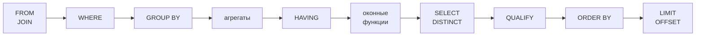

# SQL для MLE

> **Зачем эта глава.** SQL-секция на собеседовании MLE отсеивает больше кандидатов, чем секция
> по машинному обучению: человек, который свободно выводит формулу листа XGBoost, зависает
> на «посчитайте retention по когортам». Причина в том, что SQL учат как язык запросов,
> а спрашивают как язык описания данных: интервьюер смотрит, понимаете ли вы, во что превратится
> ваш `JOIN` физически и сколько это будет стоить. После главы вы будете писать оконные функции
> не по памяти, а по смыслу, увидите в плане запроса, где именно джоба стоит 40 минут вместо 40 секунд,
> и решите пятнадцать самых частых задач с собеседований, не подглядывая.

**Уровень:** 🌱 база → 🎯 middle → 🧠 middle+
**Предварительно нужно:** [хранение данных](01-storage-and-formats.md) (партиционирование, predicate pushdown); базовое знание `SELECT/WHERE/GROUP BY`
**Как проработать:** чтение + 15 задач руками

---

## Карта главы

- [1. Интуиция: почему SQL-секция валит ML-инженеров](#1-интуиция-почему-sql-секция-валит-ml-инженеров)
- [2. Порядок исполнения: что происходит между FROM и SELECT](#2-порядок-исполнения-что-происходит-между-from-и-select)
- [3. Джойны и их физическая стоимость](#3-джойны-и-их-физическая-стоимость)
- [4. Взрыв строк: главная ошибка в ML-датасетах](#4-взрыв-строк-главная-ошибка-в-ml-датасетах)
- [5. NULL-семантика как источник тихих багов](#5-null-семантика-как-источник-тихих-багов)
- [6. Оконные функции: полный разбор](#6-оконные-функции-полный-разбор)
- [7. Дедупликация: шесть способов и их цена](#7-дедупликация-шесть-способов-и-их-цена)
- [8. Работа со временем](#8-работа-со-временем)
- [9. Антипаттерны](#9-антипаттерны)
- [10. Чтение плана запроса](#10-чтение-плана-запроса)
- [11. Пятнадцать задач с собеседований с решениями](#11-пятнадцать-задач-с-собеседований-с-решениями)
- [12. Подводные камни](#12-подводные-камни)
- [13. Проверь себя](#13-проверь-себя)
- [14. Практика](#14-практика)
- [15. Что читать дальше](#15-что-читать-дальше)

---

## 1. Интуиция: почему SQL-секция валит ML-инженеров

Возьмём реальную ситуацию. Вам нужно собрать обучающую выборку: для каждого клика по товару —
признаки пользователя на момент клика. Логи кликов — 2 млрд строк за квартал, 300 ГБ в Parquet.
Снимки признаков — 50 млн пользователей × 90 суточных срезов = 4.5 млрд строк.

Джуниор пишет:

```sql
SELECT c.*, f.*
FROM clicks c
JOIN user_features f ON c.user_id = f.user_id
WHERE f.snapshot_date = c.click_date;
```

Запрос синтаксически верен. Он не завершится. Планировщик увидит `JOIN` по `user_id`,
условие `f.snapshot_date = c.click_date` окажется в `WHERE` (а фактически применится
после соединения — см. [§2](#2-порядок-исполнения-что-происходит-между-from-и-select)), и в промежуточном результате будет
$2\cdot10^9 \times 90 = 1.8\cdot10^{11}$ строк, из которых 99% сразу отбросятся.
Кластер уйдёт в spill на диск и упадёт через два часа по таймауту.

Тот же запрос, написанный с пониманием физики, отрабатывает за 6 минут. Разница —
не в знании синтаксиса, а в трёх вещах: куда попадёт условие, по какому ключу пойдёт shuffle
и сколько строк родится на каждую входную.

Именно это проверяет SQL-секция. Формально спрашивают «посчитайте retention» — фактически смотрят,
скажете ли вы «здесь будет `COUNT(DISTINCT)` по 200 млн строк, это дорого, давайте прикинем».

> 🌱 **База.** Если вы уверенно пишете `GROUP BY` и `JOIN`, но никогда не видели `OVER (PARTITION BY ...)` —
> читайте [§2](#2-порядок-исполнения-что-происходит-между-from-и-select), [§5](#5-null-семантика-как-источник-тихих-багов), [§6](#6-оконные-функции-полный-разбор) и решайте задачи 1–7 из [§11](#11-пятнадцать-задач-с-собеседований-с-решениями). Этого достаточно для скрининга.
> Разделы [§3](#3-джойны-и-их-физическая-стоимость) (физика джойнов), [§10](#10-чтение-плана-запроса) (планы) и задачи 8–15 — уже про грейд middle+.

---

## 2. Порядок исполнения: что происходит между FROM и SELECT

Первое, что нужно перестроить в голове: SQL пишется не в том порядке, в котором исполняется.
Логический порядок обработки такой:



Из этой картинки вытекают все «странности» SQL, на которых спотыкаются:

**Почему нельзя использовать алиас из `SELECT` в `WHERE`.** `WHERE` отрабатывает раньше, чем `SELECT`,
алиаса на тот момент ещё не существует. В `ORDER BY` — можно, он позже. (PostgreSQL и ClickHouse
делают тут послабления, стандарт — нет; на собеседовании безопаснее не использовать.)

**Почему нельзя фильтровать по оконной функции в `WHERE`.** Окна считаются после `WHERE`
и после `GROUP BY`. Поэтому классическая конструкция «топ-3 в группе» требует подзапроса:
сначала посчитали `ROW_NUMBER()`, потом во внешнем запросе отфильтровали. Диалекты Snowflake,
BigQuery, DuckDB, ClickHouse и Databricks дают на это синтаксический сахар `QUALIFY`;
в PostgreSQL и в открытом Spark SQL его нет — нужен подзапрос или CTE.

**Почему `HAVING` и `WHERE` — не одно и то же.** `WHERE` фильтрует строки до агрегации,
`HAVING` — группы после. Практическое следствие: условие, которое можно поставить в `WHERE`,
надо ставить в `WHERE`, потому что оно уменьшает объём данных до дорогих операций.

**Почему `LIMIT 10` не делает запрос дешёвым.** `LIMIT` — последний шаг. Если перед ним стоит
`ORDER BY` по неиндексированной колонке, движок обязан отсортировать весь результат.
Исключение — top-N sort: планировщик, увидев `ORDER BY ... LIMIT k`, держит в памяти кучу
размера $k$ вместо полной сортировки. В плане PostgreSQL это видно как `Sort Method: top-N heapsort`.

> ⚠️ **Типичная ошибка.** Ставить условие на правую таблицу `LEFT JOIN` в `WHERE`.
> Строки, где справа не нашлось пары, получают `NULL`, а любое сравнение с `NULL` даёт «неизвестно» —
> и `WHERE` их выбрасывает. `LEFT JOIN` тихо превращается в `INNER JOIN`.
> Правильно — переносить условие в `ON`:
> `LEFT JOIN orders o ON o.user_id = u.user_id AND o.status = 'paid'`.
> Это одна из двух-трёх ошибок, которые интервьюер проверяет специально.

---

## 3. Джойны и их физическая стоимость

Логически `JOIN` один. Физически движок выбирает из трёх алгоритмов, и разница между ними —
порядки величин. Обозначим: $|A|$ и $|B|$ — число строк в левой и правой таблицах,
$w_A$, $w_B$ — средняя ширина строки в байтах.

### 3.1. Nested loop join

Для каждой строки левой таблицы просматриваем правую.

$$
C_{\text{NL}} = |A| \cdot |B|
$$

где $C_{\text{NL}}$ — число сравнений. Без индекса это квадратично и применимо только к крошечным
таблицам. Но если по ключу правой таблицы есть индекс, стоимость становится

$$
C_{\text{NL-idx}} = |A| \cdot \big(\log_b |B| + m\big)
$$

где $b$ — фактор ветвления B-дерева (для PostgreSQL порядка 100–300 на страницу 8 КБ),
$m$ — среднее число строк-совпадений на один ключ. Практически: обход индекса — 3–4 обращения
к страницам, из page cache порядка 1–10 микросекунд, с NVMe-диска порядка 100 мкс.

**Когда его выбирает планировщик:** левая таблица маленькая (сотни–тысячи строк) и есть индекс справа.
Это же основной режим для OLTP-запросов «достань заказы одного пользователя».

**Когда это катастрофа:** планировщик недооценил $|A|$. Nested loop на 5 млн строк снаружи —
5 млн обращений к индексу, это десятки минут. Классический симптом плохой статистики.

### 3.2. Hash join

Строим хеш-таблицу по меньшей стороне (build side), потом прогоняем большую (probe side).

$$
C_{\text{HJ}} = |A| + |B|, \qquad M_{\text{HJ}} \approx |B_{\text{small}}| \cdot (w_B + h)
$$

где $M_{\text{HJ}}$ — требуемая память, $|B_{\text{small}}|$ — размер меньшей стороны в строках,
$h$ — накладные расходы на строку в хеш-таблице (в PostgreSQL порядка 50–100 байт: заголовок
кортежа, указатель на следующий элемент цепочки, выравнивание).

Числа для оценки на собеседовании: 1 млн строк по 60 байт полезных данных → хеш-таблица
порядка 110–160 МБ. При дефолтном `work_mem = 4MB` в PostgreSQL это не поместится, и движок
разобьёт джойн на батчи со сбросом на диск. В плане это видно как `Batches: 32`
(вместо `Batches: 1`) — прямой сигнал «подними `work_mem`».

```sql
-- Разовое поднятие памяти для аналитической сессии. Значение — на одну операцию сортировки/хеша,
-- а их в плане может быть несколько; при 20 параллельных сессиях 256 МБ × 20 × 2 = 10 ГБ RAM.
SET work_mem = '256MB';
```

**Условие применимости:** только эквиджойн (`ON a.k = b.k`). Для `ON a.x < b.y` хеш не построишь.

### 3.3. Sort-merge join

Обе стороны сортируются по ключу, потом сливаются одним проходом.

$$
C_{\text{SMJ}} = |A|\log|A| + |B|\log|B| + |A| + |B|
$$

Дороже hash join по CPU, но требует не памяти под всю сторону, а лишь буфера сортировки:
внешняя сортировка нормально работает со сбросом на диск. Это делает sort-merge рабочей лошадкой
распределённых движков: **Spark по умолчанию использует именно sort-merge join** для больших
таблиц, потому что hash join там означал бы «собери всю сторону в память одного экзекьютора».

Второй плюс: если данные уже отсортированы по ключу (кластеризованный индекс, бакетированная
таблица в Hive/Spark), сортировка пропускается и join становится дешевле хешевого.

### 3.4. Broadcast join (distributed hash join)

В распределённом движке у эквиджойна есть цена, которой нет в одиночной СУБД: **shuffle**.
Чтобы строки с одинаковым ключом попали на один узел, обе таблицы физически перегоняются
по сети с хешированием по ключу. Для 300 ГБ логов это 300 ГБ записи на локальный диск,
300 ГБ чтения по сети и сортировка — на кластере из 100 экзекьюторов это единицы минут
в лучшем случае и десятки — при перекосе.

Broadcast join убирает shuffle большой таблицы: маленькая таблица целиком рассылается
на все экзекьюторы, дальше локальный hash join.

```python
# Spark: явный бродкаст справочника
from pyspark.sql import functions as F

items = spark.read.parquet("s3://dwh/dim_items")        # 200 тыс. строк, ~20 МБ
events = spark.read.parquet("s3://dwh/events/dt=2026-07-25")  # 1.8 млрд строк, ~280 ГБ

joined = events.join(F.broadcast(items), on="item_id", how="left")
```

Рабочие настройки Spark, которые надо знать наизусть:

| Параметр | Дефолт | Что делает |
|---|---|---|
| `spark.sql.autoBroadcastJoinThreshold` | `10MB` | до какого размера таблицы бродкастить автоматически |
| `spark.sql.shuffle.partitions` | `200` | число партиций после shuffle |
| `spark.sql.adaptive.enabled` | `true` (с 3.2) | AQE: пересчёт плана по фактическим размерам |
| `spark.sql.adaptive.advisoryPartitionSizeInBytes` | `64MB` | целевой размер партиции при склейке AQE |
| `spark.sql.adaptive.skewJoin.enabled` | `true` | разбиение перекошенных партиций |

Практическое правило: если таблица меньше 100–200 МБ, поднимайте порог и бродкастьте
(`spark.sql.autoBroadcastJoinThreshold=200MB`) — это дешевле shuffle на порядок.
Выше 1 ГБ бродкаст опасен: таблица собирается на драйвере и рассылается, драйвер уходит в OOM.

### 3.5. Сводка: что выбрать и почему

| Алгоритм | Стоимость | Память | Условие | Когда выигрывает |
|---|---|---|---|---|
| Nested loop | $O(\|A\|\cdot\|B\|)$, с индексом $O(\|A\|\log\|B\|)$ | ~0 | любое условие | маленькая внешняя + индекс внутри |
| Hash join | $O(\|A\|+\|B\|)$ | вся build-сторона | только `=` | одиночная СУБД, одна сторона влезает в RAM |
| Sort-merge | $O(n\log n)$ | буфер сортировки | `=` и диапазоны | большие таблицы, распределённо, уже отсортированные данные |
| Broadcast hash | $O(\|A\|)$ + рассылка | размер малой таблицы × число узлов | только `=` | распределённо, одна сторона < 200 МБ |

> 💬 **На собеседовании.** Спросят: «Чем hash join отличается от sort-merge и как планировщик
> выбирает?» Хороший ответ: hash join строит хеш-таблицу по меньшей стороне и делает один проход
> по большей — линейно по времени, но требует, чтобы build-сторона поместилась в память
> (`work_mem` в PostgreSQL); при нехватке уходит в батчи со сбросом на диск. Sort-merge сортирует
> обе стороны — $O(n\log n)$ по CPU, зато нормально переживает внешнюю сортировку и умеет
> неравенства, поэтому это дефолт в Spark для больших таблиц. Планировщик считает оценочную
> стоимость по статистике: число строк, число уникальных значений ключа, ширина строки.
> Главная причина плохого выбора — устаревшая статистика; лечится `ANALYZE`.
> Плохой ответ: «hash join быстрее» — без условия применимости это неверно.

---

## 4. Взрыв строк: главная ошибка в ML-датасетах

Это отдельный раздел, потому что именно здесь ломаются обучающие выборки — тихо, без ошибок,
с испорченными метриками.

Если ключ соединения не уникален ни с одной стороны, число строк на выходе равно

$$
|A \bowtie_k B| = \sum_{v \in V} n_A(v) \cdot n_B(v)
$$

где $V$ — множество значений ключа $k$, $n_A(v)$ и $n_B(v)$ — сколько строк с этим значением
в таблицах $A$ и $B$. Если у пользователя 40 заказов и 12 сессий, на выходе будет 480 строк
вместо 40 или 12.

Последствия в ML-пайплайне:

- `SUM(amount)` завышается в $n_B(v)$ раз — модель учится на неправильном таргете;
- один объект попадает в выборку многократно и получает вес, пропорциональный числу дублей —
  это скрытое перевзвешивание, которое ломает и обучение, и валидацию;
- одинаковые строки попадают одновременно в train и test при случайном сплите — утечка
  (подробнее — [валидация и утечки](../02-classic-ml/13-validation-and-leakage.md)).

**Как ловить.** Перед джойном проверяйте гранулярность обеих сторон и после — общее число строк:

```sql
-- Гранулярность: сколько строк на ключ. Если max > 1 — ключ не уникален.
SELECT COUNT(*) AS rows_total,
       COUNT(DISTINCT user_id) AS keys,
       COUNT(*)::numeric / COUNT(DISTINCT user_id) AS rows_per_key
FROM user_features;

-- Инвариант после джойна: число строк не должно измениться,
-- если справа ключ уникален и джойн левый.
SELECT COUNT(*) FROM clicks;                    -- 1 843 220 116
SELECT COUNT(*) FROM clicks c LEFT JOIN f ...;  -- обязано совпасть
```

**Как чинить.** Три способа, в порядке предпочтения:

1. Агрегировать правую сторону до нужной гранулярности **до** джойна (`GROUP BY user_id`).
2. Если нужна ровно одна строка — брать её явно через `ROW_NUMBER() = 1` или `DISTINCT ON`.
3. Если нужен только факт наличия — использовать полусоединение вместо джойна:

```sql
-- SEMI JOIN: возвращает строки clicks, для которых есть хотя бы одна пара справа.
-- Число строк слева НЕ меняется, что бы ни было справа.
SELECT c.*
FROM clicks c
WHERE EXISTS (SELECT 1 FROM blacklist b WHERE b.user_id = c.user_id);

-- ANTI JOIN: строки без пары. Безопаснее, чем NOT IN (см. §5).
SELECT c.*
FROM clicks c
WHERE NOT EXISTS (SELECT 1 FROM blacklist b WHERE b.user_id = c.user_id);
```

В Spark SQL те же операции пишутся явно: `LEFT SEMI JOIN` и `LEFT ANTI JOIN`.
Они дешевле обычного джойна, потому что движку достаточно найти первое совпадение и не нужно
материализовать пары.

> 🧠 **Middle+.** Перекос (skew) — частный случай той же формулы. Если один `user_id`
> (например, технический аккаунт или `NULL`, схлопнутый в `-1`) встречается 200 млн раз,
> его партиция после shuffle будет в тысячи раз больше остальных: 199 задач завершатся
> за минуту, одна будет работать час и упадёт по OOM. Диагностика — гистограмма частот ключа.
> Лечение: `spark.sql.adaptive.skewJoin.enabled=true`, вынос «горячих» ключей в отдельный
> бродкаст-джойн, либо salting — добавление случайного суффикса к ключу с последующим
> размножением справочника. Подробнее — в главе [Spark: производительность](04-spark-tuning.md).

---

## 5. NULL-семантика как источник тихих багов

`NULL` — это не значение, а «неизвестно». SQL использует трёхзначную логику: `TRUE`, `FALSE`, `UNKNOWN`.
Любое сравнение с `NULL` даёт `UNKNOWN`, а `WHERE` пропускает только `TRUE`.

Отсюда пять ловушек, каждая из которых встречается на собеседовании.

**1. `NULL = NULL` — не истина.**

```sql
SELECT NULL = NULL;              -- NULL, не TRUE
SELECT NULL IS NOT DISTINCT FROM NULL;  -- TRUE (PostgreSQL, стандарт)
```

В Spark для этого есть оператор `<=>` (null-safe equal). Это важно при джойне по колонке,
где `NULL` означает «нет значения»: строки с `NULL` в ключе **никогда** не соединятся —
ни в `INNER`, ни фактически в `LEFT` (справа будет `NULL`).

**2. `NOT IN` с подзапросом, содержащим `NULL`, возвращает пусто.**

```sql
-- Если в manager_id есть хотя бы один NULL — результат ВСЕГДА пустой
SELECT * FROM employees
WHERE id NOT IN (SELECT manager_id FROM employees);
```

Разбор: `id NOT IN (1, 2, NULL)` разворачивается в `id <> 1 AND id <> 2 AND id <> NULL`.
Последний конъюнкт — `UNKNOWN`, а `TRUE AND UNKNOWN = UNKNOWN`. Строка не проходит.
Лечение: `NOT EXISTS` (иммунен к `NULL`) или `WHERE manager_id IS NOT NULL` в подзапросе.

**3. Агрегаты игнорируют `NULL`, кроме `COUNT(*)`.**

```sql
-- rating: [5, 4, NULL, NULL]
SELECT COUNT(*),        -- 4
       COUNT(rating),   -- 2
       AVG(rating),     -- 4.5, а не 2.25!
       SUM(rating)      -- 9
FROM reviews;
```

Это ровно то место, где расходятся «средний рейтинг» в отчёте аналитика и в дашборде.
Если пропуск означает «не оценил» — `AVG` корректен. Если пропуск означает «оценка 0
не записалась из-за бага» — `AVG` завышен. Решайте явно: `AVG(COALESCE(rating, 0))`.

И отдельно: **`SUM` по пустому множеству даёт `NULL`, а не 0.** В отчёте это превращается
в дырку вместо нуля. `COALESCE(SUM(x), 0)`.

**4. Деление на ноль и `NULLIF`.**

```sql
-- Падает при impressions = 0
SELECT clicks::numeric / impressions AS ctr FROM stats;

-- Возвращает NULL вместо ошибки — это правильное поведение для метрики
SELECT clicks::numeric / NULLIF(impressions, 0) AS ctr FROM stats;
```

**5. Порядок сортировки `NULL` различается между движками.**

| Движок | `ORDER BY x ASC` | `ORDER BY x DESC` |
|---|---|---|
| PostgreSQL | `NULL` в конце | `NULL` в начале |
| Spark SQL | `NULL` в начале | `NULL` в конце |
| Oracle | `NULL` в конце | `NULL` в начале |

Практическое следствие: `ROW_NUMBER() OVER (ORDER BY updated_at DESC)` для выбора «последней
записи» в PostgreSQL поставит на первое место строку с `NULL` в `updated_at`. Всегда пишите
`ORDER BY updated_at DESC NULLS LAST` — это переносимо и однозначно.

> 💬 **На собеседовании.** Спросят: «Ваш запрос с `NOT IN` вернул ноль строк, хотя данные точно есть.
> Что случилось?» Хороший ответ: в подзапросе есть `NULL`, `NOT IN` разворачивается в цепочку
> `<>` через `AND`, сравнение с `NULL` даёт `UNKNOWN`, вся конъюнкция становится `UNKNOWN`,
> и `WHERE` отбрасывает все строки. Замена — `NOT EXISTS` либо `LEFT JOIN ... WHERE right.key IS NULL`,
> оба варианта корректно работают с `NULL`. Дополнительный балл: сказать, что `NOT EXISTS`
> обычно ещё и быстрее, потому что превращается в anti-join, а `NOT IN` планировщик часто
> не может так оптимизировать именно из-за `NULL`-семантики.
> Плохой ответ: «наверное, данных нет».

---

## 6. Оконные функции: полный разбор

Оконные функции решают задачу, для которой `GROUP BY` не приспособлен: посчитать агрегат
по группе, **не схлопывая строки**. «Зарплата сотрудника и средняя по его отделу в одной строке»,
«разница с предыдущим событием пользователя», «доля товара в выручке категории».

### 6.1. Анатомия окна

```sql
<функция>(аргументы) OVER (
    PARTITION BY <разбиение>     -- на какие группы делим; аналог GROUP BY, но строки остаются
    ORDER BY <сортировка>        -- порядок внутри группы; для ранжирования и рамок
    <рамка>                      -- какие строки группы попадают в расчёт для текущей строки
)
```

Физически это работает так: движок делает shuffle по `PARTITION BY` (в распределённом движке —
сеть, в одиночной СУБД — хеш или сортировка), потом сортирует каждую партицию по `ORDER BY`,
потом одним проходом считает функцию. Отсюда два практических следствия:

- **окно без `PARTITION BY` — это одна партиция на всех.** В Spark это означает сбор всех данных
  на один экзекьютор и почти гарантированный OOM на больших таблицах. В плане Spark вы увидите
  `Exchange SinglePartition` — красный флаг;
- **несколько окон с одинаковой спецификацией считаются за один проход.** Разные спецификации —
  разные сортировки. Поэтому `ROW_NUMBER() OVER (PARTITION BY a ORDER BY t)` и
  `SUM(x) OVER (PARTITION BY a ORDER BY t)` дёшевы вместе, а добавление третьего окна
  с `PARTITION BY b` удваивает стоимость.

### 6.2. Три функции ранжирования и разница между ними

Это спрашивают почти всегда. Пусть зарплаты в отделе: 100, 90, 90, 80.

| Зарплата | `ROW_NUMBER()` | `RANK()` | `DENSE_RANK()` |
|---|---|---|---|
| 100 | 1 | 1 | 1 |
| 90 | 2 | 2 | 2 |
| 90 | 3 | 2 | 2 |
| 80 | 4 | 4 | 3 |

- **`ROW_NUMBER()`** — сквозная нумерация. Одинаковым значениям даёт разные номера,
  **порядок между ними недетерминирован**, если не задан tie-breaker. Это функция «выбрать ровно одну строку».
- **`RANK()`** — одинаковым значениям одинаковый ранг, следующий ранг «перепрыгивает» пропущенные
  (после двух вторых мест идёт четвёртое). Это спортивная семантика.
- **`DENSE_RANK()`** — одинаковым одинаковый, без разрывов. Это функция «N-е по величине **значение**».

Практический критерий выбора: нужна одна строка на группу → `ROW_NUMBER`; нужно «второе
по величине значение» → `DENSE_RANK`; нужно «сколько человек строго выше меня» → `RANK`.

> ⚠️ **Типичная ошибка.** `ROW_NUMBER() OVER (PARTITION BY user_id ORDER BY event_date)`
> без уникального tie-breaker при дублирующихся датах. Запрос выдаёт разный результат
> при повторных запусках — при разном числе партиций, при перезапуске задачи, при спекулятивном
> выполнении в Spark. Пайплайн «мигает», а причину ищут неделями. Всегда добавляйте
> детерминирующее поле: `ORDER BY event_date, event_id`.

### 6.3. LAG и LEAD: доступ к соседним строкам

```sql
LAG(expr, offset, default) OVER (PARTITION BY ... ORDER BY ...)
LEAD(expr, offset, default) OVER (...)
```

`LAG` смотрит назад на `offset` строк (по умолчанию 1), `LEAD` — вперёд. `default` подставляется
на границе вместо `NULL`. Это основной инструмент для всего, что связано с последовательностями:

```sql
SELECT user_id, event_ts,
       LAG(event_ts) OVER w                                 AS prev_ts,
       event_ts - LAG(event_ts) OVER w                      AS gap,
       LEAD(page) OVER w                                    AS next_page,
       -- признак «первое событие пользователя»
       LAG(event_ts) OVER w IS NULL                         AS is_first
FROM events
WINDOW w AS (PARTITION BY user_id ORDER BY event_ts, event_id);
```

Конструкция `WINDOW w AS (...)` (стандарт, поддерживается PostgreSQL и Spark) избавляет
от копипасты спецификации и заодно гарантирует, что все функции используют **одно** окно —
то есть один проход.

Для ML это заготовка признаков: время с прошлого визита, длина серии, изменение цены,
разница между последними двумя оценками.

### 6.4. Рамки: ROWS, RANGE и GROUPS

Здесь находится самый коварный дефолт в SQL. Рамка (frame) определяет, какие строки партиции
участвуют в расчёте для текущей строки.

```
{ROWS | RANGE | GROUPS} BETWEEN <начало> AND <конец>

<начало>/<конец> ::= UNBOUNDED PRECEDING | <n> PRECEDING | CURRENT ROW
                   | <n> FOLLOWING | UNBOUNDED FOLLOWING
```

- **`ROWS`** — физические строки: «три строки назад» значит ровно три строки.
- **`RANGE`** — логический диапазон **значений** `ORDER BY`: `CURRENT ROW` в `RANGE`
  означает «текущая строка и все её peers — строки с тем же значением сортировки».
- **`GROUPS`** — группами peers: «две группы одинаковых значений назад» (PostgreSQL 11+).

**Дефолт, который надо помнить:** если указан `ORDER BY` и не указана рамка, действует
`RANGE BETWEEN UNBOUNDED PRECEDING AND CURRENT ROW`. Если `ORDER BY` не указан вовсе —
`ROWS BETWEEN UNBOUNDED PRECEDING AND UNBOUNDED FOLLOWING` (вся партиция).

> 📐 **Разбор.** Почему это важно. Пусть у пользователя два события с **одинаковым** `event_ts`
> и суммами 10 и 20.
>
> ```sql
> SUM(amount) OVER (PARTITION BY user_id ORDER BY event_ts)                                -- RANGE (дефолт)
> SUM(amount) OVER (PARTITION BY user_id ORDER BY event_ts ROWS UNBOUNDED PRECEDING)       -- ROWS
> ```
>
> Первый вариант обеим строкам даст 30: они peers, `RANGE ... CURRENT ROW` включает обе.
> Второй даст 10 и 30 — накопление по физическим строкам.
> Для кумулятивной суммы почти всегда нужен второй. Для сессионизации (задача 3 в [§11](#11-пятнадцать-задач-с-собеседований-с-решениями))
> дефолтный `RANGE` даёт прямой баг: два события с одинаковой меткой времени схлопнутся
> в одну сессию неправильно. **Пишите `ROWS` явно.**

Практические рамки, которые нужны в работе:

```sql
-- Кумулятивная сумма (накопительный итог)
SUM(amount) OVER (PARTITION BY user_id ORDER BY ts ROWS BETWEEN UNBOUNDED PRECEDING AND CURRENT ROW)

-- Скользящее среднее по 7 физическим строкам (текущая + 6 предыдущих)
AVG(value) OVER (ORDER BY dt ROWS BETWEEN 6 PRECEDING AND CURRENT ROW)

-- Скользящая сумма за календарные 7 дней — устойчива к пропущенным датам (PostgreSQL 11+)
SUM(value) OVER (ORDER BY dt RANGE BETWEEN INTERVAL '6 days' PRECEDING AND CURRENT ROW)

-- Центрированное окно: 3 назад, 3 вперёд
AVG(value) OVER (ORDER BY dt ROWS BETWEEN 3 PRECEDING AND 3 FOLLOWING)

-- Доля строки в итоге группы (рамка «вся партиция» — потому что ORDER BY нет)
amount / SUM(amount) OVER (PARTITION BY category)
```

В Spark SQL рамки `RANGE` с интервалами работают надёжнее, если сортировать по числу секунд:

```sql
SUM(value) OVER (
  PARTITION BY user_id
  ORDER BY CAST(event_ts AS BIGINT)          -- unix-время в секундах
  RANGE BETWEEN 604800 PRECEDING AND CURRENT ROW   -- 7 суток = 604800 с
) AS sum_7d
```

### 6.5. Остальные функции, которые реально нужны

```sql
FIRST_VALUE(x) OVER w          -- первое значение в рамке
LAST_VALUE(x)  OVER w          -- последнее в РАМКЕ, а не в партиции (см. ниже)
NTH_VALUE(x, 3) OVER w         -- третье
NTILE(10) OVER (ORDER BY score DESC)   -- разбиение на 10 равных частей — децили
PERCENT_RANK() OVER (ORDER BY x)       -- (rank - 1) / (n - 1)
CUME_DIST() OVER (ORDER BY x)          -- доля строк со значением <= текущего
```

> ⚠️ **Типичная ошибка.** `LAST_VALUE(x) OVER (PARTITION BY u ORDER BY t)` возвращает
> **текущую строку**, а не последнюю в партиции. Причина — дефолтная рамка обрывается
> на `CURRENT ROW`. Правильно:
> `LAST_VALUE(x) OVER (PARTITION BY u ORDER BY t ROWS BETWEEN UNBOUNDED PRECEDING AND UNBOUNDED FOLLOWING)`.
> Либо эквивалентно и дешевле — `FIRST_VALUE(x) OVER (PARTITION BY u ORDER BY t DESC)`.

`NTILE` заслуживает отдельного слова: это готовый инструмент для бакетирования в A/B-анализе
и для построения децильных таблиц по скору модели. Учтите, что при неделящемся нацело $n$
первые бакеты получают на одну строку больше, и при большом числе одинаковых значений
границы бакетов будут «резать» равные скоры — для монотонных отчётов по скору лучше
`WIDTH_BUCKET` или явные пороги.

> 💬 **На собеседовании.** Спросят: «Чем `RANK` отличается от `DENSE_RANK` и когда разница
> критична?» Хороший ответ: обе дают одинаковый ранг равным значениям, но `RANK` пропускает
> следующие номера (1,2,2,4), а `DENSE_RANK` — нет (1,2,2,3). Критично в задаче «N-я по величине
> зарплата»: с `RANK` при двух одинаковых максимумах вторая по величине зарплата вообще
> не получит ранг 2, и запрос вернёт пусто. Поэтому для «N-е по величине значение» —
> `DENSE_RANK`, а для «выбрать одну строку из группы» — `ROW_NUMBER` с детерминированным
> tie-breaker. Плохой ответ: перечислить определения и не привести случай, где выбор меняет результат.

---

## 7. Дедупликация: шесть способов и их цена

Дубликаты в логах — норма, а не исключение: Kafka даёт at-least-once, ретраи продюсера
порождают повторы, backfill накладывается на инкремент. Дедупликация — обязательный шаг
почти любого ML-пайплайна.

Сначала определитесь, **что такое дубликат**: полностью идентичные строки или строки
с одинаковым бизнес-ключом (`event_id`), но разным временем прихода? Это разные задачи.

**Способ 1. `DISTINCT` — только для полностью идентичных строк.**

```sql
SELECT DISTINCT user_id, item_id, event_ts FROM events;
```
Цена: hash-агрегация или сортировка по всем колонкам, $O(n)$ памяти под уникальные значения.
Не работает, если у дублей различается хоть одна техническая колонка (`ingested_at`, `partition_offset`) —
а она различается почти всегда.

**Способ 2. `ROW_NUMBER()` — универсальный, работает везде.**

```sql
SELECT user_id, item_id, event_ts, payload
FROM (
  SELECT *,
         ROW_NUMBER() OVER (
           PARTITION BY event_id                  -- бизнес-ключ
           ORDER BY ingested_at DESC, offset DESC -- какую копию считаем «правильной»
         ) AS rn
  FROM raw_events
) t
WHERE rn = 1;
```
Цена: shuffle по `event_id` + сортировка внутри партиции. Плюс: явно контролируете, какая
копия выживет. Это версия по умолчанию.

**Способ 3. `QUALIFY` — тот же способ 2 без подзапроса.**

```sql
-- Snowflake, BigQuery, DuckDB, ClickHouse, Databricks
SELECT *
FROM raw_events
QUALIFY ROW_NUMBER() OVER (PARTITION BY event_id ORDER BY ingested_at DESC) = 1;
```

**Способ 4. `DISTINCT ON` — только PostgreSQL, но самый лаконичный.**

```sql
SELECT DISTINCT ON (event_id) *
FROM raw_events
ORDER BY event_id, ingested_at DESC;   -- ORDER BY обязан начинаться с ключа DISTINCT ON
```
Часто дешевле окна: PostgreSQL может использовать индекс `(event_id, ingested_at DESC)`
и взять первую строку каждой группы без сортировки всего набора.

**Способ 5. `GROUP BY` с агрегатами — опасен.**

```sql
-- НЕ ДЕЛАЙТЕ ТАК
SELECT event_id, MAX(price) AS price, MAX(country) AS country, MAX(ts) AS ts
FROM raw_events GROUP BY event_id;
```
Проблема: `MAX` берётся независимо по каждой колонке, и вы собираете строку-франкенштейна,
которой не было в данных: цена от одной копии, страна от другой. В отчёте это незаметно,
в обучающей выборке — источник необъяснимого падения качества. Допустимо только когда
все дубли гарантированно идентичны по этим полям.

Корректный вариант — «взять всю строку с максимальным ключом» через кортежные агрегаты:

```sql
-- ClickHouse: argMax возвращает значение одной колонки в строке с максимумом другой
SELECT event_id, argMax(price, ingested_at) AS price, argMax(country, ingested_at) AS country
FROM raw_events GROUP BY event_id;

-- Spark: max по структуре — сравнение идёт по первому полю
SELECT event_id, MAX(STRUCT(ingested_at, price, country)).price AS price
FROM raw_events GROUP BY event_id;
```

**Способ 6. Движковые механизмы.** ClickHouse `LIMIT 1 BY event_id`, `ReplacingMergeTree` + `FINAL`;
Delta Lake `MERGE INTO ... WHEN NOT MATCHED THEN INSERT`; Spark `dropDuplicates(["event_id"])`.
Про последний важно знать: **`dropDuplicates` не гарантирует, какая строка останется** —
это не эквивалент `ROW_NUMBER()=1`, а «любая». Для воспроизводимого пайплайна не годится.

> 🧠 **Middle+.** Дедупликация — самая дорогая операция в стриминговых пайплайнах, потому что
> требует состояния: чтобы понять, видели ли мы `event_id`, надо помнить все `event_id`.
> В батче это shuffle по ключу. В стриме — state store с TTL: держим ключи, скажем, 24 часа
> и принимаем, что дубль, пришедший через 25 часов, пролезет. Точный ответ на собеседовании
> звучит так: «дедуплицирую по `event_id` в окне, равном максимальной задержке доставки
> с запасом ×2; для проверки на бесконечном горизонте использую вероятностную структуру —
> Bloom filter — и осознанно принимаю ложноположительные срабатывания порядка 1%».

---

## 8. Работа со временем

Половина багов в аналитических пайплайнах — про время. Вот минимум, который надо держать в голове.

**Таймзоны.** Правило: **храните UTC, конвертируйте на выводе**. `TIMESTAMP WITHOUT TIME ZONE`
не хранит зону — это просто «числа на стене», и склеивать такие метки из разных источников нельзя.
`TIMESTAMPTZ` в PostgreSQL хранит момент времени и конвертирует при выводе в зону сессии.

```sql
-- Дневные агрегаты по московскому времени из UTC-меток
SELECT DATE_TRUNC('day', event_ts AT TIME ZONE 'Europe/Moscow') AS msk_day,
       COUNT(*)
FROM events
GROUP BY 1;
```

Практическая цена ошибки: сутки, посчитанные по UTC вместо локального времени, сдвигают
вечерний пик активности в следующий день. Метрика «конверсия по дням» начинает
колебаться, и это списывают на сезонность.

**Усечение и границы.** `DATE_TRUNC('week', ts)` в PostgreSQL даёт понедельник (ISO),
в BigQuery по умолчанию воскресенье — при переносе запросов это ломает недельные когорты.
Проверяйте явно.

**Интервалы задавайте полуоткрытыми.** `BETWEEN` включает обе границы, и на `timestamp`
это порождает двойной учёт и потерю данных:

```sql
-- ПЛОХО: захватит ровно полночь 2 июля и потеряет 1 июля 23:59:59.7
WHERE ts BETWEEN '2026-07-01' AND '2026-07-02'

-- ХОРОШО: полуинтервал [начало, конец), без дырок и пересечений
WHERE ts >= '2026-07-01' AND ts < '2026-07-02'
```

Второй вариант ещё и sargable — то есть по нему работает индекс и partition pruning (см. §9).

**Календарная опора (date spine).** Если в данных нет событий за какой-то день,
его не будет и в `GROUP BY` — в графике появится не ноль, а разрыв, а скользящие окна
по `ROWS` посчитают неверно. Генерируйте календарь и делайте `LEFT JOIN` к нему:

```sql
-- PostgreSQL
SELECT d.dt, COALESCE(COUNT(e.event_id), 0) AS events
FROM generate_series(DATE '2026-06-01', DATE '2026-06-30', INTERVAL '1 day') AS d(dt)
LEFT JOIN events e ON e.event_ts >= d.dt AND e.event_ts < d.dt + INTERVAL '1 day'
GROUP BY d.dt ORDER BY d.dt;
```

В Spark: `SELECT explode(sequence(DATE'2026-06-01', DATE'2026-06-30', INTERVAL 1 DAY)) AS dt`.

**Point-in-time корректность.** Это главная связка SQL и ML. Признак, посчитанный «на сейчас»,
и присоединённый к событию из прошлого — прямая утечка таргета. Правильный джойн всегда
содержит условие «версия признака действовала на момент события» (задача 11 в §11 и глава
[данные и feature store](../07-mlops/03-data-and-feature-store.md)).

---

## 9. Антипаттерны

**`SELECT *`.** В строковой СУБД это лишний трафик; в колоночном хранилище — катастрофа.
Смысл Parquet в том, чтобы читать только нужные колонки: из таблицы в 200 колонок и 300 ГБ
запрос по пяти колонкам прочитает 8–10 ГБ. `SELECT *` читает все 300 ГБ — в 30 раз дороже
(детали — в главе [хранение данных](01-storage-and-formats.md)). Вторая беда — хрупкость:
добавили колонку в источник, и `INSERT ... SELECT *` вниз по пайплайну сломался.

**Функция на фильтруемой колонке (не-sargable предикат).**

```sql
-- ПЛОХО: индекс по created_at не применим, полное сканирование
WHERE DATE(created_at) = '2026-07-01'
WHERE EXTRACT(YEAR FROM created_at) = 2026
WHERE user_id::text LIKE '123%'
WHERE LOWER(email) = 'a@b.ru'

-- ХОРОШО: предикат sargable, работает индекс и partition pruning
WHERE created_at >= '2026-07-01' AND created_at < '2026-07-02'
WHERE created_at >= '2026-01-01' AND created_at < '2027-01-01'
WHERE user_id BETWEEN 1230000 AND 1239999
-- либо построить функциональный индекс:
CREATE INDEX idx_users_email_lower ON users (LOWER(email));
```

В озере данных цена ещё выше: `WHERE DATE(event_ts) = '2026-07-01'` на таблице,
партиционированной по колонке `dt`, отключает partition pruning и заставляет прочитать
все партиции. Фильтруйте по самой колонке партиционирования: `WHERE dt = '2026-07-01'`.

**Неявное приведение типов.** `WHERE user_id = '12345'`, где `user_id` — `bigint`:
в лучшем случае движок приведёт литерал и всё сработает, в худшем — приведёт колонку
и потеряет индекс. В Spark сравнение `string` и `int` может дать `NULL` вместо ошибки
и тихо выбросить строки. Приводите типы явно и одинаково с обеих сторон джойна.

**Коррелированный подзапрос в `SELECT`.**

```sql
-- ПЛОХО: подзапрос выполняется для каждой строки внешнего запроса.
-- На 1 млн строк — 1 млн обращений к orders.
SELECT u.user_id,
       (SELECT COUNT(*) FROM orders o WHERE o.user_id = u.user_id) AS n_orders,
       (SELECT MAX(amount) FROM orders o WHERE o.user_id = u.user_id) AS max_amount
FROM users u;

-- ХОРОШО: один проход по orders, один hash join
SELECT u.user_id, COALESCE(a.n_orders, 0) AS n_orders, a.max_amount
FROM users u
LEFT JOIN (
  SELECT user_id, COUNT(*) AS n_orders, MAX(amount) AS max_amount
  FROM orders GROUP BY user_id
) a ON a.user_id = u.user_id;
```

Оговорка честности: современные планировщики (PostgreSQL, Snowflake) часто умеют
декоррелировать такие подзапросы и превращать их в джойн. Но «часто» — не «всегда»:
как только внутри появляется `LIMIT`, `ORDER BY` или пользовательская функция,
декорреляция ломается. В Spark коррелированные подзапросы поддерживаются ограниченно,
и там это просто не заработает.

**`DISTINCT` как затычка над сломанным джойном.** Симптом: запрос возвращает дубли,
разработчик добавляет `DISTINCT`, дубли пропадают. Проблема в том, что дубли —
следствие взрыва строк ([§4](#4-взрыв-строк-главная-ошибка-в-ml-датасетах)), и `SUM`, посчитанный до `DISTINCT`, всё равно завышен.
`DISTINCT` маскирует симптом и добавляет полную сортировку/хеширование сверху.
Правильная реакция — найти, какая сторона джойна неуникальна.

**`COUNT(DISTINCT x)` на больших данных.** Это точный подсчёт уникальных, требующий
удержания всех уникальных значений: 200 млн уникальных `user_id` по 8 байт — это минимум
1.6 ГБ только на значения, плюс структура хеш-множества. В распределённом движке добавляется
shuffle. Когда точность до единицы не нужна (а для DAU/WAU она не нужна), используйте
приближённый подсчёт на HyperLogLog:

```sql
-- Spark: rsd — относительная стандартная ошибка, дефолт 0.05
SELECT approx_count_distinct(user_id, 0.01) AS dau FROM events;
-- ClickHouse
SELECT uniq(user_id) FROM events;
-- BigQuery / Snowflake
SELECT APPROX_COUNT_DISTINCT(user_id) FROM events;
```

Относительная стандартная ошибка HyperLogLog:

$$
\varepsilon \approx \frac{1.04}{\sqrt{m}}
$$

где $m$ — число регистров структуры, $\varepsilon$ — относительная стандартная ошибка оценки
числа уникальных. При $m = 2^{14} = 16384$ получаем $\varepsilon \approx 0.8\%$ при расходе
памяти около 16 КБ — против гигабайтов у точного подсчёта. Для DAU в 10 млн это ошибка
порядка ±80 тыс., что несущественно для тренда и абсолютно неприемлемо для биллинга.
Выбор — осознанный.

**Множественные `COUNT(DISTINCT)` в одном запросе.** Каждый требует своего состояния;
пять таких в одном `SELECT` на 2 млрд строк — почти гарантированный OOM. Разбивайте
на несколько проходов или считайте приближённо.

> 💬 **На собеседовании.** Спросят: «Запрос к таблице на 500 млн строк выполняется 40 минут.
> С чего начнёте?» Хороший ответ выстраивает воронку: (1) смотрю `EXPLAIN ANALYZE` — где
> реально уходит время и где оценка строк расходится с фактом; (2) проверяю, сколько байт
> прочитано и работает ли partition pruning — часто проблема в том, что фильтр по дате
> обёрнут функцией; (3) смотрю, какие колонки реально нужны — `SELECT *` на колоночном
> хранилище даёт кратный оверхед; (4) смотрю тип джойна и есть ли перекос по ключу;
> (5) проверяю, не ушла ли сортировка или хеш на диск (`external merge`, `Batches > 1`) —
> это лечится памятью. Плохой ответ: «добавлю индекс» — до анализа плана это гадание,
> а в колоночном хранилище индексов в привычном смысле вообще нет.

---

## 10. Чтение плана запроса

Умение читать план — то, что отделяет «пишу SQL» от «отвечаю за пайплайн».

### 10.1. PostgreSQL

```sql
EXPLAIN (ANALYZE, BUFFERS, FORMAT TEXT)
SELECT u.country, COUNT(*) AS cnt
FROM events e
JOIN users u ON u.user_id = e.user_id
WHERE e.event_ts >= '2026-07-01'
GROUP BY u.country ORDER BY cnt DESC LIMIT 10;
```

Ключевое различие: `EXPLAIN` показывает **оценку** планировщика, `EXPLAIN ANALYZE` реально
выполняет запрос и показывает **факт**. Для `INSERT`/`UPDATE` оборачивайте в транзакцию с `ROLLBACK`.

Типичный вывод с проблемой:

```
Limit  (cost=2841203.55..2841203.58 rows=10 width=40)
       (actual time=214882.1..214882.2 rows=10 loops=1)
  ->  Sort  (cost=2841203.55..2841204.05 rows=200 width=40)
            (actual time=214882.1..214882.1 rows=10 loops=1)
        Sort Key: (count(*)) DESC
        Sort Method: top-N heapsort  Memory: 26kB
        ->  HashAggregate  (cost=2841197.24..2841199.24 rows=200 width=40)
                           (actual time=214881.0..214881.9 rows=214 loops=1)
              Group Key: u.country
              ->  Hash Join  (cost=1892340.00..2790112.00 rows=10216848 width=8)
                             (actual time=98211.3..205431.7 rows=487221904 loops=1)
                    Hash Cond: (e.user_id = u.user_id)
                    ->  Seq Scan on events e  (cost=0.00..712004.00 rows=10216848 width=8)
                                              (actual time=0.1..71203.4 rows=487221904 loops=1)
                          Filter: (event_ts >= '2026-07-01'::timestamp)
                          Rows Removed by Filter: 1356010212
                    ->  Hash  (cost=1421002.00..1421002.00 rows=48000000 width=12)
                              (actual time=98210.1..98210.1 rows=48213004 loops=1)
                          Buckets: 65536  Batches: 64  Memory Usage: 3841kB
                          ->  Seq Scan on users u  (...)
Planning Time: 0.9 ms
Execution Time: 214883.4 ms
```

Как это читается — снизу вверх, изнутри наружу. Четыре красных флага в этом плане:

1. **`rows=10216848` против `actual rows=487221904`** — планировщик ошибся в 48 раз.
   Причина почти всегда одна: устаревшая статистика. Лечение — `ANALYZE events;`
   и, если распределение сложное, `ALTER TABLE ... ALTER COLUMN ... SET STATISTICS 500;`.
2. **`Rows Removed by Filter: 1356010212`** — движок прочитал 1.8 млрд строк, чтобы отбросить 1.36 млрд.
   Значит, по `event_ts` нет ни индекса, ни партиционирования. Это главный источник 71 секунды скана.
3. **`Batches: 64`** в узле `Hash` — хеш-таблица не поместилась в `work_mem` и была разбита
   на 64 батча со сбросом на диск. `Memory Usage: 3841kB` при `work_mem = 4MB` — прямое указание,
   что нужно поднять память.
4. **`Hash` строится по `users` (48 млн строк), а не по отфильтрованным `events`** — планировщик
   выбрал build-сторону по своей (неверной) оценке. После `ANALYZE` выбор изменится.

Полезные флаги: `BUFFERS` показывает `shared hit` (из кэша) против `shared read` (с диска) —
если `read` большой, данные не в кэше; `VERBOSE` — какие именно колонки протаскиваются;
`SETTINGS` — какие параметры отличаются от дефолтных.

Для разбора длинных планов используйте визуализатор [explain.depesz.com](https://explain.depesz.com/) —
он подсвечивает узлы, где расхождение оценки и факта максимально.

### 10.2. Spark

```python
df.explain(mode="formatted")     # или spark.sql("EXPLAIN FORMATTED SELECT ...").show(truncate=False)
```

Что искать в физическом плане:

| Узел | Что означает | Реакция |
|---|---|---|
| `Exchange hashpartitioning(user_id, 200)` | shuffle по ключу | посчитать объём; можно ли обойтись бродкастом |
| `Exchange SinglePartition` | всё сводится на один экзекьютор | почти всегда баг: окно без `PARTITION BY` или `ORDER BY` без `LIMIT` |
| `BroadcastHashJoin` | малая сторона разослана | хорошо, но проверьте её реальный размер |
| `SortMergeJoin` | обе стороны сортируются | если малая сторона < 200 МБ — поднять `autoBroadcastJoinThreshold` |
| `PushedFilters: [GreaterThanOrEqual(event_ts,...)]` | фильтр ушёл в чтение Parquet | если фильтра тут нет — predicate pushdown не сработал |
| `PartitionFilters: [dt = 2026-07-25]` | partition pruning работает | пусто → читаются все партиции |
| `AQEShuffleRead coalesced` | AQE склеил мелкие партиции | норма |

Важнее плана — **вкладка SQL в Spark UI**: там видно фактическое число строк на каждой стадии
и распределение времени задач. Если в стадии медиана задачи 20 секунд, а максимум 45 минут —
это перекос, а не «Spark тормозит».

> ⌨️ **Руками.** Возьмите любой рабочий запрос длиннее 20 строк, снимите `EXPLAIN ANALYZE`
> и найдите узел с максимальным `actual time` (учитывая, что время в узле включает время потомков —
> вычитайте). Затем найдите узел с максимальным отношением `actual rows / estimated rows`.
> Пятнадцать минут этого упражнения дают больше, чем любая статья про оптимизацию.

---

## 11. Пятнадцать задач с собеседований с решениями

Схема данных, единая для задач (можно считать типовой для маркетплейса):

```sql
events(event_id BIGINT, user_id BIGINT, session_id TEXT, event_type TEXT,
       item_id BIGINT, amount NUMERIC, event_ts TIMESTAMPTZ, dt DATE)
users(user_id BIGINT, country TEXT, registered_at TIMESTAMPTZ)
orders(order_id BIGINT, user_id BIGINT, amount NUMERIC, status TEXT, order_ts TIMESTAMPTZ)
employees(id BIGINT, department_id INT, salary NUMERIC)
```

---

### Задача 1. Вторая по величине зарплата 🌱

> Найдите вторую по величине зарплату. Если её нет — верните `NULL`.

```sql
SELECT MAX(salary) AS second_salary
FROM employees
WHERE salary < (SELECT MAX(salary) FROM employees);
```

**Разбор.** Два прохода по таблице, оба — простая агрегация без сортировки. Важная деталь:
`MAX` по пустому множеству даёт `NULL`, поэтому требование «вернуть `NULL`, если нет второй»
выполняется автоматически. Вариант через `ORDER BY salary DESC LIMIT 1 OFFSET 1` вернёт
**ноль строк**, а не `NULL`, и сломается на дубликатах максимума (при зарплатах 100, 100, 90
он вернёт 100).

Обобщение на N-ю и на разрез по отделам:

```sql
-- N-я по величине ЗНАЧЕНИЕ зарплаты в каждом отделе
SELECT department_id, salary
FROM (
  SELECT department_id, salary,
         DENSE_RANK() OVER (PARTITION BY department_id ORDER BY salary DESC) AS rnk
  FROM employees
) t
WHERE rnk = 2
GROUP BY department_id, salary;   -- схлопываем одинаковые зарплаты
```

**Чего ждёт интервьюер:** что вы отличите «второе значение» от «вторая строка» и выберете
`DENSE_RANK`, а не `RANK` и не `ROW_NUMBER`.

---

### Задача 2. Топ-3 товара в каждой категории 🌱

```sql
SELECT category_id, item_id, revenue
FROM (
  SELECT category_id, item_id, revenue,
         ROW_NUMBER() OVER (PARTITION BY category_id
                            ORDER BY revenue DESC, item_id) AS rn   -- item_id как tie-breaker
  FROM item_revenue
) t
WHERE rn <= 3
ORDER BY category_id, rn;
```

**Разбор.** Один shuffle по `category_id` + сортировка внутри партиции. Tie-breaker `item_id`
обязателен: без него при равной выручке результат недетерминирован.

**Версия для middle+.** Если категорий мало (сотни), а товаров много (десятки миллионов),
и есть индекс `(category_id, revenue DESC)`, в PostgreSQL радикально дешевле `LATERAL`:

```sql
SELECT c.category_id, t.item_id, t.revenue
FROM categories c
CROSS JOIN LATERAL (
  SELECT item_id, revenue FROM item_revenue r
  WHERE r.category_id = c.category_id
  ORDER BY revenue DESC LIMIT 3
) t;
```
Здесь для каждой категории движок делает три чтения индекса вместо сортировки всех товаров:
$O(|C| \cdot \log|R|)$ вместо $O(|R|\log|R|)$, где $|C|$ — число категорий, $|R|$ — число товаров.
На 500 категориях и 40 млн товаров это разница между 30 мс и 20 секундами.
Назвать этот вариант — прямой сигнал уровня middle+.

---

### Задача 3. Сессионизация событий по таймауту 30 минут 🎯

> Разбейте поток событий пользователя на сессии: новая сессия начинается, если между
> соседними событиями прошло больше 30 минут. Верните id сессии, начало, конец,
> число событий и длительность.

```sql
WITH marked AS (
  SELECT user_id, event_id, event_ts,
         CASE
           WHEN LAG(event_ts) OVER w IS NULL THEN 1                                -- первое событие
           WHEN event_ts - LAG(event_ts) OVER w > INTERVAL '30 minutes' THEN 1     -- разрыв
           ELSE 0
         END AS is_session_start
  FROM events
  WINDOW w AS (PARTITION BY user_id ORDER BY event_ts, event_id)
),
numbered AS (
  SELECT user_id, event_id, event_ts,
         SUM(is_session_start) OVER (
           PARTITION BY user_id ORDER BY event_ts, event_id
           ROWS BETWEEN UNBOUNDED PRECEDING AND CURRENT ROW   -- ROWS, не RANGE!
         ) AS session_idx
  FROM marked
)
SELECT user_id,
       user_id || '_' || session_idx                              AS session_key,
       MIN(event_ts)                                              AS started_at,
       MAX(event_ts)                                              AS finished_at,
       COUNT(*)                                                   AS n_events,
       EXTRACT(EPOCH FROM MAX(event_ts) - MIN(event_ts))::int     AS duration_sec
FROM numbered
GROUP BY user_id, session_idx
ORDER BY user_id, started_at;
```

**Разбор.** Приём называется «кумулятивная сумма флагов»: помечаем начала сессий единицами,
накопительная сумма превращает флаги в номер сессии — все события одной сессии получают
одно и то же число.

**Две ловушки, которые проверяет интервьюер:**

1. **Рамка `ROWS`, а не дефолтный `RANGE`.** Если у пользователя два события с одинаковым
   `event_ts` (а в логах это регулярная ситуация — миллисекунды теряются при записи),
   дефолтный `RANGE ... CURRENT ROW` включит обе строки как peers и присвоит им одинаковую
   сумму, «съев» границу сессии. Явный `ROWS` от этого защищает.
2. **`event_id` в `ORDER BY`.** Без него порядок событий с одинаковой меткой недетерминирован,
   и число сессий будет плавать между запусками.

**Вопрос вдогонку, который почти всегда задают:** «А если событий 5 млрд?» Ответ: окно требует
shuffle по `user_id` и сортировки внутри партиции — это $O(n\log n)$ и одна полная перегонка
данных по сети. Оптимизации: фильтровать по дате до окна, считать сессии инкрементально
по суткам с «хвостом» в 30 минут из предыдущих суток, следить за перекосом по ботам
(один `user_id` с 50 млн событий положит задачу).

---

### Задача 4. Retention N-го дня 🎯

> Для каждой когорты по дате первого визита посчитайте долю вернувшихся на 1-й и 7-й день,
> а также rolling-retention 7 (заходил хотя бы раз в течение 7 дней после первого визита).

```sql
WITH first_seen AS (
  SELECT user_id, MIN(dt) AS cohort_date
  FROM events
  GROUP BY user_id
),
activity AS (
  SELECT DISTINCT user_id, dt AS active_date
  FROM events
)
SELECT f.cohort_date,
       COUNT(DISTINCT f.user_id) AS cohort_size,
       COUNT(DISTINCT CASE WHEN a.active_date = f.cohort_date + 1
                           THEN a.user_id END)::numeric
         / COUNT(DISTINCT f.user_id) AS retention_d1,
       COUNT(DISTINCT CASE WHEN a.active_date = f.cohort_date + 7
                           THEN a.user_id END)::numeric
         / COUNT(DISTINCT f.user_id) AS retention_d7,
       COUNT(DISTINCT CASE WHEN a.active_date BETWEEN f.cohort_date + 1 AND f.cohort_date + 7
                           THEN a.user_id END)::numeric
         / COUNT(DISTINCT f.user_id) AS rolling_retention_7
FROM first_seen f
LEFT JOIN activity a ON a.user_id = f.user_id
WHERE f.cohort_date <= CURRENT_DATE - 8        -- правое цензурирование, см. ниже
GROUP BY f.cohort_date
ORDER BY f.cohort_date;
```

**Разбор.** Три вещи, за которые дают балл.

**Цензурирование справа.** Когорта, которой три дня от роду, физически не может иметь
retention_d7 — но запрос честно посчитает ей ноль, и на графике появится обрыв вниз.
Каждый раз, когда кто-то показывает «retention падает последнюю неделю», в 80% случаев
это цензурирование. Условие `cohort_date <= CURRENT_DATE - 8` обязательно.

**Три разных определения retention** — их надо назвать вслух:
- classic (day-N): активен **ровно** на N-й день — самая строгая и самая шумная метрика;
- rolling: активен **на N-й день или позже** — не падает, удобна для оттока;
- range (bracket): активен **хотя бы раз** в интервале — то, что чаще всего имеет в виду продукт.

**Цена.** `COUNT(DISTINCT)` внутри `CASE` — три отдельных множества уникальных на группу.
На больших данных заменяйте на `approx_count_distinct` или предварительно схлопывайте
до уровня (пользователь, день) — что и делает CTE `activity`.

---

### Задача 5. Когортный анализ по месяцам с нормировкой 🎯

```sql
WITH cohort AS (
  SELECT user_id, DATE_TRUNC('month', MIN(order_ts)) AS cohort_month
  FROM orders WHERE status = 'paid'
  GROUP BY user_id
),
act AS (
  SELECT c.cohort_month,
         DATE_TRUNC('month', o.order_ts) AS active_month,
         o.user_id, o.amount
  FROM orders o
  JOIN cohort c USING (user_id)
  WHERE o.status = 'paid'
),
grid AS (
  SELECT cohort_month,
         (EXTRACT(YEAR FROM active_month) - EXTRACT(YEAR FROM cohort_month)) * 12
         + (EXTRACT(MONTH FROM active_month) - EXTRACT(MONTH FROM cohort_month)) AS month_index,
         COUNT(DISTINCT user_id) AS users,
         SUM(amount)             AS revenue
  FROM act
  GROUP BY 1, 2
)
SELECT cohort_month, month_index, users, revenue,
       users::numeric / FIRST_VALUE(users) OVER (
         PARTITION BY cohort_month ORDER BY month_index
       ) AS retention,
       revenue / NULLIF(FIRST_VALUE(users) OVER (
         PARTITION BY cohort_month ORDER BY month_index), 0) AS ltv_cum_per_user
FROM grid
ORDER BY cohort_month, month_index;
```

**Разбор.** `month_index` считается арифметикой по годам и месяцам, а не разностью дат —
иначе февраль и март дадут разное число дней и индексы «поплывут». `FIRST_VALUE` по нулевому
месяцу даёт размер когорты; это работает потому, что окно применяется **после** агрегации
в CTE `grid`. Классическая ошибка — пытаться считать `FIRST_VALUE` в том же запросе,
где стоит `GROUP BY`, и получить ошибку про «колонка должна быть в GROUP BY».

Как читать результат: смотреть надо **по диагонали** (все когорты в один календарный месяц —
эффект внешнего события) и **по строкам** (одна когорта во времени — качество привлечения).

---

### Задача 6. Воронка с соблюдением порядка шагов 🎯

> Посчитайте конверсию по шагам `view → add_to_cart → checkout → purchase` внутри сессии,
> при условии что каждый следующий шаг случился **позже** предыдущего.

```sql
WITH s AS (
  SELECT session_id,
         MIN(event_ts) FILTER (WHERE event_type = 'view')        AS t1,
         MIN(event_ts) FILTER (WHERE event_type = 'add_to_cart') AS t2,
         MIN(event_ts) FILTER (WHERE event_type = 'checkout')    AS t3,
         MIN(event_ts) FILTER (WHERE event_type = 'purchase')    AS t4
  FROM events
  WHERE dt >= DATE '2026-07-01' AND dt < DATE '2026-07-08'
  GROUP BY session_id
),
flags AS (
  SELECT (t1 IS NOT NULL)                          AS s1,
         (t2 > t1)                                 AS s2,
         (t3 > t2 AND t2 > t1)                     AS s3,
         (t4 > t3 AND t3 > t2 AND t2 > t1)         AS s4
  FROM s
)
SELECT COUNT(*) FILTER (WHERE s1) AS step_view,
       COUNT(*) FILTER (WHERE s2) AS step_cart,
       COUNT(*) FILTER (WHERE s3) AS step_checkout,
       COUNT(*) FILTER (WHERE s4) AS step_purchase,
       ROUND(100.0 * COUNT(*) FILTER (WHERE s2) / NULLIF(COUNT(*) FILTER (WHERE s1), 0), 2) AS cr_1_2,
       ROUND(100.0 * COUNT(*) FILTER (WHERE s3) / NULLIF(COUNT(*) FILTER (WHERE s2), 0), 2) AS cr_2_3,
       ROUND(100.0 * COUNT(*) FILTER (WHERE s4) / NULLIF(COUNT(*) FILTER (WHERE s3), 0), 2) AS cr_3_4
FROM flags;
```

**Разбор.** `FILTER (WHERE ...)` — стандартный синтаксис (PostgreSQL, DuckDB); в Spark и MySQL
пишется как `MIN(CASE WHEN event_type='view' THEN event_ts END)` и `COUNT(CASE WHEN ... THEN 1 END)`.

Красивая деталь: `t2 > t1` при `t2 IS NULL` даёт `NULL`, а `COUNT(*) FILTER (WHERE ...)`
не считает `NULL` — то есть NULL-семантика работает на нас, и отдельных проверок
`IS NOT NULL` не нужно. Проговорить это вслух — плюс балл.

Ограничение подхода: используется **первое** вхождение каждого шага. Если пользователь
положил в корзину товар A, потом посмотрел товар B — формально шаги в порядке, хотя это
разные пути. Строгая воронка «по одному товару» требует добавить `item_id` в ключ группировки.
В ClickHouse для этого есть готовая функция `windowFunnel(окно)(ts, cond1, cond2, ...)`.

---

### Задача 7. Разрывы и «острова» в последовательностях 🧠

> (а) Найдите для каждого пользователя максимальную серию последовательных дней с активностью.
> (б) Найдите пропущенные `order_id` в возрастающей последовательности.

```sql
-- (а) Gaps and islands: серии подряд идущих дней
WITH d AS (
  SELECT DISTINCT user_id, dt FROM events
),
grp AS (
  SELECT user_id, dt,
         -- Ключевой трюк: у подряд идущих дат разность (дата − порядковый номер) постоянна
         dt - (ROW_NUMBER() OVER (PARTITION BY user_id ORDER BY dt))::int AS island_key
  FROM d
),
islands AS (
  SELECT user_id, island_key,
         MIN(dt) AS streak_start, MAX(dt) AS streak_end, COUNT(*) AS streak_len
  FROM grp
  GROUP BY user_id, island_key
)
SELECT user_id, streak_start, streak_end, streak_len
FROM (
  SELECT *, ROW_NUMBER() OVER (PARTITION BY user_id ORDER BY streak_len DESC, streak_start) AS rn
  FROM islands
) t
WHERE rn = 1;
```

**Разбор трюка.** Для дат 5, 6, 7 июля номера строк 1, 2, 3, разности — 4 июля, 4 июля, 4 июля:
константа. После разрыва (например, 10 июля с номером 4) разность становится 6 июля —
новая группа. Поэтому `GROUP BY island_key` даёт ровно «острова» непрерывности.
`DISTINCT` в первом CTE обязателен: два события в один день сдвинут нумерацию и всё сломают.

```sql
-- (б) Разрывы в последовательности идентификаторов
SELECT prev_id + 1 AS gap_from, order_id - 1 AS gap_to, order_id - prev_id - 1 AS gap_size
FROM (
  SELECT order_id, LAG(order_id) OVER (ORDER BY order_id) AS prev_id
  FROM orders
) t
WHERE order_id - prev_id > 1;
```

**Где это нужно на практике:** контроль полноты загрузки (пропущенные offset'ы Kafka),
поиск дырок в партициях витрины, streak-механики в продукте, обнаружение простоев сенсора.

---

### Задача 8. Метрики A/B-теста из сырых логов 🧠

> Есть таблица назначений в эксперимент и таблица событий. Посчитайте по вариантам:
> число пользователей, CTR, ARPU и проверьте SRM.

```sql
WITH assign AS (
  -- Одна строка на пользователя. n_variants ловит попадание в обе группы.
  SELECT user_id,
         MIN(variant)             AS variant,
         MIN(assigned_at)         AS assigned_at,
         COUNT(DISTINCT variant)  AS n_variants
  FROM ab_assignments
  WHERE experiment_id = 'ranking_v3'
  GROUP BY user_id
),
clean AS (
  SELECT user_id, variant, assigned_at FROM assign WHERE n_variants = 1
),
per_user AS (
  SELECT c.user_id, c.variant,
         COUNT(*) FILTER (WHERE e.event_type = 'impression')               AS impressions,
         COUNT(*) FILTER (WHERE e.event_type = 'click')                    AS clicks,
         COALESCE(SUM(e.amount) FILTER (WHERE e.event_type = 'purchase'), 0) AS revenue
  FROM clean c
  LEFT JOIN events e
         ON e.user_id  = c.user_id
        AND e.event_ts >= c.assigned_at                          -- ТОЛЬКО после назначения
        AND e.event_ts <  c.assigned_at + INTERVAL '14 days'     -- одинаковое окно наблюдения
  GROUP BY c.user_id, c.variant
)
SELECT variant,
       COUNT(*)                                                     AS users,
       COUNT(*)::numeric / SUM(COUNT(*)) OVER ()                    AS traffic_share,   -- SRM
       SUM(clicks)::numeric / NULLIF(SUM(impressions), 0)           AS ctr_ratio,       -- ratio-метрика
       AVG(clicks::numeric / NULLIF(impressions, 0))                AS ctr_user_mean,   -- средняя по юзерам
       AVG(revenue)                                                 AS arpu,
       STDDEV_SAMP(revenue)                                         AS sd_revenue,
       AVG((revenue > 0)::int)                                      AS conversion
FROM per_user
GROUP BY variant;
```

**Разбор — четыре вещи, ради которых задача даётся.**

**1. `LEFT JOIN`, а не `INNER`.** Пользователи без единого события обязаны попасть в знаменатель
с нулями. `INNER JOIN` выкинет их — и вы получите смещённую оценку, потому что доля «молчунов»
может отличаться между вариантами.

**2. Фильтр `event_ts >= assigned_at`.** Самая частая ошибка в A/B-анализе на сырых логах:
события до попадания в эксперимент не относятся к эффекту. Если их не отсечь, вы измеряете
разницу между группами по предыстории, то есть шум пополам с багом рандомизации.

**3. SRM (sample ratio mismatch).** `traffic_share` должен соответствовать заданному делению.
Формальная проверка — критерий $\chi^2$:

$$
\chi^2 = \sum_{g=1}^{G} \frac{(n_g - E_g)^2}{E_g}, \qquad E_g = N \cdot p_g
$$

где $G$ — число вариантов, $n_g$ — фактическое число пользователей в варианте $g$,
$p_g$ — плановая доля трафика варианта $g$, $N = \sum_g n_g$ — всего пользователей,
$E_g$ — ожидаемое число. При $G = 2$ и $p$-значении ниже 0.001 эксперимент считается
испорченным и не анализируется. Подробнее — [ловушки A/B-тестов](../06-ab-testing/04-pitfalls.md).

**4. Два разных CTR — это два разных эстиманда.** `SUM(clicks)/SUM(impressions)` —
отношение средних (взвешено по активности: тяжёлые пользователи доминируют).
`AVG(clicks/impressions)` — среднее отношений (каждый пользователь весит одинаково).
Первое обычно и есть продуктовая метрика, но у него нет простой дисперсии: единица
рандомизации — пользователь, а наблюдения — показы, они внутри пользователя зависимы.
Дисперсия ratio-метрики считается дельта-методом:

$$
\operatorname{Var}\!\left(\frac{\bar{X}}{\bar{Y}}\right) \approx
\frac{1}{n}\left(\frac{\sigma_X^2}{\mu_Y^2}
- \frac{2\,\mu_X\,\sigma_{XY}}{\mu_Y^3}
+ \frac{\mu_X^2\,\sigma_Y^2}{\mu_Y^4}\right)
$$

где $X$ — число кликов пользователя, $Y$ — число показов пользователя, $\bar{X},\bar{Y}$ —
выборочные средние, $\mu_X, \mu_Y$ — их математические ожидания, $\sigma_X^2, \sigma_Y^2$ —
дисперсии, $\sigma_{XY}$ — ковариация, $n$ — число пользователей.
Сказать «здесь нужен дельта-метод или бутстрап по пользователям, а не t-тест по показам» —
именно тот ответ, который отличает MLE от аналитика-новичка. Вывод — в главе
[статистические критерии](../06-ab-testing/02-statistical-criteria.md).

---

### Задача 9. Дедупликация событий из Kafka 🎯

> В таблицу сырых событий записываются дубли из-за at-least-once доставки. Оставьте
> по одной строке на `event_id`, выбрав последнюю по времени загрузки, и посчитайте,
> сколько процентов данных было дублями.

```sql
WITH ranked AS (
  SELECT *,
         ROW_NUMBER() OVER (PARTITION BY event_id
                            ORDER BY ingested_at DESC, kafka_offset DESC) AS rn,
         COUNT(*)     OVER (PARTITION BY event_id)                        AS copies
  FROM raw_events
  WHERE dt = DATE '2026-07-25'
)
SELECT
  COUNT(*) FILTER (WHERE rn = 1)                                    AS unique_events,
  COUNT(*)                                                          AS raw_rows,
  ROUND(100.0 * (1 - COUNT(*) FILTER (WHERE rn = 1)::numeric / COUNT(*)), 3) AS dup_pct,
  MAX(copies)                                                       AS worst_key_copies
FROM ranked;
```

**Разбор.** Оба окна используют одну спецификацию `PARTITION BY event_id`, поэтому считаются
за один проход — добавление `COUNT(*) OVER` практически бесплатно. `worst_key_copies` —
диагностический показатель: если он равен 3, это нормальные ретраи; если 40 000 —
у вас зациклился консьюмер или `event_id` не уникален (например, генерируется как хеш
без учёта времени), и дедупликация по нему уничтожит настоящие события.

**Вопрос вдогонку:** «Как дедуплицировать в стриме?» — см. врезку в [§7](#7-дедупликация-шесть-способов-и-их-цена): окно состояния
с TTL, равным максимальной задержке доставки с двукратным запасом.

---

### Задача 10. Скользящая сумма за 7 календарных дней 🎯

```sql
-- Правильно: RANGE по интервалу устойчив к пропущенным датам (PostgreSQL 11+)
SELECT dt,
       revenue,
       SUM(revenue) OVER (ORDER BY dt
                          RANGE BETWEEN INTERVAL '6 days' PRECEDING AND CURRENT ROW) AS rev_7d,
       AVG(revenue) OVER (ORDER BY dt
                          RANGE BETWEEN INTERVAL '6 days' PRECEDING AND CURRENT ROW) AS avg_7d
FROM daily_revenue
ORDER BY dt;
```

**Разбор.** Соблазн написать `ROWS BETWEEN 6 PRECEDING AND CURRENT ROW`. Это корректно
**только** если в таблице есть строка на каждый день без пропусков. Если 3 июля выручки
не было и строки нет, `ROWS`-окно захватит 7 существующих строк, то есть 8 календарных дней —
метрика тихо поедет. Два выхода: `RANGE` с интервалом (как выше) либо календарная опора ([§8](#8-работа-со-временем))
с `LEFT JOIN` и `COALESCE(revenue, 0)`.

В Spark то же самое надёжнее писать по числу секунд:

```sql
SELECT dt, revenue,
       SUM(revenue) OVER (
         ORDER BY CAST(CAST(dt AS TIMESTAMP) AS BIGINT)
         RANGE BETWEEN 518400 PRECEDING AND CURRENT ROW   -- 6 суток = 518400 секунд
       ) AS rev_7d
FROM daily_revenue;
```

Отдельно: окно без `PARTITION BY` в Spark собирает все данные на один экзекьютор
(`Exchange SinglePartition`). Для витрины на 3000 строк это нормально, для 3 млрд — нет.

---

### Задача 11. Point-in-time join: обучающая выборка без утечки 🧠

> Есть таблица `labels(user_id, event_ts, label)` и таблица снимков признаков
> `user_features(user_id, computed_at, f1, f2)`. Соберите датасет, где для каждой метки
> взяты признаки, актуальные **на момент** события.

```sql
-- Вариант A: PostgreSQL, LATERAL — точный ASOF-join
SELECT l.user_id, l.event_ts, l.label, f.f1, f.f2, f.computed_at
FROM labels l
LEFT JOIN LATERAL (
  SELECT f.f1, f.f2, f.computed_at
  FROM user_features f
  WHERE f.user_id = l.user_id
    AND f.computed_at <= l.event_ts                 -- строго не из будущего
    AND f.computed_at >  l.event_ts - INTERVAL '7 days'  -- ограничение свежести
  ORDER BY f.computed_at DESC
  LIMIT 1
) f ON TRUE;
```

```sql
-- Вариант B: Spark/распределённо — через UNION и окно, без LATERAL
WITH merged AS (
  SELECT user_id, event_ts AS ts, 1 AS is_label, label,
         CAST(NULL AS DOUBLE) AS f1, CAST(NULL AS DOUBLE) AS f2
  FROM labels
  UNION ALL
  SELECT user_id, computed_at AS ts, 0 AS is_label, CAST(NULL AS INT) AS label,
         f1, f2
  FROM user_features
),
filled AS (
  SELECT user_id, ts, is_label, label,
         LAST_VALUE(f1) IGNORE NULLS OVER w AS f1,
         LAST_VALUE(f2) IGNORE NULLS OVER w AS f2
  FROM merged
  WINDOW w AS (PARTITION BY user_id ORDER BY ts, is_label
               ROWS BETWEEN UNBOUNDED PRECEDING AND CURRENT ROW)
)
SELECT user_id, ts AS event_ts, label, f1, f2
FROM filled
WHERE is_label = 1;
```

**Разбор.** Это самая важная задача главы для ML-инженера, потому что здесь рождаются
утечки таргета.

- **Почему `<=`, а не `<`.** Если признак посчитан ровно в момент события, он допустим только
  если он не использует данные самого события. На практике безопаснее `<` или явный лаг.
  Обязательно уточните это у интервьюера — вопрос сам по себе сигнал зрелости.
- **`ORDER BY ts, is_label`** в варианте B — критично: при совпадении меток времени
  строка признаков (`is_label = 0`) должна идти **раньше** строки метки, иначе признак
  этого момента не попадёт в окно.
- **`IGNORE NULLS`** поддерживают Spark, Snowflake, BigQuery, DuckDB, Oracle.
  В PostgreSQL его нет — там используйте вариант A с `LATERAL`.
- **Ограничение свежести** (`> event_ts - 7 days`) нужно, чтобы не приклеить признак
  трёхмесячной давности: в проде такой признак был бы `NULL`, а в обучении он есть —
  это train/serve skew (см. [feature store](../07-mlops/03-data-and-feature-store.md)).
- **Стоимость.** Вариант A на больших объёмах — это индексный nested loop:
  $O(|L| \cdot \log|F|)$, где $|L|$ — число меток, $|F|$ — число снимков; отличен
  при наличии индекса `(user_id, computed_at DESC)`. Вариант B — один shuffle и одна сортировка
  объединённого набора, $O((|L|+|F|)\log(\cdot))$; выигрывает, когда обе таблицы огромны.

> 💬 **На собеседовании.** Спросят: «Как собрать обучающую выборку так, чтобы не было утечки
> из будущего?» Хороший ответ: любой признак присоединяется условием «версия признака была
> актуальна строго до момента события» — ASOF-join по времени, а не обычный `JOIN` по ключу
> и не «последний снимок». Дополнительно: ограничить давность признака так же, как она
> ограничена в онлайне; сплит делать по времени, а не случайно; проверить результат
> инвариантом «`MAX(computed_at) < MIN(event_ts)` внутри каждой пары». Плохой ответ:
> «возьму текущую таблицу фичей» — это гарантированная утечка и завышенная офлайн-метрика,
> которая не воспроизведётся в проде.

---

### Задача 12. Медиана и перцентили 🎯

```sql
-- Стандартный способ (PostgreSQL, Spark, Snowflake, BigQuery)
SELECT
  PERCENTILE_CONT(0.5)  WITHIN GROUP (ORDER BY latency_ms) AS p50,
  PERCENTILE_CONT(0.95) WITHIN GROUP (ORDER BY latency_ms) AS p95,
  PERCENTILE_DISC(0.99) WITHIN GROUP (ORDER BY latency_ms) AS p99_existing
FROM requests;
```

`PERCENTILE_CONT` интерполирует между соседними значениями (может вернуть значение,
которого нет в данных), `PERCENTILE_DISC` возвращает существующее значение. Для латентности
принято `CONT`, для «медианной зарплаты сотрудника» — `DISC`.

Если функции нет (частое условие задачи «посчитайте медиану без встроенных функций»):

```sql
SELECT AVG(latency_ms) AS median
FROM (
  SELECT latency_ms,
         ROW_NUMBER() OVER (ORDER BY latency_ms) AS rn,
         COUNT(*)     OVER ()                    AS n
  FROM requests
) t
WHERE rn IN (FLOOR((n + 1) / 2.0), CEIL((n + 1) / 2.0));
```

`AVG` по одной или двум строкам корректно закрывает и нечётный, и чётный случаи.

**Что обязательно сказать про большие данные:** точные перцентили требуют полной сортировки,
$O(n\log n)$ и shuffle. На миллиардах строк используют приближённые алгоритмы:
`approx_percentile(col, 0.95, 10000)` в Spark (третий параметр — точность, больше = точнее и дороже),
`quantileTDigest` в ClickHouse.

**И главное, что забывают:** перцентили **не аддитивны**. Нельзя усреднить дневные p95,
чтобы получить недельный p95, и нельзя сложить p95 двух шардов. Витрину с перцентилями
надо считать заново на нужном срезе или хранить t-digest/скетчи, которые складываются.

---

### Задача 13. Last-touch атрибуция 🎯

> Для каждой покупки найдите последний рекламный контакт пользователя за 30 дней до неё.

```sql
SELECT p.order_id, p.user_id, p.order_ts,
       t.channel, t.campaign, t.touch_ts,
       EXTRACT(EPOCH FROM p.order_ts - t.touch_ts) / 3600 AS hours_to_conversion
FROM orders p
LEFT JOIN LATERAL (
  SELECT channel, campaign, touch_ts
  FROM ad_touches t
  WHERE t.user_id  = p.user_id
    AND t.touch_ts <= p.order_ts
    AND t.touch_ts >  p.order_ts - INTERVAL '30 days'
  ORDER BY t.touch_ts DESC
  LIMIT 1
) t ON TRUE
WHERE p.status = 'paid';
```

**Разбор.** Это ровно тот же ASOF-паттерн, что в задаче 11, — узнать его и сказать
«это та же конструкция, что и point-in-time join для фичей» само по себе ценится.

`LEFT JOIN LATERAL ... ON TRUE` обязателен вместо `CROSS JOIN LATERAL`: органические покупки
без единого контакта должны остаться в выборке с `NULL` в канале, иначе органика исчезнет
из отчёта, и все каналы получат завышенную атрибуцию.

**Продолжение, которое любят задавать:** «А как сделать first-touch и linear?»
First-touch — `ORDER BY touch_ts ASC`. Linear — не `LIMIT 1`, а все контакты окна
с весом $1/k$, где $k$ — число контактов:

```sql
SELECT t.channel, SUM(p.amount / cnt.k) AS attributed_revenue
FROM orders p
JOIN ad_touches t
  ON t.user_id = p.user_id
 AND t.touch_ts <= p.order_ts AND t.touch_ts > p.order_ts - INTERVAL '30 days'
JOIN LATERAL (
  SELECT COUNT(*)::numeric AS k FROM ad_touches x
  WHERE x.user_id = p.user_id
    AND x.touch_ts <= p.order_ts AND x.touch_ts > p.order_ts - INTERVAL '30 days'
) cnt ON TRUE
WHERE p.status = 'paid'
GROUP BY t.channel;
```

Здесь взрыв строк ([§4](#4-взрыв-строк-главная-ошибка-в-ml-датасетах)) — не баг, а часть постановки: одна покупка порождает $k$ строк,
и сумма весов по покупке равна 1. Проверочный инвариант:
`SUM(attributed_revenue) ≈ SUM(amount)` по покупкам с хотя бы одним контактом.

---

### Задача 14. DAU / WAU / MAU и stickiness 🎯

```sql
WITH ud AS (                                     -- схлопываем события до (пользователь, день)
  SELECT DISTINCT user_id, dt FROM events
),
cal AS (
  SELECT dt::date AS dt
  FROM generate_series(DATE '2026-06-01', DATE '2026-06-30', INTERVAL '1 day') AS g(dt)
)
SELECT c.dt,
       COUNT(DISTINCT CASE WHEN ud.dt =  c.dt          THEN ud.user_id END) AS dau,
       COUNT(DISTINCT CASE WHEN ud.dt >  c.dt - 7      THEN ud.user_id END) AS wau,
       COUNT(DISTINCT ud.user_id)                                           AS mau,
       ROUND(COUNT(DISTINCT CASE WHEN ud.dt = c.dt THEN ud.user_id END)::numeric
             / NULLIF(COUNT(DISTINCT ud.user_id), 0), 4)                    AS stickiness
FROM cal c
JOIN ud ON ud.dt > c.dt - 30 AND ud.dt <= c.dt
GROUP BY c.dt
ORDER BY c.dt;
```

**Разбор.** Ключевой момент, который проверяют: **`COUNT(DISTINCT x) OVER (...)` не существует**
ни в PostgreSQL, ни в Spark. Скользящее число уникальных нельзя посчитать оконной функцией —
нужен джойн к календарю (как выше) или хитрость с `LAG` по дате последней активности.

Цена этого решения нужно назвать честно: джойн размножает каждую строку `(user_id, dt)`
в 30 раз. Для 50 млн пар в месяц это 1.5 млрд промежуточных строк. Оптимизации:
предагрегировать до `(user_id, dt)` (уже сделано в `ud`), считать инкрементально
и хранить готовую витрину, использовать `approx_count_distinct`, или в ClickHouse —
`uniqState`/`uniqMerge` на AggregatingMergeTree, которые позволяют складывать состояния
за разные дни без пересчёта.

Stickiness = DAU/MAU — доля месячной аудитории, приходящей в конкретный день;
для соцсетей нормой считается 0.4–0.6, для маркетплейсов 0.05–0.15. Эти порядки
полезно назвать, если спросят «а какое значение хорошее».

---

### Задача 15. Товары, покупаемые вместе (и как не взорвать кластер) 🧠

```sql
SELECT a.item_id AS item_a,
       b.item_id AS item_b,
       COUNT(*)  AS co_occurrence
FROM order_items a
JOIN order_items b
  ON a.order_id = b.order_id
 AND a.item_id  < b.item_id          -- строгое неравенство: без пар товара с самим собой и без зеркальных дублей
GROUP BY 1, 2
HAVING COUNT(*) >= 50
ORDER BY co_occurrence DESC
LIMIT 100;
```

**Разбор.** Условие `a.item_id < b.item_id` делает две вещи: убирает пары товара с самим собой
и оставляет каждую пару один раз вместо двух — работы ровно вдвое меньше.

**Главное, ради чего задача задаётся, — оценка стоимости.** Заказ из $k$ позиций порождает
$\binom{k}{2} = k(k-1)/2$ пар. Для среднего чека в 3 позиции это 3 пары на заказ — терпимо.
Но распределение $k$ имеет тяжёлый хвост: оптовый заказ на 500 позиций даёт 124 750 пар,
и сотня таких заказов даст больше строк, чем миллион обычных. В Spark это выглядит как
одна задача, работающая час, при 199 завершившихся за минуту.

Лечение, которое надо назвать: отсечь аномальные корзины (`HAVING COUNT(*) <= 50`
в предварительной агрегации по `order_id`), либо для больших корзин сэмплировать позиции,
либо считать не точное co-occurrence, а MinHash/LSH-приближение. И отдельно —
`HAVING COUNT(*) >= 50` в финале режет длинный хвост шумных пар до размера, который влезает
в память.

---

## 12. Подводные камни

**`LEFT JOIN` тихо стал `INNER JOIN`.**
Симптом: после добавления фильтра число строк упало сильнее ожидаемого; в отчёте пропали
пользователи без заказов.
Причина: условие на правую таблицу стоит в `WHERE`, а не в `ON`; `NULL` не проходит фильтр.
Что делать: условия на правую таблицу — только в `ON`. Инвариант после `LEFT JOIN`:
число строк не должно уменьшиться.

**Метрика выросла ровно в 2.7 раза после «безобидного» джойна.**
Симптом: выручка в витрине не сходится с бухгалтерией на фиксированный множитель.
Причина: взрыв строк ([§4](#4-взрыв-строк-главная-ошибка-в-ml-датасетах)) — правая таблица неуникальна по ключу.
Что делать: до джойна проверить `COUNT(*) / COUNT(DISTINCT key)` обеих сторон;
агрегировать правую сторону заранее или использовать `EXISTS`.

**Пайплайн даёт разный результат при перезапуске.**
Симптом: витрина «мигает», расхождения в единицы промилле, воспроизвести не удаётся.
Причина: `ROW_NUMBER()` без детерминированного tie-breaker, `dropDuplicates` в Spark,
`LIMIT` без `ORDER BY`, `MIN`/`MAX` по несвязанным колонкам в `GROUP BY`.
Что делать: в каждом `ORDER BY` окна — уникальное поле последним; вместо `dropDuplicates` —
`ROW_NUMBER() = 1`.

**Ночная джоба выросла с 15 минут до 3 часов без изменения кода.**
Симптом: время растёт скачком, объём данных — нет.
Причина: устаревшая статистика, из-за которой планировщик перешёл с hash join на nested loop
или перестал бродкастить; либо появился перекос по новому «горячему» ключу.
Что делать: `ANALYZE` по расписанию; в Spark — сравнить планы «до/после» через историю в UI;
проверить гистограмму ключа джойна.

**Retention падает последние 7 дней на каждом дашборде.**
Симптом: график стабильно уходит вниз в правой части, каждый день «хвост» перерисовывается.
Причина: правое цензурирование — молодые когорты не успели дожить до N-го дня.
Что делать: исключать когорты моложе горизонта метрики ([§11](#11-пятнадцать-задач-с-собеседований-с-решениями), задача 4) либо явно
рисовать их серым как «неполные».

**Дневные метрики скачут на выходных и на границе месяца.**
Симптом: аномалии ровно в 00:00 и на стыке суток.
Причина: агрегация по UTC при аудитории в другой зоне, либо `BETWEEN` вместо полуинтервала,
дающий двойной учёт полуночных событий.
Что делать: `AT TIME ZONE` явно, границы `>= ... AND < ...`.

**Джоба падает по OOM только в понедельник.**
Симптом: воспроизводится один день в неделю.
Причина: недельная догрузка увеличивает объём, hash join перестаёт помещаться, начинается spill;
либо в понедельник приходит батч от партнёра с перекошенным ключом.
Что делать: посмотреть `Batches` (PostgreSQL) или spill-метрики в Spark UI;
поднять `work_mem`/память экзекьютора, включить `adaptive.skewJoin`.

**Обучающая метрика отличная, в проде модель не работает.**
Симптом: офлайн ROC-AUC 0.92, онлайн — на уровне случайного ранжирования.
Причина: признаки собраны обычным `JOIN` по ключу с «последним» снимком, а не ASOF-джойном —
в выборку попала информация из будущего.
Что делать: point-in-time join ([§11](#11-пятнадцать-задач-с-собеседований-с-решениями), задача 11), проверка инвариантом
`computed_at < event_ts`, временной сплит.

---

## 13. Проверь себя

<details>
<summary><b>🌱 Вопрос.</b> В каком порядке SQL-движок логически обрабатывает части запроса и почему нельзя фильтровать по алиасу из SELECT в WHERE?</summary>

**Короткий ответ.** `FROM/JOIN → WHERE → GROUP BY → агрегаты → HAVING → оконные функции →
SELECT/DISTINCT → QUALIFY → ORDER BY → LIMIT`. `WHERE` отрабатывает раньше `SELECT`,
поэтому алиаса ещё не существует.

**Развёрнуто.** Из этого порядка следуют все практически важные правила: фильтр до агрегации —
в `WHERE`, после — в `HAVING`; фильтр по оконной функции невозможен в `WHERE` и требует
подзапроса или `QUALIFY`; в `ORDER BY` алиас использовать можно, потому что он идёт после
`SELECT`. Отдельно: `LIMIT` последний, поэтому он не спасает от полной сортировки, если
только планировщик не применит top-N heapsort.

**Чего ждёт интервьюер:** что вы понимаете SQL как декларативное описание, транслируемое
в конвейер операторов, а не как последовательность строк текста.

**Провал:** «в том порядке, в котором написано».
</details>

<details>
<summary><b>🎯 Вопрос.</b> Чем ROW_NUMBER отличается от RANK и DENSE_RANK? Приведите задачу, где выбор меняет ответ.</summary>

**Короткий ответ.** `ROW_NUMBER` — сквозная нумерация без учёта равенства; `RANK` даёт равным
одинаковый ранг и пропускает следующие номера (1,2,2,4); `DENSE_RANK` — одинаковый ранг
без пропусков (1,2,2,3).

**Развёрнуто.** Задача «вторая по величине зарплата» при зарплатах 100, 100, 90: `RANK`
не присвоит никому ранг 2, и фильтр `rnk = 2` вернёт пусто; `DENSE_RANK` даст 90 —
правильный ответ; `ROW_NUMBER` даст 100 — неправильный, потому что это «вторая строка»,
а не «второе значение». Правило: одна строка на группу → `ROW_NUMBER` с уникальным
tie-breaker; N-е по величине значение → `DENSE_RANK`; «сколько строго выше меня» → `RANK`.

**Чего ждёт интервьюер:** пример, где выбор меняет результат, а не пересказ определений.

**Провал:** сказать, что они «примерно одинаковые».
</details>

<details>
<summary><b>🎯 Вопрос.</b> Что делает `SUM(x) OVER (PARTITION BY u ORDER BY t)` без явной рамки?</summary>

**Короткий ответ.** Применяется дефолтная рамка `RANGE BETWEEN UNBOUNDED PRECEDING AND CURRENT ROW`,
где `CURRENT ROW` в режиме `RANGE` включает **все строки с тем же значением `t`** (peers).
Для честного накопительного итога нужно писать `ROWS BETWEEN UNBOUNDED PRECEDING AND CURRENT ROW`.

**Развёрнуто.** При уникальных `t` разницы нет. При дублирующихся метках времени `RANGE`
даст всем строкам-близнецам одинаковую сумму, включающую их все. В сессионизации, где
накопительная сумма флагов задаёт номер сессии, это прямой баг: граница сессии «размазывается»
по одинаковым меткам. Если `ORDER BY` в окне вообще отсутствует, дефолтная рамка —
вся партиция (`ROWS BETWEEN UNBOUNDED PRECEDING AND UNBOUNDED FOLLOWING`).

**Чего ждёт интервьюер:** знание разницы `ROWS`/`RANGE` и понимание, что дефолт — `RANGE`.

**Провал:** «по умолчанию считается по всем предыдущим строкам» — это описание `ROWS`,
а не `RANGE`.
</details>

<details>
<summary><b>🎯 Вопрос.</b> Почему `LAST_VALUE(x) OVER (PARTITION BY u ORDER BY t)` возвращает не то, что ожидается?</summary>

**Короткий ответ.** Из-за дефолтной рамки, обрывающейся на текущей строке: «последнее в рамке»
и есть текущая строка. Нужно расширить рамку до
`ROWS BETWEEN UNBOUNDED PRECEDING AND UNBOUNDED FOLLOWING` или использовать
`FIRST_VALUE(x) OVER (... ORDER BY t DESC)`.

**Развёрнуто.** Это следствие того же дефолта, что и в предыдущем вопросе. `FIRST_VALUE`
работает «правильно» именно потому, что рамка начинается с `UNBOUNDED PRECEDING`.
Вариант через `FIRST_VALUE` с обратной сортировкой обычно и дешевле, если такая сортировка
уже нужна для других окон.

**Чего ждёт интервьюер:** что вы вообще знаете о существовании рамок, а не пользуетесь
окнами по шаблону.

**Провал:** «это баг в PostgreSQL».
</details>

<details>
<summary><b>🎯 Вопрос.</b> Вы соединяете таблицу кликов и таблицу заказов по user_id, и сумма выручки в отчёте выросла втрое. Что произошло?</summary>

**Короткий ответ.** Взрыв строк: ключ неуникален с обеих сторон, число строк на выходе —
$\sum_v n_A(v)\, n_B(v)$, и каждая сумма учитывается столько раз, сколько нашлось пар.

**Развёрнуто.** Диагностика: посчитать `COUNT(*)/COUNT(DISTINCT user_id)` для каждой таблицы;
если больше 1 — сторона неуникальна. Лечение: агрегировать правую сторону до нужной
гранулярности до джойна; либо, если нужна одна строка, взять её через `ROW_NUMBER()=1`;
либо, если нужен только факт существования, использовать `EXISTS` (semi join),
который не меняет число строк слева. `DISTINCT` поверх — не решение: суммы уже завышены.

**Чего ждёт интервьюер:** что вы думаете о гранулярности данных до того, как пишете `JOIN`,
и знаете про semi/anti join.

**Провал:** «добавлю DISTINCT».
</details>

<details>
<summary><b>🎯 Вопрос.</b> Как безопасно найти строки, которых нет в другой таблице?</summary>

**Короткий ответ.** `NOT EXISTS` или `LEFT JOIN ... WHERE right.key IS NULL`.
`NOT IN` использовать нельзя: один `NULL` в подзапросе делает результат пустым.

**Развёрнуто.** `id NOT IN (1, 2, NULL)` разворачивается в `id<>1 AND id<>2 AND id<>NULL`;
последний конъюнкт даёт `UNKNOWN`, вся конъюнкция — `UNKNOWN`, `WHERE` отбрасывает строку.
`NOT EXISTS` работает на уровне «нашлась ли хоть одна строка» и `NULL`-семантикой не затронут;
планировщик обычно превращает его в anti-join, что ещё и быстрее. Вариант с `LEFT JOIN`
эквивалентен, но требует уникальности справа, иначе получите дубликаты.

**Чего ждёт интервьюер:** знание трёхзначной логики, а не заученного «используйте NOT EXISTS».

**Провал:** назвать `NOT IN` и не упомянуть `NULL`.
</details>

<details>
<summary><b>🧠 Вопрос.</b> Когда движок выберет broadcast join и почему он дешевле обычного?</summary>

**Короткий ответ.** Когда одна сторона меньше порога (`spark.sql.autoBroadcastJoinThreshold`,
дефолт 10 МБ) — она целиком рассылается на все экзекьюторы, и большая таблица не участвует
в shuffle. Экономия — полная пересылка большой таблицы по сети и её сортировка.

**Развёрнуто.** Обычный sort-merge join требует, чтобы одинаковые ключи оказались на одном узле,
то есть перегоняет обе таблицы по сети с хешированием по ключу: для 300 ГБ это запись на диск,
чтение по сети и сортировка — минуты в лучшем случае. Broadcast заменяет это на рассылку
малой таблицы (её размер × число экзекьюторов) и локальный hash join. Практика: порог
поднимают до 100–200 МБ; выше 1 ГБ бродкаст опасен, потому что таблица собирается
на драйвере, и он уходит в OOM. Проверять надо **сжатый на диске против размера в памяти** —
Parquet со snappy распаковывается в 3–10 раз.

**Чего ждёт интервьюер:** понимание, что дорогая часть распределённого джойна — shuffle,
и знание порядка величины порога.

**Провал:** «broadcast быстрее, потому что данные в памяти».
</details>

<details>
<summary><b>🧠 Вопрос.</b> В плане PostgreSQL вы видите `Batches: 64` и `Sort Method: external merge Disk: 412032kB`. Что это значит и что делать?</summary>

**Короткий ответ.** И хеш-таблица джойна, и сортировка не поместились в `work_mem`
и работают со сбросом на диск. Первое лечение — поднять `work_mem` для сессии;
второе — уменьшить объём данных, доходящих до этих узлов.

**Развёрнуто.** `Batches > 1` означает, что PostgreSQL разбил build-сторону хеш-джойна
на батчи и пишет их во временные файлы: вместо одного прохода получается многократная
запись/чтение. `external merge` — то же для сортировки, `Disk: 412 МБ` — сколько ушло
на диск. `SET work_mem = '256MB'` в аналитической сессии часто убирает и то, и другое,
но помнить надо, что лимит применяется **к каждому** узлу сортировки/хеша и к каждому
параллельному воркеру — при 20 сессиях это гигабайты. Альтернативы: уменьшить ширину
строк (`SELECT` только нужных колонок), отфильтровать раньше, добавить индекс,
который снимет необходимость сортировки.

**Чего ждёт интервьюер:** что вы читаете план и знаете конкретный параметр, а не
«оптимизирую запрос».

**Провал:** «добавлю индекс» без связи с наблюдаемым узлом плана.
</details>

<details>
<summary><b>🧠 Вопрос.</b> Как посчитать скользящее число уникальных пользователей за 7 дней?</summary>

**Короткий ответ.** Оконной функцией нельзя: `COUNT(DISTINCT x) OVER (...)` не поддерживается
ни в PostgreSQL, ни в Spark. Нужен джойн к календарю с окном по датам либо приближённые
структуры (HLL-состояния), складывающиеся между днями.

**Развёрнуто.** Практическая схема: предагрегировать события до пар `(user_id, date)`
(это сокращает объём на порядки), затем соединить с календарём условием
`ud.dt > c.dt - 7 AND ud.dt <= c.dt` и взять `COUNT(DISTINCT user_id)`. Цена — семикратное
размножение строк. Для больших объёмов используют скетчи: `uniqState`/`uniqMerge`
в ClickHouse или HLL-функции в других движках позволяют посчитать состояние один раз
на день и складывать состояния за окно, платя за это относительной ошибкой $1.04/\sqrt{m}$
(порядка 0.8% при 16384 регистрах).

**Чего ждёт интервьюер:** знание ограничения оконных функций и умение предложить
масштабируемую альтернативу с оценкой ошибки.

**Провал:** написать `COUNT(DISTINCT user_id) OVER (ORDER BY dt ROWS 6 PRECEDING)`.
</details>

<details>
<summary><b>🧠 Вопрос.</b> Как собрать обучающую выборку из логов так, чтобы гарантированно не было утечки из будущего?</summary>

**Короткий ответ.** ASOF-join: каждый признак присоединяется по условию «его версия
была актуальна строго до момента события», плюс ограничение на давность, совпадающее
с онлайном, плюс временной сплит.

**Развёрнуто.** Обычный `JOIN` по `user_id` с текущей витриной признаков — гарантированная
утечка: признак, посчитанный сегодня, содержит информацию о событии, которое произошло
месяц назад. Правильная конструкция — `LATERAL` с `computed_at <= event_ts ORDER BY
computed_at DESC LIMIT 1` (или окно с `LAST_VALUE ... IGNORE NULLS` в распределённом движке).
Дополнительно: ограничить `computed_at > event_ts - TTL`, где TTL равен реальной свежести
признака в онлайне, иначе получите train/serve skew; проверять инвариант
`MAX(computed_at) < MIN(event_ts)` в каждой паре; делать сплит по времени.

**Чего ждёт интервьюер:** что вы отличаете «джойн по ключу» от «джойн по ключу и времени»
и понимаете, почему офлайн-метрика без этого завышена.

**Провал:** «возьму последнюю версию фичей».
</details>

<details>
<summary><b>🎯 Вопрос.</b> Почему `WHERE DATE(created_at) = '2026-07-01'` медленнее, чем полуинтервал?</summary>

**Короткий ответ.** Функция на колонке делает предикат не-sargable: индекс по `created_at`
неприменим, partition pruning не срабатывает — движок читает всё и вычисляет функцию
для каждой строки.

**Развёрнуто.** Индекс хранит значения `created_at`, а не `DATE(created_at)`;
чтобы использовать индекс, движок должен уметь перевести условие в диапазон по индексируемому
выражению. `created_at >= '2026-07-01' AND created_at < '2026-07-02'` — именно такой диапазон.
В озере данных цена ещё выше: фильтр, обёрнутый функцией, не проталкивается в чтение Parquet
и не отсекает партиции — вместо одной партиции читаются все. Альтернатива, если переписать
нельзя, — функциональный индекс `CREATE INDEX ON t ((date(created_at)))`.

**Чего ждёт интервьюер:** термин sargable или его смысл и понимание связи с partition pruning.

**Провал:** «функции всегда медленные».
</details>

<details>
<summary><b>🧠 Вопрос.</b> Чем `SUM(clicks)/SUM(impressions)` отличается от `AVG(clicks/impressions)` и что использовать в A/B-тесте?</summary>

**Короткий ответ.** Первое — отношение средних (ratio-метрика), взвешенное по активности;
второе — среднее отношений, где каждый пользователь весит одинаково. Это разные величины
с разными доверительными интервалами.

**Развёрнуто.** Продуктовый CTR обычно определяется как отношение суммарных кликов
к суммарным показам, то есть первый вариант. Проблема в том, что единица рандомизации —
пользователь, а наблюдения (показы) внутри пользователя зависимы, поэтому обычный t-тест
по показам занижает дисперсию и раздувает долю ложных срабатываний. Корректно —
дельта-метод для дисперсии отношения либо бутстрап с ресэмплированием **пользователей**,
а не показов. Второй вариант (среднее по пользователям) статистически проще, но отвечает
на другой вопрос и обычно смещён в сторону малоактивных пользователей.

**Чего ждёт интервьюер:** осознание проблемы ratio-метрик и зависимости наблюдений.

**Провал:** «это одно и то же».
</details>

---

## 14. Практика

**Задача 1. Сессионизация на своих данных (60 минут).**
Возьмите любой лог событий (можно сгенерировать 10 млн строк на 100 тыс. пользователей),
реализуйте сессионизацию с таймаутом 30 минут и посчитайте распределение длительности сессий.
Затем **специально** уберите `ROWS` из рамки и `event_id` из `ORDER BY`.
*Критерий: вы можете показать конкретные строки, где результат разошёлся, и объяснить почему.
Если расхождения нет — вы не создали события с одинаковыми метками времени; создайте.*

**Задача 2. Аудит взрыва строк (45 минут).**
Возьмите три рабочих запроса из вашего пайплайна с джойнами. Для каждого посчитайте
`COUNT(*)/COUNT(DISTINCT key)` по обеим сторонам и число строк до/после джойна.
*Критерий: для каждого запроса вы написали одно предложение вида «правая сторона уникальна
по (user_id, dt), число строк слева не меняется» — либо нашли реальный взрыв.
Опыт показывает, что в трёх запросах находится минимум один.*

**Задача 3. План запроса до и после (60 минут).**
Возьмите запрос, работающий дольше 30 секунд. Снимите `EXPLAIN (ANALYZE, BUFFERS)`
(или `explain(mode="formatted")` для Spark). Найдите узел с максимальным расхождением
`estimated rows` и `actual rows`. Примените одно изменение (ANALYZE, `work_mem`,
переписанный предикат, бродкаст) и снимите план заново.
*Критерий: у вас есть два плана и одно предложение «время упало с X до Y, потому что узел Z
изменился так-то». Ускорение менее чем в 1.5 раза — тоже результат, если объяснено.*

**Задача 4. Пятнадцать задач без подглядывания (3 часа).**
Решите все задачи из [§11](#11-пятнадцать-задач-с-собеседований-с-решениями), закрыв решения. Отмечайте те, где смотрели ответ.
*Критерий: со второго прохода вы решаете задачи 1–7 меньше чем за 5 минут каждая,
а в 8–15 помните ключевую идею (ASOF, кумулятивная сумма флагов, дата минус номер строки)
без подсказки.*

**Задача 5. Point-in-time датасет (90 минут).**
Соберите обучающую выборку с ASOF-джойном признаков. Затем соберите её же «наивным»
джойном с последним снимком и обучите на обеих одну и ту же модель с временным сплитом.
*Критерий: вы получили численную разницу в метрике между двумя выборками и можете назвать,
какой именно признак дал утечку. Обычно разрыв в ROC-AUC составляет 0.03–0.15 —
и это ровно та величина, на которую врёт офлайн-оценка в проде.*

---

## 15. Что читать дальше

- [PostgreSQL: Using EXPLAIN](https://www.postgresql.org/docs/current/using-explain.html) —
  официальный разбор узлов плана и единиц стоимости. Читать целиком один раз, потом держать
  как справочник; после этого чужие планы перестают быть шифром.
- [PostgreSQL: Window Functions Tutorial](https://www.postgresql.org/docs/current/tutorial-window.html)
  и [Window Function Calls](https://www.postgresql.org/docs/current/sql-expressions.html#SYNTAX-WINDOW-FUNCTIONS) —
  единственное место, где правила рамок и дефолтов написаны точно, а не «примерно как обычно».
- **Markus Winand. «SQL Performance Explained»** и его сайт
  [use-the-index-luke.com](https://use-the-index-luke.com/) — как индексы работают физически
  и почему предикат перестаёт быть sargable. Лучший источник по [§9](#9-антипаттерны).
- [modern-sql.com](https://modern-sql.com/) — того же автора, про то, что появилось в стандарте
  после SQL-92: оконные функции, `FILTER`, `LATERAL`, рекурсивные CTE, с матрицей поддержки
  по СУБД. Полезно, чтобы не писать в Spark то, что есть только в Postgres.
- [Spark SQL Performance Tuning](https://spark.apache.org/docs/latest/sql-performance-tuning.html) —
  официальный список параметров: бродкаст-порог, AQE, skew join. Значения оттуда стоит
  помнить наизусть для собеседования.
- [ClickHouse SQL Reference](https://clickhouse.com/docs/en/sql-reference) — если работаете
  с аналитикой в реальном времени: `argMax`, `LIMIT 1 BY`, `uniqState`/`uniqMerge`,
  `windowFunnel` закрывают половину задач из [§11](#11-пятнадцать-задач-с-собеседований-с-решениями) одной функцией.
- Дальше — [SQL: тренировка](../12-coding/05-sql-drills.md) с двадцатью дополнительными
  задачами и [Spark: как он работает](03-spark-fundamentals.md), где физика shuffle
  и джойнов разобрана изнутри.

---

⬅️ [Хранение данных](01-storage-and-formats.md) | 🏠 [Оглавление](../index.md) | ➡️ [Spark: как он работает](03-spark-fundamentals.md)
