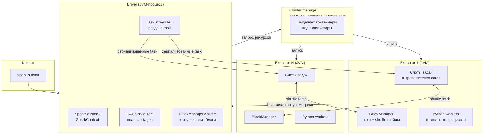
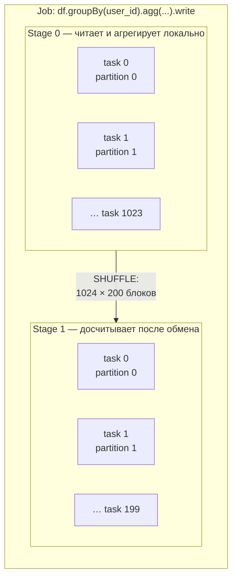
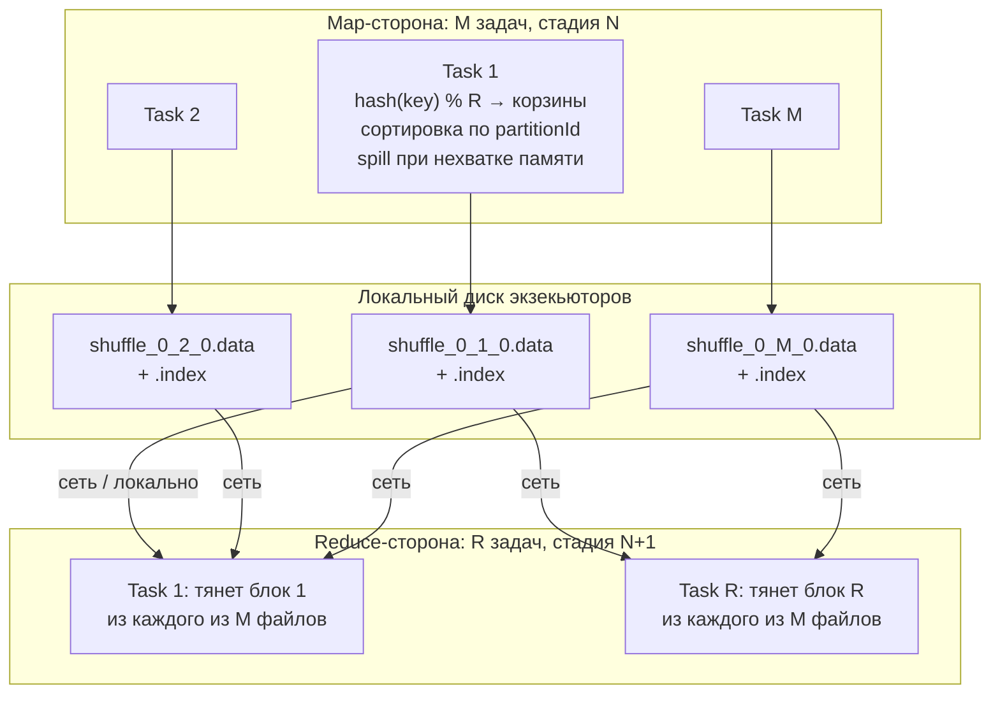
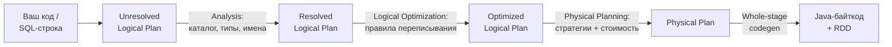
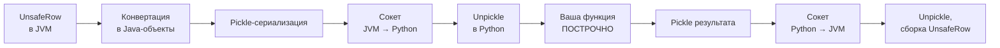

# Spark: как он работает

> **Зачем эта глава.** Spark для ML-инженера — это не «ещё один способ написать SQL», а движок,
> у которого есть физика: у него есть драйвер с ограниченной памятью, экзекьюторы с ограниченным
> числом ядер, и есть shuffle — момент, когда терабайт данных уезжает на диск и в сеть.
> Пока вы не понимаете, во что превращается ваш `groupBy`, вы будете писать джобы, которые
> считаются четыре часа вместо восьми минут, и объяснять это тем, что «данных много».
> После главы вы сможете по коду предсказать число стадий и задач, объяснить, почему
> `df.count()` запустил вычисление, а `df.filter(...)` — нет, и ответить на самый частый вопрос
> Spark-секции: «что такое shuffle и почему он дорогой».

**Уровень:** 🌱 база → 🎯 middle → 🧠 middle+
**Предварительно нужно:** [хранение данных](01-storage-and-formats.md) (Parquet, партиционирование, predicate pushdown), [SQL для MLE](02-sql-for-mle.md) (джойны и их стоимость), базовый Python
**Время на проработку:** ~8 часов (чтение + прогон примеров на локальном Spark)

---

## Карта главы

- [1. Интуиция: что ломается, когда данные не влезают в одну машину](#1-интуиция-что-ломается-когда-данные-не-влезают-в-одну-машину)
- [2. Архитектура: драйвер, экзекьюторы, cluster manager](#2-архитектура-драйвер-экзекьюторы-cluster-manager)
- [3. Три API: RDD, DataFrame, Dataset](#3-три-api-rdd-dataframe-dataset)
- [4. Ленивость: transformation против action](#4-ленивость-transformation-против-action)
- [5. Job, stage, task, partition — и как они связаны с ядрами](#5-job-stage-task-partition--и-как-они-связаны-с-ядрами)
- [6. Shuffle: что происходит физически](#6-shuffle-что-происходит-физически)
- [7. Narrow против wide и полный список стратегий джойна](#7-narrow-против-wide-и-полный-список-стратегий-джойна)
- [8. Broadcast join: порог, механика, границы](#8-broadcast-join-порог-механика-границы)
- [9. Catalyst: как SQL превращается в план](#9-catalyst-как-sql-превращается-в-план)
- [10. Tungsten и whole-stage codegen](#10-tungsten-и-whole-stage-codegen)
- [11. cache и persist: уровни хранения и когда кэш вредит](#11-cache-и-persist-уровни-хранения-и-когда-кэш-вредит)
- [12. Checkpoint и обрыв линиджа](#12-checkpoint-и-обрыв-линиджа)
- [13. Python UDF: почему медленно и что с этим делать](#13-python-udf-почему-медленно-и-что-с-этим-делать)
- [14. Подводные камни](#14-подводные-камни)
- [15. Проверь себя](#15-проверь-себя)
- [16. Практика](#16-практика)
- [17. Что читать дальше](#17-что-читать-дальше)

---

## 1. Интуиция: что ломается, когда данные не влезают в одну машину

Начнём с конкретной задачи, которую ML-инженер решает примерно раз в неделю.

Есть логи показов рекомендаций: 3 млрд строк за квартал, в Parquet это 420 ГБ на HDFS/S3.
Есть таблица пользователей: 40 млн строк, 12 ГБ. Нужно собрать обучающую выборку: к каждому
показу приклеить признаки пользователя и агрегаты его активности за 30 дней до показа.

На одной машине с 256 ГБ RAM это не считается: только распакованные логи — это порядка 2–3 ТБ
в памяти. Значит, данные надо резать на куски и считать куски параллельно на разных машинах.
Дальше начинается инженерия, и вот три вещи, которые ломаются сразу.

**Первое: не все операции локальны.** Отфильтровать строки по дате — локальная операция:
каждая машина обрабатывает свой кусок независимо, и результат — просто конкатенация. А вот
`GROUP BY user_id` локальным не является: строки одного пользователя лежат в разных кусках
на разных машинах. Чтобы посчитать агрегат, все строки одного `user_id` должны оказаться
физически на одной машине. Это и есть **перетасовка** (shuffle) — и вся производительность
Spark крутится вокруг того, сколько раз и сколько данных вы через неё прогоняете.

**Второе: машины падают.** При джобе на 200 экзекьюторов по 4 часа вероятность, что ни один
контейнер не будет вытеснен или не упадёт, невелика. Перезапускать всё с нуля — неприемлемо.
Значит, движок должен уметь пересчитать потерянный кусок, а для этого — помнить, из чего
он был получен. Это **линидж** (lineage), граф зависимостей, и он же объясняет, почему Spark
ленив: он не считает ничего, пока не узнает всю цепочку до конца.

**Третье: оптимизировать надо не код, а намерение.** Если вы написали «прочитай 420 ГБ,
отфильтруй по дате, приджойни справочник, посчитай сумму», честное исполнение по шагам будет
в разы медленнее, чем «прочитай только партиции нужных дат, взяв из Parquet только 6 колонок
из 40, справочник разошли всем целиком, а сумму считай в два прохода». Значит, между вашим
кодом и исполнением должен стоять оптимизатор. Это **Catalyst**.

> 🌱 **База.** Если запомнить из главы одну вещь, пусть это будет: *Spark быстр не потому,
> что «в памяти», а потому, что умеет не делать лишнего — не читать лишние колонки, не двигать
> лишние данные по сети*. «In-memory» — это маркетинг 2013 года; в реальной джобе на 400 ГБ
> шаффл всё равно пишется на диск.

---

## 2. Архитектура: драйвер, экзекьюторы, cluster manager

Spark-приложение — это ровно три типа процессов.



**Драйвер (driver)** — процесс, в котором живёт ваш код. Он строит логический план, оптимизирует
его, режет на стадии и задачи, раздаёт задачи экзекьюторам, собирает результаты, ведёт учёт,
где какой блок лежит. Драйвер — единственная точка, где ваш Python-код исполняется как обычный
Python: всё, что внутри `df.` — это построение плана, а всё, что вне, — обычная программа.

Что реально живёт в памяти драйвера и на чём он падает:
- результаты `collect()`, `toPandas()`, `take(n)` — ограничены `spark.driver.maxResultSize`
  (по умолчанию `1g`; при превышении задача убивается с `Total size of serialized results ... is bigger than`);
- бродкастируемые таблицы — прежде чем разослать, драйвер их **собирает к себе**;
- метаданные всех задач всех джобов (Spark UI хранит историю): при джобе на 500 000 задач
  это сотни мегабайт, лечится `spark.ui.retainedStages` / `spark.ui.retainedJobs`;
- список файлов при чтении партиционированной таблицы: 2 млн файлов в листинге — это реальная
  причина `Driver OOM` ещё до первой задачи.

Типовой размер драйвера для ML-пайплайна: `--driver-memory 4g` для обычной ETL-джобы,
`8–16g` — если вы бродкастите таблицы близко к порогу или читаете таблицу с десятками тысяч
партиций.

**Экзекьютор (executor)** — JVM-процесс на рабочем узле. У него есть:
- `spark.executor.cores` — число **слотов задач**. Слот исполняет ровно одну задачу за раз
  (при `spark.task.cpus=1`, что почти всегда так);
- `spark.executor.memory` — heap JVM;
- `spark.executor.memoryOverhead` — память вне heap (по умолчанию `max(384 МБ, 0.1 × executor.memory)`):
  стек потоков, буферы Netty, off-heap-структуры, **и питоновские воркеры**;
- `BlockManager` — локальное хранилище: сюда пишутся кэш и файлы shuffle.

Экзекьютор живёт всё приложение (если не включён `spark.dynamicAllocation.enabled`). Данные,
которые он закэшировал, доступны только пока он жив — это важно для понимания `cache()`.

**Cluster manager** — YARN, Kubernetes или Standalone. Он не знает про Spark ничего содержательного,
его дело — выделить контейнеры под заказанные ресурсы и следить, чтобы они не съели больше,
чем попросили. Именно cluster manager убивает экзекьютор, когда тот вылезает за границу контейнера:
в YARN вы увидите `Container killed by YARN for exceeding memory limits`, в k8s — `OOMKilled`
и `exit code 137`.

> 📐 **Разбор формулы.** Размер контейнера, который просит Spark у YARN/k8s под один экзекьютор:
>
> $$
> M_{\text{container}} = M_{\text{heap}} + M_{\text{overhead}} + M_{\text{pyspark}}
> $$
>
> где $M_{\text{heap}}$ — `spark.executor.memory` (JVM heap, там живут UnsafeRow, кэш, буферы shuffle);
> $M_{\text{overhead}}$ — `spark.executor.memoryOverhead`, по умолчанию
> $\max(384\ \text{МБ},\ 0.1 \cdot M_{\text{heap}})$;
> $M_{\text{pyspark}}$ — `spark.executor.pyspark.memory`, по умолчанию не задан (тогда питоновские
> воркеры едят из overhead, что и есть причина половины загадочных OOM в PySpark).
>
> Практический вывод: при `--executor-memory 16g` дефолтный overhead — 1.6 ГБ, а один
> Python-воркер с pandas UDF на батче в 10 000 строк по 200 колонок легко берёт 300–500 МБ.
> Четыре ядра — четыре воркера — 1.2–2 ГБ. Контейнер убьют. Для PySpark ставьте overhead
> руками: `--conf spark.executor.memoryOverhead=4g`.

> 💬 **На собеседовании.** Спросят: «Что происходит от момента `spark-submit` до первой задачи?»
> Хороший ответ по шагам: клиент запускает драйвер (в `client`-режиме — локально, в `cluster` —
> внутри кластера); драйвер поднимает SparkSession и запрашивает у cluster manager контейнеры;
> менеджер выделяет их и стартует JVM экзекьюторов; экзекьюторы регистрируются у драйвера;
> драйвер строит логический план, Catalyst его оптимизирует, DAGScheduler режет физический план
> на стадии по границам shuffle, TaskScheduler сериализует задачи и рассылает их в свободные слоты
> с учётом локальности данных. Плохой ответ: «Spark распределяет данные по кластеру» — это
> не ответ, а пересказ слова distributed.

---

## 3. Три API: RDD, DataFrame, Dataset

Исторически их три, и на собеседовании про различия спрашивают почти всегда. Разница
не в синтаксисе, а в том, **что движок знает о ваших данных**.

**RDD (Resilient Distributed Dataset)** — распределённая коллекция объектов JVM с известным
разбиением на партиции и известным линиджем. Spark знает: «это коллекция из 512 партиций,
каждая — набор объектов, к ним применяется вот эта функция». Что внутри объекта — движок
не знает. Оптимизировать он не может ничего: ни выкинуть неиспользуемую колонку (колонок нет),
ни протолкнуть фильтр в источник (фильтр — это ваша лямбда, чёрный ящик).

**DataFrame** — распределённая таблица со схемой. Spark знает имена и типы колонок, знает,
что `df.filter(col("dt") == "2026-07-01")` — это предикат по колонке `dt`, и может протолкнуть
его в Parquet-ридер, чтобы вообще не читать лишние row groups. В Python DataFrame — это
единственный разумный выбор.

**Dataset[T]** — типизированный DataFrame, существует только в Scala и Java (в Python его нет
и быть не может: нет статической типизации). Даёт проверку типов на компиляции, но за
типизированные лямбды (`ds.filter(x => x.age > 18)`) платит тем же, чем RDD: Catalyst не видит
внутрь лямбды. Технически `DataFrame = Dataset[Row]`.

| Что умеет движок | RDD | DataFrame / Dataset[Row] | Dataset[T] с типизированными лямбдами |
|---|---|---|---|
| Знает схему | нет | да | да |
| Column pruning (не читать лишние колонки) | нет | да | да |
| Predicate pushdown в источник | нет | да | только для нетипизированных операций |
| Выбор стратегии джойна | вы вручную | Catalyst | Catalyst |
| Whole-stage codegen | нет | да | частично (лямбда рвёт пайплайн) |
| Формат в памяти | Java-объекты, GC-нагрузка | UnsafeRow, off-heap-подобное представление | UnsafeRow + десериализация в объект для лямбды |
| Проверка ошибок в именах колонок | — | в рантайме (при анализе плана) | на компиляции |

Разница в скорости не косметическая. Классический пример: агрегация по 10 колонкам из таблицы
на 100 колонок. DataFrame прочитает 10 колонок; RDD — все 100, потому что не знает, что вам
нужно меньше. На Parquet это разница в 5–10 раз по объёму чтения ещё до всякой обработки.

**Когда RDD всё-таки нужен.** Три честных случая:
1. Кастомное партиционирование, которого нет в DataFrame API (`partitionBy` со своим `Partitioner`).
2. Работа с неструктурированными данными, где схемы нет в принципе (парсинг бинарных логов).
3. Операции, у которых нет выражения в SQL-семантике: например, `zipWithIndex` или
   алгоритмы с ручным контролем итераций.

Во всех остальных случаях RDD в 2026 году — это либо легаси, либо ошибка.

> ⚠️ **Типичная ошибка.** Уйти в `df.rdd.map(...)` ради «привычного питона». Вы платите трижды:
> (1) конвертация UnsafeRow → Java-объект → pickle → Python-объект; (2) Catalyst перестаёт
> видеть, что вы делаете, и отключает все оптимизации ниже по плану; (3) обратная конвертация.
> На практике та же логика через встроенные выражения или pandas UDF идёт в 5–50 раз быстрее.

---

## 4. Ленивость: transformation против action

Spark не выполняет ничего, пока не попросят результат. Это не оптимизация ради оптимизации —
это условие работы Catalyst: чтобы протолкнуть фильтр в источник, нужно сначала увидеть весь
запрос целиком.

**Трансформация (transformation)** строит новый план и возвращает новый DataFrame. Ничего
не считается.

```
select, filter/where, withColumn, drop, join, groupBy(...).agg(...),
orderBy/sort, distinct, union, repartition, coalesce, sample, limit (как узел плана)
```

**Действие (action)** запускает джобу: план компилируется, задачи уходят на экзекьюторы,
результат возвращается драйверу или пишется наружу.

```
count, collect, take(n), first, head, show, toPandas, foreach, foreachPartition,
reduce, saveAsTable, write.parquet/…, но также: cache() + count(), df.rdd.isEmpty()
```

Отдельно стоят три коварные операции, которые «не выглядят как action», но запускают вычисление:

| Операция | Почему запускает вычисление |
|---|---|
| `spark.read.csv(path)` без `schema=` | при `inferSchema=true` Spark читает данные, чтобы вывести типы — это отдельная джоба |
| `spark.read.json(path)` | вывод схемы читает **весь** файл, если не задан `samplingRatio` |
| `df.count()` внутри логгирования | безобидная строчка `logger.info(f"rows: {df.count()}")` пересчитывает всю цепочку заново |

Ключевое следствие ленивости, на котором ломаются все новички: **план исполняется заново
на каждое действие**. Вот код, который читает исходные 420 ГБ трижды:

```python
from pyspark.sql import SparkSession, functions as F

spark = SparkSession.builder.appName("lazy-demo").getOrCreate()

events = (
    spark.read.parquet("s3a://lake/events/")
    .where(F.col("dt").between("2026-04-01", "2026-06-30"))
    .where(F.col("event_type") == "impression")
)

print(events.count())                                  # джоба 1: читает всё
print(events.select("user_id").distinct().count())     # джоба 2: читает всё заново
events.write.parquet("s3a://lake/tmp/impressions/")    # джоба 3: читает всё в третий раз
```

Три полных прохода по 420 ГБ вместо одного. Лечится либо `cache()` (см. §11), либо тем,
что вы просто не считаете диагностические метрики между шагами.

> 💬 **На собеседовании.** Спросят: «Почему Spark ленивый и что это даёт?» Хороший ответ:
> ленивость даёт оптимизатору целостную картину запроса — только зная всю цепочку, можно
> слить несколько `filter` в один, протолкнуть предикат до чтения файла, выкинуть колонки,
> которые нигде не используются, и выбрать стратегию джойна по оценкам размеров. Плюс это
> позволяет строить линидж и пересчитывать только потерянные партиции при падении узла.
> Плата: ошибка в данных всплывает не в строке, где вы её сделали, а на ближайшем действии,
> и одна и та же цепочка пересчитывается на каждое действие, если её не закэшировать.
> Плохой ответ: «чтобы быстрее работало».

---

## 5. Job, stage, task, partition — и как они связаны с ядрами

Это скелет всей модели исполнения. Четыре уровня, сверху вниз.

**Job (джоба)** — одно действие. `df.count()` → одна джоба. `df.write.parquet(...)` → одна джоба
(иногда две, если нужен предварительный проход). В Spark UI вкладка Jobs — это список ваших
действий.

**Stage (стадия)** — максимальный кусок плана, который можно выполнить **без перемещения данных
между узлами**. Границы стадий проходят ровно по shuffle. Правило для подсчёта: число стадий
в джобе = число shuffle-зависимостей + 1 (на каждую ветку плана).

**Task (задача)** — единица работы: применить код стадии к **одной партиции**. Задач в стадии
ровно столько, сколько партиций у её выхода. Задача сериализуется драйвером (вместе с
замыканиями и бродкаст-ссылками) и исполняется в одном слоте одного экзекьютора.

**Partition (партиция)** — кусок данных. Не путать с партиционированием таблицы на диске
(`/dt=2026-07-01/`) — это разные вещи, хотя они связаны: одна партиция Spark чаще всего
формируется из одного или нескольких файловых сплитов.



### Откуда берётся начальное число партиций

При чтении с диска число партиций определяет источник, а не вы:

$$
P_{\text{read}} \approx \left\lceil \frac{\sum_i \big(s_i + c_{\text{open}}\big)}{\max\big(b_{\max},\ \tfrac{\sum_i (s_i + c_{\text{open}})}{n_{\text{slots}}}\big)} \right\rceil
$$

где $s_i$ — размер $i$-го файла (или его сплита) в байтах; $c_{\text{open}}$ —
`spark.sql.files.openCostInBytes` (по умолчанию 4 МБ, «стоимость» открытия файла в условных
байтах, чтобы мелкие файлы склеивались); $b_{\max}$ — `spark.sql.files.maxPartitionBytes`
(по умолчанию 128 МБ); $n_{\text{slots}}$ — суммарное число слотов задач в кластере
(`spark.default.parallelism` для файловых источников выводится из числа ядер).

Практический смысл: **Spark старается делать партиции по 128 МБ, но не меньше, чем нужно,
чтобы занять все ядра**, и склеивает мелкие файлы, считая каждый за минимум 4 МБ. Отсюда
знаменитая проблема мелких файлов: 200 000 файлов по 200 КБ дадут вам не 40 ГБ / 128 МБ = 320
партиций, а порядка (200 000 × 4 МБ) / 128 МБ ≈ 6250 партиций — и, что хуже, 200 000 обращений
к объектному хранилищу.

После shuffle число партиций задаётся жёстко: `spark.sql.shuffle.partitions`, **по умолчанию 200**
— значение, которое не менялось с 2015 года и не имеет отношения к вашему кластеру.

### Связь партиций и ядер: арифметика волн

Пусть у вас $E$ экзекьюторов по $C$ ядер. Тогда одновременно исполняется $E \cdot C$ задач.
Если у стадии $P$ партиций, задачи пойдут **волнами**:

$$
W = \left\lceil \frac{P}{E \cdot C} \right\rceil
$$

где $W$ — число волн, $P$ — число партиций (= задач) в стадии, $E$ — число экзекьюторов,
$C$ — `spark.executor.cores`.

Это самая полезная формула главы. Из неё следуют три вывода.

**Вывод 1: неполная последняя волна — это потерянное время.** При $E \cdot C = 100$ слотах
и $P = 101$ партиции у вас две волны: 100 задач параллельно, затем **одна** задача,
пока 99 слотов простаивают. Стадия идёт вдвое дольше, чем при $P = 100$. Поэтому число
партиций хотят кратным числу слотов — или сильно больше него, чтобы «хвост» размазался.

**Вывод 2: слишком мало партиций = недоиспользование и OOM.** При $P = 50$ и 100 слотах половина
кластера простаивает, а каждая задача обрабатывает вдвое больше данных, чем могла бы, — растёт
риск spill и OOM.

**Вывод 3: слишком много партиций = накладные расходы.** Каждая задача — это сериализация,
отправка, запуск, отчёт о статусе, и это порядка **10–30 мс** оверхеда даже на пустой задаче.
Если задача считается 50 мс, вы половину времени тратите на диспетчеризацию. Официальная
рекомендация — задача должна работать хотя бы 100–200 мс; практическая — целиться
в 1–10 секунд на задачу.

**Рабочее правило.** Целевой размер партиции — 128–200 МБ несжатых данных в памяти;
целевое число партиций — 2–4 × число слотов.

```python
# Прикидка числа партиций под конкретный кластер и объём
def target_partitions(data_size_gb: float, executors: int, cores_per_executor: int,
                      target_partition_mb: int = 160) -> int:
    """Возвращает число партиций, кратное числу слотов, — чтобы не было неполной волны."""
    slots = executors * cores_per_executor
    by_size = int(data_size_gb * 1024 / target_partition_mb)
    # округляем вверх до кратного числу слотов, но не меньше 2 волн
    waves = max(2, -(-by_size // slots))
    return waves * slots

print(target_partitions(data_size_gb=420, executors=40, cores_per_executor=5))
# 2688 = 13.44 -> 14 волн × 200 слотов -> 2800; печать зависит от округления
```

> 💬 **На собеседовании.** Спросят: «Сколько партиций поставить?» Плохой ответ: «200» или
> «побольше». Хороший ответ: «Считаю от двух ограничений. Снизу — размер партиции: целюсь
> в 128–200 МБ, чтобы задача жила секунды и не спиллила. Сверху — число слотов: партиций должно
> быть кратно $E\cdot C$ и хотя бы 2–3 волны, чтобы сгладить перекос и хвосты. Для 400 ГБ
> шаффла на 40 экзекьюторов по 5 ядер это 400 ГБ / 160 МБ ≈ 2560, округляю до 2600 = 13 волн
> по 200 слотов. И проверяю по Spark UI: если в стадии есть spill — партиций мало, если медиана
> задачи меньше 200 мс — партиций много».

---

## 6. Shuffle: что происходит физически

Это центральная тема Spark-секции. Отвечать надо не словом «перетасовка», а описанием того,
что происходит с байтами.

### Постановка

Стадия $A$ выдала $M$ партиций (их обработали $M$ map-задач). Следующей стадии нужно, чтобы
строки с одинаковым ключом лежали вместе, и она хочет $R$ партиций. Значит, каждая map-задача
должна разложить свои строки по $R$ корзинам, а каждая reduce-задача — забрать свою корзину
у всех $M$ отправителей. Логически это $M \times R$ блоков.



### Шаг за шагом

**1. Map-сторона: вычисление корзины.** Для каждой строки считается номер целевой партиции.
Для хеш-партиционирования это `partitionId = Math.floorMod(hash(key), R)`, где `hash` —
Murmur3 по значениям ключевых колонок. Для `orderBy` — range-партиционирование: Spark сначала
делает **отдельную джобу-сэмплирование**, чтобы построить границы диапазонов (вот почему
глобальная сортировка стоит дороже, чем кажется).

**2. Map-сторона: буфер и spill.** Строки складываются в буфер в памяти (`ShuffleExternalSorter`,
формат — UnsafeRow, сортировка по `partitionId` идёт по 8-байтным указателям, а не по объектам).
Когда буфер не влезает в отведённую задаче долю execution-памяти — происходит **spill**:
отсортированный кусок пишется на локальный диск. В конце все spill-куски сливаются.
Каждый spill — это лишняя запись и лишнее чтение диска.

**3. Map-сторона: запись файлов.** В sort-based shuffle (единственный с версии 2.0) каждая
map-задача пишет **ровно два файла**: `.data` — все её корзины подряд, отсортированные
по номеру партиции, и `.index` — смещения корзин внутри `.data`. То есть на диске появляется
$2M$ файлов, а не $M \times R$. Это было главным изменением по сравнению с hash-based shuffle,
который при $M=10^4, R=10^3$ создавал 10 млн файлов и убивал файловую систему.

Данные сжимаются: `spark.shuffle.compress=true`, кодек `spark.io.compression.codec` (по умолчанию
`lz4` — быстрый, коэффициент 2–3× на типичных данных). Буфер записи — `spark.shuffle.file.buffer`,
по умолчанию 32 КБ на корзину; увеличение до 1 МБ на больших шаффлах заметно снижает число
системных вызовов.

**Ключевой факт: shuffle-файлы всегда пишутся на локальный диск.** Не «если не хватило памяти» —
всегда. Отсюда требование к железу: экзекьютор без быстрого локального диска (или, в k8s,
с `emptyDir` на сетевом томе) будет тормозить на шаффле в разы.

**4. Барьер.** Reduce-стадия не может начаться, пока **все** map-задачи не закончили. Одна
медленная задача (перекос, медленный узел) держит всю стадию — это и есть straggler.

**5. Reduce-сторона: fetch.** Каждая reduce-задача запрашивает свой блок у каждого из $M$
экзекьюторов (точнее, у их BlockManager или у внешнего shuffle service). Ограничители:
`spark.reducer.maxSizeInFlight` (48 МБ данных «в полёте» на задачу),
`spark.reducer.maxBlocksInFlightPerAddress`, `spark.shuffle.io.maxRetries` (3 попытки)
и `spark.shuffle.io.retryWait` (5 с). Знаменитая ошибка `FetchFailedException` — это когда
экзекьютор-источник умер или не ответил; Spark пересчитывает потерянную map-стадию целиком.

**6. Reduce-сторона: слияние и обработка.** Блоки десериализуются, при необходимости сортируются
и сливаются, снова со spill при нехватке памяти. Дальше выполняется код стадии.

### Сколько это стоит в цифрах

Считаем честно. Пусть shuffle write = 1 ТБ (эту цифру вы видите в Spark UI, колонка Shuffle Write),
кластер — 20 узлов по 10 Гбит/с, локальные NVMe с ~1 ГБ/с на запись.

- **Запись на диск:** 1 ТБ / 20 узлов = 50 ГБ на узел, при 1 ГБ/с ≈ **50 с** чистой записи.
- **Чтение с диска:** те же 50 ГБ на узел ≈ 50 с.
- **Сеть:** доля данных, остающихся на своём узле, ≈ 1/20 = 5%. Значит по сети едет ~950 ГБ,
  каждый узел получает ~47.5 ГБ. При 10 Гбит/с = 1.25 ГБ/с и реальной утилизации 60% это
  ≈ **63 с**.
- Итого нижняя граница по железу — порядка **2–3 минут** только на перемещение, без единой
  строчки вашей логики. Плюс сериализация/десериализация и сжатие — обычно ещё столько же.

И вторая полезная величина — **средний размер shuffle-блока**:

$$
b = \frac{S}{M \cdot R}
$$

где $S$ — общий объём shuffle write в байтах, $M$ — число map-задач, $R$ — число reduce-партиций.

Подставим: $S = 1$ ТБ, $M = 8000$, $R = 200$. Тогда $b = 10^{12}/(1.6\cdot 10^6) = 625$ КБ —
нормально. А если поставить $R = 20000$: $b = 6.25$ КБ, и вы получите 160 млн сетевых блоков
по 6 КБ. Это классический способ убить кластер: не объёмом, а числом мелких запросов.

> 💬 **На собеседовании.** Спросят: «Что такое shuffle и почему он дорогой?» Хороший ответ:
> shuffle — это перераспределение данных между партициями так, чтобы строки с одинаковым ключом
> попали в одну партицию. Физически: map-задача считает `hash(key) % R`, сортирует строки
> по номеру целевой партиции в памяти со spill на диск, пишет один data-файл и один index-файл;
> затем стоит барьер — reduce-стадия ждёт **все** map-задачи; затем каждая reduce-задача тянет
> свой блок с каждого из M экзекьюторов по сети. Дорого по четырём причинам: обязательная запись
> и чтение локального диска, передача по сети, сериализация/десериализация, и барьер, из-за
> которого одна медленная задача держит всю стадию. Плюс отказоустойчивость: смерть экзекьютора
> после map-стадии приводит к `FetchFailedException` и пересчёту стадии.
> Плохой ответ: «данные перемешиваются между нодами, это медленно».

---

## 7. Narrow против wide и полный список стратегий джойна

**Узкая зависимость (narrow dependency):** каждая партиция-родитель участвует в вычислении
не более одной партиции-потомка. Данные не двигаются между узлами; операции сливаются
в один конвейер внутри одной задачи.

```
map, filter/where, select, withColumn, union (просто конкатенация партиций),
mapPartitions, coalesce (уменьшение числа партиций слиянием соседних)
```

**Широкая зависимость (wide dependency):** партиция-потомок зависит от многих
партиций-родителей → нужен shuffle → новая стадия.

```
groupBy(...).agg(...), distinct, dropDuplicates, join (кроме broadcast),
repartition, orderBy / sort (глобальная), оконные функции с PARTITION BY,
intersect, except, cogroup
```

> 🧠 **Middle+.** Тонкость, на которой ловят: `union` — narrow, но он **суммирует число партиций**.
> Объединили 30 датафреймов по 200 партиций — получили 6000 партиций и 6000 задач в следующей
> стадии. Если данных там на 10 ГБ, у вас задачи по 1.7 МБ и оверхед диспетчеризации выше
> полезной работы. Лечится `coalesce` после union — именно `coalesce`, не `repartition`,
> потому что второй добавит лишний shuffle.
>
> Вторая тонкость: `coalesce(n)` — narrow, и это же его опасность. Он не просто склеивает
> партиции на выходе, он **сужает параллелизм всей предшествующей стадии** до $n$. Написали
> `df.map(...).coalesce(1).write` — и вся обработка поедет в одном потоке.

### Стратегии джойна, которые Spark выбирает сам

| Стратегия | Когда выбирается | Shuffle | Стоимость |
|---|---|---|---|
| **Broadcast Hash Join** | одна сторона меньше `spark.sql.autoBroadcastJoinThreshold` (10 МБ) или есть хинт | нет для большой стороны | $O(n_{\text{big}})$ + рассылка малой таблицы |
| **Shuffle Hash Join** | обе большие, но одна сильно меньше; включается при `spark.sql.join.preferSortMergeJoin=false` или когда сортировка невозможна | да, обе стороны | хеш-таблица целиком в памяти → риск OOM |
| **Sort Merge Join** | дефолт для двух больших таблиц с сортируемыми ключами | да, обе стороны | shuffle + сортировка обеих сторон, зато устойчив к размеру |
| **Broadcast Nested Loop Join** | нет условия равенства (`ON a.x < b.y`), одна сторона мала | нет | $O(n \cdot m)$ — взрывается незаметно |
| **Cartesian Product** | нет условия вообще | да | $O(n \cdot m)$, обычно баг в коде |

Смотреть выбранную стратегию — только через план:

```python
big = spark.read.parquet("s3a://lake/events/")
dim = spark.read.parquet("s3a://lake/dim_user/")

joined = big.join(dim, on="user_id", how="left")
joined.explain(mode="formatted")   # ищем строку BroadcastHashJoin / SortMergeJoin
```

> ⚠️ **Типичная ошибка.** Увидеть в плане `BroadcastNestedLoopJoin` и не насторожиться.
> Он появляется, когда в `ON` нет равенства — например, джойн по диапазону дат
> `ON e.ts BETWEEN d.start_ts AND d.end_ts`. Для 100 млн × 50 тыс. строк это 5·10¹² сравнений;
> джоба будет считаться сутками. Лечение: добавить искусственный ключ равенства (например,
> округлить время до дня и джойнить по дню, а условие диапазона оставить как дополнительный
> фильтр) — это превращает вложенный цикл в hash join с последующей фильтрацией.

---

## 8. Broadcast join: порог, механика, границы

Идея: если одна из таблиц маленькая, дешевле разослать её копию на каждый экзекьютор,
чем гонять по сети обе таблицы.

**Механика.** Драйвер собирает малую таблицу к себе (`collect`), строит по ней хеш-таблицу
и рассылает через `TorrentBroadcast` — блоками по `spark.broadcast.blockSize` (4 МБ),
причём экзекьюторы раздают блоки друг другу, как в BitTorrent, чтобы не упереться в канал
драйвера. Дальше каждая задача большой таблицы джойнит свою партицию с локальной копией
хеш-таблицы. Shuffle для большой стороны не нужен вообще.

**Порог.** `spark.sql.autoBroadcastJoinThreshold`, по умолчанию **10 МБ** (10485760 байт).
Значение `-1` полностью отключает автоматический бродкаст. Порог сравнивается с
**оценкой размера в байтах из статистик плана**, а не с размером файла на диске.

Здесь три ловушки, каждая из которых регулярно ломает продовые джобы.

**Ловушка 1: оценка размера бывает бессмысленной.** Если статистик нет (таблица не
проанализирована, источник — не Hive-таблица, а путь), Spark берёт `sizeInBytes` из размера
файлов. Для сжатого Parquet с колоночным кодированием реальный объём в памяти в 5–15 раз больше:
файл на 8 МБ развернётся в 80–120 МБ UnsafeRow. Бродкаст «влезающей» таблицы съест память
драйвера и экзекьюторов.

**Ловушка 2: бродкаст идёт через драйвер.** Таблица целиком материализуется в его памяти.
Если вы подняли порог до 500 МБ, а `--driver-memory 2g`, вы получите
`OutOfMemoryError` в драйвере или `Total size of serialized results is bigger than spark.driver.maxResultSize`.

**Ловушка 3: таймаут.** `spark.sql.broadcastTimeout` — 300 секунд. Если сбор и рассылка
не уложились, джоба падает с `Could not execute broadcast in 300 secs`. Обычно это симптом
того, что «маленькая» таблица на самом деле не маленькая.

### Как считать порог осознанно

$$
M_{\text{bc}} \approx k \cdot S_{\text{parquet}}, \qquad
M_{\text{exec}}^{\text{required}} \gtrsim M_{\text{bc}} \cdot (1 + \alpha)
$$

где $S_{\text{parquet}}$ — размер таблицы на диске; $k \approx 5\text{–}15$ — коэффициент
разжатия Parquet → представление в памяти (зависит от доли строк и словарного кодирования);
$M_{\text{bc}}$ — объём бродкаста в памяти; $\alpha \approx 0.5$ — запас на служебные структуры
хеш-таблицы. Копия $M_{\text{bc}}$ лежит **на каждом экзекьюторе**, независимо от числа ядер.

Практический ориентир: поднимать порог выше **100–200 МБ** имеет смысл только при
`--driver-memory 8g+` и экзекьюторах от 16 ГБ. Значение по умолчанию (10 МБ) консервативно
и его почти всегда стоит поднять до 50–100 МБ на нормальном кластере.

```python
# Рабочая конфигурация для ML-ETL: справочники до ~64 МБ бродкастятся автоматически
spark = (
    SparkSession.builder
    .appName("features-build")
    .config("spark.sql.autoBroadcastJoinThreshold", 64 * 1024 * 1024)   # 64 МБ
    .config("spark.sql.broadcastTimeout", 600)                          # 10 минут вместо 5
    .config("spark.driver.memory", "8g")
    .getOrCreate()
)

from pyspark.sql import functions as F

# Явный хинт: работает даже когда статистики врут и оценка выше порога
events = spark.read.parquet("s3a://lake/events/")
dim_city = spark.read.parquet("s3a://lake/dim_city/")     # 3 МБ, 40 тыс. строк

res = events.join(F.broadcast(dim_city), on="city_id", how="left")
res.explain(mode="formatted")   # должен быть BroadcastHashJoin
```

> 🧠 **Middle+.** `F.broadcast()` — это **хинт, а не приказ**. Spark его почти всегда исполняет,
> но есть случаи, когда физически не может: например, `FULL OUTER JOIN` не бродкастится
> ни в какую сторону, а в `LEFT OUTER JOIN` бродкастить можно только правую сторону
> (и симметрично для `RIGHT`). Если вы поставили хинт на левую таблицу в `LEFT JOIN`,
> он будет молча проигнорирован, и вы получите Sort Merge Join, не понимая почему.
> Проверять — всегда через `explain`.

> 💬 **На собеседовании.** Спросят: «Как ускорить джойн большой таблицы с маленькой?»
> Хороший ответ: если маленькая помещается в память экзекьютора — broadcast hash join:
> shuffle большой таблицы исчезает полностью, остаётся только рассылка малой. Порог —
> `spark.sql.autoBroadcastJoinThreshold`, дефолт 10 МБ, сравнивается с оценкой размера
> в памяти, а не с размером файла; для сжатого Parquet разница в 5–15 раз, поэтому «файл
> на 30 МБ» может не влезть. Форсировать — `F.broadcast(df)`, но проверить в `explain`,
> что он применился: для FULL OUTER и для «неправильной» стороны OUTER-джойна хинт
> игнорируется. И помнить, что таблица проходит через драйвер — его память надо поднять.
> Плохой ответ: «поставлю broadcast и всё».

---

## 9. Catalyst: как SQL превращается в план

Catalyst — оптимизатор Spark SQL, работающий как набор правил переписывания дерева. Разберём
конвейер по фазам, потому что читать `explain` без этого невозможно.



**Фаза 1. Анализ.** Имена колонок и таблиц разрешаются по каталогу, проверяются типы,
подставляются неявные приведения. Именно здесь вы получаете
`AnalysisException: cannot resolve 'user_id'` — в момент построения плана, а не при исполнении.

**Фаза 2. Логическая оптимизация.** Десятки правил, из которых важно знать шесть:

| Правило | Что делает | Что даёт на практике |
|---|---|---|
| **Column pruning** | выкидывает колонки, которые нигде не используются | из таблицы на 120 колонок читаются 8 → в 10 раз меньше I/O |
| **Predicate pushdown** | двигает фильтры как можно ближе к источнику | Parquet-ридер отбрасывает row groups по min/max-статистикам |
| **Partition pruning** | отбрасывает целые директории `/dt=…/` | 90 дней вместо 3 лет — в 12 раз меньше файлов |
| **Constant folding** | вычисляет константные выражения на этапе плана | `WHERE dt = date_sub(current_date(), 1)` считается один раз, а не на строку |
| **Filter/Project collapse** | сливает подряд идущие фильтры и проекции | нет промежуточных материализаций |
| **Push down limit** | двигает `LIMIT` вниз | `df.orderBy(...).limit(10)` не сортирует всё |

**Фаза 3. Физическое планирование.** Логические операторы заменяются на физические:
`Join` → `BroadcastHashJoin`/`SortMergeJoin`, `Aggregate` → `HashAggregate`/`SortAggregate`
или `ObjectHashAggregate`. Здесь же решается, сколько будет shuffle-обменов (`Exchange`
в плане — это и есть shuffle).

**Фаза 4. Генерация кода.** См. §10.

### Статистики и CBO

По умолчанию Catalyst — **rule-based**: он двигает фильтры и выкидывает колонки, не зная
кардинальностей. Cost-based optimizer (`spark.sql.cbo.enabled`, по умолчанию `false`) умеет
выбирать порядок джойнов по оценкам числа строк, но требует собранных статистик:

```sql
-- статистики по таблице и по колонкам-ключам джойна
ANALYZE TABLE lake.dim_user COMPUTE STATISTICS;
ANALYZE TABLE lake.dim_user COMPUTE STATISTICS FOR COLUMNS user_id, city_id, segment;
```

На практике CBO включают редко: он требует дисциплины со статистиками, а адаптивное исполнение
(AQE, глава [Spark: производительность](04-spark-tuning.md)) решает ту же задачу лучше — по
фактическим размерам во время выполнения, а не по оценкам.

### Как читать explain

```python
df = (
    spark.read.parquet("s3a://lake/events/")
    .where(F.col("dt") >= "2026-07-01")
    .join(F.broadcast(dim_city), "city_id")
    .groupBy("city_name").agg(F.countDistinct("user_id").alias("uniq"))
)
df.explain(mode="formatted")
```

Что искать в выводе, сверху вниз:
- `PartitionFilters: [isnotnull(dt#12), (dt#12 >= 2026-07-01)]` — сработал partition pruning;
- `PushedFilters: [...]` — предикаты уехали в источник; **пустой список — красный флаг**,
  обычно из-за UDF или приведения типов в условии;
- `ReadSchema: struct<city_id:int,user_id:bigint,...>` — сколько колонок реально читается;
- `Exchange hashpartitioning(city_name#33, 200)` — каждый такой узел = один shuffle;
- `BroadcastHashJoin` vs `SortMergeJoin` — какая стратегия выбрана;
- `* (3) HashAggregate` — звёздочка означает, что узел попал в whole-stage codegen.

> ⚠️ **Типичная ошибка.** Написать фильтр так, что pushdown не срабатывает:
> `.where(F.col("user_id").cast("string") == "123")` или `.where(my_python_udf(F.col("dt")))`.
> В первом случае приведение типов слева от сравнения мешает использовать статистики Parquet,
> во втором Catalyst вообще не знает, что делает функция. Симптом — пустой `PushedFilters`
> и чтение всей таблицы. Лечение: сравнивать колонку с константой в её собственном типе,
> а вычисления, влияющие на фильтрацию, выносить в выражения Spark.

---

## 10. Tungsten и whole-stage codegen

Catalyst решает, **что** считать. Tungsten решает, **как** это исполнять, и делает три вещи.

**1. Своё представление данных в памяти: UnsafeRow.** Строка хранится не как Java-объект,
а как компактный бинарный блок: фиксированная часть (null-биты + 8 байт на поле) плюс
переменная часть для строк и массивов. Работа с ним идёт через `sun.misc.Unsafe`, минуя
объектную модель JVM.

Зачем: Java-объект `Row` с десятью полями — это десяток мелких объектов, каждый с заголовком
16 байт, разбросанных по heap. На 100 млн строк это сотни миллионов объектов, и сборщик мусора
проводит в них всё время. UnsafeRow даёт **в 3–5 раз меньший футпринт** и почти нулевую
нагрузку на GC.

**2. Управление памятью в обход GC.** Tungsten сам аллоцирует и освобождает крупные страницы
памяти (`MemoryBlock`), внутри которых лежат строки. Сортировка идёт по массиву 8-байтных
указателей с префиксом ключа — сравнение часто решается по префиксу, без разыменования,
что резко улучшает попадания в кэш процессора.

**3. Whole-stage code generation.** Вместо того чтобы гонять данные через цепочку виртуальных
вызовов «оператор за оператором» (модель Volcano — по одному вызову `next()` на строку
на оператор), Spark **генерирует один Java-метод**, в который вклеены все операторы стадии,
и компилирует его в байткод в рантайме.

Разница на примере `filter → project → aggregate`:

```
Volcano-модель:      на каждую строку — 3 виртуальных вызова + боксинг промежуточных значений
Whole-stage codegen: один цикл while, все операции инлайнены, значения в регистрах
```

Выигрыш на простых операциях — **в 3–10 раз**; на агрегациях по числовым колонкам бывает
и больше. Управляется `spark.sql.codegen.wholeStage` (по умолчанию `true`) и ограничивается
`spark.sql.codegen.maxFields` (100): при большем числе полей codegen отключается для узла.

Как увидеть: в `explain(mode="formatted")` узлы с codegen помечены звёздочкой и номером
codegen-стадии: `*(2) Filter`, `*(2) Project`. Узлы без звёздочки — разрыв конвейера.

> 🧠 **Middle+.** Что рвёт whole-stage codegen (и это видно по пропавшим звёздочкам):
> Python UDF (`BatchEvalPython`), Scala-лямбды в типизированном Dataset API, любые операции
> над сложными типами вроде вложенных структур в некоторых версиях, а также узлы `Exchange`
> (граница стадии — естественный разрыв). Практический вывод: одна безобидная Python UDF
> в середине конвейера отключает codegen для целого куска плана, и вы теряете не только
> на самой UDF, но и на всех операциях рядом с ней.

---

## 11. cache и persist: уровни хранения и когда кэш вредит

Проблема, которую решает кэш, — та же ленивость: каждое действие пересчитывает цепочку с нуля.
Если промежуточный результат нужен многократно (итеративный алгоритм, несколько выгрузок
из одного датасета, EDA в ноутбуке), его материализуют.

```python
from pyspark import StorageLevel

base = (
    spark.read.parquet("s3a://lake/events/")
    .where(F.col("dt").between("2026-04-01", "2026-06-30"))
    .select("user_id", "item_id", "ts", "event_type")
)

base.persist(StorageLevel.MEMORY_AND_DISK)
base.count()          # действие, которое реально наполняет кэш

# теперь эти три джобы читают из кэша, а не с S3
a = base.groupBy("user_id").count()
b = base.groupBy("item_id").count()
c = base.where(F.col("event_type") == "click").count()

base.unpersist()      # обязательно: иначе память держится до конца приложения
```

Важно: `cache()`/`persist()` — **ленивые**. Они помечают датафрейм, но данные попадают в кэш
только при первом действии, и только те партиции, которые это действие затронуло.
`df.cache(); df.limit(10).show()` закэширует одну партицию, а не весь датафрейм.

### Уровни хранения

| Уровень | Память | Диск | Сериализация | Когда применять |
|---|---|---|---|---|
| `MEMORY_ONLY` | да | нет | нет (в JVM); в PySpark всегда сериализовано | RDD, когда точно влезает; при нехватке партиции **пересчитываются** |
| `MEMORY_AND_DISK` | да | да | нет | дефолт для DataFrame `.cache()`; не влезло — уехало на диск |
| `MEMORY_ONLY_SER` | да | нет | Java/Kryo | экономия памяти в 2–4× ценой CPU на десериализацию |
| `MEMORY_AND_DISK_SER` | да | да | Java/Kryo | большие датасеты, память дорога |
| `DISK_ONLY` | нет | да | да | результат дороже пересчитать, чем прочитать с диска; например, после тяжёлого shuffle |
| `OFF_HEAP` | off-heap | нет | да | требует `spark.memory.offHeap.enabled=true` и размера; снимает нагрузку на GC |
| суффикс `_2` | ×2 | ×2 | — | реплика на другом узле: устойчивость к падению экзекьютора |

`df.cache()` для DataFrame эквивалентен `persist(MEMORY_AND_DISK)` — важное отличие
от `rdd.cache()`, который берёт `MEMORY_ONLY`.

### Сколько памяти это займёт

Кэш живёт в storage-регионе унифицированной памяти:

$$
M_{\text{usable}} = M_{\text{heap}} - 300\ \text{МБ}, \qquad
M_{\text{unified}} = M_{\text{usable}} \cdot f, \qquad
M_{\text{storage}}^{\text{guaranteed}} = M_{\text{unified}} \cdot s
$$

где $M_{\text{heap}}$ — `spark.executor.memory`; 300 МБ — зарезервированная память Spark;
$f$ — `spark.memory.fraction` (по умолчанию 0.6); $s$ — `spark.memory.storageFraction`
(по умолчанию 0.5). Оставшиеся $M_{\text{usable}}\cdot(1-f) = 0.4\,M_{\text{usable}}$ —
user memory: ваши структуры данных, метаданные, всё, что не под управлением Tungsten.

Границу между storage и execution Spark двигает динамически: execution может вытеснить кэш
ниже $M_{\text{storage}}^{\text{guaranteed}}$ **не может**, а вот кэш execution-память
вытеснять не имеет права. Проще говоря: при нехватке памяти на shuffle Spark выбросит ваш кэш,
а не наоборот.

Пример: `--executor-memory 16g`, дефолты. Usable = 15.7 ГБ, unified = 9.4 ГБ, гарантированный
storage = 4.7 ГБ. На 40 экзекьюторов — 188 ГБ гарантированного кэша на кластер. Датасет
в 500 ГБ распакованных данных туда не влезет, и `MEMORY_AND_DISK` превратится
в «в основном disk», что зачастую медленнее, чем просто перечитать Parquet.

### Когда кэш вредит

Это тот случай, когда «оптимизация» замедляет. Четыре сценария:

1. **Датасет используется один раз.** Кэш добавляет запись в память/на диск и ничего не экономит.
   Симптом: `cache()` перед единственным `write`.
2. **Датасет не влезает.** Постоянное вытеснение и пересчёт; в UI вкладка Storage покажет
   `Fraction Cached: 43%`. Лучше `DISK_ONLY` или отказ от кэша.
3. **Кэш съел память у shuffle.** Стадии начинают спиллить, хотя раньше не спиллили.
4. **Кэш ломает pushdown.** Закэшированный датафрейм — это материализованный результат;
   фильтр, применённый после `cache()`, уже не уедет в Parquet-ридер. Правильный порядок:
   сначала все фильтры и `select`, потом `cache()`.

> 💬 **На собеседовании.** Спросят: «В чём разница между `cache()` и `persist()` и когда
> кэшировать не надо?» Хороший ответ: `cache()` — это `persist()` с уровнем по умолчанию
> (`MEMORY_AND_DISK` для DataFrame, `MEMORY_ONLY` для RDD); `persist()` позволяет выбрать
> уровень, включая сериализацию, диск, off-heap и репликацию. Оба ленивы — кэш наполняется
> на первом действии. Не надо кэшировать, когда датафрейм используется один раз, когда он
> не влезает в storage-регион (получите вытеснение и деградацию до диска, что медленнее
> перечитывания колоночного Parquet), и когда кэш отбирает память у execution и вызывает spill.
> Отдельно: кэшировать нужно **после** фильтров и проекций, иначе теряется pushdown, и всегда
> звать `unpersist()`, потому что память держится до конца приложения.
> Плохой ответ: «`cache` в память, `persist` на диск».

---

## 12. Checkpoint и обрыв линиджа

Кэш ускоряет, но **не укорачивает линидж**: Spark по-прежнему помнит всю цепочку от источника,
потому что при потере закэшированной партиции её надо пересчитать. Есть задачи, где сама цепочка
становится проблемой.

**Проблема 1: итеративные алгоритмы.** Цикл на 100 итераций, в каждой — джойн и агрегация.
К пятидесятой итерации логический план содержит тысячи узлов; Catalyst начинает тратить
на планирование десятки секунд, а сериализованное описание задачи раздувается до мегабайтов.
Симптом — драйвер «думает» дольше, чем считает кластер, и растёт время между стадиями.

**Проблема 2: дорогой пересчёт при падении.** Если после 40 минут работы упал экзекьютор,
Spark пересчитает потерянные партиции по линиджу — то есть заново прогонит все стадии,
включая shuffle-и. При длинном линидже это неприемлемо.

**Checkpoint** пишет датафрейм в надёжное хранилище (HDFS/S3) и **обрезает линидж**: дальше
план начинается от checkpoint-файлов.

```python
spark.sparkContext.setCheckpointDir("s3a://lake/checkpoints/features-build/")

df = base
for i in range(50):
    df = df.join(deltas[i], on="user_id", how="left").fillna(0)
    if i % 10 == 9:
        df = df.checkpoint(eager=True)   # материализует и обрубает историю
```

| | `cache()` / `persist()` | `checkpoint()` | `localCheckpoint()` |
|---|---|---|---|
| Куда пишет | память/локальный диск экзекьютора | HDFS/S3 (надёжное хранилище) | локальный диск экзекьютора |
| Обрезает линидж | нет | да | да |
| Переживает смерть экзекьютора | нет | да | нет |
| Переживает конец приложения | нет | да (файлы остаются) | нет |
| Стоимость | низкая | высокая: полная запись во внешнее хранилище | средняя |
| Кто чистит | `unpersist()` | вы сами (файлы не удаляются автоматически) | Spark |

> ⚠️ **Типичная ошибка.** Вызвать `df.checkpoint()` без `cache()` перед ним. Checkpoint —
> это отдельная джоба записи; если датафрейм не закэширован, цепочка вычислится **дважды**:
> один раз для записи checkpoint-файлов, второй — при следующем действии, если Spark
> не успел подменить план. Правильный шаблон: `df.persist(); df.count(); df = df.checkpoint()`.
> И не забывайте чистить checkpoint-директорию: за месяц ежедневных запусков она наберёт
> терабайты мусора, за который вы платите.

**Практическая альтернатива.** В ML-пайплайнах чаще делают проще и надёжнее: пишут
промежуточный результат в Parquet и читают его обратно новым датафреймом.

```python
stage1.write.mode("overwrite").parquet("s3a://lake/tmp/features_stage1/")
stage1 = spark.read.parquet("s3a://lake/tmp/features_stage1/")
```

Это тот же эффект (линидж обрублен, результат надёжен), но вдобавок промежуточный результат
можно посмотреть, переиспользовать в другой джобе и отладить. Для длинных ETL это правильный
дефолт: разбить один гигантский DAG на 3–5 джоб с материализацией между ними.

---

## 13. Python UDF: почему медленно и что с этим делать

Самый частый источник «Spark тормозит» в командах ML.

### Что происходит на самом деле

Когда вы пишете обычную UDF, Spark не может исполнить её внутри JVM. Он поднимает **отдельный
процесс** Python на каждом слоте задачи и гоняет данные туда-обратно через локальный сокет:



Цена состоит из четырёх частей:
1. **Сериализация** каждой строки в pickle и обратно — на порядки дороже, чем чтение поля
   из UnsafeRow.
2. **Межпроцессное взаимодействие** — копирование через сокет.
3. **Построчный интерпретируемый Python** — вызов функции на каждую строку, без векторизации.
4. **Разрыв whole-stage codegen**: узел `BatchEvalPython` рвёт конвейер, и соседние операторы
   тоже теряют codegen (см. §10).

Плюс память: каждый Python-воркер — отдельный процесс с собственным футпринтом, и он берётся
из `memoryOverhead`, а не из heap. При `spark.executor.cores=5` на экзекьюторе живёт до пяти
Python-процессов одновременно.

### Порядок замедления

Точные числа зависят от данных и функции, поэтому меряйте у себя — вот скрипт:

```python
import time
from pyspark.sql import SparkSession, functions as F
from pyspark.sql.types import DoubleType
import pandas as pd

spark = SparkSession.builder.appName("udf-bench").getOrCreate()
df = spark.range(0, 100_000_000).withColumn("x", (F.col("id") % 1000).cast("double"))
df = df.repartition(200).persist()
df.count()

def timeit(name, fn):
    t0 = time.time()
    fn()
    print(f"{name}: {time.time() - t0:.1f} s")

# 1. Встроенное выражение: всё внутри JVM, codegen работает
timeit("native", lambda: df.select((F.col("x") * 2 + 1).alias("y")).agg(F.sum("y")).collect())

# 2. Обычная Python UDF: pickle + сокет + построчный вызов
@F.udf(DoubleType())
def slow_udf(x: float) -> float:
    return x * 2 + 1
timeit("python udf", lambda: df.select(slow_udf("x").alias("y")).agg(F.sum("y")).collect())

# 3. Pandas UDF: Arrow-батчи + векторизованная операция над pd.Series
@F.pandas_udf(DoubleType())
def fast_udf(s: pd.Series) -> pd.Series:
    return s * 2 + 1
timeit("pandas udf", lambda: df.select(fast_udf("x").alias("y")).agg(F.sum("y")).collect())
```

Порядок, который вы увидите на типичном кластере: встроенное выражение — базовая единица;
pandas UDF — примерно в 1.5–4 раза медленнее базовой; обычная Python UDF — в 10–60 раз
медленнее. Для арифметики разрыв максимальный, для тяжёлой логики (парсинг, вызов модели)
он сжимается, потому что накладные расходы размываются полезной работой.

### Pandas UDF и Arrow

**Apache Arrow** — колоночный формат представления данных в памяти, одинаковый для JVM и Python.
Вместо построчного pickle Spark формирует **батч** строк в Arrow-формате
(`spark.sql.execution.arrow.maxRecordsPerBatch`, по умолчанию 10 000), передаёт его как единый
блок, и Python получает готовый `pandas.Series` без покомпонентной десериализации — Arrow
и pandas делят представление колонок.

Что это даёт: (а) сериализация становится почти бесплатной (копирование блока памяти вместо
миллиона pickle-вызовов); (б) ваша функция работает над `pd.Series` целиком, то есть внутри
неё работает векторизованный numpy, а не питоновский цикл.

Четыре формы, которые нужно знать:

```python
from pyspark.sql import functions as F
from pyspark.sql.types import DoubleType, StructType, StructField, LongType
import pandas as pd
from typing import Iterator

# (1) Series → Series: поэлементное преобразование колонки
@F.pandas_udf(DoubleType())
def normalize(x: pd.Series) -> pd.Series:
    return (x - x.mean()) / (x.std() + 1e-9)     # ВНИМАНИЕ: mean по батчу, а не по всем данным!

# (2) Iterator[Series] → Iterator[Series]: дорогая инициализация один раз на партицию
@F.pandas_udf(DoubleType())
def score(batches: Iterator[pd.Series]) -> Iterator[pd.Series]:
    import joblib
    model = joblib.load("/opt/models/model.pkl")   # загрузка одна на партицию, не на батч
    for b in batches:
        yield pd.Series(model.predict(b.values.reshape(-1, 1)))

# (3) Series → Scalar: агрегатная UDF, работает в groupBy().agg()
@F.pandas_udf(DoubleType())
def weighted_mean(v: pd.Series, w: pd.Series) -> float:
    return float((v * w).sum() / w.sum())

# (4) applyInPandas: вся группа целиком как pandas.DataFrame
schema = StructType([StructField("user_id", LongType()), StructField("slope", DoubleType())])

def fit_per_user(pdf: pd.DataFrame) -> pd.DataFrame:
    import numpy as np
    k = np.polyfit(pdf["ts"].values, pdf["y"].values, 1)[0]
    return pd.DataFrame({"user_id": [pdf["user_id"].iloc[0]], "slope": [float(k)]})

# result = events.groupBy("user_id").applyInPandas(fit_per_user, schema=schema)
```

> ⚠️ **Типичная ошибка.** Форма (1) даёт `pd.Series` — **батч**, а не всю партицию и тем более
> не весь датасет. Нормализация внутри pandas UDF нормирует по случайным 10 000 строкам,
> и результат будет зависеть от того, как легли батчи. Симптом: метрика модели «плавает»
> между запусками при одинаковых данных. Правильно: считать статистики отдельной агрегацией
> по всему датасету и передавать их как бродкаст-константу.

> 💬 **На собеседовании.** Спросят: «Почему Python UDF медленные и что делать?» Хороший ответ:
> потому что функция не может исполниться в JVM — Spark поднимает отдельный Python-процесс,
> сериализует каждую строку в pickle, гоняет через сокет, вызывает функцию построчно и
> сериализует обратно; вдобавок узел `BatchEvalPython` рвёт whole-stage codegen и блокирует
> pushdown предикатов через UDF. Лестница решений: (1) выразить логику встроенными функциями
> Spark — это всегда быстрее всего; (2) если нельзя — pandas UDF: данные едут батчами
> в Arrow-формате, функция работает над `pd.Series` векторизованно, разрыв сокращается
> с десятков раз до единиц; (3) для дорогой инициализации (загрузка модели) — итераторная
> форма pandas UDF, чтобы платить за неё раз на партицию; (4) если логика сложная и
> производительность критична — Scala UDF, зарегистрированная и вызываемая из PySpark.
> Плохой ответ: «Python медленный язык».

> 🧠 **Middle+.** Даже pandas UDF не всегда спасает pushdown: фильтр, выраженный через UDF,
> не уедет в Parquet-ридер, и вы прочитаете всю таблицу. Правило: **UDF не должна стоять
> в условиях фильтрации** — сначала фильтруйте встроенными выражениями, сокращая объём,
> и только потом применяйте UDF к тому, что осталось.

---

## 14. Подводные камни

**Драйвер падает на `collect()`.**
Симптом: `Total size of serialized results of 1024 tasks is bigger than spark.driver.maxResultSize (1024.0 MB)`
или просто `OutOfMemoryError` в драйвере.
Причина: `collect()`/`toPandas()` тянет **весь** датафрейм в память драйвера, и это единственный
процесс, который не масштабируется.
Что делать: не собирать данные на драйвер вообще. Для просмотра — `show(20)`; для выгрузки —
`write.parquet()`; для передачи в pandas — сначала агрегировать до размера, который заведомо
влезает, и только потом `toPandas()`. Если очень нужно, поднимайте `spark.driver.maxResultSize`
осознанно и знайте, сколько данных тянете.

**`FetchFailedException` в середине джобы.**
Симптом: стадия падает, Spark перезапускает предыдущую стадию целиком, время джобы удваивается.
Причина: экзекьютор, хранивший shuffle-файлы, умер (OOM, вытеснение спота, GC-пауза дольше
таймаута) — reduce-задача не смогла забрать блок.
Что делать: смотреть, **почему** умер экзекьютор (обычно это OOM из-за перекоса — см.
следующую главу). Временные меры: увеличить `spark.shuffle.io.maxRetries` до 10
и `spark.shuffle.io.retryWait` до 30s, включить внешний shuffle service
(`spark.shuffle.service.enabled=true`), чтобы shuffle-файлы переживали смерть экзекьютора;
в k8s — `spark.dynamicAllocation.shuffleTracking.enabled=true`.

**Джоба долго «думает» перед запуском задач.**
Симптом: между сабмитом и первой задачей проходят минуты; в UI видно, что стадий ещё нет.
Причина: листинг файлов (миллионы объектов в S3) или разросшийся план (длинный линидж,
десятки union'ов, вложенные подзапросы).
Что делать: сократить число файлов на источнике (компакция), включить
`spark.sql.sources.parallelPartitionDiscovery.threshold`, использовать таблицы с метаданными
(Delta/Iceberg) вместо листинга директорий, обрубать линидж через материализацию в Parquet.

**После `union` джоба резко замедлилась.**
Симптом: стадия с десятками тысяч задач, каждая по 30 мс.
Причина: `union` суммирует партиции.
Что делать: `coalesce` до разумного числа сразу после union, либо `repartition`, если
нужно ещё и выровнять размеры.

**Медленная запись при большом числе выходных партиций.**
Симптом: последняя стадия пишет часами, в UI один-два «висящих» таска.
Причина: `partitionBy("dt", "country")` при 2000 партиций и 2000 задач — каждая задача
открывает до 2000 файлов, получается 4 млн мелких файлов; либо, наоборот, `coalesce(1)`
перед записью.
Что делать: перед записью сделать `repartition("dt", "country")` — тогда каждая задача пишет
в одну-две директории; целевой размер файла 128–512 МБ. Подробнее — в главе
[хранение данных](01-storage-and-formats.md).

**`AnalysisException` только в проде.**
Симптом: локально работает, на кластере — `cannot resolve column`.
Причина: схема Parquet эволюционировала, в старых партициях колонки нет.
Что делать: читать со **явной схемой**, а не полагаться на вывод, и проверять
`mergeSchema` осознанно (он дорогой: читает футеры всех файлов).

**Приложение не завершается после записи.**
Симптом: джоба «закончила» работу, но контейнеры висят ещё 20 минут.
Причина: коммит результата (особенно на S3 с file-committer'ом v1, который переименовывает
файлы, а переименование в объектном хранилище — это копирование) или незакрытая SparkSession.
Что делать: использовать committer, оптимизированный для объектных хранилищ
(`spark.sql.sources.commitProtocolClass` и соответствующие настройки вашего дистрибутива),
писать в HDFS с последующим переносом, всегда звать `spark.stop()`.

**Недетерминированный результат при перезапуске.**
Симптом: `row_number()` без полного `ORDER BY`, `monotonically_increasing_id()`, случайные
сэмплы дают разные результаты между запусками — и обучающая выборка не воспроизводится.
Причина: порядок партиций и строк в Spark не гарантирован; `monotonically_increasing_id()`
зависит от номера партиции.
Что делать: для стабильных id — хеш от бизнес-ключа (`F.xxhash64("user_id", "ts")`);
для сэмплирования — `sample(fraction, seed=42)` и фиксированный `spark.sql.shuffle.partitions`;
для оконных функций — полный детерминированный `ORDER BY` с тай-брейкером.

---

## 15. Проверь себя

<details>
<summary><b>🌱 Вопрос.</b> Что такое transformation и action? Приведите по три примера и объясните, почему это разделение вообще существует.</summary>

**Короткий ответ.** Transformation строит новый план и ничего не вычисляет (`filter`, `select`,
`join`); action запускает вычисление и возвращает результат драйверу или пишет наружу
(`count`, `collect`, `write`). Разделение существует, чтобы оптимизатор увидел весь запрос
целиком до начала исполнения.

**Развёрнуто.** Ленивость даёт Catalyst возможность слить фильтры, выкинуть неиспользуемые
колонки, протолкнуть предикаты в источник и выбрать стратегию джойна по оценкам размеров —
всё это невозможно, если исполнять операции по одной. Она же даёт линидж: Spark помнит, из чего
получена каждая партиция, и при падении узла пересчитывает только потерянное. Цена: каждое
действие пересчитывает цепочку заново, поэтому диагностические `count()` между шагами
удваивают стоимость джобы; и ошибки в данных всплывают не там, где написаны.

**Чего ждёт интервьюер:** что вы объясните *зачем*, а не просто разложите методы по двум спискам.

**Провал:** «transformation изменяет данные, action их показывает».
</details>

<details>
<summary><b>🎯 Вопрос.</b> Что такое shuffle? Опишите, что физически происходит с байтами.</summary>

**Короткий ответ.** Перераспределение строк между партициями так, чтобы строки с одинаковым
ключом оказались в одной партиции. Физически: map-задача считает целевую партицию по хешу
ключа, сортирует строки по номеру партиции с возможным spill на диск, пишет один data-файл
и один index-файл на локальный диск; затем стоит барьер; затем каждая reduce-задача тянет
свой блок с каждого из M экзекьюторов по сети.

**Развёрнуто.** Дорого по четырём причинам. (1) Обязательная запись и чтение локального
диска — независимо от того, сколько у вас памяти. (2) Сеть: при $N$ узлах локально остаётся
примерно $1/N$ данных, остальное едет по проводу. (3) Сериализация и сжатие обеих сторон.
(4) Барьер: reduce-стадия не начнётся, пока не закончилась **последняя** map-задача, поэтому
один перекошенный ключ держит всю стадию. Плюс хрупкость: смерть экзекьютора после map-стадии
даёт `FetchFailedException` и пересчёт стадии. Полезная величина для диагностики — средний
размер блока $b = S/(M\cdot R)$: при $b$ в единицы килобайт вы упираетесь не в объём, а в число
сетевых запросов.

**Чего ждёт интервьюер:** описание механики (файлы, барьер, fetch), а не слово «перемешивание».

**Провал:** «данные перетасовываются по кластеру, это медленная операция».
</details>

<details>
<summary><b>🎯 Вопрос.</b> Сколько стадий будет в джобе: `read → filter → groupBy(x).agg → join(другая таблица, 5 ГБ) → orderBy → write`?</summary>

**Короткий ответ.** Считаем shuffle-операции: `groupBy` (1), `join` двух больших таблиц —
Sort Merge Join, шаффлит обе стороны (2, при этом вторая таблица читается своей стадией),
`orderBy` — глобальная сортировка (3). Итого порядка пяти стадий: чтение+фильтр+частичная
агрегация; досчёт агрегации; чтение второй таблицы; джойн; сортировка и запись.

**Развёрнуто.** Точное число зависит от плана: `groupBy().agg()` со стандартными агрегатами
делается в два прохода (частичная агрегация на map-стороне, потом финальная), но это одна
граница shuffle. Джойн двух больших таблиц требует шаффла обеих сторон в одинаковое число
партиций по хешу ключа — это добавляет отдельную стадию чтения второй таблицы. `orderBy`
делает глобальную сортировку через range-партиционирование, и это ещё одна граница, причём
Spark сначала запускает **отдельную джобу-сэмплирование** для построения границ диапазонов.
Правильный ответ на собеседовании: «Считаю границы shuffle, получаю столько-то, но проверил бы
по `explain` — число узлов `Exchange` плюс один». Если вторая таблица меньше порога бродкаста,
её джойн-обмен исчезает, и стадий становится меньше.

**Чего ждёт интервьюер:** что вы считаете по узлам `Exchange`, а не наугад, и что упомянете
зависимость от стратегии джойна.

**Провал:** назвать число, не объяснив метод подсчёта.
</details>

<details>
<summary><b>🎯 Вопрос.</b> Чем отличаются narrow и wide зависимости? Является ли `coalesce` узкой операцией и почему это опасно?</summary>

**Короткий ответ.** При narrow каждая партиция-родитель участвует в вычислении не более одной
партиции-потомка — данные не двигаются, стадия не разрывается. При wide потомок зависит
от многих родителей — нужен shuffle и новая стадия. `coalesce` — narrow, и именно поэтому
он опасен: он не добавляет обмен, а **сужает параллелизм всей предшествующей стадии**.

**Развёрнуто.** `repartition(n)` делает полный shuffle: строки равномерно раскладываются
по $n$ партициям, предыдущая стадия работает со своей исходной параллельностью.
`coalesce(n)` просто склеивает соседние партиции без обмена — дешевле, но при
`df.map(heavy).coalesce(1).write` вся тяжёлая обработка выполнится в одной задаче, потому
что склейка происходит **до** неё, в той же стадии. Практическое правило: `coalesce` —
для уменьшения числа партиций перед записью, когда данных уже мало и вычислений после него
нет; `repartition` — когда нужно выровнять размеры или увеличить число партиций.

**Чего ждёт интервьюер:** понимание, что `coalesce` влияет на стадию **вверх по плану**.

**Провал:** «`coalesce` уменьшает партиции без шаффла, поэтому он всегда лучше».
</details>

<details>
<summary><b>🎯 Вопрос.</b> Как работает broadcast join и когда он не сработает?</summary>

**Короткий ответ.** Малая таблица собирается на драйвер, превращается в хеш-таблицу и рассылается
на все экзекьюторы (torrent-протоколом); большая таблица не шаффлится вообще — каждая её задача
джойнит свою партицию с локальной копией. Порог — `spark.sql.autoBroadcastJoinThreshold`,
дефолт 10 МБ.

**Развёрнуто.** Не сработает в четырёх случаях. (1) Оценка размера превышает порог, а статистик
нет — Spark берёт размер файлов, и сжатый Parquet может оказаться в 5–15 раз больше в памяти.
(2) Тип джойна не позволяет: `FULL OUTER` не бродкастится вообще, в `LEFT OUTER` можно
бродкастить только правую сторону. (3) Не хватает памяти драйвера — падение с
`maxResultSize` или OOM. (4) Не уложились в `spark.sql.broadcastTimeout` (300 с). Хинт
`F.broadcast(df)` — это подсказка, а не приказ; всегда проверяйте по `explain`, что в плане
действительно `BroadcastHashJoin`. Важно ещё помнить, что копия таблицы лежит на **каждом**
экзекьюторе: 40 экзекьюторов × 200 МБ = 8 ГБ суммарного расхода памяти кластера.

**Чего ждёт интервьюер:** знание порога и понимание, что оценка размера — не размер файла.

**Провал:** «broadcast — когда таблица маленькая», без чисел и без ограничений.
</details>

<details>
<summary><b>🧠 Вопрос.</b> Что делает Catalyst и как понять по `explain`, что оптимизации сработали?</summary>

**Короткий ответ.** Catalyst — правило-ориентированный оптимизатор: анализирует план (разрешает
имена и типы), применяет логические правила (column pruning, predicate pushdown, partition
pruning, constant folding, схлопывание фильтров), затем выбирает физические операторы и
генерирует байткод. В `explain(mode="formatted")` смотрим `PartitionFilters`, `PushedFilters`,
`ReadSchema`, число узлов `Exchange` и стратегию джойна.

**Развёрнуто.** Ключевые сигналы: непустой `PushedFilters` означает, что предикаты уехали
в Parquet-ридер и лишние row groups не читаются; `ReadSchema` с 6 колонками из 120 означает,
что column pruning сработал; `PartitionFilters` — что отброшены целые директории.
Каждый `Exchange` в плане — это shuffle, и их число надо минимизировать. Звёздочка перед
оператором (`*(2) HashAggregate`) означает whole-stage codegen; её отсутствие вокруг
`BatchEvalPython` — прямое указание, что Python UDF порвала конвейер. По умолчанию Catalyst
не использует кардинальности (CBO выключен), поэтому порядок джойнов он не переставляет —
эту роль в современном Spark берёт на себя AQE, работающий по фактическим размерам в рантайме.

**Чего ждёт интервьюер:** что вы читаете планы руками, а не пересказываете статью про фазы.

**Провал:** перечислить четыре фазы Catalyst и не суметь сказать, что искать в выводе `explain`.
</details>

<details>
<summary><b>🧠 Вопрос.</b> Что такое Tungsten и whole-stage codegen? Что их отключает?</summary>

**Короткий ответ.** Tungsten — слой исполнения: бинарное представление строк `UnsafeRow`,
собственное управление памятью в обход GC и генерация кода. Whole-stage codegen склеивает все
операторы стадии в один сгенерированный Java-метод вместо цепочки виртуальных вызовов на строку,
что даёт ускорение в 3–10 раз.

**Развёрнуто.** UnsafeRow убирает нагрузку на сборщик мусора: вместо миллионов мелких
Java-объектов — компактные бинарные блоки в больших страницах памяти, сортировка по массиву
8-байтных указателей с префиксом ключа, что улучшает попадания в кэш процессора. Codegen
управляется `spark.sql.codegen.wholeStage` и ограничивается `spark.sql.codegen.maxFields` (100
полей). Рвут конвейер: Python UDF (`BatchEvalPython`), типизированные лямбды Dataset API,
узлы `Exchange` (естественная граница стадии), слишком широкие схемы. Практический вывод:
одна Python UDF в середине плана обнуляет codegen для целого куска, и потери шире, чем
стоимость самой UDF.

**Чего ждёт интервьюер:** связь «формат данных в памяти → GC → скорость» и понимание,
что codegen можно потерять.

**Провал:** «Tungsten ускоряет Spark за счёт работы в памяти».
</details>

<details>
<summary><b>🎯 Вопрос.</b> Когда `cache()` вредит?</summary>

**Короткий ответ.** Когда датафрейм используется один раз; когда он не влезает в storage-регион
и начинается вытеснение; когда кэш отбирает память у execution и появляется spill; и когда
кэш поставлен до фильтров — тогда теряется predicate pushdown.

**Развёрнуто.** Storage-регион — это `(executor.memory − 300 МБ) × spark.memory.fraction (0.6)
× spark.memory.storageFraction (0.5)`, то есть примерно 30% heap гарантированно. При
`--executor-memory 16g` это 4.7 ГБ на экзекьютор. Датасет, который туда не влезает, при уровне
`MEMORY_AND_DISK` частично уедет на локальный диск, и чтение оттуда нередко медленнее, чем
повторное чтение колоночного Parquet с pushdown — то есть «оптимизация» замедляет джобу.
Отдельно важно: Spark разрешает execution-памяти вытеснять кэш, но не наоборот, поэтому
избыточный кэш проявляется как внезапный spill в стадиях, которые раньше его не имели.
Правильная дисциплина: кэшировать после `select` и `where`, наполнять кэш явным действием,
проверять во вкладке Storage долю закэшированного и всегда звать `unpersist()`.

**Чего ждёт интервьюер:** что кэш — это компромисс с бюджетом памяти, а не бесплатное ускорение.

**Провал:** «кэшировать всегда полезно, если хватает памяти».
</details>

<details>
<summary><b>🧠 Вопрос.</b> Чем `checkpoint()` отличается от `cache()` и когда нужен именно checkpoint?</summary>

**Короткий ответ.** `cache()` хранит данные в памяти/на локальном диске экзекьютора и **не режет
линидж**; `checkpoint()` пишет в надёжное хранилище (HDFS/S3) и линидж обрезает. Checkpoint нужен
при итеративных алгоритмах с длинной историей и там, где пересчёт по линиджу слишком дорог.

**Развёрнуто.** Длинный линидж вредит дважды: планирование в драйвере занимает всё больше
времени (тысячи узлов плана, раздутые сериализованные задачи), а восстановление после падения
экзекьютора требует пересчёта всей цепочки, включая шаффлы. Checkpoint платит полной записью
во внешнее хранилище, зато делает результат надёжным и независимым от жизни экзекьюторов.
Обязательный шаблон — `persist()` + действие перед `checkpoint()`, иначе цепочка посчитается
дважды. На практике в ML-пайплайнах чаще используют явную материализацию: записать в Parquet
и прочитать обратно — тот же эффект плюс возможность отладить и переиспользовать промежуточный
результат. И не забывать чистить checkpoint-директорию: Spark её не удаляет.

**Чего ждёт интервьюер:** понимание, что проблема — в линидже, а не в «сохранении данных».

**Провал:** «checkpoint — это cache на диск».
</details>

<details>
<summary><b>🎯 Вопрос.</b> Почему Python UDF медленные и какая лестница решений?</summary>

**Короткий ответ.** Функция исполняется вне JVM: отдельный Python-процесс, pickle каждой строки,
передача через сокет, построчный вызов, обратная сериализация — плюс разрыв whole-stage codegen.
Лестница: встроенные выражения → pandas UDF (Arrow, батчи, векторизация) → итераторная форма
pandas UDF для дорогой инициализации → Scala UDF.

**Развёрнуто.** Обычная UDF даёт порядок замедления 10–60× относительно встроенных выражений
на простых операциях; pandas UDF сокращает разрыв до 1.5–4×, потому что данные едут батчами
по 10 000 строк в колоночном Arrow-формате, а функция работает над `pd.Series` целиком —
внутри неё работает векторизованный numpy. Итераторная форма (`Iterator[Series] →
Iterator[Series]`) позволяет загрузить модель один раз на партицию, а не на каждый батч.
Отдельная проблема — pushdown: любой фильтр, выраженный через UDF, не уедет в источник,
поэтому UDF никогда не должна стоять в условии фильтрации. И память: каждый Python-воркер
живёт вне heap, берётся из `memoryOverhead`, при `executor.cores=5` их пять на экзекьютор —
для PySpark overhead нужно поднимать руками.

**Чего ждёт интервьюер:** механику (процесс, сериализация, codegen), а не «Python медленный».

**Провал:** «надо использовать pandas UDF» без объяснения, чем именно они лучше.
</details>

<details>
<summary><b>🧠 Вопрос.</b> Сколько задач будет в стадии и как это связано с ядрами кластера?</summary>

**Короткий ответ.** Задач ровно столько, сколько партиций у выхода стадии. Одновременно
исполняется $E \cdot C$ задач ($E$ — экзекьюторы, $C$ — `spark.executor.cores`), поэтому
стадия идёт волнами: $W = \lceil P / (E\cdot C)\rceil$.

**Развёрнуто.** Для стадии чтения число партиций определяется источником:
`spark.sql.files.maxPartitionBytes` (128 МБ) и `openCostInBytes` (4 МБ на файл). После shuffle —
`spark.sql.shuffle.partitions` (дефолт 200) или решение AQE. Неполная последняя волна —
прямая потеря: при 100 слотах и 101 партиции стадия идёт вдвое дольше, чем при 100. Слишком
мало партиций даёт простой слотов и spill; слишком много — накладные расходы диспетчеризации
(10–30 мс на задачу), которые начинают доминировать при задачах короче 200 мс. Рабочее
правило: партиция 128–200 МБ, число партиций 2–4 × числа слотов, желательно кратно ему.

**Чего ждёт интервьюер:** формулу волн и умение назвать целевой размер партиции в мегабайтах.

**Провал:** «Spark сам разберётся» или «ставлю 200, это дефолт».
</details>

<details>
<summary><b>🧠 Вопрос.</b> Вы читаете таблицу из 500 000 файлов по 300 КБ. Что произойдёт и что делать?</summary>

**Короткий ответ.** Драйвер сначала будет минутами строить листинг файлов, затем создаст
десятки тысяч партиций из-за `openCostInBytes` (каждый файл считается минимум за 4 МБ),
задачи будут короткими, а объектное хранилище получит 500 000 запросов. Лечение — компакция
файлов на источнике.

**Развёрнуто.** Spark склеивает мелкие файлы в партиции, но использует «стоимость открытия»
в 4 МБ, чтобы не делать партиции из тысяч файлов. При 500 000 × max(300 КБ, 4 МБ) = 2 ТБ
условного объёма и `maxPartitionBytes = 128 МБ` получится порядка 15 600 партиций на 150 ГБ
реальных данных — то есть по 10 МБ полезной работы на задачу при 30 файлах в каждой.
Издержки: листинг в драйвере (это может быть OOM), тысячи HTTP-запросов к S3 с задержкой
20–100 мс каждый, накладные расходы на 15 000 задач. Что делать: компактить источник
(перезаписать с `repartition` в файлы по 128–512 МБ), использовать табличный формат
с манифестом (Delta/Iceberg) вместо листинга директорий, поднять `maxPartitionBytes`
до 256–512 МБ, чтобы уменьшить число задач. Подробности — в главе
[хранение данных](01-storage-and-formats.md).

**Чего ждёт интервьюер:** понимание, что проблема мелких файлов бьёт по драйверу и по числу
запросов, а не по объёму.

**Провал:** «добавлю экзекьюторов».
</details>

---

## 16. Практика

Все задачи выполняются на локальном Spark (`pip install pyspark`) — кластер не нужен,
эффекты видны и на одной машине.

**Задача 1. Прочитать план (40 минут).**
Сгенерируйте два датафрейма: `events` (10 млн строк, колонки `user_id`, `city_id`, `ts`,
`amount`) и `dim_city` (200 строк). Постройте цепочку `filter → join → groupBy → orderBy`
и вызовите `explain(mode="formatted")`.
*Сделано правильно: вы можете показать пальцем на каждый узел `Exchange`, назвать общее число
стадий до запуска, найти строку с выбранной стратегией джойна и сказать, попал ли узел
в whole-stage codegen.*

**Задача 2. Волны задач (30 минут).**
Запустите локальный Spark с `local[4]`. Прогоните одну и ту же агрегацию при
`spark.sql.shuffle.partitions` = 4, 5, 8, 200 и запишите время.
*Сделано правильно: у вас есть таблица из четырёх измерений, вы объясняете, почему 5 медленнее 4,
и почему 200 медленнее 8 на маленьких данных.*

**Задача 3. Цена shuffle (40 минут).**
Возьмите датафрейм на 50 млн строк и сравните: (а) `groupBy("key").count()` при 1000 уникальных
ключей; (б) то же при 50 млн уникальных ключей. Посмотрите в Spark UI Shuffle Read/Write
для обоих случаев.
*Сделано правильно: вы объясняете разницу в объёме shuffle через частичную агрегацию
на map-стороне — при малом числе ключей Spark сокращает данные до обмена, при большом
сокращать нечего.*

**Задача 4. Broadcast против sort-merge (40 минут).**
Джойн 20 млн × 100 тыс. строк. Прогоните трижды: с `autoBroadcastJoinThreshold=-1`,
с дефолтом, и с явным `F.broadcast()`. Сравните время, план и Shuffle Write.
*Сделано правильно: в бродкаст-варианте Shuffle Write большой таблицы равен нулю, и вы можете
объяснить, откуда взялась эта разница.*

**Задача 5. Бенчмарк UDF (40 минут).**
Прогоните скрипт из §13 и добавьте четвёртый вариант: pandas UDF в итераторной форме
с искусственной «загрузкой модели» через `time.sleep(2)` в начале.
*Сделано правильно: вы получили таблицу из четырёх времён, объяснили порядок разрыва
и показали, что в итераторной форме `sleep(2)` платится один раз на партицию, а не на батч
(при 200 партициях и 10 батчах на партицию разница — 400 секунд против 4000).*

**Задача 6. Кэш, который вредит (30 минут).**
Возьмите датафрейм заведомо больше доступной памяти локального Spark, поставьте
`persist(StorageLevel.MEMORY_AND_DISK)` и прогоните агрегацию. Затем уберите кэш и прогоните
снова.
*Сделано правильно: вы видите во вкладке Storage долю закэшированного меньше 100%, время
с кэшем не лучше или хуже, и можете объяснить механику вытеснения.*

**Задача 7. Восстановление после сбоя (30 минут).**
Запустите джобу с `local-cluster[2,2,1024]` (два экзекьютора), в середине убейте один процесс
экзекьютора вручную.
*Сделано правильно: вы наблюдаете `FetchFailedException` в логах, видите в UI перезапуск
предыдущей стадии и объясняете, почему пересчитывается стадия целиком, а не одна задача.*

---

## 17. Что читать дальше

- [Официальная документация: Spark Configuration](https://spark.apache.org/docs/latest/configuration.html) —
  единственный источник актуальных значений по умолчанию. Прочитайте разделы Application
  Properties, Execution Behavior, Memory Management и Shuffle Behavior целиком: половина
  вопросов по производительности закрывается знанием дефолтов.
- [Официальная документация: SQL Performance Tuning](https://spark.apache.org/docs/latest/sql-performance-tuning.html) —
  бродкаст-порог, AQE, хинты джойнов, кэширование. Короткая страница, которую стоит помнить наизусть.
- [Официальная документация: Tuning Spark](https://spark.apache.org/docs/latest/tuning.html) —
  про сериализацию, память и уровень параллелизма; именно отсюда берётся правило «2–3 задачи
  на ядро» и рекомендации по GC.
- [Официальная документация: Web UI](https://spark.apache.org/docs/latest/web-ui.html) —
  что означает каждая колонка на вкладках Jobs, Stages, Storage, SQL. Обязательно к прочтению
  перед следующей главой.
- [PySpark User Guide: Apache Arrow in PySpark](https://spark.apache.org/docs/latest/api/python/user_guide/sql/arrow_pandas.html) —
  все формы pandas UDF с примерами, настройки Arrow и список ограничений по типам.
- **Zaharia et al. «Resilient Distributed Datasets: A Fault-Tolerant Abstraction for In-Memory
  Cluster Computing» (NSDI 2012)** — исходная статья про RDD. Читать ради понимания, почему
  линидж выбран вместо репликации и что такое narrow/wide зависимости в оригинальной формулировке.
- **Armbrust et al. «Spark SQL: Relational Data Processing in Spark» (SIGMOD 2015)** —
  статья про Catalyst: как устроены правила переписывания дерева и почему оптимизатор сделали
  расширяемым.
- **Chambers, Zaharia. «Spark: The Definitive Guide» (O'Reilly, 2018)** — самая полная книга
  по API и модели исполнения; части II и III закрывают всё содержание этой главы с примерами.
- **Karau, Warren. «High Performance Spark» (O'Reilly, 2017)** — про то, чего нет в документации:
  как думать о джойнах, перекосе и памяти. Местами устарела по версиям, но модель мышления
  верная.
- Дальше — [Spark: производительность](04-spark-tuning.md), где разбираются перекос данных,
  AQE, OOM, spill и чтение Spark UI по шагам.

---

⬅️ [SQL для MLE](02-sql-for-mle.md) | 🏠 [Оглавление](../index.md) | ➡️ [Spark: производительность](04-spark-tuning.md)
