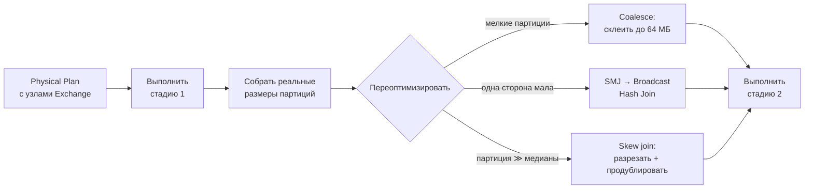
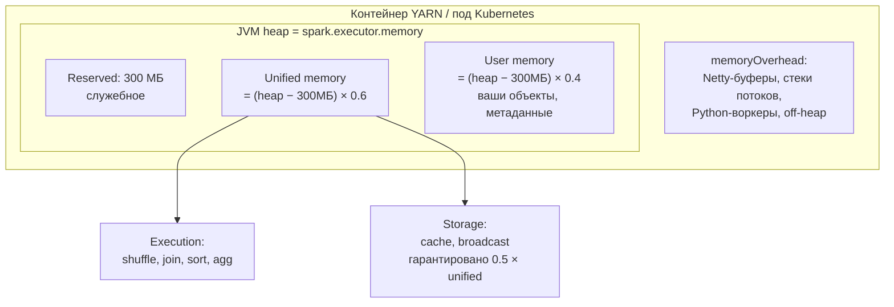

# Spark: производительность

> **Зачем эта глава.** «Джоба, которая раньше шла 20 минут, идёт четыре часа» — это самая
> частая внеплановая задача дата-инженера и ML-инженера, у которого есть свой ETL. Причин
> у неё около десяти, и все они диагностируются по Spark UI за пятнадцать минут — если знать,
> куда смотреть. Здесь: как найти перекос по трём числам в UI, как его лечить (AQE, salting,
> разделение горячих ключей), как считать число партиций и память экзекьютора, что означает
> каждая строка в `spark-submit`, и чек-лист из пятнадцати пунктов, по которому идут,
> когда джоба тормозит, а времени думать нет.

**Уровень:** 🎯 middle → 🧠 middle+
**Предварительно нужно:** [Spark: как он работает](03-spark-fundamentals.md) (обязательно: shuffle, стадии, партиции, память), [хранение данных](01-storage-and-formats.md)
**Время на проработку:** ~8 часов (чтение + разбор UI своей реальной джобы)

---

## Карта главы

- [1. Интуиция: почему «дайте больше экзекьюторов» не работает](#1-интуиция-почему-дайте-больше-экзекьюторов-не-работает)
- [2. Чтение Spark UI по шагам](#2-чтение-spark-ui-по-шагам)
- [3. Перекос данных: как его увидеть](#3-перекос-данных-как-его-увидеть)
- [4. Лечение перекоса 1: AQE skew join](#4-лечение-перекоса-1-aqe-skew-join)
- [5. Лечение перекоса 2: salting](#5-лечение-перекоса-2-salting)
- [6. Лечение перекоса 3: разделение горячих ключей и прочие приёмы](#6-лечение-перекоса-3-разделение-горячих-ключей-и-прочие-приёмы)
- [7. Число партиций: арифметика вместо гадания](#7-число-партиций-арифметика-вместо-гадания)
- [8. repartition, coalesce, repartitionByRange, rebalance](#8-repartition-coalesce-repartitionbyrange-rebalance)
- [9. AQE целиком](#9-aqe-целиком)
- [10. Память экзекьютора: модель и расчёт](#10-память-экзекьютора-модель-и-расчёт)
- [11. OOM: пять видов, симптомы, лечение](#11-oom-пять-видов-симптомы-лечение)
- [12. Spill: что это и как убрать](#12-spill-что-это-и-как-убрать)
- [13. spark-submit: разбор каждого параметра](#13-spark-submit-разбор-каждого-параметра)
- [14. Чек-лист «джоба тормозит»](#14-чек-лист-джоба-тормозит)
- [15. Подводные камни](#15-подводные-камни)
- [16. Проверь себя](#16-проверь-себя)
- [17. Практика](#17-практика)
- [18. Что читать дальше](#18-что-читать-дальше)

---

## 1. Интуиция: почему «дайте больше экзекьюторов» не работает

Конкретный случай, который повторяется в каждой второй команде.

Ежедневная джоба собирает признаки для рекомендательной модели: джойнит 4 млрд событий
с профилями пользователей и считает агрегаты. Работала 25 минут. После запуска нового
партнёрского трафика стала работать 3 часа 40 минут. Инженер удваивает число экзекьюторов
с 40 до 80. Джоба начинает работать 3 часа 35 минут.

Открываем Spark UI. Стадия 7 из 9 идёт 3 часа 10 минут. В ней 200 задач. 199 из них закончились
за 40 секунд. Одна работает 3 часа 9 минут и прочитала 340 ГБ при медиане 1.7 ГБ.

Дальше очевидно: 78 из 80 экзекьюторов простаивают, ожидая одну задачу. Удвоение кластера
не могло помочь **в принципе** — узкое место не в суммарной мощности, а в том, что работа
не делится. Это перекос данных (data skew), и виноват в нём один `user_id`: технический
аккаунт партнёра, на который пришлось 8% всех событий.

Отсюда главный принцип главы:

> **Сначала диагноз, потом лечение.** Любая настройка Spark без чтения UI — это гадание.
> «Увеличить память», «добавить партиций», «включить AQE» — каждое из этих действий лечит
> конкретную болезнь и вредит при других.

Практически все проблемы производительности Spark сводятся к пяти классам:

| Класс | Что видно в UI | Куда идти |
|---|---|---|
| **Перекос данных** | max задачи ≫ median (в 10–1000 раз) | §3–§6 |
| **Неверное число партиций** | задачи по 30 мс или задачи по 20 минут со spill | §7–§8 |
| **Нехватка памяти** | spill, высокий GC time, OOM, `FetchFailed` | §10–§12 |
| **Лишние shuffle** | много узлов `Exchange`, огромный Shuffle Write | §14 и глава 03 |
| **Проблема источника** | долгий листинг, тысячи мелких файлов, нет pushdown | §14 и глава 01 |

---

## 2. Чтение Spark UI по шагам

Spark UI доступен на порту 4040 драйвера, пока приложение живёт, и в History Server —
после. Это основной инструмент, и работать с ним нужно в фиксированном порядке.

### Шаг 1. Вкладка Jobs: где вообще время

Смотрим список джобов и их длительность. Цель — найти джобу, которая съела основное время.
Полезно сразу отметить два патологических паттерна:

- **Много коротких джоб.** Обычно это `count()` в логгировании или пошаговое `show()` — каждая
  джоба перечитывает цепочку.
- **Длинные паузы между джобами.** Драйвер планирует, листит файлы или коммитит результат.
  Если между последней задачей и следующей джобой 12 минут — вы упёрлись в драйвер,
  а не в кластер.

### Шаг 2. Вкладка SQL/DataFrame: где узел-виновник

Для DataFrame-кода это самая информативная вкладка. Открываем запрос и видим DAG, где каждый узел
подписан фактическими метриками: `number of output rows`, `data size`, `spill size`, `time`.

Что ищем:
- узел с неожиданно большим `number of output rows` — обычно взрыв строк на джойне
  (см. [SQL для MLE](02-sql-for-mle.md));
- узлы `Exchange` — каждый это shuffle; считаем их количество и объём;
- строку `Scan parquet` и в ней `PushedFilters` и `ReadSchema` — сработали ли pruning
  и pushdown.

### Шаг 3. Вкладка Stages: где именно тормозит

Сортируем стадии по Duration. Открываем самую долгую. Здесь главное — таблица **Summary Metrics
for Completed Tasks** с квантилями Min / 25th / Median / 75th / Max по каждой метрике.

Вот как читать её строки:

| Строка | Что означает | Тревожный сигнал |
|---|---|---|
| **Duration** | время задачи | Max / Median > 5 → перекос или медленный узел |
| **GC Time** | время в сборщике мусора | GC > 10% Duration → нехватка памяти или мусорный код |
| **Shuffle Read Size / Records** | сколько задача забрала при обмене | Max / Median > 10 → перекос по ключу |
| **Shuffle Write Size** | сколько отдала | сравниваем с размером входа: раздулось — лишние колонки |
| **Spill (Memory)** | объём данных, вытесненных из памяти (в несжатом виде) | любое ненулевое значение — повод разобраться |
| **Spill (Disk)** | сколько реально записано на диск (сжато) | > 10% от Shuffle Read → мало памяти или мало партиций |
| **Input Size** | прочитано с источника | сравниваем с ожидаемым: больше — не сработал pruning |
| **Scheduler Delay** | ожидание слота и доставки задачи | секунды → перегружен драйвер или мало слотов |
| **Task Deserialization Time** | распаковка задачи | сотни мс → раздутое замыкание (тащите объект в лямбде) |
| **Shuffle Read Blocked Time** | ожидание данных по сети | велико → сеть или медленные источники блоков |

**Главное число диагностики перекоса — отношение Max к Median по Duration и Shuffle Read.**
Если оно меньше 2, распределение здоровое. Если больше 10 — у вас перекос, и никакая настройка
памяти не поможет.

Ниже таблицы квантилей — список задач. Сортируем по Duration по убыванию, смотрим на самые
долгие: на каком они экзекьюторе (если все на одном — проблема узла, а не данных), сколько
прочитали, был ли spill.

### Шаг 4. Вкладка Executors: здоровье кластера

Здесь два взгляда.

**Первый: равномерность.** Колонки `Task Time` и `Shuffle Read` по экзекьюторам. Если один
экзекьютор набрал 40% суммарного времени — либо перекос, либо у вас проблемный узел (деградировавший
диск, шумный сосед). Если у одного экзекьютора `Failed Tasks > 0`, а у остальных ноль — смотрите
его логи.

**Второй: GC.** Колонка `GC Time` относительно `Task Time`. Норма — до 5%. 10–20% — память
на пределе. Больше 20% — JVM проводит в сборке мусора больше времени, чем в работе; это почти
всегда предвестник OOM.

Здесь же видно число живых экзекьюторов — если при `--num-executors 40` их 12, значит cluster
manager не дал ресурсы (очередь занята, квота, недостаток нод), и «медленная джоба» —
на самом деле джоба на трети кластера.

### Шаг 5. Вкладка Storage: что реально закэшировано

Колонка `Fraction Cached`. Если вы вызвали `cache()`, а закэшировано 43% — кэш вытесняется,
и вы получаете худшее из двух миров: тратите память и всё равно пересчитываете. Колонки
`Size in Memory` и `Size on Disk` показывают реальную цену вашего кэша.

> 💬 **На собеседовании.** Спросят: «Джоба стала работать в десять раз дольше. Ваши действия?»
> Хороший ответ — озвучить процедуру, а не гипотезу: «Открываю Spark UI. На вкладке Jobs
> нахожу, какая джоба съела время; на Stages — какая стадия. Смотрю Summary Metrics:
> сравниваю Max и Median по Duration и Shuffle Read. Отношение больше десяти — перекос,
> иду искать горячий ключ. Отношение около единицы, но задач всего 200 при 800 слотах —
> мало партиций. Есть Spill — не хватает execution-памяти. GC больше 15% — память на пределе.
> Много `Exchange` в SQL-плане — лишние шаффлы, смотрю, можно ли переупорядочить операции.
> Пустой `PushedFilters` — не работает pushdown». Плохой ответ: «увеличил бы память
> экзекьюторов» — это гадание, и в случае перекоса оно не помогает вообще.

---

## 3. Перекос данных: как его увидеть

**Перекос (data skew)** — ситуация, когда данные распределены по партициям сильно неравномерно.
Причина всегда одна: распределение значений ключа, по которому идёт shuffle, далеко
от равномерного.

Откуда берётся перекос в ML-данных — список из реальной практики:

| Источник | Пример | Типичная доля горячего ключа |
|---|---|---|
| Технические/служебные аккаунты | бот-аккаунт партнёра, тестовый пользователь QA | 3–15% всех событий |
| `NULL` в ключе джойна | `user_id IS NULL` у неавторизованных | 5–40% |
| Дефолтные значения | `city_id = 0` («не определён»), `-1`, пустая строка | 10–30% |
| Естественный степенной закон | популярный товар, крупный город, топовый продавец | 1–5% на ключ |
| Гранулярность времени | `dt` при джойне по дню, когда 90% трафика в один день (акция, Чёрная пятница) | 20–60% |

Три способа обнаружить:

**Способ 1: Spark UI, отношение Max/Median.** Уже разобран в §2. Быстрее всего.

**Способ 2: прямой подсчёт распределения ключа.** Дёшево и однозначно:

```python
from pyspark.sql import functions as F

def key_skew_report(df, key: str, top_n: int = 20):
    """Печатает топ горячих ключей и оценку перекоса относительно среднего."""
    dist = df.groupBy(key).count()
    total = df.count()
    n_keys = dist.count()
    avg = total / max(n_keys, 1)

    top = dist.orderBy(F.desc("count")).limit(top_n).collect()
    print(f"строк: {total:,}  уникальных ключей: {n_keys:,}  среднее на ключ: {avg:,.1f}")
    for r in top:
        share = r["count"] / total * 100
        print(f"  {key}={r[key]!r:>20}  count={r['count']:>12,}  "
              f"доля={share:5.2f}%  x{r['count'] / avg:,.0f} от среднего")

key_skew_report(events, "user_id")
```

Что считать перекосом: если топ-1 ключ даёт больше 1% всех строк при миллионах уникальных
ключей — вы уже в зоне риска; если больше 5% — вы точно упрётесь в одну задачу.

**Способ 3: распределение по будущим партициям.** Точнее предыдущего, потому что учитывает
хеширование и склейку ключей в одну партицию:

```python
R = spark.conf.get("spark.sql.shuffle.partitions")
sizes = (
    events
    .withColumn("_pid", F.pmod(F.hash(F.col("user_id")), F.lit(int(R))))
    .groupBy("_pid").count()
    .orderBy(F.desc("count"))
)
sizes.show(10)
# Смотрим на отношение первой строки к медиане: это и есть будущий перекос стадии
```

> 📐 **Разбор формулы.** Насколько перекос удлиняет стадию. Пусть строк всего $N$, партиций $R$,
> доля самого горячего ключа $p$. Тогда идеальная задача обработала бы $N/R$ строк, а горячая —
> примерно $pN$. Отношение:
>
> $$
> \text{skew factor} = \frac{p N}{N / R} = p \cdot R
> $$
>
> где $p$ — доля горячего ключа во всех строках, $R$ — число reduce-партиций.
>
> Подставим реальные числа: $p = 0.08$ (8% событий на техническом аккаунте), $R = 200$.
> Skew factor = 16. То есть стадия будет идти **в 16 раз дольше**, чем могла бы, и никакое
> увеличение кластера этого не изменит. Заметьте контринтуитивное следствие: **увеличение $R$
> усугубляет относительный перекос**, потому что «здоровые» задачи мельчают, а горячая
> не делится вообще.

---

## 4. Лечение перекоса 1: AQE skew join

Первое, что нужно проверить, — включено ли адаптивное исполнение и почему оно не сработало.

**Что делает AQE со skew.** По завершении map-стадии Spark знает фактический размер каждой
из $R$ будущих партиций. Он находит аномально большие и **режет их на подпартиции**,
дублируя соответствующую партицию другой стороны джойна.

Партиция считается перекошенной, если выполнены **оба** условия:

$$
\text{size}_i > F \cdot \text{median}(\text{size}), \qquad \text{size}_i > T
$$

где $\text{size}_i$ — размер $i$-й партиции после shuffle; $F$ —
`spark.sql.adaptive.skewJoin.skewedPartitionFactor` (по умолчанию 5.0);
$T$ — `spark.sql.adaptive.skewJoin.skewedPartitionThresholdInBytes` (по умолчанию 256 МБ).

Разрезанные куски делаются размером примерно `spark.sql.adaptive.advisoryPartitionSizeInBytes`
(64 МБ).

```python
spark.conf.set("spark.sql.adaptive.enabled", "true")                 # дефолт с 3.2
spark.conf.set("spark.sql.adaptive.skewJoin.enabled", "true")        # дефолт
spark.conf.set("spark.sql.adaptive.skewJoin.skewedPartitionFactor", "3")
spark.conf.set("spark.sql.adaptive.skewJoin.skewedPartitionThresholdInBytes", "64MB")
spark.conf.set("spark.sql.adaptive.advisoryPartitionSizeInBytes", "64MB")
```

В плане после исполнения (`df.explain()` уже не покажет — нужен `AdaptiveSparkPlan` в UI
на вкладке SQL) появится `SortMergeJoin(isSkew=true)`, а в UI число задач стадии будет больше
`spark.sql.shuffle.partitions`.

**Где AQE skew join не помогает — и это спрашивают.**

1. **Перекос в агрегации, а не в джойне.** `groupBy("user_id").agg(...)` с горячим ключом
   AQE не чинит: разрезать партицию нельзя, потому что все строки ключа нужны в одном месте.
   Лечится двухфазной агрегацией с солью (§5).
2. **Broadcast join.** Если джойн уже бродкастный, перекос всё равно возможен — по числу строк
   на выходе, а не по чтению. AQE тут ни при чём.
3. **Один ключ больше порога даже после разрезания.** Если 8% данных на одном ключе — это
   340 ГБ, куски по 64 МБ дадут 5400 подзадач для **одной** стороны, а вторую сторону придётся
   продублировать 5400 раз. Иногда это работает, иногда взрывает объём.
4. **Порог не достигнут.** Дефолтные 256 МБ — это много. При партициях по 100 МБ и горячей
   на 200 МБ AQE не сработает, хотя стадия уже перекошена вдвое. Снижение порога до 64 МБ —
   первое, что стоит попробовать.
5. **Перекос ещё до shuffle**, на стадии чтения: один файл на 40 ГБ, остальные по 100 МБ.
   AQE работает с shuffle-партициями, а не с файловыми сплитами.

> ⚠️ **Типичная ошибка.** Считать, что «включил AQE — перекос вылечен». AQE — это дешёвая
> и часто достаточная мера, но она реагирует на **размер в байтах**. Классический контрпример:
> ключ с миллионом строк по 50 байт (50 МБ — ниже порога), но джойн даёт по 100 совпадений
> на строку. Партиция маленькая, а работа огромная. Проверяйте не только Shuffle Read Size,
> но и Shuffle Read Records.

---

## 5. Лечение перекоса 2: salting

Идея: если один ключ слишком горячий, сделаем из него $k$ искусственных ключей, разложим строки
по ним случайно — и заставим работать $k$ задач вместо одной.

### Salting для агрегации

Это самый частый случай в ML-пайплайнах и единственное лечение перекоса в `groupBy`.
Работает для **разложимых** (декомпозируемых) агрегатов: `sum`, `count`, `min`, `max`,
`sum` для последующего среднего.

```python
from pyspark.sql import functions as F

SALT = 64   # во сколько раз дробим горячие ключи

# Фаза 1: агрегируем по (ключ, соль) — работа делится между SALT задачами
partial = (
    events
    .withColumn("_salt", F.pmod(F.hash(F.col("event_id")), F.lit(SALT)))  # детерминированно
    .groupBy("user_id", "_salt")
    .agg(
        F.sum("amount").alias("_sum"),
        F.count(F.lit(1)).alias("_cnt"),
        F.max("ts").alias("_max_ts"),
    )
)

# Фаза 2: досчитываем по ключу — на вход приходит не более SALT строк на пользователя
result = (
    partial
    .groupBy("user_id")
    .agg(
        F.sum("_sum").alias("amount_sum"),
        F.sum("_cnt").alias("events_cnt"),
        F.max("_max_ts").alias("last_ts"),
    )
    .withColumn("amount_avg", F.col("amount_sum") / F.col("events_cnt"))
)
```

Почему соль берётся как `pmod(hash(event_id), SALT)`, а не `rand()`: при перезапуске задачи
(а он случается) `rand()` без фиксированного seed даст другое разбиение, и агрегат может
посчитаться неверно. Хеш от уникальной колонки строки детерминирован всегда. Если уникальной
колонки нет — `F.rand(seed=42)` приемлемо, но помните про недетерминизм при спекулятивном
исполнении.

**Что не работает через salting:** `countDistinct`, медиана, перцентили, `collect_list`
с ограничением порядка — они не разложимы. Для `countDistinct` используйте
`approx_count_distinct` (HyperLogLog, ошибка ~2% при дефолтном `rsd=0.05`) либо двухфазную
схему через `collect_set` по соли и объединение множеств (дорого по памяти).

### Salting для джойна

Здесь соль нужна с обеих сторон, но по-разному: большая таблица получает случайную соль,
малая — **размножается** на все значения соли.

```python
SALT = 32

big_salted = big.withColumn("_salt", F.pmod(F.hash(F.col("row_id")), F.lit(SALT)))

# Размножаем правую сторону: каждая её строка повторяется SALT раз
small_exploded = (
    small
    .withColumn("_salt", F.explode(F.array([F.lit(i) for i in range(SALT)])))
)

joined = (
    big_salted
    .join(small_exploded, on=["user_id", "_salt"], how="inner")
    .drop("_salt")
)
```

Цена очевидна: правая таблица раздувается в `SALT` раз. Для справочника на 100 тыс. строк
при `SALT=32` это 3.2 млн строк — ерунда. Для таблицы на 500 млн строк — катастрофа.
Отсюда правило: **салтить джойн целиком имеет смысл, только если одна сторона мала**;
если обе большие — используйте точечный вариант из §6.

### Как выбрать SALT

$$
k \approx \left\lceil \frac{p \cdot N}{N / R} \right\rceil = \lceil p \cdot R \rceil
$$

где $k$ — число солей, $p$ — доля самого горячего ключа, $R$ — число shuffle-партиций,
$N$ — общее число строк. Смысл: дробим горячий ключ ровно настолько, чтобы его куски стали
размером с обычную партицию.

Пример: $p=0.08$, $R=200$ → $k = 16$. Берём с запасом: 32. Ставить $k=1000$ бессмысленно —
вы просто добавите 1000-кратное размножение малой таблицы и лишние строки во второй фазе.

> 💬 **На собеседовании.** Спросят: «Как бороться с перекосом при джойне?» Хороший ответ —
> лестница по возрастанию стоимости: (1) проверить, нельзя ли отфильтровать источник перекоса
> вообще — `NULL` в ключе, технические аккаунты, дефолтные `-1` часто просто не нужны в выборке;
> (2) если малая сторона влезает — broadcast join, тогда shuffle большой стороны исчезает
> и перекос перестаёт быть проблемой; (3) AQE skew join с понижением
> `skewedPartitionThresholdInBytes` до 64 МБ — это бесплатно и часто достаточно; (4) salting
> с числом солей $\lceil p\cdot R\rceil$, если малая сторона терпит размножение; (5) разделение
> на горячую и холодную части и два разных джойна с последующим union — когда обе стороны
> большие. И обязательно упомянуть, что для перекоса в `groupBy` первые три пункта не работают,
> нужна двухфазная агрегация с солью. Плохой ответ: «увеличу число партиций» — при перекосе
> это делает хуже.

---

## 6. Лечение перекоса 3: разделение горячих ключей и прочие приёмы

### Разделение на горячую и холодную части

Самый мощный приём, когда обе таблицы большие. Идея: горячие ключи — это единицы штук, значит
их часть справочника заведомо мала и её можно забродкастить.

```python
from pyspark.sql import functions as F

# 1. Находим горячие ключи по сэмплу (дёшево: 1% данных достаточно)
hot_keys = [
    r["user_id"] for r in (
        big.sample(fraction=0.01, seed=42)
           .groupBy("user_id").count()
           .where(F.col("count") > 50_000)      # порог: 1% × 5 млн строк на ключ
           .select("user_id").collect()
    )
]
print(f"горячих ключей: {len(hot_keys)}")

hot_b = F.broadcast(spark.createDataFrame([(k,) for k in hot_keys], ["user_id"]))

# 2. Режем обе стороны на горячую и холодную части
big_hot  = big.join(hot_b, "user_id", "left_semi")
big_cold = big.join(hot_b, "user_id", "left_anti")
dim_hot  = dim.join(hot_b, "user_id", "left_semi")

# 3. Горячую часть джойним бродкастом (справочник по 20 ключам — килобайты),
#    холодную — обычным sort-merge, где распределение уже ровное
res_hot  = big_hot.join(F.broadcast(dim_hot), "user_id", "inner")
res_cold = big_cold.join(dim, "user_id", "inner")

result = res_hot.unionByName(res_cold)
```

Почему это работает: для горячих ключей shuffle большой таблицы полностью исчезает
(бродкаст), а холодная часть после удаления выбросов имеет здоровое распределение, и обычный
sort-merge справляется. Цена — два прохода по большой таблице; при кэше или при чтении
из Parquet с pushdown это приемлемо.

### Отфильтровать источник перекоса

Часто самое дешёвое решение. Прежде чем салтить, спросите: **а нужны ли вам эти строки?**

```python
# NULL в ключе джойна: все NULL уезжают в одну партицию, а в inner join они всё равно не выживут
events = events.where(F.col("user_id").isNotNull())

# Технические аккаунты — обычно мусор для обучения модели
events = events.where(~F.col("user_id").isin(SERVICE_ACCOUNT_IDS))

# Дефолтные значения-заглушки
events = events.where(F.col("city_id") > 0)
```

Одна строка фильтра нередко убирает то, ради чего собирались строить трёхэтажную схему
с солью. И качество модели от выбрасывания бот-трафика обычно растёт.

### Предагрегация до джойна

Если после джойна вы всё равно агрегируете, сделайте агрегацию **до** него — тогда
и объём, и перекос уменьшатся:

```python
# Плохо: джойним 4 млрд строк, потом схлопываем в 40 млн
bad = events.join(dim, "user_id").groupBy("user_id", "segment").agg(F.sum("amount"))

# Хорошо: сначала схлопываем 4 млрд → 40 млн, потом джойним справочник
agg = events.groupBy("user_id").agg(F.sum("amount").alias("amount"))
good = agg.join(F.broadcast(dim), "user_id")
```

Перекос в первой агрегации остаётся, но он лечится частичной агрегацией на map-стороне,
которую Spark делает сам: для `sum`/`count` каждая map-задача схлопывает свои строки
до уникальных ключей **до** shuffle, и по сети едет уже сжатый результат.

### Хинты как последнее средство

```python
big.hint("skew", "user_id").join(dim, "user_id")   # поддерживается не во всех дистрибутивах
big.join(dim.hint("shuffle_hash"), "user_id")      # форсировать shuffle hash join
big.join(dim.hint("merge"), "user_id")             # форсировать sort merge join
```

Хинты — это ручное управление, которое ломается при изменении данных. Ставьте их только
с комментарием, объясняющим, почему автоматика не справилась.

---

## 7. Число партиций: арифметика вместо гадания

Дефолт `spark.sql.shuffle.partitions = 200` не имеет отношения к вашим данным и вашему кластеру.
Считать надо от двух ограничений одновременно.

**Ограничение снизу — размер партиции.** Целевой размер одной shuffle-партиции: **128–200 МБ**
данных. Меньше 32 МБ — накладные расходы задачи начинают доминировать; больше 300–400 МБ —
задача рискует спиллить и долго держит слот.

$$
R_{\text{size}} = \left\lceil \frac{S_{\text{shuffle}}}{s_{\text{target}}} \right\rceil
$$

где $S_{\text{shuffle}}$ — объём Shuffle Write стадии в байтах (берётся прямо из Spark UI),
$s_{\text{target}}$ — целевой размер партиции (обычно $160$ МБ).

**Ограничение сверху — число слотов.** Партиций должно быть кратно $E \cdot C$, чтобы
не оставалось неполной волны, и хотя бы 2–3 волны, чтобы сгладить неравномерность:

$$
R = \left\lceil \frac{R_{\text{size}}}{E \cdot C} \right\rceil \cdot E \cdot C,
\qquad R \ge 2 E C
$$

где $E$ — число экзекьюторов, $C$ — `spark.executor.cores`.

**Полный пример.** Shuffle Write = 640 ГБ, кластер: 50 экзекьюторов × 5 ядер = 250 слотов.

- $R_{\text{size}} = 640 \cdot 1024 / 160 = 4096$ партиций;
- волн: $\lceil 4096/250 \rceil = 17$;
- итоговое: $17 \cdot 250 = 4250$ партиций;
- проверка: $640\ \text{ГБ} / 4250 \approx 154$ МБ на партицию. Хорошо.

```python
spark.conf.set("spark.sql.shuffle.partitions", 4250)
```

> ⌨️ **Руками.** Напишите функцию, которая по трём числам (объём shuffle в ГБ, число экзекьюторов,
> ядер на экзекьютор) возвращает рекомендованное `spark.sql.shuffle.partitions`, и проверьте
> её на своей реальной джобе: сравните с тем, что стоит сейчас. В 80% случаев разница
> будет в разы.

**Важное уточнение про AQE.** Если AQE включён (а он включён по умолчанию с версии 3.2),
`spark.sql.shuffle.partitions` работает как **верхняя граница**: Spark стартует с этого числа,
а потом склеивает мелкие партиции до `advisoryPartitionSizeInBytes`. Поэтому при AQE
рекомендуется ставить значение **с запасом вверх** (например, 2000–8000) и позволить AQE
схлопнуть лишнее — это лучше, чем угадать точно.

Разные стадии одной джобы требуют разного числа партиций, и одна глобальная настройка тут
принципиально не оптимальна. Именно эту проблему решает AQE, и именно поэтому он важнее
ручной настройки.

---

## 8. repartition, coalesce, repartitionByRange, rebalance

Четыре способа изменить разбиение, и путать их дорого.

| Операция | Shuffle | Меняет число партиций | Выравнивает размеры | Типичное применение |
|---|---|---|---|---|
| `repartition(n)` | да, полный | вверх и вниз | да (round-robin) | увеличить параллелизм, выровнять после фильтра |
| `repartition(n, "col")` | да, полный | вверх и вниз | по хешу колонки | подготовка к записи с `partitionBy` |
| `coalesce(n)` | нет | только вниз | нет | уменьшить число выходных файлов |
| `repartitionByRange(n, "col")` | да, + сэмплирование | вверх и вниз | по диапазонам значений | подготовка к сортированной записи |
| `df.hint("rebalance", "col")` | да | решает AQE | да, с разрезанием перекошенных | запись без мелких файлов и без перекоса |

**Ключевое отличие `coalesce`, из-за которого он опасен.** `coalesce` — узкая операция:
он не добавляет shuffle, а просто склеивает соседние партиции. Но именно поэтому он **сужает
параллелизм всей предшествующей стадии**:

```python
# ЛОВУШКА: вся тяжёлая работа поедет в ОДНОЙ задаче
df.filter(...).withColumn("f", heavy_expr).coalesce(1).write.parquet(path)

# Правильно, если действительно нужен один файл: разорвать стадию shuffle-ом
df.filter(...).withColumn("f", heavy_expr).repartition(1).write.parquet(path)
```

`repartition(1)` дороже (полный shuffle), но обработка идёт параллельно, и только запись —
в один поток.

**Когда что применять на практике.**

*После агрессивного фильтра.* Прочитали 4000 партиций, отфильтровали 98% строк — теперь
у вас 4000 почти пустых партиций и 4000 задач по 20 мс. `coalesce(200)` тут идеален: shuffle
не нужен, а параллелизм чтения он не ломает (чтение уже случилось... вернее, случится
в той же стадии — поэтому ставьте `coalesce` так, чтобы значение было не меньше разумного
числа задач для чтения).

*Перед записью с партиционированием.* Худшая ошибка — писать 2000 задач в 500 директорий,
получая до миллиона файлов:

```python
# Каждая задача пишет ровно в одну директорию dt → один файл на партицию таблицы
(df.repartition("dt")
   .write.mode("overwrite")
   .partitionBy("dt")
   .parquet("s3a://lake/features/"))

# Если внутри дня данных много — контролируем размер файла явно
(df.repartition(200, "dt")           # 200 файлов в каждой дневной директории
   .write.partitionBy("dt").parquet(path))
```

*Для равномерных файлов без ручного подбора* — `rebalance` (Spark 3.3+), который отдаёт решение AQE:

```python
df.hint("rebalance", "dt").write.partitionBy("dt").parquet(path)
```

> ⚠️ **Типичная ошибка.** `repartition(200)` «на всякий случай» в начале пайплайна. Это
> добавляет полный shuffle всех данных ради ничего: если после чтения у вас 3000 партиций
> по 128 МБ, они уже нормального размера. Каждый `repartition` — это запись и чтение всего
> датасета. Ставьте его только тогда, когда можете объяснить, какую конкретно проблему
> он решает.

---

## 9. AQE целиком

**Adaptive Query Execution** — механизм, который переоптимизирует план **во время исполнения**,
на границах стадий, используя фактическую статистику завершённых shuffle-обменов
(`MapOutputStatistics`), а не оценки.

Почему это принципиально: обычный оптимизатор выбирает стратегию джойна до запуска, по оценкам
размера файлов. Оценки врут постоянно — после фильтра, после агрегации, при сжатом Parquet,
при отсутствии статистик. AQE знает точный размер каждой партиции после того, как map-стадия
завершилась, и может передумать.



### Три оптимизации AQE

**1. Динамическое схлопывание партиций (coalesce shuffle partitions).**
Вы поставили `spark.sql.shuffle.partitions = 4000`, а после фильтра данных осталось на 20 ГБ.
Без AQE — 4000 задач по 5 МБ. С AQE — партиции склеиваются до целевого размера, получается
порядка 300 задач.

| Параметр | Дефолт | Что делает |
|---|---|---|
| `spark.sql.adaptive.coalescePartitions.enabled` | `true` | включает схлопывание |
| `spark.sql.adaptive.advisoryPartitionSizeInBytes` | `64MB` | целевой размер партиции после схлопывания |
| `spark.sql.adaptive.coalescePartitions.minPartitionSize` | `1MB` | нижняя граница размера |
| `spark.sql.adaptive.coalescePartitions.initialPartitionNum` | = `shuffle.partitions` | с какого числа стартовать |
| `spark.sql.adaptive.coalescePartitions.parallelismFirst` | `true` | при `true` игнорирует advisory-размер ради максимального параллелизма |

> 🧠 **Middle+.** Параметр `parallelismFirst` — источник недоумения: вы ставите
> `advisoryPartitionSizeInBytes=128MB`, а получаете партиции по 5 МБ. Причина в том, что
> при `parallelismFirst=true` (дефолт) Spark соблюдает только `minPartitionSize` и старается
> занять все ядра. Официальная рекомендация — ставить `parallelismFirst=false`, если вы хотите,
> чтобы advisory-размер действительно соблюдался. Это одна из самых полезных двух строк
> в конфиге больших ETL.

**2. Переключение sort-merge join на broadcast.**
Если после фильтров одна сторона оказалась меньше
`spark.sql.adaptive.autoBroadcastJoinThreshold` (по умолчанию совпадает с обычным порогом
в 10 МБ), AQE заменит уже запланированный SortMergeJoin на BroadcastHashJoin — данные для
малой стороны уже посчитаны, остаётся их собрать и разослать. В связке работает
`spark.sql.adaptive.localShuffleReader.enabled` (`true`): после перехода на бродкаст
reduce-задачи читают shuffle-блоки локально, без сети.

**3. Обработка перекоса при джойне** — разобрана в §4.

### Полный рабочий блок настроек AQE

```python
conf = {
    # ядро AQE
    "spark.sql.adaptive.enabled": "true",

    # схлопывание мелких партиций
    "spark.sql.adaptive.coalescePartitions.enabled": "true",
    "spark.sql.adaptive.coalescePartitions.parallelismFirst": "false",  # уважать advisory
    "spark.sql.adaptive.advisoryPartitionSizeInBytes": "128MB",
    "spark.sql.adaptive.coalescePartitions.minPartitionSize": "16MB",

    # перекос
    "spark.sql.adaptive.skewJoin.enabled": "true",
    "spark.sql.adaptive.skewJoin.skewedPartitionFactor": "3",
    "spark.sql.adaptive.skewJoin.skewedPartitionThresholdInBytes": "64MB",

    # динамический бродкаст: поднимаем выше дефолтных 10 МБ
    "spark.sql.adaptive.autoBroadcastJoinThreshold": "64MB",
    "spark.sql.autoBroadcastJoinThreshold": "64MB",

    # верхняя граница, от которой AQE будет схлопывать вниз
    "spark.sql.shuffle.partitions": "4000",
}
for k, v in conf.items():
    spark.conf.set(k, v)
```

### Чего AQE не делает

Это ровно то, что спрашивают на собеседовании после слов «включите AQE».

- **Не чинит перекос в агрегациях** (`groupBy`, оконные функции с `PARTITION BY`) — только
  в джойнах.
- **Не меняет порядок джойнов** в общем случае — это работа CBO, который по умолчанию выключен.
- **Не помогает, если shuffle нет.** AQE переоптимизирует на границах обменов; чисто narrow-джоба
  (read → filter → write) от него ничего не получит.
- **Не уменьшает число прочитанных файлов** и не решает проблему мелких файлов на источнике.
- **Не спасает от OOM в задаче**, если у вас одна строка на 500 МБ (гигантский массив в колонке).
- **Добавляет накладные расходы** на переоптимизацию: для очень коротких запросов
  (секунды) это заметно. Для ETL на минуты и часы — незаметно.

> 💬 **На собеседовании.** Спросят: «Что даёт AQE и когда он бесполезен?» Хороший ответ:
> AQE переоптимизирует план на границах стадий по фактическим размерам shuffle-партиций,
> и делает три вещи — схлопывает мелкие партиции до целевого размера, переключает sort-merge
> на broadcast, если сторона после фильтров оказалась мала, и разрезает перекошенные партиции
> при джойне. Включён по умолчанию с 3.2. Бесполезен, когда в запросе нет shuffle;
> не чинит перекос в `groupBy`; не переставляет порядок джойнов; и его дефолты консервативны —
> порог перекоса 256 МБ и `parallelismFirst=true` часто нужно менять руками.
> Плохой ответ: «AQE сам всё оптимизирует».

---

## 10. Память экзекьютора: модель и расчёт

Без модели памяти невозможно осмысленно лечить OOM. Модель такая.



$$
M_{\text{usable}} = M_{\text{heap}} - 300\ \text{МБ},\quad
M_{\text{unified}} = f \cdot M_{\text{usable}},\quad
M_{\text{storage}}^{\min} = s \cdot M_{\text{unified}}
$$

где $M_{\text{heap}}$ — `spark.executor.memory`; $f$ — `spark.memory.fraction` (0.6);
$s$ — `spark.memory.storageFraction` (0.5). Оставшиеся $(1-f)M_{\text{usable}}$ — user memory,
которой Spark не управляет.

**Граница между Execution и Storage подвижна, но асимметрична:** execution может вытеснить
кэш вплоть до $M_{\text{storage}}^{\min}$, а storage вытеснить execution **не может**.
Практическое следствие: избыточный кэш проявляется не как ошибка, а как внезапный spill
в стадиях, которые раньше его не имели.

**Сколько памяти достаётся одной задаче.** Execution-память делится между активными задачами
экзекьютора:

$$
M_{\text{task}} \approx \frac{M_{\text{unified}} - M_{\text{cached}}}{C}
$$

где $C$ — `spark.executor.cores` (число одновременно исполняемых задач), $M_{\text{cached}}$ —
фактически занятая кэшем память. Именно поэтому увеличение `executor.cores` без увеличения
`executor.memory` вызывает spill и OOM: памяти на задачу становится меньше.

**Расчёт на конкретном железе.** Узел: 64 ядра, 480 ГБ RAM.

1. Резервируем на ОС и агента cluster manager: 2 ядра, 32 ГБ → доступно 62 ядра, 448 ГБ.
2. Ядер на экзекьютор — 5 (обоснование ниже). Экзекьюторов на узел: $\lfloor 62/5 \rfloor = 12$.
3. Памяти на контейнер: $448/12 \approx 37$ ГБ.
4. Разделяем: overhead 15–20% для PySpark → `--executor-memory 30g`,
   `spark.executor.memoryOverhead=7g`. Для чистого Scala/SQL можно 33g + 4g.
5. Проверка: usable = 29.7 ГБ, unified = 17.8 ГБ, на задачу при 5 ядрах ≈ 3.6 ГБ. Нормально.

**Почему 5 ядер на экзекьютор — это дефолтный ответ.**
- Больше 5–6 одновременных потоков на один клиент HDFS/S3 деградируют пропускную способность
  чтения (классическое эмпирическое наблюдение, воспроизводится и на объектных хранилищах).
- Один экзекьютор на много ядер — гигантский heap, длинные паузы сборщика мусора.
- Один экзекьютор на одно ядро — теряется главное преимущество совместной памяти: бродкаст
  хранится по копии **на экзекьютор**, а не на задачу. При 1 ядре вы держите в 5 раз больше
  копий бродкаста и в 5 раз больше JVM-оверхеда.

> 💬 **На собеседовании.** Спросят: «У вас узлы по 64 ядра и 480 ГБ. Как нарежете экзекьюторы?»
> Хороший ответ — с арифметикой: «Оставляю 1–2 ядра и ~30 ГБ на систему и демоны кластера.
> Беру 5 ядер на экзекьютор: это компромисс между пропускной способностью I/O, которая падает
> при большем числе конкурентных потоков, и накладными расходами JVM и дублированием бродкастов
> при меньшем. Получаю 12 экзекьюторов по 5 ядер на узел, около 37 ГБ на контейнер, из них
> 30 ГБ heap и 7 ГБ overhead — для PySpark overhead нужен больший, потому что там живут
> Python-воркеры. Проверяю: unified-память примерно 18 ГБ, на задачу около 3.5 ГБ, этого
> хватает для партиций по 150 МБ с запасом на сортировку и хеш-таблицы». Плохой ответ:
> «поставлю executor-memory 64g и cores 16».

---

## 11. OOM: пять видов, симптомы, лечение

`OutOfMemory` в Spark — это пять разных болезней с одинаковой фамилией. Лечение у них разное,
и первое, что нужно сделать, — понять, **кто именно** упал.

### Вид 1. OOM драйвера

**Симптом.** В логах драйвера: `java.lang.OutOfMemoryError: Java heap space` или
`Total size of serialized results of N tasks is bigger than spark.driver.maxResultSize`.
Приложение падает целиком.

**Причины и лечение.**

| Причина | Как проверить | Лечение |
|---|---|---|
| `collect()` / `toPandas()` на большом df | ищем в коде | агрегировать до размера, влезающего в память; писать в Parquet |
| Бродкаст слишком большой таблицы | UI → SQL → размер `BroadcastExchange` | снизить `autoBroadcastJoinThreshold`, убрать `F.broadcast()` |
| Листинг сотен тысяч файлов | долгая пауза до первой задачи | компакция источника, табличный формат с манифестом |
| Слишком много задач в истории | сотни тысяч задач в UI | `spark.ui.retainedStages=200`, `spark.ui.retainedJobs=100` |
| Огромный accumulator / broadcast-переменная | код | пересмотреть подход |

### Вид 2. OOM heap экзекьютора

**Симптом.** `java.lang.OutOfMemoryError: Java heap space` или `GC overhead limit exceeded`
в логах экзекьютора; задачи падают и перезапускаются; в UI на вкладке Executors высокий GC Time.

**Причины и лечение.**

| Причина | Лечение |
|---|---|
| Партиция слишком большая (перекос или мало партиций) | увеличить `shuffle.partitions`, лечить перекос (§3–§6) |
| Хеш-таблица shuffle hash join не влезла | форсировать sort-merge: `dim.hint("merge")` или `preferSortMergeJoin=true` |
| `collect_list` / `collect_set` по горячему ключу | заменить на агрегат, ограничить размер, использовать `approx_*` |
| Кэш съел память | `unpersist()`, сменить уровень на `MEMORY_AND_DISK_SER` или `DISK_ONLY` |
| Оконная функция без `PARTITION BY` | все строки в одну партицию — добавить разбиение или переписать |
| Мало ядер, но огромные партиции | увеличить `executor.memory` или уменьшить `executor.cores` |

### Вид 3. Контейнер убит менеджером за превышение памяти

**Симптом.** YARN: `Container killed by YARN for exceeding memory limits. 38.5 GB of 37 GB
physical memory used. Consider boosting spark.executor.memoryOverhead`.
Kubernetes: под в статусе `OOMKilled`, `exit code 137`.

Отличие от вида 2 принципиально: **JVM не жаловалась**. Память съело что-то вне heap.

**Причины и лечение.**

| Причина | Лечение |
|---|---|
| Python-воркеры (PySpark, pandas UDF) | `spark.executor.memoryOverhead` = 20–40% от heap; ограничить `spark.executor.pyspark.memory` |
| Крупные Arrow-батчи | снизить `spark.sql.execution.arrow.maxRecordsPerBatch` с 10000 до 1000–2000 |
| Off-heap включён, но не учтён в контейнере | overhead должен покрывать `spark.memory.offHeap.size` |
| Много потоков (netty-буферы при большом shuffle) | увеличить overhead, снизить `spark.reducer.maxSizeInFlight` |
| Нативные библиотеки (numpy, torch, ONNX) внутри UDF | overhead + явное ограничение числа потоков BLAS: `OMP_NUM_THREADS=1` |

Последний пункт стоит отдельного упоминания: numpy/torch по умолчанию берут столько потоков,
сколько ядер на **машине**, а не на экзекьюторе. При пяти задачах на экзекьюторе и 64 ядрах
на узле вы получаете 320 потоков и мгновенное превышение памяти и CPU. Всегда ставьте:

```python
spark = (SparkSession.builder
    .config("spark.executorEnv.OMP_NUM_THREADS", "1")
    .config("spark.executorEnv.OPENBLAS_NUM_THREADS", "1")
    .config("spark.executorEnv.MKL_NUM_THREADS", "1")
    .getOrCreate())
```

### Вид 4. OOM Python-воркера

**Симптом.** `MemoryError` в трейсбеке Python, либо
`org.apache.spark.api.python.PythonException` с питоновским стеком, либо воркер молча убит.

**Причины и лечение.** Чаще всего `applyInPandas` или `groupBy().applyInPandas()`: вся группа
должна поместиться в память Python-процесса **целиком**. Горячий ключ на 50 млн строк — это
готовый `MemoryError`. Лечение: ограничивать размер группы (предагрегация, сэмплирование
внутри группы), переходить на итераторную форму pandas UDF, снижать
`arrow.maxRecordsPerBatch`.

### Вид 5. «Не OOM, но всё умерло»: FetchFailedException

**Симптом.** `FetchFailedException`, `Connection reset by peer`, стадия перезапускается,
время джобы удваивается.

**Причина.** Почти всегда — вид 2 или 3 у соседа: экзекьютор, хранивший shuffle-файлы, умер.
Лечите первопричину. Временные меры: включить внешний shuffle service
(`spark.shuffle.service.enabled=true`, а в k8s — `spark.dynamicAllocation.shuffleTracking.enabled=true`),
поднять `spark.shuffle.io.maxRetries` до 10 и `spark.shuffle.io.retryWait` до 30s,
включить `spark.speculation=true` для борьбы с подвисшими узлами.

> ⚠️ **Типичная ошибка.** На любой OOM увеличивать `--executor-memory`. Это помогает
> в одном случае из пяти (вид 2 при умеренном превышении). При перекосе вы просто отодвинете
> падение: партиция на 340 ГБ не влезет ни в 30, ни в 60 ГБ. При OOM контейнера увеличение heap
> вообще контрпродуктивно — оно уменьшает overhead, если общий размер контейнера фиксирован
> квотой. Всегда сначала читайте, **какая именно** ошибка и **где** она произошла.

---

## 12. Spill: что это и как убрать

**Spill** — вытеснение промежуточных данных из памяти на локальный диск, когда задаче не хватает
execution-памяти. Это не ошибка: Spark специально умеет спиллить, чтобы не падать. Но это
всегда замедление, часто в разы.

**Где возникает:** сортировка (`sortBy`, `orderBy`, sort-merge join), агрегация с большим числом
уникальных ключей (`HashAggregate` не влез — переходит на `SortAggregate` со spill),
запись shuffle на map-стороне, оконные функции.

**Как увидеть.** В Spark UI, вкладка Stages → Summary Metrics, две строки:

- **Spill (Memory)** — объём данных в **несжатом, десериализованном** виде, который был вытеснен;
- **Spill (Disk)** — сколько байт реально записано на диск (сжато, сериализовано).

Соотношение обычно 3–8× между ними: 24 ГБ Spill (Memory) при 4 ГБ Spill (Disk) — нормальная
пропорция, и оба числа означают одно и то же событие.

**Правило чтения:** если `Spill (Disk)` превышает 10% от `Shuffle Read Size` — это заметная
потеря производительности; если сравним с ним — стадия тратит на диск больше, чем на работу.

**Лечение, по убыванию эффективности.**

1. **Больше партиций.** Прямое решение: если партиция 800 МБ не влезает в 3.5 ГБ на задачу
   вместе с промежуточными структурами, сделайте партиции по 150 МБ. Это самая частая причина.
2. **Убрать перекос.** Спиллит обычно не «стадия», а конкретные задачи с горячими ключами —
   смотрите на Max в строке Spill.
3. **Освободить память от кэша.** `unpersist()` ненужного, смена уровня на `DISK_ONLY`.
4. **Убрать лишние колонки до shuffle.** `select` нужных полей перед `join`/`groupBy` уменьшает
   объём, который проходит через память и сеть. Это бесплатно и часто даёт кратный эффект.
5. **Увеличить `spark.memory.fraction`** с 0.6 до 0.7–0.8 — если user memory у вас почти
   не используется (чистый SQL/DataFrame без RDD-кода).
6. **Уменьшить `executor.cores`** при той же памяти — на задачу достанется больше.
7. **Убрать ненужную сортировку.** `orderBy` перед записью почти всегда лишний: он добавляет
   и shuffle, и сортировку со spill. Если нужен отсортированный файл — `sortWithinPartitions`
   дешевле в разы, потому что не требует глобального range-shuffle.

```python
# Дорого: глобальная сортировка через range-партиционирование + сортировка + spill
df.orderBy("user_id", "ts").write.parquet(path)

# Дёшево: сортировка только внутри партиции — этого достаточно для сжатия и для
# последующего чтения по диапазонам (min/max статистики Parquet станут полезными)
df.repartition("user_id").sortWithinPartitions("user_id", "ts").write.parquet(path)
```

---

## 13. spark-submit: разбор каждого параметра

Ниже — рабочая конфигурация для ежедневной ML-ETL-джобы на PySpark: 40 экзекьюторов,
терабайтные объёмы, YARN. Каждая строка объяснена.

```bash
spark-submit \
  --master yarn \
  --deploy-mode cluster \
  --name features_daily_v3 \
  --queue ml_etl \
  \
  --driver-memory 8g \
  --driver-cores 2 \
  --conf spark.driver.maxResultSize=2g \
  \
  --num-executors 40 \
  --executor-cores 5 \
  --executor-memory 30g \
  --conf spark.executor.memoryOverhead=7g \
  \
  --conf spark.sql.shuffle.partitions=4000 \
  --conf spark.sql.adaptive.enabled=true \
  --conf spark.sql.adaptive.coalescePartitions.parallelismFirst=false \
  --conf spark.sql.adaptive.advisoryPartitionSizeInBytes=128MB \
  --conf spark.sql.adaptive.skewJoin.enabled=true \
  --conf spark.sql.adaptive.skewJoin.skewedPartitionFactor=3 \
  --conf spark.sql.adaptive.skewJoin.skewedPartitionThresholdInBytes=64MB \
  --conf spark.sql.autoBroadcastJoinThreshold=64MB \
  --conf spark.sql.adaptive.autoBroadcastJoinThreshold=64MB \
  --conf spark.sql.broadcastTimeout=1200 \
  \
  --conf spark.sql.files.maxPartitionBytes=256MB \
  --conf spark.sql.parquet.compression.codec=zstd \
  --conf spark.sql.sources.partitionOverwriteMode=dynamic \
  \
  --conf spark.serializer=org.apache.spark.serializer.KryoSerializer \
  --conf spark.kryoserializer.buffer.max=512m \
  --conf spark.shuffle.file.buffer=1m \
  --conf spark.reducer.maxSizeInFlight=96m \
  --conf spark.shuffle.io.maxRetries=10 \
  --conf spark.shuffle.io.retryWait=30s \
  --conf spark.shuffle.service.enabled=true \
  \
  --conf spark.speculation=true \
  --conf spark.speculation.quantile=0.9 \
  --conf spark.speculation.multiplier=2 \
  \
  --conf spark.executorEnv.OMP_NUM_THREADS=1 \
  --conf spark.executorEnv.ARROW_PRE_0_15_IPC_FORMAT=0 \
  --conf spark.sql.execution.arrow.pyspark.enabled=true \
  --conf spark.sql.execution.arrow.maxRecordsPerBatch=5000 \
  \
  --conf spark.eventLog.enabled=true \
  --conf spark.eventLog.dir=hdfs:///spark-history \
  \
  --py-files s3a://artifacts/features_lib-1.4.2.zip \
  --archives s3a://artifacts/pyenv-3.11.tar.gz#env \
  --conf spark.pyspark.python=./env/bin/python \
  \
  s3a://artifacts/jobs/build_features.py \
  --dt 2026-07-25 --config prod
```

| Параметр | Что делает и как выбирать |
|---|---|
| `--master yarn` | какой cluster manager. Альтернативы: `k8s://https://…`, `spark://host:7077`, `local[*]` |
| `--deploy-mode cluster` | драйвер запускается **внутри** кластера. Для прод-джоб — всегда `cluster`: клиент может отвалиться, джоба выживет. `client` — только для ноутбуков и отладки |
| `--queue ml_etl` | очередь планировщика YARN. Без неё джоба уедет в `default` и будет конкурировать со всеми |
| `--driver-memory 8g` | heap драйвера. 4g хватает обычной ETL; 8–16g нужны при бродкастах и большом числе файлов/задач |
| `--driver-cores 2` | ядра драйвера; больше 2–4 нужно редко, но при тысячах задач планирование становится узким местом |
| `spark.driver.maxResultSize=2g` | предохранитель от случайного `collect()`. Ставить **меньше** driver-memory, иначе он бесполезен |
| `--num-executors 40` | сколько экзекьюторов просить. Игнорируется при включённом dynamic allocation |
| `--executor-cores 5` | слотов задач на экзекьютор. 4–5 — рабочий диапазон (см. §10) |
| `--executor-memory 30g` | JVM heap экзекьютора |
| `spark.executor.memoryOverhead=7g` | память вне heap. Для PySpark — **обязательно задавать руками**: дефолт 10% не покрывает Python-воркеры |
| `spark.sql.shuffle.partitions=4000` | стартовое (при AQE — максимальное) число партиций после shuffle. Считается по §7 |
| `spark.sql.adaptive.*` | блок AQE, разобран в §9 |
| `spark.sql.autoBroadcastJoinThreshold=64MB` | порог автобродкаста. Дефолт 10 МБ слишком консервативен для кластера с 30 ГБ на экзекьютор |
| `spark.sql.broadcastTimeout=1200` | 20 минут вместо дефолтных 5 — на медленном хранилище сбор большой таблицы не успевает |
| `spark.sql.files.maxPartitionBytes=256MB` | размер файловой партиции при чтении. Поднимаем с дефолтных 128 МБ, когда файлов много и задачи получаются короткими |
| `spark.sql.parquet.compression.codec=zstd` | кодек записи. `zstd` даёт на 10–25% меньший размер, чем `snappy`, при сопоставимой скорости чтения |
| `spark.sql.sources.partitionOverwriteMode=dynamic` | `overwrite` затирает **только** те партиции таблицы, которые реально пишутся, а не всю таблицу. Без этого один неудачный запуск сносит историю |
| `spark.serializer=KryoSerializer` | быстрее и компактнее дефолтного Java-сериализатора. Влияет на RDD-код и на кэш с `_SER`-уровнями |
| `spark.shuffle.file.buffer=1m` | буфер записи shuffle (дефолт 32 КБ). На больших шаффлах снижает число системных вызовов |
| `spark.reducer.maxSizeInFlight=96m` | сколько данных reduce-задача держит «в полёте» (дефолт 48 МБ). Увеличение ускоряет fetch ценой памяти |
| `spark.shuffle.io.maxRetries=10` / `retryWait=30s` | устойчивость к временным сбоям сети и GC-паузам источника блоков |
| `spark.shuffle.service.enabled=true` | внешний shuffle service: shuffle-файлы переживают смерть экзекьютора. Обязателен для dynamic allocation на YARN |
| `spark.speculation=true` | перезапуск подозрительно медленных задач на другом узле. Помогает против «больных» нод, **не** помогает против перекоса (там медленная задача честно делает много работы) |
| `spark.speculation.quantile=0.9` | спекуляция включается, когда завершились 90% задач стадии |
| `spark.speculation.multiplier=2` | задача считается медленной, если идёт вдвое дольше медианы завершившихся |
| `spark.executorEnv.OMP_NUM_THREADS=1` | не даёт numpy/BLAS внутри UDF плодить потоки по числу ядер узла |
| `spark.sql.execution.arrow.pyspark.enabled=true` | Arrow для `toPandas()` / `createDataFrame(pandas_df)`. На pandas UDF не влияет — там Arrow используется всегда |
| `spark.sql.execution.arrow.maxRecordsPerBatch=5000` | размер Arrow-батча (дефолт 10000). Снижаем при широких строках, чтобы Python-воркер не съел overhead |
| `spark.eventLog.enabled=true` | пишет event log, чтобы после завершения джобу можно было разобрать в History Server. **Включайте всегда** — иначе разбирать вчерашний инцидент нечем |
| `--py-files` | zip с вашей библиотекой; распаковывается в PYTHONPATH экзекьюторов |
| `--archives …#env` + `spark.pyspark.python` | доставка питоновского окружения целиком: гарантия, что версии `pandas`/`numpy` на экзекьюторах те же, что при обучении |

### То же самое из Airflow

```python
from airflow import DAG
from airflow.providers.apache.spark.operators.spark_submit import SparkSubmitOperator
import pendulum

with DAG(
    dag_id="features_daily",
    schedule="0 3 * * *",
    start_date=pendulum.datetime(2026, 1, 1, tz="UTC"),
    catchup=False,
    max_active_runs=1,          # не даём двум запускам писать в одну партицию
) as dag:

    build = SparkSubmitOperator(
        task_id="build_features",
        application="s3a://artifacts/jobs/build_features.py",
        conn_id="spark_yarn",
        name="features_daily_{{ ds }}",
        num_executors=40,
        executor_cores=5,
        executor_memory="30g",
        driver_memory="8g",
        application_args=["--dt", "{{ ds }}", "--config", "prod"],
        conf={
            "spark.executor.memoryOverhead": "7g",
            "spark.sql.shuffle.partitions": "4000",
            "spark.sql.adaptive.enabled": "true",
            "spark.sql.adaptive.coalescePartitions.parallelismFirst": "false",
            "spark.sql.adaptive.advisoryPartitionSizeInBytes": "128MB",
            "spark.sql.adaptive.skewJoin.skewedPartitionThresholdInBytes": "64MB",
            "spark.sql.autoBroadcastJoinThreshold": "64MB",
            "spark.sql.sources.partitionOverwriteMode": "dynamic",
            "spark.eventLog.enabled": "true",
        },
        execution_timeout=pendulum.duration(hours=3),   # чтобы зависшая джоба не блокировала DAG
    )
```

Ключевая деталь для ML-пайплайнов — идемпотентность: джоба должна писать в партицию `dt={{ ds }}`
с `partitionOverwriteMode=dynamic`, чтобы повторный запуск за ту же дату давал тот же результат
и не ломал соседние дни. Подробнее — в главе [оркестрация пайплайнов](06-orchestration.md).

---

## 14. Чек-лист «джоба тормозит»

Порядок именно такой: сверху — дешёвые проверки с высокой вероятностью попадания.

**1. Сравните Max и Median в Summary Metrics самой долгой стадии.**
Отношение > 5 по Duration или Shuffle Read → перекос. Идите в §3–§6. Это причина №1,
и всё остальное при ней бессмысленно.

**2. Посмотрите число задач в долгой стадии относительно числа слотов.**
Задач меньше $E\cdot C$ → кластер простаивает, поднимайте `shuffle.partitions`.
Задач в 50 раз больше и каждая по 30 мс → накладные расходы, опустите или включите AQE-схлопывание.

**3. Проверьте Spill (Disk).**
Ненулевой и сравнимый с Shuffle Read → мало памяти на задачу. §12.

**4. Проверьте GC Time на вкладке Executors.**
Больше 10–15% от Task Time → память на пределе, скоро будет OOM. §10–§11.

**5. Посчитайте узлы `Exchange` в SQL-плане.**
Каждый — это полный обмен данными. Часто один-два из них лишние: `distinct` перед `groupBy`,
`repartition` без нужды, `orderBy` перед записью, джойн по колонке, по которой данные уже
были распределены.

**6. Проверьте `PushedFilters` и `ReadSchema` в узле сканирования.**
Пустой `PushedFilters` при наличии `where` → фильтр не уехал в источник (UDF, `cast` слева
от сравнения, функция над колонкой). Широкий `ReadSchema` → нет `select`, читаете 120 колонок
вместо 8.

**7. Проверьте `PartitionFilters`.**
Их отсутствие при партиционированной таблице → вы читаете всю историю вместо нужных дней.
Самая дорогая и самая незаметная ошибка.

**8. Посмотрите Input Size и число файлов.**
Десятки тысяч мелких файлов → долгий листинг, много коротких задач, тысячи запросов
к хранилищу. Компакция источника. См. [хранение данных](01-storage-and-formats.md).

**9. Проверьте стратегию джойна в плане.**
`SortMergeJoin` там, где одна сторона реально мала → поднимите `autoBroadcastJoinThreshold`
или поставьте `F.broadcast()`. `BroadcastNestedLoopJoin` или `CartesianProduct` → у вас
джойн без условия равенства, это почти всегда взрыв сложности.

**10. Проверьте число живых экзекьюторов.**
Просили 40, работает 12 → кластер не дал ресурсы. «Медленная джоба» — на самом деле джоба
на трети мощности. Смотрите очередь и квоты.

**11. Проверьте паузы между стадиями и джобами.**
Минуты простоя → узкое место в драйвере: планирование длинного линиджа, листинг файлов,
коммит результата на объектном хранилище.

**12. Найдите Python UDF в плане (`BatchEvalPython`).**
Она рвёт codegen и блокирует pushdown. Переписать на встроенные выражения или pandas UDF.
См. [главу 03, §13](03-spark-fundamentals.md#13-python-udf-почему-медленно-и-что-с-этим-делать).

**13. Проверьте кэш на вкладке Storage.**
`Fraction Cached < 100%` → кэш вытесняется, вы платите памятью без выгоды. Либо смените
уровень, либо уберите кэш.

**14. Проверьте, не изменились ли данные.**
Джоба не менялась, а время выросло втрое — сравните объём входа с прошлой неделей. Новый
источник трафика, новый партнёр, забытая ретро-загрузка. Это чаще, чем кажется.

**15. Проверьте соседей по кластеру.**
Одинаковая джоба идёт по-разному день ото дня → вы конкурируете за ресурсы. Смотрите загрузку
очереди, а не свой код.

> 🌱 **База.** Если вы новичок и растерялись, делайте только пункты 1, 2, 3 и 7 — они
> закрывают процентов семьдесят реальных случаев и требуют пяти минут в UI.

---

## 15. Подводные камни

**Оптимизация без замера.**
Симптом: поменяли пять параметров сразу, стало быстрее, никто не знает почему.
Причина: нет базовой линии и нет изоляции изменений.
Что делать: фиксировать время джобы и ключевые метрики стадий до изменения, менять по одному
параметру, прогонять на одинаковых данных. Иначе через месяц конфиг превращается в свалку
из тридцати `--conf`, половина которых вредит.

**Конфиг, скопированный из чужой статьи.**
Симптом: `spark.executor.memory=64g`, `spark.executor.cores=1`, `spark.memory.fraction=0.9`.
Причина: значения из блога, написанного под другой кластер и другую задачу.
Что делать: каждое значение должно выводиться из ваших чисел — размера узла, объёма shuffle,
доли PySpark. Если не можете объяснить параметр — удалите его: дефолты Spark разумны.

**Перекос, который появился вчера.**
Симптом: джоба годами работала, вчера стала падать по OOM.
Причина: изменились данные. Новый партнёр с ботом, новый регион, миграция, при которой
у миллиона строк проставился `city_id = 0`.
Что делать: мониторить не только время джобы, но и распределение ключей — например, раз в сутки
писать в метрики долю топ-1 ключа. Алерт на её рост срабатывает раньше, чем падение.

**`spark.sql.shuffle.partitions` подобран под один датасет.**
Симптом: настроили 4000, для маленькой таблицы джоба стала медленнее.
Причина: одно значение на все стадии и на все объёмы.
Что делать: включить AQE и ставить значение как верхнюю границу; для принципиально разных
джоб — разные конфиги, а не один общий шаблон.

**Спекуляция включена при перекосе.**
Симптом: `spark.speculation=true`, и теперь горячая задача выполняется дважды, съедая слоты.
Причина: спекуляция лечит медленные **узлы**, а не медленные **данные**.
Что делать: при перекосе спекуляция вредна — лечите перекос. Спекуляция уместна на
гетерогенных кластерах и на спотах.

**Dynamic allocation без shuffle service.**
Симптом: экзекьюторы то появляются, то исчезают, джоба падает с `FetchFailedException`.
Причина: при отзыве экзекьютора теряются его shuffle-файлы.
Что делать: `spark.shuffle.service.enabled=true` на YARN;
`spark.dynamicAllocation.shuffleTracking.enabled=true` в Kubernetes — тогда Spark не отзывает
экзекьюторы, чьи shuffle-данные ещё нужны.

**Broadcast, который стал большим.**
Симптом: месяц работало, теперь драйвер падает по памяти.
Причина: справочник рос и перерос порог; либо вы поставили `F.broadcast()` жёстко, и он
бродкастится независимо от размера.
Что делать: не ставить `F.broadcast()` на таблицы, которые растут; при жёстком хинте —
добавить проверку размера в код и алерт.

**Перезапись всей таблицы вместо одной партиции.**
Симптом: после ретро-запуска за один день исчезли данные за три года.
Причина: `mode("overwrite")` без `partitionOverwriteMode=dynamic` затирает **всю** таблицу.
Что делать: всегда ставить `spark.sql.sources.partitionOverwriteMode=dynamic` в проде,
а лучше — использовать табличный формат с транзакциями (Delta/Iceberg) и `MERGE`/`replaceWhere`.

**Разные версии Python на драйвере и экзекьюторах.**
Симптом: `Python in worker has different version than that in driver`, либо тихо разные
результаты pandas-логики.
Причина: окружение собрано локально, а на узлах — системный питон.
Что делать: доставлять окружение через `--archives` с фиксацией `spark.pyspark.python`,
как в §13.

---

## 16. Проверь себя

<details>
<summary><b>🎯 Вопрос.</b> Как понять по Spark UI, что у вас перекос данных?</summary>

**Короткий ответ.** На вкладке Stages в таблице Summary Metrics сравнить Max и Median
по Duration и по Shuffle Read Size/Records. Отношение больше 5–10 — перекос. Плюс на вкладке
Executors один экзекьютор набирает непропорционально много Task Time.

**Развёрнуто.** Здоровое распределение даёт Max/Median в пределах 1.5–2 — разброс от неравного
размера партиций и шума планировщика. При перекосе картина характерная: 199 задач по 40 секунд
и одна на три часа, прочитавшая 340 ГБ при медиане 1.7 ГБ. Важно смотреть **и байты, и записи**:
бывает перекос по числу строк при небольшом объёме (короткие строки), и тогда AQE, работающий
по размеру в байтах, не сработает. Подтвердить диагноз можно прямым подсчётом:
`df.groupBy(key).count().orderBy(desc("count")).show(20)` — если топ-1 ключ даёт больше 1–5%
всех строк, вы нашли виновника. Полезная оценка: стадия удлиняется примерно в $p\cdot R$ раз,
где $p$ — доля горячего ключа, $R$ — число партиций.

**Чего ждёт интервьюер:** конкретную процедуру диагностики, а не «посмотрю в UI».

**Провал:** «увеличу число экзекьюторов» — при перекосе это не даёт ничего.
</details>

<details>
<summary><b>🎯 Вопрос.</b> Что такое salting и как выбрать число солей?</summary>

**Короткий ответ.** Добавление искусственного разряда к ключу, чтобы горячий ключ разбился
на $k$ подключей и обрабатывался $k$ задачами. Для агрегации — двухфазная схема
(`groupBy(key, salt)` → `groupBy(key)`), для джойна — соль на большой стороне и размножение
малой стороны на все значения соли. Число солей $k \approx \lceil p\cdot R\rceil$, где $p$ —
доля горячего ключа, $R$ — число shuffle-партиций.

**Развёрнуто.** В агрегации salting работает только для разложимых функций: `sum`, `count`,
`min`, `max`, и `avg` через пару sum/count. `countDistinct`, медиана и перцентили так
не считаются — нужен `approx_count_distinct` или другой подход. В джойне цена salting —
размножение малой стороны в $k$ раз, поэтому приём применим, только если одна сторона мала;
для двух больших таблиц лучше разделение горячих и холодных ключей с бродкастом горячей части.
Соль стоит делать детерминированной (`pmod(hash(row_id), k)`), а не через `rand()` без seed:
при перезапуске задачи недетерминированная соль может исказить результат.

**Чего ждёт интервьюер:** что вы знаете формулу для $k$ и понимаете, где salting не работает.

**Провал:** «добавлю случайное число к ключу» без второй фазы и без размножения малой стороны.
</details>

<details>
<summary><b>🧠 Вопрос.</b> Что делает AQE и в каких случаях он не поможет?</summary>

**Короткий ответ.** Переоптимизирует план на границах стадий по фактическим размерам
shuffle-партиций: схлопывает мелкие партиции до целевого размера, переключает sort-merge join
на broadcast, если сторона после фильтров оказалась мала, и разрезает перекошенные партиции
в джойне. Не поможет там, где нет shuffle; не чинит перекос в `groupBy`; не переставляет
порядок джойнов.

**Развёрнуто.** Skew join AQE срабатывает, когда партиция одновременно больше
`skewedPartitionFactor` (5.0) медиан и больше `skewedPartitionThresholdInBytes` (256 МБ) —
дефолты консервативны, и понижение порога до 64 МБ и фактора до 3 часто нужно делать руками.
Отдельная ловушка — `coalescePartitions.parallelismFirst=true` по умолчанию: при нём Spark
игнорирует `advisoryPartitionSizeInBytes` и склеивает только до `minPartitionSize`,
поэтому вы можете задать целевые 128 МБ и получить партиции по 5 МБ; рекомендуется ставить
`false`. При включённом AQE `spark.sql.shuffle.partitions` работает как верхняя граница —
его имеет смысл ставить с запасом.

**Чего ждёт интервьюер:** знание трёх оптимизаций, их параметров и честных ограничений.

**Провал:** «AQE сам всё подберёт».
</details>

<details>
<summary><b>🎯 Вопрос.</b> Чем `repartition` отличается от `coalesce`?</summary>

**Короткий ответ.** `repartition(n)` делает полный shuffle и равномерно раскладывает строки
по $n$ партициям (вверх и вниз). `coalesce(n)` склеивает партиции без shuffle, только вниз,
и при этом **сужает параллелизм всей предшествующей стадии**, потому что является узкой
операцией.

**Развёрнуто.** Практическое следствие: `df.map(heavy).coalesce(1).write` выполнит всю тяжёлую
обработку в одной задаче — склейка происходит внутри той же стадии, до вычислений. Если нужен
один выходной файл, но обработка тяжёлая, правильнее `repartition(1)`: он дороже на shuffle,
но обработка идёт параллельно. `coalesce` уместен после агрессивного фильтра, когда данных
осталось мало и задач стало избыточно много, и перед записью, чтобы не плодить мелкие файлы.
Для записи в партиционированную таблицу лучше `repartition("dt")` — тогда каждая задача пишет
в одну директорию, а не открывает по файлу в каждой.

**Чего ждёт интервьюер:** понимание, что `coalesce` влияет на стадию вверх по плану.

**Провал:** «`coalesce` дешевле, поэтому лучше».
</details>

<details>
<summary><b>🎯 Вопрос.</b> Сколько поставить `spark.sql.shuffle.partitions` и почему не 200?</summary>

**Короткий ответ.** Считать от объёма shuffle и числа слотов: партиций
$\lceil S/160\text{МБ}\rceil$, округлённых вверх до кратного $E\cdot C$, но не меньше двух волн.
200 — это дефолт 2015 года, не связанный ни с вашими данными, ни с кластером.

**Развёрнуто.** Пример: Shuffle Write 640 ГБ, 50 экзекьюторов по 5 ядер = 250 слотов.
$640\cdot1024/160 = 4096$ партиций, 17 волн, округляем до $17\cdot250 = 4250$; проверка —
154 МБ на партицию. При 200 партициях каждая была бы по 3.2 ГБ: гарантированный spill и,
скорее всего, OOM. Обратный случай — маленькая таблица на 2 ГБ при 200 партициях даст
задачи по 10 МБ, где накладные расходы диспетчеризации (10–30 мс на задачу) сравнимы
с полезной работой. При включённом AQE значение работает как верхняя граница, поэтому
его ставят с запасом, а схлопыванием занимается `advisoryPartitionSizeInBytes`.

**Чего ждёт интервьюер:** арифметику и целевой размер партиции в мегабайтах.

**Провал:** назвать число без обоснования.
</details>

<details>
<summary><b>🧠 Вопрос.</b> Экзекьютор упал с «Container killed by YARN for exceeding memory limits». Что это значит и что делать?</summary>

**Короткий ответ.** JVM не выходила за heap — память съело что-то вне его: Python-воркеры,
Arrow-батчи, netty-буферы, off-heap, нативные библиотеки. Лечится увеличением
`spark.executor.memoryOverhead`, а не `--executor-memory`.

**Развёрнуто.** Контейнер = heap + overhead (+ pyspark.memory). Дефолтный overhead —
`max(384 МБ, 0.1 × heap)`, и для PySpark его почти всегда мало: при `executor.cores=5`
на экзекьюторе живут до пяти Python-процессов, каждый с pandas-батчем и своими нативными
библиотеками. Рабочее правило для PySpark — overhead 20–40% от heap. Дополнительно:
снизить `spark.sql.execution.arrow.maxRecordsPerBatch` с 10000 до 1000–5000, ограничить
`spark.executor.pyspark.memory`, и обязательно поставить `OMP_NUM_THREADS=1` через
`spark.executorEnv`, иначе numpy/BLAS в UDF создадут по потоку на каждое ядро **узла**,
а не экзекьютора. Увеличение `--executor-memory` при фиксированном размере контейнера
делает хуже: оно уменьшает overhead.

**Чего ждёт интервьюер:** различение heap-OOM и убийства контейнера, и понимание, где живёт
Python.

**Провал:** «добавлю памяти экзекьютору».
</details>

<details>
<summary><b>🎯 Вопрос.</b> Что такое spill и о чём говорят две цифры в UI?</summary>

**Короткий ответ.** Spill — вытеснение промежуточных данных задачи на локальный диск
при нехватке execution-памяти. `Spill (Memory)` — объём в несжатом виде до вытеснения,
`Spill (Disk)` — сколько реально записано (сжато). Это одно событие, измеренное двумя способами;
типичное соотношение 3–8×.

**Развёрнуто.** Spill не ошибка — это механизм, который не даёт джобе упасть. Но каждая
вытесненная порция потом читается обратно, то есть вы платите дополнительными записью и чтением
диска. Тревожный порог: `Spill (Disk)` больше 10% от `Shuffle Read Size`. Причины по частоте:
слишком большие партиции (мало `shuffle.partitions`), перекос, кэш, отобравший execution-память,
и лишние колонки, тащащиеся через shuffle. Лечение в том же порядке; дополнительно помогает
поднять `spark.memory.fraction` до 0.7–0.8, если вы не используете RDD-код и user memory
простаивает, и уменьшить `executor.cores` — на задачу достанется больше памяти.

**Чего ждёт интервьюер:** что вы не путаете spill с OOM и знаете, что смотреть первым.

**Провал:** «spill — это когда данные не помещаются, надо добавить памяти».
</details>

<details>
<summary><b>🧠 Вопрос.</b> Узлы по 64 ядра и 480 ГБ. Как нарежете экзекьюторы и почему именно так?</summary>

**Короткий ответ.** Оставить 1–2 ядра и ~30 ГБ системе, взять 5 ядер на экзекьютор → 12
экзекьюторов на узел по ~37 ГБ контейнера: `--executor-cores 5 --executor-memory 30g`,
`memoryOverhead=7g` для PySpark.

**Развёрнуто.** Пять ядер — компромисс. Больше 5–6 конкурентных потоков на один клиент
HDFS/S3 деградируют пропускную способность чтения. Меньше (например, один экзекьютор на ядро)
даёт другой набор проблем: бродкаст хранится по копии на **экзекьютор**, поэтому при
однопоточных экзекьюторах вы держите в пять раз больше копий и в пять раз больше JVM-оверхеда,
плюс теряете возможность делить кэш между задачами. Гигантские экзекьюторы (16–20 ядер,
100+ ГБ heap) страдают от длинных пауз сборщика мусора. После нарезки надо проверить память
на задачу: unified = (30 ГБ − 300 МБ) × 0.6 ≈ 17.8 ГБ, делим на 5 ядер ≈ 3.5 ГБ на задачу —
этого хватает для партиций по 150 МБ с запасом на сортировку и хеш-таблицы.

**Чего ждёт интервьюер:** арифметику и знание, почему крайности плохи с обеих сторон.

**Провал:** «один большой экзекьютор на весь узел».
</details>

<details>
<summary><b>🎯 Вопрос.</b> Джоба не менялась, но стала работать втрое дольше. Ваши первые три действия?</summary>

**Короткий ответ.** (1) Сравнить объём входных данных с прошлой неделей — чаще всего выросли
данные. (2) Открыть UI и сравнить Max/Median в долгой стадии — не появился ли перекос.
(3) Проверить, сколько экзекьюторов реально работает и не изменилась ли загрузка очереди.

**Развёрнуто.** Порядок именно такой, потому что он идёт от самых вероятных причин к менее
вероятным и не требует изменений в коде. Типичные сценарии: подключился новый источник трафика
с бот-аккаунтом (перекос вырос с 0.5% до 8%); миграция проставила `NULL`/`0` в ключе джойна;
источник стал писать в десять раз больше мелких файлов; кто-то поднял приоритет соседней
джобы и ваша получает треть слотов; выросшая таблица-справочник перестала бродкаститься
и джойн переключился на sort-merge. Проверять всё это надо по данным, а не по коду — код
не менялся. Полезная практика: логировать в метрики объём входа, число файлов, число задач
и время каждой стадии, чтобы такие сравнения делались за минуту, а не за час.

**Чего ждёт интервьюер:** что вы подозреваете данные и окружение, а не сразу лезете в конфиг.

**Провал:** начать менять `--executor-memory`.
</details>

<details>
<summary><b>🧠 Вопрос.</b> Помогает ли `spark.speculation` против перекоса?</summary>

**Короткий ответ.** Нет. Спекуляция перезапускает задачу, которая идёт дольше медианы,
на другом узле — она лечит медленные **узлы** (деградировавший диск, шумный сосед), а не
медленные **данные**. При перекосе копия задачи будет обрабатывать те же 340 ГБ и займёт
столько же времени, попутно съев слот.

**Развёрнуто.** Спекуляция управляется `spark.speculation.quantile` (доля завершившихся задач,
после которой механизм включается, дефолт 0.75) и `spark.speculation.multiplier` (во сколько
раз медленнее медианы, дефолт 1.5). Она полезна на гетерогенных кластерах, на спот-инстансах
и там, где встречаются «больные» ноды. При перекосе она вредна: удваивает нагрузку без
результата. Ещё один частый вред — недетерминированные вычисления: если ваш код использует
`rand()` без seed, спекулятивная копия может дать другой результат.

**Чего ждёт интервьюер:** различение «медленный узел» и «много работы».

**Провал:** «включу спекуляцию, чтобы медленные задачи перезапускались».
</details>

<details>
<summary><b>🎯 Вопрос.</b> Как ускорить джобу, которая читает партиционированную таблицу за три года, а нужен один месяц?</summary>

**Короткий ответ.** Убедиться, что фильтр по колонке партиционирования попадает
в `PartitionFilters` плана. Если его там нет — переписать условие так, чтобы Catalyst его
распознал: сравнение колонки партиционирования с константой её же типа, без функций и `cast`.

**Развёрнуто.** Partition pruning отбрасывает целые директории до чтения, и это единственная
оптимизация, дающая экономию в десятки раз. Она ломается, когда фильтр записан как
`where(to_date(col("dt")) >= ...)` или `where(col("dt").cast("date") > ...)`, когда дата
приходит из джойна (динамическое отсечение работает не всегда), или когда фильтр применён
после `cache()` — тогда он работает уже по материализованным данным. Проверка одна:
`explain(mode="formatted")` и строка `PartitionFilters`. Если там пусто, а вы ожидали
отсечение, — смотрите `Input Size` стадии чтения: он покажет, что вы прочитали три года.

**Чего ждёт интервьюер:** что вы проверяете pruning по плану, а не верите, что «фильтр же есть».

**Провал:** предложить увеличить кластер.
</details>

<details>
<summary><b>🧠 Вопрос.</b> После записи джоба ещё двадцать минут «ничего не делает». Что происходит?</summary>

**Короткий ответ.** Идёт коммит результата. На объектных хранилищах классический
file-committer переименовывает файлы из временной директории в целевую, а переименование
в S3 — это копирование объекта, то есть перезапись всех данных ещё раз.

**Развёрнуто.** Симптом узнаётся по UI: все задачи завершены, стадий больше нет, но приложение
живо и драйвер занят. Кроме коммита, такую паузу дают: обновление метаданных таблицы
(`MSCK REPAIR`, добавление тысяч партиций в метастор), сбор статистик, и просто незакрытая
SparkSession, если код после записи ждёт чего-то ещё. Лечение: использовать коммиттер,
рассчитанный на объектные хранилища (в зависимости от дистрибутива — S3A-коммиттеры или
собственные реализации вендора), уменьшить число выходных файлов (`repartition` перед записью),
писать в табличный формат с транзакционным логом (Delta/Iceberg), где коммит — это добавление
записи в лог, а не переименование файлов.

**Чего ждёт интервьюер:** понимание, что запись в объектное хранилище не заканчивается
последней задачей.

**Провал:** «наверное, кластер тормозит».
</details>

---

## 17. Практика

**Задача 1. Воспроизвести перекос (40 минут).**
Сгенерируйте 50 млн строк, где 8% строк имеют `user_id = 0`, а остальные распределены равномерно
по 5 млн ключей. Сделайте `groupBy("user_id").agg(F.sum("amount"))` и посмотрите Summary Metrics.
*Сделано правильно: вы видите Max/Median по Duration больше 10, можете назвать долю горячего
ключа по UI и предсказать skew factor по формуле $p\cdot R$ до запуска.*

**Задача 2. Три лечения перекоса (60 минут).**
На тех же данных прогоните: (а) как есть; (б) с AQE и
`skewedPartitionThresholdInBytes=32MB`; (в) с двухфазным salting при `SALT=32`.
*Сделано правильно: у вас таблица из трёх времён; вы объясняете, почему AQE не помог
в агрегации, а помог бы в джойне, и почему salting дал ускорение примерно в $p\cdot R$ раз.*

**Задача 3. Подбор числа партиций (40 минут).**
Возьмите джобу с известным Shuffle Write. Прогоните при `shuffle.partitions` = 50, 200, 800,
3200 при выключенном AQE. Постройте зависимость времени от числа партиций.
*Сделано правильно: кривая имеет U-образную форму; вы находите минимум и проверяете, что
в нём размер партиции близок к 128–200 МБ, а слева от минимума в UI виден Spill.*

**Задача 4. AQE до и после (40 минут).**
Постройте запрос, где после агрессивного фильтра остаётся 2% данных, а `shuffle.partitions=4000`.
Прогоните с `adaptive.enabled=false` и `true`.
*Сделано правильно: во втором случае число задач в стадии меньше 4000, вы находите
в UI план `AdaptiveSparkPlan` и можете показать, какое решение AQE принял.*

**Задача 5. Диагностика по чужому UI (60 минут).**
Возьмите event log любой реальной джобы вашей команды, откройте в History Server и пройдите
чек-лист §14 целиком, записывая ответ по каждому пункту.
*Сделано правильно: у вас список из 15 строк с конкретными числами и минимум две гипотезы
об улучшении с оценкой ожидаемого эффекта.*

**Задача 6. Расчёт конфигурации (30 минут).**
Даны узлы 32 ядра / 256 ГБ, кластеру доступно 10 узлов, джоба на PySpark с pandas UDF,
Shuffle Write 900 ГБ. Составьте полный `spark-submit`.
*Сделано правильно: вы можете обосновать каждое из значений — число ядер на экзекьютор,
heap, overhead, `shuffle.partitions`, порог бродкаста — и посчитать память на задачу.*

**Задача 7. Сломать и починить pushdown (30 минут).**
Напишите два одинаковых по смыслу фильтра — один с `cast` слева от сравнения, другой без —
и сравните `PushedFilters` в плане и Input Size в UI.
*Сделано правильно: вы показываете разницу в объёме прочитанных данных и формулируете правило
для код-ревью команды.*

---

## 18. Что читать дальше

- [Официальная документация: SQL Performance Tuning](https://spark.apache.org/docs/latest/sql-performance-tuning.html) —
  раздел про AQE с полным списком параметров и их дефолтов. Первоисточник для всего §9;
  значения оттуда стоит помнить.
- [Официальная документация: Spark Configuration](https://spark.apache.org/docs/latest/configuration.html) —
  разделы Memory Management, Shuffle Behavior, Dynamic Allocation, Scheduling. Все параметры
  из §13 описаны здесь с актуальными дефолтами.
- [Официальная документация: Tuning Spark](https://spark.apache.org/docs/latest/tuning.html) —
  память, сериализация, уровень параллелизма, настройка сборщика мусора.
- [Официальная документация: Web UI](https://spark.apache.org/docs/latest/web-ui.html) —
  описание каждой метрики на всех вкладках. Читать параллельно с §2, с открытым UI своей джобы.
- [Официальная документация: Running Spark on Kubernetes](https://spark.apache.org/docs/latest/running-on-kubernetes.html) —
  если у вас k8s: специфика памяти пода, `shuffleTracking`, локальные тома под shuffle.
- **Karau, Warren. «High Performance Spark» (O'Reilly, 2017)** — главы про джойны и про перекос
  остаются лучшим разбором приёмов salting и разделения ключей, несмотря на возраст.
- **Damji et al. «Learning Spark, 2nd Edition» (O'Reilly, 2020)** — главы 7 и 8: оптимизация,
  кэширование, чтение UI; написана под Spark 3.x, поэтому AQE там уже есть.
- **Chambers, Zaharia. «Spark: The Definitive Guide» (O'Reilly, 2018)** — часть про
  developer/production-настройки: полезна как справочник по параметрам с объяснениями.
- Дальше — [потоковая обработка](05-streaming.md), где те же концепции (партиции, перекос,
  бэкпрешер) переносятся на непрерывный поток данных, и
  [оркестрация пайплайнов](06-orchestration.md) про то, как эти джобы запускать идемпотентно.

---

⬅️ [Spark: как он работает](03-spark-fundamentals.md) | 🏠 [Оглавление](../index.md) | ➡️ [Потоковая обработка](05-streaming.md)
