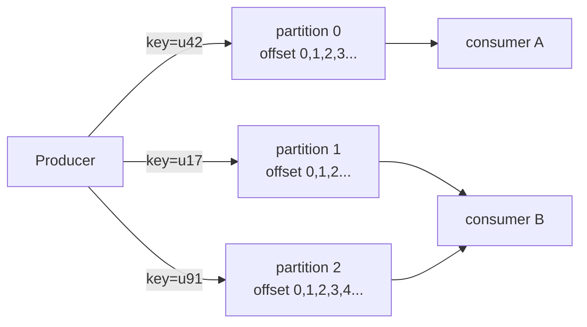
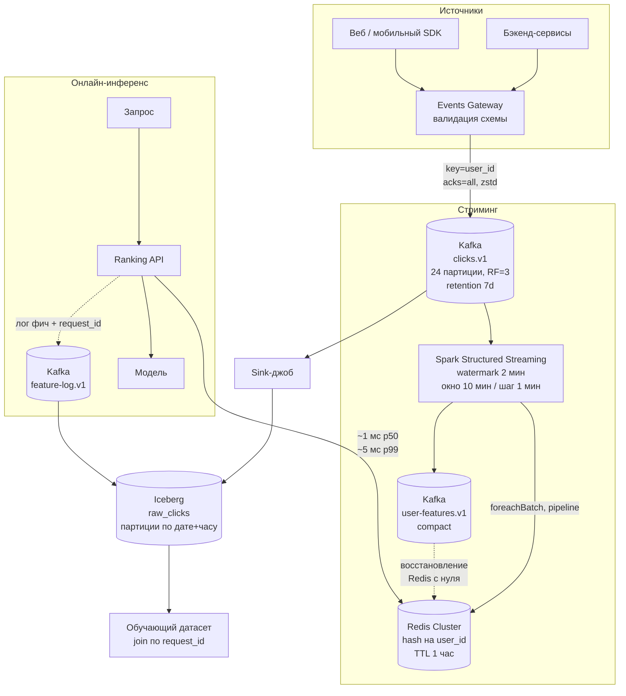

# Потоковая обработка

> **Зачем эта глава.** Как только продукт требует реакции быстрее суток — антифрод, персонализация
> в сессии, динамическое ценообразование — батчевый пайплайн перестаёт работать, и между источником
> событий и моделью появляется Kafka. После главы вы сможете объяснить, почему порядок сообщений
> гарантируется только внутри партиции, посчитать, сколько партиций нужно вашему потоку, выбрать
> между at-least-once и exactly-once с пониманием цены, спроектировать окна с watermark так, чтобы
> опоздавшие события не портили признаки, и нарисовать полный контур «клик → Kafka → агрегация →
> онлайн feature store» с бюджетом задержки по стадиям.

**Уровень:** 🎯 middle → 🧠 middle+
**Предварительно нужно:** [хранение данных](01-storage-and-formats.md), [Spark: как он работает](03-spark-fundamentals.md), полезно [данные и feature store](../07-mlops/03-data-and-feature-store.md)
**Время на проработку:** ~5 часов (чтение + поднять Kafka локально и прогнать практику)

---

## Карта главы

- [1. Интуиция: почему суточного батча перестаёт хватать](#1-интуиция-почему-суточного-батча-перестаёт-хватать)
- [2. Kafka: топики, партиции и порядок](#2-kafka-топики-партиции-и-порядок)
- [3. Ключ сообщения — главное проектное решение](#3-ключ-сообщения--главное-проектное-решение)
- [4. Consumer group и ребалансировка](#4-consumer-group-и-ребалансировка)
- [5. Offset и коммит](#5-offset-и-коммит)
- [6. Гарантии доставки и цена каждой](#6-гарантии-доставки-и-цена-каждой)
- [7. Retention и компакция](#7-retention-и-компакция)
- [8. Стриминговые признаки для ML](#8-стриминговые-признаки-для-ml)
- [9. Время события, окна и watermark](#9-время-события-окна-и-watermark)
- [10. Опоздавшие события: что с ними делать](#10-опоздавшие-события-что-с-ними-делать)
- [11. Spark Structured Streaming против Flink](#11-spark-structured-streaming-против-flink)
- [12. Лямбда и каппа](#12-лямбда-и-каппа)
- [13. Идемпотентность и дедупликация](#13-идемпотентность-и-дедупликация)
- [14. Сквозной пример: клики → Kafka → агрегация → онлайн feature store](#14-сквозной-пример-клики--kafka--агрегация--онлайн-feature-store)
- [15. Подводные камни](#15-подводные-камни)
- [16. Проверь себя](#16-проверь-себя)
- [17. Практика](#17-практика)
- [18. Что читать дальше](#18-что-читать-дальше)

---

## 1. Интуиция: почему суточного батча перестаёт хватать

Возьмём конкретную систему: маркетплейс, 5000 событий в секунду в пике (просмотры, клики,
добавления в корзину, заказы). Признаки для ранжирующей модели считаются ночным Spark-джобом:
в 02:00 запускается агрегация за вчера, в 04:00 результат заливается в Redis, весь следующий день
модель работает на этих числах.

Такая схема отлично живёт, пока продукту не понадобятся три вещи.

**Первая — сессионная персонализация.** Пользователь за десять минут посмотрел четыре
холодильника. Признак «просмотрено товаров в категории «крупная бытовая техника» за сессию»
в ночном батче появится завтра, когда пользователь уже купил холодильник у конкурента.

**Вторая — антифрод.** Карта, с которой за 90 секунд прошло 12 попыток оплаты в разных городах, —
это признак, который либо есть в момент транзакции, либо бесполезен. Здесь речь про **сотни
миллисекунд**, а не про часы.

**Третья — свежесть каталога.** Товар закончился в 11:20. Ночной пайплайн узнает об этом в 02:00
следующих суток. Полтора суток модель будет рекомендовать товар, которого нет.

Дальше возникает соблазн: «ну давайте гонять батч раз в 5 минут». Это работает до определённого
масштаба и упирается в физику. Джоб, который читает партицию за день и агрегирует, стоит фиксированную
цену на старт: подъём Spark-приложения — 20–60 секунд, планирование — секунды, чтение метаданных
таблицы — секунды. При запуске раз в 5 минут вы платите эту цену 288 раз в сутки и всё равно
получаете задержку 5+ минут. Плюс каждый мини-запуск порождает мелкие файлы — привет
[small files problem](01-storage-and-formats.md).

Потоковая обработка меняет модель: вместо «прочитать всё и пересчитать» — «обработать событие
и обновить состояние». Задержка перестаёт зависеть от объёма истории.

| Схема | Типичная задержка «событие → признак доступен модели» | Где применима |
|---|---|---|
| Ночной батч | 4–28 часов | долгосрочные агрегаты, обучающие датасеты |
| Микробатч раз в час | 60–90 минут | суточные счётчики, обновление популярности |
| Spark Structured Streaming | 2–30 секунд | сессионные признаки, near-real-time дашборды |
| Flink | 50–500 мс | антифрод, торговые системы, реакция на событие |
| Прямой вызов из сервиса | 1–10 мс | признаки, которые можно посчитать из самого запроса |

Последняя строка важна: **не всё, что кажется потоковым, требует стрима**. Если признак считается
из тела текущего запроса — считайте его в сервисе, а не гоняйте событие через Kafka и обратно.

---

## 2. Kafka: топики, партиции и порядок

Kafka — это не очередь. Это распределённый **лог с фиксированным сроком хранения**, из которого
можно читать много раз и с любой позиции. Это отличие определяет всё остальное.

**Топик** (topic) — именованный поток событий, например `clicks.v1`. Физически топик разрезан
на **партиции** (partition) — независимые append-only файлы-логи. Каждое сообщение внутри партиции
получает монотонно растущий номер — **offset**. Партиция — единица параллелизма, репликации
и упорядоченности.



> ⚠️ **Типичная ошибка.** Считать, что Kafka сохраняет порядок сообщений в топике.
> **Порядок гарантирован только внутри одной партиции.** Если события одного пользователя
> разъехались по трём партициям, три консьюмера прочитают их в произвольном относительном
> порядке — и ваш «последний статус заказа» окажется предпоследним. Лечится единственным
> способом: класть связанные события в одну партицию через ключ (см. §3).

Каждая партиция реплицируется на `replication.factor` брокеров. Один из них — **лидер** (leader),
он принимает записи и отдаёт чтения; остальные — **фолловеры** (follower), они догоняют лидера.
Множество реплик, не отставших от лидера сильнее `replica.lag.time.max.ms` (по умолчанию 30 секунд),
называется **ISR** (In-Sync Replicas). Продюсер с `acks=all` получает подтверждение, только когда
запись попала во все реплики из ISR.

Рабочая конфигурация топика для продакшена:

```bash
kafka-topics.sh --bootstrap-server kafka-1:9092 --create \
  --topic clicks.v1 \
  --partitions 24 \
  --replication-factor 3 \
  --config min.insync.replicas=2 \
  --config retention.ms=604800000 \
  --config segment.bytes=536870912 \
  --config compression.type=zstd \
  --config max.message.bytes=1048576
```

Разберём цифры.

`replication.factor=3` и `min.insync.replicas=2` — стандартная пара. Она позволяет пережить
**отказ одного брокера** без остановки записи: остаются две реплики в ISR, условие выполняется.
Если поставить `min.insync.replicas=3`, то падение любого брокера остановит запись в топик
(продюсер получит `NotEnoughReplicasException`). Если поставить 1 — вы теряете подтверждённые
данные при падении лидера. Правило: `min.insync.replicas = replication.factor − 1`.

`retention.ms=604800000` — это 7 суток в миллисекундах (7 × 24 × 3600 × 1000). Ретеншен считается
**по сегментам**, а не по отдельным сообщениям: сегмент удаляется целиком, когда все сообщения
в нём старше порога. Поэтому `segment.bytes` (здесь 512 МБ) влияет на гранулярность удаления.

### Сколько нужно партиций

Основное правило: **число партиций задаёт потолок параллелизма консьюмеров**. В одной consumer group
одну партицию читает ровно один консьюмер. 24 партиции — максимум 24 полезных консьюмера;
25-й будет простаивать.

$$
P \;\ge\; \max\!\left(\frac{T}{t_p},\; \frac{T}{t_c}\right)
$$

где $P$ — искомое число партиций, $T$ — целевая пропускная способность топика (МБ/с),
$t_p$ — пропускная способность продюсера на одну партицию (МБ/с), $t_c$ — пропускная способность
одного консьюмера (МБ/с). Дополнительно закладывают запас на рост в 2–3 раза, потому что
**увеличить число партиций можно, а уменьшить — нет**, и увеличение ломает соответствие
«ключ → партиция» (см. §3).

Прикинем для нашего маркетплейса. 5000 событий/с × 500 байт = **2.5 МБ/с** — это $T$.
Консьюмер, который парсит JSON и обновляет состояние, реально тянет 5–20 МБ/с на ядро; возьмём
консервативно $t_c = 2$ МБ/с (обработка тяжёлая). Тогда $P \ge 2.5/2 \approx 2$. Но параллелизм
нужен не только по байтам: 24 партиции дают возможность держать 24 воркера и переживать всплески.
Отсюда 24 — разумный старт для потока в единицы МБ/с.

Обратная сторона: каждая партиция — это открытые файловые дескрипторы, отдельный буфер продюсера
и запись в метаданных. Кластер на десятки тысяч партиций начинает медленно проходить выборы
лидеров и ребалансировки. Практический ориентир для одного брокера — до нескольких тысяч партиций;
топик на 1000 партиций почти всегда означает ошибку проектирования.

Объём хранения посчитайте сразу, это спрашивают:

$$
S = T \cdot R \cdot \tau
$$

где $S$ — занимаемое место на дисках кластера (байты), $T$ — поток в байтах в секунду,
$R$ — фактор репликации, $\tau$ — время ретеншена в секундах. Для нашего примера:
$2.5\ \text{МБ/с} \times 3 \times 604800\ \text{с} \approx 4.5$ ТБ. Со сжатием zstd для JSON-событий
реально ляжет в 0.8–1.5 ТБ (типичный коэффициент 3–5× на текстовых данных).

> 💬 **На собеседовании.** Спросят: «Как выбрать число партиций?» Хороший ответ: считаю от целевого
> throughput и от требуемого параллелизма консьюмеров, беру максимум, умножаю на 2–3 как запас
> на рост, и отдельно проверяю, что ключ партиционирования не даёт перекоса — иначе 24 партиции
> превратятся в одну горячую. Обязательно упоминаю, что уменьшить число партиций нельзя, а увеличение
> перераспределяет ключи и ломает порядок для существующих ключей: старые сообщения остаются
> в старых партициях, новые с тем же ключом уедут в другие. Плохой ответ: «побольше, чтобы
> масштабировалось» — это ответ человека, который не платил за кластер и не чинил ребалансировки.

---

## 3. Ключ сообщения — главное проектное решение

Продюсер кладёт в сообщение пару (ключ, значение). Ключ определяет партицию:

$$
p = \mathrm{murmur2}(k) \bmod P
$$

где $p$ — номер партиции, $k$ — байты ключа, $\mathrm{murmur2}$ — хеш-функция (стандартный
партиционер Kafka), $P$ — текущее число партиций топика. Если ключ не задан (`null`), сообщение
попадает в партицию по «липкому» алгоритму: продюсер выбирает одну партицию и льёт туда, пока
не наберётся батч, потом переключается — это даёт крупные батчи и лучший throughput, но никакой
привязки к сущности.

Из формулы следуют два практических вывода, оба про грабли.

**Вывод первый: ключ выбирается под требование порядка.** Если вам нужно, чтобы события
одного пользователя обрабатывались строго в порядке возникновения — ключ `user_id`. Если нужен
порядок по заказу — `order_id`. Ключ = та сущность, состояние которой вы восстанавливаете
по потоку событий.

**Вывод второй: ключ создаёт перекос.** Если 30% событий имеют ключ `guest` (неавторизованные
пользователи под одним id), то все они лягут в одну партицию, и один консьюмер будет отставать,
пока остальные 23 простаивают. Это ровно тот же [data skew](04-spark-tuning.md), что в Spark,
только диагностируется по графику lag'а на партицию.

Как чинить перекос: солить ключ. Вместо `guest` использовать `guest#<случайное число 0..15>` —
получите 16 партиций вместо одной, ценой потери порядка внутри «гостей» (что обычно не нужно:
у гостей нет непрерывной истории).

> ⌨️ **Руками.** Напишите продюсер на `kafka-python` или `confluent-kafka`, отправьте
> 100 000 сообщений с `key=str(random.randint(0, 5))` в топик с 12 партициями и посмотрите
> `kafka-run-class.sh kafka.tools.GetOffsetShell --topic ... --time -1`. Вы увидите, что
> заполнены ровно 5 партиций из 12 — потому что шесть значений ключа не могут дать больше
> шести целевых партиций. Это самый быстрый способ понять, почему низкая кардинальность ключа
> убивает параллелизм.

---

## 4. Consumer group и ребалансировка

**Consumer group** — набор процессов с общим `group.id`, которые совместно вычитывают топик.
Kafka распределяет партиции между членами группы так, чтобы каждая партиция читалась ровно одним
консьюмером. Две разные группы читают один топик независимо и не мешают друг другу — именно поэтому
Kafka легко отдаёт один поток кликов и в feature-пайплайн, и в аналитику, и в антифрод.

**Ребалансировка** (rebalance) — процесс перераспределения партиций. Запускается, когда:

- консьюмер присоединился к группе или вышел из неё;
- консьюмер не прислал heartbeat за `session.timeout.ms` (по умолчанию 45 секунд);
- консьюмер не вызвал `poll()` за `max.poll.interval.ms` (по умолчанию 300 секунд = 5 минут);
- изменилось число партиций топика.

Третий пункт — источник самых злых инцидентов в ML-пайплайнах. Представьте консьюмер, который
на каждый батч делает инференс модели. Забрал `max.poll.records=500` сообщений, инференс занял
6 минут (модель холодная, GPU занят) — консьюмер объявляется мёртвым, партиции уходят другому,
работа переделывается, коммит не проходит. Дальше цикл повторяется бесконечно: это состояние
называется **rebalance storm** и выглядит как «пайплайн работает, но lag только растёт».

Лечение конкретное: уменьшить `max.poll.records` так, чтобы обработка батча укладывалась
в четверть `max.poll.interval.ms`, либо поднять сам таймаут.

```python
# Рабочая конфигурация консьюмера для ML-обработки: тяжёлый батч, ручной коммит
from confluent_kafka import Consumer

conf = {
    "bootstrap.servers": "kafka-1:9092,kafka-2:9092,kafka-3:9092",
    "group.id": "feature-agg-v3",
    "enable.auto.commit": False,          # коммитим сами, после успешной записи результата
    "auto.offset.reset": "latest",        # новая группа стартует с конца, а не перечитывает 7 дней
    "max.poll.interval.ms": 600_000,      # 10 минут: инференс батча укладывается с запасом 4x
    "session.timeout.ms": 45_000,
    "heartbeat.interval.ms": 3_000,       # держим ~1/3 от session.timeout
    "fetch.min.bytes": 1_048_576,         # 1 МБ: не дёргаем брокер на каждое сообщение
    "fetch.wait.max.ms": 500,             # но и не ждём дольше 500 мс — это наш бюджет задержки
    "partition.assignment.strategy": "cooperative-sticky",
    "isolation.level": "read_committed",  # не видим сообщения незавершённых транзакций
}
consumer = Consumer(conf)
consumer.subscribe(["clicks.v1"])
```

### Eager против cooperative

Классические стратегии назначения (`RangeAssignor`, `RoundRobinAssignor`) работают в режиме
**eager**: при любом изменении состава группы **все** консьюмеры отдают **все** партиции,
затем получают новое назначение. Это «stop-the-world» — обработка встаёт целиком на время
ребалансировки, а это от секунд до десятков секунд на большой группе.

`CooperativeStickyAssignor` работает инкрементально: отзываются только те партиции, которые
реально должны переехать; остальные консьюмеры продолжают работать. Для стриминг-инференса
разница принципиальна: при деплое (rolling update 10 подов) eager даст 10 полных остановок,
cooperative — почти незаметное перераспределение.

В Kafka 4.0 доступен новый протокол групп консьюмеров с координацией на стороне брокера
(KIP-848), который убирает роль «лидера группы» и делает ребалансировки ещё дешевле. Если
кластер новый — стоит смотреть в эту сторону; на старых версиях `cooperative-sticky` остаётся
правильным дефолтом.

> 💬 **На собеседовании.** Спросят: «Чем cooperative-ребалансировка лучше eager и почему это важно
> для стриминга?» Хороший ответ: eager — это stop-the-world, все консьюмеры отпускают все партиции
> и на время перераспределения обработка стоит; при rolling-деплое из N подов вы получаете N таких
> пауз и всплеск lag'а. Cooperative отзывает только реально переезжающие партиции за два раунда,
> остальные продолжают читать. Ценой становится чуть более сложный протокол и необходимость
> корректно обрабатывать колбэки `on_partitions_revoked`/`on_partitions_assigned` — в них нужно
> флашить состояние и коммитить offset. Плохой ответ: «cooperative просто новее и быстрее».

---

## 5. Offset и коммит

Offset — позиция в партиции. Важно различать три вещи, которые кандидаты путают:

- **позиция чтения** (position) — где консьюмер сейчас в памяти;
- **закоммиченный offset** (committed offset) — что записано в служебный топик
  `__consumer_offsets`; именно отсюда группа продолжит после перезапуска;
- **конечный offset** (log end offset) — сколько всего есть в партиции.

**Lag** — разница между конечным и закоммиченным offset. Это главная метрика здоровья
стримингового пайплайна.

Коммит бывает автоматический (`enable.auto.commit=true`, раз в `auto.commit.interval.ms`,
по умолчанию 5 секунд) и ручной. Автокоммит удобен и почти всегда неправильный для ML-пайплайна,
потому что он коммитит **прочитанное**, а не **обработанное**: если процесс упал между poll'ом
и записью результата, offset уже уехал вперёд, и вы **потеряли** данные молча.

Правильный порядок для at-least-once:

```python
while True:
    msgs = consumer.consume(num_messages=500, timeout=1.0)
    if not msgs:
        continue
    batch = [parse(m) for m in msgs if m.error() is None]
    write_features_to_redis(batch)   # 1) сначала довели работу до конца
    consumer.commit(asynchronous=False)  # 2) и только потом сдвинули offset
```

Переставьте две строки местами — получите at-most-once с тихой потерей данных.

> 📐 **Разбор.** Lag можно и нужно измерять не в сообщениях, а в секундах — это то, что понимает
> продакт. Оценка: $\ell_{\text{сек}} \approx L / r$, где $L$ — lag в сообщениях,
> $r$ — текущая скорость записи в топик (сообщений в секунду). Lag в 500 000 сообщений
> при 5000 сообщений/с — это 100 секунд отставания. Но осторожно: если продюсер тоже упал,
> $r \to 0$ и оценка взрывается; поэтому в алертах используют сглаженный $r$ за последний час.

Алерт в Prometheus (метрики снимает `kafka-exporter`, который отдаёт `kafka_consumergroup_lag`
в разрезе группы, топика и партиции):

```yaml
groups:
- name: streaming-features
  rules:
  - alert: FeatureAggLagGrowing
    expr: |
      sum by (consumergroup, topic) (
        kafka_consumergroup_lag{consumergroup="feature-agg-v3", topic="clicks.v1"}
      ) > 500000
    for: 10m
    labels: {severity: warning}
    annotations:
      summary: "Агрегатор фич отстаёт >500k сообщений более 10 минут"
      runbook: "https://wiki.internal/runbooks/feature-agg-lag"

  - alert: FeatureAggLagSkew
    # перекос: одна партиция отстаёт в 10+ раз сильнее медианы — почти всегда горячий ключ
    expr: |
      max by (topic) (kafka_consumergroup_lag{consumergroup="feature-agg-v3"})
        > 10 * quantile by (topic) (0.5, kafka_consumergroup_lag{consumergroup="feature-agg-v3"})
    for: 15m
    labels: {severity: warning}
```

Второй алерт ловит именно перекос по ключу — то, что суммарный lag маскирует.

---

## 6. Гарантии доставки и цена каждой

Три уровня, и у каждого есть измеримая цена.

**At-most-once («не более одного раза»).** Коммитим offset до обработки. Дубликатов нет, потери
есть. Цена: ноль накладных расходов. Применимо там, где потеря отдельного события не меняет
решения — например, счётчики просмотров для дашборда.

**At-least-once («не менее одного раза»).** Коммитим после обработки. Потерь нет, дубликаты есть
(при падении между обработкой и коммитом батч переиграется). Цена: почти ноль на стороне Kafka,
но вы обязаны сделать обработку идемпотентной (см. §13). **Это дефолт для 90% ML-пайплайнов.**

**Exactly-once («ровно один раз»).** Строго говоря, Kafka даёт exactly-once не «доставку»,
а **семантику обработки** (EOS, exactly-once semantics) в пределах цепочки «прочитал из Kafka →
обработал → записал в Kafka». Складывается из двух механизмов.

*Идемпотентный продюсер* (`enable.idempotence=true`, включён по умолчанию с Kafka 3.0). Брокер
хранит для каждой пары (producer id, партиция) последний sequence number и отбрасывает повторы.
Это убирает дубликаты, возникающие из-за ретраев продюсера при сетевых сбоях. Требует
`acks=all`, `retries>0` и `max.in.flight.requests.per.connection ≤ 5`.

*Транзакции* (`transactional.id`). Продюсер атомарно пишет в несколько партиций и одновременно
коммитит свои входные offset'ы в ту же транзакцию. Консьюмер с `isolation.level=read_committed`
не видит сообщений незавершённых транзакций.

```python
from confluent_kafka import Producer

producer = Producer({
    "bootstrap.servers": "kafka-1:9092",
    "enable.idempotence": True,        # PID + sequence number, дедуп на брокере
    "acks": "all",
    "transactional.id": "feature-agg-v3-worker-0",  # ДОЛЖЕН быть стабильным между рестартами
    "compression.type": "zstd",
    "linger.ms": 20,                   # копим батч 20 мс — на порядок лучше throughput
    "batch.size": 262_144,             # 256 КБ
})
producer.init_transactions()

producer.begin_transaction()
for record in processed:
    producer.produce("features.v1", key=record.user_id, value=record.payload)
# offsets входного топика коммитятся В ТУ ЖЕ транзакцию — в этом весь смысл
producer.send_offsets_to_transaction(consumer.position(consumer.assignment()),
                                     consumer.consumer_group_metadata())
producer.commit_transaction()
```

Ключевая деталь, на которой валятся: `transactional.id` должен быть **стабильным между
рестартами** конкретного воркера и **уникальным** между воркерами. Если генерировать его
случайно при старте, брокер не сможет «огородить» (fence) старого зомби-продюсера, и гарантии
не будет. Если сделать одинаковым у двух воркеров — они будут вышибать друг друга.

**Чего EOS не даёт.** Если ваш consumer пишет результат не в Kafka, а в Redis, ClickHouse или
Postgres — транзакции Kafka вам не помогут: они не распространяются на внешние системы.
Остаётся либо идемпотентная запись (upsert по стабильному ключу), либо двухфазный коммит
на стороне синка (это умеет Flink с транзакционными синками).

**Цена.** Транзакции добавляют раунды к брокеру и маркеры коммита в лог. Практический ориентир —
падение пропускной способности на десятки процентов и рост end-to-end задержки на величину
интервала коммита транзакции (в Flink это интервал чекпоинта: поставили 60 с — данные становятся
видимыми читателю с `read_committed` через ~60 с). Именно поэтому exactly-once часто отвергают
в пользу «at-least-once + идемпотентный синк»: результат тот же, цена ниже.

> 💬 **На собеседовании.** Спросят: «Как получить exactly-once в Kafka?» Хороший ответ: два слоя —
> идемпотентный продюсер (PID + sequence number, брокер глушит повторы ретраев) и транзакции,
> которые атомарно пишут результат и коммитят входные offset'ы, плюс консьюмер с
> `read_committed`. Дальше обязательно добавляю границу: это работает только для контура
> Kafka→Kafka; при записи во внешнее хранилище нужен либо идемпотентный upsert, либо
> транзакционный синк. И называю цену: заметная просадка throughput и задержка видимости
> на интервал коммита транзакции, поэтому в проде чаще выбирают at-least-once с идемпотентной
> записью. Плохой ответ: «включить `enable.idempotence=true`» — это только половина, и она
> вообще про другое.

---

## 7. Retention и компакция

У топика есть политика очистки — `cleanup.policy`, и она бывает двух типов.

**`delete` (по умолчанию).** Сегменты удаляются по времени (`retention.ms`) или по размеру
(`retention.bytes`, на партицию). Это лог событий: «что произошло». Типичные значения —
от 4 часов для тяжёлых промежуточных топиков до 7–30 суток для сырых событий, из которых
может понадобиться переиграть историю.

**`compact`.** Kafka хранит **последнее значение для каждого ключа** и удаляет более старые
версии. Это уже не лог событий, а **снапшот состояния**: «как сейчас». Классические применения —
таблица «пользователь → его профиль», «товар → цена и остаток», а также внутренние топики
состояния Kafka Streams.

```bash
kafka-topics.sh --bootstrap-server kafka-1:9092 --create \
  --topic user-profile-state.v1 \
  --partitions 24 --replication-factor 3 \
  --config cleanup.policy=compact \
  --config min.cleanable.dirty.ratio=0.5 \
  --config delete.retention.ms=86400000 \
  --config min.compaction.lag.ms=600000
```

Что здесь важно понимать.

Компакция **не мгновенна**. Чистильщик (log cleaner) запускается, когда доля «грязных» записей
превысит `min.cleanable.dirty.ratio` (по умолчанию 0.5). До этого в топике спокойно лежат
несколько версий одного ключа. Читатель, который перечитывает топик с начала, увидит их все —
и должен корректно применять их по порядку (последняя выигрывает).

**Активный сегмент никогда не компактится.** Самые свежие данные всегда есть в полном виде.

Удаление ключа делается **надгробием** (tombstone) — сообщением с этим ключом и `value=null`.
Надгробия хранятся `delete.retention.ms` (по умолчанию 24 часа), чтобы все читатели успели
увидеть факт удаления, и только потом исчезают. Если ваш консьюмер отставал на 30 часов,
он пропустит удаление и оставит у себя фантомную запись — реальная и неочевидная бага.

Можно комбинировать: `cleanup.policy=compact,delete` — компактить и при этом удалять всё старше
ретеншена. Так делают для топиков состояния, где старые ключи должны в итоге исчезать.

> 🧠 **Middle+.** Компактный топик — это готовый механизм **восстановления онлайн-хранилища
> признаков**. Если Redis потеряли (упал, потёрли, мигрируете), достаточно перечитать компактный
> топик с offset 0: за время, пропорциональное числу уникальных ключей (а не числу событий),
> вы восстановите актуальное состояние. Схема «Redis как кэш, компактный Kafka-топик как источник
> истины» решает проблему «где живут онлайн-признаки и что делать при потере хранилища» гораздо
> дешевле, чем реплицированный персистентный Redis-кластер.

---

## 8. Стриминговые признаки для ML

Что вообще считают в стриме. Три семейства, в порядке роста сложности.

**1. Оконные агрегаты.** «Сколько кликов у пользователя за последние 10 минут», «средний чек
продавца за час», «число неуспешных оплат по карте за 5 минут». Здесь важен выбор окна (§9).

**2. Признаки состояния (stateful).** «Время с предыдущего события того же пользователя»,
«отличается ли город текущей транзакции от предыдущей», «длина текущей сессии». Требуют хранения
состояния на ключ и корректной работы при рестарте.

**3. Затухающие счётчики.** Оконные агрегаты имеют неприятное свойство: событие резко «вываливается»
из окна и признак скачет. Экспоненциальное затухание даёт гладкий признак и, что важнее, требует
хранить одно число на ключ вместо всего окна событий:

$$
c_t = c_{t_{\text{prev}}} \cdot \exp\!\left(-\frac{t - t_{\text{prev}}}{\lambda}\right) + 1
$$

где $c_t$ — значение счётчика после события в момент $t$, $c_{t_\text{prev}}$ — предыдущее
значение счётчика, $t_\text{prev}$ — время предыдущего события того же ключа (секунды),
$\lambda$ — характерное время затухания в секундах (для «активность за последний час»
берут $\lambda \approx 3600$). Единица в конце — вклад текущего события; если события имеют вес
(сумма покупки), вместо единицы стоит вес.

Состояние на ключ здесь — два числа: $c$ и $t_\text{prev}$. Для 20 млн пользователей это
20 млн × 16 байт ≈ 320 МБ — влезает в память одного процесса, тогда как честное окно на 10 минут
при 5000 событий/с потребовало бы хранить 3 млн событий.

> ⚠️ **Типичная ошибка.** Считать стриминговые признаки одним кодом, а обучающий датасет —
> другим (SQL-запросом по историческим логам). Формулы разъезжаются в мелочах: где-то окно
> закрытое, где-то открытое; где-то дедуп по `event_id`, где-то нет; где-то часовой пояс. Итог —
> [train/serve skew](../07-mlops/03-data-and-feature-store.md): офлайн-метрика отличная, онлайн
> модель работает как случайная. Лечение: считать обучающие признаки **тем же кодом**, прогнав
> стриминговый джоб по историческому топику (Kafka это позволяет — ретеншен для того и нужен),
> либо описывать признак один раз в feature store с двумя исполнителями и регулярно сверять
> значения на выборке.

**Point-in-time корректность.** Обучающий пример должен видеть ровно те значения признаков,
которые были доступны в момент предсказания. Если вы джойните события с таблицей признаков
по `user_id` без ограничения по времени, вы подмешаете будущее — классическая
[утечка](../02-classic-ml/13-validation-and-leakage.md). В стриминге лечится логированием:
сервис пишет в отдельный топик **тот вектор признаков, который реально использовал**, вместе
с `request_id` и таймстемпом. Потом обучающий датасет собирается джойном этого лога с таргетом
по `request_id` — и вопрос point-in-time закрывается по построению.

---

## 9. Время события, окна и watermark

В стриминге три разных времени, и путаница между ними — источник половины багов.

- **Event time** — когда событие произошло (проставляется на клиенте или в сервисе-источнике).
- **Ingestion time** — когда событие попало в Kafka.
- **Processing time** — когда обработчик до него добрался.

Для ML почти всегда нужен **event time**: признак «кликов за 10 минут» должен считать реальные
десять минут пользователя, а не десять минут работы кластера. Иначе при отставании пайплайна
на час все окна смешаются, и признаки на переобучении не воспроизведутся.

### Типы окон

**Tumbling (кувыркающиеся)** — непересекающиеся окна фиксированной длины: `[10:00, 10:10)`,
`[10:10, 10:20)`. Каждое событие попадает ровно в одно окно. Дёшево по состоянию. Минус:
на границе признак обнуляется скачком — в 10:09:59 у пользователя 8 кликов, в 10:10:01 — ноль.

**Sliding / hopping (скользящие)** — окна длины $w$ с шагом $s < w$. Например, окно 10 минут
с шагом 1 минута: `[10:00,10:10)`, `[10:01,10:11)`, … Каждое событие попадает в $\lceil w/s \rceil$
окон — здесь в 10. Признак гладкий, но **состояние и объём выхода растут в $w/s$ раз**. Скользящее
окно в час с шагом в секунду — это 3600-кратное размножение, так делать нельзя.

**Session (сессионные)** — окно закрывается, когда для ключа не было событий дольше паузы
(gap), например 30 минут. Длина окна не фиксирована — она определяется поведением пользователя.
Ровно то, что нужно для признака «глубина текущей сессии». Дороже всех по состоянию: окна
приходится сливать, когда пришедшее с опозданием событие соединяет две ранее разделённые сессии.

```mermaid
gantt
    dateFormat HH:mm
    axisFormat %H:%M
    title Три типа окон над одним потоком событий
    section Tumbling 10m
    W1 :a1, 10:00, 10m
    W2 :a2, 10:10, 10m
    section Sliding 10m/5m
    S1 :b1, 10:00, 10m
    S2 :b2, 10:05, 10m
    S3 :b3, 10:10, 10m
    section Session gap=8m
    Сессия A :c1, 10:01, 6m
    Сессия B :c2, 10:17, 4m
```



### Watermark

Проблема: окно `[10:00, 10:10)` нужно когда-то закрыть и отдать результат. Но события с event
time 10:09 могут прийти в 10:12 — мобильный клиент был офлайн, ретраи, буферизация SDK. Если
закрывать окно строго в 10:10 по часам обработчика, вы систематически недосчитываете.

**Watermark** — это утверждение системы: «событий с event time меньше $W$ я больше не жду».
Стандартная эвристика (bounded out-of-orderness):

$$
W(t) = \max_{e \in S(t)} \tau_e - \delta
$$

где $W(t)$ — значение watermark в момент обработки $t$, $S(t)$ — множество событий, увиденных
к моменту $t$, $\tau_e$ — event time события $e$, $\delta$ — допустимая задержка (out-of-orderness
bound), настраиваемый параметр. То есть watermark = максимальное увиденное время события минус
запас $\delta$.

Окно `[a, b)` закрывается и эмитит результат, когда $W \ge b$.

$\delta$ — прямой компромисс «полнота против задержки»:

| $\delta$ | Задержка результата | Доля потерянных опоздавших | Когда брать |
|---|---|---|---|
| 0 | минимальная | 5–30% (зависит от источника) | нельзя, кроме идеально упорядоченных потоков |
| 10 с | +10 с | обычно <1% для серверных событий | серверные логи, транзакции |
| 2 мин | +2 мин | <0.1% для мобильных | мобильные клиенты, обычный веб |
| 1 час | +1 час | ~0 | офлайн-режим приложения, IoT |

Выбирать $\delta$ надо не по интуиции, а по данным: постройте гистограмму
$(\text{ingestion time} - \text{event time})$ по историческому топику и возьмите квантиль 0.99
или 0.999. Это пятиминутный запрос, который экономит недели споров.

> 🧠 **Middle+.** Watermark в Spark Structured Streaming вычисляется в конце микробатча и
> **применяется к следующему**. Практическое следствие: если поток редкий (несколько событий
> в минуту), watermark не двигается, и окна не закрываются — данные «зависают» в состоянии,
> а вы видите пустой выход и думаете, что джоб сломан. То же самое случается, если одна
> из партиций Kafka перестала получать данные: watermark берётся как минимум по всем
> входным партициям, и одна «замолчавшая» партиция замораживает весь прогресс. В Flink
> это лечится `withIdleness(Duration.ofMinutes(1))` — партиция помечается простаивающей
> и перестаёт тормозить общий watermark. В Spark прямого аналога нет, приходится либо слать
> синтетические heartbeat-события, либо мириться.

---

## 10. Опоздавшие события: что с ними делать

Событие называется **опоздавшим** (late), если его event time меньше текущего watermark:
окно, в которое оно должно было попасть, уже закрыто.

Вариантов ровно четыре, и выбор — продуктовое решение, а не техническое.

**Отбросить.** Дефолт Spark Structured Streaming: события старше watermark просто не учитываются,
причём **молча**. Приемлемо, если доля опозданий доли процента и признак не критичен. Обязательно
заведите метрику доли отброшенных — иначе однажды SDK клиента начнёт буферизовать по 20 минут,
и вы узнаете об этом по падению качества модели через месяц.

**Обновить результат.** Держать состояние окна дольше watermark и переиздавать агрегат при
опоздании (`allowedLateness` в Flink). Требует, чтобы потребитель умел обрабатывать обновления —
то есть writes должны быть upsert'ами по ключу окна, а не append'ами. Цена — состояние живёт
дольше, памяти нужно больше.

**Отправить в отдельный поток.** Flink умеет side output для опоздавших: `.sideOutputLateData(tag)`.
Дальше их можно обработать батчем, посчитать долю, использовать для диагностики. Правильный
инженерный дефолт: не отбрасывать молча, а отбрасывать наблюдаемо.

**Пересчитать батчем.** Онлайн-контур работает с $\delta = 30$ с и живёт с потерями; ночной батч
пересчитывает те же агрегаты по полным данным и перезаписывает офлайн-хранилище. Это и есть
лямбда-архитектура (§12).

> 💬 **На собеседовании.** Спросят: «Что такое watermark и зачем он нужен?» Хороший ответ:
> механизм решения о полноте данных при работе в event time. Watermark = максимальное увиденное
> время события минус допустимая задержка $\delta$; окно закрывается, когда watermark перевалил
> его правую границу. $\delta$ выбирается по гистограмме реальных задержек — обычно квантиль 0.99,
> и это прямой компромисс: больше $\delta$ — полнее данные, но выше задержка признака. Дальше
> обязательно говорю, что происходит с опоздавшими: отбросить (наблюдаемо, с метрикой), обновить
> результат через allowed lateness, увести в side output или добить ночным батчем. Плохой ответ:
> «watermark отслеживает прогресс времени» — определение без единого следствия.

---

## 11. Spark Structured Streaming против Flink

Основное различие архитектурное, а не в списке фич.

**Spark Structured Streaming** — это **микробатч**: движок периодически запускает обычный
Spark-джоб над накопившимися данными. Триггер задаётся явно (`processingTime="10 seconds"`),
и минимальная задержка примерно равна интервалу триггера плюс время выполнения батча. Есть
continuous processing mode, но он экспериментальный и покрывает мало операций — в продакшене
исходите из микробатча.

**Flink** — истинная потоковая обработка: оператор получает событие и сразу передаёт дальше.
Задержки десятки миллисекунд достижимы. Состояние живёт в RocksDB на локальных дисках,
консистентность обеспечивается асинхронными барьерными снапшотами (алгоритм Чанди — Лампорта):
через поток пускаются барьеры, каждый оператор при получении барьера сохраняет своё состояние,
а обработка при этом не останавливается.

| Измерение | Spark Structured Streaming | Flink |
|---|---|---|
| Модель | микробатч (continuous — экспериментальный) | событие за событием |
| Типичная end-to-end задержка | 2–30 с | 50–500 мс |
| Состояние | HDFS/S3-чекпоинты, RocksDB state store | RocksDB локально + чекпоинты в объектное хранилище |
| Опоздавшие | молча отбрасываются | side output, allowed lateness |
| Простаивающие источники | нет штатного idleness | `withIdleness` |
| Сессионные окна | есть (`session_window`, Spark 3.2+) | есть, зрелые, с кастомными триггерами |
| Общий код с батчем | тот же DataFrame API — огромный плюс | Flink SQL / Table API, но батч используют реже |
| Порог входа команды | низкий, если уже есть Spark | заметно выше: свой кластер, свои метрики, свой отладочный опыт |
| Экосистема ML | pandas UDF, Spark ML, MLflow | скуднее, обычно вызов внешнего сервиса |

**Практический критерий выбора.** Если ваша команда уже живёт в Spark, батчевые пайплайны
написаны на нём, а требование по задержке — «секунды», берите Structured Streaming: вы переиспользуете
код фичей между обучением и стримом, что напрямую снижает train/serve skew. Если требование —
«сотни миллисекунд» (антифрод в момент оплаты, реакция на событие в игре) или нужна сложная
логика по состоянию с таймерами — Flink, и закладывайте отдельную команду на его эксплуатацию.

Отдельно: **Kafka Streams** — библиотека, а не кластер. Ваше JVM-приложение само становится
обработчиком, состояние лежит в локальном RocksDB и реплицируется через компактные топики.
Отличный выбор для простых трансформаций и агрегаций при масштабе одного сервиса, но для
Python-команды он практически недоступен.

---

## 12. Лямбда и каппа

**Лямбда-архитектура** (Nathan Marz): два контура над одним потоком событий.

- *Скоростной слой* (speed layer) — стрим, даёт неточный, но быстрый результат за секунды.
- *Батчевый слой* (batch layer) — периодический пересчёт по всей истории, точный, но медленный.
- *Слой обслуживания* (serving layer) — отдаёт клиенту батчевый результат, дополненный
  стриминговым «хвостом» за период после последнего батча.

Плюс: батч гарантирует корректность (все опоздавшие учтены, баги исправляются пересчётом).
Минус, из-за которого от лямбды часто отказываются: **логика признаков написана дважды** —
на Spark SQL для батча и на стриминговом движке. Две реализации неизбежно разъезжаются, и вы
получаете тот самый skew, который так старались убрать.

**Каппа-архитектура** (Jay Kreps): контур один — стриминговый. Батча нет. Пересчёт истории —
это перезапуск того же стримингового джоба с offset 0 (или с нужной точки) по топику
с длинным ретеншеном.

Каппа требует, чтобы Kafka хранила достаточно истории. Для нашего примера 30 суток ретеншена
дают 2.5 МБ/с × 3 × 2.6 млн с ≈ 19 ТБ на кластере — деньги немаленькие, но и не запретительные.
Если нужна история за 2 года, каппа в чистом виде не работает: события придётся выгружать
в озеро, а значит второй контур всё равно появится.

**Что делают на практике.** Гибрид, который правильнее всего называть «каппа с архивом»:

1. Все события — в Kafka с ретеншеном 7–30 дней.
2. Стриминговый джоб считает онлайн-признаки и параллельно сбрасывает сырые события
   в Iceberg/Delta (сюда же — [форматы и лейкхаус](01-storage-and-formats.md)).
3. Обучающие датасеты собираются из озера — там вся история и полные данные.
4. Онлайн-признаки описаны один раз; сверка «стрим против озера» на выборке — регулярная джоба
   с алертом на расхождение.

Пункт 4 — то, что отличает работающую систему от красивой схемы.

> 💬 **На собеседовании.** Спросят: «Лямбда или каппа?» Хороший ответ: обе — про то, где живёт
> источник истины. Лямбда даёт корректность ценой двух реализаций одной логики и, как следствие,
> расхождения между обучением и продом. Каппа убирает дублирование, но требует держать в Kafka
> достаточный ретеншен и уметь переигрывать поток. На практике я бы делал каппу для онлайн-признаков
> плюс архив сырых событий в лейкхаусе для обучения и долгой аналитики, и обязательно поставил бы
> регулярную сверку значений признаков между двумя контурами — расхождение ловится метрикой,
> а не верой. Плохой ответ: перечислить три слоя лямбды и не сказать, чем платим.

---

## 13. Идемпотентность и дедупликация

Раз at-least-once — дефолт, обработчик обязан быть **идемпотентным**: повторная обработка того же
события не меняет результат.

**Способ 1: upsert по стабильному ключу.** Не «увеличить счётчик на 1», а «записать значение
для ключа (user_id, window_start)». Повтор перезапишет тем же значением. Это самый надёжный
и самый дешёвый способ — он не требует хранить множество увиденных id.

```python
# Идемпотентная запись оконного агрегата в Redis: ключ детерминирован, значение полное
def write_window(redis, user_id: str, window_start_ts: int, clicks: int, uniq_items: int):
    key = f"feat:u:{user_id}"
    # HSET перезаписывает поле целиком → повтор безопасен
    redis.hset(key, mapping={
        "clicks_10m": clicks,
        "uniq_items_10m": uniq_items,
        "win_start": window_start_ts,   # чтобы читатель мог понять свежесть
    })
    redis.expire(key, 3600)             # TTL: протухшие признаки лучше отсутствующих
```

**Способ 2: дедупликация по идентификатору события.** Каждое событие несёт `event_id` (UUID
с клиента или `hash(user_id, ts_ms, item_id, action)`). Обработчик держит множество увиденных
id за окно и отбрасывает повторы.

Ключевой вопрос — **за какое окно** хранить. Хранить всё нельзя: 5000 событий/с × 86400 с =
432 млн id в сутки, по 16 байт — 7 ГБ только на ключи. Поэтому дедуп всегда ограничен временем:

```python
# Spark 3.5+: дедупликация в пределах watermark — состояние ограничено, GC работает
events = (raw
    .withWatermark("event_time", "10 minutes")
    .dropDuplicatesWithinWatermark(["event_id"]))
```

`dropDuplicatesWithinWatermark` (появился в Spark 3.5) отличается от старого `dropDuplicates`
тем, что не требует, чтобы дубликаты имели одинаковый event time, — только чтобы разрыв
между ними укладывался в watermark. Старый `dropDuplicates` с watermark чистил состояние
по времени события, из-за чего дубликаты с расходящимися таймстемпами проскакивали.

**Способ 3: вероятностная дедупликация.** Если точность не критична, фильтр Блума на 100 млн
элементов с ложноположительной вероятностью 1% занимает ~120 МБ вместо гигабайтов. Помните
про асимметрию: фильтр Блума может сказать «видел» про невиденный элемент (и вы потеряете
событие), но никогда не скажет «не видел» про виденный.

> ⚠️ **Типичная ошибка.** Дедуплицировать по `(user_id, timestamp)` при миллисекундном
> разрешении времени. Два реальных разных клика в одну миллисекунду — редкость, но при 5000
> событий/с и 20 млн пользователей это случается ежедневно, и вы тихо теряете события.
> Если у источника нет собственного `event_id` — попросите его добавить; это дешевле любых
> обходных путей.

---

## 14. Сквозной пример: клики → Kafka → агрегация → онлайн feature store

Соберём всё вместе. Задача: рекомендательный сервис должен получать сессионные признаки
пользователя за последние 10 минут не позже чем через 30 секунд после события, бюджет чтения
из хранилища признаков — 10 мс на p99.



### Бюджет задержки по стадиям

Не «быстро», а числа — это то, что отличает инженерный ответ:

| Стадия | Типичное значение | Откуда берётся |
|---|---|---|
| Клиент → Gateway | 50–300 мс | сеть мобильного клиента, буферизация SDK |
| Gateway → подтверждение Kafka | 5–15 мс | `acks=all` + `linger.ms=20` |
| Ожидание в топике до чтения | 0.5–2 с | зависит от lag'а консьюмера |
| Микробатч Spark (trigger 10 с) | 10–20 с | интервал триггера + время выполнения |
| Watermark $\delta$ | 2 мин | если ждём закрытия окна |
| Запись в Redis (pipeline 1000 ключей) | 20–50 мс на батч | ~1 мс на round-trip, батчуем |
| Чтение из Redis в инференсе | 0.3–1 мс p50, 2–5 мс p99 | сеть внутри ДЦ + сериализация |

Итог: если признак должен быть закрытым окном — задержка складывается в ~2.5 минуты (доминирует
watermark). Если достаточно **текущего, ещё не закрытого** окна (режим `update`), — 12–25 секунд.
Для сессионной персонализации второе почти всегда допустимо и радикально дешевле.

### Код агрегатора

```python
# Стриминговый агрегатор сессионных признаков: Kafka -> окна -> Redis
from pyspark.sql import SparkSession, functions as F
from pyspark.sql.types import StructType, StructField, StringType, LongType

spark = (
    SparkSession.builder
    .appName("clicks-to-features")
    # ВАЖНО: число shuffle-партиций = число партиций стейт-стора.
    # После создания чекпоинта его НЕЛЬЗЯ менять — джоб не стартует.
    .config("spark.sql.shuffle.partitions", "48")
    .config("spark.sql.streaming.stateStore.providerClass",
            "org.apache.spark.sql.execution.streaming.state.RocksDBStateStoreProvider")
    .config("spark.sql.streaming.metricsEnabled", "true")
    .getOrCreate()
)

schema = StructType([
    StructField("event_id", StringType(), False),
    StructField("user_id",  StringType(), False),
    StructField("item_id",  StringType(), True),
    StructField("action",   StringType(), False),   # view | click | add_to_cart | purchase
    StructField("ts_ms",    LongType(),  False),    # event time, миллисекунды UTC
])

raw = (
    spark.readStream.format("kafka")
    .option("kafka.bootstrap.servers", "kafka-1:9092,kafka-2:9092,kafka-3:9092")
    .option("subscribe", "clicks.v1")
    .option("startingOffsets", "latest")
    # ограничиваем размер микробатча: без этого после суточного простоя джоб
    # попытается прочитать весь накопившийся backlog одним батчем и упадёт по памяти
    .option("maxOffsetsPerTrigger", 2_000_000)
    .option("failOnDataLoss", "false")   # ретеншен мог съесть offset'ы, пока джоб лежал
    .load()
)

events = (
    raw.select(F.from_json(F.col("value").cast("string"), schema).alias("e")).select("e.*")
       .withColumn("event_time", (F.col("ts_ms") / 1000).cast("timestamp"))
       .withWatermark("event_time", "2 minutes")
       .dropDuplicatesWithinWatermark(["event_id"])   # at-least-once → дубликаты неизбежны
)

agg = (
    events
    .groupBy(F.window("event_time", "10 minutes", "1 minute"), F.col("user_id"))
    .agg(
        F.sum(F.when(F.col("action") == "click", 1).otherwise(0)).alias("clicks_10m"),
        F.sum(F.when(F.col("action") == "add_to_cart", 1).otherwise(0)).alias("carts_10m"),
        F.approx_count_distinct("item_id", rsd=0.05).alias("uniq_items_10m"),
        F.max("ts_ms").alias("last_ts_ms"),
    )
)


def write_to_redis(batch_df, batch_id: int):
    """Пишем только последнее (самое свежее) окно на пользователя.

    Redis-pipeline на 1000 команд вместо 1000 round-trip'ов: 20-50 мс вместо ~1 с.
    Запись идемпотентна (HSET перезаписывает поля), поэтому повтор батча безопасен.
    """
    import redis
    from pyspark.sql import Window

    w = Window.partitionBy("user_id").orderBy(F.col("window.start").desc())
    latest = (batch_df.withColumn("rn", F.row_number().over(w))
                      .filter(F.col("rn") == 1)
                      .drop("rn"))

    def write_partition(rows):
        client = redis.Redis(host="redis-features", port=6379, socket_timeout=0.2)
        pipe = client.pipeline(transaction=False)
        n = 0
        for r in rows:
            pipe.hset(f"feat:u:{r.user_id}", mapping={
                "clicks_10m": r.clicks_10m,
                "carts_10m": r.carts_10m,
                "uniq_items_10m": r.uniq_items_10m,
                "last_ts_ms": r.last_ts_ms,
            })
            pipe.expire(f"feat:u:{r.user_id}", 3600)   # признак старше часа хуже, чем его отсутствие
            n += 1
            if n % 1000 == 0:
                pipe.execute()
        pipe.execute()

    latest.foreachPartition(write_partition)


query = (
    agg.writeStream
    .outputMode("update")                       # отдаём текущие, ещё не закрытые окна
    .foreachBatch(write_to_redis)
    .option("checkpointLocation", "s3a://ml-checkpoints/clicks-to-features/v3/")
    .trigger(processingTime="10 seconds")
    .start()
)
query.awaitTermination()
```

Три детали, которые ломают этот джоб в проде, если их не знать.

**Чекпоинт привязан к схеме и к `spark.sql.shuffle.partitions`.** Изменили число партиций
или структуру агрегации — джоб не стартует с существующего чекпоинта. План миграции: новый
путь чекпоинта + версия в имени (`/v3/`, `/v4/`) + прогрев состояния, а не «поправим на месте».

**`outputMode("update")` против `append`.** В `append` результат окна отдаётся только после
закрытия по watermark — то есть с задержкой $\delta$ + длина окна. В `update` вы получаете
текущее значение каждый микробатч. Для онлайн-признаков нужен `update`; для записи в
неизменяемый лог — `append`.

**TTL в Redis обязателен.** Без него ключи пользователей, которые перестали заходить, накапливаются
навсегда. 20 млн пользователей × 200 байт = 4 ГБ, растущие бесконечно. С TTL в час активное
множество — это дневная аудитория, что в разы меньше.

### Что мониторить

```promql
# Отставание стриминга по event time: главный SLI пайплайна признаков
max by (query) (
  time() - spark_streaming_query_lastProgress_eventTime_watermark_seconds
)

# Доля микробатчей, которые не укладываются в интервал триггера (10 с).
# Если стабильно > 0.1 — джоб не успевает и lag будет только расти.
sum(rate(spark_streaming_query_lastProgress_durationMs_triggerExecution_bucket{le="10000"}[5m]))
  / sum(rate(spark_streaming_query_lastProgress_durationMs_triggerExecution_count[5m]))

# Доля запросов инференса, получивших дефолтные значения признаков (Redis промахнулся).
# Растёт РАНЬШЕ, чем падает бизнес-метрика — это ранний индикатор.
sum(rate(ranking_feature_default_total[5m])) / sum(rate(ranking_requests_total[5m]))
```

Последняя метрика — самая важная и её чаще всего забывают. Она связывает стриминговый контур
с продуктовым результатом: если признаки перестали доезжать, модель молча работает на дефолтах,
качество падает, а все графики Kafka зелёные.

---

## 15. Подводные камни

**Ключ выбран под перекос.**
*Симптом:* суммарный lag в норме, но качество признаков плавает; на графике lag'а по партициям
одна линия растёт, остальные лежат на нуле.
*Причина:* доминирующее значение ключа (`guest`, `null`, id внутреннего бота), которое хеш
кладёт в одну партицию.
*Что делать:* посмотреть топ-10 ключей по частоте; солить горячие ключи суффиксом `#0..#15`;
для гостевого трафика вообще не использовать `user_id` как ключ.

**Rebalance storm при тяжёлой обработке.**
*Симптом:* в логах бесконечные `Attempt to heartbeat failed since group is rebalancing`,
lag растёт, полезная работа не завершается.
*Причина:* обработка одного `poll()` дольше `max.poll.interval.ms`.
*Что делать:* измерить реальное время обработки батча, выставить `max.poll.records` так, чтобы
батч укладывался в четверть таймаута; перейти на `cooperative-sticky`; вынести тяжёлый инференс
в отдельный пул с ограниченной очередью.

**Автокоммит съел данные.**
*Симптом:* после падения пода в агрегатах провал на несколько минут, но никаких ошибок в логах.
*Причина:* `enable.auto.commit=true` сдвинул offset через 5 секунд после `poll()`, а обработка
не завершилась.
*Что делать:* всегда ручной коммит после успешной записи результата; в тестах — убить процесс
`kill -9` в середине батча и проверить, что данные не потерялись.

**Watermark заморожен простаивающей партицией.**
*Симптом:* окна не закрываются, выход пустой, при этом события в топик идут.
*Причина:* watermark = минимум по всем входным партициям; одна партиция не получает данных
(например, туда попадал ключ бота, который выключили).
*Что делать:* в Flink — `withIdleness`; в Spark — либо синтетические heartbeat-события в каждую
партицию раз в минуту, либо перейти на `update`-режим, где закрытие окна не требуется.

**Чекпоинт пережил изменение кода.**
*Симптом:* после деплоя джоб падает с `Provided schema doesn't match` или молча считает старую
агрегацию.
*Причина:* Spark хранит в чекпоинте схему состояния и число партиций; изменение агрегации
несовместимо.
*Что делать:* версионировать путь чекпоинта, при значимых изменениях стартовать новую версию
с `startingOffsets` на нужной точке и держать обе версии параллельно, пока новая не прогреется.

**Backlog после простоя убивает джоб.**
*Симптом:* джоб лежал 6 часов; после старта первый микробатч читает 100 млн сообщений и падает
по OOM, потом повторяет.
*Причина:* нет ограничения на размер микробатча.
*Что делать:* `maxOffsetsPerTrigger` (Spark) или `max.poll.records` + backpressure (Flink);
отдельно решить, нужен ли вообще этот backlog — часто правильнее стартовать с `latest`
и добить дыру батчем.

**Ретеншен короче времени восстановления.**
*Симптом:* `OffsetOutOfRangeException` после долгого простоя, часть данных не восстановить.
*Причина:* ретеншен 4 часа, инцидент длился 9 часов.
*Что делать:* ретеншен ≥ максимального приемлемого времени простоя × 3. Для критичных топиков —
не меньше 3 суток, чтобы пережить выходные.

**Схема поехала без предупреждения.**
*Симптом:* доля событий, не прошедших парсинг, скакнула с 0.01% до 40%; в агрегатах пусто.
*Причина:* команда мобильного приложения переименовала поле.
*Что делать:* Schema Registry с проверкой совместимости (`BACKWARD` как дефолт: новая схема
читает старые данные); контракт на топик как формальный артефакт; алерт на долю
непарсящихся сообщений с порогом 0.1%.

---

## 16. Проверь себя

<details>
<summary><b>🌱 Вопрос.</b> Гарантирует ли Kafka порядок сообщений?</summary>

**Короткий ответ.** Только внутри одной партиции. Между партициями порядка нет вообще.
Чтобы события одной сущности обрабатывались по порядку, их нужно класть в одну партицию —
через ключ сообщения.

**Развёрнуто.** Каждая партиция — append-only лог с монотонным offset, и консьюмер читает
её строго последовательно. Продюсер выбирает партицию как `murmur2(key) mod P`, где $P$ —
число партиций. Одинаковый ключ → одна партиция → порядок сохранён. Есть тонкость:
при увеличении числа партиций соответствие «ключ → партиция» меняется, старые сообщения
остаются на старых местах, и глобальный порядок для существующих ключей ломается — поэтому
изменение числа партиций у топика с семантикой порядка это операция с даунтаймом
или с миграцией на новый топик.

**Чего ждёт интервьюер:** что вы знаете границу гарантии и умеете назвать механизм её обеспечения.

**Провал:** «да, Kafka — это очередь, сообщения приходят по порядку».
</details>

<details>
<summary><b>🎯 Вопрос.</b> Как получить exactly-once в Kafka и сколько это стоит?</summary>

**Короткий ответ.** Идемпотентный продюсер (`enable.idempotence=true`: брокер хранит PID
и sequence number на партицию и глушит повторы) плюс транзакции (`transactional.id`), которые
атомарно пишут результат и коммитят входные offset'ы, плюс консьюмер с
`isolation.level=read_committed`. Цена — заметная просадка throughput и задержка видимости
на интервал коммита транзакции.

**Развёрнуто.** Механизм работает только внутри контура Kafka → обработка → Kafka. При записи
во внешнее хранилище (Redis, ClickHouse, Postgres) транзакции Kafka не помогают: нужен либо
идемпотентный upsert по стабильному ключу, либо транзакционный синк с двухфазным коммитом
(это умеет Flink). `transactional.id` обязан быть стабильным между рестартами воркера
и уникальным между воркерами — иначе брокер не сможет отсечь зомби-продюсера и гарантия
рассыпается. На практике чаще выбирают at-least-once плюс идемпотентную запись: результат
эквивалентный, стоимость и сложность заметно ниже.

**Чего ждёт интервьюер:** двух механизмов вместо одного, границы применимости и готовности
назвать цену.

**Провал:** «включить `enable.idempotence`» — это только про дубликаты от ретраев продюсера.
</details>

<details>
<summary><b>🎯 Вопрос.</b> Что такое watermark и как выбрать его величину?</summary>

**Короткий ответ.** Watermark — утверждение «событий раньше времени $W$ я больше не жду»,
вычисляется как максимальное увиденное время события минус запас $\delta$. Окно закрывается,
когда watermark перешёл его правую границу. $\delta$ выбирается по гистограмме реальных
задержек (ingestion time − event time), обычно квантиль 0.99.

**Развёрнуто.** Это прямой компромисс: больше $\delta$ — полнее данные, но признак доезжает
позже. Для серверных событий типично 10–30 секунд, для мобильных клиентов 1–5 минут. Что делать
с опоздавшими — отдельное решение: отбросить (обязательно с метрикой доли), обновить результат
через allowed lateness, увести в side output или добить ночным батчем. Отдельная ловушка:
watermark берётся как минимум по всем входным партициям, поэтому одна замолчавшая партиция
замораживает прогресс всего джоба; в Flink лечится `withIdleness`, в Spark — heartbeat-событиями.

**Чего ждёт интервьюер:** что вы связываете watermark с конкретным продуктовым компромиссом,
а не пересказываете определение.

**Провал:** «watermark отслеживает время в стриме» без следствий.
</details>

<details>
<summary><b>🎯 Вопрос.</b> Чем tumbling-окно отличается от sliding и когда нужны сессионные?</summary>

**Короткий ответ.** Tumbling — непересекающиеся окна фиксированной длины, каждое событие
в одном окне, дёшево, но признак скачет на границе. Sliding — окна длины $w$ с шагом $s$,
событие попадает в $w/s$ окон, признак гладкий, но состояние и выход растут в $w/s$ раз.
Session — окно закрывается по паузе без событий, длина зависит от поведения пользователя.

**Развёрнуто.** Для ML-признаков «активность за последние N минут» обычно нужно скользящее окно
или экспоненциально затухающий счётчик — tumbling даёт разрывный признак, на котором модель
учится хуже. Затухающий счётчик часто предпочтительнее: он гладкий и требует хранить два числа
на ключ ($c$ и время последнего события) вместо всех событий окна. Сессионные окна нужны, когда
сама сессия — сущность задачи (глубина просмотра, конверсия в сессии); они дороже всего
по состоянию, потому что опоздавшее событие может слить два ранее раздельных окна.

**Чего ждёт интервьюер:** понимания стоимости состояния, а не только определений.

**Провал:** назвать три типа окон и не сказать, чем они отличаются по цене.
</details>

<details>
<summary><b>🧠 Вопрос.</b> Зачем нужна log compaction и чем она отличается от retention?</summary>

**Короткий ответ.** `cleanup.policy=delete` удаляет старые сегменты целиком — это лог событий.
`cleanup.policy=compact` оставляет последнее значение для каждого ключа — это снапшот состояния.
Компактный топик позволяет восстановить актуальное состояние, перечитав его с начала за время,
пропорциональное числу уникальных ключей.

**Развёрнуто.** Практическая ценность для ML: компактный топик — дешёвый источник истины для
онлайн-хранилища признаков. Потеряли Redis — перечитали топик и восстановились, не трогая
батчевый пайплайн. Тонкости: компакция асинхронна и запускается при `min.cleanable.dirty.ratio`
(по умолчанию 0.5), поэтому дубликаты ключей в топике есть всегда; активный сегмент не компактится;
удаление делается tombstone-сообщением с `value=null`, которое живёт `delete.retention.ms`
(по умолчанию сутки) — консьюмер, отставший сильнее, пропустит факт удаления. Можно
комбинировать `compact,delete`.

**Чего ждёт интервьюер:** понимания, что компакция — это про состояние, а не про экономию места,
плюс знания про tombstone.

**Провал:** «компакция сжимает сообщения» — это про `compression.type`, другое.
</details>

<details>
<summary><b>🎯 Вопрос.</b> Consumer group отстаёт. Ваши действия по шагам.</summary>

**Короткий ответ.** Проверить lag в разрезе партиций (перекос или равномерное отставание),
посмотреть время обработки батча, число консьюмеров против числа партиций, и только потом
трогать конфиги.

**Развёрнуто.** Диагностика по порядку. (1) Lag по партициям: если растёт одна — это горячий ключ,
лечим солью или сменой ключа. (2) Если равномерно и консьюмеров меньше, чем партиций — добавляем
консьюмеров, это самый дешёвый ход. (3) Если консьюмеров столько же, сколько партиций, — потолок
достигнут, нужно либо увеличивать число партиций (с пониманием последствий для ключей), либо
ускорять обработку. (4) Проверяем логи на ребалансировки: постоянные ребалансировки означают,
что обработка не укладывается в `max.poll.interval.ms`, и надо уменьшать `max.poll.records`.
(5) Смотрим, не пишет ли консьюмер синхронно во внешнюю систему по одному объекту — батчинг
и pipeline обычно дают порядок величины. (6) Проверяем `fetch.min.bytes`: слишком маленькое
значение даёт лишние round-trip'ы к брокеру.

**Чего ждёт интервьюер:** структурной диагностики, а не одного «добавим партиций».

**Провал:** «увеличу число консьюмеров» без проверки, что партиций хватает.
</details>

<details>
<summary><b>🧠 Вопрос.</b> Spark Structured Streaming или Flink? Обоснуйте.</summary>

**Короткий ответ.** Structured Streaming — микробатч, задержка секунды, но тот же DataFrame API,
что в батче, — значит признаки для обучения и для прода можно считать одним кодом. Flink — истинный
стриминг, задержка десятки-сотни миллисекунд, зрелая работа с состоянием и опоздавшими, но отдельный
кластер и отдельная эксплуатационная экспертиза.

**Развёрнуто.** Решает требование по задержке и наличие команды. Сессионная персонализация,
near-real-time дашборды, обновление счётчиков — секунды достаточно, берём Spark и выигрываем
на переиспользовании кода фичей (это напрямую снижает train/serve skew). Антифрод в момент
оплаты, реакция на событие в игре, сложные автоматы состояний с таймерами — Flink. Отдельные
плюсы Flink, которые стоит назвать: side output для опоздавших вместо молчаливого отбрасывания,
`withIdleness` против замороженного watermark, транзакционные синки для end-to-end exactly-once.
Есть и третий вариант — Kafka Streams как библиотека внутри JVM-сервиса, без отдельного кластера,
но для Python-команды он практически недоступен.

**Чего ждёт интервьюер:** выбора под ограничение, а не «Flink современнее».

**Провал:** «Flink лучше, потому что настоящий стриминг».
</details>

<details>
<summary><b>🎯 Вопрос.</b> Как обеспечить идемпотентность обработки при at-least-once?</summary>

**Короткий ответ.** Три способа: upsert по детерминированному ключу (не «инкремент», а «запись
полного значения»), дедупликация по `event_id` в пределах ограниченного окна, или вероятностная
дедупликация фильтром Блума, когда точность не критична.

**Развёрнуто.** Upsert — самый дешёвый и надёжный: ключ вроде `(user_id, window_start)`, значение
полное, повтор перезаписывает тем же. Дедуп по `event_id` требует хранить множество увиденных id,
и оно обязано быть ограничено по времени — при 5000 событий/с суточное множество это сотни
миллионов ключей. В Spark для этого есть `dropDuplicatesWithinWatermark` (3.5+), который в отличие
от старого `dropDuplicates` не требует совпадения event time у дубликатов. Отдельная ловушка:
дедуп по `(user_id, timestamp)` вместо явного `event_id` тихо теряет реальные события,
совпавшие по миллисекунде.

**Чего ждёт интервьюер:** что вы понимаете, почему состояние дедупа обязано быть ограничено.

**Провал:** «буду хранить все обработанные id в множестве».
</details>

<details>
<summary><b>🧠 Вопрос.</b> Как собрать обучающий датасет для модели, которая в проде работает на стриминговых признаках?</summary>

**Короткий ответ.** Логировать вектор признаков в момент предсказания вместе с `request_id`
и таймстемпом, а обучающий датасет собирать джойном этого лога с таргетом по `request_id`.
Тогда point-in-time корректность обеспечена по построению.

**Развёрнуто.** Альтернатива — реконструировать признаки задним числом по историческим событиям —
работает только если реконструкция бит-в-бит повторяет онлайн-логику, а она почти никогда
не повторяет: расходятся границы окон, обработка дубликатов, часовые пояса, дефолты при
отсутствии данных. Результат — train/serve skew, при котором офлайн-метрика хорошая, а онлайн
модель работает как случайная. Логирование фич снимает вопрос целиком, ценой объёма: 3000 RPS
× 200 признаков × 8 байт ≈ 5 МБ/с, около 400 ГБ в сутки — обычно логируют сэмпл (1–10%)
или только те признаки, что реально используются. Второй контроль — регулярная сверка значений
стриминговых и батчевых признаков на выборке ключей с алертом на расхождение.

**Чего ждёт интервьюер:** понимания, что point-in-time — это не про SQL-джойн, а про архитектуру.

**Провал:** «пересчитаю признаки по логам за прошлый месяц».
</details>

<details>
<summary><b>🎯 Вопрос.</b> Что такое лямбда и каппа и что бы вы выбрали?</summary>

**Короткий ответ.** Лямбда — два контура (быстрый неточный стрим + медленный точный батч)
и, как следствие, две реализации одной логики. Каппа — один стриминговый контур, пересчёт
через переигрывание топика. Я бы взял каппу для онлайн-признаков плюс архив сырых событий
в лейкхаусе для обучения.

**Развёрнуто.** Главная цена лямбды — не инфраструктура, а дублирование логики: батчевая и
стриминговая версии признака неизбежно разъезжаются, и это тот же skew, с которым мы боремся.
Цена каппы — ретеншен: чтобы переиграть месяц, надо месяц хранить, а для потока 2.5 МБ/с
с RF=3 это ~19 ТБ. Поэтому на практике гибрид: Kafka с ретеншеном 7–30 дней как оперативный
источник, сброс сырых событий в Iceberg/Delta для длинной истории, признаки описаны один раз,
и регулярная сверка стрим-против-озера с алертом на расхождение.

**Чего ждёт интервьюер:** что вы называете цену каждого варианта числом или конкретным риском.

**Провал:** перечислить слои лямбды как определение из статьи.
</details>

<details>
<summary><b>🧠 Вопрос.</b> Почему нельзя просто гонять батчевый джоб раз в минуту вместо стриминга?</summary>

**Короткий ответ.** Из-за фиксированной стоимости запуска (подъём приложения, планирование,
чтение метаданных — десятки секунд) и из-за того, что каждый мини-запуск порождает мелкие файлы.
Плюс задержка всё равно не опустится ниже интервала.

**Развёрнуто.** До интервалов ~15 минут микробатчами жить можно и часто нужно — это проще
в эксплуатации. Ниже начинается физика: 1440 запусков в сутки по 40 секунд накладных расходов
это 16 часов чистого оверхеда; 1440 записей в таблицу дают 1440 × (число партиций) файлов
в сутки, и через месяц любое чтение упирается в листинг директории. Стриминговый джоб платит
за старт один раз и держит состояние в памяти/RocksDB, поэтому его задержка не зависит от объёма
истории. Отдельно: батч не умеет корректно работать с event time и опоздавшими — окна
привязываются к времени запуска, и при отставании пайплайна признаки на переобучении
не воспроизводятся.

**Чего ждёт интервьюер:** конкретных цифр накладных расходов и знания про small files.

**Провал:** «стриминг просто быстрее».
</details>

---

## 17. Практика

**Задача 1. Порядок и ключ (40 минут).**
Поднимите Kafka локально (`docker compose` с одним брокером в KRaft-режиме). Создайте топик
на 6 партиций. Отправьте 10 000 событий трёх «пользователей» — сначала без ключа, потом с ключом
`user_id`. В обоих случаях прочитайте топик тремя консьюмерами одной группы и восстановите
для каждого пользователя последовательность действий.
*Сделано правильно: без ключа последовательность у части пользователей нарушена, с ключом —
нет; вы можете показать это диффом и объяснить, почему.*

**Задача 2. Гистограмма задержек и выбор $\delta$ (30 минут).**
Возьмите реальный (или сгенерированный с реалистичным хвостом) поток событий и постройте
распределение `ingestion_time − event_time`. Посчитайте квантили 0.5, 0.95, 0.99, 0.999
и оцените, какую долю событий вы потеряете при $\delta \in \{0, 10\text{с}, 60\text{с}, 300\text{с}\}$.
*Сделано правильно: вы называете конкретное $\delta$ и обосновываете его числом потерянных
событий и добавленной задержкой, а не «возьмём минуту, обычно хватает».*

**Задача 3. Идемпотентный агрегатор (1.5 часа).**
Напишите консьюмер, который считает `clicks_10m` на пользователя и пишет в Redis. Требования:
ручной коммит после записи, дедупликация по `event_id`, TTL на ключах. Затем убейте процесс
`kill -9` в середине обработки батча пять раз подряд при работающем продюсере.
*Сделано правильно: после всех убийств суммарные значения в Redis совпадают с эталонным
пересчётом по всему потоку; ни один `event_id` не учтён дважды и ни один не потерян.*

**Задача 4. Стриминговый джоб с окнами (2 часа).**
Запустите код из §14 на локальной Kafka. Добейтесь того, чтобы: (а) джоб переживал рестарт
с сохранением состояния; (б) опоздавшие на 5 минут события учитывались, а на 30 минут —
отбрасывались; (в) была метрика доли отброшенных.
*Сделано правильно: вы можете подать событие с искусственно сдвинутым `ts_ms` и предсказать
до запуска, попадёт оно в агрегат или нет.*

**Задача 5. Сверка стрима и батча (1 час).**
Посчитайте те же `clicks_10m` двумя способами: стриминговым джобом и SQL-запросом по сохранённым
в Parquet событиям. Сравните на 1000 случайных ключей.
*Сделано правильно: расхождение либо нулевое, либо вы можете объяснить каждое отличие
(опоздавшие, граница окна, дубликаты) и знаете, как его убрать.*

---

## 18. Что читать дальше

- [Официальная документация Apache Kafka](https://kafka.apache.org/documentation/) — раздел
  Design объясняет устройство лога, репликацию и ISR; раздел Configuration — единственный
  надёжный источник значений по умолчанию, которые меняются от версии к версии.
- **Gwen Shapira, Todd Palino, Rajini Sivaram, Krit Petty. «Kafka: The Definitive Guide», 2-е издание
  (O'Reilly, 2021)** — главы про продюсера, консьюмера и exactly-once закрывают §3–§6 этой главы
  с большей глубиной; лучшая книга по Kafka на сегодня.
- [Jay Kreps. «Questioning the Lambda Architecture» (O'Reilly Radar, 2014)](https://www.oreilly.com/radar/questioning-the-lambda-architecture/) —
  первоисточник каппа-архитектуры. Читать ради аргументации, а не ради схемы: там ровно тот довод
  про дублирование логики, который нужно уметь воспроизвести на собеседовании.
- [Документация Spark Structured Streaming](https://spark.apache.org/docs/latest/structured-streaming-programming-guide.html) —
  разделы про watermark, output modes и восстановление из чекпоинта; читайте с оглядкой
  на версию своего кластера, поведение watermark менялось.
- [Документация Apache Flink: Event Time и Watermarks](https://nightlies.apache.org/flink/flink-docs-stable/docs/concepts/time/) —
  самое внятное объяснение event time, watermark и idleness во всей экосистеме, полезно даже
  если вы работаете на Spark.
- **Martin Kleppmann. «Designing Data-Intensive Applications» (O'Reilly, 2017)**, глава 11
  «Stream Processing» — концептуальная рамка: логи, change data capture, время в стриминге,
  отказоустойчивость. Читать до всего остального, если хочется понимать, а не настраивать.
- Дальше — [оркестрация пайплайнов](06-orchestration.md), где разбирается, как батчевая часть
  этого контура запускается по расписанию и переигрывается, и
  [данные и feature store](../07-mlops/03-data-and-feature-store.md), где онлайн-хранилище
  признаков рассматривается со стороны MLOps.

---

⬅️ [Spark: производительность](04-spark-tuning.md) | 🏠 [Оглавление](../index.md) | ➡️ [Оркестрация пайплайнов](06-orchestration.md)
