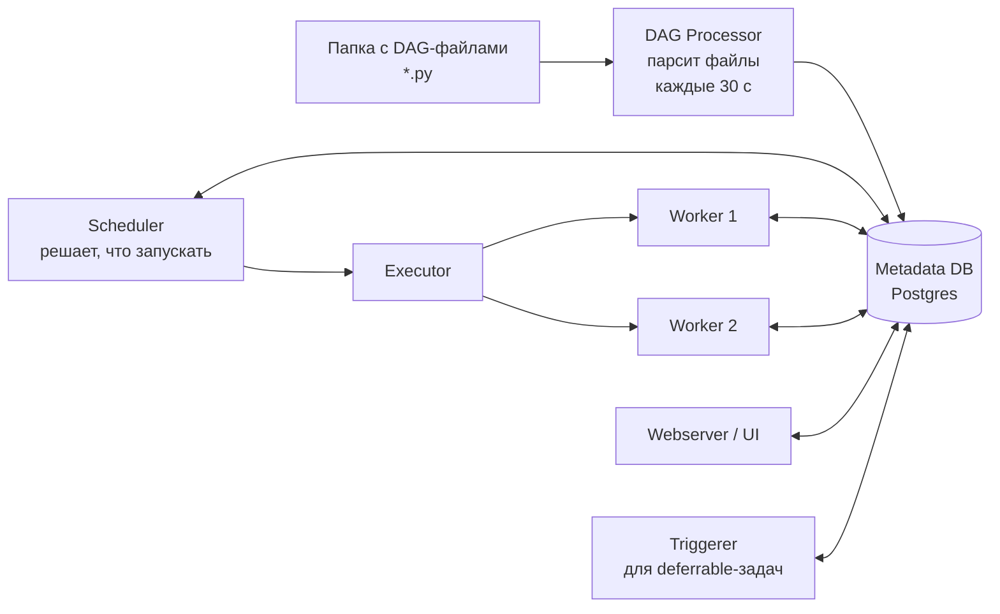

# Оркестрация пайплайнов

> **Зачем эта глава.** ML-система — это не одна модель, а десяток связанных джобов: выгрузка,
> валидация, сборка признаков, обучение, оценка, публикация, батч-инференс. Они зависят друг
> от друга, падают, требуют перезапуска за прошлые даты и должны при этом не порождать дублей.
> После главы вы сможете написать production ML-DAG, объяснить, почему DAG со `schedule="@daily"`
> и `start_date` сегодня в 18:00 сегодня не запустится, сделать задачу идемпотентной и
> перечислить антипаттерны, за которые Airflow наказывает деградацией всего инстанса.

**Уровень:** 🎯 middle → 🧠 middle+
**Предварительно нужно:** [хранение данных](01-storage-and-formats.md), [Spark: как он работает](03-spark-fundamentals.md), полезно [жизненный цикл ML-системы](../07-mlops/01-ml-lifecycle.md)
**Как проработать:** чтение + поднять Airflow локально и прогнать backfill

---

## Карта главы

- [1. Интуиция: почему cron перестаёт работать](#1-интуиция-почему-cron-перестаёт-работать)
- [2. Из чего состоит Airflow](#2-из-чего-состоит-airflow)
- [3. DAG, задачи, операторы](#3-dag-задачи-операторы)
- [4. Сенсоры и как они убивают кластер](#4-сенсоры-и-как-они-убивают-кластер)
- [5. XCom: зачем он есть и почему через него нельзя гонять данные](#5-xcom-зачем-он-есть-и-почему-через-него-нельзя-гонять-данные)
- [6. logical_date и интервалы: главный источник путаницы](#6-logical_date-и-интервалы-главный-источник-путаницы)
- [7. Catchup и backfill](#7-catchup-и-backfill)
- [8. Идемпотентность: центральное требование](#8-идемпотентность-центральное-требование)
- [9. Ретраи, алерты и SLA](#9-ретраи-алерты-и-sla)
- [10. Пулы, приоритеты и ограничение параллелизма](#10-пулы-приоритеты-и-ограничение-параллелизма)
- [11. Антипаттерны](#11-антипаттерны)
- [12. Production ML-DAG целиком](#12-production-ml-dag-целиком)
- [13. Что мониторить у самого Airflow](#13-что-мониторить-у-самого-airflow)
- [14. Альтернативы кратко](#14-альтернативы-кратко)
- [15. Подводные камни](#15-подводные-камни)
- [16. Проверь себя](#16-проверь-себя)
- [17. Практика](#17-практика)
- [18. Что читать дальше](#18-что-читать-дальше)

---

## 1. Интуиция: почему cron перестаёт работать

Начинается всегда одинаково. Есть скрипт `train.py`, его ставят в cron на 03:00. Через месяц
рядом появляется `build_features.py` в 02:00, потому что обучение должно видеть свежие признаки.
Через два месяца — `export_predictions.py` в 04:00.

Дальше происходит следующее.

**Февраль, 02:00.** Джоб признаков падает на битой партиции. В 03:00 cron честно запускает
обучение — на вчерашних данных. В 04:00 экспортируются предсказания модели, обученной на устаревших
признаках. Никто не узнает об этом до момента, когда через неделю кто-то заметит просевшую конверсию.

**Март.** Данные за 3 марта пришли с задержкой в 6 часов. Нужно перезапустить всю цепочку
за 3 марта. В cron нет понятия «за дату» — скрипт всегда считает «за вчера» от `datetime.now()`.
Приходится править код, запускать руками, потом откатывать правку.

**Апрель.** Пайплайнов стало 30. Половина запускается на одной машине, и три тяжёлых Spark-джоба
случайно совпали по времени — кластер лёг. Кто от кого зависит, знает только автор, и он в отпуске.

Оркестратор решает ровно эти четыре проблемы, и полезно держать их списком:

1. **Зависимости.** Задача B стартует, только если A завершилась успешно.
2. **Параметризация временем.** Задача знает, за какой интервал данных она считает, и этот
   интервал приходит снаружи, а не из системных часов.
3. **Наблюдаемость и восстановление.** Видно, что упало, можно перезапустить конкретную задачу
   за конкретную дату, есть логи и история.
4. **Управление ресурсами.** Ограничение параллелизма, очереди, приоритеты.

Всё остальное в Airflow — про эти четыре пункта.

---

## 2. Из чего состоит Airflow

Понимание архитектуры нужно не для галочки: половина «странных» багов объясняется тем,
где именно исполняется ваш код.



**Metadata DB** (Postgres в проде, SQLite только для локалки) — единственный источник истины:
состояния задач, XCom, переменные, соединения, история запусков. Всё общение компонентов идёт
через неё, поэтому она же первой становится узким местом на больших инсталляциях.

**DAG Processor** периодически парсит `.py`-файлы из папки DAG'ов. Это **исполнение вашего
файла целиком** — каждые `min_file_process_interval` секунд (по умолчанию 30). Отсюда главный
антипаттерн главы ([§11](#11-антипаттерны)): любой тяжёлый код на верхнем уровне файла выполняется десятки раз
в минуту.

**Scheduler** смотрит в БД, находит готовые к запуску задачи и отдаёт их executor'у.

**Executor** определяет, где физически выполняется задача:

| Executor | Где выполняется | Когда брать |
|---|---|---|
| `SequentialExecutor` | в процессе шедулера, по одной | только локальная отладка |
| `LocalExecutor` | подпроцессы на машине шедулера | до ~50 DAG'ов, одна машина, простая эксплуатация |
| `CeleryExecutor` | пул постоянных воркеров через брокер (Redis/RabbitMQ) | десятки-сотни DAG'ов, стабильный поток задач |
| `KubernetesExecutor` | отдельный под на каждую задачу | разнородные зависимости, изоляция, эластичность |

Практический ориентир: `CeleryExecutor` дешевле по накладным расходам (воркер уже поднят,
старт задачи — доли секунды), `KubernetesExecutor` платит 10–40 секунд за старт пода, зато
каждая задача получает свой образ и свои лимиты ресурсов. Гибрид — Celery + `KubernetesPodOperator`
для тяжёлых задач — самая частая рабочая схема.

> ⚠️ **Типичная ошибка.** Считать, что Airflow — это вычислительный движок. Airflow **оркестрирует**,
> а не считает. Задача, которая тянет 50 ГБ в pandas на воркере, съедает память Airflow-кластера
> и роняет соседние задачи. Правильная задача Airflow — это «отправить джоб в Spark и дождаться»,
> «дёрнуть API», «запустить под в k8s». Тело вычисления живёт снаружи.

---

## 3. DAG, задачи, операторы

**DAG** (Directed Acyclic Graph) — ориентированный ациклический граф задач. Ациклический — потому
что цикл означал бы задачу, ждущую саму себя.

**Задача** (task) — узел графа. **Оператор** (operator) — шаблон задачи. Экземпляр задачи
за конкретный интервал — **task instance**.

Современный способ описания — TaskFlow API (декораторы), он заметно чище классического:

```python
from datetime import datetime, timedelta
from airflow.decorators import dag, task

@dag(
    dag_id="daily_features",
    schedule="0 3 * * *",                 # каждый день в 03:00 UTC
    start_date=datetime(2026, 1, 1),
    catchup=False,
    max_active_runs=1,                    # не даём двум запускам топтаться по одной таблице
    default_args={
        "owner": "ml-platform",
        "retries": 3,
        "retry_delay": timedelta(minutes=5),
        "retry_exponential_backoff": True,
        "max_retry_delay": timedelta(minutes=30),
        "execution_timeout": timedelta(hours=2),
    },
    tags=["ml", "features"],
)
def daily_features():

    @task
    def build(data_interval_start=None, data_interval_end=None):
        # Границы интервала приходят снаружи — это и есть параметризация временем.
        # Никаких datetime.now() внутри задачи.
        return {"from": data_interval_start.isoformat(), "to": data_interval_end.isoformat()}

    @task
    def validate(meta: dict) -> str:
        assert meta["from"] < meta["to"]
        return meta["to"]

    validate(build())

daily_features()
```

Основные группы операторов, которые реально используются в ML-пайплайнах:

- `PythonOperator` / `@task` — произвольный Python. Помните: он исполняется на воркере Airflow.
- `BashOperator` — команда в shell. Удобно для `spark-submit`, но логи и коды возврата
  придётся разбирать самому.
- `SparkSubmitOperator` (provider `apache-spark`) — отправка джоба в Spark с типизированными
  параметрами.
- `KubernetesPodOperator` — запуск произвольного образа как пода. Главный оператор для ML:
  свой образ с torch и CUDA, свои `resources.limits`, свои секреты.
- `SQLExecuteQueryOperator` и специализированные (`PostgresOperator`, `TrinoOperator`) —
  запросы к хранилищу.
- `EmptyOperator` — пустышка для структурирования графа (точки синхронизации).
- `@task.branch` / `BranchPythonOperator` — ветвление: вернуть id задач, которые надо выполнить.
- `TriggerDagRunOperator` — запуск другого DAG.

Пример рабочего запуска Spark-джоба, где Airflow остаётся оркестратором, а вычисление живёт
в кластере:

```python
from airflow.providers.apache.spark.operators.spark_submit import SparkSubmitOperator

build_features = SparkSubmitOperator(
    task_id="build_features",
    application="/opt/jobs/build_features.py",
    conn_id="spark_yarn",
    # Интервал передаём аргументами — джоб не должен знать про "сегодня"
    application_args=[
        "--date-from", "{{ data_interval_start | ds }}",
        "--date-to", "{{ data_interval_end | ds }}",
        "--output", "s3a://lake/features/dt={{ ds }}/",
    ],
    conf={
        "spark.executor.memory": "8g",
        "spark.executor.cores": "4",
        "spark.executor.instances": "20",
        "spark.sql.shuffle.partitions": "800",   # ~ 4 * executor_instances * executor_cores
        "spark.sql.adaptive.enabled": "true",
        "spark.dynamicAllocation.enabled": "false",
    },
    execution_timeout=timedelta(hours=3),
)
```

Двойные фигурные скобки — шаблоны Jinja. Airflow подставляет в них значения контекста запуска
в момент выполнения задачи. Это единственный правильный способ протащить дату в команду:
`{{ ds }}` — дата начала интервала в формате `YYYY-MM-DD`, `{{ data_interval_start }}` и
`{{ data_interval_end }}` — полные метки времени, `{{ dag_run.run_id }}` — идентификатор запуска.

---

## 4. Сенсоры и как они убивают кластер

**Сенсор** (sensor) — оператор, который ждёт наступления события: появления файла в S3, партиции
в Hive, строки в таблице, завершения внешнего DAG'а.

У сенсора три режима, и разница между ними — это разница между работающим и лежащим инстансом.

**`mode="poke"` (по умолчанию).** Сенсор занимает слот воркера и в цикле проверяет условие
каждые `poke_interval` секунд. Ждём файл 4 часа с интервалом 60 с — слот занят 4 часа.
Двадцать таких сенсоров при `parallelism=32` — и Airflow встал: свободных слотов нет, обычные
задачи не запускаются. Это называется **sensor deadlock**, и это классика жанра.

**`mode="reschedule"`.** Сенсор проверяет условие, и если не сработало — освобождает слот
и переводит задачу в состояние `up_for_reschedule` до следующей проверки. Слот занят
доли секунды раз в `poke_interval`. Дефолт для любого ожидания дольше пары минут.

**Deferrable-операторы (`deferrable=True`).** Задача передаёт ожидание отдельному компоненту —
**triggerer**, который на одном асинхронном процессе держит тысячи ожиданий. Слот воркера
не занят вообще. Это правильный способ для ожиданий часами и для «дождаться завершения
внешнего джоба».

```python
from airflow.providers.amazon.aws.sensors.s3 import S3KeySensor

wait_raw = S3KeySensor(
    task_id="wait_raw_partition",
    bucket_key="s3://lake/raw/events/dt={{ ds }}/_SUCCESS",
    poke_interval=300,                  # проверяем раз в 5 минут, чаще незачем
    timeout=6 * 3600,                   # ждём максимум 6 часов, потом падаем — это алерт
    mode="reschedule",                  # НЕ занимаем слот между проверками
    soft_fail=False,                    # таймаут = ошибка, а не пропуск
)
```

Два параметра, которые нельзя оставлять по умолчанию: `timeout` (без него сенсор будет ждать
вечно и вы никогда не узнаете о проблеме) и `mode`.

> 🧠 **Middle+.** Часто сенсор вообще не нужен. Если поставщик данных может сам дёрнуть ваш
> пайплайн — это лучше ожидания: событийная модель вместо опроса. В Airflow это делается через
> Datasets (в Airflow 3 их переименовали в Assets): производящий DAG объявляет, что обновляет
> датасет, потребляющий DAG объявляет `schedule=[dataset]` и запускается по факту обновления,
> а не по расписанию с ожиданием. Это убирает и сенсоры, и «запас по времени» в расписании
> (когда обучение ставят на 03:00 «потому что признаки обычно готовы к 02:40»).

---

## 5. XCom: зачем он есть и почему через него нельзя гонять данные

**XCom** (cross-communication) — механизм передачи значений между задачами. Задача возвращает
значение — оно сериализуется и кладётся в таблицу `xcom` **метаданных-БД**. Другая задача
читает его оттуда.

Вот в этом предложении и содержится ответ на вопрос «почему нельзя передавать данные».

**Причина первая: это ваша Postgres.** Metadata DB — критический компонент, от которого зависит
весь Airflow. Каждый DataFrame, положенный в XCom, — это строка в таблице, которая читается
и пишется всеми компонентами. Пайплайн, гоняющий через XCom по 50 МБ на запуск, при 200 запусках
в сутки добавляет 10 ГБ в сутки в БД планировщика. Дальше растёт время запросов шедулера,
и деградирует всё.

**Причина вторая: жёсткие лимиты по размеру.** Значение сериализуется (по умолчанию в JSON)
и складывается в BLOB-колонку. Практический потолок определяется бэкендом БД: у MySQL это
десятки килобайт, у Postgres — существенно больше, но упираться в него всё равно не надо.
Ориентир, который стоит запомнить: **XCom — для килобайтов, не для мегабайтов.**

**Причина третья: сериализация.** По умолчанию значение должно быть JSON-сериализуемым.
DataFrame, модель, объект соединения туда не положить без танцев с pickle, а включать pickle
в общей БД — плохая идея с точки зрения безопасности.

**Как правильно.** Через XCom передают **ссылку**, а не содержимое:

```python
@task
def build_features(data_interval_start=None, data_interval_end=None) -> str:
    path = f"s3://lake/features/dt={data_interval_start:%Y-%m-%d}/"
    spark_job.run(date_from=data_interval_start, date_to=data_interval_end, output=path)
    return path        # 60 байт в XCom — ссылка на артефакт, а не сам артефакт


@task
def train(features_path: str) -> str:
    df = read_parquet(features_path)     # данные читаются из хранилища, а не из БД Airflow
    model_uri = fit_and_log(df)
    return model_uri                     # снова ссылка: mlflow://models/ranker/42
```

Если очень нужно передавать большие объекты — существует **custom XCom backend**: вы
переопределяете сериализацию так, чтобы значение уезжало в S3, а в БД оставалась ссылка.
Но это ровно тот же паттерн, просто спрятанный: проще написать его явно.

> 💬 **На собеседовании.** Спросят: «Что такое XCom и можно ли через него передать датафрейм?»
> Хороший ответ: XCom — это таблица в метаданных-БД Airflow для обмена **малыми** значениями
> между задачами; датафрейм передавать нельзя, потому что это нагрузка на критическую БД
> планировщика, потому что есть жёсткий лимит на размер значения и потому что нужна
> JSON-сериализуемость. Правильно передавать путь к артефакту в S3/HDFS или URI модели в реестре,
> а сами данные читать из хранилища. Отдельно упомяну custom XCom backend как способ спрятать
> ту же схему за API. Плохой ответ: «можно, если включить pickle».

---

## 6. logical_date и интервалы: главный источник путаницы

Это тема, на которой на собеседовании ловят даже людей с двумя годами Airflow.

Airflow исходит из того, что пайплайн обрабатывает **интервал данных**, а не «работает сейчас».
У каждого запуска (DAG run) есть:

- `data_interval_start` — начало обрабатываемого интервала;
- `data_interval_end` — конец интервала;
- `logical_date` (в Airflow 1.x и ранних 2.x называлась `execution_date`) — метка запуска,
  для расписаний по времени совпадающая с `data_interval_start`.

**Ключевое правило: запуск происходит в КОНЦЕ интервала, а не в начале.**

Разберём вопрос, который задают почти дословно: *«Почему сегодня в 18:00 не запустился DAG,
у которого `start_date` сегодня в 18:00?»*

DAG со `schedule="@daily"` и `start_date=2026-07-26 18:00`. Первый интервал данных —
`[2026-07-26 18:00, 2026-07-27 18:00)`. Он **завершится** только 27 июля в 18:00 — тогда
и запустится первый DAG run, причём с `logical_date = 2026-07-26 18:00`.

То есть DAG «за 26-е» физически выполняется 27-го. Логика в том, что данные за сутки становятся
полными только когда сутки кончились.

```mermaid
gantt
    dateFormat YYYY-MM-DD HH:mm
    axisFormat %d.%m %H:%M
    title Интервал данных и момент запуска (schedule=@daily)
    section Интервал данных
    logical_date = 26.07 18:00 :done, i1, 2026-07-26 18:00, 24h
    section Выполнение
    DAG run стартует :active, r1, 2026-07-27 18:00, 2h
```

Отсюда два практических следствия, которые надо помнить наизусть.

**Первое: `{{ ds }}` — это не «сегодня».** Внутри задачи `{{ ds }}` равно дате начала интервала.
Джоб, выполняющийся 27 июля, увидит `ds = 2026-07-26`. Это правильно: он и считает за 26-е.

**Второе: любой `datetime.now()` в коде задачи — баг.** При перезапуске за прошлую дату
он вернёт текущий момент, и вы посчитаете вчерашние данные сегодняшними границами. Все
временные границы берутся только из контекста: `data_interval_start`, `data_interval_end`,
`{{ ds }}`, `{{ ds_nodash }}`, `{{ prev_data_interval_start_success }}`.

> ⚠️ **Типичная ошибка.** Ставить `start_date=datetime.now()` или `start_date=days_ago(1)`
> (устаревшая функция). `start_date` обязан быть **фиксированной константой**: DAG-файл парсится
> каждые 30 секунд, и при плавающем `start_date` Airflow каждый раз пересчитывает расписание,
> из-за чего запуски то пропадают, то дублируются. Правильно: `start_date=datetime(2026, 1, 1)`
> и `catchup=False`, если история не нужна.

Дополнительно: в Airflow 3 `execution_date` окончательно удалён, остались `logical_date`
и пара `data_interval_*`. Для DAG'ов, запускаемых по событию (по датасету/ассету) или вручную,
`logical_date` может быть пустым — код, который на него слепо полагается, сломается. Пишите
на `data_interval_start`/`data_interval_end`.

---

## 7. Catchup и backfill

**Catchup** — поведение при старте DAG'а, у которого `start_date` в прошлом. При `catchup=True`
(историческое поведение по умолчанию) Airflow немедленно создаст все пропущенные запуски
от `start_date` до текущего момента.

Арифметика простая и злая: DAG с `schedule="@hourly"` и `start_date` полугодовой давности при
первом включении породит $180 \times 24 = 4320$ запусков одновременно. Если каждый шлёт
Spark-джоб — кластер ляжет в первые минуты.

Правило: **`catchup=False` по умолчанию во всех новых DAG'ах**, а историю добираем осознанным
backfill'ом. Исключение — пайплайны, которые действительно обязаны посчитать каждый интервал
(финансовая отчётность, регуляторные выгрузки); там `catchup=True` плюс `max_active_runs=1`
или ограничивающий пул.

**Backfill** — осознанный запуск за диапазон прошлых дат. Из CLI (синтаксис зависит от версии,
проверяйте `airflow backfill --help` на своей):

```bash
# Airflow 2.x: пересчитать признаки за первую неделю июля,
# не более 3 запусков одновременно, игнорируя зависимость от предыдущего запуска
airflow dags backfill \
  --start-date 2026-07-01 \
  --end-date 2026-07-07 \
  --max-active-runs 3 \
  --reset-dagruns \
  daily_features
```

Backfill работает только если выполнено требование следующего раздела. Если задача неидемпотентна,
backfill не «пересчитает», а **удвоит** данные.

> 💬 **На собеседовании.** Спросят: «В чём разница между catchup и backfill?» Хороший ответ:
> catchup — автоматическое досоздание пропущенных запусков при включении DAG'а, свойство
> расписания; backfill — ручной, контролируемый запуск за явно указанный диапазон. Опасность
> catchup в том, что он срабатывает молча и может создать тысячи запусков разом; поэтому
> `catchup=False` — правильный дефолт, а историю добираем backfill'ом с ограничением параллелизма.
> И то и другое требует идемпотентности задач, иначе повторный расчёт продублирует данные.
> Плохой ответ: «это одно и то же, просто разные способы вызова».

---

## 8. Идемпотентность: центральное требование

**Идемпотентная задача** — та, повторное выполнение которой за тот же интервал даёт тот же
результат. Это не пожелание, а условие работоспособности: Airflow **будет** перезапускать
задачи — по ретраям, по backfill'у, по кнопке «Clear» в UI, по восстановлению после сбоя воркера.

Три рабочих способа.

**Способ 1: перезапись партиции (partition overwrite).** Задача пишет ровно в одну партицию,
определяемую интервалом, и перезаписывает её целиком.

```python
# Spark: перезаписываем ТОЛЬКО целевую партицию, остальные не трогаем
spark.conf.set("spark.sql.sources.partitionOverwriteMode", "dynamic")

(features
 .write
 .mode("overwrite")                     # с dynamic-режимом затрёт только dt=<нужная дата>
 .partitionBy("dt")
 .parquet("s3a://lake/features/"))
```

Без `partitionOverwriteMode=dynamic` режим `overwrite` снесёт **всю таблицу** — это одна
из самых дорогих ошибок в жизни дата-инженера, и она случается регулярно.

**Способ 2: upsert / MERGE по стабильному ключу.** Для табличных форматов с ACID
(Iceberg, Delta — см. [хранение данных](01-storage-and-formats.md)):

```sql
MERGE INTO features_daily AS t
USING staging_features AS s
  ON t.user_id = s.user_id AND t.dt = s.dt      -- стабильный ключ, включающий интервал
WHEN MATCHED THEN UPDATE SET *
WHEN NOT MATCHED THEN INSERT *;
```

**Способ 3: delete-then-insert в одной транзакции.** Для обычных СУБД:

```sql
BEGIN;
DELETE FROM features_daily WHERE dt = DATE '{{ ds }}';
INSERT INTO features_daily SELECT * FROM staging_features WHERE dt = DATE '{{ ds }}';
COMMIT;
```

Ключевое во всех трёх: **целевое множество строк детерминировано определяется интервалом**,
а не моментом запуска.

Что ломает идемпотентность на практике:

- `INSERT` без предварительного удаления — самый частый случай, дубликаты после каждого ретрая;
- `datetime.now()` внутри задачи;
- дописывание в файл (`mode("append")`) вместо перезаписи партиции;
- побочные эффекты: отправка письма, вызов внешнего API, публикация в Kafka без ключа
  дедупликации — при ретрае они повторятся;
- сохранение модели в файл с именем по timestamp запуска — при backfill'е получите зоопарк
  артефактов вместо одного на дату.

> 🧠 **Middle+.** Отдельно про побочные эффекты: если задача обязана что-то отправить наружу,
> выносите отправку в **последнюю** задачу DAG'а и делайте её идемпотентной через ключ
> дедупликации на стороне получателя (`Idempotency-Key` в HTTP-заголовке, ключ сообщения
> в Kafka, `ON CONFLICT DO NOTHING` в БД). Правило: чем позже в графе побочный эффект, тем
> меньше вероятность его повторить.

---

## 9. Ретраи, алерты и SLA

**Ретраи.** Настраиваются на уровне задачи или через `default_args`:

```python
default_args = {
    "retries": 3,
    "retry_delay": timedelta(minutes=5),
    "retry_exponential_backoff": True,       # 5 мин, 10 мин, 20 мин...
    "max_retry_delay": timedelta(minutes=30),
    "execution_timeout": timedelta(hours=2), # без него зависшая задача висит вечно
}
```

Экспоненциальный backoff важен, когда причина падения — перегрузка внешней системы: три ретрая
подряд через минуту добьют её окончательно.

Отдельно про количество: ретраи лечат **транзиентные** ошибки (сеть моргнула, воркер вытеснили,
кластер был занят). Логические ошибки (нет входной партиции, схема изменилась, деление на ноль)
ретраями не лечатся — три попытки просто утроят время до алерта. Практическое правило:
2–3 ретрая для задач, ходящих во внешние системы; 0–1 для чисто вычислительных.

`execution_timeout` обязателен. Без него зависший Spark-джоб держит слот сутками, а вы узнаёте
об этом от бизнеса, а не от мониторинга.

**Алерты.** Встроенная отправка почты (`email_on_failure`) в проде почти не используется —
её никто не читает. Рабочая схема — колбэки в мессенджер и/или в систему инцидентов:

```python
def notify_failure(context):
    """Колбэк на падение задачи: шлём в Slack то, что реально нужно дежурному."""
    ti = context["task_instance"]
    send_slack(
        channel="#ml-alerts",
        text=(
            f":red_circle: *{ti.dag_id}.{ti.task_id}* упала\n"
            f"Интервал: {context['data_interval_start']} — {context['data_interval_end']}\n"
            f"Попытка {ti.try_number} из {ti.max_tries + 1}\n"
            f"Логи: {ti.log_url}\n"
            f"Runbook: https://wiki.internal/runbooks/{ti.dag_id}"
        ),
    )

default_args["on_failure_callback"] = notify_failure
```

Три поля, без которых алерт бесполезен: **интервал данных** (какую дату чинить),
**прямая ссылка на логи** и **ссылка на runbook**. Алерт «task failed» без них порождает
пять минут раскопок в UI на каждый инцидент.

Дополнительно: `on_retry_callback` обычно шумит и его лучше не подключать; `on_success_callback`
имеет смысл только для критичных публикующих задач.

**SLA.** Идея: объявить, за какое время задача обязана завершиться относительно `logical_date`,
и получить уведомление при нарушении. В Airflow 2 это параметр `sla=timedelta(hours=2)`
и колбэк `sla_miss_callback` на уровне DAG'а.

Важная честность: механизм считает срок **от `logical_date`**, а не от фактического старта
задачи, что делает его неинтуитивным при backfill'ах и при задержках выше по графу.
В Airflow 3 классические SLA убрали, заменив отдельным механизмом дедлайн-алертов — при работе
с конкретной версией сверяйтесь с её документацией. Практическая рекомендация, не зависящая
от версии: **основной SLI пайплайна — свежесть выходных данных**, и мониторить надо её
(«максимальная дата партиции в таблице признаков отстаёт от текущей больше чем на N часов»),
а не только состояние задач. Данные могут быть протухшими при всех зелёных задачах — например,
если DAG вообще не запустился.

---

## 10. Пулы, приоритеты и ограничение параллелизма

Четыре уровня ограничений, которые надо различать:

| Настройка | Уровень | Что ограничивает |
|---|---|---|
| `parallelism` (конфиг) | весь инстанс | сколько task instance выполняется одновременно во всём Airflow |
| `max_active_runs` | DAG | сколько запусков одного DAG'а идёт параллельно |
| `max_active_tasks` (ранее `concurrency`) | DAG | сколько задач одного DAG'а параллельно |
| `pool` | группа задач | сколько задач из общего именованного пула |

**Пул** (pool) — именованный набор слотов, который делят между собой задачи из разных DAG'ов.
Это способ защитить внешний ресурс.

Пример: у вас 40 DAG'ов, и каждый может пойти в аналитическую БД. БД держит 10 одновременных
тяжёлых запросов, дальше деградирует. Создаёте пул `analytics_db` на 10 слотов, помечаете
все ходящие туда задачи `pool="analytics_db"` — и Airflow физически не сможет запустить
одиннадцатую.

```python
heavy_query = SQLExecuteQueryOperator(
    task_id="aggregate_sessions",
    conn_id="trino_analytics",
    sql="sql/aggregate_sessions.sql",
    pool="analytics_db",          # пул создаётся в UI: Admin -> Pools
    pool_slots=1,
    priority_weight=10,           # при конкуренции за слот выигрывает больший вес
)

train = KubernetesPodOperator(
    task_id="train_ranker",
    pool="gpu_nodes",             # 4 слота = 4 GPU в кластере
    pool_slots=1,
    ...
)
```

`priority_weight` определяет, кто получит слот первым при дефиците. По умолчанию вес задачи
суммируется с весами всех её потомков (стратегия `downstream`), поэтому задача в начале длинной
цепочки автоматически получает высокий приоритет — это разумно, но если нужен явный контроль,
задавайте `weight_rule="absolute"` и веса руками.

> 💬 **На собеседовании.** Спросят: «Что такое пул в Airflow и зачем он нужен?» Хороший ответ:
> именованный набор слотов, общий для задач из разных DAG'ов, — способ ограничить нагрузку
> на внешний разделяемый ресурс: коннекты к БД, GPU в кластере, квота внешнего API. Без пула
> ограничение параллелизма возможно только на уровне DAG'а (`max_active_tasks`) или всего
> инстанса (`parallelism`), а нужно именно на уровне ресурса. Дополню про `priority_weight`
> и про типичную аварию: сенсоры в режиме `poke` занимают слоты пула часами и вызывают
> голодание остальных задач. Плохой ответ: «пул — это чтобы ограничить число тасок в DAG'е».

---

## 11. Антипаттерны

Это самый ценный раздел главы: перечисленное встречается почти в каждом первом проекте.

**1. Тяжёлый код на верхнем уровне DAG-файла.**
DAG Processor **исполняет** файл целиком каждые `min_file_process_interval` секунд (дефолт 30).
Поэтому запрос к базе, чтение большого файла или обучение модели на верхнем уровне выполняются
2 раза в минуту × количество файлов. Импорт `torch` на верхнем уровне добавляет несколько секунд
к парсингу каждого файла; при 50 DAG'ах парсинг перестаёт укладываться в интервал, и расписание
начинает «плыть».

```python
# ПЛОХО: выполняется при каждом парсинге DAG-файла
import torch                                   # +2-5 с к парсингу
config = requests.get("http://config-service/params").json()   # сеть при каждом парсинге
users = pd.read_sql("SELECT * FROM users", conn)               # запрос к БД каждые 30 с

# ХОРОШО: всё внутри задачи, выполняется только при запуске
@task
def train():
    import torch                               # локальный импорт
    config = requests.get("http://config-service/params").json()
    ...
```

Ориентир, которым пользуются на практике: **парсинг одного DAG-файла должен укладываться
в ~1 секунду**. Проверяется командой `airflow dags list-import-errors` и метрикой
времени парсинга ([§13](#13-что-мониторить-у-самого-airflow)). Кнопка «Reparse DAG» в UI как раз принудительно запускает разбор
конкретного файла, не дожидаясь планового цикла, — она нужна, когда вы выкатили правку
и не хотите ждать.

**2. Передача данных через XCom.** Разобрано в [§5](#5-xcom-зачем-он-есть-и-почему-через-него-нельзя-гонять-данные).

**3. Задача-монолит.** Один `PythonOperator` на 800 строк, делающий выгрузку, обучение
и публикацию. Падает на публикации — переделывается обучение (два часа GPU). Дробите по
границам «дорого пересчитать»: каждая задача должна быть точкой, с которой имеет смысл
перезапускаться.

**4. Обратный перекос: тысяча микрозадач.** Каждая задача — это запись в БД, планирование,
старт процесса (а в `KubernetesExecutor` — старт пода, 10–40 секунд). DAG на 2000 задач по
2 секунды каждая проведёт большую часть времени в накладных расходах и утопит шедулер. Разумный
диапазон — десятки задач в DAG'е, при необходимости с динамическим маппингом
(`.expand()`) и разумной степенью параллелизма.

**5. Вычисления внутри Airflow.** Разобрано в [§2](#2-из-чего-состоит-airflow). Airflow — оркестратор.

**6. Неидемпотентные задачи.** Разобрано в [§8](#8-идемпотентность-центральное-требование).

**7. `catchup=True` по недосмотру.** Разобрано в [§7](#7-catchup-и-backfill).

**8. Секреты в коде DAG'а.** Пароли и токены — в Connections/Variables (лучше — во внешнем
секрет-бэкенде: Vault, AWS Secrets Manager). При этом: **`Variable.get()` на верхнем уровне
файла — это запрос к БД при каждом парсинге**. Внутри задачи — нормально; на верхнем уровне —
используйте Jinja (`{{ var.value.my_var }}`), тогда значение подставится в момент выполнения.

**9. Динамическая генерация DAG'ов запросом к внешней системе.** Схема «читаем список таблиц
из Postgres и генерируем по DAG'у на каждую» ломается ровно тогда, когда внешняя система
недоступна: DAG'и исчезают из UI, запуски пропадают, история рвётся. Генерируйте из статических
конфигов (YAML в репозитории), которые обновляются отдельным пайплайном.

**10. Один гигантский DAG на всю компанию.** 500 задач, все зависят от всех, любой сбой
блокирует всё. Разбивайте на доменные DAG'и, связывайте через Datasets/Assets или
`ExternalTaskSensor` (в `reschedule`/deferrable режиме).

---

## 12. Production ML-DAG целиком

Соберём типовой еженедельный пайплайн переобучения ранжирующей модели. Обратите внимание,
что каждая задача — идемпотентна, все временные границы приходят из контекста, тяжёлое
вычисление вынесено наружу, а через XCom едут только ссылки.

```python
"""Еженедельное переобучение ранжирующей модели.

Контракт:
  вход  — s3://lake/raw/events/dt=YYYY-MM-DD/ (партиции за 90 дней до конца интервала)
  выход — модель в MLflow Registry со стадией Staging и метриками в отчёте
Идемпотентность: все записи — перезапись партиции по dt из data_interval_start.
"""
from datetime import datetime, timedelta

from airflow.decorators import dag, task
from airflow.exceptions import AirflowFailException
from airflow.providers.amazon.aws.sensors.s3 import S3KeySensor
from airflow.providers.apache.spark.operators.spark_submit import SparkSubmitOperator
from airflow.providers.cncf.kubernetes.operators.pod import KubernetesPodOperator
from kubernetes.client import models as k8s

DEFAULT_ARGS = {
    "owner": "ml-ranking",
    "retries": 2,
    "retry_delay": timedelta(minutes=10),
    "retry_exponential_backoff": True,
    "max_retry_delay": timedelta(minutes=40),
    "execution_timeout": timedelta(hours=4),
}

# Гейт: модель не уезжает в Staging, если не побила прод на этот порог
NDCG_GATE = 0.002


@dag(
    dag_id="ranker_weekly_retrain",
    schedule="0 2 * * 1",                  # понедельник 02:00 UTC
    start_date=datetime(2026, 1, 6),       # ФИКСИРОВАННАЯ константа, не days_ago()
    catchup=False,
    max_active_runs=1,                     # два переобучения одновременно = гонка за реестр
    default_args=DEFAULT_ARGS,
    tags=["ml", "ranking", "retrain"],
    doc_md=__doc__,
)
def ranker_weekly_retrain():

    wait_events = S3KeySensor(
        task_id="wait_last_day_partition",
        bucket_key="s3://lake/raw/events/dt={{ macros.ds_add(ds, 6) }}/_SUCCESS",
        poke_interval=600,
        timeout=8 * 3600,
        mode="reschedule",                 # не держим слот 8 часов
    )

    build_dataset = SparkSubmitOperator(
        task_id="build_dataset",
        application="/opt/jobs/build_ranking_dataset.py",
        conn_id="spark_k8s",
        application_args=[
            # 90 дней истории, считая назад от конца интервала
            "--date-from", "{{ macros.ds_add(ds, -83) }}",
            "--date-to", "{{ macros.ds_add(ds, 6) }}",
            "--output", "s3a://lake/ml/ranking_dataset/snapshot_dt={{ ds }}/",
        ],
        conf={
            "spark.executor.memory": "16g",
            "spark.executor.cores": "4",
            "spark.executor.instances": "40",
            "spark.sql.shuffle.partitions": "1600",
            "spark.sql.adaptive.enabled": "true",
            "spark.sql.sources.partitionOverwriteMode": "dynamic",  # идемпотентность
        },
        execution_timeout=timedelta(hours=3),
        pool="spark_cluster",
        pool_slots=4,
    )

    @task
    def validate_dataset(ds: str = None) -> str:
        """Контракт данных. Падаем ДО обучения, а не после четырёх часов GPU."""
        import pyarrow.dataset as pads

        path = f"s3://lake/ml/ranking_dataset/snapshot_dt={ds}/"
        d = pads.dataset(path, format="parquet")
        n_rows = d.count_rows()
        cols = set(d.schema.names)

        required = {"user_id", "item_id", "label", "position", "event_time"}
        missing = required - cols
        if missing:
            # AirflowFailException = не ретраить: схема сама не починится
            raise AirflowFailException(f"нет обязательных колонок: {sorted(missing)}")
        if n_rows < 50_000_000:
            raise AirflowFailException(f"строк {n_rows:,} < 50M — данные неполные, обучать нельзя")

        return path

    train = KubernetesPodOperator(
        task_id="train",
        name="ranker-train",
        namespace="ml-jobs",
        image="registry.internal/ml/ranker-train:2.4.1",   # НЕ latest: воспроизводимость
        cmds=["python", "-m", "ranker.train"],
        arguments=[
            "--dataset", "s3://lake/ml/ranking_dataset/snapshot_dt={{ ds }}/",
            "--run-name", "weekly-{{ ds }}",                # детерминированное имя запуска
            "--mlflow-experiment", "ranker",
            "--seed", "42",
        ],
        container_resources=k8s.V1ResourceRequirements(
            requests={"cpu": "8", "memory": "48Gi", "nvidia.com/gpu": "1"},
            limits={"cpu": "8", "memory": "48Gi", "nvidia.com/gpu": "1"},
        ),
        get_logs=True,
        is_delete_operator_pod=True,       # не оставляем мусор в неймспейсе
        do_xcom_push=True,                 # вернём run_id MLflow — ссылку, не данные
        pool="gpu_nodes",
        pool_slots=1,
        execution_timeout=timedelta(hours=6),
        retries=1,                         # GPU-задача дорогая: один ретрай, не три
    )

    @task
    def evaluate_and_gate(train_result: dict) -> dict:
        """Сравниваем кандидата с продом на одном и том же holdout'е."""
        import mlflow

        client = mlflow.MlflowClient()
        cand = client.get_run(train_result["mlflow_run_id"]).data.metrics
        prod_version = client.get_model_version_by_alias("ranker", "production")
        prod = client.get_run(prod_version.run_id).data.metrics

        delta = cand["ndcg_at_10"] - prod["ndcg_at_10"]
        passed = delta >= NDCG_GATE and cand["ndcg_at_10"] > 0  # защита от пустых метрик
        return {
            "run_id": train_result["mlflow_run_id"],
            "ndcg_candidate": cand["ndcg_at_10"],
            "ndcg_prod": prod["ndcg_at_10"],
            "delta": delta,
            "passed": passed,
        }

    @task.branch
    def route(gate: dict) -> str:
        return "promote_to_staging" if gate["passed"] else "report_no_promotion"

    @task(task_id="promote_to_staging")
    def promote(gate: dict, ds: str = None) -> str:
        import mlflow

        client = mlflow.MlflowClient()
        mv = mlflow.register_model(f"runs:/{gate['run_id']}/model", "ranker")
        client.set_registered_model_alias("ranker", "staging", mv.version)
        client.set_model_version_tag("ranker", mv.version, "trained_on", ds)
        return f"models:/ranker@staging (v{mv.version})"

    @task(task_id="report_no_promotion")
    def report(gate: dict):
        send_slack(
            "#ml-ranking",
            f"Кандидат не прошёл гейт: NDCG@10 {gate['ndcg_candidate']:.4f} "
            f"против прода {gate['ndcg_prod']:.4f} (дельта {gate['delta']:+.4f}, "
            f"порог {NDCG_GATE}). Модель НЕ продвинута.",
        )

    dataset_path = validate_dataset()
    gate = evaluate_and_gate(train.output)
    branch = route(gate)

    wait_events >> build_dataset >> dataset_path >> train
    branch >> [promote(gate), report(gate)]


ranker_weekly_retrain()
```

Что здесь стоит заметить отдельно.

**`AirflowFailException` вместо обычного исключения** в валидации. Обычное исключение уйдёт
в ретраи — три раза по десять минут на проверку схемы, которая точно не починится сама.
`AirflowFailException` помечает задачу как проваленную окончательно.

**Валидация до обучения.** Проверка данных стоит секунды, обучение — часы GPU. Порядок задач
экономит деньги и, что важнее, время до алерта.

**Гейт-метрика с порогом.** `NDCG_GATE = 0.002` — не «модель лучше», а «модель лучше на величину,
которая заведомо больше шума». Порог берётся из разброса метрики между сидами: обучите одну
конфигурацию с пятью сидами, посмотрите стандартное отклонение и возьмите порог в 2–3 сигмы.

**Продвижение только до Staging, не до Production.** Дальше — [канареечная выкатка](../07-mlops/08-deployment-strategies.md)
и A/B, а не автоматический переезд в прод. Автоматизация обучения — да; автоматизация решения
«эта модель теперь обслуживает всех пользователей» — почти всегда нет.

**Тег `trained_on`.** Через полгода при разборе инцидента вы захотите знать, на каких данных
училась версия 37. Метаданные пишутся в момент создания артефакта, а не восстанавливаются потом.

---

## 13. Что мониторить у самого Airflow

Airflow отдаёт метрики по StatsD; в Kubernetes их обычно собирают через `statsd_exporter`
и Prometheus. Имена метрик в Prometheus зависят от вашего mapping-конфига, поэтому ниже —
логика, а конкретные имена сверяйте со своим экспортёром.

```promql
# 1) Время парсинга DAG-файлов. Если приближается к min_file_process_interval (30 с),
#    расписание начинает отставать — ищите тяжёлый код на верхнем уровне.
airflow_dag_processing_total_parse_time

# 2) Задачи, которые готовы к запуску, но не получили слот (голодание).
#    Стабильно > 0 — не хватает воркеров или пул исчерпан сенсорами.
sum(airflow_scheduler_tasks_starving)

# 3) Задержка планирования: сколько задача ждала между "готова" и "запущена".
#    Растёт раньше, чем начинают падать SLA.
histogram_quantile(0.95, sum by (le) (rate(airflow_scheduler_tasks_running_bucket[10m])))

# 4) Падения задач по DAG'ам за час.
sum by (dag_id) (increase(airflow_ti_failures[1h])) > 0
```

И главное — метрика, которой у Airflow нет и которую нужно завести самим: **свежесть выходных
данных**. Экспортируйте отдельным экспортёром максимальную дату партиции ключевых таблиц:

```promql
# Признаки протухли: последняя партиция старше 30 часов при суточном пайплайне
(time() - ml_feature_table_max_partition_ts{table="features_daily"}) > 108000
```

Этот алерт срабатывает и тогда, когда DAG упал, и тогда, когда DAG вообще не запустился
(отключили, сломали расписание, кто-то поставил на паузу) — а последний случай мониторинг
задач не ловит принципиально.

---

## 14. Альтернативы кратко

Airflow — де-факто стандарт, но не единственный вариант, и на собеседовании полезно уметь
сказать, чем он вам не подходит.

| Инструмент | Ключевая идея | Когда действительно лучше Airflow |
|---|---|---|
| **Dagster** | центральная абстракция — не задача, а **ассет** (таблица, модель); типизированные входы/выходы, встроенное тестирование | когда важны каталог данных, происхождение (lineage) и локальная воспроизводимость пайплайна |
| **Prefect** | обычный Python-код с декораторами, динамические потоки без DAG-структуры | когда граф зависит от данных во время выполнения и статический DAG неудобен |
| **Kubeflow Pipelines** | пайплайны как контейнеры в Kubernetes, ML-ориентация | когда всё ML уже в k8s и нужны версионирование экспериментов и переиспользование компонент |
| **Argo Workflows** | нативный для k8s движок workflow на CRD | когда нужен универсальный движок под k8s без ML-специфики и без Python-зависимости |
| **Flyte** | типизированные задачи, сильное кэширование результатов по хешу входов | когда дорогие шаги пересчитываются повторно и кэш экономит реальные деньги |
| **Temporal** | долгоживущие workflow с гарантией продолжения после сбоя | когда логика — не расписание, а длинный бизнес-процесс с состоянием |
| **Cron + скрипты** | ничего лишнего | 1–3 независимых джоба без зависимостей; честный ответ, который на собеседовании ценится |

Отдельно про **dbt**: это не оркестратор, а инструмент трансформаций в хранилище. Его
запускают **из** оркестратора; вопрос «Airflow или dbt» некорректен, они про разное.

Главный аргумент за Airflow, который стоит проговорить: экосистема провайдеров (сотни готовых
операторов), огромное сообщество и тот факт, что его знает почти любой нанимаемый инженер.
Главный аргумент против: он проектировался под расписания и задачи, а не под данные, поэтому
lineage, типизацию и тестируемость приходится строить поверх.

---

## 15. Подводные камни

**DAG не запустился в ожидаемое время.**
*Симптом:* поставили `schedule="0 18 * * *"`, ждали запуска сегодня в 18:00 — ничего.
*Причина:* Airflow запускает в конце интервала; первый запуск будет завтра в 18:00
с `logical_date` сегодняшнего дня.
*Что делать:* принять модель интервалов; если нужен запуск «за сегодня сегодня» — сдвиньте
расписание и используйте `data_interval_end` как рабочую дату; для разовых прогонов —
`Trigger DAG` вручную.

**Расписание «поплыло» после деплоя.**
*Симптом:* запуски то дублируются, то пропадают.
*Причина:* `start_date` вычисляется динамически (`days_ago(1)`, `datetime.now()`) и меняется
при каждом парсинге.
*Что делать:* фиксированная константа в `start_date`; изменение расписания у живого DAG'а
делать через новый `dag_id` с версией в имени, а не правкой на месте.

**Backfill удвоил данные.**
*Симптом:* после перезапуска за неделю в таблице ровно вдвое больше строк.
*Причина:* задача делает `INSERT`/`append` вместо перезаписи партиции.
*Что делать:* привести к одному из трёх идемпотентных паттернов ([§8](#8-идемпотентность-центральное-требование)); до этого — не запускать
backfill вообще.

**Airflow «завис»: задачи в queued, но не запускаются.**
*Симптом:* всё жёлтое, воркеры простаивают.
*Причина:* чаще всего сенсоры в режиме `poke` заняли все слоты пула или `parallelism`.
*Что делать:* перевести все ожидания в `reschedule`/deferrable, посмотреть
`airflow_scheduler_tasks_starving`, развести тяжёлые задачи по отдельным пулам.

**`overwrite` снёс всю таблицу.**
*Симптом:* после ретрая в таблице только одна партиция.
*Причина:* `mode("overwrite")` без `spark.sql.sources.partitionOverwriteMode=dynamic`.
*Что делать:* выставить настройку; на критичных таблицах использовать Iceberg/Delta,
где есть откат по снапшоту.

**Шедулер тормозит, UI грузится минутами.**
*Симптом:* задержки планирования в минуты, `total_parse_time` десятки секунд.
*Причина:* тяжёлые импорты и запросы на верхнем уровне DAG-файлов; либо metadata DB распухла
(XCom, логи задач, старые DAG runs).
*Что делать:* профилировать парсинг (`airflow dags report`), убрать код с верхнего уровня,
включить регулярную очистку (`airflow db clean --clean-before-timestamp ...`), поднять
`min_file_process_interval` до 60–120 с.

**Задача упала, а данные наполовину записаны.**
*Симптом:* партиция есть, но неполная; следующий шаг считает по ней и выдаёт мусор.
*Причина:* нет атомарности записи.
*Что делать:* писать во временный путь и переименовывать/публиковать атомарно; ставить
маркер `_SUCCESS` и проверять его в потребителе; на ACID-форматах пользоваться транзакциями.

**Ретраи маскируют реальную проблему.**
*Симптом:* задача годами «работает», но с третьей попытки; никто не смотрит.
*Причина:* `retries=5` подобраны так, чтобы график был зелёным.
*Что делать:* мониторить долю задач, завершившихся не с первой попытки; это ранний индикатор
деградации внешней системы.

---

## 16. Проверь себя

<details>
<summary><b>🎯 Вопрос.</b> Почему сегодня в 18:00 не запустился DAG, у которого <code>start_date</code> — сегодня 18:00?</summary>

**Короткий ответ.** Потому что Airflow запускает DAG в **конце** интервала данных, а не в начале.
Первый интервал `[сегодня 18:00, завтра 18:00)` завершится только завтра в 18:00 — тогда и будет
первый запуск, с `logical_date` = сегодня 18:00.

**Развёрнуто.** Модель Airflow: пайплайн обрабатывает интервал данных, и данные за интервал
полны только после его окончания. Отсюда `data_interval_start`/`data_interval_end` и `logical_date`
(в старых версиях `execution_date`), которая совпадает с началом интервала. Практическое следствие:
`{{ ds }}` внутри задачи — это дата начала интервала, а не «сегодня», и `datetime.now()` внутри
задачи — всегда баг, потому что при backfill'е он даст текущий момент вместо исторической даты.

**Чего ждёт интервьюер:** что вы понимаете модель интервалов, а не заучили правило.

**Провал:** «наверное, часовой пояс не тот» или «`start_date` должен быть в прошлом».
</details>

<details>
<summary><b>🎯 Вопрос.</b> Что такое XCom и почему через него нельзя передавать датафрейм?</summary>

**Короткий ответ.** XCom — механизм обмена малыми значениями между задачами, физически это
таблица в метаданных-БД Airflow. Датафрейм нельзя, потому что вы нагружаете критическую БД
планировщика, упираетесь в лимит на размер значения и в требование JSON-сериализуемости.

**Развёрнуто.** Правильный паттерн — передавать **ссылку**: путь к партиции в S3, URI модели
в MLflow, идентификатор джоба. Данные читаются из хранилища самой задачей. Ориентир по размеру:
XCom для килобайтов, не для мегабайтов; пайплайн на 50 МБ XCom за запуск при 200 запусках
в сутки добавляет 10 ГБ в сутки в БД, после чего деградирует весь инстанс. Существует
custom XCom backend, который прячет выгрузку в S3 за тем же API, — но это тот же паттерн,
только неявный.

**Чего ждёт интервьюер:** знания, что XCom физически живёт в metadata DB, и понимания
последствий.

**Провал:** «можно, если включить pickle-сериализацию».
</details>

<details>
<summary><b>🎯 Вопрос.</b> Что такое идемпотентность задачи и как её обеспечить?</summary>

**Короткий ответ.** Повторный запуск за тот же интервал даёт тот же результат. Обеспечивается
перезаписью партиции по дате из контекста, `MERGE`/upsert по стабильному ключу или
delete-then-insert в транзакции.

**Развёрнуто.** Это не пожелание, а условие работы Airflow: ретраи, backfill, кнопка Clear
и восстановление после сбоя воркера гарантированно приведут к повторному запуску. Ломают
идемпотентность: `INSERT`/`append` без предварительного удаления, `datetime.now()` внутри задачи,
побочные эффекты (письма, вызовы API, публикация в Kafka), имена артефактов по времени запуска.
Отдельная мина в Spark: `mode("overwrite")` без `spark.sql.sources.partitionOverwriteMode=dynamic`
сносит всю таблицу, а не целевую партицию. Для побочных эффектов — ключ идемпотентности
на стороне получателя и размещение таких задач в конце графа.

**Чего ждёт интервьюер:** конкретных механизмов, а не определения.

**Провал:** «повторный запуск не ломает пайплайн» — это не то же самое.
</details>

<details>
<summary><b>🎯 Вопрос.</b> Чем catchup отличается от backfill?</summary>

**Короткий ответ.** Catchup — автоматическое создание пропущенных запусков при включении DAG'а,
свойство расписания. Backfill — ручной запуск за явно указанный диапазон дат.

**Развёрнуто.** Опасность catchup в масштабе: `@hourly` со `start_date` полугодовой давности
породит 4320 запусков разом. Поэтому `catchup=False` — правильный дефолт, а `max_active_runs`
ограничивает параллелизм там, где catchup всё же нужен. Backfill контролируем: диапазон,
ограничение параллелизма, при необходимости сброс существующих запусков. И то и другое требует
идемпотентности: неидемпотентный backfill не пересчитает, а продублирует данные.

**Чего ждёт интервьюер:** понимания, что это разные механизмы с общим требованием.

**Провал:** считать их синонимами.
</details>

<details>
<summary><b>🧠 Вопрос.</b> Сенсор ждёт файл 6 часов. Что не так и как правильно?</summary>

**Короткий ответ.** В режиме `poke` (по умолчанию) сенсор занимает слот воркера все 6 часов.
Несколько таких сенсоров исчерпывают `parallelism` или пул, и обычные задачи перестают
запускаться. Правильно — `mode="reschedule"` или deferrable-оператор.

**Развёрнуто.** В `reschedule` сенсор проверяет условие и освобождает слот до следующей проверки;
занятость слота — доли секунды раз в `poke_interval`. Deferrable-операторы передают ожидание
компоненту triggerer, который держит тысячи ожиданий в одном асинхронном процессе — это лучший
вариант для длинных ожиданий. Обязательные параметры: `timeout` (иначе сенсор ждёт вечно
и о проблеме никто не узнаёт) и разумный `poke_interval` (проверять появление суточной партиции
раз в 30 секунд бессмысленно). Ещё лучше — вообще убрать ожидание: событийная модель через
Datasets/Assets, когда производитель данных сам триггерит потребителя.

**Чего ждёт интервьюер:** знания про sensor deadlock — это боевая авария, а не теория.

**Провал:** «увеличу `poke_interval`» — это уменьшает нагрузку на внешнюю систему, но слот
всё равно занят.
</details>

<details>
<summary><b>🎯 Вопрос.</b> Почему нельзя делать тяжёлые импорты и запросы на верхнем уровне DAG-файла?</summary>

**Короткий ответ.** DAG Processor исполняет файл целиком каждые `min_file_process_interval`
секунд (по умолчанию 30). Всё, что на верхнем уровне, выполняется дважды в минуту для каждого
файла: импорт torch добавляет секунды к парсингу, запрос к БД — постоянную нагрузку.

**Развёрнуто.** Когда суммарное время парсинга приближается к интервалу, шедулер перестаёт
успевать, и расписание начинает отставать — запуски происходят позже, чем должны, без единой
ошибки в логах. Ориентир: парсинг одного файла ≤ 1 секунды. Лечение: импорты внутрь функций
задач, конфиги через Jinja-шаблоны (`{{ var.value.x }}`), а не `Variable.get()` на верхнем
уровне, генерация DAG'ов из статических YAML, а не из запросов к внешним системам.
Диагностика — `airflow dags report` и метрика `dag_processing.total_parse_time`.

**Чего ждёт интервьюер:** понимания, что DAG-файл — это исполняемый код, а не декларация.

**Провал:** «это просто некрасиво».
</details>

<details>
<summary><b>🧠 Вопрос.</b> Что такое пул и чем он отличается от <code>max_active_tasks</code>?</summary>

**Короткий ответ.** Пул — именованный набор слотов, общий для задач из **разных** DAG'ов;
он защищает внешний разделяемый ресурс. `max_active_tasks` ограничивает параллелизм внутри
одного DAG'а и про внешние ресурсы ничего не знает.

**Развёрнуто.** Пример: аналитическая БД держит 10 тяжёлых запросов, а ходят в неё задачи
из 40 DAG'ов. Ограничить это можно только пулом. Есть четыре уровня ограничений: `parallelism`
(весь инстанс), `max_active_runs` (запуски одного DAG'а), `max_active_tasks` (задачи одного
DAG'а), `pool` (произвольная группа задач). При конкуренции за слот пула порядок определяет
`priority_weight`, который по умолчанию суммируется с весами потомков. Типичная авария:
сенсоры в `poke` занимают слоты пула и вызывают голодание — видно по метрике
`scheduler.tasks.starving`.

**Чего ждёт интервьюер:** понимания, что пул — про внешний ресурс, а не про удобство.

**Провал:** описать пул как «ограничение числа задач в DAG'е».
</details>

<details>
<summary><b>🎯 Вопрос.</b> Как выглядит production-DAG переобучения модели?</summary>

**Короткий ответ.** Ожидание входных данных → сборка датасета (Spark) → **валидация данных** →
обучение (отдельный под с GPU) → оценка на holdout и сравнение с продом по гейт-метрике →
ветвление: продвинуть в Staging или отчитаться о непродвижении. Вычисления снаружи Airflow,
через XCom — только ссылки.

**Развёрнуто.** Существенные детали: валидация до обучения (секунды против часов GPU);
`AirflowFailException` в валидации, чтобы схема не ретраилась трижды; гейт-порог, взятый
из разброса метрики между сидами, а не «лучше на любую величину»; фиксированный тег образа
вместо `latest` ради воспроизводимости; продвижение только до Staging, а решение о проде —
через канареечную выкатку и A/B; метаданные (на каких данных обучались, какой сид) пишутся
в реестр в момент создания артефакта. Плюс `max_active_runs=1`, чтобы два переобучения
не гонялись за реестр моделей.

**Чего ждёт интервьюер:** наличия гейта и валидации данных — по ним видно, писал ли человек
такой пайплайн.

**Провал:** «выгрузка → обучение → деплой» без валидации, гейта и разговора о том, что
происходит при провале.
</details>

<details>
<summary><b>🧠 Вопрос.</b> Все задачи зелёные, а данные в проде вчерашние. Как такое возможно и как это ловить?</summary>

**Короткий ответ.** DAG мог быть на паузе, удалён, переименован, или расписание изменили —
тогда падать нечему. Мониторинг состояний задач это принципиально не ловит. Нужна отдельная
метрика **свежести выходных данных**.

**Развёрнуто.** Экспортируйте максимальную дату (или timestamp) партиции ключевых таблиц
и алертите на её отставание: `time() - max_partition_ts > порог`. Такой алерт срабатывает
во всех сценариях — падение задачи, зависание, отключённый DAG, сломанное расписание,
удалённый файл DAG'а. Это тот же принцип, что и в SLA, но привязанный к результату, а не
к процессу. Дополнительно полезны: алерт на DAG'и в состоянии paused дольше N часов и
проверка, что число запусков за сутки соответствует расписанию.

**Чего ждёт интервьюер:** понимания разницы между мониторингом процесса и мониторингом
результата.

**Провал:** «настрою алерты на failed-таски».
</details>

<details>
<summary><b>🎯 Вопрос.</b> Какие executor'ы есть в Airflow и как выбрать?</summary>

**Короткий ответ.** `Sequential` — только отладка; `Local` — подпроцессы на машине шедулера,
до нескольких десятков DAG'ов; `Celery` — пул постоянных воркеров через брокер, дешёвый старт
задачи; `Kubernetes` — под на задачу, изоляция и свой образ, но 10–40 секунд на старт.

**Развёрнуто.** Выбор определяется двумя вещами: однородностью зависимостей и профилем нагрузки.
Если все задачи используют один набор библиотек и поток задач постоянный — Celery эффективнее:
воркер уже поднят, накладные расходы минимальны, но масштабировать пул надо заранее.
Если задачи разнородные (одной нужен torch с CUDA, другой — только boto3) или нагрузка
рваная — Kubernetes даёт изоляцию образов и эластичность ценой холодного старта. Частая
рабочая схема — гибрид: Celery как основной executor плюс `KubernetesPodOperator` для тяжёлых
и специфичных задач.

**Чего ждёт интервьюер:** выбора под ограничение, с называнием цены холодного старта.

**Провал:** «Kubernetes, он современнее».
</details>

<details>
<summary><b>🧠 Вопрос.</b> Когда Airflow — неправильный выбор?</summary>

**Короткий ответ.** Когда граф зависит от данных и меняется на лету (Prefect, Flyte); когда
центральная сущность — не расписание, а ассет и его происхождение (Dagster); когда нужна
задержка в секунды и реакция на события (это стриминг, а не оркестратор); когда джобов три
и они независимы (хватит cron).

**Развёрнуто.** Airflow планирует **задачи по расписанию** — это его модель. Он плохо ложится
на реактивные потоки (событие пришло — обработай сейчас; для этого Kafka и стриминговый движок),
на длинные бизнес-процессы с состоянием (Temporal), на пайплайны, где нужно кэширование
результатов по хешу входов (Flyte). Он также не даёт из коробки типизацию входов/выходов,
lineage и тестируемость — это надстраивается. Плюсы, которые обычно перевешивают: экосистема
провайдеров, зрелость, и то, что его знает почти любой инженер на рынке.

**Чего ждёт интервьюер:** что вы не считаете знакомый инструмент универсальным.

**Провал:** «Airflow подходит всегда».
</details>

---

## 17. Практика

**Задача 1. Интервалы руками (30 минут).**
Поднимите Airflow локально (`docker compose` из официального примера). Создайте DAG
со `schedule="*/10 * * * *"`, `start_date` два часа назад и `catchup=True`. Задача — печатать
`data_interval_start`, `data_interval_end`, `logical_date` и `datetime.now()`.
*Сделано правильно: вы можете по логам объяснить, почему все запуски выполнились в один момент,
но у каждого разный `logical_date`, и почему `datetime.now()` у всех одинаковый.*

**Задача 2. Идемпотентность и backfill (1 час).**
Напишите DAG, который считает суточные агрегаты из CSV и пишет в партиционированный Parquet.
Сначала — через `append`. Прогоните backfill за 5 дней дважды и посчитайте строки. Затем
переделайте на перезапись партиции и повторите.
*Сделано правильно: в первом варианте строк ровно вдвое больше ожидаемого, во втором — точно
столько, сколько нужно, при любом числе прогонов.*

**Задача 3. Sensor deadlock (40 минут).**
Создайте 5 сенсоров в режиме `poke` с `poke_interval=10` и `timeout=600` в пуле на 5 слотов,
и одну обычную задачу в том же пуле. Убедитесь, что обычная задача не запускается. Переведите
сенсоры в `reschedule`.
*Сделано правильно: вы наблюдали блокировку на графике, объяснили её через слоты пула и можете
показать метрику голодания задач.*

**Задача 4. Гейт качества (1.5 часа).**
Добавьте в свой обучающий DAG задачу-гейт: сравнение метрики кандидата с прод-версией
и ветвление. Порог возьмите из эксперимента: обучите одну конфигурацию с пятью разными сидами,
посчитайте стандартное отклонение метрики.
*Сделано правильно: порог обоснован числом (2–3 сигмы разброса по сидам), а не выбран
интуитивно; при провале гейта DAG завершается успешно, но с уведомлением, а не падает.*

**Задача 5. Мониторинг свежести (40 минут).**
Напишите экспортёр, который отдаёт в Prometheus максимальную дату партиции вашей таблицы
признаков, и алерт на её отставание. Проверьте: поставьте DAG на паузу и убедитесь, что алерт
сработал, хотя ни одна задача не упала.
*Сделано правильно: алерт срабатывает и при падении задачи, и при паузе DAG'а, и вы понимаете,
почему второй сценарий не ловится мониторингом задач.*

---

## 18. Что читать дальше

- [Официальная документация Apache Airflow](https://airflow.apache.org/docs/apache-airflow/stable/index.html) —
  разделы DAG Runs (модель интервалов), Best Practices и Params. Читать обязательно
  с оглядкой на версию: между 2.x и 3.x поменялись `execution_date`, SLA и Datasets/Assets.
- [Airflow: Best Practices](https://airflow.apache.org/docs/apache-airflow/stable/best-practices.html) —
  короткий официальный документ, из которого выросла половина [§11](#11-антипаттерны); там же — про верхний уровень
  DAG-файла и про тестирование DAG'ов.
- **Bas Harenslak, Julian de Ruiter. «Data Pipelines with Apache Airflow» (Manning, 2021)** —
  единственная толковая книга по Airflow; главы про идемпотентность, backfill и про то,
  как встроить обучение модели в пайплайн, ложатся ровно на [§7](#7-catchup-и-backfill)–[§12](#12-production-ml-dag-целиком).
- [Документация Dagster: Assets](https://docs.dagster.io/) — стоит прочитать, даже если работаете
  на Airflow: модель «пайплайн описывает не задачи, а данные, которые он производит» меняет
  взгляд на проектирование и напрямую отвечает на вопрос из [§16](#16-проверь-себя) про свежесть данных.
- [Google. «Rules of Machine Learning»](https://developers.google.com/machine-learning/guides/rules-of-ml) —
  правила про инфраструктуру и переобучение: полезно как аргументация того, почему автоматизировать
  обучение стоит, а автоматически продвигать модель в прод — нет.
- Дальше — [распределённое обучение](07-distributed-training.md), где разбирается, что происходит
  внутри задачи `train` из [§12](#12-production-ml-dag-целиком), и [CI/CD для ML](../07-mlops/07-ci-cd-for-ml.md), где пайплайн
  переобучения встраивается в процесс поставки.

---

⬅️ [Потоковая обработка](05-streaming.md) | 🏠 [Оглавление](../index.md) | ➡️ [Распределённое обучение](07-distributed-training.md)
