# Распределённое обучение

> **Зачем эта глава.** Восемь GPU не дают восьмикратного ускорения сами по себе: между «запустил
> на восьми картах» и «получил семикратное ускорение» лежат интерконнект, загрузчик данных,
> отстающие процессы, правило масштабирования learning rate и стратегия чекпоинтов. После главы
> вы сможете посчитать, где именно теряется эффективность, объяснить, почему нельзя просто
> увеличить батч в 8 раз и оставить тот же LR, спроектировать пайплайн данных, который прокормит
> кластер, и рассчитать частоту чекпоинтов из наработки на отказ.

**Уровень:** 🎯 middle → 🧠 middle+
**Предварительно нужно:** [масштабирование обучения](../03-deep-learning/06-scaling-and-efficiency.md) — там разобраны память, mixed precision, ring all-reduce и стадии ZeRO; [PyTorch на практике](../03-deep-learning/05-pytorch-in-practice.md); [хранение данных](01-storage-and-formats.md)
**Как проработать:** чтение + упражнения

---

## Карта главы

- [1. Интуиция: почему восемь GPU не дают ускорения в восемь раз](#1-интуиция-почему-восемь-gpu-не-дают-ускорения-в-восемь-раз)
- [2. Data parallel против model parallel](#2-data-parallel-против-model-parallel)
- [3. DDP изнутри: что происходит между backward и step](#3-ddp-изнутри-что-происходит-между-backward-и-step)
- [4. Эффективность масштабирования: как измерить и что её убивает](#4-эффективность-масштабирования-как-измерить-и-что-её-убивает)
- [5. Синхронный и асинхронный SGD](#5-синхронный-и-асинхронный-sgd)
- [6. Эффективный batch size, масштабирование LR и warmup](#6-эффективный-batch-size-масштабирование-lr-и-warmup)
- [7. Gradient accumulation: большой батч без большого кластера](#7-gradient-accumulation-большой-батч-без-большого-кластера)
- [8. Когда модель не влезает: ZeRO и FSDP](#8-когда-модель-не-влезает-zero-и-fsdp)
- [9. Загрузка данных как узкое место](#9-загрузка-данных-как-узкое-место)
- [10. Чекпоинты и восстановление](#10-чекпоинты-и-восстановление)
- [11. Запуск на кластере](#11-запуск-на-кластере)
- [12. Подводные камни](#12-подводные-камни)
- [13. Проверь себя](#13-проверь-себя)
- [14. Практика](#14-практика)
- [15. Что читать дальше](#15-что-читать-дальше)

---

## 1. Интуиция: почему восемь GPU не дают ускорения в восемь раз

Обычный сценарий. Модель обучается на одной A100 за 40 часов. Взяли узел с восемью картами,
обернули в DDP, запустили. Ожидали 5 часов, получили 11. Утилизация GPU по `nvidia-smi`
скачет между 30% и 95%.

Разберём, куда делось время. Шаг обучения при распределении на $N$ устройств состоит из трёх
частей, и только одна из них делится:

$$
t_N \;=\; \underbrace{\frac{t_{\text{comp}}}{N}}_{\text{вычисления}} \;+\; \underbrace{t_{\text{comm}}(N)}_{\text{обмен градиентами}} \;+\; \underbrace{t_{\text{data}}}_{\text{подача данных}}
$$

где $t_N$ — время одного шага при $N$ устройствах (секунды), $t_\text{comp}$ — время вычислений
одного шага на одном устройстве при том же суммарном батче, $t_\text{comm}(N)$ — время обмена
градиентами, $t_\text{data}$ — время ожидания данных, если загрузчик не успевает.

Делится только первое слагаемое. Второе при кольцевом all-reduce почти не зависит от $N$,
но и не уменьшается. Третье вообще не зависит от числа GPU — более того, **растёт**, потому что
восемь карт требуют в восемь раз больше данных в секунду от того же диска и тех же CPU.

Числа для конкретики. ResNet-50, батч 256 на карту, A100 в bf16: шаг вычисляется примерно
за 90 мс. Градиент — 25 млн параметров × 2 байта = 50 МБ. All-reduce внутри узла по NVLink
(порядка сотен ГБ/с) — единицы миллисекунд, это ничто. А вот данные: A100 на ResNet-50 съедает
порядка 2500–3000 изображений в секунду, восемь карт — до 24 000 изображений в секунду.
Декодирование одного JPEG на ядре CPU — 5–10 мс, то есть 100–200 изображений в секунду на ядро.
**Чтобы прокормить восемь A100, нужно 120–240 ядер CPU только на декодирование.** На узле
их обычно 64–128.

Вот и ответ: узкое место не в GPU и не в сети, а в загрузчике данных. Это самый частый случай
на практике, и именно поэтому [§9](#9-загрузка-данных-как-узкое-место) в этой главе такой большой.

> ⚠️ **Типичная ошибка.** Диагностировать распределённое обучение по средней утилизации GPU.
> Средние 70% могут означать и «всё нормально, небольшой оверхед», и «половину времени карта
> стоит и ждёт данные, вторую половину работает на 100%». Смотреть надо на **разбиение времени
> шага**: сколько ушло на forward, backward, коммуникацию и ожидание данных. PyTorch Profiler
> и `torch.cuda.synchronize()` вокруг замеров дают это за 20 минут работы.

---

## 2. Data parallel против model parallel

Два принципиально разных способа разложить обучение на несколько устройств.

**Data parallelism (параллелизм по данным).** Каждое устройство держит **полную копию модели**
и обрабатывает **свою часть батча**. После обратного прохода градиенты усредняются между всеми,
и все делают одинаковый шаг оптимизатора — копии остаются идентичными.

**Model parallelism (параллелизм по модели).** Модель **разрезается** между устройствами:
каждое хранит свою часть весов. Данные проходят через устройства последовательно (пайплайн)
или каждый слой считается совместно (тензорный параллелизм).

Разница по существу:

| | Data parallel | Model parallel |
|---|---|---|
| Что решает | нехватку **времени** | нехватку **памяти** |
| Что реплицируется | вся модель на каждом устройстве | ничего, модель разрезана |
| Что передаётся по сети | градиенты, $\approx 2M$ байт на шаг | активации между частями модели |
| Когда применять | модель влезает в одну карту | модель не влезает даже с оптимизациями |
| Сложность внедрения | одна строка (`DDP(model)`) | переписывание архитектуры или спец-фреймворк |
| Масштабируемость | отличная до сотен устройств | ограничена: пузыри в пайплайне, дорогая коммуникация |

Практическое правило, которое стоит проговаривать на собеседовании: **сначала исчерпайте
параллелизм по данным**. Model parallelism — это не «продвинутый вариант», а вынужденная мера,
когда параметры плюс градиенты плюс состояние оптимизатора не помещаются на одно устройство
даже после mixed precision, gradient checkpointing и шардинга. Для подавляющего большинства
продуктовых моделей (бустинги не в счёт, а нейросети до нескольких миллиардов параметров) хватает
data parallelism.

Промежуточный вариант, который часто и есть правильный ответ: **шардированный data parallel**
(ZeRO/FSDP). Логически это по-прежнему параллелизм по данным — каждое устройство считает свою
часть батча, — но состояние модели разрезано между устройствами и собирается на лету только
для нужного слоя. Подробности в [§8](#8-когда-модель-не-влезает-zero-и-fsdp) и в главе про
[масштабирование обучения](../03-deep-learning/06-scaling-and-efficiency.md).

---

## 3. DDP изнутри: что происходит между backward и step

Внешне DDP — одна строка. Внутри — механизм, вопросы про который любят на собеседованиях,
потому что ответ показывает, понимает ли человек, что вообще делает его код.

### Почему не DataParallel

`torch.nn.DataParallel` — однопроцессный многопоточный вариант: один процесс Python управляет
всеми картами, на каждом шаге рассылает копии модели, собирает выходы на нулевой карте, там
считает лосс. Четыре проблемы: GIL не даёт одному процессу параллельно управлять восемью
устройствами; нулевая карта перегружена (классический симптом — OOM только на `cuda:0`);
модель копируется заново на каждой итерации; между узлами не работает вообще.
`DistributedDataParallel` — процесс на устройство, никакого GIL, симметричная нагрузка,
по сети едут только градиенты. Разница на восьми картах — в разы. Подробный разбор —
в [главе про масштабирование](../03-deep-learning/06-scaling-and-efficiency.md).

### Бакеты и перекрытие

Наивная реализация ждала бы окончания всего обратного прохода и потом делала один all-reduce
на весь градиент. DDP так не делает, и это ключевая оптимизация.

Обратный проход идёт **от выходных слоёв к входным**. Как только градиенты последнего слоя
готовы, их уже можно усреднять, пока считаются градиенты нижних слоёв. DDP регистрирует
хуки на градиенты и запускает коммуникацию по мере готовности.

Отдельные тензоры пересылать неэффективно: каждая коллективная операция имеет фиксированную
стоимость запуска (порядка десятков микросекунд), и на тысяче мелких тензоров эта стоимость
доминирует. Поэтому градиенты складываются в **бакеты** (по умолчанию 25 МБ), и all-reduce
запускается на заполненный бакет целиком.

```mermaid
gantt
    dateFormat  X
    axisFormat %S мс
    title Перекрытие backward и all-reduce (схематично)
    section Вычисление
    grad слоёв 12-9 :a1, 0, 20
    grad слоёв 8-5  :a2, 20, 20
    grad слоёв 4-1  :a3, 40, 20
    section Коммуникация
    all-reduce bucket 1 :b1, 20, 18
    all-reduce bucket 2 :b2, 40, 18
    all-reduce bucket 3 :b3, 60, 18
```



При удачном перекрытии видимая стоимость коммуникации — только последний бакет: остальные
успели пройти под вычисления. Это объясняет два практических наблюдения.

**Наблюдение первое: чем больше батч на устройство, тем лучше перекрытие.** Вычисления
занимают больше времени при неизменном объёме градиентов, коммуникация успевает спрятаться.
Обратное тоже верно: батч 4 на карту почти гарантированно даёт плохое перекрытие.

**Наблюдение второе: порядок слоёв важен.** DDP предполагает, что градиенты готовы примерно
в обратном порядке регистрации параметров. Если в модели есть ветвление или часть параметров
не участвует в конкретном шаге, порядок нарушается, бакеты ждут, перекрытие ломается. Отсюда
`find_unused_parameters=True` — флаг, который чинит корректность, но **замедляет** обучение
(добавляется дополнительный проход по графу). Правильное решение — убрать неиспользуемые
параметры из модели, а не включать флаг.

### Сколько передаётся и по чему

Объём коммуникации на процесс при кольцевом all-reduce — $2\frac{N-1}{N}M$, где $M$ — размер
градиента в байтах, $N$ — число процессов (вывод — в [главе про масштабирование](../03-deep-learning/06-scaling-and-efficiency.md)).
При больших $N$ это стремится к $2M$ и **не растёт с числом устройств** — именно поэтому
data parallelism масштабируется.

Порядки пропускной способности, которые полезно помнить:

| Канал | Пропускная способность (порядок) | Где используется |
|---|---|---|
| NVLink между GPU внутри узла | сотни ГБ/с | обмен внутри узла на серверных картах |
| PCIe Gen4 x16 | ~25 ГБ/с практически | GPU↔CPU, обмен без NVLink |
| InfiniBand HDR (200 Гбит/с) | ~25 ГБ/с | межузловой обмен в HPC-кластерах |
| InfiniBand NDR (400 Гбит/с) | ~50 ГБ/с | современные ML-кластеры |
| Ethernet 25 Гбит/с | ~3 ГБ/с | обычное облако без RDMA |

Разница между NVLink и обычным Ethernet — **два порядка**. Отсюда главное архитектурное правило
распределённого обучения: **сначала заполнить узел, потом добавлять узлы**. Восемь карт в одном
узле почти всегда быстрее, чем восемь карт в восьми узлах, и разница тем больше, чем меньше
батч на устройство.

Прикидка: модель на 1 млрд параметров в bf16 даёт градиент $M = 2$ ГБ, значит на шаг —
около 4 ГБ трафика на процесс. По NVLink это единицы миллисекунд, по Ethernet 25 Гбит/с —
больше секунды. Если шаг вычисляется за 200 мс, во втором случае обучение станет
коммуникационно-связанным и добавление узлов перестанет помогать вовсе.

---

## 4. Эффективность масштабирования: как измерить и что её убивает

Основная метрика — **эффективность масштабирования** (scaling efficiency):

$$
E(N) \;=\; \frac{S(N)}{N} \;=\; \frac{t_1}{N \cdot t_N}
$$

где $E(N)$ — эффективность при $N$ устройствах (доля от идеала, безразмерная),
$S(N) = t_1/t_N$ — ускорение, $t_1$ — время одного шага на одном устройстве,
$t_N$ — время одного шага при $N$ устройствах **при том же батче на устройство**.

Различают две постановки, и путать их нельзя:

- **Сильное масштабирование** (strong scaling): суммарный батч фиксирован, при росте $N$
  батч на устройство падает. Эффективность быстро проседает — коммуникация не уменьшается,
  а вычисления на устройство уменьшаются.
- **Слабое масштабирование** (weak scaling): батч на устройство фиксирован, суммарный батч
  растёт с $N$. Это то, что обычно и делают, и здесь эффективность 0.85–0.95 на десятках
  устройств вполне достижима.

Практический ориентир: **$E \ge 0.9$ внутри узла, $\ge 0.8$ на нескольких узлах с InfiniBand**.
Если получилось 0.5 — это не «так и должно быть», это диагностируемая проблема.

### Что съедает эффективность

**Отстающие процессы (stragglers).** Синхронный шаг заканчивается по самому медленному
процессу. Если один из 64 процессов стабильно на 20% медленнее (перегретая карта, соседняя
нагрузка на узле, более медленный диск), весь кластер работает на 20% медленнее. Диагностика:
логировать время шага по рангам и смотреть разброс, а не среднее.

$$
t_{\text{шаг}} = \max_{i=1..N} t_i \;\ge\; \bar{t}
$$

где $t_i$ — время локальных вычислений процесса $i$, $\bar t$ — среднее по процессам.
Чем больше $N$, тем сильнее максимум отрывается от среднего — при случайных флуктуациях это
чистая потеря, растущая с масштабом.

**Дисбаланс данных.** Если один процесс получил батч с более длинными последовательностями
(NLP) или более крупными картинками, он посчитает дольше. Лечится сортировкой по длине
внутри бакетов и одинаковым числом токенов на процесс, а не одинаковым числом примеров.

**Неравное число шагов.** Классический дедлок: `drop_last=False`, у процессов разное число
батчей в эпохе, кто-то доходит до конца и выходит, остальные вечно ждут его в all-reduce.
Всегда `drop_last=True` в `DataLoader` при DDP.

**Синхронизации, которых не должно быть.** `loss.item()`, `.cpu()`, `print(tensor)` внутри
цикла заставляют CPU ждать GPU и ломают асинхронное перекрытие. Логировать надо раз в N шагов
и накапливать лосс тензором на устройстве.

**Валидация и логирование только на нулевом ранге без барьера.** Нулевой процесс считает
валидацию 30 секунд, остальные ждут его на следующем all-reduce. При эффективной длине эпохи
в 10 минут это 5% времени в никуда. Валидацию тоже надо распределять.

> 💬 **На собеседовании.** Спросят: «Вы запустили обучение на 8 GPU и получили ускорение
> в 4 раза. Что будете делать?» Хороший ответ: сначала измерю, куда уходит время шага —
> forward, backward, коммуникация, ожидание данных — профайлером, а не догадками. Дальше
> по порядку убывания вероятности: (1) загрузчик данных не успевает — смотрю утилизацию GPU
> во времени, число воркеров, скорость декодирования, размер файлов; (2) слишком маленький
> батч на устройство — коммуникация не прячется под вычисления; (3) отстающие процессы —
> логирую время шага по рангам и смотрю разброс; (4) лишние синхронизации вроде `loss.item()`
> в цикле; (5) `find_unused_parameters=True`, включённый когда-то ради починки; (6) если узлов
> несколько — проверяю, что NCCL реально использует InfiniBand, а не свалился на TCP
> (`NCCL_DEBUG=INFO` это прямо показывает). Плохой ответ: «добавлю ещё GPU» или «так всегда,
> линейного масштабирования не бывает».

---

## 5. Синхронный и асинхронный SGD

**Синхронный SGD** — то, что делает DDP. На каждом шаге все процессы считают градиент своей
части батча, all-reduce усредняет, все делают одинаковый шаг:

$$
\theta_{t+1} \;=\; \theta_t \;-\; \eta \cdot \frac{1}{N}\sum_{i=1}^{N} g_i(\theta_t)
$$

где $\theta_t$ — параметры модели на шаге $t$, $\eta$ — learning rate, $N$ — число процессов,
$g_i(\theta_t)$ — градиент, посчитанный процессом $i$ на его микробатче в точке $\theta_t$.

Ключевое свойство: **все градиенты вычислены в одной и той же точке $\theta_t$**. Математически
это в точности SGD с батчем в $N$ раз больше, и все привычные рассуждения о сходимости работают.

**Асинхронный SGD** — процессы не ждут друг друга. Классическая схема — **parameter server**:
отдельный сервис хранит веса, воркеры независимо запрашивают текущие веса, считают градиент
и отправляют его обратно; сервер применяет градиент сразу, не дожидаясь остальных.

Проблема — **устаревшие градиенты** (stale gradients). Пока воркер считал градиент, сервер
успел применить чужие обновления:

$$
\theta_{t+1} \;=\; \theta_t \;-\; \eta \cdot g_i(\theta_{t - \tau_i})
$$

где $\tau_i \ge 0$ — задержка (staleness) градиента процесса $i$, то есть на сколько шагов
устарела точка, в которой он посчитан. При $\tau_i = 0$ это обычный SGD; при больших $\tau$
градиент указывает направление спуска из точки, которой уже нет, и обучение становится
неустойчивым. Эмпирически $\tau$ порядка числа воркеров, и на десятках воркеров качество
заметно проседает.

Отдельная ветвь — **Hogwild!** (2011): асинхронное обновление общей памяти вообще без блокировок.
Работает на **разреженных** задачах, где разные воркеры почти всегда трогают разные координаты
(факторизация матриц, линейные модели на разреженных признаках) — там конфликты редки, а
накладные расходы на синхронизацию исчезают. На плотных нейросетях этот аргумент не работает.

**Что победило и почему.** В глубоком обучении практически везде используют синхронный SGD.
Причины:

1. **Воспроизводимость.** Асинхронный запуск невоспроизводим в принципе: результат зависит
   от порядка прихода градиентов. Отладка модели, которая каждый раз обучается по-разному, —
   отдельный вид страдания.
2. **Качество.** Устаревшие градиенты требуют меньшего learning rate, что съедает выигрыш
   в скорости.
3. **Железо изменилось.** Асинхронность придумывали для кластеров из тысяч CPU-машин
   с медленной сетью и частыми отказами. На восьми GPU с NVLink синхронизация почти бесплатна.
4. **Ring all-reduce убрал бутылочное горлышко.** Parameter server был нужен потому, что
   наивное усреднение упиралось в центральный узел; кольцевой алгоритм эту причину устранил.

Асинхронность осталась в нишах: обучение с подкреплением (воркеры собирают опыт независимо),
федеративное обучение (клиенты в принципе не синхронны), очень большие разреженные модели
с эмбеддингами (embedding server как специализированный parameter server — типично для
промышленных рекомендательных систем).

> 💬 **На собеседовании.** Спросят: «Синхронный или асинхронный SGD?» Хороший ответ: практически
> всегда синхронный. Асинхронный даёт устаревшие градиенты — воркер считает градиент в точке,
> которой на сервере уже нет, — и это требует снижать learning rate, съедая выигрыш; плюс
> невоспроизводимость. Асинхронность имела смысл на CPU-кластерах с медленной сетью и высокой
> частотой отказов, но ring all-reduce и быстрый интерконнект убрали её основной аргумент.
> Ниши, где она жива: RL, федеративное обучение, огромные таблицы эмбеддингов. Плохой ответ:
> «асинхронный быстрее, потому что не надо ждать».

---

## 6. Эффективный batch size, масштабирование LR и warmup

Когда вы запускаете DDP на восьми картах с `batch_size=64`, вы обучаетесь **не** на батче 64.

$$
B_{\text{eff}} \;=\; b \cdot N \cdot A
$$

где $B_\text{eff}$ — эффективный (суммарный) размер батча, $b$ — батч на одно устройство,
$N$ — число процессов, $A$ — число шагов накопления градиента (gradient accumulation steps,
см. [§7](#7-gradient-accumulation-большой-батч-без-большого-кластера)). Для восьми карт с $b=64$ и $A=1$ это $B_\text{eff}=512$.

Это меняет статистику обучения, и оставлять прежний learning rate неправильно. Разберём почему.

### Откуда берётся правило масштабирования

Градиент на батче — это среднее по $B$ независимым примерам. Дисперсия среднего:

$$
\operatorname{Var}\!\big[\hat g_B\big] \;=\; \frac{\sigma^2}{B}
$$

где $\hat g_B$ — оценка градиента по батчу размера $B$, $\sigma^2$ — дисперсия градиента
по одному примеру. То есть больший батч даёт **менее шумную** оценку градиента: шум падает
как $1/B$ по дисперсии и как $1/\sqrt{B}$ по стандартному отклонению.

Отсюда интуиция: если оценка градиента стала надёжнее, можно делать более крупный шаг.
Формально: чтобы за $k$ шагов с батчем $B$ пройти тот же путь, что за один шаг с батчем $kB$,
нужно (в предположении, что градиент мало меняется на этих $k$ шагах) взять
$\eta_{kB} = k \cdot \eta_B$. Это и есть **линейное правило масштабирования** (linear scaling
rule), сформулированное в работе Goyal et al. про обучение ImageNet за час:

$$
\eta \;=\; \eta_0 \cdot \frac{B_{\text{eff}}}{B_0}
$$

где $\eta$ — искомый learning rate, $\eta_0$ — learning rate, подобранный для базового батча
$B_0$, $B_\text{eff}$ — новый эффективный батч.

Пример: подобрали $\eta_0 = 0.1$ для $B_0 = 256$ на одной карте. Запускаем на 8 картах
с тем же батчем на карту: $B_\text{eff} = 2048$, значит $\eta = 0.1 \cdot 2048/256 = 0.8$.

**Предположение, на котором всё держится**, — что градиент примерно постоянен на протяжении
этих $k$ шагов. В начале обучения это грубо неверно: веса меняются быстро, ландшафт крутой,
и шаг размера 0.8 просто разносит модель. Отсюда второй обязательный ингредиент.

### Warmup

**Warmup** — линейный (или иной плавный) рост learning rate от малого значения до целевого
за первые $T_w$ шагов:

$$
\eta_t \;=\; \eta \cdot \frac{t}{T_w}, \qquad t \le T_w
$$

где $\eta_t$ — learning rate на шаге $t$, $\eta$ — целевое (масштабированное) значение,
$T_w$ — длительность разогрева в шагах. Типичные значения $T_w$ — от 5 эпох для ImageNet-подобных
задач до 1–4% от общего числа шагов для трансформеров (например, 2000 шагов при 100 000 общих).

Без warmup обучение с большим батчем и линейно масштабированным LR расходится в первые
сотни шагов — это воспроизводится надёжно и является одним из самых частых «а почему у меня
NaN на восьми картах».

### Границы правила

Линейное правило работает не бесконечно. Практические ориентиры:

- **До $B_\text{eff}$ порядка 8–32 тысяч примеров** (для задач типа ImageNet) линейное
  правило + warmup дают качество, близкое к базовому.
- **Дальше начинается деградация**: качество падает при любом LR. Существует «критический
  размер батча», после которого увеличение батча перестаёт ускорять обучение по числу шагов —
  вы просто тратите больше вычислений на тот же прогресс.
- **Для Adam/AdamW чаще работает корневое правило**: $\eta \propto \sqrt{B_\text{eff}/B_0}$.
  Причина в том, что Adam нормирует шаг на масштаб градиента, и линейная зависимость
  пересчитывается иначе. Единого доказанного правила нет — это эмпирика, и на практике
  для больших батчей чаще подбирают LR заново по короткому прогону.
- **Специальные оптимизаторы для очень больших батчей** — LARS (для свёрточных сетей)
  и LAMB (для трансформеров) — нормируют шаг послойно, что позволяет уходить в батчи
  в десятки тысяч. Это отдельный инструмент, а не замена правилу.

> 💬 **На собеседовании.** Спросят: «Вы перевели обучение с 1 GPU на 8. Что нужно поменять
> в гиперпараметрах?» Хороший ответ: эффективный батч вырос в 8 раз, значит по линейному
> правилу масштабирования LR его надо умножить на 8, и обязательно добавить warmup
> на несколько сотен-тысяч шагов, иначе на большом LR обучение разойдётся в первые итерации.
> Дальше добавляю границы: правило выведено в предположении, что градиент мало меняется
> за $k$ шагов, что неверно в начале — отсюда warmup; для Adam линейное правило часто слишком
> агрессивно, чаще берут корневое; за критическим размером батча качество падает при любом LR.
> Ещё упомяну: weight decay и число эпох тоже могут потребовать пересмотра, а `drop_last=True`
> и `sampler.set_epoch()` обязательны, иначе получите тихие баги, не связанные с LR.
> Плохой ответ: «ничего, DDP сам всё усредняет».

---

## 7. Gradient accumulation: большой батч без большого кластера

Ситуация: нужен эффективный батч 1024, а в память карты влезает только 64. Решение —
**накопление градиента** (gradient accumulation): прогнать 16 микробатчей по 64, складывая
градиенты, и только потом сделать шаг оптимизатора.

Важная тонкость в связке с DDP: наивная реализация вызовет all-reduce на **каждом** микробатче,
хотя нужен он только перед шагом оптимизатора. Это 16-кратный лишний трафик. Контекстный
менеджер `no_sync()` отключает синхронизацию для промежуточных микробатчей:

```python
# Накопление градиента в DDP: коммуникация только на последнем микробатче
ACCUM_STEPS = 16

for step, batch in enumerate(loader):
    is_last_micro = (step + 1) % ACCUM_STEPS == 0

    # no_sync копит градиенты локально, не запуская all-reduce
    ctx = model.no_sync() if not is_last_micro else contextlib.nullcontext()
    with ctx:
        with torch.autocast("cuda", dtype=torch.bfloat16):
            loss = criterion(model(batch.x), batch.y)
        # ДЕЛИМ на число шагов накопления: иначе градиент будет в 16 раз больше,
        # чем при честном батче 1024, и LR придётся подбирать заново
        (loss / ACCUM_STEPS).backward()

    if is_last_micro:
        torch.nn.utils.clip_grad_norm_(model.parameters(), max_norm=1.0)
        optimizer.step()
        optimizer.zero_grad(set_to_none=True)
        scheduler.step()   # шедулер шагает по ОПТИМИЗАТОРНЫМ шагам, не по микробатчам
```

Три места, где ошибаются:

1. **Забыли поделить лосс** на `ACCUM_STEPS` — эффективный LR оказывается в 16 раз больше
   задуманного.
2. **Шедулер шагает по микробатчам** — расписание LR проходит в 16 раз быстрее, warmup
   заканчивается на 1/16 задуманного, обучение расходится.
3. **`clip_grad_norm_` внутри накопления** — клиппинг должен применяться к полному накопленному
   градиенту, то есть только перед `optimizer.step()`.

Чего накопление **не** даёт: ускорения. Вы делаете ту же работу, просто разбив на части.
Накопление — это способ получить статистику большого батча при ограниченной памяти,
и оно всегда медленнее, чем честный батч того же размера на достаточной памяти. Подробнее —
в [главе про масштабирование](../03-deep-learning/06-scaling-and-efficiency.md).

---

## 8. Когда модель не влезает: ZeRO и FSDP

Коротко, потому что подробный разбор — в
[главе про масштабирование обучения](../03-deep-learning/06-scaling-and-efficiency.md).

DDP решает нехватку времени, но не памяти: каждое устройство держит полную копию параметров,
градиентов и состояния оптимизатора. Для модели на $P$ параметров при обучении в mixed precision
с AdamW это примерно $16P$ байт — то есть 112 ГБ для 7 млрд параметров, что не влезает
ни в одну карту. При этом восемь карт хранят **восемь идентичных копий** — чистая избыточность.

**ZeRO** (Zero Redundancy Optimizer) убирает избыточность по стадиям:

| Стадия | Что шардится между устройствами | Экономия памяти на состоянии модели |
|---|---|---|
| ZeRO-1 | состояние оптимизатора (моменты Adam) | ~4× |
| ZeRO-2 | + градиенты | ~8× |
| ZeRO-3 | + сами параметры | ~$N$× (линейно по числу устройств) |

Реализация в PyTorch — **FSDP** (Fully Sharded Data Parallel), по смыслу соответствующая
ZeRO-3: параметры хранятся разрезанными, а перед вычислением конкретного блока собираются
операцией all-gather, используются и снова освобождаются.

Цена — дополнительная коммуникация. DDP шлёт $\approx 2M$ байт на шаг; ZeRO-3 добавляет
all-gather параметров на forward и на backward. Практический ориентир: ZeRO-3 требует примерно
в полтора раза больше трафика, чем DDP, и потому чувствительнее к качеству интерконнекта.
На Ethernet без RDMA он часто оказывается медленнее, чем DDP с gradient checkpointing.

Практическое дерево решений:

1. Модель влезает с запасом → **DDP**.
2. Не влезает, но близко → mixed precision + gradient checkpointing + **ZeRO-1/2**.
3. Не влезает существенно → **ZeRO-3/FSDP**.
4. Не влезает даже с ZeRO-3 (десятки-сотни миллиардов параметров) → тензорный и пайплайн
   параллелизм поверх, то есть 3D-параллелизм.

---

## 9. Загрузка данных как узкое место

Это раздел, который на практике окупается быстрее всех остальных, и его почти всегда
недооценивают.

### Требование к пропускной способности

$$
R \;=\; \frac{B_{\text{eff}}}{t_{\text{шаг}}}
$$

где $R$ — требуемая скорость подачи примеров (примеров в секунду), $B_\text{eff}$ — эффективный
батч, $t_\text{шаг}$ — время шага (секунды). Если загрузчик выдаёт меньше $R$, GPU простаивают,
и никакие оптимизации вычислений не помогут.

Считаем для примера: 8 карт, батч 256 на карту, шаг 0.2 с. $R = 2048/0.2 = 10\,240$
примеров в секунду. Если один пример — картинка 200 КБ, это **2 ГБ/с** чтения. Локальный NVMe
даёт 3–7 ГБ/с, сетевое хранилище — сотни МБ/с на поток, S3 в один поток — десятки МБ/с.

### Три места, где теряется скорость

**Мелкие файлы.** Чтение 10 000 отдельных файлов по 200 КБ — это 10 000 системных вызовов
(а на объектном хранилище — 10 000 HTTP-запросов с задержкой 20–100 мс каждый). Даже
при параллелизме 64 это потолок в несколько сотен файлов в секунду. Лечение: **шардирование**
датасета в крупные архивы по 100–500 МБ (формат WebDataset — обычные `.tar`, читаемые потоком;
либо Parquet, либо TFRecord). Один последовательный поток из шарда идёт со скоростью носителя.

**Декодирование и препроцессинг на CPU.** JPEG-декодирование — 5–10 мс на ядро на картинку.
Аугментации добавляют ещё. Лечение по возрастанию радикальности: увеличить `num_workers`;
предварительно ресайзить датасет до целевого разрешения (часто даёт 3–5× сразу); перенести
декодирование на GPU (NVIDIA DALI, `torchvision.io.decode_jpeg` на устройстве); хранить
уже предобработанные тензоры.

**Сериализация и копирование.** `pin_memory=True` плюс `non_blocking=True` при переносе
на устройство позволяют копированию идти асинхронно с вычислением. `persistent_workers=True`
убирает пересоздание процессов-воркеров на каждой эпохе (для коротких эпох это заметно).

```python
loader = DataLoader(
    dataset,
    batch_size=256,
    sampler=DistributedSampler(dataset, shuffle=True),  # НЕ shuffle=True вместе с sampler
    num_workers=8,             # на процесс! при 8 процессах на узле это 64 воркера — проверьте, что ядер хватает
    pin_memory=True,           # страницы закреплены → асинхронный DMA-перенос на GPU
    persistent_workers=True,   # воркеры живут между эпохами
    prefetch_factor=4,         # каждый воркер держит 4 батча наготове
    drop_last=True,            # ОБЯЗАТЕЛЬНО при DDP: иначе разное число шагов и дедлок
)
```

Про `num_workers`: он задаётся **на процесс**. При 8 процессах DDP на узле с 64 ядрами
`num_workers=8` означает 64 процесса-воркера — ровно все ядра, и уже без запаса на сам
обучающий процесс. Типичная отправная точка: `num_workers ≈ (число ядер / число GPU на узле) − 1`,
дальше подбирается замером.

### Датасеты, которые не влезают в память

Терабайтный датасет нельзя загрузить в RAM — и не нужно. Три рабочих подхода.

**Потоковые датасеты (`IterableDataset`).** Данные читаются потоком из шардов; каждый процесс
DDP получает свой набор шардов. Ключевая тонкость — **перемешивание**: полное перемешивание
невозможно, применяют двухуровневое — перемешивают порядок шардов и держат буфер перемешивания
на несколько тысяч примеров внутри.

```python
# Схема шардирования по рангам: каждый процесс читает СВОИ шарды.
# Число шардов должно делиться на world_size, иначе часть процессов получит меньше данных
# и обучение упрётся в дедлок на разном числе шагов.
import torch.distributed as dist

def shards_for_this_rank(all_shards: list[str]) -> list[str]:
    rank, world = dist.get_rank(), dist.get_world_size()
    assert len(all_shards) % world == 0, (
        f"шардов {len(all_shards)}, процессов {world} — нацело не делится"
    )
    return all_shards[rank::world]
```

**Memory-mapped формат.** Токенизированный текстовый корпус часто хранят одним бинарным файлом
`uint16`/`uint32` и открывают через `np.memmap`: операционная система подгружает нужные страницы
по мере обращения, RAM не расходуется. Для языкового моделирования это стандартная схема
и она очень быстрая — случайный доступ к позиции в корпусе становится обычным индексированием.

**Предварительная обработка батчем.** Токенизация, ресайз, извлечение признаков делаются один
раз Spark-джобом (см. [Spark: как он работает](03-spark-fundamentals.md)) и складываются в шарды.
Правило: **всё, что можно посчитать один раз, не должно считаться в цикле обучения.** Если
токенизация занимает 30% времени шага, а датасет проходится 10 раз, вы тратите её стоимость
десятикратно.

> 🧠 **Middle+.** Проверка «упирается ли обучение в данные» делается за пять минут: замените
> реальный загрузчик на синтетический, который отдаёт заранее созданный тензор нужной формы
> из памяти. Если время шага упало — узкое место в данных, и дальше надо чинить пайплайн,
> а не модель. Если не изменилось — данные ни при чём. Этот эксперимент стоит делать **до**
> любых попыток оптимизировать обучение; он экономит дни.

---

## 10. Чекпоинты и восстановление

Обучение на кластере **будет** прерываться. Это не пессимизм, а арифметика.

Если наработка на отказ одного устройства (со всей его обвязкой — узел, сеть, диск, драйвер)
составляет $M_1$ часов, то для $N$ устройств, работающих одновременно:

$$
M_N \;=\; \frac{M_1}{N}
$$

где $M_N$ — средняя наработка на отказ кластера из $N$ устройств (часы), $M_1$ — наработка
на отказ одного устройства. Формула предполагает независимые отказы с постоянной интенсивностью.

Подставим: если одно устройство отказывает раз в 10 000 часов (примерно раз в 14 месяцев),
то на 1024 устройствах отказ случается в среднем **каждые 10 часов**. В опубликованном
техническом отчёте Meta об обучении Llama 3 приводится цифра: 419 незапланированных прерываний
за 54 дня на кластере из 16 384 GPU — то есть примерно одно прерывание каждые три часа.
Обучение, которое не умеет продолжаться с чекпоинта, на таком масштабе не завершится никогда.

### Как часто сохраняться

Слишком часто — тратим время на запись; слишком редко — теряем много работы при сбое.
Оптимум даёт формула Янга — Дэйли:

$$
\tau^{*} \;=\; \sqrt{2\,\delta\, M_N}
$$

где $\tau^{*}$ — оптимальный интервал между чекпоинтами (часы), $\delta$ — время записи одного
чекпоинта (часы), $M_N$ — наработка на отказ кластера (часы). Формула получается из минимизации
суммы «время на запись» + «ожидаемая потерянная работа $\approx \tau/2$ при сбое».

Пример. Модель на 7 млрд параметров: параметры bf16 (14 ГБ) + мастер-веса fp32 (28 ГБ) +
два момента Adam fp32 (56 ГБ) ≈ 98 ГБ. Запись в сетевое хранилище на 1 ГБ/с — около 100 секунд,
то есть $\delta \approx 0.028$ часа. При $M_N = 10$ часов:
$\tau^{*} = \sqrt{2 \cdot 0.028 \cdot 10} \approx 0.75$ часа. Округляем до **сохранения раз
в 30–45 минут**.

Заметьте, как это работает: если ускорить запись в 10 раз (локальные NVMe вместо сети),
оптимальный интервал сократится всего в $\sqrt{10} \approx 3.2$ раза — но и накладные расходы
упадут. Основной выигрыш от быстрой записи не в частоте, а в том, что каждое сохранение
дешевле.

### Что должно быть в чекпоинте

Полное состояние, а не только веса. Неполный чекпоинт — распространённая и болезненная ошибка:
обучение «продолжается», но с нулевого шага расписания LR и с обнулёнными моментами Adam,
и кривая обучения ломается.

```python
# Полный чекпоинт: всё, что нужно, чтобы продолжить бит-в-бит
state = {
    "model": model.module.state_dict(),      # .module снимает обёртку DDP
    "optimizer": optimizer.state_dict(),     # моменты Adam — это половина размера чекпоинта
    "scheduler": scheduler.state_dict(),     # иначе LR-расписание начнётся заново
    "scaler": scaler.state_dict(),           # состояние GradScaler для fp16
    "step": global_step,                     # где мы в обучении
    "epoch": epoch,
    "data_position": sampler_state,          # чтобы не переучиваться на тех же примерах
    "rng": {                                 # для воспроизводимости аугментаций и dropout
        "torch": torch.get_rng_state(),
        "cuda": torch.cuda.get_rng_state_all(),
        "numpy": np.random.get_state(),
    },
    "config": vars(args),                    # с чем запускались — иначе не воспроизвести
}
```

**Атомарность записи обязательна.** Если процесс убьют посередине записи, файл будет битым,
а предыдущий уже перезаписан. Правильно: писать во временное имя, затем атомарно переименовать,
и держать минимум два последних чекпоинта.

```python
def save_atomic(state: dict, path: str, keep_last: int = 3):
    tmp = f"{path}.tmp.{os.getpid()}"
    torch.save(state, tmp)
    os.replace(tmp, path)          # атомарная операция в пределах одной ФС
    prune_old_checkpoints(keep_last)
```

### Распределённые чекпоинты

При FSDP/ZeRO-3 состояние разрезано между процессами, и собирать его целиком на нулевом
ранге — плохая идея: нужен объём памяти на всю модель и всё едет через один узел.
PyTorch предоставляет `torch.distributed.checkpoint` — каждый процесс пишет **свой шард**
параллельно. Это даёт две вещи: запись идёт в $N$ раз быстрее (все узлы пишут одновременно)
и не требуется собирать полное состояние в одном месте. Дополнительно есть асинхронное
сохранение: состояние копируется в память CPU, а запись на диск идёт фоном, пока обучение
продолжается — так $\delta$ падает почти до нуля.

### Эластичность

`torchrun` умеет **эластичный** запуск: при падении процесса или узла группа перезапускается
из последнего чекпоинта с оставшимися ресурсами, без ручного вмешательства.

```bash
torchrun \
  --nnodes=4:8 \                   # минимум 4 узла, максимум 8 — группа переживёт потерю узлов
  --nproc_per_node=8 \
  --max_restarts=10 \
  --rdzv_backend=c10d \
  --rdzv_endpoint=head-node:29500 \
  --rdzv_id=ranker-run-2026-07-26 \
  train.py --config configs/ranker.yaml
```

Важная тонкость: при изменении числа процессов меняется **эффективный батч**, а значит
и корректный LR ([§6](#6-эффективный-batch-size-масштабирование-lr-и-warmup)). Эластичный запуск, который молча меняет $N$ с 32 на 24, изменит
статистику обучения. Правильные варианты: либо компенсировать числом шагов накопления
(держать $B_\text{eff}$ постоянным), либо фиксировать `--nnodes` и требовать полного состава.

> 💬 **На собеседовании.** Спросят: «Как обеспечить отказоустойчивость длительного обучения?»
> Хороший ответ: считаю наработку на отказ кластера как $M_1/N$ — на тысяче устройств это
> уже часы, а не месяцы, — и из неё выбираю интервал чекпоинтов по формуле $\sqrt{2\delta M_N}$;
> для 7B-модели с записью ~100 секунд и MTBF 10 часов получается 30–45 минут. Дальше: чекпоинт
> должен содержать полное состояние (веса, оптимизатор, шедулер, шаг, позицию в данных,
> состояния генераторов), записываться атомарно через временный файл с переименованием,
> храниться в нескольких последних копиях; при FSDP — распределённое сохранение по шардам,
> желательно асинхронное. Сверху — эластичный `torchrun` с автоперезапуском, но с оговоркой,
> что изменение числа процессов меняет эффективный батч. Плохой ответ: «буду сохранять модель
> каждую эпоху».

---

## 11. Запуск на кластере

Стандартный способ запуска в PyTorch — `torchrun`, который поднимает по процессу на GPU
и выставляет переменные окружения `RANK`, `LOCAL_RANK`, `WORLD_SIZE`, `MASTER_ADDR`, `MASTER_PORT`.

```bash
# Один узел, 8 GPU
torchrun --standalone --nproc_per_node=8 train.py

# Четыре узла по 8 GPU: на КАЖДОМ узле своя команда со своим --node_rank
torchrun --nnodes=4 --node_rank=0 --nproc_per_node=8 \
         --master_addr=10.0.1.10 --master_port=29500 train.py
```

В Kubernetes руками это не делают — используют оператор, который сам расставляет ранги
и адреса. Манифест `PyTorchJob` (Kubeflow Training Operator):

```yaml
apiVersion: "kubeflow.org/v1"
kind: PyTorchJob
metadata:
  name: ranker-train
  namespace: ml-jobs
spec:
  runPolicy:
    cleanPodPolicy: Running          # чистим поды после завершения
    backoffLimit: 3
  pytorchReplicaSpecs:
    Master:
      replicas: 1
      restartPolicy: OnFailure
      template:
        spec:
          containers:
          - name: pytorch
            image: registry.internal/ml/ranker-train:2.4.1   # НЕ latest
            command: ["python", "-m", "ranker.train"]
            args: ["--config", "configs/ranker.yaml", "--resume", "auto"]
            resources:
              limits:
                nvidia.com/gpu: 8
                cpu: "64"
                memory: 512Gi
                rdma/hca: 1          # прокидываем InfiniBand внутрь пода
            volumeMounts:
            - name: dshm
              mountPath: /dev/shm    # без этого DataLoader с num_workers падает
            - name: checkpoints
              mountPath: /ckpt
          volumes:
          - name: dshm
            emptyDir:
              medium: Memory
              sizeLimit: 64Gi        # дефолтные 64 МБ /dev/shm убивают DataLoader
          - name: checkpoints
            persistentVolumeClaim:
              claimName: ml-checkpoints
          nodeSelector:
            node.kubernetes.io/instance-type: gpu-8xa100
    Worker:
      replicas: 3                    # ещё 3 узла, итого 4 × 8 = 32 GPU
      restartPolicy: OnFailure
      template:
        spec: {}                     # тот же шаблон, что у Master
```

Три строки, из-за которых чаще всего падает распределённое обучение в Kubernetes:

**`/dev/shm`.** По умолчанию Docker даёт контейнеру 64 МБ разделяемой памяти. `DataLoader`
с `num_workers > 0` передаёт тензоры между процессами именно через неё и падает с
`Bus error` или `unable to write to shared memory`. Монтирование `emptyDir` с `medium: Memory`
решает проблему.

**`rdma/hca`.** Без проброса устройства InfiniBand NCCL молча свалится на TCP — обучение
будет работать, просто в разы медленнее. Проверяется переменной `NCCL_DEBUG=INFO`:
в логах видно, какой транспорт выбран.

**Фиксированный тег образа.** `latest` означает, что перезапуск после сбоя может подхватить
другой образ, и вы получите обучение, начатое на одной версии кода и продолженное на другой.

---

## 12. Подводные камни

**Обучение на 8 GPU расходится, на 1 работало.**
*Симптом:* NaN в лоссе в первые сотни шагов.
*Причина:* эффективный батч вырос в 8 раз, LR не масштабировали или масштабировали без warmup.
*Что делать:* линейное правило + warmup ([§6](#6-эффективный-batch-size-масштабирование-lr-и-warmup)); при использовании Adam попробовать корневое
масштабирование; на всякий случай проверить `clip_grad_norm_`.

**Дедлок в конце эпохи.**
*Симптом:* обучение зависает навсегда, GPU на 0%, ни одной ошибки.
*Причина:* у процессов разное число батчей — `drop_last=False` при неделящемся размере датасета,
или неравномерное шардирование потокового датасета, или `if rank == 0: continue` где-то в цикле.
*Что делать:* `drop_last=True`; число шардов кратно `world_size`; любая коллективная операция
вызывается **всеми** процессами; для диагностики — `TORCH_DISTRIBUTED_DEBUG=DETAIL`
и `NCCL_TIMEOUT`, чтобы вместо вечного зависания получить ошибку.

**Одинаковые данные во всех эпохах.**
*Симптом:* кривая обучения хуже ожидаемой, но никаких ошибок.
*Причина:* забыт `sampler.set_epoch(epoch)` — `DistributedSampler` использует номер эпохи
как сид перестановки, без вызова он остаётся нулевым.
*Что делать:* вызывать в начале каждой эпохи; вынести это в шаблон обучающего цикла.

**GPU утилизирована на 30%.**
*Симптом:* `nvidia-smi` показывает провалы, время шага плавает.
*Причина:* загрузчик данных не успевает.
*Что делать:* тест с синтетическим загрузчиком ([§9](#9-загрузка-данных-как-узкое-место)); увеличить `num_workers` и `prefetch_factor`;
шардировать мелкие файлы в крупные архивы; предобработать датасет заранее; рассмотреть
GPU-декодирование.

**Межузловое обучение внезапно медленное.**
*Симптом:* внутри узла эффективность 0.95, на четырёх узлах — 0.4.
*Причина:* NCCL не нашёл RDMA и работает по TCP; или карты в разных узлах общаются через PCIe
без нужной топологии.
*Что делать:* `NCCL_DEBUG=INFO` и прочитать, какой транспорт выбран; проверить проброс
устройств IB в контейнер; при необходимости явно задать `NCCL_SOCKET_IFNAME` и `NCCL_IB_HCA`.

**Восстановление с чекпоинта ломает обучение.**
*Симптом:* после перезапуска лосс подпрыгивает и сходится хуже.
*Причина:* сохранены только веса — без состояния оптимизатора и шедулера. Моменты Adam
обнуляются, LR-расписание начинается заново.
*Что делать:* полный чекпоинт ([§10](#10-чекпоинты-и-восстановление)); тест на восстановление в CI: обучить 100 шагов, сохранить,
восстановить, сравнить лосс на следующем шаге с непрерывным прогоном.

**OOM только на нулевой карте.**
*Симптом:* `CUDA out of memory` на `cuda:0`, остальные карты полупустые.
*Причина:* используется `DataParallel` вместо `DDP`, либо `torch.load` без `map_location`
(все процессы грузят чекпоинт на нулевое устройство), либо валидация/логирование собирают
тензоры на нулевой ранг.
*Что делать:* `DDP`; `torch.load(path, map_location=f"cuda:{local_rank}")`; распределять
валидацию.

**`find_unused_parameters=True` живёт в коде годами.**
*Симптом:* обучение работает, но медленнее ожидаемого на 10–20%.
*Причина:* флаг когда-то включили, чтобы починить ошибку про неиспользованные параметры,
и забыли.
*Что делать:* найти реально неиспользуемые параметры (`TORCH_DISTRIBUTED_DEBUG=DETAIL`
их печатает), убрать их из модели или из графа, выключить флаг.

---

## 13. Проверь себя

<details>
<summary><b>🌱 Вопрос.</b> В чём разница между data parallel и model parallel?</summary>

**Короткий ответ.** Data parallel: каждое устройство держит полную копию модели и обрабатывает
свою часть батча, градиенты усредняются all-reduce'ом — решает нехватку **времени**.
Model parallel: модель разрезана между устройствами, по сети едут активации — решает нехватку
**памяти**.

**Развёрнуто.** Практическое правило: сначала исчерпать параллелизм по данным, model parallel —
вынужденная мера, когда параметры плюс градиенты плюс состояние оптимизатора не влезают
на одно устройство даже после mixed precision и gradient checkpointing. Промежуточный вариант —
шардированный data parallel (ZeRO/FSDP): логически это параллелизм по данным, но состояние
модели разрезано и собирается на лету для нужного блока. Model parallel бывает тензорным
(один слой считается совместно) и пайплайновым (разные слои на разных устройствах);
у второго проблема «пузырей» — простоев, пока данные проходят по конвейеру.

**Чего ждёт интервьюер:** что вы связываете выбор с ограничением (время или память),
а не перечисляете определения.

**Провал:** «model parallel — для больших моделей, data parallel — для больших данных».
</details>

<details>
<summary><b>🎯 Вопрос.</b> Почему DDP, а не DataParallel?</summary>

**Короткий ответ.** `DataParallel` — один процесс на все карты: упирается в GIL, перегружает
нулевую карту (лосс считается там), заново копирует модель каждый шаг и не работает между узлами.
`DDP` — процесс на устройство, симметричная нагрузка, по сети только градиенты.

**Развёрнуто.** Самый заметный симптом `DataParallel` — OOM только на `cuda:0` при полупустых
остальных картах: туда собираются выходы всех устройств. Разница в скорости на восьми картах
измеряется разами. В документации PyTorch `DataParallel` помечен как нерекомендуемый; в новом
коде его не используют. Отдельно стоит упомянуть, что DDP не просто «делает all-reduce»:
он группирует градиенты в бакеты по 25 МБ и перекрывает коммуникацию с обратным проходом,
поэтому при достаточном батче на устройство коммуникация почти бесплатна.

**Чего ждёт интервьюер:** знания про GIL и асимметрию нагрузки, а не просто «DDP быстрее».

**Провал:** «DataParallel устарел».
</details>

<details>
<summary><b>🧠 Вопрос.</b> Что происходит внутри DDP между <code>loss.backward()</code> и <code>optimizer.step()</code>?</summary>

**Короткий ответ.** Градиенты по мере готовности складываются в бакеты (по умолчанию 25 МБ),
и на каждый заполненный бакет запускается all-reduce параллельно с продолжающимся обратным
проходом. К моменту `optimizer.step()` все градиенты уже усреднены по процессам.

**Развёрнуто.** Обратный проход идёт от выходных слоёв к входным, поэтому градиенты верхних
слоёв готовы раньше и их можно усреднять, пока считаются нижние. Бакетирование нужно потому,
что каждая коллективная операция имеет фиксированную стоимость запуска в десятки микросекунд —
на тысяче мелких тензоров она доминирует. Следствия: при маленьком батче на устройство
перекрытие плохое (вычисления не успевают спрятать коммуникацию); при ветвлениях в модели
порядок готовности градиентов нарушается и требуется `find_unused_parameters=True`, который
чинит корректность ценой замедления. Объём коммуникации на процесс при кольцевом all-reduce —
$2\frac{N-1}{N}M$, то есть при больших $N$ он не растёт с числом устройств.

**Чего ждёт интервьюер:** слов «бакеты» и «перекрытие с backward» и понимания, зачем это нужно.

**Провал:** «DDP усредняет градиенты после backward».
</details>

<details>
<summary><b>🎯 Вопрос.</b> Вы перевели обучение с одной GPU на восемь. Что меняете в гиперпараметрах?</summary>

**Короткий ответ.** Эффективный батч вырос в 8 раз, значит LR по линейному правилу тоже
умножается на 8, и обязательно добавляется warmup — иначе на большом LR обучение разойдётся
в первые сотни шагов.

**Развёрнуто.** Линейное правило $\eta = \eta_0 \cdot B_\text{eff}/B_0$ выводится из того,
что шум градиента падает как $\sigma^2/B$: более надёжная оценка позволяет более крупный шаг.
Предположение — градиент мало меняется на протяжении соответствующих шагов, что неверно
в начале обучения; отсюда warmup на несколько сотен-тысяч шагов. Границы: правило работает
примерно до батчей в десятки тысяч, дальше качество падает при любом LR (критический размер
батча); для Adam линейное часто слишком агрессивно и берут корневое $\sqrt{B_\text{eff}/B_0}$;
для очень больших батчей существуют LARS и LAMB с послойной нормировкой шага. Плюс технические
обязательности DDP: `drop_last=True`, `sampler.set_epoch(epoch)`, пересмотр weight decay.

**Чего ждёт интервьюер:** и правила, и warmup, и знания его границ.

**Провал:** «ничего не меняю, DDP всё усредняет сам».
</details>

<details>
<summary><b>🎯 Вопрос.</b> Синхронный или асинхронный SGD и почему?</summary>

**Короткий ответ.** Практически всегда синхронный. Асинхронный даёт устаревшие градиенты:
воркер считает градиент в точке $\theta_{t-\tau}$, а сервер применяет его к $\theta_t$, —
это требует снижать LR и делает обучение невоспроизводимым.

**Развёрнуто.** Асинхронность (parameter server, Downpour-подобные схемы, Hogwild!) создавалась
для кластеров из тысяч CPU-машин с медленной сетью и частыми отказами, где ожидание всех
воркеров было неприемлемо. Ring all-reduce устранил её главный аргумент — бутылочное горлышко
на центральном узле, — а быстрый интерконнект сделал синхронизацию почти бесплатной. Hogwild!
отдельно опирается на разреженность: разные воркеры трогают разные координаты, конфликты редки;
на плотных нейросетях это не работает. Ниши, где асинхронность жива: обучение с подкреплением,
федеративное обучение, огромные таблицы эмбеддингов в промышленных рекомендательных системах.

**Чего ждёт интервьюер:** понятия staleness и объяснения, почему исторический аргумент
за асинхронность перестал работать.

**Провал:** «асинхронный быстрее, потому что не надо ждать».
</details>

<details>
<summary><b>🧠 Вопрос.</b> Ускорение на 8 GPU оказалось четырёхкратным. Как искать причину?</summary>

**Короткий ответ.** Профилировать разбиение времени шага: вычисления, коммуникация, ожидание
данных. Дальше по убыванию вероятности: загрузчик данных, слишком маленький батч на устройство,
отстающие процессы, лишние синхронизации, `find_unused_parameters`, отсутствие RDMA.

**Развёрнуто.** Быстрый тест на «упирается в данные»: подменить загрузчик синтетическим,
отдающим тензор из памяти. Если время шага упало — проблема в пайплайне данных, и лечится она
шардированием мелких файлов, увеличением `num_workers`, предварительной обработкой, GPU-декодированием.
Отстающие процессы диагностируются логированием времени шага по рангам: синхронный шаг
заканчивается по самому медленному, поэтому смотреть надо разброс, а не среднее. Лишние
синхронизации — `loss.item()` и `print(tensor)` внутри цикла. При межузловом обучении обязательно
проверить `NCCL_DEBUG=INFO`: если NCCL свалился на TCP вместо InfiniBand, это разница в разы.
И отдельно посчитать теоретический предел: объём градиента $2M$ байт на шаг, делённый
на пропускную способность канала, — если он сопоставим со временем шага, обучение
коммуникационно-связанное и добавление устройств не поможет.

**Чего ждёт интервьюер:** порядка диагностики и умения посчитать, а не гадать.

**Провал:** «линейного масштабирования не бывает».
</details>

<details>
<summary><b>🎯 Вопрос.</b> Датасет 3 ТБ, в память не влезает. Как обучать?</summary>

**Короткий ответ.** Потоковое чтение из шардов: датасет заранее разложен в архивы по 100–500 МБ,
каждый процесс DDP читает свои шарды, перемешивание двухуровневое — порядок шардов плюс буфер
внутри. Плюс `IterableDataset` или memory-mapped формат для токенизированных корпусов.

**Развёрнуто.** Ключевая проблема больших датасетов не объём, а **мелкие файлы**: чтение
10 000 файлов по 200 КБ с объектного хранилища — это 10 000 запросов с задержкой 20–100 мс,
потолок в сотни файлов в секунду независимо от полосы. Крупные шарды читаются последовательно
со скоростью носителя. Число шардов обязано делиться на `world_size`, иначе процессы получат
разное число батчей и обучение зависнет в дедлоке. Перемешивание: полное невозможно, применяют
перемешивание порядка шардов плюс буфер на несколько тысяч примеров. Для текстовых корпусов
стандарт — один бинарный файл токенов через `np.memmap`: ОС подгружает страницы по обращению,
RAM не расходуется. И общее правило: всё, что можно посчитать один раз (токенизация, ресайз),
считается Spark-джобом заранее, а не в цикле обучения.

**Чего ждёт интервьюер:** проблемы мелких файлов и требования делимости шардов на число
процессов.

**Провал:** «буду читать по чанкам через pandas».
</details>

<details>
<summary><b>🧠 Вопрос.</b> Как выбрать частоту чекпоинтов при обучении на 1000 GPU?</summary>

**Короткий ответ.** Из наработки на отказ: $M_N = M_1/N$, для 1000 устройств с $M_1 = 10^4$ часов
это ~10 часов. Оптимальный интервал — $\tau^{*} = \sqrt{2\delta M_N}$, где $\delta$ — время
записи чекпоинта. Для 7B-модели (~98 ГБ состояния, ~100 с записи) получается 30–45 минут.

**Развёрнуто.** Формула минимизирует сумму «время на запись» и «ожидаемая потерянная работа
$\approx \tau/2$». Из неё видно, что ускорение записи в 10 раз меняет оптимальный интервал
всего в ~3 раза — основной выигрыш от быстрой записи в дешевизне каждого сохранения, а не
в частоте. Чекпоинт обязан содержать полное состояние: веса, состояние оптимизатора (моменты
Adam — половина размера), шедулер, номер шага, позицию в данных, состояния генераторов
случайных чисел, конфиг запуска. Запись атомарна: временный файл плюс переименование, хранить
2–3 последних. При FSDP — распределённое сохранение по шардам через `torch.distributed.checkpoint`,
желательно асинхронное (копия в CPU-память, запись фоном). Сверху — эластичный `torchrun`
с автоперезапуском, с оговоркой, что изменение числа процессов меняет эффективный батч
и требует компенсации накоплением градиента.

**Чего ждёт интервьюер:** что вы считаете, а не называете «раз в эпоху».

**Провал:** «каждую эпоху» — на длинном обучении эпоха может идти сутки.
</details>

<details>
<summary><b>🎯 Вопрос.</b> Что такое gradient accumulation и как он взаимодействует с DDP?</summary>

**Короткий ответ.** Способ получить большой эффективный батч при ограниченной памяти: прогнать
$A$ микробатчей, складывая градиенты, и сделать один шаг оптимизатора. В DDP промежуточные
микробатчи надо оборачивать в `model.no_sync()`, иначе all-reduce запустится на каждом
и трафик вырастет в $A$ раз.

**Развёрнуто.** Эффективный батч $B_\text{eff} = b \cdot N \cdot A$. Три типовые ошибки:
не поделить лосс на $A$ (эффективный LR оказывается в $A$ раз больше задуманного); шагать
шедулером по микробатчам вместо оптимизаторных шагов (расписание LR и warmup проходят в $A$ раз
быстрее); применять `clip_grad_norm_` внутри накопления вместо одного раза перед шагом.
Чего накопление не даёт — ускорения: работа та же, просто разбита на части, и оно всегда
медленнее честного батча того же размера при достаточной памяти.

**Чего ждёт интервьюер:** упоминания `no_sync()` и деления лосса — по ним видно, писал ли
человек такой цикл.

**Провал:** «накопление ускоряет обучение».
</details>

<details>
<summary><b>🧠 Вопрос.</b> Чем FSDP отличается от DDP и когда его брать?</summary>

**Короткий ответ.** DDP реплицирует полное состояние модели на каждом устройстве и синхронизирует
только градиенты. FSDP (соответствует ZeRO-3) шардирует параметры, градиенты и состояние
оптимизатора между устройствами, собирая параметры блока all-gather'ом только на время
вычисления. Брать, когда не хватает памяти, а не когда не хватает скорости.

**Развёрнуто.** Стадии ZeRO: ZeRO-1 шардирует состояние оптимизатора (экономия ~4×),
ZeRO-2 добавляет градиенты (~8×), ZeRO-3 — сами параметры (экономия линейна по числу устройств).
Цена — дополнительная коммуникация: DDP шлёт $\approx 2M$ байт на шаг, ZeRO-3 добавляет
all-gather параметров на forward и backward, примерно в полтора раза больше трафика. Отсюда
практическое следствие: на медленном интерконнекте (Ethernet без RDMA) FSDP часто оказывается
медленнее, чем DDP с gradient checkpointing, — то есть выбор зависит не только от размера
модели, но и от сети. Порядок действий: DDP → mixed precision и gradient checkpointing →
ZeRO-1/2 → ZeRO-3/FSDP → тензорный и пайплайн параллелизм.

**Чего ждёт интервьюер:** что вы называете цену в коммуникации, а не только экономию памяти.

**Провал:** «FSDP — это улучшенный DDP».
</details>

<details>
<summary><b>🎯 Вопрос.</b> Обучение на нескольких узлах зависло. Что проверяете?</summary>

**Короткий ответ.** Три главных причины: разное число шагов у процессов (`drop_last=False`
или неравномерное шардирование), коллективная операция вызвана не всеми процессами, проблемы
с NCCL/сетью. Диагностика — `TORCH_DISTRIBUTED_DEBUG=DETAIL` и `NCCL_DEBUG=INFO`.

**Развёрнуто.** Зависание вместо ошибки — характерная черта коллективных операций: процесс
ждёт остальных бесконечно. Типовые сценарии: `drop_last=False` при неделящемся датасете,
число шардов не кратно `world_size`, ветка `if rank == 0:` с коллективным вызовом внутри,
валидация только на нулевом ранге без барьера, разное число батчей из-за фильтрации данных.
Практические меры: всегда `drop_last=True`; проверять кратность числа шардов; выставлять таймаут
процессной группы, чтобы вместо вечного зависания получать понятную ошибку; логировать номер
шага с каждого ранга — по расхождению сразу видно, кто ушёл вперёд.

**Чего ждёт интервьюер:** понимания, что коллективная операция требует участия всех процессов.

**Провал:** «перезапущу».
</details>

---

## 14. Практика

**Задача 1. Измерить эффективность масштабирования (1 час).**
Возьмите любую модель среднего размера и замерьте время шага на 1, 2, 4, 8 GPU при фиксированном
батче на устройство. Постройте график $E(N)$.
*Сделано правильно: у вас есть числа, а не ощущения; вы можете назвать $E(8)$ и объяснить,
за счёт чего теряется разница между вашим значением и единицей.*

**Задача 2. Тест на узкое место в данных (30 минут).**
Замените реальный `DataLoader` на синтетический, отдающий готовый тензор из памяти. Сравните
время шага.
*Сделано правильно: вы знаете точную долю времени, которую съедает подача данных, и приняли
решение — чинить пайплайн или не трогать.*

**Задача 3. Шардирование датасета (1.5 часа).**
Возьмите датасет из 100 000 мелких файлов, переупакуйте в шарды по 200 МБ, напишите
`IterableDataset` с корректным распределением шардов по рангам и двухуровневым перемешиванием.
Сравните пропускную способность до и после.
*Сделано правильно: ускорение чтения минимум в 5 раз; число шардов делится на `world_size`;
вы проверили, что при `world_size=3` и 100 шардах код падает с понятной ошибкой, а не зависает.*

**Задача 4. Правило масштабирования LR (2 часа).**
Обучите одну модель на 1 GPU с батчем 128 и LR $\eta_0$. Затем на 4 GPU с тем же батчем
на карту в трёх вариантах: LR $\eta_0$, LR $4\eta_0$ без warmup, LR $4\eta_0$ с warmup
на 500 шагов. Сравните кривые.
*Сделано правильно: второй вариант расходится или сходится хуже, третий догоняет базовый;
вы можете показать это на одном графике.*

**Задача 5. Чекпоинт и восстановление (1.5 часа).**
Реализуйте полное сохранение состояния и тест: обучить 200 шагов непрерывно, записав лосс;
затем обучить 100 шагов, сохранить, перезапустить процесс, продолжить до 200 и сравнить лоссы.
*Сделано правильно: расхождение лосса на шаге 200 в пределах численной погрешности. Если
расходится — вы нашли, что именно не сохранили (обычно это состояние шедулера или генераторов
случайных чисел).*

**Задача 6. Расчёт для собеседования (30 минут).**
Посчитайте на бумаге для модели на 3 млрд параметров и кластера из 64 GPU: объём трафика
all-reduce на шаг, время коммуникации при InfiniBand 200 Гбит/с и при Ethernet 25 Гбит/с,
размер полного чекпоинта, оптимальный интервал чекпоинтов при MTBF узла 5000 часов.
*Сделано правильно: все четыре числа получены с точностью до порядка и вы можете произнести
расчёт вслух за две минуты.*

---

## 15. Что читать дальше

- [PyTorch: Distributed Data Parallel — заметки о дизайне](https://pytorch.org/docs/stable/notes/ddp.html) —
  официальное описание того, что происходит внутри DDP: хуки на градиенты, бакеты, перекрытие.
  Первоисточник для [§3](#3-ddp-изнутри-что-происходит-между-backward-и-step).
- [PyTorch: Getting Started with Distributed Data Parallel](https://pytorch.org/tutorials/intermediate/ddp_tutorial.html) —
  рабочий минимальный пример; с него стоит начинать первый запуск.
- [Goyal et al. «Accurate, Large Minibatch SGD: Training ImageNet in 1 Hour» (2017)](https://arxiv.org/abs/1706.02677) —
  первоисточник линейного правила масштабирования LR и warmup. Читать ради [§2](#2-data-parallel-против-model-parallel)–[§3](#3-ddp-изнутри-что-происходит-между-backward-и-step) статьи:
  там ровно то рассуждение, которое нужно уметь воспроизвести на собеседовании.
- [Rajbhandari et al. «ZeRO: Memory Optimizations Toward Training Trillion Parameter Models» (2019)](https://arxiv.org/abs/1910.02054) —
  стадии ZeRO с расчётом памяти и коммуникации для каждой. Таблицы из статьи — лучший способ
  запомнить, что шардируется на каждой стадии.
- [Stas Bekman. «Machine Learning Engineering Open Book»](https://github.com/stas00/ml-engineering) —
  практические заметки человека, который эксплуатировал большие обучающие кластеры: диагностика
  NCCL, отладка зависаний, реальные цифры пропускной способности, отказы железа. Самый полезный
  источник для [§4](#4-эффективность-масштабирования-как-измерить-и-что-её-убивает), [§10](#10-чекпоинты-и-восстановление) и [§12](#12-подводные-камни).
- [Документация NCCL](https://docs.nvidia.com/deeplearning/nccl/user-guide/docs/index.html) —
  раздел про переменные окружения (`NCCL_DEBUG`, `NCCL_IB_HCA`, `NCCL_SOCKET_IFNAME`);
  без него отладка межузлового обучения превращается в гадание.
- **Технический отчёт Meta «The Llama 3 Herd of Models» (2024)**, раздел про инфраструктуру
  обучения — редкий случай, когда опубликованы реальные цифры по отказам кластера, времени
  восстановления и эффективности использования GPU на масштабе 16 тысяч устройств.
- Дальше — [масштабирование обучения](../03-deep-learning/06-scaling-and-efficiency.md),
  если нужен подробный разбор памяти, mixed precision и вывода объёма коммуникации ring all-reduce,
  и [оркестрация пайплайнов](06-orchestration.md), где обучение запускается по расписанию
  с гейтом качества.

---

⬅️ [Оркестрация пайплайнов](06-orchestration.md) | 🏠 [Оглавление](../index.md) | ➡️ [Что мониторить в ML-системе](../09-monitoring/01-what-to-monitor.md)
