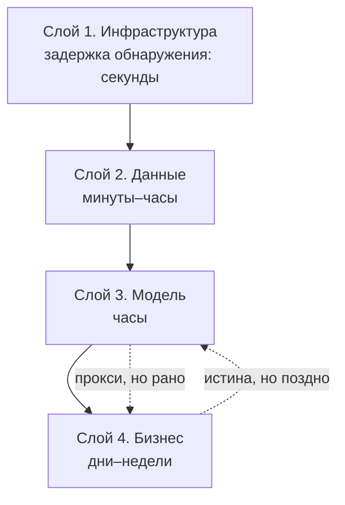

# Что мониторить в ML-системе

> **Зачем эта глава.** ML-система ломается тихо: сервис отдаёт 200 OK, латентность в норме,
> дашборды зелёные — а модель уже месяц предсказывает мусор. Здесь: четыре слоя наблюдаемости
> с конкретными метриками и порогами; как построить SLI/SLO там, где главную метрику качества
> нельзя измерить в реальном времени; кто на что смотрит; почему попытка мониторить всё
> заканчивается тем, что не мониторится ничего; и как не убить дежурного алертами.

**Уровень:** 🎯 middle → 🧠 middle+
**Предварительно нужно:** [архитектуры сервинга](../07-mlops/05-serving-architectures.md), [жизненный цикл ML-системы](../07-mlops/01-ml-lifecycle.md), [метрики качества](../02-classic-ml/04-metrics.md)
**Как проработать:** чтение + разбор своего сервиса по чек-листу

---

## Карта главы

- [1. Почему ML ломается тихо](#1-почему-ml-ломается-тихо)
- [2. Четыре слоя наблюдаемости](#2-четыре-слоя-наблюдаемости)
- [3. SLI и SLO: и почему для ML привычная схема ломается](#3-sli-и-slo-и-почему-для-ml-привычная-схема-ломается)
- [4. Иерархия метрик: кто на что смотрит](#4-иерархия-метрик-кто-на-что-смотрит)
- [5. Почему нельзя мониторить всё](#5-почему-нельзя-мониторить-всё)
- [6. Как выбирать, что алертить](#6-как-выбирать-что-алертить)
- [7. Усталость от алертов и борьба с ней](#7-усталость-от-алертов-и-борьба-с-ней)
- [8. Сводная таблица: метрика → порог → кто реагирует → что делает](#8-сводная-таблица-метрика--порог--кто-реагирует--что-делает)
- [9. Подводные камни](#9-подводные-камни)
- [10. Проверь себя](#10-проверь-себя)
- [11. Практика](#11-практика)
- [12. Что читать дальше](#12-что-читать-дальше)

---

## 1. Почему ML ломается тихо

Обычный backend-сервис ломается громко. Упал — отдаёт 500, и это видно в первую же минуту.
Замедлился — растёт p99, и это видно во вторую. У поломки есть **симптом, который система
умеет отличить от нормы**.

ML-сервис устроен иначе, и это главная мысль всей главы. Возьмём реальный сценарий.

Модель скоринга заявок на кредит работает год. В пятницу вечером апстрим-команда меняет
формат поля `income`: раньше приходили рубли (`85000`), теперь — тысячи рублей (`85`).
Ни одна проверка типа не падает: это по-прежнему число. Сервис отдаёт 200 OK за 18 мс,
пятиминутки в Grafana ровные, дежурный спокоен. А модель теперь считает, что все заявители —
нищие: скор поехал вниз, доля одобрений упала с 34% до 6%.

Сколько это будет продолжаться? Ровно до того момента, пока кто-то не посмотрит на бизнес-метрику.
Если это недельный отчёт продакта — семь дней. За семь дней вы отказали примерно
`7 × дневной_поток × 0.28` хорошим клиентам. При потоке 20 тысяч заявок в день — 39 тысяч
отказов, которых не должно было быть.

Разберём, что именно здесь произошло, потому что это шаблон всех ML-инцидентов:

1. **Изменение произошло вне вашего кода.** Ваш git-лог чист, деплоя не было. Классические
   инструменты «что менялось?» бесполезны.
2. **Все технические проверки прошли.** Тип верный, диапазон формально верный
   (85 — допустимый доход), пропусков нет.
3. **Модель не умеет сказать «я не знаю».** Она обязана выдать число на любой вход,
   и она его выдаёт — уверенно и неправильно.
4. **Правильный ответ неизвестен в момент предсказания.** Узнаете вы его через месяцы,
   когда выданные (или не выданные) кредиты начнут гаситься.

Пункт 4 — сердцевина проблемы и то, из-за чего мониторинг ML нельзя свести к мониторингу
сервиса. Классический сервис можно проверить: отправил запрос — знаешь, каким должен быть ответ.
Для модели «правильного ответа» не существует до наступления события, которое она предсказывает.
Это называется **задержка разметки** (label delay), и она задаёт нижнюю границу того,
как быстро вы вообще способны узнать о деградации качества.

| Задача | Когда становится известна метка | Реалистичная задержка |
|---|---|---|
| CTR баннера / клик по рекомендации | сразу или в течение сессии | секунды–минуты |
| Конверсия в заказ | до конца сессии/суток | часы–сутки |
| Прогноз времени доставки | по факту доставки | часы–дни |
| Отток подписчика (30-дневное окно) | через окно | 30+ дней |
| Фрод по карте | по чарджбэку | 30–90 дней |
| Дефолт по кредиту | по графику платежей | 3–12 месяцев |

Отсюда вывод, который надо запомнить дословно: **мониторинг ML — это в первую очередь
мониторинг того, что можно измерить мгновенно, в качестве прокси для того, что измерить
мгновенно нельзя.** Всё, что мы дальше строим — слои, SLI, алерты — это система ранних
сигналов, которые срабатывают раньше, чем приедет разметка.

> 💬 **На собеседовании.** Спросят: «Модель в проде. Что вы будете мониторить?»
> Хороший ответ: «Начну с того, что качество модели я узнаю не сразу — в этой задаче метка
> приходит через N дней. Поэтому строю четыре слоя: инфраструктура (доступность, латентность,
> ошибки), данные на входе (свежесть, полнота, схема, распределения), поведение модели
> (распределение предсказаний, доля фолбэков, версия), бизнес (конверсия, guardrail-метрики).
> Первые три доступны в реальном времени и служат ранними сигналами; четвёртый — истина,
> но с задержкой. Алерты вешаю на слои 1 и 3, дрифт данных — в тикет, качество — в
> еженедельный отчёт по мере поступления разметки».
> Плохой ответ: «мониторю accuracy и latency» — accuracy в реальном времени посчитать
> обычно нельзя, и это первое, что проверяет интервьюер.

---

## 2. Четыре слоя наблюдаемости

Слои упорядочены не по важности, а **по скорости, с которой в них проявляется проблема**.
Сигнал идёт снизу вверх: сначала ломается инфраструктура или данные, потом это отражается
на предсказаниях, и только в конце — на деньгах.



Полезное следствие из схемы: чем ниже слой, тем **быстрее** сигнал и тем **слабее** его связь
с реальным ущербом. Алерт на инфраструктуру срабатывает за секунды, но половина срабатываний
безобидна. Бизнес-метрика не врёт никогда, но к моменту, когда она просела статистически
значимо, вы уже потеряли деньги.

### Слой 1. Инфраструктура и сервис

Это то, что умеет любая SRE-команда, и то, что ML-инженеры часто отдают на откуп платформе —
зря, потому что у ML-сервисов есть свои специфические поломки.

| Метрика | Как считать | Порог, при котором стоит шевелиться |
|---|---|---|
| Доступность (успешные / валидные ответы) | `1 - rate(5xx)/rate(all)` | зависит от SLO, типично 99.5–99.9% |
| Латентность p50 / p95 / p99 | гистограмма Prometheus с бакетами под SLA | p99 > бюджета (например 200 мс) |
| RPS и его отклонение от суточного профиля | `rate(requests_total[5m])` vs `offset 7d` | падение > 40% или рост > 200% |
| CPU throttling | `container_cpu_cfs_throttled_seconds_total` | > 5% времени |
| Память / OOMKilled | `container_memory_working_set_bytes`, рестарты | > 85% лимита |
| Утилизация GPU | `DCGM_FI_DEV_GPU_UTIL` | < 30% (деньги на ветер) или > 95% (нет запаса) |
| Глубина очереди инференса | своя gauge-метрика | растёт монотонно 2+ минуты |
| Рестарты подов | `kube_pod_container_status_restarts_total` | > 0 за 15 мин на здоровом релизе |

Специфика ML здесь в двух вещах. Во-первых, **латентность инференса и латентность запроса —
разные метрики**, и мерить надо обе: если общая выросла, а инференс нет, виноват поход
в feature store или сеть. Во-вторых, для GPU-сервисов CPU-метрики почти ничего не говорят,
нужен экспортёр DCGM.

### Слой 2. Данные на входе

Самый урожайный слой: по опыту большинства команд, **основная доля ML-инцидентов — это
инциденты данных**, а не моделей. Подробно проверки разбираются в
[следующей главе](02-data-quality.md), здесь — что из них выносится в мониторинг.

| Метрика | Формулировка | Типичный порог |
|---|---|---|
| Свежесть (freshness) | `now() - max(event_time)` в таблице признаков | > 2× обычного интервала обновления |
| Объём (volume) | число строк за окно относительно того же окна неделю назад | отклонение > 30% |
| Полнота (completeness) | доля `NULL` по каждому ключевому признаку | рост доли пропусков > 5 п.п. |
| Схема | набор колонок и типов против зафиксированного контракта | любое изменение |
| Диапазоны | доля значений вне `[min, max]` из обучающей выборки | > 1% |
| Новые категории | доля значений категориального признака, не встречавшихся в обучении | > 2% |
| Дубли | доля строк с повторяющимся первичным ключом | > 0.1% |
| Дрифт распределения | PSI / KS относительно обучающей выборки — см. [главу про дрифт](03-drift-detection.md) | PSI > 0.2 |

Практический совет: мониторить **не все признаки, а топ по важности**. Если в модели
400 признаков, полноценные распределения по всем — это тысячи временных рядов и никакого
внимания. Берите топ-20 по SHAP/gain плюс все признаки, которые приходят из внешних источников
(они ломаются чаще всего), — это покрывает 90% реальных инцидентов при 5% стоимости.

### Слой 3. Поведение модели

Здесь мы наблюдаем за **выходом** модели — единственным, что доступно мгновенно и напрямую
связано с качеством.

| Метрика | Зачем | Типичный порог |
|---|---|---|
| Средний скор / распределение предсказаний | самый чувствительный ранний сигнал: сдвиг входа почти всегда сдвигает выход | отклонение среднего > 3σ от скользящего базлайна за 7 дней |
| Доля предсказаний выше порога решения | напрямую переводится в бизнес («доля одобрений») | отклонение > 20% относительно недели назад |
| Доля деградированных ответов (`degraded=true`) | фичи не доехали, подставлены дефолты | > 2% — тикет, > 10% — page |
| Доля фолбэков на упрощённую модель | таймауты, недоступность | > 1% |
| Версия модели и число версий в трафике | ловит «выкатили не то» и застрявший rollout | версий > 2 дольше 30 минут |
| Доля входов, отклонённых валидацией | контракт нарушен | > 0.5% |
| Энтропия/уверенность предсказаний | падение уверенности бывает раньше падения качества | сдвиг медианы > 15% |
| Отложенное качество (ROC-AUC, MAE и т.д.) | истина | падение > 5% относительно офлайн-оценки |

Про последнюю строку: она считается не в реальном времени, а джобой, которая догоняет
пришедшую разметку. Логика такая: раз в сутки берём предсказания, для которых **уже
наступил горизонт**, джойним с фактом, считаем метрику, кладём в ту же систему метрик.
Точка на графике «AUC за 3 июля» появляется 3 августа, если горизонт 30 дней. Это нормально,
и график всё равно полезен — просто вы смотрите на него как на историю, а не как на пульс.

> ⚠️ **Типичная ошибка.** Считать отложенную метрику по всем предсказаниям, для которых
> метка уже есть. Это систематическое смещение: метки приходят быстрее для «лёгких» случаев
> (клик случается сразу, чарджбэк — через два месяца), поэтому свежий срез состоит
> преимущественно из быстрых событий и врёт в оптимистичную сторону. Правильно: фиксировать
> горизонт и брать только когорты, для которых он полностью истёк.

### Слой 4. Бизнес

Единственный слой, ради которого всё остальное существует. Делится на две группы.

**Целевые метрики** — то, что модель должна двигать: конверсия, CTR, GMV на сессию,
средний чек, доля пойманного фрода, время до ответа оператора.

**Guardrail-метрики** — то, что модель не должна ломать, даже если целевую двигает.
Их пропуск — классическая ошибка: рекомендательная модель подняла CTR на 4% за счёт кликбейта,
а доля возвратов выросла на 1.5 п.п. и съела эффект вдвое. Типичные guardrail: доля жалоб,
возвраты, отписки, доля ручных разборов, разнообразие выдачи, доля пользователей,
не получивших ни одной рекомендации, метрики справедливости по сегментам.

Ключевая техническая деталь: бизнес-метрики **шумные**, и на них почти нельзя ставить алерты
в обычном смысле. Дневная конверсия колеблется на ±5% просто так. Чтобы поймать реальное
падение на 3%, нужны либо недели наблюдений, либо holdout-группа. Отсюда практика:
**держать постоянный holdout 1–5% трафика на старой модели или на простом бейзлайне**.
Сравнение «модель против holdout» на порядок чувствительнее, чем сравнение «сегодня против
вчера», потому что съедает общий сезонный шум. Подробнее — в
[дизайне экспериментов](../06-ab-testing/01-experiment-design.md).

---

## 3. SLI и SLO: и почему для ML привычная схема ломается

**SLI** (Service Level Indicator) — измеримый показатель качества сервиса, обычно доля
«хороших» событий:

$$
\text{SLI} = \frac{N_{\text{good}}}{N_{\text{valid}}}
$$

где $N_{\text{good}}$ — число событий, признанных успешными по явному критерию,
$N_{\text{valid}}$ — число событий, вообще подлежащих учёту (запросы от бота или health-check
в знаменатель не входят).

**SLO** (Service Level Objective) — целевое значение SLI на горизонте: «доля успешных
ответов ≥ 99.9% за 28 дней».

Из SLO выводится **бюджет ошибок** (error budget) — сколько «плохих» событий вам разрешено:

$$
B = (1 - \text{SLO}) \cdot N_{\text{valid}}
$$

При SLO = 99.9% и 100 млн запросов за 28 дней бюджет — 100 000 неудачных ответов, то есть
примерно 40 минут полного простоя за месяц. Это не абстракция, а инструмент переговоров:
пока бюджет не исчерпан, команда катит фичи; исчерпали — замораживаем релизы и чиним надёжность.

**Скорость сжигания** (burn rate) — во сколько раз быстрее нормы тратится бюджет:

$$
\text{BR} = \frac{\text{доля плохих событий за окно}}{1 - \text{SLO}}
$$

BR = 1 означает, что при такой интенсивности бюджет закончится ровно к концу периода.
BR = 14.4 означает, что за час сгорит 2% месячного бюджета — это уже инцидент.

Отсюда стандартная схема **алертов по нескольким окнам** (multi-window multi-burn-rate),
которая заменяет наивное «алертить, если error rate > 1%»:

| Длинное окно | Короткое окно | Burn rate | Сгорит бюджета | Действие |
|---|---|---|---|---|
| 1 час | 5 минут | 14.4 | 2% за час | page — будим дежурного |
| 6 часов | 30 минут | 6 | 5% за 6 часов | page |
| 3 дня | 6 часов | 1 | 10% за 3 дня | ticket — разбор в рабочее время |

Смысл двух окон: длинное задаёт значимость (проблема действительно масштабная),
короткое обеспечивает быстрое снятие алерта после починки. Одно длинное окно даёт алерт,
который «залипает» на часы после устранения; одно короткое — шквал ложных срабатываний
на каждом всплеске.

```yaml
# prometheus/rules/ml-slo.yml — SLO 99.9% на успешность скоринга
groups:
  - name: scoring-slo
    rules:
      # Recording rule: считаем долю плохих один раз, используем в четырёх местах
      - record: job:scoring_error_ratio:rate5m
        expr: |
          sum(rate(inference_requests_total{status=~"5..|timeout"}[5m]))
            / sum(rate(inference_requests_total[5m]))
      - record: job:scoring_error_ratio:rate1h
        expr: |
          sum(rate(inference_requests_total{status=~"5..|timeout"}[1h]))
            / sum(rate(inference_requests_total[1h]))

      - alert: ScoringErrorBudgetBurnFast
        expr: |
          job:scoring_error_ratio:rate1h  > (14.4 * 0.001)
          and
          job:scoring_error_ratio:rate5m  > (14.4 * 0.001)
        for: 2m
        labels:
          severity: page
        annotations:
          summary: "Скоринг сжигает бюджет ошибок в 14.4× — 2% месячного за час"
          runbook_url: "https://wiki.internal/runbooks/scoring-5xx"
```

### Чем SLO ML-сервиса отличается от SLO обычного сервиса

Теперь главное. Схема выше прекрасно работает для доступности и латентности — потому что
успешность запроса известна **в момент запроса**. Для качества модели это неверно, и вся
конструкция «SLI → бюджет → burn rate → алерт» рассыпается: нельзя алертить по скорости
сжигания метрики, которая станет известна через месяц.

Практический выход — **разделить SLO на два класса**.

**Быстрые SLI (fast SLI)** — измеримы мгновенно, на них строится дежурство и бюджет ошибок:

| SLI | Определение «хорошего события» | Типичное SLO |
|---|---|---|
| Доступность скоринга | ответ 2xx | 99.9% за 28 дней |
| Латентность | ответ быстрее 200 мс | 99% за 28 дней |
| Полнота признаков | ответ посчитан на полном наборе фич, без дефолтов | 98% за 28 дней |
| Свежесть данных | признаки на момент запроса не старше 60 минут | 99% за 28 дней |
| Покрытие | сервис вернул непустой результат (для рекомендаций) | 99.5% |

**Медленные SLI (slow SLI)** — про качество, измеряются по мере поступления разметки,
на них нельзя дежурить, но можно ставить регулярный контроль:

| SLI | Определение | Типичное SLO | Как проверяется |
|---|---|---|---|
| ROC-AUC на когорте | AUC на предсказаниях, для которых истёк горизонт | ≥ 0.78 (при офлайн 0.82) | джоба раз в сутки |
| Калибровка | \|средний скор − доля событий\| в каждом дециле | ≤ 0.03 | джоба раз в неделю |
| Качество на защищённых сегментах | AUC не ниже общего минус 0.03 на каждом сегменте > 1% трафика | — | джоба раз в неделю |

И ключевая величина, которую надо уметь назвать на собеседовании, — **время до обнаружения
деградации качества**:

$$
T_{\text{обн}} = T_{\text{метка}} + T_{\text{накоп}} + T_{\text{подтв}}
$$

где $T_{\text{метка}}$ — задержка разметки (горизонт события), $T_{\text{накоп}}$ — время,
за которое накапливается выборка, достаточная, чтобы падение метрики было статистически
различимо, $T_{\text{подтв}}$ — окно подтверждения, чтобы не среагировать на однодневный шум
(обычно 1–3 дня).

**Разбор на числах.** Антифрод: горизонт чарджбэка 45 дней; чтобы отличить падение AUC
с 0.90 до 0.87 при доле фрода 0.3%, нужно порядка 30 тысяч размеченных транзакций,
что при 200 тысячах транзакций в сутки набирается меньше чем за день; подтверждение — 2 дня.
Итого $T_{\text{обн}} \approx 45 + 1 + 2 = 48$ дней. Сорок восемь дней — это неприемлемо,
и именно это число оправдывает всю конструкцию из ранних сигналов: дрифт входа, сдвиг
распределения предсказаний, доля срабатываний правил, ручные разборы аналитиков. Ни один
из них не является качеством, но каждый доступен сегодня.

> 💬 **На собеседовании.** Спросят: «Чем SLO для ML-сервиса отличается от SLO обычного
> сервиса?»
> Хороший ответ: «Технические SLI — доступность, латентность — считаются одинаково,
> и на них работает стандартная схема с бюджетом ошибок и multi-burn-rate алертами.
> Ломается качественный SLI: в обычном сервисе успех запроса известен сразу, а качество
> предсказания — только с приходом разметки, от минут до месяцев. Поэтому я держу два класса
> SLO: быстрые (доступность, латентность, доля деградаций, свежесть фич) — на них дежурство
> и бюджет ошибок; медленные (AUC, калибровка на когортах) — на них регулярная джоба
> и ревью, а не пейджер. И отдельно считаю время до обнаружения деградации: если оно
> измеряется неделями, значит нужны прокси-сигналы, иначе мониторинга качества фактически нет».
> Плохой ответ: «SLO для ML — это accuracy ≥ 0.9».

---

## 4. Иерархия метрик: кто на что смотрит

Одна и та же метрика для разных людей — либо сигнал к действию, либо шум. Разводить это надо
явно, иначе дежурного будят графиком PSI, а продакт смотрит на throttling подов.

**Уровень 0 — дежурный (on-call).** Часто это человек не из ML-команды, у него ночь и десять
сервисов. Ему можно показывать **только симптомы, видимые пользователю, и только те,
по которым есть runbook**: сервис недоступен, латентность выше SLO, пайплайн признаков
не отработал, доля деградированных ответов выше 10%, в трафике три версии модели вместо одной.
Всё. Он не должен разбираться, хорошо это или плохо — он должен открыть runbook и выполнить
шаги: откатить, включить фолбэк, эскалировать владельцу.

**Уровень 1 — ML-инженер (владелец модели).** Смотрит дрифт входов и предсказаний,
свежесть и полноту данных, отложенное качество, калибровку, разбивку по сегментам,
динамику доли фолбэков. Реагирует в рабочее время, в тикетах. Отдельно — **еженедельный
ритуал**: 30 минут глазами по дашборду модели, даже если алертов не было. Это единственный
надёжный способ поймать медленные деградации, которые по определению не пробивают порог.

**Уровень 2 — продакт и аналитик.** Целевые и guardrail-метрики, срезы по сегментам,
результаты A/B и holdout. Горизонт — неделя и больше. Им не нужны ни p99, ни PSI; им нужен
ответ «модель приносит деньги и не ломает пользовательский опыт».

**Уровень 3 — расследование.** Логи запросов с признаками и предсказаниями, трейсы,
сохранённые входы для конкретного пользователя. Это не мониторится и не алертится, это
поднимается руками, когда инцидент уже случился (см. [стек наблюдаемости](05-observability-stack.md)
и [инциденты](06-incidents-and-runbooks.md)).

Правило, которое стоит записать в командную вики: **у каждого дашборда есть один владелец
и один вопрос, на который он отвечает.** Дашборд без вопроса превращается в стену из
сорока графиков, на которую никто не смотрит.

> 💬 **На собеседовании.** Спросят: «Кто должен реагировать, если вырос PSI по признаку?»
> Хороший ответ: «Не дежурный. PSI — это не симптом, а гипотеза о причине, по ней нет
> однозначного действия ночью: дрифт может быть безобидным (маркетинг привёл новую аудиторию)
> или фатальным (апстрим сменил единицы измерения). Поэтому PSI идёт тикетом владельцу модели
> с SLA на разбор в один рабочий день. Пейджером будят только то, что видит пользователь:
> недоступность, латентность, массовые деградированные ответы. Если дрифт совпал с падением
> доли одобрений на 20% — тогда срабатывает уже второй алерт, и он действительно page,
> потому что там есть действие: откат на предыдущую версию модели».
> Плохой ответ: «алертить всё, что вылезло за 3σ, дежурный разберётся».

---

## 5. Почему нельзя мониторить всё

Есть три независимых ограничения, и каждое из них — жёсткое.

**Ограничение первое: деньги и железо.** Prometheus хранит метрики как временные ряды,
и стоимость определяется числом **активных серий** (уникальных комбинаций имени и меток).
Порядки, которые полезно помнить: одна активная серия занимает примерно 2–4 КБ оперативной
памяти в TSDB (сама серия, индекс, текущий чанк), а на диске один сэмпл после сжатия —
порядка 1.5–2 байт.

Посчитаем на реальном примере. Гистограмма латентности с метками
`endpoint` (10) × `model_version` (3) × `status` (5) даёт 150 комбинаций. Гистограмма
с 12 бакетами разворачивается в 12 + 2 (`_sum`, `_count`) = 14 серий на комбинацию,
итого 2100 серий на под. На 40 подах — 84 000 серий. Это нормально: ~250 МБ RAM,
при скрейпе раз в 15 секунд — 84000 × 5760 сэмплов/сутки × 2 байта ≈ 1 ГБ в сутки.

А теперь добавим в метку `user_segment` с 500 значениями. 84 000 × 500 = 42 млн серий:
примерно 130 ГБ RAM и 480 ГБ диска в сутки. Prometheus такого не переживёт. Это называется
**взрыв кардинальности** (cardinality explosion), и вызывает его почти всегда одно и то же:
метка с высокой мощностью — `user_id`, `request_id`, `query`, `item_id`, необрезанный
текст ошибки.

Правило: **метка не должна иметь больше нескольких десятков значений**. Всё, что нужно
резать по пользователю или запросу, живёт в логах и трейсах, а не в метриках.

**Ограничение второе: внимание человека.** Дашборд, на который смотрят в инциденте, должен
читаться за 30 секунд. Это 8–12 графиков, не больше. Всё остальное — второй экран,
который открывают по ссылке из первого. Сорок графиков на одном экране — это способ
гарантированно не заметить тот, который просел.

**Ограничение третье: сопровождение.** Каждая метрика и каждый алерт — это код, который
надо поддерживать. Метрика, которую никто не смотрел полгода, при рефакторинге тихо ломается,
и в следующий инцидент вы смотрите на график, который врёт. Раз в квартал полезно удалять
алерты, которые ни разу не срабатывали, и алерты, которые срабатывали, но всегда игнорировались.

Практический критерий, что метрику стоит заводить: **вы можете назвать вопрос, на который
она отвечает, и действие, которое вы предпримете при её изменении.** Не можете — не заводите.

---

## 6. Как выбирать, что алертить

Метрики и алерты — разные вещи. Метрик может быть сотни, алертов — единицы.

Проверьте кандидата в алерты четырьмя вопросами:

1. **Видит ли это пользователь (или деньги)?** Если нет — это не page, максимум тикет.
   Занятость диска на 60% пользователь не видит. Пятисотки видит.
2. **Есть ли действие?** Если на алерт нет ответа «что делать», он бесполезен по определению.
   У каждого page-алерта обязателен `runbook_url` со списком шагов.
3. **Нужно ли действовать сейчас?** Всё, что подождёт до утра, — тикет. Ночной пейджер
   стоит дорого: разбуженный человек делает больше ошибок, и следующий день он работает хуже.
4. **Сработает ли он раньше пользователя?** Алерт, приходящий позже жалобы в поддержку,
   не нужен.

**Симптом против причины.** Алертим на симптомы, диагностируем по причинам. «Латентность
выше SLO» — симптом, годится в алерт. «Утилизация CPU 85%» — причина, в алерт не годится:
при хорошо настроенном сервисе 85% CPU могут быть нормой, а при плохо настроенном
латентность вырастет и при 40%. Причины живут на дашборде, куда дежурный приходит
по ссылке из алерта.

**Как выбирать сам порог.** Три способа, в порядке убывания качества:

1. **Из SLO.** Лучший вариант: порог не выдуман, а выведен из обязательства перед
   пользователем (см. burn rate в [§3](#3-sli-и-slo-и-почему-для-ml-привычная-схема-ломается)).
2. **Из исторической статистики.** Соберите значения метрики за 4–8 недель, посчитайте
   квантили по времени суток и дню недели, поставьте порог на уровне, который за это время
   пробивался не чаще одного-двух раз. Обязательно с учётом сезонности: ночной трафик
   в 5 раз ниже дневного, и статический порог по RPS будет орать каждую ночь.
3. **Экспертно, из физики процесса.** «Доля одобрений не может измениться за час больше
   чем на 20%, потому что портрет заявителя так быстро не меняется» — нормальное
   обоснование.

И обязательный элемент любого алерта — **параметр `for`** (время удержания). Мгновенное
пробитие порога почти всегда шум: сборка мусора, деплой, всплеск на 10 секунд. Разумные
значения: 2–5 минут для латентности и ошибок, 10–15 минут для доли деградаций,
30–60 минут для метрик данных.

```yaml
# Плохой алерт: причина, а не симптом; нет действия; сработает каждую ночь
- alert: HighCPU
  expr: rate(container_cpu_usage_seconds_total[5m]) > 0.8

# Хороший алерт: симптом, виден пользователю, с окном удержания и runbook
- alert: ScoringLatencySLOBreach
  expr: |
    histogram_quantile(
      0.99,
      sum(rate(inference_latency_seconds_bucket[5m])) by (le)
    ) > 0.2
  for: 5m
  labels:
    severity: page
  annotations:
    summary: "p99 скоринга {{ $value | humanizeDuration }} при бюджете 200 мс"
    runbook_url: "https://wiki.internal/runbooks/scoring-latency"

# Хороший алерт данных: тикет, а не пейджер; окно длинное, потому что метрика медленная
- alert: FeatureFreshnessStale
  expr: time() - max(feature_table_last_success_timestamp_seconds{table="user_agg_1h"}) > 7200
  for: 15m
  labels:
    severity: ticket
  annotations:
    summary: "Таблица user_agg_1h не обновлялась 2 часа при интервале 1 час"
    runbook_url: "https://wiki.internal/runbooks/feature-freshness"
```

---

## 7. Усталость от алертов и борьба с ней

**Усталость от алертов** (alert fatigue) — состояние, в котором дежурный перестаёт читать
алерты, потому что 90% из них ничего не значат. Это не проблема дисциплины, а проблема
дизайна: человек физически не может сохранять бдительность на потоке ложных срабатываний.

Измеряется она одним числом — **точностью алертов** (alert precision):

$$
P = \frac{A_{\text{действие}}}{A_{\text{всего}}}
$$

где $A_{\text{действие}}$ — число срабатываний, после которых человек что-то реально сделал
(починил, откатил, эскалировал), $A_{\text{всего}}$ — общее число срабатываний. Целевое
значение — **$P \ge 0.5$, хорошее — 0.8**. Если у вас $P = 0.1$, у вас нет мониторинга:
у вас есть генератор шума, из-за которого настоящий инцидент будет пропущен.

Второе число — **частота пейджеров на смену**. Практическая граница, при которой дежурство
остаётся работоспособным, — **не больше двух ночных пробуждений за смену**. Больше —
и вы получаете человека, который на третий раз глушит уведомления.

Что с этим делают на практике:

**Убрать всё, что не page, из пейджера.** Три канала: `page` (звонок, немедленно),
`ticket` (задача владельцу, SLA один рабочий день), `dashboard` (только график, никаких
уведомлений). Дефолт для новой метрики — `dashboard`, повышение уровня требует обоснования.

**Группировать и подавлять.** Alertmanager умеет и то и другое, и это надо настроить сразу:

```yaml
# alertmanager.yml — группировка и подавление
route:
  group_by: ['alertname', 'service']
  group_wait: 30s          # копим 30 с, чтобы 40 подов не дали 40 уведомлений
  group_interval: 5m       # повторное уведомление по группе не чаще раза в 5 минут
  repeat_interval: 4h      # напоминание о неустранённом — раз в 4 часа, не чаще
  routes:
    - matchers: [severity = "ticket"]
      receiver: jira
    - matchers: [severity = "page"]
      receiver: pagerduty

inhibit_rules:
  # Если сервис недоступен целиком, не шлём отдельно про латентность и дрифт —
  # это следствия, а не независимые проблемы.
  - source_matchers: [alertname = "ScoringDown"]
    target_matchers: [service = "scoring"]
    equal: ['service']
```

**Заглушать на время известных событий.** Деплой, ночное окно обслуживания, плановый
backfill — на них ставится silence. Алерт, который гарантированно срабатывает при каждом
релизе, — это не алерт, это ритуал.

**Ретроспектива алертов раз в месяц.** Выгружаете все срабатывания, по каждому отвечаете:
привело ли к действию? Не привело ни разу за месяц — поднимаем порог, увеличиваем `for`
или удаляем. Это скучная работа, которую почти никто не делает, и именно она отличает
рабочий мониторинг от декоративного.

**Не заводить алерт на метрику, которую вы не понимаете.** Классика: команда включила
детектор дрифта на 40 признаках с порогом PSI > 0.1 и получила 15 срабатываний в день,
из которых ноль потребовали действий. Через неделю канал замьютили — вместе с реальным
дрифтом, который туда же прилетел через месяц.

> 💬 **На собеседовании.** Спросят: «У команды 200 алертов в неделю и все на них забили.
> Ваши действия?»
> Хороший ответ: «Сначала измерю: выгружу срабатывания за месяц и посчитаю, какая доля
> привела к действию — это точность алертов, целюсь в 0.5+. Дальше по Парето: обычно 5 правил
> дают 80% шума, их чиню в первую очередь — поднимаю порог по историческим квантилям
> с учётом суточной сезонности, добавляю `for`, включаю группировку и inhibit, чтобы падение
> сервиса не порождало каскад из следствий. Всё, что не видно пользователю, перевожу
> из пейджера в тикеты. Каждому оставшемуся page-алерту прописываю runbook — если runbook
> написать не удаётся, алерт не нужен. И ввожу ежемесячную ретроспективу, иначе через полгода
> всё вернётся».
> Плохой ответ: «настроим ML-детекцию аномалий, чтобы алерты были умнее» — усложнение
> поверх сломанного процесса.

---

## 8. Сводная таблица: метрика → порог → кто реагирует → что делает

Таблицу можно брать как заготовку для своего сервиса: пороги подгоняются под ваш SLO
и вашу сезонность, но структура и распределение ответственности переносятся почти как есть.

| Слой | Метрика | Порог и окно | Канал | Кто реагирует | Что делает |
|---|---|---|---|---|---|
| Инфра | Доступность (burn rate) | BR > 14.4 на окнах 1 ч и 5 мин, `for: 2m` | page | дежурный | runbook: проверить рестарты и зависимости, откатить последний деплой |
| Инфра | p99 латентности | > 200 мс, `for: 5m` | page | дежурный | проверить очередь и throttling, добавить реплик, включить фолбэк |
| Инфра | Рестарты подов | > 3 за 15 мин | page | дежурный | посмотреть код выхода: 137 → память, 1 → падение при старте; откат |
| Инфра | Утилизация GPU | < 30% сутки | dashboard | ML-инженер | пересмотреть батчинг и число реплик, это чистые деньги |
| Данные | Свежесть таблицы фич | > 2× интервала обновления, `for: 15m` | ticket, page если > 6 ч | дата-инженер | перезапустить DAG, проверить апстрим; при page — включить деградированный режим |
| Данные | Объём строк | отклонение > 30% от того же дня недели | ticket | дата-инженер | проверить фильтры и джойны в апстриме |
| Данные | Схема изменилась | любое расхождение с контрактом | page на входе обучения, ticket на инференсе | владелец пайплайна | остановить обучение; на инференсе — проверить, попала ли новая колонка в модель |
| Данные | Доля пропусков по топ-фиче | +5 п.п. к базлайну, окно 1 ч | ticket | ML-инженер | найти источник; оценить, насколько дефолты искажают скор |
| Данные | Дубли по первичному ключу | > 0.1% | ticket | дата-инженер | искать ретраи и повторную доставку событий |
| Данные | PSI по топ-20 фич | > 0.2, окно 1 сутки | ticket | ML-инженер | разобрать причину; при подтверждении — переобучение |
| Модель | Доля деградированных ответов | > 2% ticket / > 10% page, `for: 10m` | ticket / page | дежурный, затем ML-инженер | найти отвалившуюся зависимость; оценить долю трафика на дефолтах |
| Модель | Средний скор | сдвиг > 3σ скользящего базлайна за 7 дней | ticket | ML-инженер | сверить с дрифтом входов; проверить версию модели |
| Модель | Доля решений выше порога | отклонение > 20% к неделе назад, окно 1 ч | page | дежурный | это прямой бизнес-эффект: откат модели, эскалация владельцу |
| Модель | Версий в трафике > 2 | дольше 30 мин | ticket | релиз-инженер | застрявший rollout, добить или откатить |
| Модель | Отложенное качество (AUC) | падение > 5% к офлайн-оценке | ticket | ML-инженер | сегментный разбор, план переобучения |
| Бизнес | Целевая метрика vs holdout | падение > 3% при p < 0.05 | ticket | продакт + ML-инженер | решение об откате модели |
| Бизнес | Guardrail (возвраты, жалобы) | рост > 1 п.п. за неделю | ticket | продакт | пересмотр порога/бизнес-правил |
| Бизнес | Доля ручных разборов | рост > 30% за сутки | ticket | операционная команда | сигнал деградации задолго до разметки |

> 🧠 **Middle+.** Обратите внимание на строку «доля решений выше порога» — она единственная
> в слое модели помечена как page. Это осознанно: доля одобрений/блокировок напрямую
> переводится в деньги и в жалобы пользователей, реагировать надо в течение часа, и действие
> очевидно — откат. Пример из [§1](#1-почему-ml-ломается-тихо) (доход в тысячах вместо рублей) ловится именно ей: PSI
> сработал бы тоже, но в тикет; латентность и ошибки не сработали бы вовсе. Если в вашем
> мониторинге ML-слоя есть ровно один алерт, пусть это будет он.

---

## 9. Подводные камни

**Все дашборды зелёные, а модель месяц выдаёт мусор.**
Симптом: технические метрики в норме, бизнес-метрика просела, никто не заметил.
Причина: мониторится только слой инфраструктуры; вход и выход модели не наблюдаются.
Что делать: минимальный набор из слоя 3 — распределение предсказаний, доля решений выше
порога, доля деградаций. Это три метрики и один день работы, и они ловят большинство
«тихих» инцидентов.

**Алерт по RPS орёт каждую ночь.**
Симптом: срабатывание ровно в 03:00 ежедневно, дежурный завёл silence навсегда.
Причина: статический порог на сезонной метрике; ночной трафик в 5 раз ниже дневного.
Что делать: сравнивать с собой же неделю назад (`offset 7d` в PromQL, порог на относительное
отклонение), а не с константой; либо вообще не алертить на RPS, а алертить на симптом,
который RPS вызывает.

**Prometheus упал после добавления «полезной» метки.**
Симптом: OOM у Prometheus, потеря истории, `too many samples` в ответах.
Причина: взрыв кардинальности — в метку попал идентификатор высокой мощности
(`user_id`, `request_id`, текст ошибки, `query`).
Что делать: убрать метку; правило «не больше нескольких десятков значений на метку»;
проверять кандидатов запросом `topk(20, count by (__name__)({__name__=~".+"}))`;
детализация по пользователю — в логи и трейсы.

**Метрика качества модели «прыгает» день ото дня на 10%.**
Симптом: график AUC нестабилен, непонятно, деградация это или шум.
Причина: слишком маленькая когорта в дневном окне (например, 400 размеченных примеров
при доле позитивов 2% — это 8 позитивов) плюс смещение из-за неистёкшего горизонта.
Что делать: считать на окне, достаточном по числу позитивных примеров (сотни, а лучше
тысячи); фиксировать горизонт; рисовать доверительный интервал бутстрапом рядом с точкой,
тогда видно, шум это или тренд.

**После инцидента добавили 30 алертов, через месяц отключили все.**
Симптом: реакция на постмортем — «давайте покроем всё», через месяц канал замьючен.
Причина: алерты добавлялись без порогов из данных и без runbook, точность близка к нулю.
Что делать: из постмортема добавлять один-два алерта на симптом, который реально
опережал бы инцидент; порог считать по историческим данным; проверять на исторических
данных, сработал бы он тогда и сколько дал бы ложных срабатываний за прошлый месяц.

**Дежурного разбудили алертом про дрифт, он не знал, что делать.**
Симптом: эскалация владельцу в 4 утра, ничего не сделано до утра.
Причина: метрика причины отправлена в пейджер; действия по ней ночью не существует.
Что делать: дрифт — всегда ticket; в page попадают только метрики с готовым действием.

**Метрики врут после перехода на несколько воркеров.**
Симптом: счётчики скачут вверх-вниз, p99 выглядит невозможным.
Причина: каждый uvicorn-воркер — отдельный процесс со своим реестром, Prometheus скрейпит
случайный (детали — в [архитектурах сервинга](../07-mlops/05-serving-architectures.md)).
Что делать: multiprocess-режим `prometheus_client` либо один воркер на под.

**p99 равен ровно границе бакета.**
Симптом: `histogram_quantile` стабильно возвращает 0.5 или 1.0 секунды.
Причина: дефолтные бакеты гистограммы не покрывают реальный диапазон, все наблюдения
попали в один бакет, и квантиль вырождается в его границу.
Что делать: задавать бакеты под свой SLA (вокруг 200 мс, если SLA 200 мс), проверять,
что в каждом бакете есть наблюдения.

---

## 10. Проверь себя

<details>
<summary><b>🎯 Вопрос.</b> Модель выкатили в прод. Что вы будете мониторить и в каком порядке?</summary>

**Короткий ответ.** Четыре слоя: инфраструктура (доступность, латентность, ошибки), данные
на входе (свежесть, полнота, схема, распределения), поведение модели (распределение
предсказаний, доля решений выше порога, доля деградаций, версия), бизнес (целевая метрика
и guardrail). Порядок — по скорости обнаружения: слои 1–3 в реальном времени, слой 4
с задержкой.

**Развёрнуто.** Первым делом надо назвать задержку разметки в этой конкретной задаче:
она определяет, насколько мониторинг качества вообще возможен онлайн. Если метка приходит
через месяц, вся конструкция строится на прокси-сигналах. Минимальный набор, который надо
поднять в первый же день: пятисотки и латентность (без них не поймёшь, работает ли сервис),
распределение предсказаний и доля решений выше порога (ловит «тихие» поломки данных),
доля деградированных ответов (ловит отвалившиеся зависимости), свежесть таблиц признаков.
Дальше добавляются дрифт по топ-20 признакам и отложенное качество по когортам. Каждый
уровень должен иметь адресата: инфраструктура — дежурному, данные и модель — владельцу,
бизнес — продакту.

**Чего ждёт интервьюер:** что вы отделите то, что измеримо мгновенно, от того, что измеримо
с задержкой, и не назовёте accuracy главной прод-метрикой.

**Провал:** «мониторю accuracy и latency» без разговора о задержке разметки.
</details>

<details>
<summary><b>🎯 Вопрос.</b> Что такое SLI, SLO и бюджет ошибок? Посчитайте бюджет для 99.9%.</summary>

**Короткий ответ.** SLI — доля хороших событий среди валидных. SLO — целевое значение SLI
на горизонте. Бюджет ошибок — разрешённое число плохих событий: $(1-\text{SLO}) \cdot N$.
При SLO 99.9% и 100 млн запросов за 28 дней это 100 000 плохих ответов, то есть около
40 минут полной недоступности в месяц.

**Развёрнуто.** Важно уметь объяснить, зачем бюджет нужен: это механизм принятия решений,
а не отчётность. Пока бюджет тратится в норме — команда катит фичи и рискует; исчерпали —
замораживаем релизы и вкладываемся в надёжность. Отсюда же выводятся алерты: вместо
статического «error rate > 1%» используем скорость сжигания $\text{BR} = \text{доля плохих} / (1-\text{SLO})$ на нескольких окнах. BR = 14.4 на окнах 1 час и 5 минут
означает, что за час сгорит 2% месячного бюджета — это page. Два окна нужны, чтобы алерт
и срабатывал быстро, и снимался сразу после починки. Отдельно надо упомянуть знаменатель:
в валидные события не входят health-check, боты и запросы, отклонённые на уровне
аутентификации, иначе SLI меряет не то.

**Чего ждёт интервьюер:** формулу, число в минутах и понимание, что бюджет — это инструмент
управления, а не метрика для отчёта.

**Провал:** путать SLA (юридическое обязательство с санкциями) и SLO (внутренняя цель).
</details>

<details>
<summary><b>🧠 Вопрос.</b> Чем SLO ML-сервиса отличается от SLO обычного бэкенда?</summary>

**Короткий ответ.** Технические SLI одинаковы. Ломается качественный SLI: успех предсказания
неизвестен в момент ответа, он становится известен с задержкой от минут до месяцев,
поэтому на нём нельзя построить бюджет ошибок и дежурство.

**Развёрнуто.** Практическое решение — два класса SLO. Быстрые: доступность, латентность,
доля ответов на полном наборе признаков (без дефолтов), свежесть фич, покрытие
(непустой ответ). На них работает стандартная схема с multi-burn-rate алертами. Медленные:
AUC и калибровка на когортах, для которых горизонт истёк; проверяются джобой и ревью,
уведомление — тикет. Плюс отдельно считается время до обнаружения деградации
$T_{\text{обн}} = T_{\text{метка}} + T_{\text{накоп}} + T_{\text{подтв}}$: если оно
измеряется неделями, значит нужны прокси — дрифт входов, сдвиг распределения предсказаний,
доля ручных разборов, — иначе фактического мониторинга качества нет.

**Чего ждёт интервьюер:** осознания, что отсутствие мгновенной обратной связи — это
структурное свойство ML, ломающее привычную SRE-схему, а не мелкая деталь.

**Провал:** «SLO для ML — это accuracy ≥ 0.9».
</details>

<details>
<summary><b>🎯 Вопрос.</b> Апстрим сменил единицы измерения признака: было в рублях, стало в тысячах. Какие метрики это поймают?</summary>

**Короткий ответ.** Не поймают: типы, схема, доля пропусков, латентность, ошибки. Поймают:
проверка диапазонов относительно обучающей выборки, дрифт распределения признака (PSI/KS),
сдвиг распределения предсказаний и доля решений выше порога решения.

**Развёрнуто.** Это канонический «тихий» инцидент: технически всё корректно, семантически
всё сломано. Самый быстрый и надёжный детектор — доля решений выше порога: она напрямую
переводится в бизнес и не требует ни разметки, ни статистики распределений. Дрифт по признаку
поймает причину, но пороги PSI подобрать сложнее, и он даёт ложные срабатывания. Обучающие
границы `[min, max]` признака — самая дешёвая проверка: доход 85 при обучающем диапазоне
`[10 000, 5 000 000]` попадает вне диапазона, счётчик out-of-range взлетает до 100%.
Долгосрочное лечение — контракт данных с явными единицами измерения и семантической
версией, см. [следующую главу](02-data-quality.md).

**Чего ждёт интервьюер:** понимания, что тип и схема не защищают от семантической поломки,
и знания, какая метрика ловит её быстрее всего.

**Провал:** «проверка схемы поймает» — не поймает, тип не изменился.
</details>

<details>
<summary><b>🎯 Вопрос.</b> Почему нельзя просто мониторить всё подряд?</summary>

**Короткий ответ.** Три ограничения: стоимость хранения (взрыв кардинальности убивает
Prometheus), внимание человека (дашборд читается за 30 секунд — это 8–12 графиков)
и сопровождение (неиспользуемые метрики тихо ломаются и потом врут).

**Развёрнуто.** По стоимости полезно уметь считать. Активная серия — примерно 2–4 КБ RAM,
сэмпл на диске после сжатия — 1.5–2 байта. Гистограмма с 12 бакетами разворачивается
в 14 серий на каждую комбинацию меток. Добавление метки с 500 значениями умножает всё
на 500: 84 тысячи серий превращаются в 42 миллиона, что означает более 100 ГБ RAM.
Поэтому метка обязана иметь низкую мощность, а всё, что нужно резать по `user_id`
или `request_id`, живёт в логах и трейсах. По вниманию: критерий заведения метрики —
вы можете назвать вопрос, на который она отвечает, и действие при её изменении.

**Чего ждёт интервьюер:** конкретики про кардинальность (он проверяет, ломали ли вы
Prometheus руками) и понимания, что мониторинг — это продукт для человека.

**Провал:** «хранилище дешёвое, соберём всё, разберёмся потом».
</details>

<details>
<summary><b>🧠 Вопрос.</b> Как выбрать порог для алерта?</summary>

**Короткий ответ.** Лучший способ — вывести из SLO через скорость сжигания бюджета. Если SLO
нет — по историческим квантилям за 4–8 недель с учётом сезонности, так чтобы за этот период
порог пробивался не чаще одного-двух раз. Плюс обязательно окно удержания `for`.

**Развёрнуто.** Порог без окна удержания — источник шума: любая GC-пауза или деплой дают
мгновенный выброс. Разумные `for`: 2–5 минут для латентности и ошибок, 10–15 минут для доли
деградаций, 30–60 минут для метрик данных. Сезонность обязательна: ночной трафик в разы ниже
дневного, статический порог по RPS будет орать каждую ночь — сравнивайте с собой же
неделю назад (`offset 7d`) и алертьте на относительное отклонение. И главная проверка перед
включением: прогнать правило по историческим данным и посчитать, сколько срабатываний
оно дало бы за прошлый месяц и сколько из них были бы полезными. Если полезных меньше
половины — порог не готов.

**Чего ждёт интервьюер:** что вы не назовёте «3 сигмы» универсальным ответом и вспомните
про сезонность и backtesting правила.

**Провал:** «ставим 3σ на всё».
</details>

<details>
<summary><b>🎯 Вопрос.</b> Чем алерт на симптом отличается от алерта на причину и почему это важно?</summary>

**Короткий ответ.** Симптом — то, что чувствует пользователь (ошибки, латентность, пустая
выдача). Причина — внутреннее состояние (CPU, длина очереди, PSI). Алертить надо на симптомы,
диагностировать — по причинам.

**Развёрнуто.** Причин отказа десятки, и алерт на каждую даёт каскад уведомлений при одном
инциденте плюс постоянные ложные срабатывания в норме: 85% CPU может быть штатным режимом.
Симптомов мало, они стабильны, и по ним всегда есть действие. Практическая проверка алерта:
можете ли вы написать runbook из трёх шагов? Для «p99 выше SLO» — да: посмотреть очередь,
проверить последний деплой, откатить или добавить реплик. Для «CPU 85%» — нет. Причины
при этом обязательно **собираются** и лежат на дашборде, куда дежурный попадает по ссылке
из алерта, — просто они не будят людей.

**Чего ждёт интервьюер:** знания принципа из SRE-практики и умения применить его к ML-метрикам
(дрифт — это причина, не симптом).

**Провал:** ставить page на PSI или на утилизацию CPU.
</details>

<details>
<summary><b>🧠 Вопрос.</b> Что такое усталость от алертов и как её измерить?</summary>

**Короткий ответ.** Состояние, когда дежурный перестаёт реагировать, потому что почти все
срабатывания ложные. Измеряется точностью алертов — долей срабатываний, приведших к действию.
Цель — не ниже 0.5, хорошо — 0.8. Второй показатель: не больше двух ночных пробуждений
за смену.

**Развёрнуто.** Лечение — процессное, а не техническое. Первое: три канала вместо одного —
page, ticket, dashboard, и дефолт для новой метрики это dashboard. Второе: группировка
и подавление в Alertmanager, чтобы падение сервиса не порождало сорок уведомлений
от сорока подов и каскад алертов-следствий. Третье: silence на плановые события —
деплой, backfill, окно обслуживания. Четвёртое и главное: ежемесячная ретроспектива
срабатываний с удалением правил, которые ни разу не привели к действию. Без ретроспективы
набор алертов деградирует за квартал независимо от того, насколько хорошо он был настроен
изначально.

**Чего ждёт интервьюер:** что вы предложите измеримый критерий и процесс, а не «сделаем
алерты умнее».

**Провал:** «прикрутим ML-детекцию аномалий» поверх сломанного процесса.
</details>

<details>
<summary><b>🎯 Вопрос.</b> Как мониторить качество модели, если разметка приходит через 60 дней?</summary>

**Короткий ответ.** Прямо — никак, поэтому строится система прокси-сигналов: дрифт входов,
сдвиг распределения предсказаний, доля решений выше порога, доля деградаций, косвенные
операционные сигналы (доля ручных разборов, жалобы). Плюс отложенная метрика на когортах
с истёкшим горизонтом — как исторический контроль, а не как пульс.

**Развёрнуто.** Полезно уметь назвать формулу времени обнаружения и посчитать её вслух.
Дальше — конкретные приёмы. Быстрые частичные метки: даже если полная метка приходит через
60 дней, часть сигнала доступна раньше (первый платёж, ранняя жалоба, ручная проверка
аналитиком) — это строит прокси-таргет. Постоянный holdout 1–5% на бейзлайне: сравнение
двух групп в одном временном срезе снимает сезонность и даёт чувствительность в разы выше,
чем «сегодня против вчера». Разметка подвыборки вручную: 200–500 объектов в неделю аналитиком
дают грубую, но своевременную оценку. И обязательно — стабильность калибровки: если средний
предсказанный скор уехал, а исторически он совпадал с фактической частотой, это сильный
сигнал деградации задолго до разметки.

**Чего ждёт интервьюер:** конкретных инструментов вместо «будем следить за метриками».

**Провал:** «будем считать accuracy на потоке» — считать не на чем.
</details>

<details>
<summary><b>🌱 Вопрос.</b> Зачем нужны guardrail-метрики, если есть целевая?</summary>

**Короткий ответ.** Модель почти всегда умеет двигать целевую метрику за счёт чего-то,
что не входит в оптимизируемый функционал. Guardrail фиксируют это «что-то» и не дают
принять решение по одному числу.

**Развёрнуто.** Классические примеры: CTR вырос на 4% за счёт кликбейта, а возвраты выросли
на 1.5 п.п.; конверсия выросла, потому что модель показывает всем самый дешёвый товар,
и средний чек упал; антифрод поймал больше фрода, потому что блокирует вдвое больше честных
клиентов. Guardrail подбираются под задачу: возвраты, отписки, жалобы, доля ручных разборов,
разнообразие выдачи, доля пользователей без единой рекомендации, качество по защищённым
сегментам. Формально это ограничения в задаче оптимизации, которые не попали в лосс, потому
что их нельзя или не хочется туда класть. Правило: guardrail определяются **до** запуска,
вместе с критерием отката — иначе после запуска всегда найдётся объяснение, почему просадка
неважная.

**Чего ждёт интервьюер:** продуктового мышления и понимания, что одна метрика оптимизации
всегда взламывается.

**Провал:** «главное — целевая метрика, остальное детали».
</details>

<details>
<summary><b>🧠 Вопрос.</b> Почему отложенная метрика качества, посчитанная на «всех размеченных на сегодня» примерах, смещена?</summary>

**Короткий ответ.** Потому что метки приходят с разной скоростью для разных объектов.
Свежий срез состоит преимущественно из быстрых событий, и это не случайная подвыборка,
а систематически другая популяция.

**Развёрнуто.** Пример: в антифроде часть чарджбэков оформляется за 5 дней, часть — за 80.
Если посчитать AUC по «всему, что уже размечено», в выборку попадут почти исключительно
быстрые случаи — они, как правило, проще и очевиднее, и метрика окажется завышенной.
Аналогично в оттоке: пользователи, ушедшие сразу, отличаются от ушедших на 29-й день.
Правильный подход — **когортный**: фиксируем горизонт $H$, берём только предсказания,
сделанные не позднее чем $H$ назад, и считаем метрику на полной когорте. Точка на графике
появляется с задержкой $H$, зато она честная и сравнима с предыдущими точками. Дополнительно
полезно рисовать доверительный интервал (бутстрап), чтобы отличать тренд от шума при малых
когортах.

**Чего ждёт интервьюер:** умения увидеть selection bias там, где он неочевиден.

**Провал:** «берём всё, что размечено, так статистики больше».
</details>

<details>
<summary><b>🎯 Вопрос.</b> Дежурный не из ML-команды. Что он вообще должен видеть?</summary>

**Короткий ответ.** Только симптомы, видимые пользователю, и только те, по которым есть
runbook: недоступность, латентность выше SLO, массовые деградированные ответы, не отработавший
пайплайн признаков, резкий сдвиг доли принимаемых решений. Всё остальное — тикет владельцу.

**Развёрнуто.** Критерий простой: дежурный должен быть способен выполнить действие,
не понимая ML. Такие действия существуют: откатить модель на предыдущую версию, включить
фолбэк (простая модель или популярное), перезапустить пайплайн, эскалировать владельцу.
Если по алерту требуется интерпретация — «дрифт по признаку `days_since_last_order` вырос
до PSI 0.24» — это не для дежурного, потому что решение зависит от контекста и не может
быть принято ночью незнакомым с моделью человеком. Хорошая практика: у каждого page-алерта
в аннотации есть `runbook_url`, и в runbook первые три шага выполняются без знания предметной
области.

**Чего ждёт интервьюер:** понимания, что мониторинг проектируется под конкретного человека
в конкретной ситуации, а не «чтобы было видно всё».

**Провал:** отправлять дежурному метрики дрифта и распределений признаков.
</details>

---

## 11. Практика

**Задача 1. Инвентаризация по четырём слоям (60 минут).**
Возьмите любой ML-сервис (свой рабочий или учебный из
[главы про сервинг](../07-mlops/05-serving-architectures.md)) и составьте таблицу:
слой → метрика → есть ли она сейчас → где хранится → кто на неё смотрит.
*Сделано правильно: у вас выписаны все четыре слоя; найдено минимум три метрики, которых
нет; для каждой отсутствующей вы можете назвать инцидент, который она бы поймала.*

**Задача 2. Посчитать бюджет ошибок и настроить burn-rate алерты (60 минут).**
Задайте SLO 99.5% на доступность и 99% на латентность < 200 мс. Посчитайте бюджет в запросах
и в минутах простоя за 28 дней. Напишите четыре правила Prometheus по схеме из [§3](#3-sli-и-slo-и-почему-для-ml-привычная-схема-ломается).
*Сделано правильно: бюджет посчитан в двух единицах; правила используют два окна (длинное
и короткое); порог выражен через `(1 - SLO)`, а не зашит числом; у каждого правила есть
`for` и `runbook_url`.*

**Задача 3. Найти взрыв кардинальности (40 минут).**
Возьмите свой сервис и посчитайте число активных серий:
`count({__name__=~".+"})` и `topk(20, count by (__name__)({__name__=~".+"}))`.
Оцените память по формуле «3 КБ на серию». Найдите метрику-лидера и объясните её кардинальность
через произведение мощностей меток.
*Сделано правильно: вы можете назвать формулу кардинальности для каждой своей метрики
и указать хотя бы одну метку, которую стоит убрать или загрубить (например, статус-код
свести к классу `2xx/4xx/5xx`).*

**Задача 4. Симуляция «тихой» поломки (90 минут).**
Возьмите обученную модель и валидационный датасет. Внесите три поломки по очереди:
(а) один числовой признак разделить на 1000; (б) 30% значений важного признака заменить
на `NULL`; (в) в категориальном признаке заменить все значения на новую категорию.
Для каждой посчитайте: изменилась ли схема, изменились ли средний скор и доля предсказаний
выше порога 0.5, насколько упал AUC.
*Сделано правильно: у вас таблица «поломка → какие метрики среагировали → на сколько».
Вы можете показать, что схема не среагировала ни разу, а доля решений выше порога —
во всех трёх случаях, и назвать порог алерта, который поймал бы каждую из них.*

**Задача 5. Ретроспектива алертов (40 минут).**
Выгрузите историю срабатываний за последний месяц (Alertmanager API или логи). Для каждого
правила посчитайте: число срабатываний, число приведших к действию, точность $P$.
*Сделано правильно: правила отсортированы по числу срабатываний; для топ-3 шумных предложено
конкретное изменение (новый порог по историческим квантилям, увеличенный `for`, перевод
в ticket или удаление) с обоснованием на данных.*

**Задача 6. Написать runbook (30 минут).**
Возьмите алерт «доля деградированных ответов > 10%» и напишите runbook: первые три шага
выполняются без знания модели, дальше — критерий эскалации.
*Сделано правильно: шаги конкретны (какой дашборд открыть, какую команду выполнить,
как включить фолбэк), есть явный критерий «когда будить владельца модели», и коллега,
не работавший с этим сервисом, может пройти его по шагам.*

---

## 12. Что читать дальше

- [Google SRE Book — «Monitoring Distributed Systems»](https://sre.google/sre-book/monitoring-distributed-systems/) —
  первоисточник разделения «симптомы против причин» и четырёх золотых сигналов. Читать первым,
  это 40 минут и ровно та база, на которой стоит вся глава.
- [Google SRE Workbook — «Alerting on SLOs»](https://sre.google/workbook/alerting-on-slos/) —
  подробный разбор multi-window multi-burn-rate с готовыми таблицами окон и коэффициентов.
  Отсюда взяты числа 14.4 / 6 / 1 из [§3](#3-sli-и-slo-и-почему-для-ml-привычная-схема-ломается).
- [Prometheus: типы метрик](https://prometheus.io/docs/concepts/metric_types/) и
  [практика работы с гистограммами](https://prometheus.io/docs/practices/histograms/) —
  почему `histogram_quantile` даёт приближение и как выбирать бакеты под свой SLA.
- [Prometheus: практика инструментирования](https://prometheus.io/docs/practices/instrumentation/)
  и [практика алертинга](https://prometheus.io/docs/practices/alerting/) — что именно
  измерять в сервисе и как не завести шумное правило.
- [Google. «Rules of Machine Learning»](https://developers.google.com/machine-learning/guides/rules-of-ml) —
  правила 8, 14 и особенно блок про мониторинг свежести данных и train/serve skew;
  короткий и очень прикладной текст.
- **Google. «The ML Test Score: A Rubric for ML Production Readiness and Technical Debt
  Reduction» (2017)** — рубрика из 28 тестов, четыре из них полностью про мониторинг.
  Полезно пройти по ней своим сервисом и получить честную оценку в баллах; ищется по названию.
- **Chip Huyen. «Designing Machine Learning Systems» (O'Reilly, 2022)** — глава
  «Data Distribution Shifts and Monitoring»: систематизация того, что мониторить,
  и разбор задержки обратной связи.
- **Google. «Hidden Technical Debt in Machine Learning Systems» (NeurIPS 2015)** —
  откуда вообще берётся мысль, что ML-система деградирует сама по себе; читать
  вместе с [главой про жизненный цикл](../07-mlops/01-ml-lifecycle.md).
- Следующие главы этого раздела: [качество данных](02-data-quality.md) — конкретные проверки
  и где их ставить; [дрифт](03-drift-detection.md) — как считать PSI и выбирать пороги;
  [стек наблюдаемости](05-observability-stack.md) — как всё это собрать в Prometheus и Grafana.

---

⬅️ [Распределённое обучение](../08-big-data/07-distributed-training.md) | 🏠 [Оглавление](../index.md) | ➡️ [Качество данных](02-data-quality.md)
