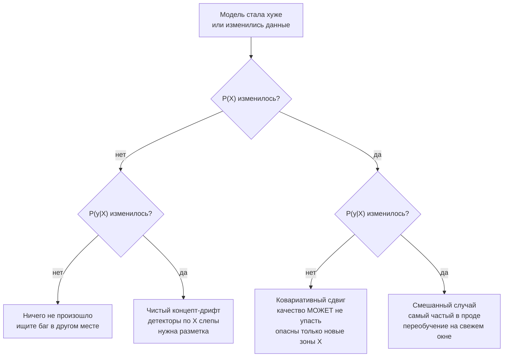

# Дрифт данных

> **Зачем эта глава.** Модель обучалась на снимке мира, а работает в мире, который движется.
> Здесь разбираемся, какие бывают виды сдвига распределений, какой из них реально убивает
> качество, чем их измерять (PSI, KS, χ², KL/JS, MMD, детектор-классификатор), почему
> покомпонентные тесты на 500 признаках дают лавину ложных тревог, как выбрать окно сравнения,
> чтобы не поймать понедельник вместо дрифта, и что делать по шагам, когда алерт всё-таки
> сработал. Отдельно — честный разговор о том, почему дрифт бывает без падения качества
> и почему поэтому алертить надо на качество, а на дрифт — расследовать.

**Уровень:** 🎯 middle → 🧠 middle+
**Предварительно нужно:** [что мониторить в ML-системе](01-what-to-monitor.md),
[качество данных](02-data-quality.md), [статистика и вывод](../01-math/03-statistics.md),
[теория информации](../01-math/05-information-theory.md),
[валидация и утечки](../02-classic-ml/13-validation-and-leakage.md)
**Как проработать:** чтение + реализовать PSI и детектор + прогнать на своих данных

---

## Карта главы

- [1. Интуиция: три разные вещи, которые называют одним словом](#1-интуиция-три-разные-вещи-которые-называют-одним-словом)
- [2. Формализация: разложение совместного распределения](#2-формализация-разложение-совместного-распределения)
- [3. Ковариативный сдвиг: P(X) поехало](#3-ковариативный-сдвиг-px-поехало)
- [4. Сдвиг приоров: P(y) поехало](#4-сдвиг-приоров-py-поехало)
- [5. Концепт-дрифт: P(y|X) поехало](#5-концепт-дрифт-pyx-поехало)
- [6. PSI: формула, расчёт по бинам, численный пример](#6-psi-формула-расчёт-по-бинам-численный-пример)
- [7. Откуда взялись пороги 0.1 и 0.25 и почему им нельзя верить вслепую](#7-откуда-взялись-пороги-01-и-025-и-почему-им-нельзя-верить-вслепую)
- [8. KS-тест и его проблема на больших выборках](#8-ks-тест-и-его-проблема-на-больших-выборках)
- [9. χ² для категориальных признаков](#9-χ²-для-категориальных-признаков)
- [10. KL и JS: почему KL асимметрична и ломается на нулях](#10-kl-и-js-почему-kl-асимметрична-и-ломается-на-нулях)
- [11. MMD: тест на сырых векторах без биннинга](#11-mmd-тест-на-сырых-векторах-без-биннинга)
- [12. Дрифт эмбеддингов и многомерный дрифт](#12-дрифт-эмбеддингов-и-многомерный-дрифт)
- [13. Множественные сравнения: лавина ложных срабатываний](#13-множественные-сравнения-лавина-ложных-срабатываний)
- [14. Окно сравнения: фиксированный reference против скользящего](#14-окно-сравнения-фиксированный-reference-против-скользящего)
- [15. Сезонность как источник ложного дрифта](#15-сезонность-как-источник-ложного-дрифта)
- [16. Протокол: обнаружили дрифт — что делать](#16-протокол-обнаружили-дрифт--что-делать)
- [17. Дрифт есть, а качество не упало](#17-дрифт-есть-а-качество-не-упало)
- [18. Подводные камни](#18-подводные-камни)
- [19. Проверь себя](#19-проверь-себя)
- [20. Практика](#20-практика)
- [21. Что читать дальше](#21-что-читать-дальше)

---

## 1. Интуиция: три разные вещи, которые называют одним словом

Начнём с истории, которая происходила в том или ином виде в каждой компании.

Скоринговая модель одобрения рассрочки работает год. В понедельник дежурный видит алерт:
«PSI по признаку `device_os` = 0.41, критично». Идёт разбираться. Оказывается, продукт выкатил
новое мобильное приложение, и поле стало приходить в другом формате: было `iOS 16.2`, стало
`ios/16.2.1`. Модель видит незнакомую категорию, кодирует её как «прочее», и в этом сегменте
скор поехал вниз. Это **не дрифт данных**, это баг в контракте данных. Лечится за час откатом
формата, а не переобучением.

Через месяц новый алерт: PSI по признаку `сумма_заказа` = 0.28. Разбираются — оказалось,
маркетинг запустил кампанию на молодую аудиторию, средний чек упал с 4200 до 2900 рублей.
Признаки реально поехали. Смотрят качество — ROC-AUC как был 0.83, так и остался. Ничего
делать не надо: модель обучалась на данных, которые покрывали и этот диапазон сумм,
а зависимость «сумма → риск» не изменилась.

Ещё через два месяца алертов **нет вообще**: все PSI в зелёной зоне, все распределения признаков
как в обучении. А доля просрочек по одобренным заявкам выросла с 2.1% до 3.6%. Причина
выясняется через полтора месяца: на рынок вышел агрегатор, который научился подбирать заявкам
такой набор анкетных данных, чтобы проходить скоринг. Входные признаки выглядят **точно так же**,
как раньше, но за тем же вектором признаков теперь стоит другой человек с другим риском.

Три ситуации, три разных механизма, три разных решения. И только вторая и третья — это дрифт,
причём именно третья, которую не поймал ни один детектор, стоила денег.

> ⚠️ **Типичная ошибка.** Считать «дрифтом» всё, что изменилось в данных. Больше половины
> алертов на дрифт в реальном проде — это сломавшийся апстрим: новый формат поля, потерянный
> джойн, переехавший ETL, обновление в справочнике категорий. Прежде чем говорить «данные
> поехали, надо переобучаться», проверьте [качество данных](02-data-quality.md): долю пропусков,
> схему, свежесть, количество строк. Переобучение на битых данных закрепляет баг в модели.

---

## 2. Формализация: разложение совместного распределения

Модель обучалась на выборке из совместного распределения $P_{\text{train}}(X, y)$, а работает
на потоке из $P_{\text{prod}}(X, y)$. **Дрифт (drift, dataset shift)** — это факт, что
$P_{\text{train}} \neq P_{\text{prod}}$.

Само по себе это утверждение бесполезно: чтобы понять последствия, совместное распределение
надо разложить. Есть два способа, и они дают разные виды сдвига.

$$
P(X, y) = P(y \mid X)\, P(X) = P(X \mid y)\, P(y)
$$

где $X \in \mathbb{R}^d$ — вектор признаков объекта, $y$ — таргет (класс или число),
$P(X)$ — маргинальное распределение признаков, $P(y)$ — маргинальное распределение таргета
(**приор**, prior), $P(y \mid X)$ — условное распределение таргета при известных признаках,
$P(X \mid y)$ — распределение признаков внутри класса.

Отсюда три канонических вида сдвига:

| Вид сдвига | Что меняется | Что остаётся | Английский термин |
|---|---|---|---|
| Ковариативный | $P(X)$ | $P(y \mid X)$ | covariate shift |
| Сдвиг приоров | $P(y)$ | $P(X \mid y)$ | prior / label shift |
| Концепт-дрифт | $P(y \mid X)$ | $P(X)$ может не меняться | concept drift |

Различать их обязательно, потому что **последствия и лекарства у них разные**:



> 📐 **Разбор формулы.** Почему разложений именно два и почему они не эквивалентны. Формула
> Байеса связывает их: $P(y|X)P(X) = P(X|y)P(y)$. Но при *сдвиге* мы фиксируем один множитель
> и меняем другой — и вот это уже разные предположения. «$P(y|X)$ фиксировано, $P(X)$ меняется»
> — это мир, где механизм порождения таргета не изменился, изменился только состав приходящих
> объектов (пришла новая аудитория). «$P(X|y)$ фиксировано, $P(y)$ меняется» — это мир, где
> сами классы выглядят как раньше, но их пропорция другая (сезон гриппа: больные выглядят
> так же, но их стало вчетверо больше). Эти два предположения не выводятся друг из друга,
> и методы коррекции у них разные.

---

## 3. Ковариативный сдвиг: P(X) поехало

**Определение.** $P_{\text{prod}}(X) \neq P_{\text{train}}(X)$, при этом
$P_{\text{prod}}(y \mid X) = P_{\text{train}}(y \mid X)$.

**Механизмы возникновения** (это то, что стоит уметь называть на собеседовании):

- **Смена состава трафика.** Запустили рекламу на новый сегмент; вышли в новый регион;
  партнёр привёл когорту с другим поведением. Самый частый механизм.
- **Продуктовые изменения.** Поменяли форму регистрации — часть полей стала необязательной,
  доля пропусков выросла с 3% до 30%.
- **Изменение сенсора/источника.** Обновилась версия SDK, поменялась камера в новой модели
  телефона, апстрим-сервис стал округлять цену до целых.
- **Постепенный тренд.** Инфляция сдвигает все денежные признаки; средний размер экрана растёт;
  тексты запросов становятся длиннее.

**Последствия для качества.** Здесь важно сказать вещь, которую многие произносят неправильно:
**ковариативный сдвиг сам по себе не обязан ронять качество.** Если модель хорошо
специфицирована и в новой области значений $X$ у неё были обучающие данные, то $P(y|X)$
она предсказывает по-прежнему верно, а то, что объектов в одной зоне стало больше,
а в другой меньше, не меняет предсказание для каждого конкретного объекта.

Качество падает в двух случаях:

1. **Модель ошибается неравномерно по пространству признаков.** Она везде немного неточна,
   но в зоне $A$ ошибка 0.05, а в зоне $B$ — 0.20. Если доля объектов зоны $B$ выросла
   с 5% до 40%, средняя ошибка вырастет с 0.0575 до 0.11, хотя ни одно локальное предсказание
   не изменилось. Это чистая арифметика взвешивания.
2. **Объекты уехали туда, где обучающих данных не было** — экстраполяция. Дерево отдаёт
   значение крайнего листа, линейная модель продолжает прямую в бесконечность, нейросеть
   выдаёт что угодно. Это самый опасный подвид, и его надо мониторить отдельно.

$$
\mathbb{E}_{\text{prod}}[\ell] = \int \ell(x)\, P_{\text{prod}}(x)\, dx
= \int \ell(x)\, \underbrace{\frac{P_{\text{prod}}(x)}{P_{\text{train}}(x)}}_{w(x)}\, P_{\text{train}}(x)\, dx
$$

где $\ell(x) = \mathbb{E}[L(y, f(x)) \mid X = x]$ — ожидаемая потеря модели $f$ в точке $x$,
$w(x)$ — **вес важности** (importance weight), отношение плотностей.
Формула говорит буквально: ошибка в проде — это ошибка на обучающем распределении,
перевзвешенная по тому, как изменились плотности. Если $\ell(x)$ постоянна по $x$,
перевзвешивание ничего не меняет. Если $\ell(x)$ сильно неоднородна — меняет всё.

**Как обнаруживать.** Это единственный вид сдвига, который виден **без разметки**, прямо
на входном потоке. Инструменты — весь раздел 6–12 этой главы: PSI, KS, χ², JS, MMD,
детектор-классификатор.

> 💬 **На собеседовании.** Спросят: «Ковариативный сдвиг — модель обязательно деградирует?»
> Хороший ответ: нет, не обязательно. Если $P(y|X)$ не изменилось и новые объекты попадают
> в область, где у модели были обучающие данные, каждое отдельное предсказание остаётся
> корректным. Средняя метрика поедет только если ошибка модели неоднородна по пространству
> признаков и вес переехал в зону, где она хуже — это видно как перевзвешивание
> $\int \ell(x) w(x) P_{train}(x)dx$. По-настоящему опасен подвид с экстраполяцией: объекты
> ушли туда, где обучающих данных не было вовсе. Поэтому я мониторю не только PSI по признакам,
> но и долю объектов вне обучающей области — например, по расстоянию до ближайших соседей
> в обучающей выборке или по outlier-скору.
> Плохой ответ: «дрифт данных → модель деградирует → переобучаем».

---

## 4. Сдвиг приоров: P(y) поехало

**Определение.** $P_{\text{prod}}(y) \neq P_{\text{train}}(y)$ при неизменном
$P(X \mid y)$: классы «выглядят» так же, изменилась их пропорция.

**Механизмы:**

- Сезонность целевого события: доля мошеннических транзакций скачет в Чёрную пятницу;
  доля отказов от заказа растёт в декабре из-за перегруза логистики.
- Внешние шоки: экономический кризис поднимает базовый уровень дефолта; эпидемия поднимает
  долю положительных тестов.
- **Собственные действия компании.** Ужесточили правила выдачи — доля дефолтов среди
  одобренных упала. Это сдвиг приоров, который вы устроили себе сами.
- **Даунсэмплинг при обучении.** Классика: обучили на выборке, где негативы прорежены 1:10,
  а в проде базовая ставка исходная. Формально это сдвиг приоров между train и prod
  с первого дня жизни модели.

**Последствия.** Здесь всё жёстко: **ломается калибровка, и вместе с ней ломается всё,
что от неё зависит** — фиксированные пороги, ожидаемая выручка, распределение бюджета.
Ранжирующая способность (ROC-AUC) при чистом сдвиге приоров **не меняется**, а
precision при фиксированном пороге и PR-AUC — меняются, потому что они зависят
от базовой ставки.

Есть точная формула коррекции. Если модель обучена при априорной вероятности класса
$\pi_{\text{train}}$, а в проде она $\pi_{\text{new}}$, то откалиброванный апостериор:

$$
\tilde{p} = \frac{\dfrac{\pi_{\text{new}}}{\pi_{\text{train}}}\, p}
{\dfrac{\pi_{\text{new}}}{\pi_{\text{train}}}\, p + \dfrac{1 - \pi_{\text{new}}}{1 - \pi_{\text{train}}}\,(1 - p)}
$$

где $p = P_{\text{train}}(y=1 \mid x)$ — выход модели, $\tilde{p}$ — скорректированная
вероятность при новом приоре, $\pi_{\text{train}}$ и $\pi_{\text{new}}$ — доли положительного
класса в обучении и в проде.

**Численный пример.** Антифрод обучен при $\pi_{\text{train}} = 0.005$. Началась атака,
реальная доля фрода выросла до $\pi_{\text{new}} = 0.025$ (в пять раз). Транзакция
получила скор $p = 0.30$.

$$
\tilde{p} = \frac{5 \cdot 0.30}{5 \cdot 0.30 + \frac{0.975}{0.995}\cdot 0.70}
= \frac{1.5}{1.5 + 0.9799 \cdot 0.70} = \frac{1.5}{2.186} = 0.686
$$

Скор 0.30 на самом деле означает 68.6% вероятности фрода. Если у вас стоит фиксированный
порог 0.5 на блокировку, вы пропускаете больше двух третей вероятностной массы фрода
в этой точке.

**Как обнаруживать без разметки.** Есть красивый и мало кем используемый приём —
**BBSE** (Black Box Shift Estimation). Идея: если верно предположение label shift
($P(X|y)$ не менялось), то распределение **предсказаний** модели связано с распределением
таргета известной матрицей, снятой на валидации:

$$
\mu = C\, q, \qquad C_{ij} = P_{\text{val}}(\hat{y} = i \mid y = j)
$$

где $q$ — вектор истинных долей классов в проде (неизвестен), $\mu$ — вектор долей
предсказанных классов в проде (наблюдаем прямо сейчас), $C$ — матрица «предсказано при
условии истинного», снятая на отложенной валидационной выборке. Отсюда $\hat{q} = C^{-1}\mu$.

**Численный пример.** Модель оттока, на валидации $P(y=1) = 0.20$, матрица условных
вероятностей при пороге 0.5:

$$
C = \begin{pmatrix} 0.90 & 0.30 \\ 0.10 & 0.70 \end{pmatrix}
$$

то есть $P(\hat{y}=0 \mid y=0) = 0.90$, $P(\hat{y}=1 \mid y=0) = 0.10$,
$P(\hat{y}=0 \mid y=1) = 0.30$, $P(\hat{y}=1 \mid y=1) = 0.70$.
На валидации это даёт долю предсказанных единиц
$0.10 \cdot 0.8 + 0.70 \cdot 0.2 = 0.22$.

В проде наблюдаем: доля предсказанных единиц выросла до $\mu_1 = 0.30$. Решаем систему
$0.9 q_0 + 0.3 q_1 = 0.70$ при $q_0 + q_1 = 1$:

$$
0.9 - 0.6 q_1 = 0.70 \;\Rightarrow\; q_1 = \frac{0.20}{0.60} = 0.333
$$

Истинная доля оттока выросла с 0.20 до **0.333**, и мы получили это число **без единой
метки**. Обратите внимание на важную деталь: наивное чтение «предсказанных единиц стало 30%,
значит отток 30%» даёт неверный ответ — модель ошибается в обе стороны, и матрица $C$
это исправляет.

Ограничения BBSE: нужна обратимая $C$ (модель должна быть заметно лучше случайной,
иначе матрица плохо обусловлена и оценка взрывается) и должно выполняться предположение
label shift. Если параллельно едет и $P(X|y)$, оценка будет смещённой.

> 💬 **На собеседовании.** Спросят: «Доля положительных предсказаний выросла вдвое.
> Что произошло?»
> Хороший ответ: три гипотезы, и их надо развести. Первая — реально выросла базовая ставка
> события (сдвиг приоров); проверяю через BBSE или, если есть хоть частичная разметка,
> напрямую по свежим меткам. Вторая — ковариативный сдвиг: пришла аудитория, у которой
> признаки объективно ближе к положительному классу; проверяю PSI по входным признакам
> и, главное, смотрю, изменился ли скор внутри фиксированной когорты пользователей. Третья,
> самая частая — баг в фичах: пропала фича, дефолт заполнился нулём, и скор поехал.
> Начинаю всегда с третьей: она дешевле всех проверяется и чаще всех оказывается права.
> Плохой ответ: «начался дрифт, переобучим модель».

---

## 5. Концепт-дрифт: P(y|X) поехало

**Определение.** Изменилась сама зависимость: за одним и тем же вектором признаков теперь
стоит другая вероятность таргета. $P_{\text{prod}}(y \mid X) \neq P_{\text{train}}(y \mid X)$.

**Механизмы:**

- **Адверсариальная адаптация.** Мошенники, спамеры, накрутчики, SEO — все, кто явно
  оптимизируется против вашей модели. Признаки они подгоняют под «хороших», сохраняя
  плохое намерение. Это самый чистый и самый дорогой концепт-дрифт.
- **Смена смысла признака.** Признак `количество_заказов_за_30_дней` = 5 раньше означал
  лояльного клиента, а после запуска подписки со скидками — обычного.
- **Изменение внешних правил.** Поменялось законодательство, изменились условия конкурентов,
  поменялась комиссия площадки — и то же поведение пользователя ведёт к другому исходу.
- **Ваша собственная модель.** Начали блокировать заявки со скором > 0.8 — и в обучающие
  данные следующего цикла эти объекты просто не попадают с меткой. Это петля обратной связи,
  подробно — в [главе про деградацию](04-model-degradation.md) и в
  [холодном старте и смещениях](../10-recsys/12-cold-start-and-bias.md).

**Виды по форме во времени** (терминология из литературы по concept drift, её любят
спрашивать):

| Форма | Что происходит | Пример | Реакция |
|---|---|---|---|
| Внезапный (sudden/abrupt) | скачок за часы | смена законодательства, релиз конкурента, начало атаки | немедленное переобучение или откат на правила |
| Постепенный (gradual) | старый и новый режим сосуществуют, доля нового растёт | миграция пользователей на новую версию приложения | переобучение по расписанию с окном |
| Инкрементальный (incremental) | плавный дрейф параметров | инфляция, взросление аудитории | достаточно регулярного переобучения |
| Рекуррентный (recurring) | режимы возвращаются | сезоны, распродажи, будни/выходные | не переобучать, а добавить признак сезонности |

**Последствия.** Здесь всё плохо: качество падает напрямую, и никакая калибровка не спасает,
потому что сломалась не шкала, а сама зависимость.

**Как обнаруживать — и почему это тяжело.** Ключевой факт:

> Чистый концепт-дрифт **принципиально не детектируется** по входным данным. Ни один тест
> на $X$ его не увидит, потому что $P(X)$ не изменилось.

Значит, остаются три пути:

1. **Метки.** Прямой мониторинг качества на размеченных данных. Единственный надёжный способ.
   Проблема — задержка разметки; как с ней жить, разбирается в
   [следующей главе](04-model-degradation.md).
2. **Прокси по невязке.** Мониторим не $X$, а поведение самой модели: распределение скоров,
   долю уверенных предсказаний, согласие с прошлой версией модели. Изменение $P(y|X)$ часто
   (не всегда!) проявляется как изменение распределения выхода модели.
3. **Косвенные бизнес-сигналы.** Доля жалоб, доля отмен, доля ручных переопределений
   решением оператора, доля апелляций. Часто это первый сигнал, приходящий раньше меток.

> 💬 **На собеседовании.** Спросят: «Чем ковариативный сдвиг отличается от концепт-дрифта
> и почему это важно?»
> Хороший ответ: ковариативный — изменилось $P(X)$ при неизменном $P(y|X)$: приходят другие
> объекты, но правило «признаки → таргет» то же. Концепт-дрифт — изменилось само $P(y|X)$:
> за тем же вектором признаков теперь другой исход. Практическая разница в двух вещах.
> Первая: ковариативный сдвиг виден по входному потоку без меток, а концепт-дрифт по $X$
> невидим в принципе — нужны метки или прокси. Вторая: при ковариативном сдвиге переобучение
> на свежих данных часто не нужно, достаточно убедиться, что нет экстраполяции; при
> концепт-дрифте переобучение обязательно, причём на коротком свежем окне, а старые данные
> надо либо отбросить, либо взвесить меньшим весом, потому что они теперь описывают другой
> мир.
> Плохой ответ: перечислить определения из статьи, не сказав, что делать по-разному.

---

## 6. PSI: формула, расчёт по бинам, численный пример

**PSI** (Population Stability Index, индекс стабильности популяции) — рабочая лошадка
мониторинга дрифта. Пришёл из кредитного скоринга, где им десятилетиями следят
за стабильностью скоркарт.

$$
\text{PSI} = \sum_{b=1}^{B} \big(p_b - q_b\big) \ln \frac{p_b}{q_b}
$$

где $B$ — число бинов (интервалов или категорий), $q_b$ — доля объектов эталонной выборки
(reference) в бине $b$, $p_b$ — доля объектов текущей выборки (current) в том же бине,
$\sum_b q_b = \sum_b p_b = 1$.

> 📐 **Разбор формулы.** Раскроем скобки:
> $\sum_b p_b \ln\frac{p_b}{q_b} + \sum_b q_b \ln\frac{q_b}{p_b} = D_{KL}(P\|Q) + D_{KL}(Q\|P)$.
> То есть **PSI — это симметризованная KL-дивергенция** (в статистике она известна как
> дивергенция Джеффриса). Отсюда сразу три следствия. Первое: PSI $\ge 0$, равен нулю тогда
> и только тогда, когда распределения совпадают побиново. Второе: PSI симметричен —
> неважно, что назвать эталоном. Третье: он наследует все проблемы KL с нулевыми бинами,
> и об этом ниже.

**Протокол расчёта, шаг за шагом.**

1. **Границы бинов считаются по эталону и фиксируются навсегда.** Обычно это децили
   (10 бинов) обучающей выборки. Критично: нельзя пересчитывать границы по объединённой
   или по текущей выборке — тогда границы поедут вместе с дрифтом, и он частично спрячется.
2. Границы сохраняются как **артефакт рядом с моделью**. Иначе значения PSI за разные дни
   несравнимы между собой.
3. Крайние бины открытые: $(-\infty, e_1]$ и $(e_{B-1}, +\infty)$ — иначе новые экстремальные
   значения просто не попадут никуда.
4. Для категориальных: топ-20 категорий по частоте в эталоне плюс бин «прочее».
5. Считаем доли, применяем «пол» на нулевые доли (см. ниже), суммируем.

**Численный пример 1: непрерывный признак.** Эталон разбит на децили, поэтому
$q_b = 0.10$ для всех десяти бинов. В текущем окне распределение съехало вправо:

| Бин | 1 | 2 | 3 | 4 | 5 | 6 | 7 | 8 | 9 | 10 |
|---|---|---|---|---|---|---|---|---|---|---|
| $q_b$ (эталон) | 0.10 | 0.10 | 0.10 | 0.10 | 0.10 | 0.10 | 0.10 | 0.10 | 0.10 | 0.10 |
| $p_b$ (текущее) | 0.05 | 0.06 | 0.07 | 0.08 | 0.09 | 0.11 | 0.12 | 0.13 | 0.14 | 0.15 |
| вклад в PSI | 0.0347 | 0.0204 | 0.0107 | 0.0045 | 0.0011 | 0.0010 | 0.0036 | 0.0079 | 0.0135 | 0.0203 |

Разберём первый вклад руками:
$(0.05 - 0.10)\ln\frac{0.05}{0.10} = (-0.05)\cdot\ln 0.5 = (-0.05)(-0.6931) = 0.0347$.

Сумма всех вкладов: **PSI = 0.1175**. По конвенции это «умеренный сдвиг, требует внимания».
Заметьте, какой это в реальности сдвиг: первый дециль похудел вдвое, последний потолстел
в полтора раза. Это заметное, но далеко не катастрофическое изменение.

**Численный пример 2: категориальный признак** (канал привлечения):

| Категория | $q_b$ | $p_b$ | $\ln(p_b/q_b)$ | Вклад |
|---|---|---|---|---|
| organic | 0.45 | 0.30 | −0.4055 | 0.0608 |
| paid_search | 0.20 | 0.35 | +0.5596 | 0.0839 |
| social | 0.15 | 0.18 | +0.1823 | 0.0055 |
| email | 0.12 | 0.11 | −0.0870 | 0.0009 |
| partner | 0.08 | 0.06 | −0.2877 | 0.0058 |

**PSI = 0.157.** Два канала дают 93% вклада — и это как раз то, что надо сообщать в алерте:
не только число, но и разложение по бинам. Инженер, который видит «PSI=0.157, вклад:
paid_search +15 п.п., organic −15 п.п.», за секунду понимает, что случилось. Инженер,
который видит только «PSI=0.157», идёт открывать ноутбук.

```python
# PSI из первых принципов. 30 строк, которые стоит один раз написать самому.
import numpy as np

def fit_psi_bins(ref: np.ndarray, n_bins: int = 10) -> np.ndarray:
    """Границы бинов по ЭТАЛОНУ. Считать их по объединённой выборке нельзя:
    границы поедут вместе с дрифтом, и часть сдвига спрячется внутрь бинов."""
    edges = np.percentile(ref, np.linspace(0, 100, n_bins + 1))
    edges[0], edges[-1] = -np.inf, np.inf   # крайние бины открыты: ловим новые экстремумы
    return np.unique(edges)                 # схлопываем совпавшие границы (дискретный признак)

def psi(ref: np.ndarray, cur: np.ndarray, edges: np.ndarray, floor: float = 1e-4) -> float:
    q, _ = np.histogram(ref, bins=edges)
    p, _ = np.histogram(cur, bins=edges)
    q = np.maximum(q / q.sum(), floor)   # floor — не «чтобы не делить на ноль», а осознанный
    p = np.maximum(p / p.sum(), floor)   # порог: он ограничивает вклад исчезнувшего бина
    q, p = q / q.sum(), p / p.sum()      # ренормируем после подрезки
    return float(np.sum((p - q) * np.log(p / q)))

def psi_contributions(ref, cur, edges, floor=1e-4):
    """Всегда возвращайте разложение по бинам, а не только число:
    в алерте нужен ответ 'что именно поехало', а не 'что-то поехало'."""
    q, _ = np.histogram(ref, bins=edges)
    p, _ = np.histogram(cur, bins=edges)
    q = np.maximum(q / q.sum(), floor); q /= q.sum()
    p = np.maximum(p / p.sum(), floor); p /= p.sum()
    return (p - q) * np.log(p / q), q, p
```

**Проблема нулевого бина.** Если категория исчезла ($p_b = 0$), то $\ln 0 = -\infty$
и PSI обращается в бесконечность. Стандартное лечение — «пол» (floor) на доли. Но посмотрите,
насколько результат от него зависит: пусть эталонная доля бина была $q_b = 0.10$, а в текущем
окне бин опустел.

| Значение floor | Вклад одного опустевшего бина |
|---|---|
| $10^{-3}$ | $(0.001 - 0.1)\ln(0.01) = 0.456$ |
| $10^{-4}$ | $(0.0001 - 0.1)\ln(0.001) = 0.690$ |
| $10^{-6}$ | $(10^{-6} - 0.1)\ln(10^{-5}) = 1.151$ |

Три «одинаково разумных» floor дают PSI, различающийся в 2.5 раза. Вывод практический:
floor фиксируйте один раз в коде мониторинга и не меняйте (иначе исторические значения
несравнимы), а исчезнувший бин обрабатывайте **отдельным правилом**: «категория, имевшая
в эталоне более 1% массы, полностью исчезла» — это самостоятельный алерт, и почти всегда
это сломанный апстрим, а не дрифт.

---

## 7. Откуда взялись пороги 0.1 и 0.25 и почему им нельзя верить вслепую

Стандартная табличка, которую вы встретите везде:

| PSI | Трактовка |
|---|---|
| < 0.10 | сдвига нет |
| 0.10 – 0.25 | умеренный сдвиг, наблюдать |
| > 0.25 | значимый сдвиг, действовать |

Теперь честно: **это эмпирическая конвенция из практики кредитного скоринга, а не теорема.**
Она пришла из мониторинга скоркарт (её популяризировала литература по скоринговым картам,
в первую очередь книга Naeem Siddiqi «Credit Risk Scorecards»), где сложились очень
специфические условия: 10 бинов по децилям, выборки порядка десятков тысяч наблюдений,
скоркарта на 10–20 переменных, ежемесячный мониторинг. В этих условиях числа 0.1 и 0.25
неплохо соответствовали «на это стоит посмотреть» и «здесь надо принимать решение».

Никакого распределения, никакого уровня значимости, никакой связи с падением качества
за этими числами нет. И как только вы выходите за исходные условия, они начинают врать.

**Первое: PSI зависит от числа бинов.** Больше бинов — больше значение при том же реальном
сдвиге. Сравнивать PSI, посчитанные с $B=10$ и с $B=20$, нельзя вообще.

**Второе: PSI зависит от размера выборки.** Есть аппроксимация (её приводит, в частности,
работа Б. Юрдакула о статистических свойствах PSI): при нулевой гипотезе «распределения
одинаковы» и выборках размера $M$ (эталон) и $N$ (текущая)

$$
\text{PSI} \;\approx\; \left(\frac{1}{M} + \frac{1}{N}\right)\chi^2_{B-1}
$$

где $\chi^2_{B-1}$ — случайная величина с распределением хи-квадрат с $B-1$ степенями свободы.
Отсюда сразу ожидаемое значение чистого шума:

$$
\mathbb{E}[\text{PSI} \mid H_0] \approx (B-1)\left(\frac{1}{M} + \frac{1}{N}\right)
$$

Подставим числа для $B = 10$:

| $M = N$ | PSI от чистого шума (среднее) | Порог на уровне 99.9% ($\chi^2_{0.999,\,9} = 27.88$) |
|---|---|---|
| 200 | 0.090 | 0.279 |
| 1 000 | 0.018 | 0.056 |
| 10 000 | 0.0018 | 0.0056 |
| 100 000 | 0.00018 | 0.00056 |

Читаем таблицу и понимаем масштаб проблемы:

- На выборке в **200 наблюдений** PSI ≈ 0.09 возникает **при полном отсутствии дрифта**.
  Порог 0.1 будет срабатывать почти каждый день просто от шума. Именно так выглядит
  мониторинг редкого сегмента: «в регионе Х PSI 0.14, тревога» — а там 180 заявок в сутки.
- На выборке в **100 000** порог значимости 0.0006, а конвенция говорит 0.1 — то есть
  порог в 170 раз консервативнее статистически значимого. Это, кстати, хорошо: он отсекает
  статистически значимую, но практически ничтожную мелочь.

**Что делать практически.** Три рабочих подхода, от простого к правильному:

1. **Не считать PSI на окнах меньше 1000 наблюдений.** Это дешёвое правило,
   которое убирает большую часть ложных алертов. Меньше 1000 — копите окно дольше
   (не сутки, а неделю) или не мониторьте этот срез вовсе.
2. **Откалибровать порог на своей истории.** Возьмите 60–90 дней «спокойного» прода,
   посчитайте PSI для каждого дня против фиксированного эталона, постройте распределение.
   Порог = 99-й перцентиль этого распределения. Это займёт полдня и даст пороги, которые
   отражают вашу реальную дисперсию, а не чужую.
3. **Смотреть не на абсолютное значение, а на динамику.** PSI, который два месяца держался
   на 0.03, а за неделю дошёл до 0.08, — гораздо более тревожный сигнал, чем PSI, который
   всегда был 0.12.

> 💬 **На собеседовании.** Спросят: «Какой порог PSI считается критическим?»
> Хороший ответ: «Конвенционально 0.1 и 0.25, но важно понимать, что это эмпирическое правило
> из кредитного скоринга при 10 бинах и выборках в десятки тысяч, а не статистический
> результат. PSI — это симметризованная KL, и под нулевой гипотезой он ведёт себя как
> $(1/M + 1/N)\chi^2_{B-1}$: на выборке в 200 наблюдений PSI 0.09 набегает от чистого шума,
> а на 100 тысячах статистически значимо уже 0.001. Поэтому на практике я калибрую порог
> по 2–3 месяцам собственной спокойной истории, беру 99-й перцентиль, требую минимум
> 1000 наблюдений в окне и смотрю на тренд, а не на однократное превышение».
> Плохой ответ: «0.25 — критично» и точка. Это ответ человека, который прочитал одну статью.

---

## 8. KS-тест и его проблема на больших выборках

**Двухвыборочный критерий Колмогорова–Смирнова** (Kolmogorov–Smirnov test) сравнивает
эмпирические функции распределения:

$$
D_{M,N} = \sup_x \big| F_{\text{ref}}(x) - F_{\text{cur}}(x) \big|
$$

где $F_{\text{ref}}$ и $F_{\text{cur}}$ — эмпирические функции распределения эталонной
и текущей выборок, $\sup$ — максимум расхождения по всем точкам $x$, $M$ и $N$ — размеры
выборок. Гипотеза о равенстве распределений отвергается при

$$
D_{M,N} > c(\alpha)\sqrt{\frac{M+N}{MN}}, \qquad c(0.05) = 1.36
$$

Достоинства: не требует биннинга, не требует предположений о виде распределения, чувствителен
к сдвигу центра. Недостаток по существу: чувствительность к хвостам низкая, максимум
расхождения ФР обычно достигается в середине.

**Главная проблема — не в этом.** Посмотрите на критическое значение при $M = N = n$:

| $n$ в каждой выборке | Критическое $D$ при $\alpha = 0.05$ |
|---|---|
| 1 000 | 0.0608 |
| 10 000 | 0.0192 |
| 100 000 | 0.0061 |
| 1 000 000 | 0.0019 |
| 10 000 000 | 0.0006 |

На миллионе наблюдений расхождение функций распределения в **0.2 процентного пункта**
объявляется статистически значимым. При таком объёме данных распределения признаков
не совпадают никогда: ни одна реальная величина не воспроизводится побитово между
двумя днями. Итог: **на продовых объёмах KS-тест отвергает нулевую гипотезу всегда,
p-value равен нулю по всем признакам каждый день, и мониторинг превращается в шум.**

Это частный случай общего свойства проверки гипотез: при $n \to \infty$ мощность критерия
стремится к единице против **любого** сколь угодно малого отличия. Тест отвечает на вопрос
«отличаются ли распределения хоть немного», а инженеру нужен ответ на вопрос «отличаются ли
они настолько, чтобы это сломало модель». Это разные вопросы. Подробнее о том, почему
p-value не отвечает на второй вопрос, — в [статистике](../01-math/03-statistics.md)
и в [ловушках A/B](../06-ab-testing/04-pitfalls.md).

**Три способа починить:**

1. **Алертить на размер эффекта, а не на p-value.** Статистика $D$ сама по себе — прекрасная
   безразмерная мера расхождения в диапазоне $[0, 1]$. Практические ориентиры, которые надо
   откалибровать на своих данных: $D < 0.05$ — норма, $0.05$–$0.1$ — наблюдать,
   $> 0.1$ — расследовать. Никакого p-value в алерте вообще быть не должно.
2. **Фиксировать размер выборки.** Всегда сэмплировать ровно $n = 20\,000$ из каждого окна.
   Тогда p-value сравнимы между днями и между признаками, а порог значимости не зависит
   от того, был вчера трафик выше или ниже.
3. **Комбинировать.** Требовать одновременно статистическую значимость и размер эффекта
   выше порога. Второе условие практически всегда оказывается связывающим.

```python
from scipy.stats import ks_2samp

def ks_drift(ref: np.ndarray, cur: np.ndarray, n_sub: int = 20_000, seed: int = 0):
    """Сабсэмплинг до фиксированного n — не экономия времени, а условие сопоставимости:
    иначе критическое значение теста плавает вместе с суточным трафиком."""
    rng = np.random.default_rng(seed)
    a = rng.choice(ref, size=min(n_sub, len(ref)), replace=False)
    b = rng.choice(cur, size=min(n_sub, len(cur)), replace=False)
    res = ks_2samp(a, b)
    # В алерт уходит statistic (размер эффекта), pvalue — только в отладочный лог.
    return {"statistic": float(res.statistic), "pvalue": float(res.pvalue)}
```

> ⚠️ **Типичная ошибка.** Поставить алерт `ks_pvalue < 0.05` на 300 признаков при трафике
> 5 млн событий в сутки. Результат: 300 сработавших алертов каждое утро, через неделю
> команда отключает уведомления, через месяц пропускает настоящую аварию. Алерт, который
> срабатывает всегда, — это не алерт, а отключённый мониторинг.

---

## 9. χ² для категориальных признаков

Для категориальных признаков естественный аналог — **критерий хи-квадрат однородности**:

$$
\chi^2 = \sum_{b=1}^{B} \frac{(O_b - E_b)^2}{E_b}
$$

где $O_b$ — наблюдаемое число объектов текущей выборки в категории $b$, $E_b$ — ожидаемое
число при гипотезе о совпадении распределений, $E_b = N \cdot q_b$ ($N$ — размер текущей
выборки, $q_b$ — эталонная доля категории $b$). Число степеней свободы $B-1$.

Условие применимости, которое нарушают постоянно: **все $E_b \ge 5$**. Категории с малым
ожидаемым числом надо объединять в «прочее», иначе статистика раздувается на редких
категориях, и вы получаете «дрифт» из-за трёх наблюдений в хвосте справочника.

У χ² ровно та же болезнь больших выборок, что у KS: на миллионе наблюдений p-value равен нулю
всегда. Лекарство то же — **размер эффекта**. Для таблицы $2 \times B$ («эталон/текущее»
на $B$ категорий) это **V Крамера**:

$$
V = \sqrt{\frac{\chi^2}{n \cdot \min(r - 1,\; c - 1)}}
$$

где $n$ — общее число наблюдений в обеих выборках, $r$ и $c$ — число строк и столбцов
таблицы сопряжённости. Для нашего случая $\min(r-1, c-1) = 1$, то есть $V = \sqrt{\chi^2/n}$.
$V$ лежит в $[0, 1]$ и не зависит от размера выборки — это ровно то свойство, которое нам нужно.

Ориентиры (шкала Коэна, тоже конвенция, но хотя бы независимая от $n$):
$V < 0.1$ — пренебрежимо, $0.1$–$0.3$ — умеренно, $> 0.3$ — сильно.

**Отдельно про новые категории.** χ² их вообще не обрабатывает: категория, которой не было
в эталоне, даёт $E_b = 0$ и деление на ноль. Это надо ловить отдельной проверкой, и это
одна из самых полезных проверок в мониторинге:

- появилась категория, которой не было в обучении, с долей > 0.5% → алерт;
- исчезла категория, имевшая в обучении > 1% массы → алерт;
- доля объектов в бине «прочее»/`unknown` выросла более чем в 2 раза → алерт.

Все три сценария почти всегда означают сломанный контракт данных, а не дрифт, и лечатся
за час — если вы про них знаете. Модель на новую категорию реагирует непредсказуемо:
в лучшем случае она уходит в «прочее», в худшем — в NaN или в дефолтное значение кодировщика.

---

## 10. KL и JS: почему KL асимметрична и ломается на нулях

**Дивергенция Кульбака–Лейблера:**

$$
D_{KL}(P \,\|\, Q) = \sum_{b=1}^{B} p_b \ln \frac{p_b}{q_b}
$$

где $P$ и $Q$ — два дискретных распределения (после биннинга), $p_b, q_b$ — их вероятности
в бине $b$. Смысл (см. [теорию информации](../01-math/05-information-theory.md)) — среднее
число лишних нат, которое вы платите, кодируя выборку из $P$ кодом, оптимальным для $Q$.

**Почему асимметрична и что это значит на практике.** Множитель перед логарифмом — $p_b$,
то есть **вес берётся из первого аргумента**. Смотрите, что получается:

- $D_{KL}(P_{\text{cur}} \| P_{\text{ref}})$ штрафует за области, где **текущее** распределение
  имеет массу, а эталон — почти нет. Это и есть опасный для модели случай: объекты пришли
  туда, где обучающих данных не было, модель экстраполирует. **Для мониторинга дрифта нужна
  именно эта форма.**
- $D_{KL}(P_{\text{ref}} \| P_{\text{cur}})$ штрафует за области, где эталон имел массу,
  а текущее распределение опустело. Тоже полезно знать (кто-то перестал приходить),
  но это другой вопрос.

Численно: пусть в бине $q_b = 0.001$, $p_b = 0.20$.
Вклад в $D_{KL}(P\|Q)$: $0.20 \ln 200 = 1.06$ нат — огромный.
Вклад в $D_{KL}(Q\|P)$: $0.001 \ln 0.005 = -0.0053$ — почти ничто.
Одно и то же событие, разница вклада в 200 раз. Поэтому «посчитал KL» без указания порядка
аргументов — бессмысленное утверждение.

**Проблема нулей.** Если $q_b = 0$, а $p_b > 0$, то $D_{KL}(P\|Q) = +\infty$. Это не баг
формулы, а её честный ответ: код, построенный для $Q$, вообще не умеет кодировать событие,
которое $Q$ считает невозможным. Но для мониторинга бесконечность бесполезна: её нельзя
положить на график, нельзя сравнить с порогом, нельзя усреднить. Лечится сглаживанием
(тот же floor, что в PSI), со всеми оговорками из [§6](#6-psi-формула-расчёт-по-бинам-численный-пример) про произвол.

И ещё: KL — **не метрика**. Не симметрична и не удовлетворяет неравенству треугольника.
Говорить «расстояние KL» неправильно, и на собеседовании это замечают.

**Дивергенция Йенсена–Шеннона** решает обе проблемы:

$$
\text{JSD}(P \,\|\, Q) = \tfrac{1}{2} D_{KL}(P \,\|\, M) + \tfrac{1}{2} D_{KL}(Q \,\|\, M),
\qquad M = \tfrac{1}{2}(P + Q)
$$

где $M$ — усреднённое (смесевое) распределение. Свойства, ради которых её берут:

- **Симметрична** по построению.
- **Ограничена**: $0 \le \text{JSD} \le \ln 2$ в натах, или $\le 1$ в битах (если брать
  $\log_2$). Ограниченность бесценна для мониторинга: значение всегда на шкале $[0,1]$,
  пороги переносимы между признаками.
- **Устойчива к нулям**: $M_b > 0$ всюду, где хоть одно из распределений имеет массу,
  так что бесконечностей не возникает никогда. Если категория исчезла, вклад бина
  ограничен сверху, а не улетает в бесконечность.
- $\sqrt{\text{JSD}}$ (расстояние Йенсена–Шеннона) — настоящая метрика.

Практические ориентиры для JS-расстояния $\sqrt{\text{JSD}}$ в битах (снова конвенция,
калибруйте на своей истории): $< 0.05$ — норма, $0.05$–$0.1$ — наблюдать,
$> 0.1$ — расследовать.

**Что выбрать в проде?** Прагматичный ответ: **PSI как основная метрика, JS как страховка
на признаках с редкими категориями и на распределениях, где бывают исчезающие бины.**
PSI понятен всем стейкхолдерам (в финтехе его знают и риск-менеджеры), у него есть готовые
пороги, и он даёт разложение по бинам. JS ограничен и не взрывается. KL в чистом виде
в мониторинге почти не нужен — он полезнее как теоретический язык.

---

## 11. MMD: тест на сырых векторах без биннинга

Все предыдущие методы требуют биннинга — а значит, произвола в числе бинов и потери
информации о совместном распределении. **MMD** (Maximum Mean Discrepancy, максимальное
среднее расхождение) обходится без него и работает сразу с векторами.

Идея: если два распределения одинаковы, то средние значения **любой** функции по ним совпадают.
Возьмём достаточно богатый класс функций (единичный шар в воспроизводящем ядерном
гильбертовом пространстве, RKHS) и посмотрим на максимальное расхождение средних:

$$
\text{MMD}^2(P, Q) = \mathbb{E}_{x, x' \sim P}\big[k(x, x')\big]
+ \mathbb{E}_{y, y' \sim Q}\big[k(y, y')\big]
- 2\,\mathbb{E}_{x \sim P,\, y \sim Q}\big[k(x, y)\big]
$$

где $k(\cdot,\cdot)$ — положительно определённое ядро, $x, x'$ — независимые объекты
из распределения $P$, $y, y'$ — из $Q$. Для характеристического ядра (например, гауссова)
$\text{MMD}(P,Q) = 0$ тогда и только тогда, когда $P = Q$ — то есть тест состоятелен против
любых отличий, а не только против сдвига среднего.

Несмещённая оценка по выборкам $\{x_i\}_{i=1}^{m}$ и $\{y_j\}_{j=1}^{n}$:

$$
\widehat{\text{MMD}}^2 = \frac{1}{m(m-1)}\sum_{i \neq i'} k(x_i, x_{i'})
+ \frac{1}{n(n-1)}\sum_{j \neq j'} k(y_j, y_{j'})
- \frac{2}{mn}\sum_{i,j} k(x_i, y_j)
$$

Гауссово ядро: $k(x, y) = \exp\!\big(-\|x-y\|^2 / (2\sigma^2)\big)$, где $\sigma$ — ширина.
Стандартный выбор — **медианная эвристика**: $\sigma$ равна медиане попарных расстояний
в объединённой выборке. Это не оптимально, но работает и избавляет от подбора руками.

**Практические ограничения, из-за которых MMD редко ставят в основной контур:**

- Сложность $O((m+n)^2)$ по времени и памяти. На 100 000 точках матрица ядра — это
  $10^{10}$ чисел, невозможно. Реальный режим работы: сабсэмплинг до 2000–5000 точек
  с каждой стороны, и тогда одно вычисление занимает доли секунды.
- Значение $\widehat{\text{MMD}}^2$ само по себе не интерпретируется — нет шкалы, нет порогов.
  Нужен **перестановочный тест** (permutation test): перемешать метки «эталон/текущее»
  200–500 раз, получить нулевое распределение статистики, взять 99-й перцентиль как порог.
  Это ещё в 200–500 раз дороже.
- Чувствителен к масштабу признаков: перед вычислением обязательна стандартизация,
  причём по эталону (иначе стандартизация «съест» часть сдвига).

**Где MMD оправдан:** эмбеддинги, картинки, тексты — всё, где размерность высокая
и покомпонентный анализ бессмысленен. Именно здесь он выигрывает у покомпонентных
тестов: улавливает изменение **зависимостей между компонентами**, а не только маргиналов.

> 🧠 **Middle+.** Ключевое преимущество MMD (и детектора-классификатора из следующего
> раздела) — способность увидеть сдвиг, невидимый для всех покомпонентных тестов.
> Простой пример: в эталоне признаки $x_1, x_2$ независимы и оба $\mathcal{N}(0,1)$;
> в текущем окне они по-прежнему стандартные нормальные, но с корреляцией 0.8. Все маргиналы
> совпадают идеально: PSI = 0, KS = 0, χ² = 0. А совместное распределение изменилось
> радикально, и любая модель, использующая взаимодействие $x_1 x_2$, поедет. MMD и AUC
> детектора это увидят. Практически такое случается при слиянии двух источников трафика
> с разными зависимостями или после изменения логики заполнения пропусков.

---

## 12. Дрифт эмбеддингов и многомерный дрифт

Для эмбеддингов (векторов из BERT, CLIP, двухбашенной модели) покомпонентный мониторинг
бесполезен по существу: 768 координат по отдельности ничего не значат, координата — не признак,
а произвольное направление в пространстве. Нужны методы, работающие с вектором целиком.

### 12.1. Детектор-классификатор: главный рабочий инструмент

Идея простая до неприличия и при этом самая практичная в главе. Возьмём эталонную и текущую
выборки, разметим их метками 0 и 1 соответственно, и обучим классификатор **отличать
эталон от текущего**. Если распределения совпадают, задача неразрешима, и честный
(на отложенной части) **ROC-AUC будет около 0.5**. Чем выше AUC — тем сильнее дрифт.

Это тот же приём, что **adversarial validation** из соревнований, где им ловят расхождение
train и test (см. [валидацию и утечки](../02-classic-ml/13-validation-and-leakage.md)).
В литературе он известен как classifier two-sample test.

```python
# Детектор дрифта: обучаем модель отличать reference от current.
# Работает и на табличных признаках, и на эмбеддингах, и на их смеси.
import numpy as np
from sklearn.ensemble import HistGradientBoostingClassifier
from sklearn.model_selection import StratifiedKFold, cross_val_predict
from sklearn.metrics import roc_auc_score

def drift_detector_auc(X_ref: np.ndarray, X_cur: np.ndarray, seed: int = 0):
    # Балансируем выборки: иначе AUC смещается и её нельзя сравнивать между днями.
    rng = np.random.default_rng(seed)
    n = min(len(X_ref), len(X_cur))
    X_ref = X_ref[rng.choice(len(X_ref), n, replace=False)]
    X_cur = X_cur[rng.choice(len(X_cur), n, replace=False)]

    X = np.vstack([X_ref, X_cur])
    y = np.r_[np.zeros(n), np.ones(n)]

    clf = HistGradientBoostingClassifier(
        max_iter=200, max_depth=4, learning_rate=0.1, random_state=seed
    )
    # ОБЯЗАТЕЛЬНО out-of-fold: на обучающих данных AUC будет высоким всегда,
    # даже когда распределения идентичны — модель просто запомнит объекты.
    proba = cross_val_predict(
        clf, X, y, cv=StratifiedKFold(5, shuffle=True, random_state=seed),
        method="predict_proba",
    )[:, 1]
    auc = roc_auc_score(y, proba)

    # Что именно поехало: важности детектора — готовый список подозреваемых признаков.
    clf.fit(X, y)
    return auc, clf
```

**Как читать AUC детектора.** Есть прямая связь с расстоянием по вариации: для двух
сбалансированных выборок оптимальная accuracy равна $\tfrac{1}{2} + \tfrac{1}{2}\text{TV}(P,Q)$,
где TV — расстояние по вариации. То есть AUC детектора — это честная безразмерная мера
различимости распределений, с понятной шкалой от 0.5 (неразличимы) до 1.0 (различимы
идеально).

Практическая шкала, проверенная на многих проектах:

| ROC-AUC детектора | Трактовка | Действие |
|---|---|---|
| 0.50 – 0.55 | различий нет или они ничтожны | ничего |
| 0.55 – 0.65 | слабый различимый сдвиг | записать в дашборд, не алертить |
| 0.65 – 0.80 | заметный сдвиг | расследовать: смотреть важности детектора |
| > 0.80 | распределения расходятся радикально | почти всегда сломанный пайплайн или новый источник трафика |

**Три обязательные детали, без которых детектор врёт:**

1. **Только out-of-fold предсказания.** На обучающих данных бустинг доведёт AUC до 0.99
   на любых двух выборках — он просто запомнит объекты. Ошибка встречается постоянно.
2. **Сбалансировать размеры выборок.** Иначе классификатор учится предсказывать
   мажоритарный класс, и метрики несравнимы между днями с разным трафиком.
3. **Убрать признаки-«часы».** Если в фичах есть `timestamp`, `event_date`, монотонно
   растущий `user_id` или счётчик, детектор получит AUC 1.0 мгновенно и совершенно
   бессмысленно. Такие признаки надо исключать явным списком.

**Оценка значимости.** Под нулевой гипотезой (распределения одинаковы) стандартное
отклонение AUC:

$$
\text{SD}(\widehat{\text{AUC}} \mid H_0) = \sqrt{\frac{n_1 + n_2 + 1}{12\, n_1 n_2}}
$$

где $n_1, n_2$ — размеры двух выборок. При $n_1 = n_2 = 5000$ это $0.0058$, значит AUC 0.511
уже «статистически значима». При $n_1 = n_2 = 50\,000$ — значима AUC 0.504. Та же история,
что с KS: **алертить надо на размер эффекта (AUC > 0.65), а не на значимость.**

**Самое ценное в детекторе — не число, а важности признаков.** Детектор отвечает не только
«есть ли дрифт», но и «какие признаки его создают», причём с учётом взаимодействий.
В инциденте это первое, что нужно смотреть: топ-5 признаков по важности детектора —
это готовый список подозреваемых, обычно ведущий прямиком к сломанному апстриму.

> 💬 **На собеседовании.** Спросят: «Как мониторить дрифт эмбеддингов из BERT?»
> Хороший ответ: покоординатно нельзя — координата эмбеддинга не имеет смысла, и 768
> покомпонентных тестов дадут только лавину ложных срабатываний. Есть три рабочих подхода.
> Первый и основной — детектор-классификатор: учим модель отличать эталонные эмбеддинги
> от текущих, честный out-of-fold ROC-AUC и есть мера дрифта; 0.5 — совпадают, больше
> 0.65 — расследуем, а важности детектора подсказывают, в каком подпространстве разошлось.
> Второй — MMD с гауссовым ядром и перестановочным тестом на сабсэмпле в пару тысяч точек.
> Третий, самый дешёвый и часто достаточный — сжать эмбеддинг PCA до 10–20 компонент,
> обученных на эталоне, и мониторить PSI по этим компонентам плюс распределение нормы
> вектора и косинусного расстояния до центроида эталона. Отдельно я бы мониторил долю
> объектов, у которых косинус до ближайшего эталонного соседа ниже порога, — это прямой
> индикатор, что тексты ушли в новую тему, которой в обучении не было.
> Плохой ответ: считать KS по каждой из 768 координат.

### 12.2. Дешёвая альтернатива: проекции

Если полноценный детектор гонять дорого, работает связка «понижение размерности + обычные
одномерные тесты»:

1. Обучить PCA на эталоне (10–20 компонент), сохранить как артефакт вместе с моделью.
2. Проецировать текущее окно **обученным на эталоне** преобразованием (не переобучать!).
3. Мониторить PSI/KS по каждой компоненте.
4. Дополнительно — три скалярных сигнала: норма вектора, косинусное расстояние до центроида
   эталона, доля объектов с косинусом к ближайшему эталонному соседу ниже порога.

Последний пункт — это фактически детектор новизны, и он ловит именно то, что опаснее всего:
уход объектов в область, где обучающих данных не было.

### 12.3. Дрифт скора модели — самый недооценённый сигнал

Отдельно стоит выделить приём, который стоит копейки и даёт больше, чем половина
покомпонентного мониторинга: **мониторить PSI по выходу модели.**

Почему это работает лучше, чем кажется. Скор $f(X)$ — это одномерная проекция всего
многомерного входа, причём построенная **самой моделью** и взвешенная ровно по тому,
что для неё важно. Дрифт в неважном признаке в скор не пройдёт (и правильно — он и качество
не тронет), дрифт в важном пройдёт обязательно. Один график вместо трёхсот, и без проблемы
множественных сравнений.

Практика: PSI по децилям скора эталонной выборки, окно сутки, порог 0.1 на «посмотреть»
и 0.25 на «расследовать». Плюс средний скор день ко дню с алертом на отклонение больше
трёх исторических сигм. Подробнее — в [главе про деградацию](04-model-degradation.md).

---

## 13. Множественные сравнения: лавина ложных срабатываний

Это место, где разваливается большинство самодельных систем мониторинга дрифта.

Пусть у вас 500 признаков и на каждый повешен тест с уровнем значимости $\alpha = 0.05$.
Даже если **никакого дрифта нет вообще**, ожидаемое число ложных срабатываний в день:

$$
\mathbb{E}[\text{ложных алертов}] = m \cdot \alpha = 500 \cdot 0.05 = 25
$$

Вероятность хотя бы одного ложного срабатывания (при независимости тестов):

$$
\text{FWER} = 1 - (1 - \alpha)^m = 1 - 0.95^{500} \approx 1 - 10^{-11} \approx 1
$$

То есть **гарантированно каждый день**. И это на чистых данных. Дежурный за неделю
привыкает, что «дрифт горит всегда», и настоящий инцидент утонет в этом фоне.

Что с этим делать — четыре подхода, и правильный ответ на собеседовании включает все четыре.

**1. Поправка Бонферрони.** Тестировать на уровне $\alpha/m = 0.05/500 = 10^{-4}$.
Контролирует вероятность хотя бы одной ошибки (FWER). Проблема: слишком консервативно,
мощность падает, реальный дрифт в одном признаке из пятисот вы не заметите.

**2. Контроль FDR (процедура Бенджамини–Хохберга).** Упорядочиваем p-values по возрастанию,
$p_{(1)} \le \dots \le p_{(m)}$, находим наибольшее $k$ такое, что

$$
p_{(k)} \le \frac{k}{m} q
$$

и отвергаем первые $k$ гипотез. Здесь $q$ — целевая доля ложных открытий (обычно 0.05–0.1),
$m$ — число тестов. Контролируется **ожидаемая доля ложных срабатываний среди объявленных**,
а не вероятность хоть одной ошибки. Это гораздо более уместная постановка для мониторинга:
вы готовы к тому, что 10% алертов ложные, если при этом ловите настоящие.

**3. Взвешивание по важности признаков — самый практичный приём.** Дрифт в признаке
с нулевой важностью не влияет на модель никак. Зачем на него алертить? Собираем единый
скаляр:

$$
\text{DriftScore} = \sum_{j=1}^{d} w_j \cdot \text{PSI}_j,
\qquad w_j = \frac{I_j}{\sum_{k=1}^{d} I_k}
$$

где $I_j$ — важность признака $j$ (gain из бустинга, или среднее $|\text{SHAP}|$ —
см. [интерпретируемость](../02-classic-ml/15-interpretability.md)), $w_j$ — нормированный
вес, $\text{PSI}_j$ — PSI по признаку $j$. Один алерт вместо 500, и он взвешен ровно по тому,
что важно модели.

Дополнительно: покомпонентные алерты оставляем **только для топ-20 признаков по важности**,
остальные считаем и кладём в дашборд для расследований, но не алертим.

**4. Многомерный тест вместо пятисот одномерных.** Детектор-классификатор ([§12](#12-дрифт-эмбеддингов-и-многомерный-дрифт)) даёт один
тест на всё пространство. У него нет проблемы множественных сравнений в принципе,
и он ловит сдвиги в зависимостях, невидимые для маргиналов.

**Рабочая конфигурация мониторинга дрифта**, которую можно взять и внедрить:

| Контур | Что считаем | Окно | Порог | Действие при срабатывании |
|---|---|---|---|---|
| 0 | Качество данных: null-rate, схема, свежесть, число строк | час | контракты из [гл. 02](02-data-quality.md) | page дежурному |
| 1 | PSI по скору модели | сутки vs фикс. эталон | 0.10 / 0.25 | тикет / расследование в тот же день |
| 2 | Взвешенный DriftScore по всем признакам | сутки | 0.10 | тикет |
| 3 | PSI по каждому из топ-20 признаков | сутки | 0.25, подтверждённый 2 дня подряд | тикет с указанием признака |
| 4 | AUC детектора-классификатора | неделя | 0.65 | расследование, смотрим важности детектора |
| 5 | Новые/исчезнувшие категории | сутки | доля > 0.5% | page — почти всегда сломан контракт |
| 6 | Качество на размеченных данных | по мере поступления меток | −2σ от исторического | **page** |

Обратите внимание на распределение severity: **страницей (page, будит человека ночью)
помечены только контуры 0, 5 и 6** — то есть сломанные данные и упавшее качество.
Всё, что про дрифт как таковой, — это тикет в рабочее время. Логика в [§17](#17-дрифт-есть-а-качество-не-упало).

---

## 14. Окно сравнения: фиксированный reference против скользящего

Один и тот же PSI, посчитанный против разных эталонов, отвечает на **разные вопросы**.
Это не деталь реализации, это выбор смысла.

**Фиксированный эталон (fixed reference).** Эталон — обучающая выборка модели (точнее,
её стратифицированный сэмпл на 50–200 тысяч строк, сохранённый рядом с моделью как артефакт
в parquet — обычно 10–50 МБ, это ничто).

- Отвечает на вопрос: **«насколько сегодняшний мир далёк от того, на котором модель
  обучалась?»**
- Ловит **накопленный** сдвиг, в том числе медленный дрейф за месяцы.
- Не ловит резкие изменения хорошо: если накопленный PSI уже 0.3, скачок на 0.35 незаметен.
- Значение монотонно растёт со временем жизни модели — это нормально и информативно.
  График «PSI против обучающей выборки по неделям» — лучший ответ на вопрос «когда пора
  переобучать» (см. [переобучение моделей](07-retraining.md)).

**Скользящий эталон (sliding/rolling reference).** Эталон — предыдущее окно: вчера,
прошлая неделя, тот же день недели неделю назад.

- Отвечает на вопрос: **«что изменилось со вчера?»**
- Ловит **резкие** изменения: релиз, поломку, начало атаки. Это инструмент детекции
  инцидентов.
- **Слепнет к медленному дрейфу**: если распределение уезжает на 1% в день, PSI «сегодня
  против вчера» всегда будет околонулевым, а за полгода накопится сдвиг в 3–4 раза.
  Это классическая ловушка «варёной лягушки»: каждый день норма, а суммарно катастрофа.
- Значение зашумлено сезонностью (см. [§15](#15-сезонность-как-источник-ложного-дрифта)).

**Единственный правильный ответ: держать оба контура.** Они дешёвы и отвечают
на разные вопросы:

```yaml
# конфиг мониторинга дрифта — оба контура
drift_monitoring:
  reference_fixed:
    source: "s3://models/churn/v2.3.7/reference_sample.parquet"   # артефакт рядом с моделью
    rows: 150000                # стратифицированный сэмпл обучающей выборки
    bin_edges: "s3://models/churn/v2.3.7/psi_bins.json"           # границы фиксируем НАВСЕГДА
    window_current: 24h
    min_rows_current: 1000      # меньше — не считаем, шум перекроет сигнал (см. §7)
    thresholds: {warn: 0.10, alert: 0.25}
    consecutive_windows: 2      # алерт только при подтверждении вторым окном

  reference_sliding:
    window_current: 24h
    window_reference: 24h
    lag: 7d                     # НЕ «вчера», а «тот же день недели неделю назад» — см. §15
    thresholds: {warn: 0.08, alert: 0.20}
    consecutive_windows: 1      # тут наоборот: реагируем сразу, это детектор инцидентов
```

**Когда обновлять фиксированный эталон.** Правило: эталон обновляется **только вместе
с моделью**. Он часть версии модели, как и границы бинов. Обновлять эталон «чтобы PSI
перестал гореть», не переобучая модель, — это ровно то, что чаще всего делают, и это
самообман: вы стёрли единственный сигнал о том, что модель работает не в своей области.

---

## 15. Сезонность как источник ложного дрифта

Отдельная разновидность ложного срабатывания, которая съедает больше всего времени дежурных.

**Механика.** Многие признаки имеют сильную периодику. Сравнивая субботу с вторником,
вы гарантированно получите «дрифт» — и он реален как факт, но бесполезен как сигнал,
потому что повторяется каждую неделю и модель к нему привыкла (или должна быть к нему
устойчива по построению).

Типичные амплитуды из практики e-commerce и финтеха:

| Признак | Будни ↔ выходные | Комментарий |
|---|---|---|
| Час активности (распределение по часам) | PSI 0.25–0.45 | самый шумный признак в любом мониторинге |
| Доля мобильного трафика | 62% → 78%, PSI ≈ 0.12 | в выходные с телефона |
| Средний чек | +15–25% в выходные | больше «больших» покупок |
| Доля корпоративных клиентов | падает в 3–5 раз | PSI легко за 0.5 |
| Доля новых пользователей | зависит от расписания рекламных кампаний | скачет вслед за маркетингом |

Помимо недельной, регулярно бьют по мониторингу:

- **Месячная периодика:** день зарплаты (5-е и 20-е числа во многих компаниях),
  конец месяца у B2B-клиентов, начало месяца у подписок.
- **Годовая:** Новый год, Чёрная пятница, 8 марта, летний спад, сентябрьский всплеск.
- **Календарь релизов и кампаний:** маркетинговая рассылка меняет состав трафика на сутки
  сильнее, чем полгода органического дрейфа.

**Четыре способа не ловить сезонность вместо дрифта:**

1. **Сравнивать сопоставимые окна.** Не «вчера против позавчера», а «вчера против того же
   дня недели неделю назад» (`lag: 7d` в конфиге выше). Это одна строчка конфига, и она
   убирает большую часть недельного шума.
2. **Брать окно кратное неделе.** Текущее окно 7 дней против эталонного 7 дней — недельная
   периодика усредняется и исчезает сама.
3. **Календарь исключений.** Заранее внесённые в конфиг мониторинга даты, когда алерты
   на дрифт подавляются или пороги поднимаются: распродажи, крупные кампании, релизы
   мобильного приложения. Пять минут работы, десятки сэкономленных часов дежурных.
4. **Сезонные эталоны.** Для сильно сезонных доменов держать отдельные эталоны:
   «будни», «выходные», «предпраздничная неделя». Дороже в поддержке, оправдано,
   если сезонность действительно определяет поведение (ритейл, доставка еды, туризм).

> ⚠️ **Типичная ошибка.** Настроить дневное окно «сегодня против вчера» и получить график
> PSI, который каждую субботу и воскресенье уходит в красную зону, а в понедельник
> возвращается. Через месяц команда начинает игнорировать красную зону по выходным —
> и пропускает реальный инцидент, случившийся в субботу. Правильно: `lag = 7d` либо
> недельные окна.

---

## 16. Протокол: обнаружили дрифт — что делать

Алерт сработал. Ниже — последовательность, которую стоит выучить: она же служит отличным
ответом на собеседовании и основой для рунбука (см. [инциденты](06-incidents-and-runbooks.md)).

**Шаг 0. Убедиться, что это не сломанные данные (10 минут).**
Порядок проверки: не менялась ли схема; не выросла ли доля пропусков; сколько строк
пришло по сравнению с обычным; отработали ли апстрим-джобы; не появились ли новые
значения категорий; не поменялись ли единицы измерения (копейки/рубли, секунды/миллисекунды).
Это первый шаг всегда, потому что по опыту **больше половины алертов на дрифт — это баги
данных**, и они чинятся за час, а не за неделю переобучения.

**Шаг 1. Локализовать (20 минут).** Ответить на три вопроса:
- **Какие признаки?** Разложение PSI по признакам и по бинам, важности детектора-классификатора.
- **Какой сегмент?** Разрезать по платформе, региону, каналу привлечения, версии приложения,
  сегменту пользователей. Дрифт, локализованный в одном сегменте, — почти всегда конкретное
  событие (релиз приложения, новый партнёр, изменение в одной стране), а не «мир изменился».
- **Когда началось?** Ступенька или плавный рост? Ступенька — ищите релиз/деплой/кампанию
  в этот момент времени. Плавный рост — это настоящий дрейф.

**Шаг 2. Определить тип сдвига (30 минут).**
- Изменилось только $P(X)$? Смотрим PSI по признакам и по скору.
- Изменилось $P(y)$? Если есть свежие метки — считаем напрямую; если нет — BBSE из [§4](#4-сдвиг-приоров-py-поехало).
- Изменилось $P(y|X)$? Только через метки или прокси. Самый надёжный практический признак —
  качество упало сильнее, чем объясняется перевзвешиванием: возьмите старые размеченные
  данные, перевзвесьте их так, чтобы распределение признаков совпало с текущим,
  и посчитайте метрику. Если перевзвешенная метрика на старых данных близка к текущей —
  это ковариативный сдвиг. Если текущая заметно хуже — есть концепт-дрифт.

**Шаг 3. Проверить, упало ли качество (главный шаг).**
Если есть метки хотя бы частично — смотреть их. Если нет — прокси-метрики из
[главы 04](04-model-degradation.md): распределение скора, доля уверенных предсказаний,
согласие с прошлой моделью, доля фолбэков, косвенные бизнес-сигналы.
**Если качество не упало — дрифт остаётся записью в журнале, а не поводом к действию.**

**Шаг 4. Выбрать решение.**

| Ситуация | Решение |
|---|---|
| Баг в данных | Починить апстрим. Модель не трогать. Переобучение на битых данных закрепит баг |
| Ковариативный сдвиг, качество не упало | Ничего. Записать в журнал, повысить порог мониторинга если сдвиг стал новой нормой |
| Ковариативный сдвиг с экстраполяцией (объекты вне обучающей области) | Переобучить на данных, покрывающих новую область; до переобучения — фолбэк на правила для объектов вне домена |
| Сдвиг приоров | Перекалибровать (формула из [§4](#4-сдвиг-приоров-py-поехало) или переобучение калибратора на свежих метках). Полное переобучение обычно не нужно |
| Концепт-дрифт | Переобучить на коротком свежем окне; старые данные взвесить меньше или отбросить. Проверить, не адверсариальный ли источник |
| Дрифт вызван вашим же релизом модели | Это ожидаемо: новая модель меняет данные. Убедиться, что эталон обновлён вместе с моделью |

**Шаг 5. Обновить эталон — но только если новое состояние стало новой нормой** и модель
переобучена под него. Эталон живёт вместе с версией модели.

**Шаг 6. Записать в журнал инцидентов.** Что сработало, что оказалось причиной, сколько
времени заняло. Через полгода этот журнал — главный источник для калибровки порогов:
вы увидите, какие алерты ни разу не привели к действию, и отключите их.

---

## 17. Дрифт есть, а качество не упало

Самый честный и самый практически важный раздел этой главы.

Наблюдение, которое рано или поздно делает каждая команда: **корреляция между метриками
дрифта и падением качества гораздо слабее, чем обещают статьи.** PSI по важному признаку
0.4, а ROC-AUC не шелохнулся. Или наоборот: все детекторы зелёные, а качество просело
на 4 пункта.

Разберём, почему так бывает. Причин пять, и все встречаются регулярно.

**1. Поехал признак, который модели не важен.** Самое банальное. Признак с важностью 0.3%
может дрейфовать сколько угодно. Лечится взвешиванием по важности ([§13](#13-множественные-сравнения-лавина-ложных-срабатываний)).

**2. Сдвиг произошёл в области, где отклик модели плоский.** Признак `возраст` уехал
с медианы 34 на 39 лет — PSI 0.2. Но модель в диапазоне 30–45 лет выдаёт почти одинаковый
вклад: зависимость там пологая. Формально распределение изменилось, фактически предсказания
те же.

**3. Ковариативный сдвиг при верно специфицированной модели.** Это теоретический пункт
из [§3](#3-ковариативный-сдвиг-px-поехало), и он работает и на практике: если $P(y|X)$ не изменилось, а модель хорошо
приближает $P(y|X)$ в новой области, то каждое предсказание остаётся корректным.
Изменилась только частота, с которой встречаются разные $x$.

**4. Используется только ранжирование, а не абсолютные значения.** Если продукт берёт
топ-10 по скору, монотонное преобразование скора не меняет вообще ничего. Сдвиг, который
одинаково сдвинул скоры всех объектов, для ранжирующей задачи невидим — и это правильно.
Метрики вроде ROC-AUC и NDCG инвариантны к монотонным преобразованиям скора,
а вот precision при фиксированном пороге и ожидаемая выручка — нет.

**5. Модель обучалась на достаточно широком и разнообразном периоде.** Если в обучающей
выборке было два года данных со всеми сезонами, релизами и когортами, она видела
и «дрифтовые» режимы тоже.

И зеркальный, более опасный случай: **качество упало, а детекторы дрифта молчат.**
Это чистый концепт-дрифт ([§5](#5-концепт-дрифт-pyx-поехало)) — $P(X)$ не изменилось, изменилось $P(y|X)$. По входным
данным он невидим в принципе, и никакой PSI его не поймает.

**Отсюда центральный практический вывод главы:**

> **Алертить надо на качество. Дрифт — это инструмент расследования, а не повод
> для тревоги сам по себе.**

Расшифровка в терминах дежурства и severity:

- **Page (будим человека ночью):** упало качество на размеченных данных; упали
  прокси-метрики качества; сломались данные (схема, свежесть, доля пропусков);
  выросла доля фолбэков; появилась категория, которой не было в обучении.
- **Ticket (разбираем в рабочее время):** PSI выше порога; AUC детектора выше порога;
  изменилось распределение скора без падения прокси-метрик.
- **Dashboard (смотрим при расследовании):** покомпонентный PSI по всем признакам,
  разложение по бинам, история метрик дрифта.

Метрики дрифта в этой схеме играют роль **раннего предупреждения и объяснения**.
Раннее предупреждение потому, что $X$ виден сразу, а метки приходят через дни или месяцы:
дрифт может дать сигнал за недели до того, как вы увидите падение качества.
Объяснение — потому что когда качество всё-таки упало, разложение PSI по признакам
и важности детектора экономят часы расследования.

> 💬 **На собеседовании.** Спросят: «PSI по трём важным признакам вышел за 0.25.
> Ваши действия?»
> Хороший ответ: «Сначала проверю, не сломались ли данные — это самая частая причина,
> и она чинится за час: схема, доля пропусков, объём, отработали ли апстримы, не появились
> ли новые значения категорий. Дальше локализую: какие бины дали вклад, в каком сегменте
> и когда началось — ступенькой или плавно. Ступенька почти всегда указывает на релиз
> или кампанию. Параллельно смотрю главное — упало ли качество: если есть свежие метки,
> прямо; если нет — прокси: PSI по скору, доля уверенных предсказаний, доля фолбэков,
> согласие с предыдущей версией модели. Если качество не упало — фиксирую в журнале
> и не трогаю модель: дрифт признаков сам по себе не является поломкой, и переобучение
> ради успокоения графика чаще вредит, чем помогает. Если упало — определяю тип: при
> сдвиге приоров хватит перекалибровки, при концепт-дрифте нужно переобучение на коротком
> свежем окне. И в любом случае решение о переобучении я принимаю по метрике качества,
> а не по метрике дрифта».
> Плохой ответ: «PSI > 0.25 — значит, переобучаем модель».

---

## 18. Подводные камни

**PSI горит каждый день на редком сегменте, а данные в порядке.**
Симптом: по срезу «регион СЗ, iOS» PSI скачет между 0.05 и 0.3 без всякой системы.
Причина: в срезе 150–300 наблюдений в сутки. При $B=10$ и $M=N=200$ ожидаемый PSI
от чистого шума ≈ 0.09, а 99.9%-квантиль ≈ 0.28 — то есть весь наблюдаемый диапазон
объясняется шумом.
Что делать: минимальный размер окна 1000 наблюдений; для редких срезов — недельное окно
вместо суточного; либо вообще не мониторить срезы такого объёма.

**Все p-value равны нулю, алерты бесполезны.**
Симптом: KS/χ² по всем 300 признакам показывают $p < 10^{-10}$ ежедневно.
Причина: 5 млн наблюдений в окне. Мощность теста такова, что отвергается любое сколь угодно
малое отличие.
Что делать: перейти на размер эффекта ($D$ для KS, $V$ Крамера для χ², PSI, AUC детектора),
p-value убрать из алертов совсем; при желании сохранить тесты — сэмплировать до фиксированного
$n = 20\,000$.

**PSI внезапно упал до нуля по всем признакам, и все счастливы.**
Симптом: график дрифта после релиза мониторинга стал идеально плоским.
Причина: границы бинов пересчитываются по текущему окну (или по объединённой выборке).
Тогда доли по построению близки к равномерным, и PSI структурно занижен.
Что делать: границы считаются один раз по эталону, сохраняются как артефакт рядом
с моделью и не меняются до смены версии модели.

**Дрифт «нашёлся» сразу после включения детектора-классификатора: AUC = 1.0.**
Симптом: детектор идеально отличает эталон от текущего.
Причина: в признаках остались `timestamp`, `event_date`, автоинкрементный `id` или
счётчик — любая монотонная во времени величина делает задачу тривиальной.
Что делать: явный список исключаемых признаков; проверять важности детектора при первом
запуске — если топ-1 объясняет всё, это почти наверняка «часы».

**Детектор всегда показывает AUC 0.95+, даже на двух половинах одной выборки.**
Симптом: разбили эталон случайно пополам, AUC всё равно высокий.
Причина: AUC считается на обучающих данных. Бустинг запоминает объекты.
Что делать: только out-of-fold предсказания (`cross_val_predict`) или честный
отложенный сплит.

**Каждые выходные красная зона, в понедельник зелёная.**
Симптом: строго периодические срабатывания.
Причина: скользящее окно «сегодня против вчера» плюс недельная сезонность.
Что делать: `lag = 7d` (тот же день недели неделю назад) или недельные окна;
календарь исключений для распродаж и кампаний.

**Модель переобучили из-за дрифта, стало хуже.**
Симптом: после планового переобучения по алерту PSI офлайн-метрика на новом холдауте
выросла, а онлайн — упала.
Причина: переобучились на окне, в котором данные были испорчены багом апстрима,
либо на окне, где сработала петля обратной связи (модель видит только те объекты,
которые сама же пропустила).
Что делать: шаг 0 протокола (проверка данных) до любого переобучения; валидация новой
модели на честном временном холдауте и канареечная выкатка
(см. [стратегии выкатки](../07-mlops/08-deployment-strategies.md)
и [переобучение](07-retraining.md)).

**PSI бесконечен или NaN.**
Симптом: в дашборде `inf` вместо числа.
Причина: пустой бин в текущем или эталонном окне, $\ln 0$.
Что делать: floor на доли (одно фиксированное значение навсегда, иначе исторические
значения несравнимы) плюс **отдельное правило** на исчезновение категории с долей > 1% —
это самостоятельный алерт, и он важнее самого PSI.

**Мониторинг дрифта показывает норму, а качество упало на 5 пунктов.**
Симптом: все детекторы зелёные, бизнес-метрика красная.
Причина: концепт-дрифт — $P(y|X)$ изменилось при неизменном $P(X)$. По входным данным
он не детектируется в принципе.
Что делать: не удивляться (это ожидаемое ограничение метода), строить мониторинг качества
и прокси-метрик как основной контур; дрифт-мониторинг оставить вспомогательным.
Проверить, нет ли адверсариального источника (фрод, накрутка, SEO).

**Эталон «подкрутили», чтобы алерт погас.**
Симптом: PSI горел месяц, обновили эталон текущими данными, PSI стал 0.02.
Причина: обновление эталона без переобучения модели стирает единственный сигнал о том,
что модель работает вне своей обучающей области.
Что делать: эталон — часть версии модели; меняется только вместе с ней. Если сдвиг стал
новой нормой, это аргумент за переобучение, а не за подкрутку графика.

---

## 19. Проверь себя

<details>
<summary><b>🎯 Вопрос.</b> Какие бывают виды дрифта и чем они отличаются по последствиям?</summary>

**Короткий ответ.** Три вида по разложению совместного распределения: ковариативный сдвиг
($P(X)$ меняется, $P(y|X)$ нет), сдвиг приоров ($P(y)$ меняется, $P(X|y)$ нет),
концепт-дрифт ($P(y|X)$ меняется). Ковариативный может не уронить качество вовсе;
сдвиг приоров ломает калибровку и пороги, но не ранжирование; концепт-дрифт бьёт
по качеству напрямую и не виден по входным данным.

**Развёрнуто.** $P(X,y) = P(y|X)P(X) = P(X|y)P(y)$ — отсюда и берутся три вида.
Ковариативный сдвиг: пришла другая аудитория, но правило «признаки → таргет» не изменилось.
Качество упадёт только если ошибка модели неоднородна по пространству признаков и вес
переехал в плохую зону, или если объекты ушли в область без обучающих данных (экстраполяция).
Обнаруживается без меток, по входному потоку. Сдвиг приоров: классы выглядят как раньше,
изменилась их пропорция; ROC-AUC не меняется, а precision при фиксированном пороге
и вся калибровка ломаются; лечится формулой пересчёта апостериора или переобучением
калибратора; оценивается без меток через BBSE. Концепт-дрифт: за тем же вектором признаков
теперь другой исход; классический источник — адверсариальная адаптация (фрод, спам)
и изменение внешних правил; детектируется только по меткам или прокси-метрикам, потому что
$P(X)$ может не измениться вовсе.

**Чего ждёт интервьюер:** что вы не просто перечислите три термина, а свяжете каждый
с конкретным следствием для метрик и с конкретным способом обнаружения и лечения.

**Провал:** сказать «дрифт данных и дрифт концепта» без объяснения, почему для первого
может не понадобиться никаких действий.
</details>

<details>
<summary><b>🎯 Вопрос.</b> Напишите формулу PSI и объясните, откуда берутся пороги 0.1 и 0.25.</summary>

**Короткий ответ.** $\text{PSI} = \sum_b (p_b - q_b)\ln(p_b/q_b)$, где $q_b$ и $p_b$ —
доли эталонной и текущей выборок в бине $b$. Это симметризованная KL. Пороги 0.1/0.25 —
эмпирическая конвенция из кредитного скоринга при 10 бинах и выборках в десятки тысяч,
а не статистический результат.

**Развёрнуто.** Раскрытие скобок даёт $D_{KL}(P\|Q) + D_{KL}(Q\|P)$ — дивергенцию Джеффриса,
отсюда симметричность и неотрицательность. Границы бинов считаются по эталону (обычно
децили) и фиксируются как артефакт: пересчёт границ по текущему окну структурно занижает PSI.
Про пороги важно знать, что PSI зависит и от числа бинов, и от размера выборки:
при нулевой гипотезе $\text{PSI} \approx (1/M + 1/N)\chi^2_{B-1}$, то есть
$\mathbb{E}[\text{PSI}|H_0] = (B-1)(1/M + 1/N)$. При $B=10$ и $M=N=200$ это 0.09 —
порог 0.1 срабатывает от чистого шума. При $M=N=100\,000$ статистически значимо уже 0.0006,
а конвенция говорит 0.1 — то есть конвенция в 170 раз консервативнее. Практический вывод:
калибровать порог на 2–3 месяцах собственной спокойной истории (99-й перцентиль),
требовать минимум 1000 наблюдений в окне и смотреть на динамику, а не на однократное
превышение.

**Чего ждёт интервьюер:** формулу без ошибок, понимание связи с KL и — главное —
критическое отношение к «магическим» порогам.

**Провал:** назвать 0.25 «критическим значением», как будто это квантиль какого-то
распределения.
</details>

<details>
<summary><b>🧠 Вопрос.</b> Почему KS-тест плохо работает на продовых объёмах данных?</summary>

**Короткий ответ.** Критическое значение падает как $1/\sqrt{n}$: на миллионе наблюдений
значимым объявляется расхождение функций распределения в 0.2 процентного пункта.
На таких объёмах распределения не совпадают никогда, p-value равен нулю каждый день,
и мониторинг превращается в шум.

**Развёрнуто.** $D_{crit} = 1.36\sqrt{(M+N)/(MN)}$; при $M=N=10^6$ это 0.0019, при
$M=N=1000$ — 0.061. Это частный случай общего свойства: мощность любого теста стремится
к единице при $n \to \infty$ против любого отличия. Тест отвечает на вопрос «отличаются ли
распределения хоть немного», а инженеру нужен ответ на вопрос «настолько ли, что модель
сломается». Лечение: алертить на размер эффекта — сама статистика $D$ безразмерна и лежит
в $[0,1]$, пороги вроде 0.05/0.1 калибруются на своей истории; либо фиксировать размер
подвыборки (например, 20 000 из каждого окна), чтобы критическое значение не плавало вместе
с суточным трафиком. Та же логика для χ²: вместо p-value брать V Крамера
$\sqrt{\chi^2/n}$, который не зависит от объёма.

**Чего ждёт интервьюер:** понимание разницы между статистической значимостью и практической
важностью — это одна из самых показательных тем на собеседовании.

**Провал:** «KS — стандартный тест, ставим alpha 0.05».
</details>

<details>
<summary><b>🎯 Вопрос.</b> Чем KL отличается от JS и что из них брать для мониторинга?</summary>

**Короткий ответ.** KL асимметрична, не ограничена и обращается в бесконечность на нулевых
бинах. JS симметрична, ограничена ($\le 1$ бит) и устойчива к нулям, потому что усредняет
распределения. Для мониторинга JS удобнее; на практике чаще берут PSI, который является
симметризованной KL и даёт разложение по бинам.

**Развёрнуто.** $D_{KL}(P\|Q) = \sum_b p_b \ln(p_b/q_b)$ — вес берётся из первого аргумента,
поэтому $D_{KL}(P_{cur}\|P_{ref})$ штрафует за области, где текущие данные есть, а эталонных
почти нет (опасная для модели экстраполяция), а обратный порядок штрафует за опустевшие
области. Разница вклада может быть в сотни раз: при $q_b=0.001, p_b=0.2$ вклад в одну
сторону 1.06 нат, в другую — 0.005. KL не метрика: не симметрична и не удовлетворяет
неравенству треугольника. JS определена через смесь $M=(P+Q)/2$, симметрична, ограничена
$\ln 2$ в натах, не взрывается на нулях (поскольку $M_b>0$ всюду), а её корень —
настоящая метрика. Ограниченность важна практически: значение всегда на шкале $[0,1]$,
и пороги переносимы между признаками.

**Чего ждёт интервьюер:** что вы понимаете, почему асимметрия — это не формальность,
а вопрос «что именно вы штрафуете».

**Провал:** назвать KL «расстоянием» и не заметить проблему нулевых бинов.
</details>

<details>
<summary><b>🧠 Вопрос.</b> Как мониторить дрифт эмбеддингов?</summary>

**Короткий ответ.** Не покоординатно. Основной инструмент — детектор-классификатор:
обучаем модель отличать эталонные эмбеддинги от текущих, честный out-of-fold ROC-AUC
и есть мера дрифта (0.5 — нет дрифта, > 0.65 — расследуем). Альтернативы: MMD с гауссовым
ядром и перестановочным тестом, либо PCA до 10–20 компонент и обычные одномерные тесты
по ним.

**Развёрнуто.** Координата эмбеддинга не имеет самостоятельного смысла, и 768 покомпонентных
тестов дадут только проблему множественных сравнений. Детектор-классификатор (classifier
two-sample test, он же adversarial validation) решает задачу в одном тесте и вдобавок
через важности признаков указывает, где именно разошлось. Три обязательные детали:
предсказания только out-of-fold (иначе бустинг запомнит объекты и AUC будет 0.99 всегда),
сбалансированные размеры выборок, исключение признаков-«часов» (timestamp, автоинкрементный
id — они дают AUC 1.0 мгновенно и бессмысленно). Алертить надо на размер эффекта: под
нулевой гипотезой SD(AUC) $= \sqrt{(n_1+n_2+1)/(12 n_1 n_2)}$, при $n_1=n_2=50\,000$
это 0.0018, то есть значимой оказывается уже AUC 0.504 — статистически значимо, практически
бессмысленно. Дополнительно дёшево и полезно мониторить норму вектора, косинусное расстояние
до центроида эталона и долю объектов, у которых косинус до ближайшего эталонного соседа
ниже порога — последнее прямо ловит уход в новую тематическую область.

**Чего ждёт интервьюер:** знание приёма classifier two-sample test и понимание, что
важности детектора — это готовый список подозреваемых при расследовании.

**Провал:** предложить считать KS по каждой координате эмбеддинга.
</details>

<details>
<summary><b>🧠 Вопрос.</b> У вас 500 признаков и тест на каждый. Что не так?</summary>

**Короткий ответ.** Множественные сравнения: при $\alpha=0.05$ и 500 тестах ожидается
25 ложных срабатываний в день даже при полном отсутствии дрифта, а вероятность хотя бы
одного — практически единица. Мониторинг, который горит всегда, эквивалентен отключённому.

**Развёрнуто.** Четыре подхода, и в проде используются все сразу. Бонферрони ($\alpha/m$)
контролирует вероятность хотя бы одной ошибки, но слишком консервативен — реальный дрифт
в одном признаке из пятисот вы не увидите. Бенджамини–Хохберг контролирует ожидаемую долю
ложных открытий среди объявленных: отвергаем первые $k$ гипотез, где $k$ — наибольшее
с $p_{(k)} \le kq/m$; это более уместная постановка для мониторинга. Взвешивание по важности:
собрать один скаляр $\sum_j w_j \text{PSI}_j$ с $w_j$ = нормированная важность признака —
дрифт в неважном признаке модели не мешает, и алертить на него незачем. Наконец, многомерный
тест (детектор-классификатор или MMD) даёт один тест вместо пятисот и вдобавок ловит сдвиги
в зависимостях между признаками, которые маргинальные тесты не видят вообще. Практическая
конфигурация: покомпонентные алерты только на топ-20 признаков по важности, остальное —
в дашборд для расследований.

**Чего ждёт интервьюер:** что вы посчитаете $m\alpha$ вслух и предложите не только
формальную поправку, но и продуктовое решение — взвешивание по важности и агрегирующий тест.

**Провал:** ответить «сделаем поправку Бонферрони» и остановиться.
</details>

<details>
<summary><b>🎯 Вопрос.</b> Фиксированный или скользящий эталон?</summary>

**Короткий ответ.** Оба, потому что они отвечают на разные вопросы. Фиксированный (обучающая
выборка) — «насколько сегодняшний мир далёк от того, где модель обучалась»; скользящий
(прошлая неделя) — «что изменилось со вчера».

**Развёрнуто.** Фиксированный эталон ловит накопленный дрейф и монотонно растёт со временем
жизни модели — по его графику принимается решение о переобучении. Но он плохо ловит резкие
изменения: если накопленный PSI уже 0.3, скачок до 0.35 незаметен. Скользящий эталон ловит
резкие изменения — релизы, поломки, начало атаки — но слепнет к медленному дрейфу: при сдвиге
1% в день «сегодня против вчера» всегда околонулевой, а за полгода накопится трёхкратный
сдвиг. Это ловушка «варёной лягушки». Практически: фиксированный эталон — стратифицированный
сэмпл обучающей выборки на 50–200 тысяч строк, сохранённый рядом с моделью вместе
с границами бинов, обновляется только при смене версии модели. Скользящий — «тот же день
недели неделю назад», а не «вчера», чтобы не ловить недельную сезонность.
Отдельно: обновлять фиксированный эталон, чтобы погасить алерт, не переобучая модель, —
это стирание единственного сигнала о том, что модель работает вне своей области.

**Чего ждёт интервьюер:** что вы не выберете один вариант, а объясните, какой вопрос
закрывает каждый.

**Провал:** «берём скользящее окно неделя, так свежее» — без понимания, что медленный
дрейф так не поймать.
</details>

<details>
<summary><b>🎯 Вопрос.</b> PSI по признаку 0.35, но качество модели не изменилось.
Что делаете?</summary>

**Короткий ответ.** Ничего с моделью. Фиксирую в журнале, проверяю, что это не баг данных,
и живу дальше. Дрифт признаков сам по себе не является поломкой; решение о переобучении
принимается по метрике качества.

**Развёрнуто.** Причин расхождения пять, и все реальны. Признак может быть неважным для
модели. Сдвиг мог произойти в области, где отклик модели пологий (возраст уехал с 34 на 39,
а вклад признака в этом диапазоне почти постоянен). При неизменном $P(y|X)$ и хорошо
специфицированной модели каждое предсказание остаётся корректным — меняется только частота
объектов. Если продукт использует только ранжирование, монотонный сдвиг скора вообще
невидим. И наконец, модель могла обучаться на достаточно широком периоде, включавшем этот
режим. Единственное, что я обязательно проверю дополнительно: не ушли ли объекты в область,
где обучающих данных не было (экстраполяция) — это тот подвид ковариативного сдвига,
который бьёт по качеству. Общий принцип: алертить на качество, а на дрифт — расследовать.
Дрифт полезен как раннее предупреждение (входные данные видны сразу, метки приходят
с задержкой) и как объяснение при разборе инцидента.

**Чего ждёт интервьюер:** зрелости. Кандидат, который автоматически переобучает модель
на каждый красный PSI, создаёт больше проблем, чем решает.

**Провал:** «переобучаем, раз дрифт».
</details>

<details>
<summary><b>🧠 Вопрос.</b> Все метрики дрифта зелёные, а качество упало. Как такое возможно?</summary>

**Короткий ответ.** Это концепт-дрифт: изменилось $P(y|X)$ при неизменном $P(X)$.
За тем же вектором признаков теперь стоит другой исход. По входным данным такое
не детектируется в принципе — никакой тест на $X$ этого не увидит.

**Развёрнуто.** Классические источники: адверсариальная адаптация (мошенники подобрали
профиль, проходящий скоринг; накрутчики научились имитировать органику), изменение внешних
правил (законодательство, условия конкурентов, комиссия площадки), смена смысла признака
после продуктового релиза, и петля обратной связи от вашей же модели. Способы обнаружения
всего три: метки (единственный надёжный, но с задержкой), прокси-метрики поведения модели
(распределение скора, доля уверенных предсказаний, согласие с прошлой версией, доля
фолбэков) и косвенные бизнес-сигналы (жалобы, отмены, ручные переопределения оператором) —
последние часто приходят раньше меток. Второй сценарий, который тоже надо проверить:
это может быть вовсе не дрифт, а баг — сломалась фича, поехал препроцессинг, разъехались
train/serve признаки. Такой баг может не менять маргинальные распределения (например,
перепутан порядок двух признаков со схожими распределениями) и при этом полностью убивать
качество.

**Чего ждёт интервьюер:** понимания, что мониторинг входных данных принципиально неполон
и не заменяет мониторинга качества.

**Провал:** «такого не бывает, значит, метрики дрифта настроены неправильно».
</details>

<details>
<summary><b>🌱 Вопрос.</b> Почему сравнение «сегодня против вчера» — плохая идея?</summary>

**Короткий ответ.** Из-за сезонности: суббота против пятницы даст «дрифт» в любом продукте,
и он будет повторяться каждую неделю. Правильно сравнивать сопоставимые окна — тот же день
недели неделю назад — или брать окна кратные неделе.

**Развёрнуто.** Недельная периодика в продуктовых данных огромна: доля мобильного трафика
меняется с 62% до 78%, распределение по часам активности даёт PSI 0.25–0.45, доля
корпоративных клиентов падает в 3–5 раз. Помимо недельной есть месячная (день зарплаты,
конец месяца у B2B) и годовая (Новый год, Чёрная пятница). Четыре приёма: сравнивать
с лагом 7 дней; брать окна кратные неделе, чтобы периодика усреднилась; вести календарь
исключений с датами кампаний и распродаж, когда пороги поднимаются; для сильно сезонных
доменов держать отдельные эталоны «будни»/«выходные». Практический вред от игнорирования:
команда привыкает к красной зоне по выходным и пропускает реальный субботний инцидент.

**Чего ждёт интервьюер:** что вы думаете про мониторинг как про систему, которой будут
пользоваться живые дежурные, а не как про набор формул.

**Провал:** не упомянуть сезонность вообще.
</details>

<details>
<summary><b>🧠 Вопрос.</b> Как понять, что дело в ковариативном сдвиге, а не в концепт-дрифте,
если метки уже есть?</summary>

**Короткий ответ.** Перевзвесить старые размеченные данные так, чтобы распределение
признаков совпало с текущим, и посчитать на них метрику. Если перевзвешенная метрика
близка к текущей — это чистый ковариативный сдвиг. Если текущая заметно хуже — есть
концепт-дрифт.

**Развёрнуто.** Формально: ошибка в проде $= \int \ell(x) w(x) P_{train}(x)dx$, где
$w(x) = P_{prod}(x)/P_{train}(x)$. Если весь эффект объясняется весами $w$, значит $\ell(x)$
не изменилась — то есть $P(y|X)$ на месте. Веса на практике оценивают не делением плотностей
(в высокой размерности это безнадёжно), а через тот же детектор-классификатор: если
$c(x)$ — вероятность класса «current» от детектора, то $w(x) \propto c(x)/(1-c(x))$.
Практическая осторожность: у весов бывают тяжёлые хвосты, их надо подрезать (клиппинг
на 95-м перцентиле) и смотреть на эффективный размер выборки $(\sum w)^2/\sum w^2$ —
если он упал в десять раз, оценке верить нельзя, распределения разошлись слишком сильно.
Альтернативный, более грубый, но надёжный способ: сравнить качество на фиксированной
когорте пользователей, которые присутствовали и раньше, и сейчас, — тогда состав
не меняется по построению.

**Чего ждёт интервьюер:** знания importance weighting и понимания его ограничений
(тяжёлые хвосты, эффективный размер выборки).

**Провал:** предложить оценивать отношение плотностей напрямую в 200-мерном пространстве.
</details>

<details>
<summary><b>🎯 Вопрос.</b> Какой severity вы поставите на алерт по PSI и почему?</summary>

**Короткий ответ.** Ticket, разбираемый в рабочее время, а не page. Page ставится
на падение качества и на поломку данных. Дрифт — это сигнал для расследования, а не факт
поломки.

**Развёрнуто.** Логика в том, что связь между дрифтом и качеством слабая в обе стороны:
дрифт бывает без падения качества (неважный признак, пологая зона отклика, неизменное
$P(y|X)$, ранжирующая задача), и падение качества бывает без дрифта (концепт-дрифт).
Поэтому будить человека ночью из-за PSI — это тренировать команду игнорировать алерты.
Рабочая раскладка: page — упало качество на метках, упали прокси-метрики, сломалась схема
или свежесть данных, выросла доля фолбэков, появилась категория, которой не было в обучении
(последнее почти всегда сломанный контракт и чинится быстро). Ticket — PSI выше порога,
AUC детектора выше порога, изменилось распределение скора. Dashboard — покомпонентный PSI
по всем признакам и разложение по бинам, они нужны при расследовании, а не в качестве
триггера. Отдельно важно требовать подтверждения вторым окном для медленных сигналов:
однократное превышение порога чаще шум, чем событие.

**Чего ждёт интервьюер:** что вы проектируете мониторинг с учётом человеческой психологии
дежурства, а не только статистики.

**Провал:** «ставим критический алерт на PSI > 0.25».
</details>

---

## 20. Практика

**Задача 1. PSI руками и его чувствительность (45 минут).**
Реализуйте `fit_psi_bins` и `psi` из [§6](#6-psi-формула-расчёт-по-бинам-численный-пример) без подглядывания. Возьмите любой числовой признак
из своего датасета, разбейте на две половины случайно (дрифта нет по построению) и посчитайте
PSI при $B = 5, 10, 20, 50$ и при размерах подвыборок 200, 1000, 10 000, 100 000.
*Сделано правильно: у вас есть таблица PSI × (число бинов) × (размер выборки), значения
согласуются с формулой $\mathbb{E}[\text{PSI}|H_0] = (B-1)(1/M+1/N)$ с точностью до
статистического разброса, и вы можете объяснить, почему порог 0.1 на выборке в 200
наблюдений бессмыслен.*

**Задача 2. Смоделировать три вида сдвига (60 минут).**
Обучите бустинг на табличном датасете. Постройте три модифицированные тестовые выборки:
(а) ковариативный сдвиг — отфильтруйте объекты так, чтобы один признак сместился
(например, оставьте 30% объектов из нижних децилей); (б) сдвиг приоров — измените долю
положительного класса даунсэмплингом; (в) концепт-дрифт — переверните таргет у объектов
в одной области признакового пространства. Для каждой посчитайте PSI по всем признакам,
ROC-AUC, precision при фиксированном пороге и ECE.
*Сделано правильно: вы наблюдаете, что при (а) PSI высок, а ROC-AUC почти не изменился;
при (б) PSI по признакам близок к нулю, ROC-AUC не изменился, а калибровка и precision
поехали; при (в) все метрики дрифта по $X$ молчат, а ROC-AUC упал. Вы можете написать
три абзаца «что бы я сделал в проде» для каждого случая.*

**Задача 3. Детектор-классификатор (45 минут).**
Реализуйте `drift_detector_auc` из [§12](#12-дрифт-эмбеддингов-и-многомерный-дрифт). Проверьте на двух случайных половинах одного
датасета (ожидается AUC ≈ 0.5) и на выборке со сдвигом из задачи 2. Затем намеренно
добавьте в признаки колонку с индексом строки и посмотрите, что произойдёт.
*Сделано правильно: на случайных половинах AUC в пределах $0.5 \pm 3\,\text{SD}$,
где SD считается по формуле из [§12](#12-дрифт-эмбеддингов-и-многомерный-дрифт); на сдвинутых данных AUC заметно выше, а важности
детектора указывают именно на сдвинутые признаки; с колонкой-индексом AUC = 1.0,
и вы понимаете, почему это делает мониторинг бессмысленным.*

**Задача 4. Скрытый сдвиг в зависимостях (30 минут).**
Сгенерируйте два набора по 5000 точек: в первом $x_1, x_2 \sim \mathcal{N}(0,1)$
независимы, во втором они стандартные нормальные с корреляцией 0.8. Посчитайте
PSI и KS по каждой координате отдельно, затем AUC детектора и MMD с перестановочным тестом.
*Сделано правильно: покомпонентные метрики показывают отсутствие дрифта (PSI < 0.01),
а AUC детектора заметно выше 0.5 и MMD значим. Вы можете объяснить, в каких продовых
ситуациях так бывает и почему это опасно для модели с взаимодействиями.*

**Задача 5. Откалибровать порог на своей истории (60 минут).**
Возьмите 60–90 дней прода (или любые последовательные данные). Зафиксируйте эталон
на первых двух неделях, посчитайте PSI по 10 ключевым признакам для каждого последующего
дня. Постройте распределение дневных значений PSI по признакам, возьмите 99-й перцентиль
как порог. Отдельно постройте те же графики со скользящим эталоном с лагом 1 день
и лагом 7 дней.
*Сделано правильно: у вас есть таблица «признак → откалиброванный порог», и она заметно
отличается от 0.1/0.25 хотя бы для части признаков; на графиках со скользящим эталоном
с лагом 1 день видна недельная периодика, а с лагом 7 дней она исчезает.*

**Задача 6. Взвешенный DriftScore и множественные сравнения (40 минут).**
Посчитайте PSI по всем признакам за 30 дней. Сначала посмотрите, сколько дней хотя бы один
признак превысил 0.25 (наивный алерт). Затем постройте взвешенный DriftScore с весами
по важности модели и посмотрите, сколько дней превысил он. Дополнительно примените
процедуру Бенджамини–Хохберга к p-values KS-тестов.
*Сделано правильно: вы можете назвать, во сколько раз сократилось число ложных
срабатываний при переходе от покомпонентного алерта к взвешенному, и объяснить,
какие настоящие события при этом не потерялись.*

**Задача 7. BBSE без меток (40 минут).**
На валидации постройте матрицу $C_{ij} = P(\hat{y}=i \mid y=j)$. Затем возьмите тестовую
выборку с искусственно изменённой долей положительного класса (даунсэмплинг), спрячьте
метки и оцените новую долю через $\hat{q} = C^{-1}\mu$. Сравните с истинной и с наивной
оценкой «доля предсказанных единиц».
*Сделано правильно: оценка BBSE заметно ближе к истине, чем наивная. Вы также проверили,
что происходит при плохом качестве модели (обученной на 10% данных): матрица $C$ хуже
обусловлена, и оценка становится нестабильной — можете показать это численно через
число обусловленности.*

---

## 21. Что читать дальше

- **Chip Huyen. «Designing Machine Learning Systems» (O'Reilly, 2022)**, глава
  «Data Distribution Shifts and Monitoring» — лучшая систематизация видов сдвига
  с продуктовой точки зрения. Читать первой, если хочется общей картины до формул.
- **«Dataset Shift in Machine Learning» под ред. Quiñonero-Candela, Sugiyama, Schwaighofer,
  Lawrence (MIT Press, 2009)** — академический первоисточник терминологии covariate shift /
  prior shift. Читать главы 1–3, если нужна строгость; остальное сильно устарело
  по инструментам, но не по постановкам.
- [S. Rabanser, S. Günnemann, Z. Lipton. «Failing Loudly: An Empirical Study of Methods
  for Detecting Dataset Shift» (arXiv:1810.11953)](https://arxiv.org/abs/1810.11953) —
  честное экспериментальное сравнение детекторов сдвига, включая покомпонентные тесты
  с поправками и классификаторные тесты. Главный вывод, ради которого стоит читать:
  многомерные подходы систематически выигрывают у покомпонентных.
- [D. Lopez-Paz, M. Oquab. «Revisiting Classifier Two-Sample Tests»
  (arXiv:1610.06545)](https://arxiv.org/abs/1610.06545) — теория за детектором-классификатором
  из [§12](#12-дрифт-эмбеддингов-и-многомерный-дрифт): почему точность классификатора является состоятельной статистикой критерия.
- [A. Gretton et al. «A Kernel Two-Sample Test», JMLR 13
  (2012)](https://jmlr.org/papers/v13/gretton12a.html) — первоисточник по MMD.
  Читать введение и раздел про оценки статистики; остальное нужно, только если вы
  собираетесь реализовывать тест сами.
- [Z. Lipton, Y.-X. Wang, A. Smola. «Detecting and Correcting for Label Shift
  with Black Box Predictors» (arXiv:1802.03916)](https://arxiv.org/abs/1802.03916) —
  метод BBSE из [§4](#4-сдвиг-приоров-py-поехало): оценка нового распределения классов без меток. Один из немногих
  способов измерить сдвиг приоров в проде, где меток нет.
- **Naeem Siddiqi. «Credit Risk Scorecards» (Wiley)** — источник конвенции PSI 0.1/0.25.
  Полезно прочитать раздел про мониторинг скоркарт, чтобы понять контекст, в котором
  эти пороги имели смысл, и не переносить их вслепую.
- [Great Expectations — документация](https://docs.greatexpectations.io/) — проверки
  контрактов данных, тот самый «шаг 0» протокола из [§16](#16-протокол-обнаружили-дрифт--что-делать). Дрифт-мониторинг без проверок
  качества данных даёт в основном ложные тревоги.
- [Prometheus: практика работы с гистограммами](https://prometheus.io/docs/practices/histograms/) —
  если метрики дрифта складываются в Prometheus, читать обязательно: выбор бакетов
  определяет, что вы вообще увидите на графике.
- [Evidently — документация](https://docs.evidentlyai.com/) — открытая библиотека отчётов
  о дрифте: полезна как каталог реализованных метрик и как быстрый способ получить
  первый дашборд. Смотреть на то, какие тесты по умолчанию выбираются для разных типов
  признаков и размеров выборки.
- [Google. «Rules of Machine Learning»](https://developers.google.com/machine-learning/guides/rules-of-ml) —
  правила про train/serve skew и про логирование признаков в момент предсказания напрямую
  относятся к тому, чтобы дрифт вообще было чем измерять.
- **Breck et al. «The ML Test Score: A Rubric for ML Production Readiness and Technical Debt
  Reduction» (Google, IEEE Big Data 2017)** — раздел про мониторинг данных содержит
  чек-лист проверок, который стоит просто взять и внедрить. Ищется по названию.
- **J. Lu et al. «Learning under Concept Drift: A Review»** — обзор по терминологии форм
  концепт-дрифта (sudden / gradual / incremental / recurring) и по методам адаптации.
  Читать выборочно: разделы с таксономией.

---

⬅️ [Качество данных](02-data-quality.md) | 🏠 [Оглавление](../index.md) | ➡️ [Деградация модели](04-model-degradation.md)
