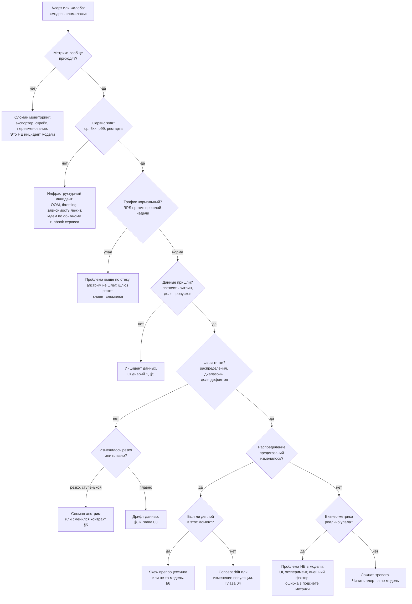

# Инциденты

> **Зачем эта глава.** В три часа ночи звонит телефон: «конверсия упала на 18%».
> У вас нет времени думать — нужен порядок действий. Здесь: дерево диагностики
> «модель сломалась» с конкретными запросами на каждой развилке; быстрые действия
> и правильный порядок их применения (почему сначала останавливают ущерб, а потом ищут
> причину); пять полностью разобранных реальных сценариев — от сломавшегося апстрима
> до утечки в обучении, найденной уже в проде; runbook как артефакт, который пишется
> заранее и проверяется учениями; постмортем без обвинений и почему это не про вежливость,
> а про качество разбора; устройство дежурства и эскалации.

**Уровень:** 🎯 middle → 🧠 middle+
**Предварительно нужно:** [что мониторить](01-what-to-monitor.md), [качество данных](02-data-quality.md), [дрифт данных](03-drift-detection.md), [деградация модели](04-model-degradation.md), [стек наблюдаемости](05-observability-stack.md)
**Время на проработку:** ~4 часа (чтение + написать runbook для своего сервиса + учения)

---

## Карта главы

- [1. Что такое инцидент в ML и чем он отличается от обычного](#1-что-такое-инцидент-в-ml-и-чем-он-отличается-от-обычного)
- [2. Первые пять минут: остановить ущерб, а не найти причину](#2-первые-пять-минут-остановить-ущерб-а-не-найти-причину)
- [3. Дерево диагностики](#3-дерево-диагностики)
- [4. Быстрые действия и порядок их применения](#4-быстрые-действия-и-порядок-их-применения)
- [5. Сценарий 1: сломался апстрим-источник фич](#5-сценарий-1-сломался-апстрим-источник-фич)
- [6. Сценарий 2: выкатили модель с другой версией препроцессинга](#6-сценарий-2-выкатили-модель-с-другой-версией-препроцессинга)
- [7. Сценарий 3: выросла латентность из-за роста каталога](#7-сценарий-3-выросла-латентность-из-за-роста-каталога)
- [8. Сценарий 4: дрифт после маркетинговой акции](#8-сценарий-4-дрифт-после-маркетинговой-акции)
- [9. Сценарий 5: утечка в обучении, обнаруженная в проде](#9-сценарий-5-утечка-в-обучении-обнаруженная-в-проде)
- [10. Runbook как артефакт](#10-runbook-как-артефакт)
- [11. Постмортем без обвинений](#11-постмортем-без-обвинений)
- [12. Дежурство и эскалация](#12-дежурство-и-эскалация)
- [13. Подводные камни](#13-подводные-камни)
- [14. Проверь себя](#14-проверь-себя)
- [15. Практика](#15-практика)
- [16. Что читать дальше](#16-что-читать-дальше)

---

## 1. Что такое инцидент в ML и чем он отличается от обычного

Инцидент — это состояние, при котором система наносит ущерб пользователю или бизнесу
и требует немедленного вмешательства человека. Не «что-то в графиках странное»,
а «прямо сейчас происходит плохое».

Три особенности ML-инцидентов, которые ломают обычные процессы дежурства.

**Первая: они начинаются раньше, чем обнаруживаются.** У backend-аварии время между
началом и обнаружением (MTTD, mean time to detect) измеряется минутами: упало — видно.
У ML-аварии типичное MTTD — часы, а если качество меряется по отложенной разметке —
дни. Модель, начавшая в понедельник предсказывать мусор из-за смены единиц измерения
в апстриме, будет обнаружена в четверг, когда просядет недельная бизнес-метрика.
Значит, к моменту звонка ущерб уже накоплен, и первый вопрос при разборе — не «что
происходит», а **«когда это началось»**.

**Вторая: откат не всегда помогает.** В backend откат релиза возвращает систему
в рабочее состояние с вероятностью около 100%. В ML — нет. Если сломался входной поток
данных, откат модели ничего не меняет: старая модель на тех же испорченных данных
предскажет такой же мусор. Если модель обучилась на испорченных данных две недели назад,
откатывать надо не на предыдущую версию, а на версию двухнедельной давности — если она
ещё существует.

**Третья: «система работает» — не признак здоровья.** Все обычные индикаторы зелёные:
200 OK, p99 в норме, поды живы. Это самый частый ML-инцидент: сервис исправно отдаёт
неправильные ответы. Поэтому диагностика начинается не с логов ошибок (их нет),
а с сопоставления входов и выходов.

**Классификация по серьёзности.** Без неё дежурство превращается в хаос: либо всё
объявляется аварией, либо ничего.

| Уровень | Критерий | Реакция | Кто вовлечён |
|---|---|---|---|
| **SEV-1** | Сервис недоступен или наносит прямой финансовый/репутационный ущерб: одобряются мошеннические заявки, лента показывает запрещённый контент, ошибочно блокируются платежи | немедленно, круглосуточно | дежурный + инцидент-менеджер + владелец продукта |
| **SEV-2** | Качество деградировало заметно: ключевая метрика упала на 10%+, доля фолбэков выше 20%, модель отдаёт константу | в течение часа, круглосуточно | дежурный, при необходимости эскалация |
| **SEV-3** | Деградация умеренная и не растёт: метрика упала на 2–5%, дрифт по нескольким фичам, одна витрина протухла | в рабочее время, тикет | владелец сервиса |
| **SEV-4** | Аномалия без видимого ущерба: PSI по одной второстепенной фиче, единичные ошибки | бэклог | владелец сервиса |

Ключевое правило, которое надо проговаривать вслух: **уровень определяется ущербом,
а не техническим масштабом поломки.** Упавшая витрина фич — это SEV-3, если сервис
корректно ушёл в фолбэк, и SEV-1, если фолбэка нет и модель начала одобрять всё подряд.

> 💬 **На собеседовании.** Спросят: «Чем ML-инцидент отличается от обычного продового?»
> Хороший ответ: «Тремя вещами. Во-первых, MTTD на порядок больше: система не падает,
> она тихо отдаёт неправильные ответы при 200 OK, поэтому к моменту обнаружения ущерб
> накоплен и первый вопрос — "когда началось", а не "что происходит". Во-вторых, откат
> релиза не гарантирует починку: если испортились входные данные, старая модель
> на них ошибётся так же. В-третьих, причина часто вне сервиса — в апстримном
> пайплайне, в чужой команде, в изменении реального мира. Отсюда диагностика идёт
> не от логов ошибок, а по слоям: инфраструктура → данные на входе → фичи →
> распределение предсказаний → бизнес-метрика, и на каждом слое есть свой запрос,
> который надо выполнить».
> Плохой ответ: «так же, откатываем релиз».

---

## 2. Первые пять минут: остановить ущерб, а не найти причину

Это главная дисциплинарная мысль всей главы, и на собеседовании её проверяют напрямую.

Инженер по природе хочет понять, что произошло. В инциденте это неправильный первый шаг.
Пока вы разбираетесь, ущерб продолжается: каждую минуту SEV-1 в антифроде — это
пропущенные мошеннические транзакции; каждая минута в рекомендациях — недополученная
выручка. Правильный порядок:

1. **Подтвердить (30 секунд).** Проблема реальна или сломался мониторинг? Быстрая
   проверка: жива ли метрика, есть ли трафик, не пропали ли ряды. Ложная тревога
   от сломанного экспортёра — очень частый случай (см. §13 главы 05).
2. **Объявить (1 минута).** Создать канал инцидента, назвать уровень, назначить
   ответственного (incident commander). Даже если вы один: явное объявление меняет режим
   работы и включает журнал.
3. **Остановить ущерб (2–5 минут).** Откат, фолбэк, отключение фичи — из §4.
   **Не дожидаясь понимания причины.**
4. **Зафиксировать состояние.** Прежде чем что-то чинить, сохраните: скриншоты графиков,
   образцы запросов с `trace_id`, срез логов предсказаний за период, версии всего.
   После починки эти данные будут недоступны или перезаписаны, а без них постмортем
   превратится в гадание.
5. **И только теперь — диагностировать.**

**Митигация ≠ починка.** Митигация останавливает ущерб (переключили на фолбэк-модель,
откатили версию, отключили сегмент). Починка устраняет причину. Их разделение —
не бюрократия: инцидент **закрывается** по факту митигации, а причина чинится
уже в нормальном режиме, головой, а не в панике в три часа ночи. Смешение этих
стадий — источник вторых аварий, когда уставший человек в четыре утра катит
«исправление», которое ломает больше, чем чинило.

> ⚠️ **Типичная ошибка.** «Сейчас быстро найду причину, это займёт пять минут» —
> и через сорок минут ущерб продолжается, а вы всё ещё смотрите в логи. Правило:
> **если митигация доступна и её стоимость приемлема, применяйте её сразу.**
> Откат на предыдущую версию модели стоит вам разницы в качестве между версиями
> (обычно 1–3%) — а бездействие стоит полного размера деградации.

---

## 3. Дерево диагностики

Диагностика идёт **снизу вверх по слоям**: от инфраструктуры к бизнесу. Причина —
в том, что нижние слои проверяются за секунды и объясняют большинство инцидентов,
а верхние требуют минут и данных.



Каждая развилка — это конкретный запрос, который надо выполнить. Вот они по порядку,
в том виде, в каком их стоит держать в runbook (PromQL-синтаксис из
[главы 05](05-observability-stack.md)):

**Шаг 0. Метрики живы?**
```promql
up{job="scoring"}
absent(inference_requests_total{job="scoring"})
```
Если `up == 0` или `absent` даёт результат — вы чините мониторинг, а не модель.
Проверьте заодно, не менялись ли имена метрик в последнем релизе.

**Шаг 1. Сервис жив?**
```promql
sum(rate(inference_requests_total{job="scoring", status=~"5..|timeout"}[5m]))
  / sum(rate(inference_requests_total{job="scoring"}[5m]))

histogram_quantile(0.99, sum by (le) (rate(inference_latency_seconds_bucket[5m])))

increase(kube_pod_container_status_restarts_total{namespace="ml"}[1h])
```
Ошибки и латентность в норме, рестартов нет — переходим дальше. Это отсеивает
инфраструктурный класс за 20 секунд.

**Шаг 2. Трафик нормальный?**
```promql
sum(rate(inference_requests_total[5m]))
sum(rate(inference_requests_total[5m] offset 7d))
```
Сравнение с «неделю назад в это же время» — обязательно с `offset 7d`, а не с «часом
раньше»: суточная и недельная сезонность иначе даст ложный вывод. Падение трафика
на 40% означает, что проблема **выше** по стеку и модель тут ни при чём.

**Шаг 3. Данные пришли?**
```promql
time() - max by (table) (feature_table_last_success_timestamp_seconds)

sum by (feature) (rate(feature_null_total[15m]))
  / scalar(sum(rate(inference_requests_total[15m])))
```
Возраст витрины больше 1.5 периода обновления — инцидент данных. Резкий рост доли
пропусков по одной фиче — почти всегда сломанный джойн в апстриме.

**Шаг 4. Фичи те же?**
Тут нужен запрос в хранилище логов предсказаний, а не в Prometheus:

```sql
-- ClickHouse: сравниваем ключевые статистики фичи «сейчас» и «неделю назад».
-- Не среднее одно: среднее устойчиво к тому, что 30% значений стали нулями,
-- если остальные подросли. Нужны доля нулей, квантили и мощность категорий.
SELECT
    toStartOfHour(ts)                              AS h,
    count()                                        AS n,
    avgIf(features_days_since_order, features_days_since_order IS NOT NULL) AS mean_val,
    quantile(0.5)(features_days_since_order)       AS p50,
    quantile(0.99)(features_days_since_order)      AS p99,
    countIf(features_days_since_order IS NULL) / count()  AS null_rate,
    countIf(features_days_since_order = 0)  / count()     AS zero_rate,
    uniqExact(features_city_code)                  AS city_cardinality
FROM ml_predictions
WHERE model_name = 'ranker'
  AND (ts >= now() - INTERVAL 6 HOUR
       OR (ts >= now() - INTERVAL 7 DAY - INTERVAL 6 HOUR
           AND ts <  now() - INTERVAL 7 DAY))
GROUP BY h
ORDER BY h;
```

Что искать: **ступеньку**. Плавное изменение — дрифт (не инцидент, тикет).
Ступенька в конкретный час — сломанный контракт, релиз апстрима, смена единиц
измерения. Резко упавшая мощность категориальной фичи (`city_cardinality` было 1200,
стало 3) — сломанный джойн: справочник не приехал, и все значения схлопнулись
в дефолт.

**Шаг 5. Распределение предсказаний изменилось?**
```promql
# средний скор сейчас против недели назад
(sum(rate(prediction_score_sum[1h])) / sum(rate(prediction_score_count[1h])))
  /
(sum(rate(prediction_score_sum[1h] offset 7d)) / sum(rate(prediction_score_count[1h] offset 7d)))

# доля предсказаний выше рабочего порога
1 - (sum(rate(prediction_score_bucket{le="0.5"}[1h])) / sum(rate(prediction_score_count[1h])))
```
Отдельный диагностический признак: **схлопывание распределения**. Если дисперсия
скоров упала почти до нуля и модель отдаёт почти константу — это не дрифт, это
сломанный вход: модель получает одинаковые (дефолтные) значения на всех запросах
и честно отвечает одинаково.

**Шаг 6. Когда началось?**

Это вопрос, который надо задавать **всегда**, и почти всегда его задают последним,
хотя он экономит больше всего времени. Найдите точный момент старта и сопоставьте
его с журналом изменений:

| Что искать в момент T | Где смотреть |
|---|---|
| Деплой сервиса или модели | аннотации Grafana, история деплоев, реестр моделей |
| Релиз апстрим-сервиса | их канал релизов, общая лента изменений |
| Изменение конфига (порог, флаг, правило) | история изменений конфигурации, feature flags |
| Запуск A/B-эксперимента | платформа экспериментов |
| Маркетинговая активность | календарь кампаний |
| Внешнее событие | новости, статус облачного провайдера |

**Эмпирика, которую полезно знать: 60–80% ML-инцидентов начинаются в момент какого-то
изменения, и примерно половина из них — не вашего.** Если ступенька на графике совпадает
с чужим релизом с точностью до пяти минут — вы нашли причину, дальше только подтвердить.

> 🌱 **База.** Если запомнить из главы только одно, пусть это будет последовательность
> из шести вопросов: (1) метрики живы? (2) сервис жив? (3) трафик нормальный?
> (4) данные пришли? (5) фичи те же? (6) предсказания те же? — и седьмой,
> который задаётся параллельно всем остальным: **когда это началось и что тогда
> изменилось?** Этот порядок закрывает подавляющее большинство случаев, и по нему
> можно идти, даже ничего не зная про конкретный сервис.

---

## 4. Быстрые действия и порядок их применения

Арсенал митигаций и правило выбора: **начинаем с самого обратимого и самого быстрого.**

| Действие | Время применения | Обратимость | Стоимость | Когда применять |
|---|---|---|---|---|
| Переключить трафик на предыдущую версию модели | 1–5 мин | полная | разница в качестве версий, 1–3% | подозрение на новую модель |
| Включить фолбэк-модель (простая, на признаках из запроса) | секунды (флаг) | полная | 10–30% качества | входные данные ненадёжны |
| Отключить проблемную фичу (заменить дефолтом) | секунды (конфиг) | полная | 1–10% качества | сломался один источник |
| Отключить сегмент/регион/платформу | секунды | полная | потеря трафика сегмента | проблема локализована |
| Поднять порог принятия решения | секунды | полная | сдвиг precision/recall | модель систематически завышает |
| Отдать статику/популярное/правила | секунды | полная | 30–60% качества | модель непригодна целиком |
| Остановить приём и вернуть ошибку | секунды | полная | 100% трафика | ущерб от неправильного ответа выше, чем от отсутствия ответа |
| Откатить апстрим-пайплайн и перелить данные | 30 мин – часы | частичная | простой | испорчены данные в хранилище |
| Переобучить модель | часы–сутки | — | — | **никогда не митигация**, только починка |

**Правильный порядок в SEV-1/SEV-2:**

1. **Флаг** (фолбэк, отключение фичи, отключение сегмента) — секунды, не требует деплоя.
2. **Откат версии модели** — минуты, если у вас есть механизм переключения по алиасу
   (`champion` → предыдущая версия) без пересборки образа.
3. **Откат релиза сервиса** — минуты, если препроцессинг живёт в коде.
4. **Ручное вмешательство в данные** — десятки минут, требует осторожности.

**Ключевое требование, которое надо заложить заранее.** Все три первых действия должны
быть возможны **без деплоя**. Если для включения фолбэка нужно поменять код, собрать
образ и прокатить его через CI — это 20–40 минут вместо 20 секунд, и вся эта разница
умножается на ущерб в минуту. Практически это означает: фолбэк-логика написана заранее,
включается флагом из конфигурации, и **этот путь регулярно тестируется** — иначе
в момент икс выяснится, что фолбэк-модель не загружается, потому что её артефакт
удалили из хранилища полгода назад.

> ⚠️ **Типичная ошибка.** «Переобучим на свежих данных» как реакция на инцидент.
> Это не митигация: обучение занимает часы, валидация — ещё часы, и всё это время
> ущерб продолжается. Хуже того: если причина в испорченных данных, вы обучите модель
> **на испорченных данных** и зафиксируете проблему в артефакте. Переобучение —
> инструмент починки после инцидента, и то не всегда (см. [главу 07](07-retraining.md)).

**Про откат: чем откатывать.** Три уровня, которые надо различать, потому что откатывать
приходится разное:

- **Версия модели** — артефакт весов. Откат: сменить алиас в реестре моделей и дождаться
  перезагрузки (или горячей подгрузки). Помогает, если сломала новая модель.
- **Версия сервиса** — код препроцессинга, бизнес-правил, контракта. Откат: обычный
  rollback деплоя. Помогает, если сломал релиз кода.
- **Версия данных** — снапшот витрины фич. Откат: переключить на предыдущую партицию
  или перелить. Помогает, если испортился апстрим.

Частая ошибка при разборе: откатили модель, стало не легче, объявили «дело не в откате».
На самом деле сломался слой ниже. Поэтому в runbook откат всегда идёт **с проверкой**:
«откатили → ждём 5 минут → смотрим конкретную метрику → если не помогло, идём
на следующий слой».

> 💬 **На собеседовании.** Спросят: «Модель в проде выдаёт странные предсказания.
> Ваши действия?»
> Хороший ответ: «Сначала митигация, потом диагностика. Первым делом проверю,
> что это не сломанный мониторинг: жива ли метрика, есть ли трафик. Если реально —
> объявляю инцидент и сразу включаю фолбэк флагом, не дожидаясь понимания причины:
> фолбэк-модель хуже на 20%, но это лучше, чем непонятно что. Фиксирую состояние —
> скриншоты, образцы запросов, версии. Дальше иду по слоям: сервис жив? трафик
> нормальный? витрины свежие? распределения фич не сдвинулись ступенькой?
> распределение скоров изменилось? И параллельно главное — когда это началось
> и что менялось в тот момент: свой деплой, чужой релиз, изменение конфига,
> старт эксперимента. Больше половины ML-инцидентов начинаются с изменения,
> и часто не нашего».
> Плохой ответ: «посмотрю логи» — логов ошибок при таком инциденте нет,
> сервис отвечает 200 OK.

---

## 5. Сценарий 1: сломался апстрим-источник фич

**Обстановка.** Скоринг заявок. 40 фич приходят из витрины `user_agg_1d`, которую
считает команда данных ночным Spark-джобом. Вторник, 09:40.

**Симптом.** Алерт `DegradedResponsesHigh`: доля ответов на дефолтных фичах выросла
с 0.4% до 62% за 20 минут. Ошибок нет, латентность даже улучшилась (походы в кэш
промахиваются быстрее, чем находят данные). Доля одобрений заявок выросла с 31% до 58%.

**Диагностика по дереву.** Шаги 0–2 чистые. Шаг 3 даёт ответ мгновенно:

```promql
time() - max by (table) (feature_table_last_success_timestamp_seconds{table="user_agg_1d"})
# → 41400 (11.5 часов при периоде обновления 24 часа — ещё не просрочено!)
```

А вот это уже интересно: витрина формально свежая. Смотрим глубже — в записи
предсказаний:

```sql
SELECT toStartOfMinute(ts) AS m,
       countIf(feature_sources_user_agg_1d_hit = 0) / count() AS miss_rate,
       uniqExact(entity_id_hash) AS users
FROM ml_predictions
WHERE ts >= now() - INTERVAL 2 HOUR
GROUP BY m ORDER BY m;
```

Доля промахов по онлайн-хранилищу — 62%. Витрина посчиталась, но **материализация
в онлайн-хранилище** (Redis) прошла частично: джоб упал на 38% ключей и не
отрапортовал об ошибке, потому что писал батчами и глотал исключения.

**Почему это важно как урок.** Метрика «время последнего успешного обновления» была,
но она отражала завершение расчёта, а не полноту загрузки. Классический случай, когда
мониторинг измеряет не то, что нужно: **проверять надо результат, а не факт запуска**.

**Митигация (применена на 6-й минуте).** Флагом включён режим `feature_group_fallback`:
для группы фич `user_agg_*` вместо дефолтов используется модель с урезанным набором
признаков, обученная заранее именно на этот случай. Доля одобрений вернулась к 33%.
Ущерб остановлен.

**Починка.** Команда данных перезапустила материализацию (25 минут). Прогнан
обратный разбор: 4 100 заявок, обработанных в окне инцидента, отправлены на ручной
пересмотр.

**Что изменили навсегда:**
- метрика полноты материализации: `feature_store_keys_written / feature_store_keys_expected`,
  алерт при значении ниже 0.99 с `for: 10m`;
- джоб материализации перестал глотать исключения — падает целиком, а не частично;
- контракт с командой данных: SLA на свежесть 6 часов, метрика владеется ими,
  алерт приходит им, а не только нам;
- фолбэк на урезанный набор фич стал регулярно проверяемым: раз в неделю
  автоматически включается на 1% трафика на 10 минут (см. §10 про учения).

---

## 6. Сценарий 2: выкатили модель с другой версией препроцессинга

**Обстановка.** Рекомендации товаров. Модель `ranker` версии 2.4.0 выкачена в 14:00
канареечно на 10%, в 15:30 — на 100%.

**Симптом.** В 16:10 продакт пишет: «выдача странная, в топе непонятные товары».
Технические метрики идеальны: p99 = 78 мс, ошибок 0.02%, доля деградаций 0.3%.
CTR по канарейке за первый час был в пределах шума, поэтому автоматический гейт
пропустил выкатку.

**Диагностика.** Шаги 0–4 чистые: сервис жив, трафик норма, витрины свежие,
распределения фич на входе не менялись. Шаг 5 показывает главное:

```promql
histogram_quantile(0.5, sum by (le, model_version) (rate(prediction_score_bucket[30m])))
# model_version="2.3.7" → 0.083
# model_version="2.4.0" → 0.311
```

Медиана скора выросла в 3.7 раза при **неизменном входе**. Это однозначно указывает
на модель или на препроцессинг, а не на данные. Шаг 6: началось ровно в 14:00 —
момент канареечной выкатки. Причём на канарейке 10% сдвиг был виден сразу, просто
никто не смотрел на распределение скоров — гейт проверял только CTR, у которого
за час на 10% трафика нет статистической мощности заметить эффект.

**Корневая причина.** В версии 2.4.0 инженер обновил библиотеку кодирования категорий,
и в новой версии неизвестная категория стала кодироваться не как `-1`, а как среднее
по таргету. Обучение прошло с новой библиотекой, поэтому офлайн-метрики были прекрасны.
А в проде выяснилось, что доля неизвестных категорий в обучающей выборке — 0.5%,
а в реальном трафике — 14%, потому что каталог обновляется чаще, чем собирается
обучающая выборка. Модель систематически завышала скор для новых товаров.

Это классический **train/serve skew**, только не в коде сервиса, а в **окружении**:
разные доли неизвестных категорий между обучением и продом (см.
[работу с признаками](../02-classic-ml/14-feature-engineering.md) и
[feature store](../07-mlops/03-data-and-feature-store.md)).

**Митигация (на 12-й минуте после жалобы).** Алиас `champion` переключён обратно
на 2.3.7. Медиана скора вернулась к 0.085 за 3 минуты (время подхвата новой версии подами).

**Что изменили навсегда:**
- в гейт канареечной выкатки добавлена проверка **распределения предсказаний**:
  KS-статистика между скорами канарейки и текущей модели на одном и том же трафике,
  порог 0.1, автоматический откат при превышении. Это ловит проблему за минуты,
  в отличие от CTR, которому нужны часы (подробнее — в [главе 07](07-retraining.md));
- добавлен тест на артефакте: прогнать зафиксированный набор из 1000 запросов
  через старую и новую модель, сравнить распределения скоров; расхождение медианы
  больше 20% — красный флаг в CI, требующий явного подтверждения;
- добавлена метрика доли неизвестных категорий в проде и её сравнение с обучающей
  выборкой — расхождение больше чем в 3 раза блокирует выкатку.

> ⚠️ **Типичная ошибка.** Считать, что канареечная выкатка защищает сама по себе.
> Канарейка защищает ровно настолько, насколько хороши её гейт-метрики. Если гейт
> смотрит на бизнес-метрику, у которой на 10% трафика за час нет мощности, канарейка —
> это просто медленный способ выкатить сломанное. Гейт обязан включать метрики,
> которые набирают статистику **быстро**: распределение предсказаний, доля деградаций,
> латентность, доля ошибок.

---

## 7. Сценарий 3: выросла латентность из-за роста каталога

**Обстановка.** Поиск по маркетплейсу, двухстадийная схема: ANN-отбор кандидатов
из HNSW-индекса, затем ранжирование бустингом. SLO p99 = 200 мс.

**Симптом.** В течение трёх недель p99 плавно вырос со 140 мс до 195 мс, потом
за два дня — до 260 мс. Алерт `ScoringLatencySLOBreach` сработал в четверг.
Ошибок нет, но клиентский шлюз начал отваливаться по таймауту 250 мс,
и доля пустых выдач выросла до 4%.

**Диагностика.** Это тот случай, когда «когда началось» отвечается не «в момент T»,
а «три недели назад плавно». Плавный рост исключает релиз и указывает на **рост
нагрузки или объёма данных**. Смотрим разбивку по стадиям:

```promql
histogram_quantile(0.99,
  sum by (le, stage) (rate(pipeline_stage_duration_seconds_bucket[10m])))
```

| Стадия | Три недели назад | Сейчас |
|---|---|---|
| `feature_fetch` | 4 мс | 5 мс |
| `candidates` (ANN) | 22 мс | 118 мс |
| `inference` | 55 мс | 84 мс |
| `postprocess` | 6 мс | 7 мс |

Растут две стадии. Причина одна: каталог вырос с 8 млн товаров до 21 млн
(запустили новую вертикаль и подключили крупного продавца).

Что при этом произошло технически:
- **ANN.** В HNSW время поиска растёт примерно как $O(\log N)$ при фиксированном
  `ef_search`, но **качество** (recall) при росте базы падает. Команда индекса,
  заметив падение recall, подняла `ef_search` со 120 до 400 — и время выросло линейно
  по `ef_search`, то есть более чем втрое.
- **Ранжирование.** Число кандидатов, отдаваемых на второй этап, было задано как
  «0.01% базы, но не меньше 500» — при росте базы это дало 2100 кандидатов вместо 800,
  и время бустинга выросло пропорционально.

**Урок, который стоит запомнить.** Инцидент вызван не поломкой, а **ростом**.
Параметры, которые заданы как доля от размера данных, — это мина с таймером:
они меняются сами, без единого коммита. Второе: латентность деградировала плавно
и трижды пересекала «мягкие» отметки, но алерт стоял только на SLO 200 мс —
то есть система молчала, пока не стало по-настоящему плохо.

**Митигация (на 15-й минуте).** `ef_search` возвращён на 200 (компромисс между recall
и временем), число кандидатов зафиксировано жёстко на 1000. p99 упал до 178 мс.
Доля пустых выдач вернулась к 0.1%.

**Починка (две недели работы).** Индекс разбит на шарды по вертикалям с параллельным
поиском и слиянием; для второй стадии включён батчинг и переход на ONNX Runtime,
что дало −40% времени скоринга.

**Что изменили навсегда:**
- добавлен **алерт на тренд**, а не только на порог:
  `p99 сегодня / p99 неделю назад > 1.25` с `for: 6h`, severity `ticket`. Он бы
  сработал за две недели до аварии;
- параметры, зависящие от размера данных, зафиксированы в абсолютных числах,
  а изменение размера базы стало отдельной метрикой с алертом на рост более 20% за неделю;
- в регулярный нагрузочный тест добавлен профиль «база ×2».

> 🧠 **Middle+.** Этот сценарий иллюстрирует важное свойство ML-систем: у них есть
> **медленные режимы отказа**, которых нет у обычных сервисов. Каталог растёт, история
> пользователей удлиняется, словарь категорий расширяется, эмбеддинги переобучаются
> и меняют геометрию пространства. Всё это меняет характеристики системы без единого
> изменения кода. Поэтому в ML-мониторинге нужны не только пороговые алерты
> («стало плохо»), но и трендовые («становится хуже»): отношение метрики к её значению
> неделю или месяц назад с большим `for` и низкой severity. Такой алерт даёт недели
> на реакцию вместо минут.

---

## 8. Сценарий 4: дрифт после маркетинговой акции

**Обстановка.** Модель предсказания вероятности покупки в рекомендациях. В пятницу
маркетинг запустил кампанию: скидка 40% на категорию «электроника» плюс рассылка
на 6 млн пользователей.

**Симптом.** В субботу PSI по фиче `avg_price_viewed_7d` = 0.41 (порог 0.2), PSI
по `category_share_electronics` = 0.63. Средний скор модели вырос с 0.09 до 0.14.
Конверсия при этом **выросла** на 12%.

**Диагностика и главный вопрос: а это вообще инцидент?**

Здесь проверяется зрелость инженера. Дрифт есть, метрики дрифта кричат — но модель
работает лучше, чем обычно. Разберёмся, что происходит.

Кампания изменила **распределение входа** (covariate shift): пришла толпа пользователей,
которых обычно нет, и все смотрят электронику. Зависимость «признаки → покупка»
при этом не изменилась — люди по-прежнему покупают то, что им интересно, просто
интересы у нынешней популяции другие. Формально:

$$
P_{\text{new}}(x) \ne P_{\text{old}}(x), \quad P_{\text{new}}(y \mid x) \approx P_{\text{old}}(y \mid x)
$$

где $x$ — вектор признаков, $y$ — целевая переменная (покупка), $P(x)$ — распределение
признаков, $P(y \mid x)$ — условное распределение таргета. При чистом ковариативном
сдвиге модель, хорошо оценивающая $P(y \mid x)$, остаётся корректной — она просто
работает в другой области пространства признаков. Проблемы начинаются, только если
эта область **слабо покрыта обучающей выборкой**: там модель экстраполирует,
и её ошибки непредсказуемы.

Проверка выполняется так:

```sql
-- Сравниваем качество (там, где таргет уже созрел) в дрейфующем сегменте
-- и в остальном трафике. Если в дрейфующем сегменте качество то же —
-- это ковариативный сдвиг без ущерба, и это НЕ инцидент.
SELECT
    campaign_cohort,
    count()                                    AS n,
    avg(target)                                AS actual_rate,
    avg(prediction)                            AS predicted_rate,
    avg(prediction) / avg(target)              AS calibration_ratio
FROM ml_predictions_with_targets
WHERE ts >= now() - INTERVAL 3 DAY
GROUP BY campaign_cohort;
```

Результат: в когорте кампании `calibration_ratio` = 1.06, в обычном трафике 1.02.
Модель слегка недооценивает — но в пределах приемлемого. **Вывод: это не инцидент,
это ожидаемая реакция мониторинга на известное событие.** Правильное действие —
подавить алерты дрифта на период кампании и зафиксировать событие, а не бить тревогу.

**А когда то же самое было бы инцидентом?** Три признака, при которых дрифт после
акции переходит в аварию:

1. **`calibration_ratio` уехал** (например, 1.8): модель систематически завышает,
   потому что «интерес» в промо-трафике не означает покупку. Это уже concept drift —
   изменилось $P(y \mid x)$.
2. **Сегмент попал в область без данных.** Если 3 млн новых пользователей имеют
   пустую историю, а модель на пользователях без истории обучалась на 2% выборки —
   она там ненадёжна, и это надо ловить метрикой «доля предсказаний вне обучающего
   распределения».
3. **Петля обратной связи.** Модель, увидев всплеск электроники, начинает рекомендовать
   электронику всем, что порождает ещё больше кликов по электронике, что после
   переобучения усиливает эффект. Через два цикла переобучения выдача вырождается
   (см. [холодный старт и смещения](../06-recsys/12-cold-start-and-bias.md)).

**Что изменили навсегда:**
- календарь маркетинговых кампаний интегрирован с системой алертов: на период кампании
  алерты дрифта по затронутым фичам переводятся в `ticket` и снабжаются контекстом
  «идёт кампания X»;
- добавлена метрика `calibration_ratio` в разрезе когорт — именно она, а не PSI,
  отвечает на вопрос «а модели-то плохо?»;
- в постмортеме зафиксировано правило: **дрифт входа без ухудшения калибровки —
  не инцидент**; дрифт с ухудшением калибровки — инцидент независимо от значения PSI.

> 💬 **На собеседовании.** Спросят: «PSI = 0.4, что делаете?»
> Хороший ответ: «Само по себе значение PSI ничего не говорит о том, плохо ли модели.
> Сначала выясню, что за сдвиг: посмотрю, какие именно фичи поехали и не совпадает ли
> это с известным событием — акцией, релизом, сезоном, подключением нового источника
> трафика. Потом проверю главное: изменилось ли качество там, где таргет уже есть,
> и как себя ведёт калибровка в дрейфующем сегменте против остального трафика.
> Если калибровка в норме — это ковариативный сдвиг, модель работает, и правильное
> действие — задокументировать событие и, возможно, подавить алерт на период. Если
> калибровка уехала — это уже изменение зависимости, и тогда обсуждаем переобучение
> или временную коррекцию порога. Отдельно проверю, не попал ли сегмент в область,
> где у модели мало обучающих данных: там ошибки непредсказуемы даже при формально
> корректной модели».
> Плохой ответ: «PSI больше 0.2 — переобучаем». Переобучение на данных периода
> акции зафиксирует аномальное поведение как норму, и после окончания акции модель
> станет хуже, чем была.

---

## 9. Сценарий 5: утечка в обучении, обнаруженная в проде

**Обстановка.** Антифрод для платежей. Новая модель показала на офлайн-валидации
ROC-AUC 0.981 против 0.943 у текущей — команда обрадовалась и выкатила.

**Симптом.** Через сутки после выкатки: доля заблокированных транзакций упала
с 0.8% до 0.15%, при этом жалобы на пропущенный фрод выросли втрое. Технически всё
идеально: распределение скоров даже похоже на прежнее, латентность в норме,
деградаций нет.

**Диагностика.** Первое, что выглядит странно: **офлайн-качество отличное,
онлайн-качество провальное.** Такое расхождение имеет ровно три типичные причины,
и их надо перебирать в этом порядке:

1. **Утечка (leakage)** — в обучении использовался признак, недоступный или
   имеющий другое значение в момент предсказания.
2. **Train/serve skew** — признаки считаются по-разному в обучении и в проде.
3. **Неправильная валидация** — сплит не учитывает время или группы, и офлайн-оценка
   завышена (см. [валидацию и утечки](../02-classic-ml/13-validation-and-leakage.md)).

Проверка выполняется одним приёмом, который стоит знать: **сравнить распределения
признаков между обучающей выборкой и логами предсказаний**.

```sql
-- Для каждой фичи: среднее и доля пропусков в обучающей выборке против прода.
-- Ищем фичу, у которой поведение радикально разное. Это и есть утечка или skew.
SELECT feature_name,
       train_mean, prod_mean,
       train_null_rate, prod_null_rate,
       abs(train_mean - prod_mean) / nullIf(abs(train_mean) + abs(prod_mean), 0) AS rel_gap
FROM feature_stats_comparison
WHERE model_version = '3.0.0'
ORDER BY rel_gap DESC
LIMIT 20;
```

Виновник нашёлся первой строкой: признак `merchant_risk_score` в обучающей выборке
имел долю пропусков 2%, а в проде — 71%. Разбор: этот признак считается внешним
антифрод-провайдером **асинхронно**, и в среднем приезжает через 3–8 минут после
транзакции. При сборке обучающей выборки данные брались из витрины «как есть на момент
выгрузки» — то есть уже с приехавшим скором. В проде же в момент решения скора ещё нет.

Более того — и это делает случай особенно злым — `merchant_risk_score` у мошеннических
транзакций приезжал **быстрее** (провайдер приоритизировал подозрительные), так что
сам факт наличия значения коррелировал с фродом. Модель выучила «если поле заполнено —
это фрод», что в обучении давало почти идеальное разделение, а в проде превратилось
в «поле почти всегда пустое → не фрод».

Это **утечка через время** (temporal leakage), она же нарушение
**point-in-time correctness**: в обучении использовалось знание из будущего
относительно момента принятия решения.

**Митигация (на 25-й минуте).** Откат на версию 2.9.4. Доля блокировок вернулась
к 0.8%. Отдельно: транзакции за сутки инцидента отправлены на ретроспективный скоринг
старой моделью, подозрительные — на ручную проверку.

**Починка.** Обучающая выборка пересобрана с корректной точкой во времени: для каждой
транзакции берутся только те значения признаков, которые были доступны **на момент
принятия решения**. После этого ROC-AUC новой модели упал с 0.981 до 0.947 —
то есть реальный прирост над текущей моделью составлял 0.004, а не 0.038.

**Что изменили навсегда:**
- обучающая выборка собирается **из логов предсказаний**, а не из витрин: в логе
  записан ровно тот вектор, который ушёл в модель (см. §11 [главы 05](05-observability-stack.md)).
  Это радикально закрывает целый класс утечек, потому что физически невозможно
  записать в лог то, чего в момент предсказания не было;
- в CI добавлена автоматическая проверка: доля пропусков каждого признака
  в обучающей выборке против свежих логов прода; расхождение больше чем в 2 раза —
  блокировка выкатки;
- введено правило ревью: подозрительно высокая офлайн-метрика (прирост более
  0.02 AUC над текущей моделью) требует явного поиска утечки перед выкаткой,
  а не радости. Формулировка в чек-листе: **«слишком хорошо — значит утечка,
  пока не доказано обратное»**;
- добавлена канареечная валидация с гейтом по онлайн-прокси-метрике (доля блокировок),
  которая поймала бы это за час на 5% трафика.

> 💬 **На собеседовании.** Спросят: «Офлайн AUC вырос на 0.04, в проде стало хуже.
> Что случилось?»
> Хороший ответ: «Три главных подозреваемых, в порядке вероятности. Первый — утечка:
> в обучении использован признак, которого в момент предсказания нет или у которого
> другое значение; классика — признаки, приезжающие асинхронно, и агрегаты, посчитанные
> по окну, включающему момент таргета. Второй — train/serve skew: препроцессинг
> в обучении и в сервисе считает признаки по-разному. Третий — неправильная валидация:
> сплит без учёта времени или групп завышает офлайн-оценку. Проверяю в первую очередь
> сравнением распределений признаков между обучающей выборкой и логами прода —
> доля пропусков, среднее, квантили по каждому признаку. Обычно виновник виден первой
> строкой. И системное лекарство: собирать обучающую выборку из логов предсказаний,
> тогда физически нельзя обучиться на том, чего в момент решения не было».
> Плохой ответ: «модель переобучилась» — переобучение проявилось бы и на офлайн-валидации,
> а тут офлайн как раз прекрасен.

---

## 10. Runbook как артефакт

**Runbook** — документ, по которому дежурный действует в конкретной ситуации, не думая.
Это не описание системы и не архитектурная схема; это последовательность команд
и решений.

Критерий качества у runbook ровно один и он жёсткий: **человек, который не разрабатывал
этот сервис, должен по runbook в три часа ночи довести инцидент до митигации.**
Всё, что этому не служит, — лишнее.

**Структура (одна страница на алерт):**

```markdown
# Runbook: DegradedResponsesHigh (scoring)

## Что означает алерт
Доля ответов, посчитанных на дефолтных значениях фич, превысила 5% на 15 минут.
Модель отвечает, но на неполных данных. Ожидаемое влияние: качество ранжирования
падает на 10–25%, конверсия — на 3–8%.

## Уровень
SEV-2. Если доля выше 40% — SEV-1 (модель фактически работает вслепую).

## Дашборд
https://grafana.internal/d/scoring-ops (строка «Зависимости»)

## Диагностика: 3 шага, 2 минуты
1. Какой источник отвалился:
   sum by (reason) (rate(inference_degraded_total[5m]))
2. Жив ли онлайн feature store:
   redis-cli -h feature-store-prod ping
   histogram_quantile(0.99, sum by (le) (rate(feature_fetch_duration_seconds_bucket[5m])))
3. Свежесть витрин:
   time() - max by (table) (feature_table_last_success_timestamp_seconds)

## Митигация
| Что видим | Что делаем | Команда | Ожидаемый эффект |
|---|---|---|---|
| Redis недоступен | включить фолбэк на модель без агрегатов | `mlctl flag set scoring.fallback_model=reduced_v3` | доля деградаций → 0 за 30 с, качество −18% |
| Одна группа фич пуста | отключить группу | `mlctl flag set scoring.disable_feature_group=user_agg` | качество −7% |
| Витрина протухла > 6 ч | эскалация в data-eng, канал #data-oncall | — | они перезапускают джоб, 20–40 мин |
| Не помогло ничего | отдать популярное | `mlctl flag set scoring.mode=popular` | качество −45%, но выдача валидна |

## Проверка, что помогло
Через 5 минут после действия:
  sum(rate(inference_degraded_total[5m])) / sum(rate(inference_requests_total[5m])) < 0.05
Если не помогло — эскалация (§12), не повторяйте то же самое.

## Откат митигации
`mlctl flag unset scoring.fallback_model` — только после подтверждения, что
источник восстановлен и доля деградаций держится ниже 1% в течение 30 минут.

## Владелец и эскалация
Владелец: команда ml-platform. Эскалация: @team-lead → @head-of-ml.
Смежники: data-eng (витрины), platform (Redis).

## Последнее обновление / последняя проверка
2026-06-14 / учения 2026-07-02, прошли за 4 мин
```

**Пять правил, отличающих рабочий runbook от декоративного:**

1. **Один runbook — один алерт**, и ссылка на него лежит в `annotations.runbook_url`
   правила Prometheus. Если runbook нельзя открыть из уведомления одним кликом,
   его не откроют.
2. **Команды копируются целиком.** Не «проверьте состояние Redis», а точная строка
   с хостом. В три ночи человек не должен вспоминать имена хостов.
3. **Ожидаемый эффект каждого действия указан числом.** Дежурный должен понимать
   цену: «качество −18%» — это осознанное решение, а «включить фолбэк» без цены —
   лотерея.
4. **Есть критерий «помогло/не помогло» и что делать, если не помогло.** Самая частая
   дыра: runbook описывает действие и обрывается. Тупик — самая частая причина
   затянувшихся инцидентов.
5. **Runbook проверяется учениями.** Раз в квартал: берём человека, который этот сервис
   не писал, даём алерт в тестовом контуре, засекаем время до митигации. Всё, что
   он не смог сделать по документу, — дефект runbook, а не человека. Runbook,
   не проверявшийся полгода, с высокой вероятностью содержит устаревшие команды,
   мёртвые ссылки и упоминания уволившихся людей.

**Что должно существовать до первого инцидента**, иначе runbook не на что опереться:

- фолбэк-модель, обученная и лежащая в реестре, с проверенной загрузкой;
- флаги, переключающие режимы **без деплоя**;
- механизм отката модели по алиасу за минуты;
- как минимум две последние версии модели, доступные для отката (а лучше — все
  версии за квартал);
- доступы у дежурного: он должен иметь право нажать на все кнопки из runbook
  без согласований в три часа ночи.

---

## 11. Постмортем без обвинений

**Постмортем** (postmortem) — документ, который пишется после инцидента и отвечает
на вопрос «что в системе позволило этому случиться». Не «кто виноват».

**Почему blameless — это не про вежливость.** Аргумент чисто инженерный: если
за инцидент наказывают, люди перестают о нём рассказывать. Инциденты начинают
«разруливаться тихо», информация не доходит до постмортема, повторяющиеся проблемы
не находятся, и организация теряет главный источник знаний о собственных слабых местах.
Обвинительная культура покупает разовое удовлетворение ценой систематической слепоты.

Второй аргумент: «человеческий фактор» почти никогда не является корневой причиной.
Если инженер смог одной командой удалить продовую витрину — проблема в том, что
такая команда была доступна и не требовала подтверждения, а не в инженере.
Формулировка-тест: **если ответ на «почему это случилось» звучит как имя человека,
вы не дошли до причины.**

**Структура постмортема:**

```markdown
# Постмортем: скоринг работал на дефолтных фичах 78 минут

**Дата:** 2026-07-14  **Уровень:** SEV-2  **Автор:** <имя>
**Статус:** причины устранены / в работе

## Влияние
- 62% заявок (≈41 000) обработаны на неполных признаках
- Доля одобрений выросла с 31% до 58%; 4 100 заявок отправлены на пересмотр
- Оценка ущерба: X руб. ожидаемых потерь по портфелю
- Пользователи: задержек и ошибок не заметили

## Хронология (в UTC, с фактами и ссылками)
09:12 — джоб материализации user_agg_1d начал писать в Redis
09:19 — джоб упал на 38% ключей; исключение проглочено, статус «успех»
09:41 — доля деградаций пересекла 5%
09:56 — сработал алерт DegradedResponsesHigh (for: 15m)
10:02 — дежурный подтвердил, объявил SEV-2
10:08 — включён фолбэк reduced_v3; доля деградаций → 0.2%
10:20 — data-eng перезапустили материализацию
10:47 — материализация завершена, фолбэк снят
11:30 — заявки периода отправлены на пересмотр

## Что сработало хорошо
- Алерт на долю деградаций существовал и сработал корректно
- Фолбэк-модель была готова и включилась флагом за 40 секунд
- Runbook содержал точную команду; дежурный не разработчик сервиса

## Корневые причины (не «кто», а «что в системе»)
1. Джоб материализации обрабатывал ключи батчами и глотал исключения
   на уровне батча — частичный отказ выглядел как успех.
2. Метрика свежести отражала завершение расчёта, а не полноту загрузки:
   мы измеряли не тот факт.
3. Между началом (09:19) и алертом (09:56) прошло 37 минут: `for: 15m`
   плюс порог 5% при медленном нарастании.

## Что делаем (с владельцем и сроком)
| Действие | Тип | Владелец | Срок | Тикет |
|---|---|---|---|---|
| Убрать глотание исключений в материализации | устранение причины | data-eng | 18.07 | DATA-4412 |
| Метрика полноты keys_written/keys_expected + алерт < 0.99 | обнаружение | ml-platform | 20.07 | ML-2231 |
| Снизить порог алерта деградаций до 2% с for: 5m | обнаружение | ml-platform | 16.07 | ML-2232 |
| Еженедельная проверка фолбэка на 1% трафика | защита | ml-platform | 25.07 | ML-2233 |
| SLA на свежесть витрины, метрика во владении data-eng | процесс | оба лида | 01.08 | ML-2234 |

## Чего мы НЕ делаем и почему
Не переходим на синхронную запись фич в момент запроса: это увеличило бы p99
на 15–25 мс и создало новую точку отказа. Осознанное решение.
```

**Три содержательных требования к разделу «Корневые причины»:**

- **Причин обычно несколько.** Инцидент — это всегда цепочка: что-то сломалось,
  что-то не заметило, что-то не защитило. Останавливаться на первой причине —
  значит починить одно звено из трёх.
- **Метод «пяти почему» с осторожностью.** Он полезен как способ не остановиться
  на симптоме, но легко скатывается в единственную линейную цепочку, тогда как
  реальность ветвится. Лучше явно разделять причины на три класса:
  **что сломалось** (техническая причина), **почему не заметили** (дефект обнаружения),
  **почему не защитило** (дефект устойчивости).
- **Каждая причина порождает действие с владельцем и сроком.** Постмортем без
  тикетов — это литература. И отдельно полезно фиксировать, что вы сознательно
  **не** делаете: это защищает от повторного обсуждения через полгода.

**Метрики процесса, которые стоит считать по постмортемам:**

| Метрика | Что показывает | Ориентир |
|---|---|---|
| MTTD (обнаружение) | качество мониторинга | минуты для инфраструктуры, ≤ 1 часа для качества модели |
| MTTM (митигация) | качество runbook и наличие кнопок | ≤ 15 минут для SEV-1/2 |
| MTTR (полное восстановление) | зрелость системы | зависит |
| Доля инцидентов, обнаруженных мониторингом, а не людьми | зрелость мониторинга | > 80% |
| Доля повторных инцидентов той же причины | качество постмортемов | < 10% |
| Доля выполненных action items за 30 дней | серьёзность процесса | > 80% |

Самая говорящая из них — **доля инцидентов, о которых первым сообщил человек, а не
алерт**. Если продакт узнаёт о проблеме раньше мониторинга — это прямой дефект
наблюдаемости, и каждый такой случай должен порождать новый алерт.

> 💬 **На собеседовании.** Спросят: «Расскажите про инцидент, который вы разбирали»
> (это стандартный вопрос поведенческой секции, см. [главу про behavioral](../14-career/02-behavioral.md)).
> Хороший ответ строится как мини-постмортем: влияние в числах → как обнаружили
> и за сколько → что сделали для митигации и почему именно это → корневая причина
> (не «человек ошибся», а «система позволила») → что изменили, чтобы не повторилось →
> и обязательно: что при этом сработало хорошо. Отдельный плюс — назвать, что вы
> **не** стали делать и почему.
> Плохой ответ: героическая история про то, как вы в одиночку ночью всё починили,
> без корневой причины и без системных изменений. Интервьюер услышит, что через месяц
> это повторится.

---

## 12. Дежурство и эскалация

**Зачем формальное дежурство.** Без него работает антипаттерн «звоним тому, кто
разбирается» — то есть всегда одному и тому же человеку. Через год он выгорает
и уходит, унося с собой всё знание о системе.

**Устройство ротации.** Практика, сложившаяся в индустрии:

- Смена — неделя, передача в понедельник или среду (не в пятницу: передавать смену
  перед выходными — плохая идея).
- Минимум 6 человек в ротации. При четырёх дежурство приходится раз в месяц,
  и это уже тяжело; при трёх — каждая третья неделя, что гарантированно приводит
  к выгоранию.
- Основной и резервный дежурный. Резервный подключается, если основной не ответил
  за 10 минут — не как наказание, а как штатный механизм: люди спят, у людей
  разряжается телефон.
- Явное правило компенсации: ночные подъёмы оплачиваются или компенсируются
  отгулами. Без этого дежурство держится на энтузиазме, а энтузиазм кончается.

**Целевая нагрузка.** Ориентир из практики SRE: **не более 2 подъёмов уровня `page`
за смену**. Если больше — это не проблема дежурного, это дефект системы или алертов,
и починка этого имеет приоритет над фичами. Полезное следствие: в конце каждой смены
дежурный пишет короткий отчёт «что звонило и что с этим делать», и эти отчёты
разбираются на командной встрече. Именно так алерты постепенно становятся полезными.

**Что должно быть у дежурного до начала смены:**

- доступы ко всем кнопкам из runbook, работающие **проверенно** (не «должны быть»);
- список сервисов в его зоне с владельцами и runbook'ами;
- контакты смежных дежурных (data-eng, платформа, инфраструктура);
- право принимать решения о митигации без согласования. Дежурный, которому надо
  разбудить лида, чтобы получить разрешение на откат, — это не дежурный.

**Эскалация.** Три триггера, по которым надо звать помощь, и их стоит записать явно,
потому что люди стесняются эскалировать:

1. **По времени.** SEV-1 не митигирован за 30 минут; SEV-2 — за 2 часа. Не «когда
   стало совсем плохо», а по таймеру.
2. **По границе зоны.** Причина за пределами вашей ответственности (упал апстрим,
   лежит сеть) — эскалация к владельцу немедленно, не пытайтесь чинить чужое.
3. **По непониманию.** Дежурный не понимает, что происходит, после прохождения
   дерева диагностики. Это нормально и должно быть явно разрешено.

Отдельная роль в крупных инцидентах — **incident commander**: человек, который
не чинит, а координирует. Он ведёт хронологию, распределяет задачи, общается
с продуктом и руководством, следит за таймерами эскалации. Разделение «чинит» и
«координирует» кажется избыточным до первого инцидента, в котором единственный
компетентный инженер вместо диагностики отвечает на вопросы «ну что там?»
в трёх чатах одновременно.

**Специфика ML-дежурства.** Два отличия от классического:

- **Не все ML-алерты требуют круглосуточного дежурства.** Дрифт, PSI, деградация
  качества — это `ticket` на рабочее время. Будить человека ночью из-за PSI = 0.25 —
  верный способ убить дежурство. Круглосуточно будят только SEV-1/SEV-2:
  недоступность, массовые фолбэки, прямой ущерб.
- **Дежурному нужна отдельная компетенция.** Backend-дежурный не сможет отличить
  ковариативный сдвиг от concept drift и оценить, надо ли откатывать модель.
  Отсюда практика: либо в ML-командах своя ротация, либо у платформенного дежурного
  есть чёткий runbook «когда звать ML-инженера» с однозначными критериями.

---

## 13. Подводные камни

**Инцидент «разобрали», через месяц он повторился один в один.**
Симптом: то же самое, тот же алерт, те же действия.
Причина: постмортем закончился на симптоме («витрина не обновилась»), не дойдя
до причины («джоб глотает исключения»), или action items не были доведены до конца.
Что делать: обязательное разделение причин на «что сломалось / почему не заметили /
почему не защитило»; ревью выполнения action items через 30 дней; метрика доли
повторных инцидентов.

**Дежурный получил алерт, открыл runbook — команда не работает.**
Симптом: в runbook `mlctl flag set ...`, а утилита переименована полгода назад.
Причина: runbook не проверялся с момента написания.
Что делать: квартальные учения с человеком, который сервис не писал; дата последней
проверки — обязательное поле в шапке; runbook лежит в том же репозитории, что и код,
и меняется в том же PR, что и интерфейс.

**Митигация сделала хуже.**
Симптом: включили фолбэк — доля ошибок выросла.
Причина: фолбэк-путь не тестировался и сам сломан: артефакт удалён из хранилища,
схема входа разошлась, зависимость не поднята.
Что делать: регулярная автоматическая проверка фолбэка на 1% трафика; фолбэк —
часть CI, а не «аварийный запасник, к которому никто не притрагивался год».

**Инцидент затянулся, потому что все чинили параллельно и мешали друг другу.**
Симптом: три человека одновременно откатывают, перезапускают и меняют конфиг;
непонятно, какое действие дало эффект.
Причина: нет incident commander, нет журнала действий.
Что делать: явно назначенный координатор с первой минуты; правило «одно изменение
за раз, с фиксацией в канале и с ожиданием эффекта»; хронология ведётся в реальном
времени, а не восстанавливается потом по памяти.

**После починки инцидент объявили закрытым, а ущерб продолжился.**
Симптом: модель починена, но 40 000 неправильных решений уже принято и никто
их не пересматривает.
Причина: инцидент воспринимается как техническое событие, а не как событие
с последствиями для пользователей.
Что делать: в чек-лист закрытия инцидента входит пункт «обратный разбор»:
какие объекты обработаны неправильно, как их найти (по `event_id` и окну времени
в логах предсказаний), нужен ли ретроспективный пересчёт, компенсация,
уведомление пользователей.

**Мониторинг молчал, о проблеме сообщил продакт.**
Симптом: инцидент обнаружен человеком, а не системой.
Причина: не было метрики на этот класс отказов; или алерт был, но с порогом,
до которого не дошло; или ряд исчез и алерт «инактивен».
Что делать: считать это отдельным дефектом наблюдаемости; каждый такой случай
обязан породить новый алерт; следить за метрикой «доля инцидентов, обнаруженных
мониторингом» (целевое значение — выше 80%).

**Откатили модель — не помогло, растерялись.**
Симптом: митигация первого уровня не сработала, дальнейший план отсутствует.
Причина: смешение уровней отката (модель / код сервиса / данные) — откатили не тот слой.
Что делать: в runbook — явная лестница: откат модели → откат релиза сервиса →
проверка данных → полный фолбэк на правила; на каждой ступени критерий «помогло/нет»
и время ожидания.

**Дежурный отключил алерт вместо того, чтобы разобраться.**
Симптом: алерт заглушен (silence) «на время разбора» и остался заглушен на месяц.
Причина: у silence не было срока, и никто не отслеживает заглушенные правила.
Что делать: silence всегда с явным TTL (максимум сутки) и обязательной ссылкой
на тикет; еженедельный обзор активных silence; алерт на silence старше 7 дней.

**Инцидент в чужой системе, но чинят вас.**
Симптом: апстрим сломал контракт, но эскалация к ним занимает часы, потому что
у них нет дежурства или нет SLA.
Причина: зависимость без контракта и без SLA.
Что делать: явные контракты данных с SLA на свежесть и полноту, метрики во владении
поставщика, алерты приходят ему (см. [качество данных](02-data-quality.md)
и [feature store](../07-mlops/03-data-and-feature-store.md)); а на своей стороне —
защита фолбэком, потому что рассчитывать на чужую скорость реакции нельзя.

---

## 14. Проверь себя

<details>
<summary><b>🎯 Вопрос.</b> Модель в проде выдаёт странные предсказания. Опишите порядок действий.</summary>

**Короткий ответ.** Подтвердить, что проблема реальна (не сломан ли мониторинг) →
объявить инцидент и назначить ответственного → **остановить ущерб митигацией,
не дожидаясь понимания причины** → зафиксировать состояние для будущего разбора →
диагностировать по слоям снизу вверх.

**Развёрнуто.** Порядок именно такой, потому что каждая минута разбирательства —
это продолжающийся ущерб. Митигация — флаг фолбэка (секунды), откат версии модели
(минуты), откат релиза сервиса (минуты). Все три обязаны работать без деплоя, иначе
20 секунд превращаются в 30 минут. Фиксация состояния до починки критична: после
переключения версий образцы запросов, распределения и логи станут недоступны или
перемешаются. Диагностика идёт снизу вверх — метрики живы? сервис жив? трафик
нормальный? данные пришли? фичи те же? предсказания те же? — потому что нижние
слои проверяются за секунды и объясняют большинство случаев. И параллельно всему
главный вопрос: **когда началось и что тогда изменилось**; 60–80% ML-инцидентов
начинаются с изменения, и примерно половина — не вашего.

**Чего ждёт интервьюер:** дисциплины «сначала митигация, потом диагностика» и наличия
структуры вместо «посмотрю логи».

**Провал:** начать с чтения логов — при таком инциденте логов ошибок нет,
сервис отдаёт 200 OK.
</details>

<details>
<summary><b>🎯 Вопрос.</b> Чем ML-инцидент отличается от обычного продового?</summary>

**Короткий ответ.** Тремя вещами: он обнаруживается на порядок позже (тихий отказ
при 200 OK), откат не гарантирует починку (испорченные данные ломают и старую модель),
и причина часто вне вашего сервиса — в апстримном пайплайне или в изменившемся
реальном мире.

**Развёрнуто.** MTTD обычной аварии — минуты, ML-аварии — часы или дни, если качество
меряется по отложенной разметке. Значит, к моменту звонка ущерб уже накоплен, и первый
вопрос — «когда началось», а не «что происходит». Откат в backend возвращает рабочее
состояние почти наверняка; в ML нужно понимать, **что** откатывать: версию модели,
версию кода сервиса (там живёт препроцессинг) или версию данных. Если модель обучилась
на испорченных данных две недели назад, откатывать надо на версию двухнедельной
давности — если она вообще сохранилась. И третье: обычные индикаторы здоровья
зелёные, поэтому диагностика начинается не с ошибок, а с сопоставления распределений
входа и выхода.

**Чего ждёт интервьюер:** понимания, что «система работает» и «модель работает» —
разные утверждения.

**Провал:** «так же, откатываем релиз».
</details>

<details>
<summary><b>🧠 Вопрос.</b> Доля деградированных ответов выросла до 60%. Ваши действия и почему именно в таком порядке?</summary>

**Короткий ответ.** Включить фолбэк-модель флагом (секунды), затем выяснить, какой
источник отвалился, затем эскалировать владельцу источника. Фолбэк — первым, потому
что при 60% деградаций модель фактически работает вслепую, а фолбэк-модель на урезанном
наборе признаков хуже на 15–25%, но предсказуема.

**Развёрнуто.** Разбивка `sum by (reason) (rate(inference_degraded_total[5m]))` за секунды
показывает, какая группа фич пропала. Дальше три ветки: онлайн-хранилище недоступно
(проверяется пингом и латентностью походов), витрина протухла (проверяется метрикой
свежести), материализация прошла частично (проверяется полнотой — и это самый коварный
случай, потому что метрика свежести при нём зелёная: она отражает завершение расчёта,
а не полноту загрузки). Уровень: SEV-2 при доле 5–40%, SEV-1 выше 40%, потому что
модель на дефолтных значениях систематически смещена — например, в скоринге это
проявляется резким ростом доли одобрений. Обязательный пункт после митигации —
обратный разбор: найти объекты, обработанные в окне инцидента, и решить, нужен ли
ретроспективный пересчёт.

**Чего ждёт интервьюер:** что вы примените митигацию до диагностики и что вспомните
про обратный разбор уже принятых решений.

**Провал:** пойти чинить источник, оставив модель работать вслепую ещё полчаса.
</details>

<details>
<summary><b>🧠 Вопрос.</b> Офлайн-метрика новой модели заметно лучше, а в проде стало хуже. Почему?</summary>

**Короткий ответ.** Три главных подозреваемых в порядке вероятности: утечка в обучении
(признак, недоступный в момент предсказания), train/serve skew (признаки считаются
по-разному в обучении и в сервисе) и неправильная валидация (сплит без учёта времени
или групп). Проверяется сравнением распределений признаков между обучающей выборкой
и логами прода.

**Развёрнуто.** Самый частый и самый злой случай — утечка через время: признак приезжает
асинхронно и в обучающей выборке уже заполнен, а в момент решения его нет. Если при
этом скорость его прихода коррелирует с таргетом (провайдер приоритизирует подозрительные
транзакции), модель выучивает «поле заполнено → позитив», что даёт почти идеальное
офлайн-разделение и полную бесполезность в проде. Диагностика: по каждому признаку
сравнить долю пропусков, среднее и квантили в обучающей выборке против свежих логов
предсказаний; виновник обычно виден первой строкой при сортировке по расхождению.
Системное лекарство — собирать обучающую выборку **из логов предсказаний**, а не
из витрин: в логе записан ровно тот вектор, который ушёл в модель, поэтому физически
невозможно обучиться на том, чего в момент решения не существовало. И правило ревью:
прирост больше 0.02 AUC над текущей моделью требует явного поиска утечки —
«слишком хорошо, значит утечка, пока не доказано обратное».

**Чего ждёт интервьюер:** конкретной процедуры проверки, а не перечисления терминов.

**Провал:** «модель переобучилась» — переобучение проявилось бы и на офлайн-валидации.
</details>

<details>
<summary><b>🎯 Вопрос.</b> PSI по ключевой фиче = 0.4. Это инцидент?</summary>

**Короткий ответ.** Само по себе — нет. Инцидент определяется ущербом, а не значением
метрики дрифта. Надо проверить, изменилось ли качество и калибровка в дрейфующем
сегменте против остального трафика; если нет — это ковариативный сдвиг, модель
работает, и правильное действие — задокументировать событие.

**Развёрнуто.** При чистом ковариативном сдвиге меняется $P(x)$, но не $P(y \mid x)$:
пришла другая популяция пользователей, но зависимость «признаки → таргет» прежняя,
и корректная модель остаётся корректной. Проверка: посчитать в разрезе сегментов
отношение среднего предсказания к средней фактической частоте события там, где таргет
уже созрел. Если отношение около единицы — всё в порядке. Дрифт становится инцидентом
при трёх признаках: калибровка уехала (изменилось $P(y\mid x)$); сегмент попал
в область, слабо покрытую обучающей выборкой, где модель экстраполирует; или запустилась
петля обратной связи, усиливающая сдвиг через переобучение. Важное практическое
следствие: переобучаться на данных периода акции опасно — вы зафиксируете аномальное
поведение как норму, и после окончания акции станет хуже, чем было.

**Чего ждёт интервьюер:** что вы не приравниваете дрифт к аварии и знаете, чем
проверить реальный ущерб.

**Провал:** «PSI выше 0.2 — переобучаем».
</details>

<details>
<summary><b>🎯 Вопрос.</b> Что должно существовать заранее, чтобы инцидент можно было быстро митигировать?</summary>

**Короткий ответ.** Фолбэк-модель в реестре с проверенной загрузкой; флаги, меняющие
режим без деплоя; механизм отката модели по алиасу; как минимум две последние версии
модели; runbook с точными командами; доступы у дежурного без согласований.

**Развёрнуто.** Критерий простой: все действия первого уровня должны выполняться
**без деплоя**, иначе 20 секунд превращаются в 20–40 минут прохождения CI, и вся эта
разница умножается на ущерб в минуту. Отдельно важно, что фолбэк надо **регулярно
проверять**: аварийный путь, к которому никто не притрагивался год, с высокой
вероятностью сломан — артефакт удалён, схема входа разошлась, зависимость не поднята.
Практика: раз в неделю автоматически включать фолбэк на 1% трафика на 10 минут
и проверять корректность. То же самое с runbook: квартальные учения с человеком,
который сервис не писал, и время до митигации как измеряемый результат.

**Чего ждёт интервьюер:** понимания, что готовность к инциденту — это инженерная
работа заранее, а не героизм в моменте.

**Провал:** перечислить мониторинг и алерты, забыв про кнопки, которые надо нажимать.
</details>

<details>
<summary><b>🧠 Вопрос.</b> Зачем постмортем без обвинений? Это же просто вежливость.</summary>

**Короткий ответ.** Это инженерный аргумент, а не этический: если за инцидент
наказывают, о инцидентах перестают рассказывать, и организация теряет главный
источник знаний о своих слабых местах. Плюс человеческая ошибка почти никогда
не является корневой причиной — причина в том, что система позволила ошибиться.

**Развёрнуто.** Тест на качество разбора: если ответ на «почему это случилось»
звучит как имя человека — вы не дошли до причины. Инженер смог одной командой
удалить продовую витрину? Причина — доступность такой команды без подтверждения.
Хороший постмортем разделяет причины на три класса: что сломалось (техническая
причина), почему не заметили (дефект обнаружения), почему не защитило (дефект
устойчивости) — и каждая порождает действие с владельцем и сроком. Обязательные
разделы: влияние в числах, хронология с фактами, что сработало хорошо (это не
формальность — это защита работающих механизмов от «оптимизации»), причины,
действия, и явно — чего мы не делаем и почему. Здоровье процесса измеряется:
доля инцидентов, обнаруженных мониторингом, а не людьми (цель > 80%), доля повторных
инцидентов той же причины (< 10%), доля выполненных action items за 30 дней (> 80%).

**Чего ждёт интервьюер:** что вы понимаете постмортем как инструмент улучшения
системы, а не как отчётность.

**Провал:** «чтобы никого не обидеть».
</details>

<details>
<summary><b>🎯 Вопрос.</b> Как устроено дежурство в ML-команде и чем оно отличается от обычного?</summary>

**Короткий ответ.** Недельные смены, минимум 6 человек в ротации, основной и резервный
дежурный, компенсация за ночные подъёмы, цель — не больше 2 подъёмов уровня `page`
за смену. Отличия ML: круглосуточно будят только за прямой ущерб, а дрифт и деградация
качества — это тикет на рабочее время; и дежурному нужна ML-компетенция, которой
у backend-дежурного нет.

**Развёрнуто.** Меньше шести человек — дежурство чаще раза в полтора месяца,
что ведёт к выгоранию. Резервный дежурный подключается автоматически, если основной
не ответил за 10 минут; это штатный механизм, а не наказание. Превышение двух
подъёмов за смену — сигнал дефекта системы или алертов, и его починка должна иметь
приоритет над фичами; для этого в конце смены дежурный пишет отчёт «что звонило
и что с этим делать», и отчёты разбираются командой. Эскалация нужна по трём явным
триггерам: по таймеру (SEV-1 не митигирован за 30 минут), по границе зоны (причина
у смежников — эскалируем сразу, не чиним чужое) и по непониманию (прошёл дерево
диагностики и не понял — это нормально и разрешено). В крупных инцидентах отдельно
выделяется incident commander, который координирует и общается, но не чинит:
иначе единственный компетентный инженер вместо диагностики отвечает на «ну что там?»
в трёх чатах.

**Чего ждёт интервьюер:** что вы думаете о дежурстве как о процессе с измеримой
нагрузкой, а не как о «кому позвонят».

**Провал:** «звоним тому, кто разбирается» — это гарантированное выгорание
одного человека и потеря знаний вместе с ним.
</details>

<details>
<summary><b>🧠 Вопрос.</b> p99 три недели плавно рос и вчера пробил SLO. Как разбирать?</summary>

**Короткий ответ.** Плавный рост исключает релиз и указывает на рост нагрузки или
объёма данных. Смотреть разбивку латентности по стадиям пайплайна и искать, какие
параметры заданы как доля от размера данных — они меняются сами, без коммитов.

**Развёрнуто.** Разбивка `histogram_quantile(0.99, sum by (le, stage) (rate(pipeline_stage_duration_seconds_bucket[10m])))`
за минуту показывает виновные стадии. Типичный ML-случай: каталог вырос втрое,
recall ANN-поиска упал, кто-то поднял `ef_search`, время поиска выросло линейно
по этому параметру; параллельно число кандидатов, заданное как «0.01% базы»,
выросло вместе с базой, и второй этап тоже замедлился. Это иллюстрация **медленных
режимов отказа**, специфичных для ML: каталог растёт, история удлиняется, словарь
расширяется — характеристики системы меняются без единого изменения кода. Отсюда
вывод про мониторинг: нужны не только пороговые алерты («стало плохо»), но и трендовые
(«становится хуже») — например, `p99 сегодня / p99 неделю назад > 1.25` с `for: 6h`
и severity `ticket`. Такой алерт дал бы две недели на реакцию вместо ночного звонка.
И инженерное правило: параметры фиксируются в абсолютных величинах, а размер базы
становится отдельной метрикой с алертом на рост.

**Чего ждёт интервьюер:** различения быстрых и медленных отказов и идеи трендовых
алертов.

**Провал:** искать виновный релиз — при плавном росте его нет.
</details>

<details>
<summary><b>🌱 Вопрос.</b> Что такое runbook и чем он отличается от документации?</summary>

**Короткий ответ.** Runbook — последовательность действий по конкретному алерту,
написанная так, чтобы человек, не разрабатывавший сервис, довёл инцидент до митигации
в три часа ночи. Документация описывает, как система устроена; runbook — что нажимать.

**Развёрнуто.** Обязательные части: что означает алерт и каково влияние; уровень
серьёзности; ссылка на дашборд; 2–3 шага диагностики с готовыми командами; таблица
«что видим → что делаем → команда целиком → ожидаемый эффект в числах»; критерий
«помогло/не помогло» и что делать, если не помогло; как откатить саму митигацию;
владелец и путь эскалации; дата последней проверки. Правила: один runbook на алерт,
ссылка лежит в `annotations.runbook_url` правила Prometheus (если нельзя открыть
из уведомления одним кликом — не откроют), команды копируются целиком с хостами,
у каждого действия указана цена в процентах качества. Проверяется квартальными
учениями: берём человека, который сервис не писал, даём алерт в тестовом контуре,
засекаем время; всё, что он не смог сделать по документу, — дефект runbook,
а не человека.

**Чего ждёт интервьюер:** понимания, что runbook — операционный артефакт с критерием
качества и сроком годности, а не раздел в вики.

**Провал:** описать архитектуру сервиса вместо действий.
</details>

<details>
<summary><b>🎯 Вопрос.</b> Инцидент закрыт, модель починена. Что ещё нужно сделать?</summary>

**Короткий ответ.** Обратный разбор последствий: найти объекты, обработанные
неправильно в окне инцидента, решить, нужен ли ретроспективный пересчёт, компенсация
или уведомление пользователей. И постмортем с action items, у которых есть владельцы
и сроки.

**Развёрнуто.** Самая частая дыра — считать инцидент техническим событием. Модель
починена, но 40 000 решений уже принято: заявки одобрены, транзакции пропущены,
рекомендации показаны. Логи предсказаний позволяют точно найти пострадавшие объекты
по окну времени и флагам деградации — это одна из причин, по которым они и нужны.
Дальше по классу задачи: в скоринге — ручной пересмотр, в антифроде — ретроспективный
скоринг корректной моделью, в рекомендациях — обычно ничего, ущерб не восстановим.
Второй пункт — постмортем, где причины разделены на «что сломалось / почему
не заметили / почему не защитило», и каждая порождает тикет. Третий, который часто
забывают: проверить, не заглушен ли где-то алерт «на время инцидента» — silence
всегда должен иметь TTL, иначе он останется на месяц и в следующий раз мониторинг
промолчит.

**Чего ждёт интервьюер:** мысли о пользователях и о последствиях уже принятых решений,
а не только о работоспособности сервиса.

**Провал:** «закрыли тикет».
</details>

---

## 15. Практика

**Задача 1. Написать runbook для реального алерта (60 минут).**
Возьмите один алерт из [главы 05](05-observability-stack.md) (например,
`DegradedResponsesHigh`) и напишите runbook по шаблону §10 для своего сервиса:
с точными командами, ожидаемым эффектом каждого действия в процентах качества
и критерием «помогло/не помогло».
*Сделано правильно: коллега, не работавший с этим сервисом, прошёл по документу
и назвал, что он сделал бы на каждом шаге, ни разу не спросив вас.*

**Задача 2. Учения (90 минут, вдвоём).**
Один человек ломает сервис в тестовом контуре одним из способов: останавливает
Redis, подменяет модель на версию с другим препроцессингом, обнуляет одну фичу,
переводит все категории в неизвестные. Второй проходит дерево диагностики §3,
не зная, что сломано. Засеките время до правильного диагноза и до митигации.
*Сделано правильно: диагноз верный, время до митигации меньше 15 минут, и вы выписали
список мест, где дерево диагностики или runbook не помогли.*

**Задача 3. Воспроизвести train/serve skew (75 минут).**
Обучите модель с одной версией кодирования категорий, а в сервисе используйте другую
(например, `-1` против среднего по таргету для неизвестной категории). Сравните
распределения предсказаний. Реализуйте автоматический гейт: KS-статистика между
скорами старой и новой модели на одном наборе запросов, порог 0.1.
*Сделано правильно: у вас есть число KS для «испорченной» пары и для нормальной пары
версий; гейт срабатывает на первой и молчит на второй; вы можете объяснить, почему
CTR за час на 10% трафика этого не поймал бы.*

**Задача 4. Отличить ковариативный сдвиг от concept drift (60 минут).**
Возьмите датасет, разделите по времени. Смоделируйте два случая: (а) изменилось
распределение признаков, зависимость та же; (б) изменилась зависимость. Для обоих
посчитайте PSI по признакам и `calibration_ratio` = среднее предсказание / средняя
частота события.
*Сделано правильно: в случае (а) PSI высокий, calibration_ratio около 1;
в случае (б) PSI может быть низким, а calibration_ratio уехал. Вы можете сформулировать
правило принятия решения об инциденте.*

**Задача 5. Постмортем по чужому инциденту (45 минут).**
Возьмите любой из сценариев §5–§9 и напишите по нему полный постмортем по шаблону §11:
влияние, хронология, что сработало хорошо, причины по трём классам, действия
с владельцами, и раздел «чего мы не делаем и почему».
*Сделано правильно: причин не меньше трёх и они относятся к разным классам
(что сломалось / почему не заметили / почему не защитило); ни одна формулировка
не содержит имени человека; каждое действие имеет владельца и срок.*

**Задача 6. Проверить, что фолбэк живой (40 минут).**
Найдите в своей системе аварийный путь (фолбэк-модель, режим «популярное», дефолтные
значения). Включите его на тестовом трафике и проверьте: загружается ли артефакт,
совпадают ли схемы входа/выхода, какая латентность, какое качество.
*Сделано правильно: вы измерили деградацию качества при включённом фолбэке в процентах
(и записали это число в runbook) и нашли хотя бы одну проблему — в аварийных путях,
которые не проверялись год, она есть почти всегда.*

**Задача 7. Аудит алертов по инцидентам (40 минут, без кода).**
Возьмите последние 5 инцидентов (или сценарии §5–§9). Для каждого ответьте:
сработал ли алерт, за сколько минут от реального начала, был ли для него runbook,
помогла ли митигация первого уровня.
*Сделано правильно: у вас есть таблица «инцидент → MTTD → MTTM → был ли runbook →
что добавить», и из неё вытекает конкретный список новых алертов и снижений
порогов — в том числе хотя бы один трендовый алерт вместо порогового.*

---

## 16. Что читать дальше

- **Google SRE Book, главы «Managing Incidents», «Effective Troubleshooting»
  и «Postmortem Culture: Learning from Failure»** — первоисточник по ролям в инциденте,
  по структуре разбора и по blameless-подходу. Читается за вечер, применимо целиком.
- **Google SRE Workbook, глава «On-Call»** — практическая часть про ротацию,
  нагрузку на дежурного и что делать с шумными алертами.
- [Google. «Rules of Machine Learning»](https://developers.google.com/machine-learning/guides/rules-of-ml) —
  правила 29–32 про train/serve skew и про логирование фич в момент предсказания
  напрямую относятся к сценариям §6 и §9.
- [Google. «The ML Test Score»](https://research.google/pubs/pub46555/) — чек-лист
  готовности ML-системы к продакшену; раздел про мониторинг и про тесты инфраструктуры
  можно использовать как аудит перед тем, как заводить дежурство.
- [Sculley et al. «Hidden Technical Debt in Machine Learning Systems» (NeurIPS 2015)](https://papers.nips.cc/paper/2015/hash/86df7dcfd896fcaf2674f757a2463eba-Abstract.html) —
  почему ML-системы ломаются способами, которых нет у обычного софта: связанность
  через данные, петли обратной связи, undeclared consumers.
- **Chip Huyen. «Designing Machine Learning Systems» (O'Reilly, 2022)** — главы
  Monitoring and Observability и Continual Learning: тот же материал с продуктовой
  стороны, полезно как второй взгляд.
- [Документация Prometheus по правилам алертов](https://prometheus.io/docs/prometheus/latest/configuration/alerting_rules/)
  и [конфигурации Alertmanager](https://prometheus.io/docs/alerting/latest/configuration/) —
  разделы про `for`, silence и inhibit-правила, на которые опираются §10 и §13.
- [Документация Great Expectations](https://docs.greatexpectations.io/) — если по итогам
  постмортема нужно закрыть класс инцидентов проверками данных на входе.

---

⬅️ [Стек наблюдаемости](05-observability-stack.md) | 🏠 [Оглавление](../index.md) | ➡️ [Переобучение моделей](07-retraining.md)
