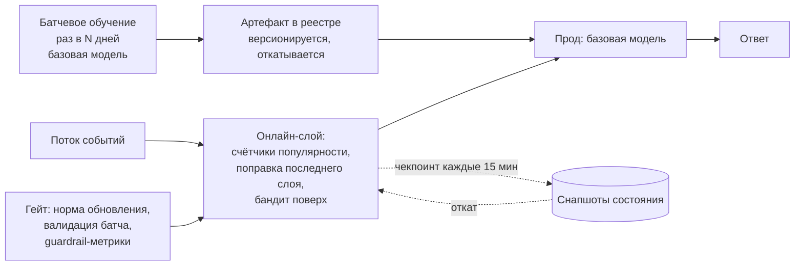
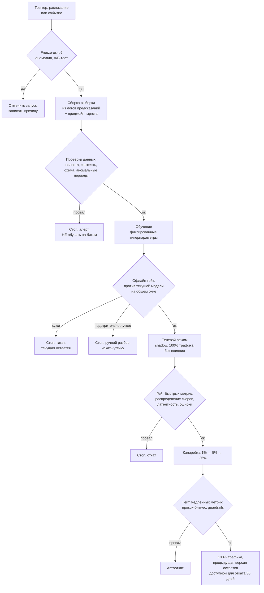

# Переобучение моделей

> **Зачем эта глава.** «Как часто переобучать модель?» — вопрос, на который почти все
> отвечают «раз в месяц» и почти все проваливаются. Правильный ответ выводится из двух
> измеримых величин: темпа устаревания данных и стоимости цикла переобучения. Здесь:
> расписание против триггеров и какие триггеры бывают; как выбрать окно обучения
> и как взвешивать свежие данные (с формулой эффективного размера выборки); риски
> онлайн-обучения; канареечная валидация новой модели против текущей с гейт-метриками,
> порогами и расчётом мощности; где в этом конвейере обязательно нужен человек;
> и отдельно — почему слишком частое переобучение деградирует систему не хуже, чем
> слишком редкое.

**Уровень:** 🎯 middle → 🧠 middle+
**Предварительно нужно:** [дрифт данных](03-drift-detection.md), [деградация модели](04-model-degradation.md), [инциденты](06-incidents-and-runbooks.md), [валидация и утечки](../02-classic-ml/13-validation-and-leakage.md), [CI/CD для ML](../07-mlops/07-ci-cd-for-ml.md)
**Как проработать:** чтение + бэктест устаревания на своих данных

---

## Карта главы

- [1. Зачем переобучать: три разных причины](#1-зачем-переобучать-три-разных-причины)
- [2. Темп устаревания данных: как его измерить](#2-темп-устаревания-данных-как-его-измерить)
- [3. Оптимальная частота: вывод формулы](#3-оптимальная-частота-вывод-формулы)
- [4. По расписанию или по триггеру](#4-по-расписанию-или-по-триггеру)
- [5. Окно обучения: все данные или скользящее](#5-окно-обучения-все-данные-или-скользящее)
- [6. Взвешивание свежих данных](#6-взвешивание-свежих-данных)
- [7. Онлайн-обучение и его риски](#7-онлайн-обучение-и-его-риски)
- [8. Конвейер переобучения целиком](#8-конвейер-переобучения-целиком)
- [9. Гейт-метрики: автоматическое сравнение с текущей моделью](#9-гейт-метрики-автоматическое-сравнение-с-текущей-моделью)
- [10. Канареечная валидация и расчёт мощности](#10-канареечная-валидация-и-расчёт-мощности)
- [11. Где обязательно нужен человек](#11-где-обязательно-нужен-человек)
- [12. Деградация от слишком частого переобучения](#12-деградация-от-слишком-частого-переобучения)
- [13. Как отвечать на собесе «как часто переобучать»](#13-как-отвечать-на-собесе-как-часто-переобучать)
- [14. Подводные камни](#14-подводные-камни)
- [15. Проверь себя](#15-проверь-себя)
- [16. Практика](#16-практика)
- [17. Что читать дальше](#17-что-читать-дальше)

---

## 1. Зачем переобучать: три разных причины

Переобучение (retraining) — это не ритуал и не гигиена. У него есть три различные причины,
и они требуют разных действий. Смешивать их — главная концептуальная ошибка в этой теме.

**Причина 1: сдвинулось распределение входа (covariate shift).** Пришли новые пользователи,
вырос каталог, поменялся источник трафика. Зависимость «признаки → таргет» та же,
но модель работает в области пространства, где у неё мало обучающих данных.
Переобучение помогает: новая выборка покрывает новую область.

**Причина 2: изменилась сама зависимость (concept drift).** То же поведение теперь означает
другое: после изменения продукта клик перестал означать интерес, после смены правил
скоринга просрочка стала означать другое. Здесь переобучение помогает **только**
на данных нового режима, а обучение на смеси старого и нового даст модель,
не подходящую ни к чему.

**Причина 3: просто накопились новые данные.** Распределение не менялось, зависимость
та же — но выборка выросла на 20%, и модель может стать точнее за счёт снижения
дисперсии оценки. Это самая слабая причина, и именно на ней чаще всего строят
«переобучаем раз в неделю, потому что данных стало больше».

Разница между ними принципиальна, потому что диагноз определяет действие:

| Диагноз | Что делать | Чего не делать |
|---|---|---|
| Ковариативный сдвиг | переобучить на расширенном окне, включающем новую область | сужать окно — потеряете покрытие |
| Concept drift | переобучить на **коротком** окне после точки перелома; возможно, ввести признак-индикатор режима | обучать на смеси режимов |
| Накопление данных | проверить, даёт ли прирост вообще; часто не даёт | переобучать по привычке |

> ⚠️ **Типичная ошибка.** Переобучение как реакция на инцидент. Если в данных есть
> поломка, переобучение **зафиксирует поломку в артефакте**: модель выучит, что фича
> `merchant_category` теперь всегда пустая, и после починки апстрима станет хуже,
> чем была. Правило: сначала чиним данные, потом переобучаем — и обязательно проверяем,
> не попал ли в обучающее окно период аномалии (см. [главу про инциденты](06-incidents-and-runbooks.md)).

---

## 2. Темп устаревания данных: как его измерить

Это ключевая величина всей главы. Пока вы её не измерили, любой ответ про частоту
переобучения — гадание.

**Бэктест устаревания (staleness backtest).** Идея: обучить модель на данных до момента
$T$ и посмотреть, как падает её качество на данных всё более поздних периодов.

```python
# Кривая устаревания: как падает качество модели по мере старения относительно данных.
# Это тот самый эксперимент, результат которого вы называете на собеседовании
# вместо "раз в месяц".
import numpy as np
import pandas as pd
from sklearn.metrics import roc_auc_score
import lightgbm as lgb


def staleness_curve(df: pd.DataFrame, feature_cols: list[str], target_col: str,
                    time_col: str, cutoffs: list[pd.Timestamp],
                    horizons_days: tuple[int, ...] = (7, 14, 30, 60, 90, 180),
                    train_window_days: int = 365,
                    params: dict | None = None) -> pd.DataFrame:
    """Для каждой точки обучения cutoff обучаем модель и меряем качество
    на окнах, отстоящих на horizons_days вперёд. Несколько cutoff нужны,
    чтобы отделить устаревание от разовой аномалии конкретного месяца."""
    params = params or {"objective": "binary", "learning_rate": 0.05,
                        "num_leaves": 63, "verbose": -1, "seed": 0}
    rows = []
    for cutoff in cutoffs:
        train_mask = (df[time_col] < cutoff) & (df[time_col] >= cutoff - pd.Timedelta(days=train_window_days))
        if train_mask.sum() < 10_000:
            continue
        model = lgb.train(params,
                          lgb.Dataset(df.loc[train_mask, feature_cols],
                                      label=df.loc[train_mask, target_col]),
                          num_boost_round=400)
        for h in horizons_days:
            # Окно оценки шириной 7 дней, отстоящее на h дней от точки обучения.
            lo = cutoff + pd.Timedelta(days=h - 7)
            hi = cutoff + pd.Timedelta(days=h)
            test_mask = (df[time_col] >= lo) & (df[time_col] < hi)
            if test_mask.sum() < 2_000:
                continue
            auc = roc_auc_score(df.loc[test_mask, target_col],
                                model.predict(df.loc[test_mask, feature_cols]))
            rows.append({"cutoff": cutoff, "age_days": h, "auc": auc,
                         "n_test": int(test_mask.sum())})
    out = pd.DataFrame(rows)
    # Усредняем по cutoff: нас интересует систематическое устаревание, а не шум месяца.
    return out.groupby("age_days").agg(auc_mean=("auc", "mean"),
                                       auc_std=("auc", "std"),
                                       n_cutoffs=("auc", "size")).reset_index()
```

Типичный результат для трёх разных задач (реальные порядки величин):

| Возраст модели, дней | Скоринг кредитов | Рекомендации товаров | CTR в рекламе |
|---|---|---|---|
| 7 | 0.782 | 0.741 | 0.7610 |
| 14 | 0.781 | 0.735 | 0.7583 |
| 30 | 0.779 | 0.722 | 0.7521 |
| 60 | 0.775 | 0.698 | 0.7402 |
| 90 | 0.771 | 0.674 | 0.7288 |
| 180 | 0.762 | 0.631 | 0.7015 |

Отсюда **скорость устаревания** $\delta$ — падение метрики за день:

$$
\delta = \frac{Q(0) - Q(\tau)}{\tau}
$$

где $Q(a)$ — качество модели в возрасте $a$ дней (например, ROC-AUC), $\tau$ —
горизонт, на котором мы оцениваем наклон (разумно брать 30–90 дней), $\delta$ —
падение метрики за сутки.

Для таблицы выше: скоринг $\delta \approx (0.782-0.771)/83 \approx 1.3 \cdot 10^{-4}$ AUC/день;
рекомендации $\delta \approx (0.741-0.674)/83 \approx 8.1 \cdot 10^{-4}$ AUC/день;
CTR $\delta \approx 3.9 \cdot 10^{-4}$ AUC/день.

**Разница в шесть раз между скорингом и рекомендациями — и есть ответ на вопрос
о частоте.** Кредитное поведение меняется медленно (модель живёт кварталами),
каталог и мода в рекомендациях — быстро (модель живёт неделями). Никакого «раз
в месяц для всего» не существует.

> 📐 **Разбор: почему нужно несколько точек обучения.** Если взять один `cutoff`,
> вы измерите не устаревание, а свойства конкретного месяца: попал на новогодний
> пик — получите обвал качества, не имеющий отношения к возрасту модели. Минимум
> 5–8 точек `cutoff`, разнесённых по сезонам, с усреднением. Стандартное отклонение
> по точкам — это ваша погрешность: если $\delta$ измерено как $8 \cdot 10^{-4}$
> при разбросе $\pm 6 \cdot 10^{-4}$, то честный вывод — «порядок величины такой»,
> а не «ровно столько».

> 🧠 **Middle+.** Кривая устаревания редко линейна. Три характерные формы и что они значат:
> **линейное падение** — постепенный дрифт, лечится регулярным переобучением;
> **ступенька** — произошло дискретное событие (релиз продукта, смена источника данных),
> лечится не расписанием, а триггером на событие; **плато после начального падения** —
> модель потеряла «свежую» часть сигнала, но сохранила устойчивое ядро, и дальше
> переобучение даёт мало. Третий случай важен практически: если после 30 дней кривая
> вышла на плато, переобучаться чаще чем раз в месяц бессмысленно.

---

## 3. Оптимальная частота: вывод формулы

Теперь, когда $\delta$ измерено, частоту можно посчитать, а не назначить.

**Постановка.** Пусть мы переобучаем каждые $T$ дней. Сразу после переобучения возраст
модели равен нулю, перед следующим — $T$ дней. Средний возраст модели за цикл равен
$T/2$. Значит, средняя потеря качества из-за устаревания составляет $\delta \cdot T/2$.

Пусть $V$ — денежная стоимость единицы качества в день (сколько рублей в сутки теряет
бизнес на каждую единицу падения метрики), $C_r$ — полная стоимость одного цикла
переобучения (вычисления + время инженера на валидацию + риск выкатки, приведённые
к деньгам). Тогда средние суточные издержки:

$$
J(T) = \underbrace{\frac{C_r}{T}}_{\text{амортизация переобучения}} + \underbrace{\frac{V \delta T}{2}}_{\text{потери от устаревания}}
$$

где $T$ — период переобучения в днях, $C_r$ — стоимость одного цикла в рублях,
$V$ — рублей в день на единицу метрики, $\delta$ — падение метрики за день.

Первое слагаемое убывает с $T$ (реже переобучаем — дешевле), второе растёт
(реже переобучаем — старее модель). Минимум находится дифференцированием:

$$
\frac{dJ}{dT} = -\frac{C_r}{T^2} + \frac{V\delta}{2} = 0
\quad\Longrightarrow\quad
T^{*} = \sqrt{\frac{2 C_r}{V \delta}}
$$

Это та же структура, что у классической формулы оптимального размера заказа
в управлении запасами, и по той же причине: размен между постоянными издержками
операции и линейно накапливающимися потерями.

**Разбор на числах.** Рекомендательная система. Цикл переобучения: 6 часов на кластере
(≈ 30 000 руб.) плюс полдня инженера на валидацию и выкатку (≈ 20 000 руб.) плюс
резерв на риск отката (≈ 10 000 руб.), итого $C_r = 60\,000$ руб. Из бэктеста
$\delta = 8 \cdot 10^{-4}$ AUC/день. Продуктовая аналитика показала, что 0.01 AUC
соответствует примерно 1.5% выручки на этом сценарии, а выручка — 20 млн руб./день,
то есть 0.01 AUC ≈ 300 000 руб./день, значит $V = 3 \cdot 10^{7}$ руб. на единицу
AUC в день.

$$
T^{*} = \sqrt{\frac{2 \cdot 60\,000}{3\cdot 10^{7} \cdot 8\cdot 10^{-4}}}
= \sqrt{\frac{120\,000}{24\,000}} = \sqrt{5} \approx 2.2\ \text{дня}
$$

То есть переобучать надо примерно каждые двое суток — гораздо чаще, чем «раз в месяц».

**Насколько важна точность этого числа.** Посчитаем $J(T)$ в разных точках:

| $T$, дней | Амортизация, руб./день | Устаревание, руб./день | Итого | Против оптимума |
|---|---|---|---|---|
| 1 | 60 000 | 12 000 | 72 000 | +34% |
| 2.2 | 27 300 | 26 400 | 53 700 | оптимум |
| 7 | 8 600 | 84 000 | 92 600 | +72% |
| 14 | 4 300 | 168 000 | 172 300 | +221% |
| 30 | 2 000 | 360 000 | 362 000 | +574% |

Функция $J$ довольно пологая около минимума (между 1.5 и 4 днями разница меньше 15%),
но растёт быстро при уходе в любую сторону. Практический вывод: **точность не нужна,
порядок величины критичен.** Ошибка «раз в месяц вместо раз в два дня» стоит здесь
почти в шесть раз дороже оптимума.

**Что делать со вторым слагаемым, когда $V$ неизвестно.** Часто денежную стоимость
единицы качества не знают. Тогда переворачивают задачу: фиксируют допустимую деградацию
$\Delta Q_{\max}$ (например, «не хотим терять больше 0.005 AUC относительно свежей
модели») и получают

$$
T \le \frac{2\,\Delta Q_{\max}}{\delta}
$$

Для $\Delta Q_{\max} = 0.005$ и $\delta = 8\cdot10^{-4}$: $T \le 12.5$ дней.
Это слабее экономического расчёта, но полностью защитимо на собеседовании
и требует только бэктеста.

> 💬 **На собеседовании.** Спросят: «Как часто надо переобучать модель?»
> Хороший ответ: «Это выводится из двух чисел, а не назначается. Первое — скорость
> устаревания: я делаю бэктест — обучаю модель на данных до момента T и меряю качество
> на окнах T+7, T+14, T+30, T+90 дней, повторяю для нескольких T, чтобы не поймать
> аномалию месяца, и получаю падение метрики за день. Второе — стоимость цикла
> переобучения: вычисления плюс время инженера на валидацию плюс риск выкатки.
> Дальше оптимум — это баланс амортизации цикла и накопленных потерь от устаревания;
> он даёт корень из отношения удвоенной стоимости цикла к произведению цены качества
> на скорость устаревания. На практике получаются очень разные числа: для кредитного
> скоринга — раз в квартал, для рекомендаций в маркетплейсе — раз в 2–3 дня. И отдельно
> я бы добавил триггеры поверх расписания: резкий дрифт или падение прокси-метрики
> должны запускать цикл вне графика».
> Плохой ответ: «раз в месяц» или «когда упадёт качество» — второе звучит разумно,
> но качество вы узнаете с лагом разметки, то есть будете реагировать постфактум.

---

## 4. По расписанию или по триггеру

Эти два режима не альтернативны — в зрелой системе работают оба.

**Расписание (scheduled).** Цикл запускается по cron: раз в N дней. Плюсы существенные,
и их часто недооценивают: предсказуемость нагрузки на кластер, предсказуемость работы
людей (валидацию делает дежурный по релизам), простота отладки, регулярное упражнение
всего пайплайна — а значит, он не сгниёт незаметно. Именно последнее — сильнейший
аргумент: пайплайн переобучения, который запускается «когда понадобится», к моменту,
когда он понадобится, уже не работает.

**Триггеры (event-driven).** Цикл запускается по условию. Перечень триггеров, которые
реально применяют:

| Триггер | Условие (пример) | Уровень доверия |
|---|---|---|
| **Дрифт входа** | PSI > 0.2 по 2+ ключевым фичам, устойчиво 24 часа | средний: дрифт ≠ ущерб |
| **Падение прокси-метрики** | CTR/конверсия ниже скользящего среднего на 5% три дня подряд | высокий |
| **Падение реальной метрики** | AUC на созревшей разметке ниже порога | высокий, но с лагом |
| **Ухудшение калибровки** | отношение среднего предсказания к средней частоте события вне [0.9, 1.1] | высокий |
| **Объём новых данных** | накопилось +15% размеченных примеров к обучающей выборке | низкий: сам по себе не аргумент |
| **Новая сущность** | добавлена категория/регион/язык, которых не было в обучении | высокий |
| **Изменение продукта** | изменился UI, правила выдачи, определение таргета | высокий, обязательный |
| **Календарь бизнеса** | за 2 недели до сезонного пика | высокий |
| **Отсутствие свежей модели** | текущая модель старше 2×T | страховочный |

Два принципа, которые надо выдержать при работе с триггерами.

**Первый: триггер по дрифту — самый популярный и самый переоценённый.** Как показано
в [главе про инциденты](06-incidents-and-runbooks.md) и в
[главе про дрифт](03-drift-detection.md), высокий PSI не означает, что модели плохо.
Переобучение по PSI без проверки калибровки приводит к бессмысленным циклам,
а в период аномалии (акция, сбой) — к вредным. Практическое правило: **триггер
по дрифту допустим только в связке с проверкой качества или калибровки**, и он
должен приводить не к автоматической выкатке, а к запуску цикла с обязательным
гейтом.

**Второй: у триггера обязательно должен быть кулдаун.** Иначе система начнёт
переобучаться каждые полчаса на шумных колебаниях метрики. Минимальный интервал
между запусками — не меньше времени, за которое можно оценить эффект предыдущего
переобучения (см. [§12](#12-деградация-от-слишком-частого-переобучения)).

```yaml
# Конфигурация политики переобучения. Расписание — базовый ритм,
# триггеры — реакция на события, гейты одинаковы для обоих путей.
retraining:
  model: ranker
  schedule:
    cron: "0 2 */3 * *"          # каждые 3 суток в 02:00 UTC — базовый ритм из §3
  triggers:
    - name: proxy_metric_drop
      expr: ctr_7d / ctr_7d_offset_7d < 0.95
      sustained: 3d
      cooldown: 2d               # не чаще раза в 2 суток, что бы ни случилось
    - name: calibration_off
      expr: abs(mean_prediction / mean_actual - 1) > 0.15
      sustained: 24h
      cooldown: 2d
    - name: drift_and_quality
      expr: psi_max > 0.2 and auc_7d < auc_baseline - 0.01
      sustained: 24h
      cooldown: 3d
    - name: new_taxonomy
      expr: unseen_category_share > 0.05
      sustained: 12h
      cooldown: 1d
  guards:
    max_runs_per_week: 4         # верхняя граница: защита от гонки за шумом (§12)
    freeze_windows:              # окна, в которые переобучение запрещено
      - "black-friday-2026"      # аномальный период: обучаться на нём нельзя
      - "active-ab-test:ranker_v4"   # во время эксперимента модель не меняем
```

Обратите внимание на `freeze_windows`. Два случая, когда переобучение надо
запрещать явно: **аномальные периоды** (распродажа, авария, разовое событие —
обучение на них зафиксирует аномалию как норму) и **время активного A/B-теста**
(смена модели под экспериментом делает его результаты невалидными,
см. [ловушки A/B](../10-ab-testing/04-pitfalls.md)).

---

## 5. Окно обучения: все данные или скользящее

Второй по частоте вопрос после частоты. Правильная рамка ответа — это **размен между
смещением и дисперсией**, ровно тот же, что в [теории обучения](../02-classic-ml/01-learning-theory.md),
но по оси времени.

**Все данные (expanding window).** Обучающая выборка растёт: каждый цикл добавляем
новое, ничего не выбрасываем. Меньше дисперсия оценки — больше данных. Но если
распределение менялось, старые данные вносят **смещение**: модель усредняет режимы,
которых уже нет.

**Скользящее окно (sliding / rolling window).** Берём последние $W$ дней. Меньше
смещение — данные однородны и актуальны. Больше дисперсия — выборка меньше.
Плюс риск потерять редкие события: если дефолты случаются раз в квартал,
на окне в 30 дней их почти не будет.

Формализуем. Пусть $\rho$ — число размеченных примеров в сутки, тогда на окне $W$
дней выборка $n = \rho W$. Ошибка обобщения раскладывается примерно так:

$$
\mathcal{E}(W) \;\approx\; \underbrace{\frac{c_1}{\rho W}}_{\text{дисперсия оценки}} \;+\; \underbrace{c_2 \gamma^2 W^2}_{\text{смещение от устаревания}}
$$

где $\mathcal{E}(W)$ — ожидаемая ошибка модели, обученной на окне $W$; $c_1$ —
константа, пропорциональная сложности модели (порядка $\sigma^2 d$ для $d$ эффективных
параметров и шума $\sigma^2$); $\rho$ — примеров в сутки; $c_2$ — константа,
переводящая сдвиг распределения в ошибку; $\gamma$ — скорость дрейфа распределения
(насколько распределение уезжает за сутки). Квадрат во втором слагаемом возникает
потому, что средний возраст данных в окне равен $W/2$, а вклад смещения в квадратичную
ошибку сам квадратичен.

Минимизируем:

$$
\frac{d\mathcal{E}}{dW} = -\frac{c_1}{\rho W^2} + 2 c_2 \gamma^2 W = 0
\quad\Longrightarrow\quad
W^{*} = \left(\frac{c_1}{2 c_2 \gamma^{2} \rho}\right)^{1/3}
$$

Практическая ценность этой формулы — не в подстановке чисел (константы $c_1, c_2$
вы не знаете), а в трёх качественных выводах, которые из неё видны и которые нужно
уметь произнести:

1. **$W^{*}$ убывает с ростом скорости дрейфа $\gamma$** — но медленно, как $\gamma^{-2/3}$.
   Удвоение скорости дрейфа сокращает оптимальное окно всего в $2^{2/3} \approx 1.6$ раза,
   а не вдвое.
2. **$W^{*}$ убывает с ростом плотности данных $\rho$** — как $\rho^{-1/3}$. Чем больше
   данных в сутки, тем короче можно брать окно: дисперсия и так мала. Отсюда практика
   крупных сервисов: там, где событий миллионы в день, окно в 14–30 дней нормально;
   там, где сотни в день, окно меньше года бессмысленно.
3. **$W^{*}$ растёт со сложностью модели** (через $c_1$). Большой нейросети нужно
   больше данных, значит, окно длиннее — даже ценой смещения.

**Как решать на практике.** Не подставлять константы, а сделать сеточный бэктест:

```python
# Подбор окна обучения бэктестом. Считаем среднее качество по нескольким
# точкам во времени для каждого кандидата окна. Это заменяет любые формулы.
def window_backtest(df, feature_cols, target_col, time_col, cutoffs,
                    windows_days=(30, 60, 90, 180, 365, 10_000),  # 10_000 ≈ "все данные"
                    eval_horizon_days=14, params=None):
    params = params or {"objective": "binary", "learning_rate": 0.05,
                        "num_leaves": 63, "verbose": -1, "seed": 0}
    rows = []
    for cutoff in cutoffs:
        test_mask = (df[time_col] >= cutoff) & (df[time_col] < cutoff + pd.Timedelta(days=eval_horizon_days))
        if test_mask.sum() < 2_000:
            continue
        for W in windows_days:
            tr = (df[time_col] < cutoff) & (df[time_col] >= cutoff - pd.Timedelta(days=W))
            if tr.sum() < 10_000:
                continue
            m = lgb.train(params, lgb.Dataset(df.loc[tr, feature_cols],
                                              label=df.loc[tr, target_col]),
                          num_boost_round=400)
            rows.append({"cutoff": cutoff, "window": W, "n_train": int(tr.sum()),
                         "auc": roc_auc_score(df.loc[test_mask, target_col],
                                              m.predict(df.loc[test_mask, feature_cols]))})
    res = pd.DataFrame(rows)
    # Ключевое: смотрим не только среднее, но и разброс по cutoff.
    # Окно, дающее +0.002 в среднем при вдвое большем разбросе, — плохой выбор.
    return res.groupby("window").agg(auc_mean=("auc", "mean"),
                                     auc_std=("auc", "std"),
                                     n_train=("n_train", "mean")).reset_index()
```

Типичная картина результата, по которой видно, как читать такую таблицу:

| Окно, дней | AUC (среднее по 8 точкам) | Разброс (std) | Размер выборки |
|---|---|---|---|
| 30 | 0.7284 | 0.0121 | 3.1 млн |
| 60 | 0.7351 | 0.0074 | 6.2 млн |
| 90 | 0.7368 | 0.0061 | 9.4 млн |
| 180 | 0.7359 | 0.0058 | 18.7 млн |
| 365 | 0.7311 | 0.0055 | 38.0 млн |
| всё (3 года) | 0.7203 | 0.0057 | 112 млн |

Читается так: 30 дней мало (дисперсия — большой разброс между точками), 3 года
вредно (смещение — устойчиво хуже), оптимум широкий и плоский на 90–180 днях.
Раз плато плоское — берите **больший** край плато: он устойчивее к тому, что
скорость дрейфа изменится.

> ⚠️ **Типичная ошибка.** Выбирать окно по одной точке во времени. Разница между
> 90 и 180 днями на одном `cutoff` — это чистый шум порядка 0.006 AUC; чтобы её
> различить, нужно 6–10 точек и оценка разброса. Решение «берём 90 дней, потому что
> в декабре получилось лучше» — это подгонка под декабрь.

**Отдельный практический приём: гибридное окно.** Часто побеждает схема «полное окно
для редких сущностей, короткое — для частых». Например, в рекомендациях: пользователей
с богатой историей учим на 30 днях (данных много, актуальность важнее), редких
пользователей и холодные товары — на годе (иначе примеров просто нет). Реализуется
не двумя моделями, а весами (см. [§6](#6-взвешивание-свежих-данных)) либо явным признаком «плотность истории».

---

## 6. Взвешивание свежих данных

Скользящее окно — это грубый инструмент: пример 89-дневной давности учитывается
полностью, а 91-дневной — не учитывается вообще. Мягкая альтернатива — **веса,
убывающие с возрастом примера**.

Самая распространённая форма — экспоненциальное затухание, удобнее всего задаваемое
через **период полураспада** (half-life):

$$
w_i = 2^{-\Delta t_i / h} = e^{-\lambda \Delta t_i}, \qquad \lambda = \frac{\ln 2}{h}
$$

где $w_i$ — вес примера $i$, $\Delta t_i$ — возраст примера в днях (сколько дней прошло
от события до момента обучения), $h$ — период полураспада в днях (через $h$ дней вес
падает вдвое), $\lambda$ — константа затухания.

**Эффективный размер выборки.** Взвешенная выборка ведёт себя как невзвешенная
меньшего размера. Мера этого — эффективный размер (effective sample size):

$$
n_{\text{eff}} = \frac{\left(\sum_{i=1}^{n} w_i\right)^2}{\sum_{i=1}^{n} w_i^2}
$$

где $n$ — фактическое число примеров, $w_i$ — их веса. При равных весах формула даёт
$n_{\text{eff}} = n$, при сильном перекосе — гораздо меньше.

Для экспоненциальных весов и потока $\rho$ примеров в сутки, накопленного за долгий
период, интегралы считаются в явном виде: $\sum w \to \rho/\lambda$,
$\sum w^2 \to \rho/(2\lambda)$, откуда

$$
n_{\text{eff}} = \frac{(\rho/\lambda)^2}{\rho/(2\lambda)} = \frac{2\rho}{\lambda} = \frac{2 \rho h}{\ln 2} \approx 2.89\, \rho\, h
$$

**Это очень полезное практическое число.** Период полураспада 30 дней при 100 000
размеченных примеров в сутки даёт $n_{\text{eff}} \approx 2.89 \cdot 100\,000 \cdot 30 \approx 8.7$ млн — то есть примерно как невзвешенное окно в 87 дней. Соответствие
между полураспадом и эквивалентным окном: **$W_{\text{экв}} \approx 2.9\,h$**.
Если по бэктесту оптимальное окно 90 дней, эквивалентный период полураспада —
около 31 дня.

Реализация:

```python
# Веса по возрасту примера. В бустингах это sample_weight; в PyTorch — множитель
# в функции потерь (или взвешенный сэмплер).
import numpy as np

def recency_weights(event_days_ago: np.ndarray, half_life_days: float,
                    floor: float = 0.05) -> np.ndarray:
    """floor не даёт весам уйти в ноль: иначе редкие старые события
    (например, единственные примеры редкого класса) исчезают из обучения,
    и модель перестаёт их узнавать вовсе."""
    w = np.power(2.0, -event_days_ago / half_life_days)
    return np.maximum(w, floor)


def effective_sample_size(w: np.ndarray) -> float:
    return float(w.sum() ** 2 / (w ** 2).sum())


# Пример использования в LightGBM
# dtrain = lgb.Dataset(X, label=y, weight=recency_weights(age_days, half_life_days=30))
```

Три вещи, о которых надо помнить при взвешивании.

**Первое: веса ломают калибровку, если применять их неаккуратно.** Модель обучается
минимизировать взвешенную функцию потерь, то есть подгоняется под **взвешенное**
распределение таргета. Если доля позитивов в свежих данных отличается от исторической,
предсказанные вероятности будут смещены относительно долгосрочной частоты. Лечится
явной калибровкой на свежем невзвешенном отложенном множестве
(см. [калибровку](../02-classic-ml/12-imbalance-and-calibration.md)).

**Второе: веса перемножаются.** Если у вас уже есть веса за дисбаланс классов
или за семплирование при логировании ([§13 главы 05](05-observability-stack.md#13-экономика-логирования-и-семплирование)),
итоговый вес — произведение: $w_i = w_i^{\text{recency}} \cdot w_i^{\text{class}} \cdot w_i^{\text{sampling}}$.
Забыть про это — значит незаметно перекосить выборку.

**Третье: взвешивание — не замена окну, а дополнение.** На практике комбинируют:
жёсткое окно (скажем, 365 дней) отсекает совсем древнее и ограничивает объём
вычислений, а веса внутри окна расставляют акценты. Чистое взвешивание без окна
означает, что вы каждый раз читаете всю историю — это дорого и почти всегда
не окупается, потому что вклад данных старше $3h$ пренебрежим (вес меньше 12.5%).

> 🧠 **Middle+.** Для градиентного бустинга есть и другой способ учесть свежесть,
> который иногда работает лучше весов: **дообучение (continued training) поверх
> существующей модели.** LightGBM и CatBoost умеют продолжать обучение с готового
> ансамбля, добавляя деревья на новых данных. Плюс: дёшево (не переобучаем весь
> ансамбль) и модель мягко адаптируется. Минус, из-за которого этим редко пользуются
> в проде: ансамбль накапливает историю необратимо — старые деревья остаются навсегда,
> и через несколько циклов вы получаете модель, поведение которой невозможно
> воспроизвести и невозможно откатить на «состояние без плохого цикла». Правило:
> если используете дообучение, обязательно делайте полное переобучение с нуля
> раз в N циклов и сравнивайте — расхождение покажет, сколько мусора накопилось.

---

## 7. Онлайн-обучение и его риски

**Онлайн-обучение (online learning)** — модель обновляется по мере поступления данных,
непрерывно или микро-батчами: SGD-шаг на каждом батче событий, обновление счётчиков
в наивном Байесе, инкрементальные факторизационные модели, контекстные бандиты.

**Где оно действительно нужно.** Список короткий, и это само по себе показательно:

- сценарии, где актуальность измеряется минутами: новостные ленты, торговые площадки
  с быстро сменяющимся ассортиментом, реакция на вирусный контент;
- задачи с мгновенной обратной связью и коротким циклом: CTR в рекламе, где клик
  приходит через секунды;
- бандиты и эксплорация, где адаптация — суть метода
  (см. [бандиты](../06-recsys/13-exploration-and-bandits.md));
- холодный старт новых сущностей: товар появился час назад, ждать ночного цикла
  бессмысленно.

**Риски, из-за которых онлайн-обучение почти нигде не является основным режимом.**

**Риск 1: нет точки отката.** Это главное. Батчевая модель — это артефакт: версия
2.3.7 лежит в реестре, её можно скачать и выкатить. Онлайн-модель — это **состояние**,
которое непрерывно менялось. Если она деградировала, откатывать не на что: нужен
регулярный снапшот. Отсюда обязательное требование: **чекпоинты состояния
с частотой, соответствующей допустимому ущербу** (например, каждые 15 минут,
с хранением суток), и проверенная процедура восстановления.

**Риск 2: отравление обратной связью.** Модель влияет на то, что показывается,
показанное влияет на клики, клики — на обучение. Петля замыкается за минуты вместо
суток, и вырождение выдачи (модель показывает одно и то же, потому что кликают
только по показанному) наступает в разы быстрее. Смягчается принудительной
эксплорацией и коррекцией на позиционный/селекционный биас
(см. [холодный старт и смещения](../06-recsys/12-cold-start-and-bias.md)).

**Риск 3: запаздывающая разметка отравляет обучение.** Онлайн-обучение требует,
чтобы таргет приходил быстро. Если «не кликнул за 5 минут» интерпретируется как
негатив, а пользователь кликнул через час, модель систематически обучается на ложных
негативах. Правило: **онлайн-обучение применимо только там, где лаг разметки
существенно меньше периода обновления модели.**

**Риск 4: невоспроизводимость.** Состояние модели — функция всей истории событий
в точном порядке. Воспроизвести «почему в 14:32 модель предсказала именно это»
можно только переигрыванием всего потока. Для регулируемых доменов (кредитование,
медицина, страхование) это обычно означает прямой запрет.

**Риск 5: катастрофический дрейф на аномалии.** Сбой апстрима на 20 минут, во время
которого приходили нули вместо признаков, в батчевом режиме отфильтруется проверками
качества данных; в онлайн-режиме модель успеет обучиться на мусоре. Требуется
жёсткая валидация каждого батча **до** применения градиента и ограничения
на величину обновления.

**Практическая архитектура, которая работает.** В проде почти всегда встречается
не чистый онлайн, а **гибрид**:



Тяжёлая часть (представления, эмбеддинги, основная модель) обучается батчем
и версионируется как обычно; онлайн адаптируется только лёгкий и ограниченный слой:
счётчики свежей популярности, поправочный коэффициент, последний слой сети, параметры
бандита. Тогда сохраняются и адаптивность, и возможность отката: сломался онлайн-слой —
выключили его флагом, и остаётся полностью рабочая батчевая модель.

> 💬 **На собеседовании.** Спросят: «Почему бы не обучать модель онлайн — это же
> всегда свежая модель?»
> Хороший ответ: «Потому что вы меняете версионируемый артефакт на непрерывно
> меняющееся состояние и теряете главное свойство прод-системы — возможность вернуться
> в известное хорошее состояние. Плюс три конкретных риска: петля обратной связи
> замыкается за минуты вместо суток, и выдача вырождается быстрее; запаздывающая
> разметка означает обучение на ложных негативах; аномалия в данных попадает в модель
> раньше, чем сработают проверки. Поэтому в проде обычно гибрид: тяжёлая часть —
> батчем с версионированием и откатом, онлайн — только лёгкий ограниченный слой,
> счётчики популярности или бандит поверх, который можно выключить флагом.
> И если делать онлайн, то обязательно с чекпоинтами состояния, валидацией каждого
> батча до применения градиента и ограничением на норму обновления».
> Плохой ответ: «онлайн-обучение современнее и лучше».

---

## 8. Конвейер переобучения целиком

Соберём всё в последовательность. Каждый шаг здесь — это место, где что-то ломается,
и в этом смысл его выделения.



Несколько мест, которые заслуживают отдельного комментария.

**Сборка выборки из логов предсказаний, а не из витрин.** Это повторение урока
из [сценария 5 главы про инциденты](06-incidents-and-runbooks.md): в логе записан
ровно тот вектор признаков, который ушёл в модель, поэтому физически невозможно
обучиться на данных, которых в момент решения не существовало. Это закрывает целый
класс утечек через время одним архитектурным решением.

**Проверки данных как жёсткий стоп.** Если во входных данных провал по свежести
или доля пропусков в разы выше обычной — обучение не должно запускаться. Пайплайн,
который «всё равно как-то обучится», однажды выкатит модель, обученную на периоде
аварии. Инструментарий — из [главы про качество данных](02-data-quality.md).

**Фиксированные гиперпараметры.** В регулярном цикле подбор гиперпараметров обычно
**не делают**: это дорого, добавляет дисперсию (каждый раз побеждает другая
конфигурация — из-за шума, а не из-за смысла) и делает результат невоспроизводимым.
Гиперпараметры пересматривают отдельным ручным исследованием раз в квартал или
при существенном изменении данных.

**Ветка «подозрительно лучше».** Это редкая, но очень полезная деталь: гейт должен
останавливать не только ухудшение, но и **слишком большое улучшение**. Прирост
+0.03 AUC на регулярном цикле, где обычно бывает ±0.003, — это почти наверняка утечка
или ошибка в сборке выборки, а не удача. Формулировка правила: «слишком хорошо —
значит утечка, пока не доказано обратное».

---

## 9. Гейт-метрики: автоматическое сравнение с текущей моделью

**Гейт (gate)** — автоматическая проверка «пускать ли новую модель дальше».
Ключевое требование: **сравнение всегда идёт с текущей продовой моделью на одних
и тех же данных**, а не с абсолютным порогом. Абсолютный порог («AUC должен быть
выше 0.75») бесполезен: он не учитывает, что данные могли стать объективно сложнее.

**Офлайн-гейт** — перед выкаткой:

| Проверка | Порог | Что ловит |
|---|---|---|
| Основная метрика против текущей модели на общем отложенном окне | не хуже более чем на 0.002 AUC | обычная деградация |
| Метрика на **свежайшей** неделе отдельно | не хуже текущей | модель хороша «в среднем», но плоха сейчас |
| Метрика в ключевых сегментах (топ-5 по объёму) | ни один сегмент не хуже более чем на 0.01 | средняя метрика скрывает провал сегмента |
| Калибровка: отношение среднего предсказания к средней частоте | в [0.95, 1.05] | смещение вероятностей |
| Распределение предсказаний: KS против текущей модели на одном входе | < 0.15 | смена препроцессинга, другой масштаб |
| Доля предсказаний в крайних бакетах (около 0 и около 1) | не выросла более чем в 1.5 раза | вырождение |
| Стабильность: churn относительно текущей модели | < 20% (см. [§12](#12-деградация-от-слишком-частого-переобучения)) | гонка за шумом |
| Подозрительное улучшение | прирост > 0.02 AUC → ручной разбор | утечка |
| Совпадение схемы фич с продовой | точное | несовместимость контракта |
| Размер артефакта и время инференса | не выросли более чем на 20% | незаметное удорожание |

**Про сегментный гейт.** Это то, что отличает зрелый процесс. Средняя метрика может
вырасти, а в критичном сегменте (новые пользователи, мобильная платформа, конкретный
регион) — упасть. В агрегате этого не видно, а пользователи сегмента заметят.
Минимальный набор разрезов: платформа, новизна пользователя, регион (или язык),
и сегмент, важный для бизнеса.

**Онлайн-гейты** — во время выкатки. Тут ключевое понятие — **скорость набора
статистики**, потому что метрики делятся на быстрые и медленные:

| Метрика | Скорость набора | Порог | Действие |
|---|---|---|---|
| Ошибки 5xx, таймауты | минуты | > 1% или в 2 раза выше текущей | автооткат |
| p99 латентности | минуты | > SLO или +30% к текущей | автооткат |
| Доля деградаций/фолбэков | минуты | > 2× к текущей | автооткат |
| KS распределения скоров канарейки vs текущей | 10–30 минут | > 0.1 | автооткат |
| Доля решений выше порога (одобрений, блокировок) | 30–60 минут | ±20% относительно текущей | автооткат |
| CTR / прокси-конверсия | часы–сутки | статистически значимое падение | ручное решение |
| Guardrail-метрики (разнообразие, доля новинок, жалобы) | часы–сутки | не хуже текущей | ручное решение |
| Основная бизнес-метрика | дни | — | это уже A/B-тест, не гейт |

**Главная мысль этого раздела.** Автоматический откат вешают только на **быстрые**
метрики — те, которые набирают статистику за минуты и десятки минут. Вешать автооткат
на CTR — значит либо ждать часы (и всё это время держать плохую модель), либо
откатываться по шуму. Медленные метрики — это уже A/B-тест с нормальным дизайном
(см. [дизайн эксперимента](../10-ab-testing/01-experiment-design.md)), и решение
по ним принимает человек.

```python
# Офлайн-гейт: сравнение кандидата с текущей моделью. Возвращает решение и причины.
# Такой код живёт в пайплайне CI/CD и является блокирующим шагом.
from dataclasses import dataclass, field

import numpy as np
from scipy.stats import ks_2samp
from sklearn.metrics import roc_auc_score


@dataclass
class GateResult:
    passed: bool
    needs_human: bool = False
    reasons: list[str] = field(default_factory=list)


def offline_gate(y_true, p_champion, p_challenger, segments: dict[str, np.ndarray],
                 auc_tolerance: float = 0.002,
                 segment_tolerance: float = 0.01,
                 ks_max: float = 0.15,
                 suspicious_gain: float = 0.02) -> GateResult:
    res = GateResult(passed=True)

    auc_champ = roc_auc_score(y_true, p_champion)
    auc_chal = roc_auc_score(y_true, p_challenger)
    gain = auc_chal - auc_champ

    if gain < -auc_tolerance:
        res.passed = False
        res.reasons.append(f"AUC хуже текущей: {auc_chal:.4f} против {auc_champ:.4f}")

    # Подозрительно большой прирост чаще означает утечку, чем удачу.
    if gain > suspicious_gain:
        res.passed = False
        res.needs_human = True
        res.reasons.append(f"Прирост +{gain:.4f} аномально велик — искать утечку")

    # Калибровка: среднее предсказание должно соответствовать средней частоте события.
    calib = float(np.mean(p_challenger) / max(np.mean(y_true), 1e-9))
    if not (0.95 <= calib <= 1.05):
        res.passed = False
        res.reasons.append(f"Калибровка вне допуска: {calib:.3f}")

    # Сдвиг распределения предсказаний на ОДНОМ И ТОМ ЖЕ входе указывает
    # на смену препроцессинга или масштаба, а не на улучшение модели.
    ks = float(ks_2samp(p_champion, p_challenger).statistic)
    if ks > ks_max:
        res.passed = False
        res.needs_human = True
        res.reasons.append(f"KS распределений предсказаний {ks:.3f} > {ks_max}")

    # Средняя метрика скрывает провал в сегменте — проверяем каждый явно.
    for name, mask in segments.items():
        if mask.sum() < 5_000:
            continue
        a_c = roc_auc_score(y_true[mask], p_champion[mask])
        a_n = roc_auc_score(y_true[mask], p_challenger[mask])
        if a_n < a_c - segment_tolerance:
            res.passed = False
            res.reasons.append(f"Сегмент '{name}': {a_n:.4f} против {a_c:.4f}")

    return res
```

---

## 10. Канареечная валидация и расчёт мощности

Канареечная выкатка (canary) — постепенный перевод трафика на новую модель
с автоматическим откатом. Схема выкатки в общем виде разобрана в
[стратегиях выкатки](../07-mlops/08-deployment-strategies.md); здесь — то, что
специфично для моделей.

**Первый этап — теневой режим (shadow).** Новая модель получает **весь** трафик,
но её ответы никуда не идут: они только логируются и сравниваются с ответами текущей.
Это бесплатно с точки зрения риска и даёт огромное количество информации за минуты:

- распределения предсказаний двух моделей на **одном и том же** входе — это самая
  чувствительная проверка, которая существует;
- доля объектов, у которых решение (не скор, а именно решение при рабочем пороге)
  изменилось;
- латентность и потребление ресурсов под реальной нагрузкой и реальным распределением
  размеров запросов;
- ошибки на реальных данных: неизвестные категории, пропуски, форматы, которых
  не было в валидации.

Теневой режим ловит почти все технические проблемы и все проблемы препроцессинга.
Чего он не ловит принципиально — влияние на поведение пользователей: ответы-то
не показываются.

**Второй этап — канарейка с долями трафика.** Типичная лестница:

| Ступень | Доля трафика | Выдержка | Что проверяем |
|---|---|---|---|
| shadow | 0% (все запросы дублируются) | 30–60 мин | распределения, латентность, ошибки |
| canary-1 | 1% | 1–2 часа | быстрые метрики, стабильность |
| canary-5 | 5% | 2–6 часов | быстрые + первые прокси-сигналы |
| canary-25 | 25% | 6–24 часа | прокси-метрики с мощностью |
| ramp | 50% → 100% | 1–2 суток | guardrails, полная картина |

**Почему выдержка (dwell time) важнее доли.** Наивная интуиция: «дадим 1% и посмотрим».
Посчитаем, что можно увидеть на 1%.

Число наблюдений на группу для обнаружения относительного изменения метрики-доли
оценивается стандартной формулой (полный вывод — в
[дизайне эксперимента](../10-ab-testing/01-experiment-design.md)):

$$
n \approx \frac{2\,(z_{1-\alpha/2} + z_{1-\beta})^2\, p(1-p)}{\Delta^2}
$$

где $n$ — число наблюдений в **каждой** группе, $p$ — базовое значение доли
(конверсия, CTR), $\Delta$ — абсолютный размер эффекта, который мы хотим уметь
обнаружить, $z_{1-\alpha/2} \approx 1.96$ при $\alpha = 0.05$,
$z_{1-\beta} \approx 0.84$ при мощности 80%; сумма квадрата $(1.96+0.84)^2 \approx 7.85$.

**Разбор на числах.** Конверсия $p = 0.02$, хотим ловить относительное падение
на 3%, то есть $\Delta = 0.0006$. Сервис держит 3000 RPS.

$$
n \approx \frac{2 \cdot 7.85 \cdot 0.02 \cdot 0.98}{(0.0006)^2}
= \frac{15.7 \cdot 0.0196}{3.6\cdot10^{-7}}
\approx 8.5 \cdot 10^{5}
$$

Нужно 850 000 наблюдений в меньшей группе. На 1% трафика это 30 запросов в секунду:

$$
t = \frac{8.5\cdot10^{5}}{30} \approx 28\,000\ \text{с} \approx 7.9\ \text{часа}
$$

**Вывод, который надо уметь произнести:** канарейка на 1% в течение часа физически
не способна обнаружить изменение конверсии на 3% — у неё нет мощности. Всё, что
она может поймать за час, — это быстрые метрики: ошибки, латентность, распределение
предсказаний, доля деградаций. Именно поэтому гейт первых ступеней строится
на них, а не на бизнес-метриках. Ровно на этом провалилась выкатка в
[сценарии 2 главы про инциденты](06-incidents-and-runbooks.md): гейт смотрел на CTR,
у которого не было мощности, и пропустил модель с поехавшим препроцессингом.

**Два технических требования к канарейке моделей.**

**Первое: разбиение трафика должно быть детерминированным по пользователю**, а не
случайным по запросу. Иначе один и тот же пользователь в течение сессии получает
ответы то от старой, то от новой модели: выдача «прыгает», пользовательский опыт
портится, а метрики размываются. Реализация: `hash(user_id) % 100 < canary_percent`.

**Второе: версия модели — часть ключа кэша предсказаний.** Иначе канарейка будет
отдавать закэшированные ответы старой модели, и вы измерите шум вместо эффекта
(см. [архитектуры сервинга](../07-mlops/05-serving-architectures.md)).

> 💬 **На собеседовании.** Спросят: «Как вы выкатываете новую версию модели?»
> Хороший ответ: «Лестницей с гейтами, где на каждой ступени проверяются те метрики,
> у которых на этой ступени есть мощность. Сначала теневой режим: новая модель
> получает весь трафик, ответы не показываются, но сравниваются с текущей на одном
> и том же входе — это ловит проблемы препроцессинга, неизвестные категории,
> латентность и сдвиг распределения скоров за полчаса и с нулевым риском. Потом
> канарейка 1% на час-два с автооткатом по быстрым метрикам: ошибки, p99, доля
> фолбэков, KS распределения предсказаний. Бизнес-метрики на этой ступени
> не проверяю — считал: при конверсии 2% и желании ловить падение на 3% нужно
> порядка 850 тысяч наблюдений на группу, то есть на 1% трафика это восемь часов,
> а не час. Дальше 5%, 25%, 50% с выдержками в часы, и на этих ступенях уже смотрю
> прокси-метрики и guardrails, но решение о продвижении принимает человек.
> Разбиение — детерминированное по пользователю, версия модели — в ключе кэша,
> предыдущая версия остаётся доступной для отката минимум месяц».
> Плохой ответ: «выкатим на 10% и посмотрим на метрики» — без указания, какие
> метрики за это время что-то покажут.

---

## 11. Где обязательно нужен человек

Полностью автоматический конвейер переобучения — красивая идея, которая в чистом виде
встречается редко и не всегда должна встречаться. Вопрос не «автоматизировать или нет»,
а «где именно ставить человека».

**Можно и нужно автоматизировать:**

- сборку выборки, проверки данных, обучение с фиксированными гиперпараметрами;
- офлайн-гейт против текущей модели;
- теневой режим и его сравнение;
- продвижение по первым ступеням канарейки по быстрым метрикам;
- **автоматический откат** — его надо автоматизировать в первую очередь, потому что
  скорость отката прямо умножается на ущерб.

**Обязательно нужен человек:**

1. **Первый запуск нового класса модели или новой архитектуры.** Автогейт сравнивает
   с текущей моделью по известным метрикам, но не умеет заметить, что новая модель
   ведёт себя качественно иначе.
2. **Изменение определения таргета или набора признаков.** Это новая задача, а не
   новая версия. Все исторические сравнения перестают быть корректными.
3. **Конфликт гейт-метрик.** Основная метрика выросла, guardrail просел; или
   в среднем лучше, а в сегменте хуже. Разрешение конфликта — продуктовое решение,
   не техническое.
4. **Аномально большой прирост.** Правило «слишком хорошо — значит утечка»: разбор
   обязателен.
5. **Первый цикл после инцидента.** Надо явно проверить, что период аварии
   не попал в обучающее окно и что модель не выучила поломку.
6. **Регулируемые домены.** Кредитный скоринг, страхование, медицина, найм:
   в большинстве юрисдикций требуется валидация модели человеком, документация
   и одобрение риск-функции. Автоматическая выкатка там прямо запрещена, и это надо
   знать — вопрос про регуляторные ограничения встречается на собеседованиях в финтехе.
7. **Продвижение на 100% трафика при значимом изменении поведения.** Если churn
   предсказаний высок ([§12](#12-деградация-от-слишком-частого-переобучения)), даже технически корректная модель заметно меняет
   пользовательский опыт, и это решение продукта.

**Компромиссная схема, работающая на практике** — «автомат до канарейки, человек
на продвижении»: пайплайн сам собирает данные, обучает, гоняет офлайн-гейт, поднимает
теневой режим и канарейку на 1–5%, а затем **останавливается и ждёт подтверждения**.
Человек видит готовый отчёт со всеми сравнениями и нажимает кнопку. Это убирает
90% рутины, сохраняя контроль в точке, где цена ошибки максимальна.

> ⚠️ **Типичная ошибка.** Автоматизировать выкатку, но не автоматизировать откат.
> Получается система, которая быстро принимает решения и медленно их исправляет —
> худшая из возможных комбинаций. Порядок внедрения строго такой: сначала надёжный
> автооткат по быстрым метрикам, потом автоматическое продвижение.

---

## 12. Деградация от слишком частого переобучения

Об этом почти не пишут, а на практике это встречается не реже, чем устаревшая модель.
Разберём механизмы по отдельности.

**Механизм 1: гонка за шумом.** Каждое обучение — это оценка по конечной выборке,
у которой есть дисперсия. Две модели, обученные на данных, различающихся на 3%
(один день из тридцати), различаются между собой не на 3%, а гораздо сильнее —
потому что бустинг и нейросети неустойчивы к малым изменениям выборки и к порядку
данных. Если период переобучения много меньше времени, за которое данные реально
меняются, вы каждый раз выкатываете **другую модель, не лучшую**.

Это измеряется, и вот как — приём, который стоит знать:

$$
\text{churn} = \frac{1}{n}\sum_{i=1}^{n} \mathbb{1}\big[|p^{(A)}_i - p^{(B)}_i| > \varepsilon\big]
$$

где $p^{(A)}_i, p^{(B)}_i$ — предсказания двух моделей на одном объекте $i$,
$\varepsilon$ — порог заметности (для вероятностей разумно 0.05, для ранжирования
удобнее считать долю объектов, сменивших позицию в топ-10), $n$ — размер оценочной
выборки, $\mathbb{1}[\cdot]$ — индикатор.

**Диагностический эксперимент.** Считаем churn в двух ситуациях:

- **Шумовой пол (noise floor):** две модели, обученные на **одних и тех же** данных
  с разными random seed. Это churn, порождённый чистой случайностью алгоритма.
- **Полезный сигнал:** модель этого цикла против модели предыдущего цикла.

Если churn между последовательными переобучениями примерно равен шумовому полу —
**переобучение не приносит информации, оно только перемешивает предсказания.**
Типичные числа для бустинга на табличных данных: шумовой пол при разных seed —
8–15%; churn между переобучениями раз в месяц — 25–40%; churn между переобучениями
раз в день — 10–18%, то есть почти неотличим от шума.

```python
# Проверка "переобучение приносит сигнал или шум".
# Запускается один раз при выборе частоты и потом раз в квартал как ревизия.
def prediction_churn(p_a: np.ndarray, p_b: np.ndarray, eps: float = 0.05) -> float:
    return float(np.mean(np.abs(p_a - p_b) > eps))


def is_retraining_useful(p_seed_a, p_seed_b, p_prev_cycle, p_curr_cycle,
                         eps: float = 0.05, margin: float = 1.5) -> bool:
    """margin=1.5: полезный churn должен быть хотя бы в полтора раза выше шумового пола,
    иначе цикл переобучения перемешивает предсказания, не добавляя информации."""
    noise_floor = prediction_churn(p_seed_a, p_seed_b, eps)
    signal = prediction_churn(p_prev_cycle, p_curr_cycle, eps)
    return signal > margin * noise_floor
```

**Механизм 2: метрики скачут, и это ломает принятие решений.** Если модель меняется
каждый день, дневные бизнес-метрики получают дополнительную дисперсию от смены модели.
Практические последствия: A/B-тесты становятся невалидными (нельзя менять систему
во время эксперимента); тренды невозможно читать, потому что каждое движение
объясняется «наверное, новая модель»; расследование любой аномалии упирается
в то, что за неделю сменилось семь версий.

**Механизм 3: не на что откатываться.** Если модель обновляется ежедневно и проблема
обнаружена через четыре дня, все четыре последние версии обучены на данных, содержащих
ту же проблему. Откат на предыдущую версию не помогает — нужен откат на пять версий
назад, и это при условии, что все версии сохранены и совместимы с текущим кодом
сервиса. Отсюда практическое требование, которое надо закладывать сразу:
**глубина хранения версий должна быть больше типичного времени обнаружения проблемы**
(MTTD из [главы про инциденты](06-incidents-and-runbooks.md)). Если качество
проверяется по разметке с лагом 14 дней, хранить надо минимум месяц версий.

**Механизм 4: ускорение петли обратной связи.** Модель влияет на показы, показы —
на клики, клики — на обучение. Чем короче цикл переобучения, тем быстрее петля
замыкается и тем быстрее вырождается выдача: популярное становится ещё популярнее,
разнообразие падает, длинный хвост исчезает. Наблюдаемый эффект — постепенное
схлопывание разнообразия рекомендаций при формально растущем CTR.

**Механизм 5: нестабильность для пользователя.** Пользователь заходит в приложение
и видит другую выдачу, чем вчера, без всякой причины со своей стороны. В некоторых
продуктах (подборки, персональные ленты, поисковая выдача по одному запросу) это
воспринимается как «сломалось» и напрямую портит метрики удержания.

**Практические ограничители,** которые стоит поставить в политику переобучения:

- **Минимальный интервал ≥ времени наблюдения эффекта предыдущего цикла.** Если
  прокси-метрике нужно 2 суток, чтобы стать читаемой, переобучаться чаще
  чем раз в 2 суток — значит принимать решения вслепую.
- **Гейт по churn:** если churn против текущей модели ниже 1.5× шумового пола —
  цикл **не выкатывать** (нового сигнала нет), если выше 40% — требовать ручного
  подтверждения (модель ведёт себя качественно иначе).
- **Стабилизирующие приёмы:** фиксированный random seed; продолжение обучения
  от предыдущей модели вместо обучения с нуля; усреднение предсказаний последних
  $k$ версий (ансамбль по времени); регуляризация в сторону предыдущей модели
  (штраф за расхождение с ней), что прямо снижает churn при почти том же качестве.
- **Хранение версий глубже, чем MTTD.**

> 💬 **На собеседовании.** Спросят: «А если переобучать каждый день — что плохого?»
> Хороший ответ: «Плохого пять вещей. Первое: если период переобучения много меньше
> времени реального изменения данных, вы каждый раз получаете другую модель,
> а не лучшую — это проверяется измерением churn предсказаний против шумового пола
> от разных random seed; если они сравнимы, цикл не несёт информации. Второе: дневные
> метрики получают лишнюю дисперсию от смены модели, и A/B-тесты становятся невалидными.
> Третье и самое опасное: если проблему обнаружили через четыре дня, а модель менялась
> ежедневно, откатываться не на что — все свежие версии обучены на тех же испорченных
> данных, поэтому глубина хранения версий должна быть больше времени обнаружения.
> Четвёртое: петля обратной связи замыкается быстрее, и разнообразие выдачи схлопывается.
> Пятое: пользователь видит нестабильную выдачу без причин. Поэтому минимальный интервал
> я бы ставил не меньше времени, за которое читается эффект предыдущего цикла,
> и добавлял бы гейт по churn».
> Плохой ответ: «чем свежее модель, тем лучше».

---

## 13. Как отвечать на собесе «как часто переобучать»

Соберём каркас ответа целиком — это один из самых частых вопросов в секции
ML System Design и в MLOps-секции.

**Шаг 1. Отказаться от универсального числа и назвать два фактора.**
«Частота выводится из двух величин: темпа устаревания данных в этой конкретной задаче
и стоимости цикла переобучения. Универсального "раз в месяц" не существует —
для кредитного скоринга это квартал, для рекомендаций в маркетплейсе — дни».

**Шаг 2. Сказать, как измерить темп устаревания.**
«Бэктест устаревания: обучаю на данных до момента T, меряю качество на окнах T+7,
T+14, T+30, T+90; повторяю для 5–8 разных T, разнесённых по сезонам, усредняю.
Получаю падение метрики за день и его погрешность. Заодно смотрю форму кривой:
линейное падение лечится расписанием, ступенька — триггером на событие, плато
означает, что чаще определённого порога переобучаться бессмысленно».

**Шаг 3. Назвать стоимость цикла.**
«Стоимость — это не только GPU-часы: плюс время инженера на валидацию, плюс риск
выкатки. Часто человеческая часть доминирует, и тогда правильный ход — не переобучать
реже, а автоматизировать валидацию, что сдвигает оптимум в сторону более частого
переобучения».

**Шаг 4. Показать баланс.**
«Издержки — это амортизация цикла плюс потери от устаревания, которые растут линейно
с периодом. Оптимум — там, где производная нулевая: $T^{*} = \sqrt{2C_r/(V\delta)}$.
Функция пологая около минимума, так что важен порядок величины, а не точное число.
Если денежную цену качества оценить нельзя, использую упрощённый критерий: фиксирую
допустимую деградацию и получаю $T \le 2\Delta Q_{\max}/\delta$».

**Шаг 5. Добавить триггеры поверх расписания.**
«Расписание — базовый ритм; он ещё и полезен тем, что регулярно упражняет пайплайн,
и тот не сгнивает. Поверх — триггеры: падение прокси-метрики, ухудшение калибровки,
появление новых сущностей, изменение продукта. Триггер по одному только PSI я бы
не ставил: дрифт не равен ущербу. И у каждого триггера — кулдаун, плюс freeze-окна
на аномальные периоды и на время активных A/B-тестов».

**Шаг 6. Назвать ограничение снизу.**
«Есть и нижняя граница частоты: слишком частое переобучение гоняется за шумом,
добавляет дисперсию в метрики, ломает A/B и — главное — лишает точки отката,
потому что все свежие версии обучены на одних и тех же испорченных данных.
Поэтому минимальный интервал я ставлю не меньше времени, за которое читается эффект
предыдущего цикла, а глубину хранения версий — больше типичного времени обнаружения
проблемы».

**Шаг 7. Закончить проверкой.**
«И я бы проверял саму политику: раз в квартал перемеряю кривую устаревания — темп
меняется вместе с продуктом; и смотрю churn предсказаний против шумового пола,
чтобы убедиться, что цикл вообще приносит информацию».

Этот ответ занимает 2–3 минуты и демонстрирует ровно то, что проверяется вопросом:
что вы умеете превращать расплывчатый вопрос в измеримую задачу.

---

## 14. Подводные камни

**После переобучения качество упало, хотя офлайн-метрики были лучше.**
Симптом: новая модель прошла гейт, в проде хуже.
Причина: в обучающее окно попал аномальный период (акция, авария, сезонный пик),
и модель выучила аномалию как норму; либо разметка в свежем окне ещё не созрела
и «негативы» на самом деле неизвестны.
Что делать: freeze-окна на аномальные периоды; проверка «зрелости» таргета —
не включать в обучение объекты, у которых не прошёл полный срок созревания разметки;
сравнение распределения таргета в новом окне с историческим.

**Модель переобучается, но метрики не меняются вообще.**
Симптом: каждый цикл проходит, качество стоит на месте.
Причина: либо данные не устаревают (плато на кривой устаревания) — тогда цикл
избыточен и его можно урежать; либо новые данные составляют долю процента выборки
и не влияют.
Что делать: измерить churn против шумового пола; если сигнала нет — увеличить период
и вложить сэкономленное в улучшение признаков.

**Модель обучена на данных, которых не было в момент предсказания.**
Симптом: офлайн отлично, онлайн плохо.
Причина: утечка через время — признаки собраны из витрин «как есть сейчас»,
а не «как было на момент решения».
Что делать: собирать обучающую выборку из логов предсказаний ([§8](#8-конвейер-переобучения-целиком)); проверять
point-in-time correctness; сравнивать доли пропусков в обучающей выборке
и в свежих логах прода.

**Пайплайн переобучения не запускался три месяца и теперь не работает.**
Симптом: понадобилось срочно переобучить — пайплайн падает на первом шаге.
Причина: за три месяца поменялись схемы таблиц, версии библиотек, права доступа.
Что делать: регулярный запуск по расписанию, даже если модель не выкатывается —
это самый сильный аргумент в пользу расписания; smoke-запуск на маленькой выборке
в CI при каждом изменении кода пайплайна.

**Автоматическая выкатка выкатила заведомо плохую модель.**
Симптом: гейт пропустил модель, которая в проде испортила метрики.
Причина: гейт сравнивал с абсолютным порогом вместо текущей модели; или не было
сегментного разреза; или не было проверки распределения предсказаний.
Что делать: все гейты — относительно текущей модели на одних данных; обязательные
проверки калибровки, KS распределений и сегментов; ветка «подозрительно хорошо».

**Канарейка «прошла», а после 100% всё сломалось.**
Симптом: на 5% всё было хорошо, на 100% метрики упали.
Причина, вариант А: на канарейке не было статистической мощности, и «хорошо»
означало «не измерили». Вариант Б: эффект нелинеен по доле трафика — например,
в рекомендациях новая модель меняет распределение показов, и при 5% рынок
не сдвигается, а при 100% — сдвигается (каннибализация, конкуренция за инвентарь).
Что делать: считать мощность каждой ступени ([§10](#10-канареечная-валидация-и-расчёт-мощности)); для сценариев с рыночными
эффектами использовать выдержку и промежуточные ступени 25% и 50%, а не прыгать
с 5% на 100%.

**Веса свежести сломали калибровку.**
Симптом: после введения весов ROC-AUC не изменился, а доля срабатываний порога
уехала в полтора раза.
Причина: модель обучена под взвешенное распределение таргета, отличающееся
от фактического.
Что делать: калибровка на невзвешенном свежем отложенном множестве; контроль
метрики «среднее предсказание / средняя фактическая частота» в гейте.

**Переобучили во время A/B-теста, эксперимент испорчен.**
Симптом: результаты теста нечитаемы, эффект «плавает» по дням.
Причина: система менялась во время эксперимента — обе группы получили новую модель
посреди измерения.
Что делать: freeze-окна на время активных экспериментов в конфигурации политики
переобучения; связь платформы экспериментов с пайплайном переобучения — не
организационная договорённость, а техническая блокировка.

**Онлайн-обучаемая модель деградировала, откатывать не на что.**
Симптом: качество ползёт вниз неделю, снапшотов нет.
Причина: онлайн-обучение внедрено без чекпоинтов состояния.
Что делать: снапшоты состояния с частотой, соответствующей допустимому ущербу,
и проверенная процедура восстановления; ограничение нормы обновления; валидация
батча до применения градиента; замороженная батчевая модель как всегда доступный
фолбэк.

**Гиперпараметры подбираются на каждом цикле, и модель нестабильна.**
Симптом: от цикла к циклу побеждают разные конфигурации, churn высокий,
качество прыгает.
Причина: подбор гиперпараметров на шумной валидации добавляет дисперсию
к и без того шумному процессу.
Что делать: фиксировать гиперпараметры в регулярном цикле; пересматривать их
отдельным исследованием раз в квартал или при существенном изменении данных.

---

## 15. Проверь себя

<details>
<summary><b>🎯 Вопрос.</b> Как часто надо переобучать модель?</summary>

**Короткий ответ.** Столько, сколько получается из двух измеримых величин: темпа
устаревания данных (из бэктеста) и стоимости цикла переобучения. Оптимальный период
балансирует амортизацию цикла и накопленные потери от устаревания:
$T^{*}=\sqrt{2C_r/(V\delta)}$. На практике это дни для рекомендаций и кварталы
для кредитного скоринга.

**Развёрнуто.** Темп устаревания $\delta$ измеряется бэктестом: обучаем на данных
до момента $T$, меряем качество на окнах $T+7, T+14, T+30, T+90$; повторяем
для 5–8 разных $T$, разнесённых по сезонам, и усредняем — иначе измерите свойства
конкретного месяца, а не устаревание. Стоимость цикла $C_r$ включает не только
вычисления, но и время инженера на валидацию плюс риск выкатки; часто человеческая
часть доминирует, и правильный ход — автоматизировать валидацию, что само по себе
сдвигает оптимум в сторону более частого переобучения. Функция издержек пологая
около минимума, поэтому важен порядок величины: ошибка «месяц вместо двух дней»
может стоить в разы дороже оптимума, а ошибка «два дня вместо трёх» — незаметна.
Если цену качества оценить нельзя, работает упрощённый критерий: фиксируем
допустимую деградацию и получаем $T \le 2\Delta Q_{\max}/\delta$. Поверх расписания —
триггеры, а снизу — ограничение из [§12](#12-деградация-от-слишком-частого-переобучения): не чаще, чем читается эффект предыдущего цикла.

**Чего ждёт интервьюер:** что вы превратите вопрос в измеримую задачу и назовёте,
что именно будете мерить.

**Провал:** «раз в месяц». Это ответ без задачи; в одних доменах он в 15 раз реже
нужного, в других — избыточен.
</details>

<details>
<summary><b>🧠 Вопрос.</b> Почему бы не обучать модель онлайн — она же всегда свежая?</summary>

**Короткий ответ.** Потому что вы меняете версионируемый артефакт на непрерывно
меняющееся состояние и теряете возможность вернуться в известное хорошее состояние.
Плюс три конкретных риска: петля обратной связи замыкается за минуты, запаздывающая
разметка учит на ложных негативах, аномалия в данных попадает в модель раньше,
чем сработают проверки качества.

**Развёрнуто.** Батчевая модель — артефакт: версия лежит в реестре, её можно скачать
и выкатить. Онлайн-модель — состояние, зависящее от всей истории событий в точном
порядке; откатывать не на что без регулярных чекпоинтов, и воспроизвести «почему
в 14:32 модель ответила так» можно только переигрыванием потока — в регулируемых
доменах это обычно означает прямой запрет. Отдельно важен лаг разметки: если
«не кликнул за 5 минут» трактуется как негатив, а пользователь кликнул через час,
модель систематически учится на ложных негативах; отсюда правило — онлайн-обучение
применимо только там, где лаг разметки существенно меньше периода обновления.
В проде поэтому почти всегда гибрид: тяжёлая часть (представления, эмбеддинги,
основная модель) обучается батчем и версионируется, а онлайн адаптируется лёгкий
ограниченный слой — счётчики свежей популярности, поправочный коэффициент, параметры
бандита, — который можно выключить флагом, оставив полностью рабочую батчевую модель.
Обязательные требования при этом: чекпоинты состояния с частотой, соответствующей
допустимому ущербу, валидация каждого батча до применения градиента и ограничение
на норму обновления.

**Чего ждёт интервьюер:** что вы назовёте потерю точки отката главным риском,
а не будете обсуждать только скорость адаптации.

**Провал:** «онлайн-обучение современнее и лучше».
</details>

<details>
<summary><b>🧠 Вопрос.</b> Учить на всех данных или на скользящем окне?</summary>

**Короткий ответ.** Это размен смещения и дисперсии по оси времени: длинное окно
снижает дисперсию, но вносит смещение от устаревших режимов; короткое — наоборот.
Решается не рассуждением, а сеточным бэктестом по кандидатам окна на нескольких
точках во времени.

**Развёрнуто.** Стилизованно ошибка ведёт себя как $c_1/(\rho W) + c_2\gamma^2 W^2$,
где $W$ — окно в днях, $\rho$ — примеров в сутки, $\gamma$ — скорость дрейфа; оптимум
$W^{*}=(c_1/(2c_2\gamma^2\rho))^{1/3}$. Из формулы видны три качественных вывода:
оптимальное окно убывает со скоростью дрейфа, но медленно (как $\gamma^{-2/3}$);
убывает с плотностью данных (как $\rho^{-1/3}$) — поэтому крупные сервисы могут
позволить себе короткие окна, а редкие события требуют длинных; растёт со сложностью
модели. На практике константы неизвестны, поэтому делают бэктест по сетке
{30, 60, 90, 180, 365, всё} на 6–10 точках во времени и смотрят и среднее, и разброс.
Типичная картина — плато: короткое окно даёт большой разброс между точками (дисперсия),
слишком длинное устойчиво хуже (смещение), оптимум широкий. При плоском плато берут
больший край — он устойчивее к изменению скорости дрейфа. Отдельно: при concept drift
с явной точкой перелома окно надо обрезать по этой точке, а не усреднять режимы.

**Чего ждёт интервьюер:** рамку «смещение против дисперсии» и то, что вы будете
это измерять, а не выбирать по вкусу.

**Провал:** «берём все данные, чем больше, тем лучше» — при дрейфе это устойчиво хуже.
</details>

<details>
<summary><b>🧠 Вопрос.</b> Как взвешивать свежие данные и как понять, что вес выбран разумно?</summary>

**Короткий ответ.** Экспоненциальное затухание с периодом полураспада $h$:
$w_i = 2^{-\Delta t_i/h}$. Разумность проверяется через эффективный размер выборки
$n_{\text{eff}} = (\sum w)^2/\sum w^2$; для экспоненциальных весов
$n_{\text{eff}} \approx 2.89\,\rho h$, то есть период полураспада $h$ эквивалентен
жёсткому окну примерно в $2.9h$ дней.

**Развёрнуто.** Это соотношение — практический мост между двумя способами задать
свежесть: если бэктест показал оптимальное окно 90 дней, эквивалентный период
полураспада около 31 дня. Взвешивание мягче окна: нет разрыва между «89 дней —
учитываем полностью» и «91 день — не учитываем вовсе». Три предостережения. Первое:
веса ломают калибровку, потому что модель подгоняется под взвешенное распределение
таргета; лечится калибровкой на свежем невзвешенном отложенном множестве и контролем
отношения среднего предсказания к средней частоте события в гейте. Второе: веса
перемножаются — свежесть, дисбаланс классов и коэффициент семплирования при логировании
дают итоговый вес произведением, и забыть про это значит незаметно перекосить выборку.
Третье: нужен пол (минимальный вес), иначе редкие старые примеры исчезают полностью
и модель перестаёт узнавать редкий класс. И взвешивание не отменяет окно: жёсткое окно
ограничивает объём вычислений, веса расставляют акценты внутри него — данные старше
$3h$ дают вес меньше 12.5% и почти не влияют.

**Чего ждёт интервьюер:** знания про эффективный размер выборки и понимания
побочного эффекта на калибровку.

**Провал:** «поставим веса поменьше на старые» без числа и без способа его проверить.
</details>

<details>
<summary><b>🎯 Вопрос.</b> Расписание или триггеры?</summary>

**Короткий ответ.** Оба. Расписание задаёт базовый ритм и — важнее — регулярно
упражняет пайплайн, чтобы тот не сгнил; триггеры реагируют на события, которые
расписание пропустит.

**Развёрнуто.** Аргумент за расписание, который недооценивают: пайплайн, запускающийся
«когда понадобится», к моменту, когда понадобится, уже сломан — за три месяца
поменялись схемы таблиц, версии библиотек и права доступа. Триггеры: падение
прокси-метрики (высокое доверие), ухудшение калибровки (высокое), появление новой
категории/региона/языка (высокое), изменение продукта или определения таргета
(обязательный), календарь бизнеса перед сезоном (высокое), накопление данных
(низкое — само по себе не аргумент), дрифт входа (среднее — и это важная оговорка).
Триггер только по PSI ставить не стоит: высокий PSI не означает, что модели плохо;
он допустим лишь в связке с проверкой качества или калибровки, иначе в период акции
вы переобучитесь на аномалии. У каждого триггера обязателен кулдаун, не меньший
времени наблюдения эффекта предыдущего цикла. И freeze-окна: на аномальные периоды
и на время активных A/B-тестов, потому что смена модели под экспериментом делает
его результаты невалидными.

**Чего ждёт интервьюер:** что вы назовёте конкретные триггеры с уровнем доверия
к каждому и не забудете про кулдаун и freeze-окна.

**Провал:** «переобучаем, когда сработает алерт на дрифт».
</details>

<details>
<summary><b>🧠 Вопрос.</b> Чем плохо переобучать слишком часто?</summary>

**Короткий ответ.** Пятью вещами: модель гоняется за шумом вместо сигнала; метрики
получают лишнюю дисперсию и A/B-тесты становятся невалидными; при обнаружении проблемы
откатываться не на что, потому что все свежие версии обучены на тех же данных;
петля обратной связи замыкается быстрее и выдача вырождается; пользователь видит
нестабильную выдачу.

**Развёрнуто.** Гонка за шумом измеряется: считаем churn предсказаний (доля объектов,
у которых предсказание изменилось больше чем на $\varepsilon$) между двумя моделями,
обученными на одних и тех же данных с разными random seed — это шумовой пол; затем
churn между последовательными циклами. Если они сравнимы, цикл перемешивает
предсказания, не добавляя информации. Типичные числа для бустинга: шумовой пол
8–15%, churn при месячном цикле 25–40%, при ежедневном 10–18% — почти неотличимо
от шума. Самое опасное — потеря точки отката: если проблему обнаружили через четыре
дня, а модель менялась ежедневно, откат на предыдущую версию не помогает, нужен
откат на пять версий назад. Отсюда правило: глубина хранения версий должна быть
больше типичного времени обнаружения проблемы; при лаге разметки 14 дней — минимум
месяц версий. Ограничители: минимальный интервал не меньше времени чтения эффекта
предыдущего цикла; гейт по churn (ниже 1.5× шумового пола — не выкатывать, выше 40% —
ручное подтверждение); стабилизирующие приёмы (фиксированный seed, продолжение
обучения от предыдущей модели, регуляризация в сторону предыдущей модели).

**Чего ждёт интервьюер:** что вы знаете о существовании нижней границы частоты
и умеете её обосновать измерением, а не ощущением.

**Провал:** «чем чаще, тем свежее модель, значит лучше».
</details>

<details>
<summary><b>🎯 Вопрос.</b> Что такое гейт-метрики и почему сравнение идёт с текущей моделью, а не с порогом?</summary>

**Короткий ответ.** Гейт — автоматическая проверка «пускать ли новую модель дальше».
Абсолютный порог бесполезен, потому что не учитывает, что данные могли стать
объективно сложнее: AUC 0.74 может быть отличным результатом в этом месяце и провалом
в прошлом. Сравнение всегда с текущей моделью на одних и тех же данных.

**Развёрнуто.** Офлайн-гейт: основная метрика против текущей модели, метрика отдельно
на свежайшей неделе, метрика в ключевых сегментах (средняя метрика скрывает провал
сегмента), калибровка в диапазоне [0.95, 1.05], KS распределения предсказаний
на одном входе (ловит смену препроцессинга), churn против текущей, совпадение схемы
фич, время инференса. Отдельная ветка — «подозрительно лучше»: прирост более 0.02 AUC
там, где обычно ±0.003, почти наверняка означает утечку, и гейт должен останавливать
такое на ручной разбор. Онлайн-гейты делятся по скорости набора статистики: автооткат
вешают только на быстрые метрики (ошибки, p99, доля фолбэков, KS распределения
скоров — минуты и десятки минут); бизнес-метрики набирают статистику часами
и годятся только для решения человеком, потому что автооткат по ним будет либо
запаздывать, либо срабатывать по шуму.

**Чего ждёт интервьюер:** разделения метрик по скорости набора статистики
и понимания, что автоматизировать можно только быстрые.

**Провал:** «проверим, что AUC выше 0.75».
</details>

<details>
<summary><b>🧠 Вопрос.</b> Канарейка на 1% трафика в течение часа — что она может показать?</summary>

**Короткий ответ.** Только быстрые метрики: ошибки, латентность, доля фолбэков,
распределение предсказаний. Бизнес-метрики она показать не может — не хватает
мощности. При конверсии 2% и желании ловить относительное падение на 3% нужно
около 850 тысяч наблюдений на группу, что на 1% от 3000 RPS занимает почти 8 часов.

**Развёрнуто.** Расчёт: $n \approx 2(z_{1-\alpha/2}+z_{1-\beta})^2 p(1-p)/\Delta^2$;
при $p=0.02$, $\Delta=0.0006$, $\alpha=0.05$, мощности 80% сумма
$(1.96+0.84)^2 \approx 7.85$ даёт $n \approx 8.5\cdot10^5$. Отсюда практический вывод:
гейт первой ступени строится на быстрых метриках, и именно на игнорировании этого
проваливаются выкатки — гейт смотрит на CTR, у которого нет мощности, и пропускает
модель со сломанным препроцессингом. Правильная лестница: сначала теневой режим
(новая модель получает весь трафик, ответы не показываются, но сравниваются с текущей
на одном и том же входе — это ловит проблемы препроцессинга, неизвестные категории
и латентность за полчаса с нулевым риском), затем 1% на час-два с автооткатом
по быстрым метрикам, затем 5%, 25%, 50% с выдержками в часы. Два технических
требования: разбиение детерминированное по пользователю (иначе выдача прыгает
внутри сессии и метрики размываются), и версия модели — часть ключа кэша предсказаний,
иначе канарейка отдаёт закэшированные ответы старой модели.

**Чего ждёт интервьюер:** чтобы вы посчитали мощность, а не сказали «посмотрим
на метрики».

**Провал:** «выкатим на 1% и посмотрим на конверсию».
</details>

<details>
<summary><b>🎯 Вопрос.</b> Что даёт теневой режим и чего он принципиально не может?</summary>

**Короткий ответ.** Даёт сравнение двух моделей на одном и том же реальном входе
с нулевым риском: распределения предсказаний, доля изменившихся решений, латентность
под реальной нагрузкой, ошибки на реальных данных. Не может показать влияние
на поведение пользователей — ответы новой модели никому не показываются.

**Развёрнуто.** Ценность теневого режима в том, что сравнение идёт на **парных**
данных: тот же запрос, те же признаки, два ответа. Это самая чувствительная проверка
из существующих, гораздо мощнее сравнения агрегатов. За 30–60 минут теневого режима
на полном трафике ловятся: сдвиг масштаба предсказаний, неизвестные категории,
которых не было в валидации, форматы и пропуски, реальная латентность и потребление
памяти, ошибки препроцессинга. Ограничения тоже надо назвать: теневой режим удваивает
нагрузку на инференс (нужна ёмкость), не ловит эффекты обратной связи и не измеряет
ничего про пользователей. Отдельная тонкость: если модель влияет на то, какие данные
собираются (рекомендации определяют показы), теневые предсказания оцениваются
на данных, порождённых текущей моделью, — то есть со смещением, и для честной оценки
нужны методы off-policy (см. главу про бандиты).

**Чего ждёт интервьюер:** понимания, что теневой режим — техническая проверка,
а не продуктовая, и что он не заменяет A/B.

**Провал:** «в shadow посмотрим на метрики качества и сразу выкатим на 100%».
</details>

<details>
<summary><b>🧠 Вопрос.</b> Где в автоматическом конвейере переобучения обязательно нужен человек?</summary>

**Короткий ответ.** Первый запуск нового класса модели; изменение таргета или набора
признаков; конфликт гейт-метрик; аномально большой прирост метрики; первый цикл после
инцидента; регулируемые домены; продвижение на 100% при высоком churn предсказаний.
Всё остальное — сборка, обучение, офлайн-гейт, shadow, первые ступени канарейки
и особенно **автооткат** — автоматизируется.

**Развёрнуто.** Логика разделения: автомат хорош там, где критерий формализуем
и сравнение однозначно; человек нужен там, где решение продуктовое или где формальный
критерий может обмануть. Аномальный прирост — характерный пример: гейт «не хуже
текущей» пропустит модель с утечкой, поэтому нужна встречная проверка «слишком хорошо —
значит утечка, пока не доказано обратное». Конфликт метрик (основная выросла,
guardrail просел; в среднем лучше, в сегменте хуже) — тоже не техническое решение.
Регулируемые домены (кредитный скоринг, страхование, медицина, найм) в большинстве
юрисдикций прямо требуют валидации человеком и одобрения риск-функции. Рабочий
компромисс — «автомат до канарейки, человек на продвижении»: пайплайн сам всё
готовит, поднимает shadow и канарейку на 1–5% и останавливается, показывая готовый
отчёт со сравнениями. И критическое правило порядка внедрения: сначала автоматизируют
**откат**, потом продвижение — система, которая быстро выкатывает и медленно
откатывает, хуже полностью ручной.

**Чего ждёт интервьюер:** что вы не идеализируете полную автоматизацию и умеете
назвать точки контроля с обоснованием.

**Провал:** «всё автоматизируем, гейты справятся».
</details>

<details>
<summary><b>🎯 Вопрос.</b> Почему нельзя переобучать во время A/B-теста?</summary>

**Короткий ответ.** Потому что эксперимент измеряет разницу между двумя фиксированными
вариантами системы. Если система меняется посреди измерения, оценка эффекта перестаёт
относиться к чему-либо определённому: вы смешиваете эффект варианта с эффектом смены
модели.

**Развёрнуто.** Практических следствий два. Первое: даже если новая модель попадает
в обе группы одинаково, она меняет базовый уровень метрики, и результат по дням
становится неоднородным — оценка эффекта получает дополнительную дисперсию, а при
неравномерном раскате может появиться и смещение. Второе: если модель попала
в группы неодинаково (например, канарейка пересеклась с экспериментом), эксперимент
испорчен полностью. Правильное решение — техническая блокировка, а не договорённость:
в конфигурации политики переобучения заводятся freeze-окна, привязанные к активным
экспериментам, и пайплайн просто не запускается. Аналогичные freeze-окна нужны
на аномальные периоды: обучение на данных распродажи или аварии зафиксирует
аномалию как норму. Обратная сторона: длинные эксперименты и частое переобучение
конфликтуют по существу, и это надо разрешать на уровне планирования — либо короткие
эксперименты между циклами, либо более редкие циклы на время ключевых тестов.

**Чего ждёт интервьюер:** понимания, что валидность эксперимента требует
неизменности системы, и что это надо обеспечивать технически.

**Провал:** «ничего страшного, модель попадёт в обе группы одинаково».
</details>

<details>
<summary><b>🌱 Вопрос.</b> Что такое churn предсказаний и зачем его мерить?</summary>

**Короткий ответ.** Доля объектов, у которых предсказание двух моделей различается
больше чем на заданный порог. Мерится, чтобы понять, приносит ли переобучение
информацию или просто перемешивает ответы, и чтобы оценить, насколько заметно
для пользователя изменится поведение системы.

**Развёрнуто.** Ключевой приём — сравнение с шумовым полом: обучаем две модели
на **одних и тех же** данных с разными random seed и меряем churn между ними;
это тот churn, который порождён чистой случайностью алгоритма. Затем меряем churn
между текущей моделью и кандидатом. Если второй сравним с первым, цикл переобучения
не несёт нового сигнала. Типичные значения для бустинга на табличных данных: шумовой
пол 8–15%; месячный цикл 25–40%; ежедневный 10–18%. Практическое применение —
двусторонний гейт: churn ниже 1.5× шумового пола означает «нового сигнала нет,
не выкатывать», churn выше 40% означает «модель ведёт себя качественно иначе,
нужно ручное подтверждение», потому что даже технически корректная модель с таким
churn заметно меняет пользовательский опыт. Для ранжирования удобнее считать
не разницу скоров, а долю запросов, у которых изменился состав топ-10 —
это ближе к тому, что видит пользователь.

**Чего ждёт интервьюер:** что вы знаете способ отличить полезное переобучение
от шумного количественно.

**Провал:** не знать, что предсказания моделей, обученных на одних данных с разными
seed, заметно различаются.
</details>

---

## 16. Практика

**Задача 1. Кривая устаревания (90 минут).**
На любом датасете с временной меткой постройте кривую по коду [§2](#2-темп-устаревания-данных-как-его-измерить): 5–8 точек обучения,
горизонты 7/14/30/60/90/180 дней. Посчитайте $\delta$ и её разброс по точкам.
*Сделано правильно: у вас есть таблица «возраст модели → метрика → разброс», значение
$\delta$ с погрешностью и вывод о форме кривой (линейная / ступенька / плато).
Вы можете назвать частоту переобучения, вытекающую из вашей кривой.*

**Задача 2. Экономический расчёт частоты (30 минут, без кода).**
Оцените для своей задачи $C_r$ (вычисления + время инженера + риск) и $V$ (стоимость
единицы метрики в день). Посчитайте $T^{*}$ и постройте таблицу $J(T)$ для
$T \in \{1, 2, 7, 14, 30, 90\}$.
*Сделано правильно: у вас есть $T^{*}$, таблица издержек и вывод о том, насколько
пологая функция около минимума. Вы можете сказать, что дороже: ошибиться вдвое
в большую или в меньшую сторону.*

**Задача 3. Подбор окна обучения (90 минут).**
Прогоните бэктест по коду [§5](#5-окно-обучения-все-данные-или-скользящее) для окон {30, 60, 90, 180, 365, всё} на 6–10 точках
во времени. Постройте таблицу «окно → среднее качество → разброс → размер выборки».
*Сделано правильно: видно плато; вы выбрали окно с обоснованием (больший край плато)
и можете объяснить, почему разница между соседними точками плато статистически
не значима.*

**Задача 4. Веса свежести и эффективный размер (45 минут).**
Реализуйте экспоненциальные веса, посчитайте $n_{\text{eff}}$ для $h \in \{7, 30, 90\}$
и проверьте эмпирически соотношение $n_{\text{eff}} \approx 2.89\rho h$. Обучите модель
с весами и без, сравните качество **и калибровку**.
*Сделано правильно: соотношение подтверждено численно; вы зафиксировали, что качество
изменилось так-то, а отношение среднего предсказания к средней частоте события —
так-то, и объяснили, почему веса могли сдвинуть калибровку.*

**Задача 5. Churn против шумового пола (60 минут).**
Обучите две модели на одних данных с seed 0 и seed 1 — измерьте шумовой пол churn.
Затем обучите модель на данных, сдвинутых на 7 дней вперёд, и измерьте churn против
исходной. Повторите со сдвигом на 30 и 90 дней.
*Сделано правильно: у вас есть таблица «сдвиг данных → churn» и шумовой пол;
вы можете назвать минимальный сдвиг, при котором churn начинает уверенно превышать
шумовой пол в 1.5 раза — это и есть нижняя граница частоты переобучения.*

**Задача 6. Реализовать офлайн-гейт (60 минут).**
Возьмите код [§9](#9-гейт-метрики-автоматическое-сравнение-с-текущей-моделью) и добавьте недостающие проверки: churn, доля предсказаний в крайних
бакетах, метрика на свежайшей неделе отдельно. Подсуньте гейту заведомо плохую модель
(обученную на неделе данных) и заведомо «слишком хорошую» (с утечкой — добавьте
признак, коррелирующий с таргетом по построению).
*Сделано правильно: гейт останавливает обе, причины сформулированы человекочитаемо,
и для модели с утечкой выставлен флаг `needs_human`, а не просто «провал».*

**Задача 7. Расчёт лестницы канарейки (40 минут, без кода).**
Для своего сервиса (известны RPS и базовое значение прокси-метрики) посчитайте
для каждой ступени 1% / 5% / 25%, за какое время набирается мощность для обнаружения
относительного изменения метрики на 3% и на 10%.
*Сделано правильно: таблица «ступень → MDE за 1 час → время до MDE 3%»; из неё
вытекает, какие метрики на какой ступени можно проверять, и какие ступени нужны
только для быстрых метрик.*

**Задача 8. Политика переобучения как конфиг (40 минут).**
Напишите конфиг по образцу [§4](#4-по-расписанию-или-по-триггеру) для своей модели: расписание из задачи 2, триггеры
с кулдаунами, freeze-окна, верхняя граница числа запусков в неделю.
*Сделано правильно: каждое число в конфиге вы можете обосновать ссылкой на измерение
из задач 1–5, а не «взяли разумное значение».*

---

## 17. Что читать дальше

- [Google. «Rules of Machine Learning»](https://developers.google.com/machine-learning/guides/rules-of-ml) —
  правила про train/serve skew, про свежесть данных и про то, что модель надо
  переобучать не потому, что «пора». Короткий и очень плотный текст, читать целиком.
- **Breck et al. «The ML Test Score: A Rubric for ML Production Readiness and Technical
  Debt Reduction» (IEEE Big Data, 2017)** — чек-лист готовности; разделы про тестирование
  инфраструктуры и мониторинга напрямую описывают, что должно быть проверено в конвейере
  переобучения. Ищите по названию в публикациях Google Research.
- [Sculley et al. «Hidden Technical Debt in Machine Learning Systems» (NeurIPS 2015)](https://papers.nips.cc/paper/2015/hash/86df7dcfd896fcaf2674f757a2463eba-Abstract.html) —
  разделы про петли обратной связи и про связанность через данные объясняют,
  почему более частое переобучение усиливает вырождение выдачи.
- **Chip Huyen. «Designing Machine Learning Systems» (O'Reilly, 2022)** — глава
  Continual Learning and Test in Production: систематизация режимов переобучения
  и стадий валидации в проде, ближайший к этой главе материал.
- [Gama et al. «A Survey on Concept Drift Adaptation» (ACM Computing Surveys, 2014)](https://dl.acm.org/doi/10.1145/2523813) —
  академический обзор методов адаптации к дрейфу: скользящие окна, взвешивание,
  ансамбли с забыванием. Полезен, чтобы увидеть, что практические приёмы этой главы
  имеют теоретическое основание.
- [Документация LightGBM](https://lightgbm.readthedocs.io/) — разделы про `sample_weight`
  и про продолжение обучения (`init_model`): практическая база для [§6](#6-взвешивание-свежих-данных).
- [Документация MLflow](https://mlflow.org/docs/latest/index.html) — реестр моделей,
  стадии и алиасы: механика, без которой откат за минуты невозможен.
- [Документация Great Expectations](https://docs.greatexpectations.io/) — проверки
  данных как блокирующий шаг конвейера переобучения ([§8](#8-конвейер-переобучения-целиком)).
- **Google SRE Workbook, глава «Canarying Releases»** — про выдержку, ступени
  и автоматические критерии продвижения; всё применимо к моделям, если добавить
  расчёт мощности из [§10](#10-канареечная-валидация-и-расчёт-мощности).

---

⬅️ [Инциденты](06-incidents-and-runbooks.md) | 🏠 [Оглавление](../index.md) | ➡️ [Справедливость и систематические смещения](08-fairness.md)
