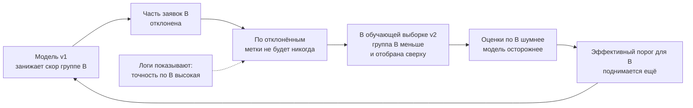

# Справедливость и систематические смещения

> **Зачем эта глава.** Модель скоринга отказывает одному сегменту клиентов вдвое чаще другого,
> комплаенс спрашивает, законно ли это, а продакт — надо ли вообще что-то чинить. Здесь: откуда
> смещение берётся технически, четыре групповых критерия со строгими определениями, доказанная
> невозможность выполнить их одновременно, три уровня вмешательства с ценой каждого — и как всё
> это превращается в панель мониторинга и гейт в CI, а не в декларацию о намерениях.

**Уровень:** 🎯 middle → 🧠 middle+
**Предварительно нужно:** [что мониторить в ML-системе](01-what-to-monitor.md), [деградация модели](04-model-degradation.md), [дисбаланс и калибровка](../02-classic-ml/12-imbalance-and-calibration.md), [разбор ошибок модели](../02-classic-ml/20-error-analysis.md)
**Как проработать:** чтение + сегментный отчёт по своей модели + написать гейт

---

## Карта главы

- [1. Инцидент, с которого начинается тема](#1-инцидент-с-которого-начинается-тема) — почему «сделайте модель справедливой» не ТЗ
- [2. Четыре механизма, которые порождают смещение](#2-четыре-механизма-которые-порождают-смещение) — данные, разметка, петля, выбор таргета
- [3. Четыре групповых критерия и их формулы](#3-четыре-групповых-критерия-и-их-формулы) — строгие определения через условные вероятности
- [4. Тождество, которое запрещает выполнить их вместе](#4-тождество-которое-запрещает-выполнить-их-вместе) — ядро главы
- [5. Численный пример: четыре критерия требуют четырёх разных порогов](#5-численный-пример-четыре-критерия-требуют-четырёх-разных-порогов)
- [6. Индивидуальная справедливость и проблема метрики похожести](#6-индивидуальная-справедливость-и-проблема-метрики-похожести)
- [7. Когда чувствительного признака нет в данных](#7-когда-чувствительного-признака-нет-в-данных) — прокси и их риски
- [8. Три уровня вмешательства и цена каждого](#8-три-уровня-вмешательства-и-цена-каждого) — данные, обучение, порог
- [9. Панели, алерты и гейт в CI](#9-панели-алерты-и-гейт-в-ci) — как это живёт в проде
- [10. Регуляторный контекст без запугивания](#10-регуляторный-контекст-без-запугивания)
- [11. Где это реальное требование, а где формальность](#11-где-это-реальное-требование-а-где-формальность)
- [12. Подводные камни](#12-подводные-камни)
- [13. Проверь себя](#13-проверь-себя)
- [14. Практика](#14-практика)
- [15. Что читать дальше](#15-что-читать-дальше)

---

## 1. Инцидент, с которого начинается тема

Модель скоринга заявок работает полтора года, ROC-AUC 0.81, калибровка ровная, никто не жалуется.
На квартальном ревью аналитик разбивает одобрение по регионам и приносит цифру: в одной группе
регионов одобряют 27% заявок, в другой — 13%. Дальше происходит то, ради чего написана эта глава.

Продакт говорит: «модель дискриминирует, почините». Дата-сайентист отвечает: «в этой группе
дефолтов действительно вдвое больше, модель просто честно считает риск». Комплаенс спрашивает:
«а вы можете доказать, что признак региона не является прокси для запрещённого признака?»
И все трое по-своему правы, потому что говорят о **разных** свойствах системы.

Ключевая мысль, которую надо усвоить до всякой математики: **«справедливость» не одно свойство,
а семейство взаимоисключающих свойств**. Требование «сделайте модель справедливой» технически
неисполнимо ровно в том же смысле, в каком неисполнимо требование «сделайте precision и recall
одновременно равными единице». Инженерная работа состоит не в том, чтобы «убрать смещение», а
в том, чтобы (1) назвать конкретный критерий, (2) измерить разрыв по нему, (3) показать, чем
придётся заплатить за его сокращение, и (4) вынести решение о размене на того, кто имеет право
его принимать.

> 💬 **На собеседовании.** Спросят: «Ваша модель одобряет одной группе 27%, другой — 13%.
> Она дискриминирует?»
> Хороший ответ: по этой цифре сказать нельзя, потому что разница в доле одобрений (демографический
> паритет) и разница в качестве решений (равные ошибки, равная точность) — это разные критерии,
> и при разной базовой частоте дефолта они противоречат друг другу. Дальше я спрошу: какой критерий
> нам вменяется регулятором или продуктом, и есть ли в данных группа, по которой я вправе считать
> метрики. Плохой ответ: «да, надо выровнять доли одобрений» — это выбор одного критерия из четырёх
> без обсуждения и без цены.

---

## 2. Четыре механизма, которые порождают смещение

Модель не «имеет предубеждений». Она воспроизводит статистические закономерности данных. Полезно
знать четыре разных технических пути, которыми в данные попадает то, что потом читается как
дискриминация, — потому что чинятся они по-разному.

### Исторические данные отражают историческое решение

Обучающая выборка скоринга — это заявки, по которым было принято решение, и исходы по одобренным.
Если раньше решение принимал человек или старая модель с систематическим перекосом, вы обучаетесь
на его перекосе. Хуже того, работает **цензурирование**: по отклонённым заявкам исхода нет вообще,
и модель обучается на выборке, отобранной прошлым правилом (reject inference — отдельная большая
тема в кредитном риске). См. [деградацию модели](04-model-degradation.md) про то, как это
искажает саму оценку качества.

### Смещение разметки

Метка — не факт, а результат процедуры. Разметка «оскорбительный комментарий» зависит от того,
кто размечал: носители разных диалектов и разного культурного контекста систематически расходятся
в оценке одного и того же текста. Согласованность разметчиков внутри группы может быть высокой,
а между группами — низкой, и агрегация голосованием просто отдаёт победу большинству разметчиков.
Диагностика и лечение — в главе про [данные и разметку](../07-mlops/11-data-and-labeling.md):
считать каппу отдельно по стратам разметчиков, а не одну общую цифру.

### Петля обратной связи

Самый неприятный механизм, потому что он усиливается со временем сам. Разберём на скоринге.

Версия модели $v_1$ занижает скор группе $B$. Часть заявок отклоняется. По отклонённым исхода
не будет никогда, значит, в обучающую выборку для $v_2$ попадёт меньше объектов из $B$ — и,
что важнее, только те из них, кто прошёл более высокий порог, то есть систематически лучшие.
Модель $v_2$ обучается на выборке, где группа $B$ представлена меньше и иначе; дисперсия оценок
по ней растёт, модель становится по ней осторожнее, порог фактически ещё поднимается. Через
несколько циклов [переобучения](07-retraining.md) исходный перекос из статистического артефакта
превращается в свойство системы, и по логам это выглядит идеально: точность по группе $B$ высокая,
потому что одобряются только заведомо надёжные.



В рекомендациях то же самое, только быстрее: показанное собирает клики, клики уходят в обучение,
непоказанное не собирает ничего и уходит в небытие. Механика подробно разобрана в главе про
[холодный старт и смещения](../06-recsys/12-cold-start-and-bias.md), и лекарство там то же —
рандомизированный holdout: небольшая доля трафика, где решение принимается не моделью.

> ⚠️ **Типичная ошибка.** Мерить справедливость по продовым логам, не имея пропускаемого holdout.
> Логи содержат только те исходы, которые система разрешила наблюдать → разрыв метрик по группам
> в них систематически занижен, и чем сильнее реальный перекос, тем сильнее он замаскирован.
> Правильно: 0.5–2% трафика с решением по случайному или фиксированному правилу и все метрики
> справедливости считать на нём.

### Выбор целевой переменной

Недооценённый источник, который почти никогда не всплывает на собеседованиях, хотя даёт самые
крупные эффекты. Настоящая цель редко наблюдаема, поэтому берут прокси — и всё смещение прокси
относительно цели становится смещением модели.

Канонический пример — работа Obermeyer et al. (Science, 2019): алгоритм, распределявший программы
интенсивного медицинского сопровождения в США, предсказывал не «тяжесть состояния», а «будущие
расходы на лечение». Прокси выглядит разумно: больнее — дороже. Но на исторических данных при
одинаковой тяжести заболевания на одну расовую группу тратили меньше — из-за худшего доступа к
медицине. Модель добросовестно выучила эту зависимость, и при равной тяжести состояния пациенты
этой группы получали более низкий приоритет. Модель была точна по своему таргету и вредна по
задаче.

То же самое в продукте сплошь и рядом: «удовлетворённость» подменяют временем в приложении,
«качество кандидата» — фактом найма прошлым рекрутером, «риск» — фактом прошлой проверки службой
безопасности.

> 🧠 **Middle+.** Проверка на пять минут, которая ловит эту ошибку до старта разработки: выпишите
> истинную цель и таргет в двух колонках и явно назовите механизм, по которому они расходятся,
> и группы, на которых расхождение больше. Если механизм назвать не получается — вы просто ещё
> не искали. Если он назван и коррелирует с сегментом пользователей, у вас не проблема
> справедливости, у вас проблема постановки задачи, и никакая пост-обработка порога её не решит.

---

## 3. Четыре групповых критерия и их формулы

Введём обозначения раз и навсегда. $Y \in \{0, 1\}$ — истинная метка (дефолт наступил, транзакция
оказалась мошеннической). $S \in [0, 1]$ — скор модели. $\hat Y = \mathbb{1}[S \ge t]$ — решение
после порога $t$. $A$ — групповой признак с значениями $a$ и $b$.

**Демографический паритет** (demographic parity, statistical parity): доля положительных решений
одинакова в группах.

$$
P(\hat Y = 1 \mid A = a) \;=\; P(\hat Y = 1 \mid A = b)
$$

**Равные шансы** (equalized odds): доля положительных решений одинакова внутри каждого класса
истинной метки.

$$
P(\hat Y = 1 \mid Y = y,\, A = a) \;=\; P(\hat Y = 1 \mid Y = y,\, A = b), \qquad y \in \{0, 1\}
$$

**Равные возможности** (equal opportunity) — ослабление предыдущего только на $y = 1$, то есть
равный TPR:

$$
P(\hat Y = 1 \mid Y = 1,\, A = a) \;=\; P(\hat Y = 1 \mid Y = 1,\, A = b)
$$

**Предсказательный паритет** (predictive parity) — равная точность положительных решений, то есть
равный PPV:

$$
P(Y = 1 \mid \hat Y = 1,\, A = a) \;=\; P(Y = 1 \mid \hat Y = 1,\, A = b)
$$

Рядом стоит **калибровка по группам**: для любого значения скора доля реальных положительных
среди получивших этот скор равна самому скору, и это верно в каждой группе:

$$
P(Y = 1 \mid S = s,\, A = a) \;=\; s \qquad \text{для всех } s \text{ и всех групп}
$$

> 📐 **Разбор формулы.** Разница между критериями — в том, **что стоит справа от вертикальной
> черты**, то есть что мы считаем зафиксированным. У демографического паритета условие — только
> группа: мы требуем одинакового поведения системы, не заглядывая в истину. У equalized odds
> условие включает $Y$: мы разрешаем разные доли одобрений, но требуем, чтобы среди одинаково
> рискованных людей решения принимались одинаково. У predictive parity всё наоборот — условие
> включает $\hat Y$: мы смотрим на людей, которым система уже что-то решила, и требуем, чтобы
> обещание «эти люди рискованны» значило в группах одно и то же. Первые два критерия защищают
> **человека от системы** (не хочу, чтобы меня отклонили из-за группы), третий защищает
> **пользователя решения** (хочу, чтобы флаг модели значил одно и то же). Именно поэтому за них
> обычно топят разные стороны: заявитель и банк, обвиняемый и суд.

> 💬 **На собеседовании.** Спросят: «Чем equalized odds отличается от equal opportunity и когда
> вы бы взяли второе?»
> Хороший ответ: equalized odds требует равенства и TPR, и FPR; equal opportunity — только TPR,
> то есть равного шанса быть правильно распознанным для тех, у кого $Y = 1$. Второе берут, когда
> ошибки несимметричны и болит именно пропуск: скрининг заболевания, отбор на собеседование,
> выдача льготы. Требовать заодно и равного FPR там смысла мало, а стоит это дополнительной
> просадки качества. Плохой ответ: «equal opportunity — это упрощённая версия» без указания,
> какая ошибка нас волнует.

---

## 4. Тождество, которое запрещает выполнить их вместе

Теперь главное. Возьмём одну группу с базовой частотой $p = P(Y = 1 \mid A = a)$ и запишем
матрицу ошибок в долях. На $N$ объектах положительных $Np$, отрицательных $N(1 - p)$, тогда

$$
TP = N\,p\,(1 - \mathrm{FNR}), \qquad FP = N\,(1 - p)\,\mathrm{FPR}
$$

где $\mathrm{FNR} = P(\hat Y = 0 \mid Y = 1)$ — доля пропусков, $\mathrm{FPR} = P(\hat Y = 1 \mid Y = 0)$ —
доля ложных срабатываний. Подставим в определение точности положительных решений:

$$
\mathrm{PPV} \;=\; \frac{TP}{TP + FP} \;=\; \frac{p\,(1 - \mathrm{FNR})}{p\,(1 - \mathrm{FNR}) + (1 - p)\,\mathrm{FPR}}
$$

Обратим это выражение. Поделим числитель и знаменатель наоборот и вычтем единицу:

$$
\frac{1 - \mathrm{PPV}}{\mathrm{PPV}} \;=\; \frac{(1 - p)\,\mathrm{FPR}}{p\,(1 - \mathrm{FNR})}
\qquad\Longrightarrow\qquad
\mathrm{FPR} \;=\; \frac{p}{1 - p}\cdot\frac{1 - \mathrm{PPV}}{\mathrm{PPV}}\cdot\big(1 - \mathrm{FNR}\big)
$$

Это тождество Chouldechova. В нём нет никаких предположений о модели — только арифметика матрицы
ошибок. И из него сразу следует то, ради чего оно выписано.

Пусть мы добились предсказательного паритета ($\mathrm{PPV}$ одинаков в группах) и равных
пропусков ($\mathrm{FNR}$ одинаков). Тогда в правой части всё, кроме $p/(1-p)$, совпадает, и

$$
\frac{\mathrm{FPR}_a}{\mathrm{FPR}_b} \;=\; \frac{p_a / (1 - p_a)}{p_b / (1 - p_b)}
$$

Отношение долей ложных срабатываний **обязано** равняться отношению шансов базовых частот. Если
базовые частоты различаются, равные PPV и равные FNR автоматически означают разные FPR. Хотите
все три — уравняйте базовые частоты, что от модели не зависит вообще.

Именно это и был спор вокруг COMPAS в 2016 году: ProPublica показала, что у чернокожих подсудимых
выше доля ложных срабатываний, разработчик Northpointe ответил, что модель имеет одинаковый PPV
в группах. Оба утверждения были верны одновременно, и тождество объясняет, почему иначе и быть
не могло.

> 💬 **На собеседовании.** Спросят: «Слышали про историю с COMPAS? В чём там была суть спора?»
> Хороший ответ: обе стороны были правы по своим цифрам и спорили о разных критериях. ProPublica
> считала долю ложных срабатываний среди тех, кто не совершил рецидив, — это equalized odds.
> Northpointe считала долю рецидивистов среди помеченных как рискованные, — это predictive parity.
> При разных базовых частотах рецидива эти два критерия несовместимы по тождеству Chouldechova,
> поэтому спор был не о качестве модели, а о том, чей критерий вменяется системе. Плохой ответ:
> «модель была расистской» — это пересказ заголовка, а не понимание, и интервьюер услышит, что
> тождество вы не знаете.

Параллельно Kleinberg, Mullainathan и Raghavan (2016) доказали более сильное утверждение уже
про скор, а не про бинарное решение: **калибровка внутри групп**, **баланс для положительного
класса** ($\mathbb{E}[S \mid Y = 1]$ одинаково в группах) и **баланс для отрицательного класса**
($\mathbb{E}[S \mid Y = 0]$ одинаково) совместимы только в двух вырожденных случаях — при
идеальном предсказании или при равных базовых частотах. Никаких оговорок про алгоритм: это
свойство самих определений.

Практический вывод, который стоит произнести вслух на собесе: **выбор критерия справедливости —
не техническое, а продуктовое и юридическое решение**. Инженер обязан посчитать все четыре,
показать размен и не притворяться, что «правильный» ответ выводится из данных.

Это не значит, что помочь с выбором нельзя. Наблюдаемая практика такая:

| Ситуация | Обычно берут | Почему именно его |
|---|---|---|
| Распределение дефицитного блага, где базовая частота сама под подозрением (найм, доступ к программе, допуск к сервису) | демографический паритет | если исторические метки отражают прошлую дискриминацию, «истина» $Y$ не является нейтральным арбитром, и опираться на неё нельзя |
| Скрининг, где болит пропуск: медицина, отбор в короткий список, льгота | равные возможности | ошибка «не заметили того, кому надо» несимметрично дороже, требовать заодно равного FPR — платить качеством без причины |
| Карательное или ограничительное решение: блокировка, отказ, повышенная ставка | равные шансы | здесь болят обе ошибки, и ложное срабатывание — это ущерб конкретному человеку |
| Скор отдаётся человеку или другой системе как оценка риска | калибровка по группам | если число используется дальше в расчётах, оно обязано значить одно и то же везде |

Таблица описывает, к чему склоняются в спорных случаях, а не то, что предписано. Единого мнения
здесь нет, и любой автор, который говорит иначе, продаёт вам свою позицию под видом стандарта.

---

## 5. Численный пример: четыре критерия требуют четырёх разных порогов

Абстракция становится осязаемой на числах. Построим идеально калиброванный скор — так, чтобы
у модели вообще не было шанса ошибиться в вероятности, — и посмотрим, что произойдёт.

```python
import numpy as np

rng = np.random.default_rng(0)
n = 200_000

def make_group(intercept):
    """Скор p калиброван идеально по построению: метка берётся как y ~ Bernoulli(p)."""
    z = rng.normal(size=n)                        # латентный риск, распределён одинаково
    p = 1 / (1 + np.exp(-(intercept + 1.5 * z)))  # интерсепт задаёт базовую частоту группы
    return p, rng.binomial(1, p)

pA, yA = make_group(-0.9)      # группа A: базовая частота выше
pB, yB = make_group(-2.4)      # группа B: базовая частота ниже

def rates(p, y, t):
    pred = p >= t
    tp = np.sum(pred & (y == 1)); fp = np.sum(pred & (y == 0))
    fn = np.sum(~pred & (y == 1)); tn = np.sum(~pred & (y == 0))
    return dict(sel=pred.mean(), tpr=tp/(tp+fn), fpr=fp/(fp+tn), ppv=tp/max(tp+fp, 1))

for name, p, y in (("A", pA, yA), ("B", pB, yB)):
    b = np.digitize(p, [0.1, 0.3, 0.5, 0.7])
    cal = "  ".join(f"{p[b == k].mean():.2f}->{y[b == k].mean():.2f}" for k in range(5))
    print(f"{name}: base_rate={y.mean():.3f} | калибровка {cal} | "
          f"E[S|Y=1]={p[y == 1].mean():.3f} E[S|Y=0]={p[y == 0].mean():.3f}")

a = rates(pA, yA, 0.5)
print(f"\nгруппа A при пороге 0.50: sel={a['sel']:.3f} TPR={a['tpr']:.3f} "
      f"FPR={a['fpr']:.3f} PPV={a['ppv']:.3f}")

grid = np.linspace(0.005, 0.99, 985)
rB = [rates(pB, yB, t) for t in grid]
print(f"\n{'что выравниваем в группе B':<28}{'порог':>7}{'sel':>7}{'TPR':>7}{'FPR':>7}{'PPV':>7}")
for key, label in (("sel", "demographic parity"), ("tpr", "equal opportunity"),
                   ("fpr", "равный FPR"), ("ppv", "predictive parity")):
    i = int(np.argmin([abs(r[key] - a[key]) for r in rB])); r = rB[i]
    print(f"{label:<28}{grid[i]:>7.3f}{r['sel']:>7.3f}{r['tpr']:>7.3f}"
          f"{r['fpr']:>7.3f}{r['ppv']:>7.3f}")
```

```
A: base_rate=0.347 | калибровка 0.05->0.06  0.19->0.19  0.39->0.40  0.59->0.60  0.81->0.81 | E[S|Y=1]=0.528 E[S|Y=0]=0.248
B: base_rate=0.148 | калибровка 0.04->0.04  0.18->0.18  0.38->0.39  0.58->0.58  0.79->0.78 | E[S|Y=1]=0.335 E[S|Y=0]=0.115

группа A при пороге 0.50: sel=0.275 TPR=0.548 FPR=0.130 PPV=0.692

что выравниваем в группе B    порог    sel    TPR    FPR    PPV
demographic parity            0.182  0.275  0.686  0.204  0.369
equal opportunity             0.263  0.182  0.548  0.118  0.445
равный FPR                    0.249  0.195  0.572  0.130  0.433
predictive parity             0.587  0.034  0.158  0.012  0.692
```

Читаем. Скор калиброван в обеих группах идеально: столбцы вида `0.39->0.40` показывают, что среди
людей со скором около 0.39 доля положительных ровно такая же. При этом баланс по KMR нарушен и
не может не быть нарушен: средний скор среди $Y = 1$ равен 0.528 в группе $A$ и 0.335 в $B$.
Уже здесь два «разумных» требования разошлись.

Дальше — главная таблица. Чтобы группа $B$ сравнялась с группой $A$, порог для неё должен быть
0.182 по демографическому паритету, 0.263 по равным возможностям, 0.249 по равному FPR и 0.587
по предсказательному паритету. **Четыре критерия — четыре разных числа**, и никакой порог не
удовлетворит их вместе. Цена видна тут же: выравнивая доли одобрений, мы получаем в группе $B$
точность 0.369 против 0.692 в $A$ — то есть почти две трети положительных решений там будут
ошибочными; выравнивая точность, мы одобряем в $B$ 3.4% против 27.5% в $A$.

Тождество из раздела 4 проверяется на этих же данных численно: при пороге 0.5 в группе $A$
$\mathrm{FPR} = 0.12972$, и формула через $p$, PPV и FNR даёт те же 0.12972 до пятого знака.
Отношение шансов базовых частот равно 3.07 — ровно во столько раз обязаны различаться FPR,
если уравнять PPV и FNR.

> ⌨️ **Руками.** Возьмите этот код и добавьте третий сценарий: одинаковые базовые частоты
> (`intercept` = −0.9 у обеих групп) при разном качестве разделения (`1.5` против `0.8`).
> Посмотрите, сходятся ли теперь четыре порога. Ответ вас удивит меньше, чем должен: они сойдутся
> не полностью, и вы своими руками увидите, что равенство базовых частот — условие необходимое,
> но результат зависит ещё и от формы распределения скора.

---

## 6. Индивидуальная справедливость и проблема метрики похожести

Групповые критерии молчат о конкретном человеке: можно выполнить демографический паритет,
одобряя в группе $B$ случайных заявителей, — доли сойдутся, а решения будут абсурдными.

Альтернатива — **индивидуальная справедливость** (individual fairness, Dwork et al., 2012):
похожие объекты должны получать похожие предсказания. Формально требуют липшицевости решающего
правила: $|f(x_1) - f(x_2)| \le L \cdot d(x_1, x_2)$, где $d$ — метрика похожести на пространстве
объектов, $L$ — константа Липшица.

Определение красивое, а применимость упирается ровно в один вопрос: откуда взять $d$. Метрика
должна выражать «похожесть по существу задачи, без учёта запрещённых признаков» — то есть уже
содержать в себе ответ на вопрос, который мы и пытались решить. Евклидово расстояние по признакам
не годится: если признаки коррелируют с группой, метрика унаследует ровно то смещение, от которого
мы избавляемся. Учить $d$ по экспертным парам «эти двое должны получить одинаковое решение» —
рабочая идея, но собрать такую разметку в объёме, достаточном для многомерного пространства,
почти никогда не выходит.

Практический остаток от этой линии — не липшицевость, а **тест на согласованность (consistency)**:
берём объект, находим $k$ ближайших соседей в разумной метрике и смотрим разброс предсказаний.
И более узкий, но реально применимый **контрфактический тест**: меняем только чувствительный
признак (и ничего больше) и смотрим, изменилось ли решение. Он ловит грубые случаи и хорошо
ложится на CI, но не ловит косвенное влияние через прокси-признаки, потому что их-то мы не
меняем.

---

## 7. Когда чувствительного признака нет в данных

Типичная российская и европейская ситуация: пол, национальность, вероисповедание собирать нельзя
или не собирали. Мерить всё равно надо — «мы не знаем групп» не защищает от того, что модель
по ним расходится.

Три подхода, по возрастанию сомнительности:

**Наблюдаемые законные сегменты.** Регион, тип населённого пункта, канал привлечения, тип
устройства, возрастная корзина (там, где возраст легален). Это не «защищённые признаки», но это
сегменты, по которым продукт обязан работать одинаково хорошо, и разрыв метрик по ним — уже
рабочий сигнал. Начинать надо отсюда: см. сегментный анализ в
[главе о деградации](04-model-degradation.md).

**Статистические прокси.** В США распространён BISG (Bayesian Improved Surname Geocoding):
априор по фамилии из переписной таблицы фамилий уточняется распределением по переписному участку
проживания. Метод регуляторно признан (CFPB использовал его в надзоре по кредитованию), и он
даёт распределение вероятностей принадлежности к группе, а не метку.

**Проблема, которую надо назвать честно.** Прокси шумит, и шум смещает оценку разрыва.
Если истинная группа восстанавливается с ошибкой, оценённый разрыв метрик **систематически
занижается** к нулю — та же аттенюация, что при ошибке измерения в регрессии. Поэтому корректная
процедура — не «навесить метку argmax и посчитать метрики», а взвешивать объекты апостериорными
вероятностями и строить доверительные интервалы с учётом неопределённости прокси. Оценка «разрыв
TPR = 0.03» на прокси может означать реальные 0.08.

> ⚠️ **Типичная ошибка.** Использовать восстановленный прокси не для аудита, а как признак модели
> или как ключ для разных порогов. Аудит по вероятностной оценке — легитимная надзорная практика;
> принятие решения по восстановленному признаку расы или пола — прямое основание для иска
> в большинстве юрисдикций. Граница проходит по назначению использования, а не по алгоритму.

> 💬 **На собеседовании.** Спросят: «У вас нет пола и национальности в данных. Как вы вообще
> измерите справедливость?»
> Хороший ответ: сначала — по законным сегментам, которые есть (регион, канал, возрастная корзина),
> потому что от них никто не защищает и разрыв там мерить и можно, и нужно. Дальше, если задача
> регулируемая, — вероятностный прокси вроде BISG, но с двумя оговорками: он используется только
> для агрегированного аудита, и оценка разрыва по нему смещена вниз, поэтому пороги гейта надо
> ставить строже. И отдельно — контрфактический тест по тем признакам, что есть. Плохой ответ:
> «раз признака нет, модель не может дискриминировать» — fairness through unawareness не работает,
> потому что прокси в данных остаются.

---

## 8. Три уровня вмешательства и цена каждого

Допустим, критерий выбран и разрыв признан неприемлемым. Вмешаться можно в трёх точках.

| Уровень | Что делают | Цена в качестве | Юридическая допустимость |
|---|---|---|---|
| **Данные** (pre-processing) | перевзвешивание объектов (Kamiran–Calders), ресэмплинг, «починка» меток, обучение представлений, из которых группа не восстанавливается | обычно умеренная; ломает калибровку, если веса не учтены | как правило проходит: сама модель группу не видит |
| **Обучение** (in-processing) | штраф за разрыв метрики в лоссе, ограниченная оптимизация, adversarial debiasing (вторая головка предсказывает группу, основная учится её обмануть через градиентный реверс) | наиболее эффективная точка вмешательства и самая нестабильная в обучении | обычно проходит, но труднее объяснить аудитору, что именно оптимизировалось |
| **Порог** (post-processing) | разные пороги по группам, рандомизированное правило Hardt et al. для точного equalized odds | минимальная просадка при заданном разрыве; калибровка решений рушится | **самое проблемное**: явное разное обращение по защищённому признаку |

Про третью строку стоит сказать отдельно, потому что она самая соблазнительная: она не требует
переобучения, даёт точный контроль над разрывом и реализуется за час. И ровно она чаще всего
недопустима. Разные пороги по защищённому признаку — это буквально разное правило для разных
групп; в кредитовании США это классифицируется как disparate treatment, и «зато метрики
выровнялись» аргументом не является. Если признак не защищённый (регион, сегмент), разные пороги
абсолютно нормальны и применяются повсеместно.

Общая закономерность размена: кривая «разрыв против качества» не линейна. Первые проценты разрыва
обычно снимаются почти бесплатно, потому что они и не были свойством задачи — это баг. Битый
признак, который в одном регионе приходит пустым; категория, не попавшая в справочник кодировки;
дыра в разметке по редкой подгруппе. Последние проценты стоят дорого и упираются в реальную
разницу распределений. Отсюда практический порядок действий: сначала разберите разрыв как ошибку
по протоколу из [разбора ошибок модели](../02-classic-ml/20-error-analysis.md) и почините
пайплайн, и только если после этого разрыв остался — беритесь за методы из таблицы. По моему
опыту заметная часть «проблем справедливости» на первой итерации оказывается обычным дефектом
фича-пайплайна в одном сегменте.

> 🌱 **База.** Минимальный путь через тему, если вы дошли только до этого места. (1) Разбейте
> метрики модели по сегментам — сам факт разбивки закрывает большую часть практических случаев.
> (2) Выберите один критерий и обоснуйте выбор в одну строку. (3) Заведите панель и алерт на
> разрыв. (4) Не трогайте пороги по группам без юриста. Всё остальное в главе — про то, почему
> эти четыре шага именно такие.

> 🧠 **Middle+.** Adversarial debiasing разбирается механически: поверх представления
> $h(x)$ ставится дискриминатор $g$, предсказывающий $A$, и градиент от его лосса приходит в
> энкодер с обратным знаком. Энкодер учится строить представление, из которого группа не
> восстанавливается. Две честные оговорки. Первая: это минимаксная игра, она нестабильна, и «мой
> дискриминатор не может предсказать группу» означает лишь «этот дискриминатор не смог», а не
> «информации нет». Вторая: полное удаление информации о группе из представления — это, по сути,
> демографический паритет, со всеми его последствиями из раздела 5.

---

## 9. Панели, алерты и гейт в CI

Всё, что не попало в дашборд и в пайплайн, существует в виде презентации и исчезает через квартал.
Как это выглядит в работающей системе.

**Панель.** Одна таблица: строка — сегмент, столбцы — $n$, базовая частота, доля положительных
решений, TPR, FPR, PPV и калибровочный сдвиг $\mathbb{E}[S] - \mathbb{E}[Y]$. Плюс временной
график разрыва по выбранному критерию. Никаких «индексов справедливости» одним числом: агрегат
скрывает ровно то, ради чего панель заводилась.

Отдельный вопрос — **пересечения сегментов** (intersectionality). Модель может быть ровной по
возрастным корзинам, ровной по регионам и заметно проваливаться на конкретном пересечении.
Соблазн проверять все пересечения надо гасить сразу: число подгрупп растёт мультипликативно,
статистика в каждой тает, и вы получите лавину ложных срабатываний вместо сигнала. Рабочий
компромисс — короткий фиксированный список пересечений, выбранный продуктом заранее и записанный
в тот же документ, что и пороги; систематический поиск слабых подгрупп ведётся как отдельное
исследование, а не как алерт.

**Периодичность.** Разрыв по группам — метрика медленная, и суточные колебания в ней это шум.
Разумный режим: пересчёт еженедельный на накопленном окне (обычно 4–8 недель, чтобы в малых
сегментах хватило объектов), алерт по правилу «два периода подряд выше порога». На метриках,
требующих меток, добавляется горизонт разметки: считать разрыв TPR раньше, чем созрели метки,
бессмысленно — механика та же, что в [главе о деградации](04-model-degradation.md).

**Гейт при выкатке.** Проверяется не абсолютное значение, а разрыв и его изменение относительно
текущей продовой модели. Минимальный работающий вариант:

```python
import numpy as np, pandas as pd

def group_report(y, score, group, threshold):
    rows = []
    for g in np.unique(group):
        m = group == g
        yy, ss, pred = y[m], score[m], score[m] >= threshold
        tp = np.sum(pred & (yy == 1)); fp = np.sum(pred & (yy == 0))
        fn = np.sum(~pred & (yy == 1)); tn = np.sum(~pred & (yy == 0))
        rows.append(dict(group=g, n=int(m.sum()), base_rate=yy.mean(),
                         selection=pred.mean(), tpr=tp / max(tp + fn, 1),
                         fpr=fp / max(fp + tn, 1), ppv=tp / max(tp + fp, 1),
                         calib_gap=ss.mean() - yy.mean()))
    return pd.DataFrame(rows)

def fairness_gate(rep, max_tpr_gap=0.05, max_calib_gap=0.02, min_n=2000):
    """Пустой список = гейт пройден. Пороги — продуктовое решение, а не дефолт библиотеки."""
    fails = []
    big, small = rep[rep.n >= min_n], rep[rep.n < min_n]
    for _, r in small.iterrows():                    # не молчим о группах, где нет статистики
        fails.append(f"WARN  группа {r.group}: n={r.n} < {min_n}, оценка незначима")
    if len(big) >= 2:
        gap = big.tpr.max() - big.tpr.min()
        if gap > max_tpr_gap:
            fails.append(f"FAIL  разрыв TPR = {gap:.3f} > {max_tpr_gap}")
    for _, r in big.iterrows():                      # калибровку проверяем внутри каждой группы
        if abs(r.calib_gap) > max_calib_gap:
            fails.append(f"FAIL  группа {r.group}: калибровочный сдвиг {r.calib_gap:+.3f}")
    return fails
```

Проверим на синтетике: истинный риск по группам разный (это данные, а не дефект модели),
а модель вдобавок систематически завышает риск в группе $B$ на 0.05; группа $C$ мала.

```python
rng = np.random.default_rng(7)
n = {"A": 60000, "B": 25000, "C": 1200}
group = np.concatenate([np.repeat(g, k) for g, k in n.items()])
# Истинный риск различается по группам: это данные, а не дефект модели.
true_p = np.concatenate([rng.beta(3.5, 6.5, n["A"]),
                         rng.beta(1.6, 9.0, n["B"]),
                         rng.beta(2.6, 7.4, n["C"])])
y = (rng.random(len(true_p)) < true_p).astype(int)
# Модель почти идеальна, но в группе B систематически завышает риск на 0.05.
score = np.clip(true_p + rng.normal(0, 0.05, len(true_p)) + 0.05 * (group == "B"), 0, 1)

rep = group_report(y, score, group, threshold=0.35)
print(rep.to_string(index=False, float_format=lambda v: f"{v:.4f}"))
print()
for line in fairness_gate(rep):
    print(line)
```

```
group     n  base_rate  selection    tpr    fpr    ppv  calib_gap
    A 60000     0.3503     0.4785 0.6323 0.3957 0.4628    -0.0000
    B 25000     0.1533     0.1108 0.2622 0.0834 0.3628     0.0481
    C  1200     0.2500     0.2575 0.4033 0.2089 0.3916     0.0133

WARN  группа C: n=1200 < 2000, оценка незначима
FAIL  разрыв TPR = 0.370 > 0.05
FAIL  группа B: калибровочный сдвиг +0.048
```

Три детали, которые отличают рабочий гейт от декоративного. Первая: `min_n` — без него гейт будет
падать от шума на маленьких сегментах, и его отключат через неделю. Вторая: маленькие группы
не выбрасываются молча, а помечаются `WARN` — «мы не знаем» это не то же самое, что «всё хорошо».
Третья: пороги 0.05 и 0.02 здесь — иллюстрация; в реальном проекте они выводятся из продуктового
решения и фиксируются в документе, а не подбираются так, чтобы текущая модель прошла. Куда это
встраивается технически — в [главе про CI/CD для ML](../07-mlops/07-ci-cd-for-ml.md), рядом с
остальными гейт-метриками.

**Что делать, когда сработало.** Алерт без ответа на этот вопрос через месяц отключают, поэтому
рунбук нужен такой же, как для любого инцидента (см.
[инциденты и runbooks](06-incidents-and-runbooks.md)). Порядок шагов, отсортированный по частоте
причины: (1) проверить объём сегмента и стабильность разрыва по бутстрапу — не шум ли это;
(2) проверить качество данных в сегменте: пропуски, доля дефолтных значений, свежесть признаков,
изменения в справочниках — здесь находится большинство срабатываний; (3) проверить, не изменился
ли состав сегмента (новый канал привлечения, новый регион) — тогда это дрифт, и разбор идёт по
[главе о дрифте](03-drift-detection.md); (4) только после этого поднимать вопрос о вмешательстве
из [раздела 8](#8-три-уровня-вмешательства-и-цена-каждого) и вести его к владельцу решения,
а не чинить порогом самостоятельно.

> 💬 **На собеседовании.** Спросят: «Как вы поставите проверку на справедливость в CI?»
> Хороший ответ: как ещё одну гейт-метрику рядом с качеством — сегментный отчёт на фиксированном
> валидационном срезе, сравнение разрыва по одному заранее выбранному критерию с текущей продовой
> моделью, минимальный размер сегмента, при котором вообще считаем, и WARN вместо тишины на
> маленьких группах. Отдельно оговорю, что для метрик, требующих меток, гейт считается на
> исторических данных с созревшей разметкой, а онлайн я мониторю доли положительных решений
> и калибровку. Плохой ответ: «подключу Fairlearn и поставлю его дефолтный порог» — вопрос был
> про то, какой порог и почему.

---

## 10. Регуляторный контекст без запугивания

Коротко и по делу, потому что это влияет на выбор из раздела 8.

**EU AI Act** (Регламент ЕС 2024/1689) вводит риск-ориентированную классификацию. Системы для
скоринга кредитоспособности физлиц, отбора кандидатов, доступа к образованию и социальным
услугам попадают в категорию высокого риска. Практические следствия для инженера — не «нельзя»,
а «нужно вести»: документация системы и данных, управление рисками, логирование решений,
человеческий контроль, оценка на предмет предвзятости. Требования к высокорисковым системам
вступают в силу поэтапно, с основной волной в 2026–2027 годах.

**Антидискриминационное законодательство в кредитовании** старше и конкретнее. В США это ECOA
и Regulation B: перечень защищённых признаков закрыт, и различают два типа нарушения —
**disparate treatment** (разное правило для групп; сюда попадают разные пороги по защищённому
признаку) и **disparate impact** (правило одинаковое, но эффект непропорциональный; допустимо,
если есть бизнес-обоснование и нет менее ограничительной альтернативы). Отсюда же требование
adverse action notice — при отказе заявителю сообщают конкретные причины, что делает
[интерпретируемость](../02-classic-ml/15-interpretability.md) не пожеланием, а обязательством.

В российском контуре прямого аналога fair lending нет, но есть общий запрет дискриминации,
требования ЦБ к управлению модельным риском и внутренние политики банков, которые обычно
воспроизводят логику «документируй, объясняй решение, проверяй сегменты».

Практический вывод: выясните категорию своей системы **до** выбора метода из раздела 8.
Post-processing по защищённому признаку может быть запрещён там, где перевзвешивание данных
проходит без вопросов.

---

## 11. Где это реальное требование, а где формальность

Честный разговор, без которого глава была бы проповедью.

**Реальное требование** выглядит так: есть регуляторная категория или отраслевая норма; есть
заявитель, который может оспорить решение; ошибка модели меняет доступ человека к деньгам,
работе, лечению, свободе; есть внешний аудит с правом остановить выкатку. Кредитный скоринг,
страховой андеррайтинг, отбор резюме, медицинская триажная система,
[антифрод с блокировкой счёта](../11-system-design/04-case-fraud-detection.md) — здесь метрики
справедливости стоят рядом с ROC-AUC и имеют право заблокировать релиз. На секции system design
по такому кейсу вопрос «как вы будете отслеживать перекос по сегментам» — стандартная часть
блока про мониторинг, и отсутствие ответа читается как отсутствие продового опыта.

**Формальность** выглядит иначе: комплаенс просит «отчёт о bias» раз в год, никто не определил
критерий, пороги подобраны так, чтобы текущая модель проходила, отчёт никто не читает. Признак,
по которому это опознаётся мгновенно: **никто не может назвать действие**, которое последует
из красной цифры. Метрика без последствия — это не guardrail, а ритуал.

Между полюсами лежит большинство продуктовых задач: рекомендации, ранжирование ленты, реклама.
Здесь справедливость чаще формулируется не как защита групп пользователей, а как защита стороны
предложения — доля продавцов без единого показа, концентрация выдачи. И аргумент там
экономический, а не этический: вырождение ассортимента убивает долгосрочную выручку. Это ровно
та рамка, в которой тема обсуждается в
[главе о холодном старте и смещениях](../06-recsys/12-cold-start-and-bias.md), и она куда
продуктивнее моральной.

Личный ориентир, который стоит применять к себе: если вы не можете за минуту назвать, **кто**
принимает решение о размене и **какое действие** следует за срабатыванием алерта, вы делаете
отчётность, а не инженерию.

---

## 12. Подводные камни

**Разрыв метрики посчитан на сегменте из 200 объектов.**
Симптом: разрыв TPR скачет от 0.02 до 0.25 между запусками.
Причина: доверительный интервал для TPR при 200 объектах и базовой частоте 10% шире самого
разрыва. Вы измеряете шум.
Что делать: минимальный размер сегмента в гейте, бутстрап-интервалы для разрыва, агрегирующее
окно в несколько недель. Маленькие группы честно помечать как «не измерено».

**Множественные сравнения по всем сегментам.**
Симптом: «нашли значимый разрыв» в одном из сорока сегментов.
Причина: при сорока проверках на уровне 0.05 два ложных срабатывания — ожидаемое поведение.
Что делать: заранее фиксировать список сегментов, по которым мониторим, поправка на
множественность, а поиск слабых подгрупп вести как отдельное исследование — см.
[разбор ошибок модели](../02-classic-ml/20-error-analysis.md).

**Убрали чувствительный признак и считаете, что закончили.**
Симптом: «пола в модели нет, вопрос закрыт».
Причина: fairness through unawareness не работает — прокси остаются (список покупок,
время активности, модель устройства, район), и модель восстанавливает признак по ним.
Что делать: измерять разрыв, а не отсутствие признака; проверить, насколько хорошо группа
предсказывается по остальным признакам, — это верхняя оценка утечки.

**Выровняли метрику, сломали калибровку.**
Симптом: после включения разных порогов по группам предсказанная вероятность 0.3 означает
в одной группе 30%, а в другой 45%.
Причина: пост-обработка меняет соответствие между скором и частотой. Все downstream-потребители
вероятности (расчёт ожидаемых потерь, лимиты, приоритизация) начинают врать.
Что делать: если вероятность используется дальше по цепочке, вмешиваться на уровне данных или
обучения, а не порога; калибровку по группам мониторить отдельно, как в
[главе о дисбалансе и калибровке](../02-classic-ml/12-imbalance-and-calibration.md).

**Метрики справедливости считаются на смещённых логах.**
Симптом: разрыв в проде стабильно меньше, чем на офлайн-валидации.
Причина: логи содержат только исходы, которые система разрешила наблюдать (раздел 2).
Что делать: рандомизированный holdout, метрики справедливости считать на нём.

**Пороги гейта подобраны после факта.**
Симптом: гейт зелёный с момента внедрения и ни разу не падал.
Причина: пороги выставили так, чтобы текущая модель проходила.
Что делать: фиксировать пороги в документе с датой и владельцем до замера; при изменении порога
требовать явного решения, а не коммита в конфиг.

---

## 13. Проверь себя

<details>
<summary><b>🎯 Вопрос.</b> Почему нельзя одновременно выполнить калибровку и равенство ошибок по группам?</summary>

**Короткий ответ.** Потому что при разных базовых частотах это запрещено арифметикой матрицы
ошибок, а не свойствами конкретного алгоритма. Тождество Chouldechova связывает FPR, FNR, PPV
и базовую частоту жёстко.

**Развёрнуто.** Выпишем $\mathrm{FPR} = \frac{p}{1-p}\cdot\frac{1-\mathrm{PPV}}{\mathrm{PPV}}\cdot(1-\mathrm{FNR})$,
где $p$ — базовая частота положительного класса в группе. Если PPV и FNR уравнены между группами,
то отношение FPR обязано равняться отношению шансов базовых частот. В моём примере из главы шансы
относятся как 3.07, то есть FPR неизбежно различаются втрое. Kleinberg, Mullainathan и Raghavan
доказали более сильный вариант для скора: калибровка внутри групп и баланс средних скоров
в обоих классах совместимы только при идеальном предсказании или при равных базовых частотах.
Практический вывод: «сделайте модель справедливой» — не техническое ТЗ, критерий выбирает
продукт или регулятор, а инженер обязан показать цену размена.

**Чего ждёт интервьюер:** что вы сошлётесь на невозможность как на теорему, а не как на
«обычно бывает трудно», и назовёте условие — разные базовые частоты.

**Провал:** «нужно взять более сложную модель» — никакая модель не меняет арифметику.
</details>

<details>
<summary><b>🎯 Вопрос.</b> Дайте определения demographic parity, equalized odds и predictive parity. Чем они отличаются содержательно?</summary>

**Короткий ответ.** Различаются тем, что фиксируется в условии: только группа, группа и истинная
метка, группа и решение модели.

**Развёрнуто.** Demographic parity: $P(\hat Y = 1 \mid A)$ не зависит от группы — равные доли
положительных решений, истину не смотрим. Equalized odds: $P(\hat Y = 1 \mid Y, A)$ не зависит
от группы при каждом $y$ — равные TPR и равные FPR; равные возможности (equal opportunity) —
то же только при $y = 1$. Predictive parity: $P(Y = 1 \mid \hat Y = 1, A)$ не зависит от группы —
равный PPV, то есть флаг модели значит в группах одно и то же. Первые два защищают человека
от системы, третий — потребителя решения. Отсюда и характерный спор: заявитель апеллирует
к equalized odds, банк — к predictive parity, и оба формально правы.

**Чего ждёт интервьюер:** что вы напишете формулы и объясните разницу через то, что стоит
в условии, а не перескажете названия.

**Провал:** путать equal opportunity с equalized odds или считать демографический паритет
«самым правильным» критерием по умолчанию.
</details>

<details>
<summary><b>🧠 Вопрос.</b> Модель обучена без чувствительного признака. Может ли она дискриминировать?</summary>

**Короткий ответ.** Да. Fairness through unawareness не работает: признак восстанавливается
по прокси — району, каналу привлечения, устройству, паттерну трат.

**Развёрнуто.** Более того, удаление признака иногда ухудшает ситуацию: без него модель не может
скорректироваться на групповые различия в остальных признаках и опирается на прокси неявно,
а вы теряете возможность даже измерить разрыв. Правильная последовательность: признак не
использовать в предсказании, но по возможности иметь для аудита. Верхняя оценка утечки считается
прямо: обучите классификатор группы по остальным признакам и посмотрите AUC — если 0.85,
информация в данных есть в изобилии. Если признака нет вовсе, мерить по законным сегментам,
а в регулируемых задачах — по вероятностному прокси (BISG), помня, что шум прокси занижает
оценённый разрыв.

**Чего ждёт интервьюер:** знания термина «fairness through unawareness» и понимания, что
отсутствие признака не проверяемо ничем, кроме измерения разрыва.

**Провал:** «признака нет — значит, дискриминации нет».
</details>

<details>
<summary><b>🧠 Вопрос.</b> Что не так с разными порогами по группам, если они выравнивают метрику?</summary>

**Короткий ответ.** Технически это работает и стоит дешевле всего, но юридически в регулируемых
задачах это прямое разное обращение по защищённому признаку, а инженерно — оно ломает калибровку.

**Развёрнуто.** Три следствия. Юридическое: в кредитовании США разное правило по защищённому
признаку квалифицируется как disparate treatment, и выровненная метрика оправданием не служит;
для незащищённых сегментов (регион, канал) разные пороги нормальны. Инженерное: после
пост-обработки предсказанная вероятность перестаёт соответствовать частоте, и всё, что стоит
дальше по цепочке — расчёт ожидаемых потерь, лимиты, приоритизация очереди, — начинает врать.
Операционное: порог, зависящий от группы, надо документировать, объяснять аудитору и
пересчитывать при каждом дрифте. Альтернативы — перевзвешивание на уровне данных или штраф
в лоссе; они дороже и менее точно контролируют разрыв, но не создают правила «если группа
такая-то».

**Чего ждёт интервьюер:** что вы отделите техническую эффективность от юридической допустимости.

**Провал:** «пороги по группам — стандартная практика» без оговорки про защищённые признаки.
</details>

<details>
<summary><b>🎯 Вопрос.</b> Как петля обратной связи усиливает исходное смещение? Покажите механизм.</summary>

**Короткий ответ.** Решения модели определяют, какие данные она увидит в следующий раз;
по отклонённым объектам исхода нет, и следующая версия обучается на выборке, отобранной
предыдущей версией.

**Развёрнуто.** На скоринге: версия $v_1$ занижает скор группе $B$, часть заявок отклоняется,
по ним метка не появится никогда. В обучающую выборку для $v_2$ из группы $B$ попадают только
прошедшие более высокий порог — систематически лучшие. Представленность группы падает, дисперсия
оценок растёт, модель становится осторожнее, эффективный порог поднимается ещё. Через несколько
циклов переобучения перекос становится свойством системы, а по логам всё выглядит отлично:
точность по группе $B$ высокая, потому что одобряются только заведомо надёжные. В рекомендациях
цикл тот же, но короче: показанное собирает клики, непоказанное не собирает ничего. Разрыв цикла
один — небольшая доля трафика с решением не по модели (рандомизированный holdout), на которой
и считаются честные метрики.

**Чего ждёт интервьюер:** механизма по шагам и слова «holdout» как лекарства.

**Провал:** «модель просто переобучается на своих ошибках» — без объяснения, откуда берётся
цензурирование меток.
</details>

<details>
<summary><b>🎯 Вопрос.</b> Модель предсказывает расходы на лечение, чтобы распределять программы медицинского сопровождения. Что здесь может пойти не так?</summary>

**Короткий ответ.** Таргет — прокси, а не цель. Расходы при равной тяжести состояния зависят
от доступа к медицине, и модель выучит различия в доступе как различия в потребности.

**Развёрнуто.** Это разбор реального случая (Obermeyer et al., Science, 2019). Модель была
точна по своему таргету и вредна по задаче: при одинаковой тяжести заболевания пациенты группы
с исторически меньшими тратами получали более низкий приоритет. Никакая пост-обработка порога
это не чинит, потому что проблема в постановке. Чинится сменой таргета — на прямой показатель
состояния (число активных хронических состояний, клинические маркеры) — или комбинацией
таргетов. Общий приём: выписать истинную цель и прокси в две колонки и явно назвать механизм
расхождения и группы, на которых оно максимально. Продуктовые аналоги: «удовлетворённость» через
время в приложении, «качество кандидата» через факт найма прошлым рекрутером.

**Чего ждёт интервьюер:** что вы сами поднимете вопрос о выборе целевой переменной, а не начнёте
с метрик и порогов.

**Провал:** «добавлю признак расы, чтобы модель скорректировалась» — и юридически плохо,
и не устраняет расхождение таргета с целью.
</details>

<details>
<summary><b>🧠 Вопрос.</b> Что вы положите в гейт на справедливость при выкатке новой версии модели?</summary>

**Короткий ответ.** Сегментный отчёт на фиксированном валидационном срезе, разрыв по одному
заранее выбранному критерию в сравнении с текущей продовой моделью, минимальный размер сегмента
и явное предупреждение вместо тишины на маленьких группах.

**Развёрнуто.** Конкретно: таблица по сегментам с $n$, базовой частотой, долей положительных
решений, TPR, FPR, PPV и калибровочным сдвигом; правило падения — разрыв TPR между крупными
сегментами выше согласованного порога либо калибровочный сдвиг в любой группе выше своего;
сегменты меньше `min_n` дают WARN, а не молчание. Сравнивать надо с продовой моделью, а не
с абсолютным идеалом: релиз блокируется, если стало хуже. Пороги фиксируются документом до
замера, иначе их подгонят под текущую модель. Для метрик, требующих меток, гейт считается
на исторических данных с созревшей разметкой, а онлайн мониторятся доли положительных решений
и калибровка. Встраивается это рядом с остальными гейт-метриками в пайплайне CI/CD.

**Чего ждёт интервьюер:** что вы говорите о разнице с текущей моделью, о размере сегмента
и о происхождении порогов, а не называете библиотеку.

**Провал:** «прогоню Fairlearn и посмотрю дефолтные метрики» — вопрос был о том, что и почему
блокирует релиз.
</details>

---

## 14. Практика

**Задача 1. Четыре порога (45 минут).**
Запустите код из [раздела 5](#5-численный-пример-четыре-критерия-требуют-четырёх-разных-порогов)
и постройте график: по оси X — порог для группы $B$, по оси Y — четыре метрики, горизонтальными
линиями — значения группы $A$.
*Критерий: на графике видны четыре разные точки пересечения, и вы можете назвать цену перехода
от каждой к каждой в единицах точности и доли одобрений.*

**Задача 2. Проверка тождества (30 минут).**
Реализуйте функцию, которая по $p$, PPV и FNR возвращает FPR по тождеству Chouldechova, и
сверьте её с эмпирическим FPR на десяти случайных порогах и обеих группах.
*Критерий: совпадение до пятого знака везде; расхождение означает ошибку в определении
одной из величин.*

**Задача 3. Петля обратной связи (1.5 часа).**
Симулируйте пять циклов переобучения: модель отклоняет заявки ниже порога, метка появляется
только у одобренных, следующая версия обучается на накопленных данных. Отслеживайте долю
одобрений по группам и оценённое качество.
*Критерий: вы наблюдаете расхождение долей одобрений при растущей или стабильной оценённой
точности, и добавление 2% рандомизированного holdout заметно замедляет расхождение.*

**Задача 4. Гейт на своих данных (1 час).**
Возьмите свою модель, соберите отчёт функцией `group_report` по трём-четырём законным сегментам
и напишите гейт с бутстрап-интервалами для разрыва вместо точечной оценки.
*Критерий: гейт падает на подкрученной модели и не падает на переобучении текущей на другом
сиде — то есть отличает сигнал от шума.*

---

## 15. Что читать дальше

- **Kleinberg J., Mullainathan S., Raghavan M. «Inherent Trade-Offs in the Fair Determination
  of Risk Scores» (ITCS 2017, arXiv:1609.05807)** — первоисточник теоремы о невозможности.
  Читать ради строгой формулировки трёх условий и понимания, что оговорок в ней нет.
- **Chouldechova A. «Fair Prediction with Disparate Impact» (Big Data, 2017, arXiv:1610.07524)** —
  то же самое на языке матрицы ошибок; тождество из [раздела 4](#4-тождество-которое-запрещает-выполнить-их-вместе)
  взято отсюда. Самая доступная из работ по теме, полторы страницы алгебры.
- **Hardt M., Price E., Srebro N. «Equality of Opportunity in Supervised Learning»
  (NeurIPS 2016, arXiv:1610.02413)** — определение equalized odds и equal opportunity плюс
  конструкция пост-обработки, включая рандомизированное правило. Читать перед тем, как трогать
  пороги.
- **Dwork C., Hardt M., Pitassi T., Reingold O., Zemel R. «Fairness Through Awareness»
  (ITCS 2012, arXiv:1104.3913)** — индивидуальная справедливость и липшицево ограничение;
  здесь же авторы честно проговаривают, что метрика похожести — открытая проблема.
- **Obermeyer Z., Powers B., Vogeli C., Mullainathan S. «Dissecting racial bias in an algorithm
  used to manage the health of populations» (Science, 2019)** — разбор выбора целевой переменной
  на реальной системе, охватывавшей десятки миллионов пациентов. Лучший существующий аргумент
  в пользу того, чтобы обсуждать таргет до модели.
- **Corbett-Davies S., Goel S. «The Measure and Mismeasure of Fairness» (arXiv:1808.00023)** —
  критический разбор групповых критериев: почему формальное выравнивание метрики может ухудшить
  положение той самой группы, которую защищали. Нужен как противовес остальному списку.
- [Barocas S., Hardt M., Narayanan A. «Fairness and Machine Learning»](https://fairmlbook.org) —
  бесплатный учебник, единственный источник в списке, который системно связывает статистику,
  причинность и правовой контекст. Главы про causal inference читать после
  [uplift и причинности](../02-classic-ml/17-uplift-and-causal.md).
- [Fairlearn](https://fairlearn.org/) и [AIF360](https://github.com/Trusted-AI/AIF360) —
  две рабочие библиотеки: метрики по группам, редукции для in-processing, пост-обработка.
  Полезны как справочник по реализациям; дефолтные пороги в них — не ваши пороги.
- [ProPublica «Machine Bias» (2016)](https://www.propublica.org/article/machine-bias-risk-assessments-in-criminal-sentencing) —
  публикация, с которой начался спор про COMPAS. Читать вместе с ответом Northpointe:
  это лучший учебный пример того, как две стороны приводят верные цифры и приходят к
  противоположным выводам.

---

⬅️ [Переобучение моделей](07-retraining.md) | 🏠 [Оглавление](../index.md) | ➡️ [Дизайн эксперимента](../10-ab-testing/01-experiment-design.md)
