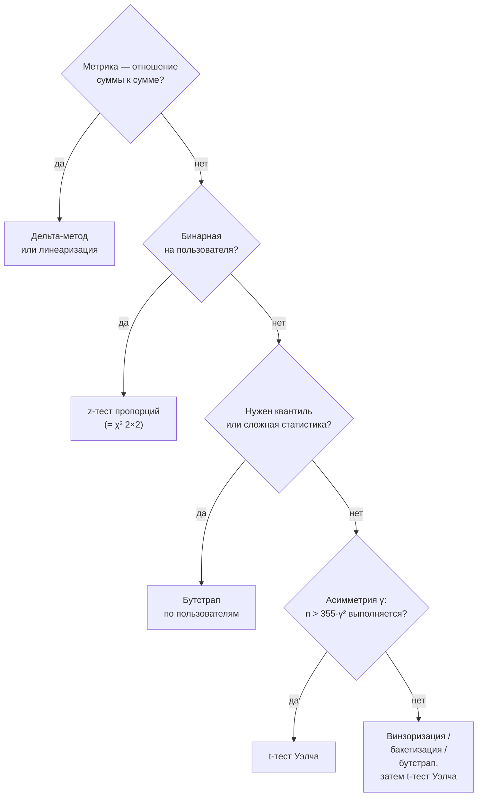

# Статистические критерии на практике

> **Зачем эта глава.** Дизайн эксперимента можно сделать безупречно и всё равно получить
> неверный ответ — если посчитать значимость не тем критерием. Здесь разбираются критерии,
> которые реально применяются в A/B: что каждый из них на самом деле проверяет, где он врёт,
> и как считать значимость для ratio-метрик вроде CTR, на которых спотыкается большинство
> кандидатов. После главы вы сможете выбрать критерий осознанно и защитить выбор на собеседовании.

**Уровень:** 🎯 middle → 🧠 middle+
**Предварительно нужно:** [статистика и вывод](../01-math/03-statistics.md), [теория вероятностей](../01-math/02-probability.md), [дизайн эксперимента](01-experiment-design.md)
**Время на проработку:** ~5 часов (чтение + код + упражнения)

---

## Карта главы

- [1. Задача: от разности средних к решению](#1-задача-от-разности-средних-к-решению)
- [2. t-тест: что на самом деле требуется](#2-t-тест-что-на-самом-деле-требуется)
- [3. Тест Уэлча и почему он лучше по умолчанию](#3-тест-уэлча-и-почему-он-лучше-по-умолчанию)
- [4. Манн — Уитни: что он проверяет на самом деле](#4-манн--уитни-что-он-проверяет-на-самом-деле)
- [5. Доли: z-тест и χ²](#5-доли-z-тест-и-χ)
- [6. Ratio-метрики: почему обычный t-тест не работает](#6-ratio-метрики-почему-обычный-t-тест-не-работает)
- [7. Дельта-метод: полный вывод](#7-дельта-метод-полный-вывод)
- [8. Линеаризация](#8-линеаризация)
- [9. Бутстрап и его стоимость](#9-бутстрап-и-его-стоимость)
- [10. Тяжёлые хвосты](#10-тяжёлые-хвосты)
- [11. p-value и доверительный интервал: как докладывать](#11-p-value-и-доверительный-интервал-как-докладывать)
- [12. Как выбрать критерий: сводка](#12-как-выбрать-критерий-сводка)
- [13. Подводные камни](#13-подводные-камни)
- [14. Проверь себя](#14-проверь-себя)
- [15. Практика](#15-практика)
- [16. Что читать дальше](#16-что-читать-дальше)

---

## 1. Задача: от разности средних к решению

Эксперимент закончился. В контроле средняя выручка на пользователя 512.30 ₽, в тесте 519.80 ₽.
Разница +7.50 ₽, или +1.46%. Вопрос ровно один: **это эффект или это шум?**

Ответ даёт критерий значимости. Механика у всех критериев одна и та же и состоит из трёх
шагов:

1. Взять оценку эффекта $\hat\Delta$ (обычно разность средних).
2. Оценить, как сильно $\hat\Delta$ гуляет от эксперимента к эксперименту, если эффекта нет, —
   то есть найти распределение $\hat\Delta$ при верной $H_0$.
3. Посмотреть, насколько наблюдённое значение необычно для этого распределения.

Вся разница между критериями — в шаге 2: **как именно они получают нулевое распределение**.
t-тест берёт его из ЦПТ, критерий Манна — Уитни из комбинаторики рангов, бутстрап из
пересэмплирования. Отсюда и разные условия применимости, и разные ответы на разные вопросы.

Ключевая мысль, которую стоит держать в голове всю главу: **критерий отвечает ровно на тот
вопрос, который в него заложен**. Манн — Уитни отвечает не на тот вопрос, что t-тест, и это
не «более робастная версия», а другой вопрос. Половина ошибок в анализе A/B — от подмены
вопроса.

---

## 2. t-тест: что на самом деле требуется

### Статистика

Пусть в контроле $n_A$ наблюдений с выборочным средним $\bar X_A$ и выборочной дисперсией
$s_A^2$, в тесте — $n_B$, $\bar X_B$, $s_B^2$. Статистика двухвыборочного t-теста:

$$
t = \frac{\bar X_B - \bar X_A}{\widehat{\mathrm{SE}}},\qquad
\widehat{\mathrm{SE}} = \sqrt{\frac{s_A^2}{n_A} + \frac{s_B^2}{n_B}}
$$

где $\bar X_A, \bar X_B$ — выборочные средние групп, $s_A^2, s_B^2$ — несмещённые выборочные
дисперсии (с делением на $n-1$), $n_A, n_B$ — размеры групп, $\widehat{\mathrm{SE}}$ — оценка
стандартной ошибки разности средних.

### Чего требует t-тест — и чего не требует

Самое частое заблуждение в этой теме звучит так: «t-тест требует нормальности данных, а у нас
выручка — значит, нельзя». Это неверно.

**t-тест требует нормальности выборочного среднего, а не исходных данных.**

Разберём, откуда это следует. Числитель $\bar X_B - \bar X_A$ — разность двух средних. По
**центральной предельной теореме** (central limit theorem) для независимых одинаково
распределённых $X_i$ с конечной дисперсией:

$$
\frac{\bar X - \mu}{\sigma/\sqrt{n}} \;\xrightarrow[n\to\infty]{d}\; \mathcal{N}(0,1)
$$

где $\bar X$ — выборочное среднее, $\mu$ — истинное среднее, $\sigma^2$ — истинная дисперсия
одного наблюдения, $n$ — размер выборки, $\xrightarrow{d}$ — сходимость по распределению.
Никаких требований к форме распределения $X_i$ здесь нет — только конечность дисперсии.

Знаменатель $\widehat{\mathrm{SE}}$ — состоятельная оценка настоящей $\mathrm{SE}$, и по лемме
Слуцкого отношение тоже сходится к $\mathcal{N}(0,1)$. То есть при больших выборках t-тест
работает **для любого распределения с конечной дисперсией**.

Нормальность самих данных нужна только в одном случае: когда выборка мала и вы хотите, чтобы
статистика имела в точности распределение Стьюдента. В A/B-тестах с сотнями тысяч наблюдений
это не про нас. При $n$ порядка тысяч и больше распределение Стьюдента практически неотличимо
от нормального ($t_{1000}$ и $\mathcal{N}(0,1)$ различаются в третьем знаке), поэтому t-тест
и z-тест в A/B дают один и тот же ответ.

> 📐 **Разбор формулы.** Обратите внимание, что в знаменателе стоит именно
> $\sqrt{s_A^2/n_A + s_B^2/n_B}$, а не $\sqrt{s_A^2 + s_B^2}$. Дисперсии складываются
> **у средних**, а дисперсия среднего в $n$ раз меньше дисперсии наблюдения:
> $\mathrm{Var}(\bar X) = \mathrm{Var}\big(\frac{1}{n}\sum X_i\big) = \frac{1}{n^2}\cdot n\sigma^2 = \frac{\sigma^2}{n}$
> (использована независимость: дисперсия суммы независимых равна сумме дисперсий).

### Но «большие выборки» — это сколько?

Вот здесь и прячется реальная проблема. ЦПТ — асимптотическая теорема, она не говорит,
насколько быстро наступает сходимость. Скорость даёт **неравенство Берри — Эссеена**:

$$
\sup_x \left| \mathbb{P}\!\left(\frac{\bar X - \mu}{\sigma/\sqrt{n}} \le x\right) - \Phi(x) \right|
\;\le\; \frac{C\,\rho}{\sigma^3 \sqrt{n}}
$$

где $\Phi$ — функция распределения стандартного нормального закона, $\rho = \mathbb{E}|X-\mu|^3$
— третий абсолютный центральный момент, $\sigma$ — стандартное отклонение $X$, $C$ — абсолютная
константа (известные оценки дают $C < 0.5$), $\sup_x$ — максимум по всем точкам расхождения
функций распределения.

Читать это надо так: **ошибка нормального приближения падает как $1/\sqrt{n}$, но множитель
перед ней зависит от асимметрии распределения**. Для симметричного распределения отношение
$\rho/\sigma^3$ около единицы, и уже при $n = 100$ ошибка мала. Для выручки на пользователя,
где 90% нулей и длинный правый хвост, это отношение легко достигает десятков — и тогда даже
при $n = 10^4$ нормальное приближение врёт.

Практическое правило, известное из работы Boos и Hughes-Oliver (*The American Statistician*,
2000) и популяризованное Кохави: чтобы доверительный интервал по t-статистике имел заявленное
покрытие, нужно примерно

$$
n > 355\,\gamma^2
$$

где $\gamma$ — коэффициент асимметрии (skewness) распределения метрики,
$\gamma = \mathbb{E}\big[(X-\mu)^3\big]/\sigma^3$, а $n$ — размер **одной** группы. Для
двухвыборочного теста с группами одинакового размера требование мягче (асимметрия частично
компенсируется), но порядок величины тот же.

Числа для интуиции:

| Метрика | Типичная асимметрия $\gamma$ | Нужно $n$ на группу |
|---|---|---|
| Конверсия (доля 5%) | ≈ 4.1 | ~6 000 |
| Число сессий на пользователя | 3–6 | 3 000–13 000 |
| Выручка на пользователя (много нулей) | 10–30 | 35 000–320 000 |
| Выручка в категории «люкс» | 50+ | ~900 000 |

> 💬 **На собеседовании.** Спросят: «Можно ли применять t-тест к выручке, если она
> ненормально распределена?» Хороший ответ: t-тест требует нормальности **выборочного
> среднего**, а не данных; она обеспечивается ЦПТ при конечной дисперсии. Вопрос не
> «нормальны ли данные», а «достаточно ли $n$ для данной асимметрии»: по неравенству
> Берри — Эссеена ошибка приближения масштабируется как $\gamma/\sqrt{n}$, отсюда рабочее
> правило $n > 355\gamma^2$. Для выручки с асимметрией 20 это ~140 тысяч пользователей
> на группу — в крупном сервисе достижимо, в маленьком нет, и тогда нужны бакетизация,
> винзоризация или бутстрап. Плохой ответ: «данные ненормальные, значит берём Манна — Уитни» —
> это подмена вопроса, о ней ниже.

```python
# Сколько наблюдений нужно при скошенной метрике: считаем асимметрию по своим данным.
import numpy as np
from scipy import stats

rng = np.random.default_rng(0)

# Типичная форма выручки в e-commerce: 92% нулей + логнормальный хвост у покупателей.
n = 500_000
buys = rng.random(n) < 0.08
revenue = np.where(buys, rng.lognormal(mean=7.5, sigma=1.2, size=n), 0.0)

skew = stats.skew(revenue)
print(f"asymmetry = {skew:.1f} -> нужно n > {355 * skew ** 2:,.0f} на группу")

# Сравним с бинаризованной версией той же метрики
conv = buys.astype(float)
skew_conv = stats.skew(conv)
print(f"конверсия: asymmetry = {skew_conv:.1f} -> n > {355 * skew_conv ** 2:,.0f}")
```

Разрыв обычно получается в 20–100 раз — и это количественное обоснование того, почему конверсия
как ключевая метрика «дешевле» выручки.

---

## 3. Тест Уэлча и почему он лучше по умолчанию

Классический t-тест Стьюдента предполагает **равенство дисперсий** в группах и использует
объединённую (pooled) оценку:

$$
s_p^2 = \frac{(n_A-1)s_A^2 + (n_B-1)s_B^2}{n_A + n_B - 2},\qquad
\widehat{\mathrm{SE}}_{\text{Student}} = s_p\sqrt{\frac{1}{n_A} + \frac{1}{n_B}}
$$

где $s_p^2$ — объединённая оценка общей дисперсии, взвешенная по числу степеней свободы групп.

**Тест Уэлча** (Welch's t-test) отказывается от этого предположения и использует
$\widehat{\mathrm{SE}} = \sqrt{s_A^2/n_A + s_B^2/n_B}$ — ту самую формулу из §2. Цена —
число степеней свободы перестаёт быть целым и считается по приближению Уэлча — Саттертуэйта:

$$
\nu = \frac{\left(\dfrac{s_A^2}{n_A} + \dfrac{s_B^2}{n_B}\right)^{\!2}}
{\dfrac{(s_A^2/n_A)^2}{n_A-1} + \dfrac{(s_B^2/n_B)^2}{n_B-1}}
$$

где $\nu$ — эффективное число степеней свободы для распределения Стьюдента, которым
аппроксимируется распределение статистики.

### Почему в A/B по умолчанию нужен именно Уэлч

Потому что **в A/B-тесте предположение о равенстве дисперсий нарушается ровно тогда, когда
эксперимент работает**. Если новая версия увеличивает выручку у части пользователей, она почти
неизбежно меняет и разброс. Более того, некоторые изменения двигают только дисперсию: например,
персонализация делает выдачу более поляризованной — кому-то сильно лучше, кому-то хуже, среднее
почти то же, дисперсия выше.

Второй аргумент — неравные группы. При сплите 50/50 и близких дисперсиях Стьюдент и Уэлч дают
почти одинаковый результат. Но при сплите 10/90 разница дисперсий бьёт по Стьюденту сильно:
он «одалживает» точность у большой группы, и уровень значимости перестаёт быть 5%.

Третий аргумент — цена ошибки асимметрична. Если дисперсии на самом деле равны, Уэлч теряет
буквально доли процента мощности. Если не равны — Стьюдент даёт неверный уровень значимости.
Поэтому дефолт — Уэлч, а Стьюдент оставляем учебникам.

> ⚠️ **Типичная ошибка.** В `scipy` по умолчанию `stats.ttest_ind(a, b)` считает **Стьюдента**:
> параметр `equal_var=True` — значение по умолчанию. Строчка `equal_var=False` — то, что
> отличает корректный анализ от некорректного, и она забывается в половине ноутбуков.

```python
# Демонстрация: дисперсии различаются, размеры групп разные -> критерии расходятся.
import numpy as np
from scipy import stats

rng = np.random.default_rng(1)
a = rng.normal(100, 10, size=100_000)   # контроль: 90% трафика, маленькая дисперсия
b = rng.normal(100, 30, size=10_000)    # тест: 10% трафика, дисперсия втрое больше

print("Стьюдент:", stats.ttest_ind(b, a, equal_var=True).pvalue)
print("Уэлч:    ", stats.ttest_ind(b, a, equal_var=False).pvalue)

# А теперь оценим реальный уровень значимости обоих критериев на A/A
def false_positive_rate(equal_var, n_sim=3000):
    hits = 0
    for s in range(n_sim):
        r = np.random.default_rng(s)
        x = r.normal(100, 10, size=2_000)
        y = r.normal(100, 30, size=200)      # неравные и размеры, и дисперсии
        hits += stats.ttest_ind(y, x, equal_var=equal_var).pvalue < 0.05
    return hits / n_sim

print("FPR Стьюдента:", false_positive_rate(True))    # заметно выше 0.05
print("FPR Уэлча:   ", false_positive_rate(False))    # около 0.05
```

---

## 4. Манн — Уитни: что он проверяет на самом деле

Критерий Манна — Уитни (Mann — Whitney U test, он же Wilcoxon rank-sum) — самый неправильно
применяемый инструмент в A/B-аналитике. Логика применения обычно такая: «данные ненормальные →
берём непараметрический тест». Разберёмся, что при этом происходит.

### Что он на самом деле тестирует

Статистика $U$ считает, в скольких парах $(X_i, Y_j)$ наблюдение из первой выборки больше,
чем из второй. Нулевая гипотеза критерия:

$$
H_0:\;\; \mathbb{P}(X > Y) + \tfrac{1}{2}\,\mathbb{P}(X = Y) = \tfrac{1}{2}
$$

где $X$ — случайное наблюдение из первой группы, $Y$ — из второй, независимые. По-человечески:
«если взять случайного пользователя из теста и случайного из контроля, шансы, что у первого
метрика выше, равны 50 на 50».

Это **не** гипотеза о равенстве средних. И **не** гипотеза о равенстве медиан. Медианы
он тестирует только при дополнительном допущении, что распределения совпадают по форме
и отличаются лишь сдвигом (location shift model) — а в A/B это допущение почти всегда ложно
по тем же причинам, по которым ложно равенство дисперсий.

### Контрпример, который стоит помнить

Пусть в контроле каждый пользователь приносит ровно 1 ₽. В тесте пользователь приносит 2.5 ₽
с вероятностью 0.4 и 0 ₽ с вероятностью 0.6.

Средние: контроль $= 1$, тест $= 0.4 \cdot 2.5 = 1$. **Выручка компании идентична.**

А теперь Манн — Уитни: $\mathbb{P}(\text{тест} > \text{контроль}) = 0.4$,
$\mathbb{P}(\text{тест} < \text{контроль}) = 0.6$. Критерий с огромной уверенностью скажет,
что тест хуже контроля.

```python
import numpy as np
from scipy import stats

n = 100_000
a = np.ones(n)                                                  # контроль: ровно 1 у каждого
k = int(0.4 * n)
b = np.concatenate([np.full(k, 2.5), np.zeros(n - k)])          # тест: 2.5 у 40%, 0 у 60%

print(a.mean(), b.mean())                                        # 1.0 1.0 — денег поровну
print("t-тест Уэлча:", stats.ttest_ind(b, a, equal_var=False).pvalue)   # 1.0
print("Манн–Уитни: ", stats.mannwhitneyu(b, a, alternative="two-sided").pvalue)  # ~0
```

Обратный случай тоже легко строится: пусть в контроле все приносят 1 ₽, а в тесте 99.9%
приносят 1 ₽ и 0.1% приносят 1000 ₽. Средняя выручка выросла вдвое — это гигантский
бизнес-эффект. А по Манну — Уитни «доля побед» сдвинулась с 0.5 на 0.5005: эффект в терминах
критерия ничтожен.

Вывод: **Манн — Уитни отвечает на вопрос «кто чаще выигрывает», а бизнес спрашивает «сколько
всего денег»**. Для метрик, которые суммируются в деньги, это разные вопросы, и подменять один
другим нельзя.

### Когда он всё-таки уместен

- Метрика по своей природе порядковая: оценка 1–5 звёзд, позиция первого клика, ранг.
- Вас действительно интересует «доля побед»: например, при сравнении латентности двух
  реализаций вопрос «чаще ли новая быстрее» осмыслен.
- Как **дополнительная диагностика**: если t-тест значим, а Манн — Уитни нет, это сигнал,
  что весь эффект сидит в хвосте у нескольких пользователей, и стоит посмотреть на выбросы.

Отдельно отметьте: Манн — Уитни несовместим с ratio-метриками (нет «наблюдения на пользователя»
в нужном смысле), плохо дружит со снижением дисперсии через CUPED и не даёт доверительного
интервала для величины, которую можно положить в презентацию для бизнеса.

> 💬 **На собеседовании.** Спросят: «Распределение выручки ненормальное, какой критерий
> возьмёте?» Хороший ответ: сначала уточню, какой вопрос мы задаём. Если бизнес-цель —
> суммарная выручка, то нас интересует среднее, и корректный инструмент — t-тест Уэлча
> при достаточном $n$ (проверяю по асимметрии и правилу $355\gamma^2$), либо бутстрап
> или бакетизация, если $n$ мал. Манн — Уитни тут не подходит: он тестирует
> $\mathbb{P}(X>Y)=1/2$, а не равенство средних, и на скошенных метриках может дать
> противоположный вывод — существуют примеры, где средние равны, а Манн — Уитни уверенно
> отвергает, и наоборот. Плохой ответ: «данные ненормальные — беру непараметрику», без
> вопроса о том, что именно измеряем.

---

## 5. Доли: z-тест и χ²

Для бинарной метрики (кликнул / не кликнул, купил / не купил) есть свой удобный аппарат.

### z-тест для двух пропорций

Пусть в контроле из $n_A$ пользователей сконвертировались $k_A$, в тесте — $k_B$ из $n_B$.
Оценки долей: $\hat p_A = k_A/n_A$, $\hat p_B = k_B/n_B$. Статистика:

$$
z = \frac{\hat p_B - \hat p_A}{\sqrt{\hat p\,(1-\hat p)\left(\dfrac{1}{n_A} + \dfrac{1}{n_B}\right)}},
\qquad \hat p = \frac{k_A + k_B}{n_A + n_B}
$$

где $\hat p$ — объединённая оценка доли, вычисленная в предположении верной $H_0$ (доли равны,
значит оценивать их надо по всем данным вместе), $n_A, n_B$ — размеры групп.

Почему в знаменателе объединённая доля, а в числителе — раздельные? Потому что знаменатель
описывает разброс **при верной $H_0$**, а под $H_0$ доля одна на обе группы, и оценивать её
лучше по всей выборке. Для **доверительного интервала**, наоборот, нужна раздельная (unpooled)
оценка, потому что там мы не предполагаем $H_0$:

$$
(\hat p_B - \hat p_A) \pm z_{1-\alpha/2}\sqrt{\frac{\hat p_A(1-\hat p_A)}{n_A} + \frac{\hat p_B(1-\hat p_B)}{n_B}}
$$

где $z_{1-\alpha/2}$ — квантиль стандартного нормального распределения (1.96 при $\alpha=0.05$).
Эта асимметрия «pooled для теста, unpooled для интервала» — то, что путают почти все.

### χ² на таблице сопряжённости

Тот же вопрос можно задать через таблицу 2×2:

|  | Конверсия | Нет конверсии |
|---|---|---|
| Контроль | $k_A$ | $n_A - k_A$ |
| Тест | $k_B$ | $n_B - k_B$ |

$$
\chi^2 = \sum_{i,j} \frac{(O_{ij} - E_{ij})^2}{E_{ij}},\qquad
E_{ij} = \frac{R_i \cdot C_j}{N}
$$

где $O_{ij}$ — наблюдённое число в ячейке $(i,j)$, $E_{ij}$ — ожидаемое при независимости
строки и столбца, $R_i$ — сумма по строке $i$, $C_j$ — сумма по столбцу $j$, $N$ — общее число
наблюдений. При верной $H_0$ статистика имеет распределение $\chi^2$ с одной степенью свободы
для таблицы 2×2.

Важный факт: для таблицы 2×2 **без поправки Йейтса** выполняется точное тождество
$\chi^2 = z^2$, где $z$ — статистика теста пропорций с объединённой оценкой. Это один и тот же
критерий в двух записях, и на собеседовании ответ «χ² и z-тест долей для 2×2 эквивалентны»
ценится.

χ² полезен, когда групп больше двух (A/B/C/n-тест) или когда исход не бинарный, а
категориальный. Но помните: χ² на таблице $2\times k$ отвечает «есть ли хоть какое-то различие»,
а не «какая версия лучше» — за этим последуют попарные сравнения с поправкой на множественность.

```python
import numpy as np
from scipy import stats

n_a, k_a = 100_000, 4_120     # контроль: конверсия 4.12%
n_b, k_b = 100_000, 4_310     # тест:     конверсия 4.31%

# --- z-тест долей: pooled для проверки гипотезы ---
p_pool = (k_a + k_b) / (n_a + n_b)
se_pool = np.sqrt(p_pool * (1 - p_pool) * (1 / n_a + 1 / n_b))
p_a, p_b = k_a / n_a, k_b / n_b
z = (p_b - p_a) / se_pool
p_value = 2 * stats.norm.sf(abs(z))          # sf = 1 - cdf, точнее в хвостах

# --- доверительный интервал: unpooled, потому что H0 больше не предполагаем ---
se_unpool = np.sqrt(p_a * (1 - p_a) / n_a + p_b * (1 - p_b) / n_b)
lo, hi = (p_b - p_a) - 1.96 * se_unpool, (p_b - p_a) + 1.96 * se_unpool

print(f"эффект {p_b - p_a:+.5f} ({(p_b / p_a - 1):+.2%} относительно), p = {p_value:.4f}")
print(f"95% ДИ: [{lo:+.5f}, {hi:+.5f}]  =  [{lo / p_a:+.2%}, {hi / p_a:+.2%}] относительно")

# --- то же через хи-квадрат; correction=False обязателен для тождества chi2 == z^2 ---
table = np.array([[k_a, n_a - k_a], [k_b, n_b - k_b]])
chi2, p_chi2, dof, expected = stats.chi2_contingency(table, correction=False)
print(f"chi2 = {chi2:.4f}, z^2 = {z ** 2:.4f}, p совпадают: {np.isclose(p_value, p_chi2)}")
```

> ⚠️ **Типичная ошибка.** `stats.chi2_contingency` по умолчанию применяет поправку Йейтса
> (`correction=True`) для таблиц 2×2. На больших выборках она почти ничего не меняет,
> но ломает тождество с z-тестом и слегка консервативна. На маленьких счётчиках (ожидаемое
> число в ячейке меньше 5) корректнее не χ², а точный тест Фишера `stats.fisher_exact`.

---

## 6. Ratio-метрики: почему обычный t-тест не работает

Теперь главная тема главы — та, на которой валится большинство кандидатов.

### Что такое ratio-метрика

CTR ленты определяется так:

$$
\mathrm{CTR} = \frac{\sum_{i=1}^{n} x_i}{\sum_{i=1}^{n} y_i}
$$

где $x_i$ — число кликов пользователя $i$, $y_i$ — число показов, увиденных пользователем $i$,
$n$ — число пользователей в группе. Это отношение **суммы к сумме**, а не среднее по
пользователям. Такие метрики называют **ratio-метриками**; к ним относятся CTR, конверсия
из просмотра в заказ, средний чек (сумма выручки / число заказов), доля успешных запросов,
CPC, ARPPU.

Заметьте: единица рандомизации — пользователь, а единица, по которой считается метрика, —
показ. Это и есть источник всех проблем.

### Способ 1 (неверный): t-тест по показам

Соблазн: раз метрика считается по показам, возьмём массив из нулей и единиц длиной «число
показов» и применим z-тест долей. Проблема — **показы одного пользователя зависимы**. Активный
пользователь с 500 показами и своей персональной склонностью кликать даёт 500 сильно
коррелированных наблюдений, а не 500 независимых.

Из главы [дизайн эксперимента](01-experiment-design.md) мы знаем, чем это кончается: истинная
дисперсия среднего примерно в $1 + (m-1)\rho$ раз больше наивной, где $m$ — среднее число
показов на пользователя, $\rho$ — внутрипользовательская корреляция. При $m = 50$ и $\rho=0.1$
это занижение дисперсии в 5.9 раза, стандартной ошибки — в 2.4 раза. Фактический уровень
значимости вместо 5% становится порядка 30%.

### Способ 2 (тоже неверный, но по другой причине): t-тест по средним CTR пользователей

Второй соблазн: для каждого пользователя посчитать $r_i = x_i/y_i$ и применить t-тест
к массиву $r_i$. Наблюдения теперь независимы — казалось бы, всё честно.

Проблема в том, что **вы измеряете другую метрику**. Среднее по пользователям
$\frac{1}{n}\sum r_i$ (это называют user-level CTR или macro-average) даёт каждому пользователю
одинаковый вес: человек с одним показом влияет на результат так же, как человек с тысячей.
Отношение сумм (micro-average) взвешивает пользователей по активности.

Эти две величины могут двигаться в разные стороны — это парадокс Симпсона в чистом виде.
Плюс технические беды: $r_i$ не определено при $y_i = 0$, и выбрасывание таких пользователей
вносит смещение (а в тесте их доля может отличаться от контроля).

Макро-среднее — законная метрика, если вы **сознательно** хотите равного веса пользователям.
Но если ваш дашборд и ваши бизнес-цели построены на отношении сумм, вы обязаны тестировать
именно отношение сумм, иначе анализ разойдётся с продуктом.

> 💬 **На собеседовании.** Спросят: «Как посчитать значимость для CTR?» Хороший ответ:
> сначала уточню определение — CTR как отношение суммарных кликов к суммарным показам
> (ratio-метрика) или как среднее пользовательских CTR. Если первое — обычный t-тест
> неприменим: по показам нарушена независимость (наблюдения кластеризованы внутри
> пользователя, дисперсия занижается в $1+(m-1)\rho$ раз), а по пользовательским CTR
> измеряется другая величина. Корректные варианты: дельта-метод для дисперсии отношения,
> эквивалентная ему линеаризация, либо бутстрап по пользователям. Плохой ответ: «возьму
> все показы и сделаю z-тест долей» — это классический способ получить 30% ложных
> срабатываний вместо 5%.

---

## 7. Дельта-метод: полный вывод

Нам нужна дисперсия величины $\hat R = \bar X/\bar Y$, где $\bar X$ и $\bar Y$ — выборочные
средние **коррелированных** величин (клики и показы одного пользователя связаны).

### Идея

Функция $f(x,y) = x/y$ нелинейна, и точную дисперсию отношения посчитать сложно. Но $\bar X$
и $\bar Y$ при больших $n$ очень близки к своим средним $\mu_x$ и $\mu_y$ — их разброс порядка
$1/\sqrt{n}$. Значит, на этом маленьком участке $f$ можно заменить касательной плоскостью,
а дисперсию линейной комбинации мы считать умеем. Это и есть **дельта-метод**.

### Вывод

**Шаг 1. Обозначения.** Для пользователя $i$: $x_i$ — числитель (клики), $y_i$ — знаменатель
(показы). Пары $(x_i, y_i)$ независимы между пользователями и одинаково распределены. Введём

$$
\mu_x = \mathbb{E}[x_i],\quad \mu_y = \mathbb{E}[y_i],\quad
\sigma_x^2 = \mathrm{Var}(x_i),\quad \sigma_y^2 = \mathrm{Var}(y_i),\quad
\sigma_{xy} = \mathrm{Cov}(x_i, y_i)
$$

Истинное значение метрики $R = \mu_x/\mu_y$, оценка $\hat R = \bar X/\bar Y$.

**Шаг 2. Разложение Тейлора первого порядка** функции $f(x,y)=x/y$ в точке $(\mu_x, \mu_y)$:

$$
f(\bar X, \bar Y) \approx f(\mu_x,\mu_y)
+ \frac{\partial f}{\partial x}\bigg|_{(\mu_x,\mu_y)}\!\!(\bar X - \mu_x)
+ \frac{\partial f}{\partial y}\bigg|_{(\mu_x,\mu_y)}\!\!(\bar Y - \mu_y)
$$

Частные производные:

$$
\frac{\partial f}{\partial x} = \frac{1}{y}\;\Rightarrow\; \frac{1}{\mu_y},
\qquad
\frac{\partial f}{\partial y} = -\frac{x}{y^2}\;\Rightarrow\; -\frac{\mu_x}{\mu_y^2}
$$

Подставляем:

$$
\hat R - R \;\approx\; \frac{1}{\mu_y}(\bar X - \mu_x) - \frac{\mu_x}{\mu_y^2}(\bar Y - \mu_y)
$$

Это ключевая строчка: **отклонение отношения от истинного значения приближённо равно линейной
комбинации отклонений числителя и знаменателя**.

**Шаг 3. Дисперсия линейной комбинации.** Для констант $a, b$ и случайных $U, V$:
$\mathrm{Var}(aU + bV) = a^2\mathrm{Var}(U) + b^2\mathrm{Var}(V) + 2ab\,\mathrm{Cov}(U,V)$.
Здесь $a = 1/\mu_y$, $b = -\mu_x/\mu_y^2$, $U = \bar X$, $V = \bar Y$:

$$
\mathrm{Var}(\hat R) \approx
\frac{1}{\mu_y^2}\mathrm{Var}(\bar X)
+ \frac{\mu_x^2}{\mu_y^4}\mathrm{Var}(\bar Y)
- \frac{2\mu_x}{\mu_y^3}\mathrm{Cov}(\bar X, \bar Y)
$$

**Шаг 4. Переходим от средних к отдельным наблюдениям.** Так как пользователи независимы,
$\mathrm{Var}(\bar X) = \sigma_x^2/n$, $\mathrm{Var}(\bar Y) = \sigma_y^2/n$,
$\mathrm{Cov}(\bar X, \bar Y) = \sigma_{xy}/n$. Подставляем и выносим $1/(n\mu_y^2)$:

$$
\boxed{\;
\mathrm{Var}(\hat R) \approx \frac{1}{n\,\mu_y^{2}}
\left(\sigma_x^2 - 2R\,\sigma_{xy} + R^2\sigma_y^2\right)
\;}
$$

где $n$ — число пользователей (единиц рандомизации), $\mu_y$ — среднее значение знаменателя
на пользователя, $R = \mu_x/\mu_y$ — само значение метрики, $\sigma_x^2, \sigma_y^2$ —
дисперсии числителя и знаменателя на пользователя, $\sigma_{xy}$ — их ковариация.

> 📐 **Разбор формулы, символ за символом.** Скобка $\sigma_x^2 - 2R\sigma_{xy} + R^2\sigma_y^2$
> — это в точности $\mathrm{Var}(x_i - R\,y_i)$. То есть дельта-метод говорит: дисперсия
> отношения — это дисперсия «остатка» $x_i - Ry_i$, отнормированная на $\mu_y^2$. Смысл
> прозрачен: если у пользователя клики и показы растут пропорционально (он просто активнее),
> его вклад в разброс метрики нулевой — такой пользователь не меняет CTR. Разброс создают те,
> у кого отношение отличается от среднего. Отсюда и знак минус перед ковариацией: **чем сильнее
> числитель и знаменатель связаны, тем меньше дисперсия отношения**. Игнорировать ковариацию
> (частая ошибка) — значит завысить дисперсию иногда в разы и потерять мощность.

**Шаг 5. Оценка на данных.** Все моменты заменяем выборочными: $\mu_y \to \bar Y$, $R \to \hat R$,
$\sigma_x^2 \to s_x^2$, и так далее. Для сравнения двух групп берём

$$
z = \frac{\hat R_B - \hat R_A}{\sqrt{\widehat{\mathrm{Var}}(\hat R_A) + \widehat{\mathrm{Var}}(\hat R_B)}}
$$

и сравниваем с нормальными квантилями. Группы независимы, поэтому дисперсии складываются.

```python
import numpy as np
from scipy import stats


def ratio_stats(x: np.ndarray, y: np.ndarray) -> tuple[float, float]:
    """Оценка ratio-метрики sum(x)/sum(y) и её дисперсии по дельта-методу.
    x, y — массивы длины n (по одному числу на ПОЛЬЗОВАТЕЛЯ, не на показ)."""
    n = len(x)
    mean_x, mean_y = x.mean(), y.mean()
    r = mean_x / mean_y
    var_x = x.var(ddof=1)
    var_y = y.var(ddof=1)
    cov_xy = np.cov(x, y, ddof=1)[0, 1]        # ковариация обязательна, иначе завысим дисперсию
    var_r = (var_x - 2 * r * cov_xy + r ** 2 * var_y) / (n * mean_y ** 2)
    return r, var_r


def delta_method_test(x_a, y_a, x_b, y_b, alpha=0.05):
    r_a, var_a = ratio_stats(x_a, y_a)
    r_b, var_b = ratio_stats(x_b, y_b)
    diff = r_b - r_a
    se = np.sqrt(var_a + var_b)                 # группы независимы -> дисперсии складываются
    z = diff / se
    p = 2 * stats.norm.sf(abs(z))
    q = stats.norm.ppf(1 - alpha / 2)
    return {"ctr_a": r_a, "ctr_b": r_b, "diff": diff, "rel": diff / r_a,
            "p_value": p, "ci": (diff - q * se, diff + q * se)}


# --- Данные: у пользователей разное число показов и своя склонность кликать ---
rng = np.random.default_rng(7)
n = 50_000
shows_a = rng.poisson(20, n) + 1                       # показы: от 1 и выше
prone_a = rng.beta(2, 38, n)                           # личная склонность кликать, среднее 0.05
clicks_a = rng.binomial(shows_a, prone_a)

shows_b = rng.poisson(20, n) + 1
prone_b = rng.beta(2, 38, n) * 1.05                    # эффект: +5% к склонности кликать
clicks_b = rng.binomial(shows_b, np.clip(prone_b, 0, 1))

res = delta_method_test(clicks_a, shows_a, clicks_b, shows_b)
print(f"CTR: {res['ctr_a']:.4f} -> {res['ctr_b']:.4f}, "
      f"эффект {res['rel']:+.2%}, p = {res['p_value']:.2e}")

# --- Для сравнения: наивный z-тест по показам, игнорирующий кластеризацию ---
naive_a = np.repeat([1, 0], [clicks_a.sum(), shows_a.sum() - clicks_a.sum()])
naive_b = np.repeat([1, 0], [clicks_b.sum(), shows_b.sum() - clicks_b.sum()])
naive_p = stats.ttest_ind(naive_b, naive_a, equal_var=False).pvalue
print(f"наивный тест по показам: p = {naive_p:.2e}  <- сильно занижен")
```

Наивный p-value окажется на порядки меньше корректного. На реальном A/A это ровно и означает
поток ложных «побед».

---

## 8. Линеаризация

Дельта-метод даёт правильный ответ, но у него есть неудобство: результат — это число
(дисперсия), а не набор наблюдений. А хочется, чтобы ratio-метрика стала обычной метрикой
на пользователя — тогда к ней автоматически применимы t-тест, CUPED, стратификация,
бакетизация, весь стандартный конвейер.

Это и делает **линеаризация**. Идея опубликована командой Яндекса (Budylin et al.,
«Consistent Transformation of Ratio Metrics for Efficient Online Controlled Experiments»,
WSDM 2018) и состоит в одной формуле.

Считаем коэффициент по **контрольной** группе:

$$
\kappa = \frac{\sum_{i \in A} x_i}{\sum_{i \in A} y_i} = \hat R_A
$$

и для **каждого** пользователя обеих групп определяем линеаризованную метрику:

$$
L_i = x_i - \kappa\, y_i
$$

где $x_i$ — числитель пользователя (клики), $y_i$ — знаменатель (показы), $\kappa$ — значение
ratio-метрики в контроле, зафиксированное как константа для обеих групп.

Дальше — обычный t-тест Уэлча на массивах $L_i$.

### Почему это работает

Средние $L$ по группам:

$$
\bar L_A = \bar X_A - \kappa \bar Y_A = \bar Y_A(\hat R_A - \kappa) = 0
$$

$$
\bar L_B = \bar X_B - \kappa \bar Y_B = \bar Y_B(\hat R_B - \hat R_A)
$$

где использовано $\bar X = \bar Y \hat R$ по определению $\hat R$. То есть **разность средних
линеаризованной метрики пропорциональна разности ratio-метрик** с коэффициентом $\bar Y_B$
(среднее число показов на пользователя). Значимость по $L$ и значимость по $R$ — это одно
и то же утверждение, а сам эффект восстанавливается делением: $\Delta R \approx \Delta\bar L/\bar Y$.

Дисперсия $L_i$ равна $\sigma_x^2 - 2\kappa\sigma_{xy} + \kappa^2\sigma_y^2$ — та самая скобка
из дельта-метода. Неудивительно: линеаризация и есть дельта-метод, переписанный на уровне
отдельных наблюдений.

```python
# Продолжение блока из §7: используем clicks_a/shows_a/clicks_b/shows_b и res оттуда.
def linearize(x: np.ndarray, y: np.ndarray, kappa: float) -> np.ndarray:
    """kappa считается ОДИН раз по контрольной группе и применяется к обеим,
    иначе преобразование перестанет быть одинаковым и тест сместится."""
    return x - kappa * y


kappa = clicks_a.sum() / shows_a.sum()
lin_a = linearize(clicks_a, shows_a, kappa)
lin_b = linearize(clicks_b, shows_b, kappa)

t_res = stats.ttest_ind(lin_b, lin_a, equal_var=False)
delta_ctr = (lin_b.mean() - lin_a.mean()) / shows_b.mean()   # обратный перевод в единицы CTR

print(f"линеаризация: p = {t_res.pvalue:.2e}, эффект в CTR = {delta_ctr:+.5f}")
print(f"дельта-метод: p = {res['p_value']:.2e}, эффект в CTR = {res['diff']:+.5f}")
# Числа совпадают до третьего-четвёртого знака — это один и тот же критерий
```

> 🧠 **Middle+.** Практическая ценность линеаризации именно в композиции. После неё вы
> получаете обычный вектор чисел на пользователя, к которому можно применить CUPED
> (см. [снижение дисперсии](03-variance-reduction.md)) с предэкспериментальной ковариатой,
> стратификацию по платформе, винзоризацию. С «голым» дельта-методом каждый такой приём
> пришлось бы выводить заново. Именно поэтому в зрелых экспериментальных платформах ratio-метрики
> линеаризуют на входе в аналитический конвейер, а не считают отдельным критерием.

> ⚠️ **Типичная ошибка.** Считать $\kappa$ отдельно в каждой группе. Тогда $\bar L_A$
> и $\bar L_B$ обе окажутся нулевыми, и вы получите ровно нулевой эффект в любом
> эксперименте. $\kappa$ — это константа преобразования, а не оценка внутри группы.

---

## 9. Бутстрап и его стоимость

**Бутстрап** (bootstrap) — численный способ получить распределение любой статистики: берём
выборку размера $n$ с возвращением из исходных данных, считаем статистику, повторяем $B$ раз,
смотрим на разброс полученных значений.

Для A/B он выглядит так: пересэмплируем **пользователей** (это критично — единица
пересэмплирования должна совпадать с единицей рандомизации), заново считаем метрику в каждой
группе, получаем $B$ значений эффекта, берём перцентильный доверительный интервал.

### Когда он действительно нужен

- Статистика сложная, и аналитической формулы дисперсии нет: медиана, 95-й перцентиль
  латентности, «доля пользователей, у которых личный CTR вырос», отношение отношений.
- Метрика — композиция нескольких ratio-метрик.
- Нужна проверка своей аналитической формулы: если бутстрап и дельта-метод дают одинаковую
  SE — обе реализации, скорее всего, верны.

### Чего он не делает

Бутстрап **не спасает от тяжёлых хвостов**. Он тоже асимптотический: его гарантии работают
при большом $n$, и на выборке из 500 пользователей с логнормальной выручкой перцентильный
бутстрап-интервал имеет покрытие заметно ниже заявленных 95%. Распространённое поверье
«данные плохие — сделаем бутстрап, он непараметрический и потому надёжный» ошибочно.

Бутстрап также не чинит зависимость наблюдений: если пересэмплировать показы вместо
пользователей, получите ту же заниженную дисперсию, что и в наивном z-тесте.

### Стоимость

Наивный бутстрап на $n = 10^6$ пользователей и $B = 1000$ повторов — это $10^9$ операций
выборки и столько же обращений к памяти, плюс агрегация. На одной машине это минуты-десятки
минут против миллисекунд у дельта-метода. Для платформы с сотнями метрик и сотнями
одновременных экспериментов такой бюджет неприемлем — поэтому дельта-метод и линеаризация
и стали индустриальным стандартом, а бутстрап оставлен для метрик, которым он действительно
нужен.

Спасательный приём — **пуассоновский бутстрап** (Poisson bootstrap): вместо выбора индексов
с возвращением каждому наблюдению присваивается вес $w_i \sim \mathrm{Poisson}(1)$. Это
асимптотически эквивалентно обычному бутстрапу (число вхождений наблюдения в выборку размера
$n$ с возвращением имеет распределение $\mathrm{Binomial}(n, 1/n) \to \mathrm{Poisson}(1)$),
но не требует знать $n$ заранее и прекрасно ложится на map-reduce: каждая строка обрабатывается
независимо.

```python
# Продолжение блока из §7: те же clicks_a/shows_a/clicks_b/shows_b и res.
import numpy as np


def poisson_bootstrap_ratio(x, y, n_boot=1000, seed=0, chunk=100):
    """Бутстрап-распределение ratio-метрики sum(x)/sum(y) через пуассоновские веса.
    Считаем чанками по `chunk` реплик, чтобы не держать матрицу (n_boot x n) в памяти:
    при n = 10^6 и n_boot = 1000 она весила бы гигабайты."""
    rng = np.random.default_rng(seed)
    out = np.empty(n_boot)
    for start in range(0, n_boot, chunk):
        size = min(chunk, n_boot - start)
        w = rng.poisson(1.0, size=(size, len(x)))
        out[start:start + size] = (w @ x) / (w @ y)     # веса как матрица -> векторизовано
    return out


boot_a = poisson_bootstrap_ratio(clicks_a, shows_a, n_boot=1000, seed=1)
boot_b = poisson_bootstrap_ratio(clicks_b, shows_b, n_boot=1000, seed=2)
diff_boot = boot_b - boot_a

lo, hi = np.percentile(diff_boot, [2.5, 97.5])
print(f"бутстрап: эффект {diff_boot.mean():+.5f}, 95% ДИ [{lo:+.5f}, {hi:+.5f}]")
print(f"SE бутстрапа {diff_boot.std(ddof=1):.6f} против дельта-метода "
      f"{(res['ci'][1] - res['ci'][0]) / (2 * 1.96):.6f}")
```

Если два числа в последней строке различаются больше чем на несколько процентов — ищите
ошибку в одной из реализаций.

> 💬 **На собеседовании.** Спросят: «Почему бы не считать всё бутстрапом — он же не требует
> предположений?» Хороший ответ: предположения он всё-таки требует (независимость единиц
> пересэмплирования и достаточный $n$ — на маленьких скошенных выборках перцентильный
> бутстрап недопокрывает), а стоит на три-четыре порядка дороже аналитических формул.
> На платформе с сотнями метрик и десятками параллельных экспериментов это решающий аргумент.
> Разумная схема: дельта-метод/линеаризация как основной путь, бутстрап — для квантильных
> и составных метрик и как средство проверки аналитических формул. Плюс упомянуть
> пуассоновский бутстрап как способ распараллелить его на map-reduce.

---

## 10. Тяжёлые хвосты

Тяжёлый хвост — не экзотика, а норма для денежных метрик. В типичном e-commerce верхние 0.1%
пользователей дают 10–30% всей выручки. Последствия три:

1. Оценка среднего нестабильна: один кит меняет результат группы.
2. ЦПТ работает медленно (см. §2), нормальное приближение может врать.
3. Дисперсия огромна, а значит MDE неприлично большой.

### Что делать: пять приёмов и их цена

**Винзоризация / клиппинг.** Заменяем значения выше $q$-го перцентиля на сам перцентиль
(винзоризация) или отбрасываем их (тримминг). Дисперсия падает резко — часто в разы.

Цена: вы меняете определение метрики. Оцениваете теперь не «среднюю выручку», а «среднюю
выручку с обрезкой на уровне 99.9%». Требования: порог фиксируется **до** эксперимента,
считается по **объединённым** данным обеих групп (иначе внесёте смещение) и одинаков для обеих
групп. Отчитываться нужно по обеим версиям метрики, чтобы не потерять реальный эффект,
живущий в хвосте.

**Бакетизация (bucketization).** Пользователи детерминированно хешируются в $k$ бакетов
(обычно $k$ = 100–1000), внутри каждого бакета метрика усредняется, t-тест применяется
к $k$ бакетным средним. Каждое бакетное среднее — уже среднее тысяч пользователей, поэтому
нормальность его распределения обеспечена ЦПТ.

Цена и важная тонкость: **бакетизация не снижает дисперсию оценки**. Дисперсия среднего
бакетных средних (при равных бакетах) равна дисперсии обычного среднего. Она чинит только
нормальность, то есть корректность уровня значимости, — но не мощность. Это надо честно
понимать, иначе бакетизация превращается в карго-культ.

**Замена метрики.** Конверсия вместо выручки; «число заказов» вместо «суммы заказов»; логарифм
выручки. Логарифм особенно коварен: он оценивает сдвиг геометрического среднего, а
геометрическое среднее нельзя сложить в деньги. Как guardrail — годится, как ключевая метрика
для денежного решения — нет.

**Снижение дисперсии через ковариаты.** CUPED и стратификация не уменьшают асимметрию,
но уменьшают дисперсию, а значит требуемое $n$. См. [снижение дисперсии](03-variance-reduction.md).

**Просто больше данных.** Правило $n > 355\gamma^2$ из §2 говорит, сколько именно.

```python
import numpy as np
from scipy import stats

rng = np.random.default_rng(3)
n = 30_000
buys = rng.random(n) < 0.08
revenue = np.where(buys, rng.lognormal(7.5, 1.2, n), 0.0)

cap = np.quantile(revenue, 0.999)                 # порог по ОБЪЕДИНЁННЫМ данным обеих групп
winsorized = np.minimum(revenue, cap)

# Бакетизация: детерминированный хеш пользователя в бакет
n_buckets = 200
bucket_id = np.arange(n) % n_buckets              # в проде: hash(user_id + salt) % n_buckets
bucket_means = np.array([revenue[bucket_id == b].mean() for b in range(n_buckets)])

print(f"сырая:         skew = {stats.skew(revenue):6.2f}, sd = {revenue.std():8.1f}")
print(f"винзоризован.: skew = {stats.skew(winsorized):6.2f}, sd = {winsorized.std():8.1f}")
print(f"бакеты:        skew = {stats.skew(bucket_means):6.2f}")
# sd бакетных средних * sqrt(n_buckets) ≈ sd/sqrt(n) * n... — дисперсия ОЦЕНКИ не изменилась:
print(f"SE через юзеров {revenue.std(ddof=1) / np.sqrt(n):.3f} "
      f"против SE через бакеты {bucket_means.std(ddof=1) / np.sqrt(n_buckets):.3f}")
```

Последняя строка — то, ради чего этот код написан: два числа почти совпадают. Бакетизация
не даёт мощности, она даёт корректность.

---

## 11. p-value и доверительный интервал: как докладывать

### Что такое p-value

$$
p = \mathbb{P}\big(|T| \ge |t_{\text{набл}}| \;\big|\; H_0 \text{ верна}\big)
$$

где $T$ — статистика критерия как случайная величина при верной $H_0$, $t_{\text{набл}}$ —
её наблюдённое значение. Словами: **вероятность увидеть результат настолько же или более
экстремальный, чем полученный, если эффекта на самом деле нет**.

Чем p-value не является — список ошибок, которые ловят на собеседовании:

| Неверное утверждение | Почему неверно |
|---|---|
| «$p$ — вероятность того, что $H_0$ верна» | $H_0$ не случайна; $p$ — вероятность данных при $H_0$, а не $H_0$ при данных. Их связывает формула Байеса, и для перехода нужна априорная вероятность |
| «$p = 0.03$ значит, эффект есть с вероятностью 97%» | то же самое другими словами |
| «$p$ — вероятность, что результат воспроизведётся» | вероятность репликации при $p=0.05$ и стандартной мощности порядка 50%, а не 95% |
| «$p = 0.06$ значит, эффекта нет» | 0.05 — конвенция, а не грань между «есть» и «нет». Разница между $p=0.049$ и $p=0.051$ статистически ничтожна |
| «маленькое $p$ значит большой эффект» | $p$ зависит от $n$: при миллионах наблюдений значимым становится любой микроскопический эффект |

Последняя строка — самая практически важная. В больших сервисах $p < 0.001$ можно получить
на эффекте +0.01%, который не окупает даже стоимость поддержки кода. Поэтому решение
принимается не по p-value, а по **размеру эффекта и его интервалу**.

### Доверительный интервал

$$
\text{95\% ДИ} = \hat\Delta \pm z_{0.975}\cdot \widehat{\mathrm{SE}}
$$

где $\hat\Delta$ — точечная оценка эффекта, $\widehat{\mathrm{SE}}$ — оценка её стандартной
ошибки, $z_{0.975} = 1.96$.

Корректная интерпретация: если повторить эксперимент много раз, 95% построенных таким образом
интервалов накроют истинное значение. Про конкретный посчитанный интервал в частотном подходе
нельзя сказать «истинное значение лежит в нём с вероятностью 95%» — оно либо лежит, либо нет.
На практике это различие редко меняет решение, но на собеседовании его проверяют.

Практическая ценность интервала в том, что он несёт **обе** нужные величины: и значимость
(накрывает ли ноль), и точность (насколько широк). p-value несёт только первую.

### Доверительный интервал для относительного эффекта

Бизнесу докладывают проценты: «выручка выросла на 1.5%», а не «на 7.5 ₽». Соблазн — поделить
границы абсолютного интервала на $\bar X_A$. Это допустимое приближение, но формально
относительный эффект

$$
\hat\delta = \frac{\bar X_B - \bar X_A}{\bar X_A} = \frac{\bar X_B}{\bar X_A} - 1
$$

— это опять **отношение** двух случайных величин, и его дисперсию надо считать дельта-методом
из §7. Здесь есть упрощение: группы независимы, поэтому $\mathrm{Cov}(\bar X_A, \bar X_B) = 0$,
и ковариационный член исчезает. Обозначив $\theta = \bar X_B/\bar X_A$, получаем

$$
\mathrm{Var}(\hat\theta) \approx \frac{1}{\bar X_A^{2}}\,\mathrm{Var}(\bar X_B)
+ \frac{\bar X_B^{2}}{\bar X_A^{4}}\,\mathrm{Var}(\bar X_A)
= \theta^2\left(\frac{s_B^2/n_B}{\bar X_B^{2}} + \frac{s_A^2/n_A}{\bar X_A^{2}}\right)
$$

где $\bar X_A, \bar X_B$ — средние по группам, $s_A^2, s_B^2$ — их выборочные дисперсии,
$n_A, n_B$ — размеры групп, $\theta = \bar X_B/\bar X_A$ — отношение средних (относительный
эффект равен $\theta - 1$). Формула в скобках — сумма квадратов **относительных** стандартных
ошибок; это удобная для запоминания форма: относительные погрешности складываются
в квадратах.

```python
import numpy as np
from scipy import stats


def relative_effect_ci(a: np.ndarray, b: np.ndarray, alpha: float = 0.05):
    """ДИ для относительного эффекта (b/a - 1) по дельта-методу.
    Ковариации нет: группы независимы."""
    ma, mb = a.mean(), b.mean()
    va, vb = a.var(ddof=1) / len(a), b.var(ddof=1) / len(b)   # дисперсии СРЕДНИХ
    theta = mb / ma
    var_theta = theta ** 2 * (vb / mb ** 2 + va / ma ** 2)
    q = stats.norm.ppf(1 - alpha / 2)
    se = np.sqrt(var_theta)
    return theta - 1, (theta - 1 - q * se, theta - 1 + q * se)


rng = np.random.default_rng(11)
ctrl = rng.lognormal(5.0, 1.0, 200_000)
test = rng.lognormal(5.0, 1.0, 200_000) * 1.015          # истинный эффект +1.5%
eff, (lo, hi) = relative_effect_ci(ctrl, test)
print(f"эффект {eff:+.2%}, 95% ДИ [{lo:+.2%}, {hi:+.2%}]")
```

При больших выборках это почти совпадает с наивным делением границ на $\bar X_A$; расхождение
становится заметным, когда относительная погрешность знаменателя велика — то есть на маленьких
или очень шумных выборках. Именно там наивное деление начинает занижать ширину интервала.

### Формат отчёта

Правильный доклад результата эксперимента выглядит так:

> **Ключевая метрика — выручка на пользователя.** Эффект **+1.46%**, 95% ДИ **[+0.31%, +2.62%]**,
> $p = 0.013$. Плановый MDE был 1.0% — эксперимент был достаточно мощным.
> $n$: 412 350 / 411 980 (SRM: $p = 0.68$, в норме). Доля увидевших изменение: 94%.
> **Guardrails:** латентность p95 +3 мс (порог 20 мс, в норме), доля ошибок без изменений,
> отписки +0.02% ДИ [−0.1%, +0.14%] (в норме).
> **Решение:** катим на 100%.

Обратите внимание: относительный эффект (проценты понятны бизнесу), интервал, p-value,
размеры групп, проверка целостности, guardrails и явное решение. Отчёт «p = 0.013, значимо,
катим» — это тот же результат без половины информации, необходимой для решения.

> 💬 **На собеседовании.** Спросят: «Что такое p-value?» Хороший ответ: вероятность получить
> данные настолько же или более экстремальные, чем наблюдённые, при условии верной нулевой
> гипотезы. Сразу добавьте, чем оно не является — это не вероятность того, что $H_0$ верна,
> не вероятность репликации, и оно почти ничего не говорит о размере эффекта, потому что
> зависит от $n$. Завершите практическим выводом: решение принимаем по доверительному интервалу
> эффекта в сопоставлении с порогом практической значимости, а p-value докладываем как
> дополнение. Плохой ответ: «вероятность того, что результат случаен» — формулировка,
> звучащая правдоподобно и неверная.

---

## 12. Как выбрать критерий: сводка

| Метрика | Критерий по умолчанию | Что важно не забыть |
|---|---|---|
| Непрерывная на пользователя (выручка, время) | t-тест Уэлча | `equal_var=False`; проверить асимметрию и $n>355\gamma^2$ |
| Доля пользователей (конверсия) | z-тест пропорций или χ² без поправки Йейтса | pooled SE для теста, unpooled для интервала |
| Ratio-метрика (CTR, средний чек) | дельта-метод или линеаризация + t-тест | ковариацию не выбрасывать; $\kappa$ считать один раз по контролю |
| Квантиль (p95 латентности) | бутстрап по пользователям | пересэмплировать единицы рандомизации, не события |
| Порядковая (оценка 1–5, ранг) | Манн — Уитни | докладывать как «доля побед», а не как «средняя оценка» |
| Счётная с сильным хвостом | t-тест Уэлча + винзоризация/бакетизация | порог обрезки — до эксперимента, по объединённым данным |
| Более двух вариантов (A/B/C) | тот же критерий + поправка на множественность | см. [ловушки](04-pitfalls.md) |



Обратите внимание, чего в схеме нет: ветки «данные ненормальные → Манн — Уитни». Она
отсутствует намеренно.

---

## 13. Подводные камни

**`equal_var=True` по умолчанию.**
Симптом: при неравных группах A/A даёт больше 5% ложных срабатываний.
Причина: `scipy.stats.ttest_ind` по умолчанию считает Стьюдента с объединённой дисперсией.
Что делать: обернуть вызов в свою функцию с `equal_var=False` и запретить прямой вызов
в код-ревью.

**Ratio-метрика считается t-тестом по событиям.**
Симптом: невероятно маленькие p-value, много «побед», бизнес-метрики не растут.
Причина: события одного пользователя зависимы, дисперсия занижена в $1+(m-1)\rho$ раз.
Что делать: дельта-метод или линеаризация; проверить себя A/A-прогоном на исторических данных.

**Ковариация выброшена из дельта-метода.**
Симптом: доверительные интервалы шире, чем у бутстрапа; мощность ниже расчётной.
Причина: посчитали $\mathrm{Var}(\hat R)$ как $(\sigma_x^2 + R^2\sigma_y^2)/(n\mu_y^2)$,
забыв член $-2R\sigma_{xy}$, а клики и показы сильно положительно коррелированы.
Что делать: сверять с бутстрапом; помнить, что скобка — это $\mathrm{Var}(x_i - Ry_i)$.

**Пользователи с нулевым знаменателем.**
Симптом: NaN в пользовательских CTR, разное число пользователей в группах после фильтрации.
Причина: деление на ноль при $y_i = 0$ и последующее выбрасывание таких строк.
Что делать: не считать пользовательские отношения вообще — дельта-метод и линеаризация
работают с $y_i = 0$ без всяких исключений (такой пользователь просто даёт $L_i = 0$).

**Порог винзоризации подобран после просмотра результата.**
Симптом: «при обрезке на 99% значимо, при 99.9% нет — возьмём 99%».
Причина: порог стал ещё одной степенью свободы исследователя.
Что делать: фиксировать порог в дизайне эксперимента; докладывать обе версии метрики.

**Бутстрап по событиям вместо пользователей.**
Симптом: бутстрап-интервал уже, чем дельта-метод.
Причина: пересэмплирование не тех единиц — та же зависимость наблюдений, что в наивном тесте.
Что делать: пересэмплировать строго единицы рандомизации.

**χ² на маленьких счётчиках.**
Симптом: странные p-value при десятках наблюдений в ячейке.
Причина: асимптотика χ² не работает при ожидаемых частотах меньше 5.
Что делать: точный тест Фишера.

**Решение принимается по p-value без взгляда на размер эффекта.**
Симптом: катится изменение с эффектом +0.02% и $p = 0.001$; через год ни одна бизнес-метрика
не выросла.
Причина: при огромных $n$ значимым становится всё.
Что делать: заранее фиксировать порог практической значимости и сравнивать с ним доверительный
интервал.

---

## 14. Проверь себя

<details>
<summary><b>🎯 Вопрос.</b> Какие условия нужны для применения t-теста в A/B?</summary>

**Короткий ответ.** Независимость наблюдений на уровне единицы рандомизации, конечная
дисперсия и достаточный размер выборки для того, чтобы **выборочное среднее** было
приближённо нормальным. Нормальность самих данных не требуется.

**Развёрнуто.** Статистика теста — это разность средних, делённая на оценку её стандартной
ошибки. Числитель асимптотически нормален по ЦПТ при конечной дисперсии; знаменатель
состоятельно оценивает SE; по лемме Слуцкого отношение сходится к $\mathcal{N}(0,1)$.
Форма распределения исходных данных влияет только на скорость сходимости: по неравенству
Берри — Эссеена ошибка приближения ограничена величиной порядка $\rho/(\sigma^3\sqrt{n})$,
то есть определяется асимметрией. Рабочее правило — $n > 355\gamma^2$ на группу. Независимость
критична и нарушается чаще всего: при рандомизации по пользователю нельзя считать t-тест
по событиям.

**Чего ждёт интервьюер:** различения «нормальность данных» и «нормальность среднего»,
и понимания, что реальное ограничение — асимметрия плюс размер выборки.

**Провал:** «данные должны быть нормально распределены и дисперсии равны».
</details>

<details>
<summary><b>🎯 Вопрос.</b> Чем тест Уэлча отличается от теста Стьюдента и что брать по умолчанию?</summary>

**Короткий ответ.** Стьюдент предполагает равные дисперсии и использует объединённую оценку;
Уэлч не предполагает и считает степени свободы по приближению Уэлча — Саттертуэйта.
По умолчанию — Уэлч.

**Развёрнуто.** В A/B-эксперименте предположение о равенстве дисперсий нарушается ровно тогда,
когда изменение работает: воздействие обычно меняет и среднее, и разброс, а некоторые
изменения (например, усиление персонализации) двигают только дисперсию. При неравных размерах
групп ошибка Стьюдента особенно велика, потому что он «одалживает» точность у большой группы.
Цена перестраховки мала: при действительно равных дисперсиях Уэлч теряет доли процента
мощности. В `scipy` это `ttest_ind(..., equal_var=False)` — по умолчанию стоит `True`.

**Чего ждёт интервьюер:** практического вывода «Уэлч по умолчанию» с обоснованием через
асимметрию цены ошибки, а не пересказа формул.

**Провал:** «сначала проверю равенство дисперсий тестом Левена, потом выберу» — двухшаговая
процедура сама искажает уровень значимости и не нужна, когда можно сразу взять Уэлча.
</details>

<details>
<summary><b>🧠 Вопрос.</b> Что на самом деле проверяет критерий Манна — Уитни?</summary>

**Короткий ответ.** Гипотезу $\mathbb{P}(X > Y) = 1/2$ (с поправкой на совпадения) — то есть
«одинаково ли часто наблюдение из одной группы больше наблюдения из другой». Не равенство
средних и, в общем случае, не равенство медиан.

**Развёрнуто.** Равенство медиан он тестирует только при допущении, что распределения
отличаются лишь сдвигом. В A/B это допущение почти всегда ложно. Контрпример: контроль — все
приносят 1 ₽; тест — 2.5 ₽ с вероятностью 0.4 и 0 ₽ с вероятностью 0.6. Средние равны
(денег компания получает столько же), но $\mathbb{P}(\text{тест}>\text{контроль})=0.4$,
и критерий уверенно «находит» ухудшение. Обратный пример: редкие очень крупные покупки
удваивают среднюю выручку, а долю побед сдвигают на тысячные — критерий эффекта почти
не увидит. Итог: он отвечает на вопрос «кто чаще выигрывает», а денежные метрики требуют
вопроса «сколько всего». Уместен для порядковых метрик и как диагностика того, что эффект
сидит в хвосте.

**Чего ждёт интервьюер:** понимания, что это другой вопрос, а не «более надёжная версия
t-теста»; идеально — с готовым контрпримером.

**Провал:** «непараметрический аналог t-теста, применяется когда данные ненормальные».
</details>

<details>
<summary><b>🎯 Вопрос.</b> Как правильно посчитать значимость для CTR = сумма кликов / сумма показов?</summary>

**Короткий ответ.** Дельта-методом или эквивалентной ему линеаризацией, с единицей анализа
«пользователь». Обычный t-тест по показам неприменим из-за зависимости наблюдений, а t-тест
по пользовательским CTR измеряет другую метрику.

**Развёрнуто.** Дисперсия отношения:
$\mathrm{Var}(\hat R) \approx \frac{1}{n\mu_y^2}(\sigma_x^2 - 2R\sigma_{xy} + R^2\sigma_y^2)$,
где $x_i$ — клики пользователя, $y_i$ — его показы, $R = \mu_x/\mu_y$. Скобка равна
$\mathrm{Var}(x_i - Ry_i)$, поэтому эквивалентный путь — линеаризация $L_i = x_i - \kappa y_i$
с $\kappa$, посчитанным по контролю, и обычный t-тест Уэлча по $L_i$. Линеаризация
предпочтительнее в проде: она превращает ratio-метрику в поюзерную и позволяет дальше применять
CUPED, стратификацию, бакетизацию. Альтернатива — бутстрап по пользователям, дороже
на порядки.

**Чего ждёт интервьюер:** что вы сразу назовёте проблему зависимости показов внутри
пользователя и предложите дельта-метод, а не будете считать доли по показам.

**Провал:** «сделаю z-тест долей по всем показам».
</details>

<details>
<summary><b>🧠 Вопрос.</b> Выведите дисперсию отношения по дельта-методу.</summary>

**Короткий ответ.** Разложить $f(x,y)=x/y$ в ряд Тейлора первого порядка вокруг
$(\mu_x,\mu_y)$, получить $\hat R - R \approx \frac{1}{\mu_y}(\bar X - \mu_x) - \frac{\mu_x}{\mu_y^2}(\bar Y - \mu_y)$,
взять дисперсию линейной комбинации.

**Развёрнуто.** Производные: $\partial f/\partial x = 1/\mu_y$, $\partial f/\partial y = -\mu_x/\mu_y^2$.
Дисперсия линейной комбинации $aU+bV$ равна $a^2\mathrm{Var}(U)+b^2\mathrm{Var}(V)+2ab\mathrm{Cov}(U,V)$.
Подставляя и используя $\mathrm{Var}(\bar X)=\sigma_x^2/n$, $\mathrm{Var}(\bar Y)=\sigma_y^2/n$,
$\mathrm{Cov}(\bar X,\bar Y)=\sigma_{xy}/n$, получаем
$\mathrm{Var}(\hat R)\approx\frac{1}{n\mu_y^2}(\sigma_x^2 - 2R\sigma_{xy}+R^2\sigma_y^2)$.
Содержательно: скобка — это $\mathrm{Var}(x_i - Ry_i)$, дисперсия «остатка» после вычитания
пропорциональной части. Пользователь, у которого клики и показы растут пропорционально, не даёт
вклада в разброс метрики. Отрицательный знак при ковариации означает: чем сильнее связаны
числитель и знаменатель, тем точнее оценка отношения.

**Чего ждёт интервьюер:** что вы помните механику (Тейлор + дисперсия линейной комбинации)
и понимаете содержательный смысл члена с ковариацией.

**Провал:** написать $\mathrm{Var}(X/Y) = \mathrm{Var}(X)/\mathrm{Var}(Y)$ или забыть
ковариацию.
</details>

<details>
<summary><b>🎯 Вопрос.</b> Что такое p-value и чем оно не является?</summary>

**Короткий ответ.** Вероятность получить данные настолько же или более экстремальные,
чем наблюдённые, при условии, что $H_0$ верна. Это не вероятность верности $H_0$,
не вероятность репликации и не мера размера эффекта.

**Развёрнуто.** $p = \mathbb{P}(|T| \ge |t_{\text{набл}}| \mid H_0)$. Переход от «вероятности
данных при гипотезе» к «вероятности гипотезы при данных» требует априорного распределения
и формулы Байеса — без них утверждение «$p=0.03$, значит эффект есть с вероятностью 97%»
бессмысленно. Вероятность воспроизвести значимость при $p \approx 0.05$ и типичной мощности —
около половины, а не 95%. Наконец, при больших $n$ значимым становится сколь угодно малый
эффект, поэтому p-value почти не несёт информации о практической важности. Решение принимаем
по доверительному интервалу эффекта, сопоставляя его с заранее заданным порогом практической
значимости.

**Чего ждёт интервьюер:** точной формулировки условия «при верной $H_0$» и хотя бы двух
типичных заблуждений.

**Провал:** «вероятность того, что результат получен случайно».
</details>

<details>
<summary><b>🎯 Вопрос.</b> Зачем вообще доверительный интервал, если есть p-value?</summary>

**Короткий ответ.** p-value отвечает только «значимо или нет», интервал дополнительно
показывает размер эффекта и точность измерения — а решение принимается именно по ним.

**Развёрнуто.** Два эксперимента могут иметь $p = 0.4$: в одном ДИ $[-0.3\%, +0.4\%]$ —
это содержательный вывод «эффекта практически нет»; в другом $[-4\%, +5\%]$ — это
«эксперимент был недомощным, мы ничего не узнали». По p-value эти случаи неразличимы.
Симметрично при значимом результате: $p<0.001$ с ДИ $[+0.01\%, +0.03\%]$ означает эффект,
который не окупает поддержку кода. Правильный доклад содержит точечную оценку в относительных
единицах, интервал, p-value, плановый MDE, размеры групп и статус guardrails.

**Чего ждёт интервьюер:** умения отличать «доказали отсутствие эффекта» от «не хватило
мощности».

**Провал:** докладывать только «значимо / незначимо».
</details>

<details>
<summary><b>🧠 Вопрос.</b> Выручка сильно скошена, пользователей всего 20 тысяч на группу. Что делать?</summary>

**Короткий ответ.** Оценить асимметрию: если $n < 355\gamma^2$, применить винзоризацию
и/или бакетизацию (для корректности уровня значимости), CUPED (для мощности), при желании
проверить бутстрапом. И честно пересчитать MDE — возможно, эксперимент бессмыслен в принципе.

**Развёрнуто.** Порядок действий: (1) посчитать skewness на исторических данных — при $\gamma=20$
требуется около 140 тысяч на группу, значит 20 тысяч заведомо мало; (2) винзоризовать по
заранее выбранному перцентилю (порог считать по объединённым данным, применять к обеим
группам, докладывать обе версии метрики); (3) бакетизация, чтобы обеспечить нормальность
статистики — но помнить, что она **не** снижает дисперсию оценки и не даёт мощности;
(4) снизить дисперсию ковариатами (CUPED); (5) рассмотреть замену ключевой метрики
на конверсию, у которой асимметрия на порядок меньше, с выручкой в роли guardrail.
Бутстрап здесь не панацея: он тоже асимптотический и на скошенных малых выборках
недопокрывает.

**Чего ждёт интервьюер:** что вы отделите проблему корректности (нормальность) от проблемы
мощности (дисперсия) — это разные болезни с разными лекарствами.

**Провал:** «сделаю бутстрап, он не требует предположений».
</details>

<details>
<summary><b>🎯 Вопрос.</b> Эквивалентны ли χ² и z-тест пропорций?</summary>

**Короткий ответ.** Для таблицы 2×2 и без поправки Йейтса — да, точно: $\chi^2 = z^2$,
p-value совпадают.

**Развёрнуто.** Оба критерия проверяют одну гипотезу о равенстве двух долей, просто в разных
записях. Различия появляются в трёх местах: (1) поправка Йейтса, включённая по умолчанию
в `scipy.stats.chi2_contingency` для 2×2, делает χ² чуть консервативнее и ломает тождество;
(2) χ² естественно обобщается на $k$ групп или $k$ категорий исхода, но тогда отвечает лишь
«есть ли различия хоть где-то»; (3) z-тест даёт направление эффекта и доверительный интервал
для разности долей, а χ² — нет. Для интервала используется unpooled оценка стандартной ошибки,
для проверки гипотезы — pooled.

**Чего ждёт интервьюер:** знания тождества и понимания, где каждый удобнее.

**Провал:** утверждать, что это принципиально разные критерии с разной мощностью.
</details>

<details>
<summary><b>🧠 Вопрос.</b> Когда стоит применять бутстрап и во сколько он обходится?</summary>

**Короткий ответ.** Когда для статистики нет аналитической формулы дисперсии (квантили,
составные метрики) или нужна проверка своей формулы. Стоит на 3–4 порядка дороже
аналитического расчёта.

**Развёрнуто.** Ключевое правило — пересэмплировать единицы рандомизации, а не события,
иначе воспроизводится та же зависимость наблюдений, что в наивном тесте. Для $n=10^6$
и $B=1000$ это порядка $10^9$ операций против нескольких миллионов у дельта-метода, что
на платформе с сотнями метрик неприемлемо. Пуассоновский бутстрап (веса
$w_i\sim\mathrm{Poisson}(1)$ вместо явного пересэмплирования) асимптотически эквивалентен
и раскладывается на map-reduce, что делает его практичным на больших данных. Важно понимать
границы: бутстрап тоже асимптотический, на малых скошенных выборках перцентильный интервал
недопокрывает, и «непараметричность» не означает отсутствия предположений.

**Чего ждёт интервьюер:** что вы назовёте единицу пересэмплирования и порядок стоимости,
а не просто «бутстрап универсален».

**Провал:** предлагать бутстрап как решение проблемы малых выборок.
</details>

<details>
<summary><b>🧠 Вопрос.</b> Что даёт бакетизация и чего она не даёт?</summary>

**Короткий ответ.** Даёт нормальность статистики (корректный уровень значимости) при тяжёлых
хвостах. Не даёт снижения дисперсии оценки, то есть не повышает мощность.

**Развёрнуто.** Пользователей детерминированно хешируют в $k$ бакетов, внутри бакета метрику
усредняют, критерий применяют к $k$ бакетным средним. Каждое бакетное среднее — среднее тысяч
пользователей, поэтому ЦПТ для него уже сработала, и t-тест корректен даже при огромной
асимметрии исходных данных. Но дисперсия среднего бакетных средних при равных бакетах равна
дисперсии обычного среднего по всем пользователям — она просто пересчитана в других единицах.
Поэтому бакетизация лечит корректность, а не мощность; для мощности нужны CUPED,
стратификация, винзоризация или больше данных. Побочная выгода бакетизации — экономия:
для анализа достаточно хранить $k$ чисел на метрику вместо миллионов.

**Чего ждёт интервьюер:** что вы не спутаете корректность с мощностью — это разделение
отличает понимающего от заучившего приём.

**Провал:** «бакетизация снижает дисперсию, поэтому тест становится чувствительнее».
</details>

---

## 15. Практика

**Задача 1. Свой t-тест (30 минут).**
Реализуйте двухвыборочный тест Уэлча с нуля на numpy: статистика, степени свободы по
Уэлчу — Саттертуэйту, двусторонний p-value через `scipy.stats.t.sf`, доверительный интервал.
*Сделано правильно: на случайных данных ваш p-value совпадает с `stats.ttest_ind(..., equal_var=False)`
до 10 знаков, а ДИ согласован с p-value (накрывает ноль тогда и только тогда, когда $p>0.05$).*

**Задача 2. Цена наивного теста на ratio-метрике (45 минут).**
Сгенерируйте данные, как в §7 (у каждого пользователя своё число показов и своя склонность
кликать), и прогоните 1000 A/A-разбиений тремя способами: z-тест по показам, t-тест по
пользовательским CTR (с выбрасыванием $y_i=0$), дельта-метод.
*Сделано правильно: доля $p<0.05$ у дельта-метода около 0.05, у z-теста по показам — сильно
выше (обычно 0.2–0.4), и вы можете объяснить величину превышения через эффект дизайна
$1+(m-1)\rho$, оценив $\rho$ по своим данным.*

**Задача 3. Дельта-метод против бутстрапа (40 минут).**
Для тех же данных посчитайте стандартную ошибку эффекта дельта-методом и пуассоновским
бутстрапом на 2000 реплик. Замерьте время обеих реализаций.
*Сделано правильно: SE различаются не более чем на 2–3%, бутстрап медленнее в сотни раз,
и вы можете назвать $n$, при котором бутстрап перестаёт помещаться в память без чанкинга.*

**Задача 4. Контрпример к Манну — Уитни (25 минут).**
Постройте два распределения с равными средними, на которых Манн — Уитни даёт $p < 10^{-10}$,
и два распределения, где средние различаются в полтора раза, а Манн — Уитни незначим.
*Сделано правильно: оба примера воспроизводятся кодом, и вы можете за минуту объяснить их
на собеседовании, не подглядывая.*

**Задача 5. Проверка нормальности среднего (35 минут).**
Возьмите скошенную метрику и постройте эмпирическое распределение t-статистики при верной
$H_0$ для $n \in \{100, 1000, 10\,000, 100\,000\}$ (по 5000 симуляций на каждое $n$). Сравните
долю отвержений с номинальными 5%.
*Сделано правильно: у вас есть график «$n$ → фактический уровень значимости», точка перегиба
согласуется с правилом $355\gamma^2$ по порядку величины, и вы видите, что при малых $n$ тест
не консервативен, а антиконсервативен.*

**Задача 6. Линеаризация плюс снижение дисперсии (40 минут).**
Линеаризуйте ratio-метрику и примените к полученному вектору CUPED с предэкспериментальной
ковариатой (например, CTR того же пользователя за прошлую неделю).
*Сделано правильно: p-value после линеаризации совпадает с дельта-методом, а после добавления
CUPED доверительный интервал сузился; вы можете назвать процент снижения дисперсии
и связать его с корреляцией ковариаты с метрикой.*

---

## 16. Что читать дальше

- **Kohavi, Tang, Xu. «Trustworthy Online Controlled Experiments» (Cambridge University Press,
  2020)** — глава про статистику эксперимента и приложение про дельта-метод; там же приводится
  правило $355\gamma^2$ и обсуждение тяжёлых хвостов на реальных метриках Bing.
- **Deng, Knoblich, Lu. «Applying the Delta Method in Metric Analytics» (KDD 2018)** — базовая
  статья про дельта-метод в A/B: ratio-метрики, кластеризованные данные, квантили. Прямое
  продолжение §7.
- **Budylin, Drutsa, Katsev, Tsoy. «Consistent Transformation of Ratio Metrics for Efficient
  Online Controlled Experiments» (WSDM 2018)** — линеаризация ratio-метрик, работа команды
  Яндекса. Прямое продолжение §8.
- **Boos, Hughes-Oliver. «How Large Does n Have to Be for Z and t Intervals?»
  (The American Statistician, 2000)** — источник правила $n > 355\gamma^2$; полезно прочитать,
  чтобы понимать, откуда взялась константа и к каким интервалам она относится.
- [Документация `scipy.stats`](https://docs.scipy.org/doc/scipy/reference/stats.html) —
  внимательно прочитайте описания `ttest_ind`, `mannwhitneyu`, `chi2_contingency`,
  `fisher_exact`: дефолтные значения параметров там как раз те, которые чаще всего
  приводят к ошибкам.
- **Efron, Tibshirani. «An Introduction to the Bootstrap» (1993)** — классика по бутстрапу;
  для практики достаточно глав про перцентильный интервал и BCa.
- Следующая глава: [снижение дисперсии](03-variance-reduction.md) — как получить ту же
  мощность на меньшей выборке; затем [ловушки A/B-тестов](04-pitfalls.md) — подглядывание,
  множественные сравнения, SRM.

---

⬅️ [Дизайн эксперимента](01-experiment-design.md) | 🏠 [Оглавление](../index.md) | ➡️ [Снижение дисперсии](03-variance-reduction.md)
