# Сложные схемы

> **Зачем эта глава.** Весь аппарат предыдущих четырёх глав держится на одном молчаливом
> допущении: пользователи независимы, и то, что произошло с Петей, никак не изменило метрику
> Васи. В соцсети, на маркетплейсе, в такси и в доставке это допущение ложно — и обычный A/B
> даёт систематически неверное число, причём выглядящее совершенно нормально. Здесь разбираем,
> откуда берётся смещение, как его чинят сменой единицы рандомизации (кластеры, switchback,
> двусторонние схемы), что делать, когда рандомизация невозможна вообще (DiD, synthetic control,
> RDD), и как измерять то, что не помещается в двухнедельный тест.

**Уровень:** 🧠 middle+
**Предварительно нужно:** [дизайн эксперимента](01-experiment-design.md), [статистические критерии](02-statistical-criteria.md), [снижение дисперсии](03-variance-reduction.md), [ловушки A/B-тестов](04-pitfalls.md), [uplift и причинность](../02-classic-ml/17-uplift-and-causal.md)
**Время на проработку:** ~4 часа (чтение + упражнения)

---

## Карта главы

- [1. Интуиция: эксперимент, который врёт в 15 раз](#1-интуиция-эксперимент-который-врёт-в-15-раз)
- [2. Формализация: SUTVA и откуда берётся смещение](#2-формализация-sutva-и-откуда-берётся-смещение)
- [3. Соцсети: кластерная рандомизация и цена мощности](#3-соцсети-кластерная-рандомизация-и-цена-мощности)
- [4. Switchback: рандомизация по времени](#4-switchback-рандомизация-по-времени)
- [5. Маркетплейсы: каннибализация и двусторонняя рандомизация](#5-маркетплейсы-каннибализация-и-двусторонняя-рандомизация)
- [6. Как выбирать единицу рандомизации](#6-как-выбирать-единицу-рандомизации)
- [7. Квазиэксперименты: когда рандомизации нет вообще](#7-квазиэксперименты-когда-рандомизации-нет-вообще)
- [8. Holdout-группы и долгосрочный эффект](#8-holdout-группы-и-долгосрочный-эффект)
- [9. Подводные камни](#9-подводные-камни)
- [10. Проверь себя](#10-проверь-себя)
- [11. Практика](#11-практика)
- [12. Что читать дальше](#12-что-читать-дальше)

---

## 1. Интуиция: эксперимент, который врёт в 15 раз

Сервис доставки тестирует новый алгоритм, который показывает рестораны привлекательнее
и повышает желание сделать заказ. Пользователей делят пополам, ждут две недели, считают:
конверсия в заказ выросла с 27.7% до 32.3%, то есть на 4.6 процентных пункта. Интервал
не накрывает ноль, SRM в порядке, guardrail-метрики на месте. Фичу раскатывают на всех.

Через месяц конверсия по продукту не выросла вообще.

Никто ничего не сломал. Просто в тесте одна группа брала курьеров у другой. Курьеров
фиксированное число; когда половина пользователей начала заказывать чаще, свободных
курьеров стало меньше, часть заказов не собралась — и просела она **в обеих группах
одинаково**. Тестовая группа при этом стартовала с более высокого намерения, поэтому
осталась выше контроля. Разница между группами сохранилась, а суммарное число доставленных
заказов упёрлось в потолок предложения и не изменилось.

Вот тот же сценарий в коде — стилизованно, чтобы механику было видно целиком.

```python
import numpy as np

rng = np.random.default_rng(7)

N_USERS = 2000   # пользователей за один интервал времени (например, за час)
SUPPLY  = 600    # сколько заказов физически можно исполнить за интервал: курьеры
BASE    = 0.30   # базовая вероятность заказа
DIRECT  = 0.05   # прямой эффект фичи: насколько растёт намерение заказать

def one_interval(w):
    """Один интервал времени. w — вектор назначений 0/1 длины N_USERS.
    Возвращает булев вектор «заказ состоялся»."""
    intent = BASE + DIRECT * w
    wants = rng.random(len(w)) < intent            # кто захотел заказать
    # Вот здесь ломается независимость: доля исполненных заказов зависит от
    # СУММАРНОГО спроса, то есть от назначений всех остальных пользователей.
    fill = min(1.0, SUPPLY / max(wants.sum(), 1))
    return wants & (rng.random(len(w)) < fill)

def naive_ab(n_intervals=400):
    """Обычный A/B: внутри каждого интервала пользователи делятся пополам."""
    diffs = []
    for _ in range(n_intervals):
        w = (rng.random(N_USERS) < 0.5).astype(int)
        y = one_interval(w)
        diffs.append(y[w == 1].mean() - y[w == 0].mean())
    return float(np.mean(diffs))

def switchback(n_intervals=400):
    """Switchback: в группу назначается интервал целиком, а не пользователь."""
    on = rng.random(n_intervals) < 0.5
    rates = np.array([one_interval(np.full(N_USERS, int(flag))).mean() for flag in on])
    return float(rates[on].mean() - rates[~on].mean())

def ground_truth(n_intervals=1500):
    """То, что мы реально получим при раскатке: все включены против все выключены."""
    all_on  = np.mean([one_interval(np.ones(N_USERS, int)).mean()  for _ in range(n_intervals)])
    all_off = np.mean([one_interval(np.zeros(N_USERS, int)).mean() for _ in range(n_intervals)])
    return float(all_on - all_off)

print(f"обычный A/B:  {naive_ab():+.4f}")
print(f"switchback:   {switchback():+.4f}")
print(f"правда:       {ground_truth():+.4f}")
```

Числа получатся примерно такие: обычный A/B даёт около `+0.046`, switchback — около `+0.003`,
и правда тоже около `+0.003`. Оценка завышена примерно в пятнадцать раз, и это не шум:
доверительный интервал наивной оценки узкий и уверенно не содержит истины. Дисперсия здесь
ни при чём — сломана сама оценка.

В реальных сервисах масштаб скромнее, но направление то же. Delivery Club в своей публикации
про switchback приводит оценку: эффекты, измеренные классическим A/B в логистике, оказывались
примерно **втрое** выше измеренных switchback-дизайном. Втрое — этого достаточно, чтобы принять
неправильное решение о вложении квартала работы команды.

> 🌱 **База.** Если запомнить из главы одну вещь: обычный A/B измеряет **разницу между группами**,
> а решение мы принимаем про **эффект от раскатки на всех**. Это одно и то же число только тогда,
> когда группы друг на друга не влияют. Как только между пользователями есть связь — через
> дружбу, через общий склад, через общего курьера, через один и тот же аукцион — эти два числа
> расходятся, и расходятся предсказуемым образом.

---

## 2. Формализация: SUTVA и откуда берётся смещение

Вспомним язык потенциальных исходов. Для каждого пользователя $i$ существуют два значения
метрики: $Y_i(1)$ — если он получил тритмент, и $Y_i(0)$ — если нет. Мы наблюдаем ровно одно
из них, а рандомизация позволяет оценить среднюю разницу.

Строго говоря, исход зависит от **вектора назначений всей популяции** $\mathbf{W} = (W_1,\dots,W_n)$,
то есть от $Y_i(\mathbf{W})$. Допущение, которое позволяет писать просто $Y_i(W_i)$, называется
**SUTVA** (Stable Unit Treatment Value Assumption) и состоит из двух частей:

1. **Отсутствие интерференции** (no interference): исход пользователя $i$ не зависит от того,
   что назначили остальным.
2. **Единственность версии тритмента**: «включённая фича» означает одно и то же для всех.

Ломается почти всегда первая часть. Чтобы увидеть смещение количественно, возьмём простейшую
модель влияния соседей — линейную по доле обработанных соседей (linear-in-means):

$$
Y_i = \alpha + \beta W_i + \gamma \bar{W}_{\mathcal{N}(i)} + \varepsilon_i
$$

где $Y_i$ — метрика пользователя $i$; $W_i \in \{0,1\}$ — его назначение; $\mathcal{N}(i)$ —
множество «соседей» пользователя $i$ (друзья в соцграфе, конкуренты за один и тот же товар,
клиенты того же склада); $\bar{W}_{\mathcal{N}(i)} = \frac{1}{|\mathcal{N}(i)|}\sum_{j \in \mathcal{N}(i)} W_j$ —
доля обработанных соседей; $\alpha$ — базовый уровень метрики; $\beta$ — **прямой эффект**
тритмента на самого пользователя; $\gamma$ — **сила перелива** (spillover), то есть влияние
чужих назначений на мою метрику; $\varepsilon_i$ — шум с нулевым средним.

📐 **Разбор.** Проведём обычную рандомизацию: каждый пользователь независимо попадает в тест
с вероятностью $p$. Тогда для любого $i$ доля обработанных соседей в среднем равна $p$
**независимо от собственного назначения** — соседи разыгрывались отдельной монеткой:

$$
\mathbb{E}\big[\bar{W}_{\mathcal{N}(i)} \mid W_i = 1\big] = \mathbb{E}\big[\bar{W}_{\mathcal{N}(i)} \mid W_i = 0\big] = p
$$

Значит, разность средних по группам сходится к

$$
\hat{\tau}_{\text{naive}} \;\xrightarrow{\;n \to \infty\;}\; \beta
$$

А то, что нас интересует на самом деле, — эффект глобальной раскатки, то есть разница между
миром, где включены все, и миром, где выключены все:

$$
\tau_{\text{global}} = \mathbb{E}\big[Y_i \mid \mathbf{W} = \mathbf{1}\big] - \mathbb{E}\big[Y_i \mid \mathbf{W} = \mathbf{0}\big] = \beta + \gamma
$$

Отсюда смещение:

$$
\hat{\tau}_{\text{naive}} - \tau_{\text{global}} = -\gamma
$$

Читается это так. Обычный A/B честно измеряет **только прямой эффект** $\beta$ и полностью
слеп к переливу $\gamma$. Знак ошибки определяется знаком $\gamma$:

| Ситуация | Знак $\gamma$ | Что делает A/B | Пример |
|---|---|---|---|
| Положительный перелив | $\gamma > 0$ | **занижает** эффект | новая функция шеринга: контроль тоже получает ссылки от друзей из теста |
| Конкуренция за ресурс | $\gamma < 0$ | **завышает** эффект | доставка, такси, аукцион рекламы, ограниченный товарный запас |
| Изоляция | $\gamma = 0$ | корректен | интерфейс личного кабинета, письмо на почту |

Именно поэтому «сетевые эффекты» на собеседовании — это не одна тема, а две с
противоположными последствиями. В соцсетях вы недооцениваете хорошую фичу и можете её не
раскатать. На маркетплейсе вы переоцениваете и раскатываете пустышку. Второе дороже.

> 💬 **На собеседовании.** Спросят: «Почему на маркетплейсе или в такси обычный A/B даёт
> смещённую оценку?» Хороший ответ: нарушается SUTVA — исход пользователя зависит от назначений
> других, потому что группы делят общий ограниченный ресурс (курьеры, водители, товарный запас,
> показы в аукционе). Тестовая группа забирает ресурс у контрольной, разница между группами
> раздувается, а суммарный эффект от раскатки на всех оказывается сильно меньше — в публикациях
> логистических сервисов упоминается разница в разы. Лечится сменой единицы рандомизации:
> switchback по времени, гео-кластеры, двусторонняя рандомизация. Плохой ответ: «там больше шума,
> надо дольше тестировать» — это про дисперсию, а проблема в смещении, и лишним трафиком она
> не лечится, а маскируется: интервал становится уже вокруг неправильного центра.

### Как заметить интерференцию, не зная теории

Три практических детектора, которые стоит уметь назвать.

**Разные доли трафика.** Запустите один и тот же тритмент на 5% и на 50% трафика. При отсутствии
интерференции оценки эффекта должны совпадать. Если на 50% эффект заметно меньше — есть
конкуренция за ресурс; если больше — есть положительный перелив. Это самый дешёвый способ
проверки, потому что он не требует менять единицу рандомизации.

**Проверка на дозу соседей.** Если известен граф (друзья, один и тот же город, один и тот же
склад), посчитайте для пользователей контрольной группы долю обработанных соседей и посмотрите
на зависимость их метрики от этой доли. Метрика контроля не должна зависеть от чужих назначений.
Если зависит — $\gamma \neq 0$. Это наблюдательная проверка, а не эксперимент, но как сигнал
тревоги работает.

**Здравый смысл про ресурс.** Спросите: есть ли в системе величина, которая фиксирована на
коротком горизонте и делится между пользователями? Курьеры, водители, склад, рекламный бюджет,
слоты в выдаче, места в отеле, время модератора. Если да — интерференция есть по построению,
и её надо оценивать, а не доказывать.

---

## 3. Соцсети: кластерная рандомизация и цена мощности

В социальных продуктах ресурс не ограничен, зато есть граф. Новая функция реакций на комментарии
влияет на человека и через его собственный интерфейс, и через то, что его друзья стали активнее.
Индивидуальная рандомизация оставит вам только $\beta$.

Идея решения: рандомизировать не людей, а **связные группы людей**, чтобы почти все соседи
пользователя попадали в ту же группу, что и он. Тогда внутри кластера мир выглядит как
«раскатано на всех» или «не раскатано ни на кого», и разность между кластерами приближает
$\tau_{\text{global}}$.

Как получают кластеры:
- **геоединицы** — город, регион, зона доставки. Просто, интерпретируемо, но кластеров мало;
- **сообщества графа** — разбиение соцграфа алгоритмом кластеризации (Louvain, метис-подобные
  разрезы) с целью минимизировать долю рёбер, пересекающих границу групп;
- **эго-кластеры** — пользователь вместе со своими ближайшими друзьями; удобно, когда граф
  плотный и хороших разрезов нет;
- **естественные единицы** — школа, офис, магазин, домохозяйство, чат.

Ключевая цена такого дизайна — **потеря мощности**, и её надо уметь считать. Внутри кластера
люди похожи друг на друга: метрика пользователей одного города коррелирует. Мера этой похожести —
**внутриклассовая корреляция** (intraclass correlation, ICC):

$$
\rho = \frac{\sigma^2_{\text{between}}}{\sigma^2_{\text{between}} + \sigma^2_{\text{within}}}
$$

где $\sigma^2_{\text{between}}$ — дисперсия истинных средних между кластерами,
$\sigma^2_{\text{within}}$ — дисперсия метрики пользователей внутри кластера,
$\rho \in [0, 1]$ — доля дисперсии, объяснённая принадлежностью к кластеру.

Дисперсия оценки при кластерной рандомизации растёт в **design effect** раз:

$$
\text{DEFF} = 1 + (m - 1)\rho
$$

где $m$ — средний размер кластера (число пользователей в нём), $\rho$ — ICC. Эквивалентно:
эффективный размер выборки равен $n_{\text{eff}} = n / \text{DEFF}$, а нужное число
пользователей для того же MDE умножается на DEFF.

Формула безжалостна к большим кластерам. Пусть $\rho$ мал — всего 0.02. Но если кластер это
город со средним размером $m = 30\,000$, то $\text{DEFF} = 1 + 29\,999 \cdot 0.02 \approx 601$.
Данных нужно в шестьсот раз больше. Практический вывод: **кластеры должны быть маленькими и
многочисленными**, а не большими и удобными.

```python
import numpy as np
from scipy.stats import norm

def cluster_sample_size(mde, sigma, icc, cluster_size, alpha=0.05, power=0.8):
    """Сколько нужно данных при кластерной рандомизации.
    mde — минимальный детектируемый эффект в единицах метрики,
    sigma — стандартное отклонение метрики на пользователе,
    icc — внутриклассовая корреляция, cluster_size — средний размер кластера."""
    z_a, z_b = norm.ppf(1 - alpha / 2), norm.ppf(power)
    # Классическая формула для двух групп: см. главу про дизайн эксперимента
    n_individual = 2 * (z_a + z_b) ** 2 * sigma ** 2 / mde ** 2
    deff = 1 + (cluster_size - 1) * icc
    n_clustered = n_individual * deff
    # Число кластеров важнее числа пользователей: степени свободы считаются по кластерам
    return dict(n_individual=round(n_individual),
                deff=round(deff, 2),
                n_clustered=round(n_clustered),
                clusters_per_arm=round(n_clustered / cluster_size))

for m in (30, 300, 30_000):
    print(m, cluster_sample_size(mde=0.02, sigma=1.0, icc=0.02, cluster_size=m))
```

Обратите внимание на последнее поле: **число кластеров на группу**. Оно важнее числа
пользователей, потому что в кластерном дизайне единица наблюдения — кластер, и степеней свободы
у вас столько, сколько кластеров. Двадцать городов в каждой группе — это выборка размера двадцать,
сколько бы миллионов пользователей в них ни было. Отсюда практическое правило: меньше 30–40
кластеров на группу — дизайн скорее декоративный, доверять ему нельзя.

> ⚠️ **Типичная ошибка.** Рандомизировать по городам, а считать t-тест по пользователям.
> Дисперсия занижается в DEFF раз, p-value становится крошечным, «значимые» результаты
> появляются на пустом месте. Правильно: агрегировать метрику до уровня кластера и работать
> с кластерными средними (с весами по размеру, если размеры сильно различаются) либо
> использовать кластерно-робастные стандартные ошибки. Проверка на A/A с кластерной
> рандомизацией ловит эту ошибку мгновенно: доля ложных срабатываний будет не 5%, а 30–40%.

> 🧠 **Middle+.** Есть промежуточный вариант между индивидуальной и кластерной рандомизацией —
> **двухуровневый дизайн** (two-level / saturation design). Кластеры случайно делят по «дозе»:
> в одних 0% пользователей получают фичу, в других 25%, в третьих 75%, в четвёртых 100%.
> Тогда можно оценить не только суммарный эффект, но и отдельно $\beta$ и $\gamma$ — по наклону
> зависимости метрики от доли обработанных внутри кластера. Дорого по трафику, зато отвечает
> на вопрос «а сколько именно мы теряли на переливе», который иначе остаётся гипотезой.
> Такие схемы описаны в публикациях Facebook/Meta про сетевые эксперименты в масштабе.

---

## 4. Switchback: рандомизация по времени

Когда единиц мало (десяток городов), а взаимодействие идёт через ресурс, который восстанавливается
за минуты (свободные водители, курьеры на смене), кластеров не хватит ни по числу, ни по чистоте.
Тогда рандомизируют не пространство, а **время**.

**Switchback-дизайн**: горизонт эксперимента разбивается на интервалы длиной $h$; каждому
интервалу случайно назначается A или B; в течение интервала алгоритм работает для **всех**
пользователей одинаково. Единица рандомизации — интервал (а точнее, пара «регион × интервал»,
если регионов несколько и они не связаны друг с другом).

```mermaid
gantt
    dateFormat HH:mm
    axisFormat %H:%M
    title Switchback: один регион, интервал 1 час
    section Москва
    B :done, 09:00, 1h
    A :active, 10:00, 1h
    A :active, 11:00, 1h
    B :done, 12:00, 1h
    A :active, 13:00, 1h
    B :done, 14:00, 1h
```



Почему это снимает смещение: внутри интервала нет двух конкурирующих политик, поэтому нет
и перетягивания ресурса. Мы сравниваем «весь город час работал по новому алгоритму» с «весь
город час работал по старому» — то есть ровно два состояния мира, между которыми выбираем.

### Выбор длины интервала

Это главный параметр дизайна и главный вопрос на собеседовании. Он задаёт компромисс:

**Короткие интервалы — больше единиц, выше мощность.** За неделю при $h = 30$ мин получается
336 интервалов, при $h = 6$ ч — 28. Дисперсия оценки убывает примерно как $h / T$, где $T$ —
общая длительность эксперимента. Число наблюдений здесь — **число интервалов, а не число
заказов**: это и есть источник потери мощности относительно обычного A/B.

**Длинные интервалы — меньше переноса эффекта.** Система обладает памятью: после часа работы
нового алгоритма распределение курьеров по городу другое, часть заказов ещё в пути, у части
пользователей открыт экран со старой выдачей. Это **перенос эффекта** (carryover): первые
минуты нового интервала испорчены хвостом предыдущего.

Стандартное лечение переноса — **burn-in**: выбрасывать из анализа первые $\tau$ минут каждого
интервала. Тогда доля пригодных данных равна

$$
\frac{h - \tau}{h}
$$

где $h$ — длина интервала, $\tau$ — длительность отбрасываемого прогрева. При $\tau = 10$ мин
и $h = 30$ мин вы теряете треть данных; при $h = 2$ ч — только 8%. Отсюда правило выбора:
$h$ берут в 4–10 раз больше характерного времени «забывания» системы. Для доставки и такси
время жизни заказа — десятки минут, поэтому на практике интервалы обычно от 30 минут до
2–4 часов. Российские публикации на эту тему (Ситимобил, Delivery Club, Авито) описывают
именно такой диапазон и обсуждают настройку окна как отдельный инженерный параметр платформы.

Как определить $\tau$ эмпирически: постройте метрику по минутам от начала интервала, отдельно
для интервалов, которым предшествовал такой же режим, и для тех, где режим сменился. Расхождение
между этими кривыми затухает — момент затухания и есть $\tau$.

### Анализ switchback

Три обязательных вещи, за отсутствие которых снимают баллы.

**Единица наблюдения — интервал.** Агрегируйте метрику до уровня «регион × интервал», затем
сравнивайте средние по интервалам. t-тест по заказам даст занижённую дисперсию, потому что
заказы внутри интервала зависимы (общий уровень спроса, погода, режим алгоритма).

**Учёт времени.** Спрос в такси в 8 утра и в 3 ночи различается кратно, и случайное назначение
на коротком горизонте легко даст перекос. Поэтому: либо рандомизируют **парами** (в паре
соседних интервалов один A, другой B — это блочная рандомизация), либо включают в анализ
фиксированные эффекты часа и дня недели, либо стратифицируют по слотам «час × день недели».
Парный дизайн заодно резко снижает дисперсию — он играет роль, аналогичную
[CUPED](03-variance-reduction.md) в обычном A/B.

**Длительность не меньше недели.** Недельная сезонность в логистике огромна; эксперимент,
не покрывающий целое число недель, систематически перекошен по составу дней.

> 💬 **На собеседовании.** Спросят: «Как выбрать длину интервала в switchback?» Хороший ответ:
> это компромисс между мощностью и смещением. Короткий интервал даёт больше независимых единиц
> (единица — интервал, не заказ) и выше мощность, но усиливает перенос эффекта: система не
> успевает прийти в новое равновесие, и данные начала интервала испорчены. Длинный интервал
> чист, но единиц мало. Практически: оценить время релаксации системы (для доставки — время
> жизни заказа, десятки минут), взять интервал в несколько раз больше, отбрасывать первые
> $\tau$ минут как burn-in, проверить остаточный перенос на исторических данных или на A/A.
> Плохой ответ: «час, потому что так делают все» — без упоминания burn-in и без связи с временем
> релаксации системы.

> ⚠️ **Типичная ошибка.** Чередовать режимы по целым дням: понедельник A, вторник B. Выглядит
> удобно, но день — это ещё и рыночная конъюнктура, погода, акции конкурентов, зарплатные дни.
> Такие факторы становятся конфаундерами, а число единиц падает до числа дней. Тот же вопрос
> задают в алготрейдинге про сравнение двух execution-алгоритмов: правильный ответ там —
> switchback по инструментам с переключением раз в час-день и парный тест на разностях,
> а не «неделя одним алгоритмом, неделя другим».

Отдельно: switchback **не измеряет долгосрочные эффекты**. Он ловит немедленную реакцию системы
на смену политики. Обучение пользователей, изменение привычек, реакция предложения (курьеры
меняют график работы, продавцы меняют цены) — всё это живёт неделями и в switchback не попадает
принципиально. Для этого нужен holdout (§8).

---

## 5. Маркетплейсы: каннибализация и двусторонняя рандомизация

Маркетплейс — это две стороны: покупатели и продавцы (или гости и жильё, пассажиры и водители,
пользователи и авторы). Интерференция здесь идёт **через объект**, а не только через ресурс.

Пример. Тестируем алгоритм ранжирования, который лучше находит подходящие товары. Пользователь
из тестовой группы находит и покупает последний экземпляр товара. Пользователь из контроля тот
же товар уже не купит — не потому, что у него плохое ранжирование, а потому что товара нет.
Метрика контроля просела, разница выросла, эффект завышен. Это **каннибализация**: тест ест
не свободный ресурс, а конкретные объекты у контроля.

Такая же механика на другой стороне: рекламный аукцион (тест выигрывает показы, которые
достались бы контролю), классифайд (объявление продано), отельная площадка (номер занят).

**Двусторонняя рандомизация** (two-sided randomization) устроена так: случайно делятся
**обе** стороны — и покупатели, и товары/продавцы. Новый алгоритм применяется только к парам,
где обе стороны в тесте; во всех остальных случаях работает старый. Тогда объекты, доступные
контрольной группе, не «съедаются» тестовой: у каждой стороны свой пул. Схема анализа
позволяет сравнить оценки, полученные рандомизацией только по покупателям, только по товарам
и двусторонней — расхождение между ними и есть измеренная величина интерференции.

|  | Товары в контроле | Товары в тесте |
|---|---|---|
| **Покупатели в контроле** | старый алгоритм | старый алгоритм |
| **Покупатели в тесте** | старый алгоритм | **новый алгоритм** |

Цена: новый алгоритм фактически работает лишь на четверти пар (при делении 50/50 с каждой
стороны), поэтому нужно либо больше трафика, либо более длинный эксперимент. Плюс усложняется
логика сервиса: он должен уметь на лету понимать, к какой ячейке относится пара.

Теоретический разбор этой схемы и оценка возникающего смещения есть в работе Johari, Li,
Liskovich и Weintraub про экспериментальный дизайн на двусторонних платформах (Management Science) —
это основной академический источник по теме, и его полезно уметь назвать.

Практическая альтернатива, которую применяют чаще: **рандомизация по стороне предложения**.
Делим на группы не покупателей, а товары или продавцов. Тогда каннибализация внутри группы
остаётся, но между группами её нет: тестовые товары конкурируют с тестовыми, контрольные
с контрольными. Работает, когда фича влияет именно на объекты (новый способ показа карточки,
новая логика ценообразования для продавца), и не работает, когда фича персональная.

> 💬 **На собеседовании.** Спросят: «Тестируем новое ранжирование на маркетплейсе, обычный A/B
> по пользователям показал +3% к GMV. Верите?» Хороший ответ: не сразу. Сначала проверю
> каннибализацию: выросла ли суммарная GMV платформы или только перераспределилась между
> группами. Диагностика — запуск на разных долях трафика (5% против 50%): если на 50% эффект
> меньше, идёт перетягивание спроса. Затем — переход к дизайну без интерференции: рандомизация
> по товарам, двусторонняя схема или switchback по гео-слотам, плюс holdout на несколько недель,
> чтобы увидеть суммарный эффект. Плохой ответ: «раз p-value маленькое, значит эффект есть» —
> p-value ничего не говорит о том, что именно мы оценили.

---

## 6. Как выбирать единицу рандомизации

Смена единицы рандомизации — универсальный ответ на нарушение SUTVA. Общее правило:
**единица должна быть такой, чтобы взаимодействие происходило внутри неё, а не между единицами.**
Дальше — компромисс: чем крупнее единица, тем меньше смещение и тем меньше мощность.

| Единица | Когда выбирать | Что получаем | Чем платим |
|---|---|---|---|
| Пользователь | нет общего ресурса и графа: интерфейс, письма, личный кабинет | максимальная мощность, простой анализ | смещение при любой интерференции |
| Сессия / запрос | эффект локален и не переносится между визитами | ещё выше мощность | один человек видит оба варианта: несогласованный опыт, перенос эффекта |
| Домохозяйство / аккаунт-семья | общий аккаунт, общее устройство | нет утечки через один экран | немного меньше единиц |
| Кластер соцграфа | соцсети, мессенджеры, вирусные механики | ловит перелив $\gamma$ | DEFF, требование ≥30–40 кластеров на группу |
| Гео-регион | локальные рынки: доставка, такси, офлайн | естественная изоляция ресурса | единиц мало и они разнородны; нужна парная стратификация |
| Интервал времени (switchback) | общий ресурс, восстанавливающийся за минуты | нет конкуренции внутри интервала | перенос эффекта, burn-in, слепота к долгосрочному |
| Сторона предложения (товар, продавец) | каннибализация объектов | нет перетягивания объектов | не подходит для персональных фич |
| Двусторонняя схема | маркетплейс с интерференцией с обеих сторон | оценка + измерение самой интерференции | тритмент работает на ¼ пар, сложная реализация |

> ⚠️ **Типичная ошибка.** Менять единицу рандомизации, но оставлять прежний анализ.
> Правило простое и без исключений: **на каком уровне рандомизировали — на том же уровне
> считайте дисперсию**. Рандомизировали города — сравнивайте города. Рандомизировали часы —
> сравнивайте часы. Единственная страховка от ошибки в этом месте — A/A-тест в том же дизайне:
> он обязан давать 5% ложных срабатываний, и если даёт 30% — анализ неверен.

---

## 7. Квазиэксперименты: когда рандомизации нет вообще

Иногда эксперимент невозможен не по статистическим, а по физическим причинам: закон вступил
в силу сразу для всех, тарифную сетку поменяли в одном регионе, рекламная кампания шла
на телевидении, конкурент ушёл с рынка. Тогда остаются **квазиэксперименты** — методы, которые
достраивают недостающую контрольную группу из наблюдательных данных. Все они держатся на
допущениях, которые **невозможно проверить полностью**, и честный ответ на собеседовании
всегда включает эти допущения.

### 7.1. Difference-in-Differences (разность разностей)

Есть группа, которая получила воздействие (регион с новым тарифом), и группа, которая
не получила. Есть период «до» и период «после». Оценка:

$$
\hat{\tau}_{\text{DiD}} = \big(\bar{Y}_{T,\text{after}} - \bar{Y}_{T,\text{before}}\big) - \big(\bar{Y}_{C,\text{after}} - \bar{Y}_{C,\text{before}}\big)
$$

где $\bar{Y}_{T,\text{after}}$ — средняя метрика в тестовой группе после вмешательства,
$\bar{Y}_{T,\text{before}}$ — в ней же до, $\bar{Y}_{C,\cdot}$ — то же для контрольной группы.
Первая скобка — изменение в тесте, вторая — то, как метрика изменилась бы и без вмешательства
(её роль играет контроль).

Эквивалентная запись через регрессию, которую удобно оценивать и расширять ковариатами:

$$
Y_{gt} = \alpha + \beta \cdot \text{Treat}_g + \delta \cdot \text{Post}_t + \tau \cdot (\text{Treat}_g \times \text{Post}_t) + \varepsilon_{gt}
$$

где $Y_{gt}$ — метрика группы $g$ в период $t$; $\text{Treat}_g \in \{0,1\}$ — индикатор
тестовой группы; $\text{Post}_t \in \{0,1\}$ — индикатор периода после вмешательства;
$\alpha$ — базовый уровень; $\beta$ — постоянная разница между группами; $\delta$ — общий
временной тренд; $\tau$ — искомый эффект; $\varepsilon_{gt}$ — ошибка.

```python
import numpy as np

def did(y, treat, post):
    """DiD как МНК на четырёх ячейках: коэффициент при взаимодействии и есть эффект.
    y, treat, post — массивы одинаковой длины (наблюдение = единица × период)."""
    X = np.column_stack([np.ones_like(y, dtype=float), treat, post, treat * post])
    beta, *_ = np.linalg.lstsq(X, y, rcond=None)
    return beta[3]   # коэффициент при Treat × Post

# Проверка на синтетике: заложим эффект +0.5 и посмотрим, восстановится ли он
rng = np.random.default_rng(1)
n = 4000
treat = rng.integers(0, 2, n)
post = rng.integers(0, 2, n)
# 2.0 — базовый уровень, 0.3 — постоянная разница групп, 0.7 — общий тренд, 0.5 — эффект
y = 2.0 + 0.3 * treat + 0.7 * post + 0.5 * treat * post + rng.normal(0, 1, n)
print(round(did(y, treat, post), 3))   # ожидаем ≈ 0.5
```

**Главное допущение — параллельные тренды** (parallel trends): в отсутствие вмешательства
метрика тестовой группы менялась бы **так же**, как метрика контрольной. Формально:

$$
\mathbb{E}\big[Y_{i,\text{after}}(0) - Y_{i,\text{before}}(0) \mid \text{Treat} = 1\big] = \mathbb{E}\big[Y_{i,\text{after}}(0) - Y_{i,\text{before}}(0) \mid \text{Treat} = 0\big]
$$

где $Y(0)$ — потенциальный исход без вмешательства. Величина слева ненаблюдаема: мы никогда
не видим тестовую группу без вмешательства после его начала. Поэтому допущение
**не проверяется, а только поддерживается**:

- **Событийный график** (event study): постройте разницу между группами по многим периодам
  до вмешательства. Если она колеблется вокруг константы — тренды похожи. Если расходится
  заранее — DiD применять нельзя.
- **Плацебо-тест**: сдвиньте «дату вмешательства» на период раньше, туда, где ничего
  не происходило. Значимый эффект в плацебо означает, что метод ловит тренды, а не эффект.
- **Несколько контрольных групп**: если разные контроли дают разные $\hat{\tau}$, доверия нет.

И отдельно про дисперсию: метрики соседних периодов автокоррелированы, из-за чего наивные
стандартные ошибки в DiD сильно занижены, а ложные срабатывания достигают десятков процентов.
Это классический результат работы Bertrand, Duflo и Mullainathan «How Much Should We Trust
Differences-in-Differences Estimates?» (QJE, 2004). Лечение — кластерно-робастные ошибки
на уровне единицы рандомизации (региона) или агрегирование до двух точек «до/после».

> 💬 **На собеседовании.** Спросят: «Что такое DiD и какое у него ключевое допущение?»
> Хороший ответ: разность разностей — оценка эффекта как «изменение в тесте минус изменение
> в контроле»; она снимает и постоянные различия групп, и общий временной тренд. Ключевое
> допущение — параллельные тренды: без вмешательства группы менялись бы одинаково. Оно
> непроверяемо в принципе, потому что требует ненаблюдаемого контрфакта; поддерживается
> событийным графиком предпериодов, плацебо-тестами и несколькими контролями. Плюс обязательно
> кластерные стандартные ошибки — иначе автокорреляция даёт ложные эффекты. Плохой ответ:
> «DiD убирает все смещения» — он убирает только те, что постоянны во времени.

### 7.2. Synthetic control (синтетический контроль)

DiD требует контрольной группы, похожей по динамике. Когда воздействие получил **один**
крупный объект (один город, одна страна, один сегмент), похожего готового контроля обычно нет.
Идея синтетического контроля: собрать его как **взвешенную смесь** остальных объектов так,
чтобы смесь повторяла историю целевого объекта **до** вмешательства.

$$
\hat{w} = \arg\min_{w \in \Delta^{J}} \sum_{t < T_0} \Big( Y_{1t} - \sum_{j=2}^{J+1} w_j Y_{jt} \Big)^2
$$

где $Y_{1t}$ — метрика целевого объекта в момент $t$; $Y_{jt}$ — метрика объекта-донора $j$
из пула $J$ незатронутых объектов; $T_0$ — момент вмешательства; $w = (w_2,\dots,w_{J+1})$ —
веса доноров; $\Delta^{J}$ — симплекс, то есть ограничения $w_j \ge 0$ и $\sum_j w_j = 1$.
Ограничение на симплекс важно: оно запрещает экстраполяцию и делает веса интерпретируемыми
(«наш синтетический Новосибирск на 40% Екатеринбург и на 60% Казань»).

Оценка эффекта после вмешательства:

$$
\hat{\tau}_t = Y_{1t} - \sum_{j} \hat{w}_j Y_{jt}, \qquad t > T_0
$$

Значимость проверяют перестановочно: применяют ту же процедуру к каждому донору, как если бы
вмешательство было у него, и смотрят, насколько эффект целевого объекта экстремален
на фоне полученного распределения плацебо-эффектов.

Условия применимости, о которых стоит сказать вслух: длинный предпериод (иначе веса подгонятся
под шум), доноры не затронуты вмешательством (иначе тот же перелив), отсутствие крупных шоков,
специфичных для целевого объекта. Метод предложен в работах Abadie, Diamond и Hainmueller
(классическая статья — про экономические последствия конфликта в Стране Басков и про
антитабачную программу в Калифорнии).

### 7.3. Regression Discontinuity (разрывный дизайн)

Когда доступ к тритменту определяется **порогом по непрерывной переменной**: бесплатная доставка
от 3000 рублей, статус лояльности от 5000 баллов, ручная проверка при скоринге фрода выше 0.8,
скидка при 10 покупках. Люди чуть ниже и чуть выше порога почти неотличимы, а тритмент у них
разный — это локальный «почти эксперимент».

$$
\tau_{\text{RDD}} = \lim_{x \downarrow c} \mathbb{E}[Y \mid X = x] - \lim_{x \uparrow c} \mathbb{E}[Y \mid X = x]
$$

где $X$ — управляющая переменная (running variable), по которой задан порог; $c$ — значение
порога; $Y$ — метрика; пределы берутся справа и слева от порога.

Допущения: (1) потенциальные исходы непрерывны в точке $c$ — то есть в этой точке не меняется
ничего, кроме тритмента; (2) **нет манипуляции** порогом. Второе проверяется тестом на
непрерывность плотности $X$ вокруг $c$ (тест Маккрари): если пользователи специально добирают
корзину до 3000 рублей, у порога возникнет пик плотности, и сравнение сломается — слева и справа
окажутся разные люди по мотивации.

Главное ограничение честно называть сразу: RDD даёт **локальный** эффект, только для тех, кто
близко к порогу. Про пользователя с корзиной в 300 рублей он не говорит ничего.

> 🧠 **Middle+.** Общая иерархия доверия, которую полезно проговорить: рандомизированный
> эксперимент → switchback / кластерный дизайн → RDD → DiD → synthetic control → простой
> pre-post («было/стало»). Последний — не метод, а иллюзия: он приписывает вмешательству всё,
> включая сезонность, тренд и внешние события. Единственный случай, когда pre-post допустим, —
> когда эффект на порядок больше любых мыслимых колебаний метрики, и вы готовы это обосновать.

---

## 8. Holdout-группы и долгосрочный эффект

Обычный A/B живёт две-три недели. За это время нельзя измерить: удержание через полгода,
усталость от уведомлений, деградацию выдачи из-за петли обратной связи, адаптацию продавцов
к новому ранжированию. Инструмент для этого — **holdout**: группа, которую сознательно
оставляют без фичи после раскатки.

**Holdout на фичу.** Раскатали на 90%, 10% держим на старом варианте ещё месяц-два.
Даёт кривую эффекта во времени: видно, схлопывается ли выигрыш (эффект новизны) или,
наоборот, разгорается (обучение пользователя). Если эффект вырос за две недели и вернулся
к нулю за шесть — вы почти приняли неверное решение.

**Глобальный holdout** (global holdout). Небольшая доля пользователей изолируется от **всех**
экспериментов и раскаток всех команд на длинный период — квартал или полугодие. Смысл: измерить
**кумулятивный эффект всей программы экспериментов**, а не отдельных фич. Индустриальная
рекомендация по размеру — **не больше 5%** трафика (в документации экспериментальных платформ
вроде Statsig и Eppo фигурирует именно такой порядок).

Зачем это нужно, если каждый тест уже посчитан? Потому что сумма заявленных эффектов
систематически больше реального суммарного роста, и расхождение бывает кратным. Причины:

- **Проклятие победителя** (winner's curse): значимыми становятся эксперименты, которым повезло
  с шумом, поэтому оценка эффекта у выкаченных фич смещена вверх. Чем ниже была мощность,
  тем сильнее смещение.
- **Затухание новизны**: часть эффекта была временной реакцией на изменение.
- **Взаимодействие фич**: две фичи, каждая давшая +1%, вместе не дают +2%, если двигают
  одну и ту же метрику одним и тем же механизмом.
- **Публикационный отбор внутри компании**: отрицательные результаты чаще «дорасследуются»
  до нейтральных, положительные — нет.

Цена глобального holdout: 5% пользователей месяцами не получают улучшений (продуктовый
и этический вопрос), а мощность у 5% против 95% низкая — поэтому такой holdout читают
на длинном горизонте, по агрегированным метрикам и обязательно со снижением дисперсии.

> 💬 **На собеседовании.** Спросят: «Сумма эффектов всех наших A/B-тестов за год даёт +30%
> к выручке, а по факту выручка выросла на 8%. Что происходит?» Хороший ответ: расхождение
> ожидаемо и имеет несколько причин — смещение победителя при низкой мощности, затухание
> эффекта новизны, взаимодействие фич, а также то, что часть эффектов измерялась в условиях
> интерференции и была завышена. Инструмент, который даёт честную цифру, — глобальный holdout
> на 5% трафика, изолированный от всех экспериментов на квартал; именно он измеряет
> кумулятивный эффект программы. Плохой ответ: «значит, тесты считали неправильно» —
> расхождение возникает и при полностью корректных тестах.

> ⚠️ **Типичная ошибка.** Считать holdout «ещё одним A/B» и требовать от него значимости
> за две недели. Holdout — это долгосрочное измерение с заведомо низкой мощностью; его
> планируют отдельно (квартал, агрегированные метрики, CUPED) и заранее договариваются,
> какое решение будет принято при неопределённом результате.

---

## 9. Подводные камни

**Оценка эффекта падает при увеличении доли трафика.**
Симптом: на 5% фича даёт +4%, на 50% — +1.5%, после раскатки — ноль.
Причина: конкуренция за общий ресурс; на малой доле тест «объедает» большой контроль почти
незаметно для него, на большой доле — заметно.
Что делать: признать интерференцию, перейти на switchback или гео-кластеры; до этого
не использовать оценку с малой доли как прогноз эффекта раскатки.

**Кластерный дизайн, а p-value как у миллиона пользователей.**
Симптом: рандомизация по 20 городам, доверительный интервал шириной 0.1%.
Причина: дисперсия посчитана по пользователям, а не по кластерам; занижена в DEFF раз.
Что делать: агрегировать до уровня кластера, кластерно-робастные ошибки, обязательный A/A
в том же дизайне.

**Switchback без burn-in.**
Симптом: эффект систематически меньше ожидаемого, и метрика первых минут интервала отличается
от метрики последних.
Причина: перенос эффекта из предыдущего интервала размывает контраст.
Что делать: измерить время релаксации по данным, отбросить первые $\tau$ минут, при
необходимости увеличить $h$.

**Switchback, который «показал ноль», а фича хорошая.**
Симптом: немедленный эффект не обнаружен, но продуктовая логика говорит о выигрыше.
Причина: switchback измеряет только краткосрочную реакцию системы; эффекты обучения
пользователей и адаптации предложения он не видит по построению.
Что делать: дополнить долгим holdout по гео или по пользователям с honest-оговоркой
о смещении.

**DiD на группах, которые расходились и до вмешательства.**
Симптом: событийный график показывает расхождение за месяцы до даты вмешательства.
Причина: нарушены параллельные тренды; часто это следствие того, что регион выбрали
для запуска именно потому, что он рос быстрее.
Что делать: сменить контрольную группу, перейти к синтетическому контролю, либо признать,
что причинную оценку получить нельзя, и говорить об описательной динамике.

**Holdout протёк.**
Симптом: пользователи holdout видят новую фичу; эффект схлопывается со временем.
Причина: часть поверхностей продукта не уважает флаг holdout; общий аккаунт на нескольких
устройствах; фича попала в holdout через сервер-сайд кэш или через рассылку.
Что делать: регулярный автоматический аудит (доля пользователей holdout, у которых
в логах есть события новой фичи), тот же SRM-контроль, что и в обычном тесте.

**Сессионная рандомизация при переносе эффекта.**
Симптом: тест по сессиям даёт эффект, тест по пользователям на той же фиче — ноль.
Причина: пользователь в одной сессии увидел новый вариант, во второй — старый; впечатление
переносится, и контроль «заражён».
Что делать: рандомизировать по пользователю всегда, когда эффект может пережить сессию.
Сессионная единица допустима только для мгновенных, не запоминающихся изменений.

---

## 10. Проверь себя

<details>
<summary><b>🧠 Вопрос.</b> Что такое SUTVA и как понять, что оно нарушено?</summary>

**Короткий ответ.** SUTVA — допущение, что исход пользователя зависит только от его собственного
назначения, а не от назначений остальных, и что «тритмент» означает для всех одно и то же.
Нарушение диагностируется по зависимости оценки эффекта от доли трафика, по зависимости метрики
контроля от доли обработанных соседей и по наличию в системе общего ограниченного ресурса.

**Развёрнуто.** Формально исход есть $Y_i(\mathbf{W})$ — функция всего вектора назначений;
SUTVA позволяет свести его к $Y_i(W_i)$. В модели $Y_i = \alpha + \beta W_i + \gamma \bar{W}_{\mathcal{N}(i)} + \varepsilon_i$
обычный A/B оценивает $\beta$, а решение принимается про $\beta + \gamma$, поэтому смещение
равно $-\gamma$. При положительном переливе (соцсети, вирусные механики) эффект занижается,
при конкуренции за ресурс (доставка, аукцион, склад) — завышается. Практическая проверка:
запустить одинаковый тритмент на 5% и на 50% и сравнить оценки; расхождение — прямое
свидетельство интерференции.

**Чего ждёт интервьюер:** понимания, что это смещение, а не шум, и что знак смещения зависит
от типа взаимодействия.

**Провал:** «SUTVA — это когда выборки независимы, лечится увеличением выборки».
</details>

<details>
<summary><b>🧠 Вопрос.</b> Вы рандомизировали по городам. Как изменится нужный размер выборки?</summary>

**Короткий ответ.** Вырастет в $\text{DEFF} = 1 + (m-1)\rho$ раз, где $m$ — средний размер
кластера, $\rho$ — внутриклассовая корреляция. При больших кластерах множитель достигает сотен,
поэтому кластеры делают маленькими и многочисленными.

**Развёрнуто.** Пользователи внутри города похожи, и каждый следующий пользователь того же
города приносит меньше новой информации. Эффективный размер выборки равен $n / \text{DEFF}$.
При $\rho = 0.02$ и $m = 30$ множитель 1.58 — терпимо; при $m = 30\,000$ — около 600, что
делает дизайн неработающим. Отдельно важно число кластеров на группу: степени свободы
считаются по ним, и меньше 30–40 кластеров на группу доверия не заслуживают. Анализ
обязательно на уровне кластеров либо с кластерно-робастными ошибками.

**Чего ждёт интервьюер:** формулу design effect, понимание, что растёт именно дисперсия,
и что единица анализа должна совпадать с единицей рандомизации.

**Провал:** «размер выборки не изменится, пользователей же столько же».
</details>

<details>
<summary><b>🧠 Вопрос.</b> Объясните switchback-дизайн и когда он нужен.</summary>

**Короткий ответ.** Время делится на интервалы, каждому интервалу случайно назначается A или B,
внутри интервала политика единая для всех. Нужен, когда пользователи взаимодействуют через
общий быстро восстанавливающийся ресурс — водители, курьеры, слоты — и любое одновременное
сосуществование двух политик приводит к перетягиванию ресурса.

**Развёрнуто.** Единица рандомизации и анализа — интервал (обычно «регион × интервал»),
поэтому число наблюдений равно числу интервалов, а не заказов; отсюда потеря мощности.
Длина интервала — компромисс: короткий даёт больше единиц, но усиливает перенос эффекта,
длинный чист, но единиц мало. Обязательные элементы: burn-in (отбрасывание первых $\tau$ минут),
учёт часа и дня недели через парную рандомизацию или фиксированные эффекты, длительность
кратно неделе. Ограничение: измеряется только немедленная реакция системы, долгосрочные
эффекты требуют holdout.

**Чего ждёт интервьюер:** что вы назовёте единицу анализа правильно и упомянете carryover.

**Провал:** «неделю работаем на новом алгоритме, неделю на старом, сравниваем» — это две
единицы наблюдения и куча конфаундеров.
</details>

<details>
<summary><b>🎯 Вопрос.</b> Классический A/B на маркетплейсе показал рост GMV на 3%. Что проверите
перед раскаткой?</summary>

**Короткий ответ.** Что рост не является перераспределением: сравню суммарную GMV платформы,
а не только разницу между группами; проверю зависимость оценки от доли трафика; посмотрю
на метрики стороны предложения (доля проданных остатков, доля продавцов с заказами).

**Развёрнуто.** Каннибализация проявляется в том, что тест забирает у контроля конкретные
объекты: последний экземпляр товара, слот в аукционе, номер в отеле. Диагностика: (1) запуск
на 5% и 50% — если оценка падает с ростом доли, идёт перетягивание; (2) анализ на стороне
предложения — не выросла ли продажа у тестовых пользователей за счёт падения у контрольных
по тем же товарам; (3) переход к дизайну без интерференции — рандомизация по товарам,
двусторонняя схема или switchback по гео-слотам; (4) holdout на несколько недель для
суммарного эффекта.

**Чего ждёт интервьюер:** различения «разница между группами» и «эффект от раскатки».

**Провал:** обсуждать значимость и мощность, не заметив, что оценивается не та величина.
</details>

<details>
<summary><b>🧠 Вопрос.</b> Что такое двусторонняя рандомизация и зачем она нужна?</summary>

**Короткий ответ.** Случайно делятся обе стороны платформы — покупатели и товары; новая логика
применяется только к парам, где обе стороны в тесте. Это разрывает канал каннибализации:
тестовые пользователи конкурируют за тестовые объекты, контрольные — за контрольные.

**Развёрнуто.** Схема даёт четыре ячейки; тритмент активен в одной из них, поэтому при делении
50/50 фича реально работает на четверти пар — нужен больший трафик или больший срок. Побочная
выгода: сравнение оценок из односторонних схем (только по покупателям, только по товарам)
и двусторонней позволяет **измерить величину интерференции**, а не только избавиться от неё.
Практическая упрощённая альтернатива — рандомизация только по стороне предложения; она годится
для фич, действующих на объект, и не годится для персональных фич.

**Чего ждёт интервьюер:** понимания механики каннибализации и того, чем платим за её устранение.

**Провал:** «делим и пользователей, и товары пополам, получаем четыре независимых эксперимента».
</details>

<details>
<summary><b>🎯 Вопрос.</b> Что такое difference-in-differences и какое допущение критично?</summary>

**Короткий ответ.** Эффект оценивается как изменение метрики в тестовой группе минус изменение
в контрольной. Критично допущение параллельных трендов: без вмешательства обе группы менялись бы
одинаково. Оно принципиально непроверяемо и только поддерживается косвенно.

**Развёрнуто.** DiD снимает постоянные различия между группами и общий временной тренд,
но не спасает от различий в **динамике**. Поддержка допущения: событийный график разницы
по предпериодам, плацебо-тест с фиктивной датой вмешательства, несколько альтернативных
контрольных групп. Отдельная техническая деталь — автокорреляция во времени занижает
стандартные ошибки; нужны кластерно-робастные ошибки на уровне единицы рандомизации
(об этом классическая работа Bertrand, Duflo, Mullainathan 2004).

**Чего ждёт интервьюер:** что вы назовёте допущение и способы его поддержать, а не только формулу.

**Провал:** «DiD убирает все смещения, потому что мы вычли контроль».
</details>

<details>
<summary><b>🧠 Вопрос.</b> Когда применять synthetic control, а когда regression discontinuity?</summary>

**Короткий ответ.** Synthetic control — когда воздействие получил один крупный объект
и нет естественного похожего контроля: контроль синтезируется как взвешенная смесь доноров
по предпериоду. RDD — когда доступ к тритменту определяется порогом по непрерывной переменной;
эффект оценивается как скачок метрики в точке порога.

**Развёрнуто.** Для synthetic control нужны длинный предпериод (иначе веса подгонятся под шум),
пул незатронутых доноров и отсутствие специфичных шоков; значимость проверяется перестановочными
плацебо по донорам. Для RDD нужны непрерывность потенциальных исходов в точке порога и
отсутствие манипуляции (проверяется тестом на непрерывность плотности управляющей переменной
вокруг порога). Ключевое ограничение RDD — эффект локальный: он относится только к пользователям
вблизи порога и не переносится на всю популяцию.

**Чего ждёт интервьюер:** привязки метода к структуре данных, а не перечисления названий.

**Провал:** предлагать RDD там, где порог отсутствует, или synthetic control при одном-двух
периодах истории.
</details>

<details>
<summary><b>🎯 Вопрос.</b> Что такое глобальный holdout и какого он размера?</summary>

**Короткий ответ.** Доля пользователей (обычно не больше 5%), изолированная от всех
экспериментов и раскаток всех команд на квартал или полугодие. Он измеряет кумулятивный
эффект всей программы экспериментов, а не отдельной фичи.

**Развёрнуто.** Нужен потому, что сумма эффектов отдельных тестов систематически завышена:
проклятие победителя, затухание новизны, взаимодействие фич, интерференция в отдельных тестах.
Глобальный holdout даёт единственную честную оценку «сколько мы реально заработали».
Ограничения: низкая мощность (5% против 95%), поэтому читается на длинном горизонте
с агрегированными метриками и снижением дисперсии; продуктовая цена — часть пользователей
не получает улучшений; техническая цена — нужен аудит утечек, иначе holdout протекает.

**Чего ждёт интервьюер:** знания порядка (единицы процентов) и понимания, зачем это нужно
при уже посчитанных тестах.

**Провал:** «holdout — это контрольная группа обычного A/B».
</details>

<details>
<summary><b>🧠 Вопрос.</b> Как измерить долгосрочный эффект, если эксперимент идёт две недели?</summary>

**Короткий ответ.** Никак не измерить в рамках двух недель — нужен holdout, оставленный после
раскатки на месяцы, либо суррогатные метрики, валидированные на исторических экспериментах
с известным долгосрочным исходом.

**Развёрнуто.** Практическая связка: (1) держать holdout на фичу 1–3 месяца и строить кривую
эффекта во времени, чтобы отличить затухание новизны от устойчивого выигрыша; (2) держать
глобальный holdout для кумулятивной оценки; (3) строить суррогаты — метрики, которые меряются
быстро и заранее проверены как предикторы долгосрочной цели (например, доля пользователей,
совершивших второе действие в первые 7 дней). Суррогат нельзя брать по интуиции: его
предсказательную силу проверяют ретроспективно по накопленной базе завершённых экспериментов.

**Чего ждёт интервьюер:** признания, что двухнедельный тест физически не измеряет полугодовое
удержание, и наличия конкретного плана вместо этого.

**Провал:** «продлим тест до полугода» — это дорого, конфликтует с другими экспериментами
и всё равно страдает от выбывания пользователей.
</details>

<details>
<summary><b>🎯 Вопрос.</b> Тест на 5% трафика дал +4%, на 50% — +1.5%. Что это значит?</summary>

**Короткий ответ.** Почти наверняка интерференция через общий ресурс: чем больше доля теста,
тем сильнее он конкурирует сам с собой и тем меньше выигрыш относительно контроля. Ожидаемый
эффект от раскатки на 100% ещё меньше, возможно нулевой.

**Развёрнуто.** При малой доле тестовая группа забирает ресурс у большого контроля, почти
не влияя на собственную группу, — оценка максимально раздута. По мере роста доли эффект
«съедается». Правильные действия: не экстраполировать оценку с малой доли; перейти к дизайну
без интерференции (switchback, гео-кластеры, рандомизация по стороне предложения); при
возможности использовать сам факт зависимости от доли для оценки величины перелива
(двухуровневый дизайн с несколькими долями). Альтернативная, менее приятная гипотеза —
разные периоды запуска и внешние факторы, поэтому доли лучше запускать одновременно.

**Чего ждёт интервьюер:** что вы увидите здесь дозозависимость, а не «шум на маленькой выборке».

**Провал:** «на 5% просто мало данных, доверяем результату на 50%» — результат на 50%
тоже смещён, просто меньше.
</details>

<details>
<summary><b>🌱 Вопрос.</b> Почему нельзя рандомизировать по сессиям, если фича меняет ленту?</summary>

**Короткий ответ.** Потому что впечатление переносится между сессиями: пользователь, увидевший
новую ленту вчера, приходит сегодня с изменённым поведением, даже если сегодня попал в контроль.
Контрольная группа оказывается «заражённой», эффект размывается.

**Развёрнуто.** Сессионная рандомизация допустима только для мгновенных изменений, не
оставляющих следа: например, порядок элементов в одноразовом ответе, который пользователь
не запоминает. Как только изменение влияет на привычки, обучение, доверие или на состояние
аккаунта (подписки, сохранённое, история) — единицей обязана быть постоянная сущность,
пользователь или аккаунт. Дополнительный аргумент — продуктовый: человек, у которого интерфейс
меняется от визита к визиту, получает плохой опыт и сам по себе становится источником шума.

**Чего ждёт интервьюер:** понимания carryover и связи единицы рандомизации с длительностью следа.

**Провал:** «по сессиям лучше, потому что сессий больше и мощность выше» — мощность выше
у смещённой оценки.
</details>

---

## 11. Практика

**Задача 1. Воспроизвести смещение и починить его (60 минут).**
Возьмите симуляцию из §1. Постройте график: по оси X — доля трафика в тесте от 1% до 99%,
по оси Y — оценка эффекта наивным A/B; отдельной горизонтальной линией нанесите истинный
эффект раскатки.
*Сделано правильно: кривая монотонно убывает и пересекает истинное значение только у краёв;
вы можете объяснить форму кривой через величину $\gamma$ и загрузку ресурса. Дополнительно:
меняя `SUPPLY`, покажите, что при избытке предложения (`SUPPLY = 2000`) смещение исчезает.*

**Задача 2. Калькулятор кластерного дизайна (40 минут).**
Расширьте функцию `cluster_sample_size` так, чтобы она принимала фактическое число доступных
кластеров и возвращала достижимый MDE, а не требуемый размер выборки. Постройте таблицу
«число кластеров × ICC → MDE».
*Сделано правильно: при 20 кластерах на группу и ICC 0.05 достижимый MDE у вас получается
неприемлемо большим, и вы можете объяснить заказчику, почему гео-эксперимент на 40 городах
не увидит эффект в 1%.*

**Задача 3. Switchback с переносом эффекта (90 минут).**
Модифицируйте `one_interval` так, чтобы `SUPPLY` текущего интервала уменьшался на долю
неисполненных заказов предыдущего (память системы). Реализуйте switchback с параметром burn-in
и постройте зависимость смещения и ширины доверительного интервала от длины интервала $h$
при фиксированной общей длительности.
*Сделано правильно: вы получили U-образную картину суммарной ошибки — при малых $h$ доминирует
смещение от переноса, при больших $h$ растёт дисперсия — и можете назвать оптимальное $h$
для вашей модели памяти.*

**Задача 4. DiD с нарушенным допущением (45 минут).**
Сгенерируйте данные, где тестовая группа растёт быстрее контрольной ещё до вмешательства
(разные тренды), но эффекта нет. Примените `did` и посмотрите на результат. Затем реализуйте
плацебо-тест: сдвиньте дату вмешательства на предпериод.
*Сделано правильно: DiD показывает «значимый эффект» там, где его нет, а плацебо-тест
это ловит. Вы можете сформулировать, почему событийный график предпериодов обязателен
в любом отчёте с DiD.*

**Задача 5. Дизайн-документ (30 минут, без кода).**
Для трёх продуктов — соцсеть, сервис доставки, маркетплейс — напишите по половине страницы:
через что идёт интерференция, какая единица рандомизации выбрана, какой ценой (мощность,
сложность), как будет проверяться корректность (A/A, SRM, аудит утечек holdout).
*Сделано правильно: в каждом документе явно назван общий ресурс или канал перелива, и выбор
единицы обоснован через него, а не через удобство реализации.*

---

## 12. Что читать дальше

- **Kohavi, Tang, Xu. «Trustworthy Online Controlled Experiments» (Cambridge University Press, 2020)** —
  базовая книга по A/B; главы про нарушение независимости, интерференцию и долгосрочные
  эффекты закрывают §2, §3 и §8 этой главы на уровне, достаточном для собеседования.
- [Ситимобил: «Switchback-эксперименты. Эпизод 1: Скрытая сила switchback»](https://habr.com/ru/companies/citymobil/articles/560426/) —
  русскоязычное введение в switchback от сервиса такси: почему обычный A/B нарушает SUTVA
  и как устроен переход к рандомизации по времени.
- [Delivery Club: «Как мы научились A/B-тестировать алгоритмы с помощью switchback-тестов»](https://habr.com/ru/companies/deliveryclub/articles/670762/) —
  разбор switchback в логистике; отсюда полезное для ответа число: эффекты, измеренные
  обычным A/B, оказывались примерно втрое выше измеренных switchback.
- [Авито: «Switchback-тесты: инфраструктура для экспериментов в условиях сетевых эффектов»](https://habr.com/ru/companies/avito/articles/1048780/) —
  взгляд со стороны платформы: настройка размера окна, доли трафика и весов групп в едином
  семантическом слое для обычного A/B и switchback.
- **Johari, Li, Liskovich, Weintraub. «Experimental Design in Two-Sided Platforms: An Analysis
  of Bias» (Management Science)** — основной академический источник по двусторонней
  рандомизации и по анализу смещения при односторонних дизайнах на маркетплейсах.
- **Abadie, Diamond, Hainmueller — работы по synthetic control (в т.ч. «Synthetic Control
  Methods for Comparative Case Studies», JASA 2010)** — оригинальная постановка задачи
  и перестановочный вывод значимости; читать, если предстоит оценивать эффект на уровне
  одного региона.
- **Bertrand, Duflo, Mullainathan. «How Much Should We Trust Differences-in-Differences
  Estimates?» (Quarterly Journal of Economics, 2004)** — почему наивные стандартные ошибки
  в DiD занижены и что с этим делать; короткая и очень отрезвляющая работа.
- [Hernán, Robins. «Causal Inference: What If»](https://miguelhernan.org/whatifbook) —
  бесплатный учебник по причинному выводу; части про потенциальные исходы и про нарушения
  допущений дают язык, на котором обсуждаются §2 и §7.
- [Applied Causal Inference / CausalML book](https://causalml-book.org) — современный
  учебник с кодом; удобен для DiD, synthetic control и разрывного дизайна на практике.
- [Документация Statsig про holdouts](https://docs.statsig.com/holdouts) — инженерное описание
  того, как глобальный holdout устроен внутри экспериментальной платформы: размер, срок,
  изоляция от раскаток, чтение результатов.
- Дальше по разделу — [бандиты против A/B](06-bandits-vs-ab.md): что делать, когда цена
  эксперимента — это упущенная выгода от показа заведомо худшего варианта.

---

⬅️ [Ловушки A/B-тестов](04-pitfalls.md) | 🏠 [Оглавление](../index.md) | ➡️ [Бандиты против A/B](06-bandits-vs-ab.md)
