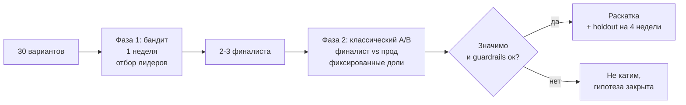

# Бандиты против A/B

> **Зачем эта глава.** «Зачем гонять A/B две недели, если бандит сам перекинет трафик на
> лучший вариант?» — вопрос, который задают на собеседовании и в продуктовых чатах, и на который
> обычно отвечают лозунгами. Здесь разбираемся по существу: что именно оптимизирует бандит,
> сколько на самом деле стоит эксперимент в упущенной выгоде, в каких трёх ситуациях адаптивное
> распределение трафика делает хуже, почему из данных бандита нельзя просто взять и посчитать
> разницу средних, и как собирают схемы, где бандит и A/B работают вместе.

**Уровень:** 🎯 middle → 🧠 middle+
**Предварительно нужно:** [дизайн эксперимента](01-experiment-design.md), [статистические критерии](02-statistical-criteria.md), [ловушки A/B-тестов](04-pitfalls.md), [эксплорация и бандиты](../06-recsys/13-exploration-and-bandits.md)
**Время на проработку:** ~3 часа (чтение + упражнения)

---

## Карта главы

- [1. Интуиция: две разные задачи](#1-интуиция-две-разные-задачи)
- [2. Формализация: бандит и регрет](#2-формализация-бандит-и-регрет)
- [3. Три алгоритма за три абзаца](#3-три-алгоритма-за-три-абзаца)
- [4. Сколько стоит эксперимент: считаем регрет A/B](#4-сколько-стоит-эксперимент-считаем-регрет-ab)
- [5. Когда адаптивность вредит](#5-когда-адаптивность-вредит)
- [6. Почему нельзя просто сравнить средние](#6-почему-нельзя-просто-сравнить-средние)
- [7. Как всё-таки получить честную оценку](#7-как-всё-таки-получить-честную-оценку)
- [8. Комбинированные схемы](#8-комбинированные-схемы)
- [9. Подводные камни](#9-подводные-камни)
- [10. Проверь себя](#10-проверь-себя)
- [11. Практика](#11-практика)
- [12. Что читать дальше](#12-что-читать-дальше)

---

## 1. Интуиция: две разные задачи

A/B-тест и многорукий бандит решают разные задачи, и вся путаница — оттого, что обе называют
«тестированием вариантов».

**A/B-тест решает задачу вывода.** Его цель — получить число: насколько вариант B отличается
от A, с доверительным интервалом, чтобы человек принял решение. Для этого доли трафика
фиксируются заранее и не меняются: только так работают все формулы предыдущих глав.
Цена эксперимента — половина трафика, идущая на заведомо худший вариант всё время теста.

**Бандит решает задачу управления.** Его цель — максимизировать суммарную награду за горизонт.
Он не обязан ни называть эффект, ни давать интервал; он должен просто побыстрее перестать
показывать плохое. Для этого доли трафика меняются по ходу — а значит, фиксированный дизайн
разрушен.

Отсюда простое правило, с которого стоит начинать ответ на собеседовании: **если результат
нужен человеку — это A/B; если результат нужен только системе — это бандит.**
Промо-баннер, который живёт сутки и никогда не повторится, — задача для бандита: никто не будет
читать отчёт про его эффект. Смена алгоритма ранжирования, на которой строится роадмап на
квартал, — задача для A/B: команде нужна цифра, в которую она верит.

> 🌱 **База.** Бандит не «более современный A/B». Это другой инструмент под другой вопрос.
> A/B отвечает «на сколько лучше и насколько мы в этом уверены», бандит отвечает «что показывать
> прямо сейчас». Попытка получить первый ответ из второго инструмента — источник самых
> неприятных ошибок в этой главе.

---

## 2. Формализация: бандит и регрет

Есть $K$ вариантов (рук, arms), у каждого неизвестное среднее вознаграждение $\mu_a$.
На шаге $t = 1, \dots, T$ алгоритм выбирает руку $a_t$ и наблюдает награду $r_t$
со средним $\mu_{a_t}$. Обозначим лучшую руку и её отставание от остальных:

$$
\mu^* = \max_{a} \mu_a, \qquad \Delta_a = \mu^* - \mu_a
$$

где $\mu^*$ — среднее вознаграждение оптимальной руки, $\Delta_a \ge 0$ — «зазор» (gap) руки $a$,
то есть сколько мы теряем на каждом её показе.

Качество алгоритма меряют **регретом** (regret) — суммарной упущенной наградой относительно
стратегии «всегда показывать лучшую руку»:

$$
R(T) = T\mu^* - \mathbb{E}\Big[\sum_{t=1}^{T} r_t\Big] = \sum_{a=1}^{K} \Delta_a \, \mathbb{E}\big[N_a(T)\big]
$$

где $T$ — горизонт (сколько всего показов будет), $N_a(T)$ — случайное число показов руки $a$
за горизонт, $\mathbb{E}$ — усреднение по случайности алгоритма и наград. Правая часть читается
буквально: регрет — это сумма по рукам «насколько рука хуже» × «сколько раз мы её показали».

Ключевой теоретический результат — нижняя граница Лая и Роббинса (1985): для любого разумного
алгоритма регрет не может расти медленнее логарифма,

$$
\liminf_{T \to \infty} \frac{R(T)}{\ln T} \;\ge\; \sum_{a:\,\Delta_a > 0} \frac{\Delta_a}{\mathrm{KL}(\nu_a \,\|\, \nu^*)}
$$

где $\nu_a$ — распределение награды руки $a$, $\nu^*$ — распределение награды оптимальной руки,
$\mathrm{KL}$ — расстояние Кульбака–Лейблера между ними. Смысл: чтобы уверенно отличить руку
с зазором $\Delta_a$, нужно порядка $1/\Delta_a^2$ наблюдений, и совсем без показов плохих рук
обойтись нельзя. Хорошие алгоритмы (UCB, Thompson sampling) этой границы достигают с точностью
до константы, то есть дают $R(T) = O(\log T)$.

📐 **Разбор для сравнения с A/B.** Классический A/B — это стратегия «explore-then-commit»:
сначала $n$ показов на каждую руку, потом навсегда лучшая по результатам. Её регрет:

$$
R_{\text{ETC}}(T) \;\approx\; n \sum_{a} \Delta_a \;+\; \beta \cdot T \cdot \Delta_{\text{true}}
$$

где $n$ — размер выборки на руку в фазе теста, $\beta$ — вероятность выбрать по итогам теста
не ту руку (ошибка II рода), $\Delta_{\text{true}}$ — реальный зазор между руками.

Первое слагаемое **не растёт с горизонтом**: заплатили за тест один раз и всё. Второе растёт
**линейно** по $T$. И вот в чём подвох, который редко проговаривают: стандартная мощность
эксперимента — 0.8, то есть $\beta = 0.2$. С вероятностью до 20% (для эффекта размером ровно
в MDE) A/B не заметит разницу, команда оставит худший вариант — и будет платить за это
всё оставшееся время.

Именно это противопоставление и есть суть темы: **A/B платит фиксированную цену за тест,
но рискует навсегда закрепить ошибку; бандит платит логарифмически растущую цену, но вероятность
навсегда остаться на худшей руке у него стремится к нулю.**

---

## 3. Три алгоритма за три абзаца

Полный разбор с выводами — в главе [эксплорация и бандиты](../06-recsys/13-exploration-and-bandits.md);
здесь только то, что нужно, чтобы говорить о них в контексте экспериментов.

**ε-greedy.** С вероятностью $\varepsilon$ показываем случайную руку, иначе — руку с максимальным
текущим средним. Примитивно, требует ручного подбора $\varepsilon$, не учитывает разную
неопределённость по рукам. Но у него есть свойство, которое делает его любимым инструментом
на практике: вероятность показа любой руки всегда не меньше $\varepsilon / K > 0$. Это гарантирует,
что данные пригодны для последующей честной переоценки (§7). Детерминированные алгоритмы
такой гарантии не дают.

**UCB (Upper Confidence Bound).** Выбираем руку с максимальной оптимистичной оценкой:
$a_t = \arg\max_a \big(\hat{\mu}_a + \sqrt{2\ln t / N_a}\big)$, где $\hat{\mu}_a$ — текущее среднее
руки, $N_a$ — число её показов, $t$ — номер шага. Корень — ширина доверительной границы:
мало наблюдений — большая надбавка — рука получает шанс. «Оптимизм перед лицом неопределённости».
Алгоритм детерминирован, и это его проблема для аналитики: вероятность показа равна 0 или 1,
поэтому взвешивание по обратной вероятности неприменимо без дополнительной рандомизации.

**Thompson sampling.** Держим апостериорное распределение на $\mu_a$; на каждом шаге берём
из него по одной выборке $\tilde{\mu}_a$ и показываем руку с максимальной выборкой. Для бинарной
награды с сопряжённым бета-приором: $\tilde{\mu}_a \sim \mathrm{Beta}(\alpha_0 + s_a,\, \beta_0 + f_a)$,
где $s_a$ — число успехов руки $a$, $f_a$ — число неудач, $\alpha_0, \beta_0$ — параметры приора.
На практике обычно лучший по регрету и при этом рандомизирован, то есть вероятности показа
существуют и их можно оценить перебором — что важно для честного анализа.

---

## 4. Сколько стоит эксперимент: считаем регрет A/B

Главный аргумент за бандитов звучит так: «пока идёт тест, половина пользователей видит
худший вариант — это потери». Аргумент верный, но его почти никогда не считают в числах.
Посчитаем.

Задача: конверсия контроля 10%, теста 11%, то есть $\Delta = 0.01$. Размер выборки для
$\alpha = 0.05$, мощности 0.8:

$$
n \;=\; \frac{2\,(z_{1-\alpha/2} + z_{1-\beta})^2\,\bar{p}(1-\bar{p})}{\Delta^2}
\;=\; \frac{2 \cdot 2.80^2 \cdot 0.105 \cdot 0.895}{0.01^2} \;\approx\; 14\,800
$$

где $n$ — число пользователей **на группу**, $z_{1-\alpha/2} = 1.96$ и $z_{1-\beta} = 0.84$ —
квантили стандартного нормального распределения, $\bar{p} = 0.105$ — средняя конверсия по группам,
$\Delta$ — детектируемый эффект.

Потери теста: 14 800 пользователей контрольной группы недополучили 1 п.п. конверсии, то есть
$14\,800 \times 0.01 \approx 148$ конверсий. Теперь горизонт: если фича проживёт в продукте
миллион пользователей, при конверсии 11% это 110 000 конверсий. Потери на эксперимент —
**0.13% от суммарного результата**.

Ради экономии 0.13% предлагается отказаться от доверительного интервала, от guardrail-метрик
и от возможности объяснить результат. Это плохая сделка, и её надо уметь произнести вслух.

Теперь ситуация, где всё наоборот. Промо-кампания: 50 креативов, живёт 48 часов, за это время
100 000 показов. Классический A/B на 50 вариантов при том же $\Delta$ потребовал бы
$50 \times 14\,800 = 740\,000$ показов — эксперимент физически невозможен, а если запустить
его «как получится», он закончится ничем и все 100 000 показов будут потрачены на равномерное
распределение по 50 вариантам, включая совсем плохие. Бандит за те же 100 000 показов быстро
уведёт трафик от явных аутсайдеров.

Соберём условия в таблицу — её и стоит держать в голове как ответ на вопрос «когда что».

| Условие | Бандит | A/B |
|---|---|---|
| Нужна оценка эффекта с доверительным интервалом | нет | **да** |
| Горизонт короткий (часы-дни), вариант одноразовый | **да** | нет |
| Горизонт длинный, решение зафиксируется надолго | нет | **да** |
| Много вариантов ($K \gtrsim 10$) при ограниченном трафике | **да** | нет |
| Награда приходит быстро (клик, показ) | **да** | всё равно |
| Награда отложена (покупка через дни, отток через месяц) | нет | **да** |
| Метрика одна и скалярная | **да** | всё равно |
| Нужны guardrail-метрики и контрметрики | нет | **да** |
| Среда нестационарна, лучший вариант меняется | **да**, но только с забыванием | нет |
| Решение принимает человек / нужен отчёт | нет | **да** |

> 💬 **На собеседовании.** Спросят: «Бандиты или A/B — когда что?» Хороший ответ: это разные
> задачи. A/B оптимизирует качество вывода — даёт несмещённую оценку эффекта с интервалом,
> ценой фиксированной упущенной выгоды, которую можно посчитать: при типовых числах это доли
> процента от горизонта жизни фичи. Бандит оптимизирует суммарную награду и выигрывает там, где
> вариантов много, горизонт короткий, награда быстрая и скалярная, а отчёт никому не нужен —
> подбор креативов, порядок промо-блоков, выбор заголовка. Как только нужно принять
> организационное решение, померить guardrail-метрики или объяснить результат — нужен A/B.
> Плохой ответ: «бандиты эффективнее, потому что не тратят трафик на проигравший вариант» —
> это верно только в терминах регрета и игнорирует то, ради чего эксперимент вообще ставился.

---

## 5. Когда адаптивность вредит

Три сценария, в которых бандит не просто бесполезен, а хуже честного A/B.

### 5.1. Нужна честная оценка эффекта

Самый частый случай. Продуктовая команда должна решить, вкладывать ли квартал в развитие
направления; для этого нужна цифра «+2.1% ± 0.6%». Бандит такой цифры не даёт, а наивно
посчитанная по его логам цифра будет неверной (§6). Если вы всё же строите на бандите систему
принятия решений, вам придётся встроить в неё механизмы честной оценки — и стоить это будет
дороже, чем просто провести A/B.

### 5.2. Отложенная конверсия

Бандит перекидывает трафик на основании уже полученных наград. Если награда приходит
с задержкой — покупка через три дня, подтверждение брони через неделю, отказ от подписки
через месяц — то в момент принятия решения бандит видит **только быстрые** конверсии.

Последствие тонкое и неприятное: он смещается в сторону вариантов с быстрой, но не обязательно
ценной конверсией. Вариант, который даёт мало кликов сегодня и много покупок в пятницу,
будет отключён во вторник и никогда не восстановится — данных по нему больше не поступает,
а те, что были, зафиксированы на неудачном раннем срезе.

Что делать: (а) длина батча обновления должна быть не меньше окна конверсии — если покупка
приходит за трое суток, бандит не может обновляться ежечасно; (б) использовать модели с явным
учётом задержки (delayed feedback); (в) оставить $\varepsilon$-пол, чтобы отключённая рука
продолжала получать хотя бы немного трафика и могла «реабилитироваться».

### 5.3. Нестационарность

Стандартные UCB и Thompson sampling предполагают, что $\mu_a$ постоянны. В продукте это
почти всегда ложь: конверсия отличается днём и ночью, в будни и выходные, до зарплаты и после,
до праздника и после. Сошедшийся бандит перестаёт исследовать — у него накоплено столько
наблюдений по «лучшей» руке, что новых данных по остальным почти нет, и он не заметит смены
лидера.

Лечится забыванием: скользящее окно (учитывать только последние $W$ наблюдений),
дисконтирование (вес наблюдения $\gamma^{t - s}$), периодический сброс, гарантированный
пол эксплорации. Всё это добавляет параметров, которые надо настраивать — и настраивать,
как правило, по историческим данным, то есть возвращаться к офлайн-анализу.

И отдельно: нестационарность — источник самой красивой ошибки в анализе бандитов, парадокса
Симпсона. Об этом в следующем разделе.

> 💬 **На собеседовании.** Спросят: «У нас конверсия в покупку приходит в среднем через трое
> суток. Можно поставить бандит?» Хороший ответ: в лоб нельзя. Бандит принимает решения по уже
> наблюдённой награде, а через час после показа наблюдается только смещённая подвыборка быстрых
> конверсий — он начнёт оптимизировать скорость покупки вместо её вероятности и отключит
> варианты с медленной, но более ценной конверсией. Варианты: увеличить период обновления
> до окна конверсии (тогда за две недели бандит успеет сделать 4–5 обновлений, и смысл
> адаптивности почти теряется — проще A/B), использовать быстрый прокси-сигнал, предварительно
> проверив по истории, что он предсказывает покупку, или взять модель с явным учётом задержки.
> Плохой ответ: «бандит сам разберётся, он же адаптивный».

---

## 6. Почему нельзя просто сравнить средние

Это ключевой технический вопрос главы. У вас есть логи бандита: сколько показов и сколько
конверсий у каждой руки. Соблазн посчитать конверсию по каждой руке и сравнить огромен.
Так делать нельзя, и вот две независимые причины.

### 6.1. Проклятие победителя

Бандит по построению даёт больше трафика руке, которая **выглядела** лучше на ранних данных.
Часть этого «выглядела» — везение. Дальше рука получает много показов и её оценка сходится
к истине, но ранняя удача остаётся в числителе; а рука, которой не повезло вначале, отключается
и навсегда сохраняет свою неудачную оценку, не имея шанса её исправить.

Проверим на данных, где эффекта заведомо нет: две абсолютно одинаковые руки с конверсией 10%.

```python
import numpy as np
rng = np.random.default_rng(0)

P = np.array([0.10, 0.10])      # РУКИ ОДИНАКОВЫЕ: истинная разница ровно ноль
N_BATCHES, BATCH, EPS = 40, 500, 0.10

def eps_greedy():
    """Батчевый ε-greedy: доли пересчитываются раз в батч — так делают в проде."""
    wins, pulls = np.zeros(2), np.zeros(2)
    for _ in range(N_BATCHES):
        # неопробованной руке приписываем оптимистичную оценку 1.0, чтобы она разыгралась
        mu = np.where(pulls > 0, wins / np.maximum(pulls, 1), 1.0)
        share = np.full(2, EPS / 2)
        share[int(np.argmax(mu))] += 1 - EPS
        cnt = rng.multinomial(BATCH, share)
        wins += rng.binomial(cnt, P)
        pulls += cnt
    return wins, pulls

gaps = []
for _ in range(3000):
    wins, pulls = eps_greedy()
    k = int(np.argmax(pulls))                     # "победитель" = рука с большим трафиком
    gaps.append(wins[k] / pulls[k] - wins[1 - k] / pulls[1 - k])
print(f"средняя 'победа' победителя: {np.mean(gaps):+.4f} при истинной разнице 0.0000")
```

Результат — около `+0.006`, то есть победитель систематически выглядит примерно на 0.6 п.п.
лучше проигравшего. На базе 10% это **фиктивные +6% относительного прироста**, взявшиеся
из ничего. С десятью одинаковыми руками вместо двух эффект того же порядка: лучшая рука
«обгоняет» остальные примерно на 0.5 п.п. при нулевой истинной разнице.

Обратите внимание на важную деталь: если сравнивать руки по **фиксированным меткам** (A против B,
без выбора «кто победил»), в этом симметричном примере наивный тест не сильно врёт — доля ложных
срабатываний выходит около 4–5%. Ломается именно **условная на выборе** оценка. А в отчёте
пишут ровно её: «бандит нашёл лучший креатив, он даёт +6%». Этих процентов не существует.

### 6.2. Парадокс Симпсона по времени

Вторая причина серьёзнее, потому что она искажает даже направление вывода. Доли трафика
у бандита меняются во времени, а базовый уровень метрики тоже меняется во времени. Их
взаимодействие переворачивает знак.

```python
import numpy as np
rng = np.random.default_rng(3)

# Утро: конверсия высокая, вечер: низкая. Вариант B ЛУЧШЕ A В ОБА ПЕРИОДА.
P = {"morning": {"A": 0.10, "B": 0.12}, "evening": {"A": 0.02, "B": 0.03}}
SHARE_B = {"morning": 0.5, "evening": 0.95}   # бандит "уехал" на B ко второму периоду
N = 100_000

wins = {"A": 0, "B": 0}; pulls = {"A": 0, "B": 0}
for period in ("morning", "evening"):
    nb = int(N * SHARE_B[period]); na = N - nb
    wins["A"] += rng.binomial(na, P[period]["A"]); pulls["A"] += na
    wins["B"] += rng.binomial(nb, P[period]["B"]); pulls["B"] += nb

for arm in ("A", "B"):
    print(f"{arm}: суммарная конверсия {wins[arm] / pulls[arm]:.4f} на {pulls[arm]} показах")
```

Получается `A: 0.0926`, `B: 0.0614`. Вариант A выглядит в полтора раза лучше — хотя в каждом
периоде по отдельности лучше B. Механика: A набрал большую часть трафика в «жирный» утренний
период, B — в «тощий» вечерний, и агрегирование по неравным долям переворачивает результат.

В обычном A/B этого не бывает, потому что доли фиксированы и одинаковы в каждый момент времени.
У бандита доли — функция времени, и это ровно то условие, при котором работает
[парадокс Симпсона](04-pitfalls.md).

> ⚠️ **Типичная ошибка.** Отчёт вида «за неделю бандит выбрал креатив №7, его CTR 3.4% против
> среднего 2.9% — прирост 17%». Здесь сложены обе ошибки сразу: и проклятие победителя,
> и агрегирование по меняющимся долям. Правильная формулировка результата работы бандита
> звучит скучнее и честнее: «бандит сократил потери относительно равномерного показа
> на столько-то; какой именно прирост даёт креатив №7 относительно текущего — не измерено».

---

## 7. Как всё-таки получить честную оценку

Если бандит уже стоит, а цифра нужна, есть три работающих подхода.

**Фиксированный контрольный слой.** Самое простое и надёжное: выделите постоянные 5–10%
трафика, которые **всегда** идут на контрольный вариант, независимо от того, что делает бандит.
Внутри этого слоя доли фиксированы, значит, применимы обычные критерии. Сравнение «бандит целиком
против фиксированного контроля» даёт честную оценку эффекта всей адаптивной системы. Это,
по сути, [holdout](05-complex-designs.md) внутри бандита, и на практике он окупается почти всегда.

**Логирование вероятностей и IPS.** Если алгоритм рандомизирован (ε-greedy, Thompson sampling),
на каждом показе можно записать вероятность $p_t(a)$, с которой выбиралась показанная рука.
Тогда несмещённая оценка средней награды политики восстанавливается взвешиванием по обратной
вероятности (inverse propensity scoring):

$$
\hat{\mu}_a = \frac{1}{T}\sum_{t=1}^{T} \frac{\mathbb{1}[a_t = a]\, r_t}{p_t(a)}
$$

где $T$ — общее число показов, $a_t$ — фактически показанная рука на шаге $t$, $r_t$ —
полученная награда, $p_t(a)$ — вероятность показа руки $a$ на шаге $t$ по логам, $\mathbb{1}[\cdot]$ —
индикатор. Оценка несмещена при двух условиях: (1) вероятности реально логировались в момент
показа, а не восстанавливались задним числом; (2) $p_t(a) > 0$ для всех рук — то есть в алгоритм
встроен пол эксплорации. Плата — большая дисперсия: если рука показывалась с вероятностью 0.01,
каждое её наблюдение входит с весом 100. Отсюда обрезка весов и вариант с уменьшенной дисперсией
(doubly robust); подробнее — в главе про
[эксплорацию и бандиты](../06-recsys/13-exploration-and-bandits.md).

**Батчевый дизайн.** Если бандит обновляет доли не непрерывно, а раз в сутки, то **внутри
суток** это обычный A/B с фиксированными долями. Считайте эффект отдельно по каждому батчу
обычными методами, а затем объединяйте оценки по батчам с весами, обратными их дисперсиям.
Это заодно снимает парадокс Симпсона: агрегирование идёт не по сырым суммам, а по эффектам
внутри однородных периодов. Батчевая схема — самый практичный компромисс: она сохраняет
большую часть выигрыша в регрете и оставляет данные анализируемыми.

> 💬 **На собеседовании.** Спросят: «Как посчитать доверительный интервал для эффекта
> по данным бандита?» Хороший ответ: наивно — никак, потому что размеры групп случайны
> и коррелируют с наблюдёнными наградами, а доли меняются во времени. Три рабочих пути:
> держать фиксированный контрольный слой в 5–10% и считать по нему обычным критерием;
> логировать propensity и использовать IPS/doubly robust с обрезкой весов; работать батчами
> с фиксированными долями внутри батча и агрегировать эффекты по батчам, а не сырые конверсии.
> Плохой ответ: «взять z-критерий для двух пропорций по итоговым числам показов и конверсий».

---

## 8. Комбинированные схемы

На практике противопоставление «бандит или A/B» почти всегда разрешается схемой, где есть оба.

**Отбор бандитом, валидация A/B.** Самая частая и самая надёжная схема. Есть 30 вариантов
(заголовки, креативы, конфигурации ранжирования). Гонять 30-рукий A/B нельзя — не хватит трафика
и утонем в множественных сравнениях. Поэтому: бандит на неделю отбирает 2–3 лидера, затем
запускается **честный A/B** победителя против текущего прода — с фиксированными долями,
заранее посчитанным размером выборки и guardrail-метриками. Первая фаза даёт скорость, вторая —
цифру, которой можно верить.

Важная деталь: эффект, показанный бандитом в первой фазе, для второй фазы **не является** оценкой
MDE. Из-за проклятия победителя он завышен, и если посчитать по нему размер выборки, тест
окажется недомощным. Берите MDE из бизнес-соображений («какой прирост окупает внедрение»),
а не из результатов отбора.



**Бандит поверх, A/B внутри.** Бандит распределяет трафик между «семействами» решений
(например, между источниками кандидатов в рекомендациях), а внутри каждого семейства крутятся
обычные A/B с фиксированными долями. Разделение ответственности: система оптимизирует
операционные решения, люди принимают продуктовые.

**Бандит с постоянным контрольным слоем.** Схема из §7: бандит работает на 90% трафика,
10% всегда контроль. Даёт и адаптивность, и постоянный несмещённый замер. Стоит помнить,
что мощность у слоя в 10% ниже, чем у полноценного теста, поэтому такой замер читают
на длинном горизонте.

> 🧠 **Middle+.** Отдельный класс задач, где вопрос «бандит или A/B» вообще не стоит, —
> **контекстные бандиты** в персонализации. Там нет одной лучшей руки: лучшая рука зависит
> от пользователя, и задача по сути является задачей обучения политики, а не выбора варианта.
> A/B в этой постановке применяется на уровень выше: сравнивается вся политика (контекстный
> бандит) против всей текущей системы, фиксированными долями. Это и есть правильный ответ
> на вопрос «как вы тестировали ваш LinUCB»: не «сравнил руки», а «выкатил политику
> в A/B против прода и померил продуктовые метрики».

---

## 9. Подводные камни

**Бандит взяли ради экономии трафика, а получили нечитаемый результат.**
Симптом: система работает, метрика вроде выросла, но никто не может сказать, на сколько.
Причина: выбран инструмент управления там, где нужен был инструмент вывода.
Что делать: добавить фиксированный контрольный слой; на будущее — принимать решение
по таблице из §4, а не по новизне метода.

**Бандит сходится за час и больше ничего не исследует.**
Симптом: одна рука забирает 99% трафика на второй день, метрика через неделю падает.
Причина: среда нестационарна, а алгоритм без забывания; накопленной статистики по лидеру
столько, что новые данные её не сдвигают.
Что делать: скользящее окно или дисконтирование, пол эксплорации ($\varepsilon$ не ниже 5%),
периодический перезапуск.

**Отчёт «бандит дал +17%».**
Симптом: заявленный прирост не воспроизводится в последующем A/B.
Причина: проклятие победителя плюс агрегирование по меняющимся долям.
Что делать: не отчитываться приростом победителя; для цифры — отдельный A/B или контрольный слой.

**Бандит оптимизирует прокси, а бизнес-метрика падает.**
Симптом: CTR вырос, выручка не изменилась или упала.
Причина: награда бандита — одна скалярная быстрая метрика; guardrail-метрики в неё не входят
по построению.
Что делать: либо ввести составную награду с явными штрафами (и понимать, что веса вы задали
руками), либо оставить бандиту только те решения, где расхождение прокси и цели заведомо мало,
а всё остальное решать через A/B.

**Ручку выключили и она не вернулась.**
Симптом: вариант, который на самом деле лучший, получил ноль трафика на третий день.
Причина: неудачная серия в начале + отсутствие пола эксплорации + отложенная награда.
Что делать: минимальная доля трафика на каждую руку; проверять, сколько наблюдений успела
получить рука до отключения (при $\Delta = 0.01$ и конверсии 10% для различения нужны
десятки тысяч показов — если рука отключилась после трёхсот, это решение принято по шуму).

**Множественные сравнения через чёрный ход.**
Симптом: из 50 креативов «победитель» каждый раз новый, и ни один не воспроизводится.
Причина: выбор максимума из 50 шумных оценок — это те же множественные сравнения,
только без поправки.
Что делать: относиться к результату отбора как к гипотезе, а не как к выводу; подтверждать
отдельным тестом.

---

## 10. Проверь себя

<details>
<summary><b>🎯 Вопрос.</b> Бандиты против A/B — когда что выбирать?</summary>

**Короткий ответ.** A/B — когда нужна оценка эффекта с доверительным интервалом, guardrail-метрики
и решение, принимаемое человеком. Бандит — когда вариантов много, горизонт короткий, награда
быстрая и скалярная, а отчёт не нужен: подбор креативов, заголовков, порядка промо-блоков.

**Развёрнуто.** Это разные задачи: A/B оптимизирует качество статистического вывода, бандит —
суммарную награду за горизонт. Цену A/B можно посчитать: при конверсии 10%, MDE 1 п.п. и
мощности 0.8 нужно около 14 800 пользователей на группу, потери составляют примерно 148 конверсий,
что на горизонте в миллион пользователей — около 0.13% результата. Бандит начинает выигрывать,
когда вариантов десятки (A/B на 50 вариантов требует нереального трафика) или когда горизонт
короче, чем нужный размер выборки. Дополнительные ограничения бандита: он не умеет работать
с отложенной наградой, с несколькими метриками и с нестационарностью без специальных механизмов.

**Чего ждёт интервьюер:** что вы сформулируете различие через задачу (вывод против управления),
а не через «эффективность», и назовёте хотя бы один количественный аргумент.

**Провал:** «бандиты лучше, потому что не тратят трафик впустую».
</details>

<details>
<summary><b>🎯 Вопрос.</b> Что такое регрет и как он ведёт себя у A/B и у бандита?</summary>

**Короткий ответ.** Регрет — суммарная упущенная награда относительно стратегии «всегда
показывать лучшую руку»: $R(T) = \sum_a \Delta_a \mathbb{E}[N_a(T)]$. У бандита он растёт как
$O(\log T)$, у A/B (explore-then-commit) фаза теста даёт константу, но остаётся риск
с вероятностью $\beta$ навсегда закрепиться на худшей руке, что даёт линейный по $T$ вклад.

**Развёрнуто.** $\Delta_a = \mu^* - \mu_a$ — зазор руки, $N_a(T)$ — число её показов. Нижняя
граница Лая–Роббинса говорит, что логарифмический рост — предел возможного: чтобы отличить руку
с зазором $\Delta$, нужно порядка $1/\Delta^2$ наблюдений. Практический вывод из формулы для
A/B: при стандартной мощности 0.8 вероятность ошибки II рода равна 0.2, то есть в одном случае
из пяти (для эффекта размером в MDE) команда оставит худший вариант и будет платить за это
весь оставшийся горизонт. Это аргумент не против A/B, а за то, чтобы считать мощность честно.

**Чего ждёт интервьюер:** формулу регрета и понимание, что у A/B цена фиксированная, а риск —
в ошибке II рода.

**Провал:** «регрет — это разница конверсий между группами».
</details>

<details>
<summary><b>🧠 Вопрос.</b> Почему нельзя просто сравнить конверсии рук в логах бандита?</summary>

**Короткий ответ.** По двум причинам: проклятие победителя (рука получила больше трафика именно
потому, что ей повезло на ранних данных, и это везение остаётся в её оценке) и парадокс Симпсона
по времени (доли трафика меняются, базовый уровень метрики тоже, и агрегирование по неравным
долям переворачивает результат).

**Развёрнуто.** Симуляция с двумя абсолютно одинаковыми руками (конверсия 10%) и батчевым
ε-greedy даёт «победу» лидера над аутсайдером около +0.6 п.п., то есть фиктивные +6%
относительного прироста при истинной разнице ноль. Отдельно: если варианты неодинаково хороши
в разное время суток, а бандит перебросил трафик между периодами, суммарные конверсии могут
показать обратный знак — вариант, лучший в каждом периоде, проигрывает в агрегате. Формально
проблема в том, что размеры групп случайны и зависят от наблюдённых наград, поэтому стандартные
предпосылки критериев нарушены.

**Чего ждёт интервьюер:** что вы назовёте обе причины и понимаете, что это смещение, а не шум.

**Провал:** «наберём побольше данных, и оценка станет точной».
</details>

<details>
<summary><b>🧠 Вопрос.</b> Как получить несмещённую оценку эффекта, если бандит уже работает?</summary>

**Короткий ответ.** Три способа: фиксированный контрольный слой 5–10% трафика мимо бандита;
логирование вероятностей показа и оценка через IPS/doubly robust; батчевый дизайн с
фиксированными долями внутри батча и агрегированием эффектов по батчам.

**Развёрнуто.** Контрольный слой — самый надёжный и простой: внутри него доли фиксированы,
работают обычные критерии, и он же даёт замер эффекта всей адаптивной системы. IPS даёт
оценку $\hat{\mu}_a = \frac{1}{T}\sum_t \frac{\mathbb{1}[a_t=a] r_t}{p_t(a)}$ и требует, чтобы
вероятности логировались в момент показа и были строго положительны — значит, нужен пол
эксплорации, а UCB в чистом виде не подходит из-за детерминированности. Плата за IPS —
дисперсия при малых $p_t$, лечится обрезкой весов. Батчевая схема удобна тем, что сохраняет
большую часть выигрыша в регрете и одновременно снимает парадокс Симпсона.

**Чего ждёт интервьюер:** знания про propensity logging и понимания, зачем нужен пол эксплорации.

**Провал:** «пересчитаем t-тест по итоговым числам».
</details>

<details>
<summary><b>🎯 Вопрос.</b> Конверсия в вашем продукте приходит через 3–5 дней. Ставим бандит?</summary>

**Короткий ответ.** В обычном виде нет. Бандит принимает решения по уже наблюдённым наградам,
а в первые часы наблюдается только смещённая подвыборка быстрых конверсий — он начнёт
оптимизировать скорость покупки, а не её вероятность.

**Развёрнуто.** Практические последствия: вариант с медленной, но более ценной конверсией будет
отключён раньше, чем по нему придут данные, и уже не восстановится — новых наблюдений по нему
нет. Варианты решения: период обновления не меньше окна конверсии (но тогда за две недели
получится 4–5 обновлений, и адаптивность почти не даёт выигрыша — проще A/B); быстрый
прокси-сигнал, предварительно валидированный по истории как предиктор целевого события;
модели с явным учётом задержки; обязательный пол эксплорации, чтобы отключённая рука
продолжала получать данные.

**Чего ждёт интервьюер:** понимания механизма смещения, а не общей фразы про «задержку данных».

**Провал:** «бандит адаптивный, он подстроится».
</details>

<details>
<summary><b>🧠 Вопрос.</b> Чем опасна нестационарность для бандита и как с ней бороться?</summary>

**Короткий ответ.** Сошедшийся бандит перестаёт исследовать: по лидеру накоплено столько
наблюдений, что новые данные не сдвигают оценку, и смену лидера он не заметит. Лечится
забыванием — скользящим окном, дисконтированием, перезапуском и полом эксплорации.

**Развёрнуто.** UCB и Thompson sampling в базовой форме предполагают постоянные $\mu_a$;
в продукте они меняются по часам, дням недели, сезонам и из-за внешних событий. Скользящее окно
учитывает только последние $W$ наблюдений, дисконтирование даёт наблюдению вес $\gamma^{t-s}$;
оба вводят параметр, который надо подбирать — обычно по историческим данным, то есть офлайн.
Второе следствие нестационарности — искажение отчётности: меняющиеся во времени доли трафика
при меняющемся базовом уровне метрики дают парадокс Симпсона в агрегированных числах.

**Чего ждёт интервьюер:** что вы свяжете «перестал исследовать» с накопленным объёмом статистики,
а не просто назовёте слово «нестационарность».

**Провал:** «бандит по определению всегда адаптируется к изменениям».
</details>

<details>
<summary><b>🎯 Вопрос.</b> Опишите схему, где бандит и A/B работают вместе.</summary>

**Короткий ответ.** Две фазы: бандит быстро отбирает 2–3 лидера из большого числа вариантов,
затем классический A/B финалиста против текущего прода — с фиксированными долями, посчитанным
размером выборки и guardrail-метриками.

**Развёрнуто.** Первая фаза решает проблему «слишком много вариантов для честного теста»
и минимизирует потери на заведомо плохих вариантах. Вторая даёт цифру, на которой можно строить
решение. Важная деталь: эффект, показанный бандитом в первой фазе, завышен из-за проклятия
победителя, поэтому брать его как MDE для второй фазы нельзя — тест окажется недомощным;
MDE берут из бизнес-соображений. Альтернативные комбинации: бандит с постоянным контрольным
слоем 5–10%; бандит на уровне операционных решений (распределение между источниками кандидатов)
при A/B на уровне продуктовых.

**Чего ждёт интервьюер:** что вы предложите схему, а не выберете одно из двух, и вспомните
про смещение MDE.

**Провал:** «сначала бандит, потом просто раскатываем победителя».
</details>

<details>
<summary><b>🧠 Вопрос.</b> Вы тестировали контекстный бандит для персонализации. Как вы его проверяли?</summary>

**Короткий ответ.** A/B на уровне политики: вся система с контекстным бандитом против всей
текущей системы, фиксированные доли, продуктовые метрики и guardrails. Сравнивать между собой
руки внутри бандита бессмысленно — там нет одной лучшей руки, лучшая зависит от контекста.

**Развёрнуто.** Контекстный бандит — это обученная политика, а не выбор из вариантов, поэтому
объект тестирования — политика целиком. Офлайн перед выкаткой политику оценивают по логам
предыдущей политики через off-policy evaluation (IPS, doubly robust), что требует
залогированных propensity и положительной вероятности показа у всех действий. Онлайн — обычный
A/B по пользователям, обычной длительности, с guardrail-метриками и с holdout на несколько
недель, чтобы поймать эффекты петли обратной связи и вырождения выдачи.

**Чего ждёт интервьюер:** понимания, что единица сравнения — политика, и знания про off-policy
evaluation как офлайн-этап.

**Провал:** «сравнил средние награды рук внутри бандита».
</details>

<details>
<summary><b>🌱 Вопрос.</b> Чем ε-greedy принципиально удобнее UCB для последующего анализа?</summary>

**Короткий ответ.** У ε-greedy вероятность показа любой руки не меньше $\varepsilon / K > 0$,
поэтому данные пригодны для несмещённой переоценки через IPS. UCB детерминирован: вероятность
показа равна 0 или 1, обратное взвешивание неприменимо.

**Развёрнуто.** Любая оценка по обратной вероятности требует положительной вероятности каждого
действия в каждом состоянии (условие перекрытия, overlap). ε-greedy его обеспечивает явно,
Thompson sampling — по построению (он рандомизирован, вероятности можно оценить сэмплированием),
а UCB нет. Практический вывод: если данные бандита планируется использовать для офлайн-оценки
новых политик, выбирают рандомизированный алгоритм и логируют propensity в момент показа.
Отдельная выгода пола эксплорации — отключённая рука продолжает получать данные и может
«реабилитироваться» при смене условий.

**Чего ждёт интервьюер:** связи между рандомизацией алгоритма и возможностью офлайн-оценки.

**Провал:** «ε-greedy проще в реализации» — верно, но это не про анализ.
</details>

<details>
<summary><b>🎯 Вопрос.</b> Продакт говорит: «Давайте вместо A/B поставим бандит, чтобы не терять
деньги на тесте». Что отвечаете?</summary>

**Короткий ответ.** Прошу посчитать обе стороны. Потери теста считаются точно: размер выборки
× зазор. При типовых числах это доли процента от суммарного результата за время жизни фичи.
Взамен теряется оценка эффекта, guardrail-метрики и возможность объяснить результат.

**Развёрнуто.** Полезно перевести разговор в числа при собеседнике: «MDE 1 п.п. при конверсии
10% — это 14 800 пользователей на группу, потери около 148 конверсий; фича проживёт миллион
пользователей и принесёт 110 000 конверсий, потери на тест — 0.13%». Дальше называю ситуации,
где бандит действительно уместен: много вариантов, короткий горизонт, быстрая скалярная награда.
Если задача из этого списка — предлагаю бандит с контрольным слоем. Если нет — объясняю, что
экономия 0.13% покупается ценой невозможности оценить эффект и проверить guardrails.

**Чего ждёт интервьюер:** умения возражать числами и не занимать догматическую позицию.

**Провал:** «бандиты — это несерьёзно» или, наоборот, молчаливое согласие.
</details>

---

## 11. Практика

**Задача 1. Регрет двух стратегий (60 минут).**
Реализуйте explore-then-commit (фиксированная фаза $n$ показов на руку, затем всегда лучшая)
и Thompson sampling для двух бернуллиевских рук с $p = 0.10$ и $p = 0.11$. Постройте кривые
регрета от горизонта $T$ на диапазоне от $10^3$ до $10^7$, усреднив по 200 запускам.
*Сделано правильно: у ETC кривая выходит на плато и затем в части запусков переходит в прямую
(это запуски, где выбрана худшая рука), у TS растёт как логарифм. Вы можете назвать значение $T$,
на котором стратегии меняются местами, и объяснить, чем оно определяется.*

**Задача 2. Измерить проклятие победителя (40 минут).**
Возьмите код из §6.1 и постройте зависимость фиктивного «прироста победителя» от числа рук
$K = 2, 5, 10, 50$ и от $\varepsilon = 0.01, 0.1, 0.5$.
*Сделано правильно: смещение растёт с $K$ и убывает с ростом $\varepsilon$; при $\varepsilon = 1$
(равномерное распределение) оно исчезает. Вы можете объяснить обе зависимости через механику
отбора максимума из шумных оценок.*

**Задача 3. Симпсон в бандите (40 минут).**
Постройте полноценную симуляцию: батчевый Thompson sampling, два варианта, где B лучше A
в каждом часе суток, но базовая конверсия меняется по часам вдвое. Посчитайте эффект тремя
способами: (а) сырые суммарные конверсии, (б) среднее эффектов по часам с весами по трафику,
(в) IPS с залогированными вероятностями.
*Сделано правильно: способ (а) даёт неверный знак или сильно заниженный эффект, (б) и (в)
дают правильный. Вы можете объяснить, почему (б) работает, — внутри часа доли фиксированы.*

**Задача 4. Дизайн-документ (30 минут, без кода).**
Для трёх задач — (1) выбор из 40 push-заголовков для разовой рассылки, (2) новая модель
ранжирования ленты, (3) выбор ставки в рекламном аукционе — напишите, что вы поставите:
A/B, бандит или комбинацию, и обоснуйте по таблице из §4. Для каждой опишите, как будет
измеряться эффект.
*Сделано правильно: в каждом случае явно названы горизонт, число вариантов, скорость награды
и то, нужен ли отчёт человеку; для бандитных вариантов описан механизм честного замера.*

---

## 12. Что читать дальше

- **Lattimore, Szepesvári. «Bandit Algorithms» (Cambridge University Press, 2020)** —
  основной современный учебник по теме; свободная электронная версия выложена авторами.
  Главы про регрет, нижние границы и UCB закрывают §2 и §3 на уровне сильно глубже
  собеседования.
- **Lai, Robbins. «Asymptotically Efficient Adaptive Allocation Rules» (Advances in Applied
  Mathematics, 1985)** — работа, где выведена нижняя граница регрета. Читать ради понимания,
  почему логарифм и почему совсем без эксплорации нельзя.
- **Chapelle, Li. «An Empirical Evaluation of Thompson Sampling» (NIPS 2011)** — работа,
  вернувшая Thompson sampling в практику; там же обсуждается поведение при отложенной награде,
  что прямо относится к §5.2.
- [«Multi Armed Bandit vs. A/B Tests in E-commerce: Confidence Interval and Hypothesis Test
  Power Perspectives» (KDD 2022)](https://dl.acm.org/doi/10.1145/3534678.3539144) — прямое
  сравнение двух подходов именно с точки зрения ширины доверительного интервала и мощности;
  наиболее близкая к теме главы академическая работа.
- [Optimizely: Multi-Armed Bandit (глоссарий оптимизации)](https://www.optimizely.com/optimization-glossary/multi-armed-bandit) —
  короткое продуктовое изложение различия: A/B — период чистой эксплорации с последующей
  эксплуатацией, бандит чередует их адаптивно. Полезно как формулировка для нетехнической
  аудитории.
- **Kohavi, Tang, Xu. «Trustworthy Online Controlled Experiments» (Cambridge University Press,
  2020)** — раздел про адаптивные схемы и про то, почему индустриальные платформы
  экспериментов построены вокруг фиксированных долей, а не вокруг бандитов.
- [Эксплорация и бандиты](../06-recsys/13-exploration-and-bandits.md) — глава этого хендбука
  с выводом Thompson sampling для Бернулли, LinUCB и off-policy оценкой (IPS, doubly robust).
- [Холодный старт и смещения](../06-recsys/12-cold-start-and-bias.md) — про то, зачем
  эксплорация нужна не только для регрета, но и для того, чтобы система не выродилась
  в петле обратной связи.

---

⬅️ [Сложные схемы](05-complex-designs.md) | 🏠 [Оглавление](../index.md) | ➡️ [Как проходить ML System Design](../11-system-design/01-framework.md)
