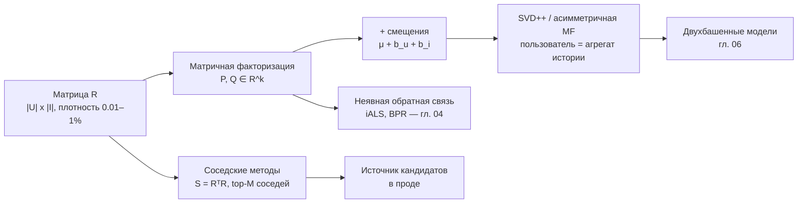

# Коллаборативная фильтрация

> **Зачем эта глава.** Коллаборативная фильтрация — базовый двигатель почти любой рекомендательной
> системы: она даёт персонализацию, ничего не зная о содержании товара. После главы вы сможете
> объяснить, почему разреженную матрицу оценок нельзя разложить обычным SVD, вывести правило
> обновления матричной факторизации с нуля, обосновать выбор между user-based и item-based
> схемами через вычислительную сложность и понять, почему три числа-смещения дают больше качества,
> чем сотня латентных факторов.

**Уровень:** 🎯 middle → 🧠 middle+
**Предварительно нужно:** [постановка задачи рекомендаций](01-recsys-foundations.md), [офлайн-метрики](02-metrics-offline.md), [линейная алгебра](../01-math/01-linear-algebra.md), [оптимизация](../01-math/04-optimization.md)
**Как проработать:** чтение + вывод формул руками + реализация

---

## Карта главы

- [1. Задача, из которой всё вырастает](#1-задача-из-которой-всё-вырастает) — матрица взаимодействий и её разреженность
- [2. Соседские методы](#2-соседские-методы) — user-based, item-based, меры близости, нормализация
- [3. Вычислительная сложность и почему побеждает item-based](#3-вычислительная-сложность-и-почему-побеждает-item-based)
- [4. Почему «просто SVD» здесь не работает](#4-почему-просто-svd-здесь-не-работает) — главный вопрос главы
- [5. FunkSVD: латентные факторы и градиентный спуск по наблюдённым ячейкам](#5-funksvd-латентные-факторы-и-градиентный-спуск-по-наблюдённым-ячейкам)
- [6. Смещения: три числа, которые дают больше, чем сто факторов](#6-смещения-три-числа-которые-дают-больше-чем-сто-факторов)
- [7. SVD++ и асимметричные модели](#7-svd-и-асимметричные-модели)
- [8. Регуляризация и настройка](#8-регуляризация-и-настройка)
- [9. Компромиссы: что выбирать в проде](#9-компромиссы-что-выбирать-в-проде)
- [10. Подводные камни](#10-подводные-камни)
- [11. Проверь себя](#11-проверь-себя)
- [12. Практика](#12-практика)
- [13. Что читать дальше](#13-что-читать-дальше)

---

## 1. Задача, из которой всё вырастает

Представьте, что вы запускаете рекомендации в сервисе с каталогом на миллион позиций. У вас нет
описаний товаров: есть штрихкод, есть название на кривом русском, и всё. Зато есть лог: кто что
смотрел, покупал, лайкал. Вопрос: можно ли из одного этого лога построить персонализацию?

Идея коллаборативной фильтрации (collaborative filtering, CF) в том, что можно, и что описание
товара для этого не нужно вовсе. Достаточно предположения: **если два пользователя вели себя
похоже в прошлом, они будут вести себя похоже в будущем**. Товар тогда описывается не своими
свойствами, а тем, кто его выбрал. «Похожесть» вычисляется из поведения — отсюда «коллаборативная»:
пользователи неявно помогают друг другу, оставляя следы.

### Матрица взаимодействий

Формализуем. Пусть $U$ — множество пользователей, $I$ — множество айтемов (item — единица
каталога: фильм, товар, трек, статья). Все данные складываем в **матрицу взаимодействий**
(interaction matrix) $R$ размера $|U| \times |I|$:

$$
R = \big(r_{ui}\big)_{u \in U,\; i \in I}
$$

где $r_{ui}$ — величина взаимодействия пользователя $u$ с айтемом $i$. Что именно там стоит,
зависит от типа обратной связи:

- **явная** (explicit feedback): $r_{ui}$ — оценка, например от 1 до 5. Неоценённые ячейки —
  **пропуски**, а не нули: мы не знаем, как пользователь отнёсся бы к фильму, который не смотрел.
- **неявная** (implicit feedback): $r_{ui}$ — число кликов/просмотров/покупок. Ноль означает
  «взаимодействия не было», и это не то же самое, что «не понравилось». Этому случаю посвящена
  [следующая глава](04-implicit-feedback.md); здесь мы работаем в основном с явной обратной связью,
  потому что на ней проще увидеть математику.

Обозначим $\mathcal{K} = \{(u, i) : r_{ui} \text{ наблюдён}\}$ — множество наблюдённых пар,
$n = |\mathcal{K}|$ — число наблюдений (это и есть размер обучающей выборки).
$N(u) \subset I$ — история пользователя $u$ (айтемы, с которыми он взаимодействовал),
$U_i \subset U$ — аудитория айтема $i$.

### Разреженность: главная особенность данных

Вот числа, которые надо помнить наизусть, потому что их спрашивают.

| Датасет / система | $\|U\|$ | $\|I\|$ | $n$ | Плотность $n/(\|U\|\cdot\|I\|)$ |
|---|---|---|---|---|
| MovieLens-100k | 943 | 1 682 | 100 000 | 6.3 % |
| MovieLens-20M | 138 493 | 27 278 | 20 000 263 | 0.53 % |
| Netflix Prize | 480 189 | 17 770 | 100 480 507 | 1.18 % |
| Крупный маркетплейс | $10^7$–$10^8$ | $10^6$–$10^8$ | $10^9$–$10^{10}$ | $10^{-4}$–$10^{-6}$ |

Обратите внимание: академические датасеты в сотни раз плотнее продакшена. Модель, красиво
работающая на MovieLens, на реальном каталоге может рассыпаться просто потому, что там на
пользователя приходится 30 взаимодействий из миллиона возможных, а не 100 из 1700.

> 🌱 **База.** Разреженность 0.01 % значит: если распечатать матрицу как таблицу, на десять тысяч
> клеток придётся одна заполненная. Любой алгоритм, который хочет пройтись по всем клеткам, обречён:
> их $10^{13}$ штук. Все работающие методы устроены так, чтобы касаться только заполненных ячеек
> либо использовать структуру, позволяющую обойти полный перебор.

Второе следствие разреженности — распределение с **тяжёлым хвостом**. Доля взаимодействий,
приходящихся на top-1 % каталога, обычно составляет 60–90 %. У половины айтемов меньше десяти
взаимодействий за месяц. Это фон, на котором работают все дальнейшие методы, и источник
большинства их проблем.

### Две постановки задачи

Исторически CF ставили как **восполнение матрицы** (matrix completion): предсказать $r_{ui}$
в пропущенных ячейках, метрика — RMSE. Так был устроен Netflix Prize (2006–2009), и оттуда родом
почти вся классическая литература.

Продуктовая задача другая: нужно **отранжировать** каталог и показать top-$k$ айтемов
($k$ — отсечка, обычно 10–100 для выдачи и 100–1000 для стадии отбора кандидатов). Хорошее
предсказание рейтинга не гарантирует хорошего ранжирования: модель может точно предсказывать
оценки в середине шкалы и путаться в верхушке, а видит пользователь только верхушку.

Мы разбираем модели в постановке восполнения, потому что так проще вывести математику, но
оценивать их надо ранжирующими метриками из [главы про офлайн-метрики](02-metrics-offline.md).
Это расхождение — не педантизм: на нём построен целый пласт вопросов на собеседовании.

---

## 2. Соседские методы

Первое семейство методов буквально повторяет интуицию «найди похожих». Их называют
**соседскими** (neighborhood-based) или **memory-based**: они не обучают параметров, а хранят
данные и считают близости.

### 2.1 User-based CF

Чтобы предсказать, как $u$ оценит $i$, найдём пользователей, похожих на $u$, которые $i$ уже
оценили, и усредним их оценки:

$$
\hat r_{ui} \;=\; \bar r_u \;+\; \frac{\sum_{v \in N_k(u; i)} s(u, v)\,\big(r_{vi} - \bar r_v\big)}{\sum_{v \in N_k(u; i)} \big|s(u, v)\big|}
$$

где $s(u, v)$ — мера близости пользователей $u$ и $v$; $N_k(u; i)$ — множество $k$ ближайших
к $u$ пользователей среди тех, кто оценил $i$; $\bar r_u$ — средняя оценка пользователя $u$
по его истории; $\hat r_{ui}$ — предсказание.

> 📐 **Разбор формулы.** Читаем изнутри. $r_{vi} - \bar r_v$ — это **отклонение** оценки соседа
> от его собственной средней: не «Вася поставил 4», а «Вася поставил на 0.7 выше своего обычного».
> Дальше отклонения усредняются с весами-близостями, и результат прибавляется к средней оценке
> самого $u$. Знаменатель нормирует веса, чтобы результат не зависел от их масштаба; модуль
> нужен, потому что близость может быть отрицательной (антикоррелирующие вкусы).
> Если убрать центрирование по $\bar r_v$, предсказание для строгого пользователя $u$ будет
> завышено вкладом щедрых соседей — это и есть проблема, которую решает нормализация.

### 2.2 Меры близости

**Косинусная мера** (cosine similarity) — угол между строками матрицы:

$$
s_{\cos}(u, v) \;=\; \frac{\sum_{i \in N(u) \cap N(v)} r_{ui}\, r_{vi}}{\sqrt{\sum_{i \in N(u)} r_{ui}^2}\;\sqrt{\sum_{i \in N(v)} r_{vi}^2}}
$$

где суммирование в числителе идёт по общим айтемам, в знаменателе — по всей истории каждого.
Значение лежит в $[-1, 1]$, для неотрицательных оценок — в $[0, 1]$.

Проблема косинуса на явных оценках: он считает пропуск нулём, а ноль на шкале 1–5 — это очень
плохая оценка. Два пользователя, поставивших одному фильму 5 и 4, окажутся «похожими» скорее по
факту пересечения, чем по совпадению вкуса.

**Корреляция Пирсона** (Pearson correlation) чинит это центрированием:

$$
s_{\text{pearson}}(u, v) \;=\; \frac{\sum_{i \in N(u) \cap N(v)} (r_{ui} - \bar r_u)(r_{vi} - \bar r_v)}{\sqrt{\sum_{i \in N(u) \cap N(v)} (r_{ui} - \bar r_u)^2}\;\sqrt{\sum_{i \in N(u) \cap N(v)} (r_{vi} - \bar r_v)^2}}
$$

Обозначения те же; принципиальная разница в том, что все три суммы берутся **только по общим
айтемам** $N(u) \cap N(v)$, а оценки центрированы средними пользователей. Пирсон — это косинус
на центрированных векторах, ограниченный общей частью историй.

**Скорректированный косинус** (adjusted cosine) — мера для близости *айтемов*:

$$
s_{\text{adj}}(i, j) \;=\; \frac{\sum_{u \in U_i \cap U_j} (r_{ui} - \bar r_u)(r_{uj} - \bar r_u)}{\sqrt{\sum_{u \in U_i \cap U_j} (r_{ui} - \bar r_u)^2}\;\sqrt{\sum_{u \in U_i \cap U_j} (r_{uj} - \bar r_u)^2}}
$$

где $U_i \cap U_j$ — пользователи, оценившие оба айтема. Ключевая деталь: центрируем по
**среднему пользователя** $\bar r_u$, а не по среднему айтема. Логика: разброс шкал — свойство
людей, а не товаров. Если бы мы центрировали по $\bar r_i$, мы бы стёрли информацию о том,
что один фильм в среднем лучше другого, — а она полезна.

> 💬 **На собеседовании.** Спросят: «Чем скорректированный косинус отличается от корреляции
> Пирсона?» Хороший ответ: обе меры — это косинус на центрированных данных, разница в том,
> **чем центрируем и по какой оси считаем**. Пирсон при item-item близости центрировал бы каждый
> столбец средней оценкой айтема; скорректированный косинус центрирует по средней оценке
> пользователя, потому что источник систематического сдвига — привычки конкретного человека
> («я никогда не ставлю ниже четвёрки»), а не свойство товара. На практике для item-item
> скорректированный косинус даёт заметно лучшее качество. Плохой ответ: «это одно и то же».

**Поправка на малое пересечение (shrinkage).** Если у двух айтемов ровно два общих пользователя
и оба поставили им одинаковые оценки, формальная близость будет равна 1. Это шум. Стандартный
приём — стягивать близость к нулю обратно пропорционально размеру пересечения:

$$
s'(i, j) \;=\; \frac{|U_i \cap U_j|}{|U_i \cap U_j| + \beta}\; s(i, j)
$$

где $\beta > 0$ — параметр стягивания, типично 10–100. При пересечении в 2 человека и $\beta = 50$
близость домножается на 0.04, то есть практически обнуляется; при пересечении в 5000 множитель
почти единица. Без этой поправки соседские методы систематически рекомендуют мусор из хвоста.

### 2.3 Item-based CF

Та же схема, но соседей ищем среди айтемов:

$$
\hat r_{ui} \;=\; \frac{\sum_{j \in N_k(i;\, u)} s(i, j)\, r_{uj}}{\sum_{j \in N_k(i;\, u)} |s(i, j)|}
$$

где $N_k(i; u)$ — $k$ ближайших к $i$ айтемов среди тех, что есть в истории $N(u)$.
Читается это как «оценка нового айтема = взвешенное среднее оценок похожих айтемов, которые
пользователь уже видел».

Для задачи ранжирования (а не предсказания оценки) обычно используют ещё более простую форму —
просто сумму близостей без нормировки:

$$
\text{score}(u, i) \;=\; \sum_{j \in N(u)} s(i, j)\, r_{uj}
$$

В матричном виде это одна строка произведения: $\text{score}(u, \cdot) = R_{u,\cdot} S$, где
$S$ — матрица item-item близостей размера $|I| \times |I|$. Отсюда — реализация на разреженной
арифметике.

```python
import numpy as np
from scipy import sparse


def item_item_cosine(R: sparse.csr_matrix, shrink: float = 50.0) -> sparse.csr_matrix:
    """Косинусная item-item близость с поправкой на размер пересечения.

    R: разреженная матрица (|U| x |I|), значения — веса взаимодействий.
    Возвращает разреженную (|I| x |I|) матрицу близостей без диагонали.
    """
    # Нормируем столбцы на их L2-норму. Тогда S = Rn^T @ Rn — это в точности косинусы.
    col_norms = np.sqrt(np.asarray(R.multiply(R).sum(axis=0)).ravel())
    col_norms[col_norms == 0] = 1.0                     # пустые столбцы: избегаем деления на ноль
    Rn = R @ sparse.diags(1.0 / col_norms)

    S = (Rn.T @ Rn).tocsr()                             # |I| x |I|, разреженная

    # Число общих пользователей: то же произведение, но по бинаризованной матрице.
    B = R.copy()
    B.data = np.ones_like(B.data)
    C = (B.T @ B).tocsr()

    # Стягивание: близость домножается на |U_i ∩ U_j| / (|U_i ∩ U_j| + shrink).
    # Носители S и C совпадают, поэтому поэлементное умножение корректно.
    C_shrunk = C.copy()
    C_shrunk.data = C.data / (C.data + shrink)
    S = S.multiply(C_shrunk).tocsr()

    S.setdiag(0.0)                                      # айтем не сосед сам себе
    S.eliminate_zeros()
    return S


def keep_top_m(S: sparse.csr_matrix, top_m: int = 100) -> sparse.csr_matrix:
    """Оставляем в каждой строке только top_m самых близких соседей.

    Без этого шага матрица близостей плотная: при |I| = 10^6 это 10^12 чисел.
    """
    data, indices, indptr = [], [], [0]
    for row in range(S.shape[0]):
        lo, hi = S.indptr[row], S.indptr[row + 1]
        d, idx = S.data[lo:hi], S.indices[lo:hi]
        if len(d) > top_m:
            keep = np.argpartition(-d, top_m)[:top_m]   # argpartition: O(len) вместо O(len log len)
            d, idx = d[keep], idx[keep]
        data.append(d)
        indices.append(idx)
        indptr.append(indptr[-1] + len(d))
    return sparse.csr_matrix(
        (np.concatenate(data), np.concatenate(indices), np.array(indptr)),
        shape=S.shape,
    )


def recommend(R: sparse.csr_matrix, S: sparse.csr_matrix, u: int, k: int = 10) -> np.ndarray:
    """top-k рекомендаций для пользователя u; уже виденное вырезаем."""
    scores = np.asarray((R[u] @ S).todense()).ravel()
    scores[R[u].indices] = -np.inf                      # не рекомендуем то, что уже было
    top = np.argpartition(-scores, k)[:k]               # k лучших без полной сортировки
    return top[np.argsort(-scores[top])]                # и уже их упорядочиваем
```

> ⌨️ **Руками.** Возьмите MovieLens-100k, постройте `S` этим кодом и посмотрите глазами на
> 10 ближайших соседей для трёх фильмов, которые вы знаете. Если в соседях у нишевого фильма
> оказались блокбастеры — увеличьте `shrink` и посмотрите, что изменится. Это упражнение на
> 20 минут даёт больше понимания popularity bias, чем любая теория.

---

## 3. Вычислительная сложность и почему побеждает item-based

Здесь начинается инженерия, и здесь же — самый содержательный вопрос про соседские методы.

Обе матрицы близостей считаются как разреженное произведение: item-item это $R^\top R$,
user-user это $R R^\top$. Стоимость разреженного произведения — не $O(|I|^2)$ и не $O(|U|^2)$,
а число операций «умножить-сложить», которое равно:

$$
\text{cost}\big(R^\top R\big) \;=\; \sum_{u \in U} |N(u)|^2,
\qquad
\text{cost}\big(R R^\top\big) \;=\; \sum_{i \in I} |U_i|^2
$$

где $|N(u)|$ — длина истории пользователя $u$, $|U_i|$ — размер аудитории айтема $i$.

Вот это и есть ответ. Обе величины квадратичны, но **квадрат берётся от разных распределений**.

- Стоимость item-item определяется самыми активными пользователями. Активность ограничена
  физически: даже маньяк смотрит не больше нескольких тысяч фильмов, а историю можно легально
  обрезать последними 500 событиями — это осмысленная операция, старые интересы всё равно
  устарели.
- Стоимость user-user определяется самыми популярными айтемами, а популярность имеет тяжёлый
  хвост без потолка. Один блокбастер с аудиторией $10^6$ даёт $10^{12}$ операций **сам по себе**.
  И обрезать его аудиторию нельзя — вы просто выкинете данные.

Посчитаем на цифрах. Сервис с $|U| = 10^7$, $|I| = 10^6$, средней историей 50 событий:
$\sum_u |N(u)|^2 \approx 10^7 \cdot 50^2 = 2.5 \cdot 10^{10}$ операций — это десятки минут
на Spark-кластере. Для user-user при том же объёме данных сумма $\sum_i |U_i|^2$ легко уходит
за $10^{13}$: средняя аудитория айтема 500, но распределение таково, что верхний процент даёт
основной вклад.

К этому добавляются три практических аргумента.

**Размер артефакта.** Матрица близостей плотная имеет $|I|^2$ или $|U|^2$ ячеек. При
$|I| = 10^6$ это $10^{12}$ — не помещается никуда, поэтому обязательна обрезка до top-$M$
соседей ($M = 50$–$500$). После обрезки item-item занимает $|I| \cdot M$ записей: при
$M = 100$ это $10^8$ пар, около 0.8 ГБ в формате (int32 индекс + float32 вес). Помещается
в память сервиса. User-user при $|U| = 10^7$ дал бы $10^9$ пар — уже неудобно, а главное,
бесполезно (см. следующий пункт).

**Стабильность во времени.** Аудитория айтема меняется медленно: связь «купившие принтер
покупают картриджи» верна месяцами. Профиль пользователя меняется каждую сессию. Поэтому
item-item близости пересчитывают раз в сутки офлайн, а персонализация происходит в момент
запроса подстановкой свежей истории $N(u)$ в формулу. В user-based так не выйдет: чтобы
учесть новое действие пользователя, надо пересчитать его близости ко всем остальным.

**Отзывчивость и объяснимость.** Новое действие пользователя мгновенно меняет выдачу, потому
что оно просто добавляется в $N(u)$ — переобучения не требуется. И рекомендацию можно объяснить:
«потому что вы смотрели X». Это не косметика: объяснение заметно повышает кликабельность и
снимает вопросы продуктовой команды.

> 💬 **На собеседовании.** Спросят: «У вас 50 млн пользователей и 5 млн товаров. User-based или
> item-based?» Хороший ответ начинается со стоимости: user-user требует $\sum_i |U_i|^2$ операций,
> и эта сумма взрывается на популярных товарах, которые нельзя обрезать; item-item требует
> $\sum_u |N(u)|^2$, а историю пользователя обрезать можно и нужно. Дальше: матрица item-item
> с top-100 соседями — это 500 млн пар, помещается в память, пересчитывается ночью, а
> персонализация делается онлайн одним разреженным умножением истории на неё. Плюс объяснимость.
> Отдельно стоит оговорить границу: если пользователей мало, а каталог огромен (B2B-сервис на
> 5 тысяч клиентов и 10 млн SKU), выгоднее ровно наоборот. Плохой ответ: «item-based, потому что
> товаров меньше» — правильный вывод из неправильной посылки; товаров может быть и больше.

> ⚠️ **Типичная ошибка.** Не обрезать историю сверхактивных пользователей и ботов перед
> вычислением $R^\top R$. Один аккаунт с историей в 200 000 событий даёт $4 \cdot 10^{10}$ операций
> и вешает джобу; вдобавок он связывает друг с другом всё подряд и размывает близости.
> Что делать: обрезать историю до последних 200–1000 событий и фильтровать аномально активные
> аккаунты до построения матрицы.

Соседские методы, при всей простоте, живы: они дают отличный бейзлайн, работают на холодных
данных и до сих пор стоят в проде как один из источников кандидатов. Но у них есть потолок.
Они смотрят на прямые пересечения историй, а при плотности $10^{-4}$ у двух случайных
пользователей общих айтемов просто нет. Нужен способ обобщать — сжимать поведение до чего-то
низкоразмерного, где похожесть видна даже без прямого пересечения.

---

## 4. Почему «просто SVD» здесь не работает

Естественная мысль: у нас матрица, мы хотим найти в ней структуру — возьмём сингулярное
разложение. Из [линейной алгебры](../01-math/01-linear-algebra.md) мы знаем теорему
Эккарта–Янга: усечённое SVD ранга $k$ даёт наилучшее приближение матрицы в норме Фробениуса.
Казалось бы, идеальный инструмент.

Ловушка в слове «матрица». SVD определено для **полностью заданной** матрицы. У нас задано
0.5 % ячеек. Разберём, что происходит при попытках это обойти.

**Попытка 1: заполнить пропуски нулями.** Формально теперь можно вызвать `svds`. Но посмотрите,
что мы минимизируем:

$$
\|R_0 - P Q^\top\|_F^2 \;=\; \underbrace{\sum_{(u,i) \in \mathcal{K}} (r_{ui} - p_u^\top q_i)^2}_{\text{0.5 \% слагаемых}} \;+\; \underbrace{\sum_{(u,i) \notin \mathcal{K}} (0 - p_u^\top q_i)^2}_{\text{99.5 \% слагаемых}}
$$

где $R_0$ — матрица с нулями вместо пропусков, $P \in \mathbb{R}^{|U| \times k}$ и
$Q \in \mathbb{R}^{|I| \times k}$ — матрицы латентных векторов, $p_u$ — строка $P$
(вектор пользователя), $q_i$ — строка $Q$ (вектор айтема), $\|\cdot\|_F$ — норма Фробениуса.

Второе слагаемое доминирует по числу членов в двести раз. Модель будет в первую очередь
старательно предсказывать ноль там, где мы сами выдумали ноль. Для явных оценок это прямая ложь:
ноль вне шкалы 1–5, он означает «фильм отвратителен», а на самом деле мы просто не знаем.
Предсказания получаются стянутыми к нулю, а латентное пространство описывает не вкусы,
а **паттерн заполненности** — то есть популярность.

**Попытка 2: заполнить средним.** Смещение меньше, но появляется другая беда: матрица становится
плотной. $|U| \times |I| = 10^7 \times 10^6 = 10^{13}$ чисел — это 40 ТБ во float32. Даже если
бы влезло, мы бы всё равно обучали модель предсказывать наши собственные выдумки: заполнив
пропуски константой, мы сообщаем модели, что «неизвестно» — это «средне», и она честно
воспроизводит эту константу в 99.5 % ячеек.

**Попытка 3 (концептуальная): а пропуски-то случайны?** Нет. Пользователь оценивает то, что
выбрал смотреть, а выбирает он то, что скорее всего понравится. Данные пропущены
**не случайно** (missing not at random, MNAR): сам факт наличия оценки несёт информацию о
предпочтении. Любая схема импутации неявно предполагает MAR и потому смещена. Отсюда, кстати,
растёт SVD++ (раздел 7): раз факт оценки информативен, давайте использовать его как отдельный
сигнал.

### Правильная постановка

Единственный честный ход — **суммировать ошибку только по наблюдённым ячейкам**:

$$
\min_{P,\,Q} \;\sum_{(u,i) \in \mathcal{K}} \big(r_{ui} - p_u^\top q_i\big)^2 \;+\; \lambda\Big(\sum_{u} \|p_u\|_2^2 + \sum_{i} \|q_i\|_2^2\Big)
$$

где $\lambda \ge 0$ — коэффициент L2-регуляризации, остальные обозначения введены выше.

Как только мы это сделали, задача **перестала быть SVD**. Смотрите, что мы потеряли:

- **Ортогональность.** Столбцы $P$ и $Q$ больше не ортогональны, сингулярных чисел нет.
  «Латентные факторы» — это просто координаты, у них нет упорядоченности по важности.
- **Единственность.** Для любой обратимой $A \in \mathbb{R}^{k \times k}$ верно
  $P Q^\top = (PA)(QA^{-\top})^\top$. Решение определено с точностью до линейного преобразования,
  поэтому интерпретировать отдельный фактор («вот этот отвечает за комедии») строго говоря нельзя.
- **Выпуклость.** Задача выпукла по $P$ при фиксированном $Q$ и наоборот, но **не** совместно
  по $(P, Q)$: произведение двух переменных даёт седловые точки. Аналитического решения нет,
  нужен итеративный метод.
- **Корректность постановки.** Без регуляризации задача плохо обусловлена: пользователь с одной
  оценкой может быть подогнан идеально бесконечным числом способов. Именно $\lambda$ делает
  решение осмысленным, а не «улучшает качество на пару процентов».

> 💬 **На собеседовании.** Спросят: «Почему нельзя применить SVD к матрице рейтингов?»
> Хороший ответ в три хода. (1) SVD определён для полной матрицы, а у нас 99 % пропусков.
> (2) Заполнение нулями меняет саму задачу: 99 % слагаемых функционала становятся ошибкой
> на выдуманных значениях, и модель учит паттерн заполненности вместо вкусов; заполнение средним
> вдобавок делает матрицу плотной и физически неподъёмной. (3) Правильная постановка —
> минимизировать ошибку только по наблюдённым ячейкам с L2-регуляризацией; это уже не SVD,
> а невыпуклая задача, которую решают SGD или ALS, и у неё нет ни ортогональности, ни
> единственности решения. Отличный дополнительный ход: заметить, что для **неявной** обратной
> связи ноль в пропуске — это не ложь, а слабое свидетельство отсутствия интереса, и там
> заполнение нулями с весами (iALS) как раз правильно. Плохой ответ: «SVD не работает на
> разреженных матрицах» — работает, `svds` прекрасно считается на разреженном входе; проблема
> не в вычислениях, а в семантике пропуска.

> ⚠️ **Типичная ошибка.** Путать «SVD» из линейной алгебры и «SVD» из рекомендательного
> фольклора. Алгоритм, который в библиотеке Surprise называется `SVD`, а в статьях —
> FunkSVD, никакого сингулярного разложения не делает: это градиентный спуск по наблюдённым
> ячейкам. Название прижилось со времён Netflix Prize, когда Саймон Фанк описал метод в блоге,
> и с тех пор путает людей на собеседованиях.

---

## 5. FunkSVD: латентные факторы и градиентный спуск по наблюдённым ячейкам

### 5.1 Модель

Каждому пользователю сопоставим вектор $p_u \in \mathbb{R}^k$, каждому айтему — вектор
$q_i \in \mathbb{R}^k$, где $k$ — размерность латентного пространства (типично 32–256;
на Netflix призовые решения использовали от 50 до нескольких сотен). Предсказание — скалярное
произведение:

$$
\hat r_{ui} \;=\; p_u^\top q_i \;=\; \sum_{f=1}^{k} p_{uf}\, q_{if}
$$

где $p_{uf}$ — $f$-я координата вектора пользователя, $q_{if}$ — $f$-я координата вектора айтема.

Содержательная трактовка: $q_{if}$ — насколько айтем $i$ выражает скрытое свойство $f$
(«боевиковость», «артхаусность»), $p_{uf}$ — насколько пользователь $u$ это свойство любит.
Скалярное произведение велико, когда сильные стороны айтема совпадают с предпочтениями
пользователя. Важная оговорка из предыдущего раздела: свойства не именованы и определены с
точностью до поворота пространства, так что «фактор №7 = ужасы» — это в лучшем случае
приблизительно и в худшем самообман.

Количество параметров: $k(|U| + |I|)$. При $|U| = 10^7$, $|I| = 10^6$, $k = 64$ это
$7 \cdot 10^8$ чисел ≈ 2.8 ГБ во float32. Хранение эмбеддингов пользователей — реальная
статья расходов, и это одна из причин, почему в проде часто выкидывают $p_u$ (см. раздел 7).

### 5.2 Вывод правила обновления

Минимизируем регуляризованную ошибку по наблюдённым ячейкам. Выпишем вклад одной ячейки
$(u, i) \in \mathcal{K}$:

$$
\ell_{ui} \;=\; \big(r_{ui} - p_u^\top q_i\big)^2 \;+\; \lambda\big(\|p_u\|_2^2 + \|q_i\|_2^2\big)
$$

Обозначим ошибку $e_{ui} = r_{ui} - p_u^\top q_i$. Дифференцируем по вектору $p_u$.
Первое слагаемое — сложная функция: внешняя $t \mapsto t^2$, внутренняя
$p_u \mapsto r_{ui} - p_u^\top q_i$, производная внутренней по $p_u$ равна $-q_i$.

$$
\frac{\partial}{\partial p_u}\big(e_{ui}\big)^2 \;=\; 2\, e_{ui} \cdot \frac{\partial e_{ui}}{\partial p_u} \;=\; 2\, e_{ui} \cdot (-q_i) \;=\; -2\, e_{ui}\, q_i
$$

Производная регуляризатора: $\dfrac{\partial}{\partial p_u} \lambda \|p_u\|_2^2 = 2\lambda p_u$
(слагаемое с $\|q_i\|^2$ от $p_u$ не зависит). Итого:

$$
\frac{\partial \ell_{ui}}{\partial p_u} \;=\; -2\, e_{ui}\, q_i \;+\; 2\lambda\, p_u
$$

Шаг стохастического градиентного спуска — движение против градиента; двойку поглощаем
в темп обучения $\eta$:

$$
\boxed{\;p_u \;\leftarrow\; p_u \;+\; \eta\,\big(e_{ui}\, q_i - \lambda\, p_u\big)\;}
$$

Симметрично по $q_i$ (производная внутренней функции по $q_i$ равна $-p_u$):

$$
\boxed{\;q_i \;\leftarrow\; q_i \;+\; \eta\,\big(e_{ui}\, p_u - \lambda\, q_i\big)\;}
$$

где $\eta > 0$ — темп обучения (learning rate), типично 0.002–0.02.

> 📐 **Разбор формулы.** Смотрите на структуру $e_{ui} q_i$. Если мы недооценили ($e_{ui} > 0$),
> вектор пользователя сдвигается **в сторону** вектора айтема — в следующий раз скалярное
> произведение будет больше. Если переоценили — сдвигается от него. Величина шага пропорциональна
> и ошибке, и «выраженности» айтема: сильно выраженные айтемы (с большой нормой $q_i$) двигают
> пользователя сильнее. Слагаемое $-\lambda p_u$ на каждом шаге чуть стягивает вектор к нулю;
> для пользователя с одной оценкой это означает, что его вектор почти не уедет от нуля, и модель
> честно скажет «не знаю» вместо выдуманной уверенности.

Три детали, на которых спотыкаются в реализации.

1. **Обновления должны использовать старые значения обоих векторов.** Если сначала обновить $p_u$,
   а потом посчитать шаг для $q_i$ через уже сдвинутый $p_u$, получится не градиентный шаг,
   а что-то другое (метод Гаусса–Зейделя вместо Якоби). На практике модель всё равно обучится,
   но воспроизводимость и сходимость пострадают. В numpy это классическая ловушка: срез
   `P[u]` — это **view**, а не копия.
2. **Инициализация не нулём.** При $P = Q = 0$ градиенты $e_{ui} q_i$ и $e_{ui} p_u$ равны нулю,
   и модель никогда не сдвинется. Инициализируют малым шумом, обычно $\mathcal{N}(0, 0.1^2)$
   или $\mathcal{N}(0, 1/\sqrt{k})$.
3. **Невыпуклость не мешает.** Формально мы можем застрять в локальном минимуме. Эмпирически
   на матрицах такого размера это не проблема: качество разных запусков различается в третьем
   знаке. Гораздо важнее регуляризация и число эпох.

### 5.3 Реализация

```python
import numpy as np


class FunkSVD:
    """Матричная факторизация со смещениями. SGD только по наблюдённым ячейкам.

    Это тот самый алгоритм, который в рекомендательном фольклоре называют "SVD".
    Сингулярного разложения здесь нет: есть градиентный спуск по 1e5-1e9 наблюдений.
    """

    def __init__(self, k=32, lr=0.01, reg=0.05, n_epochs=30, use_bias=True, seed=0):
        self.k = k
        self.lr = lr
        self.reg = reg
        self.n_epochs = n_epochs
        self.use_bias = use_bias
        self.seed = seed

    def fit(self, users, items, ratings, n_users, n_items):
        rng = np.random.default_rng(self.seed)
        self.mu_ = float(np.mean(ratings))
        self.b_u_ = np.zeros(n_users)
        self.b_i_ = np.zeros(n_items)
        # Нулевая инициализация P и Q дала бы нулевой градиент — модель бы не сдвинулась.
        self.P_ = rng.normal(0.0, 0.1, size=(n_users, self.k))
        self.Q_ = rng.normal(0.0, 0.1, size=(n_items, self.k))

        order = np.arange(len(ratings))
        for _ in range(self.n_epochs):
            rng.shuffle(order)                       # порядок важен: SGD чувствителен к корреляциям
            for idx in order:
                u, i, r = users[idx], items[idx], ratings[idx]
                # .copy() обязателен: P_[u] — это view, и без копии обновление Q_
                # увидело бы уже сдвинутый p_u вместо старого.
                pu = self.P_[u].copy()
                qi = self.Q_[i].copy()

                pred = self.mu_ + pu @ qi
                if self.use_bias:
                    pred += self.b_u_[u] + self.b_i_[i]
                e = r - pred

                if self.use_bias:
                    self.b_u_[u] += self.lr * (e - self.reg * self.b_u_[u])
                    self.b_i_[i] += self.lr * (e - self.reg * self.b_i_[i])
                self.P_[u] += self.lr * (e * qi - self.reg * pu)
                self.Q_[i] += self.lr * (e * pu - self.reg * qi)
        return self

    def predict(self, users, items):
        pred = self.mu_ + np.einsum("ij,ij->i", self.P_[users], self.Q_[items])
        if self.use_bias:
            pred += self.b_u_[users] + self.b_i_[items]
        return pred
```

Теперь численно проверим утверждение из раздела 4. Сгенерируем данные с известной низкоранговой
структурой, наблюдаемые ячейки выберем **не случайно** (популярные айтемы наблюдаются чаще),
и сравним четыре модели.

```python
from scipy import sparse
from scipy.sparse.linalg import svds

rng = np.random.default_rng(0)
n_users, n_items, k_true = 3000, 800, 8

P_true = rng.normal(0, 0.45, (n_users, k_true))
Q_true = rng.normal(0, 0.45, (n_items, k_true))
bu_true = rng.normal(0, 0.40, n_users)
bi_true = rng.normal(0, 0.60, n_items)
mu_true = 3.6

full = mu_true + bu_true[:, None] + bi_true[None, :] + P_true @ Q_true.T
full = np.clip(full + rng.normal(0, 0.30, full.shape), 1.0, 5.0)

# MNAR: вероятность наблюдения зависит от популярности айтема и активности пользователя
pop = rng.dirichlet(np.ones(n_items) * 0.3)          # тяжёлый хвост, как в реальности
pop = pop / pop.max()
act = rng.uniform(0.2, 1.0, n_users)
observed = rng.random(full.shape) < 0.55 * act[:, None] * pop[None, :]
uu, ii = np.nonzero(observed)
rr = full[uu, ii]
print(f"наблюдений: {len(rr)}, плотность: {len(rr) / (n_users * n_items):.3%}")

perm = rng.permutation(len(rr))
n_test = len(rr) // 5
te, tr = perm[:n_test], perm[n_test:]

def rmse(a, b):
    return float(np.sqrt(np.mean((a - b) ** 2)))

# 1. Глобальное среднее
base = np.full(n_test, rr[tr].mean())
print("глобальное среднее :", round(rmse(rr[te], base), 4))

# 2. Только смещения: k=0 даёт пустые матрицы P и Q, скалярное произведение тождественно 0,
#    поэтому модель вырождается ровно в mu + b_u + b_i
m_bias = FunkSVD(k=0, lr=0.01, reg=0.05, n_epochs=25).fit(uu[tr], ii[tr], rr[tr], n_users, n_items)
print("только смещения    :", round(rmse(rr[te], m_bias.predict(uu[te], ii[te])), 4))

# 3. Полная модель
m_full = FunkSVD(k=16, lr=0.01, reg=0.05, n_epochs=25).fit(uu[tr], ii[tr], rr[tr], n_users, n_items)
print("FunkSVD k=16       :", round(rmse(rr[te], m_full.predict(uu[te], ii[te])), 4))

# 4. "Просто SVD" по матрице с нулями вместо пропусков
R0 = sparse.csr_matrix((rr[tr], (uu[tr], ii[tr])), shape=(n_users, n_items)).astype(float)
Us, ss, Vts = svds(R0, k=16)
approx = (Us * ss) @ Vts
print("SVD с нулями k=16  :", round(rmse(rr[te], approx[uu[te], ii[te]]), 4))
```

Результат воспроизводится устойчиво: «просто SVD» на матрице с нулями проигрывает даже
предсказанию глобальным средним, причём с большим отрывом — его предсказания стянуты к нулю,
потому что нулей в матрице в двадцать раз больше, чем оценок. Это не тонкая деталь, а провал
на порядок. Запустите и посмотрите своими глазами: аргумент «SVD нельзя, потому что пропуски»
после этого перестаёт быть заученной фразой.

---

## 6. Смещения: три числа, которые дают больше, чем сто факторов

Посмотрите на данные глазами статистика. Дисперсия оценок складывается из трёх источников:

- одни фильмы объективно лучше других;
- одни пользователи в среднем ставят выше других;
- и только остаток — это собственно **взаимодействие**: «именно этому человеку именно этот фильм».

Модель $\hat r_{ui} = p_u^\top q_i$ вынуждена объяснять всё три источника одним механизмом.
Чтобы выразить «Вася всем ставит на балл выше», ей нужно потратить целое измерение латентного
пространства: завести фактор, который у всех айтемов положителен, а у Васи большой. Это работает,
но расточительно и плохо регуляризуется.

Решение — вынести аддитивные эффекты явно:

$$
\hat r_{ui} \;=\; \mu \;+\; b_u \;+\; b_i \;+\; p_u^\top q_i
$$

где $\mu$ — глобальное среднее по всем наблюдённым оценкам, $b_u \in \mathbb{R}$ — смещение
пользователя $u$ (насколько он в среднем щедрее или строже остальных), $b_i \in \mathbb{R}$ —
смещение айтема $i$ (насколько он в среднем лучше или хуже остальных), $p_u^\top q_i$ —
собственно персонализированная часть.

Правила обновления выводятся так же, как в разделе 5.2. Для $b_u$: производная
$(r_{ui} - \mu - b_u - b_i - p_u^\top q_i)^2$ по $b_u$ равна $-2 e_{ui}$, плюс
$2\lambda b_u$ от регуляризатора, откуда

$$
b_u \leftarrow b_u + \eta\big(e_{ui} - \lambda\, b_u\big),
\qquad
b_i \leftarrow b_i + \eta\big(e_{ui} - \lambda\, b_i\big)
$$

Альтернатива SGD — оценить смещения сразу, в закрытой форме со стягиванием:

$$
b_i \;=\; \frac{\sum_{u \in U_i} \big(r_{ui} - \mu\big)}{\lambda_i + |U_i|},
\qquad
b_u \;=\; \frac{\sum_{i \in N(u)} \big(r_{ui} - \mu - b_i\big)}{\lambda_u + |N(u)|}
$$

где $\lambda_i, \lambda_u > 0$ — параметры стягивания (типично 5–25, подбираются по валидации).
Здесь та же логика, что в shrinkage для близостей: айтем с тремя оценками получает смещение,
стянутое почти к нулю, айтем с тысячей — почти несмещённую оценку. Порядок важен: сначала
$b_i$, потом $b_u$ уже с учётом $b_i$.

### Насколько это много

Числа из бенчмарка в документации библиотеки Surprise (5-fold кросс-валидация, RMSE):

| Модель | MovieLens-100k | MovieLens-1M |
|---|---|---|
| Случайное предсказание (`NormalPredictor`) | ≈ 1.51 | ≈ 1.50 |
| Только смещения (`BaselineOnly`) | ≈ 0.944 | ≈ 0.909 |
| Матричная факторизация (`SVD`, то есть FunkSVD) | ≈ 0.934 | ≈ 0.873 |
| `SVD++` | ≈ 0.922 | ≈ 0.862 |

Прочитайте таблицу как разложение пути. От случайного предсказания до полной модели на ML-100k
путь длиной 0.58 RMSE; из них **0.57 закрывают смещения**, и лишь 0.01 добавляет вся конструкция
из латентных факторов. На ML-1M факторы дают больше (0.036), но всё равно смещения — это
подавляющая часть.

> 💬 **На собеседовании.** Спросят: «Зачем в матричной факторизации смещения, если латентные
> факторы и так всё выучат?» Хороший ответ: смещения объясняют основную долю дисперсии оценок —
> «хорошие фильмы» и «щедрые пользователи» — и без них факторы вынуждены тратить измерения на
> воспроизведение этих аддитивных эффектов вместо моделирования взаимодействия. На MovieLens
> модель из одних смещений закрывает почти весь разрыв между случайным предсказанием и полной MF.
> Второй аргумент, который ценят сильнее первого: смещения дают **корректную деградацию при
> холодном старте**. У нового пользователя $p_u \approx 0$ после регуляризации, и модель
> автоматически превращается в $\mu + b_i$ — ранжирование по средней оценке айтема, то есть
> в разумный популярный бейзлайн, а не в шум. Плохой ответ: «для лучшего качества».

> 🧠 **Middle+.** Тонкость, которую редко проговаривают: смещения переносят на себя и часть
> **popularity bias**. В ранжирующей постановке $b_i$ буквально сортирует каталог по популярности,
> и если ваша офлайн-метрика — recall@k на случайном сплите, модель со смещениями будет выглядеть
> отлично, просто угадывая популярное. Поэтому при переходе от RMSE к ранжированию всегда
> смотрите метрику **с исключением популярного бейзлайна** или хотя бы покрытие каталога
> (см. [офлайн-метрики](02-metrics-offline.md)). Иначе вы отберёте модель, которая ничего
> не персонализирует.

---

## 7. SVD++ и асимметричные модели

Вернёмся к наблюдению из раздела 4: пропуски не случайны. Сам факт, что пользователь **выбрал**
посмотреть и оценить фильм, говорит о его вкусе — даже до того, как мы посмотрели на значение
оценки. Классическая MF этот сигнал игнорирует: она видит только пары из $\mathcal{K}$ и их
значения.

SVD++ (Корен, KDD 2008) добавляет к вектору пользователя вклад его истории:

$$
\hat r_{ui} \;=\; \mu + b_u + b_i + q_i^\top\left(p_u + \frac{1}{\sqrt{|N(u)|}}\sum_{j \in N(u)} y_j\right)
$$

где $N(u)$ — множество айтемов, с которыми $u$ взаимодействовал (можно брать шире, чем
оценённые: просмотры, добавления в корзину — любой неявный сигнал); $y_j \in \mathbb{R}^k$ —
**второй** набор латентных векторов айтемов, отвечающий за неявный вклад; остальное как раньше.

> 📐 **Разбор формулы.** У пользователя теперь два представления, которые складываются.
> Первое, $p_u$, обучается свободно и отвечает за «явный» вкус. Второе — сумма векторов $y_j$
> по всей истории — отвечает за «я такой человек, который смотрит вот это». Множитель
> $|N(u)|^{-1/2}$ нужен по причине из теории вероятностей: если $y_j$ примерно независимы и
> центрированы, норма их суммы растёт как $\sqrt{|N(u)|}$. Без нормировки вклад истории у
> активного пользователя был бы в десятки раз больше, чем у новичка, и модель бы просто выучила
> «активные пользователи любят всё». Деление на корень выравнивает масштаб. Показатель $-1/2$
> подобран эмпирически и в некоторых работах заменяется на $-\alpha$ с настраиваемым $\alpha$.

**Цена.** Градиент теперь затрагивает все $y_j$ для $j \in N(u)$: одно наблюдение обновляет
$|N(u)|$ векторов вместо двух. Стоимость эпохи растёт с $O(nk)$ до $O\big(\sum_u |N(u)|^2 k\big)$.
При средней истории в 100 айтемов это в сто раз дороже. На Netflix это было оправдано (борьба
шла за третий знак RMSE), в продакшене с ежедневным переобучением — обычно нет.

**Что действительно важно из SVD++ для практики.** Заметьте, что если выбросить $p_u$ совсем:

$$
\hat r_{ui} \;=\; \mu + b_u + b_i + q_i^\top\left(\frac{1}{\sqrt{|N(u)|}}\sum_{j \in N(u)} y_j\right)
$$

получится **асимметричная модель**: пользователь больше не имеет собственных параметров, он
целиком описывается своей историей. Это даёт три вещи, каждая из которых ценна в проде:

1. **Мгновенное обновление.** Пользователь кликнул — мы пересчитали сумму и сразу отдали новые
   рекомендации. Переобучение не нужно. В классической MF пришлось бы дообучать $p_u$.
2. **Нулевая стоимость хранения пользователей.** Вместо $k|U|$ чисел храним только $k|I|$
   векторов $y_j$. При $|U| = 10^8$ разница между 25 ГБ и 250 МБ.
3. **Решённый холодный старт пользователя.** Новый пользователь с двумя действиями уже имеет
   представление — сумму двух векторов. Это «folding-in» без всякой отдельной процедуры.

Ровно эта идея потом всплывает в двухбашенных моделях, где башня пользователя агрегирует историю
(см. [двухбашенные модели](06-two-tower-and-ann.md)), и в последовательных рекомендациях, где
агрегация заменяется на self-attention ([SASRec/BERT4Rec](09-sequential-recsys.md)). Асимметричная
MF — их прямой предок.



---

## 8. Регуляризация и настройка

Собираем в одном месте то, что реально крутят.

| Параметр | Что делает | Типичные значения | Симптом неверной настройки |
|---|---|---|---|
| $k$ (размерность) | ёмкость модели | 32–256 (explicit), 64–512 (implicit) | мал: недообучение, все рекомендации похожи; велик: переобучение на активных, мусор на хвосте |
| $\lambda$ (L2) | стягивание векторов к нулю | 0.01–0.2 при SGD | мал: активные пользователи переобучены; велик: всё сходится к популярному |
| $\eta$ (темп обучения) | размер шага SGD | 0.002–0.02 | велик: RMSE скачет или уходит в NaN; мал: не сходится за разумное число эпох |
| число эпох | длина обучения | 15–40 | подбирается ранней остановкой по валидации |
| $\lambda_i, \lambda_u$ (стягивание смещений) | надёжность смещений на хвосте | 5–25 | мал: нишевые айтемы с одной пятёркой лезут в топ |

Три практических правила, которые экономят время.

**$k$ и $\lambda$ настраиваются вместе.** Больше факторов — больше параметров — нужна более
сильная регуляризация. Перебирать их независимо бессмысленно: сетка по $k \in \{32, 64, 128\}$
и $\lambda \in \{0.02, 0.05, 0.1\}$ информативнее, чем сто точек по одному $k$.

**Отдельные $\lambda$ для смещений и для факторов.** Смещения — надёжная низкодисперсионная
часть модели, их полезно регуляризовать слабее. В библиотеках это `reg_bu`, `reg_bi`, `reg_pu`,
`reg_qi`.

**Ранняя остановка обязательна.** MF на разреженных данных переобучается предсказуемо:
RMSE на валидации падает 10–20 эпох, потом растёт. Ловите минимум, а не гоняйте фиксированное
число эпох «как в статье».

> ⚠️ **Типичная ошибка.** Валидировать CF случайным разбиением наблюдений. В проде модель
> предсказывает **будущее**, а случайный сплит даёт ей подсматривать: в трейн попадают события
> пользователя, произошедшие после тестовых. Метрики завышаются, а порядок моделей может
> измениться. Нужен временной сплит (обучение на данных до даты $T$, тест после) или
> leave-one-out по последнему событию пользователя — подробности в
> [главе про офлайн-метрики](02-metrics-offline.md).

---

## 9. Компромиссы: что выбирать в проде

Классический CF почти никогда не работает в одиночку. Он живёт как **источник кандидатов**
в многостадийной архитектуре: на первой стадии из каталога в $10^6$–$10^8$ айтемов надо за
10–30 мс отобрать $10^2$–$10^3$ кандидатов, дальше их ранжирует тяжёлая модель за 20–50 мс.
Общий бюджет ответа обычно 100–200 мс, из которых на ML остаётся половина
(подробности — в [главе про прод](14-recsys-in-production.md)).

Отсюда требования к CF-модели на стадии кандидатов: она должна отдавать top-$k$ **без перебора
каталога**. У соседских методов это решается разреженным умножением истории на матрицу top-$M$
соседей; у матричной факторизации — приближённым поиском ближайших соседей по $q_i$
(ANN, [глава 06](06-two-tower-and-ann.md)), потому что $\arg\max_i p_u^\top q_i$ по миллиону
айтемов честным перебором — это 64 млн операций на запрос, что за бюджет не влезает.

| Условие | Что выбрать | Почему |
|---|---|---|
| Нужна объяснимость («потому что вы смотрели X») | item-based | объяснение выпадает из механизма, а не придумывается сверху |
| История пользователя меняется в течение сессии | item-based или асимметричная MF | не требуют переобучения $p_u$ |
| Нужно максимальное качество на плотных данных с оценками | MF со смещениями | обобщает через латентное пространство, ловит непрямые связи |
| Данные — клики и просмотры, оценок нет | iALS / BPR ([глава 04](04-implicit-feedback.md)) | явных оценок нет, нужна другая функция потерь |
| Есть контентные признаки, много холодных айтемов | гибриды, LightFM, FM ([глава 05](05-factorization-machines.md)) | чистый CF не умеет работать с айтемом без истории |
| Каталог обновляется каждый час (новости, объявления) | контентные + соседские методы | MF не успевает выучить эмбеддинг нового айтема |

> 💬 **На собеседовании.** Спросят: «Матричная факторизация или соседские методы — что лучше?»
> Хороший ответ идёт через условия. MF сильнее там, где нужно обобщение: она находит связь между
> пользователями без общих айтемов, лучше работает на разреженных данных и даёт компактное
> представление, с которым дальше можно делать ANN-поиск. Соседские методы сильнее там, где важны
> реакция на свежее действие без переобучения, объяснимость и локальные паттерны, которые MF
> сглаживает (характерный пример — «купил принтер → нужен картридж», сильная узкая связь между
> двумя айтемами, которую низкоранговая модель размажет). В проде их обычно не выбирают,
> а складывают: оба идут источниками кандидатов, а решает ранкер.
> Плохой ответ: «MF лучше, это же современный метод».

---

## 10. Подводные камни

**Модель рекомендует только популярное.**
Симптом: покрытие каталога 2 %, в топе у всех одно и то же, персонализации не видно.
Причина: сочетание тяжёлого хвоста и регуляризации. Векторы редких айтемов стянуты к нулю,
их скалярные произведения близки к нулю, а смещение $b_i$ у популярных велико — сортировка
превращается в сортировку по популярности.
Что делать: следить за метриками покрытия и новизны наравне с recall; при отборе кандидатов
явно добавлять источники из хвоста; рассмотреть нормировку скора на популярность или
дебиасинг (см. [холодный старт и смещения](12-cold-start-and-bias.md)).

**Отличный RMSE, плохая выдача.**
Симптом: модель выиграла по RMSE, а CTR в A/B не изменился или упал.
Причина: RMSE усредняется по всей шкале, а пользователь видит только верхушку. Модель могла
улучшить предсказание троек и ухудшить порядок в топе. Плюс MNAR: тестовая выборка состоит
из айтемов, которые пользователь **выбрал** посмотреть, а рекомендовать надо из всего каталога.
Что делать: оценивать ранжирующими метриками на всём каталоге, а не только на наблюдённых парах;
финальное решение — только по онлайн-эксперименту.

**Сдвиг после переобучения: рекомендации «поехали».**
Симптом: после ночного переобучения выдача у части пользователей поменялась радикально,
пошли жалобы.
Причина: латентное пространство определено с точностью до поворота (раздел 4), при переобучении
с нуля оно другое; плюс невыпуклость — разные локальные оптимумы. Индексы ANN, построенные на
старых векторах, тоже несовместимы с новыми.
Что делать: дообучать (warm start) от предыдущих весов, а не с нуля; полностью пересобирать
индекс атомарно; мониторить долю пересечения top-k между версиями модели как метрику стабильности.

**Один пользователь = несколько людей (семейный аккаунт).**
Симптом: рекомендации выглядят как смесь несовместимых вкусов; жалобы «зачем мне это».
Причина: вектор $p_u$ — это среднее по всем членам семьи; в латентном пространстве среднее
между «детские мультики» и «хорроры» не означает ничего.
Что делать: сессионные/контекстные модели, профили внутри аккаунта, диверсификация выдачи.
Это фундаментальное ограничение единого вектора, и его стоит проговаривать на собеседовании.

**Утечка через препроцессинг.**
Симптом: офлайн-метрики отличные, онлайн — ноль.
Причина: $\mu$, $b_i$, матрица близостей или нормировки посчитаны по всему датасету, включая
тестовый период. Формально признаки посчитаны «по данным», фактически — по будущему.
Что делать: все статистики считать только по обучающему периоду; проверять это тестом в CI
(см. [валидация и утечки](../02-classic-ml/05-validation-and-leakage.md)).

**Боты и накрутки искажают близости.**
Симптом: в соседях у товара оказываются случайные товары; после «чистки» качество прыгает.
Причина: аккаунты с тысячами взаимодействий связывают всё со всем; накрутка отзывов создаёт
искусственные пересечения.
Что делать: фильтровать аномальную активность до построения матрицы, обрезать историю, применять
взвешивание типа BM25 к значениям $r_{ui}$ (в библиотеке `implicit` для этого есть
`bm25_weight`).

---

## 11. Проверь себя

<details>
<summary><b>🌱 Вопрос.</b> Что такое коллаборативная фильтрация и чем она отличается от контентной?</summary>

**Короткий ответ.** CF строит рекомендации только по матрице взаимодействий «пользователь ×
айтем», не используя описания айтемов. Контентная фильтрация, наоборот, строит их по признакам
айтема и профилю пользователя в терминах этих признаков.

**Развёрнуто.** CF опирается на гипотезу: похожее поведение в прошлом → похожие предпочтения
в будущем. Её сила в том, что она находит неочевидные связи, которых нет ни в каких атрибутах
(«те, кто покупает эту дрель, покупают этот кофе» — потому что и то и другое берут в подарок
на 23 февраля). Её слабость — холодный старт: айтем без взаимодействий не имеет представления
вообще, и рекомендовать его нечем. Контентный подход зеркален: он работает с первого дня жизни
айтема, но не выходит за пределы того, что описано признаками, и потому склонен к
однообразию («вы смотрели комедию → вот вам ещё сорок комедий»). В проде почти всегда гибрид:
CF как основной источник, контентные модели — для холодных айтемов и как дополнительный
источник кандидатов.

**Чего ждёт интервьюер:** что вы понимаете, откуда берётся сигнал, и сразу называете холодный
старт как границу применимости.

**Провал:** «CF — это когда рекомендуем похожее» — без указания, что похожесть считается
по поведению, а не по атрибутам.
</details>

<details>
<summary><b>🎯 Вопрос.</b> Почему нельзя просто применить SVD к матрице рейтингов?</summary>

**Короткий ответ.** SVD определён для полностью заданной матрицы, а у нас известно менее
процента ячеек. Любое заполнение пропусков меняет задачу: модель начинает подгоняться под
выдуманные значения, которых в двести раз больше, чем настоящих.

**Развёрнуто.** Норма Фробениуса, которую минимизирует усечённое SVD, суммируется по **всем**
ячейкам. Заполнив пропуски нулями, мы получаем функционал, в котором 99.5 % слагаемых — ошибка
на несуществующих оценках, причём ноль на шкале 1–5 семантически означает «крайне плохо».
Предсказания стягиваются к нулю, а латентное пространство описывает паттерн заполненности,
то есть популярность. Заполнение средним уменьшает смещение, но делает матрицу плотной: при
$10^7$ пользователях и $10^6$ айтемов это $10^{13}$ чисел. Вдобавок пропуски не случайны (MNAR):
человек оценивает то, что сам выбрал смотреть, поэтому любая импутация систематически смещена.
Правильная постановка — минимизировать ошибку только по наблюдённым ячейкам с L2-регуляризацией;
получившаяся задача уже не SVD: нет ортогональности, решение не единственно (с точностью до
обратимого преобразования $P Q^\top = (PA)(QA^{-\top})^\top$), задача невыпукла по паре $(P, Q)$
и решается SGD или ALS.

**Чего ждёт интервьюер:** понимания разницы между «пропуск» и «ноль», и того, что смена
функционала — это смена задачи, а не техническая деталь.

**Провал:** «SVD не работает с разреженными матрицами» — работает, `scipy.sparse.linalg.svds`
считает именно на разреженном входе. Проблема в семантике, а не в формате хранения.
</details>

<details>
<summary><b>🎯 Вопрос.</b> У вас 50 млн пользователей и 5 млн товаров. User-based или item-based CF?</summary>

**Короткий ответ.** Item-based. Решает не соотношение размеров, а то, что стоимость
$R R^\top$ равна $\sum_i |U_i|^2$ и взрывается на популярных товарах, тогда как стоимость
$R^\top R$ равна $\sum_u |N(u)|^2$ и управляется обрезкой истории.

**Развёрнуто.** Три аргумента по убыванию важности. (1) Вычислительный: популярность имеет
тяжёлый хвост, один товар с аудиторией $10^6$ даёт $10^{12}$ операций в user-user произведении,
и урезать аудиторию нельзя без потери данных; длину истории пользователя урезать до последних
200–500 событий можно и даже полезно. (2) Операционный: item-item близости стабильны неделями,
их считают ночью офлайн, а персонализация делается онлайн подстановкой свежей истории — новое
действие пользователя влияет на выдачу немедленно, без переобучения. В user-based новое действие
требует пересчёта близостей этого пользователя ко всем остальным. (3) Продуктовый: item-based
даёт готовое объяснение «похоже на то, что вы смотрели».
Граница применимости: если пользователей на порядки меньше, чем айтемов (корпоративный каталог
на 10 млн SKU и 5 тысяч клиентов), рациональнее user-based.

**Чего ждёт интервьюер:** что вы считаете сложность через сумму квадратов, а не через $|U|^2$
и $|I|^2$, и понимаете роль тяжёлого хвоста.

**Провал:** «товаров меньше, значит item-based» — правильный ответ из неправильного рассуждения;
контрпример с $|I| > |U|$ ломает такую логику.
</details>

<details>
<summary><b>🧠 Вопрос.</b> Выведите правило обновления для FunkSVD.</summary>

**Короткий ответ.**
$p_u \leftarrow p_u + \eta(e_{ui} q_i - \lambda p_u)$,
$q_i \leftarrow q_i + \eta(e_{ui} p_u - \lambda q_i)$,
где $e_{ui} = r_{ui} - \hat r_{ui}$.

**Развёрнуто.** Минимизируем
$\sum_{(u,i)\in\mathcal{K}} (r_{ui} - p_u^\top q_i)^2 + \lambda(\|p_u\|^2 + \|q_i\|^2)$.
Для одного наблюдения обозначим $e_{ui} = r_{ui} - p_u^\top q_i$. Производная квадрата ошибки
по $p_u$: внешняя функция $t^2$ даёт $2e_{ui}$, внутренняя $e_{ui}(p_u)$ даёт $-q_i$, итого
$-2 e_{ui} q_i$. Производная регуляризатора: $2\lambda p_u$. Шаг против градиента с поглощением
двойки в $\eta$ даёт выписанное правило; для $q_i$ всё симметрично. Со смещениями добавляются
$b_u \leftarrow b_u + \eta(e_{ui} - \lambda b_u)$ и аналогично для $b_i$, поскольку производная
по скаляру-смещению равна $-2e_{ui}$.
Две реализационные детали: оба обновления используют **старые** значения векторов (иначе шаг
не является градиентным), и инициализировать нулями нельзя — градиент тождественно нулевой.

**Чего ждёт интервьюер:** способности провести цепочку правил дифференцирования вслух и
объяснить смысл: вектор пользователя двигается в сторону вектора айтема пропорционально ошибке.

**Провал:** воспроизвести формулу без вывода и не смочь ответить, откуда взялся знак минус
у $\lambda p_u$.
</details>

<details>
<summary><b>🎯 Вопрос.</b> Зачем в модели смещения $b_u$ и $b_i$, если есть латентные факторы?</summary>

**Короткий ответ.** Смещения объясняют главную часть дисперсии оценок — «фильм хороший» и
«пользователь щедрый», — освобождая факторы для моделирования собственно взаимодействия.
На MovieLens модель из одних смещений закрывает почти весь разрыв между случайным предсказанием
и полной факторизацией.

**Развёрнуто.** Без смещений факторам приходится тратить измерения на аддитивные эффекты:
чтобы выразить «этот пользователь всем ставит на балл выше», нужен фактор, положительный
у всех айтемов. Это работает плохо и плохо регуляризуется. Второй, более практический аргумент —
поведение при холодном старте: у нового пользователя после регуляризации $p_u \approx 0$, и
модель вырождается в $\mu + b_i$, то есть в сортировку по средней оценке айтема — разумный
фолбэк. Третий аргумент — устойчивость на хвосте: смещения оценивают со стягиванием
$b_i = \sum_{u \in U_i}(r_{ui} - \mu) / (\lambda_i + |U_i|)$, что не даёт айтему с двумя
пятёрками занять первое место.
Оборотная сторона: в ранжирующей постановке $b_i$ — это фактически популярность, и модель
со смещениями легко выглядит хорошо по recall@k, ничего не персонализируя. Поэтому вместе
с recall смотрят покрытие каталога.

**Чего ждёт интервьюер:** понимание того, что модель — это разложение дисперсии, и что
смещения дают корректную деградацию при нехватке данных.

**Провал:** «для точности» без объяснения механизма.
</details>

<details>
<summary><b>🎯 Вопрос.</b> Зачем нормализовать оценки по пользователю перед вычислением близости?</summary>

**Короткий ответ.** Потому что пользователи используют шкалу по-разному: один ставит 3–5,
другой 1–3. Без центрирования близость измеряет совпадение уровня оценок, а не совпадение вкуса.

**Развёрнуто.** Возьмём двух пользователей с идентичным порядком предпочтений, но разной
щедростью: (5, 4, 3) и (3, 2, 1). Косинус по сырым значениям даст высокое, но не единичное
сходство, и, главное, при предсказании $\hat r$ мы прибавим к своей средней чужие абсолютные
значения — предсказание для строгого пользователя окажется завышенным. После центрирования
по $\bar r_u$ оба вектора становятся (1, 0, −1), близость равна 1, и в формуле предсказания
переносятся именно **отклонения**, а не уровни. Для item-item близости центрирование делается
тоже по среднему пользователя (скорректированный косинус), потому что источник систематического
сдвига — человек, а не товар. Отдельно: нормировка не спасает от малых пересечений, поэтому её
дополняют стягиванием $\frac{|U_i \cap U_j|}{|U_i \cap U_j| + \beta}$.

**Чего ждёт интервьюер:** конкретный пример с двумя пользователями и понимание, что нормализация
меняет то, **что именно** измеряет близость.

**Провал:** «чтобы привести к одному масштабу» — верно по форме, но не показывает, что человек
понимает эффект на предсказание.
</details>

<details>
<summary><b>🧠 Вопрос.</b> Что такое SVD++ и почему его редко видно в продакшене?</summary>

**Короткий ответ.** SVD++ добавляет к вектору пользователя нормированную сумму отдельных
векторов $y_j$ по всем айтемам его истории, тем самым используя сам факт взаимодействия как
сигнал. В проде мешает стоимость: шаг обучения затрагивает $|N(u)|$ векторов вместо двух.

**Развёрнуто.** Формула:
$\hat r_{ui} = \mu + b_u + b_i + q_i^\top\big(p_u + |N(u)|^{-1/2}\sum_{j \in N(u)} y_j\big)$.
Мотивация — MNAR: пользователь оценивает то, что выбрал, поэтому наличие оценки информативно
само по себе, независимо от значения. Нормировка на $\sqrt{|N(u)|}$ выравнивает масштаб вклада
между активными и новыми пользователями (норма суммы примерно независимых векторов растёт как
корень из их числа). Цена: сложность эпохи растёт с $O(nk)$ до $O(\sum_u |N(u)|^2 k)$ — при
средней истории 100 это стократное замедление, и ради выигрыша порядка 0.01 RMSE это редко
оправдано вне соревнований.
Что из SVD++ реально пошло в прод — идея асимметричной модели: выкинуть $p_u$ и описывать
пользователя **только** агрегатом истории. Тогда не нужно хранить эмбеддинги пользователей,
новое действие меняет рекомендации мгновенно, и холодный старт пользователя решается сам собой.
Это прямой предок пользовательской башни в two-tower моделях.

**Чего ждёт интервьюер:** что вы отличаете академический прирост метрики от инженерной
применимости и знаете, какая именно идея из SVD++ пережила своё время.

**Провал:** «SVD++ — это улучшенный SVD» без объяснения, что именно добавлено.
</details>

<details>
<summary><b>🧠 Вопрос.</b> Матрица разрежена на 99.99 %. Как это влияет на выбор $k$ и $\lambda$?</summary>

**Короткий ответ.** Чем разреженнее данные, тем меньше наблюдений на один параметр, тем меньше
должно быть $k$ и больше $\lambda$. Ориентир: число параметров $k(|U| + |I|)$ должно быть заметно
меньше числа наблюдений $n$.

**Развёрнуто.** Каждый пользователь с $|N(u)|$ оценками должен «оплатить» $k$ своих параметров.
При $|N(u)| = 5$ и $k = 128$ система недоопределена в двадцать пять раз, и без сильной
регуляризации вектор такого пользователя будет чистым шумом, подогнанным под пять точек. Отсюда
практика: считать распределение длин истории и смотреть на медиану, а не на среднее (среднее
задирают боты). Если медиана 5–10, разумный $k$ — 16–32, а не 256. Второе следствие
разреженности — сильный тяжёлый хвост айтемов: у половины каталога меньше десяти взаимодействий,
их векторы тоже шум, и в топ они попадать не должны — за это отвечает стягивание смещений.
Третье: при экстремальной разреженности чистый CF в принципе упирается в потолок, и выигрыш
даёт переход к гибридам с контентными признаками (см. [главу 05](05-factorization-machines.md)).

**Чего ждёт интервьюер:** умения оценить «параметров против наблюдений» на салфетке и связать
это с длиной истории, а не просто сказать «подберём по валидации».

**Провал:** «возьмём $k = 100$, это стандарт».
</details>

<details>
<summary><b>🎯 Вопрос.</b> Как рекомендовать новому пользователю и как — новому айтему?</summary>

**Короткий ответ.** Новому пользователю — популярное с учётом контекста (регион, устройство,
время), затем как можно быстрее переключаться на его первые действия. Новому айтему — через
контентные признаки и принудительную эксплорацию: без показов он никогда не наберёт статистику.

**Развёрнуто.** Ситуации несимметричны. У нового пользователя проблема временная: после
3–5 действий item-based метод или асимметричная MF уже дают персонализацию без переобучения
(в этом их преимущество перед классической MF, где $p_u$ надо доучивать). Помогает
onboarding-опрос и контекстные бейзлайны.
У нового айтема проблема хуже: он не появляется в рекомендациях, значит не получает
взаимодействий, значит не появляется — замкнутая петля. Решения: (1) контентная модель или
гибрид типа LightFM/FM, где айтем представлен суммой векторов своих признаков и потому имеет
эмбеддинг с нулевого дня; (2) явная эксплорация — резервировать долю слотов выдачи под холодные
айтемы, либо использовать бандитские схемы ([глава 13](13-exploration-and-bandits.md));
(3) перенос эмбеддинга от похожих айтемов (тот же бренд, категория, автор).
Подробный разбор — в [главе про холодный старт](12-cold-start-and-bias.md).

**Чего ждёт интервьюер:** что вы понимаете асимметрию двух холодных стартов и упоминаете
петлю обратной связи для айтемов.

**Провал:** «покажем популярное» для обоих случаев — для айтема это не решение, а описание
проблемы.
</details>

<details>
<summary><b>🧠 Вопрос.</b> Модель улучшила RMSE на 3 %, но A/B-тест не показал прироста CTR. Что произошло?</summary>

**Короткий ответ.** RMSE измеряет точность на всей шкале и на выборке, смещённой отбором
(пользователь оценивал то, что сам выбрал), а продукт зависит только от порядка в верхних
позициях выдачи, формируемой из всего каталога.

**Развёрнуто.** Разбор по слоям. (1) Метрика не та: улучшение точности предсказания троек
никак не влияет на то, что стоит в топ-10; нужны NDCG@k, recall@k, а сравнивать модели надо
именно по ним. (2) Смещение выборки: офлайн-тест состоит из наблюдённых пар, то есть из айтемов,
прошедших через прошлые рекомендации и собственный выбор пользователя — это MNAR, и офлайн-оценка
систематически завышает качество моделей, похожих на ту, что собирала данные. (3) Позиция в
пайплайне: если модель — источник кандидатов, её улучшение может не доходить до пользователя,
потому что решает ранкер; надо смотреть recall кандидатов, а не финальную метрику.
(4) Бизнес-эффекты: рост релевантности может съедаться падением разнообразия, если модель стала
более «популярной». Проверять — метриками покрытия и новизны.
План действий: сначала перемерить офлайн ранжирующими метриками на временном сплите, затем
проверить recall стадии кандидатов, затем смотреть сегменты (новые/активные пользователи) —
эффект часто есть, но только в одном сегменте и тонет в среднем.

**Чего ждёт интервьюер:** структурированный разбор расхождения офлайн и онлайн, а не одну
гипотезу.

**Провал:** «офлайн-метрики всегда врут» — это не диагноз, а отговорка.
</details>

---

## 12. Практика

**Задача 1. Соседские методы руками (1.5 часа).**
Возьмите MovieLens-100k. Реализуйте item-based CF с тремя мерами близости: сырой косинус,
скорректированный косинус, скорректированный косинус со стягиванием $\beta \in \{0, 10, 100\}$.
Оцените NDCG@10 на временном сплите.
*Критерий: у вас есть таблица «мера × $\beta$ → NDCG@10», и вы можете объяснить, почему
стягивание помогает и на каком $\beta$ эффект выходит на плато.*

**Задача 2. Воспроизвести провал SVD (40 минут).**
Запустите эксперимент из раздела 5.3 и добавьте пятую модель: усечённое SVD по матрице,
где пропуски заполнены **средним по столбцу**. Сравните все пять по RMSE и, отдельно,
по среднему предсказанию.
*Критерий: вы видите, что заполнение нулями стягивает предсказания к нулю (среднее предсказание
сильно ниже 3.6), заполнение средним стягивает к константе, и обе схемы проигрывают модели,
обучаемой только по наблюдённым ячейкам.*

**Задача 3. Разложение вклада (1 час).**
На том же датасете обучите четыре модели: только $\mu$; $\mu + b_i$; $\mu + b_u + b_i$;
полная MF. Постройте столбчатую диаграмму RMSE.
*Критерий: вы можете назвать в процентах, какую долю улучшения дают смещения, и объяснить,
почему на более плотном датасете эта доля меньше.*

**Задача 4. Асимметричная модель (2 часа).**
Реализуйте вариант из раздела 7 без $p_u$: пользователь представлен нормированной суммой
векторов $y_j$ по истории. Сравните с обычной MF по NDCG@10 и отдельно — на подвыборке
пользователей с историей короче 5 событий.
*Критерий: на коротких историях асимметричная модель не хуже, а часто лучше; вы можете
объяснить почему, и умеете обновить рекомендации после добавления одного нового события,
не переобучая модель.*

**Задача 5. Стабильность выдачи (1 час).**
Обучите MF дважды с разными `seed`. Посчитайте среднее пересечение top-10 рекомендаций между
двумя версиями по 1000 случайным пользователям.
*Критерий: вы получили число заметно меньше 100 %, можете объяснить это невыпуклостью и
неединственностью разложения, и предложить как минимум два способа стабилизации (warm start,
усреднение по нескольким запускам, фиксация seed + атомарная выкатка индекса).*

---

## 13. Что читать дальше

- [Simon Funk. «Netflix Update: Try This at Home» (2006)](https://sifter.org/~simon/journal/20061211.html) —
  тот самый блог-пост, с которого началась FunkSVD. Читать ради интонации: видно, как метод
  придумывается из практических соображений, а не выводится из теории. Заодно навсегда
  запоминается, почему «SVD» в рекомендациях — не SVD.
- **Koren Y., Bell R., Volinsky C. «Matrix Factorization Techniques for Recommender Systems»,
  IEEE Computer, 2009** — каноническая обзорная статья по MF со смещениями, SVD++ и временной
  динамике. Если читать что-то одно по этой главе — читайте её.
- **Koren Y. «Factorization Meets the Neighborhood: a Multifaceted Collaborative Filtering Model»,
  KDD 2008** — первоисточник SVD++ и объединённой модели «соседи + факторы». Полезен разбором,
  как соседские веса обучаются, а не постулируются.
- **Sarwar B. et al. «Item-Based Collaborative Filtering Recommendation Algorithms», WWW 2001** —
  работа, которая ввела item-based схему и скорректированный косинус. Короткая, читается за час.
- **Linden G., Smith B., York J. «Amazon.com Recommendations: Item-to-Item Collaborative
  Filtering», IEEE Internet Computing, 2003** — инженерный взгляд: почему item-to-item
  масштабируется и как это работало в проде Amazon. Ровно те аргументы, что в разделе 3.
- [Rendle S. et al. «Neural Collaborative Filtering vs. Matrix Factorization Revisited» (2020)](https://arxiv.org/abs/2005.09683) —
  отрезвляющая работа: аккуратно настроенное скалярное произведение обыгрывает нейросетевые
  замены. Обязательна, чтобы не переоценивать сложность моделей.
- [Документация Surprise](https://surprise.readthedocs.io/en/stable/) — библиотека для
  explicit-CF с готовыми `SVD`, `SVD++`, `KNNBaseline` и опубликованными бенчмарками на
  MovieLens; удобна, чтобы быстро получить точку отсчёта перед своей реализацией.

---

⬅️ [Офлайн-метрики рекомендаций](02-metrics-offline.md) | 🏠 [Оглавление](../index.md) | ➡️ [Неявная обратная связь](04-implicit-feedback.md)
