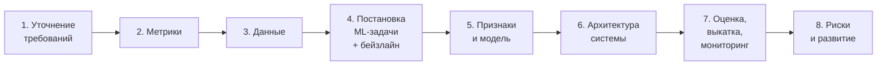
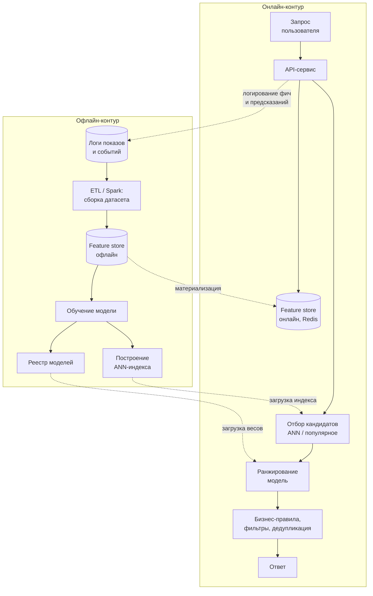

# Как проходить ML System Design

> **Зачем эта глава.** ML System Design — секция, на которой чаще всего срезаются сильные
> инженеры. Не потому, что не знают материал, а потому что не умеют его подать за 45 минут
> в условиях намеренно расплывчатой задачи. Здесь — каркас ответа, тайминг, критерии оценки
> и разбор того, чем ответ middle отличается от ответа middle+.

**Уровень:** 🎯 middle → 🧠 middle+
**Предварительно нужно:** [метрики](../02-classic-ml/04-metrics.md), [валидация](../02-classic-ml/13-validation-and-leakage.md), [сервинг](../07-mlops/05-serving-architectures.md), [мониторинг](../09-monitoring/01-what-to-monitor.md), [A/B-тесты](../06-ab-testing/01-experiment-design.md)
**Как проработать:** чтение + упражнения

---

## Карта главы

- [1. Что это за секция и что на самом деле оценивают](#1-что-это-за-секция-и-что-на-самом-деле-оценивают)
- [2. Каркас ответа и тайминг](#2-каркас-ответа-и-тайминг)
- [3. Шаг 1. Уточнение задачи](#3-шаг-1-уточнение-задачи)
- [4. Шаг 2. Метрики](#4-шаг-2-метрики)
- [5. Шаг 3. Данные](#5-шаг-3-данные)
- [6. Шаг 4. Постановка ML-задачи и бейзлайн](#6-шаг-4-постановка-ml-задачи-и-бейзлайн)
- [7. Шаг 5. Признаки и модель](#7-шаг-5-признаки-и-модель)
- [8. Шаг 6. Архитектура системы](#8-шаг-6-архитектура-системы)
- [9. Шаг 7. Оценка, выкатка, мониторинг](#9-шаг-7-оценка-выкатка-мониторинг)
- [10. Шаг 8. Риски и развитие](#10-шаг-8-риски-и-развитие)
- [11. Дизайн-док: тот же ответ, но письменно](#11-дизайн-док-тот-же-ответ-но-письменно) — структура артефакта, который просят в тестовом
- [12. Чем ответ middle+ отличается от ответа middle](#12-чем-ответ-middle-отличается-от-ответа-middle)
- [13. Подводные камни](#13-подводные-камни)
- [14. Проверь себя](#14-проверь-себя)
- [15. Практика](#15-практика)
- [16. Что читать дальше](#16-что-читать-дальше)

---

## 1. Что это за секция и что на самом деле оценивают

Вам дают одну фразу: «Спроектируйте рекомендации для маркетплейса». Или «Как бы вы сделали
антифрод?». Дальше 45–60 минут вы говорите, интервьюер задаёт уточняющие вопросы, вы рисуете
схему на доске или в miro.

Ключевое, что нужно понять: **задача намеренно недоопределена**. Это не забывчивость интервьюера,
это часть проверки. В реальной работе задачи приходят именно такими, и способность превратить
расплывчатое пожелание в инженерную постановку — и есть основной оцениваемый навык.

Что оценивают на самом деле, в порядке веса:

| Что оценивают | Как это выглядит в ответе | Вес |
|---|---|---|
| **Структурность мышления** | вы идёте по понятному плану, а не прыгаете между темами | очень высокий |
| **Постановка задачи** | вы задали правильные вопросы до того, как начали проектировать | очень высокий |
| **Связь ML с бизнесом** | ваши метрики выводятся из бизнес-цели, а не берутся с потолка | высокий |
| **Инженерная реалистичность** | вы помните про латентность, стоимость, объёмы и отказы | высокий |
| **Осознание компромиссов** | вы говорите «выберу A, потому что B дороже вот в этом» | высокий |
| **Глубина в одной-двух точках** | вы можете провалиться в деталь, когда попросят | средний |
| **Конкретные знания моделей** | вы знаете, что такое двухбашенка или LambdaMART | низкий |

Обратите внимание на последнюю строку. Кандидаты готовятся именно к ней — учат архитектуры —
и удивляются отказу. Знание моделей это входной билет, а не то, что различает кандидатов:
его имеют все прошедшие до этой секции.

> 💬 **На собеседовании.** Первое, что вы должны сделать после формулировки задачи — **не начинать
> её решать**. Хороший старт звучит так: «Прежде чем предлагать решение, я хочу уточнить несколько
> вещей и зафиксировать, что мы считаем успехом. Можно?» Это занимает десять секунд и сразу
> задаёт правильный тон. Плохой старт: «Ну, я бы взял двухбашенную модель...» — вы только что
> начали проектировать систему, не зная, для чего она.

---

## 2. Каркас ответа и тайминг

Держите в голове восемь шагов. Они образуют логическую цепочку: каждый следующий опирается
на предыдущий, и если вы её проговариваете вслух, интервьюер видит структуру мышления.

Тайминг для 45-минутной секции (для 60-минутной — растяните шаги 5–7):

| Шаг | Минуты | Признак, что пора двигаться дальше |
|---|---|---|
| 1. Уточнение | 5–7 | вы записали ограничения и цель, интервьюер кивнул |
| 2. Метрики | 4–5 | названы бизнес-метрика, ML-метрика и guardrail |
| 3. Данные | 4–5 | понятно, откуда берётся таргет и в каком объёме |
| 4. Постановка + бейзлайн | 4–5 | сформулирована ML-задача, назван неML-бейзлайн |
| 5. Признаки и модель | 7–10 | описаны группы признаков и 2 варианта модели с выбором |
| 6. Архитектура | 8–10 | нарисована схема с офлайн- и онлайн-частями |
| 7. Оценка и мониторинг | 5–7 | описан A/B и что мониторим |
| 8. Риски | 2–3 | названы 2–3 честных слабых места |

> ⚠️ **Типичная ошибка.** Потратить 25 минут на шаг 5, потому что там интересно, и не дойти
> до архитектуры и мониторинга. Это самый частый сценарий провала у сильных ML-щиков.
> Следите за временем сами — интервьюер обычно не останавливает, он просто ставит оценку.
> Если чувствуете, что увязаете: «Здесь можно углубиться, но давайте я сначала дойду
> до архитектуры целиком, а потом вернусь, если останется время». Это сильный ход.

---

## 3. Шаг 1. Уточнение задачи

Цель шага — превратить «сделайте рекомендации» в инженерное ТЗ. Вопросы задаём не подряд
по списку, а как разговор, объясняя, зачем спрашиваем.

**Блок «бизнес и пользователи».**
- Какую бизнес-задачу решаем? Что считается успехом через полгода?
- Кто пользователь и в каком контексте видит результат? (главная страница? карточка товара?
  пуш-уведомление? — это радикально меняет систему)
- Есть ли уже работающее решение и чем оно плохо?

**Блок «масштаб».** Числа нужно спросить и потом использовать — это то, что отличает
инженерный ответ от студенческого.
- Сколько пользователей, сколько активных в день? Сколько объектов в каталоге?
- Сколько запросов в секунду в пике?
- Сколько данных накоплено и за какой период?

**Блок «ограничения».**
- Бюджет латентности: сколько миллисекунд у нас есть на весь ответ?
- Онлайн или можно считать заранее батчем?
- Есть ли требования к интерпретируемости, к регуляторике, к персональным данным?
- Какая команда и какой срок? (влияет на выбор «простое сейчас» vs «правильное потом»)

**Зафиксируйте вслух итог.** Например: «Итак: маркетплейс, 20 млн MAU, 50 млн товаров,
рекомендации на главной, 3000 RPS в пике, бюджет 200 мс на ответ, цель — рост GMV,
ограничение — не показывать товары не в наличии. Правильно?»

Эта фраза стоит дорого: она показывает, что вы умеете собирать требования, и дальше вы
проектируете уже под конкретные числа, а не в вакууме.

> 🧠 **Middle+.** Сильный ход — сразу предложить **сузить задачу**: «Задача широкая. Предлагаю
> сфокусироваться на рекомендациях на главной странице для авторизованных пользователей,
> а холодный старт и e-mail-рассылку обсудить в конце, если останется время». Интервьюер
> почти всегда соглашается, а вы получаете управляемый объём и показываете умение
> приоритизировать. Middle обычно пытается охватить всё и не успевает нигде.

---

## 4. Шаг 2. Метрики

Здесь проваливаются чаще всего, потому что кандидаты начинают с ML-метрик. Правильный
порядок — сверху вниз, от бизнеса.

**Уровень 1: бизнес-метрика.** GMV, выручка, удержание, отток, экономия на ручной модерации,
потери от фрода. То, ради чего система вообще строится. Она обычно медленная и шумная,
поэтому по ней нельзя итерироваться быстро.

**Уровень 2: продуктовая (онлайн) метрика.** То, что двигается за дни и коррелирует с бизнес-целью:
CTR, конверсия в заказ, глубина просмотра, доля сессий с покупкой. Именно её обычно двигают
в A/B-тесте.

**Уровень 3: ML-метрика (офлайн).** То, что считается на отложенной выборке и по чему
выбирается модель: NDCG@10, ROC-AUC, recall@100 на стадии кандидатов, MAE.

**Уровень 4: guardrail-метрики.** То, что не должно упасть: латентность p99, доля ошибок,
разнообразие выдачи, доля запросов без результата, доля хвостовых товаров, жалобы пользователей.

Обязательно проговорите **связь между уровнями и её ненадёжность**: «Мы выбираем модель
по NDCG@10, потому что не можем гонять A/B на каждый эксперимент. Но связь офлайн-метрики
с CTR неидеальна — её нужно валидировать: собрать историю экспериментов и проверить,
что рост NDCG действительно предсказывал рост CTR. Если не предсказывает — офлайн-метрику
надо менять».

Такой абзац стоит больше, чем перечисление десяти метрик.

> 💬 **На собеседовании.** Спросят: «Почему не оптимизировать сразу бизнес-метрику?»
> Хороший ответ: потому что она приходит с задержкой (покупка может случиться через неделю),
> шумная (дисперсия огромна относительно эффекта), и на ней нельзя обучать модель — нет
> дифференцируемой связи с предсказанием. Поэтому строится лестница прокси-метрик, и главный
> риск здесь — что оптимизация прокси разойдётся с бизнес-целью. Классический пример: оптимизация
> CTR приводит к кликбейту, кликов больше, а выручка и удержание падают. Отсюда необходимость
> guardrail-метрик и долгосрочных holdout-групп.

---

## 5. Шаг 3. Данные

Три вопроса, на которые надо ответить: откуда таргет, что за признаки, сколько всего.

**Откуда берётся таргет.** Это самый важный вопрос всей секции, и его часто проскакивают.
- Естественная разметка из логов (клик, покупка, возврат) — быстро и дёшево, но **смещена**:
  мы видим отклик только на то, что показали.
- Ручная разметка — дорого, медленно, но контролируемо. Сколько нужно и кто размечает?
- Отложенная разметка — фрод подтверждается через недели, дефолт по кредиту через месяцы.
  Это меняет всё: и обучение, и мониторинг.

**Что логировать.** Отдельно проговорите, что для обучения нужны логи **показов**, а не только
кликов: без негативных примеров задача не ставится. И что логировать надо признаки в момент
предсказания, а не пересчитывать их потом — иначе получите
[train/serve skew](../07-mlops/03-data-and-feature-store.md).

**Объём и сплит.** Сколько событий в день, за какой период храним, как делим на train/valid/test.
Для почти любой продуктовой задачи сплит должен быть **временным**: обучаемся на прошлом,
проверяем на будущем. Случайный сплит завышает оценку и не воспроизводится в проде.

> ⚠️ **Типичная ошибка.** Сказать «возьмём логи кликов» и пойти дальше. Интервьюер почти
> наверняка спросит: «А как вы получите отрицательные примеры? А что с товарами, которые
> вы никогда не показывали?» Если вы сами подняли тему смещения обратной связи — вы забрали
> этот балл заранее.

---

## 6. Шаг 4. Постановка ML-задачи и бейзлайн

Теперь переводим продуктовую задачу в математическую. Здесь важно показать, что вариантов
несколько, и вы выбираете осознанно.

Пример для рекомендаций: это может быть
(а) предсказание вероятности клика для пары (пользователь, товар) — бинарная классификация;
(б) ранжирование списка — LTR;
(в) предсказание следующего товара в последовательности — next-item;
(г) предсказание uplift от показа — причинная постановка.

Скажите, какую выбираете и почему: «Начну с попарной постановки CTR-предсказания: она проще
в обучении, даёт калиброванные вероятности, что нужно для смешивания с бизнес-логикой.
Листовое ранжирование даст лучший NDCG, но усложнит пайплайн — оставлю как следующий шаг».

**Бейзлайн обязателен.** Назовите решение **без ML**: топ популярных товаров по категории,
правила «купил X — покажи аксессуары», простой BM25 для поиска, пороговое правило для фрода.
Это показывает инженерную зрелость: вы понимаете, что систему надо с чем-то сравнивать
и что ML должен окупать свою сложность.

Дальше — лестница усложнения: бейзлайн → простая ML-модель → продвинутая. И критерий перехода:
«переходим к следующему уровню, если предыдущий вышел в прод и уперся в потолок».

### Отдельный вопрос: а нужен ли здесь ML

Бейзлайн отвечает на вопрос «с чем сравнивать». Есть второй вопрос, который задают себе реже,
а он важнее: **стоит ли вообще браться**. «Не делать ML» — валидный исход шага 4, и умение
дойти до него по расчёту, а не по настроению, отличает middle+ заметнее, чем знание архитектур.

Проговаривается это тремя числами, и все три считаются за полдня по историческим данным.
Первое — **потолок**: сколько принесла бы идеальная модель. Второе — сколько уже приносит
действующее правило; разница между первым и вторым и есть весь потенциальный выигрыш, за который
идёт борьба. Третье — стоимость владения: 0.2–0.5 FTE в год на модель плюс инфраструктура.
Если требуемый прирост точности составляет заметную долю зазора до идеала, проект рискованный
независимо от того, какую модель вы выберете. Полный расчёт с формулами и числовым примером —
в главе про [жизненный цикл](../07-mlops/01-ml-lifecycle.md); там же — heuristics-first,
юнит-экономика предсказания и build vs buy.

> 💬 **На собеседовании.** Ход, который делают редко и который сразу читается как опыт: назвать
> потолок вслух до выбора модели. «Прежде чем обсуждать модели, зафиксирую верхнюю границу.
> Подозрительных операций в сутки порядка 4 тысяч, мощность ручной проверки — 1500 в сутки.
> Значит, даже всеведущая модель наберёт максимум 1500 попаданий, а текущее правило даёт
> примерно 400. Весь выигрыш, за который мы боремся, — это 1100 предотвращённых случаев в сутки;
> умножаю на средний ущерб и получаю потолок ценности. Дальше сравниваю с тем, во что обойдётся
> владение системой за год, — и только после этого выбираю постановку задачи». Плохой ответ:
> начать перечислять модели, ни разу не назвав, сколько денег в этой задаче вообще есть.

---

## 7. Шаг 5. Признаки и модель

### Признаки

Не перечисляйте признаки списком — группируйте. Группы показывают, что вы мыслите
источниками данных, а не отдельными колонками.

| Группа | Примеры | Где считается |
|---|---|---|
| Пользовательские | демография, давность регистрации, агрегаты активности за 7/30/90 дней | офлайн, обновление раз в сутки |
| Объектные | категория, цена, рейтинг, возраст, статистики популярности | офлайн + частичное обновление |
| Взаимодействия user×item | сколько раз видел, покупал ли в категории, близость эмбеддингов | онлайн |
| Контекст | время суток, день недели, устройство, гео, источник трафика | онлайн, из запроса |
| Реального времени | что смотрел в текущей сессии, последние N событий | онлайн, из стрима |

Для каждой группы полезно сказать, **когда она обновляется** — это сразу связывает признаки
с архитектурой и показывает понимание feature store.

Обязательно проговорите риски: утечка (признак, недоступный в момент предсказания), холодный
старт (что делать, когда истории нет), кардинальность (миллионы id → эмбеддинги или хеширование).

### Модель

Предложите **два-три** варианта и выберите с обоснованием. Формат ответа:

> «Для ранжирования вижу три варианта. Первый — градиентный бустинг на табличных признаках:
> быстро обучается, интерпретируем, отличный бейзлайн, инференс за единицы миллисекунд.
> Второй — нейросеть с эмбеддингами категорий: лучше работает с высокой кардинальностью
> и последовательностями, но дороже в обучении и в инференсе. Третий — двухбашенка отдельно
> на стадии кандидатов плюс бустинг на ранжировании. Я бы начал с первого, а двухбашенку
> добавил на стадию отбора кандидатов, потому что перебирать 50 млн товаров бустингом
> невозможно физически».

Последнее предложение — то, за что ставят балл: выбор продиктован ограничением, а не модой.

---

## 8. Шаг 6. Архитектура системы

Здесь рисуем схему. Она должна содержать **две части: офлайн и онлайн** — их смешение
самая частая ошибка на доске.

Проговорите по схеме четыре вещи.

**Бюджет латентности по стадиям.** Не «быстро», а числа: «200 мс всего. Сеть и сериализация ~20 мс,
получение фич из Redis ~10 мс, отбор 1000 кандидатов через HNSW ~15 мс, ранжирование 1000 объектов
бустингом ~40 мс, бизнес-правила ~5 мс. Остаётся запас на хвосты». Даже если числа приблизительные,
сам факт их называния — сильный сигнал.

**Что считается заранее, а что на лету.** Эмбеддинги товаров — офлайн, эмбеддинг пользователя —
онлайн (он зависит от текущей сессии). Агрегаты за 30 дней — офлайн. Счётчики за последний час —
из стрима.

**Обратная связь.** Стрелка «логирование фич и предсказаний» на схеме — обязательна. Без неё
нельзя ни обучать следующую версию, ни мониторить, ни разбирать инциденты.

**Отказоустойчивость.** Что показываем, если модель недоступна или отвечает дольше таймаута?
Ответ «фолбэк на популярное» звучит просто, но его отсутствие — минус.

И пятое, уже не про схему, а про речь: **называйте решения именами**. Разнесли подготовку
признаков и инференс по разным сервисам — это prep-pred; поставили дешёвую модель перед дорогой —
многоступенчатое предсказание; при перегрузке отдаёте фолбэк вместо вызова модели — prediction
circuit break; вшили веса в образ вместо выкачки при старте — model-in-image. Каталог этих имён
вместе со списком антипаттернов (всё в одном сервисе, обучающий код в сервинге, слишком много
промежуточных хранилищ, отсутствие логирования предсказаний) —
в [архитектурах сервинга](../07-mlops/05-serving-architectures.md). Имя экономит минуту
объяснений и переводит разговор на цену решения, а список антипаттернов — готовый набор реплик
на просьбу «покритикуйте вот эту схему», которую на секции задают почти всегда.

> 💬 **На собеседовании.** Спросят: «Что произойдёт при выходе из строя онлайн-хранилища признаков?»
> Хороший ответ: сервис должен деградировать, а не падать. Ставим таймаут на поход в хранилище
> (например, 20 мс), при его превышении — используем дефолтные значения признаков (те же, что
> использовались при обучении для пропусков) или переключаемся на упрощённую модель, которой
> нужны только признаки из запроса. Отдельно — метрика «доля запросов с деградацией», алерт
> на её рост. Провал: «ну тогда рекомендации не отдадим».

---

## 9. Шаг 7. Оценка, выкатка, мониторинг

**Офлайн-оценка.** Временной сплит, какая метрика, с чем сравниваем (текущая прод-модель,
а не «случайная выдача»), доверительный интервал.

**Онлайн-оценка.** A/B-тест: единица рандомизации (пользователь, а не сессия и не запрос —
иначе один человек попадёт в обе группы), длительность, MDE и размер выборки, ключевая метрика
и guardrails. Для рекомендаций обязательно упомянуть эффект новизны и то, что первые дни
показывают завышенный эффект. Подробнее — [дизайн эксперимента](../06-ab-testing/01-experiment-design.md).

**Выкатка.** Не «зальём в прод», а лестница: shadow (модель считает, но не влияет — проверяем
латентность и распределение предсказаний) → канареечная выкатка на 1–5% → постепенный ramp-up →
100%. И критерии отката на каждом шаге. См. [стратегии выкатки](../07-mlops/08-deployment-strategies.md).

**Мониторинг.** Четыре слоя: инфраструктура (латентность, ошибки, ресурсы), данные (свежесть,
доля пропусков, дрифт), модель (распределение предсказаний, метрика на отложенной разметке),
бизнес (CTR, конверсия). Обязательно скажите, **что делать при срабатывании алерта** — наличие
плана отличает инженера от теоретика. См. [мониторинг](../09-monitoring/01-what-to-monitor.md).

**Переобучение.** Как часто и по какому триггеру. Хороший ответ увязывает частоту с темпом
устаревания данных: «каталог обновляется ежедневно, поэтому эмбеддинги товаров пересчитываем
каждую ночь, а ранжирующую модель — раз в неделю, с автоматической проверкой на гейт-метрике
и ручным подтверждением перед 100%».

---

## 10. Шаг 8. Риски и развитие

Финальная минута, которую почти все пропускают, а она дёшево даёт хороший балл.

Назовите **два-три честных слабых места** вашего решения и что бы вы делали дальше:

> «Слабые места, которые я вижу. Первое: обучение на кликах даёт петлю обратной связи — модель
> будет усиливать то, что уже показывает. Лечится примесью случайной эксплорации и логированием
> позиций для коррекции позиционного биаса. Второе: холодный старт новых товаров — эмбеддинг
> из истории взаимодействий не построить, нужны контентные признаки. Третье: я оптимизирую
> клики, а бизнес-цель — GMV; это разойдётся на дешёвых кликбейтных товарах, поэтому в качестве
> guardrail нужна выручка на сессию и долгосрочный holdout».

Кандидат, который сам называет слабости своего решения, воспринимается как более зрелый,
чем тот, кто защищает своё решение как идеальное. Это контринтуитивно, но так работает.

---

## 11. Дизайн-док: тот же ответ, но письменно

Восемь шагов выше — это устный формат. Он прощает многое: интервьюер достраивает пропущенное,
интонация закрывает неуверенность, а на неудобном месте можно быстро проговорить «дальше
это уточним». Письменный формат не прощает ничего, и именно поэтому его всё чаще просят.

Три ситуации, в которых он возникает. Первая: тестовое задание формулируется как «приложите
дизайн-док на 3–5 страниц» — в российских компаниях за последние пару лет это стало массовой
практикой. Вторая: на самой секции интервьюер спрашивает «а как бы вы оформили это документом,
какие разделы там были бы?». Третья, и самая частая в реальной работе: вы приходите в команду,
и первое, что от вас хотят, — не модель, а документ, который можно обсудить до того, как
написан код.

Люди, отлично выступающие устно, проваливают письменный формат по одной причине: он обнажает то,
что в речи проскакивало незаметно. Расплывчатый объём работ, источники данных без владельцев
и без проверок, одна схема на все стадии проекта, «риски» из общих слов, отсутствие сметы.
Разберём структуру по разделам — с ответом на два вопроса про каждый: зачем он в документе
и что показывает читателю, если этот читатель — интервьюер.

| Раздел | Что внутри | Что показывает |
|---|---|---|
| Контекст и проблема | что болит, у кого, сколько это стоит сейчас — в числах | что вы начинаете с бизнеса, а не с технологии |
| **Объём: что делаем и чего НЕ делаем** | две колонки, у каждого исключения — условие возврата | умение резать задачу |
| Метрики и критерии успеха | лестница бизнес → продукт → ML → guardrail, с текущими значениями | что метрики выведены, а не перечислены |
| **Источники данных** | таблица с владельцем, задержкой, доступностью онлайн и колонкой «качество проверено» | что вы отличаете «данные есть» от «данные пригодны» |
| **Схема бейзлайна** | что включаем на второй неделе | что вы умеете выйти в прод быстро |
| **Схема MVP** | что добавляется в первой ML-версии | что вы планируете эволюцию, а не рисуете цель |
| Постановка ML-задачи и модель | 2–3 варианта, выбор с обоснованием под ограничение | осознанность выбора |
| **Дизайн пилота и критерии успеха** | единица рандомизации, MDE, пороги раскатки и отката числом | что вы не будете искать эффект задним числом |
| **Реестр рисков по этапам** | таблица «этап → риск → признак → митигация» | что вы работали в проекте, который ломался |
| **План техдолга** | что срезали, чем грозит, триггер возврата | что срезанный угол для вас обязательство, а не забывчивость |
| **Ежемесячные издержки** | смета по статьям, доминирующая статья, рычаг | инженерная зрелость, самый быстрый способ её показать |
| Открытые вопросы | что решаем позже и кто решает | честность вместо иллюзии полноты |

Полужирным отмечены разделы, которых обычно нет, — и они же те, за которые ставят балл.
Разберём каждый.

### 11.1. Объём: главное здесь — список «чего НЕ делаем»

Раздел «что делаем» есть у всех и почти бесполезен: он читается как список пожеланий. Работает
противоположный список. Причина в том, как читают документ: рецензент сверяет написанное
не с постановкой задачи, а со своими ожиданиями, и цепляется за то, чего **не нашёл**.
Явное «вне объёма» превращает молчаливое ожидание в зафиксированное решение — и снимает
половину комментариев ещё до обсуждения.

| В объёме первой версии | Вне объёма — и при каком условии вернёмся |
|---|---|
| главная страница, авторизованные пользователи, ru-регион | неавторизованные: отдаём популярное; вернёмся, если их доля выше 20% трафика |
| персонализация по истории просмотров и заказов | холодный старт новых товаров; вернёмся, когда доля товаров моложе недели превысит 10% каталога |
| батчевый пересчёт эмбеддингов раз в сутки | реакция на события текущей сессии; вернёмся после замера, сколько она даёт на A/B |
| | e-mail-рассылка и пуши — зона другой команды, отдельный документ |

Ключевая деталь: **у каждого исключения есть условие возврата, и оно наблюдаемое** — доля
трафика, доля каталога, результат замера. Без условия это не решение, а отмашка, и через месяц
вам напомнят про пункт в самый неудобный момент. Устный эквивалент этого раздела — приём
«предлагаю сузить» из [§3](#3-шаг-1-уточнение-задачи); документ отличается тем, что в нём условия возврата
записаны и на них можно сослаться.

### 11.2. Источники данных: колонка, из-за которой раздел работает

Обычный раздел «Данные» — это список таблиц. Из него нельзя извлечь ни одного риска. Рабочий
формат — таблица, где каждая строка отвечает на вопрос «что сломается из-за этого источника».

| Источник | Владелец | Что берём | История | Задержка | Онлайн | Качество проверено | Риск |
|---|---|---|---|---|---|---|---|
| `dwh.orders` | DE-платформа | факт заказа, сумма, категория | 3 года | до 06:00 следующих суток | нет | автопроверки в пайплайне: объём ±30%, доля `NULL` | пересчёт задним числом при возвратах |
| `events.views` | продуктовая аналитика | показы и клики | 90 дней | 5 минут | да, Kafka | проверено выборочно: дубли 0.3% | нет логов показов до марта |
| `catalog.items` | команда каталога | цена, категория, остаток | текущий срез | минуты | да | **нет** | нет истории: снапшот перезаписывается |
| `crm.segments` | маркетинг | сегмент клиента | 1 год | 14 дней | нет | **нет** | ручное ведение, определение сегмента менялось |

Колонка **«качество проверено»** и есть смысл всей таблицы. У неё три значения: «нет»,
«проверено выборочно (что именно и когда)», «есть автоматические проверки в пайплайне». Пустая
или «нет» — красный флаг: значит, данные вы посмотрели глазами в ноутбуке, а свойств не измеряли.
Что стоит за словом «проверено»: доля пропусков по ключевым полям и её стабильность во времени,
дубли, согласованность с независимым источником (сходятся ли суммы), ретроспективные пересчёты
и наличие истории — если снапшот перезаписывается, point-in-time-корректность построить нельзя
в принципе, и это надо обнаружить сейчас, а не на четвёртом месяце.

Строка `catalog.items` в примере выше — типичный случай: источник доступен онлайн, всё выглядит
прекрасно, но истории нет, поэтому обучающий датасет придётся собирать по текущим ценам,
и модель узнает завтрашние цены на вчерашних заказах. Это классическая утечка, и таблица
находит её за десять минут.

> ⚠️ **Типичная ошибка.** Писать дизайн-док после того, как решение принято и код наполовину
> написан, — «чтобы был документ». Такой текст бесполезен: его задача была собрать возражения
> до того, как в решение вложены недели, а он собирает их после. Признак: в разделе «варианты»
> ровно один вариант, а в реестре рисков нет ни одного, который мог бы обрушить выбранный
> подход. Документ, который нельзя опровергнуть, ничего не проверяет.

### 11.3. Две схемы, а не одна: бейзлайн и MVP

Единственная схема в документе всегда получается схемой **целевой** архитектуры — той, до
которой вы дойдёте через год. Для планирования первого месяца она бесполезна, а на секции
создаёт впечатление, что вы проектируете конечную систему, минуя всё промежуточное.

Схем должно быть две.

**Схема бейзлайна** отвечает на вопрос «что окажется в проде на второй-третьей неделе»: правило
или популярное, но **боевым путём запроса** — тот же сервис, тот же контракт, то же логирование
признаков и ответов, тот же мониторинг. ML здесь нет вовсе.

**Схема MVP** — первая версия с моделью: добавляются пайплайн обучения, реестр моделей,
онлайн-хранилище признаков, инференс.

Ключевое свойство пары: **схемы совпадают по контуру и различаются начинкой**. Если у бейзлайна
другой путь запроса — вы не проверили ничего из того, что действительно рискованно
(интеграция, латентность, логирование, доступность признаков), и первая ML-версия столкнётся
с теми же неизвестными, только на три месяца позже и дороже. Это тот же приём «сначала пустая
труба, потом модель», который разбирается в главе про
[жизненный цикл](../07-mlops/01-ml-lifecycle.md); две схемы — его письменная форма.

На секции это звучит так: «Нарисую две схемы. Первая — что выкатим через две недели: сервис
отдаёт топ популярного по категории, логирует показы и ответы, есть дашборд и фолбэк. Вторая —
что добавится в MVP: пайплайн обучения, реестр, онлайн-фичи, ранжирующая модель. Контур один
и тот же, поэтому вторая выкатка — это замена одной коробки, а не интеграционный проект».

### 11.4. Дизайн пилота и критерии его успеха

«Выкатим A/B и посмотрим» — это не план, а надежда. Пилоты проваливаются не потому, что модель
плохая, а потому, что заранее не договорились, какой результат считается успехом, и после
эксперимента начинается поиск сегмента, где эффект всё-таки есть.

Что должно быть записано **до** запуска: единица рандомизации (пользователь, а не сессия);
доля трафика и длительность; MDE и посчитанный под него размер выборки; ключевая метрика;
guardrail-метрики с порогами; правило остановки; кто принимает решение и по какому дашборду.
И главное — три исхода, а не два:

- **раскатываем**, если ключевая метрика выросла не менее чем на MDE с нужной мощностью
  и ни один guardrail не упал больше порога;
- **откатываем немедленно**, если любой guardrail пробил порог (латентность p99, доля ошибок,
  жалобы), — не дожидаясь набора мощности;
- **эффекта нет** — это тоже заранее описанный исход, и для него нужен план: обычно
  «не раскатываем, идём смотреть предзарегистрированные сегменты и разбираемся, где расходится
  офлайн-метрика с онлайновой». Без этой третьей ветки команда неизбежно начнёт искать
  положительный результат постфактум.

Детали расчёта мощности и типовые ошибки — в [дизайне эксперимента](../06-ab-testing/01-experiment-design.md).

### 11.5. Реестр рисков по этапам

Раздел «риски» обычно превращается в набор общих слов: данные могут быть плохими, модель может
не зайти. Такой список не влияет ни на одно решение. Работает таблица с привязкой к этапу
и с признаком, по которому риск опознаётся.

| Этап | Риск | Признак, что он реализовался | Что делаем заранее |
|---|---|---|---|
| Данные | таргет приходит с задержкой 14 дней | метрика за последнюю неделю неполна и «растёт» задним числом | считаем метрику со сдвигом окна, договариваемся о прокси-таргете |
| Данные | источник ведёт смежная команда и пересчитывает историю | снапшоты за одну дату расходятся между выгрузками | фиксируем версию снапшота, оформляем контракт данных |
| Продуктивизация | часть признаков недоступна онлайн | при интеграции выясняется, что 15 из 80 фич не считаются | колонка «доступен онлайн» заполняется на этапе данных, а не при интеграции |
| Продуктивизация | не влезаем в бюджет латентности | p99 на нагрузочном тесте выше SLA | замер времени инференса на целевом железе до выбора модели |
| Пилот | не хватит мощности эксперимента | доверительный интервал шире MDE при любом исходе | расчёт размера выборки до запуска, при нехватке — CUPED или более чувствительная метрика |
| Эксплуатация | молчаливая деградация | бизнес-метрика падает, алерта нет | прокси-мониторинг: дрифт, распределение предсказаний, доля фолбэков |

Привязка к этапу — не украшение. Риск «признаков нет в проде» **реализуется** на продуктивизации,
но **митигируется** на этапе данных; если не указать оба этапа, митигацию никто не сделает вовремя.
Готовый набор строк для этой таблицы — в главе про
[жизненный цикл](../07-mlops/01-ml-lifecycle.md), там разобрано, что ломается на каждой стадии.

### 11.6. План техдолга

MVP по определению состоит из сознательно срезанных углов — иначе это не MVP. Проблема
не в том, что углы срезаны, а в том, что нигде не записано, какие именно: через полгода они
неотличимы от небрежности, и никто уже не помнит, что это было решение.

| Что срезали | Почему допустимо сейчас | Чем грозит | Триггер возврата | Оценка |
|---|---|---|---|---|
| фичи считаются одним скриптом, feature store нет | модель одна, потребитель один | train/serve skew при появлении второй модели на тех же фичах | вторая модель использует хотя бы одну общую фичу | 2 недели |
| переобучение запускается руками | данные устаревают за месяц, релизов мало | забудем переобучить, узнаем от бизнеса | частота переобучения чаще раза в месяц | 1 неделя |
| нет A/B-фреймворка, сплит хардкодом | один эксперимент за раз | коллизии экспериментов, невоспроизводимые результаты | второй одновременный эксперимент | 3 недели |
| эмбеддинги пересчитываются целиком | каталог 2 млн, укладываемся в ночь | не успеем в окно | время джобы больше 4 часов | 1 неделя |

Отличие от обычного списка задач «на потом» — в колонке **«триггер возврата»**, и он обязан быть
наблюдаемым: число моделей, время джобы, число экспериментов. Формулировка «когда будет время»
означает «никогда», и это видно читателю сразу.

### 11.7. Ежемесячные издержки

Смета в дизайн-доке — самый дешёвый способ показать инженерную зрелость, и её почти никто
не пишет. Достаточно пяти строк: инференс (посчитанный по пиковому RPS, времени обработки
и целевой утилизации), хранение и логирование, онлайн-хранилище признаков, переобучение
и эксперименты, люди. Плюс три вывода одной строкой каждый: итог диапазоном, доминирующая
статья, главный рычаг её сокращения.

И обязательно — сопоставление с ценностью: годовая стоимость владения против ожидаемого эффекта.
Если система стоит дороже, чем приносит, это надо написать самому, а не ждать вопроса. Формулы
для сметы — в [стоимости и ёмкости](../07-mlops/10-cost-and-capacity.md), там же разобрано,
почему годовой TCO не равен месячному счёту, умноженному на двенадцать; порог окупаемости —
в [жизненном цикле](../07-mlops/01-ml-lifecycle.md).

> 💬 **На собеседовании.** Спросят (чаще — в тестовом задании): «Приложите к решению дизайн-док».
> Хороший документ отличается от плохого не объёмом, а наличием четырёх разделов, которых обычно
> нет: явный список «чего НЕ делаем» с условиями возврата; таблица источников с колонкой
> «качество проверено»; две схемы вместо одной — бейзлайн и MVP с одинаковым контуром; критерии
> успеха пилота, записанные числами до запуска, включая ветку «эффекта нет». Пятый, добивающий, —
> смета на месяц и сопоставление её с ожидаемым эффектом. Если формат устный, работает финальный
> ход: «Если бы я оформлял это документом, отдельными разделами были бы объём с исключениями,
> таблица источников с проверками качества, две схемы, реестр рисков по этапам, план техдолга
> и смета». Тридцать секунд, и они закрывают половину чек-листа интервьюера.
> Плохой документ: пересказ архитектуры на пять страниц без единого числа и без единого решения,
> которое можно оспорить.

---

## 12. Чем ответ middle+ отличается от ответа middle

Это то, ради чего стоит перечитать главу перед собеседованием.

| Аспект | Middle | Middle+ |
|---|---|---|
| **Старт** | начинает предлагать модели | сначала уточняет требования и фиксирует цель |
| **Метрики** | называет ROC-AUC / NDCG | строит лестницу бизнес → продукт → ML → guardrail и обсуждает разрыв между уровнями |
| **Числа** | «много данных», «быстро» | 3000 RPS, 200 мс бюджет, 50 млн товаров, 2 ТБ логов в месяц |
| **Модель** | предлагает одну, самую современную | предлагает 2–3 и выбирает под ограничение, начиная с простого |
| **Бейзлайн** | пропускает | обязательно называет решение без ML и критерий, когда ML окупается |
| **Экономика** | считает, что ML нужен по условию задачи | называет потолок ценности и стоимость владения, готов сказать «здесь ML не нужен» |
| **Архитектура** | одна коробка «модель» | разделяет офлайн/онлайн, называет бюджет по стадиям, показывает контур обратной связи |
| **Данные** | «возьмём логи» | обсуждает происхождение таргета, смещение обратной связи, логирование фич |
| **Отказы** | не упоминает | таймауты, фолбэки, деградация, что показываем при сбое |
| **Выкатка** | «выкатим и посмотрим A/B» | shadow → канарейка → ramp-up с критериями отката |
| **Мониторинг** | «будем следить за метриками» | четыре слоя, конкретные алерты, план действий по каждому |
| **Рефлексия** | защищает решение | сам называет слабости и что делал бы дальше |
| **Артефакт** | только рассказывает | держит в голове структуру дизайн-дока и в конце перечисляет её разделы |
| **Управление временем** | увязает в модели, не доходит до конца | проходит все шаги, при нехватке времени сам предлагает, что сократить |

> 🧠 **Middle+.** Отдельный признак сеньорности — умение сказать «этого делать не надо».
> Например: «Мы могли бы построить графовую модель на связях пользователей, но при текущем
> объёме данных выигрыш будет в пределах шума, а поддержка индекса дорогая. Я бы не делал этого
> сейчас и вернулся, когда упрёмся в потолок табличной модели». Middle обычно наращивает
> сложность, чтобы показать знания. Middle+ понимает, что каждая компонента системы — это
> обязательство поддерживать её годами.

---

## 13. Подводные камни

**Начали с модели.**
Симптом: через 10 минут вы описываете архитектуру нейросети, а интервьюер спрашивает
«а какую задачу мы решаем?».
Причина: рефлекс отвечать на технический вопрос технически.
Что делать: первые 5 минут — только уточнения. Заведите себе привычку не произносить название
ни одной модели до шага 4.

**Не уложились по времени.**
Симптом: секция закончилась на шаге 5, мониторинг и выкатка не обсуждались.
Причина: увязли в интересной детали.
Что делать: следить за часами, проговаривать план вслух («у нас осталось 15 минут, я быстро
пройду архитектуру и мониторинг»), уметь сжимать шаги 5 и 6 до тезисов.

**Молчание при размышлении.**
Симптом: пауза на 30 секунд, интервьюер не понимает, что происходит.
Причина: привычка думать про себя.
Что делать: озвучивать ход мысли. «Сейчас думаю, стоит ли делать отдельную стадию кандидатов.
Каталог 50 млн — значит, полный перебор невозможен, значит стадия нужна». Интервьюер оценивает
процесс, а не только результат; молчание оценить нельзя.

**Ответ «зависит» без продолжения.**
Симптом: «Какую модель выберете?» — «Зависит от данных».
Причина: страх ошибиться.
Что делать: всегда добавлять условие и выбор. «Зависит от объёма истории. При миллионах
взаимодействий — двухбашенка на кандидатах; при десятках тысяч она недообучится, и я бы взял
item-based CF с контентными признаками. Судя по названным числам, у нас первый случай,
поэтому выбираю двухбашенку».

**Игнорирование стоимости.**
Симптом: спроектирована система с онлайн-инференсом LLM на каждый запрос при 3000 RPS.
Причина: привычка думать только о качестве.
Что делать: держать в голове порядок цен. Простой прикидочный расчёт («это ~X GPU круглосуточно,
что в разы дороже текущего решения») сильно повышает оценку. См.
[стоимость и ёмкость](../07-mlops/10-cost-and-capacity.md).

**Спор с интервьюером.**
Симптом: интервьюер предлагает альтернативу, вы объясняете, почему ваш вариант лучше, и не
слышите возражение.
Причина: восприятие вопроса как атаки.
Что делать: уточняющий вопрос интервьюера — почти всегда подсказка, а не нападение. Правильная
реакция: «Интересно, давайте разберём. В каком случае ваш вариант выигрывает?» — и честно
сравнить. Умение менять решение под новыми аргументами оценивается положительно.

---

## 14. Проверь себя

<b>🎯 Вопрос.</b> С чего вы начнёте, услышав «спроектируйте систему рекомендаций»?

**Короткий ответ.** С уточнения требований и фиксации цели: бизнес-задача, место в продукте,
масштаб (пользователи, каталог, RPS), бюджет латентности, существующее решение и ограничения.
Только после этого — метрики и модели.

**Развёрнуто.** Первые 5–7 минут — сбор требований, завершающийся проговариванием итога вслух
(«итак, у нас X пользователей, Y товаров, бюджет Z мс, цель — GMV, верно?»). Отдельно полезно
предложить сузить задачу до одной поверхности. Это показывает, что вы умеете превращать
расплывчатую постановку в инженерное ТЗ — главный оцениваемый навык секции.

**Чего ждёт интервьюер:** что вы не броситесь проектировать. Многие бросаются, и это видно
сразу.

**Провал:** «Я бы взял коллаборативную фильтрацию» первой фразой.

<b>🎯 Вопрос.</b> Как выбрать метрики для ML-системы?

**Короткий ответ.** Сверху вниз: бизнес-метрика → продуктовая (онлайн) → ML-метрика (офлайн) →
guardrail-метрики. И отдельно проговорить, что связь между уровнями неидеальна и её надо
валидировать.

**Развёрнуто.** Бизнес-метрика (GMV, удержание) — то, ради чего строим, но она медленная и шумная.
Продуктовая (CTR, конверсия) — то, что двигаем в A/B. ML-метрика (NDCG@10, ROC-AUC) — то, по чему
выбираем модель офлайн. Guardrails (латентность p99, разнообразие, доля ошибок, доля хвостовых
товаров) — то, что не должно упасть. Ключевой риск — расхождение прокси с целью: оптимизация CTR
даёт кликбейт, растут клики, падает выручка. Поэтому нужны guardrails и долгосрочный holdout.
Связь офлайн↔онлайн проверяется ретроспективно по истории экспериментов.

**Чего ждёт интервьюер:** иерархию и осознание разрыва между уровнями, а не список метрик.

**Провал:** сразу назвать ROC-AUC и остановиться.

<b>🧠 Вопрос.</b> Зачем в системе рекомендаций отдельная стадия отбора кандидатов? Нельзя ли ранжировать всё?

**Короткий ответ.** Нельзя по физике: ранжирующая модель со сложными признаками стоит порядка
десятков микросекунд на объект, и при каталоге в десятки миллионов бюджет в 200 мс превышается
на три порядка. Стадия кандидатов сводит миллионы к сотням дешёвой моделью, а дорогая модель
работает только на них.

**Развёрнуто.** Это классический компромисс «recall на дешёвой стадии против precision на дорогой».
Стадия кандидатов оптимизирует recall@k (не потерять хорошие товары) и должна быть очень быстрой —
ANN-поиск по эмбеддингам, популярное, правила, недавно просмотренное. Ранжирование оптимизирует
точность порядка на уже суженном множестве и может позволить себе сотни признаков.
Важное следствие: если кандидатогенерация не вернула объект, никакое ранжирование его не спасёт —
поэтому обычно используют несколько источников кандидатов и объединяют их.

**Чего ждёт интервьюер:** расчёт «в лоб не влезает» с порядком величин, а не просто знание
слова «многостадийность».

**Провал:** «так принято делать».

<b>🎯 Вопрос.</b> Что вы будете мониторить после выката модели?

**Короткий ответ.** Четыре слоя: инфраструктура (латентность p50/p95/p99, RPS, ошибки, ресурсы),
данные (свежесть, доля пропусков, дрифт распределений), модель (распределение предсказаний,
метрика на отложенной разметке, калибровка), бизнес (CTR, конверсия, guardrails). И на каждый
алерт — план действий.

**Развёрнуто.** Ключевая сложность в том, что метрику качества модели часто нельзя посчитать
сразу: разметка приходит с задержкой или не приходит вовсе. Поэтому основная нагрузка ложится
на прокси: дрифт входных признаков, сдвиг распределения предсказаний, доля запросов с
дефолтными значениями фич, сегментные метрики. Отдельно стоит мониторить долю деградаций
(фолбэков) — она растёт раньше, чем падает бизнес-метрика. Подробнее — в главе
[что мониторить](../09-monitoring/01-what-to-monitor.md).

**Чего ждёт интервьюер:** понимания, что мониторинг ML ≠ мониторинг сервиса, и что метрики
качества обычно недоступны в реальном времени.

**Провал:** «настрою дашборд с accuracy».

<b>🧠 Вопрос.</b> Интервьюер говорит: «Ваше решение слишком сложное, у нас команда из двух человек». Что делаете?

**Короткий ответ.** Соглашаюсь и сокращаю: оставляю бейзлайн и одну ML-модель, убираю стадии,
которые не окупаются при текущем масштабе, называю, что именно откладываю и по какому критерию
вернусь к этому.

**Развёрнуто.** Это проверка на инженерную зрелость, а не на упрямство. Правильная реакция —
пересобрать решение под ограничение ресурсов вслух: «Тогда первая версия — популярное по категории
плюс бустинг на 30 признаках, батчевый пересчёт раз в сутки, без онлайн-фичей и без ANN.
Это закрывает 70% ценности за две недели. ANN и реалтайм добавляем, когда упрёмся в качество
и когда появится третий человек на поддержку». Важно назвать, что теряем и когда вернёмся.

**Чего ждёт интервьюер:** умения масштабировать решение под ресурсы и понимания, что каждая
компонента — это долг на поддержку.

**Провал:** защищать исходное решение или, наоборот, растеряться и согласиться без плана.

<b>🎯 Вопрос.</b> Откуда возьмёте отрицательные примеры для обучения?

**Короткий ответ.** Из логов показов: объекты, которые были показаны и не получили отклика.
Дополнительно — сэмплированные негативы из каталога для стадии кандидатов. И обязательно
проговорить, что такая разметка смещена: мы наблюдаем отклик только на то, что показала
предыдущая версия системы.

**Развёрнуто.** Для ранжирования негативы берут из того же показанного списка — это правильно,
потому что модель работает именно на таком распределении. Для кандидатогенерации показанных
негативов недостаточно: модель должна отличать релевантное от всего каталога, поэтому используют
in-batch negatives и сэмплирование по популярности с коррекцией. Смещение обратной связи лечится
частично: логирование позиции и коррекция позиционного биаса, небольшая доля случайной
эксплорации для получения непредвзятых данных, IPS-взвешивание.

**Чего ждёт интервьюер:** осознания разницы между негативами для двух стадий и понимания
смещения обратной связи.

**Провал:** «случайные товары, которые пользователь не покупал».

<b>🧠 Вопрос.</b> Как понять, что систему вообще стоит делать на ML?

**Короткий ответ.** ML оправдан, когда правило написать невозможно или их слишком много,
когда есть достаточно данных с обратной связью, когда цена ошибки терпима и когда выигрыш
над простым бейзлайном окупает стоимость поддержки.

**Развёрнуто.** Сильная версия ответа начинается с арифметики, а не с принципов: считаем
потолок — сколько принесла бы идеальная модель (число объектов целевого класса, умноженное
на то, что мы успеваем с ними сделать, и на ценность одного успешного действия), вычитаем то,
что уже приносит действующее правило, и сравниваем остаток со стоимостью владения в 0.2–0.5 FTE
в год плюс инфраструктура. Если требуемый прирост точности — заметная доля зазора до идеала,
проект рискованный при любой модели; полный расчёт с числовым примером —
в [жизненном цикле](../07-mlops/01-ml-lifecycle.md). Дальше идут качественные критерии.
Практический порядок: сначала строим неML-бейзлайн (правила, популярное,
эвристики) и измеряем его. Если он закрывает задачу — ML не нужен. ML начинает выигрывать,
когда зависимость сложная и меняется во времени, когда признаков много и их взаимодействия
неочевидны, когда есть поток размеченных данных. Против ML: отсутствие обратной связи,
жёсткие требования к объяснимости и детерминизму (регуляторика), очень маленькие данные,
слишком высокая цена редкой ошибки без возможности человеческой проверки. Отдельный аргумент —
стоимость владения: модель нужно переобучать, мониторить, чинить; правило — нет.

**Чего ждёт интервьюер:** что вы не считаете ML самоцелью.

**Провал:** не рассматривать альтернативу ML вообще.

<b>🧠 Вопрос.</b> Из каких разделов состоит ваш дизайн-док на ML-систему?

**Короткий ответ.** Контекст и проблема в числах; объём с явным списком «чего НЕ делаем»
и условиями возврата; метрики лестницей; таблица источников данных с владельцем, задержкой,
доступностью онлайн и колонкой «качество проверено»; **две** схемы — бейзлайна и MVP;
постановка задачи с вариантами; дизайн пилота с числовыми критериями раскатки и отката;
реестр рисков по этапам; план техдолга с триггерами возврата; смета на месяц; открытые вопросы.

**Развёрнуто.** Разделы, которых обычно нет, и они же самые ценные. «Чего не делаем» работает
потому, что рецензент цепляется не за написанное, а за то, чего не нашёл; у каждого исключения
должно быть наблюдаемое условие возврата, иначе это отмашка. Колонка «качество проверено»
отличает «данные есть» от «данные пригодны»: она ловит источники без истории, с ретроспективными
пересчётами и с нестабильной долей пропусков. Две схемы нужны, потому что одна всегда вырождается
в целевую архитектуру через год; бейзлайн и MVP обязаны совпадать по контуру и различаться
начинкой — тогда вторая выкатка не превращается в интеграционный проект. У пилота должно быть
три исхода, а не два: раскатываем, откатываем и «эффекта нет» с заранее написанным планом,
иначе команда будет искать положительный результат постфактум. В плане техдолга ключевая
колонка — триггер возврата, наблюдаемый (число моделей, время джобы), а не «когда будет время».

**Чего ждёт интервьюер:** что документ для вас инструмент собрать возражения **до** написания
кода, а не отчётность после. Признак обратного — раздел «варианты» с одним вариантом и риски,
ни один из которых не способен обрушить выбранное решение.

**Провал:** перечислить «введение, архитектура, заключение».

---

## 15. Практика

**Задача 1. Прогон по каркасу (45 минут, с таймером).**
Возьмите формулировку «Спроектируйте систему определения спама в отзывах на маркетплейсе»
и пройдите все восемь шагов вслух, засекая время по таблице из [§2](#2-каркас-ответа-и-тайминг). Записывайте себя на диктофон.
*Критерий: вы уложились в 45 минут и дошли до шага 8. Прослушайте запись — посчитайте,
сколько раз вы сказали «наверное» и «как-то так»; цель на второй прогон — ноль.*

**Задача 2. Разбор своей записи (30 минут).**
Прослушайте запись из задачи 1 с таблицей из [§12](#12-чем-ответ-middle-отличается-от-ответа-middle) в руках и отметьте для каждой строки,
на каком вы уровне.
*Критерий: вы нашли минимум три строки, где ответ был на уровне middle, и знаете, что сказать
в следующий раз.*

**Задача 3. Числа наизусть (20 минут).**
Составьте себе шпаргалку порядков величин: сколько миллисекунд стоит поход в Redis, в Postgres,
в ANN-индекс; сколько объектов в секунду обрабатывает бустинг на 100 признаках; сколько стоит
час GPU; сколько строк в сутки даёт сервис на 1000 RPS.
*Критерий: вы можете назвать любую из этих величин с точностью до порядка, не задумываясь.
Это единственная часть подготовки, которую действительно стоит заучить.*

**Задача 4. Дизайн-док на четыре страницы (2 часа).**
Возьмите кейс из задачи 1 и оформите его документом по структуре [§11](#11-дизайн-док-тот-же-ответ-но-письменно). Обязательны:
таблица «в объёме / вне объёма» с условиями возврата, таблица источников данных с колонкой
«качество проверено», две схемы (бейзлайн и MVP), критерии успеха пилота числами и смета
на месяц. Затем отдайте текст коллеге с одной просьбой: отметить всё, с чем можно поспорить.
*Сделано правильно: коллега нашёл минимум три места, где ваше решение можно оспорить по существу
(а не «непонятно написано»). Документ, к которому нет содержательных возражений, ничего
не проверил — скорее всего, вы описали архитектуру вместо того, чтобы принять решения.*

**Задача 5. Расчёт «нужен ли здесь ML» (40 минут).**
Для того же кейса посчитайте три числа: ценность идеальной модели, ценность действующего
решения без ML и стоимость владения за год. Сформулируйте вслух за одну минуту вывод «делать /
не делать» со всеми допущениями.
*Сделано правильно: вы называете конкретный требуемый прирост метрики и можете сказать, какое
из допущений вы знаете хуже всех и при какой его ошибке вывод меняется на противоположный.*

**Задача 6. Кейсы (по 1 часу каждый).**
Пройдите все кейсы раздела: сначала самостоятельно по каркасу за 40 минут, потом сверьтесь
с разбором и отметьте, что упустили.
*Критерий: к четвёртому кейсу список упущенного сокращается вдвое — значит, каркас усвоен.*

---

## 16. Что читать дальше

- **Chip Huyen. «Designing Machine Learning Systems» (O'Reilly, 2022)** — лучшая книга по теме
  на сегодня. Главы про постановку задачи, feature engineering и мониторинг закрывают шаги 1–3 и 7.
- [Google. «Rules of Machine Learning: Best Practices for ML Engineering»](https://developers.google.com/machine-learning/guides/rules-of-ml) —
  43 правила, выведенных из практики. Правила 1–10 стоит выучить: они ровно про то, что
  проверяется на этой секции.
- [Sculley et al. «Hidden Technical Debt in Machine Learning Systems» (NeurIPS 2015)](https://papers.nips.cc/paper/2015/hash/86df7dcfd896fcaf2674f757a2463eba-Abstract.html) —
  почему ML-система дороже в поддержке, чем кажется. Аргументы отсюда очень уместны в шаге 8.
- [Eugene Yan. «Applied ML» (подборка инженерных разборов от компаний)](https://github.com/eugeneyan/applied-ml) —
  сотни реальных описаний production-систем. Лучший источник конкретных чисел и архитектур.
- **Kohavi, Tang, Xu. «Trustworthy Online Controlled Experiments»** — для шага 7; см. также
  [раздел про A/B](../06-ab-testing/01-experiment-design.md).

---

🏠 [Оглавление](../index.md) | ➡️ [Кейс: лента рекомендаций](02-case-feed-ranking.md)
