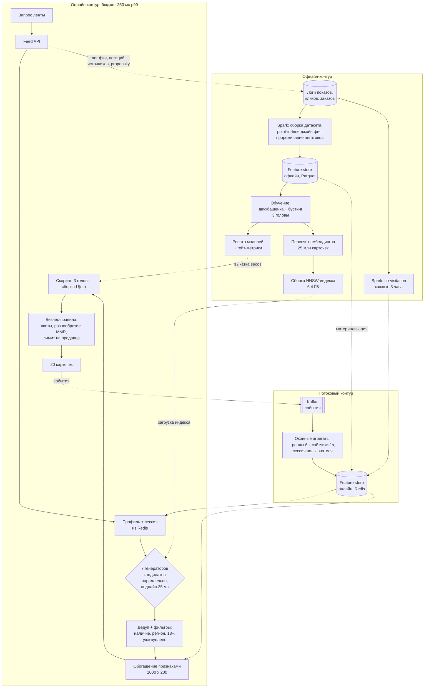

# Кейс: лента рекомендаций

> **Зачем эта глава.** Это полный разбор ответа на самую частую задачу ML System Design —
> персонализированную ленту. Разбор идёт ровно по [каркасу из восьми шагов](01-framework.md),
> с конкретными числами, схемой архитектуры и бюджетом латентности. После главы вы сможете
> пройти этот кейс за 45 минут, не пропустив ни одного шага, и знать, куда интервьюер будет
> копать дальше.

**Уровень:** 🎯 middle → 🧠 middle+
**Предварительно нужно:** [каркас ответа](01-framework.md), [основы рекомендаций](../06-recsys/01-recsys-foundations.md), [двухбашенные модели и ANN](../06-recsys/06-two-tower-and-ann.md), [обучение ранжированию](../06-recsys/07-learning-to-rank.md), [холодный старт и смещения](../06-recsys/12-cold-start-and-bias.md)
**Время на проработку:** ~2.5 часа (самостоятельный прогон + сверка с разбором)

---

## Карта главы

- [0. Задача, как её даёт интервьюер](#0-задача-как-её-даёт-интервьюер)
- [1. Шаг 1. Уточняющие вопросы и ответы](#1-шаг-1-уточняющие-вопросы-и-ответы)
- [2. Шаг 2. Метрики](#2-шаг-2-метрики)
- [3. Шаг 3. Данные](#3-шаг-3-данные)
- [4. Шаг 4. Постановка ML-задачи и бейзлайн](#4-шаг-4-постановка-ml-задачи-и-бейзлайн)
- [5. Шаг 5. Признаки и модель](#5-шаг-5-признаки-и-модель)
- [6. Шаг 6. Архитектура](#6-шаг-6-архитектура)
- [7. Шаг 7. Оценка, выкатка, мониторинг](#7-шаг-7-оценка-выкатка-мониторинг)
- [8. Шаг 8. Риски и развитие](#8-шаг-8-риски-и-развитие)
- [9. Куда обычно копает интервьюер](#9-куда-обычно-копает-интервьюер)
- [10. Подводные камни](#10-подводные-камни)
- [11. Проверь себя](#11-проверь-себя)
- [12. Практика](#12-практика)
- [13. Что читать дальше](#13-что-читать-дальше)

---

## 0. Задача, как её даёт интервьюер

> «Спроектируйте персонализированную ленту на главной странице маркетплейса — бесконечный
> скролл карточек товаров и контента продавцов».

Всё. Больше вам ничего не скажут, и это нормально: недоопределённость — часть задания.

---

## 1. Шаг 1. Уточняющие вопросы и ответы

Дальше весь разбор опирается на числа из этого раздела. Спрашиваем не подряд по списку,
а объясняя, зачем нам ответ.

**«Где именно живёт лента и что в ней за объекты?»** — Главная страница мобильного приложения
и веба, бесконечный скролл, страница по 20 карточек. Объекты разнородные: товарные карточки
(90% слотов) и короткие видео/подборки продавцов (10%). В этом разборе фокусируемся на товарных
карточках, смешивание форматов обсудим в конце.

**«Какая бизнес-цель?»** — Рост GMV на активного пользователя и удержание. Ленту недавно завели,
сейчас там сортировка по популярности категорий, которые пользователь смотрел; она даёт CTR 2.1%.

**«Масштаб?»** — 40 млн MAU, 12 млн DAU. Каталог: 80 млн офферов, но показывать можно только
те, что в наличии, прошли модерацию и доставляются в регион пользователя — это ~25 млн карточек.
Новых карточек 300 тыс. в сутки, из них 40 тыс. от продавцов без истории.

**«Сколько запросов?»** — 12 млн DAU × 3.5 сессии × 4 подгрузки ленты ≈ 170 млн запросов в сутки.
Средний RPS ≈ 2000, вечерний пик ≈ 6000 RPS.

**«Бюджет латентности?»** — На отрисовку первого экрана в приложении даётся 800 мс, бэкенду
ленты из них выделено **250 мс по p99**. Больше — и пользователь видит спиннер.

**«Что уже есть в инфраструктуре?»** — Kafka с потоком событий (задержка до потребителя 3–5 с),
Spark на HDFS, онлайн-хранилище признаков на Redis, сервис ANN-поиска. Команда: 4 ML-инженера
и 1 дата-инженер.

**«Есть ли ограничения продукта?»** — Не показывать товары не в наличии и вне зоны доставки,
не показывать 18+ без подтверждения возраста, не более 3 карточек одного продавца в экране
из 20, обязательная квота на новые товары (продуктовая команда договорилась с продавцами).

**Проговариваем итог вслух:**

> «Итак: главная страница маркетплейса, бесконечный скролл по 20 карточек, 12 млн DAU,
> 25 млн показываемых карточек, 6000 RPS в пике, 250 мс p99, цель — GMV на пользователя
> и удержание, текущий бейзлайн даёт CTR 2.1%, жёсткие фильтры по наличию и региону.
> Предлагаю сфокусироваться на товарных карточках для авторизованных пользователей,
> а анонимов и смешивание форматов обсудить в конце. Идёт?»

> 💬 **На собеседовании.** Числа нужны не для красоты. Дальше вы будете говорить «25 млн
> кандидатов бустингом не перебрать» и «6000 RPS × 1000 кандидатов = 6 млн скорингов в секунду,
> значит скоринг должен стоить меньше микросекунды на объект» — и каждое такое утверждение
> опирается на то, что вы спросили в первые пять минут. Кандидат, который не спросил масштаб,
> не может обосновать ни одного архитектурного решения; он их просто называет.

---

## 2. Шаг 2. Метрики

Строим лестницу сверху вниз и сразу проговариваем, где связь между уровнями рвётся.

| Уровень | Метрика | Почему она здесь |
|---|---|---|
| Бизнес | GMV на активного пользователя за неделю; удержание D28 | ради этого лента и делается |
| Продуктовая (онлайн) | заказы на пользователя за неделю; доля сессий с добавлением в корзину; CTR ленты; глубина скролла | двигается за 1–2 недели, по ней принимаем решение в A/B |
| ML (офлайн) | NDCG@20 по градуированной релевантности; recall@1000 на стадии кандидатов; logloss на клике | по ней выбираем модель без A/B |
| Guardrail | p99 латентности; доля уникальных продавцов в топ-20; доля свежих карточек (возраст < 7 дней); доля показов из хвоста каталога; доля скрытий и жалоб; доля отмен и возвратов | не должно упасть |

**Почему не оптимизируем GMV напрямую.** GMV на пользователя — метрика с чудовищной дисперсией:
коэффициент вариации на маркетплейсе легко достигает 3–5, потому что распределение чеков
тяжелохвостое. Посчитаем нужный размер выборки для относительного MDE в 1%:

$$
n \;\approx\; \frac{16\,\mathrm{CV}^2}{\delta_{\text{rel}}^2}
\;=\; \frac{16 \cdot 3^2}{0.01^2}
\;=\; 1.44 \cdot 10^{6} \text{ пользователей на группу}
$$

где $n$ — размер одной группы, $\mathrm{CV} = \sigma/\mu$ — коэффициент вариации метрики
по пользователям, $\delta_{\text{rel}}$ — относительный минимальный детектируемый эффект,
множитель 16 — стандартное приближение для мощности 80% и уровня значимости 5% при двустороннем
критерии. Полтора миллиона на группу мы наберём, но не за один эксперимент и не быстро.
А **заказы на пользователя** имеют CV ≈ 2.2, и при MDE 2% нужно уже ~200 тыс. на группу.
Отсюда практическое решение: ключевая метрика A/B — заказы на пользователя, GMV смотрим
как подтверждающую и мониторим на длинном holdout.

**Где связь рвётся.** Мы обучаем модель на клике, выбираем её по NDCG@20, принимаем решение
по заказам, а хотим GMV и удержание. Три разрыва подряд:

1. **Клик ≠ заказ.** Оптимизация клика вытаскивает наверх дешёвый и «залипательный» товар.
   Лечится многозадачной постановкой (см. шаг 4) и guardrail-метрикой «средний чек».
2. **NDCG@20 ≠ онлайн.** Офлайн-метрика считается на логах, порождённых прошлой моделью,
   и систематически завышает качество моделей, похожих на прошлую. Связь нужно **проверять
   ретроспективно**: собрать 15–20 прошедших A/B и посмотреть, предсказывал ли рост NDCG рост
   заказов. Если корреляция ниже 0.5 — офлайн-метрику надо менять.
3. **Неделя ≠ полгода.** Лента может поднять заказы сейчас и посадить удержание за счёт
   однообразия. Отсюда обязательный **долгосрочный holdout**: 1% пользователей на 3 месяца
   получают старую версию.

> 💬 **На собеседовании.** Спросят: «Почему CTR — плохая ключевая метрика для ленты маркетплейса?»
> Хороший ответ: CTR измеряет намерение посмотреть, а не намерение купить, и легко накручивается
> кликбейтными карточками, агрессивными скидочными плашками и дешёвым товаром. На маркетплейсе
> связь CTR с GMV нелинейна: рост CTR на 15% при падении конверсии клика в заказ на 20% даёт
> минус в выручке. CTR полезен как быстрый диагностический сигнал (он двигается за часы и имеет
> низкую дисперсию), но решение принимается по заказам и GMV. Провал: назвать CTR ключевой
> метрикой и не упомянуть ни одного guardrail.

---

## 3. Шаг 3. Данные

**Откуда таргет.** Из логов взаимодействий, с иерархией сигналов по силе:

| Событие | В сутки | Сила сигнала | Задержка |
|---|---|---|---|
| Показ (viewability: ≥50% площади ≥1 с) | 3.4 млрд | негатив по умолчанию | мгновенно |
| Клик по карточке | 72 млн | слабый позитив | секунды |
| Добавление в избранное / корзину | 9 млн | средний позитив | минуты |
| Заказ | 3 млн | сильный позитив | часы |
| Отмена / возврат | 180 тыс. | **негатив, отменяющий позитив** | 3–30 дней |
| Скрытие карточки, жалоба | 400 тыс. | явный негатив | мгновенно |

Обратите внимание на последние две строки. Возврат приходит через недели — если его не учитывать,
модель будет продвигать товары с плохим качеством, которые хорошо продаются один раз. Практика:
считать таргет заказа «созревшим» через 14 дней и держать две версии обучающей выборки — свежую
(для быстрых итераций по клику) и созревшую (для головы «заказ»).

**Смещение обратной связи — говорим об этом сами, не дожидаясь вопроса.**

- **Selection bias:** мы наблюдаем отклик только на то, что показала прошлая версия системы.
  Товар, ни разу не попавший в кандидаты, не имеет ни одного лога — и модель никогда не научится
  его показывать. Это самоусиливающаяся петля.
- **Position bias:** карточка на позиции 1 получает в 4–6 раз больше кликов, чем та же карточка
  на позиции 15, независимо от релевантности. Обязательно логируем **позицию** и учитываем её
  (см. §9, вопрос 3).
- **Presentation bias:** карточка с большой скидочной плашкой кликается лучше — модель выучит
  «скидка = релевантность».

Частичное лечение: **2% слотов отдаём под случайную эксплорацию** из отфильтрованного каталога
и логируем `is_exploration=true` и propensity показа. Эти 2% — единственные непредвзятые данные
в системе; на них считаются честные оценки и калибруются IPS-веса.

**Что логировать в момент предсказания.** Не «клики», а полный контекст: `request_id`,
`user_id`, `item_id`, `position`, `candidate_source` (какой генератор кандидатов вернул объект),
`rank_in_source`, **вектор признаков ровно в том виде, в каком его увидела модель**,
`model_version`, `experiment_bucket`, `is_exploration`, `propensity`. Пересчитывать признаки
задним числом нельзя: агрегаты изменятся, и вы получите
[train/serve skew](../07-mlops/03-data-and-feature-store.md), который потом неделю ищут.

Объём: 3.4 млрд показов в сутки × ~180 байт полезной нагрузки после упаковки в Parquet
с колоночным сжатием ≈ 120–150 ГБ в сутки. За 8 недель обучающего окна — около 8 ТБ.
Это укладывается в Spark-кластер, но по сырым показам обучать не нужно: негативы прореживаем
(об этом ниже).

**Схема сплита.** Только временная и только по пользователям одновременно:

```
|---------- train: 8 недель ----------|--valid: 3 дня--|--gap 1 день--|--test: 4 дня--|
```

- Разрыв (`gap`) нужен, чтобы «созревающие» таргеты (заказ, возврат) из валидации не протекли
  в трейн через агрегаты.
- Дополнительно держим **срез холодных объектов**: карточки, появившиеся после начала теста.
  На них меряем отдельно — общая метрика их полностью маскирует, их доля в показах ~3%.
- Случайный сплит здесь запрещён: он даёт +5–8 пунктов NDCG иллюзии за счёт того, что модель
  видит будущие взаимодействия того же пользователя.

---

## 4. Шаг 4. Постановка ML-задачи и бейзлайн

### Постановка

Лента — это не одна задача, а конвейер из двух с разными постановками.

**Стадия кандидатов** — задача **максимизации полноты (recall)**: из 25 млн отобрать ~1000 так,
чтобы среди них оказались почти все объекты, которые заслуживают топ-20. Метрика — recall@1000
относительно объектов, с которыми пользователь реально провзаимодействовал. Формально это задача
поиска ближайших соседей в выученном пространстве, а не классификация.

**Стадия ранжирования** — задача **точности порядка** на 1000 объектах. Здесь я выбираю
**многозадачную (multi-task) поточечную постановку**: модель предсказывает несколько голов,
а итоговая полезность собирается из них явной формулой.

$$
U(u, i) \;=\; \hat p_{\text{click}}(u,i)\cdot\Big[\,w_1 \;+\; w_2\,\hat p_{\text{order}\mid\text{click}}(u,i)\cdot \tilde m_i \;-\; w_3\,\hat p_{\text{hide}}(u,i)\,\Big]
$$

где $u$ — пользователь, $i$ — карточка, $\hat p_{\text{click}}$ — вероятность клика по показу,
$\hat p_{\text{order}\mid\text{click}}$ — вероятность заказа при условии клика,
$\tilde m_i$ — нормированная ожидаемая маржа с карточки (логарифм, приведённый к $[0,1]$,
чтобы дорогой хвост не подавил всё остальное), $\hat p_{\text{hide}}$ — вероятность скрытия
или жалобы, $w_1, w_2, w_3 \ge 0$ — весовые коэффициенты.

> 📐 **Разбор формулы.** Множитель $\hat p_{\text{click}}$ вынесен за скобку не случайно:
> без клика ни заказа, ни скрытия не будет, поэтому все остальные события условны по клику.
> Внутри скобки — «ценность клика»: базовая единица $w_1$ (пользователь посмотрел карточку —
> это само по себе полезно для вовлечения) плюс ожидаемая денежная отдача минус штраф за
> раздражение. Веса $w_1, w_2, w_3$ — это **не гиперпараметры обучения**, их нельзя подобрать
> на валидации: они выражают, сколько бизнес готов заплатить вовлечением за рубль маржи.
> Их подбирают серией A/B, и это честно проговаривается интервьюеру.

Почему не listwise-обучение сразу? LambdaMART даст +2–4% NDCG, но ломает главное свойство
поточечной схемы: **калиброванные вероятности**, которые можно смешивать с деньгами и
бизнес-правилами. Начинаем с поточечной, listwise-дообучение оставляем на второй итерацию.

### Бейзлайн без ML

Обязательно называем: **топ карточек по числу заказов за 48 часов внутри трёх категорий,
где пользователь взаимодействовал за последние 30 дней, с фильтрами и дедупликацией по продавцу.**
Реализуется одним batch-джобом и Redis, поднимается за неделю. Именно с ним, а не со случайной
выдачей, сравниваются все ML-версии.

### Лестница усложнения

| Уровень | Кандидаты | Ранжирование | Ожидаемый эффект | Срок |
|---|---|---|---|---|
| 0 | популярное по категориям интереса | сортировка по популярности | текущий CTR 2.1% | есть |
| 1 | + co-visitation item2item | бустинг, 60 признаков, 1 голова (клик) | +15–25% CTR | 4–6 недель |
| 2 | + ALS/двухбашенка через HNSW | бустинг, 200 признаков, 3 головы | +10–15% заказов | 2–3 месяца |
| 3 | + сессионная модель (SASRec) | нейросеть с вниманием к истории, MMoE | +3–7% заказов | 4–6 месяцев |

Критерий перехода на следующий уровень — **предыдущий доехал до 100% трафика и его прирост
вышел на плато**, а не «мы уже прочитали статью про SASRec».

> 🧠 **Middle+.** Сильный ход — назвать, чего вы делать **не** будете на первой итерации:
> «Графовую модель на биграфе user-item я бы сейчас не строил: при 25 млн карточек и текущем
> объёме взаимодействий выигрыш LightGCN над ALS в статьях порядка нескольких процентов recall,
> а поддержка графового индекса и его пересчёта — это отдельный человек на постоянной основе.
> Вернусь к этому, когда упрёмся в потолок двухбашенки».

---

## 5. Шаг 5. Признаки и модель

### Источники кандидатов — сердце ленты

Это то место, где кейс ленты отличается от кейса поиска. В поиске есть запрос, задающий
намерение. В ленте намерения нет, поэтому **множество кандидатов приходится собирать из
нескольких принципиально разных гипотез о том, что человеку нужно**.

| Источник | Гипотеза | Сколько отдаёт | Как строится | Где хранится |
|---|---|---|---|---|
| Co-visitation item2item | «похоже на то, что смотрел час назад» | 250 | Spark по сессиям, пересчёт каждые 3 ч | Redis, ключ = item_id |
| Двухбашенка user → item | долгосрочный вкус | 300 | эмбеддинги офлайн, поиск HNSW | ANN-индекс, 25 млн векторов ×128 fp16 = 6.4 ГБ |
| Сессионная модель (SASRec на 20 последних событиях) | «что дальше в этой сессии» | 200 | энкодер онлайн, поиск по тому же индексу | ANN-индекс |
| Тренды за 6 часов в категориях интереса | свежесть и сезонность | 150 | стрим из Kafka, окно 6 ч | Redis, ключ = (категория, гео) |
| Явные намерения | брошенная корзина, избранное, недокупленное | 50 | из профиля пользователя | Redis, ключ = user_id |
| Популярное по гео и категории | фолбэк и холодный старт | 100 | батч раз в сутки | Redis |
| Эксплорация | сбор непредвзятых данных, холодный старт карточек | 20 | стрим новых + контентная модель | Redis |

Итого ~1070 сырых, после дедупликации и фильтров — 850–1000 уникальных кандидатов.

**Как объединять?** Здесь middle обычно отвечает «взвешенная сумма скоров источников», и это
неправильный ответ. Скоры источников **несравнимы**: косинус двухбашенки, вероятность
co-visitation и счётчик трендов живут в разных шкалах, и любые веса будут подгонкой.

Правильный ответ: **объединение — это множество (union), а не смесь**. Дедуплицируем по `item_id`,
а информацию об источниках передаём в ранжирующую модель как признаки:
`came_from_i2i` (0/1), `rank_in_i2i`, `score_in_i2i` (нормированный внутри источника),
и так по каждому из семи. Ранжирующая модель сама выучивает, какому источнику доверять
в каком контексте — и делает это лучше, чем ручные веса, потому что учитывает контекст
пользователя.

Отдельно — **квоты как ограничение, а не как вес**: минимум 40 кандидатов от эксплорации
и трендов должны дойти до финальной выдачи ленты, иначе свежие карточки никогда не наберут
статистики. Квота реализуется на стадии бизнес-правил, а не подкруткой скора.

> ⚠️ **Типичная ошибка.** Ставить дорогой источник кандидатов последовательно за дешёвым
> («сначала спросим Redis, потом ANN»). Все источники нужно запускать **параллельно** с общим
> дедлайном: ждём 35 мс, кто не успел — тот не участвует, а его отсутствие логируется.
> Последовательный вызов семи источников по 10 мс — это 70 мс из 250, треть бюджета на пустом месте.

### Признаки для ранжирования

| Группа | Примеры | Где считается | Обновление |
|---|---|---|---|
| Пользовательские (~40) | давность регистрации, средний чек, число заказов за 30/90 дней, доля категорий в истории, ценовой сегмент | офлайн Spark → Redis | раз в сутки |
| Объектные (~60) | категория, бренд, цена и её перцентиль внутри категории, рейтинг, число отзывов, возраст карточки, CTR и CR карточки за 1/7/30 дней со сглаживанием, доля возвратов, рейтинг продавца | офлайн + стрим для счётчиков за 1 ч | сутки / 5 мин |
| Пара user×item (~50) | видел ли раньше и сколько раз, покупал ли в этой категории/у этого продавца, косинус эмбеддингов, отношение цены к среднему чеку пользователя, расстояние до последнего просмотренного товара | онлайн, часть в момент запроса | реальное время |
| Контекст (~20) | час, день недели, платформа, гео, номер подгрузки ленты, длина сессии, источник входа | онлайн из запроса | реальное время |
| Сессионные (~20) | последние 20 просмотров, среднее по их эмбеддингам, категории текущей сессии, была ли покупка в сессии | онлайн из стрима, задержка 3–5 с | реальное время |
| Источниковые (~14) | из какого генератора пришёл, ранг и скор внутри источника | онлайн, бесплатно | реальное время |

Про **счётчики CTR карточки** отдельно: их нельзя брать сырыми. Карточка с 2 показами и 1 кликом
имеет CTR 50% — модель на это купится. Нужно байесовское сглаживание:

$$
\widehat{\text{CTR}}_i \;=\; \frac{c_i + \alpha \cdot \text{CTR}_{\text{cat}(i)}}{s_i + \alpha}
$$

где $c_i$ — число кликов по карточке $i$, $s_i$ — число показов, $\text{CTR}_{\text{cat}(i)}$ —
средний CTR её категории, $\alpha$ — сила априорного распределения (на практике 50–200 показов,
подбирается по валидации). При $s_i \gg \alpha$ формула даёт сырой CTR, при $s_i \to 0$ —
среднее по категории.

**Риски по признакам, которые надо назвать самому:** утечка (не использовать счётчики, посчитанные
включая текущее событие — обязательно point-in-time корректность), холодный старт (для карточки
младше 100 показов все поведенческие счётчики — это её категория; поэтому нужен флаг `is_cold`
и контентные эмбеддинги из фото и текста), кардинальность (`seller_id` — 700 тыс. значений,
one-hot невозможен, идут эмбеддинги или target-статистики в стиле CatBoost).

### Модель

**Вариант A. Градиентный бустинг, три отдельные модели (клик, заказ|клик, скрытие).**
Плюсы: обучается за 40 минут на сэмпле, инференс 1000 объектов за 10–15 мс на 4 потоках,
устойчив к пропускам, отлично работает с табличными признаками, тривиально отлаживается.
Минусы: не умеет последовательности, плохо с высокой кардинальностью, три модели = три пайплайна.

**Вариант B. Нейросеть с эмбеддингами и общим стволом (MMoE-подобная многозадачность).**
Плюсы: одна модель на три головы, разделяемое представление, естественная работа
с `seller_id`/`brand_id` через эмбеддинги, можно приделать внимание к истории (DIN).
Минусы: обучение сутки на GPU, инференс дороже, требует онлайн-сервинга модели и мониторинга
эмбеддингов.

**Вариант C. Бустинг поверх эмбеддингов из нейросети.** Компромисс: нейросеть считает
представление пользователя и карточки офлайн, бустинг ест их как 32 числа плюс табличные признаки.

**Выбор: начинаю с A, целюсь в B.** Обоснование — не «B современнее», а: у нас 4 инженера и
работающего ML в ленте пока нет вообще. Вариант A даёт 80% прироста за 20% усилий, даёт
калиброванные вероятности из коробки и позволяет за месяц выйти в A/B. Переход к B оправдан,
когда (а) число признаков перевалит за 250 и ручной feature engineering выдохнется,
(б) появится задача учитывать порядок событий в сессии, которую бустинг не решает признаками.

---

## 6. Шаг 6. Архитектура



### Бюджет латентности по стадиям

Складываем и проверяем, что влезаем. Числа — для p99, не для среднего.

| Стадия | мс | Комментарий |
|---|---|---|
| Сеть, аутентификация, парсинг | 15 | |
| Профиль + сессия из Redis (один pipeline-запрос) | 20 | 1 round-trip вместо 5 отдельных |
| Инференс сессионного энкодера | 12 | трансформер 4 слоя, $d=128$, длина 20, батч 1, CPU |
| 7 генераторов параллельно | 35 | ждём максимум, дедлайн жёсткий; HNSW при `ef=200` на 25 млн — 12–18 мс |
| Дедупликация и фильтры | 10 | битовые маски наличия и региона в памяти процесса |
| Обогащение признаками 1000 карточек | 25 | item-признаки — из in-process кэша (обновляется раз в 5 мин), не из сети |
| Скоринг 3 голов бустингом | 30 | 1000 × 500 деревьев × глубина 8 ≈ 4 млн обходов узлов на голову; 4 потока |
| Бизнес-правила, MMR, квоты | 15 | |
| Сериализация | 10 | |
| **Сумма** | **172** | запас 78 мс на хвосты GC и сетевые всплески |

> 🧠 **Middle+.** Проверьте вслух ещё и **пропускную способность**, не только латентность:
> 6000 RPS × 1000 кандидатов = 6 млн скорингов в секунду. При 30 мс на 1000 объектов на 4 ядрах
> одна машина держит ~130 запросов/с, значит нужно ~50 машин на пик плюс запас — это порядка
> 400 ядер только на ранжирование. Такой расчёт занимает 20 секунд и мгновенно отличает того,
> кто считал, от того, кто рисовал.

### Что считается заранее, а что на лету

- **Заранее (ночью):** эмбеддинги карточек, HNSW-индекс, агрегаты пользователя за 30/90 дней,
  популярное по гео, веса моделей.
- **Заранее (каждые 3 часа):** таблица co-visitation.
- **Стримом (задержка 3–5 с):** счётчики за час, тренды за 6 часов, последние события сессии.
- **На лету:** эмбеддинг пользователя из сессионной модели, все признаки пары user×item,
  контекст, финальный скоринг.

Ключевое правило: **эмбеддинг карточки — офлайн, эмбеддинг пользователя — онлайн**. Карточек
25 млн и они меняются медленно; пользователей 12 млн в сутки, и их состояние меняется каждым
кликом. Обратное распределение (эмбеддинг пользователя раз в сутки) убивает реактивность ленты —
это самая частая архитектурная ошибка в этом кейсе.

### Фолбэки

| Что отказало | Что делаем | Как видно на мониторинге |
|---|---|---|
| ANN-индекс не отвечает | генератор выбывает по дедлайну, работаем на оставшихся шести | `candidates_from_ann_ratio` падает |
| Redis с онлайн-фичами | дефолтные значения признаков (те же, что при обучении для пропусков) | `feature_default_rate` растёт |
| Модель ранжирования упала | сортировка кандидатов по $\widehat{\text{CTR}}$ карточки из кэша | `fallback_rate` растёт |
| Всё сразу | предсобранная лента «популярное по гео», обновляется раз в час | `hard_fallback_rate` |

Отдавать пустую ленту нельзя ни при каком отказе — это худший из возможных исходов
для главной страницы.

---

## 7. Шаг 7. Оценка, выкатка, мониторинг

### Офлайн

Временной сплит из §3. Сравниваем **с текущей прод-моделью**, а не со случайной выдачей.
Метрики: NDCG@20 с градуированными релевантностями (заказ = 3, корзина = 2, клик = 1, показ = 0),
recall@1000 отдельно по стадии кандидатов, logloss и калибровка по головам. Обязательно —
**разрез по сегментам**: новые пользователи, холодные карточки, каждая из топ-10 категорий.
Модель, выигравшая в среднем и просевшая на новичках, в прод не идёт.

Доверительный интервал на NDCG — бутстрап по пользователям (не по показам: показы одного
пользователя зависимы).

### Онлайн: A/B

- **Единица рандомизации — пользователь** (не сессия, не запрос): иначе один человек увидит
  обе версии, эффекты смешаются, а метрики удержания вообще нельзя будет посчитать.
- **Ключевая метрика:** заказы на пользователя за неделю. **MDE 2% относительных**, при CV ≈ 2.2
  требуется ~200 тыс. пользователей на группу. Берём по 5% трафика на группу (600 тыс.) —
  с запасом, чтобы хватило и на guardrail-метрики с большей дисперсией.
- **Длительность — минимум 14 дней.** Причины две: недельная сезонность (выходные ведут себя
  иначе) и **эффект новизны** — первые 3–5 дней новая лента даёт завышенный CTR просто потому,
  что она другая. Смотреть надо на плато, а не на первый день.
- **Guardrails:** p99 латентности, средний чек, доля возвратов, доля уникальных продавцов
  в топ-20, доля показов хвоста каталога, число жалоб.
- **Снижение дисперсии:** CUPED по предэкспериментальным заказам за 4 недели даёт обычно
  25–40% сокращения дисперсии, то есть сокращает эксперимент почти вдвое
  (см. [снижение дисперсии](../10-ab-testing/03-variance-reduction.md)).
- **Проверка SRM** до анализа: если фактическое распределение по группам отличается от 50/50
  значимо, эксперимент невалиден и его результаты не интерпретируются.

Отдельно упомяните **интерливинг** для быстрых сравнений двух ранжирований: он в 10–100 раз
чувствительнее A/B по объёму трафика, потому что сравнение происходит внутри одной выдачи
одного пользователя. Но он не измеряет удержание и не годится для изменений, меняющих множество
кандидатов целиком.

### Выкатка

```
shadow (3 дня) -> canary 1% (1 день) -> 5% (2 дня) -> A/B 50/50 (14 дней) -> 100% + holdout 1% (3 месяца)
```

- **Shadow:** модель считает скоринг на реальном трафике, но выдача не меняется. Проверяем
  латентность под нагрузкой и **распределение предсказаний** — сдвиг среднего $\hat p_{\text{click}}$
  больше чем на 20% относительно текущей модели означает, что где-то расхождение в признаках.
- **Canary 1%:** ловим ошибки, которых не видно в shadow, — исключения на редких профилях,
  утечки памяти, деградацию p99 при холодном кэше.
- **Критерий отката на любом шаге:** p99 > 250 мс, рост 5xx, падение CTR больше чем на 5%
  относительных, рост доли фолбэков выше 1%.

### Мониторинг: четыре слоя

| Слой | Метрики | Алерт | Что делать при срабатывании |
|---|---|---|---|
| Инфраструктура | p50/p95/p99, RPS, 5xx, CPU, память, попадания в кэш | p99 > 220 мс 5 минут | проверить дедлайны генераторов, при необходимости срезать число кандидатов до 500 |
| Данные | свежесть Redis-фич, доля дефолтов, доля новых `seller_id`, PSI по 20 ключевым признакам | доля дефолтов > 2% | проверить стриминг и материализацию; при разрыве — заморозить переобучение |
| Модель | распределение $\hat p$ по децилям, калибровка (отношение суммы предсказаний к сумме событий), NDCG на отложенной разметке раз в сутки | калибровка вне [0.9; 1.1] | проверить дрифт, при подтверждении — внеплановое переобучение |
| Бизнес | CTR, заказы на сессию, средний чек, разнообразие, доля свежих карточек | CTR −7% сутки к суткам | сопоставить с релизами и с внешними событиями до отката |

**Переобучение.** Эмбеддинги карточек и HNSW-индекс — каждую ночь (каталог живой, 300 тыс. новых
карточек в сутки). Ранжирующая модель — раз в неделю, автоматически, с гейтом: новая версия
идёт в shadow только если NDCG@20 на свежем тесте не хуже текущей на 0.3% и калибровка в допуске.
Co-visitation — каждые 3 часа. Подробнее — [переобучение моделей](../09-monitoring/07-retraining.md).

---

## 8. Шаг 8. Риски и развитие

Три честные слабости, которые называем сами.

**1. Петля обратной связи, которую 2% эксплорации не закрывают.**
Модель обучается на том, что показала, и усиливает популярное. Через 3–6 месяцев такой контур
даёт вырождение: 5% каталога собирает 80% показов, длинный хвост не получает данных и никогда
не выберется. Эксплорации в 2% хватает на статистику по отдельным карточкам, но не хватает,
чтобы менять распределение. Что делал бы дальше: контекстные бандиты на стадии кандидатов
(Thompson sampling по бета-априору CTR внутри категории), IPS-взвешивание в обучении,
и продуктовый guardrail «доля каталога, получившая ≥100 показов за неделю».

**2. Веса $w_1, w_2, w_3$ подбираются вручную и не оптимизируют долгосрочную цель.**
Мы линейно скаляризуем многокритериальную задачу и настраиваем коэффициенты по недельным A/B.
Удержание в этой формуле не участвует вообще — оно измеряется только на holdout. Это значит,
что система может медленно дрейфовать в сторону краткосрочной выручки. Дальше: обучение головы
на прокси долгосрочной ценности (вернётся ли пользователь через 7 дней после сессии), либо
явная оптимизация с ограничениями вместо взвешенной суммы.

**3. Двусторонний рынок ломает интерпретацию A/B.**
Товар в наличии ограничен: если тестовая группа начинает активнее покупать редкий товар,
он кончается — и для контрольной группы результат меняется. Это интерференция, из-за которой
эффект A/B на маркетплейсе систематически завышен (обычно на 10–30% для метрик продаж).
Дальше: кластерная рандомизация по гео или по товарным нишам, switchback для проверки,
явный анализ каннибализации между категориями
(см. [сложные схемы](../10-ab-testing/05-complex-designs.md)).

---

## 9. Куда обычно копает интервьюер

Это разделы, в которые вас утянут после основного рассказа. Каждый разбор — то, что вы отвечаете.

### 9.1 «Как вы объединяете кандидатов из семи источников?»

Множеством, а не взвешенной суммой скоров. Скоры источников несравнимы по шкале, и любая
попытка их взвесить — это семь ручных гиперпараметров, которые устареют через месяц.
Дедуплицируем по `item_id`, сохраняем для каждого кандидата вектор признаков «из каких
источников пришёл, с каким рангом и нормированным скором в каждом» и передаём это в ранжирующую
модель. Она выучивает доверие к источникам **в контексте**: например, что для пользователя
с длинной сессией сессионный источник важнее долгосрочного вкуса, а для вернувшегося через месяц —
наоборот.

Единственное, что задаётся руками, — **квоты на выдачу** (не менее 2 свежих карточек и
не менее 1 эксплорационной в экране из 20). Это не подкрутка скора, а ограничение при сборке
финального списка, и оно нужно потому, что без него системе неоткуда взять данные о новых объектах.

### 9.2 «Свежесть: как показывать новое, не проседая по качеству?»

Разделяем два разных смысла свежести.

**Свежесть контента** (новая карточка появилась) — это задача холодного старта объекта.
Решение трёхуровневое: (1) контентный эмбеддинг из фото и названия позволяет попасть в ANN-индекс
с первой минуты, без единого взаимодействия; (2) все поведенческие счётчики новой карточки
инициализируются средним по её категории и продавцу через сглаживание из §5; (3) явная квота
на показы, чтобы карточка набрала первые 100 показов за часы, а не за недели.

**Свежесть выдачи** (пользователь не должен видеть одно и то же) — это задача усталости.
Логируем показы и добавляем признак «сколько раз видел эту карточку за 7 дней»; в бизнес-правилах
применяем затухающий штраф: карточка, показанная 3 раза без клика, получает множитель 0.5,
после 5 показов — исключается на сутки. Это эвристика, но она измерима: guardrail «доля
повторных показов в ленте» и продуктовая метрика «CTR на 3-й подгрузке».

Как доказать, что свежесть вообще нужна? Отдельным A/B: группа с квотой на свежее против группы
без неё. Обычно краткосрочно квота слегка проседает по CTR (−1–2%) и выигрывает на горизонте
месяца по числу активных продавцов и по покрытию каталога. Это ровно тот случай, когда
краткосрочная метрика противоречит долгосрочной, и его надо озвучить.

### 9.3 «У вас бесконечная лента. Что с позиционным биасом?»

В ленте он даже сложнее, чем в поиске: кроме позиции есть номер подгрузки, размер экрана
и скорость скролла. Три подхода, от простого к правильному.

**(а) Позиция как признак при обучении, константа при инференсе.** Добавляем `position`
в обучающие признаки; на инференсе подставляем всем кандидатам одну и ту же позицию (например,
медианную). Модель тогда учит «клик при прочих равных на фиксированной позиции». Дёшево,
работает, но требует, чтобы позиция не коррелировала слишком сильно с остальными признаками.

**(б) Отдельная башня биаса.** Модель раскладывается на две части: $\hat p = \sigma(f(x) + b(\text{pos},\text{device}))$,
где $f$ — релевантность, $b$ — башня биаса, зависящая только от позиционных и презентационных
переменных. На инференсе используем только $f$. Это тот же приём, что применяют в промышленном
поиске.

**(в) IPS-взвешивание.** Каждый обучающий пример взвешивается на $1/\hat{\pi}(\text{pos})$, где
$\hat\pi$ — оценённая вероятность просмотра позиции. Оценка $\hat\pi$ берётся из эксплорационных
показов или из экспериментов с перестановкой позиций. Даёт несмещённость, но резко увеличивает
дисперсию — веса приходится обрезать.

На собеседовании достаточно назвать (а) и (б) и сказать, почему (в) редко применяют в чистом виде.

### 9.4 «Как обеспечить разнообразие и не потерять выручку?»

Сначала — измерить. Разнообразие внутри списка формализуем как среднее попарное расстояние
эмбеддингов в топ-20 и как энтропию распределения категорий. Это guardrail, а не цель.

Алгоритмически: **MMR (maximal marginal relevance)** на стадии бизнес-правил. Выбираем карточки
в список жадно:

$$
i^{*} \;=\; \arg\max_{i \in C \setminus S} \Big[\, \lambda\, U(u,i) \;-\; (1-\lambda)\max_{j \in S}\ \mathrm{sim}(i, j)\,\Big]
$$

где $C$ — множество кандидатов, $S$ — уже отобранные карточки, $U(u,i)$ — полезность из §4,
$\mathrm{sim}(i,j)$ — косинусная близость эмбеддингов карточек, $\lambda \in [0,1]$ — баланс
между релевантностью и непохожестью.

При $\lambda = 1$ получаем обычную сортировку по полезности; на практике берут $\lambda \approx 0.8$
и подбирают A/B. Дешевле и надёжнее MMR работают **жёсткие квоты**: не более 3 карточек одного
продавца, не более 5 из одной подкатегории, не более 2 одинаковых ценовых сегментов подряд.
Их и стоит называть первыми — они дают 80% эффекта разнообразия и не требуют считать матрицу
попарных близостей на 1000 объектов.

Ключевая мысль для интервьюера: разнообразие всегда стоит краткосрочной выручки (мы двигаем вниз
объект с максимальной полезностью), поэтому оно оправдывается только долгосрочными метриками —
удержанием и глубиной сессии. Без такого измерения разнообразие превращается в культ.

### 9.5 «Пользователь зашёл впервые, истории нет. Что показываете?»

Каскад по объёму информации:

1. **Совсем анонимный, первый заход:** популярное по гео × платформа × время суток, с повышенной
   долей эксплорации (10% вместо 2%) — нам критично быстро собрать сигнал.
2. **Есть источник трафика:** реклама по запросу «зимние шины» — это фактически поисковое
   намерение, используем его как псевдо-запрос и включаем текстовый ретривал.
3. **Первые 3–5 взаимодействий:** переключаемся на сессионную модель, она работает от короткой
   последовательности и не требует профиля. Именно ради этого сценария сессионный источник
   и нужен: двухбашенка на пользователе без истории бесполезна.
4. **После ~20 событий:** подключается полноценный профиль и долгосрочная башня.

Отдельно скажите про метрику: холодных пользователей надо мерить **отдельным срезом**.
Они составляют 6–8% сессий, и любое ухудшение для них полностью тонет в общей метрике.

### 9.6 «Модель обучена на кликах. Как вы вообще узнаете, что она стала лучше, а не просто лучше воспроизводит старую систему?»

Это самый глубокий вопрос кейса, и на него есть три уровня ответа.

Первый: офлайн-метрика на логах старой системы **действительно** предвзята — она награждает
модель за похожесть на логгер. Поэтому она годится для отсева заведомо плохого, но не для
принятия решения.

Второй: непредвзятая оценка возможна на **эксплорационном трафике**. Те 2% случайных показов
имеют известную propensity, и на них можно считать честные off-policy оценки (IPS, doubly robust):
математическое ожидание вознаграждения новой политики без её выката. Точность невысока — доверительные
интервалы широкие, — но знак эффекта обычно ловится.

Третий и решающий: **A/B**. Всё остальное — способы сократить число экспериментов, а не заменить их.
Правильная формулировка для интервьюера: «офлайн-метрика — это фильтр, отсекающий 80% гипотез;
off-policy-оценка на эксплорации — второй фильтр; решение принимает только A/B».

---

## 10. Подводные камни

**Эмбеддинг пользователя обновляется раз в сутки.**
Симптом: пользователь пять минут смотрит палатки, лента продолжает показывать вчерашние
интересы; жалобы «рекомендации тупые».
Причина: пользовательская башня посчитана батчем ночью, сессионный контур не сделан.
Что делать: эмбеддинг пользователя считать онлайн из последних N событий (сессионная модель),
батчевый профиль оставить только для долгосрочного вкуса и смешивать их на стадии кандидатов.

**Товары, купленные вчера, снова в топе.**
Симптом: пользователь заказал холодильник, лента неделю показывает холодильники.
Причина: модель обучена на кликах, а купленный товар до покупки имел максимальные скоры;
фильтр «уже купил» не сделан или сделан только по точному `item_id`.
Что делать: фильтровать на уровне товарной группы, а не оффера; для повторяемых категорий
(корм, косметика, расходники) — наоборот, включать признак «цикл повторной покупки» и предлагать
вовремя. Разделение категорий на повторяемые и разовые — отдельная табличка, которую заводят руками.

**Дедлайн генераторов кандидатов не выставлен.**
Симптом: p99 ленты 900 мс при среднем 80 мс; в трейсах видно, что один источник иногда
отвечает секунду.
Причина: последовательные вызовы без таймаутов, «медленный сосед» тянет весь запрос.
Что делать: параллельный вызов с общим дедлайном, отдельный таймаут на каждый источник,
метрика «доля запросов, где источник X не успел». Хвост латентности почти всегда живёт здесь,
а не в модели.

**Обучение на данных, порождённых экспериментальными группами.**
Симптом: после переобучения модель ведёт себя странно на части трафика.
Причина: в обучающую выборку попали логи всех A/B-групп вперемешку, включая заведомо плохие
варианты и группы с другими бизнес-правилами.
Что делать: обучать только на контрольной группе и на 100%-трафике текущей продовой конфигурации,
либо явно добавлять `experiment_bucket` как признак и понимать, что делаете.

**Счётчики CTR без сглаживания.**
Симптом: в топе ленты карточки с 3 показами и «CTR 66%», в основном мусорные.
Причина: сырой CTR как признак; редкие объекты получают экстремальные значения.
Что делать: байесовское сглаживание к среднему по категории (формула в §5) плюс обязательный
признак «число показов», чтобы модель могла выучить недоверие к малой статистике.

**Метрика в среднем растёт, продукт ломается.**
Симптом: NDCG вырос, A/B зелёный, а через месяц число активных продавцов упало на 4%.
Причина: модель сконцентрировала показы на топ-продавцах; guardrail на разнообразие
предложения не измерялся.
Что делать: guardrail-метрики на стороне предложения (доля продавцов с ≥1 заказом в неделю,
покрытие каталога показами) обязательны для маркетплейса. Это ровно та слепая зона, которую
проверяют вопросом «а что будет с продавцами?».

---

## 11. Проверь себя

<details>
<summary><b>🎯 Вопрос.</b> Зачем в ленте несколько источников кандидатов, а не один хороший?</summary>

**Короткий ответ.** Потому что источники ловят разные гипотезы о намерении, и ни одна модель
не покрывает их все: долгосрочный вкус, текущая сессия, тренды, явные намерения (корзина),
холодный старт, эксплорация. Если объект не попал в кандидаты, никакое ранжирование его не спасёт.

**Развёрнуто.** Стадия кандидатов оптимизирует recall и жёстко ограничена по времени, поэтому
каждый источник — это дешёвая специализированная эвристика или модель. Двухбашенка отлично
ловит устойчивый вкус, но бесполезна для пользователя без истории и не реагирует на текущую
сессию. Сессионная модель наоборот. Тренды нужны из-за сезонности и внешних событий, которых
нет в исторических эмбеддингах. Эксплорация нужна не для качества, а для сбора данных.
Объединение делается union'ом с передачей источника как признака в ранжирование.

**Чего ждёт интервьюер:** понимания, что recall на первой стадии — жёсткая граница качества
всей системы.

**Провал:** «возьмём двухбашенку, она всё покрывает».
</details>

<details>
<summary><b>🎯 Вопрос.</b> Почему нельзя просто взвесить скоры разных генераторов кандидатов?</summary>

**Короткий ответ.** Скоры несравнимы: косинус эмбеддингов, условная вероятность co-visitation
и счётчик трендов живут в разных шкалах и по-разному калиброваны. Веса пришлось бы подбирать
руками, и они устареют при первом же переобучении любого из источников.

**Развёрнуто.** Правильная схема: кандидаты объединяются как множество, а «доверие» к источнику
выучивает ранжирующая модель через признаки `came_from_X`, `rank_in_X`, `score_in_X`. Это даёт
контекстную зависимость: для длинной сессии сессионный источник важнее, для возвращённого
пользователя — долгосрочный. Если очень нужно объединять именно скоры (например, до ранжирования),
применяют ранговые схемы вроде Reciprocal Rank Fusion, которые работают с позициями, а не
со значениями, — но и это лишь костыль на случай, когда ранжирующей модели ещё нет.

**Чего ждёт интервьюер:** осознания проблемы несравнимости шкал.

**Провал:** «подберём веса на валидации» — на какой валидации и по какой метрике?
</details>

<details>
<summary><b>🧠 Вопрос.</b> Ваша модель обучена на кликах прошлой версии системы. Что с этим не так и как жить?</summary>

**Короткий ответ.** Это замкнутая петля: мы наблюдаем отклик только на показанное, поэтому модель
воспроизводит и усиливает решения предшественницы. Лечится частично — эксплорацией с логированием
propensity, коррекцией позиционного биаса и off-policy-оценкой на непредвзятом срезе.

**Развёрнуто.** Проблема состоит из трёх слоёв. Selection bias: объекты, ни разу не показанные,
не имеют данных, и их вероятность быть показанными не растёт. Position bias: клик зависит
от позиции сильнее, чем от релевантности. Presentation bias: оформление карточки влияет на клик.
Практический набор мер: (1) 1–3% слотов под случайную эксплорацию с записью propensity —
это единственные непредвзятые данные; (2) башня биаса или позиция как признак с константой
на инференсе; (3) IPS-взвешивание с обрезкой весов; (4) продуктовый guardrail на покрытие
каталога. Полностью проблема не решается: обучающие данные всегда порождены какой-то политикой.

**Чего ждёт интервьюер:** что вы сами поднимете тему смещения обратной связи и назовёте
конкретные меры, а не просто термин «feedback loop».

**Провал:** «данных много, смещение усреднится».
</details>

<details>
<summary><b>🎯 Вопрос.</b> Как вы разложите бюджет в 250 мс по стадиям?</summary>

**Короткий ответ.** Примерно так: 15 сеть, 20 фичи профиля, 12 сессионный энкодер, 35 параллельные
генераторы кандидатов с жёстким дедлайном, 10 фильтры, 25 обогащение признаками, 30 скоринг,
15 бизнес-правила, 10 сериализация — итого около 172 мс, остальное запас на хвосты.

**Развёрнуто.** Важны три принципа, а не конкретные числа. Первый: генераторы кандидатов
запускаются параллельно с общим дедлайном, опоздавший просто выбывает. Второй: признаки объектов
лежат в памяти процесса (обновляемый кэш), а не за сетью — 1000 обращений в Redis не влезут
ни в какой бюджет. Третий: закладывается запас 25–30% на GC, сетевые всплески и холодный старт
пода, потому что бюджет задан по p99, а не по среднему.

**Чего ждёт интервьюер:** что вы считаете, а не говорите «быстро».

**Провал:** назвать общий бюджет и не разложить его.
</details>

<details>
<summary><b>🧠 Вопрос.</b> Почему эмбеддинг товара считают офлайн, а эмбеддинг пользователя — онлайн?</summary>

**Короткий ответ.** Асимметрия изменчивости: карточка меняется медленно (цена, остаток, рейтинг),
пользователь — каждым кликом. Плюс арифметика: 25 млн карточек надо посчитать один раз за ночь,
а пользовательский вектор нужен для одного человека в момент запроса.

**Развёрнуто.** Это фундаментальное свойство двухбашенной схемы: она позволяет разнести башни
во времени. Товарная башня прогоняется батчем, результат кладётся в ANN-индекс. Пользовательская
башня вызывается на каждый запрос с актуальной сессией — иначе система не отреагирует на то,
что человек делает прямо сейчас, а именно эта реактивность даёт основной прирост в ленте.
Обратная схема (предпосчёт пользовательских векторов ночью) применяется только для батчевых
сценариев вроде e-mail-рассылок, где реактивность не нужна.

**Чего ждёт интервьюер:** понимания, что архитектура двухбашенки — это в первую очередь
инженерное решение про то, что и когда считать.

**Провал:** «всё считаем ночью, так дешевле».
</details>

<details>
<summary><b>🎯 Вопрос.</b> Какие guardrail-метрики вы поставите на ленту маркетплейса?</summary>

**Короткий ответ.** Латентность p99, средний чек, доля возвратов и отмен, доля уникальных
продавцов в топ-20, покрытие каталога показами, доля свежих карточек, доля жалоб и скрытий,
доля запросов с фолбэком.

**Развёрнуто.** Guardrails делятся на три семьи. Технические: латентность, ошибки, фолбэки —
без них рост метрики может быть куплен деградацией сервиса. Пользовательские: жалобы, скрытия,
доля повторных показов — они ловят раздражение, которое не видно в CTR. Рыночные, специфичные
для маркетплейса: концентрация показов на топ-продавцах, покрытие каталога, доля новых карточек,
получивших первые показы. Последняя семья — то, что чаще всего забывают: оптимизация ленты
под покупателя может за квартал выдавить с площадки мелких продавцов и сократить ассортимент,
и на недельном A/B этого не видно.

**Чего ждёт интервьюер:** что вы помните про сторону предложения, а не только про покупателя.

**Провал:** назвать только латентность.
</details>

<details>
<summary><b>🧠 Вопрос.</b> Как вы будете принимать решение, если A/B показал рост заказов на 3%, но падение среднего чека на 4%?</summary>

**Короткий ответ.** Считаю итог по деньгам: GMV на пользователя = заказы × средний чек,
то есть примерно −1.1%. Формально это не улучшение. Дальше смотрю разрезы и решаю, нет ли
здесь смены состава покупателей, а не деградации.

**Развёрнуто.** Первое — проверить, значимы ли оба эффекта и не является ли падение чека
композиционным: если выросло число заказов у новых пользователей, которые в среднем покупают
дешевле, средний чек упадёт механически при неизменном поведении каждого сегмента (парадокс
Симпсона). Разрез по когортам это покажет. Второе — посмотреть на GMV напрямую как на метрику,
несмотря на её дисперсию, и на её доверительный интервал. Третье — учесть длинный горизонт:
рост числа заказов может означать больше опыта покупок и лучшее удержание, что окупится позже;
это проверяется на holdout. Решение: если GMV значимо не падает и удержание не хуже — выкатываю
с наблюдением; если GMV значимо падает — не выкатываю и меняю веса в формуле полезности,
подняв вклад ожидаемой маржи.

**Чего ждёт интервьюер:** умения свести конфликтующие метрики к одной бизнес-величине и
подозрительности к композиционным эффектам.

**Провал:** «заказы главнее, выкатываем».
</details>

<details>
<summary><b>🎯 Вопрос.</b> Что вы покажете, если упал сервис онлайн-признаков?</summary>

**Короткий ответ.** Деградируем, а не падаем: подставляем дефолтные значения признаков
(те же, что использовались при обучении для пропусков), при массовом отказе переключаемся
на упрощённую модель на признаках из запроса, в крайнем случае — на предсобранную ленту
«популярное по гео». И считаем метрику доли деградаций.

**Развёрнуто.** Порядок такой. Ставим таймаут на поход в хранилище (20 мс из 250). При превышении
подставляем дефолты — важно, чтобы это были **те же** дефолты, что в обучении, иначе модель
получит распределение, которого не видела. Если доля дефолтных признаков в запросе превышает
порог (скажем, 50%), доверять предсказанию нельзя: переключаемся на резервную модель, обученную
только на признаках запроса и объекта. Если недоступен и кэш объектных признаков — отдаём
статическую ленту. На каждый уровень — своя метрика и алерт; рост доли деградаций обычно
опережает падение бизнес-метрики на часы, и это ценный ранний сигнал.

**Чего ждёт интервьюер:** лестницы деградации с конкретными порогами, а не факта её существования.

**Провал:** «вернём ошибку, пусть фронт покажет заглушку».
</details>

---

## 12. Практика

**Задача 1. Прогон кейса на время (45 минут).**
Закройте эту главу, поставьте таймер и пройдите кейс вслух по восьми шагам, записывая себя.
Числа придумайте свои, но зафиксируйте их в начале и опирайтесь на них дальше.
*Критерий: вы дошли до шага 8; в вашей записи есть минимум 10 конкретных чисел; вы назвали
хотя бы 4 источника кандидатов и объяснили, зачем каждый.*

**Задача 2. Бюджет латентности (30 минут).**
Составьте таблицу бюджета для варианта, где ранжирование делает нейросеть на GPU, а кандидатов
5000, а не 1000. Посчитайте, сколько GPU нужно на 6000 RPS и сколько это стоит в месяц
по ценам облака.
*Критерий: у вас есть число GPU и число денег с точностью до порядка, и вы можете сказать,
какая стадия стала узким местом.*

**Задача 3. Формула полезности (40 минут).**
Возьмите формулу $U(u,i)$ из §4 и подберите веса так, чтобы: (а) карточка с $\hat p_{\text{click}}=0.05$
и нулевой вероятностью заказа проигрывала карточке с $\hat p_{\text{click}}=0.02$ и
$\hat p_{\text{order}\mid\text{click}}=0.3$ при равной марже; (б) карточка с
$\hat p_{\text{hide}}=0.1$ не попадала в топ-20 никогда.
*Критерий: вы получили конкретные числа и понимаете, что пункт (б) через линейную формулу
надёжно не достигается — нужны жёсткие фильтры, и вы можете это объяснить.*

**Задача 4. Разбор чужой ленты (1 час).**
Откройте главную страницу любого крупного маркетплейса и по 40 карточкам восстановите:
сколько источников кандидатов угадывается, какие квоты действуют, есть ли эксплорация,
как работает дедупликация по продавцу, видна ли усталость от повторных показов.
*Критерий: у вас есть список из 5+ гипотез о внутреннем устройстве и способ проверить каждую
поведением (например, кликнуть по товару и посмотреть, за сколько секунд обновится лента —
это измеряет задержку сессионного контура).*

---

## 13. Что читать дальше

- **Covington, Adams, Sargin. «Deep Neural Networks for YouTube Recommendations» (RecSys 2016)** —
  канонический разбор двухстадийной схемы кандидаты→ранжирование с честными инженерными деталями
  (сэмплирование, признак возраста видео, почему предсказывают время просмотра, а не клик).
  Искать по названию; статья свободно доступна на сайте исследовательской группы Google.
- **Zhao et al. «Recommending What Video to Watch Next: A Multitask Ranking System» (RecSys 2019)** —
  многозадачное ранжирование с MMoE и отдельной башней позиционного биаса; ровно то, что описано
  в §5 и §9.3 этой главы.
- [Zhou et al. «Deep Interest Network for Click-Through Rate Prediction» (2017)](https://arxiv.org/abs/1706.06978) —
  внимание к истории пользователя вместо усреднения эмбеддингов; читать перед переходом
  на вариант B из §5.
- [Kang, McAuley. «Self-Attentive Sequential Recommendation» (SASRec, 2018)](https://arxiv.org/abs/1808.09781) —
  сессионная модель, которая закрывает холодный старт пользователя и реактивность ленты.
- [Malkov, Yashunin. «Efficient and robust approximate nearest neighbor search using HNSW» (2016)](https://arxiv.org/abs/1603.09320) —
  устройство индекса, от параметров которого зависят те самые 12–18 мс из бюджета.
- [Google. «Rules of Machine Learning»](https://developers.google.com/machine-learning/guides/rules-of-ml) —
  правила 1–16 почти дословно описывают лестницу усложнения из §4.
- Смежные главы хендбука: [холодный старт и смещения](../06-recsys/12-cold-start-and-bias.md),
  [эксплорация и бандиты](../06-recsys/13-exploration-and-bandits.md),
  [рекомендации в продакшене](../06-recsys/14-recsys-in-production.md),
  [онлайн-оценка рекомендаций](../06-recsys/15-recsys-online-evaluation.md).

---

⬅️ [Как проходить ML System Design](01-framework.md) | 🏠 [Оглавление](../index.md) | ➡️ [Кейс: поиск и ранжирование](03-case-search.md)
