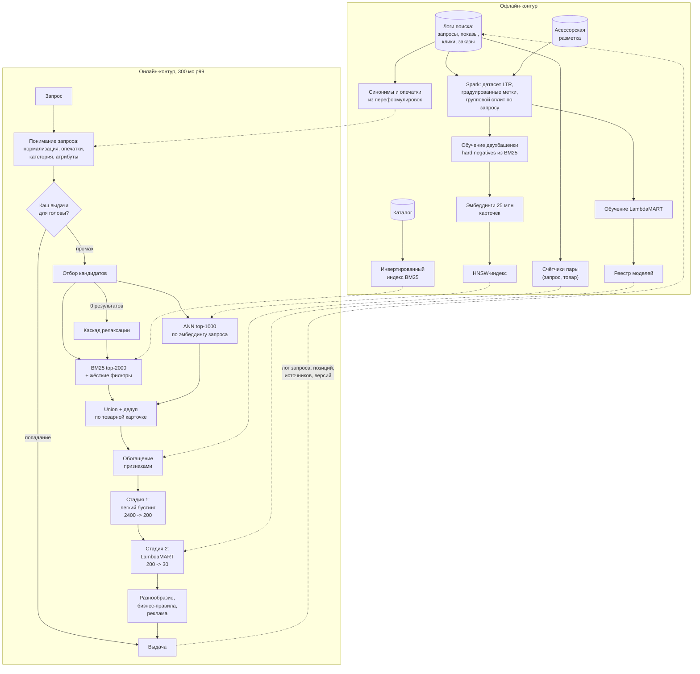

# Кейс: поиск и ранжирование

> **Зачем эта глава.** Поиск похож на рекомендации ровно до первой минуты разговора: у него есть
> запрос, то есть явно выраженное намерение, и всё проектирование меняется. Здесь полный разбор
> ответа по [каркасу из восьми шагов](01-framework.md): связка лексического и векторного поиска,
> понимание запроса, признаки пары запрос-товар, LTR, оценка по сессиям и то, что делать
> с опечатками и пустой выдачей.

**Уровень:** 🎯 middle → 🧠 middle+
**Предварительно нужно:** [каркас ответа](01-framework.md), [текст как данные](../04-nlp/01-text-representation.md), [эмбеддинги](../04-nlp/02-embeddings.md), [обучение ранжированию](../10-recsys/07-learning-to-rank.md), [двухбашенные модели и ANN](../10-recsys/06-two-tower-and-ann.md)
**Как проработать:** чтение + упражнения

---

## Карта главы

- [0. Задача, как её даёт интервьюер](#0-задача-как-её-даёт-интервьюер)
- [1. Шаг 1. Уточняющие вопросы и ответы](#1-шаг-1-уточняющие-вопросы-и-ответы)
- [2. Чем поиск принципиально отличается от ленты](#2-чем-поиск-принципиально-отличается-от-ленты)
- [3. Шаг 2. Метрики](#3-шаг-2-метрики)
- [4. Шаг 3. Данные](#4-шаг-3-данные)
- [5. Шаг 4. Постановка ML-задачи и бейзлайн](#5-шаг-4-постановка-ml-задачи-и-бейзлайн)
- [6. Шаг 5. Понимание запроса, признаки и модель](#6-шаг-5-понимание-запроса-признаки-и-модель)
- [7. Шаг 6. Архитектура](#7-шаг-6-архитектура)
- [8. Шаг 7. Оценка, выкатка, мониторинг](#8-шаг-7-оценка-выкатка-мониторинг)
- [9. Шаг 8. Риски и развитие](#9-шаг-8-риски-и-развитие)
- [10. Куда обычно копает интервьюер](#10-куда-обычно-копает-интервьюер)
- [11. Подводные камни](#11-подводные-камни)
- [12. Проверь себя](#12-проверь-себя)
- [13. Практика](#13-практика)
- [14. Что читать дальше](#14-что-читать-дальше)

---

> 🌱 **База.** Обязательного здесь четыре вещи. Чем поиск отличается от ленты
> ([§2](#2-чем-поиск-принципиально-отличается-от-ленты)): намерение выражено явно, поэтому
> релевантность — это ограничение, а не слагаемое в скоре, и из одного этого тезиса следует
> вся остальная архитектура. Гибрид лексики и векторов
> ([§6.2](#62-отбор-кандидатов-гибрид-лексики-и-векторов)): BM25 и двухбашенка ошибаются
> в разных местах, поэтому в проде они не заменяют друг друга — по этому вопросу вас будут
> проверять почти наверняка. Метрики ([§3](#3-шаг-2-метрики)): CTR в поиске растёт, когда выдача
> стала хуже, ключевая метрика — доля успешных сессий, а дорогая асессорская разметка идёт
> в оценку, тогда как обучают на кликах. И порядок лестницы усложнения
> ([§5](#5-шаг-4-постановка-ml-задачи-и-бейзлайн)): исправление опечаток даёт больший прирост,
> чем любая нейронная модель ранжирования, потому что чинит запросы с пустой выдачей. Числа
> кейса — 25 млн карточек, 300 мс, 6% нулевых выдач — это условия конкретной задачи; переносится
> способ рассуждения от чисел к решению, а не сами числа.
> [§10](#10-куда-обычно-копает-интервьюер) — шесть углублений, куда вас утянут после основного
> рассказа; при первом чтении их можно пролистать и вернуться перед самим собеседованием.
> Дальше идите, когда сможете своими словами объяснить, зачем в отборе кандидатов нужны обе
> ветви и почему CTR здесь плохая ключевая метрика.

---

## 0. Задача, как её даёт интервьюер

> «Спроектируйте поиск товаров по текстовому запросу на маркетплейсе».

---

## 1. Шаг 1. Уточняющие вопросы и ответы

**«Что ищем и в каком объёме?»** — 80 млн офферов от 700 тыс. продавцов, схлопнутых в 25 млн
товарных карточек (один товар — много продавцов). Показываем карточки, а не офферы: иначе выдача
превращается в 40 одинаковых чехлов.

**«Сколько запросов и какие они?»** — 25 млн поисковых запросов в сутки, средний RPS 290,
вечерний пик 900. Медианная длина запроса 2.4 слова, 78% запросов — до 4 слов. Распределение
типично тяжелохвостое: **1% уникальных запросов даёт 42% трафика** («телефон», «носки»,
«кроссовки мужские»), при этом 35% уникальных запросов встречаются не чаще трёх раз в месяц.
Это ключевое число: для головы можно всё кэшировать, для хвоста нужна модель, которая обобщает.

**«Что сейчас плохо?»** — Сейчас работает Elasticsearch с BM25 и ручными бустами по полям.
Проблемы: 12% запросов содержат опечатки и дают мусор; 6% запросов дают пустую выдачу;
запросы вида «чем стирать пуховик» не находят ничего, потому что таких слов нет в названиях
товаров; порядок в выдаче не учитывает поведение пользователей.

**«Бюджет латентности?»** — 300 мс p99 на весь ответ поискового бэкенда. Поиск чувствительнее
ленты: человек ждёт ответа на конкретный вопрос и замечает задержку.

**«Есть ли асессоры?»** — Есть команда, которая может размечать ~30 тыс. пар (запрос, товар)
в месяц по 5-балльной шкале релевантности. Это дорого, поэтому разметку надо тратить осмысленно.

**«Метрика успеха?»** — Выручка с поиска (сейчас 55% GMV площадки приходит через поиск) и доля
успешных поисковых сессий.

**Проговариваем итог:**

> «Итак: 25 млн запросов в сутки, 25 млн карточек, пик 900 RPS, 300 мс p99, текущее решение —
> BM25 с ручными бустами, болевые точки — опечатки, нулевая выдача и порядок. Есть 30 тыс.
> асессорских оценок в месяц. Предлагаю спроектировать полный конвейер: понимание запроса →
> гибридный отбор кандидатов → двухстадийное ранжирование, и отдельно разобрать нулевую выдачу.
> Персонализацию обсудим ближе к концу — в поиске она вторична».

---

## 2. Чем поиск принципиально отличается от ленты

Это стоит сказать вслух в первую же минуту после уточнений: интервьюер проверяет, понимаете ли
вы, что кейсы не одинаковые.

| Аспект | Лента рекомендаций | Поиск |
|---|---|---|
| Намерение | скрыто, выводится из истории | **явно выражено запросом** |
| Цена нерелевантного показа | низкая, пользователь пролистнёт | высокая, воспринимается как поломка |
| Персонализация | основа системы | вторична, а на навигационных запросах вредна |
| Источник кандидатов | несколько гипотез о вкусе | ограничение «соответствует запросу» — почти жёсткое |
| Возможность оценки без пользователя | почти нет | **есть: асессорская разметка релевантности** |
| Ключевой провал | скучная выдача | пустая или нерелевантная выдача |

Практическое следствие, ради которого этот раздел и нужен: **в поиске релевантность — это
ограничение, а не слагаемое в скоре**. Если человек ищет «чехол iPhone 14», показывать
высокомаржинальный чехол для Samsung нельзя ни при каком выигрыше в CTR. Поэтому архитектура
поиска устроена как «сначала жёстко отсекаем нерелевантное, потом ранжируем оставшееся»,
а не «складываем релевантность с популярностью с весами».

> 💬 **На собеседовании.** Спросят: «Чем ваш поиск отличается от рекомендаций, ведь и там,
> и там ранжирование?» Хороший ответ: наличием явного намерения, которое задаёт жёсткое
> ограничение на множество допустимых ответов, и наличием объективной разметки релевантности,
> которой в рекомендациях просто не существует — нельзя нанять асессора, чтобы он сказал,
> понравится ли конкретному человеку конкретный товар в ленте. Отсюда два следствия: в поиске
> есть офлайн-метрика, не зависящая от логов старой системы, и в поиске персонализация
> ограничена — она разрешает неоднозначность («яблоко» — фрукт или техника), но не может
> переопределить намерение. Провал: «то же самое, только с текстом на входе».

---

## 3. Шаг 2. Метрики

| Уровень | Метрика | Комментарий |
|---|---|---|
| Бизнес | GMV с поисковых сессий; доля площадки, проходящая через поиск | цель |
| Продуктовая | **доля успешных сессий**; конверсия поисковой сессии в заказ; MRR первого клика; доля переформулировок; доля сессий с нулевой выдачей; время до первого клика | двигаем в A/B |
| ML офлайн | NDCG@10 на асессорской разметке; recall@1000 на стадии отбора; MRR на кликах с коррекцией биаса | выбираем модель |
| Guardrail | p99 латентности; доля нерелевантного в топ-5 (асессорский аудит); доля нулевых выдач; доля показов новых продавцов; доля запросов, обслуженных фолбэком | не должно падать |

**Что такое «успешная сессия».** Определение надо дать явно, иначе метрика бессмысленна.
Рабочее определение: сессия успешна, если в ней был клик с последующим пребыванием на карточке
дольше 30 секунд, добавлением в корзину или заказом, **и** не было переформулировки запроса
после этого клика. Переформулировка — сильный сигнал неудачи: человек не нашёл и пробует снова.

**Почему NDCG считается на асессорской разметке, а не только на кликах.** Клики смещены позицией
и тем, что показала старая система; асессорская оценка — единственный источник, независимый
от текущей выдачи. Но её мало (30 тыс. пар в месяц), поэтому разметку тратят стратегически:
70% на стратифицированную по частотности выборку запросов (голова, тело, хвост),
30% — на запросы, где модели расходятся между собой (active learning). Обучать на 30 тыс. пар
нельзя, а вот **оценивать** — можно и нужно.

**Связка кликов и асессоров.** На практике держат две офлайн-метрики: NDCG@10 по асессорам
(мера релевантности) и NDCG@10 по градуированным кликам (мера привлекательности). Модель должна
не ухудшать первую и улучшать вторую. Расхождение между ними — диагностический сигнал: если
кликовая метрика растёт, а асессорская падает, вы построили генератор кликбейта.

> ⚠️ **Типичная ошибка.** Взять как ключевую метрику CTR выдачи. В поиске CTR растёт, когда
> выдача становится **хуже**: человек не нашёл с первого раза и кликает по нескольким карточкам
> подряд. Пара «CTR вырос, доля переформулировок выросла» означает деградацию, а не улучшение.
> Правильные первичные метрики — успешность сессии и MRR первого клика.

---

## 4. Шаг 3. Данные

**Что логируем на каждый поиск:** `query_raw` (как ввёл пользователь), `query_normalized`,
результат исправления опечатки и был ли он применён, распознанные категория и атрибуты,
список показанных карточек с позициями, источник каждого кандидата (лексика/вектор/оба),
клики с временем, переформулировки внутри сессии, добавления в корзину и заказы с привязкой
к `search_request_id`, версии всех моделей конвейера.

Объём: 25 млн запросов × ~30 показанных карточек = 750 млн строк показов в сутки,
в Parquet ~40 ГБ/сутки.

**Как получается обучающая разметка для ранжирования.** Три источника, которые смешиваются:

1. **Клики и конверсии из логов** — много, дёшево, смещено. Градуируем:
   заказ = 4, корзина = 3, длинный клик (>30 с) = 2, короткий клик = 1, показ без клика = 0.
2. **Асессорская разметка** — мало, дорого, непредвзято. 5 баллов: точное соответствие,
   соответствие с оговоркой, аксессуар/сопутствующее, та же категория но не то, нерелевантно.
3. **Слабая разметка из поведения на уровне запроса** — если по запросу «духи диор» 40%
   всех кликов в истории приходятся на конкретную карточку, это сильный сигнал релевантности,
   устойчивее отдельного клика. Такие агрегаты по паре (нормализованный запрос, товар) —
   и разметка, и признак одновременно.

**Смещения, которые надо назвать:**

- **Позиционный биас**: на первой позиции CTR ~35%, на десятой ~4% — при одинаковой
  релевантности. Без коррекции LTR выучит «то, что показывали первым, и есть хорошее».
- **Selection bias**: карточки, не попавшие в топ-30, не имеют кликов вообще.
- **Смещение по частотности**: 42% трафика — это 1% запросов, и если обучать на всех показах
  равномерно, модель настроится на голову и провалится на хвосте, где как раз и нужна.
  Лечится взвешиванием примеров обратно частоте запроса или стратифицированным сэмплированием.

**Сплит.** Временной по датам плюс **групповой по запросу**: все показы одного нормализованного
запроса должны быть в одной части. Иначе модель выучит конкретные пары «запрос-товар» из трейна
и покажет фантастический NDCG на тесте, где встретился тот же запрос. Отдельно держим срез
**хвостовых запросов** (частотность ≤ 3 в месяц) — метрика на нём главный индикатор обобщения.

---

## 5. Шаг 4. Постановка ML-задачи и бейзлайн

Поиск — это не одна модель, а конвейер из четырёх задач:

1. **Понимание запроса**: нормализация + исправление опечаток (задача noisy channel),
   классификация в категорию (multi-label классификация), извлечение атрибутов (NER),
   определение типа запроса.
2. **Отбор кандидатов**: максимизация recall при жёстком лимите по времени. Две подзадачи —
   лексический поиск (алгоритмическая, не ML) и векторный (метрическое обучение).
3. **Ранжирование**: LTR, listwise, целевая метрика NDCG@10.
4. **Постобработка**: разнообразие, бизнес-правила, реклама.

**Бейзлайн без ML** обязателен и он уже есть: BM25 по полям с ручными бустами (название ×3,
бренд ×2, описание ×1) плюс фильтр наличия плюс сортировка по популярности при равном скоре.
Формула BM25 для полноты (её просят вывести или объяснить в половине поисковых собеседований):

$$
\mathrm{BM25}(q, d) \;=\; \sum_{t \in q} \mathrm{IDF}(t)\cdot
\frac{f(t,d)\,(k_1 + 1)}{f(t,d) + k_1\Big(1 - b + b\,\dfrac{|d|}{\overline{|d|}}\Big)}
$$

где $q$ — запрос, $d$ — документ (карточка), $t$ — терм запроса, $f(t,d)$ — частота терма
в документе, $|d|$ — длина документа в термах, $\overline{|d|}$ — средняя длина документа
в коллекции, $k_1 \in [1.2, 2.0]$ — параметр насыщения по частоте, $b \in [0,1]$ — сила
нормировки на длину документа, $\mathrm{IDF}(t)$ — обратная документная частота терма.

> 📐 **Разбор формулы.** Три идеи. Первая: чем реже терм в коллекции, тем он информативнее —
> это $\mathrm{IDF}$. Вторая: десять вхождений слова не в десять раз лучше одного — дробь
> насыщается, стремясь к $k_1+1$ при росте $f$; параметр $k_1$ управляет скоростью насыщения.
> Третья: длинный документ имеет больше шансов случайно содержать терм, поэтому его штрафуют
> множителем $|d|/\overline{|d|}$; сила штрафа — $b$ (при $b=0$ длина игнорируется).
> Для товарных карточек $b$ обычно ставят ниже дефолтных 0.75: названия короткие,
> и агрессивная нормировка на длину вредит.

**Лестница усложнения:**

| Уровень | Что добавляем | Ожидаемый эффект |
|---|---|---|
| 0 | BM25 + буст по полям (есть) | базовая линия |
| 1 | исправление опечаток + лемматизация + фильтр по распознанной категории | −60% нулевых выдач, +5–8% успешных сессий |
| 2 | LTR-бустинг поверх top-1000 BM25 на 60 признаках | +8–15% NDCG@10 |
| 3 | векторный ретривал (двухбашенка) в гибриде с BM25 | закрывает семантические запросы и хвост, +3–6% успешных сессий |
| 4 | кросс-энкодер-реранкер на топ-50 | +3–5% NDCG@10, но +25–40 мс латентности |

Порядок здесь не случаен и его надо обосновать вслух: **исправление опечаток даёт больший
прирост, чем любая нейронная модель ранжирования**, потому что чинит запросы, где выдача была
пустой. Кандидат, который начинает с кросс-энкодера, а про опечатки вспоминает в конце,
расставил приоритеты неверно.

---

## 6. Шаг 5. Понимание запроса, признаки и модель

### 6.1 Понимание запроса (query understanding)

| Компонент | Как делаем | Стоимость |
|---|---|---|
| Нормализация | нижний регистр, удаление пунктуации, **лемматизация** (для русского обязательна: «кроссовки мужские» = «мужские кроссовки» = «кроссовок мужской») | <1 мс |
| Исправление опечаток | словарь из каталога + расстояние Дамерау-Левенштейна ≤2 через FST/BK-дерево, ранжирование кандидатов моделью шумного канала | 3 мс |
| Синонимы и расширения | таблица, добытая из логов: два запроса синонимичны, если распределения кликов по карточкам сильно пересекаются (косинус ≥0.7) | lookup, <1 мс |
| Классификация в категорию | multi-label классификатор на символьных n-граммах + маленький энкодер; отдаёт топ-3 категории с вероятностями | 6 мс (кэш для головы) |
| Извлечение атрибутов | NER: бренд, размер, цвет, ценовое ограничение («до 5000») | 4 мс |
| Тип запроса | навигационный / категорийный / товарный / широкий — определяет, включать ли персонализацию | из классификатора |

**Модель исправления опечаток** — редкий случай, когда байесовская формулировка сама
напрашивается. Ищем исправление $c$, максимизирующее апостериорную вероятность при наблюдённом
вводе $q$:

$$
\hat c \;=\; \arg\max_{c \in V} \; P(q \mid c)\,P(c)
$$

где $V$ — словарь допустимых слов (построенный из названий, брендов и частотных запросов
с кликами), $P(q \mid c)$ — модель канала ошибок (вероятность набрать $q$, имея в виду $c$;
оценивается по частотам замен соседних клавиш и по парам «запрос → переформулированный запрос»
из логов сессий), $P(c)$ — априорная частота $c$ в успешных запросах.

> 🧠 **Middle+.** Самый ценный источник данных для опечаток — **переформулировки внутри сессии**.
> Если пользователь за 15 секунд ввёл «кросовки», а потом «кроссовки» и кликнул — это готовая
> размеченная пара, и таких пар набирается сотни тысяч в месяц бесплатно. Это лучше любого
> синтетического генератора опечаток, потому что отражает реальные ошибки реальной раскладки,
> включая случайно не переключённый язык («rhjccjdrb»).

**Когда исправление применять автоматически, а когда предлагать.** Правило: если исправленный
запрос даёт заметно больше результатов и модель уверена ($P(\hat c \mid q) > 0.9$) — исправляем
молча, но показываем плашку «показаны результаты для ...». Если уверенность средняя — показываем
исходную выдачу и предлагаем «возможно, вы имели в виду». Автоисправление уверенно набранного
редкого бренда — классический способ разозлить пользователя.

### 6.2 Отбор кандидатов: гибрид лексики и векторов

Две ветви работают параллельно.

**Лексическая ветвь.** Инвертированный индекс, BM25 по полям (название, бренд, категория,
характеристики, отзывы), обязательные фильтры (наличие, регион доставки, распознанная категория,
атрибуты из NER) применяются как жёсткие условия. Отдаёт top-2000.

**Векторная ветвь.** Двухбашенная модель: энкодер запроса и энкодер карточки в общее пространство
$\mathbb{R}^{256}$. Обучение — контрастивное, на парах (запрос, кликнутая карточка) с in-batch
негативами и **hard negatives**: карточки, которые BM25 ставил высоко, но по ним не кликали.
Именно hard negatives дают основной прирост; на одних случайных негативах модель выучивает
только различать категории. Индекс — HNSW по 25 млн векторам, отдаёт top-1000.

**Как объединять?** Скоры BM25 (неограниченный сверху) и косинус (в $[-1,1]$) несравнимы.
Два рабочих способа:

- **Reciprocal Rank Fusion** — объединение по рангам, а не по значениям:
  $\mathrm{RRF}(d) = \sum_{s} \dfrac{1}{k + \mathrm{rank}_s(d)}$, где $s$ — ветвь поиска,
  $\mathrm{rank}_s(d)$ — позиция документа $d$ в её результатах, $k \approx 60$ — сглаживающая
  константа, гасящая влияние точных значений ранга. Не требует обучения и калибровки, работает
  сразу.
- **Оба скора как признаки ранжирующей модели.** Правильнее, но требует, чтобы модель уже была.

На практике делают так: кандидаты объединяются union'ом (top-2000 лексики ∪ top-1000 векторов,
после дедупликации ~2400), а RRF используется только как **предварительный отсев** до 1500,
если обогащение признаками не влезает в бюджет. Дальше решает LTR.

> 💬 **На собеседовании.** Спросят: «Зачем нужен BM25, если есть векторный поиск?»
> Хороший ответ: они ошибаются по-разному. BM25 гарантирует точное совпадение — на запросе
> «SKU AB-1234» или «iPhone 14 Pro 256» лексика находит ровно то, что нужно, а вектор
> «примерно то же самое», что для артикулов и точных моделей неприемлемо. Вектор, наоборот,
> находит по смыслу («чем стирать пуховик» → гели для пуховиков), где у BM25 нет ни одного
> общего терма. Плюс инженерия: инвертированный индекс дёшево обновляется при изменении цены
> и остатка, а перестройка HNSW дороже. Плюс интерпретируемость: почему нашлось по BM25 —
> объяснимо, почему нашлось по вектору — нет. Поэтому в проде почти всегда гибрид, а не замена.
> Провал: «векторный поиск современнее, BM25 не нужен».

### 6.3 Признаки для ранжирования

Группировка здесь важнее, чем в ленте: главная группа — **пара запрос-товар**, и её наличие
отличает поисковое ранжирование от рекомендательного.

| Группа | Примеры | Где считается |
|---|---|---|
| Признаки запроса (~15) | длина, частотность, тип (навигационный/широкий), была ли опечатка, число распознанных атрибутов, энтропия распределения кликов по категориям | онлайн, кэш для головы |
| Признаки товара (~50) | цена и её перцентиль в категории, рейтинг, число отзывов, продажи за 7/30 дней, CTR карточки, доля возвратов, возраст, рейтинг продавца, скорость доставки | офлайн + стрим |
| **Пара запрос-товар, лексические (~30)** | BM25 по каждому полю отдельно, доля покрытых термов запроса, точное вхождение фразы в название, совпадение распознанного бренда, совпадение категории с предсказанной, позиция вхождения в названии | онлайн |
| **Пара запрос-товар, семантические (~10)** | косинус двухбашенки, косинус по описанию, косинус по изображению для визуальных категорий | онлайн, вектора из кэша |
| **Пара запрос-товар, поведенческие (~20)** | CTR пары (нормализованный запрос, товар) со сглаживанием, число заказов по этой паре за 30 дней, CTR пары (категория запроса, товар) | офлайн, ключ = хеш пары |
| Пользовательские (~10) | ценовой сегмент, история в категории запроса, регион | онлайн |
| Позиционные (только при обучении) | позиция показа, номер страницы | не используется на инференсе |

Поведенческие признаки по паре — **самые сильные для головы и полностью бесполезные для хвоста**:
для запроса, встретившегося дважды за месяц, никакой статистики нет. Это ровно та причина,
по которой нужны семантические признаки и по которой метрику надо смотреть отдельно на хвосте.

### 6.4 Модель ранжирования

**Вариант A. LambdaMART** (бустинг с listwise-градиентами под NDCG) на 130 признаках.
Быстро обучается, естественно оптимизирует ранжирующую метрику, инференс 200 объектов
за единицы миллисекунд, отлично ест разнородные табличные признаки. Индустриальный стандарт
поискового ранжирования.

**Вариант B. Нейронная listwise-модель** с текстовыми энкодерами внутри. Лучше на хвосте
и на семантике, но дороже в обучении, требует GPU на инференсе и хуже интерпретируется.

**Вариант C. Кросс-энкодер-реранкер** поверх топ-50: одна трансформерная модель видит запрос
и текст карточки вместе и оценивает релевантность. Качество на релевантности заметно выше
двухбашенки, но стоимость $O(50)$ прогонов на запрос — при 900 RPS это 45 тыс. прогонов
в секунду, что требует отдельного GPU-парка.

**Выбор: двухстадийное ранжирование A + C.** Первая стадия — лёгкий бустинг на 40 дешёвых
признаках, режет 2400 → 200. Вторая — LambdaMART на 130 признаках, режет 200 → 30.
Кросс-энкодер (C) добавляем третьим шагом только на топ-30 и только если он окупится в A/B:
это +25–40 мс, то есть 10% бюджета за 3–5% NDCG. Начинаем без него.

Обоснование выбора формулируем через ограничение: «на 900 RPS кросс-энкодер на топ-50 — это
десятки GPU круглосуточно; при текущей выручке с поиска это оправдано только если он даёт
хотя бы +1% конверсии, что надо сначала проверить в shadow на выборке запросов».

---

## 7. Шаг 6. Архитектура

### Бюджет латентности (300 мс p99)

| Стадия | мс | Комментарий |
|---|---|---|
| Сеть, парсинг, нормализация | 8 | |
| Исправление опечаток | 3 | FST в памяти, без сети |
| Классификация запроса + NER | 6 | кэш по нормализованному запросу, попадание 65%; при промахе — маленький энкодер на CPU, 15 мс |
| Проверка кэша выдачи | 2 | попадание ~35% на голове; при попадании ответ за 15 мс суммарно |
| BM25 top-2000 из 80 млн офферов | 45 | параллельно с векторной ветвью |
| ANN top-1000 (HNSW, ef=200) | 22 | параллельно с лексикой; ждём максимум = 45 |
| Union, дедуп по карточке, фильтры | 15 | |
| Обогащение признаками 2400 кандидатов | 35 | признаки товара — из in-process кэша; счётчики пар — из Redis батчем |
| Стадия 1: бустинг 100 деревьев × 40 признаков | 18 | 2400 объектов |
| Стадия 2: LambdaMART 800 деревьев × 130 признаков | 25 | 200 объектов |
| Постобработка, разнообразие, реклама | 12 | |
| Сериализация | 10 | |
| **Сумма** | **179** | запас 120 мс на хвосты и на промах кэша понимания запроса |

Обратите внимание на две вещи. Первая: **лексическая и векторная ветви идут параллельно**,
в сумму входит только максимум из них. Вторая: **кэш выдачи для головы** — самая дешёвая
оптимизация во всём поиске. 1% запросов даёт 42% трафика; кэш на 200 тыс. нормализованных
запросов с TTL 10 минут снимает треть нагрузки с индексов практически бесплатно. Ключ кэша
должен включать регион и признак наличия персонализации, иначе получите утечку чужой выдачи.

### Каскад релаксации при пустой выдаче

Нулевая выдача — худший исход в поиске, и её обработка почти всегда спрашивается отдельно.
Порядок шагов — от наименее разрушительного к наиболее:

1. Применить исправление опечатки (если ещё не применяли) и повторить.
2. Снять фильтры-атрибуты по одному, начиная с наименее важного: сначала цвет, затем размер,
   затем ценовой диапазон; бренд и категорию снимаем последними.
3. Перейти с AND на OR по термам запроса с требованием покрытия ≥70% IDF-массы запроса
   (а не ≥70% слов — служебные слова не должны считаться наравне с брендом).
4. Расширить синонимами и морфологическими вариантами.
5. Отдать чисто векторную выдачу (она почти никогда не пуста).
6. Расширить географию доставки с явной пометкой «доставка дольше».
7. Показать выдачу по распознанной категории с честной формулировкой «точных совпадений нет,
   вот товары из категории X» и предложением уточнить.

Каждый шаг логируется, и доля запросов, дошедших до шага $k$, — отдельная метрика мониторинга.
Пустой экран не отдаём никогда.

---

## 8. Шаг 7. Оценка, выкатка, мониторинг

**Офлайн.** Временной + групповой по запросу сплит. Две метрики параллельно: NDCG@10
по асессорам и NDCG@10 по градуированным кликам, обе — с разрезом по частотности запроса
(голова / тело / хвост) и по типу запроса. Дополнительно recall@1000 стадии отбора отдельно
для лексической, векторной и объединённой ветвей: это диагностика, показывающая, кто из них
что приносит.

**Интерливинг** — главный инструмент онлайн-оценки в поиске, и его надо назвать раньше A/B.
Team-draft interleaving: две выдачи перемешиваются в один список, клики атрибутируются той
модели, которая поставила карточку. Сравнение происходит внутри одного запроса одного человека,
поэтому дисперсия падает на порядок: для достоверного сравнения хватает сотен тысяч запросов
вместо миллионов пользователей — в нашем масштабе это несколько часов вместо двух недель.
Ограничение: интерливинг сравнивает **порядок**, но не измеряет заказы, удержание и другие
метрики, зависящие от всей сессии.

**A/B** нужен для финального решения. Единица рандомизации — пользователь. Ключевая метрика —
доля успешных поисковых сессий (базовое значение 62%, MDE 1 п.п. → при 5 сессиях на пользователя
в неделю требуется ~120 тыс. пользователей на группу). Длительность 14 дней. Guardrails:
доля нулевых выдач, p99, доля переформулировок, средний чек, доля показов малых продавцов.

**Отдельная асессорская приёмка перед выкаткой.** Для 500 случайных запросов сравнить топ-5
старой и новой модели вслепую (side-by-side). Это ловит катастрофические регрессии, которых
не видно в средних метриках: например, что новая модель на запросах с артикулами начала
показывать «похожее». Обязательный шаг для поиска.

**Выкатка:** shadow 3 дня (проверяем латентность и распределение скоров) → интерливинг
на 10% трафика 1 день → A/B 50/50 на 14 дней → 100% с недельным наблюдением.

**Мониторинг: четыре слоя.**

| Слой | Метрики | Порог алерта | Действие |
|---|---|---|---|
| Инфраструктура | p99 по стадиям, RPS, ошибки индекса, попадания в кэш | p99 > 260 мс | проверить размер индекса и `ef`, при необходимости снизить число кандидатов |
| Данные | свежесть индекса (лаг обновления остатков), доля карточек без эмбеддинга, доля запросов без распознанной категории | лаг индекса > 15 мин | остановить выкатку каталога, разбирать пайплайн индексации |
| Модель | распределение скоров, доля запросов с нулевой выдачей, доля запросов, дошедших до релаксации шага 5+, NDCG на ежедневной микроразметке | нулевая выдача > 1.5% | сравнить с релизами словарей и синонимов |
| Бизнес | успешные сессии, конверсия, MRR первого клика, переформулировки | успешные сессии −2 п.п. сутки к суткам | откат последнего изменения ранжирования |

**Переобучение.** Инвертированный индекс — потоково (цена и остаток должны доезжать за минуты,
иначе выдача врёт про наличие). Эмбеддинги новых карточек — каждый час батчем, полный пересчёт —
раз в неделю. Счётчики пар (запрос, товар) — раз в сутки. LambdaMART — раз в неделю с гейтом
по NDCG на асессорской выборке.

---

## 9. Шаг 8. Риски и развитие

**1. Векторный ретривал ломается на точных запросах.** Двухбашенка не различает «iPhone 14 Pro»
и «iPhone 14 Pro Max», а также артикулы и размеры. Пока лексическая ветвь работает, это скрыто;
но если однажды кто-то решит «упростить архитектуру» и убрать BM25, поиск по точным моделям
развалится. Митигация: постоянный регрессионный набор из 2000 точных запросов, по которым
проверяется, что нужная карточка на первом месте; это тест в CI, а не метрика.

**2. Обучение на кликах закрепляет популярное.** LTR обучен на логах, а логи порождены прошлой
выдачей: новые карточки и малые продавцы не имеют кликов, значит имеют нулевые поведенческие
признаки, значит не попадают наверх, значит не набирают кликов. Митигация: сглаживание счётчиков
к среднему по категории, признак `is_cold`, квота на новинки в выдаче, эксплорация на позициях
6–10. Полностью не решается.

**3. Персонализация в поиске легко приносит вред.** Соблазн подмешать историю пользователя
в ранжирование велик, но на навигационных и точных запросах персонализация ухудшает выдачу:
человек ищет конкретную вещь, а мы показываем то, что он покупал раньше. Митигация:
персонализация включается только для широких запросов (определяется классификатором типа
запроса по энтропии распределения кликов), и её вклад ограничен — она может переставлять
внутри релевантных, но не может вытеснить релевантное.

---

## 10. Куда обычно копает интервьюер

### 10.1 «Как вы обучите двухбашенку для поиска и откуда возьмёте негативы?»

Позитивы — пары (нормализованный запрос, карточка), по которым был длинный клик, корзина
или заказ. Негативы трёх сортов, и их смесь решает всё:

- **In-batch negatives**: остальные карточки в батче. Дают почти бесплатно много негативов,
  но они слишком лёгкие — модель быстро учится различать категории и упирается в потолок.
  Обязательна logQ-коррекция: популярные карточки чаще попадают в батч и систематически
  штрафуются, что искажает обучение.
- **Hard negatives из BM25**: карточки, которые лексический поиск поставил в топ-50, но по ним
  не кликнули при показе. Это главный источник прироста — модель учится различать «похоже
  по словам, но не то».
- **Итеративные hard negatives (в духе ANCE)**: после первой эпохи достаём топ векторной модели
  и берём ошибочные как негативы для следующего круга. Дорого (нужно перестраивать индекс),
  но даёт ещё несколько процентов recall.

Функция потерь — softmax cross-entropy по батчу с температурой (InfoNCE). Размерность 256:
768 не даёт заметного прироста recall на товарном поиске, а индекс на 25 млн векторов растёт
втрое.

### 10.2 «Как вы решаете, что запрос навигационный, и что с этим делаете?»

Признак определяется по логам: считаем распределение кликов по карточкам для нормализованного
запроса и его энтропию. Если 60%+ кликов приходятся на одну карточку — запрос навигационный
(«вайлдберриз кошелёк», конкретная модель, артикул). Если энтропия высокая и клики размазаны
по категориям — запрос широкий («подарок»).

Следствия для системы разные:
- **Навигационный**: отключаем персонализацию и разнообразие, ставим известный ответ на первое
  место, снижаем долю рекламы (реклама на навигационном запросе воспринимается как обман).
  Здесь полезен прямой кэш «запрос → ответ», построенный по историческим кликам.
- **Широкий**: наоборот, повышаем разнообразие категорий, включаем персонализацию, показываем
  фасеты и подсказки для уточнения. Метрика успеха тоже другая: успех — это уточнение запроса,
  а не немедленный клик.

Для хвостовых запросов, где статистики нет, тип определяется эвристиками: наличие артикула,
цифро-буквенных токенов, названия бренда + модели.

### 10.3 «Пользователь ищет "чем стирать пуховик". Что происходит в вашей системе?»

Пошагово, и этот разбор очень любят.

BM25 находит почти ничего: в названиях товаров нет слов «чем» и «стирать», а «пуховик» вытащит
сами пуховики, то есть категорийно неверный ответ. Это ровно тот класс запросов, ради которых
и нужна векторная ветвь: эмбеддинг запроса окажется рядом с карточками «гель для стирки пуховиков
и мембраны», потому что модель обучалась на кликах, где по похожим формулировкам кликали
именно туда.

Дополнительно работают: классификатор категории (предскажет «бытовая химия / средства для стирки»
с вероятностью выше, чем «верхняя одежда», если обучен на кликовых логах), и таблица синонимов
из переформулировок («чем стирать пуховик» → «гель для пуховиков»).

Опасность, которую надо назвать: если в топ попадут одновременно пуховики (от BM25)
и гели (от вектора), выдача будет выглядеть сломанной. Поэтому предсказанная категория участвует
как **признак согласованности** в ранжировании, а при высокой уверенности классификатора —
как фильтр. Именно так решается конфликт между ветвями: не весами, а признаком совпадения
с распознанным намерением.

### 10.4 «Как вы бы боролись с позиционным биасом в обучении LTR?»

Три варианта, и надо сказать, какой в поиске практичнее.

**Позиция как признак с фиксированным значением на инференсе** — работает, дёшево, но требует
разнообразия позиций в данных, которого мало, если система детерминирована.

**Оценка кривой просмотра через рандомизацию.** Ставим эксперимент, где на небольшой доле
трафика позиции топ-10 случайно перемешиваются. Из этих данных оценивается вероятность
просмотра позиции $\pi_k$ (examination propensity) без предположений о модели. Дальше обучаем
с весами $1/\pi_k$ (IPS). Это методологически правильный путь; цена — небольшая деградация
выдачи на экспериментальном трафике.

**Оценка propensity без вредных экспериментов** — интервенционные наборы: используем то,
что один и тот же документ по разным запросам оказывается на разных позициях, и разделяем
эффект позиции и релевантности регрессией. Дешевле, но требует много данных и аккуратности.

Практический ответ для собеседования: начинаем с позиции-признака, параллельно запускаем
рандомизацию на 1% трафика, чтобы получить честную кривую $\pi_k$, и переходим на IPS,
когда кривая оценена. Веса обязательно обрезать сверху (clipping), иначе дисперсия обучения
взорвётся на нижних позициях.

### 10.5 «У вас 6% запросов с нулевой выдачей. Какой будет ваш план на первую неделю?»

Сначала — декомпозиция, а не решение. Разложить 6% по причинам на выборке из 5 тыс. запросов:

| Причина | Типичная доля | Что делать |
|---|---|---|
| Опечатка | 35% | исправление, эффект за дни |
| Товара действительно нет в каталоге | 25% | не чинится поиском; отдать в закупку как сигнал спроса |
| Слишком узкие фильтры (цвет+размер+цена) | 20% | каскад релаксации |
| Формулировка не совпадает с каталогом | 15% | синонимы, векторная ветвь |
| Нет доставки в регион | 5% | расширение географии с пометкой |

Этот разбор — то, за что ставят балл: он показывает, что вы не бросаетесь строить нейросеть,
а сначала измеряете. Плюс важное наблюдение: 25% нулевых выдач — это **сигнал спроса**,
который стоит денег. Отчёт «топ-1000 запросов без результатов, отсортированные по частоте»
для отдела закупок часто приносит больше, чем улучшение NDCG.

### 10.6 «Как оценивать поиск по сессиям, а не по запросам?»

Одиночный запрос — неверная единица анализа, потому что поиск — это диалог. Человек вводит
«кроссовки», уточняет «кроссовки найк», добавляет «кроссовки найк 42», кликает. По каждому
отдельному запросу метрика может быть посредственной, а сессия успешна.

Сессионные метрики: доля сессий, завершившихся кликом-с-задержкой/корзиной/заказом; среднее
число переформулировок до успеха; доля «брошенных» сессий (ни одного клика и уход);
время до первого успешного клика. Отдельно — **доля сессий с ухудшением**: пользователь
переформулировал и получил выдачу хуже предыдущей по своим же кликам.

Тонкость определения сессии: окно неактивности 30 минут плюс смена намерения. Если человек
искал «кроссовки», а потом «молоко» — это две разные поисковые задачи внутри одной технической
сессии, и склеивать их нельзя. Разделение делается по расхождению распознанных категорий.

---

## 11. Подводные камни

**Автоисправление ломает точные запросы.**
Симптом: жалобы «ищу редкий бренд, а мне подставляют популярный».
Причина: исправление применяется без проверки, что исходный запрос вообще что-то находил.
Что делать: никогда не исправлять запрос, который даёт достаточное число результатов; для
средней уверенности — показывать исходную выдачу с предложением исправления, а не наоборот.

**Обновление остатков отстаёт от выдачи.**
Симптом: пользователь кликает, попадает на «нет в наличии», конверсия падает без изменения моделей.
Причина: индекс обновляется раз в час, а остатки меняются каждую минуту.
Что делать: разделить статические поля (текст, изображения — редко) и динамические
(цена, остаток — потоково). Динамика применяется как фильтр в момент запроса из быстрого
key-value, а не хранится в основном индексе.

**Групповой сплит по запросу забыт.**
Симптом: NDCG на офлайн-тесте 0.72, интерливинг не показывает разницы.
Причина: один и тот же запрос попал и в трейн, и в тест; модель запомнила пары, а не выучила
обобщение.
Что делать: групповой сплит по нормализованному запросу обязателен; дополнительно —
отдельная метрика на запросах, которых нет в трейне вообще.

**Метрика растёт за счёт головы, хвост деградирует.**
Симптом: общий NDCG +2%, жалобы на «странную выдачу» растут.
Причина: 42% трафика — это 1% запросов; улучшение на них перевешивает деградацию на хвосте
в средневзвешенной метрике.
Что делать: всегда смотреть метрику в разрезе частотности и отдельно взвешивать хвост
при принятии решения.

**Реклама в выдаче не учтена в модели.**
Симптом: A/B ранжирования показывает рост, суммарная выручка не растёт.
Причина: рекламные места занимают верхние позиции, органика сдвигается, и эффект модели
частично съедается; при этом обучающие логи содержат смесь органических и рекламных показов.
Что делать: разделять органические и рекламные показы в логах, обучать только на органике,
а в метриках считать суммарный доход (органика + реклама), а не только органический.

**Кэш выдачи без учёта региона и персонализации.**
Симптом: пользователь из Владивостока видит товары с доставкой только по Москве.
Причина: ключ кэша — только нормализованный запрос.
Что делать: ключ = (нормализованный запрос, регион, признак применения персонализации,
версия ранжирующей модели). Версия в ключе критична: без неё после выката новой модели
треть трафика ещё сутки обслуживается старой.

---

## 12. Проверь себя

<b>🎯 Вопрос.</b> Зачем в поиске гибрид BM25 и векторного поиска — почему не одно из двух?

**Короткий ответ.** Они ошибаются в разных местах. BM25 гарантирует точное совпадение
(артикулы, модели, редкие бренды) и дёшево обновляется, но не понимает смысла. Вектор находит
по смыслу и работает при нулевом пересечении слов, но размывает точные различия вроде
«14 Pro» и «14 Pro Max».

**Развёрнуто.** Практически: лексика даёт высокий precision на точных и навигационных запросах
и позволяет применять жёсткие фильтры прямо в индексе; вектор даёт recall на естественно
сформулированных и хвостовых запросах. Объединение делается union'ом с последующим LTR,
а не взвешенной суммой скоров — шкалы несравнимы. Если нужен объединённый скор до ранжирования,
используют ранговое слияние (RRF). Инженерный аргумент тоже важен: инвертированный индекс
дёшево обновляется при изменении цены и остатка, полная перестройка ANN-индекса на 25 млн
векторов дороже.

**Чего ждёт интервьюер:** конкретных примеров запросов, где каждый метод проваливается.

**Провал:** «эмбеддинги современнее, BM25 — легаси».

<b>🎯 Вопрос.</b> Почему CTR — опасная метрика для поиска?

**Короткий ответ.** В поиске CTR растёт, когда выдача хуже: пользователь не нашёл сразу
и кликает по нескольким карточкам. Нужны метрики успешности сессии и MRR первого клика.

**Развёрнуто.** Правильная метрика должна ловить, что человек нашёл искомое и остановился.
Признаки успеха: клик с последующим долгим пребыванием на карточке, добавление в корзину, заказ,
отсутствие переформулировки после клика. Признаки неудачи: много кликов подряд, переформулировка,
уход без клика, переход на вторую страницу. Поэтому первичная метрика — доля успешных сессий,
а MRR первого клика — быстрый прокси. CTR остаётся как диагностика (он мало шумит и быстро
реагирует), но решение по нему не принимают.

**Чего ждёт интервьюер:** понимания разницы между вовлечением и удовлетворением намерения.

**Провал:** «оптимизируем CTR, как в рекомендациях».

<b>🧠 Вопрос.</b> Как вы обучите модель ранжирования, если асессорской разметки всего 30 тысяч пар в месяц?

**Короткий ответ.** Обучаем на кликах с градуированными метками и коррекцией позиционного
биаса, а асессорскую разметку тратим на **оценку** и на калибровку кликовых меток, а не
на обучение.

**Развёрнуто.** 30 тыс. пар — это меньше, чем число признаков × число деревьев в LambdaMART;
обучить на этом ранжирование нельзя. Схема разделения ролей: клики (сотни миллионов) дают
обучающий сигнал, асессоры (десятки тысяч) дают непредвзятую оценочную выборку и служат
арбитром при расхождении. Разметку распределяют стратифицированно по частотности запросов
и дополнительно тратят на пары, где модели расходятся сильнее всего (active learning) —
это даёт максимум информации на рубль. Если очень нужно использовать асессоров в обучении,
их применяют как отдельную задачу в многозадачной схеме или для дообучения последнего слоя.

**Чего ждёт интервьюер:** понимания, что дорогая разметка идёт в оценку, а дешёвая смещённая —
в обучение.

**Провал:** «обучим на асессорской разметке, она качественнее».

<b>🎯 Вопрос.</b> Пользователь ввёл запрос, ничего не нашлось. Ваши действия?

**Короткий ответ.** Каскад релаксации: исправление опечатки → снятие фильтров-атрибутов
по одному → OR вместо AND по термам с порогом покрытия по IDF → синонимы → чисто векторная
выдача → расширение географии → выдача по распознанной категории с честной формулировкой.
Пустой экран не показываем никогда.

**Развёрнуто.** Порядок шагов не произволен: снимаем сначала то, что меньше искажает намерение
(цвет), последними — бренд и категорию. Каждый шаг логируется, доля запросов, дошедших
до шага $k$, — метрика мониторинга. Отдельно важно измерить причины: обычно треть нулевых выдач
даёт опечатка, четверть — реальное отсутствие товара в каталоге (это сигнал закупке, а не
задача поиска), пятая часть — слишком узкие фильтры. Без этой декомпозиции легко потратить
месяц на нейросеть, которая чинит 15% проблемы.

**Чего ждёт интервьюер:** конкретного каскада с порядком и понимания, что часть нулевых выдач
поиском не лечится.

**Провал:** «покажем похожие товары» без деталей и без разбора причин.

<b>🧠 Вопрос.</b> Нужна ли персонализация в поиске? Где она вредна?

**Короткий ответ.** Нужна ограниченно: она разрешает неоднозначность на широких запросах,
но вредна на навигационных и точных, где пользователь знает, что ищет.

**Развёрнуто.** Тип запроса определяется по энтропии распределения кликов: низкая энтропия —
навигационный (все кликают одно и то же), высокая — широкий. На широком запросе («подарок»,
«кроссовки») история пользователя помогает выбрать ценовой сегмент, бренд и категорию.
На навигационном («iphone 14 pro 256 черный») персонализация может только испортить: правильный
ответ один и он не зависит от истории. Правильная архитектура: персонализация как признаки
в ранжировании с ограниченным вкладом, включаемая по типу запроса, и она может переставлять
объекты внутри релевантных, но не может поднять нерелевантный.

**Чего ждёт интервьюер:** понимания, что явное намерение доминирует над профилем.

**Провал:** «персонализируем всё, как в ленте».

<b>🎯 Вопрос.</b> Что такое интерливинг и почему в поиске его применяют раньше A/B?

**Короткий ответ.** Перемешивание двух выдач в один список с атрибуцией кликов той модели,
которая поставила объект. Сравнение происходит внутри одного запроса, поэтому дисперсия
на порядок ниже и хватает часов трафика вместо недель.

**Развёрнуто.** В A/B сравниваются группы пользователей, и различие между людьми даёт огромный
шум относительно эффекта ранжирования. В интерливинге сравнение парное: один и тот же человек
на одном и том же запросе видит объекты обеих моделей. Team-draft interleaving обеспечивает
честность: модели по очереди «выбирают» объекты в общий список, как капитаны команд. Ограничения:
интерливинг оценивает только порядок и только по кликам; он не измеряет заказы, удержание
и вообще любые метрики на уровне сессии и пользователя, а также не годится, когда модели
возвращают сильно разные множества кандидатов. Поэтому схема такая: интерливинг — быстрый
фильтр гипотез, A/B — финальное решение.

**Чего ждёт интервьюер:** знания приёма и его границ.

**Провал:** назвать интерливинг заменой A/B.

<b>🧠 Вопрос.</b> Как вы получите hard negatives для обучения векторного ретривала и зачем они нужны?

**Короткий ответ.** Берём карточки, которые BM25 или текущая модель ставят высоко, но по которым
не кликнули при показе. Без них модель учится только отличать категории и упирается в потолок.

**Развёрнуто.** С in-batch негативами задача слишком лёгкая: случайная карточка из другого
батча отличается от позитива очевидно, и градиент быстро вырождается. Hard negatives ставят
модель перед задачей «эти два товара похожи по словам и категории — почему один подходит,
а другой нет». Источники: топ BM25 без кликов, топ текущей векторной модели без кликов
(итеративная схема, требует периодической перестройки индекса), карточки из соседней категории.
Важные оговорки: слишком «жёсткие» негативы могут оказаться ложными (карточка релевантна,
но её не кликнули из-за позиции), поэтому берут не самый топ, а диапазон рангов, скажем 10–100,
и смешивают hard с in-batch в пропорции около 1:4. Для in-batch обязательна logQ-коррекция,
иначе популярные карточки систематически штрафуются.

**Чего ждёт интервьюер:** понимания, что качество контрастивного обучения определяется
негативами, а не архитектурой.

**Провал:** «берём случайные товары как негативы».

---

## 13. Практика

**Задача 1. Прогон кейса (45 минут).**
Пройдите кейс вслух по восьми шагам с таймером, придумав свои числа.
*Критерий: вы отдельно проговорили понимание запроса, отбор кандидатов и ранжирование;
назвали каскад релаксации; привели бюджет латентности с параллельными ветвями.*

**Задача 2. BM25 руками (40 минут).**
Реализуйте BM25 на numpy для коллекции из 10 тыс. товарных названий и сравните выдачу
с `rank_bm25` или с Elasticsearch на 20 запросах. Поварьируйте $b$ от 0 до 1.
*Критерий: вы видите, что при коротких документах большое $b$ ухудшает выдачу, и можете
объяснить почему через формулу.*

**Задача 3. Разбор нулевых выдач (1 час).**
Возьмите любой открытый датасет товаров, сгенерируйте 200 запросов с опечатками и узкими
фильтрами, реализуйте каскад релаксации из [§7](#7-шаг-6-архитектура) и измерьте, сколько процентов запросов чинится
на каждом шаге.
*Критерий: у вас есть таблица «шаг каскада → доля спасённых запросов», и вы можете сказать,
какие два шага дают основной эффект.*

**Задача 4. Метрика сессии (30 минут).**
Напишите определение успешной поисковой сессии в виде SQL-запроса к таблице событий
(поиск, показ, клик, время на карточке, корзина, заказ) и посчитайте, как метрика меняется
при разных порогах «долгого клика» (10, 30, 60 секунд).
*Критерий: вы понимаете, насколько метрика чувствительна к произвольному порогу, и можете
обосновать выбранный.*

---

## 14. Что читать дальше

- **Robertson, Zaragoza. «The Probabilistic Relevance Framework: BM25 and Beyond» (2009)** —
  откуда взялась формула BM25 и что означают её параметры; читать, если хотите отвечать
  на вопрос «почему именно так», а не «так принято». Искать по названию, работа свободно доступна.
- [Huang et al. «Embedding-based Retrieval in Facebook Search» (KDD 2020)](https://arxiv.org/abs/2006.11632) —
  лучший инженерный текст про гибрид лексики и векторов в проде: негативы, слияние ветвей,
  обслуживание индекса. Прямо соответствует [§6](#6-шаг-5-понимание-запроса-признаки-и-модель) этой главы.
- [Karpukhin et al. «Dense Passage Retrieval» (2020)](https://arxiv.org/abs/2004.04906) —
  каноническая схема двухбашенного ретривала с in-batch и hard negatives.
- [Xiong et al. «Approximate Nearest Neighbor Negative Contrastive Learning» (ANCE, 2020)](https://arxiv.org/abs/2007.00808) —
  итеративная добыча hard negatives через периодическую перестройку индекса.
- [Khattab, Zaharia. «ColBERT» (2020)](https://arxiv.org/abs/2004.12832) — компромисс между
  двухбашенкой и кросс-энкодером; полезно, когда встанет вопрос «а можно ли качество
  кросс-энкодера за приемлемые деньги».
- **Joachims, Swaminathan, Schnabel. «Unbiased Learning-to-Rank with Biased Feedback» (WSDM 2017)** —
  формальная постановка IPS для ранжирования и оценка propensity; основа [§10.4](#104-как-вы-бы-боролись-с-позиционным-биасом-в-обучении-ltr).
- **Chapelle, Chang. «Yahoo! Learning to Rank Challenge Overview» (2011)** — про то, как устроены
  промышленные датасеты LTR и почему LambdaMART так долго держит первое место.
- Смежные главы: [обучение ранжированию](../10-recsys/07-learning-to-rank.md),
  [двухбашенные модели и ANN](../10-recsys/06-two-tower-and-ann.md),
  [RAG](../05-llm/07-rag.md) — там же разбирается гибридный поиск, но под задачу генерации.

---

⬅️ [Кейс: лента рекомендаций](02-case-feed-ranking.md) | 🏠 [Оглавление](../index.md) | ➡️ [Кейс: антифрод](04-case-fraud-detection.md)
