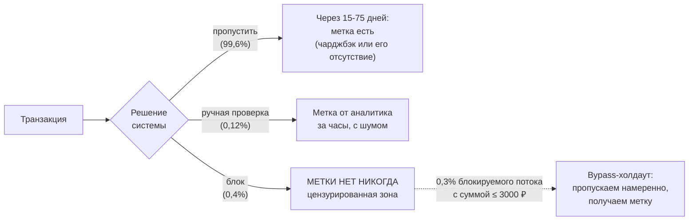
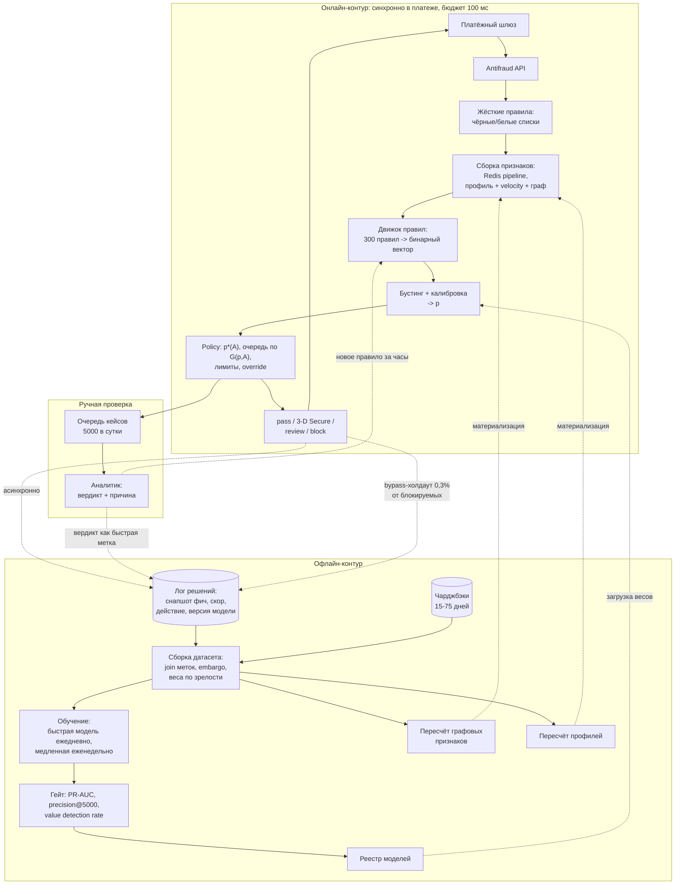

# Кейс: антифрод

> **Зачем эта глава.** Антифрод — самый «взрослый» кейс из всех, что дают на секции ML System
> Design: здесь экстремальный дисбаланс, разметка приходит через месяц и приходит не для всех,
> ошибки стоят конкретных денег в обе стороны, противник адаптируется к вашей модели, а решение
> надо принять за десятки миллисекунд внутри платёжного потока. После этой главы вы сможете
> пройти кейс целиком по каркасу и, что важнее, не свалиться в «возьму бустинг и оптимизирую
> ROC-AUC» — ответ, после которого секцию можно не продолжать.

**Уровень:** 🎯 middle → 🧠 middle+
**Предварительно нужно:** [каркас ответа](01-framework.md), [метрики качества](../02-classic-ml/04-metrics.md), [дисбаланс и калибровка](../02-classic-ml/12-imbalance-and-calibration.md), [валидация и утечки](../02-classic-ml/13-validation-and-leakage.md), [деградация модели](../09-monitoring/04-model-degradation.md)
**Как проработать:** чтение + прогон кейса вслух с таймером

---

## Карта главы

- [0. Как звучит задача](#0-как-звучит-задача)
- [1. Шаг 1. Уточняющие вопросы и полученные ответы](#1-шаг-1-уточняющие-вопросы-и-полученные-ответы)
- [2. Шаг 2. Метрики: от денег к precision@k](#2-шаг-2-метрики-от-денег-к-precisionk)
- [3. Шаг 3. Данные: отложенная и неполная разметка](#3-шаг-3-данные-отложенная-и-неполная-разметка)
- [4. Шаг 4. Постановка ML-задачи, бейзлайн и лестница](#4-шаг-4-постановка-ml-задачи-бейзлайн-и-лестница)
- [5. Шаг 5. Признаки и модель](#5-шаг-5-признаки-и-модель)
- [6. Шаг 6. Архитектура и бюджет латентности](#6-шаг-6-архитектура-и-бюджет-латентности)
- [7. Шаг 7. Оценка, выкатка, мониторинг](#7-шаг-7-оценка-выкатка-мониторинг)
- [8. Шаг 8. Риски и развитие](#8-шаг-8-риски-и-развитие)
- [9. Куда обычно копает интервьюер](#9-куда-обычно-копает-интервьюер)
- [10. Подводные камни](#10-подводные-камни)
- [11. Проверь себя](#11-проверь-себя)
- [12. Практика](#12-практика)
- [13. Что читать дальше](#13-что-читать-дальше)

---

## 0. Как звучит задача

> «Спроектируйте систему обнаружения мошеннических транзакций для нашего платёжного шлюза.»

Одна фраза, 45 минут. Дальше — ваш ход, и первый ход не «бустинг», а вопросы.

> 💬 **На собеседовании.** Открывающая реплика, которая экономит вам десять минут:
> «Прежде чем проектировать, я хочу зафиксировать четыре вещи: что именно мы называем фродом,
> сколько у нас времени на решение внутри платежа, откуда мы узнаём правду о транзакции
> и что происходит после срабатывания — блок, ручная проверка или дополнительная аутентификация.
> От последнего пункта система меняется целиком». Это сразу показывает, что вы понимаете:
> антифрод — это не классификатор, это **процесс принятия решения**.

> 🌱 **База.** Если вы впервые видите этот кейс, держите в голове четыре вещи, вокруг которых
> он весь построен — остальное детали. Первое: фрода в тысячу раз меньше, чем честных платежей,
> поэтому «поймать побольше» автоматически означает «обидеть очень многих». Второе: правда
> о транзакции приходит через месяц (чарджбэк), а решение надо принять за 50 миллисекунд.
> Третье: если мы транзакцию отклонили, мы **никогда не узнаем**, была ли она фродом, —
> и это ломает и обучение, и оценку. Четвёртое: по ту сторону сидит человек, который меняет
> схему, как только мы её закрыли, — задача нестационарна по своей природе. Всё остальное
> в главе — инженерные ответы на эти четыре факта.

---

## 1. Шаг 1. Уточняющие вопросы и полученные ответы

Задаём вопросы блоками и сразу записываем ответы — дальше весь разбор опирается на эти числа.

| Что спрашиваем | Ответ интервьюера | Почему это меняет систему |
|---|---|---|
| Какой тип фрода в фокусе? | Кража карточных данных, оплата чужой картой на маркетплейсе (card-not-present). Не берём в фокус мошенничество продавцов и возвратный фрод | Тип фрода определяет и признаки, и источник метки |
| Объём? | 4 млн транзакций в сутки, средний чек 1 800 ₽, оборот ~7,2 млрд ₽/сутки | Даёт базу для всех расчётов |
| Нагрузка? | Средний поток 46 TPS, вечерний пик 250 TPS, в распродажу до 800 TPS | Определяет железо и стоимость |
| Доля фрода? | ~0,1% транзакций по количеству (≈4 000 в сутки), средний чек фродовой транзакции 5 400 ₽ | Экстремальный дисбаланс 1:1000 |
| Есть ли решение сейчас? | Да, движок правил на 300+ правил. Блокирует 0,4% потока (16 000 в сутки), precision ≈ 15% | Есть с чем сравнивать и есть чем подстраховаться |
| Кто и когда узнаёт правду? | Чарджбэк от банка-эмитента: от 15 до 75 дней, медиана 32 дня. Плюс жалобы клиентов (1–3 дня) и вердикты аналитиков (часы) | **Ключевое ограничение всей задачи** |
| Что делаем при срабатывании? | Три действия: пропустить, отправить на ручную проверку, отклонить. Есть ещё шаг 3-D Secure как «мягкий» вариант | Это не бинарная классификация, а policy |
| Ёмкость ручной проверки? | 40 аналитиков в три смены, ~125 кейсов на смену → **5 000 кейсов в сутки** | Задаёт $k$ в precision@k |
| Бюджет латентности? | Платёжный шлюз даёт антифроду 100 мс жёстко. Таймаут → решение принимается без нас | Синхронный контур, десятки мс |
| Регуляторика? | Нужна причина отказа для клиента и для внутреннего комплаенса; решение должно быть воспроизводимо задним числом | Требование к объяснимости и к логированию |
| Данные? | Логи транзакций за 3 года, снапшоты профилей, устройства (fingerprint), история чарджбэков | Хватает на обучение |

**Фиксируем вслух.** «Итак: card-not-present фрод, 4 млн транзакций в сутки, 0,1% фрода,
три возможных действия, 5 000 кейсов ручной проверки в сутки, 100 мс жёстко, метка приходит
через месяц и не для всех транзакций, нужна объяснимость. Правильно понял?»

> 🧠 **Middle+.** Стоит сразу предложить сужение: «Задача огромная. Предлагаю спроектировать
> контур для card-not-present транзакций в момент оплаты. Проверку продавцов, отмывание
> и account takeover до момента платежа вынесу в “развитие”, если останется время».
> Это управляемый объём и сигнал, что вы умеете приоритизировать.

---

## 2. Шаг 2. Метрики: от денег к precision@k

### Бизнес-метрика: полная стоимость фрод-риска

Первая ловушка кейса — считать успехом «поймали больше фрода». Поймать 100% фрода тривиально:
отклонять всё. Поэтому бизнес-метрика — **суммарные потери, а не пойманный фрод**:

$$
\text{TotalCost} \;=\; \underbrace{L_{\text{fraud}}}_{\text{пропущенный фрод}} \;+\;
\underbrace{L_{\text{fp}}}_{\text{ложные блокировки}} \;+\;
\underbrace{C_{\text{ops}}}_{\text{ручная проверка}}
$$

где $L_{\text{fraud}}$ — сумма возмещений по чарджбэкам плюс штрафы платёжных систем,
$L_{\text{fp}}$ — упущенная маржа с отклонённых честных транзакций плюс отток обиженных клиентов,
$C_{\text{ops}}$ — фонд оплаты труда аналитиков плюс потери конверсии от задержки платежа.

Посчитаем текущее состояние по числам из шага 1. Правила блокируют 16 000 транзакций в сутки
при precision 15%: значит, ловят 2 400 фродовых и режут 13 600 честных. Пропускается
$4\,000 - 2\,400 = 1\,600$ фродовых транзакций в сутки, средний чек 5 400 ₽ →
$L_{\text{fraud}} \approx 8{,}6$ млн ₽/сутки. Если ложная блокировка стоит нам порядка 600 ₽
(упущенная маржа 8% от 1 800 ₽ плюс ожидаемая потеря будущей ценности клиента), то
$L_{\text{fp}} \approx 8{,}2$ млн ₽/сутки.

Эти два числа — одного порядка. Это и есть главный содержательный вывод кейса, который надо
проговорить вслух: **в зрелом антифроде ложные блокировки стоят примерно столько же, сколько
пропущенный фрод**, и любое улучшение измеряется по сумме, а не по одному слагаемому.

> ⚠️ **Типичная ошибка.** «Наша метрика — recall, потому что пропустить фрод дороже».
> Это верно на одну транзакцию и неверно на потоке: фрода в 1000 раз меньше, поэтому даже
> 1% ложных срабатываний на честном потоке даёт 40 000 обиженных клиентов в сутки при
> 4 000 фродовых транзакций. Соотношение частот съедает соотношение цен.

### Продуктовые (онлайн) метрики

- **Approval rate** — доля одобренных транзакций. Падение на 0,3 п.п. заметно в выручке
  раньше, чем в любой ML-метрике.
- **Chargeback rate в bps от оборота** — то, на что смотрят платёжные системы; превышение
  пороговых значений программ мониторинга Visa/Mastercard влечёт штрафы, поэтому это
  одновременно и guardrail.
- **Доля потока на ручной проверке** — операционная нагрузка.
- **Доля апелляций и их удовлетворения** — прокси качества ложных срабатываний.

### ML-метрики (офлайн)

Здесь важно выбрать метрики под **реальную процедуру использования модели**, а не «стандартные».

| Метрика | Как считаем | Зачем именно она |
|---|---|---|
| **precision@5000** | доля истинного фрода среди 5 000 транзакций с наибольшим скором за сутки | 5 000 — ёмкость аналитиков; метрика напрямую отвечает «сколько полезной работы получит очередь» |
| **Value detection rate @ FPR** | доля пойманных **денег** при фиксированной доле ложных блокировок (например, 0,2%) | бизнес теряет рубли, а не транзакции; recall по количеству и по деньгам расходятся сильно |
| **PR-AUC** | площадь под precision-recall кривой | при 0,1% позитивов ROC-AUC косметически высок и почти нечувствителен к изменениям |
| **Калибровка (Brier, reliability curve)** | сравнение предсказанной вероятности с фактической частотой по бинам | без калиброванной $p$ матрица стоимостей не работает — см. [§4](#4-шаг-4-постановка-ml-задачи-бейзлайн-и-лестница) |

> 💬 **На собеседовании.** Спросят: «Почему не ROC-AUC?» Хороший ответ: ROC-AUC усредняет
> по всем порогам, а мы работаем в крошечном уголке — верхние 0,1–0,5% скоров. Модель может
> набрать ROC-AUC 0,98 и при этом дать никуда не годный precision в рабочей точке, потому что
> FPR считается от гигантского знаменателя честных транзакций: FPR = 0,5% при 4 млн транзакций —
> это 20 000 ложных блокировок в сутки. PR-AUC и precision@k чувствительны именно к нужной зоне.
> Плохой ответ: «ROC-AUC плохо работает при дисбалансе» без объяснения механизма.

### Guardrail-метрики

Латентность p99 антифрод-сервиса, доля fail-open (когда мы не успели и транзакция ушла
без нашего решения), approval rate **в разрезе сегментов** (новые пользователи, регионы,
типы карт — модель любит резать незнакомое), доля решений с деградированными признаками,
доля решений без валидного объяснения.

**Про риск связи уровней.** ML-метрика precision@5000 оптимизирует очередь аналитиков,
а бизнес-метрика — деньги. Они расходятся: очередь, набитая мелкими уверенными кейсами,
даёт отличный precision и почти не спасает денег. Лечится тем, что в очередь мы отбираем
не по скору, а по ожидаемой экономии ([§4](#4-шаг-4-постановка-ml-задачи-бейзлайн-и-лестница)), и метрику качества очереди считаем взвешенной
по сумме.

---

## 3. Шаг 3. Данные: отложенная и неполная разметка

Это сердце кейса. Если вы разберёте только этот шаг, но разберёте хорошо, секция уже зачтена.

### Откуда берётся таргет

| Источник метки | Задержка | Полнота | Шум |
|---|---|---|---|
| Чарджбэк от эмитента | 15–75 дней, медиана 32 | высокая для card-not-present | низкий, но есть «дружественный фрод» — клиент оспаривает свою же покупку |
| Жалоба клиента в поддержку | 1–3 дня | низкая (жалуются не все) | средний |
| Вердикт аналитика при ручной проверке | часы | только по отобранным кейсам | 5–10% ошибок |
| Сигнал от банка-эмитента / межбанковский обмен | дни | частичная | низкий |
| Срабатывание правила | мгновенно | — | **это не метка**, это решение системы |

Последняя строка — самая частая ловушка. Кандидаты говорят «обучимся на срабатываниях правил»
и тем самым обучают модель воспроизводить правила, а не находить фрод.

### Проблема 1: метка приходит через месяц

Следствия, которые надо назвать явно:

1. **Обучаться можно только на «созревших» данных.** Если сегодня 26 июля, то данные за июнь
   размечены неполно: часть чарджбэков ещё в пути. Обучение на «зелёных» метках систематически
   занижает долю фрода в свежем периоде и учит модель, что «недавнее — честное».
2. **Модель структурно отстаёт.** При времени созревания 60 дней (95-й перцентиль) свежайшая
   полностью размеченная неделя — двухмесячной давности. Для противника, который меняет схему
   за дни, это вечность.
3. **Мониторинг качества «сегодня» невозможен напрямую.** Нужны прокси.

**Что с этим делают на практике.** Строим *кривую созревания меток* (label maturity curve):
доля чарджбэков, пришедших к дню $t$ после транзакции. Затем:

- обучаем **быструю модель** на метках, доступных за часы-дни (вердикты аналитиков, жалобы),
  переобучение ежедневно — она ловит новые схемы;
- обучаем **медленную модель** на полностью созревших чарджбэках, переобучение еженедельно —
  она даёт качественный, но запаздывающий сигнал;
- в проде используем их ансамбль, а незрелый период либо исключаем из обучения, либо
  включаем с весом $1/\hat{m}(t)$, где $\hat m(t)$ — доля созревших меток на возрасте $t$
  (то есть перевзвешиваем позитивы, компенсируя их недоучёт).

> 📐 **Разбор формулы.** Пусть $\hat m(t) \in (0,1]$ — оценка доли чарджбэков, которые уже
> пришли, для транзакций возраста $t$ дней. Для транзакции возраста 20 дней $\hat m \approx 0{,}45$:
> мы видим меньше половины будущих позитивов. Если такую транзакцию с меткой «фрод» взять
> с весом $1/0{,}45 \approx 2{,}2$, суммарная «масса» позитивов в этом срезе восстановится
> до ожидаемой. Негативы при этом остаются с весом 1 — и это допущение работает, пока доля
> позитивов мала (мы почти не портим негативный класс). Это грубая, но рабочая коррекция;
> честнее — модель выживаемости на времени до чарджбэка.

### Проблема 2: заблокированные транзакции не дают метку (цензурирование)

Мы отклонили транзакцию — значит, она не состоялась, значит, чарджбэка по ней быть не может,
значит, **мы никогда не узнаем, была ли она фродом**. Это не пропуск в данных, это
**цензурирование** (censoring): отсутствие метки коррелирует с самим предсказанием.



Последствия, если это игнорировать:

- Модель обучается на выборке «то, что предыдущая версия системы решила пропустить», то есть
  на распределении, из которого вырезан самый явный фрод. Она видит только те схемы, которые
  прошлая система **не** ловила, и постепенно разучивается ловить старые схемы — а те возвращаются,
  как только правило снимут.
- Любая офлайн-оценка на таких данных завышена: тестовая выборка не содержит самых сложных
  случаев.
- Правила и модель образуют самоподтверждающуюся петлю: правило блокирует сегмент → в данных
  сегмент отсутствует → модель считает его безопасным → метрики говорят «правило можно снять» →
  снимаем и получаем всплеск.

**Решение — bypass-холдаут (allow-through holdout).** Намеренно пропускаем небольшую случайную
долю транзакций, которые система хотела заблокировать, и получаем по ним честные метки.
Это стоит денег, поэтому считаем цену:

пропускаем 0,3% блокируемого потока с ограничением суммы ≤ 3 000 ₽ → ≈ 50 транзакций в сутки;
доля фрода среди них ~60%, средняя сумма ~2 500 ₽ → ожидаемые потери ≈ 75 000 ₽/сутки,
или ~27 млн ₽ в год. При годовых потерях от фрода порядка 3 млрд ₽ это **менее 1%** —
цена, за которую мы получаем несмещённую оценку качества и возможность вообще оценивать
модель в верхней зоне скоров.

> 💬 **На собеседовании.** Спросят: «Как вы измерите recall, если заблокированные транзакции
> не имеют метки?» Хороший ответ: «Никак, если ничего не менять — оценка будет смещена вверх.
> Поэтому в систему закладывается bypass-холдаут: 0,1–0,5% блокируемого потока с ограничением
> по сумме пропускается случайно, и на этой подвыборке recall оценивается несмещённо, а затем
> переносится на весь блокируемый поток с весом, обратным вероятности пропуска. Годовая цена
> такой честности — около процента потерь от фрода, и это самая окупаемая строка бюджета
> в системе». Плохой ответ: «будем считать заблокированные фродом».

### Что логировать

Строго обязательно, иначе система невоспроизводима:

- **снапшот вектора признаков ровно в момент решения** (а не пересчитанный потом — иначе
  [train/serve skew](../07-mlops/03-data-and-feature-store.md) и утечка будущего в velocity-счётчики);
- версия модели, версия набора правил, список сработавших правил;
- скор, принятое действие и причина (какое правило/порог сработали);
- для комплаенса — идентификатор решения, по которому его можно поднять через год.

### Схема сплита

Только временной сплит, и с двумя дополнительными деталями, которых обычно не называют:

```
|<--- train: 12 мес --->|<-- embargo: 75 дней -->|<-- valid: 1 мес -->|<-- test: 1 мес -->|
                          метки ещё не созрели       полностью созревшие метки
```

- **Embargo** (разрыв) между train и valid равен максимальному времени созревания метки.
  Без него в train попадают транзакции, чьи чарджбэки физически ещё не пришли, и часть
  позитивов помечена как негативы — модель учится на испорченных метках, а метрика на valid
  оказывается выше, чем в проде.
- **Тест берём только из полностью созревшего периода.** Тест на «свежем» месяце покажет
  завышенный precision (часть FP на самом деле TP, чьи чарджбэки ещё в пути).
- Группировка: если делать случайный сплит, транзакции одной карты попадут и в train, и в test —
  прямая утечка через velocity-признаки. Временной сплит решает это частично; для честности
  полезно дополнительно проверить пересечение карт между периодами.

---

## 4. Шаг 4. Постановка ML-задачи, бейзлайн и лестница

### Постановка

Модель предсказывает $p = P(\text{fraud} \mid x)$ — **калиброванную вероятность**, а решение
принимает отдельный слой политики, минимизирующий ожидаемую стоимость. Это разделение
принципиально: модель не должна «знать» ни про ёмкость аналитиков, ни про текущие цены ошибок,
иначе её придётся переобучать каждый раз, когда бизнес поменяет ставку.

Три действия и их ожидаемая стоимость:

$$
C_{\text{approve}}(p, A) = p\,(A + F), \qquad
C_{\text{block}}(p, A) = (1-p)\,(mA + \lambda), \qquad
C_{\text{review}}(p, A) = c_r + \varepsilon\big[p(A+F) + (1-p)(mA+\lambda)\big]
$$

где $A$ — сумма транзакции в рублях; $F \approx 2\,000$ ₽ — фиксированный штраф и издержки
обработки чарджбэка; $m = 0{,}08$ — маржа (доля от суммы), которую мы теряем, отклоняя честный
платёж; $\lambda \approx 400$ ₽ — ожидаемая потеря будущей ценности клиента от ложного отказа;
$c_r \approx 90$ ₽ — себестоимость разбора одного кейса аналитиком; $\varepsilon = 1 - a \approx 0{,}08$ —
доля ошибок аналитика ($a$ — его точность).

Приравняв $C_{\text{approve}} = C_{\text{block}}$, получаем порог блокировки:

$$
p^{*}(A) \;=\; \frac{mA + \lambda}{mA + \lambda + A + F}
$$

> 📐 **Разбор формулы.** Числитель — цена ошибки «заблокировали хорошего», знаменатель — сумма
> цен обеих ошибок. Порог = доля, которую цена ложной блокировки занимает в общей цене ошибок.
> Подставим числа: при $A = 1\,800$ ₽ получаем $p^* = 544/4344 = 0{,}125$; при $A = 10\,000$ ₽ —
> $0{,}091$; при $A = 50\,000$ ₽ — $0{,}078$. Порог **падает с ростом суммы**: чем дороже
> транзакция, тем меньшей уверенности достаточно, чтобы её остановить, потому что штраф $F$
> и маржа $m$ входят в формулу по-разному ($F$ не растёт с суммой, а упущенная маржа растёт).
> Отсюда вывод, ради которого всё это считалось: **единый порог по вероятности — ошибка**,
> порог должен быть функцией суммы (а в общем случае — и сегмента клиента).

Ручная проверка — ресурс с жёсткой ёмкостью 5 000 кейсов в сутки. Отбираем в очередь не по скору,
а по **ожидаемому выигрышу от разбора**:

$$
G(p, A) \;=\; \min\{C_{\text{approve}},\, C_{\text{block}}\} \;-\; C_{\text{review}}
$$

и берём топ-5000 по $G$. Такая очередь автоматически наполняется дорогими и неоднозначными
кейсами, а не мелкими и очевидными.

```python
# Политика решений: три действия, порог из матрицы стоимостей, очередь по выигрышу от разбора
import numpy as np

F, M_RATE, LAMBDA, C_REV, EPS = 2000.0, 0.08, 400.0, 90.0, 0.08
REVIEW_CAPACITY = 5000  # кейсов в сутки, жёсткое ограничение операционной команды

def decide(p: np.ndarray, amount: np.ndarray, capacity: int = REVIEW_CAPACITY) -> np.ndarray:
    """p — калиброванная вероятность фрода, amount — сумма в рублях. Возвращает 0/1/2 = pass/review/block."""
    c_approve = p * (amount + F)
    c_block = (1.0 - p) * (M_RATE * amount + LAMBDA)
    best_auto = np.minimum(c_approve, c_block)
    c_review = C_REV + EPS * (c_approve + c_block)

    action = np.where(c_block < c_approve, 2, 0)          # базовое решение без участия человека
    gain = best_auto - c_review                            # сколько экономит разбор кейса человеком
    # ёмкость очереди ограничена: берём топ-K по экономии, но только там, где она положительна
    order = np.argsort(-gain)
    eligible = order[gain[order] > 0][:capacity]
    action[eligible] = 1
    return action

# Проверка на синтетике: порог блокировки действительно падает с суммой
for a in (1_800.0, 10_000.0, 50_000.0):
    p_star = (M_RATE * a + LAMBDA) / (M_RATE * a + LAMBDA + a + F)
    print(f"amount={a:>8.0f} -> p* = {p_star:.3f}")
```

> ⌨️ **Руками.** Реализуйте `decide()` за 15 минут, не подглядывая, и проверьте себя
> одним тестом: при $A = 100$ ₽ и $p = 0{,}3$ функция должна пропускать транзакцию,
> а при $A = 100\,000$ ₽ и том же $p$ — блокировать. Если у вас получилось наоборот
> или одинаково — вы где-то потеряли зависимость порога от суммы, а это ровно та ошибка,
> которую делают в проде.

### Почему это не задача поиска аномалий

Вопрос «а почему не Isolation Forest / автоэнкодер?» задают почти всегда, и он проверяет,
понимаете ли вы разницу между «редкое» и «плохое».

Безнадзорные методы (unsupervised anomaly detection) ищут объекты, нетипичные относительно
общего распределения. Проблема в том, что **нетипичность и мошенничество — разные вещи**.
Клиент, впервые купивший холодильник за 90 000 ₽, максимально нетипичен и абсолютно честен.
А хорошо подготовленный фрод, наоборот, старается выглядеть как обычная покупка — и по всем
метрикам расстояния он находится в центре распределения. При доле позитивов 0,1% безнадзорный
детектор с отличной по своим меркам работой даёт precision порядка единиц процентов,
а этого не хватает даже на заполнение очереди аналитиков.

У нас же есть 1,5 млн размеченных примеров фрода за год — грех не использовать supervised-подход.

Где безнадзорные методы всё-таки уместны и об этом стоит сказать самому: (1) **холодный старт**
нового типа фрода, для которого меток ещё нет вовсе; (2) **детектор смены режима** — резкий
рост плотности объектов в ранее пустой области признакового пространства служит ранним
сигналом атаки за недели до появления чарджбэков; (3) **источник признаков** — расстояние
до ближайших соседей или ошибка реконструкции автоэнкодера подаются в основную supervised-модель
как ещё одна колонка. Третий вариант — самый практичный: он берёт пользу от безнадзорного
метода, не отдавая ему право принимать решение. Подробнее — в главе
[поиск аномалий](../02-classic-ml/18-anomaly-detection.md).

### Бейзлайн без ML

Текущий движок правил — это и есть бейзлайн, и его нельзя выключать. Минимальный набор,
который закрывает половину задачи без всякого ML: скоростные лимиты («более 3 карт на устройстве
за час», «более 5 попыток оплаты за 10 минут»), чёрные списки карт/устройств/IP, несоответствие
страны эмитента и гео, первая транзакция на новом устройстве с суммой выше личного 99-го
перцентиля.

ML обязан **сравниваться с правилами на одной и той же выборке** и побеждать по полной стоимости,
а не по AUC. Если бустинг даёт +2% precision при том же recall — он не окупает свою поддержку.

### Лестница усложнения

1. Правила (есть) → измеряем их полную стоимость, это точка отсчёта.
2. Градиентный бустинг на транзакционных и профильных признаках, скор как ещё один вход
   для правил (мягкий запуск: правило «скор > X и сумма > Y»).
3. Полноценный policy-слой с матрицей стоимостей и калиброванной вероятностью, правила
   остаются только как жёсткие override.
4. Признаки из графа связей (карта — устройство — адрес — почта), считаемые офлайн.
5. Модель на последовательности транзакций карты/аккаунта; эмбеддинг последовательности
   как признак в бустинг.

Критерий перехода на следующую ступень — предыдущая доехала до прода и уперлась в потолок.

---

## 5. Шаг 5. Признаки и модель

### Группы признаков и где они считаются

| Группа | Примеры | Где и когда считается | Бюджет |
|---|---|---|---|
| Транзакционные | сумма, валюта, MCC, канал, тип карты, BIN и страна эмитента, наличие 3-D Secure, время суток | из запроса, онлайн | 0 мс |
| Скоростные (velocity) | число попыток и сумм по карте / устройству / IP / аккаунту / получателю за 1 мин, 10 мин, 1 ч, 24 ч, 7 дней | потоковая агрегация в Redis, инкремент при каждом событии | 5–8 мс на чтение |
| Профиль клиента и карты | средний чек и его дисперсия за 30/90/180 дней, типичные MCC, типичные часы, типичное гео, возраст аккаунта | офлайн, ночной пересчёт, материализация в онлайн-хранилище | часть того же чтения |
| Отклонение от профиля | $z$-оценка суммы относительно личной истории, «новизна» устройства/гео/получателя, доля новых атрибутов в транзакции | онлайн, из профиля и запроса | 3–5 мс |
| Устройство и сессия | fingerprint, эмулятор/root, VPN/прокси/ASN, время заполнения формы, поведенческая биометрия, число аккаунтов на устройстве | приходит с фронта в запросе + онлайн-хранилище | входит в чтение |
| Графовые | размер компоненты связности «карта–устройство–адрес–почта», доля подтверждённого фрода в компоненте, число карт, делящих устройство | офлайн (полный пересчёт ночью) + инкрементальный апдейт раз в час | предпосчитано |
| Признаки от правил | какие из 300 правил сработали (бинарный вектор), суммарный вес правил | онлайн, из движка правил | 2 мс |
| Мерчант/получатель | возраст продавца на площадке, его историческая доля чарджбэков, средний чек категории | офлайн | предпосчитано |

> ⚠️ **Типичная ошибка.** Считать velocity-признаки на исторических данных «как есть»,
> оконной функцией по всей таблице. В момент предсказания счётчик за последний час содержит
> только транзакции **до** текущей; при офлайн-расчёте легко захватить и последующие —
> и модель узнает будущее. Симптом: офлайн-качество отличное, в проде провал. Правильно —
> либо честный point-in-time расчёт, либо (надёжнее) логировать признаки в момент решения
> и учиться ровно на логах.

> 🧠 **Middle+.** Отдельно проговорите **асимметрию источников признаков**. Всё, что приходит
> с клиентского устройства (fingerprint, поведенческая биометрия), контролируется противником
> и может подделываться. Всё, что считается на нашей стороне (velocity, граф, профиль),
> подделать сложнее, но и оно атакуемо: фродер может «прогреть» аккаунт мелкими честными
> покупками. Хороший ответ на вопрос «какие признаки важнее» — не топ важностей из модели,
> а рассуждение об устойчивости признака к манипуляции.

### Модель: три варианта и выбор

**Вариант A. Градиентный бустинг (CatBoost/LightGBM) на табличных признаках.**
Плюсы: инференс 800 деревьев глубины 6 на 250 признаках — 2–3 мс на одном ядре, что укладывается
в бюджет с запасом; отлично работает с разнородными табличными признаками и категориями высокой
кардинальности; даёт SHAP-объяснения за приемлемое время (TreeSHAP). Минусы: плохо калиброван
из коробки (нужна изотоническая калибровка или Platt поверх), не видит последовательность.

**Вариант B. Нейросеть по последовательности транзакций (GRU или небольшой трансформер).**
Плюсы: улавливает паттерн «серия транзакций», характерный для тестирования краденых карт
(кардинг: серия мелких платежей, затем крупный). Минусы: 15–25 мс на инференс с батчингом,
дороже в поддержке, объяснимость сложнее. Не тянет в качестве единственной модели в 100 мс бюджете.

**Вариант C. Графовая модель (GNN) на графе «карта–устройство–адрес».**
Плюсы: фрод кластеризуется, и связь с уже подтверждённым фродом — сильнейший сигнал.
Минусы: онлайн-инференс по графу невозможен в бюджете, граф меняется постоянно.

**Выбор.** Основа — вариант A. Вариант C превращаем в **офлайн-признаки** (характеристики
компоненты связности считаем ночью и раз в час, кладём в онлайн-хранилище) — это даёт 80%
пользы графа без его цены. Вариант B добавляем на следующей итерации как отдельную модель,
чей выход (эмбеддинг или скор) складывается в feature store как признак для бустинга —
так последовательностная информация попадает в основную модель, не ломая бюджет латентности.

**Про дисбаланс.** Не используем SMOTE и агрессивный оверсэмплинг: они портят калибровку,
а нам нужна именно вероятность в формуле $p^*(A)$. Рабочая схема — оставить все позитивы
и проредить негативы с коэффициентом $\beta$ (например, $\beta = 0{,}1$), а затем вернуть
вероятность в исходный масштаб:

$$
p \;=\; \frac{\beta\, p_s}{\beta\, p_s - p_s + 1}
$$

где $p_s$ — вероятность, которую выдаёт модель, обученная на прореженной выборке,
$\beta \in (0,1]$ — доля сохранённых негативов, $p$ — вероятность на исходном распределении.
Подробности и вывод — в главе [дисбаланс и калибровка](../02-classic-ml/12-imbalance-and-calibration.md).

---

## 6. Шаг 6. Архитектура и бюджет латентности



### Бюджет латентности по стадиям

Целимся в p99 ≤ 60 мс при жёстком таймауте 100 мс — запас нужен, потому что платёжный шлюз
считает таймаут отказом сервиса, а не отказом транзакции.

| Стадия | p50 | p99 | Комментарий |
|---|---|---|---|
| Сеть, десериализация, валидация | 2 мс | 5 мс | gRPC, protobuf |
| Жёсткие правила (списки) | 1 мс | 2 мс | in-memory bloom-фильтры |
| Чтение признаков: один Redis pipeline, ~60 ключей | 6 мс | 14 мс | один round-trip обязателен, N+1 запросов убьёт бюджет |
| Инкремент velocity-счётчиков | 2 мс | 5 мс | в том же pipeline |
| Сборка вектора и производные признаки | 3 мс | 7 мс | чистый CPU |
| Движок правил (300 правил) | 2 мс | 4 мс | компилируется в код, не интерпретируется |
| Инференс бустинга + калибровка | 3 мс | 6 мс | 800 деревьев × глубина 6, одно ядро |
| Policy-слой и лимиты | 1 мс | 2 мс | |
| **Итого** | **20 мс** | **45 мс** | остаток 55 мс — запас на GC, сетевые хвосты, всплески |

Логирование решения — **асинхронно**, вне критического пути (пишем в Kafka, fire-and-forget
с локальным буфером). Синхронная запись лога — классическая причина, по которой антифрод
внезапно начинает отдавать p99 в 300 мс.

### Что считается заранее

Профили (ночью), графовые характеристики (ночью + инкрементально раз в час), статистики
мерчантов (ночью), веса модели (при выкатке). Онлайн считаются только velocity-счётчики
и производные от текущего запроса — иначе в бюджет не уложиться.

### Фолбэки

| Отказ | Поведение |
|---|---|
| Redis не отвечает за 15 мс | Идём с дефолтными значениями признаков (теми же, что использовались как заполнение пропусков при обучении) + повышаем «консервативность» политики; метрика «доля деградированных решений» с алертом |
| Модель не отвечает / упала | Fail-open на движок правил: решение принимают только правила. Правила должны уметь работать без скора — поэтому скор входит в них как один из факторов, а не как единственный |
| Превышен таймаут 100 мс | Шлюз пропускает транзакцию без нашего решения (fail-open). Доля таких — guardrail-метрика; альтернатива fail-close недопустима, она обрушит approval rate |
| Всплеск трафика ×3 (распродажа) | Автоскейл + деградация: отключаем самые дорогие признаки (графовые читаются, последовательностная модель — нет) |

> 💬 **На собеседовании.** Спросят: «fail-open или fail-close при недоступности антифрода?»
> Хороший ответ: почти всегда fail-open, потому что цена простоя платежей выше цены нескольких
> минут пропущенного фрода — но с оговорками: fail-open только для транзакций ниже порога суммы,
> выше него — принудительный 3-D Secure или отказ; плюс жёсткий лимит длительности режима
> и алерт на дежурного. Плохой ответ: выбрать один вариант без обсуждения суммы и длительности.

---

## 7. Шаг 7. Оценка, выкатка, мониторинг

### Офлайн-оценка

Временной сплит с embargo ([§3](#3-шаг-3-данные-отложенная-и-неполная-разметка)), сравнение **с текущим движком правил в той же рабочей точке**:
фиксируем долю блокируемого потока 0,4% и сравниваем пойманные деньги. Доверительный интервал —
бутстрап по дням (не по транзакциям: транзакции внутри дня зависимы через общие карты и атаки).

Отдельно — оценка в цензурированной зоне: на bypass-холдауте считаем несмещённый recall
и экстраполируем на весь блокируемый поток с весом $1/\pi$, где $\pi = 0{,}003$ — вероятность
пропуска.

### Онлайн-оценка: A/B

- **Единица рандомизации — клиент**, а не транзакция. Причина: velocity-признаки и решения
  по одной карте зависимы, а последствия ложной блокировки (отток) измеряются на человеке.
  Рандомизация по транзакциям даст утечку между группами через общие счётчики.
- **Ключевая метрика** — полная стоимость на клиента за период (потери от фрода + упущенная
  маржа), **guardrails** — approval rate, доля ручных проверок, p99 латентности, chargeback rate.
- **MDE.** Метрика тяжелохвостая (редкие крупные потери), поэтому считаем на усечённой
  или винзоризованной версии и применяем [CUPED](../10-ab-testing/03-variance-reduction.md)
  на предпериоде. Ориентир: при 4 млн транзакций в сутки и 15% трафика на эксперимент
  на детекцию относительного улучшения полной стоимости в 5% нужно 3–4 недели —
  меньше не даст мощности из-за задержки чарджбэков.
- **Отдельная сложность:** ключевая метрика созревает через 30–75 дней. Поэтому эксперимент
  читается в два захода: через 2 недели — по approval rate, доле ручных проверок и вердиктам
  аналитиков (быстрые прокси), через 3 месяца — финально по чарджбэкам.

### Выкатка

1. **Shadow (2 недели).** Модель считает скор на 100% трафика, решение не влияет ни на что.
   Проверяем: латентность p99, распределение скоров, долю дефолтных признаков, совпадение
   офлайн- и онлайн-значений признаков (главный источник сюрпризов).
2. **Canary 1%** клиентов на неделю, с ручным разбором первых сотен блокировок аналитиками —
   это дешёвая и очень информативная проверка.
3. **Ramp-up** 5% → 25% → 50% → 100%, на каждой ступени критерии отката: approval rate не упал
   более чем на 0,15 п.п., p99 не вырос выше 60 мс, доля ручной очереди в пределах ёмкости,
   отсутствие сегментов с провалом approval rate более 1 п.п.
4. **Champion/challenger навсегда.** В антифроде новая модель не «заменяет» старую: обе живут,
   старая остаётся горячим фолбэком, потому что деградация может проявиться через недели.

### Мониторинг: четыре слоя

| Слой | Метрики | Что делаем при срабатывании |
|---|---|---|
| Инфраструктура | p50/p95/p99, RPS, ошибки, доля таймаутов и fail-open, ресурсы | стандартный дежурный runbook, при росте таймаутов — отключение дорогих признаков |
| Данные | свежесть профилей и графа, доля дефолтных значений признаков, PSI по ключевым признакам, доля неизвестных категорий (новые BIN, устройства) | проверить пайплайн; при устаревшем графе — предупредить аналитиков, что качество ниже |
| Модель | распределение скоров (по дням и по сегментам), доля блокируемых, precision по вердиктам аналитиков (доступен за часы), калибровка на созревших данных | сегментный разбор, при резком сдвиге — откат на champion |
| Бизнес | approval rate, chargeback rate в bps, полная стоимость, размер очереди и время ожидания в ней | эскалация владельцу риска |

> 🧠 **Middle+.** Ключевое отличие мониторинга антифрода от мониторинга рекомендаций —
> **вердикты аналитиков дают вам метрику качества за часы, а не за месяц**. Это единственный
> быстрый источник правды, поэтому очередь ручной проверки — не только операция, но и
> измерительный прибор. Отсюда практический ход: 5–10% очереди заполнять **случайной выборкой**
> из потока, а не только топом по скору. Такая «случайная страта» даёт несмещённую оценку
> доли фрода в непроверяемом потоке и обнаруживает новые схемы, на которые модель ещё
> не реагирует. Стоит ~300 кейсов в сутки, окупается первым же пойманным новым паттерном.

### Переобучение

Быстрая модель — ежедневно (данные от аналитиков и жалоб), медленная — еженедельно
на созревших чарджбэках. Триггеры внеочередного переобучения: рост доли фрода в сегменте
выше исторического 99-го перцентиля, падение precision по вердиктам аналитиков более чем
на 20% относительно недельного среднего, появление нового BIN/страны/устройственного паттерна
в топе очереди.

---

## 8. Шаг 8. Риски и развитие

**Риск 1: адаптивный противник.** Наша модель — не стационарная задача. Фродер щупает систему
десятками мелких транзакций, находит зону, где скор низкий, и заливает туда объём. Признак атаки —
не плавный дрифт, а **разрыв в узком сегменте**: за сутки в одном BIN-диапазоне доля фрода
вырастает в 20 раз, при этом общие метрики почти не шевелятся. Смягчение: сегментный мониторинг
с автоматическим поиском аномальных срезов, быстрый канал «правило за 2 часа» (правило пишется
и выкатывается быстрее, чем переобучается модель, — поэтому правила не уходят никогда),
частичная непредсказуемость политики (случайная добавка к порогу или доля случайных ручных
проверок), чтобы противнику было дороже реверс-инжинирить границу.

**Риск 2: обучение на собственных решениях.** Даже с bypass-холдаутом модель видит смещённый
мир. Со временем она специализируется на «фроде, который проходит текущие правила», и её
качество на классических схемах невозможно измерить. Смягчение: помимо холдаута — периодические
«археологические» проверки, когда старые схемы прогоняются через текущую модель на
синтетических/исторических примерах; отдельная валидация на публичных наборах и на данных
из межбанковского обмена.

**Риск 3: цена ложной блокировки оценена приблизительно.** Параметр $\lambda$ (потеря будущей
ценности клиента) взят экспертно, а он напрямую двигает порог. Ошибка в $\lambda$ вдвое сдвигает
$p^*$ на проценты и меняет объём блокировок на десятки процентов. Смягчение: $\lambda$ измеряется
экспериментом — берём небольшую случайную группу клиентов, которым ложно отказали, сравниваем
их последующую активность с контролем; это единственный честный способ. Пока эксперимент
не проведён, честно говорить, что порог настроен по грубой оценке.

**Развитие.** Последовательностная модель как источник эмбеддинга; расширение на account
takeover до момента оплаты (вход в аккаунт, смена реквизитов); federated-сигналы от других
участников рынка; активное обучение — целенаправленное направление в ручную проверку тех
кейсов, где модель максимально неуверена, чтобы дёшево покупать самые информативные метки.

---

## 9. Куда обычно копает интервьюер

Шесть вопросов, которые в этом кейсе задают почти всегда. Каждый — с тем ответом, который
переводит вас из «знает про антифрод» в «делал антифрод».

### 9.1 «Разметка приходит через месяц. Как вы вообще понимаете сегодня, что модель работает?»

Отвечаем по слоям доступности правды. За **часы** — вердикты аналитиков по очереди ручной
проверки (это метрика precision в верхней зоне скоров и она единственная быстрая). За **дни** —
жалобы клиентов и апелляции по отказам. За **недели-месяцы** — чарджбэки, финальная правда.
Плюс полностью косвенные, но мгновенные сигналы: сдвиг распределения скоров, PSI по признакам,
approval rate по сегментам, доля новых устройств/BIN в верхних скорах.

Дальше добавляем важное: **быстрые метрики смещены**, потому что считаются только на том, что мы
сами отобрали. Чтобы они были интерпретируемы, часть очереди (5–10%) заполняется случайной
выборкой — тогда мы видим долю фрода в непроверяемом потоке и можем оценить recall, а не только
precision.

### 9.2 «Вы блокируете транзакцию — метки по ней не будет. Как обучаться и как оценивать?»

Это вопрос про цензурирование, и он проверяет, понимаете ли вы, что данные порождены вашей же
системой. Полный ответ содержит три части: (1) назвать проблему словом — отсутствие метки
не случайно, оно зависит от предсказания, поэтому наивная оценка на пропущенном потоке смещена
вверх; (2) назвать решение — bypass-холдаут со случайным пропуском доли блокируемого потока,
с ограничением по сумме, чтобы держать цену; (3) назвать цену — посчитать её вслух
(в нашем случае ~27 млн ₽ в год, менее 1% потерь от фрода). Дополнительно можно упомянуть
перевзвешивание по обратной вероятности пропуска и то, что часть цензурированной зоны
«просвечивается» ручной проверкой — вердикт аналитика хоть и шумная, но метка.

### 9.3 «Почему у вас порог зависит от суммы? Разве не проще один порог по вероятности?»

Отвечаем формулой $p^*(A) = (mA + \lambda)/(mA + \lambda + A + F)$ и подстановкой чисел
(0,125 при 1 800 ₽ и 0,078 при 50 000 ₽). Механизм: цена пропуска растёт линейно по сумме плюс
фиксированный штраф, а цена ложной блокировки растёт только линейно по сумме с меньшим
коэффициентом. Единый порог означает, что на мелких транзакциях мы блокируем слишком много,
а на крупных — слишком мало, и обе ошибки стоят денег.

Хорошее продолжение, если интервьюер копает дальше: в идеале порог зависит не только от суммы,
но и от сегмента ($\lambda$ у нового клиента и у клиента с десятилетней историей разная),
и вместо порога можно решать полную задачу выбора действия из трёх с ограничением
на ёмкость очереди — что и делает `decide()` из [§4](#4-шаг-4-постановка-ml-задачи-бейзлайн-и-лестница).

### 9.4 «Модель за две недели просела. Ваши действия?»

Первый шаг — **отличить деградацию модели от изменения мира**. Разбираем по срезам: если
падение размазано по всем сегментам, это скорее пайплайн (испортился признак, устарел профиль,
сломался джойн); если падение локализовано в узком сегменте с одновременным ростом объёма
в нём — это атака.

Дальше по сценариям. Пайплайн: проверяем свежесть источников, долю дефолтных значений признаков,
сравниваем распределение признаков онлайн и офлайн. Атака: смотрим топ очереди ручной проверки
за последние дни (аналитики уже видят паттерн раньше метрик), пишем точечное правило —
это часы, а не дни, — и параллельно запускаем внеочередное переобучение с повышенным весом
свежих примеров. Ложная тревога: проверяем, не изменилась ли сама метрика (например,
сезонный сдвиг структуры трафика в распродажу).

Обязательно упомянуть, что откат на champion — доступное действие в любой момент,
и что champion остаётся живым именно для этого.

### 9.5 «Как правила и модель уживаются? Не мешают ли они друг другу?»

Три роли правил, и их надо разделить вслух:

- **Жёсткие override** (чёрные списки, санкционные требования, регуляторные запреты) —
  выполняются до модели, модель их не обсуждает.
- **Признаки** — факт срабатывания правила подаётся в модель как бинарный признак. Это способ
  не потерять экспертное знание и одновременно позволить модели узнать, что часть правил
  устарела (их важность упадёт).
- **Быстрый ответ на инцидент** — новое правило выкатывается за часы, модель переобучается
  за дни. Правила остаются в системе навсегда именно поэтому.

Отдельно назвать риск: правила формируют данные, на которых учится модель (см. [§3](#3-шаг-3-данные-отложенная-и-неполная-разметка)),
поэтому изменения в наборе правил должны логироваться и учитываться как смена распределения
обучающей выборки. Снятие крупного правила — это фактически смена задачи для модели.

### 9.6 «Клиенту отказали, он требует объяснение. Комплаенс требует того же. Что покажете?»

Технически: TreeSHAP по бустингу даёт вклад каждого признака в конкретное решение за единицы
миллисекунд, дальше вклады маппятся на 20–30 понятных **reason codes** («нетипичная для вас
сумма», «новое устройство», «несовпадение страны карты и доставки»). Клиенту показываем
не признак и не число, а код причины; комплаенсу — полный снапшот: версия модели, вектор
признаков, скор, сработавшие правила, применённый порог.

Что здесь важно добавить и что отличает сильный ответ:

- Объяснение должно быть **воспроизводимым через год**, поэтому логируется вектор признаков,
  а не ссылка на «текущее значение в базе».
- Объяснение не должно быть **инструкцией по обходу**: если клиенту сообщить точную причину
  и порог, эту информацию получит и фродер. Отсюда — огрублённые формулировки причин наружу
  и полная детализация внутри.
- Должен существовать **канал пересмотра человеком** — и по регуляторным требованиям
  (в европейском контуре это прямо следует из положений GDPR об автоматизированных решениях),
  и по здравому смыслу: полностью автоматический необжалуемый отказ в платеже — продуктовый риск.
- В российском контуре стоит упомянуть требования законодательства о национальной платёжной
  системе, обязывающие банк приостанавливать переводы с признаками совершения без добровольного
  согласия клиента, — это внешние правила, которые встраиваются в систему как жёсткий override,
  а не как «ещё один признак».

---

## 10. Подводные камни

**Оптимизация ROC-AUC.**
Симптом: модель с AUC 0,985 в проде даёт очередь, где 90% кейсов — честные клиенты.
Причина: рабочая точка находится в верхних 0,1% скоров, где ROC-AUC почти ничего не измеряет.
Что делать: с самого начала выбирать модель по precision@k при $k$, равном реальной ёмкости
проверки, и по доле пойманных денег при фиксированной доле блокировок.

**Утечка через velocity-признаки.**
Симптом: офлайн-метрики великолепны, в проде качество в полтора раза хуже.
Причина: оконные агрегаты посчитаны на полной истории и включают транзакции, произошедшие
после текущей.
Что делать: обучаться на логах признаков, снятых в момент решения; если это невозможно —
делать честный point-in-time расчёт и обязательно сверять офлайн-значения с онлайновыми
на shadow-этапе.

**Обучение на «зелёных» метках.**
Симптом: модель систематически занижает риск для транзакций последних недель;
в проде recall ниже офлайнового.
Причина: в обучающую выборку попал период, где чарджбэки ещё не пришли, и позитивы помечены
как негативы.
Что делать: embargo между train и valid длиной в максимальное время созревания;
либо перевзвешивание позитивов по кривой созревания.

**Метрика по количеству, а не по деньгам.**
Симптом: recall вырос, потери не изменились.
Причина: модель улучшилась на мелких транзакциях, которых много, и не улучшилась на крупных,
где сосредоточены деньги.
Что делать: считать recall, взвешенный по сумме, и отдельно смотреть метрику по децилям суммы.

**Один порог на всех.**
Симптом: жалобы от премиального сегмента и одновременно всплеск фрода на новых клиентах.
Причина: цена ошибок различается по сегментам в разы, а порог общий.
Что делать: порог как функция суммы и сегмента; проверять approval rate по сегментам
как отдельный guardrail.

**Синхронное логирование в критическом пути.**
Симптом: p99 антифрода 350 мс при среднем 20 мс, шлюз ловит таймауты.
Причина: запись лога решения выполняется до ответа.
Что делать: асинхронная отправка в Kafka с локальным буфером; логирование не должно уметь
уронить решение.

**Замена правил моделью «одним махом».**
Симптом: после выключения 300 правил в пользу «умной модели» через две недели всплеск фрода
по схемам, которые не встречались в обучающих данных.
Причина: этих схем не было в данных именно потому, что правила их блокировали.
Что делать: снимать правила по одному, каждое — как эксперимент с bypass-холдаутом, и следить
за конкретным сегментом, за который правило отвечало.

---

## 11. Проверь себя

<details>
<summary><b>🎯 Вопрос.</b> Почему при доле фрода 0,1% нельзя ориентироваться на ROC-AUC и что вместо неё?</summary>

**Короткий ответ.** Потому что ROC-AUC интегрирует по всем порогам, а система работает
в верхних 0,1–0,5% скоров; там решает precision, а FPR считается от огромного знаменателя
честных транзакций. Смотрим PR-AUC, precision@k при реальной ёмкости ручной проверки
и долю пойманных денег при фиксированной доле блокировок.

**Развёрнуто.** При 4 млн транзакций в сутки FPR = 0,5% — это 20 000 ложных блокировок,
то есть в пять раз больше, чем всего фрода. ROC-кривая в этой зоне почти горизонтальна,
и разница между хорошей и посредственной моделью в ней теряется. PR-кривая, наоборот,
чувствительна к доле позитивов и прямо показывает, какой ценой достаётся каждый процент
recall. Кроме того, при работающей матрице стоимостей нужна **калиброванная** вероятность,
поэтому в набор метрик обязательно входит калибровка (Brier, reliability curve), а не только
ранжирующее качество.

**Чего ждёт интервьюер:** понимания, что метрика выбирается под рабочую точку и под способ
использования модели, а не берётся из списка.

**Провал:** «ROC-AUC плохо работает при дисбалансе» без объяснения, что именно ломается.
</details>

<details>
<summary><b>🧠 Вопрос.</b> Что такое цензурирование в антифроде и как с ним жить?</summary>

**Короткий ответ.** Заблокированная транзакция не состоялась, поэтому по ней никогда не будет
чарджбэка — метка отсутствует не случайно, а именно потому, что модель дала высокий скор.
Решение — bypass-холдаут: случайно пропускать малую долю блокируемого потока (с ограничением
по сумме) и получать по ней честные метки.

**Развёрнуто.** Последствий три. Обучающая выборка не содержит самых явных примеров фрода —
модель постепенно разучивается их ловить. Офлайн-оценка завышена, потому что сложные случаи
вырезаны. Возникает самоподтверждающаяся петля «правило блокирует → сегмент исчезает из данных →
модель считает его безопасным». Bypass-холдаут разрывает петлю; его стоимость считается явно
(в нашем кейсе ~27 млн ₽ в год против 3 млрд ₽ годовых потерь, то есть менее 1%). Дополнительно
цензурированную зону частично «просвечивает» ручная проверка: вердикт аналитика — шумная,
но доступная за часы метка.

**Чего ждёт интервьюер:** осознания, что данные порождены собственной системой, и готовности
заплатить за несмещённость.

**Провал:** «заблокированные считаем фродом» — это делает петлю замкнутой навсегда.
</details>

<details>
<summary><b>🎯 Вопрос.</b> Как выбрать порог блокировки?</summary>

**Короткий ответ.** Не по F1 и не по «колену» кривой, а из матрицы стоимостей:
блокируем, когда ожидаемая стоимость пропуска превышает ожидаемую стоимость ложного отказа,
то есть при $p > p^*(A) = (mA+\lambda)/(mA+\lambda+A+F)$. Порог зависит от суммы.

**Развёрнуто.** $A$ — сумма, $F$ — фиксированные издержки чарджбэка, $m$ — теряемая маржа,
$\lambda$ — ожидаемая потеря будущей ценности клиента. Подстановка чисел даёт 12,5% при чеке
1 800 ₽ и 7,8% при 50 000 ₽: чем крупнее платёж, тем ниже порог. Отдельно существует третье
действие — ручная проверка; она включается не по порогу, а по ожидаемому выигрышу от разбора
$G = \min(C_{\text{approve}}, C_{\text{block}}) - C_{\text{review}}$, и берётся топ-$k$ по $G$,
где $k$ — суточная ёмкость аналитиков. Важное условие корректности всей конструкции —
калиброванность $p$: если модель обучалась на прореженных негативах, вероятность нужно вернуть
в исходный масштаб.

**Чего ждёт интервьюер:** что вы переводите порог в деньги и понимаете, что порог — не константа.

**Провал:** «возьму порог 0,5» или «подберу по F1».
</details>

<details>
<summary><b>🎯 Вопрос.</b> Метка приходит через 30–75 дней. Как это влияет на схему валидации?</summary>

**Короткий ответ.** Временной сплит плюс embargo между train и valid длиной в максимальное время
созревания метки; тест берётся только из полностью созревшего периода.

**Развёрнуто.** Без embargo в train попадают транзакции, чьи чарджбэки ещё физически не пришли,
и часть позитивов помечена негативами — модель учится, что «недавнее безопасно». Тест на свежем
периоде даёт завышенный precision: часть ложных срабатываний на самом деле верные, просто
чарджбэк в пути. Практический компромисс, если ждать 75 дней невозможно, — перевзвешивание
позитивов на кривую созревания $1/\hat m(t)$ и раздельные модели: быстрая на вердиктах
аналитиков (ежедневно) и медленная на чарджбэках (еженедельно).

**Чего ждёт интервьюер:** что вы связали задержку разметки с конкретной схемой сплита,
а не просто сказали «делим по времени».

**Провал:** случайный сплит или временной сплит без разрыва.
</details>

<details>
<summary><b>🧠 Вопрос.</b> Чем деградация антифрод-модели отличается от обычного дрифта?</summary>

**Короткий ответ.** Противник адаптивен: изменение распределения не плавное, а скачкообразное
и локальное — резкий всплеск в узком сегменте при почти неизменных общих метриках.

**Развёрнуто.** Обычный ковариативный сдвиг лечится переобучением по расписанию. Здесь
переобучение по расписанию структурно опаздывает: чарджбэки созревают месяц, а схема живёт
дни. Поэтому система строится из трёх контуров с разной скоростью: правила (часы), быстрая
модель на вердиктах аналитиков (сутки), медленная модель на чарджбэках (недели). Мониторинг
должен быть сегментным с автоматическим поиском аномальных срезов — общий PSI атаку не увидит.
Дополнительный приём — вносить в политику элемент непредсказуемости (случайная добавка к порогу,
доля случайных ручных проверок), чтобы противнику было дороже нащупать границу.

**Чего ждёт интервьюер:** понимания, что это не стационарная задача обучения, и что от этого
меняется архитектура, а не только частота переобучения.

**Провал:** «будем переобучать раз в неделю» как исчерпывающий ответ.
</details>

<details>
<summary><b>🎯 Вопрос.</b> Стоит ли использовать SMOTE при дисбалансе 1:1000?</summary>

**Короткий ответ.** Нет. SMOTE и агрессивный оверсэмплинг ломают калибровку, а нам нужна
именно вероятность — она подставляется в формулу порога. Рабочий вариант — сохранить все
позитивы, проредить негативы и вернуть вероятность в исходный масштаб аналитически.

**Развёрнуто.** Синтетические позитивы, порождённые интерполяцией между соседями, в задаче
с разнородными категориальными признаками (BIN, устройство, MCC) дают объекты, которых
не бывает, и модель учится на несуществующем куске пространства. Прореживание негативов
с коэффициентом $\beta$ ускоряет обучение и не портит структуру, а поправка
$p = \beta p_s / (\beta p_s - p_s + 1)$ восстанавливает вероятность. Дополнительно всегда
проверяем reliability curve на отложенной выборке — калибровка здесь не косметика,
а условие корректности принятия решений.

**Чего ждёт интервьюер:** связки «дисбаланс → калибровка → порог», а не заученного списка
методов борьбы с дисбалансом.

**Провал:** «сделаю SMOTE, чтобы классы стали сбалансированными».
</details>

<details>
<summary><b>🧠 Вопрос.</b> Зачем в очередь ручной проверки класть случайные транзакции, если можно класть самые подозрительные?</summary>

**Короткий ответ.** Чтобы получить несмещённую оценку доли фрода в потоке, который мы не проверяем,
и находить схемы, на которые модель ещё не реагирует. Без случайной страты precision очереди
измерим, а recall — нет.

**Развёрнуто.** Очередь, заполненная топом по скору, показывает только то, что модель уже умеет.
Случайная выборка (5–10% очереди, ~300 кейсов в сутки при нашей ёмкости) даёт оценку базовой
доли фрода и позволяет пересчитать recall в верхней зоне. Она же — самый дешёвый детектор
новых атак: аналитик увидит незнакомый паттерн на несколько недель раньше, чем он проявится
в чарджбэках. Расширение той же идеи — активное обучение: часть очереди отдавать кейсам
с максимальной неопределённостью модели, где метка информативнее всего.

**Чего ждёт интервьюер:** понимания, что ручная проверка — это одновременно операция
и измерительный инструмент.

**Провал:** «аналитики должны разбирать самые рискованные кейсы» без обсуждения смещения.
</details>

<details>
<summary><b>🎯 Вопрос.</b> Единица рандомизации в A/B антифрода — транзакция или клиент?</summary>

**Короткий ответ.** Клиент. Транзакции одного клиента зависимы через velocity-признаки
и общие счётчики, а последствия ложной блокировки (отток) наблюдаются на уровне человека.

**Развёрнуто.** При рандомизации по транзакциям одна и та же карта попадает и в контроль,
и в тест, а счётчики скорости, обновляемые в обеих группах, переносят эффект между ними —
это прямое нарушение независимости (SUTVA). Кроме того, ключевая метрика — полная стоимость
на клиента за период, включая последствия отказа: её нельзя посчитать на транзакции.
Отдельная особенность эксперимента — метрика созревает 30–75 дней, поэтому читается в два
этапа: быстрые прокси (approval rate, вердикты аналитиков) через 2 недели и финальная
метрика по чарджбэкам через 3 месяца.

**Чего ждёт интервьюер:** что вы вспомните про зависимость наблюдений и про задержку метрики.

**Провал:** «рандомизируем транзакции, так больше выборка».
</details>

---

## 12. Практика

**Задача 1. Прогон кейса вслух (45 минут, с таймером).**
Пройдите кейс по восьми шагам, не подглядывая в главу, с ограничением 5 минут на шаг 1
и 10 минут на шаг 6. Записывайте на диктофон.
*Критерий: вы назвали не менее восьми конкретных чисел (объём, доля фрода, ёмкость очереди,
бюджет латентности, задержка метки, доля блокируемых, цена ошибок, стоимость холдаута)
и дошли до шага 8 в отведённое время.*

**Задача 2. Матрица стоимостей (30 минут).**
Возьмите код `decide()` из [§4](#4-шаг-4-постановка-ml-задачи-бейзлайн-и-лестница), сгенерируйте 200 000 синтетических транзакций
(суммы — логнормальные, вероятности фрода — beta-распределение со сдвигом для 0,1% позитивов)
и постройте зависимость полной стоимости от способа принятия решения: единый порог 0,5,
единый порог, подобранный по F1, и порог $p^*(A)$ из матрицы стоимостей.
*Критерий: вы получили численную разницу в полной стоимости между тремя политиками
и можете объяснить, за счёт каких транзакций она возникает.*

**Задача 3. Кривая созревания меток (40 минут).**
Смоделируйте задержку чарджбэка (например, гамма-распределением с медианой 32 дня),
постройте $\hat m(t)$ и покажите на симуляции, как обучение без embargo занижает предсказанный
риск для свежих транзакций.
*Критерий: график «предсказанный риск против возраста транзакции» показывает систематическое
занижение на последних 60 днях, и оно исчезает после введения embargo.*

**Задача 4. Оценка на цензурированных данных (40 минут).**
Симулируйте систему: истинная вероятность фрода известна, модель блокирует по порогу,
метки доступны только у пропущенных. Сравните три оценки recall: наивную (по пропущенным),
с bypass-холдаутом $\pi = 0{,}003$ и истинную.
*Критерий: наивная оценка систематически выше истинной, оценка по холдауту — несмещённая;
вы посчитали её доверительный интервал и видите, как он сужается с ростом $\pi$.*

**Задача 5. Reason codes (30 минут).**
Обучите бустинг на любом открытом наборе по фроду, посчитайте TreeSHAP для 20 транзакций
с самым высоким скором и сгруппируйте признаки в 5–7 понятных причин отказа.
*Критерий: для каждой из 20 транзакций вы формулируете причину одной фразой, понятной
не-инженеру, и ни одна формулировка не раскрывает точное значение порога.*

---

## 13. Что читать дальше

- **Le Borgne, Siblini, Lebichot, Bontempi. «Reproducible Machine Learning for Credit Card
  Fraud Detection — Practical Handbook»** (Université Libre de Bruxelles) — свободно доступная
  онлайн-книга с кодом. Лучший источник именно по специфике задачи: симулятор транзакций,
  правильная валидация с учётом задержки метки, метрики при экстремальном дисбалансе.
  Ищите по названию, книга выложена авторами открыто.
- **Dal Pozzolo et al. «Credit Card Fraud Detection: A Realistic Modeling and a Novel Learning
  Strategy» (IEEE Transactions on Neural Networks and Learning Systems, 2018)** — статья,
  в которой аккуратно разобрана задержка верификации меток и предложена схема обучения
  с учётом того, что часть меток приходит от аналитиков быстро, а часть — от чарджбэков поздно.
- **Dal Pozzolo, Caelen, Johnson, Bontempi. «Calibrating Probability with Undersampling
  for Unbalanced Classification» (IEEE SSCI, 2015)** — откуда берётся формула коррекции
  вероятности после прореживания негативов, использованная в [§5](#5-шаг-5-признаки-и-модель).
- [Соревнование IEEE-CIS Fraud Detection на Kaggle](https://www.kaggle.com/c/ieee-fraud-detection) —
  реальный анонимизированный набор транзакций; публичные решения — хороший каталог признаков
  (velocity, устройственные, «псевдо-идентификаторы» клиента) и наглядная демонстрация того,
  как участники ловили временную утечку.
- [Google. «Rules of Machine Learning»](https://developers.google.com/machine-learning/guides/rules-of-ml) —
  правила про приоритет простых эвристик и про то, почему обучение на собственных решениях
  системы порождает петлю, здесь особенно уместны.
- **Chip Huyen. «Designing Machine Learning Systems» (O'Reilly, 2022)** — главы про
  degenerate feedback loops и про мониторинг закрывают шаги 3 и 7 этого кейса.
- Для внутренней математики: [дисбаланс и калибровка](../02-classic-ml/12-imbalance-and-calibration.md),
  [валидация и утечки](../02-classic-ml/13-validation-and-leakage.md),
  [интерпретируемость](../02-classic-ml/15-interpretability.md),
  [деградация модели](../09-monitoring/04-model-degradation.md).

---

⬅️ [Кейс: поиск и ранжирование](03-case-search.md) | 🏠 [Оглавление](../index.md) | ➡️ [Кейс: ассистент с RAG](05-case-rag-assistant.md)
