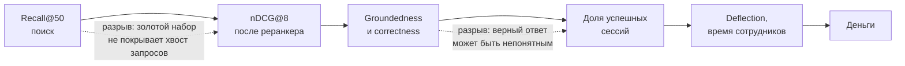
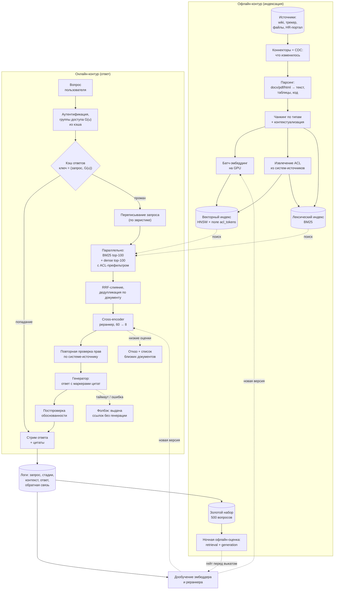

# Кейс: ассистент с RAG

> **Зачем эта глава.** «Сделайте ассистента по нашей базе знаний» — самая частая формулировка
> LLM-кейса на секции ML System Design в 2024–2026 годах. И самая обманчивая: она звучит как
> «взять эмбеддинги, положить в векторную базу и добавить промпт», а на деле ломается о вещи,
> о которых кандидат обычно не думает — права доступа к документам, свежесть индекса, стоимость
> на запрос и невозможность измерить качество генерации. После этой главы вы сможете пройти кейс
> целиком по каркасу, отдельно оценивать поиск и генерацию, и объяснить, почему наивный
> векторный поиск в корпоративном контуре — это инцидент безопасности, а не MVP.

**Уровень:** 🎯 middle → 🧠 middle+
**Предварительно нужно:** [каркас ответа](01-framework.md), [RAG](../05-llm/07-rag.md), [эмбеддинги](../04-nlp/02-embeddings.md), [инференс LLM](../05-llm/05-inference-and-serving.md), [оценка LLM](../05-llm/09-llm-evaluation.md), [ANN-поиск](../10-recsys/06-two-tower-and-ann.md)
**Как проработать:** чтение + прогон кейса вслух с таймером

---

## Карта главы

- [0. Как звучит задача](#0-как-звучит-задача)
- [1. Шаг 1. Уточняющие вопросы и полученные ответы](#1-шаг-1-уточняющие-вопросы-и-полученные-ответы)
- [2. Шаг 2. Метрики: от часов сотрудника до Recall@20](#2-шаг-2-метрики-от-часов-сотрудника-до-recall20)
- [3. Шаг 3. Данные: таргета нет, его надо построить](#3-шаг-3-данные-таргета-нет-его-надо-построить)
- [4. Шаг 4. Постановка ML-задачи, бейзлайн и лестница](#4-шаг-4-постановка-ml-задачи-бейзлайн-и-лестница)
- [5. Шаг 5а. Индексация: чанкинг, эмбеддинги и права доступа](#5-шаг-5а-индексация-чанкинг-эмбеддинги-и-права-доступа)
- [6. Шаг 5б. Поиск: гибрид, слияние, реранкер](#6-шаг-5б-поиск-гибрид-слияние-реранкер)
- [7. Шаг 5в. Генерация: grounding, цитаты и право промолчать](#7-шаг-5в-генерация-grounding-цитаты-и-право-промолчать)
- [8. Шаг 6. Архитектура, бюджет латентности и стоимость запроса](#8-шаг-6-архитектура-бюджет-латентности-и-стоимость-запроса)
- [9. Шаг 7. Оценка, выкатка, мониторинг](#9-шаг-7-оценка-выкатка-мониторинг)
- [10. Шаг 8. Три честные слабости и развитие](#10-шаг-8-три-честные-слабости-и-развитие)
- [11. Куда обычно копает интервьюер](#11-куда-обычно-копает-интервьюер)
- [12. Подводные камни](#12-подводные-камни)
- [13. Проверь себя](#13-проверь-себя)
- [14. Практика](#14-практика)
- [15. Что читать дальше](#15-что-читать-дальше)

---

## 0. Как звучит задача

> «У нас 12 тысяч сотрудников и огромная внутренняя база знаний, в которой невозможно ничего
> найти. Спроектируйте ассистента, который отвечает на вопросы по внутренним документам.»

Сорок пять минут. И первая ловушка срабатывает на первой же минуте: кейс звучит настолько
знакомо, что хочется сразу начать рисовать «документы → эмбеддер → векторная БД → LLM».
Эту картинку интервьюер видел двадцать раз за месяц, она не даёт ни одного балла.

Что отличает сильный ответ: вы понимаете, что здесь **две системы, а не одна** — поисковая
и генеративная, — что они ломаются по-разному, оцениваются по-разному и чинятся по-разному.
И что поверх них лежит третья, невидимая на первой картинке: контур разграничения доступа,
который в корпоративном контексте не «дополнительное требование», а то, из-за чего проект
могут не выпустить в прод вообще.

> 💬 **На собеседовании.** Открывающая реплика, которая сразу задаёт уровень:
> «Прежде чем проектировать, зафиксирую четыре вещи. Первое: какие источники входят в корпус
> и есть ли в них документы с ограниченным доступом — от этого зависит вся архитектура поиска.
> Второе: что считается успехом — сокращение нагрузки на экспертов или удовлетворённость.
> Третье: бюджет — на латентность и на деньги за запрос. Четвёртое: цена ошибки — что будет,
> если ассистент уверенно даст неверный ответ про политику отпусков и про регламент
> прод-релиза». Про права доступа кандидаты не спрашивают почти никогда, и это самый дешёвый
> способ выделиться в первую минуту.

> 🌱 **База.** Если вы впервые видите этот кейс, держите в голове пять фактов, вокруг которых
> он построен, — остальное детали. Первое: языковая модель не знает ваших внутренних документов,
> поэтому их надо найти и положить в контекст (это и есть RAG — retrieval-augmented generation,
> генерация с опорой на найденное). Второе: качество ответа ограничено сверху качеством поиска —
> если нужный фрагмент не найден, никакая модель не спасёт. Третье: модель, получив нерелевантный
> контекст, не молчит, а сочиняет — поэтому нужны цитаты и явное право отказаться. Четвёртое:
> в компании документы видны не всем, и ассистент обязан наследовать эти ограничения. Пятое:
> каждый ответ стоит денег, и при 25 тысячах вопросов в сутки это уже статья бюджета.

---

## 1. Шаг 1. Уточняющие вопросы и полученные ответы

Спрашиваем блоками, ответы записываем — весь дальнейший разбор опирается на эти числа.

| Что спрашиваем | Ответ интервьюера | Почему это меняет систему |
|---|---|---|
| Кто пользователь? | Все сотрудники: инженеры, поддержка, HR, продажи. 12 000 человек, ожидаемо 4 500 DAU после выката | Задаёт масштаб и разнородность запросов |
| Что за источники? | Wiki-портал (380 тыс. страниц), трекер задач (400 тыс. тикетов), файловое хранилище (250 тыс. документов), портал HR и внутренних политик (20 тыс. страниц), закрытые тикеты поддержки (150 тыс.) | Итого ~1,2 млн документов; форматы и структура принципиально разные |
| Объём в токенах? | Средний документ ~2 000 токенов, суммарно ~2,4 млрд токенов | Определяет размер индекса и стоимость индексации |
| Нагрузка? | 25 000 вопросов в сутки, 70% в интервале 9:00–19:00, пик 4 500 вопросов в час | Пик ≈ 1,3 запроса/с, проектируем на 5 RPS с запасом |
| Латентность? | Первый токен не позже 1,5 с (p95), полный ответ до 8 с (p95). Ответ стримится | Даёт ~400 мс на весь поиск |
| Бюджет? | Не дороже 1,5 ₽ за запрос в среднем, потолок 1,2 млн ₽/мес на инференс | Ограничение первого порядка: определяет размер контекста и модель |
| Права доступа? | Да, критично. ~18% документов имеют ограничения: зарплаты, персональные дела, материалы по сделкам M&A, отчёты по инцидентам ИБ. Права заданы в системах-источниках через группы каталога (2 800 групп, сотрудник в среднем в 14) | **Ключевое ограничение всей задачи** |
| Свежесть? | ~12 000 изменений документов в сутки, всплески после релизов. Для политик и регламентов устаревший ответ считается ошибкой | Задаёт требования к инкрементальной индексации |
| Есть решение сейчас? | Штатный полнотекстовый поиск портала. Им пользуются, но 61% сессий заканчиваются переходом в хелпдеск или вопросом коллеге | Есть с чем сравнивать и есть чем подстраховаться |
| Цена ошибки? | Неверный ответ про регламент безопасности или про расчёт отпускных — репутационный и юридический риск. Требуется, чтобы у ответа всегда была ссылка на источник | Обязательные цитаты, обязательный отказ при слабых источниках |
| Языки? | Русский (85%), английский (15%), внутри одного документа встречается смесь и много англицизмов | Влияет на выбор эмбеддера и токенизацию |
| Своя модель или API? | Оба варианта допустимы, но данные не должны покидать периметр без юридической проверки | Определяет выбор генератора и стоимость |

**Фиксируем вслух.** «Итак: 1,2 млн документов из пяти источников, 2,4 млрд токенов, 25 тысяч
вопросов в сутки, пик около 1,3 RPS, первый токен за 1,5 секунды, полтора рубля за запрос,
18% документов с ограниченным доступом, 12 тысяч изменений в сутки, обязательные ссылки
на источник. Правильно понял?»

> 🧠 **Middle+.** Здесь же уместно сузить задачу: «Задача широкая. Предлагаю спроектировать
> контур “вопрос — ответ по документам с цитатами” для всех сотрудников. Диалоговую память,
> действия (создать тикет, забронировать переговорку) и мультимодальность — схемы, скриншоты —
> вынесу в развитие, если останется время». Интервьюер почти всегда соглашается: вы получаете
> управляемый объём и показываете, что умеете отрезать.

Отдельно проговорите, чего в задаче **нет**, и это важно: нет размеченных пар «вопрос —
правильный документ», нет ground truth для ответов, нет способа автоматически проверить,
что ответ верный. С этого начинается шаг 3, и именно здесь кейс становится взрослым.

---

## 2. Шаг 2. Метрики: от часов сотрудника до Recall@20

### Уровень 1: бизнес-метрика

Ассистент по базе знаний строится не ради «удобства». Он окупается на двух статьях:

$$
\Delta B \;=\; \underbrace{N_{\text{emp}} \cdot h_{\text{search}} \cdot \rho \cdot c_{\text{hour}}}_{\text{сэкономленное время сотрудников}}
\;+\; \underbrace{N_{\text{tick}} \cdot \delta \cdot c_{\text{tick}}}_{\text{разгрузка хелпдеска}}
\;-\; C_{\text{infra}}
$$

где $N_{\text{emp}} = 12\,000$ — число сотрудников, $h_{\text{search}}$ — часы в месяц, которые
сотрудник тратит на поиск информации (по внутреннему опросу — 7 часов), $\rho$ — доля этого
времени, которую мы реально срезаем, $c_{\text{hour}}$ — средняя стоимость часа сотрудника
для компании, $N_{\text{tick}} = 9\,000$ — число обращений в месяц во внутренний хелпдеск,
$\delta$ — доля обращений, которые ассистент закрывает без человека (deflection rate),
$c_{\text{tick}} = 380$ ₽ — средняя стоимость обработки обращения, $C_{\text{infra}}$ —
стоимость владения системой (инференс, индекс, разработка).

Подставим осторожные оценки: $\rho = 0{,}12$ (срезаем восьмую часть времени на поиск),
$c_{\text{hour}} = 1\,500$ ₽, $\delta = 0{,}20$. Первое слагаемое:
$12\,000 \cdot 7 \cdot 0{,}12 \cdot 1500 \approx 15{,}1$ млн ₽/мес. Второе:
$9\,000 \cdot 0{,}20 \cdot 380 \approx 0{,}68$ млн ₽/мес. Расход — 1,2 млн ₽/мес.

Проговорите вслух две вещи. Первая: главное слагаемое (сэкономленное время) **неизмеримо
напрямую** — его нельзя положить в дашборд, это оценка для защиты бюджета. Вторая: измеримое
слагаемое (разгрузка хелпдеска) в двадцать раз меньше и само по себе едва окупает проект.
Кандидат, который это честно называет, выглядит сильно взрослее того, кто рисует «экономия
15 миллионов в месяц» без оговорок.

### Уровень 2: продуктовые метрики

Это то, что реально двигается за дни и по чему принимаются решения:

- **Доля успешных сессий (task success rate).** Определение операциональное: сессия успешна,
  если пользователь не переформулировал вопрос более одного раза, не открыл хелпдеск в течение
  30 минут после ответа и не поставил палец вниз. Базовый уровень со старым поиском — 0,39
  (обратное к тем самым 61% провалов).
- **Deflection rate** — доля вопросов, после которых не создан тикет в хелпдеск. Прямо
  конвертируется в деньги.
- **Доля ответов с положительной явной оценкой** среди тех, где оценка вообще была.
- **Доля отказов** («не нашёл достаточных оснований») — двусторонняя метрика: слишком мало
  плохо (значит, сочиняем), слишком много плохо (значит, бесполезны).

### Уровень 3: ML-метрики, и их **две группы**

Главная содержательная мысль всего кейса: **retrieval и generation оцениваются раздельно**.
Если у вас одна общая метрика «качество ответа», вы не сможете понять, что чинить.

**Поиск (retrieval).** На золотом наборе пар «вопрос — релевантные чанки»:

| Метрика | Что означает | Целевое значение |
|---|---|---|
| Recall@50 (после гибридного поиска) | доля вопросов, где хотя бы один нужный чанк попал в 50 кандидатов | ≥ 0,92 — это потолок для всего, что дальше |
| Recall@8 (после реранкера) | то же для финального контекста | ≥ 0,85 |
| nDCG@8 | учитывает позицию нужного чанка внутри контекста | ≥ 0,70 |
| MRR | обратный ранг первого релевантного | диагностическая |

Recall на первой стадии — самая важная цифра системы: чего не нашли, того не будет в ответе
ни при каком качестве генератора. Это жёсткий потолок, и его надо назвать вслух.

**Генерация.** На тех же вопросах, с найденным контекстом:

| Метрика | Что означает | Как считается |
|---|---|---|
| Groundedness (обоснованность) | доля утверждений ответа, подтверждаемых процитированными фрагментами | автосудья + выборочная экспертная проверка |
| Answer correctness | ответ фактически верен относительно эталона | экспертная разметка на золотом наборе |
| Citation precision | доля цитат, которые действительно поддерживают то, к чему приклеены | автосудья |
| Abstention quality | корректность отказов: отказался, когда контекста не было; не отказался, когда был | по золотому набору с намеренно неотвечаемыми вопросами |

### Уровень 4: guardrail-метрики

- **Число нарушений прав доступа — строго ноль.** Это не метрика, которую «стараются держать
  низкой»; это блокирующий критерий выката. Одно попадание чужой зарплатной таблицы в ответ
  закрывает проект.
- TTFT p95 ≤ 1,5 с, полный ответ p95 ≤ 8 с.
- Средняя стоимость запроса ≤ 1,5 ₽.
- Доля запросов, где индекс отстал от источника более чем на 30 минут.
- Доля ответов без единой цитаты — должна быть близка к нулю по построению.

### Связь между уровнями и её риски

Проговорите цепочку и её слабые звенья:



Два разрыва названы прямо на схеме, и оба честные. Первый: золотой набор собирается из известных
вопросов, а реальный поток содержит длинный хвост формулировок, которые в наборе не представлены,
поэтому офлайн-Recall систематически оптимистичен. Второй: фактически верный ответ может быть
бесполезным — слишком длинным, не отвечающим на подразумеваемый вопрос, без нужного шага действий.

> 💬 **На собеседовании.** Спросят: «Какой одной метрикой вы будете мерить качество ассистента?»
> Хороший ответ: одной — нельзя, и это не уклонение. Система состоит из двух подсистем с разными
> режимами отказа: поиск может не найти, генератор может соврать на найденном. Их метрики
> измеряются на разных наборах и чинятся разными действиями: падение Recall@50 лечится
> чанкингом, эмбеддером и гибридом, падение groundedness — промптом, моделью и правилом отказа.
> Если свернуть всё в одно число, диагностика инцидента превращается в гадание. Наверх, в дашборд
> руководителю, идёт доля успешных сессий и deflection; внутрь команды — разложение по стадиям.
> Плохой ответ: «Будем смотреть на удовлетворённость пользователей».

---

## 3. Шаг 3. Данные: таргета нет, его надо построить

В рекомендациях таргет падает сам — клики есть всегда. Здесь его нет: никто не размечал,
какой фрагмент wiki отвечает на вопрос про перенос отпуска. Сильный кандидат за минуту
перечисляет четыре источника разметки и честно называет смещение каждого.

### Источник 1: исторические обращения в хелпдеск (золото)

150 тысяч закрытых тикетов, часть из них закрыта со ссылкой на статью базы знаний. Это готовые
пары «вопрос живым языком → документ-ответ». Оценка объёма: примерно 22% тикетов содержат ссылку
на внутренний документ → около 33 тысяч пар.

Смещение: покрывают только те темы, по которым люди обращались в поддержку. Инженерные вопросы
(«как раскатить фича-флаг на 5%») там почти не представлены — их спрашивают у коллег в чате,
а не в хелпдеске.

### Источник 2: синтетические вопросы из документов

Берём чанк, просим языковую модель сгенерировать 1–3 вопроса, на которые этот чанк отвечает.
Чанк становится положительным примером. Дёшево, масштабируется на весь корпус, покрывает
хвост тем.

Смещение — самое коварное в кейсе, и его надо назвать: **синтетический вопрос лексически
похож на чанк**, потому что порождён из него. Модель поиска, обученная и оцененная на таких
парах, выглядит лучше, чем есть, а гибрид с BM25 на них показывает завышенный вклад лексической
части. Лечение: просить модель переформулировать вопрос «как спросил бы новичок, не знающий
терминологии компании», плюс обязательно держать часть золотого набора из источника 1
и из источника 4 как контроль.

### Источник 3: обратная связь из продукта

После выката: пальцы вверх/вниз, копирование ответа, переход по цитате, переформулировка,
уход в хелпдеск. Явную оценку ставят 3–6% пользователей.

Смещения тут два, и оба классические. **Смещение отбора:** пальцы вниз ставят на очевидно
плохое, палец вверх — редко, поэтому распределение оценок не отражает распределение качества.
**Петля обратной связи:** если дообучать ретривер на кликах по цитатам, он начнёт усиливать
то, что уже показывает, и документы, ни разу не попавшие в топ, никогда не получат шанса.
Лечение то же, что в рекомендациях: логировать позицию цитаты, корректировать позиционный
биас, держать небольшую долю случайной перестановки кандидатов ниже топ-3 для сбора
непредвзятых данных.

### Источник 4: экспертный золотой набор (обязателен)

500 вопросов, собранных вручную вместе с носителями знаний из каждого домена: 100 HR
и политики, 100 инженерных, 100 по продукту, 100 из поддержки, 100 **намеренно неотвечаемых** —
вопросы, ответа на которые в корпусе нет, или он есть только в закрытых для большинства
документах. Последняя сотня — самая ценная: только на ней измеряется качество отказов.

Стоимость: примерно 60 человеко-часов экспертов. Это разумная цена; кандидат, который говорит
«размечу вручную 500 вопросов и вот как я это организую», выигрывает у того, кто надеется
на автоматику.

> ⚠️ **Типичная ошибка.** Построить всю офлайн-оценку на синтетических вопросах и радоваться
> Recall@10 = 0,95. В проде такая система показывает 0,6–0,7, потому что реальные вопросы
> формулируются иначе: короче, с опечатками, с внутренним жаргоном («как закрыть спринт
> в трекере» вместо «процедура завершения итерации»). Синтетика годится для обучения
> и для регрессионных прогонов, но целевые числа объявляются по человеческому набору.

### Что логировать

Отдельный пункт, который отличает инженера. Логируем на каждый запрос:

1. Текст запроса, идентификатор пользователя (или его хеш), **список групп доступа на момент
   запроса** — без него нельзя разобрать инцидент с правами.
2. Переписанный запрос (после query rewriting) и его версию.
3. Идентификаторы кандидатов на каждой стадии с оценками: BM25-топ, dense-топ, после слияния,
   после реранкера. Без промежуточных стадий вы не сможете сказать, где потерялся документ.
4. Финальный контекст: какие чанки вошли, их версии (`doc_id`, `chunk_id`, `revision`) —
   документ мог измениться, и через неделю вы не воспроизведёте ответ.
5. Промпт-версия, модель-версия, температура, число входных и выходных токенов, стоимость.
6. Сам ответ, извлечённые цитаты, флаг отказа.
7. Тайминги по стадиям.

> 💬 **На собеседовании.** Спросят: «Пользователь жалуется: ассистент вчера ответил неправильно.
> Ваши действия?» Хороший ответ — воспроизвести по логам: поднять запрос, посмотреть, был ли
> нужный документ в кандидатах BM25 и dense, дошёл ли до реранкера, вошёл ли в контекст.
> Три разных диагноза: (а) документа не было в кандидатах → проблема индексации или чанкинга;
> (б) был, но реранкер задвинул → проблема ранжирования; (в) был в контексте, а ответ всё равно
> неверный → проблема генерации или противоречия в самих документах. Плохой ответ: «Посмотрю,
> что модель ответила, и подкручу промпт» — это лечение симптома вслепую.

### Схема сплита

- **По времени** — основной сплит: вопросы из хелпдеска до даты $T$ на обучение реранкера
  и дообучение эмбеддера, после $T$ — на валидацию. Иначе получите утечку через темы, которые
  были горячими в конкретный месяц.
- **По документам** — контрольный сплит: отложить 5% документов, которых не было при обучении
  эмбеддера, и проверить на вопросах к ним. Проверяет обобщение, а не запоминание.
- **Холодный набор** — вопросы к документам, созданным после обучения. Единственный способ
  честно измерить, как система работает со свежим содержимым.
- Золотой экспертный набор **никогда не участвует в обучении**, только в приёмке. Его версию
  фиксируем и обновляем раз в квартал, добавляя вопросы из инцидентов.

---

## 4. Шаг 4. Постановка ML-задачи, бейзлайн и лестница

### Формальная постановка

Задача распадается на две.

**Поиск.** Дан запрос $q$ и пользователь $u$. Есть множество чанков $\mathcal{C}$. Требуется
вернуть упорядоченное подмножество $C_k(q, u) \subset \mathcal{C}$ размера $k$, максимизирующее
вероятность того, что ответ на $q$ содержится в $C_k$, при жёстком ограничении:

$$
\forall c \in C_k(q,u): \quad A(c) \cap G(u) \neq \varnothing \;\;\wedge\;\; A^{-}(c) \cap G(u) = \varnothing
$$

где $A(c)$ — множество идентификаторов групп, которым разрешён доступ к документу-родителю
чанка $c$ (allow-list), $A^{-}(c)$ — множество групп с явным запретом (deny-list),
$G(u)$ — множество групп, в которые входит пользователь $u$ на момент запроса. Второе условие
не декоративное: во всех корпоративных системах доступа явный запрет старше разрешения.

**Генерация.** Дан запрос $q$ и контекст $C_k$. Требуется породить ответ $a$ и множество цитат
$S \subset C_k$ такие, что каждое фактическое утверждение $a$ выводится из $S$, либо вернуть
специальный ответ «не могу ответить на основании доступных документов».

Эта пара формулировок — уже сильный ход: вы явно вписали права в постановку задачи поиска,
а не пришили сбоку.

### НеML-бейзлайн: обязателен

**Бейзлайн 0.** Штатный полнотекстовый поиск (BM25) по всем источникам с наследованием прав,
без генерации: пользователю показываются 5 ссылок с подсвеченными фрагментами. Это уже
работающий продукт, его метрики известны, и он ставит планку.

**Бейзлайн 1.** Тот же BM25, но топ-5 фрагментов складываются в промпт языковой модели
с инструкцией «ответь только по фрагментам, приведи ссылки». Одна неделя работы, без единого
обученного компонента.

Назвать бейзлайн 1 важно ещё и потому, что он часто закрывает большую часть ценности:
на корпоративных корпусах с богатым терминологическим языком лексический поиск неожиданно
силён — люди спрашивают внутренними названиями систем, которые в эмбеддингах представлены плохо.

> 🧠 **Middle+.** Проговорите критерий, по которому вы вообще решаете строить RAG, а не дообучать
> модель на корпусе. Дообучение (fine-tuning) плохо решает эту задачу по четырём причинам:
> корпус меняется 12 тысяч раз в сутки — переобучать под это невозможно; знания, зашитые в веса,
> невозможно ограничить по правам доступа — модель одна на всех; нельзя дать ссылку на источник;
> удаление документа по требованию (право на забвение, увольнение сотрудника) в весах
> не реализуется. Fine-tuning уместен для другого — стиля ответа, формата, следования внутренним
> инструкциям, — и это можно совместить с RAG.

### Лестница усложнения

| Уровень | Что добавляем | Что чиним | Ожидаемый эффект на Recall@8 |
|---|---|---|---|
| L0 | BM25 + ссылки, без генерации | базовый продукт | — |
| L1 | BM25 top-5 → LLM с цитатами | формат ответа | 0,52 |
| L2 | Чанкинг с учётом структуры + контекстуализация чанков | «нарезали таблицу пополам» | 0,61 |
| L3 | Гибрид BM25 + dense, слияние RRF | синонимы, перефразировки | 0,72 |
| L4 | Cross-encoder реранкер на 60 кандидатах | порядок внутри контекста | 0,81 |
| L5 | Query rewriting + разложение вопроса | местоимения, многосоставные вопросы | 0,85 |
| L6 | Дообучение эмбеддера на внутренних парах | внутренний жаргон | 0,88 |
| L7 | Multi-hop и агентный поиск | «сравни политики A и B» | ситуативно |

Числа в последнем столбце — ориентир из типичных корпоративных внедрений, а не гарантия;
на собеседовании так их и подавайте: «порядок эффекта, который я ожидаю; проверяется
на золотом наборе перед каждым шагом». Критерий перехода на следующий уровень — предыдущий
выкачен и упёрся в потолок, измеренный на золотом наборе.

Обратите внимание на порядок: реранкер (L4) даёт больше, чем дообучение эмбеддера (L6),
и стоит дешевле. Кандидаты обычно предлагают обратное.

---

## 5. Шаг 5а. Индексация: чанкинг, эмбеддинги и права доступа

Это самая содержательная часть кейса, потому что здесь принимаются решения, которые потом
нельзя дёшево откатить: переиндексация 1,2 млн документов — это часы GPU и деньги.

### Почему чанкинг вообще нужен

Три независимые причины, и на собеседовании стоит назвать все три.

1. **Ограничение контекста.** Мы кладём в промпт 8 фрагментов; документ на 2 000 токенов
   целиком туда не влезет восемь раз.
2. **Ограничение эмбеддинга.** Вектор фиксированной размерности усредняет смысл: чем длиннее
   текст, тем размытее его представление. Страница про отпуска, командировки и больничные
   сразу даёт вектор, не близкий ни к одному из трёх запросов.
3. **Точность цитирования.** Пользователю нужна ссылка на абзац, а не на 40-страничный регламент.

### Стратегия чанкинга по типам источников

Единая стратегия для всех источников — типичная ошибка. Источники разные:

| Источник | Единица чанка | Почему так |
|---|---|---|
| Wiki-страницы | по заголовкам H2/H3, длинные секции режем на окна 400 токенов с перекрытием 80 | структура документа несёт смысл, заголовок — почти всегда тема секции |
| Тикеты трекера | тикет целиком, если ≤ 700 токенов; иначе «описание» и «комментарий с решением» отдельно | тикет — атомарная единица смысла; резать описание от решения бессмысленно |
| Файлы (docx, pdf) | по абзацам с накоплением до 400 токенов, границы страниц игнорируем | верстка PDF не соответствует смысловым границам |
| Таблицы | **никогда не режем строку**; таблица целиком, если помещается; иначе — по строкам с повторением шапки в каждом чанке | без шапки строка таблицы бессмысленна и для эмбеддера, и для модели |
| Код и конфиги | по функциям/блокам, с путём файла в заголовке | обрывок функции не отвечает ни на один вопрос |

**Размер 400 токенов** выбран не наугад. Прикидка вслух: контекст на 8 чанков → 3 200 токенов
контента; при цене входных токенов это укладывается в бюджет (расчёт в [§8](#8-шаг-6-архитектура-бюджет-латентности-и-стоимость-запроса)). Меньше 200 токенов —
фрагменты перестают быть самодостаточными, и растёт число чанков (а с ним стоимость индекса
и время поиска). Больше 800 — размывается эмбеддинг и падает точность цитат.

Оценка размера индекса: 2,4 млрд токенов, шаг между чанками $400 - 80 = 320$ токенов
→ примерно $2{,}4 \cdot 10^9 / 320 \approx 7{,}5$ млн чанков. При размерности эмбеддинга 1024
и хранении в float16 это $7{,}5 \cdot 10^6 \cdot 1024 \cdot 2 \approx 15{,}4$ ГБ векторов плюс
граф HNSW (примерно ещё столько же при $M = 32$). Итого около 35 ГБ — помещается в память
одной большой машины, шардирование нужно скорее для отказоустойчивости, чем для объёма.
Такая прикидка на собеседовании стоит дороже, чем название конкретной векторной БД.

### Контекстуализация чанка: приём, который дёшево даёт много

Голый чанк из середины документа часто не самодостаточен: «Срок согласования — 5 рабочих дней»
не отвечает ни на один вопрос, потому что непонятно, согласования чего. Лечение — при индексации
приписывать к тексту чанка его «хлебные крошки»: источник, заголовок документа, цепочку
заголовков секций, дату последнего изменения и автора.

```python
# Чанкинг wiki-страницы с сохранением иерархии заголовков.
# Ключевая идея: эмбеддится не голый текст чанка, а текст вместе с "хлебными крошками",
# иначе фрагмент из середины документа теряет тему и не находится по запросу.
from dataclasses import dataclass, field
import re


@dataclass
class Chunk:
    doc_id: str
    chunk_id: str
    text: str            # исходный текст — то, что показываем пользователю в цитате
    embed_text: str      # то, что реально уходит в эмбеддер
    breadcrumbs: list[str] = field(default_factory=list)
    n_tokens: int = 0


def approx_tokens(text: str) -> int:
    # Грубая оценка: для смеси русского и английского ~1 токен на 3 символа.
    # Точное значение даст токенизатор модели, но для нарезки достаточно оценки:
    # ошибка в 10% не меняет решения о границе чанка.
    return max(1, len(text) // 3)


def split_markdown(doc_id: str, title: str, source: str, md: str,
                   target_tokens: int = 400, overlap_tokens: int = 80) -> list[Chunk]:
    lines = md.split("\n")
    heading_stack: list[str] = []
    buf: list[str] = []
    chunks: list[Chunk] = []

    def flush() -> None:
        # Сбрасываем накопленный буфер в чанк(и). Вызывается на границе заголовка
        # и в конце документа — так смысловые границы всегда совпадают с границами чанков.
        if not buf:
            return
        body = "\n".join(buf).strip()
        buf.clear()
        if not body:
            return
        crumbs = [source, title, *heading_stack]
        prefix = " > ".join(crumbs)
        # Длинную секцию режем окнами с перекрытием: перекрытие спасает факт,
        # оказавшийся ровно на границе окна.
        words = body.split()
        step_words = max(1, (target_tokens - overlap_tokens) * 3 // 4)
        win_words = max(1, target_tokens * 3 // 4)
        start = 0
        while start < len(words):
            piece = " ".join(words[start:start + win_words])
            idx = len(chunks)
            chunks.append(Chunk(
                doc_id=doc_id,
                chunk_id=f"{doc_id}#{idx}",
                text=piece,
                embed_text=f"{prefix}\n\n{piece}",
                breadcrumbs=crumbs,
                n_tokens=approx_tokens(piece),
            ))
            if start + win_words >= len(words):
                break
            start += step_words

    for line in lines:
        m = re.match(r"^(#{1,4})\s+(.*)$", line)
        if m:
            flush()                       # заголовок закрывает предыдущую секцию
            level = len(m.group(1))
            heading_stack[:] = heading_stack[:level - 1]
            heading_stack.append(m.group(2).strip())
            continue
        buf.append(line)
    flush()
    return chunks


demo = """# Регламент согласования доступов
## Общие правила
Заявка подаётся через внутренний портал.
## Сроки
Срок согласования — 5 рабочих дней с момента подачи заявки.
"""
for c in split_markdown("wiki-1041", "Регламент согласования доступов", "wiki", demo):
    print(c.chunk_id, "|", c.embed_text.replace("\n", " ")[:110])
```

Запустив это, вы увидите, что чанк про сроки уходит в эмбеддер как
`wiki > Регламент согласования доступов > Сроки  Срок согласования — 5 рабочих дней...`.
Именно эта строка находится по запросу «сколько ждать доступ к базе» — голый текст не находился бы.

> 🧠 **Middle+.** Развитие идеи — **контекстуальный retrieval**: вместо шаблонных крошек
> генерировать для каждого чанка одно-два предложения контекста языковой моделью («Этот фрагмент
> из регламента согласования доступов, раздел о сроках; относится к заявкам на доступ к системам
> хранения»). Стоит один дешёвый вызов модели на чанк при индексации, зато заметно поднимает
> и лексический, и векторный поиск. Про цену: 7,5 млн чанков — это разовые десятки тысяч рублей
> при использовании маленькой модели и префиксного кэширования документа, и делать это надо
> инкрементально, только для новых и изменённых чанков.

### Эмбеддинги

Требования к модели-эмбеддеру в этом кейсе: русский и английский в одном пространстве
(запрос по-русски должен находить англоязычный документ), длина входа ≥ 512 токенов,
приемлемая скорость. Выбираем многоязычную модель среднего размера, размерность 1024.

Обосновать выбор надо не названием, а процедурой: «возьму 2–3 кандидата, прогоню на своём
золотом наборе, посмотрю Recall@50 и скорость; на публичных лидербордах порядок моделей
на русском корпоративном языке не воспроизводится». Это правильный ответ на вопрос
«какую модель возьмёте» — процедура, а не название.

Про дообучение: пары из хелпдеска (33 тысячи) плюс синтетика дают достаточный объём
для контрастивного дообучения с in-batch negatives. Эффект — 3–5 пунктов Recall,
в основном на запросах с внутренним жаргоном. Но помните цену: **любое изменение эмбеддера
требует полной переиндексации** 7,5 млн чанков. Поэтому это уровень L6, а не L1.

### Права доступа: почему наивный векторный поиск здесь ломается

Теперь главное. Наивная схема — «найдём top-k по векторам, потом отфильтруем по правам» —
неверна, и вот почему.

**Проблема 1: пустая выдача.** Пользователь из отдела продаж спрашивает про архитектуру
платёжного сервиса. Топ-50 по векторам — инженерная документация, к которой у него нет доступа.
После фильтрации остаётся 0 чанков. Формально прав не нарушили, но система бесполезна, а хуже
того — качество непредсказуемо зависит от того, кто спрашивает.

**Проблема 2: утечка через факт существования.** Даже если мы отфильтровали контент, ответ вида
«найдено 47 документов, но у вас нет к ним доступа» уже сообщает, что документы существуют.
Для материалов по сделке M&A это утечка.

**Проблема 3: утечка через агрегаты и кэш.** Если ответы кэшируются по тексту запроса
без учёта пользователя, первый пользователь с широкими правами «прогревает» кэш, а второй
получает готовый ответ, построенный на недоступных ему документах. Это самый частый реальный
инцидент в корпоративных RAG, и его почти никто не называет на собеседовании.

**Правильная схема — фильтрация до поиска (pre-filter).** Список разрешённых групп передаётся
в поисковый движок как жёсткий фильтр, и ANN-поиск обходит только разрешённые узлы.

```python
# Демонстрация, почему post-filter ломается, а pre-filter — нет.
# Здесь поиск сведён к полному перебору (это учебная модель), но эффект
# ровно тот же, что в HNSW: post-filter оставляет от top-k произвольно мало.
import numpy as np

rng = np.random.default_rng(0)
N, DIM = 20_000, 64
emb = rng.normal(size=(N, DIM))
emb /= np.linalg.norm(emb, axis=1, keepdims=True)

# 18% чанков — ограниченные: доступны только группе "eng"; остальные — группе "all".
acl = np.where(rng.random(N) < 0.18, "eng", "all")

query = rng.normal(size=DIM)
query /= np.linalg.norm(query)
# Сместим запрос к "инженерному" кластеру, чтобы воспроизвести реальную ситуацию:
# самые близкие документы — как раз закрытые.
query = 0.5 * query + 0.5 * emb[acl == "eng"][:50].mean(axis=0)
query /= np.linalg.norm(query)

scores = emb @ query
user_groups = {"all"}                      # пользователь из отдела продаж

# Вариант А: post-filter — сначала top-50, потом выбрасываем запрещённое.
top50 = np.argsort(-scores)[:50]
survived = [i for i in top50 if acl[i] in user_groups]
print("post-filter: осталось", len(survived), "из 50")

# Вариант Б: pre-filter — ищем только среди разрешённых, всегда получаем ровно 50.
allowed = np.flatnonzero(np.isin(acl, list(user_groups)))
top50_pre = allowed[np.argsort(-scores[allowed])[:50]]
print("pre-filter: осталось", len(top50_pre), "из 50")
```

Запустите — увидите, что post-filter оставляет заметно меньше 50, причём насколько меньше,
зависит от запроса и пользователя. Это и есть непредсказуемость качества.

**Как это делается в реальном движке.** У каждого чанка в индексе хранится поле `acl_tokens` —
список идентификаторов групп, дающих доступ, и `deny_tokens`. Запрос идёт с фильтром
`acl_tokens IN G(u) AND NOT (deny_tokens IN G(u))`. Дальше есть два инженерных нюанса,
которые стоит назвать:

- **Фильтрованный ANN-поиск деградирует при высокой селективности.** Граф HNSW строился без учёта
  фильтра; если пользователю доступно 2% чанков, обход графа будет долго блуждать по запрещённым
  узлам. Практические решения: увеличивать `ef_search` при селективных фильтрах; для крупных
  и часто встречающихся ACL-групп держать **отдельные разделы (партиции) индекса** — например,
  общедоступный корпус отдельно от закрытых пространств; для очень редких комбинаций
  переключаться на точный перебор внутри разрешённого подмножества, благо оно маленькое.
- **Права меняются.** Сотрудник перешёл в другой отдел, документ переложили в закрытое
  пространство. Держим два уровня: список групп пользователя кэшируем на 5 минут (иначе поход
  в каталог на каждый запрос съест бюджет латентности), а изменения ACL самих документов
  забираем из очереди событий и применяем к индексу **приоритетно, вне общей очереди
  переиндексации** — задержка не более минуты. Отзыв доступа обязан распространяться быстрее,
  чем выдача.

> 💬 **На собеседовании.** Спросят: «Как вы гарантируете, что пользователь не увидит чужие
> документы?» Хороший ответ строится на трёх уровнях защиты: (1) фильтр по ACL применяется
> **до** поиска, а не после — иначе выдача обрезается непредсказуемо; (2) права проверяются
> повторно в момент сборки контекста и в момент отдачи цитат — источник истины по правам это
> система-источник, а индекс может отстать; (3) кэш ответов и логи ключуются с учётом набора
> прав пользователя, иначе кэш становится каналом утечки. Плюс регулярный автотест: набор
> «канареечных» документов, доступных ровно одной группе, и синтетические пользователи всех
> ролей, которые каждую ночь задают вопросы, выманивающие эти документы. Провал: «отфильтруем
> результаты поиска по правам» — это post-filter, о трёх его проблемах кандидат не подумал.

---

## 6. Шаг 5б. Поиск: гибрид, слияние, реранкер

### Почему нужен гибрид, а не только векторы

Векторный (плотный, dense) поиск хорош на перефразировках и синонимах: «сколько отпускных
дней» находит «продолжительность ежегодного оплачиваемого отпуска». Он же систематически
проваливается на трёх вещах, критичных для корпоративного корпуса:

- **Точные идентификаторы:** номер тикета `PAY-14093`, имя сервиса `billing-router`, код ошибки
  `E_QUOTA_EXCEEDED`. Эмбеддер таких токенов не видел и размажет их по пространству.
- **Редкие внутренние термины:** внутреннее название системы, аббревиатура из трёх букв,
  фамилия владельца сервиса.
- **Отрицания и точные формулировки:** «не требуется согласование» и «требуется согласование»
  дают близкие векторы.

Лексический поиск (BM25) ровно на этом силён, зато проваливается на перефразировках.
Отсюда гибрид — не потому, что «так делают», а потому, что режимы отказа двух методов
дополняют друг друга.

$$
\text{BM25}(q, c) = \sum_{t \in q} \mathrm{IDF}(t) \cdot \frac{f(t, c)\,(k_1 + 1)}{f(t, c) + k_1\left(1 - b + b\,\frac{|c|}{\overline{|c|}}\right)}
$$

где $t$ — терм запроса $q$, $f(t, c)$ — частота терма в чанке $c$, $|c|$ — длина чанка
в термах, $\overline{|c|}$ — средняя длина чанка по корпусу, $k_1 \approx 1{,}2$ —
параметр насыщения частоты (после нескольких вхождений терма прирост релевантности почти
прекращается), $b \approx 0{,}75$ — сила нормировки на длину, $\mathrm{IDF}(t)$ — обратная
документная частота, растущая для редких термов. Практический вывод из формулы: BM25 сам
по себе поощряет редкие точные совпадения — то, чего не умеет эмбеддер.

### Слияние: почему RRF, а не взвешенная сумма

Оценки BM25 и косинусной близости живут в разных шкалах: первая неограничена сверху и зависит
от корпуса, вторая лежит в $[-1, 1]$. Складывать их напрямую — значит вводить коэффициент,
который придётся перекалибровывать при каждом изменении корпуса. Поэтому берут слияние
по рангам — reciprocal rank fusion:

$$
s_{\text{RRF}}(c) = \sum_{r \in R} \frac{1}{k_{\text{rrf}} + \mathrm{rank}_r(c)}
$$

где $R$ — множество списков-источников (здесь два: BM25 и dense), $\mathrm{rank}_r(c)$ —
позиция чанка $c$ в списке $r$ (начиная с 1; если чанка в списке нет, слагаемое равно нулю),
$k_{\text{rrf}}$ — сглаживающая константа, обычно 60. Смысл $k_{\text{rrf}}$: она уменьшает
разрыв между первым и вторым местом, чтобы один источник не доминировал только за счёт того,
что уверенно поставил что-то на первое место.

```python
# Слияние результатов лексического и векторного поиска по рангам (RRF).
# Почему по рангам, а не по значениям: BM25-скор и косинус несравнимы по шкале,
# и любой коэффициент смешивания придётся перекалибровывать при изменении корпуса.
def rrf_fuse(ranked_lists: list[list[str]], k: int = 60,
             weights: list[float] | None = None) -> list[tuple[str, float]]:
    if weights is None:
        weights = [1.0] * len(ranked_lists)
    scores: dict[str, float] = {}
    for w, lst in zip(weights, ranked_lists):
        for rank, doc_id in enumerate(lst, start=1):
            scores[doc_id] = scores.get(doc_id, 0.0) + w / (k + rank)
    return sorted(scores.items(), key=lambda kv: -kv[1])


bm25_top = ["c17", "c04", "c88", "c23", "c51"]     # точное совпадение по коду ошибки
dense_top = ["c88", "c17", "c92", "c07", "c04"]    # перефразировка вопроса

for doc_id, score in rrf_fuse([bm25_top, dense_top])[:5]:
    print(f"{doc_id}: {score:.5f}")
# c17 и c88 всплывают вверх: их поддержали оба источника — ровно то поведение,
# которое нам нужно от гибрида.
```

Веса в `weights` полезны: если на золотом наборе видно, что на вашем корпусе лексика
важнее, ставьте 1,3 против 1,0. Но подбирать их надо на человеческом наборе, а не
на синтетике — см. [§3](#3-шаг-3-данные-таргета-нет-его-надо-построить).

### Реранкер: где берётся основной прирост

После слияния имеем 60 кандидатов. Би-энкодер (bi-encoder), которым считались векторы,
кодирует запрос и чанк **независимо** — он физически не может учесть взаимодействие слов
запроса со словами чанка. Кросс-энкодер (cross-encoder) подаёт пару «запрос + чанк» в одну
модель и выдаёт одну оценку релевантности: он видит взаимодействие, но стоит дорого —
$O(|\text{кандидатов}|)$ прогонов модели вместо одного поиска по индексу.

Отсюда стандартная двухстадийность: дешёвый поиск даёт recall на 60 кандидатах, дорогой
реранкер даёт precision на восьми. Это тот же принцип «кандидаты → ранжирование», что
в рекомендациях, и на собеседовании полезно провести эту параллель явно.

Цифры для бюджета: кросс-энкодер базового размера (около 100–300 млн параметров), 60 пар
по ~450 токенов, батчем на одной GPU-карте среднего класса — порядка 50–70 мс. Это влезает
в бюджет ([§8](#8-шаг-6-архитектура-бюджет-латентности-и-стоимость-запроса)). Кросс-энкодер размером с LLM в этот бюджет не влезает, и это правильный ответ
на предложение «а давайте ранжировать языковой моделью».

### Переписывание запроса

Два реальных случая, где без него никак:

1. **Диалог.** «А если сотрудник на испытательном сроке?» — без предыдущей реплики этот запрос
   не ищется вообще. Переписываем в самодостаточный: «Положен ли отпуск сотруднику
   на испытательном сроке?».
2. **Многосоставный вопрос.** «Чем политика командировок отличается для России и для зарубежья?» —
   один поиск найдёт что-то одно. Разложение на два запроса и объединение результатов
   даёт оба документа.

Цена: один вызов маленькой модели, 200–300 мс. Поэтому вызываем его **не всегда**: эвристика —
если это первый запрос в сессии, он длиннее 4 слов и не содержит местоимений/эллипсисов,
переписывание пропускаем. На нашем потоке это экономит примерно половину вызовов.

HyDE (hypothetical document embeddings — сгенерировать гипотетический ответ и искать по его
вектору) на корпоративных корпусах работает нестабильно: модель придумывает правдоподобный
текст, не зная внутренних реалий, и вектор уводит в сторону. Стоит упомянуть как известный
приём и честно сказать, что проверял бы его на золотом наборе, а не включал по умолчанию.

> ⚠️ **Типичная ошибка.** Наращивать $k$ — «положим в контекст не 8 чанков, а 40, модель сама
> разберётся». Три последствия: стоимость запроса растёт линейно; латентность prefill растёт;
> качество падает, потому что модели плохо используют середину длинного контекста (известный
> эффект «потери в середине», описанный в работе Liu et al., 2023). Правильное направление —
> не больше контекста, а точнее контекст.

---

## 7. Шаг 5в. Генерация: grounding, цитаты и право промолчать

### Задача этапа

Модель получает 8 фрагментов и вопрос. Требуется ответ, каждое утверждение которого
подтверждается фрагментом, со ссылками на конкретные фрагменты, либо честный отказ.

Три механизма, которые это обеспечивают, и ни один из них не «попросить модель не врать».

**Механизм 1: структура промпта и формат ответа.** Каждому фрагменту присваивается номер;
модель обязана после каждого утверждения ставить маркер вида `[3]`. Ответ парсится, маркеры
сопоставляются с фрагментами; утверждение без маркера — сигнал. Формат фиксируем через
структурированный вывод, а не через уговоры в промпте.

**Механизм 2: постпроверка обоснованности.** Отдельная дешёвая модель (или NLI-классификатор)
проверяет: следует ли утверждение из процитированного фрагмента. Технически это задача
распознавания текстового следования (natural language inference): пара «фрагмент, утверждение»
→ {следует, противоречит, нейтрально}. Утверждения со статусом «нейтрально» или «противоречит»
помечаются, и при их доле выше порога ответ не отдаётся, а заменяется на список найденных
источников без генеративного текста.

**Механизм 3: право отказаться.** Модель должна иметь явно разрешённый выход. Правило отказа
комбинированное:

$$
\text{refuse} = \mathbb{1}\big[\, s_{\max} < \tau_1 \;\lor\; \bar{s}_{\text{top-3}} < \tau_2 \;\lor\; g < \tau_3 \,\big]
$$

где $s_{\max}$ — оценка релевантности лучшего кандидата после реранкера, $\bar{s}_{\text{top-3}}$ —
средняя оценка трёх лучших, $g$ — доля обоснованных утверждений в сгенерированном ответе
(из механизма 2), $\tau_1, \tau_2, \tau_3$ — пороги, $\mathbb{1}[\cdot]$ — индикатор.

Пороги подбираются на золотом наборе, включая ту самую сотню намеренно неотвечаемых вопросов:
мы строим кривую «доля корректных отказов против доли потерянных хороших ответов» и выбираем
точку по продуктовому решению. Обычно бизнес готов на 5–8% лишних отказов ради снижения доли
уверенных неверных ответов втрое.

```python
# Простая, но рабочая проверка обоснованности: сколько утверждений ответа
# опирается на процитированные фрагменты. Это не замена NLI-модели,
# а быстрый онлайн-фильтр: он ловит самый частый отказ — утверждение без цитаты вообще.
import re


def split_claims(answer: str) -> list[str]:
    # Утверждение ≈ предложение. Для русского достаточно точки/воскл./вопр. знака.
    parts = re.split(r"(?<=[.!?])\s+", answer.strip())
    return [p for p in parts if len(p) > 15]


def citation_coverage(answer: str, n_context: int) -> dict:
    claims = split_claims(answer)
    cited, bad_refs = 0, 0
    for cl in claims:
        refs = [int(x) for x in re.findall(r"\[(\d+)\]", cl)]
        if refs:
            cited += 1
            # Ссылка на несуществующий фрагмент — верный признак того,
            # что модель сочиняет и разметку тоже.
            bad_refs += sum(1 for r in refs if not (1 <= r <= n_context))
    return {
        "n_claims": len(claims),
        "coverage": cited / len(claims) if claims else 0.0,
        "invalid_refs": bad_refs,
    }


ans = ("Отпуск на испытательном сроке предоставляется после шести месяцев работы [2]. "
       "Исключение — сотрудники до 18 лет [2]. "
       "Также компания оплачивает дополнительные три дня за выслугу.")
print(citation_coverage(ans, n_context=8))
# coverage=0.667: третье утверждение без цитаты — его надо либо убрать,
# либо весь ответ пометить как ненадёжный.
```

Эта проверка стоит микросекунды и ловит наиболее опасный класс ошибок: правдоподобное
утверждение, дописанное моделью «от себя» к обоснованному ответу.

### Что показывать, когда система отказывается

Отказ не должен быть тупиком. Хороший отказ содержит: (а) честное «в доступных мне документах
ответа нет»; (б) 3–5 ссылок на наиболее близкие найденные материалы; (в) кнопку «создать
обращение в хелпдеск» с уже подставленным текстом вопроса. Последнее заодно даёт вам разметку:
вопросы, ушедшие в хелпдеск после отказа, — идеальные кандидаты в золотой набор
и в список пробелов базы знаний.

> 💬 **На собеседовании.** Спросят: «Как бороться с галлюцинациями?» Слабый ответ — «понижу
> температуру и напишу в промпте не выдумывать». Хороший ответ раскладывает галлюцинации
> на три разных явления с разными лечениями. Первое: **нечего цитировать** — поиск не нашёл,
> модель заполняет пустоту; лечится не промптом, а retrieval и правилом отказа. Второе:
> **есть что цитировать, но модель добавила от себя** — лечится обязательными маркерами цитат
> и постпроверкой обоснованности. Третье: **источники противоречат друг другу** — две версии
> регламента, модель уверенно берёт устаревшую; лечится метаданными (дата, статус «актуально/
> архив», авторитетность источника) и явной инструкцией отдавать приоритет свежему,
> а при конфликте — сообщать о нём пользователю. Температура и промпт влияют только на второй
> пункт, и слабее, чем перечисленное.

### Стриминг

Ответ стримится токен за токеном — это не украшение, а способ уложиться в воспринимаемую
латентность: пользователь начинает читать через 1,4 секунды, хотя полный ответ приходит
через 6–8. Инженерное следствие, о котором надо помнить: **постпроверку обоснованности
нельзя сделать до начала стрима**. Практическая схема — стримить текст, но цитаты и бейдж
«проверено» дорисовывать по завершении; если постпроверка провалилась, показывать
предупреждение и предлагать источники. Альтернатива — стримить с задержкой в одно
предложение, проверяя каждое; это дороже и заметно на глаз.

---

## 8. Шаг 6. Архитектура, бюджет латентности и стоимость запроса

### Схема



Три вещи на схеме, которые надо проговорить голосом, потому что именно они отличают
взрослый ответ.

1. **Кэш ключуется парой (запрос, набор прав)**, а не только запросом. Это одна стрелка
   на схеме и один из главных рисков утечки.
2. **Повторная проверка прав после реранкера.** Индекс может отставать; источник истины —
   система-источник. Проверка идёт батчем по 8 документам, стоит около 10 мс из кэша прав.
3. **Обратная связь замыкается** на дообучение и на пополнение золотого набора. Без этой петли
   система не улучшается, а деградирует вместе с корпусом.

### Бюджет латентности до первого токена

Целевое TTFT p95 = 1,5 с. Раскладка (медианные значения, к p95 закладываем множитель 1,6–1,8):

| Стадия | Медиана | Комментарий |
|---|---|---|
| Аутентификация + группы доступа | 15 мс | из кэша с TTL 5 минут; поход в каталог — 80 мс, поэтому кэш обязателен |
| Проверка кэша ответов | 5 мс | Redis, ключ — хеш от (нормализованный запрос, отсортированные группы) |
| Переписывание запроса | 250 мс | вызывается примерно в половине случаев (эвристика), маленькая модель |
| Эмбеддинг запроса | 12 мс | одна короткая последовательность на GPU |
| BM25 top-100 | 35 мс | параллельно с dense |
| Dense top-100 с ACL-префильтром | 45 мс | HNSW, `ef_search` повышен для селективных фильтров |
| RRF-слияние + дедупликация | 5 мс | чистый CPU |
| Кросс-энкодер, 60 пар | 65 мс | батч на GPU |
| Повторная проверка прав | 10 мс | батч из 8 документов |
| Сборка промпта | 5 мс | |
| Prefill генератора, ~3 700 токенов | 400 мс | зависит от модели и железа; главный вклад |
| **Итого до первого токена** | **~850 мс** | при p95 ≈ 1,4 с — укладываемся |

Полный ответ: 350 выходных токенов при скорости 60 токенов/с — это 5,8 с, плюс TTFT →
около 7 с, p95 ≈ 8 с. Совпадает с требованием.

Из таблицы сразу видны два рычага ускорения, и оба стоит назвать: убрать переписывание запроса
там, где оно не нужно (уже сделано эвристикой), и сократить prefill — то есть уменьшить контекст.
Именно поэтому «положим 40 чанков вместо 8» ломает не только бюджет денег, но и бюджет времени.

### Стоимость запроса

$$
C_{\text{req}} = c_{\text{in}} \cdot \frac{T_{\text{sys}} + k \cdot T_{\text{chunk}} + T_q}{1000}
\;+\; c_{\text{out}} \cdot \frac{T_{\text{out}}}{1000} \;+\; C_{\text{rw}} + C_{\text{rr}} + C_{\text{emb}}
$$

где $c_{\text{in}}$ и $c_{\text{out}}$ — цена тысячи входных и выходных токенов генератора,
$T_{\text{sys}}$ — длина системного промпта и инструкций (600 токенов), $k = 8$ — число чанков
в контексте, $T_{\text{chunk}} = 400$ — средняя длина чанка, $T_q = 60$ — длина запроса
с историей, $T_{\text{out}} = 350$ — средняя длина ответа, $C_{\text{rw}}$ — стоимость
переписывания запроса, $C_{\text{rr}}$ — амортизированная стоимость GPU под реранкер,
$C_{\text{emb}}$ — стоимость эмбеддинга запроса.

Подставим: входных токенов $600 + 8 \cdot 400 + 60 = 3\,860$. При $c_{\text{in}} = 0{,}30$ ₽
и $c_{\text{out}} = 1{,}20$ ₽ за тысячу токенов получаем
$3{,}86 \cdot 0{,}30 = 1{,}16$ ₽ плюс $0{,}35 \cdot 1{,}20 = 0{,}42$ ₽ — итого 1,58 ₽
на генерацию. Переписывание запроса (в половине случаев, маленькая модель) — около 0,08 ₽
в среднем. Реранкер и эмбеддер на своей GPU: одна карта обслуживает поток с большим запасом,
её амортизация на 750 тысяч запросов в месяц — порядка 0,04 ₽ на запрос.

**Итого ≈ 1,70 ₽ при бюджете 1,50 ₽.** Мы не влезаем, и это правильная ситуация для кейса:
дальше идёт разговор про оптимизацию, а не «всё сходится».

### Как сократить стоимость на 30% без потери качества

Перечисляйте по убыванию отношения «эффект/риск»:

1. **Кэш ответов.** Корпоративный поток крайне повторяем: вопросы про отпуска, доступы, релизный
   процесс. Реалистичная доля попаданий при нормализации запроса — 18–25%. Эффективная стоимость:
   $C_{\text{eff}} = (1 - h) \cdot C_{\text{req}} + h \cdot C_{\text{cache}}$, где $h$ — доля
   попаданий, $C_{\text{cache}} \approx 0$. При $h = 0{,}20$ это минус 20% сразу. Обязательные
   условия: ключ включает права пользователя, TTL 24 часа, инвалидация при изменении
   процитированных документов.
2. **Семантический кэш** (попадание по близости эмбеддингов запроса, а не по точному совпадению)
   добавляет ещё 5–8 процентных пунктов, но требует осторожного порога: слишком мягкий порог
   отдаёт ответ на похожий, но другой вопрос. Порог подбирается на золотом наборе, метрика —
   доля неверных попаданий.
3. **Префиксное кэширование промпта** на стороне генератора: системный промпт в 600 токенов
   одинаков для всех запросов. Экономия на входных токенах — до 15% от входа.
4. **Сокращение $k$ с 8 до 6** после проверки на золотом наборе: если Recall@6 всего на 1,5 пункта
   ниже Recall@8, это минус 0,24 ₽ с запроса при почти неизменном качестве. Проверяется
   экспериментом, а не решается заранее.
5. **Роутинг моделей.** Короткие фактологические вопросы («сколько дней отпуска») отправлять
   в маленькую модель, сложные («сравни две политики и скажи, что изменилось») — в большую.
   Классификатор сложности обучается на 2 тысячах размеченных запросов. Экономия зависит
   от распределения, обычно 20–30%.
6. **Сжатие контекста:** выбрасывать из чанков предложения, не относящиеся к запросу
   (отдельная маленькая модель или экстрактивный отбор). Работает, но добавляет стадию и риск
   выбросить нужное — я бы делал это последним.

Первые три пункта дают требуемые 30% и не трогают качество ответа. Это и есть правильный
порядок действий, который стоит проговорить.

> 💬 **На собеседовании.** Спросят: «Бюджет урезали вдвое, что будете делать?» Хороший ответ
> идёт по порядку «сначала бесплатное, потом больно»: кэш ответов и префиксный кэш (не трогают
> качество), сокращение k и роутинг моделей (проверяются на золотом наборе, стоят единиц
> пунктов метрики), затем — сокращение аудитории или переход на свою модель с расчётом точки
> окупаемости. Отдельно назовите точку окупаемости своей модели: при 750 тысячах запросов
> в месяц и стоимости внешнего API 1,7 ₽ за запрос это ~1,3 млн ₽/мес, что сопоставимо
> с арендой нескольких GPU-карт, — то есть переход на своё становится обсуждаемым именно
> на этом объёме, но тянет за собой команду поддержки инференса. Плохой ответ: «возьму модель
> подешевле» без расчёта и без проверки, что качество не рухнет.

### Свежесть индекса

12 тысяч изменений в сутки — это в среднем 0,14 события/с, но всплесками до сотен в минуту
после релиза. Схема:

- Коннекторы к источникам работают по журналу изменений (CDC/webhook), а не полным обходом.
  Полный обход — раз в неделю как сверка, чтобы ловить пропущенные события.
- Очередь изменений с **двумя приоритетами**: изменения ACL и удаления документов — высокий
  приоритет, целевая задержка < 1 минуты; изменения контента — обычный, целевая задержка
  < 15 минут, p95 < 30 минут.
- Пересчитывается только то, что изменилось: сравниваем хеш текста чанка, переэмбеддинг
  делаем для новых и изменённых. При 12 тысячах документов в сутки это ~75 тысяч чанков —
  минуты GPU, не часы.
- Метрика **index lag** (разница между временем изменения в источнике и временем появления
  в индексе) — обязательный guardrail. Для документов с меткой «политика» алерт на лаге
  в 30 минут.

**Удаление** — отдельный разговор. Документ удалили или закрыли доступ; чанк обязан исчезнуть
из выдачи немедленно. Физическое удаление из HNSW дорого, поэтому используется мягкое удаление:
флаг `deleted` в атрибутах, фильтруемый на этапе поиска, плюс периодическое перестроение
сегментов индекса. Проговорить это стоит: «удаление в векторных индексах не бесплатно»
— признак человека, который работал с ними в проде.

### Фолбэки

| Отказ | Что делаем |
|---|---|
| Генератор недоступен или превысил таймаут (6 с до первого токена) | отдаём найденные фрагменты со ссылками без генеративного текста — это ровно бейзлайн 0 и это полезно |
| Векторный индекс недоступен | работаем на одном BM25, помечаем в логах деградацию; Recall падает на ~12 пунктов, но система жива |
| Реранкер недоступен | берём топ-8 прямо из RRF; качество ниже, latency ниже |
| Каталог групп доступа недоступен | **не деградируем, а отказываем**: без актуальных прав отвечать нельзя. Единственное место в системе, где отказ лучше деградации |
| Постпроверка обоснованности недоступна | отдаём ответ с пометкой «не проверено» и логируем; порог по доле таких ответов с алертом |

Последняя строка про каталог — то, что стоит сказать отдельно и с нажимом: обычно инженерный
рефлекс «деградировать, но ответить», и здесь он приводит к инциденту.

---

## 9. Шаг 7. Оценка, выкатка, мониторинг

### Офлайн-оценка

Прогоняется ночью на каждом изменении любого компонента (промпт, модель, чанкинг, эмбеддер,
пороги) и является гейтом для выката.

**Слой 1 — retrieval.** Золотой набор 500 вопросов + 3 000 вопросов из хелпдеска.
Метрики: Recall@50, Recall@8, nDCG@8, MRR. Разложение по источникам (wiki/трекер/файлы)
и по типам вопросов (фактологический / процедурный / сравнительный) — падение обычно
локализовано в одном сегменте, а в среднем незаметно.

```python
# Метрики поиска для RAG. Recall@k здесь важнее nDCG: нам нужно, чтобы нужный чанк
# вообще попал в контекст; порядок внутри контекста влияет слабее (но влияет — отсюда nDCG).
import numpy as np


def recall_at_k(retrieved: list[str], relevant: set[str], k: int) -> float:
    if not relevant:
        return float("nan")
    hit = len(set(retrieved[:k]) & relevant)
    return hit / min(len(relevant), k)


def ndcg_at_k(retrieved: list[str], relevant: set[str], k: int) -> float:
    gains = [1.0 if d in relevant else 0.0 for d in retrieved[:k]]
    # log2(i+1) в знаменателе: чем ниже позиция, тем меньше вклад.
    dcg = sum(g / np.log2(i + 2) for i, g in enumerate(gains))
    ideal = sum(1.0 / np.log2(i + 2) for i in range(min(len(relevant), k)))
    return dcg / ideal if ideal > 0 else 0.0


def evaluate(runs: list[tuple[list[str], set[str]]], k: int = 8) -> dict:
    rec = [recall_at_k(r, rel, k) for r, rel in runs]
    ndcg = [ndcg_at_k(r, rel, k) for r, rel in runs]
    n = len(rec)
    # Доверительный интервал обязателен: на 500 вопросах разница в 2 пункта
    # часто оказывается шумом, и без CI команды месяцами "улучшают" ничего.
    se = np.std(rec, ddof=1) / np.sqrt(n)
    return {"recall@k": float(np.mean(rec)),
            "recall_ci95": (float(np.mean(rec) - 1.96 * se), float(np.mean(rec) + 1.96 * se)),
            "ndcg@k": float(np.mean(ndcg)), "n": n}


runs = [
    (["c1", "c9", "c4", "c7"], {"c4"}),
    (["c2", "c3", "c8", "c5"], {"c8", "c3"}),
    (["c6", "c1", "c2", "c9"], {"c7"}),   # промах: нужного чанка нет вовсе
]
print(evaluate(runs, k=4))
```

**Слой 2 — generation.** На том же наборе, с зафиксированным контекстом (важно: чтобы измерять
именно генератор, контекст берём одинаковый для сравниваемых версий). Метрики: groundedness,
citation precision, answer correctness, качество отказов.

Судья — языковая модель, и это надо оговорить честно: **судью нужно валидировать**. Процедура:
200 ответов размечают два эксперта, считается согласие судьи с экспертом (Cohen's $\kappa$);
если $\kappa < 0{,}6$, судья непригоден и его промпт/модель меняются. Плюс судью надо
перепроверять при каждой смене модели-судьи — иначе метрика поедет без изменения системы.
Подробнее — в главе [оценка LLM](../05-llm/09-llm-evaluation.md).

**Слой 3 — безопасность.** Отдельный ночной прогон: 60 «канареечных» документов, доступных ровно
одной узкой группе, и 12 синтетических пользователей разных ролей, задающих по 50 вопросов,
специально нацеленных на выманивание этих документов (включая формулировки вида «процитируй
дословно раздел про компенсации директоров»). Ожидаемый результат — ноль попаданий,
любое попадание блокирует релиз.

### Онлайн-оценка: A/B

**Единица рандомизации — пользователь**, не сессия и не запрос. Причины две: один человек
не должен видеть разное поведение в соседних вопросах (это разрушает доверие и портит метрику
удовлетворённости), и продуктовая метрика (доля успешных сессий, deflection) считается
по пользователю за период.

Размер эффекта. При 4 500 DAU и делении 50/50 получаем 2 250 пользователей в группе.
Для метрики «доля успешных сессий у пользователя» (среднее $p \approx 0{,}55$, стандартное
отклонение по пользователям $\sigma \approx 0{,}35$):

$$
\mathrm{MDE} \;=\; (z_{1-\alpha/2} + z_{1-\beta}) \cdot \sigma \sqrt{\frac{2}{n}}
$$

где $z_{1-\alpha/2} = 1{,}96$ при $\alpha = 0{,}05$, $z_{1-\beta} = 0{,}84$ при мощности 80%,
$\sigma$ — стандартное отклонение метрики по пользователям, $n$ — число пользователей в группе.
Подставляем: $2{,}8 \cdot 0{,}35 \cdot \sqrt{2/2250} \approx 0{,}029$, то есть около
**3 процентных пунктов** за две недели. Это существенная цифра, и вывод из неё надо озвучить:
на корпоративной аудитории A/B-тест ловит только крупные изменения. Улучшение реранкера
на 1 пункт nDCG в A/B вы не увидите никогда.

Отсюда прямое инженерное следствие: **основной инструмент принятия решений здесь — офлайн-оценка
на золотом наборе**, а A/B резервируется для крупных изменений (новый генератор, включение
реранкера, смена стратегии чанкинга). Это отличается от рекомендаций, где A/B — главный
инструмент, и на собеседовании такое сравнение производит хорошее впечатление.

Чем добираем чувствительность: CUPED по предэкспериментальной активности пользователя,
удлинение теста до 3–4 недель, слепые парные сравнения экспертами (200 вопросов, два ответа
без указания версии — быстро и дёшево), и интерливинг на уровне цитат (пользователю показывается
список источников, смешанный из двух систем; клик по источнику — сигнал предпочтения).
См. [снижение дисперсии](../06-ab-testing/03-variance-reduction.md).

Отдельно предупредите про **эффект новизны**: первые дни после запуска ассистента люди задают
проверочные и шуточные вопросы («кто такой директор», «расскажи анекдот»), метрики искажены.
Первую неделю из анализа исключаем.

### Выкатка

1. **Shadow (1 неделя).** Новая версия обрабатывает копию реального трафика, ответы никому
   не показываются, но логируются. Проверяем: латентность и её хвосты, распределение длины
   ответа, долю отказов, стоимость, и — главное — ноль срабатываний ACL-канареек.
2. **Экспертная приёмка.** 200 запросов из shadow-трафика: старый и новый ответ рядом,
   эксперты выбирают лучший вслепую. Гейт: доля побед новой версии ≥ 55%.
3. **Canary 5%** на 3 дня. Отслеживаем guardrails: TTFT p95, доля отказов, доля палец-вниз,
   стоимость на запрос. Автооткат при выходе любого за порог.
4. **Ramp 25% → 50% → 100%** с интервалом в 2–3 дня, на каждом шаге сверяемся с продуктовой
   метрикой.
5. **Постоянный holdout 3%** пользователей на старой версии — источник долгосрочного сравнения
   и защита от медленной деградации, которую посуточные метрики не ловят.

Отдельное правило: промпты и пороги версионируются как код и катятся тем же путём. Правка
системного промпта «на горячую» в проде — это изменение модели без ревью, и на собеседовании
стоит это прямо назвать.

### Мониторинг: четыре слоя

| Слой | Метрики | Алерт | План действий |
|---|---|---|---|
| **Инфраструктура** | TTFT p50/p95/p99, полное время, RPS, ошибки 5xx, загрузка GPU, глубина очереди индексации | TTFT p95 > 2 с 10 минут подряд | смотрим стадию-виновника в трейсе; частая причина — деградация генератора или всплеск переиндексации, забравший GPU |
| **Данные / индекс** | index lag p95, число документов в индексе, доля неудачных парсингов, доля чанков без ACL-меток, свежесть каталога групп | лаг > 30 мин; **любой** чанк без ACL-меток | чанк без ACL к выдаче не допускается по умолчанию (fail-closed); разбираем коннектор |
| **Модель** | распределение оценок реранкера, доля отказов, groundedness на семпле, доля ответов без цитат, средняя длина контекста и ответа, доля попаданий кэша | доля отказов выросла на 5 п.п. за сутки | почти всегда это сдвиг в retrieval (сломался коннектор, уехал индекс), а не «модель стала хуже» |
| **Бизнес / продукт** | доля успешных сессий, deflection, доля палец-вниз, число вопросов на пользователя, доля вопросов, ушедших в хелпдеск | падение deflection на 3 п.п. неделя к неделе | сегментируем по источникам и темам: обычно виноват один источник или один тип вопросов |

Отдельно — **трассировка**: каждый запрос имеет сквозной идентификатор, по которому в одном
месте видны все стадии со своими таймингами и промежуточными списками кандидатов. Без этого
разбор инцидента превращается в археологию. См. [стек наблюдаемости](../09-monitoring/05-observability-stack.md).

> ⚠️ **Типичная ошибка.** Мониторить только качество ответа и не мониторить индекс. Реальный
> сценарий из практики: коннектор к wiki отвалился в пятницу вечером, никто не заметил, потому
> что ответы продолжали генерироваться — просто по устаревшим данным. Обнаружили через 9 дней
> по жалобе. Метрика «доля документов, обновлённых за последние 24 часа» поймала бы это
> за 20 минут.

---

## 10. Шаг 8. Три честные слабости и развитие

Назовите сами — это дёшево и заметно повышает оценку.

**Слабость 1: оценка генерации держится на модели-судье, и это шаткая опора.**
Мы измеряем groundedness и корректность автосудьёй, потому что вручную 500 ответов на каждое
изменение промпта не разметить. Судья смещён: он предпочитает длинные, уверенно звучащие
и структурированные ответы, а также ответы, порождённые моделью того же семейства. При смене
версии судьи метрика уезжает без изменений в системе. Что делаем: держим фиксированную версию
судьи, перевалидируем согласие с экспертами ($\kappa$) на 200 примерах при каждом обновлении,
и раз в квартал проводим полностью ручную приёмку 200 ответов как якорь. Полностью проблема
не решается.

**Слабость 2: права доступа мы наследуем, а не контролируем.**
Источник истины по ACL — системы-источники, и там правила бывают сложнее, чем «группы с allow
и deny»: наследование по дереву пространств, персональные исключения, ссылки на файлы «по URL
для всех, у кого есть ссылка». Наша модель прав — упрощение, а любое упрощение прав
асимметрично опасно: ошибка в сторону запрета даёт бесполезность, ошибка в сторону разрешения —
инцидент. Что делаем: fail-closed по умолчанию (нет однозначной ACL-метки → чанк не индексируется
и не выдаётся), ночные канареечные тесты, полный аудит-лог «кто какой чанк получил», и явное
исключение из корпуса самых чувствительных пространств (кадровые дела, M&A) до отдельного
разбора. Даже так остаточный риск не ноль, и это надо сказать вслух.

**Слабость 3: корпус противоречив, а система этого не знает.**
В базе знаний живут по три версии одного регламента, черновики, страницы 2019 года без пометки
«архив». Retrieval честно находит их все, генератор уверенно цитирует одну. Метрика
groundedness при этом отличная — ответ обоснован процитированным документом, просто документ
устарел. Что делаем в первой версии: метаданные (дата изменения, статус, владелец) в контекст
и в промпт, приоритет свежему при конфликте, явное сообщение пользователю о найденном
противоречии. Что нужно на самом деле: наведение порядка в источниках — работа не ML-команды,
и её надо явно назвать заказчику как условие качества.

**Куда развиваться дальше** (одной фразой каждое): дообучение эмбеддера на накопленных парах;
multi-hop-поиск для сравнительных вопросов; персональный контекст (проект и роль пользователя
как часть запроса); проактивный режим — ассистент подсказывает документ прямо в трекере;
детектор пробелов в базе знаний по вопросам, на которые система отказалась отвечать.
Последнее часто оказывается самым ценным побочным продуктом всей системы.

---

## 11. Куда обычно копает интервьюер

### Вопрос 1. «Зачем RAG, если можно дообучить модель на корпусе?»

**Что проверяют:** понимаете ли вы, что выбор архитектуры диктуется свойствами данных,
а не модой.

**Разбор.** Четыре аргумента, и все конкретные для этого кейса. (1) Динамика: 12 тысяч изменений
в сутки — дообучение под такой темп невозможно ни по деньгам, ни по времени. (2) Права: веса
модели одни на всех, а корпус разграничен по 2 800 группам; вшитое в веса знание нельзя выдать
одному и скрыть от другого. (3) Атрибуция: требование бизнеса — ссылка на источник; из весов
ссылку не достать. (4) Удаление: документ убрали — из индекса он исчезает за минуту, из весов
не исчезает никогда. Дополнительно: дообучение на 2,4 млрд токенов внутреннего текста скорее
научит модель стилю, чем фактам — надёжное запоминание редких фактов требует многократного
повторения в обучающих данных.

**Сильное продолжение:** назвать, где fine-tuning всё же уместен рядом с RAG — формат ответа,
следование внутренним инструкциям, стиль, работа с внутренней терминологией на уровне эмбеддера.

### Вопрос 2. «У пользователя доступ к 2% корпуса. Ваш векторный поиск сломается?»

**Что проверяют:** знаете ли вы, как устроен фильтрованный ANN-поиск.

**Разбор.** Да, наивно сломается, и надо объяснить механизм. HNSW — граф, построенный
по близости векторов без учёта фильтров. При обходе алгоритм идёт по ближайшим соседям;
если 98% из них запрещены, поиск либо возвращает мало результатов, либо резко замедляется,
блуждая по запрещённым узлам. Решения, по возрастанию сложности: (1) поднять `ef_search`
для селективных запросов — простое, но линейно дорожает; (2) держать отдельные разделы индекса
под крупные ACL-домены (общедоступный корпус, инженерный, HR) и искать в объединении разрешённых —
основной рабочий вариант; (3) для очень маленьких разрешённых подмножеств (менее ~50 тысяч
чанков) — точный перебор, он там просто дешевле графа; (4) отдельный маленький индекс на
пользователя/команду для «личных» пространств.

**Сильное продолжение:** заметить, что от селективности фильтра зависит и латентность, значит
p99 будет определяться пользователями с самыми узкими правами, и это надо мониторить
отдельным разрезом, иначе средние метрики всё скроют.

### Вопрос 3. «Ответ неверный. Как понять, где именно сломалось?»

**Что проверяют:** есть ли у вас процедура диагностики, а не интуиция.

**Разбор.** Декомпозиция по стадиям, строго по логам. (1) Есть ли вообще ответ в корпусе?
Если нет — это пробел базы знаний, а не баг системы, и правильная реакция — отказ.
(2) Был ли нужный чанк среди 100 кандидатов BM25 / 100 dense? Нет — проблема индексации,
чанкинга или эмбеддера. (3) Дошёл ли до топ-8 после реранкера? Нет — проблема ранжирования.
(4) Был в контексте, но ответ неверный? Тогда либо генератор проигнорировал контекст (проверяем
цитаты и обоснованность), либо контекст содержал противоречащие документы. Для каждого из четырёх
диагнозов — своё лечение, и они не взаимозаменяемы.

**Сильное продолжение:** сказать, что эта декомпозиция должна быть не ручной процедурой,
а кнопкой в интерфейсе поддержки: вставил идентификатор запроса — получил разложение по стадиям.
Иначе ей никто не будет пользоваться.

### Вопрос 4. «Как убедиться, что ответ не выдуман?»

**Что проверяют:** различаете ли вы «обоснованность» и «правильность».

**Разбор.** Это две разные метрики, и путать их — распространённая ошибка.
**Groundedness (обоснованность)** — следует ли утверждение из процитированного фрагмента.
Проверяется автоматически, NLI-моделью или судьёй, масштабируется на весь трафик выборочно.
**Correctness (правильность)** — верно ли утверждение по существу. Требует эталона и эксперта,
масштабируется только на золотой набор. Ответ может быть на 100% обоснованным и при этом
неверным — если процитирован устаревший или ошибочный документ. И наоборот: верный ответ
может быть необоснованным, если модель знала факт из предобучения и не сослалась. Второй случай
для нас тоже дефект: без ссылки пользователь не может проверить, а мы не можем гарантировать
воспроизводимость.

**Сильное продолжение:** обязательные маркеры цитат на уровне утверждения (а не «список
источников внизу»), проверка валидности номеров цитат, и метрика «доля утверждений без цитаты»
как онлайн-guardrail.

### Вопрос 5. «Документ изменили минуту назад. Пользователь получит новую версию?»

**Что проверяют:** думали ли вы про инкрементальную индексацию и про удаление.

**Разбор.** Зависит от типа изменения, и это правильный ответ. Изменение ACL или удаление —
высокоприоритетная очередь, целевая задержка меньше минуты, потому что цена ошибки —
несанкционированный доступ. Изменение контента — обычная очередь, p95 менее 30 минут, потому
что цена ошибки — устаревший ответ, и это терпимо. Технически: коннекторы работают по журналу
изменений; пересчитываются только изменённые чанки (сравнение по хешу текста); удаление —
мягкое, флагом, с периодическим уплотнением сегментов, потому что физическое удаление
из графового индекса дорого. Обязательная метрика — index lag, отдельно по типам событий.

**Сильное продолжение:** упомянуть, что кэш ответов тоже надо инвалидировать при изменении
процитированных документов — для этого храним обратный индекс «документ → закэшированные
ответы, которые на него ссылаются». Без этого свежий индекс не спасает: пользователь получает
кэшированный ответ по старой версии.

### Вопрос 6. «Когда система должна отказаться отвечать, и как выбрать порог?»

**Что проверяют:** умеете ли вы превращать продуктовое требование в число.

**Разбор.** Отказ по трём независимым сигналам: низкая оценка лучшего кандидата после реранкера,
низкая средняя оценка топ-3, низкая обоснованность сгенерированного ответа. Пороги выбираются
не «на глаз», а по кривой компромисса на золотом наборе, где есть сотня заведомо неотвечаемых
вопросов: по оси X — доля ложных отказов (отказались, когда ответ был), по Y — доля пойманных
неотвечаемых. Точку выбирает продукт, исходя из цены ошибки. Для вопросов про юридически
значимые политики порог агрессивнее, для «как настроить IDE» — мягче; то есть порог может
зависеть от классифицированной темы запроса.

**Сильное продолжение:** отказ должен быть полезным — ссылки на близкое, кнопка в хелпдеск,
и логирование в реестр пробелов базы знаний. И метрика: доля отказов — двусторонний guardrail,
её рост и её падение одинаково подозрительны.

### Вопрос 7. «Пользователей 4 500. Как вы вообще что-то докажете A/B-тестом?»

**Что проверяют:** понимаете ли вы ограничения статистики на малой аудитории.

**Разбор.** Честно посчитать MDE (см. [§9](#9-шаг-7-оценка-выкатка-мониторинг): около 3 п.п. за две недели) и признать, что мелкие
улучшения в A/B недоказуемы. Отсюда практическая схема: основной инструмент — офлайн-набор
с доверительными интервалами; A/B — только для крупных изменений; для средних — слепые парные
сравнения экспертами (200 пар дают статистически различимую разницу при 60/40) и интерливинг
по кликам на цитаты. Плюс снижение дисперсии CUPED и удлинение теста. Плюс постоянный holdout
для долгосрочного эффекта.

**Сильное продолжение:** заметить, что при малой аудитории особенно опасно подглядывание
в результаты — соблазн остановить тест на «уже значимо» велик, а множественные подглядывания
раздувают ошибку первого рода. См. [ловушки A/B](../06-ab-testing/04-pitfalls.md).

---

## 12. Подводные камни

**Наивный векторный поиск без прав.**
*Симптом:* на демо всё отлично, служба безопасности блокирует релиз; или, хуже, релиз прошёл,
и через месяц сотрудник получает в ответе цифры чужой зарплаты.
*Причина:* права прикручены как постфильтр или не прикручены вовсе; кэш общий на всех.
*Что делать:* префильтр по ACL в обоих индексах, повторная проверка перед сборкой контекста,
ключ кэша с правами, fail-closed для чанков без ACL-меток, ночные канареечные тесты.

**Единая стратегия чанкинга для всех источников.**
*Симптом:* по тикетам и wiki ищется нормально, по табличным регламентам и по коду — мусор.
*Причина:* фиксированное окно в 400 токенов режет таблицу без шапки и функцию посередине.
*Что делать:* стратегия по типу источника ([§5](#5-шаг-5а-индексация-чанкинг-эмбеддинги-и-права-доступа)), таблицы с повторением шапки, код по блокам,
тикеты целиком; отдельный замер Recall в разрезе источников, иначе среднее всё маскирует.

**Оценка только на синтетических вопросах.**
*Симптом:* офлайн Recall@10 = 0,95, пользователи жалуются, что «ничего не находит».
*Причина:* синтетический вопрос порождён из чанка и лексически на него похож; реальный
формулируется иначе.
*Что делать:* человеческий золотой набор как источник целевых чисел, синтетика — только
для обучения и регрессионных прогонов; вопросы из хелпдеска как промежуточный слой.

**Погоня за длиной контекста.**
*Симптом:* увеличили k с 8 до 30, метрика на золотом наборе не выросла, счёт вырос втрое.
*Причина:* нужный фрагмент и так был в топ-8, а лишние 22 добавили шум; модели плохо
используют середину длинного контекста.
*Что делать:* растить не k, а качество ранжирования; k подбирать по кривой «Recall@k
против стоимости» и останавливаться там, где кривая выполаживается.

**Кэш без учёта версии документов.**
*Симптом:* регламент обновили, ассистент неделю отвечает по старому.
*Причина:* TTL кэша 24 часа и никакой инвалидации по изменению источника.
*Что делать:* хранить в записи кэша список процитированных `doc_id` с ревизиями и обратный
индекс «документ → ответы»; при изменении документа инвалидировать зависимые записи.

**Метрика есть, разложения по сегментам нет.**
*Симптом:* общий Recall стабилен, а в поддержке волна жалоб от одного отдела.
*Причина:* сломался один коннектор или одна тема; в среднем по 500 вопросам это 2 пункта.
*Что делать:* все офлайн- и онлайн-метрики резать по источнику, теме, языку запроса и по группе
доступа пользователя; алерты ставить на сегментные метрики, а не только на общую.

**Промпт правят в проде руками.**
*Симптом:* качество «плавает», причину найти невозможно, откатиться некуда.
*Причина:* промпт не версионируется и не проходит гейт офлайн-оценки.
*Что делать:* промпт — код: git, ревью, ночной прогон золотого набора, канареечная выкатка,
логирование версии промпта в каждом запросе.

**Индексация «полным обходом раз в сутки».**
*Симптом:* ночной джоб не успевает, GPU занята, утренние запросы медленные; свежесть 24 часа.
*Причина:* нет журнала изменений, всё переиндексируется целиком.
*Что делать:* CDC/webhook + пересчёт только изменённых чанков по хешу; полный обход — раз
в неделю как сверка; отдельная очередь высокого приоритета под ACL и удаления.

---

## 13. Проверь себя

<details>
<summary><b>🎯 Вопрос.</b> Почему для корпоративного ассистента выбирают RAG, а не дообучение модели на внутренних документах?</summary>

**Короткий ответ.** Из-за динамики корпуса, прав доступа, требования ссылаться на источник
и необходимости удалять документы. Ни одно из четырёх требований не выполняется знанием,
зашитым в веса.

**Развёрнуто.** Корпус меняется 12 тысяч раз в сутки — переобучать под это невозможно.
Права разграничены по тысячам групп, а веса модели одни на всех: нельзя выдать факт одному
и скрыть от другого. Бизнес требует ссылку на источник, из весов её не достать. Удаление
документа (увольнение, право на забвение, закрытие проекта) в индексе занимает минуту,
в весах не выполняется вовсе. Дополнительный аргумент: дообучение на корпоративном тексте
надёжнее передаёт стиль и терминологию, чем редкие факты — для запоминания факта нужно
многократное повторение в обучающей выборке. Fine-tuning уместен рядом с RAG: формат ответа,
следование инструкциям, дообучение эмбеддера под внутренний жаргон.

**Чего ждёт интервьюер:** что вы выбираете архитектуру из свойств задачи, а не по инерции.

**Провал:** «RAG дешевле» как единственный аргумент — он верный, но самый слабый из четырёх.
</details>

<details>
<summary><b>🧠 Вопрос.</b> Пользователю доступно 2% корпуса. Что произойдёт с векторным поиском и что вы сделаете?</summary>

**Короткий ответ.** Постфильтрация оставит от top-k непредсказуемо мало (иногда ноль),
а наивная префильтрация в HNSW резко замедлится, блуждая по запрещённым узлам. Решение —
разделы индекса под крупные ACL-домены, повышенный `ef_search` для селективных фильтров
и точный перебор для маленьких разрешённых подмножеств.

**Развёрнуто.** Граф HNSW строится по близости векторов, без учёта фильтра. При обходе
алгоритм идёт по ближайшим соседям, и если почти все они запрещены, приходится расширять
поиск — растёт латентность, а при ограниченном бюджете обхода падает recall. Постфильтр
не спасает: он не гарантирует ни k результатов, ни стабильного качества, потому что число
выживших зависит от запроса и от пользователя. Практическая схема: держать разделы (общий
корпус, инженерный, HR, закрытые пространства), искать в объединении разрешённых разделов,
для узких подмножеств (менее ~50 тысяч чанков) использовать точный перебор — он дешевле графа.
Отдельно мониторить латентность в разрезе селективности прав: p99 определяется пользователями
с самыми узкими правами.

**Чего ждёт интервьюер:** что вы понимаете устройство ANN-индекса, а не только API векторной БД.

**Провал:** «отфильтруем результаты после поиска» — самый частый и самый неверный ответ.
</details>

<details>
<summary><b>🎯 Вопрос.</b> Зачем гибридный поиск, если эмбеддинги понимают смысл?</summary>

**Короткий ответ.** Потому что режимы отказа у методов разные: dense проваливается
на идентификаторах, редких внутренних терминах и отрицаниях, BM25 — на перефразировках.
Вместе они закрывают дыры друг друга.

**Развёрнуто.** Запрос «ошибка E_QUOTA_EXCEEDED в billing-router» — здесь эмбеддер бесполезен:
таких токенов он не видел, они размажутся по пространству. BM25 находит точно, потому что
редкий терм имеет высокий IDF. Обратный случай: «сколько дней отдыха положено в год» против
формулировки документа «продолжительность ежегодного оплачиваемого отпуска» — общих слов почти
нет, BM25 промахивается, dense находит. На корпоративных корпусах доля запросов с точными
идентификаторами и внутренним жаргоном высокая, поэтому гибрид даёт особенно заметный прирост.
Слияние делают по рангам (RRF), а не взвешенной суммой скоров, потому что шкалы несравнимы
и коэффициент пришлось бы перекалибровывать при каждом изменении корпуса.

**Чего ждёт интервьюер:** конкретные примеры отказов каждого метода, а не «гибрид лучше».

**Провал:** «BM25 устарел, эмбеддинги делают всё лучше».
</details>

<details>
<summary><b>🧠 Вопрос.</b> Что даёт кросс-энкодер, чего не может дать би-энкодер?</summary>

**Короткий ответ.** Взаимодействие между словами запроса и словами документа. Би-энкодер
кодирует их независимо, поэтому вся информация о совместимости сжата в скалярное произведение
двух заранее посчитанных векторов.

**Развёрнуто.** Би-энкодер позволяет предпосчитать эмбеддинги всех 7,5 млн чанков и искать
по индексу за миллисекунды, но платит за это тем, что представление чанка не зависит
от запроса. Кросс-энкодер подаёт конкатенацию «запрос + чанк» в одну модель и на каждом слое
внимания видит взаимодействие термов — он различает «требуется согласование» и «не требуется
согласование», различает, к какому именно из трёх упомянутых в чанке процессов относится
вопрос. Цена: полный прогон модели на каждую пару, то есть $O(\text{кандидатов})$ вместо одного
похода в индекс — на 7,5 млн чанков это невозможно, на 60 кандидатах занимает ~65 мс.
Отсюда двухстадийность: дешёвый recall, дорогая precision. Это тот же принцип, что
«кандидаты → ранжирование» в рекомендациях.

**Чего ждёт интервьюер:** объяснения через вычислительную сложность и через то, какую
информацию модель физически не может использовать.

**Провал:** «кросс-энкодер точнее» без объяснения механизма и без цены.
</details>

<details>
<summary><b>🎯 Вопрос.</b> Как измерить качество RAG-системы?</summary>

**Короткий ответ.** Раздельно: retrieval (Recall@k, nDCG@k на золотом наборе пар «вопрос —
релевантные чанки») и generation (groundedness, citation precision, correctness, качество
отказов) на фиксированном контексте. Плюс продуктовые метрики онлайн.

**Развёрнуто.** Раздельность принципиальна: подсистемы ломаются независимо и чинятся разными
действиями. Recall@50 после первой стадии — жёсткий потолок для всего, что дальше. При сравнении
версий генератора контекст фиксируется, иначе непонятно, что изменилось. Автоматический судья
для генерации обязателен по стоимости, но обязан быть провалидирован: согласие с экспертами
(Cohen's $\kappa \ge 0{,}6$) на 200 примерах, фиксированная версия судьи, ручной якорный прогон
раз в квартал. Все метрики считаются с доверительными интервалами и разрезаются по источникам
и типам вопросов. Онлайн — доля успешных сессий, deflection, доля отказов; A/B при малой
аудитории ловит только крупные изменения, поэтому основной инструмент решений — офлайн.

**Чего ждёт интервьюер:** явного разделения двух подсистем и осознания ненадёжности судьи.

**Провал:** «спросим у GPT, хороший ли ответ» — без валидации судьи и без метрик поиска.
</details>

<details>
<summary><b>🧠 Вопрос.</b> Groundedness высокая, а пользователи жалуются на неверные ответы. Что происходит?</summary>

**Короткий ответ.** Обоснованность и правильность — разные вещи. Ответ может строго следовать
процитированному документу, а документ — быть устаревшим, черновиком или просто ошибочным.

**Развёрнуто.** Groundedness проверяет отношение «ответ ↔ контекст» и ничего не знает
об истинности контекста. В корпоративной базе знаний обычно сосуществуют несколько версий
одного регламента, черновики и страницы пятилетней давности без пометки «архив» — retrieval
находит их все с одинаковым правом. Лечения три, и все за пределами генератора: метаданные
(дата, статус, владелец, число просмотров) в ранжирование и в промпт; политика приоритета
свежего и «актуального» при конфликте; явное сообщение пользователю о найденном противоречии
вместо тихого выбора одной версии. Системное лечение — наведение порядка в источниках,
и его надо явно назвать заказчику: это не задача ML-команды, но без него потолок качества низкий.

**Чего ждёт интервьюер:** понимания, что часть проблем RAG лежит в данных, а не в модели.

**Провал:** предлагать «улучшить промпт» — это не влияет на устаревший источник.
</details>

<details>
<summary><b>🎯 Вопрос.</b> Как выбрать размер чанка?</summary>

**Короткий ответ.** Из трёх ограничений: он должен быть самодостаточным для эмбеддинга,
помещаться в контекст в количестве k штук, и быть достаточно узким для точной цитаты.
Практический старт — 300–500 токенов с перекрытием 15–20%, дальше подбор по Recall@k
на золотом наборе.

**Развёрнуто.** Слишком маленькие чанки (менее 150–200 токенов) теряют контекст: фраза
«срок — 5 рабочих дней» без темы не находится и не помогает. Растёт и число чанков, а с ним
стоимость индексации и время поиска. Слишком большие (более 800) размывают эмбеддинг —
вектор усредняет несколько тем, и близость к конкретному запросу падает; плюс они съедают
бюджет контекста и делают цитату бесполезной. Перекрытие спасает факты, попавшие на границу
окна. Важнее самого размера — стратегия: резать по структуре документа (заголовки, абзацы,
границы тикета), никогда не резать таблицу без повторения шапки, и приписывать к чанку
«хлебные крошки» с источником и цепочкой заголовков — это дешёвый приём, дающий заметный
прирост recall.

**Чего ждёт интервьюер:** что вы называете три ограничения и способ проверки, а не одно
«стандартное» число.

**Провал:** «512 токенов, так принято».
</details>

<details>
<summary><b>🎯 Вопрос.</b> Сколько стоит один ответ и как снизить стоимость вдвое?</summary>

**Короткий ответ.** Считается как входные токены (системный промпт + k чанков + запрос)
на цену входа плюс выходные токены на цену выхода, плюс вспомогательные вызовы. В нашем
кейсе ≈ 1,7 ₽. Снижаем по порядку: кэш ответов, префиксное кэширование промпта, сокращение k,
роутинг моделей, и только потом — смена модели или своя инфраструктура.

**Развёрнуто.** Раскладка: 600 токенов системного промпта + 8 чанков по 400 + 60 токенов
запроса = 3 860 входных; 350 выходных. При 0,30 ₽ и 1,20 ₽ за тысячу это 1,16 + 0,42 = 1,58 ₽,
плюс переписывание запроса и амортизация GPU под реранкер — около 1,7 ₽. Первые два рычага
(кэш ответов с долей попаданий 20% и префиксный кэш системного промпта) дают около 30%
и не трогают качество вовсе. Сокращение k с 8 до 6 проверяется на золотом наборе: если
Recall@6 ниже на 1–2 пункта, это приемлемая цена за 0,24 ₽. Роутинг по сложности запроса даёт
ещё 20–30%, требует классификатора на 2 тысячах размеченных запросов. Переход на свою модель
обсуждаем при расходе порядка 1,3 млн ₽/мес, но он приносит расходы на команду инференса.
Обязательное условие для любого кэша — ключ включает права пользователя.

**Чего ждёт интервьюер:** умения считать в рублях и порядок действий от бесплатного к болезненному.

**Провал:** «возьмём модель подешевле» без расчёта и без проверки качества.
</details>

<details>
<summary><b>🧠 Вопрос.</b> Как понять, стало ли хуже: упал поиск или генерация?</summary>

**Короткий ответ.** По разложению метрик на стадии и по логам кандидатов. Retrieval-метрики
считаются независимо от генератора, а генератор сравнивается на зафиксированном контексте.

**Развёрнуто.** Практическая процедура: (1) прогнать золотой набор и посмотреть Recall@50
и Recall@8 — если упали, дело в индексации/чанкинге/эмбеддере/фильтрах; (2) если retrieval
не изменился, прогнать генератор на записанном ранее контексте — если groundedness упала
при том же контексте, изменение в генераторе, промпте или его версии; (3) если и то и другое
стабильно, а онлайн-метрика упала — искать в распределении запросов (сменился поток, пришли
новые пользователи) или в сегментах. В онлайне быстрые индикаторы: доля отказов (растёт,
когда просел retrieval), доля ответов без цитат и средняя оценка реранкера (падает,
когда сломался индекс), index lag.

**Чего ждёт интервьюер:** наличия процедуры и понимания, что стадии надо изолировать
при сравнении.

**Провал:** «посмотрю на общую метрику качества» — по ней диагноз не ставится.
</details>

<details>
<summary><b>🎯 Вопрос.</b> Когда ассистент должен отказаться отвечать?</summary>

**Короткий ответ.** Когда лучшая оценка релевантности ниже порога, когда средняя оценка топ-3
низкая, или когда доля обоснованных утверждений в черновике ответа мала. Пороги подбираются
по кривой компромисса на золотом наборе с заведомо неотвечаемыми вопросами.

**Развёрнуто.** Отказ — это функция от трёх сигналов, а не «модель сама решит». Порог выбирается
продуктом: строим кривую «доля ложных отказов против доли пойманных неотвечаемых» и берём точку
исходя из цены ошибки. Для юридически значимых тем порог агрессивнее, для технических подсказок —
мягче, то есть порог может зависеть от классифицированной темы запроса. Отказ обязан быть
полезным: честная формулировка, ссылки на ближайшие найденные документы, кнопка создания
обращения с подставленным вопросом. Доля отказов — двусторонний guardrail: её падение означает,
что мы начали сочинять, её рост — что сломался поиск или обеднел корпус.

**Чего ждёт интервьюер:** превращения требования «не выдумывать» в измеримое правило с порогом.

**Провал:** «напишем в промпте, чтобы модель отвечала только по документам» — это пожелание,
а не механизм.
</details>

<details>
<summary><b>🧠 Вопрос.</b> Кэш ответов — где здесь риск утечки?</summary>

**Короткий ответ.** Если ключ кэша построен только по тексту запроса, ответ, собранный
по документам одного пользователя, будет отдан другому, у которого доступа к этим документам нет.

**Развёрнуто.** Это самый частый реальный инцидент в корпоративных RAG. Правильный ключ —
хеш от нормализованного запроса **и** отсортированного набора групп доступа пользователя
(либо от идентификатора роли, если роли крупные и стабильные). Дополнительно: TTL, инвалидация
по изменению процитированных документов (для этого храним обратный индекс «документ → записи
кэша»), и отдельная политика для семантического кэша — там ещё и порог близости, слишком мягкий
порог отдаёт ответ на другой вопрос. Тот же принцип относится к логам и к аналитическим
дашбордам: агрегаты по текстам ответов тоже могут раскрыть содержимое закрытых документов
широкому кругу.

**Чего ждёт интервьюер:** что вы думаете о безопасности не только в контуре поиска.

**Провал:** описать кэш по тексту запроса и не заметить проблему.
</details>

<details>
<summary><b>🎯 Вопрос.</b> Пользователей всего 4 500. Как вы будете проводить A/B-тесты?</summary>

**Короткий ответ.** Единица рандомизации — пользователь; MDE при 2 250 пользователях в группе
и двух неделях — около 3 процентных пунктов. Мелкие улучшения таким тестом недоказуемы,
поэтому основной инструмент — офлайн-набор, а A/B резервируется для крупных изменений.

**Развёрнуто.** $\mathrm{MDE} = (z_{1-\alpha/2} + z_{1-\beta})\sigma\sqrt{2/n}$; при
$\sigma \approx 0{,}35$, $n = 2250$ получаем ≈ 0,029. Отсюда практическая схема: офлайн-метрики
с доверительными интервалами на золотом наборе как основной гейт; слепые парные сравнения
экспертами (200 пар) для средних изменений; A/B для крупных; постоянный holdout 3% для
долгосрочного эффекта. Чувствительность добираем CUPED по предэкспериментальной активности
и удлинением теста. Обязательно исключить первую неделю после запуска — эффект новизны
на корпоративной аудитории особенно силён: люди тестируют ассистента шуточными вопросами.
Отдельный риск малой выборки — подглядывание: соблазн остановиться на «уже значимо» велик,
а это раздувает ошибку первого рода.

**Чего ждёт интервьюер:** что вы считаете MDE до запуска и делаете из числа инженерный вывод.

**Провал:** «запустим A/B на неделю и посмотрим» без расчёта размера эффекта.
</details>

---

## 14. Практика

**Задача 1. Прогон кейса вслух (45 минут, с таймером).**
Пройдите кейс по каркасу из [главы 01](01-framework.md), не подглядывая в разбор. Обязательно
проговорите вслух: числа из шага 1, разделение метрик retrieval/generation, схему с офлайн-
и онлайн-контурами, бюджет латентности по стадиям, стоимость запроса и три слабости.
*Сделано правильно: вы уложились в 45 минут, назвали не менее восьми конкретных чисел
и сами подняли тему прав доступа до того, как о ней спросили.*

**Задача 2. Чанкинг таблиц и кода (1 час).**
Возьмите код `split_markdown` из [§5](#5-шаг-5а-индексация-чанкинг-эмбеддинги-и-права-доступа) и доработайте: (а) таблицы Markdown не режутся, а если
не влезают — режутся по строкам с повторением шапки в каждом чанке; (б) блоки кода
(``` ``` ```) не режутся посередине; (в) чанк меньше 60 токенов приклеивается к соседнему.
*Сделано правильно: на документе, где есть таблица из 40 строк и функция на 80 строк,
ни один чанк не содержит обрывка строки таблицы без шапки и ни один не обрывает код
посреди тела функции.*

**Задача 3. Пре- против постфильтрации (40 минут).**
Возьмите код из [§5](#5-шаг-5а-индексация-чанкинг-эмбеддинги-и-права-доступа), доведите его до эксперимента: 50 тысяч векторов, доля разрешённых
для пользователя меняется от 0,01 до 1,0 (десять точек). Для каждой точки посчитайте, сколько
результатов выживает после постфильтрации top-50 и сколько времени занимает точный перебор
по разрешённому подмножеству.
*Сделано правильно: у вас есть таблица «селективность → число выживших → время», и вы можете
назвать порог селективности, ниже которого постфильтр становится непригодным, а точный перебор
дешевле обхода графа.*

**Задача 4. Кривая отказов (1 час).**
Сгенерируйте синтетический набор: 200 «отвечаемых» вопросов с оценкой релевантности лучшего
кандидата из распределения $\mathcal{N}(0{,}75;\,0{,}12)$ и 100 «неотвечаемых» из
$\mathcal{N}(0{,}45;\,0{,}15)$. Постройте кривую «доля ложных отказов против доли пойманных
неотвечаемых» по порогу $\tau_1$ и выберите точку для двух сценариев: «цена неверного ответа
высокая» и «цена неверного ответа низкая».
*Сделано правильно: вы назвали два разных порога, обосновали их продуктовым аргументом
и посчитали, сколько хороших ответов теряется в первом сценарии.*

**Задача 5. Экономика на салфетке (30 минут).**
Посчитайте месячную стоимость системы для трёх сценариев: (а) k=8, без кэша; (б) k=6, кэш
с долей попаданий 20%, префиксное кэширование; (в) роутинг: 60% запросов в маленькую модель
(цена входа/выхода в 5 раз ниже), 40% — в большую. Для каждого — стоимость запроса и месячный
счёт при 750 тысячах запросов.
*Сделано правильно: три числа, и вы можете за 30 секунд объяснить, какое из решений
не влияет на качество, какое влияет и как вы это проверите.*

**Задача 6. Разбор инцидента (30 минут).**
Придумайте и запишите runbook для алерта «доля отказов выросла с 7% до 19% за час».
Перечислите проверки в порядке убывания вероятности причины.
*Сделано правильно: в списке есть проверка коннекторов и index lag, проверка доступности
векторного индекса, проверка версии промпта и порогов, проверка изменения потока запросов, —
и для каждой указано, за сколько минут она выполняется и какое действие следует.*

---

## 15. Что читать дальше

- [Lewis et al. «Retrieval-Augmented Generation for Knowledge-Intensive NLP Tasks» (NeurIPS 2020)](https://arxiv.org/abs/2005.11401) —
  работа, давшая название подходу. Читать ради постановки: почему параметрическая память модели
  и непараметрическая память индекса решают разные задачи.
- [Karpukhin et al. «Dense Passage Retrieval for Open-Domain Question Answering» (EMNLP 2020)](https://arxiv.org/abs/2004.04906) —
  базовая статья про би-энкодеры и обучение с in-batch negatives; отсюда растёт вся современная
  практика плотного поиска.
- [Thakur et al. «BEIR: A Heterogeneous Benchmark for Zero-shot Evaluation of Information Retrieval Models» (2021)](https://arxiv.org/abs/2104.08663) —
  главный аргумент в пользу гибрида: показывает, что плотные модели проваливаются вне домена
  обучения, а BM25 остаётся сильным бейзлайном.
- [Liu et al. «Lost in the Middle: How Language Models Use Long Contexts» (2023)](https://arxiv.org/abs/2307.03172) —
  экспериментальное обоснование того, почему «положить побольше чанков» не работает.
- [Gao et al. «Precise Zero-Shot Dense Retrieval without Relevance Labels» (HyDE, 2022)](https://arxiv.org/abs/2212.10496) —
  приём с гипотетическим документом; читать, чтобы понимать, когда он помогает, а когда уводит.
- [Es et al. «RAGAS: Automated Evaluation of Retrieval Augmented Generation» (2023)](https://arxiv.org/abs/2309.15217) —
  формализация метрик faithfulness / answer relevance / context precision. Полезно как каталог
  метрик, но помните про валидацию судьи из [§9](#9-шаг-7-оценка-выкатка-мониторинг).
- [Asai et al. «Self-RAG: Learning to Retrieve, Generate, and Critique through Self-Reflection» (2023)](https://arxiv.org/abs/2310.11511) —
  про обучение модели решать, когда искать и когда отказываться; прямо про [§7](#7-шаг-5в-генерация-grounding-цитаты-и-право-промолчать).
- [Malkov, Yashunin. «Efficient and robust approximate nearest neighbor search using Hierarchical Navigable Small World graphs» (2016)](https://arxiv.org/abs/1603.09320) —
  первоисточник по HNSW; нужен, чтобы отвечать на вопросы про фильтрованный поиск не наощупь.
- [Anthropic. «Introducing Contextual Retrieval» (2024)](https://www.anthropic.com/news/contextual-retrieval) —
  инженерный разбор приёма с контекстуализацией чанков и связки «контекстные эмбеддинги + BM25 +
  реранкер», с числами по приросту recall.
- **Cormack, Clarke, Buettcher. «Reciprocal Rank Fusion outperforms Condorcet and individual
  Rank Learning Methods» (SIGIR 2009)** — первоисточник по RRF. Короткая статья, ищется
  по названию; читать ради того, чтобы понимать, откуда взялась константа 60.
- [Google. «Rules of Machine Learning»](https://developers.google.com/machine-learning/guides/rules-of-ml) —
  правила про приоритет простых эвристик и про измеримость особенно уместны на шаге 4 этого кейса.
- Внутри хендбука: [RAG](../05-llm/07-rag.md) — полная механика пайплайна;
  [оценка LLM](../05-llm/09-llm-evaluation.md) — про судью и его валидацию;
  [безопасность и ограничители](../05-llm/10-llm-safety-and-guardrails.md) — про инъекции
  промпта в документах, о которых стоит помнить: злоумышленник может положить в wiki страницу
  с инструкцией для модели; [LLM в продакшене](../05-llm/11-llm-in-production.md) — про кэш,
  роутинг и стоимость; [ANN-поиск](../10-recsys/06-two-tower-and-ann.md) — про HNSW и его параметры.

---

⬅️ [Кейс: антифрод](04-case-fraud-detection.md) | 🏠 [Оглавление](../index.md) | ➡️ [Кейс: персонализация в реальном времени](06-case-realtime-recsys.md)
