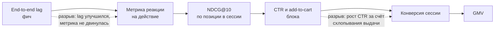
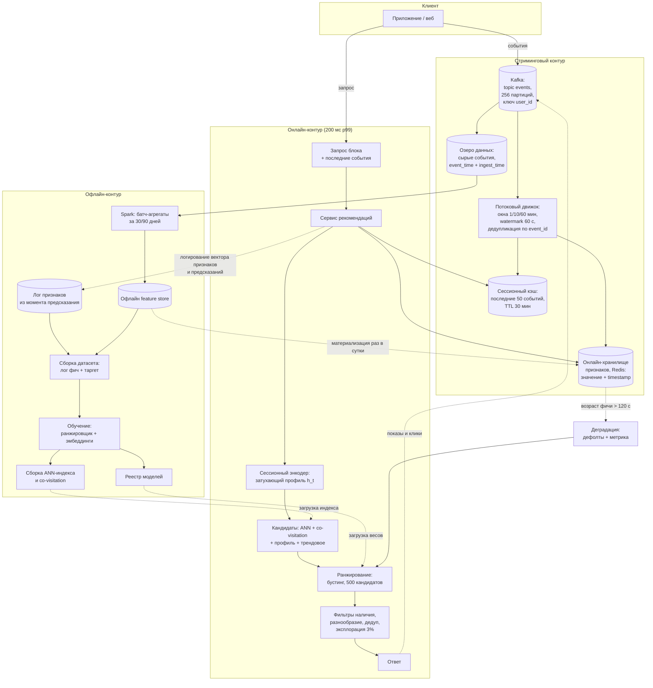

# Кейс: персонализация в реальном времени

> **Зачем эта глава.** «Сделайте так, чтобы рекомендации менялись прямо во время сессии» —
> кейс, в котором ML почти не является сложной частью. Сложная часть — стриминговый контур:
> Kafka, окна агрегации, отставание потребителей, и главное — несовпадение признаков между
> обучением и продом, которое при потоковых фичах возникает по умолчанию и убивает качество
> тихо. После этой главы вы сможете пройти кейс по каркасу, посчитать, сколько стоит каждая
> секунда свежести, и объяснить, почему половину реального времени правильнее делать вообще
> без Kafka.

**Уровень:** 🎯 middle → 🧠 middle+
**Предварительно нужно:** [каркас ответа](01-framework.md), [рекомендации в продакшене](../06-recsys/14-recsys-in-production.md), [последовательные рекомендации](../06-recsys/09-sequential-recsys.md), [потоковая обработка](../08-big-data/05-streaming.md), [feature store](../07-mlops/03-data-and-feature-store.md)
**Как проработать:** чтение + прогон кейса вслух с таймером

---

## Карта главы

- [0. Как звучит задача](#0-как-звучит-задача)
- [1. Шаг 1. Уточняющие вопросы и полученные ответы](#1-шаг-1-уточняющие-вопросы-и-полученные-ответы)
- [2. Шаг 2. Метрики: чем «свежесть» отличается от «качества»](#2-шаг-2-метрики-чем-свежесть-отличается-от-качества)
- [3. Шаг 3. Данные: логи событий и point-in-time корректность](#3-шаг-3-данные-логи-событий-и-point-in-time-корректность)
- [4. Шаг 4. Постановка ML-задачи, бейзлайн и лестница](#4-шаг-4-постановка-ml-задачи-бейзлайн-и-лестница)
- [5. Шаг 5. Признаки: три уровня свежести и их цена](#5-шаг-5-признаки-три-уровня-свежести-и-их-цена)
- [6. Шаг 5б. Модель: сессионный энкодер и ранжирование](#6-шаг-5б-модель-сессионный-энкодер-и-ранжирование)
- [7. Шаг 6. Архитектура, бюджет латентности и деградация](#7-шаг-6-архитектура-бюджет-латентности-и-деградация)
- [8. Шаг 7. Оценка, выкатка, мониторинг](#8-шаг-7-оценка-выкатка-мониторинг)
- [9. Шаг 8. Три честные слабости и развитие](#9-шаг-8-три-честные-слабости-и-развитие)
- [10. Куда обычно копает интервьюер](#10-куда-обычно-копает-интервьюер)
- [11. Подводные камни](#11-подводные-камни)
- [12. Проверь себя](#12-проверь-себя)
- [13. Практика](#13-практика)
- [14. Что читать дальше](#14-что-читать-дальше)

---

## 0. Как звучит задача

> «У нас рекомендации пересчитываются раз в сутки. Пользователь весь вечер смотрит палатки,
> а на главной ему по-прежнему показывают детские коляски, которые он покупал в прошлом месяце.
> Сделайте так, чтобы рекомендации обновлялись прямо в течение сессии.»

Кейс кажется простым: «поставим Kafka, посчитаем фичи в реальном времени». Именно поэтому
он хорошо разделяет кандидатов. Сильный ответ строится вокруг трёх мыслей, которые слабый
не произносит.

Первая: **реальное время бывает трёх разных сортов**, стоящих в сто раз разных денег, и большая
часть эффекта достигается самым дешёвым из них. Вторая: **признак, посчитанный в потоке,
почти наверняка не совпадёт с тем же признаком, посчитанным в офлайн-обучении** — и это главный
источник тихой потери качества. Третья: стриминговый контур **отказывает не падением, а отставанием**,
и система обязана уметь работать на устаревших признаках, а не рушиться.

> 💬 **На собеседовании.** Открывающая реплика: «Прежде чем проектировать, уточню, что мы называем
> реальным временем. Есть три разных вещи: события текущей сессии, которые можно донести
> до модели за миллисекунды вообще без стрима; агрегаты по всем пользователям за последние
> минуты — это уже Kafka плюс потоковый движок; и переобучение модели онлайн — это отдельная
> история с другими рисками. От того, что из этого нужно бизнесу, зависит и архитектура,
> и бюджет, и сколько людей будет это дежурить». Такое разделение в первую минуту сразу
> выводит разговор на уровень выше «поставим Kafka».

> 🌱 **База.** Если вы впервые видите этот кейс, держите в голове четыре факта. Первое:
> рекомендации собираются в несколько стадий — сначала дешёвый отбор кандидатов из миллионов
> товаров, потом дорогое ранжирование сотен (см. [основы рекомендаций](../06-recsys/01-recsys-foundations.md)).
> Второе: «персонализация в реальном времени» на практике означает, что часть признаков модели
> обновляется за секунды, а сама модель обучается по-прежнему раз в сутки. Третье: чем свежее
> признак, тем дороже инфраструктура — и зависимость нелинейная. Четвёртое: если признак
> в обучении считался иначе, чем в проде, модель будет работать хуже, чем на валидации,
> и вы не поймёте почему.

---

## 1. Шаг 1. Уточняющие вопросы и полученные ответы

| Что спрашиваем | Ответ интервьюера | Почему это меняет систему |
|---|---|---|
| Какая поверхность? | Блок «для вас» на главной и в карточке товара мобильного приложения и веба | Разное число обращений за сессию |
| Масштаб? | 30 млн MAU, 6 млн DAU, 12 млн сессий в сутки | База для всех расчётов |
| Каталог? | 60 млн SKU, из них активных и в наличии ~18 млн | Определяет необходимость стадии кандидатов |
| Что за сессия? | Медиана 8,5 минут, 14 просмотров карточек, ~35 событий всех типов | Даёт объём потока |
| Поток событий? | 420 млн событий в сутки; средний поток 4 900 событий/с, вечерний пик 18 000/с, в распродажу до 45 000/с | Проектируем стрим на 45 000/с |
| Запросы рекомендаций? | ~6 обращений за сессию → 72 млн запросов/сутки, средний 830 RPS, пик 3 500 RPS | Бюджет на инференс |
| Латентность? | 200 мс p99 на весь ответ блока, включая сеть | Даёт ~25 мс на все признаки |
| Насколько «реально» время? | Продуктовое требование: действие пользователя должно повлиять на следующую выдачу. «Следующая» — это через 20–60 секунд | Ключевой ответ: нам не нужны миллисекунды |
| Анонимы? | 35% сессий без авторизации, есть устойчивый идентификатор устройства | Меняет холодный старт |
| Что есть сейчас? | Батчевый пересчёт кандидатов раз в сутки, ранжирование бустингом на суточных признаках | Есть с чем сравнивать и есть фолбэк |
| Бюджет? | Прирост инфраструктуры не более 600 тыс. ₽/мес; при большем нужен расчёт окупаемости | Ограничение, отсекающее «сделаем всё в Flink» |
| Команда? | 3 ML-инженера, есть общая платформенная команда с Kafka и Flink | Реально: не надо строить стрим с нуля |
| Ограничения? | Нельзя показывать товары не в наличии; нельзя показывать 18+ без подтверждения возраста; нельзя «преследовать» уже купленным товаром | Бизнес-правила в конце пайплайна |

**Фиксируем вслух.** «Итак: блок “для вас”, 6 млн DAU, 12 млн сессий, 420 млн событий в сутки
с пиком 45 тысяч в секунду, 3 500 RPS в пике на выдачу, 200 мс p99, влияние действия на выдачу
в пределах минуты, 35% анонимов, бюджет 600 тысяч рублей в месяц сверху. Правильно?»

> 🧠 **Middle+.** Здесь уместен вопрос, который почти никто не задаёт: **«А есть ли доказательства,
> что свежесть вообще влияет на метрику?»** Правильная реакция интервьюера — «нет, поэтому мы
> и хотим проверить». А правильное продолжение кандидата — предложить дешёвый эксперимент,
> который измерит ценность свежести до того, как построен весь стрим: взять текущую систему
> и добавить в неё только события текущей сессии, передаваемые в запросе. Это две недели работы
> против трёх месяцев на полноценный потоковый контур, и оно даёт большую часть эффекта (§5).
> Такой ход — сильнейший сигнал зрелости в этом кейсе.

---

## 2. Шаг 2. Метрики: чем «свежесть» отличается от «качества»

### Уровень 1: бизнес

GMV на активного пользователя за период. Формально:

$$
\mathrm{GMV} = N_{\text{DAU}} \cdot s \cdot \mathrm{CR}_{\text{sess}} \cdot \overline{AOV}
$$

где $N_{\text{DAU}} = 6 \cdot 10^6$ — активные пользователи в сутки, $s = 2$ — среднее число
сессий на пользователя в сутки, $\mathrm{CR}_{\text{sess}}$ — конверсия сессии в заказ
(текущая 4,2%), $\overline{AOV}$ — средний чек. Блок «для вас» даёт 11% GMV, поэтому речь
об относительном приросте внутри этой доли — важно проговорить, иначе легко «нарисовать»
нереалистичный эффект.

### Уровень 2: продуктовые метрики

- Конверсия сессии в заказ (главная метрика A/B).
- CTR блока «для вас» и add-to-cart rate из блока.
- Глубина сессии и доля сессий с более чем одним просмотром из блока.
- **Метрика реакции на внутрисессионное действие** — специфичная для этого кейса:
  доля сессий, в которых после просмотра товара категории $c$ следующая выдача содержала
  товары той же или смежной категории. Это прямой индикатор того, что контур свежести
  вообще работает; он растёт первым, ещё до бизнес-метрик.

### Уровень 3: ML-метрики (офлайн)

- Recall@300 на стадии кандидатов — потолок для всего остального.
- NDCG@10 ранжирования на временном сплите.
- **Разложение метрики по позиции события в сессии.** Ключевая мысль кейса: усреднённый NDCG
  скрывает эффект. Считайте NDCG отдельно для запросов, сделанных после 0, 1, 3, 5, 10 событий
  в сессии. Реалтайм-контур влияет только на правый хвост этого распределения, а именно там
  сосредоточена большая часть покупок.

### Уровень 4: guardrails

| Метрика | Порог | Почему |
|---|---|---|
| p99 латентности выдачи | ≤ 200 мс | продуктовое требование |
| **End-to-end lag фич p95** | ≤ 20 с | собственно свежесть; главный SLI стримингового контура |
| Доля запросов с устаревшими фичами (возраст > 120 с) | ≤ 1% | индикатор деградации |
| Доля запросов с дефолтными значениями реалтайм-фич | ≤ 2% | ловит отказ стрима раньше, чем бизнес-метрика |
| Разнообразие выдачи (доля уникальных категорий в топ-10) | не ниже текущего | реалтайм схлопывает выдачу — см. §9 |
| Доля повторов уже купленного | ≤ текущего | «преследование» товаром |
| Доля хвостовых товаров в показах | не ниже текущего | защита от вырождения |

Про lag стоит сказать отдельно, потому что кандидаты обычно называют латентность выдачи
и забывают про лаг признаков. Определим его явно:

$$
L_{\text{e2e}} = t_{\text{доступно в онлайн-хранилище}} - t_{\text{событие произошло у пользователя}}
$$

где $t_{\text{событие произошло}}$ — момент действия на клиенте, $t_{\text{доступно}}$ — момент,
когда обновлённый признак можно прочитать из онлайн-хранилища. Он складывается из четырёх
слагаемых: доставка с клиента (0,3–3 с, на мобильных сетях бывает и десятки секунд), запись
в Kafka и её репликация (десятки мс), обработка потоковым движком с учётом окна и watermark
(основной вклад), запись в онлайн-хранилище (единицы мс). Проговорить это разложение —
сразу видно человека, который стрим щупал.

### Связь уровней и её риски



Оба разрыва честные, и оба надо назвать. Первый: снижение лага с 60 до 5 секунд может вообще
не отразиться на поведении, потому что пользователь физически не успевает вернуться на главную
за 5 секунд. Второй: реалтайм-персонализация легко поднимает CTR, схлопывая выдачу в одну
категорию, — а конверсия и GMV при этом падают, потому что пользователь не находит того,
что искал бы дальше.

> 💬 **На собеседовании.** Спросят: «Как вы докажете, что реалтайм нужен?» Хороший ответ —
> предложить измерять **ценность свежести отдельно от ценности модели**. Схема: A/B, в котором
> все группы используют одну и ту же модель и один и тот же набор признаков, но признакам
> искусственно добавляется задержка: 0 секунд, 30 секунд, 5 минут, 1 час. Разница между группами
> — чистая ценность свежести, без примеси качества модели. Такой эксперимент отвечает
> на вопрос «сколько платить за секунды» в рублях и обычно показывает, что кривая выполаживается
> гораздо раньше, чем ожидали. Плохой ответ: «сравним старую систему и новую» — там смешаны
> два эффекта, и вы не узнаете, за что заплатили.

---

## 3. Шаг 3. Данные: логи событий и point-in-time корректность

### Откуда таргет

Таргет — как в любой рекомендательной задаче: клик, добавление в корзину, заказ по показанным
позициям. Отдельно проговорите, что нужны **логи показов** (impressions), а не только кликов:
без негативных примеров задача не ставится. Объём: 72 млн запросов в сутки по 10 позиций —
720 млн строк показов; с фичами это уже терабайты, поэтому показы прореживаем — оставляем
все позитивные и 5–10% случайных негативных сессий с полной записью.

Смещение обратной связи здесь стандартное (учим на том, что показали) плюс специфичное
для реалтайма: **чем быстрее система реагирует на последнее действие, тем сильнее петля**.
Показали товар той же категории → пользователь кликнул → фича «интерес к категории» выросла →
показали ещё. За несколько итераций выдача схлопывается. Лечение: затухание веса последнего
события, ограничение доли одной категории в выдаче, доля случайной эксплорации (2–5% позиций),
логирование позиции для коррекции позиционного биаса.

### Что логировать: главный пункт этого кейса

**Логируйте значения признаков в момент предсказания.** В батчевой системе без этого можно
жить: пересчитал агрегаты по вчерашним данным — получил примерно то же, что было в проде.
В стриминговой — нельзя, и вот почему.

Признак «число просмотров категории “туризм” за последние 30 минут» в проде считается
потоковым движком по тем событиям, которые **успели дойти** к моменту запроса. При офлайн-сборке
обучающей выборки тот же признак считается Spark-джобом по **всем** событиям, включая
опоздавшие. Три источника расхождения:

1. **Опоздавшие события (late events).** Мобильный клиент отправил пачку событий через 40 секунд
   после действия. В проде их не было — в офлайне они попадут в окно.
2. **Разные реализации.** Потоковая логика написана на Flink, батчевая — на Spark SQL. Даже
   при одинаковом намерении границы окон, обработка дубликатов и порядок агрегации разойдутся.
3. **Обновление задним числом.** Товар переехал в другую категорию, справочник обновился —
   офлайн видит новую категорию, прод видел старую.

Каждое из трёх даёт сдвиг обучающей выборки относительно продовой (train/serve skew), и все три
работают в одну сторону: офлайн-признаки «лучше» продовых, модель переоценивает их полезность,
в проде качество ниже, чем на валидации. Диагностируется мучительно.

Правильное решение — **логирование признаков** (feature logging, «log and wait»): сервис
записывает в лог ровно тот вектор признаков, на котором сделал предсказание, вместе с
идентификатором запроса; обучающая выборка собирается джойном этого лога с таргетом,
пришедшим позже.

Честно назовите цену этого решения, иначе ответ выглядит выученным:
- Новую фичу нельзя добавить и сразу обучиться — надо ждать накопления (2–4 недели данных).
- Нельзя пересчитать историю (backfill) при исправлении бага в фиче.
- Объём логов растёт: 720 млн строк × 120 признаков — это десятки терабайт в месяц, нужна
  агрессивная колоночная упаковка и прореживание негативов.

Практическая схема — **гибрид**: устойчивые батчевые фичи (агрегаты за 30/90 дней) собираются
офлайн с point-in-time join, а все стриминговые и сессионные — логируются. Так вы получаете
и возможность экспериментировать с батчевыми фичами, и корректность там, где она критична.

### Point-in-time корректность

Если фичу всё же собираем офлайн, значение должно быть таким, каким оно было **в момент
запроса**, а не финальным. Нарушение этого правила — самая частая утечка в рекомендациях
на сессионных данных.

```python
# Point-in-time join: как собрать обучающую выборку так, чтобы признак был "из прошлого".
# Ошибка, которую делают почти все: посчитать агрегат по всей сессии и приклеить его
# ко всем запросам этой сессии — тогда в признаке окажутся будущие события.
import pandas as pd

# События сессии: пользователь смотрит карточки товаров
events = pd.DataFrame({
    "user_id": ["u1"] * 5,
    "ts": pd.to_datetime(["2026-03-01 10:00:00", "2026-03-01 10:00:40",
                          "2026-03-01 10:01:10", "2026-03-01 10:02:30",
                          "2026-03-01 10:03:05"]),
    "category": ["туризм", "туризм", "обувь", "туризм", "туризм"],
})
# Кумулятивный счётчик просмотров категории "туризм" ДО текущего момента (сдвиг на 1 строку):
events["views_tourism_so_far"] = (
    (events["category"] == "туризм").cumsum().shift(1, fill_value=0)
)

# Запросы рекомендаций внутри той же сессии
requests = pd.DataFrame({
    "user_id": ["u1"] * 3,
    "ts": pd.to_datetime(["2026-03-01 10:00:30", "2026-03-01 10:01:30",
                          "2026-03-01 10:03:20"]),
})

# merge_asof с direction="backward" берёт ПОСЛЕДНЕЕ известное значение на момент запроса —
# ровно то, что видел бы сервис. Это и есть point-in-time join.
joined = pd.merge_asof(
    requests.sort_values("ts"),
    events[["ts", "user_id", "views_tourism_so_far"]].sort_values("ts"),
    on="ts", by="user_id", direction="backward",
)
print(joined)

# Для сравнения — неверный вариант: агрегат по всей сессии.
wrong = (events["category"] == "туризм").sum()
print("неверно (утечка будущего):", wrong)
```

Запустите: правильный вариант даёт для трёх запросов значения 1, 2 и 3 — знание нарастает
по ходу сессии. Неверный вариант приклеил бы 4 ко всем трём, то есть первый запрос «знал бы»
о просмотрах, которые ещё не случились. Модель, обученная так, на валидации покажет отличный
результат и провалится в проде.

> ⚠️ **Типичная ошибка.** Симулировать реалтайм-фичи офлайн, забыв про задержку доставки.
> Даже корректный point-in-time join по времени события даёт значение, которого в проде
> не было, если событие дошло с опозданием. Правильно джойнить по **времени доступности**
> (когда фича реально появилась в онлайн-хранилище), а не по времени события. Для этого
> в лог событий пишутся оба таймштампа — `event_time` и `ingest_time`.

### Схема сплита

- **Временной сплит** обязателен: train — 8 недель, validation — следующая неделя, test —
  ещё одна. Случайный сплит по строкам завышает метрику катастрофически, потому что события
  одной сессии попадут и в train, и в test.
- **Разрыв (gap) между train и test** в 1 день: часть таргетов (заказ, отмена) приходит
  с задержкой, и без разрыва в train попадут строки с неполной разметкой.
- Отдельный **сплит по пользователям** для проверки, что модель не выучила конкретных
  пользователей: 3% пользователей полностью исключаются из train.
- **Холодные сессии** — отдельный срез в тесте: первые запросы сессий и анонимные сессии.
  Метрика на них считается отдельно всегда, иначе улучшения для «богатых» сессий замаскируют
  деградацию для холодных, а холодных 35%.

---

## 4. Шаг 4. Постановка ML-задачи, бейзлайн и лестница

### Постановка

Двухстадийная, как обычно в рекомендациях, но с явно выделенным сессионным состоянием.

**Стадия кандидатов.** Дан пользователь $u$, его сессионное состояние $h_t$ (сжатое
представление последовательности событий $e_1, \dots, e_t$) и контекст $x$. Нужно вернуть
множество $\mathcal{K}(u, h_t, x)$ из ~500 товаров, максимизируя Recall@500 при бюджете 20 мс.

**Стадия ранжирования.** Для каждого $i \in \mathcal{K}$ оценить

$$
\hat{p}(i) = P(\text{заказ в течение сессии} \mid u, h_t, x, i)
$$

и отсортировать. Здесь $\hat{p}(i)$ — предсказанная вероятность целевого события,
$h_t$ — сессионное состояние на момент $t$, $x$ — контекст запроса (поверхность, устройство,
время суток), $i$ — товар-кандидат.

Финальный балл обычно многозадачный, потому что оптимизировать один клик вредно:

$$
\text{score}(i) = \hat{p}_{\text{click}}(i)^{\alpha} \cdot \hat{p}_{\text{order}}(i)^{\beta} \cdot v(i)^{\gamma}
$$

где $\hat{p}_{\text{click}}$ и $\hat{p}_{\text{order}}$ — предсказанные вероятности клика
и заказа, $v(i)$ — ожидаемая ценность заказа (маржа или цена), $\alpha, \beta, \gamma \ge 0$ —
веса, подбираемые в A/B, а не обучением. Степенная форма удобна тем, что веса задают
относительную важность в логарифмической шкале и не требуют одинаковых масштабов у множителей.

### НеML-бейзлайн: обязателен и здесь он неожиданно силён

**Бейзлайн 0.** «Похожие на последний просмотренный» — предпосчитанная офлайн матрица
совстречаемости (co-visitation): для каждого товара топ-100 товаров, которые часто смотрят
в одной сессии. Хранится в Redis, читается за 3 мс, обновляется раз в сутки. Реагирует
на действие пользователя мгновенно, потому что «реальным временем» здесь является только
идентификатор последнего просмотренного товара, а он есть в запросе.

Это ключевой момент кейса, и его надо произнести вслух: **бейзлайн 0 уже даёт
внутрисессионную реакцию и не требует ни Kafka, ни Flink**. На типичном маркетплейсе он
закрывает заметную долю эффекта от всей затеи. Кандидат, который начинает с построения
стримингового контура, не заметив этого, теряет много баллов.

**Бейзлайн 1.** Текущий бустинг плюс десяток сессионных признаков, вычисляемых **в самом
сервисе** из последних событий, переданных в запросе или взятых из сессионного кэша.

### Лестница усложнения

| Уровень | Что добавляем | Задержка признаков | Инфраструктура | Ожидаемый прирост CR |
|---|---|---|---|---|
| L0 | co-visitation по последнему товару | ~0 | Redis | базовый |
| L1 | сессионные признаки из событий в запросе (последние 20) | ~0 | ничего нового | +2,5% |
| L2 | сессионный энкодер (затухающий профиль) + ANN по нему | ~0 | ANN уже есть | +1,4% |
| L3 | стриминговые агрегаты по товарам (популярность за 10 мин, тренды) | 10–30 с | Kafka + Flink + Redis | +0,9% |
| L4 | стриминговые агрегаты по пользователю между сессиями | 10–30 с | то же | +0,3% |
| L5 | онлайн-дообучение модели | минуты | сложно | не доказано, риск высокий |

Числа в последнем столбце — порядок эффекта из типичных внедрений, и подавать их надо именно
так: «мой ожидаемый порядок, который я проверю экспериментом со ступенями задержки из §2».
Смысл таблицы в форме кривой: **основной эффект даёт переход от суточных признаков
к внутрисессионным, а не от 30 секунд к 3 секундам**. При этом стоимость растёт ровно
в обратном порядке: L1 и L2 почти бесплатны, L3 стоит сотни тысяч рублей в месяц и постоянного
дежурства.

> 🧠 **Middle+.** Про L5 (онлайн-обучение) стоит сказать отдельно и сказать «нет» с обоснованием:
> модель, обучающаяся на своём же трафике в реальном времени, замыкает петлю обратной связи
> за минуты вместо суток, что резко ускоряет вырождение выдачи; откатить её нельзя — состояние
> непрерывно; воспроизвести инцидент невозможно. Уместный компромисс — частое **переобучение
> батчем** (раз в 2–6 часов) с обычными гейтами и возможностью отката, плюс онлайн-обновление
> только эмбеддингов новых товаров и счётчиков популярности. Кандидат, который умеет отказаться
> от самой «продвинутой» опции с аргументами, выглядит сильнее того, кто её предлагает.

---

## 5. Шаг 5. Признаки: три уровня свежести и их цена

Главная таблица кейса. Признаки группируются не по смыслу, а **по контуру, в котором считаются** —
потому что от этого зависит и стоимость, и режим отказа.

| Уровень | Примеры признаков | Где считается | Задержка | Стоимость |
|---|---|---|---|---|
| **Батч (сутки)** | агрегаты за 30/90 дней, эмбеддинг пользователя, доли категорий, средний чек, эмбеддинги товаров | Spark ночью → офлайн-хранилище → материализация в Redis | 3–24 ч | низкая, уже есть |
| **Стрим (секунды)** | популярность товара за 10 мин, конверсия карточки за час, тренды категорий, счётчики пользователя между сессиями | Kafka → Flink → Redis | 10–30 с | **высокая** |
| **Сессия (мгновенно)** | последние 20 просмотров, категории текущей сессии, затухающий профиль интереса, последний поисковый запрос, время с начала сессии | **в самом сервисе**, из запроса или из сессионного кэша | ~0 | почти нулевая |
| **Запрос** | поверхность, устройство, гео, время суток, реферер | из запроса | 0 | нулевая |

Обратите внимание на третью строку. Событие текущего пользователя не нужно прогонять через
Kafka, чтобы вернуть его этому же пользователю: клиент может прислать последние события
в теле запроса, а сервис — держать сессионный кэш в Redis с TTL 30 минут (6 млн активных
сессий × 2 КБ ≈ 12 ГБ). Задержка — единицы миллисекунд, инфраструктура — уже существующая.

Kafka нужна для другого: **агрегатов по чужим событиям**. «Сколько людей посмотрели этот товар
за последние 10 минут», «какая категория растёт прямо сейчас», «конверсия этой карточки
за последний час» — это данные, которых у текущего пользователя нет и быть не может.

> 💬 **На собеседовании.** Спросят: «Зачем вам Kafka, если события сессии можно передать
> в запросе?» Хороший ответ различает два вида реалтайм-признаков. Признаки **о самом
> пользователе** обслуживаются сессионным кэшем и телом запроса, стоят копейки и имеют
> нулевую задержку. Признаки **о популяции** — популярность, тренды, конверсия товара
> за последние минуты — принципиально требуют агрегации по всем пользователям, и без стрима
> их не получить. Плюс стрим нужен, чтобы сессионное состояние переживало смену устройства
> и переход между сессиями. Плохой ответ: «Kafka нужна, потому что это стандарт для реалтайма» —
> человек не отделяет задачу от инструмента.

### Затухающий сессионный профиль

Простейшее и очень работающее сессионное состояние — экспоненциально затухающее среднее
эмбеддингов просмотренных товаров:

$$
h_t = \gamma \, h_{t-1} + (1 - \gamma)\, z_{i_t}, \qquad \gamma = 2^{-\Delta t / T_{1/2}}
$$

где $h_t \in \mathbb{R}^d$ — сессионное состояние после $t$-го события, $z_{i_t} \in \mathbb{R}^d$ —
эмбеддинг товара из $t$-го события (тот же, что используется в ANN-индексе), $\Delta t$ —
время между событиями $t-1$ и $t$ в секундах, $T_{1/2}$ — период полураспада интереса
в секундах, $\gamma \in (0,1)$ — коэффициент затухания.

Смысл: чем больше времени прошло, тем меньше веса у старого состояния. $T_{1/2}$ — это
продуктовый параметр, а не гиперпараметр модели: при $T_{1/2} = 120$ с выдача перестраивается
почти мгновенно под последний просмотр (и легко схлопывается), при $T_{1/2} = 1800$ с
она инерционна. Подбирается в A/B.

```python
# Сессионное состояние с затуханием: считается в сервисе за микросекунды,
# не требует ни Kafka, ни потокового движка. Это и есть "дешёвый реалтайм".
import numpy as np


def session_state(item_embeddings: np.ndarray, timestamps: np.ndarray,
                  half_life_sec: float = 600.0) -> np.ndarray:
    """item_embeddings: (T, d) — эмбеддинги просмотренных товаров по порядку,
    timestamps: (T,) — unix-время событий."""
    d = item_embeddings.shape[1]
    h = np.zeros(d)
    prev_ts = timestamps[0]
    for z, ts in zip(item_embeddings, timestamps):
        dt = max(0.0, float(ts - prev_ts))
        # gamma зависит от РЕАЛЬНОГО времени между событиями, а не от их номера:
        # пять просмотров за минуту и пять просмотров за час — разные намерения.
        gamma = 0.5 ** (dt / half_life_sec)
        h = gamma * h + (1.0 - gamma) * z
        prev_ts = ts
    norm = np.linalg.norm(h)
    return h / norm if norm > 0 else h


rng = np.random.default_rng(7)
tents = rng.normal(size=(3, 16))        # три палатки — близкие эмбеддинги
tents += rng.normal(scale=0.05, size=(3, 16))
stroller = rng.normal(size=(1, 16))     # коляска из прошлой сессии

emb = np.vstack([stroller, tents])
ts = np.array([0, 1800, 1860, 1920])    # коляска полчаса назад, палатки — только что

h = session_state(emb, ts, half_life_sec=600.0)
print("близость к палаткам:", float(np.mean(tents @ h / np.linalg.norm(tents, axis=1))))
print("близость к коляске: ", float(stroller @ h / np.linalg.norm(stroller)))
# Состояние уехало к палаткам: старый интерес затух, но не обнулился —
# именно это поведение и нужно продукту.
```

### Стриминговые агрегаты: как считать окно дёшево

Наивная реализация скользящего окна («все события за последние 10 минут») требует хранить
все события окна. При 45 000 событий/с это 27 млн событий в состоянии. Стандартный приём —
разбить окно на маленькие тумблинг-корзины (например, по 30 секунд) и хранить только их
агрегаты, а скользящее значение получать суммированием корзин.

```python
# Скользящее окно через кольцевой буфер тумблинг-корзин.
# Память: O(число корзин), а не O(число событий). Именно так это делается
# в потоковых движках (и так же стоит считать счётчики в сервисе).
from collections import deque


class SlidingCounter:
    def __init__(self, window_sec: int = 600, bucket_sec: int = 30):
        self.bucket_sec = bucket_sec
        self.n_buckets = window_sec // bucket_sec
        self.buckets: deque[tuple[int, int]] = deque()  # (индекс корзины, счётчик)
        self.total = 0

    def _evict(self, now_bucket: int) -> None:
        # Выкидываем корзины, вышедшие за окно. Делаем это лениво, при обращении,
        # чтобы не держать таймер на каждый ключ: ключей миллионы.
        while self.buckets and self.buckets[0][0] <= now_bucket - self.n_buckets:
            _, cnt = self.buckets.popleft()
            self.total -= cnt

    def add(self, ts: int, n: int = 1) -> None:
        b = ts // self.bucket_sec
        self._evict(b)
        if self.buckets and self.buckets[-1][0] == b:
            idx, cnt = self.buckets[-1]
            self.buckets[-1] = (idx, cnt + n)
        else:
            self.buckets.append((b, n))
        self.total += n

    def value(self, ts: int) -> int:
        self._evict(ts // self.bucket_sec)
        return self.total


c = SlidingCounter(window_sec=600, bucket_sec=30)
for t in range(0, 900, 10):        # событие каждые 10 секунд в течение 15 минут
    c.add(t)
print("просмотров за последние 10 минут на момент t=890:", c.value(890))
# 60 вместо 90: события старше 10 минут выпали из окна — ровно то, что нужно.
```

Размер состояния для реального потока: 18 млн активных товаров × 20 корзин × 8 байт ≈ 2,9 ГБ
на один тип счётчика. Это влезает в состояние потокового движка на RocksDB, но каждый новый
счётчик — это ещё столько же плюс нагрузка на запись в Redis. Отсюда практическое правило:
**стриминговых признаков должно быть мало и они должны быть проверенно полезными**,
иначе стоимость растёт линейно, а качество — нет.

### Стоимость стримингового контура

Считаем вслух — это то, ради чего задавали вопрос про бюджет.

- **Kafka.** 420 млн событий/сутки × 1,2 КБ ≈ 500 ГБ/сутки сырых; при факторе репликации 3
  и хранении 3 суток — 4,5 ТБ дисков. Пик 45 000 событий/с — это порядка 54 МБ/с записи,
  комфортно для кластера из 6–9 брокеров. Партиций 256, ключ — `user_id` (важно: партиционирование
  по пользователю гарантирует порядок событий одного пользователя).
- **Потоковый движок.** Состояние: 6 млн активных сессий × 2 КБ + счётчики по товарам ≈ 15–20 ГБ.
  На пике 45 000 событий/с с несколькими агрегациями — порядка 10–14 воркеров по 8 vCPU
  и 32 ГБ памяти.
- **Онлайн-хранилище.** Запись 45 000 обновлений/с и чтение 3 500 RPS × ~2 обращения.
  Redis-кластер, 60–80 ГБ памяти с репликами.

В сумме прирост инфраструктуры — порядка 400–550 тысяч рублей в месяц, что укладывается
в названный бюджет, но съедает его почти целиком. Именно поэтому лестница из §4 идёт снизу
вверх: L1 и L2 надо выкатить и измерить **до** того, как строить L3.

---

## 6. Шаг 5б. Модель: сессионный энкодер и ранжирование

### Кандидаты: четыре источника

| Источник | Как работает | Латентность | Зачем нужен |
|---|---|---|---|
| Co-visitation по последним товарам | предпосчитанные топ-100 «смотрят вместе», Redis | 4 мс | мгновенная реакция, отлично для холодной сессии с одним просмотром |
| ANN по сессионному состоянию $h_t$ | HNSW по эмбеддингам товаров, запрос — $h_t$ из §5 | 12 мс | обобщение: находит то, что не встречалось вместе явно |
| Долгосрочный профиль | предпосчитанный список за ночь | 3 мс | устойчивость, когда сессия пустая |
| Популярное / трендовое в контексте | стриминговые счётчики, топ по категории входа | 3 мс | холодный старт и анонимы |

Источники объединяются, дедуплицируются, фильтруются по наличию и бизнес-правилам.
Несколько источников — не избыточность, а страховка: если один деградировал, выдача не пустая.

### Ранжирование: три варианта и выбор

**Вариант A: градиентный бустинг на табличных признаках** (включая сессионные агрегаты
и косинус между $h_t$ и эмбеддингом кандидата). Плюсы: 500 кандидатов × 120 признаков
ранжируются за ~25 мс на CPU, обучается за часы, устойчив, легко интерпретируется,
уже есть в проде. Минусы: последовательность видит только через ручные агрегаты.

**Вариант B: нейронный ранжировщик с вниманием к истории** (в духе DIN — внимание кандидата
к последовательности просмотров). Плюсы: сам выучивает, какие события истории релевантны
конкретному кандидату; заметно лучше на длинных сессиях. Минусы: инференс 500 кандидатов
с attention — это уже GPU или жёсткая оптимизация, обучение дольше, отладка сложнее.

**Вариант C: сессионный трансформер (SASRec/BERT4Rec-подобный)** как отдельная модель
next-item. Плюсы: сильная модель последовательности. Минусы: плохо принимает богатый набор
табличных и контекстных признаков, а они в маркетплейсе дают много.

**Выбор с обоснованием:** «Начну с варианта A плюс сессионные признаки и косинус с $h_t$ —
он влезает в 25 мс на CPU, переиспользует существующий пайплайн и позволяет за две недели
измерить ценность свежести. Сессионный энкодер (вариант C) добавлю не как ранжировщик,
а как **источник кандидатов** — там его сила и есть, а требования к латентности мягче.
К варианту B перейду, когда A упрётся в потолок, и считать буду на GPU с батчингом
по кандидатам». Последняя фраза — выбор, продиктованный ограничением, а не модой.

### Устойчивость к отсутствию свежих признаков

Приём, который отличает инженера, думавшего про отказы: **обучать модель с намеренным
выключением реалтайм-признаков** на части примеров.

```python
# Feature dropout для реалтайм-признаков: на обучении в 7% примеров
# заменяем стриминговые фичи дефолтами. Зачем: в проде стрим будет отставать,
# и модель не должна рушиться, встретив дефолты — она должна опираться на батчевые фичи.
import numpy as np


def apply_realtime_dropout(X: np.ndarray, rt_cols: list[int],
                           defaults: np.ndarray, p: float = 0.07,
                           seed: int = 0) -> np.ndarray:
    rng = np.random.default_rng(seed)
    X = X.copy()
    mask = rng.random(X.shape[0]) < p
    # Важно: подставляем ровно те значения, которые сервис подставит при деградации.
    # Если тут NaN, а в сервисе нули — вы обучили модель на другом распределении.
    X[np.ix_(mask, rt_cols)] = defaults
    return X


X = np.random.default_rng(1).normal(size=(10, 6))
X_aug = apply_realtime_dropout(X, rt_cols=[4, 5], defaults=np.array([0.0, 0.0]), p=0.3)
print("строк с выключенными реалтайм-фичами:", int((X_aug[:, 4:] == 0).all(axis=1).sum()))
```

Эффект: при отставании стрима качество падает не обрывом, а плавно — до уровня батчевой
модели. Без этого приёма деградация стрима означает, что модель получает нули там, где
на обучении были осмысленные значения, и ведёт себя непредсказуемо.

---

## 7. Шаг 6. Архитектура, бюджет латентности и деградация

### Схема



Четыре вещи проговариваем голосом.

**Первое: два независимых пути доставки событий.** Событие уходит и в Kafka (для агрегатов
по популяции и для офлайна), и напрямую в запросе/сессионном кэше (для мгновенной реакции).
Если стрим отстаёт, персонализация по своей сессии продолжает работать. Это самое ценное
архитектурное решение кейса.

**Второе: у каждого признака в онлайн-хранилище лежит timestamp.** Не «значение», а пара
«значение, время расчёта». Без этого сервис не может отличить свежую фичу от протухшей
и деградировать осознанно.

**Третье: лог признаков** — отдельная стрелка из сервиса, а не из стрима. Именно он делает
обучение консистентным продовому поведению (§3).

**Четвёртое: контур обратной связи** замкнут через показы и клики, уходящие обратно в Kafka.
Отсюда же берётся смещение и петля, о которой в §9.

### Бюджет латентности (цель: 200 мс p99)

| Стадия | Медиана | Примечание |
|---|---|---|
| Сеть, парсинг, аутентификация | 10 мс | |
| Сессионный кэш: последние 50 событий | 6 мс | Redis, один ключ |
| Признаки пользователя (батч + стрим) | 8 мс | один конвейерный запрос вместо N походов — критично |
| Сессионный энкодер $h_t$ | 3 мс | чистый numpy, 20 событий |
| ANN top-300 по $h_t$ | 12 мс | HNSW, `ef_search` подобран под recall 0,95 |
| Co-visitation + профиль + трендовое | 5 мс | параллельно с ANN |
| Слияние, дедуп, фильтр наличия | 6 мс | наличие — обязательный фильтр, держим в памяти сервиса |
| Признаки товаров для 500 кандидатов | 15 мс | multi-get + локальный LRU-кэш горячих товаров (попадание ~70%) |
| Ранжирование бустингом, 500 × 120 | 25 мс | батчем, без Python-цикла |
| Бизнес-правила, разнообразие, эксплорация | 6 мс | |
| Сериализация ответа | 5 мс | |
| **Итого** | **~101 мс** | p99 ≈ 180 мс с учётом хвостов Redis и GC |

Две вещи из таблицы, которые стоит подчеркнуть. Первая: признаки товаров для 500 кандидатов —
самая дорогая операция после ранжирования, поэтому локальный кэш горячих товаров обязателен
(распределение популярности тяжёлое, 70% попаданий достигается кэшем на десятки тысяч ключей).
Вторая: сессионный энкодер стоит 3 мс — то есть «реальное время» по своей сессии практически
бесплатно, в отличие от стримингового контура, который стоит сотни тысяч рублей в месяц
и не входит в этот бюджет вовсе, потому что работает асинхронно.

### Деградация: что происходит при отставании стрима

Стриминговый контур не падает — он **отстаёт**. Это принципиально другой режим отказа,
и его надо описать явно.

Признаки отставания: растёт consumer lag (число необработанных сообщений в партиции),
растёт возраст признаков в Redis, растёт время обработки на воркерах. Причины: всплеск
трафика (распродажа), медленный чекпоинт состояния, деградация записи в Redis, перекос
партиций (один популярный товар или бот-пользователь создаёт горячую партицию).

Реакция системы, по слоям:

| Слой | Реакция |
|---|---|
| Сервис рекомендаций | читает timestamp признака; если возраст > 120 с — подставляет дефолты (те же, что использовались при обучении, см. feature dropout в §6) и инкрементирует метрику деградации |
| Потоковый движок | автоскейл воркеров по lag; при перегрузке — сброс низкоприоритетных событий (скроллы, показы) с сохранением высокоприоритетных (корзина, заказ, просмотр карточки) |
| Kafka | отдельные топики по приоритету, чтобы сброс скроллов не задерживал заказы |
| Продукт | ничего не замечает: работает L0–L2 контур, качество падает на доли процента |

Пороги: алерт на consumer lag > 2 минут, критический — > 10 минут. Отдельно — алерт
на **перекос**: если lag растёт только в 3 партициях из 256, это горячий ключ, и лечится
он не скейлингом, а солью в ключе партиционирования или отсечением бота.

> 💬 **На собеседовании.** Спросят: «Consumer lag вырос до 10 минут. Что происходит
> с рекомендациями?» Хороший ответ: ничего катастрофического, и это должно быть спроектировано
> заранее. Признаки в онлайн-хранилище имеют возраст; сервис сравнивает его с порогом
> и при превышении подставляет дефолты, а модель обучена работать с дефолтами (feature dropout),
> поэтому деградирует плавно до уровня батчевой персонализации. Персонализация по текущей
> сессии не затронута вовсе, потому что идёт мимо Kafka. Метрика «доля запросов с деградацией»
> растёт и триггерит алерт раньше, чем просядет конверсия. Плохой ответ: «фичи будут
> устаревшие, качество упадёт» — без механизма обнаружения, без порога и без плана.

### Гарантии доставки и дубли

Вопрос, который любят задавать: exactly-once или at-least-once?

Ответ: **at-least-once с идемпотентной агрегацией**, потому что exactly-once в потоковом
движке стоит дорого (транзакционные коммиты, увеличенная задержка чекпоинтов), а для счётчиков
рекомендаций точность до одного события не нужна. Дубли обезвреживаются дедупликацией
по `event_id` в окне (храним видимые идентификаторы за последние 10 минут в фильтре Блума
или в состоянии) — этого достаточно, чтобы двойная доставка не удвоила счётчик просмотров.

Где exactly-once действительно нужен: денежные события (заказ, оплата) — но они и не идут
через контур рекомендаций, у них свой путь. Умение разделить эти два случая — сильный сигнал.

---

## 8. Шаг 7. Оценка, выкатка, мониторинг

### Офлайн-оценка

Временной сплит, метрика NDCG@10 и Recall@500, сравнение с текущей прод-моделью (не со случайной
выдачей), доверительные интервалы бутстрапом по сессиям (не по строкам — строки одной сессии
зависимы).

Обязательные разрезы, без которых оценка бесполезна:
- **по позиции события в сессии** (0, 1–2, 3–5, 6+): весь смысл проекта в правом хвосте;
- **холодные и анонимные сессии** — 35% трафика, легко деградируют незамеченными;
- **по категориям**: реалтайм сильнее работает на «исследовательских» категориях
  (одежда, товары для хобби) и почти не работает на «утилитарных» (бытовая химия).

Отдельно — **офлайн-симуляция задержки**: пересчитать признаки так, как если бы они были
доступны с задержкой 30 с / 5 мин / 1 ч, и посмотреть на метрику. Это дешёвая оценка ценности
свежести до всякого A/B. Она смещена (симуляция не воспроизводит опоздавшие события точно),
но порядок эффекта даёт.

### Онлайн-оценка

**Единица рандомизации — пользователь** (а для анонимов — устойчивый идентификатор устройства).
Не сессия: пользователь, попадающий в разные группы в разных сессиях, размывает эффект,
а долгосрочные метрики (возвраты, удержание) вообще нельзя посчитать.

Расчёт MDE. Главная метрика — конверсия сессии в заказ, базовое значение 4,2%. Метрика
считается на пользователя как доля сессий с заказом; по пользователям её стандартное
отклонение $\sigma \approx 0{,}09$. При выделении 10% трафика на эксперимент (5% / 5%)
получаем $n = 300\,000$ пользователей в группе:

$$
\mathrm{MDE} = (z_{1-\alpha/2} + z_{1-\beta})\,\sigma\sqrt{\frac{2}{n}}
= 2{,}8 \cdot 0{,}09 \cdot \sqrt{\frac{2}{300\,000}} \approx 0{,}00065
$$

где $z_{1-\alpha/2} = 1{,}96$ при $\alpha = 0{,}05$, $z_{1-\beta} = 0{,}84$ при мощности 80%,
$\sigma$ — стандартное отклонение метрики по пользователям, $n$ — число пользователей в группе.
То есть 0,065 процентного пункта абсолютных, или **около 1,5% относительных** к базе 4,2%.
За две недели этого достаточно, чтобы поймать эффекты уровня L1–L3 из §4 (ожидаемые 0,3–2,5%),
но эффект L4 (+0,3%) на грани — и это надо сказать заранее, а не после теста.

**Эксперимент со ступенями свежести** — то, что делает этот кейс особенным. Четыре группы
с одинаковой моделью и одинаковым набором признаков, но с искусственно добавленной задержкой
доставки признаков: 0 с, 30 с, 5 мин, 60 мин. Разница между группами — чистая ценность
свежести. Результат такого теста — та самая кривая из §4, но измеренная, а не предположенная,
и именно она определяет, стоит ли строить L3–L4.

Что ещё учесть:
- **Эффект новизны**: первые 3–5 дней метрики завышены, потому что выдача изменилась и это
  само по себе привлекает внимание. Анализируем со второй недели, а тест держим 2–3 недели.
- **Каннибализация**: рост CTR блока «для вас» может идти из поиска и из категорийных страниц,
  а не из воздуха. Поэтому guardrail — общая конверсия сессии, а не метрика блока.
- **Снижение дисперсии**: CUPED по предэкспериментальной активности пользователя даёт заметный
  выигрыш на таких метриках — см. [снижение дисперсии](../10-ab-testing/03-variance-reduction.md).

### Как тестировать стриминговый контур (а не только модель)

Отдельный блок, который редко произносят, а он тут обязателен.

1. **Детерминированные тесты потоковой джобы.** Фиксированный набор событий на вход,
   ожидаемое состояние на выходе. Обязательно включить: события не по порядку, дубли,
   события за границей watermark, событие с временем из будущего (кривые часы на клиенте).
2. **Тест консистентности онлайн/офлайн.** Раз в сутки берём выборку из 100 тысяч запросов,
   пересчитываем те же признаки батчем и сравниваем с залогированными значениями. Метрика:
   доля признаков с относительным расхождением более 1%. Порог — менее 0,5%; рост означает,
   что реализации разъехались. Это единственный способ поймать skew до того, как он съест
   качество.
3. **Shadow-режим для новой версии джобы**: пишет в теневые ключи, сравниваем с текущими
   на живом потоке в течение суток.
4. **Replay-тест**: перепрогон вчерашнего потока из Kafka с ускорением в 10 раз. Проверяет
   поведение под пиковой нагрузкой и корректность восстановления состояния после перезапуска.
5. **Инъекция задержки (chaos)**: искусственно тормозим потребителя на 15 минут в тестовом
   окружении и проверяем, что сервис перешёл на дефолты, метрика деградации выросла,
   алерт сработал, а выдача осталась осмысленной.

> ⚠️ **Типичная ошибка.** Проверять стриминговые фичи только юнит-тестами джобы. Они проверяют
> логику, но не проверяют главное — что значение, попавшее в обучение, совпадает со значением,
> которое видел сервис. Тест консистентности из пункта 2 ловит целый класс дефектов,
> которые никак иначе не обнаруживаются, кроме как «модель почему-то работает хуже,
> чем на валидации».

### Выкатка

1. **Shadow (5–7 дней).** Новый контур считает признаки и предсказания, но выдача не меняется.
   Проверяем: латентность, lag, распределение признаков (сравнение с офлайн-расчётом),
   распределение предсказаний, отсутствие всплесков дефолтов.
2. **Canary 1%** на 2 дня с автооткатом по guardrails (p99 латентности, доля деградаций,
   ошибки).
3. **A/B 5% / 5%** на 2–3 недели, анализ со второй недели.
4. **Ramp 25% → 50% → 100%**, на каждом шаге сверка конверсии и guardrails разнообразия.
5. **Постоянный holdout 1%** на батчевой версии — для измерения долгосрочного эффекта
   и защиты от медленной деградации разнообразия, которую посуточные метрики не видят.

### Мониторинг: четыре слоя

| Слой | Метрики | Порог алерта | План действий |
|---|---|---|---|
| **Инфраструктура** | p50/p95/p99 выдачи, RPS, ошибки, hit rate локального кэша товаров, память Redis | p99 > 200 мс 10 мин | смотрим стадию в трейсе; частые причины — деградация Redis и падение hit rate кэша после выката нового каталога |
| **Стрим** | consumer lag по партициям, e2e lag p95, throughput, время чекпоинта, перекос партиций, доля дублей | lag > 2 мин; перекос в отдельных партициях | скейл воркеров; при перекосе — соль в ключе или отсечение бота |
| **Данные и признаки** | доля запросов с дефолтными реалтайм-фичами, возраст фич p95, **расхождение онлайн/офлайн**, дрифт распределений признаков | доля дефолтов > 2%; расхождение > 0,5% | расхождение — всегда инцидент: разъехались реализации или изменился формат события |
| **Модель и бизнес** | распределение предсказаний, NDCG на отложенной разметке, CTR, конверсия сессии, разнообразие топ-10, доля хвостовых товаров | падение разнообразия на 10% | почти всегда следствие слишком агрессивного затухания $T_{1/2}$ или петли обратной связи |

Отдельно скажите про **сквозную трассировку**: у запроса есть идентификатор, по которому
видны возрасты всех признаков, источники кандидатов и итоговые баллы. Без этого разбор жалобы
«мне показали ерунду» невозможен.

---

## 9. Шаг 8. Три честные слабости и развитие

**Слабость 1: реалтайм схлопывает выдачу, и офлайн-метрики этого не показывают.**
Чем быстрее система реагирует на последнее действие, тем однороднее становится выдача:
посмотрел одну палатку — вся лента в палатках. NDCG на исторических логах при этом растёт,
потому что в логах пользователь действительно кликал на палатки. Проблема проявляется только
в долгосрочных метриках: падает разнообразие, сужается исследование каталога, через месяцы
падает удержание. Что делаем: разнообразие как жёсткий guardrail, ограничение доли одной
категории в топ-10, подбор $T_{1/2}$ в A/B (а не «поменьше, чтобы реагировало быстрее»),
2–5% случайной эксплорации, постоянный holdout для долгосрочного сравнения. Полностью
проблема не решается — это внутреннее противоречие задачи.

**Слабость 2: две реализации одного признака — неустранимый источник расхождения.**
Пока стриминговая логика живёт во Flink, а батчевая в Spark, они будут расходиться:
на опоздавших событиях, на границах окон, на обработке дублей, при обновлении справочников
задним числом. Логирование признаков решает проблему для обучения, но лишает возможности
пересчитать историю и замедляет эксперименты с новыми признаками до недель ожидания.
Что делаем: гибрид (батчевые фичи офлайн с point-in-time join, стриминговые — логируем),
ежедневный автотест консистентности с жёстким порогом, единая декларативная спецификация
признака там, где платформа это позволяет. Остаточное расхождение всё равно есть,
и его надо мониторить как метрику, а не считать решённым.

**Слабость 3: мы платим за секунды, ценность которых не доказана.**
Стриминговый контур стоит около полумиллиона рублей в месяц плюс постоянное дежурство,
а по нашей же лестнице (§4) даёт +0,9% и +0,3% против +2,5% и +1,4% у почти бесплатных
уровней L1–L2. При этом он добавляет целый класс инцидентов: отставание, перекос партиций,
разъезд реализаций, потеря состояния при перезапуске. Что делаем: строим лестницу снизу вверх,
измеряем ценность свежести экспериментом со ступенями задержки **до** больших вложений,
и готовы честно сказать «дальше не окупается». Это, кстати, самая вероятная правда в реальном
проекте, и способность её произнести ценится выше, чем красивая схема с Flink.

**Куда развиваться:** сессионный трансформер как источник кандидатов; многозадачная модель
(клик, корзина, заказ, возврат) вместо весов в формуле балла; учёт намерения сессии
(«исследую» против «дозакупаюсь») отдельной моделью с разными политиками ранжирования;
контекстные бандиты на уровне выбора источников кандидатов; персонализация $T_{1/2}$ под
пользователя.

---

## 10. Куда обычно копает интервьюер

### Вопрос 1. «Зачем вообще Kafka, если события сессии можно передать в запросе?»

**Что проверяют:** отделяете ли вы задачу от модного инструмента.

**Разбор.** Различаем два класса реалтайм-признаков. Признаки **о самом пользователе**
(последние просмотры, категории сессии, затухающий профиль) не требуют стрима вообще: клиент
присылает последние события в запросе, сервис держит сессионный кэш в Redis с TTL 30 минут.
Задержка — миллисекунды, стоимость — почти ноль, и это даёт большую часть эффекта. Признаки
**о популяции** (популярность товара за 10 минут, тренды категорий, конверсия карточки
за час) принципиально требуют агрегации по всем пользователям — вот для них и нужен стрим.
Плюс стрим нужен, чтобы сессионное состояние переживало смену устройства, и чтобы события
попадали в озеро для обучения.

**Сильное продолжение:** назвать порядок внедрения — сначала дешёвый контур, измеряем,
потом дорогой, если окупается. И упомянуть, что события в запросе нельзя принимать
без валидации: клиент может прислать что угодно, и на этом строится накрутка.

### Вопрос 2. «Как вы гарантируете, что признак в обучении такой же, как в проде?»

**Что проверяют:** сталкивались ли вы с train/serve skew на потоковых данных.

**Разбор.** Гарантировать полностью нельзя, можно свести к минимуму тремя мерами. Первая
и главная — **логировать вектор признаков в момент предсказания** и обучаться на логе,
а не на пересчёте. Вторая — если пересчитываем офлайн, то делать point-in-time join
по **времени доступности** признака (`ingest_time`), а не по времени события: иначе опоздавшие
события попадут в обучение, хотя в проде их не было. Третья — ежедневный автотест
консистентности: выборка запросов, пересчёт признаков батчем, сравнение с залогированными;
доля расхождений более 1% должна быть ниже 0,5%. Плюс честно назвать цену логирования:
нельзя добавить новую фичу без ожидания и нельзя пересчитать историю.

**Сильное продолжение:** упомянуть менее очевидные источники расхождения — обновление
справочников задним числом (товар сменил категорию), изменение схемы событий,
разное округление и разные дефолты для пропусков в двух реализациях.

### Вопрос 3. «Consumer lag вырос до 10 минут. Что происходит и что вы делаете?»

**Что проверяют:** проектировали ли вы деградацию заранее.

**Разбор.** Сначала о том, что происходит: признаки в Redis протухают, но не исчезают —
сервис читает пару «значение, timestamp», сравнивает возраст с порогом (120 с) и при превышении
подставляет дефолты, инкрементируя метрику деградации. Модель обучена с feature dropout,
поэтому переносит дефолты без обрыва — падает до качества батчевой персонализации.
Персонализация по текущей сессии не затронута, потому что идёт мимо Kafka. Дальше действия:
проверить, равномерен ли lag по партициям (перекос лечится не скейлингом, а ключом
партиционирования или отсечением бота), проверить время чекпоинтов и доступность Redis,
включить сброс низкоприоритетных событий, добавить воркеров.

**Сильное продолжение:** сказать, что «доля запросов с деградацией» — это опережающий
индикатор: он растёт за десятки минут до того, как просядет конверсия, и алерт надо ставить
именно на него, а не на бизнес-метрику.

### Вопрос 4. «Как выбрать окно агрегации и период полураспада интереса?»

**Что проверяют:** понимаете ли вы, что это продуктовые параметры, а не гиперпараметры.

**Разбор.** Окно агрегации определяется тем, за какое время сигнал успевает накопиться:
для популярности товара на маркетплейсе с 420 млн событий в сутки 10 минут дают достаточную
статистику по популярным товарам, но по хвосту — нули; поэтому обычно держат несколько окон
(1 мин / 10 мин / 1 час) и дают модели все, пусть выбирает. Период полураспада $T_{1/2}$
в сессионном профиле — параметр продуктового поведения: маленький делает выдачу реактивной
и однородной, большой — инертной. Он подбирается в A/B по конверсии **с guardrail
на разнообразие**, потому что по одному лишь CTR оптимум всегда смещается в сторону
слишком быстрого затухания. Начальное значение 10 минут разумно, потому что сопоставимо
с медианной длиной сессии (8,5 мин).

**Сильное продолжение:** заметить, что оптимальный $T_{1/2}$ различается по категориям
(в электронике намерение живёт неделями, в продуктах — минуты) и что это готовое направление
развития.

### Вопрос 5. «Как отделить эффект свежести от эффекта новой модели?»

**Что проверяют:** умеете ли вы ставить эксперимент, который отвечает на конкретный вопрос.

**Разбор.** Эксперимент со ступенями задержки: все группы получают одну и ту же модель
и один и тот же набор признаков, но признаки доставляются с искусственной задержкой
0 / 30 с / 5 мин / 60 мин. Разница между группами — чистая ценность свежести, без примеси
качества модели. Это и оценивает, окупается ли стриминговый контур, и даёт кривую
«задержка → метрика», по которой видно, где она выполаживается. Дешёвая офлайн-версия того же —
пересчитать признаки с эмуляцией задержки на исторических данных и посмотреть на NDCG;
оценка смещена, но порядок даёт.

**Сильное продолжение:** упомянуть, что задержку надо вносить именно в доставку признаков,
а не в ответ сервиса — иначе вы измерите раздражение пользователя от медленного интерфейса,
а не ценность свежести.

### Вопрос 6. «Первый запрос сессии, пользователь анонимный. Что показываете?»

**Что проверяют:** думали ли вы про холодный старт, которого здесь 35%.

**Разбор.** Источники сигнала на первом запросе, по убыванию ценности: (1) точка входа —
реферер, поисковый запрос, из которого пришли, deeplink на категорию; (2) устойчивый
идентификатор устройства и его история, если она есть (анонимный не значит новый);
(3) гео, устройство, время суток, день недели; (4) трендовое и популярное в контексте
входа — сюда как раз идут стриминговые счётчики, и это одно из немногих мест, где они реально
критичны. Дальше важна **скорость прогрева**: после 2–3 событий сессии профиль уже осмысленный,
поэтому ценно, чтобы эти первые события доходили до модели мгновенно — что опять аргумент
в пользу передачи событий в запросе, а не через Kafka.

**Сильное продолжение:** отдельно измерять метрики на холодных сессиях как обязательный срез
и не допускать, чтобы улучшения для «богатых» сессий маскировали деградацию для 35% трафика.

### Вопрос 7. «Нужен ли вам exactly-once?»

**Что проверяют:** понимаете ли вы цену гарантий доставки.

**Разбор.** Для счётчиков рекомендаций — нет: at-least-once с дедупликацией по `event_id`
в окне достаточно, а exactly-once платит транзакционными коммитами и увеличенной задержкой
чекпоинтов, то есть напрямую ухудшает ту самую свежесть, ради которой всё строится. Ошибка
в счётчике просмотров на доли процента не влияет на ранжирование. Exactly-once нужен
для денежных и юридически значимых событий, но они идут по другому пути и в контур
рекомендаций не входят. Отдельно: порядок событий одного пользователя важен для сессионного
состояния — он обеспечивается партиционированием по `user_id`, а не гарантиями доставки.

**Сильное продолжение:** назвать, чем платит партиционирование по `user_id` — перекосом
при появлении горячих пользователей (боты, парсеры), и как это лечится.

---

## 11. Подводные камни

**Стрим построили, а событие сессии всё равно доходит за минуту.**
*Симптом:* end-to-end lag 3 секунды по метрикам движка, а пользователь не видит реакции.
*Причина:* мобильный клиент батчит события и отправляет пачками раз в 30–60 секунд ради экономии
батареи; лаг меряли от Kafka, а не от действия пользователя.
*Что делать:* мерить lag от `client_event_time`; критичные события (просмотр карточки,
добавление в корзину) отправлять немедленно, остальные — пачками; события текущей сессии
дублировать прямо в запросе рекомендаций.

**Признак в обучении лучше, чем в проде.**
*Симптом:* офлайн NDCG вырос на 3%, A/B показывает ноль или минус.
*Причина:* опоздавшие события попали в офлайн-расчёт признака; в проде их не было.
*Что делать:* логирование признаков в момент предсказания; point-in-time join
по `ingest_time`, а не по `event_time`; ежедневный тест консистентности.

**Утечка будущего через сессионные агрегаты.**
*Симптом:* фантастический AUC на валидации, провал в проде.
*Причина:* агрегат посчитан по всей сессии и приклеен ко всем запросам этой сессии.
*Что делать:* кумулятивные признаки со сдвигом (§3), `merge_asof` с `direction="backward"`,
обязательная проверка: значение признака не должно зависеть от строк с большим `ts`.

**Выдача схлопнулась в одну категорию.**
*Симптом:* CTR блока вырос, конверсия и разнообразие упали.
*Причина:* слишком маленький период полураспада; модель обучена на кликах, где доминирует
последнее намерение; петля обратной связи.
*Что делать:* разнообразие как guardrail, лимит доли категории в топ-10, подбор $T_{1/2}$
в A/B по конверсии, эксплорация 2–5%, постоянный holdout.

**Перекос партиций.**
*Симптом:* общий lag в норме, но задержка признаков у части пользователей — минуты.
*Причина:* партиционирование по `user_id` при наличии ботов и парсеров, генерирующих
сотни тысяч событий; или горячий товар в распродажу при партиционировании по `item_id`.
*Что делать:* мониторинг lag **по партициям**, а не только среднего; соль в ключе для горячих
ключей; отсечение аномальных источников на входе.

**Модель рушится при дефолтных значениях.**
*Симптом:* при отставании стрима качество не деградирует плавно, а обваливается.
*Причина:* на обучении реалтайм-признаки всегда были заполнены; модель на них сильно опирается,
дефолты для неё — незнакомая область.
*Что делать:* feature dropout на обучении с теми же дефолтами, что подставляет сервис;
проверка деградации в chaos-тесте.

**Онлайн-хранилище признаков стало узким местом.**
*Симптом:* p99 выдачи вырос, хотя модель не менялась.
*Причина:* N последовательных походов в Redis вместо одного конвейерного; отсутствие локального
кэша признаков популярных товаров.
*Что делать:* pipelining/multi-get, локальный LRU-кэш горячих товаров в процессе сервиса,
таймаут на поход в хранилище с деградацией на дефолты.

**Стрим переживает перезапуск, а состояние — нет.**
*Симптом:* после деплоя потоковой джобы счётчики обнулились, качество просело на час.
*Причина:* состояние не восстанавливается из чекпоинта либо изменилась схема состояния.
*Что делать:* чекпоинты и savepoints с проверкой восстановления в replay-тесте; версионирование
схемы состояния; прогрев счётчиков из батчевых значений при холодном старте джобы.

---

## 12. Проверь себя

<details>
<summary><b>🎯 Вопрос.</b> Что означает «персонализация в реальном времени» и какие бывают уровни свежести?</summary>

**Короткий ответ.** Три уровня: батчевые признаки (часы-сутки), стриминговые агрегаты
по популяции (секунды-минуты) и сессионное состояние текущего пользователя (мгновенно,
без стрима). Стоят они принципиально по-разному, а основной эффект даёт самый дешёвый.

**Развёрнуто.** Батчевый уровень — агрегаты за 30/90 дней, эмбеддинги, считаются ночью Spark.
Стриминговый — популярность товара за 10 минут, тренды, конверсия карточки за час; требуют
Kafka плюс потоковый движок и стоят сотни тысяч рублей в месяц. Сессионный — последние
просмотры, категории сессии, затухающий профиль интереса; считаются в самом сервисе
из событий, переданных в запросе или лежащих в сессионном кэше, задержка миллисекунды,
стоимость почти нулевая. Отдельный четвёртый уровень — онлайн-обучение модели; на практике
его почти никогда не строят из-за неоткатываемости и ускоренной петли обратной связи.
Правильный порядок внедрения — снизу вверх, с измерением эффекта на каждом шаге.

**Чего ждёт интервьюер:** что вы не сводите реалтайм к «поставим Kafka».

**Провал:** сразу начать рисовать Kafka и Flink, не заметив, что события своей сессии
через них гнать не обязательно.
</details>

<details>
<summary><b>🧠 Вопрос.</b> Как обеспечить, чтобы признак в обучении совпадал с признаком в проде при стриминге?</summary>

**Короткий ответ.** Логировать вектор признаков в момент предсказания и обучаться на логе.
Если пересчитывать офлайн — делать point-in-time join по времени доступности признака,
а не по времени события. Плюс ежедневный автотест консистентности.

**Развёрнуто.** Три источника расхождения при стриминге: опоздавшие события (в проде их
не было, в офлайне они попадут в окно), две разные реализации одной логики (Flink и Spark),
обновление справочников задним числом. Все три работают в одну сторону — офлайн-признак
«лучше» продового, модель переоценивает его полезность, и в A/B прирост не воспроизводится.
Логирование признаков решает проблему, но стоит: новую фичу нельзя добавить без ожидания
накопления данных, историю нельзя пересчитать, объём логов большой. Практическая схема —
гибрид: устойчивые батчевые признаки собираем офлайн с point-in-time join, стриминговые
и сессионные логируем. Контроль — ежесуточная сверка: доля признаков с расхождением более
1% должна быть ниже 0,5%.

**Чего ждёт интервьюер:** знания термина train/serve skew и конкретного механизма борьбы,
а не общих слов про «единый feature store».

**Провал:** «используем feature store, он всё гарантирует» — сам по себе не гарантирует ничего.
</details>

<details>
<summary><b>🎯 Вопрос.</b> Что произойдёт с рекомендациями, если потребитель Kafka отстанет на 10 минут?</summary>

**Короткий ответ.** Признаки в онлайн-хранилище протухнут; сервис обнаружит это по timestamp,
подставит дефолты и повысит метрику деградации. Модель, обученная с feature dropout,
плавно опустится до качества батчевой персонализации. Персонализация по текущей сессии
не пострадает, потому что идёт мимо Kafka.

**Развёрнуто.** Ключевое проектное решение — хранить в онлайн-хранилище пару «значение,
время расчёта» и сравнивать возраст с порогом (например, 120 с). Без timestamp сервис
не может отличить свежее значение от протухшего и будет уверенно использовать вчерашние числа.
Второе решение — обучать модель с намеренным выключением реалтайм-признаков на 5–10% примеров,
подставляя ровно те дефолты, что подставит сервис; тогда деградация плавная. Третье —
метрика «доля запросов с деградацией» как опережающий индикатор: она растёт задолго до того,
как просядет конверсия. Действия при инциденте: проверить равномерность lag по партициям
(перекос лечится ключом партиционирования, а не скейлингом), время чекпоинтов, доступность
онлайн-хранилища; включить сброс низкоприоритетных событий, добавить воркеров.

**Чего ждёт интервьюер:** что вы проектировали деградацию заранее, а не думаете о ней впервые.

**Провал:** «качество упадёт» без механизма обнаружения, порога и плана.
</details>

<details>
<summary><b>🧠 Вопрос.</b> Как измерить ценность свежести отдельно от ценности модели?</summary>

**Короткий ответ.** A/B со ступенями искусственной задержки доставки признаков: 0 с / 30 с /
5 мин / 60 мин при одной и той же модели и одном и том же наборе признаков. Разница между
группами — чистая ценность свежести.

**Развёрнуто.** Сравнение «старая система против новой» бесполезно для этого вопроса, потому
что в нём смешаны два эффекта: новая модель и новые признаки. Эксперимент со ступенями
изолирует именно задержку. Практические детали: задержку вносим в доставку признаков,
а не в ответ сервиса (иначе измерим раздражение от медленного интерфейса); группы
рандомизируем по пользователю; смотрим не только среднюю метрику, но и разрез по позиции
события в сессии — эффект свежести сосредоточен там, где событий уже несколько. Дешёвая
офлайн-версия: пересчитать признаки с эмуляцией задержки на исторических данных; оценка
смещена, но порядок эффекта даёт и позволяет решить, стоит ли строить дорогой контур.

**Чего ждёт интервьюер:** умения спроектировать эксперимент под конкретный вопрос,
а не «запустим A/B и посмотрим».

**Провал:** сравнивать текущую батчевую систему с новым стримом целиком и приписывать
всю разницу свежести.
</details>

<details>
<summary><b>🎯 Вопрос.</b> Какая единица рандомизации в A/B для внутрисессионной персонализации и почему?</summary>

**Короткий ответ.** Пользователь (для анонимов — устойчивый идентификатор устройства).
Не сессия и не запрос.

**Развёрнуто.** Если рандомизировать по сессии, один и тот же человек попадёт в разные группы
в разные дни: эффект размывается, а долгосрочные метрики (возвраты, удержание, разнообразие
потребления) вообще невозможно посчитать. Если по запросу — ещё хуже: внутри одной сессии
поведение системы меняется, пользователь видит несогласованную выдачу, и мы измеряем шум.
Расчёт MDE при 10% трафика: 300 тысяч пользователей в группе, метрика — доля сессий с заказом
($\sigma \approx 0{,}09$), $\mathrm{MDE} = 2{,}8 \cdot 0{,}09 \cdot \sqrt{2/300000} \approx 0{,}00065$, то есть около 1,5% относительных к базе 4,2%. Этого хватает на эффекты
уровня 1–2%, но эффект в 0,3% на грани — и это надо знать до запуска, а не после.

**Чего ждёт интервьюер:** что вы связываете единицу рандомизации с измеряемой метрикой
и считаете MDE заранее.

**Провал:** «рандомизируем по сессии, так больше наблюдений» — больше наблюдений,
но они зависимы, а метрика смещена.
</details>

<details>
<summary><b>🧠 Вопрос.</b> Почему CTR блока вырос, а конверсия не изменилась или упала?</summary>

**Короткий ответ.** Реалтайм-персонализация схлопывает выдачу под последнее намерение:
показываем то, на что пользователь только что кликал, — клики растут, но новых покупок
это не создаёт, а разнообразие и исследование каталога падают.

**Развёрнуто.** Механизм: короткий период полураспада интереса делает выдачу почти копией
последнего просмотра. Клик по такому товару вероятен, но пользователь всё равно купил бы его
и без рекомендации — это каннибализация, а не прирост. Второй механизм: рост CTR блока
перетягивает трафик из поиска и категорийных страниц, общая конверсия при этом не меняется.
Третий: сужение выдачи снижает шанс найти дополняющий товар, и падает средний чек.
Что делать: guardrail на разнообразие топ-10 и на долю хвостовых товаров; главная метрика —
конверсия и GMV сессии, а не CTR блока; подбор $T_{1/2}$ в A/B по конверсии; постоянный holdout
для долгосрочного эффекта; эксплорация 2–5%.

**Чего ждёт интервьюер:** понимания, что CTR — плохая целевая метрика в рекомендациях,
и знания конкретных механизмов расхождения.

**Провал:** радоваться росту CTR и предлагать усилить реактивность ещё сильнее.
</details>

<details>
<summary><b>🎯 Вопрос.</b> Как дёшево посчитать скользящее окно «просмотры за последние 10 минут» для 18 млн товаров?</summary>

**Короткий ответ.** Разбить окно на тумблинг-корзины (например, 20 корзин по 30 секунд)
и хранить только их агрегаты; значение окна — сумма корзин, устаревшие выпадают.
Память O(корзин), а не O(событий).

**Развёрнуто.** Наивное хранение всех событий окна при 45 000 событий/с даёт 27 млн записей
в состоянии только для одного признака. Корзинная схема сокращает это до 18 млн ключей ×
20 корзин × 8 байт ≈ 2,9 ГБ, что помещается в состояние потокового движка на диске (RocksDB).
Цена — дискретность: значение обновляется скачками по 30 секунд, что для рекомендаций
совершенно приемлемо. Практические детали: выселять устаревшие корзины лениво, при обращении
к ключу (таймер на миллионы ключей неподъёмен); держать несколько окон (1/10/60 минут)
и отдавать модели все, а не выбирать одно; хвостовые товары в коротком окне дают нули,
поэтому нужен и часовой агрегат, и батчевый.

**Чего ждёт интервьюер:** что вы думаете про размер состояния, а не только про формулу признака.

**Провал:** «будем хранить все события за окно» — не влезает и не нужно.
</details>

<details>
<summary><b>🧠 Вопрос.</b> Exactly-once или at-least-once для событий рекомендаций?</summary>

**Короткий ответ.** At-least-once с дедупликацией по идентификатору события. Exactly-once
стоит транзакционными коммитами и увеличенной задержкой чекпоинтов, то есть ухудшает
именно свежесть — ради которой всё и строилось.

**Развёрнуто.** Ошибка на доли процента в счётчике просмотров не меняет порядок ранжирования,
поэтому платить за строгую гарантию нечем. Дубли обезвреживаются хранением видимых `event_id`
за последние минуты (состояние или фильтр Блума). Exactly-once действительно нужен
для денежных и юридически значимых событий, но они идут по отдельному пути и в контур
рекомендаций не входят. Отдельно стоит различать гарантии доставки и **порядок**: порядок
событий одного пользователя критичен для сессионного состояния, и обеспечивается он
партиционированием по `user_id`, а не уровнем гарантии. Цена такого партиционирования —
перекос при появлении ботов и парсеров, что лечится солью в ключе и отсечением аномальных
источников.

**Чего ждёт интервьюер:** что вы выбираете гарантию под цену ошибки, а не «поставим самую
сильную».

**Провал:** «конечно exactly-once, данные важны» — без понимания, чем за это платят.
</details>

<details>
<summary><b>🎯 Вопрос.</b> Первый запрос анонимной сессии. Что показываете?</summary>

**Короткий ответ.** Контекст входа (реферер, поисковый запрос, deeplink), историю устройства,
если она есть, гео и время, плюс трендовое и популярное в контексте. Дальше важна скорость
прогрева: после 2–3 событий профиль уже осмысленный.

**Развёрнуто.** Анонимных сессий 35%, поэтому это не крайний случай, а треть трафика,
и метрики на нём считаются отдельным срезом всегда. «Анонимный» не значит «новый»: устойчивый
идентификатор устройства часто даёт историю. Точка входа — самый сильный сигнал: пришёл
по ссылке на категорию — показываем внутри неё; пришёл из поиска — используем поисковый
запрос как сигнал намерения. Стриминговые счётчики популярности именно здесь наиболее ценны,
потому что персональных сигналов нет. И отсюда же аргумент в пользу передачи событий сессии
в запросе: первые 2–3 события должны влиять на выдачу немедленно, а не через полминуты, —
на холодной сессии каждое событие стоит дорого.

**Чего ждёт интервьюер:** что вы не забыли треть трафика и умеете ранжировать источники
сигнала по ценности.

**Провал:** «покажем популярное» и всё.
</details>

<details>
<summary><b>🧠 Вопрос.</b> Как тестировать стриминговый контур, а не только модель?</summary>

**Короткий ответ.** Детерминированные тесты джобы (включая события не по порядку, дубли,
кривое время), ежедневный тест консистентности онлайн/офлайн, shadow-режим новой версии,
replay вчерашнего потока с ускорением и chaos-тест с инъекцией задержки.

**Развёрнуто.** Юнит-тесты проверяют логику, но не проверяют главное — что значение, попавшее
в обучение, совпадает со значением, которое видел сервис. Поэтому обязателен тест
консистентности: выборка запросов, пересчёт признаков батчем, сравнение с залогированными,
метрика «доля признаков с расхождением более 1%» с порогом 0,5%. Replay-тест проверяет
поведение под пиковой нагрузкой и восстановление состояния из чекпоинта — типичный дефект
«после деплоя счётчики обнулились» ловится только им. Chaos-тест с искусственным торможением
потребителя проверяет, что сервис перешёл на дефолты, метрика деградации выросла, алерт
сработал, а выдача осталась осмысленной. Shadow-режим нужен, потому что стриминговую джобу
нельзя «откатить» так же просто, как модель: у неё есть состояние.

**Чего ждёт интервьюер:** что вы понимаете, что стрим — это система с состоянием,
и тестируется она иначе.

**Провал:** ограничиться «напишем юнит-тесты на джобу».
</details>

<details>
<summary><b>🎯 Вопрос.</b> Сколько стоит стриминговый контур и как понять, окупается ли он?</summary>

**Короткий ответ.** Порядка 400–550 тысяч рублей в месяц инфраструктуры плюс дежурство,
на нашем масштабе (420 млн событий в сутки, пик 45 тысяч в секунду). Окупаемость проверяется
экспериментом со ступенями задержки: он даёт прирост конверсии в рублях, который сравнивается
со стоимостью.

**Развёрнуто.** Раскладка: Kafka — 500 ГБ/сутки сырых, при репликации 3 и хранении 3 суток
это 4,5 ТБ и 6–9 брокеров; потоковый движок — 15–20 ГБ состояния и 10–14 воркеров
на пике; онлайн-хранилище — 60–80 ГБ памяти с репликами и 45 тысяч записей в секунду.
Ключевой аргумент для принятия решения — форма кривой «свежесть → метрика»: основной прирост
даёт переход от суточных признаков к внутрисессионным (которые почти бесплатны), а от 30 секунд
к 3 секундам прирост обычно в пределах шума. Поэтому правильный порядок — сначала выкатить
дешёвые уровни, измерить, и только потом строить стрим, если остаточный эффект оправдывает
расход. Готовность сказать «дальше не окупается» — часть ответа.

**Чего ждёт интервьюер:** что вы считаете инфраструктуру в деньгах и связываете её
с измеримым эффектом.

**Провал:** проектировать стрим, не задав вопрос, зачем он нужен и что даст.
</details>

<details>
<summary><b>🧠 Вопрос.</b> Почему офлайн-метрика выросла, а A/B показал ноль? Назовите три причины именно для этого кейса.</summary>

**Короткий ответ.** Утечка будущего через сессионные агрегаты; расхождение признаков между
офлайном и продом (опоздавшие события, две реализации); и то, что офлайн-метрика усредняет
по всем запросам, а эффект реалтайма сосредоточен в узком срезе.

**Развёрнуто.** Первая причина: агрегат посчитан по всей сессии и приклеен ко всем запросам —
модель «знает будущее», на логах это даёт отличный NDCG, в проде такого признака нет.
Лечится point-in-time join со сдвигом. Вторая: офлайн-признак собран с учётом опоздавших
событий и по другой реализации, чем стриминговая, — модель обучилась опираться на более
качественный сигнал, чем получает в проде. Лечится логированием признаков и тестом
консистентности. Третья: офлайн-метрика считается по всем запросам, а реалтайм влияет только
на запросы после нескольких событий в сессии; если таких 20%, прирост 5% на них даёт 1%
в среднем — и это ниже MDE. Лечится разрезом метрики по позиции события в сессии.
Дополнительно: офлайн-оценка на логах предыдущей политики не учитывает, что новая система
меняет распределение показов.

**Чего ждёт интервьюер:** три конкретные причины из этого кейса, а не общие слова
про «офлайн не всегда коррелирует с онлайном».

**Провал:** «офлайн-метрики вообще не коррелируют с онлайном» — верно как лозунг,
бесполезно как диагноз.
</details>

---

## 13. Практика

**Задача 1. Прогон кейса вслух (45 минут, с таймером).**
Пройдите кейс по каркасу из [главы 01](01-framework.md), не подглядывая. Обязательно
проговорите: числа из шага 1, три уровня свежести с их стоимостью, схему с офлайн-,
стриминговым и онлайн-контурами, бюджет латентности, механизм деградации при отставании
стрима и три слабости.
*Сделано правильно: вы уложились в 45 минут, назвали не менее восьми конкретных чисел,
и сами подняли тему train/serve skew до того, как о ней спросили.*

**Задача 2. Утечка через сессионный агрегат (40 минут).**
Возьмите код `merge_asof` из §3 и постройте два датасета для одной синтетической сессии:
с корректным point-in-time признаком и с «агрегатом по всей сессии». Обучите на каждом
простую логистическую регрессию, предсказывающую клик, и сравните AUC на отложенной части
той же сессии и на другой сессии.
*Сделано правильно: у вас есть два числа AUC, разница между ними заметна, и вы можете
одной фразой объяснить, почему второй датасет даёт завышенную оценку и как это выглядело бы
в проде.*

**Задача 3. Кривая свежести (1 час).**
На синтетических данных смоделируйте влияние задержки: сгенерируйте сессии, где вероятность
клика зависит от последнего просмотра, и посчитайте NDCG@10 модели, которая видит события
с задержкой 0, 30, 120, 600 и 3600 секунд.
*Сделано правильно: у вас есть кривая «задержка → метрика», вы можете указать точку,
где она выполаживается, и связать это с медианной длиной сессии.*

**Задача 4. Скользящее окно и память (40 минут).**
Доработайте `SlidingCounter` из §5: добавьте поддержку нескольких окон (1/10/60 минут)
на одном наборе корзин и посчитайте, сколько памяти займёт состояние для 18 млн товаров.
Сравните с наивным хранением всех событий за час.
*Сделано правильно: два числа в гигабайтах, и вы можете назвать, какой размер корзины
даёт приемлемый компромисс между памятью и дискретностью значения.*

**Задача 5. Деградация (40 минут).**
Обучите две модели на одних данных: одну обычно, вторую с feature dropout на реалтайм-признаках
(p = 0,07). Сравните качество обеих на выборке, где реалтайм-признаки заменены дефолтами.
*Сделано правильно: вы показали, что модель с dropout деградирует плавно, назвали цену
приёма (небольшая потеря качества при полных признаках) и можете обосновать выбор p.*

**Задача 6. Runbook (30 минут).**
Напишите runbook для алерта «consumer lag > 5 минут». Перечислите проверки в порядке убывания
вероятности причины, для каждой — время выполнения и действие.
*Сделано правильно: в списке есть проверка перекоса по партициям, времени чекпоинтов,
доступности онлайн-хранилища, всплеска трафика и недавних деплоев; для каждой указано,
что делать, и отдельно описано, чего делать нельзя (например, перезапускать джобу
без savepoint).*

---

## 14. Что читать дальше

- [Hidasi et al. «Session-based Recommendations with Recurrent Neural Networks» (GRU4Rec, ICLR 2016)](https://arxiv.org/abs/1511.06939) —
  работа, с которой началась сессионная постановка. Читать ради формулировки задачи
  и обсуждения того, что сессия — не то же самое, что пользователь.
- [Kang, McAuley. «Self-Attentive Sequential Recommendation» (SASRec, ICDM 2018)](https://arxiv.org/abs/1808.09781) —
  трансформер для последовательных рекомендаций; база для сессионного энкодера как источника
  кандидатов.
- [Zhou et al. «Deep Interest Network for Click-Through Rate Prediction» (KDD 2018)](https://arxiv.org/abs/1706.06978) —
  внимание кандидата к истории пользователя; вариант B из §6, с честным обсуждением
  вычислительной цены.
- [Ferrari Dacrema, Cremonesi, Jannach. «Are We Really Making Much Progress? A Worrying Analysis of Recent Neural Recommendation Approaches» (RecSys 2019)](https://arxiv.org/abs/1907.06902) —
  почему к заявленным приростам сложных сессионных моделей стоит относиться скептически
  и почему бейзлайны надо настраивать честно.
- **Chip Huyen. «Designing Machine Learning Systems» (O'Reilly, 2022)** — главы про
  batch/streaming-признаки и про train/serve skew закрывают шаги 3 и 5 этого кейса лучше,
  чем что-либо ещё на русском или английском.
- **Kleppmann. «Designing Data-Intensive Applications»** — главы про потоковую обработку,
  логи событий и гарантии доставки; нужна, чтобы отвечать на вопросы про exactly-once
  и партиционирование не наощупь.
- [Apache Flink. Документация по управлению состоянием и таймерам](https://nightlies.apache.org/flink/flink-docs-stable/docs/dev/datastream/fault-tolerance/state/) —
  практическая часть: как устроены состояние, чекпоинты и watermark. Читать перед тем,
  как обещать на собеседовании «посчитаем в Flink».
- [Google. «Rules of Machine Learning»](https://developers.google.com/machine-learning/guides/rules-of-ml) —
  правила про train/serve skew и про то, что логирование признаков в момент предсказания
  решает большую часть проблем, здесь особенно уместны.
- Внутри хендбука: [рекомендации в продакшене](../06-recsys/14-recsys-in-production.md) —
  полная архитектура сервиса и бюджет по стадиям; [последовательные рекомендации](../06-recsys/09-sequential-recsys.md) —
  математика сессионных моделей; [потоковая обработка](../08-big-data/05-streaming.md) —
  Kafka, окна, watermark; [feature store](../07-mlops/03-data-and-feature-store.md) —
  point-in-time correctness и материализация; [холодный старт и смещения](../06-recsys/12-cold-start-and-bias.md) —
  петля обратной связи, из-за которой реалтайм схлопывает выдачу.

---

⬅️ [Кейс: ассистент с RAG](05-case-rag-assistant.md) | 🏠 [Оглавление](../index.md) | ➡️ [Кейс: отток и удержание](07-case-churn-uplift.md)
