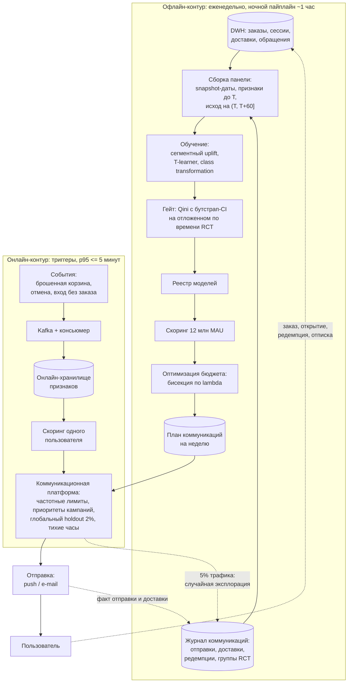

# Кейс: отток и удержание

> **Зачем эта глава.** Кейс про отток — ловушка, в которую попадают почти все. Задача звучит
> как «предскажите, кто уйдёт», и кандидат честно проектирует классификатор оттока. Это неверный
> ответ: бизнесу не нужен прогноз, ему нужно **решение, кому звонить**, а это другая задача —
> оценка эффекта воздействия (uplift). После этой главы вы сможете объяснить разницу на пальцах
> и на формулах, спроектировать эксперимент для сбора обучающих данных, посчитать экономику
> кампании и выбрать метрики, по которым такую модель вообще можно валидировать.

**Уровень:** 🎯 middle → 🧠 middle+
**Предварительно нужно:** [каркас ответа](01-framework.md), [uplift и причинность](../02-classic-ml/17-uplift-and-causal.md), [дизайн эксперимента](../10-ab-testing/01-experiment-design.md), [снижение дисперсии](../10-ab-testing/03-variance-reduction.md), [метрики качества](../02-classic-ml/04-metrics.md)
**Время на проработку:** ~2 часа (чтение + прогон кейса вслух с таймером)

---

## Карта главы

- [0. Как звучит задача](#0-как-звучит-задача)
- [1. Шаг 1. Уточняющие вопросы и полученные ответы](#1-шаг-1-уточняющие-вопросы-и-полученные-ответы)
- [2. Почему модель оттока — неправильная постановка](#2-почему-модель-оттока--неправильная-постановка)
- [3. Шаг 2. Метрики: от инкрементальной маржи к Qini](#3-шаг-2-метрики-от-инкрементальной-маржи-к-qini)
- [4. Шаг 3. Данные: определение оттока и эксперимент как источник разметки](#4-шаг-3-данные-определение-оттока-и-эксперимент-как-источник-разметки)
- [5. Шаг 4. Постановка ML-задачи, бейзлайн и лестница](#5-шаг-4-постановка-ml-задачи-бейзлайн-и-лестница)
- [6. Шаг 5. Признаки и модель](#6-шаг-5-признаки-и-модель)
- [7. Шаг 6. Архитектура и бюджеты](#7-шаг-6-архитектура-и-бюджеты)
- [8. Шаг 7. Оценка, выкатка, мониторинг](#8-шаг-7-оценка-выкатка-мониторинг)
- [9. Шаг 8. Риски и развитие](#9-шаг-8-риски-и-развитие)
- [10. Куда обычно копает интервьюер](#10-куда-обычно-копает-интервьюер)
- [11. Подводные камни](#11-подводные-камни)
- [12. Проверь себя](#12-проверь-себя)
- [13. Практика](#13-практика)
- [14. Что читать дальше](#14-что-читать-дальше)

---

## 0. Как звучит задача

> «У нас растёт отток. Спроектируйте систему, которая его предскажет и поможет удерживать
> пользователей.»

Формулировка содержит подсказку и ловушку одновременно. Подсказка — слово «поможет удерживать»:
речь про действие, а не про прогноз. Ловушка — слово «предскажет»: если вы за него ухватитесь,
следующие сорок минут будете строить классификатор.

> 💬 **На собеседовании.** Сильное открытие: «Прежде чем проектировать, зафиксирую одну вещь.
> Предсказание оттока и выбор того, кому отправить удерживающее предложение, — разные задачи.
> Первая отвечает на вопрос «кто уйдёт», вторая — «на кого подействует коммуникация». Бюджет
> кампании тратится по второй, и оптимальные по первой пользователи часто худшие по второй.
> Если вы не против, я буду проектировать систему под вторую задачу, а модель оттока
> использую внутри как компоненту». Дальше почти всегда следует «да, интересно, продолжайте» —
> и вы уже выиграли секцию.

---

## 1. Шаг 1. Уточняющие вопросы и полученные ответы

| Что спрашиваем | Ответ интервьюера | Почему это важно |
|---|---|---|
| Что за сервис? | Онлайн-заказ продуктов с доставкой. **Подписки нет**, пользователь просто перестаёт заказывать | Нет события «отмена» → отток надо определять самим |
| Масштаб? | 30 млн зарегистрированных, 12 млн MAU, 4 млн заказов в неделю | База для всех расчётов |
| Экономика заказа? | Средний чек 2 200 ₽, вклад в маржу 15% ≈ 330 ₽ с заказа. Активный пользователь делает 2,4 заказа в месяц | Нужна для оценки ценности удержания |
| Какой отток сейчас? | По текущему определению — 18% активной базы за квартал | Масштаб проблемы |
| Что делаем с предсказанием? | Промокод 300 ₽ на следующий заказ через пуш и e-mail. Редемпция промокода ~35% | Определяет стоимость воздействия |
| Бюджет? | 50 млн ₽ в квартал на удерживающие кампании | Ограничение, под которое оптимизируем |
| Что делали раньше? | Правило: не заказывал 21 день → отправить промокод. Эффект в A/B за прошлый год — статистически незначим | Бейзлайн и повод усомниться в подходе |
| Есть ли исторические A/B? | Есть, но кампании таргетировались правилами, случайного контроля почти не было | Нельзя обучать uplift на наблюдательных данных |
| Ограничения на коммуникации? | Не более 5 сообщений в неделю по всем каналам, не более одного промо в 10 дней. Отписки от пушей — больная тема | Жёсткий guardrail |
| Онлайн или батч? | Кампании планируются раз в неделю. Но есть желание триггерных коммуникаций «по событию» | Батчевая система + отдельный триггерный контур |

**Фиксируем вслух.** «Итого: непрерывный сервис без подписки, 12 млн MAU, ценность заказа
330 ₽ маржи, воздействие — промокод 300 ₽ с редемпцией 35%, бюджет 50 млн ₽ в квартал,
жёсткие лимиты на частоту коммуникаций, исторических рандомизированных данных почти нет.
Планирование недельное. Верно?»

**Две производные величины, которые понадобятся дальше — посчитаем их сразу.**

*Стоимость воздействия на одного пользователя:*
$$c = 300\ \text{₽} \times 0{,}35 \approx 105 \approx 100\ \text{₽}$$
Промокод — это реальные деньги, но только для тех, кто им воспользовался; стоимость пуша
и e-mail пренебрежимо мала на фоне скидки.

*Ценность удержанного пользователя* (горизонт 6 месяцев, консервативно, без дисконтирования):
$$V = 2{,}4\ \frac{\text{заказа}}{\text{мес}} \times 6\ \text{мес} \times 330\ \text{₽} \approx 4\,750 \approx 4\,500\ \text{₽}$$

> 🧠 **Middle+.** Проговорите ограничения этой оценки — это дёшево и сильно. $V$ посчитана
> на средних, а удерживаемые пользователи по определению не средние (у них частота ниже).
> Честнее считать $V$ по сегментам частоты или прямо предсказывать моделью. И ещё:
> $V$ — это ценность **разницы** между «остался» и «ушёл», а «ушёл» не значит «ноль навсегда» —
> часть оттёкших возвращается сама. Обе поправки уменьшают $V$, то есть текущая оценка
> оптимистична, и об этом стоит сказать раньше, чем спросят.

---

## 2. Почему модель оттока — неправильная постановка

Это ядро кейса, и на него не жалко трёх минут.

### Четыре типа пользователей

Разобьём аудиторию по тому, что произойдёт **с коммуникацией** и **без неё**:

| | Останется без коммуникации | Уйдёт без коммуникации |
|---|---|---|
| **Останется с коммуникацией** | **Sure things** — остались бы и так. Скидка = подарок из маржи | **Persuadables** — единственная группа, ради которой всё делается |
| **Уйдёт с коммуникацией** | **Sleeping dogs** — коммуникация их раздражает: отписка, жалоба, уход. Отрицательный эффект | **Lost causes** — уйдут в любом случае (переехали, ушли к конкуренту, изменились обстоятельства). Деньги в никуда |

Теперь ключевой вопрос: кого выбирает модель оттока? Она ранжирует по $P(\text{уйдёт})$,
то есть выбирает верхние строки правой колонки: смесь **persuadables** и **lost causes**.
И поскольку lost causes по определению имеют самую высокую вероятность ухода (их ничто
не удерживает), топ модели оттока **систематически перенасыщен именно ими**.

> 🌱 **База.** Метафора, которая работает на собеседовании: модель оттока — это врач, который
> находит самых тяжёлых больных. Uplift-модель — это врач, который находит тех, кому лекарство
> поможет. Это не одно и то же: самые тяжёлые часто уже не лечатся, а лекарство лучше всего
> действует на тех, кто болен умеренно. И есть пациенты, которым от лекарства станет хуже.

### То же самое в числах

Возьмём топ-5% по вероятности оттока — 600 000 пользователей из 12 млн MAU. Пусть состав
такой (порядок величин типичен для ритейла): persuadables 20%, lost causes 55%,
sleeping dogs 20%, sure things 5%. Пусть эффект коммуникации на persuadable равен
$+10$ п.п. к вероятности остаться, на sleeping dog — $-4$ п.п., на остальных ноль.

Средний эффект по группе:
$$\bar\tau = 0{,}20 \cdot 0{,}10 + 0{,}20 \cdot (-0{,}04) = 0{,}020 - 0{,}008 = 0{,}012 = 1{,}2\ \text{п.п.}$$

Прибыль на одного обработанного:
$$\bar\tau \cdot V - c = 0{,}012 \cdot 4\,500 - 100 = 54 - 100 = -46\ \text{₽}$$

На 500 000 обработанных пользователей — **минус 23 млн ₽ за квартал**. Кампания, построенная
на «правильной» модели оттока с прекрасным ROC-AUC, убыточна, и в A/B это выглядит как
«эффект статистически незначим» — ровно то, что интервьюер сказал в шаге 1 про их прошлогодний
эксперимент.

Теперь uplift-таргетинг: отбираем те же 500 000, но по предсказанному $\hat\tau$.
Если модель хоть немного разделяет группы, средний эффект в отобранном топе — 6 п.п.:
$$0{,}06 \cdot 4\,500 - 100 = 270 - 100 = 170\ \text{₽ на пользователя} \Rightarrow +85\ \text{млн ₽ за квартал}$$

Разница между $-23$ и $+85$ млн ₽ получена **на том же бюджете и том же оффере** — изменился
только критерий отбора.

### Формально

Модель оттока оценивает $P(Y = 0 \mid X = x)$, где $Y = 1$ — «пользователь остался активным
в окне наблюдения». Uplift-модель оценивает **условный средний эффект воздействия**
(conditional average treatment effect, CATE):

$$
\tau(x) \;=\; \mathbb{E}\big[\,Y(1) - Y(0) \,\big|\, X = x \,\big]
\;=\; \underbrace{\mathbb{E}[Y \mid X = x,\, W = 1]}_{p_1(x)} \;-\; \underbrace{\mathbb{E}[Y \mid X = x,\, W = 0]}_{p_0(x)}
$$

где $W \in \{0,1\}$ — факт воздействия (коммуникация отправлена), $Y(1)$ и $Y(0)$ —
потенциальные исходы одного и того же пользователя при воздействии и без него,
$p_1, p_0$ — вероятности остаться в двух мирах.

> 📐 **Разбор формулы.** Второе равенство верно **не всегда**, а только если $W$ независимо
> от потенциальных исходов при фиксированном $x$ (условная независимость, она же
> «нет неучтённых конфаундеров»). Рандомизация даёт это бесплатно; наблюдательные данные — нет.
> Именно поэтому дальше в кейсе появляется эксперимент как обязательная часть системы,
> а не как приятное дополнение.
>
> И главная неприятность: $Y(1)$ и $Y(0)$ для одного человека одновременно не наблюдаются
> никогда — это **фундаментальная проблема причинного вывода**. У нас нет таргета $\tau_i$
> ни для одного объекта обучающей выборки. Мы учим модель предсказывать величину, которую
> ни разу не видели. Отсюда всё своеобразие метрик (§3): их приходится считать на группах,
> а не на объектах.

Правило принятия решения тоже другое. Не «топ-$k$ по риску», а:

$$
\text{коммуницируем, если } \quad \hat\tau(x)\cdot V \;>\; c
\quad\Longleftrightarrow\quad
\hat\tau(x) \;>\; \frac{c}{V} = \frac{100}{4\,500} \approx 0{,}022 = 2{,}2\ \text{п.п.}
$$

Порог 2,2 п.п. — это то число, которое надо назвать вслух. Оно превращает абстрактный uplift
в понятный критерий: если модель не находит сегментов с эффектом выше двух процентных пунктов,
кампанию в текущем виде запускать нельзя, и это тоже результат.

---

## 3. Шаг 2. Метрики: от инкрементальной маржи к Qini

**Бизнес-метрика.** Инкрементальная прибыль кампании:
$$\Pi = \sum_{i \in \text{targeted}} \big(\tau_i V - c\big)$$
Измеряется только против контрольной группы — «сколько заказов сделали получившие промокод»
метрикой не является ни в каком виде.

**Продуктовые (онлайн) метрики.** Инкрементальный retention (разница долей активных в тесте
и контроле через 60 дней), инкрементальные заказы на пользователя, инкрементальная маржа
на пользователя. Все — как разности с контролем.

**ML-метрики (офлайн).** Здесь у uplift своя кухня, потому что поточечной ошибки не существует.

*Qini-кривая.* Сортируем пользователей по убыванию $\hat\tau$. Для верхних $t$ объектов:

$$
Q(t) \;=\; Y_T(t) \;-\; Y_C(t)\,\frac{N_T(t)}{N_C(t)}
$$

где $N_T(t), N_C(t)$ — сколько среди верхних $t$ оказалось из тестовой и контрольной групп,
$Y_T(t), Y_C(t)$ — сколько среди них положительных исходов (остались активными).

> 📐 **Разбор формулы.** $Y_T(t)$ — сколько удержаний мы наблюдали, обработав верхние $t$.
> Но часть из них случилась бы и без нас. Второе слагаемое оценивает эту часть: берём долю
> удержаний в контроле, $Y_C(t)/N_C(t)$, и умножаем на число обработанных $N_T(t)$ —
> получаем «сколько удержалось бы, если бы мы ничего не делали». Разность — **инкрементальное
> число удержанных**. Множитель $N_T/N_C$ нужен, потому что в топе по $\hat\tau$ тестовых
> и контрольных может оказаться разное количество; без него кривая поедет.

Прямая случайного таргетинга — $Q_{\text{rand}}(t) = Q(N)\cdot t/N$: если мы отбираем наугад,
инкрементальный эффект накапливается линейно. **Коэффициент Qini** — площадь между кривой
модели и этой прямой. Чем больше, тем лучше модель концентрирует эффект в начале списка.

*uplift@k* — средний эффект в верхних $k$ процентах:
$$\text{uplift@}k = \frac{Y_T(k)}{N_T(k)} - \frac{Y_C(k)}{N_C(k)}$$
Это метрика, наиболее близкая к решению: именно её сравнивают с порогом $c/V$.

*Калибровка uplift.* Разбиваем на децили по $\hat\tau$ и в каждом считаем фактический
эффект как разность долей. Хорошая модель даёт монотонно убывающую лесенку; если лесенка
плоская — модель не различает группы, какой бы Qini ни получился на одной точке.

```python
# Qini-кривая и коэффициент Qini на numpy. y — бинарный исход, w — флаг воздействия (1/0)
import numpy as np

def qini_curve(uplift_score: np.ndarray, y: np.ndarray, w: np.ndarray) -> np.ndarray:
    order = np.argsort(-uplift_score)          # от наибольшего предсказанного эффекта
    y_s, w_s = y[order], w[order]
    n_t = np.cumsum(w_s)                        # обработанных среди топ-t
    n_c = np.cumsum(1 - w_s)                    # контрольных среди топ-t
    y_t = np.cumsum(y_s * w_s)
    y_c = np.cumsum(y_s * (1 - w_s))
    safe_c = np.maximum(n_c, 1)                 # деление на ноль в самом начале списка
    q = y_t - y_c * n_t / safe_c
    q[n_c == 0] = 0.0                           # пока контроля в топе нет, оценка не определена
    return q

def qini_coefficient(uplift_score: np.ndarray, y: np.ndarray, w: np.ndarray) -> float:
    q = qini_curve(uplift_score, y, w)
    n = len(q)
    q_rand = q[-1] * np.arange(1, n + 1) / n    # прямая случайного таргетинга
    diff = q - q_rand
    area = float(np.sum(0.5 * (diff[1:] + diff[:-1])))  # трапеции с шагом 1
    # нормируем на площадь под прямой случайного таргетинга -> безразмерная величина
    return area / (0.5 * abs(q[-1]) * n)

rng = np.random.default_rng(0)
n = 200_000
x = rng.normal(size=n)                           # один признак, от которого зависит эффект
w = rng.integers(0, 2, size=n)                   # рандомизация 50/50
tau_true = 0.10 / (1.0 + np.exp(-2.0 * x)) - 0.02        # эффект от -2 до +8 п.п.
p = np.clip(0.70 + tau_true * w, 0.0, 1.0)
y = (rng.random(n) < p).astype(int)
print("Qini у идеального скора:", round(qini_coefficient(tau_true, y, w), 3))   # 0.574
print("Qini у случайного скора:", round(qini_coefficient(rng.normal(size=n), y, w), 3))  # -0.001
```

Обратите внимание на порядок величин: даже **идеальный** скор (мы подставили истинный $\tau$)
даёт нормированный Qini 0,57, а не единицу. Это не баг: верхняя граница ограничена шумом
самого отклика — при базовой конверсии 70% и эффекте в единицы процентных пунктов бинарный
исход просто не позволяет кривой прижаться к идеальной. Реальные модели на реальных данных
живут в диапазоне 0,02–0,15, и это нормально.

**Guardrail-метрики.** Здесь они не формальность, а половина дизайна:

- **частота коммуникаций** — число сообщений на пользователя в неделю по всем каналам
  (не только по нашей кампании);
- доля отписок от пушей и e-mail, доля отметок «спам»;
- **маржинальность заказа** — промокоды съедают маржу; кампания может «удержать» пользователей
  в убыток;
- доля пользователей, у которых доля заказов со скидкой растёт квартал к кварталу
  (приучение к скидкам);
- органическая конверсия в долгосрочном holdout — не каннибализируем ли мы заказы,
  которые случились бы и так.

> ⚠️ **Типичная ошибка.** Отчитаться метрикой «конверсия в заказ среди получивших промокод —
> 34%». Это число не значит ничего: мы не знаем, сколько из этих 34% заказали бы без промокода.
> В uplift-задачах любая метрика без контрольной группы бессмысленна по построению.

---

## 4. Шаг 3. Данные: определение оттока и эксперимент как источник разметки

### Определение оттока для сервиса без подписки

У подписки есть событие отмены — таргет берётся из базы. У нас его нет: пользователь просто
перестаёт заказывать, и никто не знает, навсегда или на месяц. Значит, определение придётся
сконструировать, и от него зависит вся задача.

**Как выбирают окно.** Строим по историческим данным эмпирическую кривую возврата:
для каждого $k$ считаем $P(\text{сделает заказ в ближайшие 90 дней} \mid \text{не заказывал } k \text{ дней})$.
Типичная картина для нашего сервиса:

| Дней без заказа $k$ | Вероятность вернуться |
|---|---|
| 30 | 45% |
| 45 | 27% |
| 60 | 16% |
| 90 | 8% |

Выбираем 60 дней: дальше кривая почти плоская, то есть дополнительное ожидание почти
не уточняет статус, зато отодвигает момент, когда мы можем действовать.

**Личная частота важнее общего порога.** Для пользователя, заказывающего еженедельно,
30 дней молчания — уже почти приговор; для «раз в квартал» это норма. Поэтому рабочее
определение — относительное: пользователь считается оттёкшим, если время с последнего
заказа превысило 90-й перцентиль его личного распределения межзаказных интервалов
(с ограничением снизу на 21 день и сверху на 90, чтобы не сходить с ума на редких хвостах).
Абсолютное окно в 60 дней оставляем как определение для отчётности перед бизнесом —
две метрики, две цели, и это нормально, если проговорено.

> 💬 **На собеседовании.** Спросят: «А почему именно 60 дней, а не 30 и не 90?» Хороший ответ
> связывает выбор с двумя вещами: с кривой возврата (после 60 дней дополнительное ожидание
> почти не меняет вероятность) и с временем реакции (чем длиннее окно, тем позже мы вмешиваемся
> и тем меньше эффект). И добавляет, что выбор окна нужно проверять на устойчивость: если
> выводы модели меняются при переходе с 45 на 75 дней — определение подобрано под данные,
> а не под задачу. Плохой ответ: «60 дней — стандарт индустрии».

### Окно наблюдения и построение панели

Строим панель по snapshot-датам с шагом две недели. Для даты $T$:

- **признаки** — по данным строго до $T$ (глубина истории 180 дней);
- **воздействие** $W$ — была ли коммуникация в окне $(T, T+14]$;
- **исход** $Y$ — сделал ли пользователь хотя бы один заказ в окне $(T, T+60]$.

Две ловушки, которые надо назвать:

1. **Хвост данных нельзя использовать.** Для последних 60 дней исход ещё не наблюдаем.
   Наивная выгрузка «всё до сегодня» пометит этих пользователей как оттёкших — систематическая
   ошибка, ровно как незрелые метки в антифроде.
2. **Один пользователь входит в панель много раз.** Сплит обязан быть **групповым по пользователю
   и временным одновременно**: иначе один и тот же человек окажется в train и test,
   и оценка будет завышена.

### Откуда взять данные для обучения uplift

Здесь главное отличие от обычной ML-задачи: **обучающих данных не существует, пока вы
не проведёте эксперимент**. Исторические кампании таргетировались правилом «21 день без заказа»,
то есть $W$ жёстко детерминирован признаками. В таких данных $\tau(x)$ не идентифицируем:
нет ни одного пользователя, похожего на обработанного, который остался бы необработанным.

Значит, эксперимент — это часть системы, а не отдельный проект.

**Дизайн сбора обучающих данных.**

- Берём 700 000 пользователей случайной выборкой из активной базы (не только «рискованных» —
  иначе модель не увидит остальную часть пространства и не сможет сказать, что там эффекта нет).
- Рандомизация 50/50: 350 000 получают оффер, 350 000 не получают ничего.
- Длительность рассылки — 6 недель, окно измерения исхода — 60 дней после коммуникации.
- Стратификация по частоте заказов и региону, чтобы не поймать дисбаланс в важных срезах.

**Почему 350 000 на группу.** Считаем от MDE. Для базовой доли удержания $p = 0{,}70$
дисперсия отклика $\sigma^2 = p(1-p) = 0{,}21$, и на детекцию среднего эффекта
$\Delta = 2$ п.п. при $\alpha = 0{,}05$, мощности $0{,}8$:

$$
n \;\approx\; \frac{16\,\sigma^2}{\Delta^2} \;=\; \frac{16 \cdot 0{,}21}{0{,}0004} \;=\; 8\,400 \text{ на группу}
$$

Но нам нужен не средний эффект, а его **гетерогенность**: чтобы различать десять децилей
по $\hat\tau$, каждый дециль должен сам по себе давать значимую оценку → $84\,000$ на группу.
Плюс запас на обучение (модель тратит данные на подбор структуры, а не только на оценку) —
итого 300–400 тысяч на группу. Это и объясняет, почему uplift-модели требуют на порядки больше
данных, чем модели отклика: сигнал — разность двух шумных величин, и его отношение
сигнал/шум радикально хуже.

> 🧠 **Middle+.** Отдельно посчитайте вслух **цену эксперимента**: 350 000 контрольных
> пользователей, которых мы намеренно не трогаем, — упущенная выгода
> $350\,000 \times \bar\tau \times V$. При среднем эффекте 1 п.п. по случайной выборке это
> $350\,000 \times 0{,}01 \times 4\,500 \approx 16$ млн ₽. Это не аргумент против эксперимента,
> это аргумент за то, чтобы посчитать и озвучить: без него ожидаемый убыток кампании
> составлял $-23$ млн ₽ в квартал, то есть эксперимент окупается в первом же цикле.
> Кандидат, который считает стоимость собственного эксперимента, выглядит очень взросло.

**Что логировать.** Полный журнал коммуникаций: кому, что, по какому каналу, когда,
доставлено ли, открыто ли, использован ли промокод; принадлежность к экспериментальной группе;
версия модели и значение $\hat\tau$ на момент решения. Без журнала доставок вы не сможете
отличить «не подействовало» от «не дошло».

> ⚠️ **Типичная ошибка.** Считать воздействием факт открытия пуша. Открытие — это уже исход,
> на который влияет сам пользователь: сравнивая «открывших» с контролем, вы сравниваете более
> лояльных с обычными и получите фантастический «эффект». Воздействием считается **факт
> отправки** (intention to treat), потому что именно этим мы управляем.

---

## 5. Шаг 4. Постановка ML-задачи, бейзлайн и лестница

**Постановка.** Оценить $\tau(x) = \mathbb{E}[Y(1) - Y(0) \mid X = x]$ и решить задачу
распределения бюджета: выбрать подмножество пользователей и офферы так, чтобы максимизировать
$\sum (\hat\tau_i V - c)$ при ограничении на суммарные затраты и на частоту коммуникаций.

**Бейзлайн 0 (без ML, работает сегодня).** Правило «21 день без заказа → промокод».
Его надо честно измерить в A/B, а не считать нулём — вполне возможно, что у него положительный
эффект на части аудитории.

**Бейзлайн 1 (сегментный uplift, без модели).** Разбиваем аудиторию на 8–12 сегментов
руками (частота × давность × категория корзины), в каждом считаем эффект по данным
эксперимента как разность долей, коммуницируем только сегментам с $\hat\tau > c/V$.
Это очень сильный бейзлайн: он устойчив, интерпретируем, требует на порядок меньше данных,
чем модель, и в половине реальных проектов uplift-модель его не бьёт.

**Лестница усложнения.**

1. Правило (есть) → измерить.
2. Сегментный uplift на данных RCT.
3. T-learner: два бустинга, $\hat\tau = \hat p_1 - \hat p_0$.
4. Преобразование класса или uplift-деревья — модели, оптимизирующие $\tau$ напрямую.
5. Несколько офферов + оптимизация бюджета как задача распределения.
6. Контекстные бандиты: адаптивный выбор оффера с продолжающейся эксплорацией.

---

## 6. Шаг 5. Признаки и модель

### Группы признаков

| Группа | Примеры | Где считается |
|---|---|---|
| Активность (RFM) | давность последнего заказа, число заказов за 7/30/90/180 дней, средний чек и тренд, личный межзаказный интервал и его дисперсия | офлайн, еженедельный пересчёт |
| Динамика | отношение активности за 30 дней к активности за 90, скорость падения частоты, число «пропущенных» ожидаемых заказов | офлайн |
| Ассортимент и корзина | доля категорий, доля товаров-«якорей» (те, за которыми ходят регулярно), доля промо-заказов в истории | офлайн |
| Качество сервиса | доля опозданий доставки, число замен и отсутствующих позиций, обращения в поддержку, оценки заказов | офлайн |
| Коммуникации | сколько сообщений получил за 30 дней, доля открытий, история отписок, давность последнего промо | офлайн + онлайн-счётчики |
| Контекст и внешнее | регион, наличие конкурента в зоне доставки, сезонность, праздники | офлайн |
| Триггерные события | брошенная корзина, открытие приложения без заказа, отмена заказа, неудачная оплата | онлайн, из потока событий |

> 🧠 **Middle+.** Признаки качества сервиса — самые ценные в этой задаче и одновременно
> самые опасные. Ценные, потому что «ушёл после трёх опозданий подряд» — прямая причина
> оттока, на которую можно влиять не скидкой, а операционно. Опасные — потому что они рождают
> вопрос, который стоит задать самому: **точно ли лучшее воздействие — это промокод?**
> Для пользователя, у которого сорвали две доставки, извинение и приоритет в слоте может дать
> больший uplift и стоить дешевле. Это переводит задачу в мультитритмент, и такое предложение
> на секции ценится выше, чем ещё одна модель.

### Модель: три варианта

**Вариант A. T-learner (two-model).** Обучаем два бустинга: $\hat p_1$ на подвыборке
с $W=1$, $\hat p_0$ на подвыборке с $W=0$, предсказываем $\hat\tau = \hat p_1 - \hat p_0$.
Плюсы: тривиально реализуется, любая библиотека, легко объяснить. Минусы: обе модели тратят
ёмкость на предсказание **уровня** отклика (а он определяется в основном давностью и частотой),
и слабый сигнал $\tau$ теряется в разности двух сильных сигналов. Классическая картина:
$\hat\tau$ почти повторяет $-\hat p_{\text{churn}}$, и мы приходим обратно к модели оттока.

**Вариант B. Преобразование класса (class transformation).** При рандомизации 50/50 введём

$$
Z = \begin{cases} 1, & (W=1,\ Y=1)\ \text{или}\ (W=0,\ Y=0) \\ 0, & \text{иначе} \end{cases}
$$

Тогда, обозначив $p_1(x) = \mathbb{E}[Y\mid X=x, W=1]$ и $p_0(x) = \mathbb{E}[Y\mid X=x, W=0]$:

$$
P(Z=1\mid x) = \tfrac12 p_1(x) + \tfrac12\big(1 - p_0(x)\big) = \tfrac12\big(p_1(x)-p_0(x)\big) + \tfrac12
= \tfrac{\tau(x)}{2} + \tfrac12
$$

откуда $\tau(x) = 2P(Z=1\mid x) - 1$. То есть достаточно обучить **одну обычную бинарную
классификацию** на новый таргет $Z$ и линейно пересчитать её вероятность.

> 📐 **Разбор формулы.** Первое равенство — формула полной вероятности по $W$:
> с вероятностью $\tfrac12$ пользователь попал в тест, и тогда $Z=1$ означает $Y=1$;
> с вероятностью $\tfrac12$ он в контроле, и тогда $Z=1$ означает $Y=0$. Дальше просто
> раскрываем скобки. Требование $P(W=1)=\tfrac12$ существенно: при неравных группах формула
> ломается, и нужна общая версия через веса пропенсити
> $Y^{*} = Y\cdot\frac{W - e(x)}{e(x)\,(1-e(x))}$, для которой $\mathbb{E}[Y^{*}\mid X=x] = \tau(x)$,
> где $e(x) = P(W=1\mid X=x)$ — вероятность попасть в тест.
>
> Заметьте цену этой элегантности: весь сигнал живёт в отклонении $P(Z=1)$ от $\tfrac12$.
> Эффект в 5 п.п. — это $P(Z=1) = 0{,}525$. Модель должна уверенно отличать 0,525 от 0,5,
> и ROC-AUC такой модели будет около 0,52–0,55 — что абсолютно нормально и не означает,
> что модель плохая. К этому надо быть готовым, иначе руки опустятся при первом взгляде на метрики.

**Вариант C. Uplift-деревья и причинный лес.** Дерево, у которого критерий разбиения —
не однородность отклика, а **различие эффекта** между потомками (дивергенция распределений
откликов в тесте и контроле). Ансамбль таких деревьев — causal forest. Плюсы: оптимизирует
целевую величину напрямую, устойчив, даёт оценку неопределённости. Минусы: нужны специализированные
библиотеки, чувствителен к размеру листа (в каждом листе должны быть и тест, и контроль
в достаточном количестве).

**Выбор.** Начинаем с сегментного uplift как точки отсчёта, затем обучаем все три варианта
и сравниваем **по Qini на отложенном по времени куске эксперимента с бутстрап-интервалом
по пользователям**. Практика: при слабом среднем эффекте преобразование класса и uplift-деревья
обычно обходят T-learner, но перевес часто в пределах доверительного интервала — и тогда
честный выбор в пользу более простой модели.

### Оптимизация бюджета

Есть несколько офферов $a \in \{1,\dots,A\}$ со своими стоимостями $c_a$ и своими эффектами
$\tau_{ia}$. Задача:

$$
\max_{x} \sum_{i}\sum_{a} x_{ia}\,\big(\tau_{ia} V - c_a\big)
\quad \text{при} \quad
\sum_{i}\sum_{a} x_{ia}\, c_a \le B, \quad \sum_{a} x_{ia} \le 1, \quad x_{ia} \in \{0,1\}
$$

где $x_{ia} = 1$ означает «пользователю $i$ отправляем оффер $a$», $B$ — бюджет.
Второе ограничение — «не более одного оффера на человека», оно же встраивает guardrail
по частоте.

Задача решается через множитель Лагранжа: для каждого пользователя выбираем
$a^{*}(i) = \arg\max_a \big[\tau_{ia}V - (1+\lambda)c_a\big]$ и берём его, если максимум
положителен; $\lambda$ подбираем бисекцией так, чтобы бюджет выбирался ровно.

> 🧠 **Middle+.** $\lambda$ — **теневая цена рубля бюджета**: сколько дополнительной прибыли
> принёс бы последний потраченный рубль. Это даёт бесплатный бонус: одна и та же $\lambda$
> позволяет сравнивать между собой **разные кампании** разных команд. Компания, которая
> считает $\lambda$ централизованно, перестаёт распределять маркетинговый бюджет по политическому
> весу команд и начинает — по инкрементальной прибыли. Такое замечание на секции запоминается.

```python
# Распределение бюджета между офферами через множитель Лагранжа
import numpy as np

def allocate(tau: np.ndarray, cost: np.ndarray, value: float, budget: float):
    """tau: (n, A) предсказанный uplift по офферам; cost: (A,) стоимость оффера; budget: бюджет в рублях."""
    idx = np.arange(tau.shape[0])
    lo, hi = 0.0, 1e4                       # hi заведомо запретительный: никого не выберем
    for _ in range(60):                      # бисекция по теневой цене бюджета
        lam = 0.5 * (lo + hi)
        gain = tau * value - (1.0 + lam) * cost[None, :]
        best = gain.argmax(axis=1)
        take = gain[idx, best] > 0
        if cost[best][take].sum() > budget:
            lo = lam                         # дорого — поднимаем теневую цену
        else:
            hi = lam
    gain = tau * value - (1.0 + hi) * cost[None, :]
    best = gain.argmax(axis=1)
    take = gain[idx, best] > 0
    return take, best, hi                    # кого трогаем, каким оффером, теневая цена

rng = np.random.default_rng(1)
n = 1_000_000
tau = np.clip(rng.normal(0.02, 0.04, size=(n, 2)), -0.05, 0.20)   # два оффера
cost = np.array([100.0, 250.0])                                    # промокод 300 ₽ и 700 ₽
take, offer, lam = allocate(tau, cost, value=4500.0, budget=50_000_000.0)
print(f"отобрано {take.sum():,} пользователей, теневая цена бюджета lambda={lam:.3f}")
print(f"потрачено: {cost[offer][take].sum()/1e6:.1f} млн ₽")
print(f"ожидаемая инкрементальная прибыль: {(tau[np.arange(n), offer] * 4500 - cost[offer])[take].sum()/1e6:.1f} млн ₽")
# отобрано 424 170, lambda = 0.438, потрачено ровно 50.0 млн ₽, прибыль 73.9 млн ₽
```

Полученная $\lambda = 0{,}44$ читается так: последний потраченный рубль приносил бы
1,44 рубля прибыли, если бы бюджет позволил. Значит, бюджет — реальное ограничение,
и просьба увеличить его подкреплена числом. Если бы бисекция вернула $\lambda \approx 0$,
это означало бы, что бюджет не связывает и деньги остаются неизрасходованными — надо
расширять аудиторию или менять оффер, а не просить денег.

---

## 7. Шаг 6. Архитектура и бюджеты

Здесь надо сразу сказать вслух главное: **это батчевая система, а не онлайн-сервис**.
Бюджета латентности в миллисекундах у нас нет, зато есть два других бюджета — время ночного
пайплайна и время реакции на событие. Кандидаты часто по инерции рисуют Redis и p99, и это
выглядит как непонимание задачи.



**Бюджет офлайн-пайплайна** (запускается ночью в воскресенье, дедлайн — 6 утра понедельника):

| Стадия | Время | Комментарий |
|---|---|---|
| Сборка панели в Spark | 25 мин | 12 млн пользователей × 26 snapshot-дат × 250 признаков |
| Обучение трёх моделей | 12 мин | CatBoost на 700 тыс. × 250, CPU |
| Расчёт Qini + бутстрап 200 итераций | 4 мин | бутстрап по пользователям, не по строкам |
| Скоринг 12 млн MAU | 8 мин | |
| Оптимизация бюджета (60 итераций бисекции) | 2 мин | векторизовано, см. код в §6 |
| Запись плана и сверка с лимитами | 5 мин | |
| **Итого** | **~1 час** | запас до дедлайна четырёхкратный |

**Бюджет триггерного контура** (от события до сообщения, цель p95 ≤ 5 минут):

| Стадия | Время |
|---|---|
| Событие → Kafka → консьюмер | ~1 с |
| Чтение признаков из онлайн-хранилища | 20 мс |
| Скоринг одного пользователя | 3 мс |
| Проверка частотных лимитов, holdout, тихих часов | 10 мс |
| Очередь отправки и батчинг у провайдера | до 3 мин |
| Доставка push-провайдером | 30–60 с |
| **Итого p95** | **~4 мин** |

Почему 5 минут, а не 5 секунд: эффект от «брошенной корзины» не падает за минуту, а вот
сообщение в 03:00 по местному времени гарантированно даст отписку. Тихие часы важнее
низкой задержки — и это тот случай, когда правильный инженерный ответ звучит «нам не нужно
быстрее».

**Что считается заранее.** Все агрегаты и скоры — еженедельно. Онлайн считаются только
триггерные признаки (счётчики за час, факт события) и проверки лимитов.

**Контур обратной связи.** Отправки и доставки пишутся в журнал коммуникаций, исходы приезжают
из DWH, и всё это возвращается в панель следующей недели. Критически важная деталь на схеме —
стрелка **«5% трафика: случайная эксплорация»**: постоянный слой рандомизации, без которого
через два цикла обучающие данные снова станут наблюдательными (модель сама решает, кого
коммуницировать → $W$ снова функция от $x$ → $\tau$ неидентифицируем).

**Фолбэки.** Пайплайн не успел — используем план прошлой недели (он устаревает медленно).
Модель не прошла гейт по Qini — остаётся предыдущая версия, а при повторном провале
откатываемся на сегментный uplift. Коммуникационная платформа недоступна — кампания
пропускается целиком; отправить в двойном объёме на следующей неделе нельзя, лимиты частоты
приоритетнее плана.

---

## 8. Шаг 7. Оценка, выкатка, мониторинг

### Офлайн-оценка

Отложенный по времени кусок эксперимента (последние две недели рассылки), метрики —
Qini, uplift@10%, uplift@20%, калибровочная лесенка по децилям. Доверительные интервалы —
бутстрап **по пользователям** (строки панели зависимы: один пользователь даёт несколько
snapshot-ов). Сравнение — с сегментным uplift и с текущим правилом, а не с «случайным
таргетингом».

> 💬 **На собеседовании.** Спросят: «Qini у вашей модели 0,03, у сегментного бейзлайна 0,027.
> Какую берёте?» Хороший ответ: сначала смотрю бутстрап-интервалы; если они пересекаются —
> беру бейзлайн, потому что при равном качестве побеждает то, что дешевле поддерживать
> и проще объяснить бизнесу. И добавлю, что решаю не по Qini, а по ожидаемой инкрементальной
> прибыли при пороге $c/V$: две модели с одинаковым Qini могут давать разную прибыль,
> если по-разному ведут себя именно в зоне отбора.

### Онлайн-оценка: A/B

Здесь есть тонкость, которую редко проговаривают. Мы сравниваем не модели, а **политики
таргетинга**, и политика включает решение «никому не отправлять».

- **Единица рандомизации** — пользователь, стратификация по частоте заказов и региону.
- **Три группы:** политика на uplift-модели, политика на модели оттока (текущая практика),
  чистый контроль без коммуникаций.
- **Ключевая метрика** — инкрементальная маржа на пользователя, считаемая **на всей группе**,
  включая тех, кому политика решила ничего не отправлять. Это принципиально: политика,
  которая коммуницирует мало, но точно, должна выигрывать по этой метрике.
- **MDE.** Маржа за квартал тяжелохвостая, $\sigma \approx 2\,000$ ₽. Для детекции
  $\Delta = 20$ ₽ на пользователя: $n \approx 16\sigma^2/\Delta^2 = 16\cdot 4\cdot 10^6/400 = 160\,000$
  на группу. С [CUPED](../10-ab-testing/03-variance-reduction.md) на предпериодной марже
  дисперсия падает примерно на треть → ~110 000 на группу. Длительность — не менее одного
  полного окна исхода (60 дней) плюс время рассылки.
- **Потеря мощности от пересечения политик.** Две политики согласны на большинстве пользователей
  (обе не трогают явно активных), и различие возникает только на зоне разногласия. Если она
  составляет 15% аудитории, эффективный размер выборки для сравнения политик меньше номинального,
  и это надо закладывать в расчёт. Альтернатива — рандомизировать только на зоне разногласия,
  но тогда оценка не переносится напрямую на всю базу, о чём тоже стоит сказать.

### Выкатка

1. **Shadow, 1 неделя.** Модель считает $\hat\tau$ и формирует план, но отправок нет.
   Проверяем: объём отбираемых пользователей (не выходит ли за бюджет), пересечение с текущей
   политикой, распределение $\hat\tau$, отсутствие странных сегментов в топе.
2. **Canary 5%** аудитории на один цикл, с ручным просмотром выборки из 200 отобранных
   пользователей продуктовой командой — глазами часто видно то, чего не видно в метриках
   (например, в топ попали пользователи, которые вчера жаловались в поддержку).
3. **Ramp-up** 25% → 50% → 100%, критерии отката на каждой ступени: доля отписок не выросла
   более чем на 10% относительно базового уровня, инкрементальная маржа не отрицательна,
   бюджет не превышен.
4. **Постоянный глобальный holdout 2%** (≈240 000 пользователей), который не получает
   вообще никаких промо-коммуникаций. Это единственный способ измерить долгосрочный эффект
   всей CRM-машины, а не отдельной кампании, и он должен пережить все реорганизации.

### Мониторинг: четыре слоя

| Слой | Метрики | Что делаем при срабатывании |
|---|---|---|
| Инфраструктура | успешность и длительность ночного пайплайна, доля недоставленных сообщений, задержка триггерного контура | план прошлой недели как фолбэк, дежурный разбирает пайплайн |
| Данные | свежесть журнала коммуникаций, доля пользователей без признаков, PSI по ключевым признакам, полнота логов доставки | блокировка выката плана, если журнал коммуникаций отстал: без него нельзя проверить лимиты |
| Модель | распределение $\hat\tau$, доля отобранных, калибровка uplift по децилям на текущем 5%-м слое эксплорации, Qini на скользящем окне | падение Qini до незначимого → откат на сегментный uplift |
| Бизнес | инкрементальная маржа против holdout, стоимость удержанного пользователя, доля отписок, доля промо-заказов, retention | эскалация владельцу кампании, возможная остановка |

> 🧠 **Middle+.** Самый ценный элемент мониторинга здесь — **непрерывная эксплорация**.
> 5% трафика с рандомизацией дают вам свежую оценку $\tau$ каждую неделю, то есть Qini
> и калибровку можно считать не раз в квартал по большому эксперименту, а постоянно.
> Это же решает проблему устаревания: если оффер выдохся (пользователи привыкли к скидке),
> вы увидите падение фактического uplift в слое эксплорации раньше, чем оно проявится
> в квартальном отчёте.

---

## 9. Шаг 8. Риски и развитие

**Риск 1: модель привязана к конкретному офферу, каналу и сезону.** $\tau$ оценивается
для промокода 300 ₽ в пуше в феврале. Летом, для скидки 500 ₽ или для e-mail это уже другая
величина, и переноса нет — обучающая выборка не содержит вариации по офферу. Смягчение:
закладывать в эксперимент вариацию оффера (несколько ветвей вместо одной), держать постоянный
слой эксплорации, переобучать по свежим данным. Честная формулировка на секции: «моя модель
предсказывает эффект одного конкретного воздействия, и это ограничение системы, а не деталь».

**Риск 2: сигнал может оказаться статистически неотличим от нуля.** Гетерогенность эффекта —
эмпирический факт, а не закон природы: бывает, что эффект есть, но он одинаков для всех.
Тогда Qini в пределах доверительного интервала равен нулю, и никакая модель не поможет.
Что делать: не притворяться. Правильный вывод — «uplift-модель не окупается, применяем
единое решение для всей аудитории (или не применяем вовсе), а усилия переносим на подбор
самого воздействия». Это честный, а не провальный результат, и его надо уметь произнести.

**Риск 3: долгосрочные эффекты противоположны краткосрочным.** Кампания удерживает
пользователей, но приучает их ждать промокод: доля заказов со скидкой растёт, маржа падает,
органическая частота снижается. В квартальном A/B это невидимо — эффект накапливается
за полгода-год. Смягчение: постоянный holdout, отдельная метрика «доля промо-заказов»
и её тренд, оценка эффекта на марже, а не на заказах.

**Развитие.** Мультитритмент (промокод / бесплатная доставка / извинение с приоритетным
слотом / ничего) и выбор оффера как задача uplift с несколькими воздействиями; контекстные
бандиты вместо фиксированных недельных кампаний; перенос uplift-логики на другие решения
(кому показывать баннер, кому звонить, кому давать бесплатную доставку); оценка $V$ моделью
LTV вместо константы — тогда порог $c/V$ становится персональным.

---

## 10. Куда обычно копает интервьюер

### 10.1 «Хорошо, а если я всё-таки настаиваю на модели оттока — чем конкретно она плоха?»

Отвечаем матрицей четырёх типов и арифметикой из §2: топ по риску состоит преимущественно
из lost causes, средний эффект в нём 1,2 п.п. при пороге окупаемости 2,2 п.п., прибыль
на пользователя отрицательная. И добавляем то, что делает ответ полным: **модель оттока
не просто хуже, она не содержит нужной информации в принципе**. Она обучена на данных,
где воздействия нет или оно не варьируется, поэтому в ней физически нет сигнала о том,
что произойдёт при коммуникации. Никакой калибровкой и никаким порогом это не исправить.

При этом модель оттока полезна **внутри** системы: как компонента для расчёта $V$ (ценность
удержания зависит от того, насколько человек был близок к уходу), как признак для uplift-модели
и как метрика мониторинга здоровья базы.

### 10.2 «Исторические данные о кампаниях есть за три года. Почему нельзя обучиться на них?»

Потому что $W$ там — детерминированная функция признаков: правило «21 день без заказа».
Формально $e(x) = P(W=1\mid X=x) \in \{0,1\}$, то есть нарушено условие перекрытия (overlap):
для пользователя с 25 днями молчания не существует наблюдений с $W=0$ и такими же $x$.
Разность $\mathbb{E}[Y\mid W=1] - \mathbb{E}[Y\mid W=0]$ в таких данных измеряет не эффект,
а разницу между двумя разными популяциями — причём смещённую в худшую сторону: коммуникацию
получали те, кто и так был ближе к уходу, поэтому наивная оценка эффекта будет отрицательной.

Что можно сделать без эксперимента: искать «естественные эксперименты» — сбои рассылки,
регионы с задержкой запуска, границы правила (пользователи с 20 и 22 днями почти одинаковы —
это regression discontinuity). Всё это даёт слабую, локальную оценку. Правильный ответ:
эксперимент дешевле, чем кажется (мы посчитали — 16 млн ₽ упущенной выгоды против 23 млн ₽
убытка от неправильного таргетинга), и он же становится постоянным источником данных.

### 10.3 «Как вы валидируете uplift-модель, если истинного $\tau_i$ ни для кого нет?»

Ключевая мысль: поточечная ошибка недоступна, поэтому все метрики — **групповые**.
Модель ранжирует, а качество ранжирования проверяется тем, что в верхней части списка
фактическая разница между тестом и контролем больше, чем в нижней.

Дальше по инструментам: Qini-кривая и коэффициент Qini, uplift@k как метрика, ближайшая
к принимаемому решению, калибровочная лесенка по децилям как проверка на «модель вообще
что-то различает». Обязательно — бутстрап-интервалы по пользователям, потому что uplift-метрики
шумные и разница в третьем знаке между моделями ничего не значит.

Отдельно стоит назвать типичную ошибку: считать Qini на тех же данных, на которых подбирались
гиперпараметры. При слабом сигнале переобучение на валидации происходит мгновенно —
нужен честный отложенный по времени кусок эксперимента, который не трогали ни разу.

### 10.4 «Как определить отток, если у вас нет подписки? И насколько это вообще важно?»

Важно настолько, что от этого зависит знак ответа. Порядок рассуждения: строим эмпирическую
кривую возврата $P(\text{вернётся}\mid k \text{ дней молчания})$, выбираем точку, где кривая
выходит на плато (у нас 60 дней), и обязательно делаем определение относительным к личной
частоте — 90-й перцентиль индивидуального межзаказного интервала.

Что показывает зрелость: сказать, что определение надо **проверять на устойчивость**.
Пересчитайте всю модель и все выводы с окном 45 и 75 дней. Если оптимальный сегмент
и знак прибыли не меняются — определение рабочее. Если меняются — вы подогнали определение
под данные, и результат не переживёт следующего квартала.

### 10.5 «У вас три оффера и фиксированный бюджет. Как распределить?»

Это задача о ранце в непрерывной релаксации. Формулируем как максимизацию
$\sum_{i,a} x_{ia}(\tau_{ia}V - c_a)$ при бюджетном ограничении и условии «не более одного
оффера на человека», решаем через множитель Лагранжа: для каждого пользователя выбираем
оффер, максимизирующий $\tau_{ia}V - (1+\lambda)c_a$, берём если положительно,
$\lambda$ подбираем бисекцией до исчерпания бюджета.

Хорошее продолжение: $\lambda$ имеет смысл теневой цены рубля бюджета, поэтому она же —
универсальная валюта для сравнения разных кампаний; если $\lambda$ близка к нулю, бюджет
не является ограничением и надо расширять аудиторию или оффер; если $\lambda$ велика —
бюджет стоит увеличить, и у вас есть количественный аргумент для этого разговора.

### 10.6 «Частота коммуникаций — как вы её контролируете и почему это guardrail, а не метрика?»

Потому что вред от неё асимметричен во времени: выигрыш от лишнего сообщения виден сегодня,
а отписка — навсегда. Пользователь, отписавшийся от пушей, выпадает из всех будущих кампаний,
включая полезные; это не потеря одного эффекта, а потеря канала.

Как контролируется: жёсткие лимиты на уровне коммуникационной платформы (не более 5 сообщений
в неделю по всем каналам, не более одного промо в 10 дней, тихие часы), приоритизация между
кампаниями по ожидаемой инкрементальной прибыли (та самая $\lambda$), персональные лимиты
для чувствительных сегментов. В оптимизации это ограничение $\sum_a x_{ia} \le 1$ —
то есть guardrail встроен в постановку, а не проверяется постфактум.

Сильное завершение: правильный способ измерить цену частоты — отдельный долгий эксперимент
с разной интенсивностью коммуникаций и метрикой «доля отписавшихся + инкрементальная маржа
за год». Пока он не проведён, лимиты стоят на консервативных значениях, и это осознанный выбор.

---

## 11. Подводные камни

**Оптимизация отклика вместо эффекта.**
Симптом: кампания показывает отличную конверсию среди получивших промокод, а инкрементальная
маржа против контроля около нуля.
Причина: таргетировали тех, кто и так собирался заказать (sure things).
Что делать: любая отчётность только против контрольной группы; целевая величина — разность,
а не уровень.

**Обучение uplift на наблюдательных данных.**
Симптом: модель обучена, Qini на исторических данных высокий, в A/B эффекта нет или он
отрицательный.
Причина: воздействие в истории назначалось правилом, перекрытия нет, оценка $\tau$ смещена.
Что делать: рандомизированный сбор данных; при невозможности — честно назвать оценку
корреляционной и заложить проверку экспериментом.

**Утечка будущего в панель.**
Симптом: топ-признаки — «число заказов за 30 дней после даты снимка» или что-то производное
от исхода.
Причина: агрегаты посчитаны по всей истории без отсечки по snapshot-дате.
Что делать: point-in-time расчёт признаков; отдельный автотест, проверяющий, что ни один
признак не использует данные позже $T$.

**Незакрытое окно исхода на хвосте данных.**
Симптом: доля оттока в последние два месяца выборки аномально высока.
Причина: у этих пользователей окно в 60 дней ещё не истекло, и «не заказал» означает
«не успел».
Что делать: отбрасывать последние 60 дней панели, как embargo.

**Групповая утечка при сплите.**
Симптом: офлайн-метрики стабильно лучше, чем в эксперименте.
Причина: один пользователь попал в train и test через разные snapshot-даты.
Что делать: сплит групповой по пользователю и временной одновременно.

**Открытие как воздействие.**
Симптом: «эффект» кампании 25 п.п. — неправдоподобно много.
Причина: сравнивали открывших сообщение с контролем; открытие — характеристика лояльности,
а не воздействие.
Что делать: анализ по intention to treat (факт отправки); эффект «на дошедших» оценивать
инструментальными переменными, если это действительно нужно.

**Игнорирование отписок.**
Симптом: через три квартала база пушей сократилась на 30%, кампании перестают работать.
Причина: каждая кампания оптимизировала свой квартал, а канал общий и исчерпаемый.
Что делать: лимиты частоты как жёсткое ограничение оптимизации, отписки как guardrail
с алертом, приоритизация кампаний по единой теневой цене.

---

## 12. Проверь себя

<details>
<summary><b>🎯 Вопрос.</b> В чём разница между моделью оттока и uplift-моделью и почему это важно для бюджета?</summary>

**Короткий ответ.** Модель оттока оценивает $P(\text{уйдёт}\mid x)$, uplift-модель —
$\tau(x) = \mathbb{E}[Y(1)-Y(0)\mid x]$, то есть насколько коммуникация изменит исход.
Топ по риску оттока состоит в основном из «безнадёжных», на которых деньги тратятся впустую,
поэтому таргетинг по риску systematically убыточен.

**Развёрнуто.** Аудитория делится на четыре группы: persuadables (эффект положительный —
цель), lost causes (уйдут в любом случае), sure things (останутся в любом случае, скидка —
подарок из маржи), sleeping dogs (коммуникация вредит). Модель оттока выбирает верх правой
колонки, где доминируют lost causes. Численно: при составе топа 20/55/20/5 и эффектах
$+10$ и $-4$ п.п. средний эффект 1,2 п.п. при пороге окупаемости $c/V = 2{,}2$ п.п. →
$-46$ ₽ на пользователя. Uplift-таргетинг на том же бюджете даёт $+170$ ₽. Дополнительный
довод: модель оттока не содержит информации об эффекте воздействия в принципе, потому что
обучалась на данных без вариации $W$.

**Чего ждёт интервьюер:** что вы сами переформулируете задачу до того, как начнёте её решать.

**Провал:** «uplift — это когда мы предсказываем не отток, а прирост» без объяснения,
почему первое не работает.
</details>

<details>
<summary><b>🧠 Вопрос.</b> Почему нельзя обучить uplift-модель на исторических данных о рассылках?</summary>

**Короткий ответ.** Потому что в истории воздействие назначалось правилом, то есть
$e(x) = P(W=1\mid x)$ равно 0 или 1 — нарушено условие перекрытия, и эффект неидентифицируем.

**Развёрнуто.** Для оценки $\tau(x)$ нужны сопоставимые пользователи в обеих группах.
Если правило «21 день без заказа → промо» выполняется строго, то среди похожих на
обработанного нет ни одного необработанного. Наивная разность средних измеряет разницу
популяций и смещена: коммуникацию получали более «рискованные», поэтому оценка эффекта
получится отрицательной даже при реально положительном эффекте. Варианты без эксперимента —
propensity score с проверкой перекрытия, doubly robust оценки, естественные эксперименты
(сбои рассылки, границы правила как regression discontinuity) — дают слабую и локальную
оценку. Правильный путь: рандомизированный сбор данных плюс постоянный слой эксплорации 5%,
иначе через два цикла обучения система снова сама определяет $W$ и данные опять становятся
наблюдательными.

**Чего ждёт интервьюер:** знания слова «перекрытие» и понимания, что смещение здесь имеет
предсказуемый знак.

**Провал:** «применим propensity score и всё будет хорошо» без проверки перекрытия.
</details>

<details>
<summary><b>🎯 Вопрос.</b> Как определить отток для сервиса без подписки?</summary>

**Короткий ответ.** Через окно бездействия, выбранное по эмпирической кривой возврата,
и относительно личной частоты пользователя: отток, если время с последнего заказа превысило
90-й перцентиль его личного межзаказного интервала.

**Развёрнуто.** Считаем $P(\text{вернётся в 90 дней}\mid k \text{ дней без заказа})$ для разных
$k$: 45% при 30 днях, 27% при 45, 16% при 60, 8% при 90. Берём точку выхода на плато — 60 дней.
Абсолютное окно удобно для отчётности, но плохо описывает разные сегменты: для еженедельного
покупателя 30 дней уже аномалия, для квартального 60 — норма. Отсюда относительное определение
с ограничениями снизу (21 день) и сверху (90 дней). Обязательная проверка — устойчивость:
пересчитать выводы с окнами 45 и 75 дней; если оптимальный сегмент и знак прибыли меняются,
определение подогнано под данные.

**Чего ждёт интервьюер:** что вы понимаете, что определение таргета — это проектное решение
с последствиями, а не техническая деталь.

**Провал:** «отток — это 30 дней без активности» без обоснования.
</details>

<details>
<summary><b>🧠 Вопрос.</b> Что такое Qini-кривая и чем она отличается от ROC?</summary>

**Короткий ответ.** Qini показывает накопленный **инкрементальный** эффект при обработке
верхних $t$ пользователей по предсказанному uplift: $Q(t) = Y_T(t) - Y_C(t)\,N_T(t)/N_C(t)$.
ROC описывает качество предсказания наблюдаемой метки; в uplift метки эффекта не существует,
поэтому и метрика групповая.

**Развёрнуто.** Второе слагаемое в формуле оценивает, сколько удержаний произошло бы
и без нашего вмешательства, множитель $N_T/N_C$ выравнивает разный размер групп в верхней
части списка. Прямая случайного таргетинга — $Q(N)\cdot t/N$; коэффициент Qini есть площадь
между кривой и этой прямой. На практике важны три вещи: (1) вместе с Qini смотреть uplift@k,
потому что решение принимается по порогу $c/V$, а не по площади; (2) строить бутстрап-интервал
по пользователям — uplift-метрики очень шумные; (3) смотреть калибровочную лесенку по децилям:
плоская лесенка означает, что модель ничего не различает, каким бы ни был Qini на одном срезе.

**Чего ждёт интервьюер:** понимания, что метрика оценивает ранжирование по ненаблюдаемой
величине, и осторожности в интерпретации.

**Провал:** «Qini — это AUC для uplift».
</details>

<details>
<summary><b>🎯 Вопрос.</b> Сколько данных нужно, чтобы обучить uplift-модель?</summary>

**Короткий ответ.** На порядок-полтора больше, чем для модели отклика. Оценка от MDE:
на детекцию среднего эффекта 2 п.п. при базе 70% нужно ~8 400 на группу, на различение
десяти децилей — ~84 000, с запасом на обучение — 300–400 тысяч на группу.

**Развёрнуто.** Причина в природе величины: $\tau$ — разность двух зашумлённых вероятностей,
поэтому отношение сигнал/шум радикально хуже, чем у отклика. Формула
$n \approx 16\sigma^2/\Delta^2$ при $\sigma^2 = p(1-p) = 0{,}21$ и $\Delta = 0{,}02$ даёт 8 400,
но эта цифра — про средний эффект по всей группе. Модель должна различать сегменты, значит
требование применяется к каждому сегменту отдельно. Отсюда практическое следствие: если
у вас нет сотен тысяч пользователей на эксперимент, uplift-модель делать рано — надо начинать
с сегментного uplift на 8–12 крупных сегментах.

**Чего ждёт интервьюер:** способности перевести «нужно много данных» в конкретное число
через MDE.

**Провал:** «чем больше, тем лучше».
</details>

<details>
<summary><b>🧠 Вопрос.</b> В чём слабость T-learner (двух моделей) и что вместо него?</summary>

**Короткий ответ.** Обе модели тратят ёмкость на предсказание уровня отклика, а не эффекта,
и слабый сигнал $\tau$ тонет в разности двух сильных предсказаний. Альтернатива —
преобразование класса или uplift-деревья, оптимизирующие $\tau$ напрямую.

**Развёрнуто.** Уровень отклика определяется давностью и частотой заказов; эффект — совсем
другими вещами. Две отдельно обученные модели аккуратно воспроизведут уровень и произвольно
разойдутся в мелочах, из которых и состоит $\tau$; типичный симптом — $\hat\tau$ почти
монотонно связан с предсказанным риском оттока, то есть мы вернулись к модели оттока.
Преобразование класса при рандомизации 50/50 использует таргет $Z$ ($Z=1$, если обработан
и откликнулся или не обработан и не откликнулся), и тогда $\tau = 2P(Z=1\mid x) - 1$ —
одна обычная классификация. Цена: весь сигнал живёт в отклонении вероятности от 0,5,
поэтому ROC-AUC такой модели 0,52–0,55, и это нормально. Uplift-деревья используют критерий
разбиения на различие эффекта между потомками; им нужны достаточно крупные листья, где
представлены обе группы. Выбор делается сравнением на отложенном эксперименте с интервалами,
а не по репутации метода.

**Чего ждёт интервьюер:** понимания, почему прямая оптимизация целевой величины лучше
разности двух аппроксимаций.

**Провал:** «T-learner плохой, все используют X-learner».
</details>

<details>
<summary><b>🎯 Вопрос.</b> Как распределить фиксированный бюджет между пользователями и офферами?</summary>

**Короткий ответ.** Как задачу о ранце: максимизируем $\sum_{i,a} x_{ia}(\tau_{ia}V - c_a)$
при ограничении бюджета и «не более одного оффера на человека»; решаем через множитель
Лагранжа — выбираем оффер, максимизирующий $\tau_{ia}V - (1+\lambda)c_a$, и подбираем
$\lambda$ бисекцией.

**Развёрнуто.** При одном оффере задача вырождается в порог: коммуницируем, если
$\hat\tau > c/V$; если бюджет меньше, чем нужно для всех прошедших порог, берём топ по
$\hat\tau V - c$. С несколькими офферами появляется выбор действия, и Лагранжева релаксация
даёт простое правило и заодно осмысленную величину $\lambda$ — теневую цену рубля бюджета.
Практическая польза $\lambda$: сравнение кампаний между собой в единой валюте и
количественный аргумент в разговоре про размер бюджета ($\lambda \approx 0$ — бюджет
не ограничение; $\lambda$ велика — каждый дополнительный рубль окупается).

**Чего ждёт интервьюер:** что оптимизация бюджета — часть системы, а не «дальше маркетинг
разберётся».

**Провал:** «возьмём топ-N по uplift», где N взято из головы.
</details>

<details>
<summary><b>🧠 Вопрос.</b> Ваша uplift-модель показала Qini, неотличимый от нуля. Что делаете?</summary>

**Короткий ответ.** Сначала проверяю технику (перекрытие, утечки, размер выборки, качество
рандомизации), потом честно признаю отсутствие гетерогенности и перехожу к решению
для всей аудитории или к смене воздействия.

**Развёрнуто.** Порядок проверок: SRM в эксперименте (не сломалась ли рандомизация),
корректность окна исхода, отсутствие утечки, достаточность выборки по расчёту MDE,
не подбирались ли гиперпараметры на той же валидации. Если техника чиста — вывод содержательный:
эффект однороден. Тогда решение принимается на уровне всей аудитории по среднему эффекту:
если $\bar\tau > c/V$ — коммуницируем всем в рамках бюджета; если нет — кампанию в текущем
виде не запускаем и переносим усилия на подбор воздействия (другой оффер, другой канал,
операционное улучшение вместо скидки). Отдельно стоит проверить сегментный uplift на крупных
сегментах: он требует меньше данных и иногда находит различие там, где модель не справилась.

**Чего ждёт интервьюер:** готовности сказать «модель не нужна» — это признак зрелости,
а не поражение.

**Провал:** тюнить гиперпараметры до тех пор, пока Qini на валидации не станет положительным.
</details>

---

## 13. Практика

**Задача 1. Прогон кейса вслух (40 минут, с таймером).**
Пройдите кейс по каркасу, обязательно проговорив в первые пять минут разницу между моделью
оттока и uplift.
*Критерий: вы назвали не менее семи чисел (MAU, ценность удержания, стоимость воздействия,
порог $c/V$, размер RCT, бюджет, MDE) и дошли до шага 8.*

**Задача 2. Симуляция четырёх групп (40 минут).**
Сгенерируйте 200 000 пользователей с явно заданными типами (persuadables, lost causes,
sure things, sleeping dogs), смоделируйте рандомизированную кампанию и сравните три политики:
топ-$k$ по риску оттока, топ-$k$ по истинному $\tau$, случайная.
*Критерий: вы получили численную разницу в инкрементальной прибыли между политиками
и построили Qini-кривые для всех трёх.*

**Задача 3. Qini и его доверительный интервал (40 минут).**
Возьмите код из §3, обучите T-learner и модель на преобразованном классе на своих
симулированных данных, сравните Qini с бутстрап-интервалом по пользователям (200 итераций).
*Критерий: вы можете сказать, различаются ли модели статистически, а не «у одной число больше».*

**Задача 4. Выбор окна оттока (30 минут).**
На симулированных данных с известной кривой возврата постройте зависимость итоговой прибыли
кампании от выбранного окна оттока (30/45/60/75/90 дней).
*Критерий: вы видите, как выбор окна меняет и состав целевой группы, и итоговую прибыль,
и можете объяснить механизм.*

**Задача 5. Оптимизация бюджета (30 минут).**
Возьмите `allocate()` из §6, задайте три оффера с разной стоимостью и разными профилями
эффекта, постройте зависимость инкрементальной прибыли от бюджета и найдите точку,
где $\lambda$ обращается в ноль.
*Критерий: вы можете сформулировать в одной фразе, какой бюджет оптимален и почему
дальнейшее увеличение бесполезно.*

---

## 14. Что читать дальше

- **Radcliffe & Surry. «Real-World Uplift Modelling with Significance-Based Uplift Trees»
  (Stochastic Solutions, 2011)** — работа, из которой пришли и сам термин uplift,
  и Qini-кривая. Читать ради постановки и ради честного обсуждения того, насколько шумны
  эти оценки.
- **Gutierrez & Gérardy. «Causal Inference and Uplift Modelling: A Review of the Literature»
  (PMLR, 2017)** — компактный обзор семейства методов: two-model, преобразование класса,
  uplift-деревья; хорошая карта области перед углублением.
- **Künzel, Sekhon, Bickel, Yu. «Metalearners for estimating heterogeneous treatment effects
  using machine learning» (PNAS, 2019)** — S/T/X-learner в одном месте, с объяснением,
  когда какой работает; отсюда стоит взять аргументацию про слабости T-learner.
- **Athey & Imbens. «Recursive partitioning for heterogeneous causal effects» (PNAS, 2016)** —
  causal tree и идея honest estimation (разные подвыборки для структуры дерева и для оценок
  в листьях). Объясняет, почему наивные uplift-деревья переобучаются.
- [CausalML — библиотека Uber для uplift и CATE](https://github.com/uber/causalml) —
  реализации метаобучателей, uplift-деревьев и метрик, включая Qini; хорошая отправная точка
  для практики.
- [scikit-uplift — библиотека с метриками и моделями uplift](https://github.com/maks-sh/scikit-uplift) —
  русскоязычное сообщество, привычный sklearn-интерфейс, реализованы Qini, uplift@k
  и преобразование класса.
- **Diemert et al. «A Large Scale Benchmark for Uplift Modeling» (AdKDD, 2018)** — описание
  открытого датасета Criteo-UPLIFT с рандомизированным воздействием; редкий случай, когда
  можно потренироваться на настоящих экспериментальных данных.
- Для внутренней теории: [uplift и причинность](../02-classic-ml/17-uplift-and-causal.md),
  [дизайн эксперимента](../10-ab-testing/01-experiment-design.md),
  [снижение дисперсии](../10-ab-testing/03-variance-reduction.md),
  [сложные схемы экспериментов](../10-ab-testing/05-complex-designs.md).

---

⬅️ [Кейс: персонализация в реальном времени](06-case-realtime-recsys.md) | 🏠 [Оглавление](../index.md) | ➡️ [Кейс: предсказание CTR в рекламе](08-case-ads-ctr.md)
