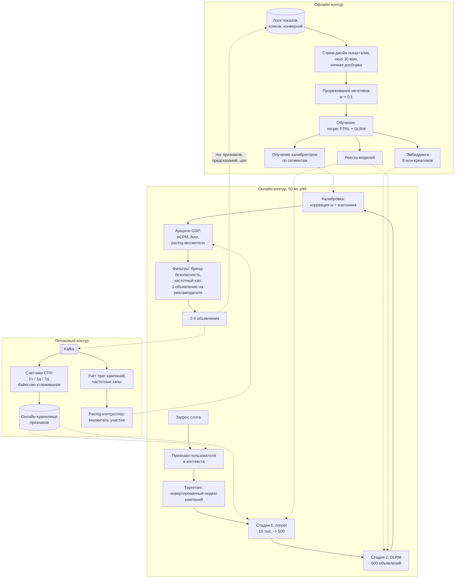

# Кейс: предсказание CTR в рекламе

> **Зачем эта глава.** Реклама — единственный из кейсов, где предсказание модели напрямую
> превращается в деньги через аукцион. Из-за этого меняется всё: важна не сортировка, а само
> значение вероятности; ошибка калибровки — это чужие потерянные бюджеты; а десятки тысяч
> кандидатов надо отскорить за миллисекунды. Полный разбор ответа по
> [каркасу из восьми шагов](01-framework.md).

**Уровень:** 🎯 middle → 🧠 middle+
**Предварительно нужно:** [каркас ответа](01-framework.md), [дисбаланс и калибровка](../02-classic-ml/12-imbalance-and-calibration.md), [метрики качества](../02-classic-ml/04-metrics.md), [нейронное ранжирование](../06-recsys/08-neural-ranking.md), [работа с признаками](../02-classic-ml/14-feature-engineering.md)
**Как проработать:** чтение + упражнения

---

## Карта главы

- [0. Задача, как её даёт интервьюер](#0-задача-как-её-даёт-интервьюер)
- [1. Шаг 1. Уточняющие вопросы и ответы](#1-шаг-1-уточняющие-вопросы-и-ответы)
- [2. Почему здесь нужна вероятность, а не порядок](#2-почему-здесь-нужна-вероятность-а-не-порядок)
- [3. Шаг 2. Метрики](#3-шаг-2-метрики)
- [4. Шаг 3. Данные](#4-шаг-3-данные)
- [5. Шаг 4. Постановка ML-задачи и бейзлайн](#5-шаг-4-постановка-ml-задачи-и-бейзлайн)
- [6. Шаг 5. Признаки и модель](#6-шаг-5-признаки-и-модель)
- [7. Шаг 6. Архитектура](#7-шаг-6-архитектура)
- [8. Шаг 7. Оценка, выкатка, мониторинг](#8-шаг-7-оценка-выкатка-мониторинг)
- [9. Шаг 8. Риски и развитие](#9-шаг-8-риски-и-развитие)
- [10. Куда обычно копает интервьюер](#10-куда-обычно-копает-интервьюер)
- [11. Подводные камни](#11-подводные-камни)
- [12. Проверь себя](#12-проверь-себя)
- [13. Практика](#13-практика)
- [14. Что читать дальше](#14-что-читать-дальше)

---

## 0. Задача, как её даёт интервьюер

> «Спроектируйте систему предсказания CTR для рекламного аукциона на нашей площадке».

---

## 1. Шаг 1. Уточняющие вопросы и ответы

**«Какая модель монетизации?»** — Аукцион второй цены с оплатой за клик (CPC), обобщённый GSP.
Есть и часть кампаний с оплатой за показ (CPM) и с оптимизацией под конверсию (oCPC) —
они участвуют в том же аукционе через приведение к ожидаемому доходу за показ.

**«Где показывается реклама и сколько её?»** — Рекламные слоты в ленте и в поисковой выдаче
маркетплейса, 2–4 слота на экран. **2 млрд показов рекламы в сутки**, средний RPS 23 тыс.,
вечерний пик 45 тыс. запросов на подбор рекламы в секунду.

**«Сколько рекламодателей и объявлений?»** — 120 тыс. активных кампаний, 8 млн активных
креативов. Каждый день добавляется ~200 тыс. новых креативов, из них 60 тыс. от кампаний
без истории.

**«Какой средний CTR?»** — 0.6%, то есть дисбаланс примерно **1:170**. Конверсия в заказ после
клика — 3%, то есть от показа до конверсии 1:5500.

**«Бюджет латентности?»** — 50 мс p99 на весь рекламный ответ. Реклама встроена в рендер
страницы: если она не успела, слот отдаётся под органику, и это прямая потеря дохода.
Доля таймаутов — отдельная бизнес-метрика.

**«Сколько кандидатов после таргетинга?»** — На типичный запрос под таргетинг (гео, интересы,
устройство, категория страницы, не исчерпан бюджет, не превышен частотный кап) подходит
**8–15 тыс. объявлений**. Их все надо оценить и провести аукцион.

**«Что уже есть?»** — Логистическая регрессия на хешированных признаках с онлайн-обучением,
логлосс 0.0421, откалибрована глобально, но плывёт по сегментам.

**Итог вслух:**

> «Итак: GSP-аукцион с оплатой за клик, 2 млрд показов в сутки, пик 45 тыс. RPS, 8–15 тыс.
> кандидатов на запрос, 50 мс p99, средний CTR 0.6%, есть работающая логрег-модель.
> Ключевое ограничение, которое я хочу зафиксировать: в аукционе используется **абсолютное
> значение** предсказанной вероятности, а не только порядок, поэтому калибровка — это не
> украшение, а требование корректности. Предлагаю разобрать модель, калибровку, двухстадийный
> скоринг под 50 мс и связку с бюджетами и pacing».

---

## 2. Почему здесь нужна вероятность, а не порядок

Это первое, что отличает сильный ответ. Проговорите механику аукциона явно.

Каждое объявление $i$ участвует со ставкой $b_i$ (максимум, который рекламодатель готов
заплатить за клик). Площадка сортирует объявления по **ожидаемому доходу с показа**:

$$
\mathrm{eCPM}_i \;=\; b_i \cdot \hat p_i \cdot 1000
$$

где $\hat p_i$ — предсказанная вероятность клика по объявлению $i$ в данном контексте,
$b_i$ — ставка за клик, множитель 1000 переводит в «доход с тысячи показов».

Побеждает максимальный $\mathrm{eCPM}$, а платит победитель по правилу второй цены — столько,
чтобы его eCPM стал равен eCPM следующего:

$$
\mathrm{price}_1 \;=\; \frac{b_2 \cdot \hat p_2}{\hat p_1}
$$

где индексы 1 и 2 — победитель и следующий за ним по eCPM.

Отсюда три следствия, которые надо назвать:

**1. Ошибка калибровки — это ошибка распределения денег.** Если для сегмента «мобильные
пользователи вечером» модель систематически завышает $\hat p$ в 1.3 раза, объявления,
таргетированные на этот сегмент, будут выигрывать аукционы, которых не заслуживают, а их
владельцы — переплачивать за клики, которых не будет. Через неделю их ROI просядет, и они
снизят ставки или уйдут.

**2. Равномерное смещение частично сокращается, неравномерное — нет.** Тонкий момент, который
любят проверять. Если $\hat p_i = c \cdot p_i$ с **одной и той же** константой $c$ для всех
объявлений, то и порядок по eCPM, и формула второй цены не изменятся: $c$ сократится
в числителе и знаменателе. Но даже такое смещение ломает: (а) сравнение с резервной ценой
(floor) — при завышении показывается реклама, которая не должна была пройти порог;
(б) решение «показать рекламу или отдать слот органике»; (в) pacing бюджетов, который считает
ожидаемые траты; (г) смешанный аукцион CPC и CPM, где $c$ не сокращается, потому что для CPM
$\hat p$ не участвует; (д) прогнозы доступного объёма показов, которые площадка обещает
рекламодателям.

**3. Метрики ранжирования недостаточны.** ROC-AUC инвариантен к любому монотонному
преобразованию предсказаний: модель с AUC 0.80 может систематически предсказывать 0.05 вместо
0.006 и иметь тот же AUC. Поэтому основная офлайн-метрика в рекламе — **логлосс**,
а не AUC; AUC оставляют как вторичную диагностику.

> 💬 **На собеседовании.** Спросят: «Почему в рекламе так носятся с калибровкой, если в аукционе
> важен порядок?» Хороший ответ: порядок важен только внутри чистого CPC-аукциона при равномерном
> смещении. На практике аукцион смешанный (CPC + CPM + oCPC), есть резервная цена, есть решение
> о показе рекламы вообще, есть pacing, есть отчётность перед рекламодателем. Каждое из этих
> мест использует $\hat p$ как **число**, а не как ранг. Плюс главное: смещение никогда не бывает
> равномерным — оно всегда сегментное (новые креативы, мобильный трафик, редкие категории),
> а сегментное смещение перекраивает распределение показов между рекламодателями и подрывает
> доверие к площадке. Провал: «нам достаточно AUC».

---

## 3. Шаг 2. Метрики

| Уровень | Метрика | Комментарий |
|---|---|---|
| Бизнес | доход площадки; **RPM** (доход на 1000 запросов); удержание рекламодателей; доля бюджетов, освоенных полностью | цель |
| Продуктовая | CTR рекламы; fill rate (доля заполненных слотов); ROAS рекламодателя; доля кампаний с over/under-delivery | двигаем в A/B |
| ML офлайн | **логлосс** и относительное улучшение к константному предсказанию (RIG); Brier; **calibration ratio по сегментам**; ROC-AUC как вторичная; PR-AUC | выбираем модель |
| Guardrail | p99 ≤ 50 мс; доля таймаутов; органический CTR соседних блоков; доля скрытий и жалоб на рекламу; доля показов новым кампаниям | не должно падать |

**Relative Information Gain.** В рекламе абсолютный логлосс бессмыслен: при CTR 0.6% константное
предсказание уже даёт логлосс около 0.0415, и разница между хорошей и плохой моделью — в третьем
знаке. Поэтому отчитываются относительным улучшением:

$$
\mathrm{RIG} \;=\; 1 \;-\; \frac{\mathrm{LogLoss}(\text{модель})}{\mathrm{LogLoss}(\text{константа } \bar y)}
$$

где $\bar y$ — базовая частота клика в выборке. Значения 0.20–0.30 считаются хорошими;
рост RIG на 1 пункт обычно транслируется в заметный рост дохода.

**Calibration ratio** — главная эксплуатационная метрика:

$$
\mathrm{CR}(S) \;=\; \frac{\sum_{j \in S} \hat p_j}{\sum_{j \in S} y_j}
$$

где $S$ — сегмент (например, «мобильные, категория «электроника», кампании младше 3 дней»),
$\hat p_j$ — предсказание на показе $j$, $y_j \in \{0,1\}$ — факт клика. Идеал — 1.0.
Мониторится не глобально, а по **сетке сегментов**: платформа × позиция слота × тип кампании ×
возраст кампании × децили предсказания. Глобальная калибровка в 1.00 при сегментной 0.7 и 1.4
в двух половинах трафика — это сломанная система, которая выглядит здоровой на дашборде.

Дополнительно: **ECE** (expected calibration error) и reliability diagram по децилям предсказаний —
для визуальной диагностики.

---

## 4. Шаг 3. Данные

**Основной поток.** Показ (`impression`) логируется в момент отдачи объявления вместе
с полным вектором признаков, версией модели, предсказанием, ставкой, ценой аукциона
и позицией. Клик приходит отдельным событием с `impression_id`.

**Джойн показов и кликов — задача стриминга, а не батча.** Клик приходит через секунды, но
хвост распределения тянется: 3% кликов приходят позже 5 минут (медленные сети, отложенные
переходы). Решение: окно джойна 30 минут в стриминге, отметка `label=0` по истечении окна,
и **ночная досборка** поздних кликов батчем с перезаписью меток за прошлые сутки.
При окне 30 минут теряется <0.5% кликов; при окне 1 минуту — уже 6%, что систематически
занижает предсказания.

**Объём и сэмплирование.** 2 млрд показов в сутки — это 12 млн кликов и 1.988 млрд негативов.
Обучать на всём бессмысленно и дорого. Прореживаем негативы с коэффициентом $w = 0.1$
(оставляем каждый десятый), позитивы оставляем все: получаем ~210 млн примеров в сутки,
что уже реально.

Но прореживание **сдвигает калибровку**, и это надо не просто упомянуть, а вывести. Пусть
истинная вероятность клика $p$, негативы оставляем с вероятностью $w$. В прореженной выборке:

$$
q \;=\; \frac{p}{p + (1-p)\,w}
$$

Разрешая относительно $p$:

$$
q\big(p + (1-p)w\big) = p \;\Longrightarrow\; qw = p(1 - q + qw) \;\Longrightarrow\;
\boxed{\;p \;=\; \frac{q\,w}{1 - q + q\,w}\;}
$$

где $q$ — предсказание модели, обученной на прореженных данных, $p$ — калиброванная вероятность,
$w \in (0,1]$ — доля сохранённых негативов. Проверка: при $w=1$ получаем $p=q$, как и должно быть;
при $w \to 0$ (оставили почти ничего) $p \to 0$ — модель, обученная почти на одних позитивах,
после коррекции даёт малые вероятности. Эту формулу применяют **до** любой другой калибровки.

**Смещения, которые надо назвать:**
- **Показ обусловлен победой в аукционе.** Мы наблюдаем клики только по тем объявлениям,
  которые выиграли — то есть по тем, для которых модель уже предсказала высокий $\hat p$.
  Классическая замкнутая петля.
- **Позиционный биас.** Верхний рекламный слот получает в 2.5–3 раза больший CTR.
  Позиция логируется и участвует в обучении, а на инференсе подставляется целевая позиция.
- **Новые креативы не имеют статистики**, а без показов её и не получат. Отсюда обязательная
  эксплорация — доля показов, выделенная новым кампаниям (см. §10.4).

**Сплит.** Строго временной, обычно «обучаемся на 30 днях, валидируемся на следующем дне,
тестируемся на дне после него». Кросс-валидация по случайным фолдам здесь запрещена не только
из-за утечки во времени: креативы живут неделями, и случайный сплит даёт модели видеть будущее
поведение того же креатива.

---

## 5. Шаг 4. Постановка ML-задачи и бейзлайн

**Постановка.** Бинарная классификация с логистической потерей на паре (запрос-контекст,
объявление), где положительный класс — клик по показу. Ключевое требование: модель должна
выдавать **калиброванную вероятность**, а не скор. Именно поэтому здесь не используют ни
ранжирующие потери, ни поточечные регрессии на скор: логлосс — это правильная скоринг-функция
(proper scoring rule), её минимум достигается на истинной вероятности.

Для oCPC-кампаний нужна вторая модель — CVR (вероятность конверсии при условии клика).
Итоговый eCPM для них: $\mathrm{eCPM} = \text{target CPA} \cdot \hat p_{\text{click}} \cdot \hat p_{\text{conv}|\text{click}} \cdot 1000$. У CVR-модели своя большая проблема — задержка
конверсий, см. §10.3.

**Бейзлайн без ML.** Историческая частота клика по паре (креатив, тип слота) со сглаживанием
Байеса:

$$
\widehat{\mathrm{CTR}} \;=\; \frac{c + \alpha\,\mathrm{CTR}_{\text{кампании}}}{s + \alpha}
$$

где $c$ — число кликов, $s$ — число показов, $\alpha \approx 300$ (при CTR 0.6% нужны сотни
показов, чтобы статистика была осмысленной). Это не игрушка: такой счётчик закрывает основную
часть сигнала и является сильнейшим отдельным **признаком** в любой ML-модели. Прирост
полноценной модели над ним — 10–20% RIG, и его надо честно измерить.

**Лестница усложнения:**

| Уровень | Модель | RIG (условно) | Инференс на 10 тыс. кандидатов |
|---|---|---|---|
| 0 | сглаженные счётчики CTR | 0.12 | <1 мс |
| 1 | логрег на хешированных признаках, обучение FTRL-Proximal онлайн | 0.22 | 3–5 мс |
| 2 | GBDT для генерации признаков + логрег | 0.26 | 15 мс |
| 3 | нейросеть с эмбеддингами (DLRM/DeepFM) на топ-кандидатах | 0.29 | 12 мс на 500 объектов |

Обратите внимание: уровень 3 применяется **не ко всем кандидатам**, а к отобранным.
Это и есть решение задачи «десятки тысяч кандидатов за 50 мс».

---

## 6. Шаг 5. Признаки и модель

### 6.1 Признаки и проблема кардинальности

| Группа | Примеры | Кардинальность |
|---|---|---|
| Объявление | `creative_id`, `campaign_id`, `advertiser_id`, категория товара, тип креатива, длина текста, наличие скидки | 8 млн / 120 тыс. / 40 тыс. |
| Пользователь | `user_id`, интересы, история покупок по категориям, давность визита, устройство, ОС | 30 млн |
| Контекст | тип страницы, позиция слота, час, день недели, гео, поисковый запрос (если поиск), категория страницы | средняя |
| Счётчики | CTR креатива / кампании / рекламодателя за 1 ч / 1 д / 7 д со сглаживанием, CTR пары (креатив, гео) | числовые |
| Кросс-признаки | (категория объявления × интерес пользователя), (позиция × устройство), (кампания × час) | произведение |

Проблема очевидна: `creative_id` × `user_id` — это $2.4 \cdot 10^{14}$ возможных пар. Ни один
словарь такого не выдержит. Два подхода:

**Hashing trick.** Все категориальные и кросс-признаки хешируются в общее пространство
$2^{24} = 16.7$ млн бакетов:

$$
j \;=\; \mathrm{hash}(\text{имя признака} \,\Vert\, \text{значение}) \bmod 2^{24}
$$

где $j$ — индекс ненулевой координаты в разреженном векторе, $\Vert$ — конкатенация
(имя признака в хеше обязательно: иначе значение «1» признака «позиция» и значение «1» признака
«час» попадут в один бакет). Модель — логистическая регрессия на разреженном векторе
с ~200 ненулевыми координатами.

Коллизии есть и они не смертельны: два редких признака, попавших в один бакет, портят друг
друга, но их вклад мал; частотные признаки конфликтуют редко. Практическое правило: при
$2^{24}$ бакетов и ~50 млн уникальных значений доля коллизий среди **частотных** признаков
(≥100 показов) не превышает единиц процентов, и потеря логлосса измеряется третьим знаком.
Хеширование даёт три вещи бесплатно: фиксированный размер памяти, отсутствие словаря
(значит, нет проблемы новых категорий) и потоковое обучение без предварительного прохода
по данным.

**Эмбеддинги с частотным словарём.** Для нейросети: значения с частотой ниже порога (например,
100 показов) сваливаются в OOV-бакет, остальные получают обучаемый вектор размерности 16–64.
Таблица эмбеддингов для 8 млн креативов × 32 × fp16 = 512 МБ — уже заметно, а для 30 млн
пользователей × 32 — почти 2 ГБ. Отсюда практика: `user_id` как отдельный эмбеддинг чаще
**не используют** вовсе, заменяя его агрегатами поведения; эмбеддинги дают тем сущностям,
где их немного и они устойчивы (кампания, рекламодатель, категория).

> ⚠️ **Типичная ошибка.** Заводить эмбеддинг для `creative_id` и радоваться приросту на офлайне.
> Медианный креатив живёт 11 дней; к моменту выката модели треть креативов из обучающей выборки
> уже не показывается, а половина активных креативов — новые, с необученным эмбеддингом.
> Офлайн-метрика этого не видит (там креативы «свои»), а онлайн проседает. Лечение:
> эмбеддинг кампании и рекламодателя вместо креатива, контентные признаки креатива
> (категория, текст, изображение) и отдельный замер метрики на срезе новых креативов.

### 6.2 Модель

**Вариант A. Логистическая регрессия на хешированных признаках с онлайн-обучением FTRL-Proximal.**
Плюсы, которых нет ни у чего другого: обучается потоково и догоняет свежие данные за минуты,
даёт разреженное решение за счёт L1 (в проде остаются десятки миллионов ненулевых весов
из миллиардов возможных), инференс — сумма 200 весов, то есть сотни наносекунд на объявление,
и **естественно калибрована**, потому что оптимизирует логлосс на реальном распределении.
Минусы: не ловит взаимодействия автоматически — все кроссы задаются руками.

**Вариант B. GBDT + логрег.** Бустинг обучается на плотных числовых признаках (счётчики,
агрегаты), индексы листьев каждого дерева становятся категориальными признаками для логрега.
Даёт автоматический поиск взаимодействий при сохранении онлайн-дообучаемости линейной части.
Минус: два пайплайна и запаздывание древесной части (переобучается раз в сутки).

**Вариант C. Нейросеть с эмбеддингами (DLRM/DeepFM/DCN).** Лучшее качество, автоматические
взаимодействия высокого порядка, естественная работа с последовательностями. Минусы: обучение
на GPU, инференс дороже на порядок, **склонность к недо/перекалибровке** после каждого
переобучения, и таблицы эмбеддингов, которые надо где-то держать и обновлять.

**Выбор: A на первой стадии, C на второй.** Это прямое следствие бюджета: 10 тыс. кандидатов
нельзя пропустить через нейросеть за 50 мс, но можно через логрег. Логрег отбирает топ-500
по eCPM, нейросеть переоценивает их точно. Такая каскадная схема — стандарт в рекламе,
и её обоснование через арифметику производит правильное впечатление:

> «10 тыс. кандидатов × 200 ненулевых признаков = 2 млн умножений-сложений, это 3–4 мс
> на векторизованном коде. Та же тысяча кандидатов в DLRM — это порядка 10 млрд FLOPs,
> что не влезает ни в бюджет, ни в железо при 45 тыс. RPS. Поэтому тяжёлая модель работает
> только на топ-500, а на 500 объектов DLRM с предпосчитанными эмбеддингами объявлений — это
> 10–12 мс, что уже допустимо».

**Калибровка сверху.** Независимо от выбора модели ставим финальный слой:
(1) коррекция прореживания негативов по формуле из §4; (2) **изотоническая регрессия
или Platt-масштабирование, обученные по сегментам** — отдельно для платформы × позиции ×
возраста кампании. Калибратор переобучается чаще модели (раз в час на свежих данных),
потому что дрейфует быстрее.

---

## 7. Шаг 6. Архитектура



### Бюджет латентности (50 мс p99)

| Стадия | мс | Комментарий |
|---|---|---|
| Парсинг запроса, контекст | 2 | |
| Признаки пользователя из онлайн-хранилища | 6 | один батч-запрос; при таймауте — дефолты |
| Таргетинг: булев поиск по индексу кампаний | 8 | пересечение постинг-листов по гео, интересам, категории; отсечение исчерпанных бюджетов и капов |
| Стадия 1: логрег на 10 тыс. кандидатов | 4 | 2 млн операций, SIMD, признаки объявления предпосчитаны |
| Стадия 2: DLRM на 500 | 12 | эмбеддинги объявлений из памяти процесса, пользовательская башня считается один раз |
| Калибровка | 2 | таблица изотоники по сегментам, lookup |
| Аукцион, pacing, резервные цены | 3 | |
| Фильтры и дедупликация рекламодателей | 3 | |
| Сериализация | 4 | |
| Логирование | 0 | асинхронно, вне критического пути |
| **Сумма** | **44** | запас 6 мс |

Три инженерных решения, которые надо назвать:

1. **Признаки объявления предпосчитаны и лежат в памяти процесса.** 8 млн креативов × ~100 байт
   плотных признаков = 800 МБ на инстанс. Обновление — раз в 5 минут дельтами. Ходить за ними
   в сеть на 10 тыс. кандидатов невозможно физически.
2. **Пользовательская башня считается один раз на запрос**, а не на каждое объявление.
   Это то же разделение, что в двухбашенке: вся зависимость от пользователя вынесена в вектор,
   который потом комбинируется с векторами объявлений.
3. **Логирование асинхронно.** Запись 2 млрд событий с полными векторами признаков идёт
   в буфер и в Kafka вне критического пути. При этом логировать надо именно те значения,
   которые видела модель, — иначе обучающие данные разойдутся с продом.

### Фолбэки

| Отказ | Поведение |
|---|---|
| Онлайн-хранилище признаков | дефолтные значения (те же, что при обучении), метрика `feature_default_rate` |
| DLRM недоступна | работаем на результатах стадии 1; логлосс хуже, но аукцион валиден |
| Обе модели недоступны | ранжирование по $b_i \cdot \widehat{\mathrm{CTR}}_{\text{счётчик}}$ из кэша |
| Превышение дедлайна | **отдать слот органике**, не показывать рекламу; лучше ноль дохода, чем случайная реклама с неверной ценой |

Последняя строка важна: в рекламе «показать что-нибудь» — плохой фолбэк, потому что показ
влечёт списание денег с рекламодателя по цене, посчитанной на мусорном предсказании.

---

## 8. Шаг 7. Оценка, выкатка, мониторинг

**Офлайн.** Временной сплит. Логлосс и RIG — основные; calibration ratio по сетке сегментов —
обязательная приёмка (ни один сегмент с ≥1% трафика не должен выходить за [0.9, 1.1]);
ROC-AUC — вторичная. Отдельно: срез новых кампаний (младше 3 дней) и срез хвоста
(кампании с <1000 показов в сутки).

**Онлайн: A/B в рекламе устроен сложнее, чем везде.** Это тот пункт, где кандидат может
заметно выделиться.

Наивный A/B по пользователям в рекламной системе даёт смещённую оценку, потому что группы
конкурируют за **общие бюджеты**. Если тестовая группа показывает объявления кампании X чаще,
кампания X быстрее исчерпает дневной бюджет — и это ударит по контрольной группе. Эффект
называется бюджетной интерференцией и систематически завышает измеренный выигрыш.

Что делают:
- **Budget-split test:** бюджет каждой кампании делится между группами пропорционально их доле
  трафика, и каждая группа проводит свой изолированный аукцион со своей долей бюджета.
  Это дороже в реализации, но даёт несмещённую оценку.
- **Разделение по слотам/площадкам** вместо пользователей, если позволяет продукт.
- Как минимум — измерять и докладывать интерференцию: сравнивать долю кампаний, упершихся
  в бюджет, между группами.

Ключевая метрика — RPM (доход на 1000 запросов) и доход в абсолюте. Guardrails: CTR,
органический CTR соседних блоков (реклама не должна каннибализировать основной контент),
доля жалоб, доля кампаний с недоосвоением бюджета, средняя цена клика (её резкий рост —
повод разбираться, а не радоваться).

Длительность — не меньше 14 дней, потому что рекламодатели **адаптируются**: увидев рост цены
за клик, они меняют ставки. Эффект, измеренный за 3 дня, не переживает реакции рынка.

**Выкатка.**

```
shadow 3-5 дней -> canary 1% 1 день -> 10% с проверкой калибровки -> A/B 50/50 14 дней -> 100%
```

В shadow проверяем не только латентность, но и **распределение предсказаний против фактических
кликов на реальном трафике**: shadow-модель не влияет на выдачу, значит её предсказания можно
сопоставить с фактическими исходами тех показов, которые всё равно случились. Это позволяет
измерить логлосс и калибровку новой модели до её влияния на деньги — редкая роскошь,
и её надо использовать.

**Мониторинг: четыре слоя.**

| Слой | Метрики | Алерт | Действие |
|---|---|---|---|
| Инфраструктура | p50/p99, доля таймаутов, RPS, память под таблицы эмбеддингов | доля таймаутов > 0.5% | снизить число кандидатов на стадии 2, проверить GC |
| Данные | лаг стрим-джойна, доля показов без пары «клик/не клик», свежесть счётчиков, доля дефолтных признаков, PSI по топ-30 признакам | лаг джойна > 10 мин | остановить онлайн-дообучение: обучение на неполных метках систематически занижает CTR |
| Модель | средний $\hat p$ против фактического CTR (calibration ratio) глобально и по 40 сегментам, распределение $\hat p$ по децилям, RIG на скользящем окне | CR вне [0.9, 1.1] в сегменте с долей >1% | переобучить калибратор; при повторе — расследовать дрифт |
| Бизнес | RPM, доход, средняя цена клика, fill rate, доля кампаний с over/under-delivery, органический CTR | RPM −3% сутки к суткам | сопоставить с выкатками и с сезонностью, при подтверждении — откат |

**Переобучение.** Линейная часть — онлайн, непрерывно (FTRL). Нейросеть — раз в сутки
инкрементально на данных последних 30 дней с большим весом свежих. Калибраторы — раз в час.
Счётчики — потоково. Причина такой разной частоты: скорость устаревания разная. Состав
креативов меняется за дни, поведение пользователей — за недели, а сегментное смещение
калибровки возникает за часы после любого изменения в аукционе или в составе рекламодателей.

---

## 9. Шаг 8. Риски и развитие

**1. Замкнутая петля аукциона.** Мы обучаемся на показах, которые сами и выбрали. Объявление
с недооценённым $\hat p$ не выигрывает аукцион, не получает показов, не получает данных
и остаётся недооценённым навсегда. Это не абстрактная проблема: для новых рекламодателей она
означает, что войти на площадку тяжело. Митигация: оптимистичная инициализация CTR новых
креативов (верхняя граница доверительного интервала вместо среднего — по сути UCB),
выделенная квота показов новым кампаниям, логирование propensity для off-policy-оценки.
Полностью не решается.

**2. Калибровка как постоянная эксплуатационная нагрузка.** Модель, откалиброванная сегодня,
разъезжается за дни: меняется состав рекламодателей, запускаются акции, сдвигается трафик.
Калибратор поверх модели — это ещё одна модель, которую надо обучать, мониторить и откатывать,
и у неё свои режимы отказа (переобучение изотоники на редком сегменте даёт ступеньки).
Дальше: калибровка как часть обучения (регуляризация на согласованность средних по сегментам),
а не как постобработка.

**3. Конфликт интересов площадки и рекламодателя.** Площадка максимизирует доход, который равен
цене за клик × число кликов; рекламодатель максимизирует свой ROI. Краткосрочно площадке
выгодно завышать $\hat p$ у дорогих ставок, и никакая внешняя сторона этого не заметит —
формула аукциона внутри. Долгосрочно это приводит к оттоку рекламодателей, но обратная связь
приходит через месяцы. Митигация — организационная, а не техническая: публикуемые правила
аукциона, регулярный аудит калибровки по сегментам независимой командой, отчётность
рекламодателю в терминах фактического, а не прогнозируемого CTR.

---

## 10. Куда обычно копает интервьюер

### 10.1 «У вас дисбаланс 1:170. Будете взвешивать классы?»

Нет — и это принципиально. Взвешивание положительного класса или oversampling позитивов
меняет априорное распределение и **ломает калибровку**, которая здесь и есть главный продукт
модели. После `scale_pos_weight` предсказания перестают быть вероятностями, а eCPM — деньгами.

Что делаем вместо: **прореживаем негативы** (это делается ради экономии вычислений, а не ради
баланса) и обязательно применяем аналитическую коррекцию из §4. Разница между двумя подходами
тонкая и важная: прореживание с известным $w$ обратимо точной формулой, а взвешивание
с подобранным коэффициентом — нет.

Дополнительно стоит сказать, что дисбаланс 1:170 сам по себе для логистической регрессии
не является проблемой. Проблема возникает при 1:10⁵ и выше, когда градиент от позитивов тонет
в шуме; при 0.6% CTR модель обучается нормально, и никакого «лечения дисбаланса» не требуется.
Ощущение проблемы возникает только у тех, кто смотрит на accuracy.

### 10.2 «10 тысяч кандидатов за 50 миллисекунд. Как?»

Каскад из трёх уровней, каждый дешевле следующего на порядок:

1. **Таргетинг — не модель, а индекс.** Кампании лежат в инвертированном индексе по условиям
   таргетинга; пересечение постинг-листов по гео, интересам, устройству и категории плюс
   отсечение исчерпанных бюджетов и превышенных капов даёт 8–15 тыс. кандидатов за 8 мс.
   Здесь нет ML вообще, и это правильно.
2. **Лёгкая модель на всех кандидатах.** Логрег на хешированных признаках: скалярное
   произведение разреженного вектора на веса. 200 ненулевых координат × 10 тыс. = 2 млн
   операций, векторизуется, укладывается в 3–4 мс. Отбор топ-500 по $b_i \hat p_i$
   (а не по $\hat p_i$: нам нужен доход, а не клики).
3. **Тяжёлая модель на топ-500.** DLRM с предпосчитанными эмбеддингами объявлений;
   пользовательская башня считается один раз, дальше — 500 прогонов лёгкой головы.

Отдельно стоит назвать оптимизации, которые дают основной эффект на практике: предпосчёт
всего, что не зависит от запроса (эмбеддинги объявлений, их плотные признаки); хранение
таблиц в памяти процесса, а не за сетью; квантизация эмбеддингов в int8; батчинг всех
кандидатов в одну матрицу вместо поштучных вызовов. См.
[оптимизацию инференса](../07-mlops/09-inference-optimization.md).

### 10.3 «Конверсии приходят через несколько дней. Как обучать CVR-модель?»

Задача **отложенной обратной связи** (delayed feedback), и она устроена коварно: показ без
конверсии сегодня может стать конверсией завтра. Если просто ждать 7 дней, модель всегда
отстаёт на неделю — это неприемлемо при жизни креатива в 11 дней. Если считать всё
неконвертировавшееся негативом, модель систематически занижает CVR, причём тем сильнее,
чем свежее данные.

Классическое решение — совместное моделирование конверсии и задержки. Предполагаем, что задержка
$D$ распределена экспоненциально с параметром, зависящим от объекта:

$$
P(Y=1 \mid x, e) \;=\; p(x)\,\big(1 - e^{-\lambda(x)\,e}\big)
$$

где $p(x)$ — истинная вероятность конверсии, $\lambda(x)$ — интенсивность (обратное среднее
время до конверсии), $e$ — прошедшее время с момента клика (elapsed time), $Y$ — наблюдённая
метка на данный момент. Обучаются две модели совместно по правдоподобию: для наблюдённых
конверсий вклад $p(x)\lambda(x)e^{-\lambda(x)d}$ (где $d$ — фактическая задержка), для пока
не сконвертировавшихся — $1 - p(x) + p(x)e^{-\lambda(x)e}$. Модель $p(x)$ и есть то, что нужно
для аукциона.

Более простые практические схемы: (а) **importance weighting** — свежие примеры взвешиваются
на обратную вероятность «успеть сконвертироваться» к моменту наблюдения; (б) **fake negatives
с последующей коррекцией** — все показы сначала идут как негативы, при появлении конверсии
пример добавляется как позитив, а смещение снимается аналитической поправкой; эта схема удобна
для потокового обучения. (в) Отдельно калибровать по возрасту события.

Для CTR задержка мала (окно 30 минут), поэтому там достаточно правильно выбранного окна джойна.
Разницу между двумя случаями надо проговорить: интервьюер часто задаёт вопрос про задержку,
не уточняя, о какой модели речь.

### 10.4 «Новый рекламодатель залил кампанию. Что показывает ваша модель?»

Ничего осмысленного — статистики нет. Каскад решений:

1. **Наследование статистики по иерархии.** У креатива нет данных, но есть у кампании; у кампании
   нет — есть у рекламодателя; у рекламодателя нет — есть у категории. Формально это иерархическое
   сглаживание: априор берётся с уровня выше, сила априора тем больше, чем меньше собственных
   данных. Та же формула, что в §5, но с многоуровневым $\alpha$.
2. **Контентные признаки креатива.** Категория товара, цена, текст, эмбеддинг изображения —
   они есть с первой секунды и позволяют предсказать CTR по похожести на существующие креативы.
3. **Оптимизм при неопределённости.** Вместо среднего используем верхнюю границу доверительного
   интервала: $\hat p + \beta\sqrt{\hat p(1-\hat p)/s}$, где $s$ — число показов, $\beta$
   контролирует агрессивность. Это UCB: новые креативы получают шанс, а после нескольких сотен
   показов надбавка спадает. Эквивалентная и более аккуратная схема — Thompson sampling
   по бета-апостериорному распределению.
4. **Явная квота показов.** 1–3% трафика резервируется под кампании с историей менее $N$ показов.

Отдельно надо сказать, что делать с деньгами: пока оценка $\hat p$ ненадёжна, площадка рискует
списать с рекламодателя за клики, которых не будет. Многие системы в период обучения кампании
берут на себя часть риска — например, ограничивают цену или помечают трафик как обучающий.
Это продуктовое решение, но его наличие показывает, что вы понимаете экономику.

### 10.5 «Что такое pacing и как он связан с моделью?»

Рекламодатель задал дневной бюджет 100 тыс. рублей. Без ограничений система потратит его
к 10 утра на дешёвом утреннем трафике, и рекламодатель пропустит вечернюю аудиторию, которая
конвертирует лучше. Pacing — это механизм равномерного (или пропорционального ожидаемому
трафику) расходования бюджета в течение дня.

Две реализации:

- **Вероятностный троттлинг:** кампания участвует в аукционе с вероятностью $r_c \in [0,1]$,
  которая корректируется контроллером: если фактическая скорость трат выше плановой, $r_c$
  снижается. Просто, но добавляет случайность в аукцион.
- **Множитель ставки (bid shading / dual-based pacing):** ставка кампании умножается
  на $\mu_c \in (0,1]$. С точки зрения теории это двойственная переменная бюджетного ограничения
  в задаче линейного программирования «распределить показы так, чтобы максимизировать ценность
  при ограничениях на бюджеты». Более элегантно и не искажает аукцион случайностью.

Связь с ML двусторонняя и её обязательно надо назвать. Во-первых, pacing использует $\hat p$:
чтобы планировать траты, надо предсказывать, сколько кликов принесут показы. Ошибка калибровки
превращается в ошибку планирования — кампания либо не открутит бюджет, либо открутит слишком
рано. Во-вторых, **pacing меняет распределение обучающих данных**: если кампания приторможена
днём и активна вечером, её показы смещены по времени суток, и модель выучит ложную связь
«эта кампания = вечер». Лечится включением pacing-состояния в логи и осторожностью
с временными признаками на уровне кампании.

### 10.6 «Что значит "честный аукцион" и как ML может его сломать?»

Три способа сломать, каждый — реальный инцидент в индустрии.

**Сегментное смещение калибровки.** Если модель систематически завышает $\hat p$ для одного
типа кампаний (например, для тех, у кого есть видео-креатив), эти кампании выигрывают чаще
и платят больше за клик, чем следовало. Формально правила аукциона не нарушены, фактически
одна группа рекламодателей субсидирует другую. Защита: регулярный аудит calibration ratio
по сетке сегментов как обязательная метрика приёмки модели.

**Изменение правил без объявления.** Добавили в eCPM множитель «качества посадочной страницы»
или бустанули собственные товары площадки — распределение показов изменилось, рекламодатели
видят падение эффективности и не понимают причины. Защита: версионирование формулы аукциона,
публикуемые правила, уведомления об изменениях.

**Утечка данных между сторонами.** Использование данных одного рекламодателя (например, его
конверсий) для улучшения таргетинга конкурента — юридический и репутационный риск.
Защита: изоляция признаков по владельцу данных, аудит того, какие признаки попадают в модель.

Правильная формулировка для интервьюера: калиброванность по сегментам — это не только
метрика качества, это **техническое условие честности механизма**. Аукцион второй цены
теоретически стимулирует правдивые ставки только при корректных оценках вероятностей;
при систематически искажённых оценках это свойство исчезает.

---

## 11. Подводные камни

**AUC вырос, доход упал.**
Симптом: новая модель лучше по ROC-AUC на офлайне, после выката RPM снизился.
Причина: улучшился порядок, ухудшилась калибровка — а деньги считаются по значению $\hat p$
(резервные цены, смешанный CPC/CPM-аукцион, pacing).
Что делать: сделать логлосс и calibration ratio по сегментам блокирующими метриками приёмки,
а AUC перевести в разряд диагностических.

**Взвешивание классов «для борьбы с дисбалансом».**
Симптом: после `scale_pos_weight` средний $\hat p$ вырос в 10 раз, доход и цены поехали.
Причина: взвешивание меняет априорную вероятность, предсказания перестают быть вероятностями.
Что делать: не взвешивать; прореживать негативы с известным $w$ и применять аналитическую
коррекцию.

**Окно джойна показов и кликов слишком узкое.**
Симптом: модель систематически недооценивает CTR, calibration ratio ~0.93 и стабильно ниже 1.
Причина: часть кликов не успевает попасть в окно и размечается как негатив.
Что делать: измерить распределение задержки клика, выбрать окно на 99-й перцентиль,
добавить ночную досборку с перезаписью меток.

**Эмбеддинг `creative_id` при жизни креатива в 11 дней.**
Симптом: офлайн-метрика отличная, онлайн хуже прошлой модели.
Причина: половина продовых креативов новые, их эмбеддинги не обучены; офлайн-тест этого
не показывает, потому что там креативы из обучающего периода.
Что делать: эмбеддинги на уровне кампании и рекламодателя, контентные признаки креатива,
обязательный срез метрики по возрасту креатива.

**Онлайн-обучение на неполных метках.**
Симптом: после инцидента с лагом стриминга модель за час «выучила», что кликов нет.
Причина: FTRL дообучался на потоке, где клики ещё не доехали, и все примеры были негативами.
Что делать: жёсткий гейт — при лаге джойна выше порога онлайн-обучение останавливается
автоматически, а не «мы заметим по дашборду».

**A/B без учёта общих бюджетов.**
Симптом: тест показал +6% дохода, после раскатки на 100% прирост оказался +1%.
Причина: в тесте группы конкурировали за общий бюджет кампаний; выигрыш тестовой группы
частично состоял из бюджета, отнятого у контрольной.
Что делать: budget-split тест либо явное измерение доли кампаний, упершихся в бюджет,
в обеих группах; закладывать поправку на интерференцию при прогнозе эффекта.

---

## 12. Проверь себя

<details>
<summary><b>🎯 Вопрос.</b> Почему в рекламе калибровка важнее, чем ранжирующая метрика?</summary>

**Короткий ответ.** Потому что предсказанная вероятность входит в формулу цены и в решение
о показе как число, а не как ранг: eCPM = ставка × pCTR, цена второй цены = $b_2\hat p_2/\hat p_1$,
сравнение с резервной ценой, pacing бюджетов, прогнозы объёмов.

**Развёрнуто.** Равномерное мультипликативное смещение действительно сокращается в чистом
CPC-аукционе, но не сокращается при сравнении с floor, при смешивании CPC и CPM, при решении
«показать рекламу или органику» и в pacing. А неравномерное, сегментное смещение (по платформе,
по возрасту кампании, по категории) перекраивает распределение показов между рекламодателями:
одни систематически переплачивают, другие недополучают трафик. ROC-AUC к этому слеп полностью —
он инвариантен к монотонным преобразованиям. Поэтому основная офлайн-метрика — логлосс и RIG,
а calibration ratio по сетке сегментов — блокирующая метрика приёмки.

**Чего ждёт интервьюер:** понимания, что здесь модель выдаёт не скор, а деньги.

**Провал:** «нам важен порядок, метрика — AUC».
</details>

<details>
<summary><b>🧠 Вопрос.</b> Вы прорядили негативы в 10 раз. Что нужно сделать с предсказаниями?</summary>

**Короткий ответ.** Применить аналитическую коррекцию $p = \dfrac{qw}{1 - q + qw}$, где $q$ —
предсказание модели на прореженных данных, $w = 0.1$ — доля сохранённых негативов.

**Развёрнуто.** Прореживание меняет априорную вероятность класса, и модель, минимизирующая
логлосс на прореженной выборке, сходится не к $p$, а к $q = p/(p + (1-p)w)$. Формула обратима
точно, и это её главное достоинство перед взвешиванием классов: коэффициент известен, а не
подобран. Проверка формулы: при $w=1$ получаем $p=q$. Коррекция применяется до всякой другой
калибровки; после неё поверх ставят изотоническую регрессию по сегментам, потому что остаточное
смещение от коррекции не спасает — оно возникает из-за дрейфа, а не из-за сэмплирования.

**Чего ждёт интервьюер:** что вы знаете формулу или можете вывести её за минуту, и что вы
различаете сэмплирование и взвешивание.

**Провал:** «модель сама разберётся» или «применим `scale_pos_weight`».
</details>

<details>
<summary><b>🎯 Вопрос.</b> Как отскорить 10 тысяч кандидатов за 50 миллисекунд?</summary>

**Короткий ответ.** Каскадом: булев таргетинг по инвертированному индексу (без ML) →
логрег на хешированных признаках на всех кандидатах (3–4 мс) → нейросеть на топ-500 (12 мс).
Плюс предпосчёт всего, что не зависит от запроса, и хранение таблиц в памяти процесса.

**Развёрнуто.** Ключевая арифметика: логрег — это скалярное произведение с ~200 ненулевыми
координатами, то есть 2 млн операций на 10 тыс. кандидатов; нейросеть на тех же 10 тыс. —
это миллиарды FLOPs, что не влезает ни во время, ни в железо при 45 тыс. RPS. Поэтому дорогая
модель работает только на отобранных. Дополнительно: эмбеддинги и плотные признаки объявлений
предпосчитаны и лежат в RAM инстанса (около 800 МБ), пользовательская башня вычисляется
один раз на запрос, скоринг батчится в одну матрицу, логирование вынесено из критического пути.
Отбор на первой стадии делается по $b_i \hat p_i$, а не по $\hat p_i$ — оптимизируем доход,
а не клики.

**Чего ждёт интервьюер:** конкретной арифметики и понимания, что первая стадия вообще
не обязана быть ML.

**Провал:** «поставим побольше GPU».
</details>

<details>
<summary><b>🧠 Вопрос.</b> Конверсии приходят через 3 дня. Как обучать модель конверсии?</summary>

**Короткий ответ.** Совместно моделировать вероятность конверсии и распределение задержки:
$P(Y=1\mid x, e) = p(x)(1 - e^{-\lambda(x)e})$, где $e$ — время, прошедшее с клика.
Либо взвешивать свежие примеры на вероятность «успеть», либо использовать схему fake negatives
с аналитической коррекцией.

**Развёрнуто.** Наивные подходы плохи оба: ждать 7 дней — значит всегда отставать на неделю,
что смертельно при жизни креатива в 11 дней; считать всё неконвертировавшееся негативом —
значит систематически занижать CVR тем сильнее, чем свежее данные, причём смещение неоднородно
по объектам (у дорогих товаров цикл принятия решения длиннее). Модель отложенной обратной связи
разделяет два эффекта: «не сконвертирует вообще» и «ещё не успел». Для потокового обучения
удобнее схема, где показ сначала логируется как негатив, а при появлении конверсии добавляется
положительный пример, и смещение снимается поправкой в функции потерь. Для CTR всё проще —
там достаточно окна джойна в 30 минут, покрывающего 99.5% кликов.

**Чего ждёт интервьюер:** что вы понимаете, почему нельзя просто «подождать», и знаете
хотя бы одну формальную схему.

**Провал:** «будем обучаться на данных двухнедельной давности».
</details>

<details>
<summary><b>🎯 Вопрос.</b> Что такое pacing и зачем он нужен, если есть аукцион?</summary>

**Короткий ответ.** Механизм равномерного расходования дневного бюджета кампании: без него
бюджет выгорит на утреннем дешёвом трафике, и рекламодатель пропустит лучшую аудиторию.
Реализуется вероятностным троттлингом или множителем ставки.

**Развёрнуто.** Аукцион решает, кто выиграет **этот** показ, но ничего не знает о том,
что будет вечером. Задача распределения бюджета по времени — отдельная оптимизационная задача,
и множитель ставки в pacing формально является двойственной переменной бюджетного ограничения.
Связь с ML двусторонняя: pacing использует предсказанный CTR, чтобы планировать траты
(ошибка калибровки = ошибка планирования, кампания недоосваивает или выгорает рано),
и pacing искажает обучающие данные, потому что притормаживание кампаний коррелирует со временем
суток и с типом трафика. Отсюда практическое требование: логировать pacing-состояние и учитывать
его при анализе.

**Чего ждёт интервьюер:** понимания, что рекламная система — это не только модель,
и что ML-компонент встроен в контур управления.

**Провал:** не знать термина или сказать «аукцион сам всё распределит».
</details>

<details>
<summary><b>🧠 Вопрос.</b> Как вы будете обрабатывать признаки миллионной кардинальности?</summary>

**Короткий ответ.** Либо hashing trick в фиксированное пространство ($2^{24}$ бакетов)
для линейной модели, либо частотный словарь с OOV-бакетом и обучаемые эмбеддинги для нейросети.
Выбор диктуется моделью и требованием обновляемости.

**Развёрнуто.** Хеширование даёт фиксированную память, отсутствие словаря (значит, новые
значения обрабатываются без переобучения) и возможность потокового обучения. Обязательное
условие — хешировать вместе с именем признака, иначе значения разных признаков сольются.
Коллизии портят в первую очередь редкие значения, вклад которых мал; при $2^{24}$ бакетов
и 50 млн значений потеря логлосса измеряется третьим знаком. Эмбеддинги дают больше качества
и позволяют выучивать взаимодействия, но требуют словаря, памяти (8 млн креативов × 32 × fp16 =
512 МБ) и страдают от холодного старта: значение, впервые встреченное в проде, имеет
необученный вектор. Практическое правило: эмбеддинги — для сущностей, которых немного
и которые живут долго (кампания, рекламодатель, категория); для короткоживущих и сверхмногочисленных
(креатив, пользователь) — счётчики, агрегаты и хеширование.

**Чего ждёт интервьюер:** что вы понимаете компромисс «память и качество против холодного
старта и обновляемости».

**Провал:** «сделаем one-hot» или «возьмём эмбеддинги для всего».
</details>

<details>
<summary><b>🎯 Вопрос.</b> Модель предсказывает средний CTR 0.9% при фактическом 0.6%. Что произошло и что делать?</summary>

**Короткий ответ.** Calibration ratio 1.5 — модель систематически завышает. Первым делом
проверяю не модель, а данные: полноту меток (лаг джойна), корректность коррекции прореживания
негативов и сдвиг распределения трафика.

**Развёрнуто.** Порядок диагностики. (1) Полнота меток: если клики не доехали, факт занижен,
а не предсказание завышено — это самая частая причина, и она чинится не моделью.
(2) Коррекция прореживания: проверить, что $w$ в проде совпадает с $w$ при обучении;
рассинхронизация здесь даёт ровно такой эффект. (3) Сдвиг трафика: если доля мобильных
или доля новых кампаний выросла, средний факт упадёт при неизменной модели — тогда нужно
смотреть calibration ratio по сегментам, а не глобально. (4) Дрейф модели: только если первые
три отпали, переобучаем калибратор и при повторении — модель. Важное: пока причина неизвестна,
завышенный $\hat p$ уже стоит рекламодателям денег, поэтому допустимо временно применить
глобальный корректирующий множитель как аварийную меру, но это заплатка, а не решение.

**Чего ждёт интервьюер:** что вы начинаете с данных, а не с гиперпараметров, и что понимаете
денежную срочность проблемы.

**Провал:** «переобучим модель».
</details>

---

## 13. Практика

**Задача 1. Прогон кейса (45 минут).**
Пройдите кейс вслух по восьми шагам с таймером.
*Критерий: вы объяснили, почему нужна вероятность, а не порядок, привели формулу цены второй
цены, разложили бюджет 50 мс по стадиям и назвали, что делать с новыми кампаниями.*

**Задача 2. Коррекция прореживания (40 минут).**
Сгенерируйте синтетическую задачу с $p = 0.006$, обучите логистическую регрессию на полных
данных и на данных с прореженными негативами ($w = 0.1$, $0.01$). Постройте reliability diagram
до и после коррекции по формуле из §4.
*Критерий: без коррекции кривая калибровки лежит существенно выше диагонали, после коррекции
совпадает с ней; вы можете назвать, во сколько раз завышено предсказание при каждом $w$.*

**Задача 3. Цена ошибки калибровки (30 минут, на бумаге).**
Пусть в аукционе три объявления со ставками 10, 8, 6 рублей и истинными CTR 1%, 1.5%, 2%.
Посчитайте победителя и цену. Затем завысьте $\hat p$ первого объявления в 1.4 раза
и пересчитайте. Затем завысьте все три одинаково и пересчитайте.
*Критерий: вы численно показали, что равномерное смещение не меняет ни победителя, ни цену,
а сегментное меняет и то, и другое — и можете назвать три места в системе, где даже равномерное
смещение всё-таки вредит.*

**Задача 4. Хеширование (1 час).**
Возьмите любой открытый CTR-датасет с категориальными признаками (например, Criteo или Avazu),
реализуйте hashing trick с $2^{18}$, $2^{20}$, $2^{24}$ бакетов и обучите логрег.
Постройте зависимость логлосса от числа бакетов.
*Критерий: у вас есть кривая с насыщением, и вы можете сказать, при каком размере
пространства дальнейшее увеличение перестаёт окупаться памятью.*

---

## 14. Что читать дальше

- **McMahan et al. «Ad Click Prediction: a View from the Trenches» (KDD 2013)** — обязательное
  чтение по этому кейсу. FTRL-Proximal, хеширование, прореживание негативов, калибровка,
  экономия памяти, метрики. Почти всё, что описано в §5–§6 этой главы, взято оттуда.
  Искать по названию — работа свободно доступна на сайте исследовательской группы Google.
- **He et al. «Practical Lessons from Predicting Clicks on Ads at Facebook» (ADKDD 2014)** —
  схема GBDT + логрег, формула коррекции прореживания негативов, влияние свежести данных.
  Короткая и очень плотная работа.
- **Chapelle. «Modeling Delayed Feedback in Display Advertising» (KDD 2014)** — формальная
  модель отложенной конверсии из §10.3, включая вывод правдоподобия.
- [Naumov et al. «Deep Learning Recommendation Model» (DLRM, 2019)](https://arxiv.org/abs/1906.00091) —
  устройство промышленной нейросети для CTR: таблицы эмбеддингов, взаимодействия, что упирается
  в память.
- [Guo et al. «DeepFM» (2017)](https://arxiv.org/abs/1703.04247) и
  [Wang et al. «Deep & Cross Network» (2017)](https://arxiv.org/abs/1708.05123) —
  два способа автоматически ловить взаимодействия признаков, часто спрашиваемые по названию.
- [Cheng et al. «Wide & Deep Learning for Recommender Systems» (2016)](https://arxiv.org/abs/1606.07792) —
  классическая гибридная схема «запоминание + обобщение», предшественник всего перечисленного.
- **Edelman, Ostrovsky, Schwarz. «Internet Advertising and the Generalized Second-Price Auction» (2007)** —
  экономика GSP: почему он не является стимулосовместимым в строгом смысле и как это влияет
  на поведение рекламодателей. Полезно для §10.6.
- Смежные главы: [дисбаланс и калибровка](../02-classic-ml/12-imbalance-and-calibration.md),
  [нейронное ранжирование](../06-recsys/08-neural-ranking.md),
  [оптимизация инференса](../07-mlops/09-inference-optimization.md),
  [сложные схемы A/B](../10-ab-testing/05-complex-designs.md).

---

⬅️ [Кейс: отток и удержание](07-case-churn-uplift.md) | 🏠 [Оглавление](../index.md) | ➡️ [Python, который спрашивают](../12-coding/01-python-for-mle.md)
