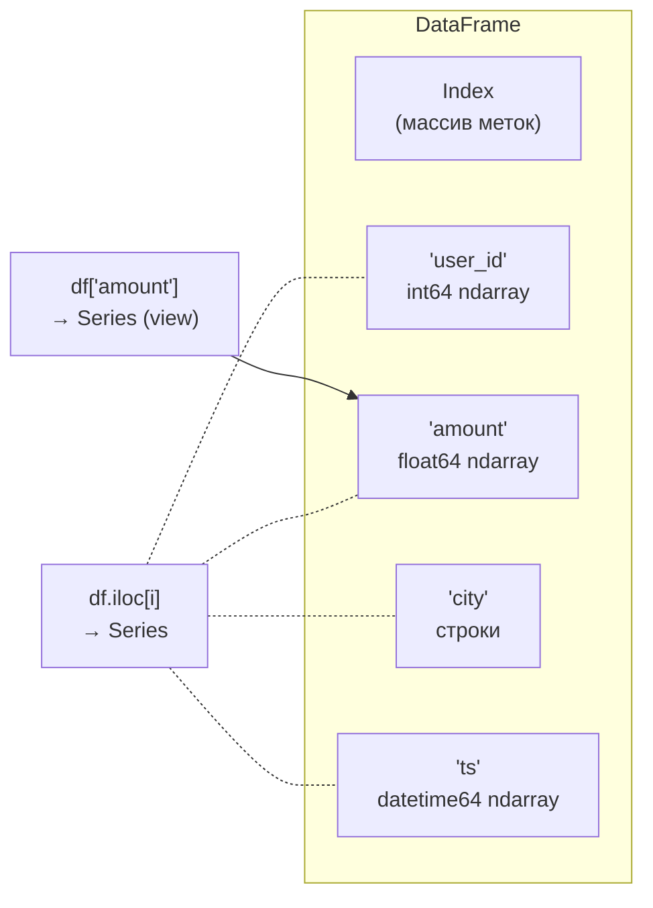
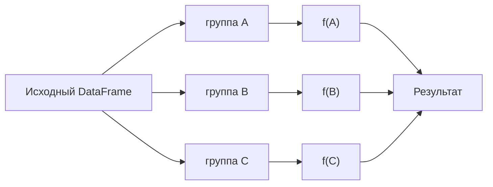

# NumPy и pandas на скорость

> **Зачем эта глава.** Секция live-coding на MLE-собесе почти всегда содержит фразу «а теперь
> ускорьте это» или «а если данных будет в тысячу раз больше?». Здесь разбирается, откуда
> в NumPy и pandas берётся скорость, где она теряется и как считать её заранее — на уровне
> байтов, кэша и лишних копий. После главы вы сможете глядя на код сказать, во сколько раз
> он ускорится и почему, а не подбирать наугад.

**Уровень:** 🌱 база → 🎯 middle → 🧠 middle+
**Предварительно нужно:** [Python, который спрашивают](01-python-for-mle.md) — модель данных, память и копирование
**Как проработать:** чтение + 15 задач на ускорение

> **О версиях.** Все замеры в главе сделаны на **NumPy 2.4 / pandas 3.0 / Python 3.11**,
> 4 ядра Intel Xeon 2.1 ГГц, 16 ГБ RAM. Абсолютные числа у вас будут другими — важны
> **отношения**. Там, где поведение отличается между pandas 2.x и 3.0 (это касается прежде
> всего Copy-on-Write и строкового типа), это отмечено явно.

---

## Карта главы

- [1. Интуиция: откуда берётся стократная разница](#1-интуиция-откуда-берётся-стократная-разница)
- [2. Устройство ndarray: shape, strides, dtype](#2-устройство-ndarray-shape-strides-dtype)
- [3. Broadcasting: правила и главная ловушка](#3-broadcasting-правила-и-главная-ловушка)
- [4. Views и copies: когда NumPy копирует](#4-views-и-copies-когда-numpy-копирует)
- [5. dtype и память: экономия в 2–8 раз](#5-dtype-и-память-экономия-в-28-раз)
- [6. Продвинутая индексация](#6-продвинутая-индексация)
- [7. np.einsum: когда он действительно нужен](#7-npeinsum-когда-он-действительно-нужен)
- [8. Как устроен DataFrame](#8-как-устроен-dataframe)
- [9. Категориальный тип](#9-категориальный-тип)
- [10. groupby: split-apply-combine](#10-groupby-split-apply-combine)
- [11. merge: типы джойнов и взрыв строк](#11-merge-типы-джойнов-и-взрыв-строк)
- [12. pivot и melt: широкое против длинного](#12-pivot-и-melt-широкое-против-длинного)
- [13. Окна: rolling, expanding, shift](#13-окна-rolling-expanding-shift)
- [14. Даты](#14-даты)
- [15. Файлы, которые не влезают в память](#15-файлы-которые-не-влезают-в-память)
- [16. SettingWithCopyWarning и Copy-on-Write](#16-settingwithcopywarning-и-copy-on-write)
- [17. Границы применимости: когда pandas — неправильный инструмент](#17-границы-применимости-когда-pandas--неправильный-инструмент)
- [18. Подводные камни](#18-подводные-камни)
- [19. Проверь себя](#19-проверь-себя)
- [20. Практика: 15 задач «ускорь этот код»](#20-практика-15-задач-ускорь-этот-код)
- [21. Что читать дальше](#21-что-читать-дальше)

---

## 1. Интуиция: откуда берётся стократная разница

Начнём с задачи, которую на собесе дают почти дословно: посчитать сумму миллиона чисел.

```python
import numpy as np, timeit

x = np.random.rand(1_000_000)

def loop_sum(a):
    s = 0.0
    for v in a:          # честный питоновский цикл по массиву
        s += v
    return s

print(timeit.timeit(lambda: loop_sum(x), number=3) / 3)   # 48.7 мс
print(timeit.timeit(lambda: x.sum(),     number=100) / 100)  # 0.41 мс
```

Разница — **в 118 раз**. Причём если сначала перегнать массив в список Python и позвать
встроенный `sum(lst)`, получится 3.3 мс: быстрее, чем цикл по ndarray, но всё равно в восемь
раз медленнее `x.sum()`. Это уже говорит о том, что дело не в одной причине.

Причин ровно четыре, и на собеседовании ждут, что вы назовёте хотя бы три.

**Причина 1: боксинг.** В Python нет «просто числа». Каждое `float` — это объект `PyFloatObject`:
заголовок с типом, счётчик ссылок и только потом 8 байт значения — суммарно 24 байта плюс
8 байт на указатель в списке. Список из миллиона чисел — это ~32 МБ разбросанных по куче
объектов. `np.ndarray` из миллиона `float64` — это 8 МБ **подряд** идущих байт и один объект-обёртка.
Когда вы итерируетесь по ndarray в питоновском цикле, NumPy вынужден на каждой итерации
**создавать** такой объект-обёртку (`np.float64`) — отсюда и то, что цикл по ndarray медленнее
цикла по списку.

**Причина 2: диспетчеризация типов.** `s += v` в Python — это вызов, который каждый раз заново
выясняет, что за типы слева и справа, ищет `__add__`, проверяет переполнение. Миллион раз.
В NumPy тип известен один раз для всего массива, дальше работает единственный цикл на C
без единой проверки.

**Причина 3: кэш процессора.** Сложение двух чисел стоит ~1 нс, поход в оперативную память —
~100 нс. Единственный способ работать быстро — читать данные последовательно, чтобы процессор
успевал подгружать их в кэш заранее (prefetch). Непрерывный массив это позволяет, разбросанные
по куче объекты — нет.

**Причина 4: SIMD.** Современный процессор умеет складывать 4–8 чисел одной инструкцией.
Скомпилированный цикл NumPy этим пользуется, интерпретатор — нет.

> 🌱 **База.** Одна фраза, которую нужно запомнить: **любой питоновский цикл по элементам
> данных — это ошибка проектирования, а не вопрос стиля.** Задача при работе с NumPy и pandas
> состоит в том, чтобы переформулировать вычисление в терминах операций над целыми массивами.
> Дальше вся глава — про то, как это делается и где ломается.

> 💬 **На собеседовании.** Спросят: «Почему NumPy быстрее чистого Python?»
> Хороший ответ: четыре причины — однородный непрерывный буфер вместо коллекции объектов
> (нет боксинга и нет разыменований), типизация один раз на весь массив вместо динамической
> диспетчеризации на каждой операции, локальность данных и работа кэша, векторные инструкции
> процессора. И сразу оговорка: выигрыш есть только когда операция применяется к большому
> массиву целиком; на массиве из 10 элементов NumPy **медленнее** списка из-за накладных
> расходов на вызов.
> Плохой ответ: «потому что NumPy написан на C». Это верно, но не объясняет, почему цикл
> `for v in numpy_array` при этом медленный.

---

## 2. Устройство ndarray: shape, strides, dtype

Чтобы предсказывать, когда операция дешёвая, а когда копирует гигабайты, нужно понимать
физику массива. `ndarray` — это три вещи поверх одного непрерывного куска памяти:

- **буфер** — плоская последовательность байт;
- **dtype** — как интерпретировать байты и сколько их на элемент;
- **shape + strides** — как из многомерного индекса получить смещение в буфере.

Правило пересчёта индекса в смещение:

$$
\text{offset}(i_0, i_1, \dots, i_{k-1}) \;=\; \sum_{j=0}^{k-1} i_j \cdot \text{stride}_j
$$

где $k$ — число измерений (`ndim`), $i_j$ — индекс по измерению $j$, $\text{stride}_j$ — шаг
в **байтах** при увеличении $i_j$ на единицу. Для массива в C-порядке (по умолчанию) с формой
$(s_0, \dots, s_{k-1})$ и размером элемента $b$ байт:

$$
\text{stride}_j \;=\; b \cdot \prod_{m=j+1}^{k-1} s_m
$$

где $s_m$ — длина массива по измерению $m$, а пустое произведение равно единице,
поэтому $\text{stride}_{k-1} = b$ — последнее измерение меняется быстрее всего.

```python
a = np.zeros((3, 4), dtype=np.float64)
print(a.strides)   # (32, 8): шаг по строке = 4 элемента * 8 байт, по столбцу = 8 байт
print(a.T.strides) # (8, 32): транспонирование — это перестановка strides, данные не двигались
```

Отсюда сразу следует главное: **транспонирование, срез, `reshape` совместимой формы, изменение
`shape` — всё это операции за $O(1)$**, они трогают только метаданные. А `np.ascontiguousarray`,
`copy()`, `astype`, `sort` — операции за $O(nd)$ с выделением новой памяти.

Отсюда же следует и то, что порядок обхода имеет значение:

```python
M = np.random.rand(5000, 5000)     # C-порядок, 200 МБ
M.sum(axis=1)   # 17.8 мс — суммируем вдоль строки
M.sum(axis=0)   # 10.2 мс — суммируем поперёк, но SIMD работает лучше
```

Заметьте: интуиция «вдоль непрерывной памяти всегда быстрее» здесь **не сработала**.
При суммировании по `axis=0` NumPy обрабатывает целые непрерывные строки как векторы
и складывает их поэлементно — это идеально ложится на SIMD, а при `axis=1` нужна
редукция внутри вектора. Вывод практический: **порядок обхода влияет, но направление
выигрыша надо мерить, а не угадывать.**

> 🧠 **Middle+.** У среза есть неочевидное свойство: он **удерживает весь родительский буфер**.
> `small = big[:10].copy()` освободит `big` после `del big`, а `small = big[:10]` — нет,
> потому что view держит ссылку на базовый массив. На выборке из 10 строк, взятой из массива
> на 8 ГБ, это выглядит как утечка памяти. Проверяется через `small.base is not None`.

---

## 3. Broadcasting: правила и главная ловушка

**Проблема.** Нужно вычесть из матрицы объектов $X$ размера $n \times d$ вектор средних
длины $d$. Писать цикл по строкам нельзя — см. [§1](#1-интуиция-откуда-берётся-стократная-разница). Дублировать вектор в матрицу $n \times d$
дорого по памяти. Broadcasting (транслирование) решает это, растягивая массивы **виртуально**:
меньший массив читается многократно через нулевой stride, физической копии не возникает.

### Правила

Формы выравниваются **справа налево**. Для каждой позиции:

1. размеры равны — ок;
2. один из размеров равен 1 — он растягивается до второго;
3. иначе — ошибка;
4. недостающие измерения слева дополняются единицами.

```
      X:  (1000, 64)          X:  (1000, 64)          a:  (32,)
   mean:        (64,)      col:  (1000,  1)           b:  (32, 1)
   ------------------      ------------------      ---------------
 итог:  (1000, 64)  ✓       (1000, 64)  ✓            (32, 32)  ⚠️
```

Третий пример — **самая частая ошибка на собеседовании и в проде**. Разберём медленно.

> 📐 **Разбор формулы.** Есть `a` формы `(32,)` — например, 32 предсказания модели.
> И `b` формы `(32, 1)` — те же 32 таргета, но кто-то по дороге сделал `reshape(-1, 1)`
> (типично после `sklearn`, после чтения одного столбца из DataFrame или после `[:, None]`).
> Выравниваем справа:
>
> ```
> a:      (32,)   →  дополняем слева единицей  →  (1, 32)
> b:   (32,  1)                                   (32, 1)
> ```
>
> Теперь по правилам: последняя ось — 32 против 1, единица растягивается до 32.
> Первая ось — 1 против 32, единица растягивается до 32. Итог — **(32, 32)**.
> Вы хотели вектор из 32 ошибок, а получили матрицу всех попарных разностей.

```python
y_pred = np.random.rand(32)          # (32,)
y_true = np.random.rand(32, 1)       # (32, 1) — «лишняя» ось

err = y_pred - y_true
print(err.shape)                     # (32, 32)  ← не то, что вы хотели
print((err ** 2).mean())             # число посчиталось, ошибки нет, MSE неверный
```

Кода не падает. Модель обучается. Метрика тихо неверна. Именно поэтому это любимый вопрос
интервьюеров: он проверяет не знание правил, а привычку контролировать размерности.

**Как защищаться.** Три приёма, в порядке полезности:

```python
# 1. Ассерт на форму в местах стыка — дешевле любого дебага
assert y_pred.shape == y_true.shape, (y_pred.shape, y_true.shape)

# 2. Явное приведение вместо надежды на broadcasting
y_true = np.asarray(y_true).ravel()

# 3. Явное указание оси, а не reshape наугад
diff = y_pred[:, None] - y_true[None, :]   # если попарная матрица нужна — пишем это явно
```

### Стоимость broadcasting

Broadcasting не копирует **входы**, но результат — обычный массив. Это ловушка №2:

```python
X = np.random.rand(20_000, 64)
D = X[:, None, :] - X[None, :, :]      # форма (20000, 20000, 64) float64
```

Промежуточный массив здесь занимает $20000 \cdot 20000 \cdot 64 \cdot 8 = 204.8$ ГБ.
На 2000 объектах это «всего» 2 ГБ и код отработает — за 7.6 секунды. Правильное решение
использует алгебраическое тождество:

$$
\|x_i - x_j\|_2^2 \;=\; \|x_i\|_2^2 + \|x_j\|_2^2 - 2\,\langle x_i, x_j \rangle
$$

где $x_i, x_j \in \mathbb{R}^d$ — строки матрицы $X \in \mathbb{R}^{n \times d}$,
$\|\cdot\|_2$ — евклидова норма, $\langle\cdot,\cdot\rangle$ — скалярное произведение.
Все попарные скалярные произведения — это одно матричное умножение $X X^\top$,
которое уходит в BLAS.

```python
def pairwise_dist(X):
    sq = np.einsum('ij,ij->i', X, X)          # ||x_i||^2 — дешевле, чем (X*X).sum(1)
    d2 = sq[:, None] + sq[None, :] - 2.0 * (X @ X.T)
    np.maximum(d2, 0, out=d2)                 # численный мусор: близкие точки дают -1e-16
    return np.sqrt(d2)
```

Замер на `X` формы `(2000, 64)`: broadcasting — **7600 мс**, через матричное произведение —
**44 мс**. Ускорение в 173 раза, и пиковая память падает с 2 ГБ до 32 МБ.

> ⚠️ **Типичная ошибка.** `np.sqrt` от результата этой формулы без `np.maximum(d2, 0)` даёт
> `nan` на диагонали и на дубликатах: теоретический ноль в арифметике с плавающей точкой
> оказывается $-10^{-16}$. Симптом — `nan` в матрице расстояний ровно там, где расстояние
> должно быть нулевым.

---

## 4. Views и copies: когда NumPy копирует

**Проблема.** Вы написали функцию нормализации, она работает. В проде выясняется, что она
испортила исходные данные — или наоборот, ничего не изменила. Обе беды — от непонимания,
что вернула индексация: view (представление) или copy (копию).

Правило запоминается одной фразой: **базовая индексация (basic indexing) даёт view,
продвинутая (advanced / fancy indexing) даёт copy.**

| Операция | Что вернёт | Почему |
|---|---|---|
| `a[2:8]`, `a[:, 1:3]`, `a[::2]` — срезы | **view** | достаточно поменять offset и strides |
| `a.T`, `a.reshape(...)` (если возможно), `a.ravel()` на C-непрерывном | **view** | только метаданные |
| `a[[0, 2, 5]]` — список индексов | **copy** | произвольный набор строк не описывается одним stride |
| `a[a > 0]` — булева маска | **copy** | то же самое |
| `a.astype(np.float32)` | **copy** | меняется размер элемента |
| `a.flatten()` | **copy** всегда | в отличие от `ravel()` |
| `a.T.reshape(-1)` | **copy** | после транспонирования данные не непрерывны |

Проверять надо не через `.base` (цепочки view схлопываются, и `a.T.base is a` может быть
`False`, хотя память общая), а через `np.shares_memory`:

```python
arr = np.arange(12).reshape(3, 4)

np.shares_memory(arr, arr[:, 1:3])    # True  — срез
np.shares_memory(arr, arr[[0, 2]])    # False — fancy
np.shares_memory(arr, arr[arr > 5])   # False — маска
np.shares_memory(arr, arr.T)          # True  — транспонирование
np.shares_memory(arr, arr.T.ravel())  # False — пришлось скопировать
```

Практические следствия, которые и спрашивают:

```python
# 1. Присваивание в view меняет оригинал
X = np.ones((5, 3))
row = X[0]          # view
row[:] = 0          # X[0] тоже обнулился
row = np.zeros(3)   # а вот это НЕ меняет X — переприсваивание имени, не запись в буфер

# 2. Fancy indexing слева от '=' работает как запись, а не как копия
X[[0, 2]] = 7       # это __setitem__, он пишет в X напрямую

# 3. Функция, которая «на всякий случай» копирует, может съесть память
def normalize(X):
    X = X - X.mean(0)     # создан новый массив на весь размер X
    return X / X.std(0)   # и ещё один

def normalize_inplace(X):
    """Меняет X на месте. Вызывающий обязан знать об этом — пишем в докстроке."""
    X -= X.mean(0)
    X /= X.std(0)
    return X
```

Про экономию от in-place стоит сказать честно, потому что здесь много мифов. Замер
на массиве из 20 млн `float64` (160 МБ), выражение `(x*2 + 1)**2 - x`:

| Вариант | Время | Пиковая доп. память |
|---|---|---|
| `(x*2 + 1)**2 - x` — временные массивы | 125 мс | ~480 МБ |
| `y = x.copy(); y *= 2; y += 1; y **= 2; y -= x` | 151 мс | 160 МБ |
| переиспользуемый буфер + `out=` | **60 мс** | 160 МБ (выделен один раз) |

In-place **сам по себе не ускорил** — копия съела выигрыш. Ускорил только вариант
с заранее выделенным буфером и `out=`: он не выделяет память вообще. Отсюда правило:
in-place важен для **памяти**, а для скорости — только когда убирает аллокации в горячем цикле.

> 💬 **На собеседовании.** Спросят: «Чем `ravel()` отличается от `flatten()`?»
> Хороший ответ: `flatten()` всегда возвращает копию, `ravel()` возвращает view, если это
> возможно (массив непрерывен в нужном порядке), иначе копию. Следствия два: `ravel()` дешевле
> по памяти, но запись в его результат может изменить исходный массив, а может и не изменить —
> в зависимости от непрерывности. Поэтому если результат будет модифицироваться, надо либо
> `flatten()`, либо `ravel().copy()`, либо явная проверка `np.shares_memory`. Есть ещё
> `reshape(-1)` — ведёт себя как `ravel()`.
> Плохой ответ: «это одно и то же».

---

## 5. dtype и память: экономия в 2–8 раз

**Проблема.** Датасет «не влезает в память» — самая частая причина, по которой инженер идёт
просить кластер. В половине случаев кластер не нужен: данные загружены в самых широких типах.

Память под числовой массив считается точно:

$$
M \;=\; n \cdot d \cdot b
$$

где $n$ — число объектов, $d$ — число признаков, $b$ — размер элемента в байтах
(`np.dtype(...).itemsize`). Никаких накладных расходов, кроме ~100 байт на объект-обёртку.

| dtype | Байт | Диапазон / точность | Когда достаточно |
|---|---|---|---|
| `int8` / `uint8` | 1 | −128…127 / 0…255 | флаги, счётчики до 255, метки классов |
| `int16` / `uint16` | 2 | ±32 767 / 0…65 535 | возраст в днях, id категорий |
| `int32` | 4 | ±2.1 млрд | почти любые id, счётчики |
| `int64` | 8 | ±9.2·10¹⁸ | дефолт pandas — почти всегда избыточен |
| `float32` | 4 | ~7 значащих цифр | признаки, эмбеддинги, предсказания |
| `float64` | 8 | ~16 значащих цифр | дефолт NumPy; нужен для накопления сумм и обратных матриц |

Кроме памяти, `float32` даёт и скорость — вдвое больше чисел проходит через кэш и через
SIMD-регистр за такт:

```python
A64 = np.random.rand(2000, 2000);  A32 = A64.astype(np.float32)
A64 @ A64   #  84 мс
A32 @ A32   #  38 мс      — в 2.2 раза быстрее и вдвое меньше памяти
```

**Где `float32` опасен.** Не там, где обычно боятся. Замер: сумма 50 млн случайных чисел
в `float32` дала 25 001 018 против точного 25 001 017.47 — относительная ошибка $2\cdot10^{-8}$,
потому что NumPy использует попарное суммирование (pairwise summation), а не наивное.
Реальные проблемы начинаются в другом:

- накопление в цикле обучения (градиенты, скользящие средние) — здесь ошибка накапливается
  систематически, поэтому оптимизаторы держат состояние в `float32`/`float64`, даже когда
  веса в `float16`;
- обращение плохо обусловленных матриц (`np.linalg.inv`, решение нормального уравнения);
- разности близких больших чисел — классическая формула дисперсии
  $\mathbb{E}[X^2] - (\mathbb{E}[X])^2$ в `float32` на больших значениях теряет все значащие цифры;
- сравнение на равенство — `0.1 + 0.2 == 0.3` ложно в любой точности.

> 🧠 **Middle+.** Практическое правило из продакшена: **признаки и эмбеддинги — `float32`,
> накопители и метрики — `float64`.** Обучение бустинга на `float32`-фичах даёт то же качество
> при вдвое меньшей памяти; LightGBM и CatBoost внутри всё равно квантуют признаки в гистограммы
> по 256 бинов, то есть до `uint8`. А вот считать сумму 10⁹ логарифмов правдоподобия
> в `float32` — способ получить неверный лосс.

Для pandas тот же приём даёт больше, потому что там дефолты ещё расточительнее. Замер
на 1 млн строк с колонками `user_id`, `city`, `amount`, `ts`:

| Состояние | Память (deep) |
|---|---|
| Как прочиталось: `int64`, строки, `float64`, `datetime64` | **126 МБ** |
| `city` → `category` | **25 МБ** |
| + `user_id` → `int32`, `amount` → `float32` | **17 МБ** |

Итого **в 7.4 раза**. Львиную долю дала одна колонка: `city` в виде строк занимала 123 МБ
из 126, а как категория — 1 МБ.

```python
def downcast(df):
    """Ужимает числовые типы до минимально достаточных. Возвращает НОВЫЙ фрейм."""
    out = df.copy()
    for col in out.select_dtypes("integer"):
        # to_numeric сам выберет минимальный целочисленный тип, вмещающий min и max
        out[col] = pd.to_numeric(out[col], downcast="integer")
    for col in out.select_dtypes("floating"):
        out[col] = pd.to_numeric(out[col], downcast="float")
    return out
```

> ⚠️ **Типичная ошибка.** Ужать `user_id` до `int16`, потому что сейчас пользователей 30 тысяч.
> Через полгода их 40 тысяч, и id молча переполняется при записи. Даункаст целочисленных id
> делайте до `int32` и не ниже, если только это не заведомо ограниченный справочник.

---

## 6. Продвинутая индексация

Fancy indexing — механизм, который заменяет большинство циклов «пройтись и выбрать».

```python
X = np.random.rand(1_000_000, 8)
y = np.random.randint(0, 3, 1_000_000)

X[y == 2]                   # булева маска: строки нужного класса
X[[7, 3, 999_999]]          # произвольные строки в произвольном порядке
X[np.argsort(X[:, 0])[:10]] # 10 объектов с наименьшим первым признаком
```

Два приёма, которые отличают уверенное владение от базового.

**Выборка «по строке — свой столбец».** Классическая задача: есть матрица вероятностей
$P$ размера $n \times K$ и вектор истинных классов $y$ длины $n$; нужны вероятности
именно истинных классов (это шаг вычисления log-loss).

```python
n, K = 100_000, 10
P = np.random.rand(n, K); P /= P.sum(1, keepdims=True)
y = np.random.randint(0, K, n)

p_true = P[np.arange(n), y]        # два индексных массива → поэлементная пара (i, y[i])
loss = -np.log(p_true).mean()
```

Здесь важно, что два индексных массива **не** дают декартово произведение — они
транслируются друг с другом и берутся попарно. Чтобы получить именно декартово произведение,
нужен явный broadcasting: `P[rows[:, None], cols[None, :]]`.

**Накопление по индексам.** Задача: просуммировать значения по группам, заданным
целочисленными id. В цикле — секунды, векторно — миллисекунды:

```python
idx = np.random.randint(0, 10_000, 1_000_000)   # id группы
val = np.random.rand(1_000_000)

sums = np.bincount(idx, weights=val, minlength=10_000)   # 1.9 мс
cnts = np.bincount(idx, minlength=10_000)
means = sums / np.maximum(cnts, 1)

# Универсальная, но более медленная альтернатива:
buf = np.zeros(10_000)
np.add.at(buf, idx, val)                                  # 4 мс
```

Важное замечание, которое ловят на собесе: **`buf[idx] += val` работает неверно**, если
в `idx` есть повторы. Fancy indexing слева от `+=` разворачивается в «прочитать все, прибавить,
записать все», и для повторяющегося индекса запишется только последний результат.
`np.add.at` и `np.bincount` делают именно накопление.

---

## 7. np.einsum: когда он действительно нужен

**Проблема.** Вы пишете код с батчами, головами внимания и произведениями по разным осям.
Через три `transpose`, два `reshape` и `matmul` уже невозможно понять, какая ось за что
отвечает, а ошибка в перестановке даёт молча неверный результат (см. [§3](#3-broadcasting-правила-и-главная-ловушка)).

`np.einsum` записывает операцию в нотации Эйнштейна: индексы, повторяющиеся во входах
и отсутствующие в выходе, суммируются.

```python
np.einsum('ij,jk->ik', A, B)       # обычное матричное умножение
np.einsum('ij,ij->i',  X, X)       # квадрат нормы каждой строки, без промежуточного X*X
np.einsum('ij->j',     X)          # сумма по строкам
np.einsum('ii->i',     M)          # диагональ
np.einsum('bhqd,bhkd->bhqk', q, k) # attention-скоры: батч, голова, запрос × ключ
```

Последняя строка — тот случай, ради которого `einsum` стоит знать: она читается и проверяется
глазами, а эквивалент `q @ np.swapaxes(k, -1, -2)` требует держать в голове, что именно
переставляется.

**Но за читаемость платят.** Честные замеры на attention-подобной задаче
($B{=}32$, $H{=}8$, $T{=}128$, $d_{\text{head}}{=}64$, `float32`):

| Способ | Время |
|---|---|
| `np.einsum('bhqd,bhkd->bhqk', q, k)` | 44.7 мс |
| `np.einsum(..., optimize=True)` | 6.6 мс |
| `q @ np.swapaxes(k, -1, -2)` | **6.7 мс** |

`einsum` без `optimize=True` идёт по своему универсальному ядру и **не попадает в BLAS**,
теряя в 6.7 раза. С `optimize=True` он сам сводит задачу к `matmul` и догоняет.

Зато на цепочке из трёх матриц `optimize` даёт то, чего руками не сделаешь без усилий —
выбирает порядок свёртки:

```python
a = np.random.rand(200, 300); b = np.random.rand(300, 400); c = np.random.rand(400, 50)
np.einsum('ij,jk,kl->il', a, b, c)                 # 1149 мс — свёртка «в лоб»
np.einsum('ij,jk,kl->il', a, b, c, optimize=True)  # 0.31 мс — нашёл порядок (a@b)@c
```

**В 3700 раз.** Разница ровно та же, что между $(AB)C$ и наивным трёхкратным циклом:
сложность первого — $O(n_1 n_2 n_3 + n_1 n_3 n_4)$ против $O(n_1 n_2 n_3 n_4)$, где
$n_1 \times n_2$, $n_2 \times n_3$, $n_3 \times n_4$ — формы трёх матриц.

> 💬 **На собеседовании.** Спросят: «Когда вы используете `einsum`?»
> Хороший ответ: когда операция затрагивает больше двух осей и порядок осей неочевиден —
> attention, батчевые билинейные формы, свёртки тензоров; там `einsum` документирует
> размерности прямо в коде. И обязательно добавить два ограничения: всегда с `optimize=True`
> (иначе на простых случаях он в разы медленнее обычного `@`), и он не заменяет `@`
> в обычном матричном умножении. Плохой ответ: «einsum быстрее» — это неверно;
> он **читаемее**, а быстрее становится только на цепочках, где выбирает порядок свёртки.

---

## 8. Как устроен DataFrame

pandas — это не «таблица», это **словарь колонок**. Каждая колонка хранится отдельным
непрерывным массивом (в pandas 2.x/3.0 однотипные колонки могут группироваться в блоки
внутри BlockManager, но логика та же). Из этого следует всё поведение, которое кажется
странным новичкам:

- операции над **колонкой** быстрые — это NumPy-массив;
- операции над **строкой** медленные — надо собрать значения из разных массивов
  разных типов в один Python-объект `Series`;
- добавление колонки дёшево, добавление строки — переаллокация всех колонок;
- `df.dtypes` — свойство колонки, а не таблицы; смешанные типы в одной колонке
  превращают её в `object`, и вся векторизация исчезает.



Числа, которые стоит помнить. Задача — посчитать `amount * qty` на 100 000 строк:

| Способ | Время | Отношение |
|---|---|---|
| `for _, r in df.iterrows()` | 1672 мс | ×4180 |
| `df.apply(lambda r: ..., axis=1)` | 407 мс | ×1017 |
| `[r.amount * r.qty for r in df.itertuples()]` | 38 мс | ×95 |
| `df["amount"] * df["qty"]` | **0.40 мс** | ×1 |

Обратите внимание на `itertuples`: он в 44 раза быстрее `iterrows`, потому что не создаёт
`Series` на каждую строку, а возвращает лёгкий `namedtuple`. Это правильный ответ на вопрос
«а если действительно нужно построчно» — например, когда каждая строка идёт во внешний API.

> ⚠️ **Типичная ошибка.** `df.apply(f, axis=1)` воспринимают как «векторизованный apply».
> Это обычный питоновский цикл с построением `Series` на каждой строке, просто с красивым
> синтаксисом. Единственный `apply`, который иногда векторизован — это `df.apply(f)` по
> колонкам, где `f` применяется к целой `Series`.

---

## 9. Категориальный тип

**Проблема.** Колонка `city` на 1 млн строк из пяти уникальных значений занимает 123 МБ.
Каждая строка — отдельный Python-объект с заголовком, и в датасете лежит миллион указателей
на них. При этом информации в колонке — три бита.

`category` хранит это правильно: словарь уникальных значений (`categories`) плюс массив
целочисленных кодов (`codes`).

$$
M_{\text{cat}} \;=\; n \cdot b_{\text{code}} \;+\; \sum_{c \in \mathcal{C}} \text{size}(c)
$$

где $n$ — число строк, $b_{\text{code}}$ — размер кода (`int8` при $|\mathcal{C}| \le 127$,
дальше `int16`/`int32`), $\mathcal{C}$ — множество уникальных значений, $\text{size}(c)$ —
размер хранения одного уникального значения.

```python
df["city"].memory_usage(deep=True) / 1e6                    # 122.8 МБ
df["city"].astype("category").memory_usage(deep=True) / 1e6 #   1.0 МБ
```

Экономия ×123. Кроме памяти — ускорение группировки: `groupby` по категории занял 8.4 мс
против 15.1 мс по `int64` на 500 тыс. строк, потому что коды уже готовые целые от 0 до $K-1$
и хеширование не нужно.

**Когда category вредит.** Честно про границы:

- **высокая кардинальность.** Если уникальных значений столько же, сколько строк
  (`order_id`, `session_id`), category только добавит накладных расходов: словарь займёт
  столько же, сколько исходные строки, плюс массив кодов сверху.
- **конкатенация фреймов с разными категориями.** `pd.concat` двух фреймов, у которых
  наборы категорий не совпадают, схлопывает колонку обратно в строки — и память
  возвращается к исходной. Лечится единым `CategoricalDtype` с общим списком категорий.
- **`groupby` по категории с `observed=False`.** Считает **все** комбинации категорий,
  включая отсутствующие в данных. При группировке по двум категориальным колонкам
  на 1000 и 500 значений это 500 000 групп вместо реальных нескольких тысяч.
  В pandas 3.0 значение по умолчанию — `observed=True`, в 2.x — `False`.
  **Пишите `observed=True` явно**, чтобы код не менял поведение при обновлении.
- **новые значения в проде.** Категория, не входящая в `categories`, превращается в `NaN`
  молча. Для фичей это означает train/serve skew — см.
  [работу с признаками](../02-classic-ml/14-feature-engineering.md).

> 🧠 **Middle+.** В pandas 3.0 дефолтный тип для строк — `str` (PDEP-14), и при установленном
> `pyarrow` он backend-ится Arrow-массивом, что само по себе даёт кратную экономию против
> `object`. Замеры выше сделаны **без** `pyarrow`, то есть в режиме, эквивалентном pandas 2.x
> c `object`. Если у вас Arrow-строки, выигрыш от `category` будет скромнее — но для колонок
> низкой кардинальности он остаётся, потому что Arrow всё равно хранит каждое значение целиком.

---

## 10. groupby: split-apply-combine

Модель одна и та же во всех фреймворках, и на собесе просят её проговорить:
**split** — разбить строки на группы по ключу, **apply** — применить функцию к каждой группе,
**combine** — склеить результаты.



Различие между `agg`, `transform` и `apply` — вопрос, который задают почти всегда:

| Метод | Что возвращает функция | Форма результата | Типичное применение |
|---|---|---|---|
| `agg` | **скаляр** на группу | одна строка на группу | сводные таблицы, фичи по ключу |
| `transform` | **Series длины группы** | форма исходного фрейма | нормировка внутри группы, лаги |
| `apply` | что угодно | pandas догадывается | всё остальное — и это плохой знак |
| `filter` | `bool` на группу | подмножество строк | отбросить мелкие группы |

Теперь про скорость — здесь и находится главный практический вывод главы про pandas.
Замер на 500 000 строк, 20 000 групп:

| Код | Время | Отношение |
|---|---|---|
| `g["amount"].mean()` | 15.1 мс | ×1 |
| `g["amount"].agg("mean")` | 14.8 мс | ×1 |
| `g["amount"].transform("mean")` | 18.0 мс | ×1.2 |
| `g["amount"].apply(lambda s: s.mean())` | 462 мс | ×31 |
| `g["amount"].agg(lambda s: s.mean())` | 439 мс | ×29 |
| `g["amount"].transform(lambda s: s.mean())` | **1333 мс** | **×88** |

Вывод жёсткий: **строка `"mean"` и лямбда `lambda s: s.mean()` — это разные вселенные.**
Строковое имя (или сама функция `np.mean`, `"sum"`, `"max"`, `"nunique"`, `"first"`) уходит
в скомпилированное cython-ядро, которое проходит по данным один раз. Лямбда заставляет
pandas материализовать каждую группу как отдельную `Series` — 20 000 объектов Python.

Отсюда конкретный чек-лист ускорения `groupby`:

```python
# ❌ 1333 мс
df["mean_amount"] = df.groupby("user_id")["amount"].transform(lambda s: s.mean())

# ✅ 18 мс — то же самое встроенной агрегацией
df["mean_amount"] = df.groupby("user_id")["amount"].transform("mean")

# ✅ 3.6 мс — если нужна одна агрегация и потом её присоединить
means = df.groupby("user_id")["amount"].mean()
df["mean_amount"] = df["user_id"].map(means)     # map по Series-справочнику
```

Третий вариант — важный приём. `map` по `Series` с уникальным индексом делает хеш-лукап
и работает в 6 раз быстрее `merge` (3.6 мс против 22.4 мс на тех же данных, а на 500 тыс.
строк против справочника на 200 тыс. — 5 мс против 34 мс).

Несколько агрегаций считаются одним проходом через именованную агрегацию:

```python
feats = df.groupby("user_id").agg(
    amount_sum=("amount", "sum"),
    amount_mean=("amount", "mean"),
    amount_max=("amount", "max"),
    n_orders=("amount", "size"),
    n_cities=("city", "nunique"),
)   # плоские имена колонок сразу, без MultiIndex
```

> 💬 **На собеседовании.** Спросят: «В чём разница между `agg` и `transform`?»
> Хороший ответ: `agg` схлопывает группу в скаляр и возвращает одну строку на группу —
> результат короче исходного фрейма и индексирован ключом группировки. `transform` возвращает
> объект **той же длины и с тем же индексом**, что исходный, — значение группы «размазано»
> по её строкам, поэтому его можно сразу присвоить в колонку без `merge`. Практический
> критерий: если результат надо положить рядом с исходными строками — `transform`;
> если это самостоятельная таблица фичей — `agg`. И добавить про скорость: и то и другое
> надо звать со строковым именем агрегации, лямбда замедляет в десятки раз.
> Плохой ответ: «`transform` меняет данные, а `agg` считает статистики».

---

## 11. merge: типы джойнов и взрыв строк

Типы джойнов те же, что в SQL (подробнее — [SQL для MLE](../08-big-data/02-sql-for-mle.md)):
`inner` (только совпавшие ключи), `left` (все слева), `right`, `outer` (объединение),
`cross` (декартово произведение). В pandas дефолт — `inner`, и это отличается от привычки
многих: в SQL люди чаще пишут `LEFT JOIN`.

Но экзаменуют не на знании типов, а на **ловушке дублирования строк**.

```python
orders   = pd.DataFrame({"order_id": [1, 2, 3], "user_id": [10, 10, 20]})
profiles = pd.DataFrame({"user_id": [10, 10, 20],           # ← дубль по ключу!
                         "segment": ["A", "B", "C"]})

m = orders.merge(profiles, on="user_id", how="left")
len(orders), len(m)     # (3, 5)
```

Было 3 заказа — стало 5 строк. `LEFT JOIN` **не** гарантирует сохранение числа строк:
он гарантирует, что каждая левая строка встретится **хотя бы раз**. Если справа ключ
не уникален, левая строка размножается по числу совпадений.

Почему это опасно именно в ML. Такой merge обычно стоит в середине пайплайна сборки датасета.
Строки размножились — значит, часть объектов вошла в обучение с весом 2, 5 или 100.
Метрика поедет, распределение таргета сдвинется, а причина будет в джойне на три шага раньше.
Если дубликат появился только в новой выгрузке справочника, у вас плавающий баг:
на прошлой неделе всё работало.

**Как защищаться.** Три средства, все дешёвые:

```python
# 1. Контракт на кратность — merge упадёт сам, если он нарушен
m = orders.merge(profiles, on="user_id", how="left", validate="m:1")
# MergeError: Merge keys are not unique in right dataset; not a many-to-one merge

# 2. Проверка длины как инвариант пайплайна
before = len(orders)
m = orders.merge(profiles, on="user_id", how="left")
assert len(m) == before, f"merge размножил строки: {before} -> {len(m)}"

# 3. Диагностика непопаданий
m = orders.merge(profiles, on="user_id", how="left", indicator=True)
print(m["_merge"].value_counts())   # both / left_only / right_only
```

`validate=` принимает `"1:1"`, `"1:m"`, `"m:1"`, `"m:m"` и должен стоять в **каждом** merge
в продовом пайплайне. Это одна из тех строк, которые окупаются на первом же инциденте.

Ещё две частые проблемы merge:

**Несовпадение типов ключа.** Классика — `user_id` прочитан из CSV как строка в одном
источнике и как `int64` в другом:

```python
a.merge(b, on="k")
# ValueError: You are trying to merge on int64 and str columns for key 'k'
```

pandas 3.0 честно падает. В более старых версиях такой merge мог тихо дать ноль совпадений.
Всегда приводите ключи к одному типу явно перед merge.

**`NaN` в ключе.** По умолчанию `NaN` **соединяется с `NaN`** — то есть все строки
с пропущенным ключом слева склеятся со всеми такими справа. Это почти никогда не то,
что нужно. Отфильтруйте пропуски в ключе до merge.

> ⚠️ **Типичная ошибка.** Джойн таблицы событий с таблицей признаков пользователя,
> где признаки хранятся с историей (`user_id`, `valid_from`, `valid_to`). Обычный merge
> по `user_id` даст каждому событию **все** версии профиля. Правильно — `pd.merge_asof`
> (соединение по ближайшему предшествующему ключу) или явный фильтр по времени.
> Это же ровно тот механизм, который в feature store называется point-in-time correctness.

---

## 12. pivot и melt: широкое против длинного

Данные бывают в **длинном** формате (одна строка — одно наблюдение: `user`, `day`, `value`)
и в **широком** (одна строка — объект, колонки — измерения). ML-модели хотят широкий,
хранилища и графики — длинный. Переходы между ними:

```python
long = pd.DataFrame({"u": [1, 1, 2, 2], "day": ["mon", "tue", "mon", "tue"],
                     "v": [0.5, 0.7, 0.1, 0.2]})

wide = long.pivot(index="u", columns="day", values="v")
# day    mon  tue
# u
# 1      0.5  0.7
# 2      0.1  0.2

back = wide.reset_index().melt(id_vars="u", var_name="day", value_name="v")
```

`pivot` требует, чтобы пара (index, columns) была **уникальна** — иначе `ValueError`.
`pivot_table` этого не требует: он агрегирует дубликаты (по умолчанию средним) и умеет
несколько значений и `fill_value`:

```python
wide = long.pivot_table(index="u", columns="day", values="v",
                        aggfunc="mean", fill_value=0.0, observed=True)
```

Практический смысл в ML — построение матрицы взаимодействий и признаков-разрезов:
«сколько заказов пользователь сделал в каждой категории» — это `pivot_table` с `aggfunc="size"`.

> ⚠️ **Типичная ошибка.** `pivot_table` по колонке с высокой кардинальностью:
> `columns="item_id"` при 200 000 товаров породит 200 000 колонок и упрётся в память
> мгновенно. Для разреженных матриц взаимодействий используйте
> `scipy.sparse.csr_matrix` — она хранит только ненулевые элементы. Это стандартный
> путь в рекомендательных системах.

---

## 13. Окна: rolling, expanding, shift

**Проблема.** Нужны признаки «средний чек за последние 7 покупок», «сколько времени прошло
с предыдущего события», «максимум с начала истории». Всё это — оконные функции,
и главный риск здесь не скорость, а **утечка целевой переменной**.

Три базовых инструмента:

- `shift(k)` — сдвиг на $k$ позиций (лаг); `shift(-k)` — заглядывание вперёд;
- `rolling(w)` — скользящее окно фиксированной длины $w$;
- `expanding()` — окно от начала истории до текущей строки.

```python
s = pd.Series([1, 2, 3, 4, 5.])

s.rolling(3).mean()             # [nan, nan, 2.0, 3.0, 4.0]
s.shift(1).rolling(3).mean()    # [nan, nan, nan, 2.0, 3.0]
```

Разница между этими двумя строками — вся суть работы с временными признаками.
**`rolling(3)` включает текущую строку.** Если целевая переменная — это `s`, то признак
`s.rolling(3).mean()` содержит информацию о таргете той же строки. Модель на валидации
покажет отличное качество, в проде — никакое. Обязательный паттерн:

$$
\text{feat}_t \;=\; \frac{1}{w}\sum_{j=1}^{w} y_{t-j}
$$

где $\text{feat}_t$ — признак для момента $t$, $w$ — ширина окна, $y_{t-j}$ — значение
целевой переменной за $j$ шагов до текущего. Индекс суммирования начинается с $j = 1$,
а не с $j = 0$ — именно это и делает `.shift(1)`.

Внутри групп (по пользователю, по товару) — то же самое, но через `groupby`:

```python
df = df.sort_values(["user_id", "ts"])                        # сортировка обязательна!

df["prev_amount"] = df.groupby("user_id")["amount"].shift(1)   # 3 мс на 200k строк
df["roll7"] = (df.groupby("user_id")["amount"]
                 .transform(lambda s: s.shift(1).rolling(7).mean()))
```

Тут лямбда неизбежна — встроенного «сдвинуть и усреднить» нет. Но её можно убрать,
разложив на два быстрых шага:

```python
shifted = df.groupby("user_id")["amount"].shift(1)                   # быстрый cython
df["roll7"] = shifted.groupby(df["user_id"]).rolling(7).mean().reset_index(0, drop=True)
```

Замер: `groupby(...).rolling(7).mean()` — 28 мс на 200 тыс. строк,
`transform(lambda s: s.rolling(7).mean())` — 117 мс. В 4 раза.

Для окон по **времени**, а не по числу строк, используется строковое окно —
это то, что почти всегда нужно в реальных данных с неравномерными интервалами:

```python
df = df.set_index("ts").sort_index()
df["amount_7d"] = df.groupby("user_id")["amount"].rolling("7D").sum().reset_index(0, drop=True)
```

`rolling("7D")` смотрит на календарные 7 суток назад, независимо от того, было там
3 события или 300. Это принципиально другой признак, и именно его обычно имеют в виду,
когда говорят «активность за неделю».

> 💬 **На собеседовании.** Спросят: «Как бы вы посчитали фичу "средний чек пользователя
> за последние 30 дней" на 100 млн строк логов?»
> Хороший ответ: сначала уточнить, где считаем — если это офлайн-сборка датасета,
> то сортировка по (`user_id`, `ts`), `groupby(...).rolling("30D")` со сдвигом,
> исключающим текущее событие; на 100 млн строк pandas это уже не потянет по памяти,
> поэтому либо chunked-обработка по пользователям (данные одного пользователя всегда
> помещаются), либо Spark/оконные функции в SQL. Отдельно — проговорить point-in-time:
> признак должен использовать только события **строго раньше** момента предсказания,
> иначе в обучение попадёт будущее. Плохой ответ: `df.groupby("user_id")["amount"].mean()` —
> это среднее за всю историю, включая будущее относительно каждой строки.

---

## 14. Даты

Тип `datetime64` — это целое число (наносекунды или микросекунды от эпохи) плюс единица
измерения. То есть это **обычный числовой массив**, и всё, что делается через `.dt`, векторизовано:

```python
df["hour"]  = df["ts"].dt.hour        #  2.5 мс на 200k строк
df["dow"]   = df["ts"].dt.dayofweek
df["month"] = df["ts"].dt.month
df["is_weekend"] = df["ts"].dt.dayofweek >= 5

df["ts"].apply(lambda x: x.hour)      # 137 мс — в 55 раз медленнее
```

**Парсинг** — отдельная история. `pd.to_datetime` без `format` пытается угадать формат
по первым непустым значениям. Для ISO-строк это быстро (специальный путь), но при
неоднозначном формате угадывание может дать неверный результат: `01/03/2025` — это
1 марта или 3 января? Указывайте `format` явно:

```python
pd.to_datetime(s, format="%d/%m/%Y")            # однозначно
pd.to_datetime(s, format="mixed", dayfirst=True)  # если форматы реально разные
pd.to_datetime(s, errors="coerce")              # битые значения → NaT, а не исключение
```

Ещё две вещи, которые ловят на собесе:

**Часовые пояса.** `datetime64` без tz — «наивное» время без привязки. Складывать
naive и tz-aware pandas не даст. Правильная практика в бэкендах: всё хранить в UTC,
конвертировать в локальное только на отображении.

```python
ts_utc = df["ts"].dt.tz_localize("UTC")           # объявили, что это UTC
ts_msk = ts_utc.dt.tz_convert("Europe/Moscow")    # перевели в московское
```

**Ресемплинг.** `resample` — это `groupby` по временным бинам:

```python
daily = df.set_index("ts")["amount"].resample("1D").sum()   # сумма по календарным суткам
```

Ключевая тонкость: `resample` создаёт бины **для всех** периодов между минимумом
и максимумом, включая пустые (они станут `0` или `NaN`). Это то, что нужно для временных
рядов, но неожиданно, если в данных есть выброс с датой 2099 года — получите 27 тысяч
пустых строк.

---

## 15. Файлы, которые не влезают в память

**Проблема.** CSV на 56 МБ на диске занимает 152 МБ в памяти после `read_csv`.
Коэффициент раздувания 2.7× — типичный для числовых данных, и он легко доходит до 10×,
если много строковых колонок. Файл на 20 ГБ вы не прочитаете на машине с 64 ГБ.

Порядок действий — от самого дешёвого:

**Шаг 1. Читать только нужное.** Половина колонок обычно не используется.

```python
df = pd.read_csv(path, usecols=["user_id", "amount", "ts"])
```

**Шаг 2. Задать dtype при чтении**, а не приводить после. Приведение после чтения означает,
что пик памяти всё равно был достигнут.

```python
df = pd.read_csv(path,
                 usecols=["user_id", "city", "amount", "ts"],
                 dtype={"user_id": "int32", "amount": "float32", "city": "category"},
                 parse_dates=["ts"])
```

**Шаг 3. Chunked-обработка.** Если после шагов 1–2 всё ещё не влезает, читаем частями
и агрегируем на лету. Работает, когда задача сводится к агрегации или к фильтрации.

```python
def sum_by_user(path, chunksize=200_000):
    """Сумма amount по пользователям для файла, не влезающего в память.

    Пик памяти = размер одного чанка, а не всего файла.
    """
    acc = None
    for chunk in pd.read_csv(path, chunksize=chunksize,
                             dtype={"user_id": "int32", "amount": "float32"},
                             usecols=["user_id", "amount"]):
        part = chunk.groupby("user_id", observed=True)["amount"].sum()
        # add с fill_value=0, потому что в разных чанках разные наборы пользователей
        acc = part if acc is None else acc.add(part, fill_value=0)
    return acc
```

Замер на файле в 2 млн строк / 56 МБ: полное чтение — 0.87 с и 152 МБ в памяти,
chunked-агрегация — 0.47 с и единицы мегабайт пиковой памяти. Быстрее получилось потому,
что мы не платили за чтение ненужных колонок и за широкие типы.

**Что можно и чего нельзя считать чанками.** Аддитивные агрегаты — можно: сумма, количество,
минимум, максимум, гистограмма, `bincount`. Среднее — можно через сумму и количество.
Дисперсию — можно, накапливая $\sum x$ и $\sum x^2$ (но осторожно с точностью, см. [§5](#5-dtype-и-память-экономия-в-28-раз)).
А вот медиану, точный `nunique` и квантили честно посчитать чанками нельзя — нужны
приближённые структуры (t-digest, HyperLogLog) или другой инструмент.

**Шаг 4. Сменить формат.** Если файл читается регулярно, CSV — плохой выбор. Parquet хранит
данные по колонкам, сжатые и типизированные, и поддерживает чтение только нужных колонок
и фильтрацию по статистикам row group без чтения данных. См.
[хранение данных](../08-big-data/01-storage-and-formats.md).

```python
df.to_parquet("data.parquet", compression="zstd")
pd.read_parquet("data.parquet", columns=["user_id", "amount"])
```

**Шаг 5. Сменить инструмент** — DuckDB, Polars или Spark. Об этом в [§17](#17-границы-применимости-когда-pandas--неправильный-инструмент).

---

## 16. SettingWithCopyWarning и Copy-on-Write

Это самый обсуждаемый вопрос по pandas на собеседованиях, и с pandas 3.0 правильный
ответ на него изменился. Разберём и старый механизм (он живёт во всём легаси-коде,
и его спросят), и новый.

### Как это было: механизм

В pandas ≤ 2.x результат индексации мог быть **и view, и copy** — это зависело от того,
попали ли выбранные колонки в один блок BlockManager, то есть от типов **соседних** колонок.
Предсказать это, глядя на код, было невозможно.

```python
sub = df[df["a"] > 2]     # copy или view? Зависит от внутреннего представления
sub["b"] = 0              # изменится ли df?  Может да, может нет
```

`SettingWithCopyWarning` — это признание разработчиков: «мы не можем гарантировать, что
эта запись сделает то, что вы ожидаете». Предупреждение срабатывало эвристически
(pandas хранил слабую ссылку на «родителя» в `_is_copy`) и потому давало и ложные
срабатывания, и пропуски.

Отдельный, более коварный случай — **цепочечное присваивание** (chained assignment):

```python
df[df["a"] > 2]["b"] = 0
```

Здесь вызывается сначала `df.__getitem__` (создаётся временный объект), потом
`__setitem__` на этом временном объекте. Временный объект тут же уничтожается.
Присваивание **никогда** не доходит до `df` — и раньше это тоже сопровождалось
только предупреждением.

### Как стало: Copy-on-Write

CoW появился в pandas 2.0 как опция (`pd.options.mode.copy_on_write = True`) и стал
**поведением по умолчанию в pandas 3.0**. Правило теперь одно и оно жёсткое:

> **Любой объект, полученный из DataFrame, ведёт себя так, как будто это копия.
> Модификация одного объекта никогда не влияет на другой.**

Физически копия не делается до первой записи (отсюда название) — то есть память
не тратится, пока никто не пишет. Проверим на pandas 3.0:

```python
d = pd.DataFrame({"x": np.arange(5)})
s = d["x"]                                  # пока что общая память
np.shares_memory(s.to_numpy(), d["x"].to_numpy())   # True — копии нет

d.loc[0, "x"] = 99                          # запись → pandas делает копию под капотом
s.values                                    # [0 1 2 3 4] — s не изменилась
```

И то, что теперь происходит с двумя проблемными паттернами:

```python
sub = df[df["a"] > 2]
sub["b"] = 0            # никакого предупреждения; меняется ТОЛЬКО sub. Предсказуемо.

df[df["a"] > 2]["b"] = 0
# ChainedAssignmentError: A value is being set on a copy of a DataFrame or Series
# through chained assignment. Such chained assignment never works to update the original.
```

То есть `SettingWithCopyWarning` из pandas 3.0 **исчез** — его заменили: неоднозначность
устранена правилом «всегда как копия», а цепочечное присваивание получило собственное
громкое сообщение `ChainedAssignmentError`.

### Как писать правильно в любой версии

Один способ, который работает и в 1.x, и в 2.x, и в 3.x: **одна операция индексации,
`.loc`/`.iloc`, присваивание слева**.

```python
# ✅ правильно везде
df.loc[df["a"] > 2, "b"] = 0
df.loc[mask, ["b", "c"]] = 0

# ✅ если нужен отдельный фрейм — копируем явно и работаем с ним
sub = df[df["a"] > 2].copy()
sub["b"] = 0

# ❌ цепочка — никогда
df[df["a"] > 2]["b"] = 0
df["b"][df["a"] > 2] = 0
```

Ещё одно последствие CoW, о котором стоит знать: **методы больше не работают
с `inplace=True` так, как раньше**, и вообще `inplace` в pandas почти никогда не экономил
память (внутри всё равно строилась копия), зато ломал цепочки методов. Используйте
присваивание: `df = df.reset_index(drop=True)`, а не `df.reset_index(drop=True, inplace=True)`.

> 💬 **На собеседовании.** Спросят: «Что такое SettingWithCopyWarning и как от него избавиться?»
> Хороший ответ (полный, на три уровня): (1) это предупреждение о том, что вы пишете в объект,
> про который pandas не может сказать — копия он или представление, потому что в старом
> BlockManager результат индексации зависел от расположения колонок в блоках;
> (2) избавляться надо не подавлением warning'а, а единой операцией `.loc[mask, col] = value`
> или явным `.copy()`, если нужен независимый фрейм; (3) в pandas 3.0 эта неоднозначность
> устранена — Copy-on-Write стал дефолтом, всё ведёт себя как копия, а цепочечное
> присваивание теперь явно ошибка `ChainedAssignmentError`.
> Плохой ответ: «я ставлю `pd.options.mode.chained_assignment = None`» — это выключение
> сигнализации, а не починка. Данные при этом продолжают не сохраняться или сохраняться
> не туда.

---

## 17. Границы применимости: когда pandas — неправильный инструмент

Честный разговор о том, где заканчивается pandas. Ориентиры по объёму на одной машине
(они грубые, но проверяемые):

| Объём данных | Инструмент | Почему |
|---|---|---|
| до ~100 МБ | pandas без оптимизаций | всё влезает, думать не о чем |
| ~0.1–2 ГБ | pandas + правильные dtype + Parquet | помещается, если не расточительствовать |
| ~2–50 ГБ | Polars / DuckDB на одной машине | многопоточность, ленивость, out-of-core |
| > 50 ГБ | Spark, распределённое хранилище | одна машина уже не вариант |

Ключевые архитектурные ограничения pandas, которые нужно называть словами:

- **Однопоточность.** Почти все операции pandas используют одно ядро. На 8-ядерной машине
  вы задействуете 12% мощности. Polars и DuckDB параллелят по умолчанию.
- **Отсутствие ленивости.** Каждая операция немедленно материализует результат.
  Цепочка из десяти преобразований создаёт десять промежуточных таблиц.
  Ленивые движки строят план и оптимизируют его целиком (проталкивание фильтров,
  выбор только нужных колонок).
- **Правило «памяти нужно в 2–5 раз больше, чем данных».** Merge, sort, groupby строят
  промежуточные структуры. Датасет на 8 ГБ на машине с 16 ГБ — уже риск.
- **Индекс.** Мощная, но своеобразная концепция: она даёт быстрый лукап и выравнивание,
  но регулярно приводит к сюрпризам при `concat`, `merge` и `apply`. В Polars и в SQL
  индекса нет вовсе, и это упрощает код.

Когда pandas всё равно правильный выбор: разведочный анализ, датасеты до пары гигабайт,
интеграция с scikit-learn / matplotlib / бустингами, и просто **потому что все умеют
его читать**. Переход на Polars ради 2× ускорения в пайплайне, который считается раз в сутки
за 4 минуты, — плохая инженерная сделка.

> 🧠 **Middle+.** Практический гибрид, который часто выигрывает: тяжёлую агрегацию делает
> DuckDB прямо по parquet-файлам (`duckdb.sql("select ... from 'data/*.parquet'")`),
> а результат в несколько миллионов строк возвращается в pandas одним `.df()`
> для дальнейшей работы и обучения. Вы получаете многопоточность и predicate pushdown,
> не меняя весь пайплайн и не поднимая кластер.

---

## 18. Подводные камни

**Пайплайн стал жрать в 5 раз больше памяти после «косметического» рефакторинга.**
Симптом: тот же код, тот же объём данных, OOM.
Причина: где-то `df.copy()` вместо `.loc`-присваивания, или срез NumPy заменили
на fancy indexing, или после `sort_values` держатся обе версии фрейма.
Что делать: посчитать память руками (`df.memory_usage(deep=True).sum()`), поставить
`del` на промежуточные фреймы, проверить `np.shares_memory` в ключевых местах.
Профилировать через `memory_profiler` или `tracemalloc`.

**Метрика на валидации отличная, в проде никакая.**
Симптом: ROC-AUC 0.95 офлайн, 0.62 онлайн.
Причина в 8 случаях из 10 — оконная фича без `.shift(1)`: `rolling` включил текущую строку,
и таргет просочился в признак.
Что делать: для каждой оконной фичи явно проверить, что она использует только строго
предшествующие события. Тест: сдвинуть таргет на одну позицию и убедиться, что качество
рухнуло; если не рухнуло — фича видит будущее.

**После merge строк стало больше.**
Симптом: `len(df)` вырос, распределение таргета сдвинулось.
Причина: неуникальный ключ справа.
Что делать: `validate="m:1"` в каждом merge, `assert len(m) == len(left)` как инвариант,
`indicator=True` для диагностики. Если дубли легитимны — сначала агрегировать правую
таблицу до уникального ключа.

**`groupby` работает минуты вместо секунд.**
Симптом: `transform`/`agg` с лямбдой на десятках тысяч групп.
Причина: pandas материализует каждую группу как отдельный объект Python.
Что делать: заменить лямбду на строковое имя агрегации; если функция составная —
разложить на несколько встроенных шагов; в крайнем случае перейти на `numpy`+`bincount`
или на DuckDB.

**Числа в колонке внезапно стали `object`.**
Симптом: арифметика над колонкой замедлилась в 50 раз, `df.dtypes` показывает `object`.
Причина: в данных появилась строка `"n/a"`, или произошёл `concat` с фреймом другого типа,
или `apply` вернул смешанные типы.
Что делать: `pd.to_numeric(col, errors="coerce")` при чтении, явные `dtype` в `read_csv`,
проверка `df.dtypes` как часть контракта данных.

**Результат зависит от порядка строк.**
Симптом: пересчёт того же кода на тех же данных даёт другой ответ.
Причина: оконные функции без явной сортировки, `groupby(...).first()` на неотсортированных
данных, `drop_duplicates()` без `keep` и без сортировки.
Что делать: любая оконная логика начинается с `sort_values([key, time])`. Детерминизм
пайплайна — часть воспроизводимости, см. [тесты и качество кода](07-testing-and-code-quality.md).

**Присваивание «не сработало».**
Симптом: `df[df.a > 2]["b"] = 0` — данные не изменились.
Причина: цепочечное присваивание, см. [§16](#16-settingwithcopywarning-и-copy-on-write).
Что делать: `df.loc[df.a > 2, "b"] = 0`.

**`float32`-эмбеддинги дают `nan` в косинусной близости.**
Симптом: часть значений косинуса — `nan` или больше 1.
Причина: нулевой вектор в знаменателе или накопление ошибки в норме.
Что делать: `norm = np.linalg.norm(v, axis=1, keepdims=True); norm = np.maximum(norm, 1e-12)`
и `np.clip(cos, -1.0, 1.0)` перед `arccos`.

---

## 19. Проверь себя

<details>
<summary><b>🌱 Вопрос.</b> Почему цикл по элементам NumPy-массива медленнее, чем встроенная операция?</summary>

**Короткий ответ.** Четыре причины: боксинг (на каждой итерации создаётся Python-объект
`np.float64`), динамическая диспетчеризация типов на каждой операции, потеря локальности
данных и невозможность использовать SIMD-инструкции.

**Развёрнуто.** `x.sum()` на миллионе `float64` — 0.41 мс; питоновский цикл — 48.7 мс,
разница ×118. Причём цикл по ndarray оказывается **медленнее** цикла по списку (3.3 мс
через `sum(list)`), потому что для списка объекты уже созданы, а ndarray обязан
изготавливать обёртку на каждой итерации. Ключевое следствие: выигрыш NumPy существует
только когда операция применяется к массиву целиком; на 10 элементах NumPy проиграет
списку из-за фиксированных накладных расходов вызова.

**Чего ждёт интервьюер:** что вы назовёте минимум три из четырёх причин и понимаете,
что «написано на C» — не объяснение.

**Провал:** «NumPy написан на C, поэтому быстрее».
</details>

<details>
<summary><b>🎯 Вопрос.</b> Что вернёт `np.arange(32) - np.arange(32).reshape(-1, 1)` и почему?</summary>

**Короткий ответ.** Матрицу `(32, 32)` всех попарных разностей. Формы выравниваются справа:
`(32,)` дополняется слева до `(1, 32)`, затем обе единицы растягиваются до 32.

**Развёрнуто.** Broadcasting выравнивает формы справа налево; недостающие измерения слева
дополняются единицами; размер 1 растягивается до размера партнёра. `(1,32)` против `(32,1)`
даёт `(32,32)` — каждая ось растянулась. Это самая частая молчаливая ошибка в ML-коде:
типичный сценарий — `y_true` формы `(n,1)` после `reshape(-1,1)` и `y_pred` формы `(n,)`
после `model.predict`. Ошибки не будет, метрика посчитается и будет неверной, а при
больших `n` ещё и память взорвётся: на `n = 100 000` матрица `(100000, 100000)` float64 —
80 ГБ. Защита: `assert a.shape == b.shape` на стыках, явный `.ravel()`, явный `[:, None]`
там, где попарная матрица действительно нужна.

**Чего ждёт интервьюер:** что вы не просто помните правило, а знаете, что это происходит
**без ошибки** и потому опасно.

**Провал:** «вектор из 32 нулей» или «ошибка размерности».
</details>

<details>
<summary><b>🎯 Вопрос.</b> Какие операции в NumPy возвращают view, а какие копию? Как проверить?</summary>

**Короткий ответ.** Базовая индексация (срезы, `transpose`, совместимый `reshape`, `ravel`
на непрерывном массиве) даёт view — меняются только `shape`/`strides`/`offset`.
Продвинутая индексация (список индексов, булева маска), `astype`, `flatten` дают копию.
Проверять — `np.shares_memory(a, b)`.

**Развёрнуто.** Причина проста: view описывается тройкой (offset, shape, strides), а
произвольный набор строк такой тройкой не выражается — приходится копировать.
Проверять через `.base` ненадёжно, потому что NumPy схлопывает цепочки view:
для `arr = np.arange(12).reshape(3,4)` выражение `arr.T.base is arr` даст `False`,
хотя память общая (`arr.T.base is arr.base` → `True`). Практические следствия:
запись в view меняет оригинал; срез удерживает весь родительский буфер в памяти;
`a.T.reshape(-1)` тихо копирует, потому что после транспонирования данные не непрерывны.

**Чего ждёт интервьюер:** понимания механизма strides, а не заученного списка.

**Провал:** «срез всегда копирует, как в списках Python».
</details>

<details>
<summary><b>🎯 Вопрос.</b> Как уменьшить потребление памяти датафреймом в несколько раз?</summary>

**Короткий ответ.** Три приёма: строковые колонки низкой кардинальности → `category`,
`int64`→`int32`/`int16`, `float64`→`float32`. Плюс читать только нужные колонки
и задавать `dtype` прямо в `read_csv`, а не приводить после.

**Развёрнуто.** Измеренный пример на 1 млн строк: 126 МБ исходно → 25 МБ после перевода
одной строковой колонки в `category` → 17 МБ после даункаста числовых. В 7.4 раза.
Основной вклад дала категоризация: строковая колонка из 5 уникальных значений занимала
123 МБ из 126, а как категория — 1 МБ, потому что хранятся коды `int8` плюс словарь.
Важно приводить типы **при чтении**: иначе пик памяти всё равно достигается.
Ограничения: `category` бесполезна при высокой кардинальности; даункаст id ниже `int32`
рискован из-за будущего роста; `float32` нельзя использовать для накопления сумм
и для обращения плохо обусловленных матриц.

**Чего ждёт интервьюер:** конкретных чисел и понимания, что дешевле сначала попробовать
типы, чем просить кластер.

**Провал:** «взял бы Spark».
</details>

<details>
<summary><b>🎯 Вопрос.</b> В чём разница между `agg`, `transform` и `apply` у `groupby`?</summary>

**Короткий ответ.** `agg` возвращает по одному значению на группу (результат короче
исходного фрейма), `transform` возвращает объект той же длины и с тем же индексом
(значение группы размазано по её строкам), `apply` — универсальный и самый медленный.

**Развёрнуто.** Практический критерий выбора: результат идёт рядом с исходными строками
(нормировка внутри группы, лаг, доля от суммы группы) — `transform`; результат
самостоятельная таблица фичей — `agg`. `transform` избавляет от последующего `merge`
и от риска размножения строк. Про скорость: на 500 тыс. строк и 20 тыс. групп
`transform("mean")` — 18 мс, а `transform(lambda s: s.mean())` — 1333 мс, в 74 раза
медленнее, потому что лямбда заставляет материализовать каждую группу как отдельную
`Series`. Строковые имена агрегаций уходят в cython-ядро.

**Чего ждёт интервьюер:** разницу по форме результата **и** осознание разницы в скорости.

**Провал:** «`transform` меняет данные, а `agg` считает статистики».
</details>

<details>
<summary><b>🧠 Вопрос.</b> Вы сделали `LEFT JOIN` и число строк выросло. Как это возможно и как защититься?</summary>

**Короткий ответ.** `LEFT JOIN` гарантирует, что каждая левая строка встретится хотя бы раз,
но не гарантирует ровно один раз: если ключ в правой таблице не уникален, левая строка
размножается по числу совпадений. Защита — `validate="m:1"` и проверка длины.

**Развёрнуто.** Три строки заказов джойнятся со справочником, где `user_id=10` встречается
дважды, — получается пять строк. В ML это критично: часть объектов входит в обучение
с весом, распределение таргета сдвигается, а метрика меняется без изменений в модели.
Хуже всего, что баг появляется не при написании кода, а когда в справочник впервые попадает
дубль. Средства: `merge(..., validate="m:1")` бросит `MergeError` сразу;
`assert len(m) == len(left)` как инвариант пайплайна; `indicator=True` для диагностики
непопаданий. Смежные грабли того же merge: несовпадение типов ключа (в pandas 3.0
это `ValueError`, в старых версиях — тихий ноль совпадений) и `NaN`, который по умолчанию
джойнится с `NaN`.

**Чего ждёт интервьюер:** что вы отличаете «все левые строки сохранятся» от «число строк
сохранится», и знаете `validate`.

**Провал:** «при `LEFT JOIN` число строк не меняется».
</details>

<details>
<summary><b>🧠 Вопрос.</b> Что такое SettingWithCopyWarning и как правильно с ним поступать?</summary>

**Короткий ответ.** Предупреждение о том, что вы пишете в объект, про который pandas
не может гарантировать — копия он или представление. Лечится не подавлением, а единой
операцией `.loc[mask, col] = value` или явным `.copy()`. В pandas 3.0 проблема устранена
на уровне модели: Copy-on-Write — поведение по умолчанию.

**Развёрнуто.** В pandas ≤ 2.x результат `df[mask]` мог быть view или copy в зависимости
от того, попали ли колонки в один блок BlockManager, — то есть от типов соседних колонок.
Предсказать по коду было нельзя, отсюда эвристическое предупреждение. Отдельный случай —
цепочечное присваивание `df[mask]["b"] = 0`: там `__setitem__` вызывается на временном
объекте, который сразу уничтожается, поэтому запись **никогда** не доходит до `df`.
С Copy-on-Write (опция в 2.0, дефолт в 3.0) правило одно: любой производный объект
ведёт себя как копия, физическое копирование откладывается до первой записи.
`SettingWithCopyWarning` исчез, а цепочечное присваивание стало явной ошибкой
`ChainedAssignmentError`. Правильный код одинаков во всех версиях: одна операция
индексации, `.loc`, присваивание слева.

**Чего ждёт интервьюер:** объяснение **механизма**, а не рецепта. И знание, что в 3.0
всё изменилось, — это маркер того, что вы следите за инструментом.

**Провал:** «ставлю `pd.options.mode.chained_assignment = None`».
</details>

<details>
<summary><b>🎯 Вопрос.</b> Как посчитать признак «средний чек за 7 предыдущих заказов» без утечки?</summary>

**Короткий ответ.** Отсортировать по (`user_id`, `ts`), затем `shift(1)` и только потом
`rolling(7).mean()` внутри группы. `rolling` без сдвига включает текущую строку,
то есть кладёт таргет в признак.

**Развёрнуто.** `s.rolling(3).mean()` на `[1,2,3,4,5]` даёт `[nan, nan, 2, 3, 4]` —
третье значение это среднее (1,2,3), включая текущее. `s.shift(1).rolling(3).mean()`
даёт `[nan, nan, nan, 2, 3]` — уже только прошлое. Формально признак должен быть
$\frac{1}{w}\sum_{j=1}^{w} y_{t-j}$, суммирование с $j=1$, а не с $j=0$.
Сортировка обязательна: без неё «предыдущий» определён порядком строк в файле.
Тест на утечку: сдвиньте таргет на позицию и проверьте, что качество упало;
если не упало — признак видит будущее. Для неравномерных интервалов нужно
временное окно `rolling("7D")`, а не окно по числу строк.

**Чего ждёт интервьюер:** что вы сами вспомните про утечку, а не только напишете код.

**Провал:** `df.groupby("user_id")["amount"].rolling(7).mean()` без `shift`.
</details>

<details>
<summary><b>🧠 Вопрос.</b> Когда `np.einsum` предпочтительнее обычного матричного умножения?</summary>

**Короткий ответ.** Когда операция затрагивает больше двух осей и порядок осей неочевиден:
attention, батчевые билинейные формы, свёртки тензоров. Он **читаемее**, а быстрее становится
только на цепочках из трёх и более операндов с `optimize=True`.

**Развёрнуто.** Замеры: `einsum('bhqd,bhkd->bhqk', q, k)` без `optimize` — 44.7 мс,
с `optimize=True` — 6.6 мс, а обычный `q @ swapaxes(k,-1,-2)` — 6.7 мс. То есть на обычном
батчевом матмуле `einsum` без флага **проигрывает в 6.7 раза**, потому что не попадает
в BLAS. Зато на цепочке `einsum('ij,jk,kl->il', a, b, c)` с формами (200,300),(300,400),(400,50)
наивная свёртка — 1149 мс, а с `optimize=True` — 0.31 мс: движок сам нашёл порядок
$(AB)C$ вместо $O(n_1 n_2 n_3 n_4)$. Практический вывод: `einsum` всегда с `optimize=True`,
и берём его ради самодокументируемости размерностей, а не ради скорости.

**Чего ждёт интервьюер:** трезвости — многие считают `einsum` «быстрым по определению».

**Провал:** «einsum быстрее matmul».
</details>

<details>
<summary><b>🎯 Вопрос.</b> Как обработать CSV на 50 ГБ на машине с 16 ГБ памяти?</summary>

**Короткий ответ.** По шагам: `usecols` (только нужные колонки) → `dtype` при чтении
(`int32`/`float32`/`category`) → `chunksize` с агрегацией на лету → перевод в Parquet →
если и это не помогает, DuckDB/Polars/Spark.

**Развёрнуто.** CSV раздувается в памяти в 2.7–10 раз относительно размера на диске.
Первые два шага часто решают задачу целиком: на измеренном примере (56 МБ CSV, 152 МБ
в памяти) chunked-обработка с типами дала пик в единицы мегабайт и вдвое меньшее время.
Ограничение подхода: чанками честно считаются только аддитивные агрегаты — сумма,
счётчик, min/max, гистограмма; среднее — через сумму и счётчик; медиана, квантили
и точный `nunique` — нет, для них нужны приближённые структуры (t-digest, HyperLogLog)
или движок с внешней сортировкой. Если данные читаются регулярно — переводим в Parquet:
колоночное хранение позволяет читать только нужные колонки и отсекать row groups
по статистикам.

**Чего ждёт интервьюер:** лестницу от дешёвого к дорогому и понимание, что не всякую
агрегацию можно посчитать чанками.

**Провал:** сразу «подниму Spark-кластер».
</details>

<details>
<summary><b>🧠 Вопрос.</b> Почему `buf[idx] += val` даёт неверный результат при повторяющихся индексах?</summary>

**Короткий ответ.** Потому что fancy indexing с `+=` разворачивается в три шага:
прочитать `buf[idx]` в копию, прибавить `val`, записать копию обратно. Для повторяющегося
индекса записывается только последний результат, предыдущие теряются.

**Развёрнуто.** Продвинутая индексация возвращает копию, а не view (см. [§4](#4-views-и-copies-когда-numpy-копирует)), поэтому
операция не может быть выполнена «на месте» поэлементно. Корректные инструменты —
`np.add.at(buf, idx, val)`, который выполняет накопление явно, и `np.bincount(idx,
weights=val, minlength=k)`, который делает то же самое быстрее для одномерного случая
(1.9 мс против 4 мс на миллионе элементов). Это ровно та операция, которая лежит
в основе scatter-add в фреймворках глубокого обучения и в вычислении градиента
по эмбеддингам, где один и тот же токен встречается в батче многократно.

**Чего ждёт интервьюер:** понимания, что `+=` на копии — это не in-place.

**Провал:** «должно работать, у меня работало».
</details>

<details>
<summary><b>🎯 Вопрос.</b> Что быстрее для присоединения справочника — `merge` или `map`, и почему?</summary>

**Короткий ответ.** `map` по `Series` с уникальным индексом — быстрее, если нужна ровно
одна колонка и ключ один. Замер: 3.6 мс против 22.4 мс. Причина — `map` делает простой
хеш-лукап, а `merge` строит хеш-таблицу, выравнивает индексы и собирает новый фрейм
со всеми колонками.

**Развёрнуто.** `map` при этом безопаснее по побочному эффекту: он физически не может
размножить строки, потому что возвращает `Series` той же длины. Отсутствующие ключи дают
`NaN` — это надо обрабатывать явно (`fillna`). `merge` нужен, когда присоединяется несколько
колонок, когда ключ составной, когда нужны `outer`/`right` или диагностика через `indicator`.
Промежуточный вариант — `df.join(other, on=...)` по индексу, он тоже быстрее merge по колонке.

**Чего ждёт интервьюер:** что вы знаете альтернативу merge и понимаете, почему она дешевле.

**Провал:** «всегда merge, это же джойн».
</details>

---

## 20. Практика: 15 задач «ускорь этот код»

Формат каждой задачи: медленный код → что в нём не так → быстрый вариант → замер.
Все замеры воспроизводимы: `numpy 2.4`, `pandas 3.0`, 4 ядра Intel Xeon 2.1 ГГц.
Прежде чем смотреть решение, попробуйте написать своё и измерить.

Общая подготовка данных для задач по pandas:

```python
import numpy as np, pandas as pd, timeit
rng = np.random.default_rng(0)
n = 500_000
df = pd.DataFrame({
    "user_id": rng.integers(0, 20_000, n),
    "city":    rng.choice(["Москва", "СПб", "Новосибирск", "Екатеринбург", "Казань"], n),
    "amount":  rng.random(n) * 1000,
    "qty":     rng.integers(1, 5, n),
    "ts":      pd.Timestamp("2025-01-01") + pd.to_timedelta(rng.integers(0, 86400*90, n), unit="s"),
})
```

---

**Задача 1. Сумма в цикле.**

```python
def slow(a):
    s = 0.0
    for v in a:
        s += v
    return s
```

*Проблема:* боксинг + диспетчеризация + нет SIMD ([§1](#1-интуиция-откуда-берётся-стократная-разница)).
*Решение:* `a.sum()`.
*Замер:* 48.7 мс → 0.41 мс, **×118**.
*Критерий «сделано правильно»:* вы назвали минимум три причины разницы, а не одну.

---

**Задача 2. Построчный расчёт.**

```python
res = []
for _, row in df.head(100_000).iterrows():
    res.append(row["amount"] * row["qty"])
```

*Проблема:* `iterrows` строит `Series` на каждую строку, собирая значения из разных колонок.
*Решение:* `df["amount"] * df["qty"]`.
*Замер:* 1672 мс → 0.40 мс, **×4180**. Промежуточный вариант `itertuples` — 38 мс (×44 к `iterrows`).
*Критерий:* вы знаете, что делать, когда построчная обработка действительно нужна
(`itertuples`, а не `iterrows`).

---

**Задача 3. Бизнес-правила через apply.**

```python
def bucket(row):
    if row.amount > 800: return "high"
    elif row.amount > 400: return "mid"
    return "low"

df["seg"] = df.head(100_000).apply(bucket, axis=1)
```

*Проблема:* `apply(axis=1)` — питоновский цикл с построением `Series`.
*Решение:*

```python
df["seg"] = np.select([df.amount > 800, df.amount > 400], ["high", "mid"], default="low")
```

*Замер:* 962 мс → 6.8 мс, **×142**.
*Критерий:* условия в `np.select` проверяются **по порядку** — первое истинное побеждает;
вы не перепутали порядок и не забыли `default`.

---

**Задача 4. Попарные расстояния.**

```python
D = np.sqrt((( X[:, None, :] - X[None, :, :] ) ** 2).sum(-1))   # X.shape = (2000, 64)
```

*Проблема:* промежуточный тензор `(2000, 2000, 64)` — 2 ГБ; при `n = 20 000` было бы 205 ГБ.
*Решение:* через $\|x_i - x_j\|^2 = \|x_i\|^2 + \|x_j\|^2 - 2\langle x_i, x_j\rangle$ ([§3](#3-broadcasting-правила-и-главная-ловушка)).
*Замер:* 7600 мс → 44 мс, **×173**; пиковая память 2 ГБ → 32 МБ.
*Критерий:* есть `np.maximum(d2, 0)` перед `sqrt` — иначе `nan` на диагонали;
результат совпадает с наивным по `np.allclose(..., atol=1e-6)`.

---

**Задача 5. Групповая нормировка.**

```python
df["norm"] = df["amount"] / df.groupby("user_id")["amount"].transform(lambda s: s.mean())
```

*Проблема:* лямбда в `transform` материализует 20 000 групп как отдельные `Series`.
*Решение:* `transform("mean")`.
*Замер:* 1333 мс → 18 мс, **×74**.
*Критерий:* вы можете назвать ещё две-три агрегации, у которых есть быстрый строковый
вариант (`"sum"`, `"max"`, `"std"`, `"nunique"`, `"count"`, `"first"`).

---

**Задача 6. Агрегация лямбдой.**

```python
stats = df.groupby("user_id")["amount"].agg(lambda s: s.mean())
```

*Проблема:* та же — обход групп в Python.
*Решение:* `df.groupby("user_id")["amount"].mean()`.
*Замер:* 439 мс → 15.1 мс, **×29**.
*Критерий:* если нужно несколько агрегаций — сделаны одним `agg(...)` с именованными
выходами, а не тремя проходами.

---

**Задача 7. Присоединение справочника.**

```python
means = df.groupby("user_id")["amount"].mean().rename("m")
out = df.merge(means, left_on="user_id", right_index=True, how="left")
```

*Проблема:* merge строит хеш-таблицу и пересобирает весь фрейм ради одной колонки.
*Решение:* `df["m"] = df["user_id"].map(means)`.
*Замер:* 22.4 мс → 3.6 мс, **×6**.
*Критерий:* вы проговорили, что `map` физически не может размножить строки, а merge может.

---

**Задача 8. Рост DataFrame в цикле.**

```python
out = pd.DataFrame(columns=["x"])
for i in range(2000):
    out = pd.concat([out, pd.DataFrame({"x": [i]})], ignore_index=True)
```

*Проблема:* каждая итерация копирует весь накопленный фрейм — суммарно $O(k^2)$ копирований.
*Решение:* собрать список словарей (или список фреймов) и создать фрейм **один раз**.

```python
out = pd.DataFrame([{"x": i} for i in range(2000)])
# либо: pd.concat(list_of_frames, ignore_index=True) — один вызов concat
```

*Замер:* 313 мс → 0.8 мс, **×378**. На 20 000 итераций разрыв квадратично растёт.
*Критерий:* вы понимаете, что `pd.concat` **вне** цикла — это нормально, проблема
именно в конкатенации на каждом шаге.

---

**Задача 9. Компоненты даты.**

```python
df["hour"] = df["ts"].apply(lambda x: x.hour)
```

*Проблема:* `datetime64` — числовой массив, но `apply` разворачивает его в `Timestamp`-объекты.
*Решение:* `df["ts"].dt.hour`.
*Замер:* 137 мс → 2.5 мс, **×55** (на 200 тыс. строк).
*Критерий:* вы знаете, что `.dt` покрывает `hour/dayofweek/month/quarter/date/normalize/floor`,
и не пишете `apply` ни для одного из них.

---

**Задача 10. Парсинг дат.**

```python
df["ts"] = pd.to_datetime(df["ts_str"])       # формат "01/03/2025"
```

*Проблема:* без `format` pandas угадывает по первым значениям — медленнее и, главное,
**неоднозначно**: `01/03/2025` может быть распознано и как 1 марта, и как 3 января.
*Решение:* `pd.to_datetime(df["ts_str"], format="%d/%m/%Y")`.
*Замер:* 9 мс → 7 мс на 200 тыс. строк — выигрыш скромный, но это задача про
**корректность**, а не про скорость. Добавьте `errors="coerce"`, чтобы битые строки
давали `NaT`, а не роняли пайплайн.
*Критерий:* вы объяснили, почему без `format` это баг, а не просто медленно.

---

**Задача 11. Накопление по индексам.**

```python
buf = np.zeros(10_000)
for i, v in zip(idx, val):     # idx: 1 млн целых 0..9999, val: 1 млн float
    buf[i] += v
```

*Проблема:* цикл; наивная «векторизация» `buf[idx] += val` при этом **неверна** —
повторяющиеся индексы затрут друг друга.
*Решение:* `np.bincount(idx, weights=val, minlength=10_000)`; универсальный вариант —
`np.add.at(buf, idx, val)`.
*Замер:* цикл 212 мс → `add.at` 4 мс → `bincount` **1.9 мс**.
*Критерий:* вы **не** предложили `buf[idx] += val` и можете объяснить, почему это неверно.

---

**Задача 12. Цепочка einsum.**

```python
R = np.einsum('ij,jk,kl->il', a, b, c)   # (200,300) @ (300,400) @ (400,50)
```

*Проблема:* без `optimize` einsum сворачивает всё одним циклом сложности
$O(n_1 n_2 n_3 n_4)$.
*Решение:* `np.einsum(..., optimize=True)` или просто `a @ b @ c`.
*Замер:* 1149 мс → 0.31 мс, **×3700**.
*Критерий:* вы объяснили выигрыш через ассоциативность матричного умножения
и разницу в числе операций, а не «оптимизатор ускорил».

---

**Задача 13. Батчевые attention-скоры.**

```python
scores = np.einsum('bhqd,bhkd->bhqk', q, k)   # B=32, H=8, T=128, d=64, float32
```

*Проблема:* здесь einsum **проигрывает**, потому что не попадает в BLAS.
*Решение:* `optimize=True` либо `q @ np.swapaxes(k, -1, -2)`.
*Замер:* 44.7 мс → 6.6 мс (с `optimize`) / 6.7 мс (matmul), **×6.7**.
*Критерий:* вы не сделали вывод «einsum всегда плох» — на предыдущей задаче он выиграл
в 3700 раз. Правильный вывод: `optimize=True` обязателен всегда.

---

**Задача 14. Чтение большого CSV.**

```python
df = pd.read_csv(path)                       # 2 млн строк, 56 МБ на диске
res = df.groupby("user_id")["amount"].sum()
```

*Проблема:* 152 МБ в памяти вместо 56 на диске; читаются все колонки; типы максимально широкие.
*Решение:* `usecols` + `dtype` + `chunksize` с накоплением через `Series.add(..., fill_value=0)`
(код в [§15](#15-файлы-которые-не-влезают-в-память)).
*Замер:* 0.87 с и 152 МБ → 0.47 с и единицы МБ пиковой памяти.
*Критерий:* вы назвали, какие агрегаты **нельзя** посчитать чанками (медиана, квантили,
точный `nunique`) и что с ними делать.

---

**Задача 15. Цепочка временных массивов.**

```python
y = (x * 2.0 + 1.0) ** 2 - x     # x: 20 млн float64, 160 МБ
```

*Проблема:* четыре промежуточных массива по 160 МБ — 480 МБ лишней памяти
и четыре прохода по памяти.
*Решение:* переиспользуемый буфер и `out=`:

```python
buf = np.empty_like(x)                      # выделяем один раз, вне горячего цикла
np.multiply(x, 2.0, out=buf)
np.add(buf, 1.0, out=buf)
np.square(buf, out=buf)
np.subtract(buf, x, out=buf)
```

*Замер:* 125 мс → **60 мс**, ×2, и ноль дополнительных аллокаций.
Важная деталь: наивный in-place через `y = x.copy(); y *= 2; ...` дал **151 мс** —
**медленнее** исходного, потому что копия съела выигрыш.
*Критерий:* вы измерили все три варианта и поняли, что in-place сам по себе не ускоряет —
ускоряет отсутствие аллокаций.

---

**Финальное упражнение (60 минут).** Возьмите свой рабочий или учебный пайплайн подготовки
датасета и профилируйте его построчно (`%lprun` из `line_profiler` или просто `time.perf_counter`
вокруг блоков). Найдите три самых дорогих места и примените к ним приёмы из этой главы.
*Критерий «сделано правильно»:* суммарное время сократилось минимум вдвое, результат
побитово совпадает с исходным (`pd.testing.assert_frame_equal`), и вы можете назвать
для каждой оптимизации, какой именно из механизмов [§1](#1-интуиция-откуда-берётся-стократная-разница) она задействовала.

---

## 21. Что читать дальше

- [NumPy: Broadcasting](https://numpy.org/doc/stable/user/basics.broadcasting.html) —
  официальные правила из первоисточника, с картинками растяжения осей. Пять минут чтения,
  которые закрывают [§3](#3-broadcasting-правила-и-главная-ловушка) навсегда.
- [NumPy: Copies and views](https://numpy.org/doc/stable/user/basics.copies.html) —
  точный ответ на вопрос «что вернёт эта индексация», с разбором механизма strides.
- [NumPy: Indexing on ndarrays](https://numpy.org/doc/stable/user/basics.indexing.html) —
  полный разбор basic vs advanced indexing, включая случаи, которые в главе не поместились
  (`np.ix_`, комбинации срезов и массивов).
- [Harris et al. «Array programming with NumPy» (Nature, 2020)](https://www.nature.com/articles/s41586-020-2649-2) —
  обзорная статья от разработчиков: устройство ndarray, история и архитектурные решения.
  Читать, если хочется понимать инструмент, а не только пользоваться им.
- [pandas: Copy-on-Write](https://pandas.pydata.org/docs/user_guide/copy_on_write.html) —
  главный документ по [§16](#16-settingwithcopywarning-и-copy-on-write): что изменилось, как мигрировать, какие паттерны сломаются.
  Обязательно к прочтению перед переходом на pandas 3.0.
- [pandas: Scaling to large datasets](https://pandas.pydata.org/docs/user_guide/scale.html) —
  официальная лестница приёмов для [§15](#15-файлы-которые-не-влезают-в-память), включая честный раздел «когда пора уходить из pandas».
- [pandas: Enhancing performance](https://pandas.pydata.org/docs/user_guide/enhancingperf.html) —
  `eval`/`query`, Numba и Cython для тех мест, где векторизация невозможна.
- **Wes McKinney. «Python for Data Analysis», 3-е изд.** — доступна бесплатно онлайн
  на сайте автора (wesmckinney.com/book). Книга создателя pandas; главы про groupby,
  reshape и временные ряды — самое подробное изложение [§10](#10-groupby-split-apply-combine)–[§14](#14-даты) на русском рынке
  отсутствует, читайте оригинал.
- [DuckDB](https://duckdb.org/) и [Polars](https://pola.rs/) — если после [§17](#17-границы-применимости-когда-pandas--неправильный-инструмент) захотелось
  попробовать. Начните с DuckDB: он читает те же parquet-файлы и говорит на SQL,
  так что порог входа минимальный.

Дальше по хендбуку: механику копирования и модель памяти Python — в
[Python, который спрашивают](01-python-for-mle.md); те же приёмы векторизации применительно
к тензорам и autograd — в [PyTorch на практике](../03-deep-learning/05-pytorch-in-practice.md);
что делать, когда данные перестали помещаться на одну машину — в
[Spark: как он работает](../08-big-data/03-spark-fundamentals.md).

---

⬅️ [Python, который спрашивают](01-python-for-mle.md) | 🏠 [Оглавление](../index.md) | ➡️ [Реализуем ML руками](03-ml-from-scratch.md)
