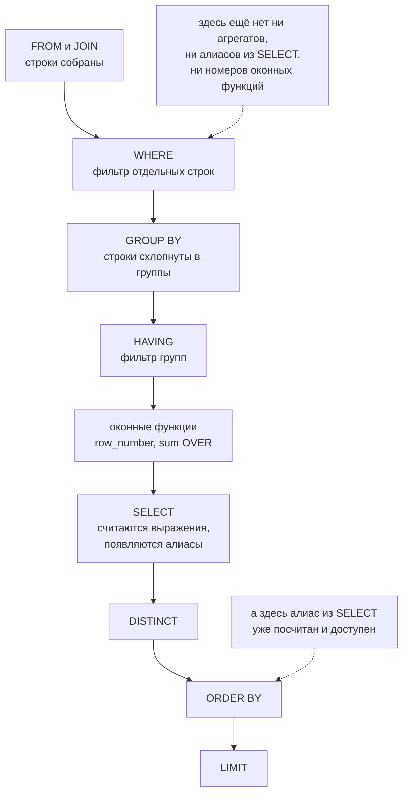

# SQL: тренировка

> **Зачем эта глава.** SQL-секция на MLE-собесе выглядит безобидно: «посчитайте retention»,
> «найдите топ-3 в каждой категории». Проваливаются на ней не потому, что не знают синтаксис,
> а потому что не замечают, как джойн размножил строки, как `NULL` съел половину выборки
> и как «скользящее среднее» посчиталось не по дням, а по строкам. Здесь — 27 задач с полными
> решениями, разбором и той самой типичной ошибкой, ради которой задачу и дают.

**Уровень:** 🌱 база → 🎯 middle → 🧠 middle+
**Предварительно нужно:** [SQL для MLE](../08-big-data/02-sql-for-mle.md) — джойны, оконные функции, план запроса
**Как проработать:** сначала решить самому, потом сверяться

> **О диалекте.** Все решения написаны на **PostgreSQL 16**. Там, где ClickHouse, Spark SQL,
> BigQuery или Hive ведут себя иначе, это отмечено явно — на собесе почти всегда разрешают
> писать «на любом диалекте», но знать различия полезно: это отдельный сигнал.

---

## Карта главы

- [1. Как устроена SQL-секция](#1-как-устроена-sql-секция) — что реально оценивают и в каком порядке отвечать
- [2. Учебная схема](#2-учебная-схема) — одна схема на все 27 задач
- [3. Блок A. Агрегаты](#3-блок-a-агрегаты) — задачи 1–4
- [4. Блок B. Джойны и ловушка дублирования](#4-блок-b-джойны-и-ловушка-дублирования) — задачи 5–8
- [5. Блок C. NULL-семантика](#5-блок-c-null-семантика) — задачи 9–11
- [6. Блок D. Подзапросы против CTE](#6-блок-d-подзапросы-против-cte) — задачи 12–13
- [7. Блок E. Оконные функции](#7-блок-e-оконные-функции) — задачи 14–19
- [8. Блок F. Сессионизация](#8-блок-f-сессионизация) — задача 20
- [9. Блок G. Воронки](#9-блок-g-воронки) — задача 21
- [10. Блок H. Когорты и retention](#10-блок-h-когорты-и-retention) — задачи 22–23
- [11. Блок I. Метрики A/B из сырых логов](#11-блок-i-метрики-ab-из-сырых-логов) — задачи 24–25
- [12. Блок J. Дубликаты и разрывы](#12-блок-j-дубликаты-и-разрывы) — задачи 26–27
- [13. Подводные камни](#13-подводные-камни)
- [14. Проверь себя](#14-проверь-себя)
- [15. Практика](#15-практика)
- [16. Что читать дальше](#16-что-читать-дальше)

---

## 1. Как устроена SQL-секция

Секция длится 20–40 минут и содержит 2–4 задачи по нарастанию. Первая — разминочная
(агрегат с фильтром), последняя — «настоящая» (сессионизация, воронка, retention).
Часто задачи связаны: одна и та же схема, каждая следующая опирается на предыдущую.

Что оценивают, в порядке веса:

| Что оценивают | Как это видно | Вес |
|---|---|---|
| **Понимание зерна таблицы** | вы спрашиваете «одна строка — это что?» до того, как писать джойн | очень высокий |
| **Корректность на краях** | вы думаете про `NULL`, дубли, границы интервалов, пустые группы | очень высокий |
| **Оконные функции** | вы применяете их там, где кандидат послабее пишет self-join | высокий |
| **Читаемость** | CTE с говорящими именами вместо трёхэтажного вложенного запроса | средний |
| **Производительность** | вы понимаете, что `count(distinct)` и `order by` в окне — это сортировка | средний |
| **Знание экзотики** | `LATERAL`, `GROUPING SETS`, `QUALIFY` | низкий |

**Протокол ответа, который работает.** Он же — то, чего ждёт интервьюер:

1. **Уточнить зерно и ключи.** «В `orders` одна строка — один заказ, `order_id` уникален?
   В `order_items` — одна позиция? Дубли в логах возможны?»
2. **Уточнить семантику метрики.** «Выручка — это `total_amount` оплаченных заказов или сумма
   позиций? Возвраты вычитаем? Часовой пояс какой?»
3. **Проговорить план вслух** до первой строки кода: «Сначала схлопну позиции до заказа,
   потом присоединю пользователей, потом сгруппирую по дню».
4. **Написать запрос сверху вниз через CTE**, называя шаги словами.
5. **Самому назвать краевые случаи**: что будет с пользователем без заказов, что с `NULL`
   в ключе, что с двумя заказами в одну секунду.

Пятый пункт стоит больше, чем идеальный синтаксис. Кандидат, который сам говорит
«здесь `LEFT JOIN` с условием в `WHERE` превратился бы в `INNER`, поэтому условие я вынес в `ON`»,
закрывает половину секции одной фразой.

> 💬 **На собеседовании.** Спросят: «С чего начнёте, увидев схему?» Хороший ответ: с вопроса
> о зерне и уникальности ключей в каждой таблице, потому что 90% ошибок в аналитическом SQL —
> это молчаливое размножение строк при джойне таблиц разного зерна. Плохой ответ:
> сразу начать писать `SELECT` — интервьюер поставит вам ловушку на дубли, и вы в неё попадёте.

---

## 2. Учебная схема

Все задачи главы решаются на одной схеме. Это удобно: вы один раз загружаете её в голову
(или в локальный Postgres) и дальше думаете только о задаче.

```sql
-- Пользователи. Зерно: один пользователь = одна строка.
CREATE TABLE users (
    user_id    bigint PRIMARY KEY,
    signup_ts  timestamp NOT NULL,   -- момент регистрации, UTC
    country    text,                 -- NULL, если профиль не заполнен
    platform   text                  -- 'ios' | 'android' | 'web'
);

-- Сырой поток продуктовых событий. Зерно: одно событие = одна строка.
-- Самая большая таблица: миллиарды строк, партиционирована по дате.
CREATE TABLE events (
    event_id   bigint,
    user_id    bigint NOT NULL,
    event_ts   timestamp NOT NULL,
    event_type text NOT NULL,        -- 'app_open','search','view_item','add_to_cart','purchase'
    item_id    bigint,               -- NULL для событий без товара (app_open, search)
    order_id   bigint                -- NULL везде, кроме 'purchase'
);

-- Заказы. Зерно: один заказ = одна строка.
CREATE TABLE orders (
    order_id     bigint PRIMARY KEY,
    user_id      bigint NOT NULL,
    created_ts   timestamp NOT NULL,
    status       text NOT NULL,      -- 'created','paid','cancelled','refunded'
    total_amount numeric(12,2)       -- итог заказа; NULL для битых записей из legacy-импорта
);

-- Позиции заказа. Зерно: одна позиция = одна строка. Один заказ → N строк.
CREATE TABLE order_items (
    order_id bigint NOT NULL,
    item_id  bigint NOT NULL,
    qty      int    NOT NULL,
    price    numeric(12,2) NOT NULL  -- цена за единицу в момент заказа
);

-- Каталог. Зерно: один товар = одна строка.
CREATE TABLE items (
    item_id  bigint PRIMARY KEY,
    category text NOT NULL,
    brand    text,
    price    numeric(12,2)           -- ТЕКУЩАЯ цена, не историческая
);

-- История цен (SCD type 2). Зерно: один интервал действия цены товара.
CREATE TABLE price_history (
    item_id    bigint NOT NULL,
    price      numeric(12,2) NOT NULL,
    valid_from timestamp NOT NULL,
    valid_to   timestamp NOT NULL     -- полуинтервал [valid_from, valid_to)
);

-- Раскатка эксперимента. Зерно: один пользователь в одном эксперименте.
CREATE TABLE ab_assignment (
    experiment  text   NOT NULL,
    user_id     bigint NOT NULL,
    variant     text   NOT NULL,      -- 'control' | 'treatment'
    assigned_ts timestamp NOT NULL    -- момент первого попадания в эксперимент
);
```

Обратите внимание на три вещи, заложенные в схему намеренно: `events.item_id` бывает `NULL`,
`orders.total_amount` бывает `NULL`, а `items.price` — текущая цена, а не цена на момент покупки.
Это не придирки автора: ровно так выглядят реальные витрины, и ровно на этом строятся
задачи-ловушки.

---

## 3. Блок A. Агрегаты

### Задача 1. Выручка и число заказов по дням

**Постановка.** За последние 30 дней вывести по каждому дню число оплаченных заказов и выручку.
Дни без заказов можно пропустить.

**Решение.**

```sql
SELECT
    created_ts::date            AS d,
    count(*)                    AS orders_cnt,
    sum(total_amount)           AS revenue
FROM orders
WHERE status = 'paid'
  AND created_ts >= current_date - INTERVAL '30 day'
GROUP BY 1
ORDER BY 1;
```

**Объяснение.** Фильтр стоит в `WHERE` — то есть строки отсекаются **до** группировки, и агрегат
считается уже по нужному подмножеству. `GROUP BY 1` — ссылка на первое выражение в `SELECT`;
это стандартный приём в аналитике, чтобы не дублировать длинное выражение. Условие
`created_ts >= current_date - INTERVAL '30 day'` записано так, чтобы индекс по `created_ts`
мог быть использован: слева от сравнения стоит голая колонка. Если написать
`WHERE date_trunc('day', created_ts) >= ...`, функция «оборачивает» колонку, и обычный B-tree
индекс становится неприменим — понадобится индекс по выражению.

**Типичная ошибка.** Написать `count(total_amount)` вместо `count(*)`. Первое считает строки,
где `total_amount IS NOT NULL`, и у нас (в схеме есть битые записи) молча занизит число заказов.
Правило: `count(*)` — «сколько строк», `count(col)` — «сколько непустых значений в колонке»,
и это разные вопросы.

---

### Задача 2. Средний чек по платформам, только по «крупным» платформам

**Постановка.** Средний и медианный чек оплаченных заказов в разрезе платформы пользователя.
Показывать только платформы, где не меньше 100 оплаченных заказов.

**Решение.**

```sql
SELECT
    u.platform,
    count(*)                AS orders_cnt,
    avg(o.total_amount)     AS avg_check,
    -- медиана: на выручке хвост тяжёлый, среднее уезжает за одним корпоративным заказом
    percentile_cont(0.5) WITHIN GROUP (ORDER BY o.total_amount) AS median_check
FROM orders o
JOIN users u USING (user_id)
WHERE o.status = 'paid'
GROUP BY u.platform
HAVING count(*) >= 100
ORDER BY avg_check DESC;
```

**Объяснение.** `WHERE` фильтрует **строки** до группировки, `HAVING` — **группы** после.
Условие `count(*) >= 100` физически невозможно проверить до группировки, поэтому ему место
только в `HAVING`. Обратно: `status = 'paid'` можно было бы записать и как
`HAVING count(*) FILTER (WHERE status='paid') >= 100`, но тогда база протащила бы через
группировку все строки — дороже без всякой пользы.

Это правило — не отдельный факт, а следствие логического порядка обработки запроса;
на схеме он целиком, а сбоку отмечено, что уже существует на двух ключевых шагах.



Вывод, ради которого схема: три вопроса, которые задают отдельно, — почему агрегат нельзя
в `WHERE`, почему алиас из `SELECT` не виден в `WHERE`, но виден в `ORDER BY`, и почему
`row_number()` нельзя отфильтровать без обёртки в CTE — это один и тот же ответ, прочитанный
на схеме сверху вниз.

`percentile_cont` — агрегат упорядоченного множества, синтаксис `WITHIN GROUP (ORDER BY ...)`.
В ClickHouse это `quantile(0.5)(x)`, в Spark SQL — `percentile_approx(x, 0.5)`.
На больших данных точная медиана требует сортировки всей группы, поэтому в проде почти всегда
берут приближённую.

> ⚠️ **Типичная ошибка.** Положить `count(*) >= 100` в `WHERE` — база ответит
> «aggregate functions are not allowed in WHERE». Обратная ошибка тоньше: положить в `HAVING`
> обычный фильтр по строке. Работать будет, но запрос замедлится, а на некоторых движках
> (Hive старых версий) — ещё и посчитает не то.

---

### Задача 3. Доля отменённых заказов по дням

**Постановка.** По каждому дню: всего заказов, из них отменённых, доля отменённых.
Одним проходом по таблице, без подзапросов и джойнов.

**Решение.**

```sql
SELECT
    created_ts::date                                  AS d,
    count(*)                                          AS total,
    count(*) FILTER (WHERE status = 'cancelled')      AS cancelled,
    -- доля: приводим булево к int и берём среднее — это и есть доля единиц
    avg((status = 'cancelled')::int)                  AS cancel_rate
FROM orders
GROUP BY 1
ORDER BY 1;
```

Портируемый вариант того же самого (работает везде, включая Hive и старый MySQL):

```sql
SELECT
    created_ts::date AS d,
    count(*) AS total,
    sum(CASE WHEN status = 'cancelled' THEN 1 ELSE 0 END) AS cancelled,
    avg(CASE WHEN status = 'cancelled' THEN 1.0 ELSE 0.0 END) AS cancel_rate
FROM orders
GROUP BY 1;
```

**Объяснение.** Приём называется **условная агрегация** (conditional aggregation): вместо того
чтобы делать отдельный запрос на каждое подмножество и джойнить результаты, мы считаем все
подмножества за один проход. Это основной рабочий инструмент аналитического SQL —
воронки, A/B-метрики и когорты в 90% случаев строятся именно так.

**Типичная ошибка** — та самая, ради которой задачу и дают:

```sql
-- НЕВЕРНО: считает ВСЕ строки, потому что 0 — это не NULL
count(CASE WHEN status = 'cancelled' THEN 1 ELSE 0 END)
```

`count(expr)` игнорирует только `NULL`. Ноль — вполне себе значение, и оно посчитается.
Верных вариантов два: `sum(CASE ... THEN 1 ELSE 0 END)` или `count(CASE ... THEN 1 END)`
(без `ELSE`, тогда в остальных случаях `NULL`).

> 💬 **На собеседовании.** Это самый частый разминочный вопрос всей секции:
> «Чем отличаются `count(*)`, `count(col)`, `count(distinct col)` и `count(case when ... then 1 else 0 end)`?»
> Хороший ответ: `count(*)` — число строк; `count(col)` — число строк, где `col IS NOT NULL`;
> `count(distinct col)` — число различных непустых значений, и это дорогая операция,
> требующая хеш-таблицы или сортировки; последняя конструкция — ловушка, она равна `count(*)`,
> потому что `0` не является `NULL`. Плохой ответ: «ну, они все считают количество».

---

### Задача 4. DAU и уникальные покупатели

**Постановка.** За последние 7 дней по каждому дню: число событий, DAU (уникальные пользователи),
число уникальных покупателей.

**Решение.**

```sql
SELECT
    event_ts::date                                                   AS d,
    count(*)                                                         AS events_cnt,
    count(DISTINCT user_id)                                          AS dau,
    count(DISTINCT user_id) FILTER (WHERE event_type = 'purchase')   AS buyers
FROM events
WHERE event_ts >= current_date - INTERVAL '7 day'
GROUP BY 1
ORDER BY 1;
```

**Объяснение.** `count(DISTINCT ...) FILTER (...)` — комбинация, которую многие не знают, а она
экономит целый джойн. В диалектах без `FILTER` пишут
`count(DISTINCT CASE WHEN event_type='purchase' THEN user_id END)` — обратите внимание, здесь
`ELSE` не нужен, потому что `NULL` как раз и должен выпасть из подсчёта.

**Про стоимость.** `count(DISTINCT)` — это не «чуть дороже», это принципиально другая операция:
движку нужно удержать множество уникальных значений. На миллиарде событий в день это гигабайты
памяти и вероятный spill на диск. В проде для таких метрик используют приближённые счётчики
на HyperLogLog: `uniqHLL12` в ClickHouse, `approx_count_distinct` в Spark и BigQuery,
`APPROX_COUNT_DISTINCT` в Snowflake. Ошибка порядка 0.5–2%, память — килобайты.
Упомянуть это на собесе — плюс балл, даже если задачу просили решить точно.

**Типичная ошибка.** Считать DAU как `count(distinct user_id)` по таблице `events` **без**
фильтра по типам событий, когда в поток пишутся ещё и технические события (heartbeat,
push_delivered). Тогда «активным» окажется пользователь, который приложение не открывал.
Всегда уточняйте, что считается активностью.

---

## 4. Блок B. Джойны и ловушка дублирования

Прежде чем задачи — короткая таблица, к которой стоит возвращаться.

| Тип | Что оставляет | Когда нужен |
|---|---|---|
| `INNER JOIN` | только совпавшие пары | обогащение, когда отсутствие справочника = брак данных |
| `LEFT JOIN` | все строки левой + совпавшие правой (иначе `NULL`) | обогащение, когда отсутствие нормально (пользователь без заказов) |
| `RIGHT JOIN` | зеркало `LEFT` | почти никогда: переставьте таблицы и напишите `LEFT`, читается лучше |
| `FULL OUTER JOIN` | всё с обеих сторон | сверка двух источников, поиск расхождений |
| `CROSS JOIN` | декартово произведение | построение календаря, сетки «все пользователи × все дни» |
| `LATERAL` / `CROSS APPLY` | подзапрос, зависящий от текущей строки левой таблицы | «топ-3 заказа каждого пользователя» без оконных функций |
| `SEMI` / `ANTI` (`EXISTS`/`NOT EXISTS`) | строки левой, у которых есть/нет пары — **без размножения** | проверка наличия связи |

Последняя строка — ключевая. `SEMI JOIN` отличается от `INNER JOIN` тем, что не размножает
левые строки, даже если справа нашлось десять совпадений. В SQL он выражается через `EXISTS`.

### Задача 5. Пользователи без единого заказа

**Постановка.** Найти пользователей, которые зарегистрировались, но не сделали ни одного заказа.

**Решение (три способа).**

```sql
-- 1. Антиджойн «руками»: LEFT JOIN + проверка на NULL
SELECT u.user_id
FROM users u
LEFT JOIN orders o ON o.user_id = u.user_id
WHERE o.order_id IS NULL;

-- 2. NOT EXISTS — обычно читается лучше и исполняется не медленнее
SELECT u.user_id
FROM users u
WHERE NOT EXISTS (SELECT 1 FROM orders o WHERE o.user_id = u.user_id);

-- 3. EXCEPT — если нужен только сам ключ
SELECT user_id FROM users
EXCEPT
SELECT user_id FROM orders;
```

**Объяснение.** Во втором варианте планировщик Postgres строит физический **anti join** и
останавливается на первом найденном совпадении — ему не нужно материализовать все заказы
пользователя. В первом варианте формально сначала делается полный `LEFT JOIN` (то есть строки
размножаются), а потом фильтруются — планировщик обычно тоже сворачивает это в anti join,
но не всегда, особенно если условие сложнее.

Проверка `WHERE o.order_id IS NULL` обязана ссылаться на колонку, которая в правой таблице
**не бывает `NULL` сама по себе** — иначе вы отфильтруете и настоящие совпадения. `order_id` —
первичный ключ, он подходит. Проверять по `o.total_amount IS NULL` было бы ошибкой.

**Типичная ошибка.** Написать `NOT IN`:

```sql
-- ОПАСНО, если в подзапросе встретится NULL
SELECT user_id FROM users WHERE user_id NOT IN (SELECT user_id FROM orders);
```

Здесь спасает `NOT NULL` на `orders.user_id`. Уберите его — и запрос вернёт пустой результат.
Подробный разбор — в задаче 9.

---

### Задача 6. Ловушка дублирования: выручка удвоилась

**Постановка.** По каждому пользователю посчитать сумму его оплаченных заказов и суммарное
число купленных единиц товара.

**Наивное решение, которое даёт неверный ответ:**

```sql
-- НЕВЕРНО
SELECT
    o.user_id,
    sum(o.total_amount) AS revenue,   -- завышено в разы!
    sum(oi.qty)         AS units
FROM orders o
JOIN order_items oi USING (order_id)
WHERE o.status = 'paid'
GROUP BY o.user_id;
```

**Почему неверно.** Зерно `orders` — заказ, зерно `order_items` — позиция. После джойна
зерно результата — позиция, и `total_amount` заказа продублировался столько раз, сколько
в заказе позиций. Заказ на 5000 ₽ из трёх позиций даст в сумму 15 000 ₽. Это называется
**fan-out**, и это самая дорогая ошибка аналитического SQL: она не падает, не выдаёт
предупреждения, а просто тихо врёт в отчёте.

**Правильное решение — свести таблицы к одному зерну до джойна:**

```sql
WITH items_per_order AS (
    -- схлопываем позиции до уровня заказа: теперь зерно = заказ, как в orders
    SELECT
        order_id,
        sum(qty)                AS units,
        count(*)                AS positions,
        sum(qty * price)        AS items_amount
    FROM order_items
    GROUP BY order_id
)
SELECT
    o.user_id,
    sum(o.total_amount)              AS revenue,
    sum(coalesce(i.units, 0))        AS units,
    -- контроль: расхождение суммы позиций и итога заказа = скидки, доставка или битые данные
    sum(o.total_amount) - sum(coalesce(i.items_amount, 0)) AS amount_diff
FROM orders o
LEFT JOIN items_per_order i USING (order_id)
WHERE o.status = 'paid'
GROUP BY o.user_id;
```

**Альтернатива без CTE** — считать каждую метрику в своей «плоскости»:

```sql
SELECT
    o.user_id,
    sum(o.total_amount)                    AS revenue,
    (SELECT sum(oi.qty)
       FROM order_items oi
      WHERE oi.order_id IN (SELECT order_id FROM orders o2
                             WHERE o2.user_id = o.user_id AND o2.status='paid')) AS units
FROM orders o
WHERE o.status = 'paid'
GROUP BY o.user_id;
```

Работать будет, но коррелированный подзапрос выполняется для каждой группы — на больших данных
это на порядки медленнее. Показывайте первый вариант.

**Диагностический приём, который стоит проговорить вслух.** После любого джойна сравните
число строк до и после:

```sql
SELECT
    (SELECT count(*) FROM orders WHERE status='paid')                     AS before_join,
    (SELECT count(*) FROM orders o JOIN order_items oi USING (order_id)
      WHERE o.status='paid')                                             AS after_join;
```

Если `after > before` — джойн размножил строки, и все агрегаты по левой таблице теперь неверны.

> 💬 **На собеседовании.** Спросят: «Вы сделали джойн, и выручка выросла втрое. Что случилось?»
> Хороший ответ: таблицы разного зерна, правая сторона содержит несколько строк на ключ,
> джойн размножил левые строки, и `sum` по левой колонке посчитал одно и то же значение
> несколько раз. Лечение: агрегировать правую таблицу до нужного зерна в CTE перед джойном,
> либо использовать `EXISTS`, если от правой таблицы нужен только факт наличия связи.
> Диагностика: сравнить `count(*)` до и после джойна. Плохой ответ: «наверное, дубли в данных,
> добавлю `DISTINCT`» — `SELECT DISTINCT` поверх джойна схлопнет и легитимно одинаковые строки,
> и правильного ответа вы всё равно не получите.

---

### Задача 7. Цена на момент покупки (as-of join)

**Постановка.** Для каждой позиции заказа вывести цену, действовавшую на момент создания заказа,
по таблице `price_history`.

**Решение.**

```sql
SELECT
    oi.order_id,
    oi.item_id,
    oi.price          AS price_in_order,
    ph.price          AS price_from_history
FROM order_items oi
JOIN orders o USING (order_id)
JOIN price_history ph
      ON  ph.item_id = oi.item_id
      AND o.created_ts >= ph.valid_from
      AND o.created_ts <  ph.valid_to;     -- строго меньше: полуинтервал [from, to)
```

**Объяснение.** Это **джойн по диапазону** (range join), он же as-of join. Условие соединения —
не равенство, а попадание точки во временной интервал. Ключевая деталь — **полуинтервал**:
`>= valid_from AND < valid_to`. Если интервалы записаны так, что `valid_to` одной строки равен
`valid_from` следующей (обычное соглашение), то `BETWEEN` (который включает обе границы)
даст **две** строки для момента ровно на стыке — и вы снова получите fan-out.

Если в истории цен есть пересекающиеся интервалы (а они бывают: кривые загрузки, ретро-правки),
детерминированный вариант — взять последнюю подходящую запись:

```sql
SELECT DISTINCT ON (oi.order_id, oi.item_id)
       oi.order_id, oi.item_id, ph.price
FROM order_items oi
JOIN orders o USING (order_id)
JOIN price_history ph
      ON ph.item_id = oi.item_id AND o.created_ts >= ph.valid_from
ORDER BY oi.order_id, oi.item_id, ph.valid_from DESC;
```

`DISTINCT ON` — расширение PostgreSQL: оставляет первую строку в каждой группе по указанному
списку, порядок задаётся `ORDER BY`, начинающимся с тех же колонок. В других диалектах то же
делается через `row_number() OVER (PARTITION BY ... ORDER BY ...) = 1`.

**Зачем это MLE.** Ровно эта конструкция обеспечивает **point-in-time correctness** при сборке
обучающей выборки: значение признака должно браться на момент события, а не текущее. Джойн
с `items.price` (текущая цена) вместо `price_history` — классическая утечка из будущего.
См. [данные и feature store](../07-mlops/03-data-and-feature-store.md).

**Типичная ошибка.** Использовать `BETWEEN valid_from AND valid_to` и получить удвоение строк
на границах интервалов. Вторая по частоте — забыть, что `price_history` может не покрывать
какие-то моменты (дыры в истории), и потерять строки из-за `INNER JOIN`; если товар должен
остаться в любом случае, нужен `LEFT JOIN` и `coalesce`.

---

### Задача 8. Сверка двух источников

**Постановка.** Есть суточная витрина `orders` и сырые логи `events` с событиями `purchase`.
Найти дни, где число покупок расходится, включая дни, которые есть только в одном источнике.

**Решение.**

```sql
WITH from_orders AS (
    SELECT created_ts::date AS d, count(*) AS cnt
    FROM orders
    WHERE status = 'paid'
    GROUP BY 1
),
from_events AS (
    SELECT event_ts::date AS d, count(DISTINCT order_id) AS cnt
    FROM events
    WHERE event_type = 'purchase'
    GROUP BY 1
)
SELECT
    coalesce(o.d, e.d)              AS d,
    o.cnt                           AS cnt_orders,
    e.cnt                           AS cnt_events,
    coalesce(o.cnt, 0) - coalesce(e.cnt, 0) AS diff
FROM from_orders o
FULL OUTER JOIN from_events e ON e.d = o.d
WHERE o.cnt IS DISTINCT FROM e.cnt      -- NULL-безопасное «не равно»
ORDER BY 1;
```

**Объяснение.** `FULL OUTER JOIN` — единственный способ увидеть строки, которых нет в одной
из сторон. Отсюда два следствия, которые надо помнить:

1. Ключ в `SELECT` берём через `coalesce(o.d, e.d)` — иначе для дней, которых нет слева,
   `o.d` будет `NULL`.
2. Сравнение `o.cnt <> e.cnt` **не сработает**, когда одна из сторон `NULL`: результат будет
   `UNKNOWN`, строка не пройдёт фильтр, и вы потеряете именно те дни, которые искали.
   Правильный оператор — `IS DISTINCT FROM`: он возвращает `TRUE`, если значения различаются,
   считая при этом `NULL` обычным значением. В диалектах без него пишут
   `coalesce(o.cnt,-1) <> coalesce(e.cnt,-1)` — уродливо, но работает.

**Типичная ошибка.** Написать `WHERE o.cnt <> e.cnt` и радостно отчитаться, что расхождений нет,
хотя в одном источнике вообще нет половины дней.

---

## 5. Блок C. NULL-семантика

`NULL` в SQL — это не «пусто» и не «ноль». Это «значение неизвестно», и логика становится
**трёхзначной**: `TRUE`, `FALSE`, `UNKNOWN`. Правила, которые надо помнить наизусть:

| Выражение | Результат |
|---|---|
| `NULL = NULL` | `UNKNOWN` (не `TRUE`!) |
| `NULL <> 5` | `UNKNOWN` |
| `NULL IS NULL` | `TRUE` |
| `NULL IS NOT DISTINCT FROM NULL` | `TRUE` |
| `TRUE OR UNKNOWN` | `TRUE` |
| `FALSE OR UNKNOWN` | `UNKNOWN` |
| `FALSE AND UNKNOWN` | `FALSE` |
| `WHERE <UNKNOWN>` | строка **не** попадает в результат |
| `sum(x)` по пустому множеству | `NULL` (не `0`!) |
| `avg(x)` | игнорирует `NULL` в знаменателе тоже |
| `GROUP BY` | все `NULL` попадают в **одну** группу |
| `ORDER BY` | в Postgres `NULL` по умолчанию последние при `ASC` |
| `x = ANY(...)` при `NULL` внутри | может дать `UNKNOWN` |

### Задача 9. Товары, которые ни разу не покупали

**Постановка.** Найти товары из каталога, по которым нет ни одного события `purchase`.

**Ловушка:**

```sql
-- НЕВЕРНО: вернёт ПУСТОЙ результат
SELECT item_id
FROM items
WHERE item_id NOT IN (SELECT item_id FROM events WHERE event_type = 'purchase');
```

**Почему.** `events.item_id` объявлен nullable, и в потоке покупок вполне может встретиться
строка с `NULL` (например, покупка подписки без товара). Выражение
`x NOT IN (a, b, NULL)` разворачивается в

```
NOT (x = a OR x = b OR x = NULL)
= NOT (FALSE OR FALSE OR UNKNOWN)
= NOT UNKNOWN
= UNKNOWN
```

а `UNKNOWN` в `WHERE` означает «строку не берём». Одного-единственного `NULL` в подзапросе
достаточно, чтобы весь запрос вернул ноль строк.

**Правильные решения:**

```sql
-- 1. NOT EXISTS: NULL-безопасно по построению, коррелированное условие даёт UNKNOWN только внутри
SELECT i.item_id
FROM items i
WHERE NOT EXISTS (
    SELECT 1 FROM events e
    WHERE e.event_type = 'purchase' AND e.item_id = i.item_id
);

-- 2. NOT IN с явной защитой
SELECT item_id
FROM items
WHERE item_id NOT IN (
    SELECT item_id FROM events
    WHERE event_type = 'purchase' AND item_id IS NOT NULL
);

-- 3. Антиджойн
SELECT i.item_id
FROM items i
LEFT JOIN (SELECT DISTINCT item_id FROM events WHERE event_type='purchase') p
       ON p.item_id = i.item_id
WHERE p.item_id IS NULL;
```

> 💬 **На собеседовании.** Спросят: «В чём разница между `NOT IN` и `NOT EXISTS`?»
> Хороший ответ: в поведении при `NULL`. `NOT EXISTS` — это антиджойн: он проверяет наличие
> хотя бы одной строки и корректно работает при любых `NULL`. `NOT IN` разворачивается в цепочку
> сравнений через `OR`, и один `NULL` в списке превращает результат в `UNKNOWN` для **всех**
> строк — запрос молча возвращает пустоту. Дополнительно: планировщик почти всегда строит для
> `NOT EXISTS` эффективный anti join, а для `NOT IN` при nullable-колонке вынужден выбирать
> более дорогой план, потому что не может применить ту же оптимизацию.
> Плохой ответ: «это одно и то же, просто разный синтаксис».

---

### Задача 10. Выручка по всем пользователям, включая непокупавших

**Постановка.** За июль 2026 вывести для **каждого** зарегистрированного пользователя его выручку.
У тех, кто ничего не купил, должен быть `0`, а не пропуск строки и не `NULL`.

**Решение.**

```sql
SELECT
    u.user_id,
    -- sum() по пустому множеству возвращает NULL, а не 0 — отсюда coalesce
    coalesce(sum(o.total_amount), 0) AS revenue_july
FROM users u
LEFT JOIN orders o
       ON  o.user_id    = u.user_id
       AND o.status     = 'paid'                     -- условие на ПРАВУЮ таблицу — в ON!
       AND o.created_ts >= DATE '2026-07-01'
       AND o.created_ts <  DATE '2026-08-01'
GROUP BY u.user_id;
```

**Объяснение — самое важное в блоке.** Условия на правую таблицу `LEFT JOIN` должны стоять
в `ON`, а не в `WHERE`. Разница принципиальная:

- условие в `ON` применяется **до** дополнения несовпавших строк — пользователи без заказов
  остаются, у них просто `o.* IS NULL`;
- условие в `WHERE` применяется **после** — и для пользователей без заказов `o.status` равен
  `NULL`, сравнение `NULL = 'paid'` даёт `UNKNOWN`, строка отбрасывается. `LEFT JOIN` тихо
  превращается в `INNER JOIN`.

Проверьте себя: если написать `WHERE o.status = 'paid'`, из результата исчезнут ровно те
пользователи, ради которых задача и ставилась.

Исключение из правила: `WHERE o.order_id IS NULL` (задача 5) — это как раз намеренная фильтрация
после джойна, и она должна быть в `WHERE`.

**Типичная ошибка** — вторая по популярности после fan-out: перенести фильтр из `ON` в `WHERE`
«для читаемости» и потерять половину выборки. Если сомневаетесь, спросите себя:
«это условие про то, какие правые строки присоединять, или про то, какие итоговые строки
оставить?» Первое — `ON`, второе — `WHERE`.

---

### Задача 11. Доля пользователей по странам с учётом незаполненных профилей

**Постановка.** Распределение пользователей по странам. Незаполненные профили (`country IS NULL`)
показать отдельной строкой `'unknown'`, доли считать от общего числа пользователей.

**Решение.**

```sql
SELECT
    coalesce(country, 'unknown')                        AS country,
    count(*)                                            AS users_cnt,
    count(country)                                      AS users_with_country,  -- диагностика
    round(100.0 * count(*) / sum(count(*)) OVER (), 2)  AS share_pct
FROM users
GROUP BY 1
ORDER BY users_cnt DESC;
```

**Объяснение.** Три детали:

1. `GROUP BY` **не теряет** `NULL`: все строки с `NULL` собираются в одну группу. Это отличает
   его от `WHERE` — но именно поэтому легко не заметить, что «страна» в отчёте — пустая ячейка.
   `coalesce` в `GROUP BY 1` делает эту группу видимой и явной.
2. `count(country)` в той же строке — бесплатная диагностика: для группы `'unknown'` он даст `0`.
3. `sum(count(*)) OVER ()` — оконная функция **поверх агрегата**. Оконные функции вычисляются
   после `GROUP BY`, поэтому `count(*)` для них — обычное значение строки. Пустая рамка `OVER ()`
   означает «по всему результату». Так считается доля от целого без второго прохода по таблице.
4. `100.0 * ...` (а не `100 * ...`): при целочисленном делении `count(*)/sum(...)` вы получите
   ноль. В Postgres `count` возвращает `bigint`, деление bigint на bigint — целочисленное.

**Типичная ошибка.** Посчитать доли как `count(*) / (SELECT count(*) FROM users)` — верно,
но это второй проход по таблице; и особенно — забыть про приведение к дробному типу.

---

## 6. Блок D. Подзапросы против CTE

### Задача 12. Последний заказ каждого пользователя

**Постановка.** Для каждого пользователя, у которого есть заказы: дата последнего заказа,
его сумма и статус.

**Решение 1 — оконная функция (рекомендуемое):**

```sql
WITH ranked AS (
    SELECT
        user_id, order_id, created_ts, status, total_amount,
        row_number() OVER (
            PARTITION BY user_id
            ORDER BY created_ts DESC, order_id DESC   -- tie-breaker: детерминизм при равных ts
        ) AS rn
    FROM orders
)
SELECT user_id, order_id, created_ts, status, total_amount
FROM ranked
WHERE rn = 1;
```

**Решение 2 — коррелированный подзапрос:**

```sql
SELECT o.user_id, o.order_id, o.created_ts, o.status, o.total_amount
FROM orders o
WHERE o.created_ts = (
    SELECT max(o2.created_ts) FROM orders o2 WHERE o2.user_id = o.user_id
);
```

**Решение 3 — `DISTINCT ON` (только PostgreSQL):**

```sql
SELECT DISTINCT ON (user_id)
       user_id, order_id, created_ts, status, total_amount
FROM orders
ORDER BY user_id, created_ts DESC, order_id DESC;
```

**Объяснение и сравнение.**

| Способ | Плюс | Минус |
|---|---|---|
| Оконная функция | один проход, переносим между диалектами, легко расширить до топ-N | требует подзапроса: окно нельзя использовать в `WHERE` |
| Коррелированный подзапрос | понятен новичку | **вернёт две строки**, если у пользователя два заказа с одинаковым `created_ts`; на некоторых движках выполняется построчно |
| `DISTINCT ON` | короче всего | только Postgres |

Ключевая деталь, за которую дают балл: **tie-breaker в `ORDER BY`**. Без второй колонки при равных
временных метках порядок не определён, и запрос будет возвращать разные результаты между
запусками — а на распределённом движке ещё и между партициями. Всегда добавляйте уникальную
колонку последней.

**Про `WHERE` и окна.** Оконные функции вычисляются **после** `WHERE`, `GROUP BY` и `HAVING`,
но **до** `ORDER BY` и `LIMIT`. Поэтому `WHERE row_number() OVER (...) = 1` — синтаксическая
ошибка, и нужен подзапрос или CTE. В ClickHouse, BigQuery, Snowflake и Teradata есть сахар
`QUALIFY`, который делает это в одну строку:

```sql
-- ClickHouse / BigQuery / Snowflake
SELECT * FROM orders
QUALIFY row_number() OVER (PARTITION BY user_id ORDER BY created_ts DESC) = 1;
```

---

### Задача 13. CTE, материализация и когда подзапрос быстрее

**Постановка.** Посчитать средний чек по категориям товаров, используя только заказы
пользователей из России. Написать так, чтобы запрос читался сверху вниз.

**Решение.**

```sql
WITH ru_users AS (
    SELECT user_id FROM users WHERE country = 'RU'
),
paid_orders AS (
    SELECT o.order_id, o.total_amount
    FROM orders o
    JOIN ru_users ru USING (user_id)
    WHERE o.status = 'paid'
),
order_category AS (
    -- у заказа может быть несколько категорий; берём основную по максимальной сумме позиций
    SELECT DISTINCT ON (oi.order_id)
           oi.order_id, i.category
    FROM order_items oi
    JOIN items i USING (item_id)
    GROUP BY oi.order_id, i.category
    ORDER BY oi.order_id, sum(oi.qty * oi.price) DESC, i.category
)
SELECT
    oc.category,
    count(*)               AS orders_cnt,
    avg(po.total_amount)   AS avg_check
FROM paid_orders po
JOIN order_category oc USING (order_id)
GROUP BY oc.category
ORDER BY avg_check DESC;
```

**Объяснение.** CTE (`WITH`) — это именованные шаги. Их главная ценность не в производительности,
а в том, что запрос читается как последовательность преобразований, и каждый шаг можно отдельно
выполнить и проверить (замените финальный `SELECT` на `SELECT * FROM paid_orders LIMIT 10`).
На собесе это важно: интервьюер должен понимать вашу мысль по ходу.

**Что нужно знать про исполнение.** До PostgreSQL 12 каждый CTE был **барьером оптимизации**:
он материализовался целиком, и предикаты снаружи внутрь не проталкивались. С версии 12 CTE
по умолчанию **инлайнится** (если используется один раз и не содержит побочных эффектов),
и планировщик волен объединить его с остальным запросом. Управлять этим можно явно:

```sql
WITH heavy AS MATERIALIZED   ( ... )   -- посчитать один раз, переиспользовать
WITH light AS NOT MATERIALIZED ( ... ) -- всегда инлайнить
```

`MATERIALIZED` полезен, когда CTE используется несколько раз и его пересчёт дорог.
В Spark аналогичную роль играет `.cache()`/`persist`, в ClickHouse CTE всегда инлайнятся
(и потому дорогой CTE, использованный дважды, считается дважды — частая причина внезапного
замедления при переезде с Postgres).

**Когда подзапрос в `SELECT` (скалярный) допустим.** Только когда он возвращает одно значение
на весь запрос:

```sql
SELECT category, count(*) * 1.0 / (SELECT count(*) FROM items) AS share
FROM items GROUP BY category;
```

Здесь подзапрос выполнится один раз. А вот коррелированный скалярный подзапрос
(`(SELECT max(...) FROM t2 WHERE t2.id = t1.id)`) в `SELECT` выполняется концептуально
для каждой строки — на миллионе строк это катастрофа. Замена — джойн с предагрегатом
или оконная функция.

**Типичная ошибка.** Считать, что CTE «всегда быстрее подзапроса» или «всегда медленнее».
Правильный ответ: CTE — про читаемость; на исполнение он влияет по-разному в разных версиях
и движках, и это надо смотреть в плане (`EXPLAIN ANALYZE`).

---

## 7. Блок E. Оконные функции

Синтаксис целиком:

```sql
функция(аргументы) OVER (
    PARTITION BY <разбиение>     -- независимые «группы», расчёт внутри каждой
    ORDER BY   <порядок>         -- порядок внутри группы
    <ROWS|RANGE|GROUPS> BETWEEN <начало> AND <конец>   -- рамка (frame)
)
```

Ключевое отличие от `GROUP BY`: окно **не схлопывает** строки. Каждая строка остаётся,
и рядом с ней появляется значение, посчитанное по её окружению.

Три семейства функций:

| Семейство | Функции | Что делают |
|---|---|---|
| Ранжирующие | `row_number`, `rank`, `dense_rank`, `ntile`, `percent_rank` | нумеруют строки внутри партиции |
| Смещающие | `lag`, `lead`, `first_value`, `last_value`, `nth_value` | берут значение другой строки окна |
| Агрегатные | `sum`, `avg`, `count`, `min`, `max` с `OVER` | агрегат по рамке |

### Задача 14. Топ-3 товара по выручке в каждой категории

**Постановка.** Для каждой категории вывести три товара с наибольшей выручкой (по оплаченным
заказам) и их место в категории.

**Решение.**

```sql
WITH item_revenue AS (
    SELECT
        i.category,
        oi.item_id,
        sum(oi.qty * oi.price) AS revenue
    FROM order_items oi
    JOIN orders o USING (order_id)
    JOIN items  i USING (item_id)
    WHERE o.status = 'paid'
    GROUP BY i.category, oi.item_id
),
ranked AS (
    SELECT
        category, item_id, revenue,
        row_number() OVER (PARTITION BY category ORDER BY revenue DESC, item_id) AS rn,
        rank()       OVER (PARTITION BY category ORDER BY revenue DESC)          AS rnk,
        dense_rank() OVER (PARTITION BY category ORDER BY revenue DESC)          AS drnk
    FROM item_revenue
)
SELECT category, item_id, revenue, rn
FROM ranked
WHERE rn <= 3
ORDER BY category, rn;
```

**Объяснение — три функции ранжирования.** Пусть выручки в категории: 100, 100, 90, 80.

| revenue | `row_number` | `rank` | `dense_rank` |
|---|---|---|---|
| 100 | 1 | 1 | 1 |
| 100 | 2 | 1 | 1 |
| 90 | 3 | 3 | 2 |
| 80 | 4 | 4 | 3 |

- `row_number` — всегда уникальные номера, ничьи разрываются произвольно (или вашим tie-breaker);
- `rank` — при ничьей одинаковый ранг, следующий номер **пропускает** занятые места;
- `dense_rank` — при ничьей одинаковый ранг, следующий номер идёт подряд.

Выбор зависит от постановки. «Ровно три строки на категорию» → `row_number`. «Все товары
с тремя лучшими результатами, включая ничьи» → `dense_rank <= 3`. «Спортивная таблица»
(за двумя первыми местами идёт третье) → `rank`.

**Типичная ошибка.** Написать `WHERE row_number() OVER (...) <= 3` — так нельзя, окна считаются
позже `WHERE`. И — забыть tie-breaker в `ORDER BY` внутри окна: при одинаковой выручке
результат станет недетерминированным.

> 💬 **На собеседовании.** Спросят: «`RANK` или `DENSE_RANK` — в чём разница и когда что?»
> Хороший ответ: разница в поведении при одинаковых значениях — `rank` оставляет «дыры»
> в нумерации, `dense_rank` нет; и отдельно `row_number`, который вообще не признаёт ничьих.
> Дальше стоит сказать главное: **для задачи «топ-N в группе» почти всегда нужен `row_number`
> с явным tie-breaker**, иначе при ничьих вы получите не N строк и невоспроизводимый результат.
> Плохой ответ: перечислить определения и не сказать, как выбирать.

---

### Задача 15. Накопительная выручка

**Постановка.** По дням: выручка за день, накопительная выручка с начала истории и накопительная
выручка с начала текущего месяца.

**Решение.**

```sql
WITH daily AS (
    SELECT created_ts::date AS d, sum(total_amount) AS revenue
    FROM orders
    WHERE status = 'paid'
    GROUP BY 1
)
SELECT
    d,
    revenue,
    sum(revenue) OVER (
        ORDER BY d
        ROWS BETWEEN UNBOUNDED PRECEDING AND CURRENT ROW
    ) AS cum_total,
    sum(revenue) OVER (
        PARTITION BY date_trunc('month', d)     -- накопление обнуляется каждый месяц
        ORDER BY d
        ROWS BETWEEN UNBOUNDED PRECEDING AND CURRENT ROW
    ) AS cum_mtd
FROM daily
ORDER BY d;
```

**Объяснение.** `PARTITION BY date_trunc('month', d)` создаёт независимое окно на каждый месяц —
это и есть «month-to-date». Рамка `ROWS BETWEEN UNBOUNDED PRECEDING AND CURRENT ROW` означает
«все строки окна от начала до текущей включительно».

**Про рамку по умолчанию — это ловушка.** Если написать `sum(revenue) OVER (ORDER BY d)`
без явной рамки, подставится `RANGE BETWEEN UNBOUNDED PRECEDING AND CURRENT ROW`. Различие
между `ROWS` и `RANGE` проявляется при **одинаковых значениях в `ORDER BY`**: `RANGE` включает
в рамку все строки-«ровесники» (peers) текущей. Здесь `d` уникален после `GROUP BY`, поэтому
разницы нет. Но если бы мы считали накопление по сырым заказам, где в один день много строк,
`RANGE` дал бы всем заказам одного дня одинаковую накопительную сумму (итог на конец дня),
а `ROWS` — честное построчное накопление. Разные ответы, оба «правильные» — зависит от того,
что вы имели в виду. Пишите рамку явно.

---

### Задача 16. Прирост ко вчера и к прошлой неделе

**Постановка.** По дням вывести выручку, изменение к предыдущему дню (абсолютное и в процентах)
и изменение к тому же дню неделю назад.

**Решение.**

```sql
WITH daily AS (
    SELECT created_ts::date AS d, sum(total_amount) AS revenue
    FROM orders WHERE status = 'paid'
    GROUP BY 1
)
SELECT
    d,
    revenue,
    lag(revenue, 1) OVER (ORDER BY d)                       AS prev_day,
    revenue - lag(revenue, 1) OVER (ORDER BY d)             AS dod_abs,
    round(100.0 * (revenue - lag(revenue,1) OVER (ORDER BY d))
                / nullif(lag(revenue,1) OVER (ORDER BY d), 0), 2) AS dod_pct,
    lag(revenue, 7) OVER (ORDER BY d)                       AS week_ago,
    revenue - lag(revenue, 7) OVER (ORDER BY d)             AS wow_abs
FROM daily
ORDER BY d;
```

**Объяснение.** `lag(x, k)` берёт значение `x` из строки, отстоящей на `k` позиций назад
в порядке окна; `lead` — вперёд. Третий аргумент задаёт значение по умолчанию для первых строк:
`lag(revenue, 1, 0)` вернёт `0` вместо `NULL`.

`nullif(x, 0)` — защита от деления на ноль: превращает `0` в `NULL`, и всё выражение становится
`NULL` вместо ошибки. Это стандартный приём для любых процентных метрик (CTR, конверсия,
retention), и его отсутствие — частая причина падения ночного расчёта на дне, когда в знаменателе
случился ноль.

**Типичная ошибка, важная для аналитики.** `lag(revenue, 7)` берёт **седьмую строку назад**,
а не «дату минус 7 дней». Если в витрине есть дни без заказов (строк нет вообще), сдвиг на 7 строк
уедет на 8, 9 или 10 календарных дней, и «неделя к неделе» будет считаться не по неделям.
Надёжное решение — сначала построить полный календарь (см. задачу 27), либо джойнить по дате:

```sql
SELECT a.d, a.revenue, b.revenue AS week_ago
FROM daily a
LEFT JOIN daily b ON b.d = a.d - 7;
```

---

### Задача 17. Скользящее среднее за 7 дней

**Постановка.** Сгладить дневную выручку скользящим средним по 7 календарным дням, включая
текущий. Дни без заказов должны участвовать как нули.

**Решение (правильное — по календарю):**

```sql
WITH bounds AS (
    SELECT min(created_ts)::date AS d_min, max(created_ts)::date AS d_max
    FROM orders WHERE status = 'paid'
),
calendar AS (
    SELECT gs::date AS d
    FROM bounds, generate_series(bounds.d_min, bounds.d_max, INTERVAL '1 day') AS gs
),
daily AS (
    SELECT c.d, coalesce(sum(o.total_amount), 0) AS revenue
    FROM calendar c
    LEFT JOIN orders o
           ON o.created_ts::date = c.d AND o.status = 'paid'
    GROUP BY c.d
)
SELECT
    d,
    revenue,
    avg(revenue) OVER (ORDER BY d ROWS BETWEEN 6 PRECEDING AND CURRENT ROW) AS ma7,
    -- в первые 6 дней окно неполное: помечаем, чтобы не рисовать это на графике
    count(*)     OVER (ORDER BY d ROWS BETWEEN 6 PRECEDING AND CURRENT ROW) AS window_size
FROM daily
ORDER BY d;
```

**Вариант через `RANGE` по интервалу** (PostgreSQL 11+, работает даже с дырами в датах):

```sql
SELECT
    d,
    revenue,
    avg(revenue) OVER (
        ORDER BY d
        RANGE BETWEEN INTERVAL '6 day' PRECEDING AND CURRENT ROW
    ) AS ma7
FROM daily;
```

**Объяснение.** Это главная ловушка блока. `ROWS BETWEEN 6 PRECEDING AND CURRENT ROW` — это
«шесть предыдущих **строк**». Если 3 января заказов не было и строки за 3 января в витрине нет,
окно из семи строк накроет восемь календарных дней. `RANGE ... INTERVAL '6 day' PRECEDING`
считает по **значению** колонки порядка, то есть по календарю — дыры ему не мешают.

Второй момент: смысл «нулевого» дня. При `avg` по строкам отсутствующий день просто не попадает
в среднее (делим на 6, а не на 7) — среднее завышается. Достроив календарь и подставив `0`,
мы получаем честное среднее за 7 дней. Какой из вариантов правильный — вопрос к постановке,
и его стоит задать интервьюеру вслух.

Третий момент: колонка `window_size`. Первые шесть значений `ma7` посчитаны по неполному окну
и на графике выглядят как «плавный рост», которого не было. В продовых витринах такие точки
принято либо занулять, либо помечать.

---

### Задача 18. Доля категории в выручке дня

**Постановка.** По дням и категориям: выручка, доля категории в выручке этого дня и место
категории в этом дне.

**Решение.**

```sql
WITH daily_cat AS (
    SELECT
        o.created_ts::date AS d,
        i.category,
        sum(oi.qty * oi.price) AS revenue
    FROM orders o
    JOIN order_items oi USING (order_id)
    JOIN items       i  USING (item_id)
    WHERE o.status = 'paid'
    GROUP BY 1, 2
)
SELECT
    d,
    category,
    revenue,
    sum(revenue) OVER (PARTITION BY d)                                  AS day_revenue,
    round(100.0 * revenue / sum(revenue) OVER (PARTITION BY d), 2)      AS share_pct,
    rank() OVER (PARTITION BY d ORDER BY revenue DESC)                  AS place_in_day
FROM daily_cat
ORDER BY d, place_in_day;
```

**Объяснение.** `sum(revenue) OVER (PARTITION BY d)` **без `ORDER BY`** даёт сумму по всей
партиции — рамка по умолчанию в этом случае «вся партиция». Стоит добавить `ORDER BY` — и рамка
станет «от начала до текущей строки», то есть вы получите накопительную сумму вместо итога.
Это ещё одно проявление правила про рамку по умолчанию, и на нём ошибаются постоянно.

Здесь же обратите внимание: джойн `orders × order_items` даёт зерно «позиция», и мы намеренно
суммируем `qty * price` (величину уровня позиции), а не `total_amount` (величину уровня заказа).
Смешивать их в одном `SELECT` после такого джойна нельзя.

---

### Задача 19. Первое и последнее событие сессии пользователя

**Постановка.** Для каждого события пользователя вывести тип его самого первого и самого
последнего события за день.

**Решение.**

```sql
SELECT
    user_id,
    event_ts,
    event_type,
    first_value(event_type) OVER w AS first_event_of_day,
    last_value(event_type)  OVER w AS last_event_of_day
FROM events
WINDOW w AS (
    PARTITION BY user_id, event_ts::date
    ORDER BY event_ts
    ROWS BETWEEN UNBOUNDED PRECEDING AND UNBOUNDED FOLLOWING   -- без этого last_value врёт
)
ORDER BY user_id, event_ts;
```

**Объяснение.** Здесь два полезных приёма.

Первый — именованное окно через `WINDOW w AS (...)`. Когда одно и то же окно используется
несколько раз, это убирает копипасту и сокращает шанс опечатки.

Второй и главный — **рамка для `last_value`**. С `ORDER BY` и без явной рамки по умолчанию
действует `RANGE BETWEEN UNBOUNDED PRECEDING AND CURRENT ROW`, то есть окно заканчивается
на текущей строке — и `last_value` возвращает значение **текущей** строки, а не последней
в партиции. Запрос отработает, ошибки не будет, результат будет неверным. Нужно явно расширить
рамку до `UNBOUNDED FOLLOWING`.

`first_value` при рамке по умолчанию работает «правильно» случайно — потому что начало рамки
и так `UNBOUNDED PRECEDING`. Альтернатива без возни с рамками: `last_value(x) OVER (... ORDER BY ts)`
заменить на `first_value(x) OVER (... ORDER BY ts DESC)`.

> ⚠️ **Типичная ошибка.** `last_value(...) OVER (PARTITION BY ... ORDER BY ...)` без указания
> рамки — вернёт значение текущей строки. Это одна из самых коварных ошибок в SQL: код выглядит
> абсолютно правильно и молча возвращает мусор.

---

## 8. Блок F. Сессионизация

### Задача 20. Разбить события на сессии по таймауту 30 минут

**Постановка.** В `events` нет `session_id`. Считать, что новая сессия начинается, если между
соседними событиями пользователя прошло больше 30 минут. Вывести по каждой сессии: пользователя,
время начала и конца, длительность, число событий, была ли покупка.

**Решение.**

```sql
WITH with_prev AS (
    -- шаг 1: для каждого события — время предыдущего события ЭТОГО ЖЕ пользователя
    SELECT
        user_id,
        event_ts,
        event_type,
        lag(event_ts) OVER (PARTITION BY user_id ORDER BY event_ts) AS prev_ts
    FROM events
),
marked AS (
    -- шаг 2: флаг «здесь начинается новая сессия»
    SELECT
        user_id, event_ts, event_type,
        CASE
            WHEN prev_ts IS NULL                              THEN 1   -- первое событие вообще
            WHEN event_ts - prev_ts > INTERVAL '30 minute'    THEN 1   -- разрыв больше таймаута
            ELSE 0
        END AS is_session_start
    FROM with_prev
),
numbered AS (
    -- шаг 3: накопительная сумма флагов = порядковый номер сессии внутри пользователя
    SELECT
        user_id, event_ts, event_type,
        sum(is_session_start) OVER (
            PARTITION BY user_id ORDER BY event_ts
            ROWS BETWEEN UNBOUNDED PRECEDING AND CURRENT ROW
        ) AS session_no
    FROM marked
)
SELECT
    user_id,
    session_no,
    min(event_ts)                                        AS session_start,
    max(event_ts)                                        AS session_end,
    max(event_ts) - min(event_ts)                        AS duration,
    count(*)                                             AS events_cnt,
    count(*) FILTER (WHERE event_type = 'purchase') > 0  AS has_purchase
FROM numbered
GROUP BY user_id, session_no
ORDER BY user_id, session_no;
```

**Объяснение — приём, который надо уметь воспроизводить с закрытыми глазами.** Это классический
**gaps and islands**: «острова» — непрерывные последовательности, «разрывы» — промежутки между ними.
Схема из трёх шагов:

1. `lag` даёт расстояние до предыдущего события;
2. сравнение с порогом даёт бинарный флаг «начало нового острова»;
3. накопительная сумма флагов превращает флаги в **идентификатор острова**: она увеличивается
   ровно там, где начинается новая сессия, и постоянна внутри сессии.

Третий шаг — самая красивая идея в аналитическом SQL, и её стоит понять, а не запомнить:
кумулятивная сумма индикаторов «начала» и есть нумерация групп.

**Практические детали, за которые дают баллы.**

- **Порог 30 минут — соглашение, а не истина.** Google Analytics исторически использует 30 минут,
  но для музыкального сервиса это может быть 5 минут, а для тревел-агрегатора — сутки.
  Спросите, откуда взялось число, и скажите, как бы его подобрали: построить распределение
  межсобытийных интервалов и искать «провал» между внутрисессионными и междусессионными паузами.
- **Стабильный `session_id`** вместо порядкового номера (номер меняется при пересчёте, если
  подъедут старые события):
  ```sql
  md5(user_id::text || '|' || min(event_ts)::text) AS session_id
  ```
- **Границы суток.** Сессия, начавшаяся в 23:50, попадёт в два дня. Решите заранее, к какому
  дню её относить (обычно — ко дню начала), и напишите это явно.
- **Сессия без конца.** Последняя сессия в выгрузке может быть незавершённой; при ежедневном
  пересчёте её надо либо пересчитывать, либо помечать.

> 💬 **На собеседовании.** Спросят: «Как разбить поток событий на сессии?» Хороший ответ —
> проговорить три шага (`lag` → флаг разрыва → накопительная сумма как id группы) и **сразу**
> добавить, что порог сессии — продуктовое соглашение, которое стоит проверять по распределению
> интервалов, и что нужно решить, что делать с сессиями через полночь и с незавершёнными.
> Плохой ответ: попытаться сделать это self-join'ом «каждое событие с каждым» — на реальном
> объёме это квадратичная сложность, а на собесе это признак того, что оконные функции
> кандидат знает по названиям.

---

## 9. Блок G. Воронки

### Задача 21. Воронка «просмотр → корзина → покупка» внутри сессии

**Постановка.** Посчитать воронку по сессиям: сколько сессий содержало просмотр товара,
сколько из них — добавление в корзину **после** просмотра, сколько из них — покупку **после**
добавления. Вывести абсолютные числа и конверсию между шагами.

**Решение.**

```sql
WITH sessionized AS (
    -- переиспользуем результат задачи 20
    SELECT
        user_id, event_ts, event_type,
        sum(CASE WHEN prev_ts IS NULL
                   OR event_ts - prev_ts > INTERVAL '30 minute' THEN 1 ELSE 0 END)
            OVER (PARTITION BY user_id ORDER BY event_ts
                  ROWS BETWEEN UNBOUNDED PRECEDING AND CURRENT ROW) AS session_no
    FROM (
        SELECT user_id, event_ts, event_type,
               lag(event_ts) OVER (PARTITION BY user_id ORDER BY event_ts) AS prev_ts
        FROM events
        WHERE event_ts >= current_date - INTERVAL '7 day'
    ) t
),
step1 AS (
    SELECT user_id, session_no, min(event_ts) AS t_view
    FROM sessionized
    WHERE event_type = 'view_item'
    GROUP BY 1, 2
),
step2 AS (
    -- корзина СТРОГО после первого просмотра этой же сессии
    SELECT s.user_id, s.session_no, min(s.event_ts) AS t_cart
    FROM sessionized s
    JOIN step1 p ON p.user_id = s.user_id AND p.session_no = s.session_no
    WHERE s.event_type = 'add_to_cart' AND s.event_ts > p.t_view
    GROUP BY 1, 2
),
step3 AS (
    SELECT s.user_id, s.session_no, min(s.event_ts) AS t_buy
    FROM sessionized s
    JOIN step2 p ON p.user_id = s.user_id AND p.session_no = s.session_no
    WHERE s.event_type = 'purchase' AND s.event_ts > p.t_cart
    GROUP BY 1, 2
)
SELECT
    (SELECT count(*) FROM step1) AS s1_viewed,
    (SELECT count(*) FROM step2) AS s2_carted,
    (SELECT count(*) FROM step3) AS s3_purchased,
    round(100.0 * (SELECT count(*) FROM step2)
                / nullif((SELECT count(*) FROM step1), 0), 2) AS cr_view_to_cart,
    round(100.0 * (SELECT count(*) FROM step3)
                / nullif((SELECT count(*) FROM step2), 0), 2) AS cr_cart_to_buy,
    round(100.0 * (SELECT count(*) FROM step3)
                / nullif((SELECT count(*) FROM step1), 0), 2) AS cr_total;
```

**Объяснение.** Ключевое требование — **порядок во времени**. Наивная версия

```sql
-- НЕВЕРНО, если порядок шагов важен
SELECT
    count(*) FILTER (WHERE has_view)                     AS s1,
    count(*) FILTER (WHERE has_view AND has_cart)        AS s2,
    count(*) FILTER (WHERE has_view AND has_cart AND has_buy) AS s3
FROM ( ... флаги наличия событий в сессии ... ) t;
```

считает сессии, где просто **встретились** все три события, независимо от порядка. Пользователь,
который сначала купил из истории заказов, а потом посмотрел другой товар, попадёт в «конверсию».
Разница между двумя версиями на реальных данных обычно 5–15% — достаточно, чтобы отчёт врал.

Промежуточный по строгости вариант — сравнивать минимальные времена шагов:

```sql
SELECT session_key,
       min(event_ts) FILTER (WHERE event_type='view_item')   AS t_view,
       min(event_ts) FILTER (WHERE event_type='add_to_cart') AS t_cart,
       min(event_ts) FILTER (WHERE event_type='purchase')    AS t_buy
FROM sessionized GROUP BY session_key
-- дальше: t_cart > t_view AND t_buy > t_cart
```

Он проще, но неточен: если пользователь добавил в корзину товар А до просмотра товара Б,
`min(t_cart) < min(t_view)`, и вся сессия выпадет из воронки, хотя корректный путь в ней был.
Цепочка `step1 → step2 → step3` из решения ищет **первое событие каждого шага после
предыдущего шага** и такой ошибки не делает.

**Что ещё стоит проговорить.**

- **Единица воронки.** Сессия, пользователь или товар — три разные метрики. «Конверсия
  в покупку 5%» без указания единицы бессмысленна.
- **Окно атрибуции.** Если воронка не внутри сессии, а «в течение 7 дней после просмотра» —
  добавляется условие `s.event_ts BETWEEN p.t_view AND p.t_view + INTERVAL '7 day'`.
- **Товарная воронка.** Строгая версия требует, чтобы шаги относились к **одному `item_id`** —
  тогда во все `JOIN` добавляется `AND s.item_id = p.item_id`. Это совсем другая метрика,
  и её надо отличать от сессионной.

**Типичная ошибка.** Считать воронку как три независимых `count(distinct user_id)` по типам
событий и делить друг на друга. Тогда «конверсия» может оказаться больше 100%, потому что
покупателей, не смотревших товар в этом окне, никто не исключал.

---

## 10. Блок H. Когорты и retention

### Задача 22. Day-N retention

**Постановка.** Для когорт по дню регистрации посчитать retention: долю пользователей когорты,
которые проявили активность на N-й день после регистрации, для N от 0 до 30.

**Решение.**

```sql
WITH cohort AS (
    SELECT user_id, signup_ts::date AS cohort_day
    FROM users
    -- только «зрелые» когорты: у когорты младше 30 дней day_30 физически не может быть
    WHERE signup_ts::date <= current_date - 30
),
cohort_size AS (
    SELECT cohort_day, count(*) AS users_total
    FROM cohort
    GROUP BY 1
),
activity AS (
    -- одна строка на пользователя и день активности
    SELECT DISTINCT user_id, event_ts::date AS active_day
    FROM events
),
retained AS (
    SELECT
        c.cohort_day,
        (a.active_day - c.cohort_day) AS day_n,
        a.user_id
    FROM cohort c
    JOIN activity a ON a.user_id = c.user_id
    WHERE a.active_day >= c.cohort_day
      AND a.active_day <= c.cohort_day + 30
)
SELECT
    r.cohort_day,
    r.day_n,
    count(DISTINCT r.user_id)                                           AS retained_users,
    s.users_total,
    round(100.0 * count(DISTINCT r.user_id) / s.users_total, 2)         AS retention_pct
FROM retained r
JOIN cohort_size s USING (cohort_day)
GROUP BY r.cohort_day, r.day_n, s.users_total
ORDER BY r.cohort_day, r.day_n;
```

**Объяснение — четыре вещи, которые делают ответ правильным.**

1. **Знаменатель — размер когорты, а не число активных.** Он считается отдельным CTE и не зависит
   от активности. Если считать долю от `count(distinct user_id)` в том же запросе, получится
   «доля активных среди активных» — то есть 100% на каждый день.
2. **Незрелые когорты исключены.** Пользователь, зарегистрировавшийся вчера, не мог быть активен
   на 30-й день. Если его когорту не отфильтровать, `day_30` для неё будет 0%, и средний retention
   по всем когортам провалится. Это самая частая ошибка в дашбордах retention, и она обычно
   выглядит как «у нас резко упало удержание» в последние недели.
3. **`day_n = 0` — день регистрации.** Retention нулевого дня почти всегда близок к 100%
   (пользователь активен в день регистрации по определению). Часто его выкидывают
   или считают retention от `day_1`. Уточните у интервьюера, что считается днём 0.
4. **`DISTINCT` в `activity`.** Без него пользователь с 50 событиями за день посчитается 50 раз —
   впрочем, `count(DISTINCT user_id)` в финале это спасёт, но промежуточная таблица раздуется.

**Про «классический» и «скользящий» retention.** Есть две разные метрики, и их путают:

- **Day-N retention (классический)**: активен **ровно** на N-й день. Пилообразный график
  (недельная сезонность видна очень хорошо).
- **Rolling / unbounded retention**: активен на N-й день **или позже**. Монотонно убывает,
  выглядит красивее, но отвечает на другой вопрос («сколько ещё вернутся хоть раз»).

Формула для rolling-версии:

```sql
-- активен на день N или позже: сравниваем максимальный день активности
SELECT c.cohort_day,
       count(*) FILTER (WHERE m.last_day >= c.cohort_day + 7)::numeric / count(*) AS rolling_r7
FROM cohort c
JOIN (SELECT user_id, max(event_ts::date) AS last_day FROM events GROUP BY 1) m
  USING (user_id)
GROUP BY c.cohort_day;
```

---

### Задача 23. Недельная когортная таблица

**Постановка.** Построить треугольную когортную таблицу: строки — неделя регистрации,
столбцы — номер недели жизни (0..7), значения — retention в процентах.

**Решение.**

```sql
WITH cohort AS (
    SELECT
        user_id,
        date_trunc('week', signup_ts)::date AS cohort_week
    FROM users
),
sizes AS (
    SELECT cohort_week, count(*) AS users_total FROM cohort GROUP BY 1
),
activity AS (
    SELECT DISTINCT
        e.user_id,
        date_trunc('week', e.event_ts)::date AS active_week
    FROM events e
),
grid AS (
    SELECT
        c.cohort_week,
        -- номер недели жизни: разница в днях делим на 7 (недели уже выровнены по понедельникам)
        ((a.active_week - c.cohort_week) / 7)::int AS week_n,
        a.user_id
    FROM cohort c
    JOIN activity a USING (user_id)
    WHERE a.active_week >= c.cohort_week
),
agg AS (
    SELECT
        g.cohort_week,
        g.week_n,
        count(DISTINCT g.user_id) AS retained,
        s.users_total
    FROM grid g
    JOIN sizes s USING (cohort_week)
    GROUP BY 1, 2, s.users_total
)
SELECT
    cohort_week,
    max(users_total) AS cohort_size,
    max(CASE WHEN week_n = 0 THEN round(100.0*retained/users_total, 1) END) AS w0,
    max(CASE WHEN week_n = 1 THEN round(100.0*retained/users_total, 1) END) AS w1,
    max(CASE WHEN week_n = 2 THEN round(100.0*retained/users_total, 1) END) AS w2,
    max(CASE WHEN week_n = 3 THEN round(100.0*retained/users_total, 1) END) AS w3,
    max(CASE WHEN week_n = 4 THEN round(100.0*retained/users_total, 1) END) AS w4,
    max(CASE WHEN week_n = 5 THEN round(100.0*retained/users_total, 1) END) AS w5,
    max(CASE WHEN week_n = 6 THEN round(100.0*retained/users_total, 1) END) AS w6,
    max(CASE WHEN week_n = 7 THEN round(100.0*retained/users_total, 1) END) AS w7
FROM agg
GROUP BY cohort_week
ORDER BY cohort_week;
```

**Объяснение.** Последний шаг — **ручной pivot** через `max(CASE WHEN ... END)`. В аналитическом
SQL это стандартный способ развернуть строки в колонки: `max` берёт единственное непустое
значение в группе, все остальные `CASE` дают `NULL` и игнорируются.

Треугольность таблицы — не баг: у молодых когорт правые ячейки пусты, потому что этих недель
ещё не было. Именно поэтому **нельзя усреднять колонку `w7` по всем когортам** без фильтра
по зрелости.

Postgres умеет `crosstab` из расширения `tablefunc`, ClickHouse — массивы и `sumMap`,
но на собесе ждут именно `CASE`-пивот: он портируем и показывает понимание механики.

**Типичная ошибка.** Считать номер недели как `date_part('week', active) - date_part('week', signup)` —
сломается на границе года (неделя 1 минус неделя 52 = −51). Считайте всегда через разность дат.

> 💬 **На собеседовании.** Спросят: «Ваш дашборд retention показывает падение удержания
> в последние 3 недели. Ваши действия?» Хороший ответ: первым делом проверить **зрелость когорт** —
> если в среднее попадают когорты, у которых N-го дня ещё физически не было, метрика упадёт
> механически, без изменений в продукте. Дальше — проверить полноту логов за последние дни
> (не отстаёт ли загрузка), потом изменения в трекинге (не переименовали ли событие),
> и только потом искать продуктовую причину. Плохой ответ: сразу начать строить гипотезы
> про качество трафика.

---

## 11. Блок I. Метрики A/B из сырых логов

### Задача 24. Конверсия по вариантам и проверка SRM

**Постановка.** Для эксперимента `ranking_v3` посчитать по вариантам: число пользователей,
конверсию в покупку за 14 дней после попадания в эксперимент, среднюю выручку на пользователя.
Отдельно проверить SRM (sample ratio mismatch) и загрязнение групп.

**Решение.**

```sql
WITH assign AS (
    SELECT
        user_id,
        min(assigned_ts) AS assigned_ts,
        -- защита от загрязнения: пользователь не должен быть в двух вариантах
        min(variant)     AS variant,
        count(DISTINCT variant) AS variants_seen
    FROM ab_assignment
    WHERE experiment = 'ranking_v3'
    GROUP BY user_id
),
clean AS (
    SELECT user_id, assigned_ts, variant
    FROM assign
    WHERE variants_seen = 1          -- «перебежчиков» выкидываем из анализа и считаем отдельно
),
user_metric AS (
    SELECT
        c.user_id,
        c.variant,
        -- 0/1 метрика: LEFT JOIN даёт NULL для неактивных → CASE ... ELSE 0 делает из этого ноль
        max(CASE WHEN e.event_type = 'purchase' THEN 1 ELSE 0 END) AS converted,
        coalesce(sum(o.total_amount) FILTER (WHERE o.status = 'paid'), 0) AS revenue
    FROM clean c
    LEFT JOIN events e
           ON  e.user_id  = c.user_id
           AND e.event_ts >= c.assigned_ts                          -- ТОЛЬКО после назначения
           AND e.event_ts <  c.assigned_ts + INTERVAL '14 day'
    LEFT JOIN orders o
           ON  o.order_id = e.order_id
    GROUP BY c.user_id, c.variant
)
SELECT
    variant,
    count(*)                              AS n_users,
    avg(converted::numeric)               AS conversion_rate,
    var_samp(converted::numeric)          AS var_conversion,
    avg(revenue)                          AS arpu,
    var_samp(revenue)                     AS var_revenue,
    stddev_samp(revenue) / sqrt(count(*)) AS se_arpu
FROM user_metric
GROUP BY variant
ORDER BY variant;
```

**Проверка SRM отдельным запросом:**

```sql
WITH n AS (
    SELECT variant, count(DISTINCT user_id)::numeric AS obs
    FROM ab_assignment
    WHERE experiment = 'ranking_v3'
    GROUP BY variant
),
exp AS (
    SELECT variant, obs, sum(obs) OVER () * 0.5 AS expected   -- ожидаем сплит 50/50
    FROM n
)
SELECT
    sum(obs)                                       AS n_total,
    sum((obs - expected) * (obs - expected) / expected) AS chi2,
    -- при df=1 критическое значение 0.001-уровня ≈ 10.83; больше — почти наверняка SRM
    sum((obs - expected) * (obs - expected) / expected) > 10.83 AS srm_alert
FROM exp;
```

**Объяснение.** Разберём по пунктам то, что отличает правильный ответ.

**Только события после назначения.** Условие `e.event_ts >= c.assigned_ts` обязательно.
Если его убрать, в метрику попадут покупки, совершённые до входа в эксперимент — это делает
эффект неизмеримым (шум одинаков в обеих группах, но он разбавляет сигнал) и в худшем случае
создаёт ложный эффект, если варианты раскатывались в разное время.

**Фиксированное окно наблюдения.** `assigned_ts + 14 дней` для каждого пользователя своё.
Без этого пользователи, попавшие в эксперимент раньше, имеют больше времени на конверсию —
и если раскатка вариантов шла не одновременно, вы измерите разницу во времени наблюдения,
а не эффект.

**Метрика считается на уровне единицы рандомизации.** Мы группируем по `user_id`, получаем
одну строку на пользователя, и только потом усредняем по вариантам. Если посчитать
`count(purchases) / count(events)` напрямую по событиям, вы получите ratio-метрику,
для которой обычная формула дисперсии неверна: наблюдения внутри пользователя зависимы.
Для таких метрик нужен дельта-метод или бутстрап по пользователям —
см. [статистические критерии](../06-ab-testing/02-statistical-criteria.md).

**Пользователи без событий обязаны остаться в знаменателе.** Отсюда `LEFT JOIN` от `clean`,
а не `INNER JOIN` с `events`. Если их выкинуть, вы посчитаете конверсию среди активных,
а это уже другая метрика, и она смещена: варианты могут по-разному влиять на саму активность.

**Загрязнение групп.** `count(DISTINCT variant) = 1` — обязательная проверка. Пользователи,
побывавшие в обоих вариантах (сменил устройство, разлогинился, баг раскатки), не могут быть
отнесены ни к одной группе. Их надо посчитать и, если их больше доли процента, поднимать флаг:
это признак сломанной системы сплитования.

> 💬 **На собеседовании.** Спросят: «Как посчитать метрики A/B-теста из сырых логов?»
> Хороший ответ обязательно содержит четыре вещи: (1) агрегация на уровне единицы рандомизации,
> а не события; (2) окно наблюдения от момента назначения, одинаковое для всех; (3) пользователи
> без активности остаются в знаменателе; (4) проверка SRM и загрязнения групп **до** того,
> как смотреть на сам эффект. Плохой ответ: `SELECT variant, avg(converted) ... GROUP BY variant`
> без обсуждения того, откуда взялся `converted` и кто попал в выборку.

---

### Задача 25. Бакетизация для ускорения бутстрапа

**Постановка.** Для ratio-метрики (выручка на пользователя) подготовить данные для бутстрапа:
разложить пользователей на 200 детерминированных бакетов и посчитать по каждому бакету сумму
и число пользователей.

**Решение.**

```sql
WITH user_metric AS (
    SELECT
        a.user_id,
        a.variant,
        coalesce(sum(o.total_amount) FILTER (WHERE o.status='paid'), 0) AS revenue
    FROM ab_assignment a
    LEFT JOIN orders o
           ON o.user_id = a.user_id AND o.created_ts >= a.assigned_ts
    WHERE a.experiment = 'ranking_v3'
    GROUP BY a.user_id, a.variant
)
SELECT
    variant,
    -- детерминированный бакет: хеш от user_id, устойчивый между запусками и между системами
    abs(hashtext(user_id::text)) % 200 AS bucket,
    count(*)      AS users_in_bucket,
    sum(revenue)  AS revenue_in_bucket,
    avg(revenue)  AS mean_in_bucket
FROM user_metric
GROUP BY variant, 2
ORDER BY variant, bucket;
```

**Объяснение.** Приём называется **bucketization** (в некоторых компаниях — «бакетный бутстрап»).
Идея: вместо того чтобы ресэмплировать миллионы пользователей, вы сначала детерминированно
разбиваете их на несколько сотен бакетов, а бутстрап делаете по бакетам. Это на порядки быстрее,
а по центральной предельной теореме бакетные средние близки к нормальным, что упрощает и
аналитические критерии.

Два обязательных требования к бакетизации:

- **Детерминированность.** `hashtext(user_id)` (или `md5`, или `farmFingerprint64` в BigQuery,
  `cityHash64` в ClickHouse) даёт один и тот же бакет при каждом пересчёте. `random()` —
  нельзя, результаты не воспроизведутся.
- **Независимость от варианта.** Хеш берётся только от `user_id`. Если подмешать в хеш вариант,
  бакеты в группах станут несравнимыми.

`abs(...)` нужен потому, что `hashtext` возвращает знаковый `int4`, а `%` от отрицательного
числа в Postgres даёт отрицательный остаток.

**Типичная ошибка.** Использовать `ntile(200) OVER (ORDER BY revenue)` вместо хеша.
Это разложит пользователей по величине метрики — бакеты станут абсолютно неоднородными,
и любая оценка дисперсии по ним будет бессмысленной.

---

## 12. Блок J. Дубликаты и разрывы

### Задача 26. Найти и убрать дубликаты

**Постановка.** В сырую таблицу `orders_raw` данные грузятся с гарантией at-least-once, поэтому
один и тот же `order_id` может встретиться несколько раз, иногда с разным содержимым (обновления
статуса). Нужно: (а) оценить масштаб проблемы, (б) построить чистую витрину с последней версией
каждого заказа, (в) удалить дубли физически.

Схема: `orders_raw(order_id, user_id, created_ts, status, total_amount, updated_ts, ingested_ts)`.

**Решение.**

```sql
-- (а) Диагностика: сколько ключей задублировано и на сколько раздута таблица
SELECT
    count(*)                                        AS rows_total,
    count(DISTINCT order_id)                        AS keys_total,
    count(*) - count(DISTINCT order_id)             AS extra_rows,
    round(100.0 * (count(*) - count(DISTINCT order_id)) / count(*), 3) AS dup_pct
FROM orders_raw;

-- какие именно ключи и сколько версий
SELECT order_id, count(*) AS versions,
       min(updated_ts) AS first_seen, max(updated_ts) AS last_seen
FROM orders_raw
GROUP BY order_id
HAVING count(*) > 1
ORDER BY versions DESC
LIMIT 20;

-- (б) Чистая витрина: последняя версия каждого заказа
CREATE OR REPLACE VIEW orders_clean AS
SELECT order_id, user_id, created_ts, status, total_amount, updated_ts
FROM (
    SELECT *,
           row_number() OVER (
               PARTITION BY order_id
               ORDER BY updated_ts DESC, ingested_ts DESC, ctid DESC  -- полный tie-breaker
           ) AS rn
    FROM orders_raw
) t
WHERE rn = 1;

-- (в) Физическое удаление (PostgreSQL: ctid — физический адрес строки)
DELETE FROM orders_raw t
USING (
    SELECT ctid,
           row_number() OVER (PARTITION BY order_id
                              ORDER BY updated_ts DESC, ingested_ts DESC, ctid DESC) AS rn
    FROM orders_raw
) d
WHERE t.ctid = d.ctid AND d.rn > 1;
```

**Объяснение.**

Разделяйте два вида дублей. **Полный дубль** — строка совпадает целиком; его можно убрать
через `SELECT DISTINCT` или `GROUP BY` по всем колонкам. **Дубль по бизнес-ключу** — ключ
повторяется, содержимое разное; здесь `DISTINCT` не поможет, нужно правило выбора «правильной»
версии, и это правило — продуктовое решение, а не техническое. Спросите: брать последнюю
по времени обновления? По времени загрузки? Мержить поля?

`ctid` — специфика Postgres: физический идентификатор строки. Он позволяет удалить конкретную
строку, когда суррогатного ключа нет. В MySQL для этого есть уловка с `LIMIT` в подзапросе,
в ClickHouse — движок `ReplacingMergeTree` (дедуплицирует при слиянии) плюс `FINAL` при чтении,
в Spark/Delta — `MERGE INTO` или перезапись партиции. Универсальный ответ на собесе:
«построить чистый слой поверх сырого через `row_number() = 1`, а физическую дедупликацию делать
средствами конкретного движка».

**Тонкость с `updated_ts`.** Если у двух версий одинаковый `updated_ts` (частый случай при
переливках), `row_number` выберет произвольную. Отсюда цепочка tie-breaker'ов до колонки,
которая гарантированно уникальна.

**Как не допустить дублей вообще.** На собесе уместно добавить: правильное место лечения —
идемпотентность загрузки (`INSERT ... ON CONFLICT DO UPDATE` в Postgres, `MERGE` в остальных),
уникальный индекс на бизнес-ключ и `dbt`-тест/Great Expectations на уникальность в CI.
См. [качество данных](../09-monitoring/02-data-quality.md).

---

### Задача 27. Разрывы в последовательностях

**Постановка.** Три подзадачи: (а) найти дни за июнь, за которые в витрине нет ни одного заказа;
(б) найти разрывы в последовательности `order_id`; (в) для каждого пользователя найти самую
длинную серию подряд идущих дней с активностью (streak).

**Решение (а) — пропущенные дни через календарь:**

```sql
WITH calendar AS (
    SELECT gs::date AS d
    FROM generate_series(DATE '2026-06-01', DATE '2026-06-30', INTERVAL '1 day') AS gs
),
have AS (
    SELECT DISTINCT created_ts::date AS d
    FROM orders
    WHERE created_ts >= DATE '2026-06-01' AND created_ts < DATE '2026-07-01'
)
SELECT c.d AS missing_day
FROM calendar c
LEFT JOIN have h ON h.d = c.d
WHERE h.d IS NULL
ORDER BY 1;
```

**Решение (б) — разрывы в числовой последовательности:**

```sql
SELECT
    prev_id + 1        AS gap_start,
    order_id - 1       AS gap_end,
    order_id - prev_id - 1 AS gap_size
FROM (
    SELECT order_id, lag(order_id) OVER (ORDER BY order_id) AS prev_id
    FROM orders
) t
WHERE order_id - prev_id > 1
ORDER BY gap_start;
```

**Решение (в) — самая длинная серия активных дней:**

```sql
WITH active AS (
    SELECT DISTINCT user_id, event_ts::date AS d
    FROM events
),
grouped AS (
    SELECT
        user_id,
        d,
        -- ключевой трюк: для подряд идущих дат разность (дата − номер строки) постоянна
        d - (row_number() OVER (PARTITION BY user_id ORDER BY d))::int AS streak_key
    FROM active
),
streaks AS (
    SELECT
        user_id,
        streak_key,
        min(d)   AS streak_start,
        max(d)   AS streak_end,
        count(*) AS streak_len
    FROM grouped
    GROUP BY user_id, streak_key
)
SELECT DISTINCT ON (user_id)
       user_id, streak_start, streak_end, streak_len
FROM streaks
ORDER BY user_id, streak_len DESC, streak_start;
```

**Объяснение трюка в (в).** Возьмём даты активности одного пользователя и пронумеруем их:

| `d` | `row_number` | `d − row_number` |
|---|---|---|
| 2026-06-01 | 1 | 2026-05-31 |
| 2026-06-02 | 2 | 2026-05-31 |
| 2026-06-03 | 3 | 2026-05-31 |
| 2026-06-07 | 4 | 2026-06-03 |
| 2026-06-08 | 5 | 2026-06-03 |

Пока даты идут подряд, обе величины растут на единицу, и их разность постоянна. Как только
случился пропуск, дата «убежала» вперёд быстрее номера, и разность скачком выросла. Значит,
эта разность — идентификатор непрерывной серии, и остаётся сгруппировать по ней.

Это тот же приём gaps-and-islands, что и в сессионизации (задача 20), только в другой форме:
там остров задавался накопительной суммой флагов, здесь — разностью значения и номера.
Обе формы стоит уметь писать: первая работает с произвольным условием разрыва,
вторая короче для целых чисел и дат с шагом 1.

**Типичная ошибка** в (а): искать пропущенные дни, глядя на данные, — их там по определению нет.
Нужен внешний источник дат: `generate_series` в Postgres, `sequence`/`explode` в Spark,
`numbers()` в ClickHouse, `GENERATE_DATE_ARRAY` в BigQuery или отдельная таблица-календарь
(в хранилищах она обычно уже есть и называется `dim_date`).

---

## 13. Подводные камни

**Джойн размножил строки, метрика выросла в разы.**
Симптом: выручка после добавления джойна выросла втрое, число строк тоже.
Причина: соединили таблицы разного зерна, правая даёт несколько строк на ключ.
Что делать: агрегировать правую таблицу до нужного зерна в CTE перед джойном; для проверки
факта связи использовать `EXISTS`; после каждого джойна сверять `count(*)` до и после.

**`LEFT JOIN` тихо стал `INNER`.**
Симптом: из отчёта пропали пользователи без заказов, хотя стоит `LEFT JOIN`.
Причина: условие на правую таблицу оказалось в `WHERE`, а не в `ON`; для несовпавших строк
оно даёт `UNKNOWN`.
Что делать: условия «какие правые строки присоединять» — в `ON`; в `WHERE` из правой таблицы
допустимо только `IS NULL` (антиджойн).

**Запрос вернул ноль строк, хотя данные точно есть.**
Симптом: `NOT IN (подзапрос)` даёт пустоту.
Причина: в подзапросе есть `NULL`, трёхзначная логика превращает условие в `UNKNOWN`.
Что делать: `NOT EXISTS` вместо `NOT IN`, либо явное `IS NOT NULL` в подзапросе.

**Скользящее среднее скачет и не совпадает с ручным расчётом.**
Симптом: MA7 не равен среднему семи последних дней.
Причина: `ROWS BETWEEN 6 PRECEDING` считает строки, а в витрине есть пропущенные дни.
Что делать: достроить календарь и заполнить нули, либо использовать
`RANGE BETWEEN INTERVAL '6 day' PRECEDING`.

**`last_value` возвращает значение текущей строки.**
Симптом: колонка «последнее событие» равна колонке «текущее событие».
Причина: рамка по умолчанию заканчивается на текущей строке.
Что делать: явно указать `ROWS BETWEEN UNBOUNDED PRECEDING AND UNBOUNDED FOLLOWING`
или заменить на `first_value` с обратной сортировкой.

**Retention «упал» в последние недели.**
Симптом: график удержания резко идёт вниз на правом краю.
Причина: в расчёт попали незрелые когорты, у которых N-го дня ещё не наступило.
Что делать: фильтровать когорты по зрелости (`cohort_day <= current_date - N`) и явно
показывать на графике границу достоверности.

**Ночной расчёт упал с division by zero.**
Симптом: пайплайн падает на конкретной дате.
Причина: в знаменателе конверсии оказался ноль (не было показов в разрезе).
Что делать: везде `nullif(denominator, 0)`; `NULL` в метрике честнее нуля и не ломает пайплайн.

**Целочисленное деление обнулило все доли.**
Симптом: колонка `share` состоит из нулей.
Причина: `count(*)/count(*)` — деление двух `bigint`.
Что делать: `100.0 *` или явный `::numeric` в числителе.

**Результаты запроса меняются между запусками.**
Симптом: топ-3 сегодня и вчера разные при тех же данных.
Причина: `ORDER BY` внутри окна не задаёт полный порядок, ничьи разрываются произвольно.
Что делать: всегда добавлять уникальную колонку последним элементом `ORDER BY`.

**Считали в UTC, отчёт по Москве.**
Симптом: суточные метрики расходятся с продуктовым дашбордом на 5–10%.
Причина: `event_ts::date` режет по UTC, а бизнес живёт в локальном времени.
Что делать: договориться о часовом поясе на входе в задачу и писать явно:
`(event_ts AT TIME ZONE 'UTC' AT TIME ZONE 'Europe/Moscow')::date`.

**Запрос работает минуту на выборке и час на проде.**
Симптом: на семплe быстро, на полных данных — нет.
Причина: `count(distinct)` с высокой кардинальностью, оконная функция без `PARTITION BY`
(сортировка всего датасета), джойн без ограничения по партициям.
Что делать: смотреть `EXPLAIN ANALYZE`; фильтровать по партиционному ключу (обычно дата)
в самом первом CTE; заменять точные уникальные счётчики на приближённые.

---

## 14. Проверь себя

<details>
<summary><b>🌱 Вопрос.</b> В чём разница между <code>WHERE</code> и <code>HAVING</code>?</summary>

**Короткий ответ.** `WHERE` фильтрует строки до группировки, `HAVING` — группы после неё.
Агрегатную функцию можно использовать только в `HAVING`.

**Развёрнуто.** Логический порядок обработки запроса: `FROM` → `JOIN` → `WHERE` → `GROUP BY` →
`HAVING` → оконные функции → `SELECT` → `DISTINCT` → `ORDER BY` → `LIMIT`. Отсюда следует всё
остальное: в `WHERE` нельзя сослаться на алиас из `SELECT` (он ещё не вычислен) и нельзя
использовать агрегат; в `HAVING` можно и то и другое. Практическое правило: обычный фильтр
всегда пишем в `WHERE` — он сокращает объём данных до дорогой группировки.

**Чего ждёт интервьюер:** знания логического порядка выполнения, а не заученной фразы.
Хороший кандидат добавит, что фильтр в `HAVING` вместо `WHERE` работает, но медленнее.

**Провал:** «`HAVING` — это `WHERE` для `GROUP BY`» без понимания порядка выполнения; потом
такой кандидат не может объяснить, почему алиас из `SELECT` не виден в `WHERE`, но виден
в `ORDER BY`.
</details>

<details>
<summary><b>🎯 Вопрос.</b> Вы сджойнили заказы с позициями заказов и посчитали сумму выручки. Что не так?</summary>

**Короткий ответ.** Выручка завышена: джойн размножил строку заказа по числу позиций,
и `sum(total_amount)` посчитал одну и ту же сумму несколько раз.

**Развёрнуто.** Это fan-out — соединение таблиц разного зерна. У `orders` зерно «заказ»,
у `order_items` — «позиция»; после джойна зерно результата «позиция», и любой агрегат
по колонкам заказа неверен. Правильно: сначала свести `order_items` к зерну заказа
(`GROUP BY order_id`) и только потом джойнить, либо считать каждую метрику в своей плоскости.
Диагностика — сравнить `count(*)` до и после джойна. `SELECT DISTINCT` поверх джойна проблему
не решает: он схлопнет и легитимные повторы.

**Чего ждёт интервьюер:** что вы думаете о зерне таблицы автоматически, до написания запроса.
Это главный водораздел между «умею писать SQL» и «умею считать метрики».

**Провал:** «добавлю `DISTINCT`».
</details>

<details>
<summary><b>🎯 Вопрос.</b> Почему <code>NOT IN</code> с подзапросом может вернуть пустой результат?</summary>

**Короткий ответ.** Если в подзапросе встретится `NULL`, условие для каждой строки становится
`UNKNOWN`, а `UNKNOWN` в `WHERE` строку не пропускает.

**Развёрнуто.** `x NOT IN (a, b, NULL)` эквивалентно `NOT (x=a OR x=b OR x=NULL)`.
Последнее сравнение всегда `UNKNOWN`; `FALSE OR UNKNOWN = UNKNOWN`, `NOT UNKNOWN = UNKNOWN`.
Результат — ни одна строка не проходит фильтр. Одного `NULL` достаточно. `NOT EXISTS` от этого
свободен: он проверяет наличие строк, а не значение выражения, и планировщик строит для него
эффективный anti join. Правило: для «которых нет в другой таблице» всегда пишем `NOT EXISTS`.

**Чего ждёт интервьюер:** понимания трёхзначной логики, а не заученного «NOT IN плохой».

**Провал:** «`NOT IN` медленнее» — это следствие, а не причина, и оно не объясняет пустой результат.
</details>

<details>
<summary><b>🎯 Вопрос.</b> <code>row_number</code>, <code>rank</code>, <code>dense_rank</code> — в чём разница и что брать для «топ-3 в группе»?</summary>

**Короткий ответ.** Различаются поведением при одинаковых значениях: `row_number` даёт уникальные
номера, `rank` при ничьей повторяет ранг и пропускает следующие, `dense_rank` повторяет ранг
без пропусков. Для «ровно три строки на группу» нужен `row_number` с явным tie-breaker.

**Развёрнуто.** На значениях 100, 100, 90: `row_number` → 1,2,3; `rank` → 1,1,3;
`dense_rank` → 1,1,2. Выбор диктуется постановкой: «три лучшие строки» → `row_number`;
«все, кто вошёл в три лучших результата, включая ничьи» → `dense_rank <= 3`. Отдельно важно:
оконную функцию нельзя использовать в `WHERE` (окна вычисляются позже), поэтому нужен
подзапрос/CTE, либо `QUALIFY` в диалектах, где он есть. И обязательно tie-breaker
в `ORDER BY` окна — иначе результат недетерминирован.

**Чего ждёт интервьюер:** не определения, а понимания, какую функцию выбрать под формулировку
задачи, плюс упоминание детерминизма.

**Провал:** перечислить три определения и не сказать, что при ничьих `row_number` без
tie-breaker даёт разный ответ при каждом запуске.
</details>

<details>
<summary><b>🧠 Вопрос.</b> Чем <code>ROWS</code> отличается от <code>RANGE</code> в рамке окна и какая рамка стоит по умолчанию?</summary>

**Короткий ответ.** `ROWS` отсчитывает физические строки, `RANGE` — значения выражения из
`ORDER BY`. По умолчанию (при наличии `ORDER BY`) действует
`RANGE BETWEEN UNBOUNDED PRECEDING AND CURRENT ROW`, то есть все строки-«ровесники» текущей
попадают в рамку.

**Развёрнуто.** Практических следствий три. Первое: `sum(x) OVER (ORDER BY d)` при повторяющихся
`d` даст всем строкам одного дня одинаковую накопительную сумму (итог на конец дня),
а не построчное накопление — это `RANGE`, и часто это не то, что имели в виду. Второе:
`last_value(x) OVER (ORDER BY d)` вернёт значение текущей строки, потому что рамка заканчивается
на ней; нужно явно писать `ROWS BETWEEN UNBOUNDED PRECEDING AND UNBOUNDED FOLLOWING`. Третье:
для скользящих средних по времени `ROWS BETWEEN 6 PRECEDING` неверно, если в данных есть
пропущенные дни, — нужен либо достроенный календарь, либо
`RANGE BETWEEN INTERVAL '6 day' PRECEDING AND CURRENT ROW`. Без `ORDER BY` рамка по умолчанию —
вся партиция.

**Чего ждёт интервьюер:** что вы вообще знаете о существовании рамки. Большинство кандидатов
пишут окна, не задумываясь о ней, и ловят молчаливо неверные результаты.

**Провал:** «рамка — это необязательная штука, я её не пишу».
</details>

<details>
<summary><b>🎯 Вопрос.</b> Как разбить поток событий на сессии с таймаутом 30 минут?</summary>

**Короткий ответ.** Три шага: `lag` даёт время предыдущего события пользователя; сравнение
разрыва с порогом даёт флаг «начало новой сессии»; накопительная сумма этих флагов внутри
пользователя даёт номер сессии.

**Развёрнуто.** Это gaps-and-islands. Ключевая идея — кумулятивная сумма индикаторов начала
острова является идентификатором острова: она не меняется внутри сессии и увеличивается ровно
на границе. Дальше группируем по (`user_id`, `session_no`) и считаем метрики сессии.
Обязательно проговорить: порог 30 минут — продуктовое соглашение, которое надо проверять
по распределению межсобытийных интервалов; сессии через полночь нужно относить к одному дню
по явному правилу; для стабильности между пересчётами лучше делать `session_id` как хеш
от `user_id` и времени начала сессии, а не порядковый номер.

**Чего ждёт интервьюер:** уверенного владения оконными функциями и продуктового взгляда
на порог.

**Провал:** решать self-join'ом «каждое событие с каждым» — квадратичная сложность
и неработающее решение на реальном объёме.
</details>

<details>
<summary><b>🎯 Вопрос.</b> Как посчитать Day-7 retention и какие тут ловушки?</summary>

**Короткий ответ.** Знаменатель — размер когорты (все зарегистрировавшиеся в день X),
числитель — те из них, кто был активен ровно на 7-й день. Главная ловушка — незрелые когорты:
у пользователей, зарегистрировавшихся менее 7 дней назад, седьмого дня ещё не было,
и их нельзя включать в расчёт.

**Развёрнуто.** Полный чек-лист: (1) знаменатель считается отдельно и не зависит от активности;
(2) фильтр по зрелости `cohort_day <= current_date - 7`; (3) явно договориться, что такое
«активность» и считается ли день 0; (4) отличать классический Day-N («активен ровно на 7-й
день», пилообразный график из-за недельной сезонности) от rolling retention («активен на 7-й
день или позже», монотонно убывает); (5) дедупликация активности по (пользователь, день) перед
джойном. Внезапное падение retention на правом краю графика почти всегда объясняется пунктом (2)
или неполнотой свежих логов, а не продуктом.

**Чего ждёт интервьюер:** что вы знаете про зрелость когорт. Это разделяющий вопрос.

**Провал:** посчитать долю активных на 7-й день от числа активных в день 0, полученного
из тех же данных.
</details>

<details>
<summary><b>🧠 Вопрос.</b> Как посчитать конверсию A/B-теста из сырых логов? Назовите всё, что можно испортить.</summary>

**Короткий ответ.** Агрегировать метрику на уровне единицы рандомизации, считать только события
в фиксированном окне после назначения, оставлять пользователей без активности в знаменателе,
предварительно проверить SRM и загрязнение групп.

**Развёрнуто.** Испортить можно так: (1) считать метрику по событиям, а не по пользователям —
получите ratio-метрику с зависимыми наблюдениями и неверной дисперсией; (2) не отсечь события
до `assigned_ts` — разбавите эффект или создадите ложный; (3) сделать `INNER JOIN` с событиями
и выкинуть неактивных — измерите конверсию среди активных, а это смещённая метрика, если
вариант влияет на активность; (4) не проверить SRM — при перекосе долей результат нельзя
интерпретировать вообще, это признак поломки сплитования; (5) не отсечь пользователей,
попавших в оба варианта; (6) взять разное окно наблюдения для групп, раскатанных в разное время.
После расчёта метрик — критерий и доверительный интервал, см. главу про статистические критерии.

**Чего ждёт интервьюер:** что вы считаете A/B-метрику как инженер эксперимента, а не как
человек, впервые увидевший таблицу.

**Провал:** `SELECT variant, avg(converted) FROM logs GROUP BY variant` без обсуждения выборки.
</details>

<details>
<summary><b>🎯 Вопрос.</b> Как найти и удалить дубликаты по бизнес-ключу, оставив последнюю версию?</summary>

**Короткий ответ.** `row_number() OVER (PARTITION BY ключ ORDER BY updated_ts DESC, tie_breaker)`,
оставить `rn = 1`. Для физического удаления — `DELETE` по физическому идентификатору строки
(`ctid` в Postgres) для строк с `rn > 1`.

**Развёрнуто.** Сначала отличите полный дубль (лечится `DISTINCT`) от дубля по ключу с разным
содержимым — во втором случае нужно продуктовое правило выбора версии, и его надо спросить.
Обязателен полный tie-breaker: при одинаковом `updated_ts` выбор станет недетерминированным.
В разных движках физическая дедупликация делается по-разному: `ReplacingMergeTree` + `FINAL`
в ClickHouse, `MERGE INTO` в Spark/Delta, `ON CONFLICT DO UPDATE` в Postgres при загрузке.
Правильный ответ обязательно содержит фразу «а вообще лечить надо на загрузке»: идемпотентная
запись, уникальный индекс, тест на уникальность в CI.

**Чего ждёт интервьюер:** оконную функцию плюс понимание, что дубли — симптом неидемпотентного
пайплайна.

**Провал:** `SELECT DISTINCT *` как универсальное решение.
</details>

<details>
<summary><b>🧠 Вопрос.</b> Как найти дни, за которые в витрине нет данных?</summary>

**Короткий ответ.** Сгенерировать календарь (`generate_series` / таблица `dim_date`),
сделать `LEFT JOIN` витрины к календарю и взять строки, где правая сторона `NULL`.

**Развёрнуто.** Отсутствующие данные нельзя найти внутри самих данных — нужен внешний источник
списка дат. В Postgres это `generate_series`, в BigQuery `GENERATE_DATE_ARRAY`, в ClickHouse
`numbers()`, в Spark `sequence` + `explode`; в зрелых хранилищах обычно уже есть измерение
`dim_date`, и это предпочтительный вариант. Родственная задача — разрывы в числовой
последовательности: `lag(id) OVER (ORDER BY id)` и условие `id - prev_id > 1`. Обратная
задача — «острова», непрерывные серии: приём `дата − row_number()` даёт константу внутри серии.

**Чего ждёт интервьюер:** самой мысли о календаре. Кандидаты часто зависают, пытаясь найти
несуществующие строки в таблице.

**Провал:** «сделаю `GROUP BY` по дате и посмотрю, каких нет» — вручную это не масштабируется
и не автоматизируется.
</details>

<details>
<summary><b>🧠 Вопрос.</b> Запрос отрабатывает за секунды на тестовой выборке и за час на проде. Ваши действия?</summary>

**Короткий ответ.** Смотреть план (`EXPLAIN ANALYZE`), проверять фильтрацию по партиционному
ключу, искать `count(distinct)`, сортировки в окнах без `PARTITION BY` и джойны, где правая
сторона не помещается в память.

**Развёрнуто.** Порядок диагностики: (1) фильтр по дате/партиции стоит в самом первом CTE,
а не в конце — иначе движок читает всё; (2) `count(distinct)` по колонке высокой кардинальности
заменить на приближённый счётчик; (3) оконная функция без `PARTITION BY` сортирует весь
датасет одним потоком — почти всегда партиционирование возможно и нужно; (4) при джойне
большой таблицы с маленькой убедиться, что маленькая идёт в broadcast (в Spark — `broadcast()`
или порог `autoBroadcastJoinThreshold`); (5) проверить перекос ключа джойна — одно значение
на 90% строк убивает распределённый шаг. См. [Spark: производительность](../08-big-data/04-spark-tuning.md).

**Чего ждёт интервьюер:** методичной диагностики вместо «попробую переписать».

**Провал:** «добавлю индекс» без вопроса о том, какой это движок и есть ли там вообще индексы
(в ClickHouse и Spark они устроены совсем иначе, чем в Postgres).
</details>

<details>
<summary><b>🎯 Вопрос.</b> Что вернёт <code>sum(x)</code>, если ни одна строка не подошла под фильтр?</summary>

**Короткий ответ.** `NULL`, а не `0`. Для отчёта почти всегда нужен `coalesce(sum(x), 0)`.

**Развёрнуто.** Все агрегаты, кроме `count`, по пустому множеству возвращают `NULL`:
`sum`, `avg`, `min`, `max`. `count` возвращает `0` — это единственное исключение и частый
источник путаницы. Практически это всплывает в `LEFT JOIN`-агрегациях: у пользователя без
заказов `sum(total_amount)` будет `NULL`, и без `coalesce` он либо испортит последующую
арифметику (`NULL + 5 = NULL`), либо отобразится пустотой в дашборде. Отдельно помните, что
`avg` игнорирует `NULL` и в числителе, и в знаменателе: `avg` по значениям `(10, NULL, 20)`
равен 15, а не 10.

**Чего ждёт интервьюер:** аккуратности с краевыми случаями.

**Провал:** «вернёт 0».
</details>

---

## 15. Практика

**Задача 1. Локальный стенд (40 минут).**
Поднимите PostgreSQL в Docker, создайте схему из [§2](#2-учебная-схема) и сгенерируйте синтетические данные:
10 000 пользователей, ~500 000 событий за 90 дней, ~50 000 заказов. Генератор напишите на SQL
(`generate_series` + `random()`) или на Python. Обязательно заложите в данные патологии:
5% событий с `item_id IS NULL`, 1% дублированных заказов, три дня без единого заказа,
100 пользователей в обоих вариантах A/B.
*Сделано правильно: все 27 запросов главы выполняются на ваших данных, а «наивные» варианты
из разборов дают заметно другой (неверный) ответ, чем правильные — вы это видите числами,
а не на слово.*

**Задача 2. Слепой прогон (2 часа).**
Закройте решения. Пройдите задачи 5, 6, 9, 10, 14, 17, 19, 20, 22, 24 подряд, засекая время
на каждую. Пишите сразу набело, как на собесе — без запуска.
*Сделано правильно: 8 из 10 запросов выполняются с первого раза без синтаксических ошибок,
и ни в одном нет fan-out. Медиана времени на задачу — до 6 минут.*

**Задача 3. Сессионизация с нуля (30 минут).**
Не подглядывая, напишите запрос, который разбивает события на сессии с таймаутом 30 минут
и выводит: число сессий на пользователя, среднюю длительность сессии, долю сессий с покупкой.
Затем усложните: сделайте порог параметром и посчитайте, как меняется среднее число сессий
при порогах 5, 15, 30, 60 минут.
*Сделано правильно: вы воспроизвели цепочку `lag → флаг → накопительная сумма` без подсказок
и можете объяснить, почему кумулятивная сумма флагов является идентификатором сессии.
Дополнительно: вы построили распределение межсобытийных интервалов и обосновали выбор порога.*

**Задача 4. Найдите ошибку (30 минут).**
Возьмите каждый «неверный» запрос из главы (задачи 3, 6, 9, 10, 17, 19, 21) и посчитайте
на своих данных, **на сколько процентов** он расходится с правильным.
*Сделано правильно: у вас есть таблица «ошибка → величина расхождения». Это лучший способ
запомнить: не «так нельзя», а «так получится −23% к конверсии».*

**Задача 5. Метрики A/B под ключ (1 час).**
Напишите один запрос, который для заданного эксперимента выдаёт: число пользователей по вариантам,
SRM-флаг, долю «перебежчиков», конверсию, ARPU, стандартные ошибки обеих метрик и z-статистику
для конверсии.
*Сделано правильно: запрос корректно обрабатывает эксперимент, где одна из групп пуста
(не падает, возвращает `NULL`), и вы можете объяснить, почему для ARPU нельзя использовать
ту же формулу дисперсии, что для конверсии, если метрика ratio-типа.*

**Задача 6. Оптимизация (45 минут).**
Возьмите запрос из задачи 22 (retention), посмотрите `EXPLAIN ANALYZE`, добавьте индексы
и перепишите так, чтобы время выполнения уменьшилось минимум вдвое.
*Сделано правильно: вы можете назвать, какой конкретно узел плана съедал время до и после,
и объяснить, почему индекс помог (или почему не помог — на полном сканировании таблицы
он бесполезен).*

---

## 16. Что читать дальше

- [Документация PostgreSQL: оконные функции — учебник](https://www.postgresql.org/docs/current/tutorial-window.html)
  и [полный список функций и синтаксис рамок](https://www.postgresql.org/docs/current/functions-window.html) —
  самое точное описание семантики `ROWS`/`RANGE`/`GROUPS` и рамки по умолчанию. Раздел про рамки
  стоит прочитать целиком: там ровно те ловушки, что разобраны в задачах 15, 17 и 19.
- [Документация PostgreSQL: сравнения и `NULL`](https://www.postgresql.org/docs/current/functions-comparison.html) —
  формальные правила трёхзначной логики и `IS DISTINCT FROM`. Короткая страница, снимает
  большинство вопросов блока C.
- **Cathy Tanimura. «SQL for Data Analysis» (O'Reilly, 2021)** — лучшая книга именно про
  аналитический SQL: когорты, retention, воронки, текстовый анализ. Главы про когортный анализ
  и про временные ряды закрывают блоки E и H глубже, чем эта глава.
- **Itzik Ben-Gan. «T-SQL Window Functions»** — исчерпывающе про оконные функции, включая
  gaps-and-islands во всех вариантах. Синтаксис T-SQL, но идеи переносятся один в один.
- [Use The Index, Luke!](https://use-the-index-luke.com/) — про индексы и планы запросов
  для разработчиков, бесплатно и по делу. Читать, если задача 6 из практики вызвала затруднение.
- [pgexercises.com](https://pgexercises.com/) — интерактивные упражнения на PostgreSQL
  с проверкой; хороши как разминка на синтаксис.
- [LeetCode Database](https://leetcode.com/problemset/database/) — задачи в формате, близком
  к скринингу; уровень Medium/Hard соответствует реальной секции.
- [Документация ClickHouse](https://clickhouse.com/docs) — если целитесь в компании
  с аналитикой на ClickHouse (Яндекс, Авито, VK): почитайте про `QUALIFY`, комбинаторы агрегатов
  (`-If`, `-Merge`), `ReplacingMergeTree` и `uniqHLL12`; на собесе это часто спрашивают отдельно.
- Продолжение темы в хендбуке: [SQL для MLE](../08-big-data/02-sql-for-mle.md) — планы запросов
  и антипаттерны; [Spark: как он работает](../08-big-data/03-spark-fundamentals.md) — что
  происходит с теми же джойнами на распределённом движке;
  [качество данных](../09-monitoring/02-data-quality.md) — тесты на дубли и полноту в проде.

---

⬅️ [Алгоритмы для MLE-собеса](04-algorithms.md) | 🏠 [Оглавление](../index.md) | ➡️ [PyTorch: тренировка](06-pytorch-drills.md)
