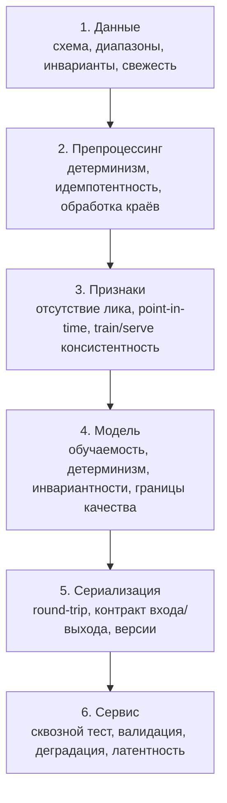

# Тесты и качество кода в ML

> **Зачем эта глава.** ML-код ломается не так, как обычный: он не падает. Он молча
> возвращает числа — просто не те. Модель обучилась на признаке, которого не будет
> в проде; препроцессинг в сервисе отличается от препроцессинга в обучении на один
> `fillna`; в датасете появились дубли — метрика выросла, и никто не заметил. Здесь —
> что и как тестировать на каждом слое ML-системы, как устроить проект, чтобы тесты
> вообще были возможны, и на что смотреть, когда ревьюите чужой ML-код.

**Уровень:** 🎯 middle → 🧠 middle+
**Предварительно нужно:** [Python, который спрашивают](01-python-for-mle.md),
[валидация и утечки](../02-classic-ml/05-validation-and-leakage.md),
[CI/CD для ML](../07-mlops/07-ci-cd-for-ml.md)
**Как проработать:** чтение + написать тесты к своему кодуы для своего проекта

---

## Карта главы

- [1. Почему ML-код ломается иначе](#1-почему-ml-код-ломается-иначе)
- [2. Что тестировать: шесть слоёв](#2-что-тестировать-шесть-слоёв)
- [3. Структура проекта, в котором можно писать тесты](#3-структура-проекта-в-котором-можно-писать-тесты)
- [4. pytest: необходимый минимум](#4-pytest-необходимый-минимум)
- [5. Тесты на данные](#5-тесты-на-данные)
- [6. Тесты на препроцессинг и признаки](#6-тесты-на-препроцессинг-и-признаки)
- [7. Тесты на модель](#7-тесты-на-модель)
- [8. Property-based тесты](#8-property-based-тесты)
- [9. Мокирование и изоляция](#9-мокирование-и-изоляция)
- [10. Тесты на сериализацию и контракт](#10-тесты-на-сериализацию-и-контракт)
- [11. Интеграционный тест сервиса](#11-интеграционный-тест-сервиса)
- [12. Детерминизм и скорость тестов](#12-детерминизм-и-скорость-тестов)
- [13. Линтеры, типы, pre-commit](#13-линтеры-типы-pre-commit)
- [14. Как это собирается в CI](#14-как-это-собирается-в-ci)
- [15. Ревью ML-кода: чек-лист](#15-ревью-ml-кода-чек-лист)
- [16. Подводные камни](#16-подводные-камни)
- [17. Проверь себя](#17-проверь-себя)
- [18. Практика](#18-практика)
- [19. Что читать дальше](#19-что-читать-дальше)

---

## 1. Почему ML-код ломается иначе

В обычном сервисе баг проявляется как исключение, пятисотка или неверный ответ, который
видно глазами. В ML-системе типичный баг выглядит так: всё работает, метрики есть,
дашборд зелёный — а модель принимает решения на 15% хуже, чем могла бы, и это выяснится
через квартал по бизнес-метрике.

Три причины, по которым обычного тестирования не хватает.

**Нет «правильного ответа».** Для функции `sort` вы можете написать
`assert sort([3,1,2]) == [1,2,3]`. Для функции `predict` правильного ответа нет: модель
вероятностная, её выход зависит от обученных весов, которые меняются при каждом
переобучении. Тестировать выход по значению нельзя.

**Корректность зависит от данных, а не только от кода.** Код не менялся, но поставщик
данных поменял формат даты с `YYYY-MM-DD` на `DD.MM.YYYY`, парсер молча вернул `NaT`,
признак «дней с регистрации» стал `NaN`, импутация подставила медиану — и модель
теперь работает на константе. Ни один unit-тест кода этого не поймает.

**Ошибка распределена по пайплайну.** Утечка таргета живёт не в функции, а в стыке между
сборкой признаков и разбиением на train/test. Train/serve skew живёт в том, что
препроцессинг написан дважды — для обучения на pandas и для сервиса на чистом Python.
Тестировать надо стыки, а не функции.

Отсюда практический вывод: в ML-проекте **тесты на данные и на контракты важнее,
чем тесты на алгоритмы**. Это перевёрнутый приоритет по сравнению с обычной разработкой,
и именно его проверяют на собеседовании.

> 💬 **На собеседовании.** Спросят: «Что вы тестируете в ML-проекте?» Хороший ответ
> начинается не со списка, а с тезиса: ML-код падает редко, чаще он молча возвращает
> неверные числа, поэтому тестировать надо в первую очередь **данные и контракты между
> компонентами**, а не только функции. Дальше — по слоям: схема и инварианты данных;
> детерминизм и обратимость препроцессинга; согласованность признаков между обучением
> и сервингом; способность модели переобучиться на одном батче; границы качества
> на замороженном наборе; контракт сериализации; сквозной тест сервиса.
> Плохой ответ: «пишу unit-тесты на функции подготовки данных» — это верно, но покрывает
> меньшую часть рисков.

---

## 2. Что тестировать: шесть слоёв



Таблица «что именно проверяем» — её стоит держать перед глазами при написании тестов
для своего проекта:

| Слой | Что проверяем | Чем ловим |
|---|---|---|
| **Данные** | набор и типы колонок, диапазоны, доля пропусков, уникальность ключа, количество строк, свежесть, категории из известного множества | `pandera`/Great Expectations или голый pytest на семпле |
| **Препроцессинг** | детерминизм, идемпотентность, поведение на пустом входе / одной строке / всех `NaN`, отсутствие мутации входа | unit-тесты + property-based |
| **Признаки** | нет колонок, недоступных в момент предсказания; окна агрегатов не заглядывают в будущее; одинаковый результат в батче и по одной строке | тест point-in-time, тест «батч == по одному» |
| **Модель** | переобучается на одном батче; детерминизм при фиксированном seed; инвариантность к перестановке строк/колонок; направленные ожидания; метрика не ниже порога на замороженном наборе | pytest с маркерами `slow` |
| **Сериализация** | round-trip даёт те же предсказания; контракт входа/выхода зафиксирован; версия артефакта | unit-тест на `tmp_path` |
| **Сервис** | сквозной запрос отдаёт валидный ответ; невалидный вход даёт 4xx, а не 500; фолбэк при недоступности зависимостей | `TestClient` + моки |

Правило приоритизации, если времени мало: **сначала контракты (данные, вход/выход
сервиса), потом инварианты модели, потом всё остальное**. Контракты ловят больше всего
инцидентов на единицу усилий.

---

## 3. Структура проекта, в котором можно писать тесты

Главная причина, по которой в ML-проектах нет тестов, — не лень, а то, что весь код
живёт в ноутбуках и в одном файле `train.py` на 900 строк, где загрузка данных,
признаки, обучение и сохранение перемешаны. Такой код нечем тестировать: нет функций,
которые можно вызвать отдельно.

Рабочая структура:

```
project/
├── pyproject.toml              # зависимости, конфиг ruff/mypy/pytest — один файл на всё
├── .pre-commit-config.yaml
├── Makefile                    # make test / make lint / make train — единая точка входа
├── README.md
├── configs/
│   ├── config.yaml             # базовый конфиг (Hydra/OmegaConf или простой YAML)
│   └── model/gbdt.yaml
├── data/                       # в .gitignore; версионируется через DVC/S3, а не через git
│   ├── raw/
│   ├── interim/
│   └── processed/
├── notebooks/                  # исследование; в CI не участвует, в прод не идёт
│   └── 01-eda.ipynb
├── src/
│   └── churn/                  # ИМЕНОВАННЫЙ пакет: import churn.features работает везде
│       ├── __init__.py
│       ├── config.py           # типизированные dataclass-конфиги
│       ├── data/
│       │   ├── load.py         # чтение из источников
│       │   ├── schema.py       # СХЕМА датасета как код — единственный источник правды
│       │   └── validate.py     # проверки данных
│       ├── features/
│       │   ├── build.py        # чистые функции DataFrame -> DataFrame
│       │   └── transformers.py # sklearn-совместимые трансформеры
│       ├── models/
│       │   ├── train.py        # обучение: принимает данные и конфиг, возвращает модель
│       │   ├── evaluate.py     # метрики: принимает y_true, y_pred, возвращает dict
│       │   └── predict.py      # инференс: те же трансформеры, что в обучении
│       ├── serving/
│       │   ├── app.py          # FastAPI
│       │   └── schemas.py      # pydantic-модели запроса и ответа
│       └── cli.py              # точки входа: train, evaluate, serve
└── tests/
    ├── conftest.py             # общие фикстуры
    ├── fixtures/
    │   └── sample_raw.parquet  # маленький (сотни строк) замороженный семпл
    ├── unit/
    │   ├── test_features.py
    │   ├── test_preprocessing.py
    │   └── test_metrics.py
    ├── data/
    │   └── test_schema.py
    ├── model/
    │   ├── test_trainability.py
    │   └── test_invariances.py
    └── integration/
        ├── test_pipeline.py
        └── test_service.py
```

Три принципа, которые делают код тестируемым и которые стоит уметь назвать:

**Чистые функции для преобразований.** Функция признаков принимает `DataFrame`
и возвращает `DataFrame`, не читает файлы, не пишет в глобальные переменные, не зависит
от `datetime.now()` (текущее время передаётся аргументом — иначе тест невоспроизводим).

**Инъекция зависимостей вместо жёстких путей.** Не `pd.read_parquet("/data/train.parquet")`
внутри функции обучения, а `train(df: pd.DataFrame, config: TrainConfig)`. Тогда в тесте
подаётся маленький синтетический `df`, и не нужен ни S3, ни настоящие данные.

**Один источник правды для схемы и препроцессинга.** Список признаков, их типы и код
преобразования лежат в одном месте и используются и обучением, и сервисом. Как только
препроцессинг написан дважды — на pandas для обучения и «руками» для сервиса — train/serve
skew становится вопросом времени.

> ⚠️ **Типичная ошибка.** Держать `src/` без `__init__.py` и без имени пакета,
> а импорты чинить через `sys.path.append("../src")` в каждом файле. Тесты начинают
> зависеть от того, из какой директории их запустили, в CI всё разваливается.
> Правильно: пакет с именем, установка `pip install -e .`, импорты вида `from churn.features import ...`.

---

## 4. pytest: необходимый минимум

Достаточно четырёх вещей: `assert`, фикстуры, параметризация, маркеры.

**Конфигурация в `pyproject.toml`** (один файл вместо `pytest.ini`, `setup.cfg` и прочего):

```toml
[tool.pytest.ini_options]
testpaths = ["tests"]
addopts = "-q --strict-markers --durations=10"
# --strict-markers: опечатка в имени маркера станет ошибкой, а не молча пропущенным фильтром
markers = [
    "slow: тесты дольше нескольких секунд (обучение моделей)",
    "gpu: требуют CUDA",
    "integration: ходят во внешние системы или поднимают сервис",
    "data: требуют доступ к реальному датасету",
]
filterwarnings = ["error::FutureWarning"]   # чужой FutureWarning ломает сборку заранее, а не в проде
```

**Фикстуры** — способ подготовить объект один раз и переиспользовать. Живут
в `tests/conftest.py`, откуда видны всем тестам:

```python
# tests/conftest.py
import numpy as np
import pandas as pd
import pytest


@pytest.fixture(scope="session")
def rng() -> np.random.Generator:
    """Один генератор на всю сессию с фиксированным seed.
    Явный Generator лучше глобального np.random.seed: он не протекает между тестами."""
    return np.random.default_rng(42)


@pytest.fixture
def raw_df(rng) -> pd.DataFrame:
    """Маленький синтетический датасет со ВСЕМИ патологиями, которые бывают в проде.
    Функция-фикстура вызывается заново для каждого теста — тест может смело мутировать df."""
    n = 200
    df = pd.DataFrame(
        {
            "user_id": np.arange(n),
            "signup_date": pd.to_datetime("2026-01-01") + pd.to_timedelta(rng.integers(0, 180, n), "D"),
            "age": rng.integers(18, 80, n),
            "country": rng.choice(["RU", "KZ", "BY", None], n),
            "orders_30d": rng.poisson(2.0, n),
            "revenue_30d": rng.gamma(2.0, 500.0, n).round(2),
            "target": rng.integers(0, 2, n),
        }
    )
    # Патологии закладываем НАМЕРЕННО: тесты должны проверяться на реалистичных данных
    df.loc[rng.choice(n, 10, replace=False), "revenue_30d"] = np.nan   # пропуски
    df.loc[0, "age"] = 999                                             # выброс
    df = pd.concat([df, df.iloc[[1]]], ignore_index=True)              # дубль по ключу
    return df


@pytest.fixture(scope="session")
def frozen_sample() -> pd.DataFrame:
    """Замороженный кусочек РЕАЛЬНЫХ данных (обезличенный, ~500 строк), лежит в репозитории.
    Синтетика не ловит реальные патологии; реальный семпл ловит, но должен быть маленьким."""
    return pd.read_parquet("tests/fixtures/sample_raw.parquet")
```

**Параметризация** — один тест на много случаев. Это то, что превращает три копипасты
в один читаемый тест:

```python
import pytest
from churn.features import days_since


@pytest.mark.parametrize(
    "signup,now,expected",
    [
        ("2026-01-01", "2026-01-01", 0),      # тот же день
        ("2026-01-01", "2026-01-02", 1),
        ("2026-02-28", "2026-03-01", 2),      # невисокосный год
        ("2024-02-28", "2024-03-01", 2),      # високосный: 29 февраля существует
    ],
    ids=["same-day", "one-day", "non-leap", "leap"],   # человекочитаемые имена в отчёте
)
def test_days_since(signup, now, expected):
    assert days_since(pd.Timestamp(signup), pd.Timestamp(now)) == expected
```

**Маркеры** — чтобы быстрые тесты гонялись на каждый коммит, а медленные — по расписанию:

```bash
pytest -m "not slow and not gpu"      # быстрая проверка перед коммитом, секунды
pytest -m "slow"                      # ночная сборка
pytest -m "integration"               # перед выкаткой
```

```python
@pytest.mark.slow
def test_model_reaches_quality_gate(frozen_sample):
    ...
```

Полезные фикстуры pytest, которые надо знать: `tmp_path` (временный каталог,
автоматически удаляется — для тестов на сериализацию), `monkeypatch` (подмена атрибутов
и переменных окружения с автоматическим откатом), `caplog` (проверка логов),
`capsys` (перехват вывода).

---

## 5. Тесты на данные

Самый ценный слой. Проверяем не значения, а **свойства** датасета.

**Схема как код — единственный источник правды:**

```python
# src/churn/data/schema.py
from dataclasses import dataclass


@dataclass(frozen=True)
class Schema:
    key: str = "user_id"
    target: str = "target"
    numeric: tuple[str, ...] = ("age", "orders_30d", "revenue_30d")
    categorical: tuple[str, ...] = ("country",)
    datetime: tuple[str, ...] = ("signup_date",)

    @property
    def features(self) -> tuple[str, ...]:
        return self.numeric + self.categorical

    @property
    def required(self) -> tuple[str, ...]:
        return (self.key, *self.features, *self.datetime)


SCHEMA = Schema()
```

**Тесты на схему, диапазоны и инварианты:**

```python
# tests/data/test_schema.py
import numpy as np
import pandas as pd
import pytest

from churn.data.schema import SCHEMA


def test_required_columns_present(frozen_sample):
    missing = set(SCHEMA.required) - set(frozen_sample.columns)
    assert not missing, f"нет колонок: {sorted(missing)}"


def test_dtypes_are_expected(frozen_sample):
    for col in SCHEMA.numeric:
        assert pd.api.types.is_numeric_dtype(frozen_sample[col]), f"{col} не числовой"
    for col in SCHEMA.datetime:
        assert pd.api.types.is_datetime64_any_dtype(frozen_sample[col]), f"{col} не datetime"


def test_key_is_unique(frozen_sample):
    dups = frozen_sample[SCHEMA.key].duplicated().sum()
    assert dups == 0, f"{dups} дубликатов по ключу {SCHEMA.key}"


@pytest.mark.parametrize(
    "column,low,high",
    [("age", 14, 100), ("orders_30d", 0, 1000), ("revenue_30d", 0.0, 1e7)],
)
def test_value_ranges(frozen_sample, column, low, high):
    s = frozen_sample[column].dropna()
    assert s.between(low, high).all(), (
        f"{column}: {(~s.between(low, high)).sum()} значений вне [{low}, {high}]; "
        f"min={s.min()}, max={s.max()}"     # сообщение должно позволять чинить БЕЗ отладчика
    )


@pytest.mark.parametrize("column,max_null_share", [("age", 0.01), ("revenue_30d", 0.20)])
def test_missing_rate_within_budget(frozen_sample, column, max_null_share):
    """Не 'пропусков нет', а 'пропусков не больше, чем мы заложили в препроцессинг'.
    Резкий рост доли пропусков — это сломавшийся источник, а не свойство данных."""
    share = frozen_sample[column].isna().mean()
    assert share <= max_null_share, f"{column}: доля пропусков {share:.1%} > {max_null_share:.0%}"


def test_categories_are_known(frozen_sample):
    """Новая категория в проде — это либо новый рынок (ожидаемо), либо мусор в данных.
    В обоих случаях мы хотим узнать об этом из теста, а не из падения метрики."""
    known = {"RU", "KZ", "BY", "UZ", "AM"}
    actual = set(frozen_sample["country"].dropna().unique())
    assert actual <= known, f"неизвестные категории: {actual - known}"


def test_target_distribution_is_sane(frozen_sample):
    rate = frozen_sample[SCHEMA.target].mean()
    assert 0.01 < rate < 0.99, f"вырожденный таргет: доля позитивов {rate:.3f}"


def test_no_future_dates(frozen_sample):
    """Дата регистрации в будущем — почти всегда битый парсинг или перепутанный формат."""
    assert (frozen_sample["signup_date"] <= pd.Timestamp("2026-12-31")).all()
```

**Инварианты — самое интересное.** Это утверждения, связывающие колонки между собой,
которые обязаны выполняться всегда:

```python
def test_business_invariants(frozen_sample):
    df = frozen_sample
    # Была выручка -> были заказы. Нарушение = сломанный джойн или разные окна агрегации
    has_revenue = df["revenue_30d"].fillna(0) > 0
    assert (df.loc[has_revenue, "orders_30d"] > 0).all(), "выручка без заказов"

    # Средний чек в разумных пределах
    avg_check = df.loc[has_revenue, "revenue_30d"] / df.loc[has_revenue, "orders_30d"]
    assert avg_check.between(1, 1_000_000).all()
```

**Готовые инструменты.** Для проверок в пайплайне (а не в тестах) удобнее декларативные
библиотеки. `pandera` описывает схему как объект и валидирует DataFrame:

```python
import pandera as pa
from pandera import Column, Check

raw_schema = pa.DataFrameSchema(
    {
        "user_id": Column(int, unique=True),
        "age": Column(int, Check.in_range(14, 100), nullable=True),
        "country": Column(str, Check.isin(["RU", "KZ", "BY", "UZ", "AM"]), nullable=True),
        "revenue_30d": Column(float, Check.ge(0), nullable=True),
        "target": Column(int, Check.isin([0, 1])),
    },
    strict=False,     # разрешить лишние колонки; True — запретить (жёсткий контракт)
)

validated = raw_schema.validate(df, lazy=True)   # lazy: собрать ВСЕ ошибки, а не упасть на первой
```

Great Expectations решает ту же задачу тяжеловеснее, но даёт документацию и отчёты
из коробки — уместен, когда проверки нужны аналитикам, а не только инженерам.
Подробнее — [качество данных](../09-monitoring/02-data-quality.md).

> 💬 **На собеседовании.** Спросят: «Как тестировать данные?» Хороший ответ: тестируем
> не значения, а **свойства и контракты** — набор и типы колонок, диапазоны, уникальность
> ключа, доля пропусков в пределах бюджета, множество допустимых категорий, бизнес-инварианты
> между колонками, свежесть и объём. Важно добавить два уточнения: (1) те же проверки должны
> стоять не только в тестах, но и в самом пайплайне, потому что данные ломаются в рантайме,
> когда тесты уже прошли; (2) проверка «доля пропусков не выросла» ценнее проверки
> «пропусков нет» — второе почти всегда неправда, а первое ловит именно поломку.
> Плохой ответ: «прогоняю `df.describe()` и смотрю глазами».

---

## 6. Тесты на препроцессинг и признаки

Здесь ловятся утечки и train/serve skew — два самых дорогих класса ошибок в ML.

```python
# tests/unit/test_preprocessing.py
import numpy as np
import pandas as pd

from churn.features.build import build_features


def test_does_not_mutate_input(raw_df):
    """Мутация входного DataFrame — источник багов, которые проявляются через две ячейки
    ноутбука. Функция признаков обязана быть чистой."""
    before = raw_df.copy(deep=True)
    _ = build_features(raw_df, now=pd.Timestamp("2026-07-01"))
    pd.testing.assert_frame_equal(raw_df, before)


def test_is_deterministic(raw_df):
    now = pd.Timestamp("2026-07-01")
    a = build_features(raw_df, now=now)
    b = build_features(raw_df, now=now)
    pd.testing.assert_frame_equal(a, b)


def test_is_idempotent_on_row_order(raw_df):
    """Перестановка строк не должна менять признаки конкретного пользователя.
    Ловит случайно просочившиеся признаки от индекса или от порядка (например, cumsum
    без сортировки или groupby без ключа)."""
    now = pd.Timestamp("2026-07-01")
    original = build_features(raw_df, now=now).set_index("user_id").sort_index()
    shuffled = build_features(raw_df.sample(frac=1.0, random_state=0), now=now)
    shuffled = shuffled.set_index("user_id").sort_index()
    pd.testing.assert_frame_equal(original, shuffled, check_like=True)


def test_handles_edge_cases():
    """Пустой вход, одна строка, все NaN — три случая, которые ломают пайплайн в проде
    в первый же день низкого трафика."""
    cols = ["user_id", "signup_date", "age", "country", "orders_30d", "revenue_30d"]
    empty = pd.DataFrame(columns=cols)
    out = build_features(empty, now=pd.Timestamp("2026-07-01"))
    assert len(out) == 0                      # не падает и возвращает пустой результат
    assert set(out.columns) >= {"days_since_signup"}   # схема сохраняется даже на пустоте

    one_row = pd.DataFrame(
        [{"user_id": 1, "signup_date": pd.Timestamp("2026-06-01"), "age": 30,
          "country": "RU", "orders_30d": 0, "revenue_30d": np.nan}]
    )
    out = build_features(one_row, now=pd.Timestamp("2026-07-01"))
    assert len(out) == 1
    assert np.isfinite(out.select_dtypes("number").to_numpy()).all(), "NaN/inf после препроцессинга"


def test_batch_equals_single_row(raw_df):
    """Ключевой тест против train/serve skew: результат для одной строки должен совпадать
    со строкой из батчевого расчёта. Ломается, когда в признаках есть что-то, зависящее
    от батча — нормализация по батчу, ранги, доли от суммы."""
    now = pd.Timestamp("2026-07-01")
    batch = build_features(raw_df, now=now).set_index("user_id")
    for uid in raw_df["user_id"].head(5):
        single = build_features(raw_df[raw_df["user_id"] == uid], now=now).set_index("user_id")
        pd.testing.assert_frame_equal(single, batch.loc[[uid]], check_like=True)
```

**Тест на отсутствие утечки таргета.** Формальных гарантий не бывает, но два теста
ловят большинство случаев:

```python
def test_no_target_derived_columns(raw_df):
    """Ни один признак не должен подозрительно сильно коррелировать с таргетом.
    Порог 0.95 — не универсальная истина, а сигнал 'посмотри сюда руками'."""
    now = pd.Timestamp("2026-07-01")
    feats = build_features(raw_df, now=now).select_dtypes("number")
    y = raw_df["target"].to_numpy()
    for col in feats.columns:
        x = feats[col].to_numpy(dtype=float)
        if np.std(x) == 0:
            continue
        corr = abs(np.corrcoef(x, y)[0, 1])
        assert corr < 0.95, f"признак {col} почти равен таргету (|corr|={corr:.3f}) — вероятна утечка"


def test_features_available_at_prediction_time():
    """Точечная проверка point-in-time: агрегат за 30 дней, посчитанный на момент T,
    не должен зависеть от событий после T."""
    events = pd.DataFrame(
        {
            "user_id": [1, 1, 1],
            "ts": pd.to_datetime(["2026-06-01", "2026-06-15", "2026-07-05"]),
            "amount": [100.0, 200.0, 999.0],       # третье событие — ПОСЛЕ момента расчёта
        }
    )
    from churn.features.build import rolling_sum_as_of

    value = rolling_sum_as_of(events, user_id=1, as_of=pd.Timestamp("2026-07-01"), window_days=30)
    assert value == 200.0, "в агрегат попало событие из будущего"
```

Второй тест — самый недооценённый в списке. Утечка «признак посчитан по всей истории,
включая период после таргета» встречается в каждом втором проекте и стабильно даёт
+0.05 AUC на валидации и ноль в проде. См.
[валидация и утечки](../02-classic-ml/05-validation-and-leakage.md).

---

## 7. Тесты на модель

Здесь и находится вся специфика ML-тестирования. Пять типов тестов, каждый отвечает
на свой вопрос.

### 7.1. Обучаемость: переобучись на одном батче

Отвечает на вопрос «код обучения вообще рабочий?».

```python
# tests/model/test_trainability.py
import numpy as np
import pytest
import torch

from churn.models.train import build_model, train_step


@pytest.mark.slow
def test_overfits_single_batch():
    """Рабочая модель обязана довести лосс почти до нуля на 32 примерах.
    Если не может — баг в коде (нет optimizer.step(), перепутаны оси, замороженные веса,
    неправильные метки), а не проблема гиперпараметров. Это самый ценный тест на модель:
    он ловит целый класс ошибок за 5 секунд."""
    torch.manual_seed(0)
    x = torch.randn(32, 16)
    y = (x[:, 0] > 0).long()

    model = build_model(in_features=16, n_classes=2)
    opt = torch.optim.Adam(model.parameters(), lr=1e-2)
    criterion = torch.nn.CrossEntropyLoss()

    losses = []
    for _ in range(300):
        losses.append(train_step(model, opt, criterion, x, y))

    assert losses[-1] < 0.01, f"модель не переобучилась на одном батче: {losses[-1]:.4f}"
    assert losses[-1] < losses[0] / 10, "лосс почти не упал — обучение не работает"


@pytest.mark.slow
def test_initial_loss_matches_theory():
    """Лосс на случайной инициализации для K классов должен быть ≈ ln(K).
    Сильное отклонение = перепутанные оси, метки не с нуля, лосс от вероятностей."""
    torch.manual_seed(0)
    model = build_model(in_features=16, n_classes=10)
    x, y = torch.randn(256, 16), torch.randint(0, 10, (256,))
    with torch.no_grad():
        loss = torch.nn.CrossEntropyLoss()(model(x), y).item()
    assert abs(loss - np.log(10)) < 0.3, f"стартовый лосс {loss:.3f}, ожидали ≈ {np.log(10):.3f}"


def test_all_parameters_receive_gradients():
    """Ловит слои, забытые в обычном списке вместо nn.ModuleList, и случайно
    замороженные веса."""
    torch.manual_seed(0)
    model = build_model(in_features=16, n_classes=2)
    out = model(torch.randn(8, 16))
    out.sum().backward()

    without_grad = [n for n, p in model.named_parameters() if p.requires_grad and p.grad is None]
    assert not without_grad, f"параметры без градиента: {without_grad}"
```

### 7.2. Детерминизм

```python
def test_training_is_reproducible():
    """Два обучения с одним seed дают одинаковые веса. Если тест падает — где-то
    осталась незафиксированная случайность, и все ваши сравнения экспериментов
    измеряют шум."""
    def run() -> torch.Tensor:
        torch.manual_seed(123)
        model = build_model(in_features=8, n_classes=2)
        opt = torch.optim.SGD(model.parameters(), lr=0.1)
        x, y = torch.randn(64, 8), torch.randint(0, 2, (64,))
        for _ in range(10):
            train_step(model, opt, torch.nn.CrossEntropyLoss(), x, y)
        return torch.cat([p.detach().flatten() for p in model.parameters()])

    torch.testing.assert_close(run(), run(), rtol=0, atol=0)


def test_inference_is_deterministic(trained_sklearn_model, frozen_sample):
    """Один и тот же вход должен давать один и тот же выход. Ломается, если в предсказании
    есть случайность (dropout не выключен, сэмплирование) или зависимость от порядка."""
    X = frozen_sample[list(SCHEMA.features)]
    p1 = trained_sklearn_model.predict_proba(X)[:, 1]
    p2 = trained_sklearn_model.predict_proba(X)[:, 1]
    np.testing.assert_array_equal(p1, p2)
```

### 7.3. Инвариантности и направленные ожидания

Это **метаморфные тесты** (metamorphic testing): мы не знаем правильный ответ,
но знаем, как ответ обязан измениться (или не измениться) при известном изменении входа.
Идея и терминология — из работы Ribeiro et al. «Beyond Accuracy: Behavioral Testing
of NLP Models with CheckList» (ACL 2020), где выделены три семейства:
инвариантность, направленное ожидание и минимальный функциональный тест.

```python
# tests/model/test_invariances.py
import numpy as np
import pandas as pd


def test_invariant_to_row_permutation(trained_model, frozen_sample):
    """Предсказание для пользователя не зависит от того, где он в батче.
    Ломается при нормализации по батчу, ранжирующих признаках, groupby без ключа."""
    X = frozen_sample[list(SCHEMA.features)]
    base = pd.Series(trained_model.predict_proba(X)[:, 1], index=X.index)

    perm = X.sample(frac=1.0, random_state=0)
    permuted = pd.Series(trained_model.predict_proba(perm)[:, 1], index=perm.index)

    np.testing.assert_allclose(base.sort_index(), permuted.sort_index(), rtol=1e-9)


def test_invariant_to_column_order(trained_model, frozen_sample):
    """Модель должна брать колонки по ИМЕНИ, а не по позиции. Классический баг:
    в сервисе признаки собираются в другом порядке, модель работает на перепутанных
    значениях и не падает — просто отвечает мусором."""
    X = frozen_sample[list(SCHEMA.features)]
    shuffled_cols = list(np.random.default_rng(0).permutation(X.columns))
    np.testing.assert_allclose(
        trained_model.predict_proba(X)[:, 1],
        trained_model.predict_proba(X[shuffled_cols])[:, 1],
        rtol=1e-9,
    )


def test_directional_expectation(trained_model, frozen_sample):
    """Направленное ожидание: рост числа заказов не должен СНИЖАТЬ вероятность удержания.
    Это проверка на согласованность модели со здравым смыслом; нарушение на большинстве
    объектов — сигнал о перепутанном знаке, неверной кодировке или утечке."""
    X = frozen_sample[list(SCHEMA.features)].copy()
    base = trained_model.predict_proba(X)[:, 1]

    X_more = X.copy()
    X_more["orders_30d"] = X_more["orders_30d"] + 5

    higher = trained_model.predict_proba(X_more)[:, 1]
    share_consistent = (higher >= base - 1e-6).mean()
    # Не требуем 100%: деревья кусочно-постоянны и взаимодействия признаков реальны
    assert share_consistent > 0.90, f"монотонность нарушена у {(1-share_consistent):.1%} объектов"


def test_missing_value_handling(trained_model, frozen_sample):
    """Модель должна пережить пропуск в любом одном признаке, а не падать.
    В проде фича не приезжает регулярно — это норма, а не исключительная ситуация."""
    X = frozen_sample[list(SCHEMA.features)].head(20)
    for col in SCHEMA.numeric:
        X_missing = X.copy()
        X_missing[col] = np.nan
        preds = trained_model.predict_proba(X_missing)[:, 1]
        assert np.isfinite(preds).all(), f"NaN в предсказаниях при пропуске {col}"
        assert ((preds >= 0) & (preds <= 1)).all()
```

### 7.4. Границы качества (quality gate)

```python
@pytest.mark.slow
def test_quality_above_gate(frozen_sample):
    """Регрессионный тест на качество: модель, обученная на замороженном семпле,
    не должна быть хуже порога. Порог берётся НЕ с потолка: это качество текущей
    прод-модели минус запас на дисперсию (обычно 2 стандартные ошибки)."""
    from sklearn.metrics import roc_auc_score
    from sklearn.model_selection import train_test_split
    from churn.models.train import fit_baseline

    X = frozen_sample[list(SCHEMA.features)]
    y = frozen_sample[SCHEMA.target]
    X_tr, X_te, y_tr, y_te = train_test_split(X, y, test_size=0.3, random_state=0, stratify=y)

    model = fit_baseline(X_tr, y_tr, random_state=0)
    auc = roc_auc_score(y_te, model.predict_proba(X_te)[:, 1])

    assert auc >= 0.68, f"AUC {auc:.4f} ниже гейта 0.68 — качество деградировало"


@pytest.mark.slow
def test_quality_on_slices(trained_model, frozen_sample):
    """Средняя метрика прячет провалы на сегментах. Проверяем ключевые срезы отдельно:
    именно там живут репутационные и продуктовые риски."""
    from sklearn.metrics import roc_auc_score

    for country, group in frozen_sample.groupby("country"):
        if len(group) < 50 or group[SCHEMA.target].nunique() < 2:
            continue          # на маленьких срезах метрика — шум, проверять бессмысленно
        auc = roc_auc_score(
            group[SCHEMA.target], trained_model.predict_proba(group[list(SCHEMA.features)])[:, 1]
        )
        assert auc >= 0.60, f"провал на срезе country={country}: AUC {auc:.3f}"
```

Про порог: жёсткое число в тесте — компромисс. Оно обязано пересматриваться вместе
с моделью, иначе через год тест либо всегда зелёный (порог устарел вниз), либо всегда
красный. Практика получше — хранить эталонную метрику в файле рядом с моделью
и сравнивать с ней, а обновление файла делать явным коммитом, который видно на ревью.

### 7.5. Тест на предсказуемость времени и памяти

```python
@pytest.mark.slow
def test_inference_latency_budget(trained_model, frozen_sample):
    """Регрессия по латентности незаметна, пока не станет инцидентом.
    Порог берём с большим запасом: CI-раннеры шумные, тест не должен быть флаки."""
    import time

    X = frozen_sample[list(SCHEMA.features)].head(1)
    trained_model.predict_proba(X)                     # прогрев: первый вызов всегда дороже

    t0 = time.perf_counter()
    for _ in range(100):
        trained_model.predict_proba(X)
    per_call_ms = (time.perf_counter() - t0) / 100 * 1000

    assert per_call_ms < 50, f"предсказание {per_call_ms:.1f} мс на объект — вышли за бюджет"
```

> 💬 **На собеседовании.** Спросят: «Как тестировать модель, если правильного ответа нет?»
> Хороший ответ: тремя способами. Первый — **тесты обучаемости**: модель обязана
> переобучиться на одном батче, стартовый лосс обязан равняться `ln K`, все параметры
> обязаны получать градиент; это ловит баги кода за секунды. Второй — **метаморфные
> тесты**: мы не знаем правильный ответ, но знаем инварианты (перестановка строк
> и колонок ничего не меняет, пропуск одного признака не роняет сервис) и направленные
> ожидания (рост дохода не должен снижать скоринг). Третий — **регрессионные гейты**:
> метрика на замороженном наборе не ниже порога, и отдельно по ключевым срезам,
> потому что среднее прячет провалы. Плохой ответ: «сравню предсказания с эталонным
> массивом» — такой тест сломается при первом же переобучении и его отключат.

---

## 8. Property-based тесты

Обычный тест проверяет конкретные примеры, которые придумали вы. Property-based тест
проверяет **свойство** на сотнях сгенерированных примеров, включая те, которые вы
бы не придумали: пустые массивы, `NaN`, `-0.0`, огромные числа, повторяющиеся значения.
Библиотека — `hypothesis`.

```python
import numpy as np
from hypothesis import given, settings, assume, strategies as st
from hypothesis.extra.numpy import arrays

from churn.features.transformers import standardize, clip_outliers


@given(
    arrays(
        dtype=np.float64,
        shape=st.integers(min_value=2, max_value=200),
        elements=st.floats(min_value=-1e6, max_value=1e6, allow_nan=False, allow_infinity=False),
    )
)
def test_standardize_gives_zero_mean_unit_std(x):
    assume(np.std(x) > 1e-6)         # вырожденный случай проверяем отдельным тестом
    z = standardize(x)
    assert abs(np.mean(z)) < 1e-6
    assert abs(np.std(z) - 1.0) < 1e-6


@given(
    arrays(np.float64, st.integers(1, 100),
           elements=st.floats(-1e3, 1e3, allow_nan=False, allow_infinity=False)),
    st.floats(min_value=0.5, max_value=0.99),
)
def test_clip_outliers_properties(x, quantile):
    """Три свойства сразу: длина сохраняется, значения не выходят за исходный диапазон,
    операция идемпотентна (повторное применение ничего не меняет)."""
    y = clip_outliers(x, quantile=quantile)
    assert y.shape == x.shape
    assert y.min() >= x.min() and y.max() <= x.max()
    np.testing.assert_allclose(clip_outliers(y, quantile=quantile), y)


@given(st.lists(st.floats(0.0, 1.0, allow_nan=False), min_size=1, max_size=500),
       st.lists(st.integers(0, 1), min_size=1, max_size=500))
@settings(max_examples=200, deadline=None)   # deadline=None: метрики на больших входах медленные
def test_metric_is_in_range(scores, labels):
    """Свойство метрики: результат всегда в [0, 1] либо корректно сообщает,
    что посчитать невозможно (один класс)."""
    from churn.models.evaluate import safe_roc_auc

    n = min(len(scores), len(labels))
    assume(n > 0)
    value = safe_roc_auc(np.array(labels[:n]), np.array(scores[:n]))
    assert value is None or 0.0 <= value <= 1.0
```

**Где property-based окупается в ML:** препроцессинг (нормализация, клиппинг, кодировки),
собственные реализации метрик, парсеры и валидаторы, оконные агрегаты. Там свойства
формулируются легко: «длина не меняется», «результат в диапазоне», «идемпотентно»,
«обратимо», «не зависит от порядка».

**Где не окупается:** обучение моделей (слишком медленно) и функции, у которых свойства
формулируются с тем же трудом, что и реализация.

**Практический бонус.** Найдя падение, `hypothesis` автоматически **минимизирует**
контрпример: вместо массива из 200 чисел вы получите `array([0.0, 0.0])` — минимальный
вход, на котором свойство нарушается. Это часто сразу показывает причину.

---

## 9. Мокирование и изоляция

Тест не должен ходить в S3, в базу, в feature store и в чужой API. Причины простые:
такой тест медленный, флакающий и падает, когда падает чужой сервис.

```python
import json
from unittest.mock import MagicMock, patch

import pandas as pd
import pytest


def test_feature_service_uses_defaults_on_timeout(monkeypatch):
    """Проверяем не 'фичи приезжают', а поведение при ОТКАЗЕ зависимости.
    Это важнее позитивного сценария: позитивный путь и так пройдёт в интеграции."""
    from churn.serving.features import FeatureClient, DEFAULT_FEATURES

    def raise_timeout(*args, **kwargs):
        raise TimeoutError("feature store не ответил за 20 мс")

    client = FeatureClient(url="http://feature-store.internal", timeout_ms=20)
    monkeypatch.setattr(client, "_fetch", raise_timeout)

    features = client.get(user_id=42)
    assert features == DEFAULT_FEATURES, "сервис должен деградировать, а не падать"


def test_predict_endpoint_does_not_load_model_from_s3(monkeypatch, tmp_path):
    """Подменяем загрузчик модели фейком: тест не должен зависеть ни от сети,
    ни от наличия артефакта."""
    fake_model = MagicMock()
    fake_model.predict_proba.return_value = [[0.3, 0.7]]

    monkeypatch.setattr("churn.serving.app.load_model", lambda *a, **kw: fake_model)

    from churn.serving.app import predict_one
    result = predict_one({"user_id": 1, "age": 30, "country": "RU",
                          "orders_30d": 3, "revenue_30d": 1500.0})
    assert result["score"] == pytest.approx(0.7)
    fake_model.predict_proba.assert_called_once()      # проверяем, что модель ВЫЗВАНА
```

**Правила мокирования, которые стоит знать:**

**Мокайте на границе своего кода, а не внутри чужой библиотеки.** Правильно — подменить
свой `FeatureClient.fetch`. Неправильно — патчить `requests.Session.send`: такой мок
сломается при обновлении библиотеки и ничего не проверит.

**Патчьте там, где объект используется, а не там, где определён.**
`monkeypatch.setattr("churn.serving.app.load_model", ...)`, а не
`monkeypatch.setattr("churn.models.io.load_model", ...)` — если в `app.py` написано
`from churn.models.io import load_model`, имя уже связано в модуле `app`.

**Мок — не замена интеграционного теста.** Мок проверяет, что ваш код правильно
использует зависимость. Что зависимость ведёт себя так, как вы предположили,
проверяет только интеграционный тест (пусть редкий, по маркеру `integration`).

**Не мокайте то, что дёшево создать по-настоящему.** Маленький DataFrame,
`sqlite` в памяти, `tmp_path` вместо S3 — реальнее и надёжнее мока.

**Время — тоже зависимость.** Функция, которая внутри зовёт `datetime.now()`,
невоспроизводима. Передавайте момент времени аргументом (`now: pd.Timestamp`) — тогда
мокирование вообще не нужно.

---

## 10. Тесты на сериализацию и контракт

Модель, которую нельзя загрузить, — это отсутствующая модель. Проверять надо
не сам факт сохранения, а **эквивалентность предсказаний после round-trip**.

```python
import joblib
import numpy as np
import pandas as pd


def test_model_roundtrip_preserves_predictions(trained_model, frozen_sample, tmp_path):
    X = frozen_sample[list(SCHEMA.features)].head(50)
    before = trained_model.predict_proba(X)

    path = tmp_path / "model.joblib"
    joblib.dump(trained_model, path)
    loaded = joblib.load(path)

    after = loaded.predict_proba(X)
    np.testing.assert_array_equal(before, after)      # именно equal, не allclose:
                                                      # сериализация не должна ничего терять


def test_artifact_contains_contract(trained_model, tmp_path):
    """С моделью обязаны сохраняться: список признаков в правильном порядке, версии
    библиотек и версия схемы. Без этого через полгода никто не соберёт корректный вход."""
    from churn.models.io import save_bundle, load_bundle

    path = tmp_path / "bundle.joblib"
    save_bundle(path, model=trained_model, feature_names=list(SCHEMA.features),
                schema_version="v3", metrics={"auc": 0.72})
    bundle = load_bundle(path)

    assert bundle.feature_names == list(SCHEMA.features)
    assert bundle.schema_version == "v3"
    assert "sklearn" in bundle.library_versions
    assert bundle.metrics["auc"] > 0


def test_predict_rejects_wrong_feature_set(trained_model_bundle):
    """Контракт должен проверяться на входе, а не 'как-нибудь отработать'.
    Модель, получившая не те колонки, обязана упасть с внятной ошибкой."""
    import pytest
    bad = pd.DataFrame({"age": [30], "unexpected_column": [1]})
    with pytest.raises(ValueError, match="feature"):
        trained_model_bundle.predict(bad)


@pytest.mark.slow
def test_onnx_matches_python(trained_model, frozen_sample, tmp_path):
    """Если модель уезжает в ONNX/TorchScript, тест на совпадение выходов обязателен:
    расхождение обычно возникает на препроцессинге и на типах (float32 vs float64)."""
    import onnxruntime as ort
    from skl2onnx import to_onnx

    X = frozen_sample[list(SCHEMA.features)].select_dtypes("number").head(20)
    X32 = X.to_numpy(dtype=np.float32)

    onx = to_onnx(trained_model, X32[:1])
    path = tmp_path / "model.onnx"
    path.write_bytes(onx.SerializeToString())

    sess = ort.InferenceSession(str(path), providers=["CPUExecutionProvider"])
    onnx_out = sess.run(None, {sess.get_inputs()[0].name: X32})[1]
    onnx_proba = np.array([row[1] for row in onnx_out])

    np.testing.assert_allclose(trained_model.predict_proba(X)[:, 1], onnx_proba, atol=1e-5)
```

**Про pickle и joblib.** Оба исполняют произвольный код при загрузке — загружать чужой
артефакт небезопасно. Оба привязаны к версиям библиотек: модель, сохранённая
на `scikit-learn 1.4`, может не загрузиться на `1.6` или загрузиться и молча вести
себя иначе. Отсюда обязательные части контракта: версии библиотек внутри артефакта
и тест, который на CI загружает артефакт в чистом окружении. Подробно —
[упаковка модели](../07-mlops/04-model-packaging.md).

---

## 11. Интеграционный тест сервиса

Сквозной тест проверяет то, что не проверяет ни один unit-тест: что компоненты
состыкованы, схемы совпадают и сервис отвечает.

```python
# tests/integration/test_service.py
import pytest
from fastapi.testclient import TestClient


@pytest.fixture(scope="module")
def client(tmp_path_factory):
    """Поднимаем приложение с ЛЁГКОЙ моделью, обученной прямо здесь.
    Так тест не зависит ни от S3, ни от того, что кто-то положил артефакт в нужное место."""
    from sklearn.linear_model import LogisticRegression
    import joblib
    import numpy as np

    model_path = tmp_path_factory.mktemp("models") / "model.joblib"
    rng = np.random.default_rng(0)
    X = rng.normal(size=(200, 4))
    y = (X[:, 0] + rng.normal(scale=0.5, size=200) > 0).astype(int)
    joblib.dump(LogisticRegression().fit(X, y), model_path)

    from churn.serving.app import create_app
    with TestClient(create_app(model_path=model_path)) as c:
        yield c            # with-блок вызывает startup/shutdown события приложения


def test_healthcheck(client):
    r = client.get("/health")
    assert r.status_code == 200
    assert r.json()["status"] == "ok"
    assert "model_version" in r.json()      # версия модели должна быть видна снаружи


def test_predict_happy_path(client):
    payload = {"user_id": 1, "age": 30, "country": "RU", "orders_30d": 3, "revenue_30d": 1500.0}
    r = client.post("/predict", json=payload)

    assert r.status_code == 200
    body = r.json()
    assert 0.0 <= body["score"] <= 1.0
    assert body["model_version"]
    assert "request_id" in body              # без идентификатора запроса инцидент не разобрать


@pytest.mark.parametrize(
    "payload,expected_status",
    [
        ({"user_id": 1}, 422),                                  # нет обязательных полей
        ({"user_id": 1, "age": -5, "country": "RU",
          "orders_30d": 1, "revenue_30d": 10.0}, 422),          # возраст вне диапазона
        ({"user_id": 1, "age": "тридцать", "country": "RU",
          "orders_30d": 1, "revenue_30d": 10.0}, 422),          # неверный тип
    ],
    ids=["missing-fields", "out-of-range", "wrong-type"],
)
def test_invalid_input_returns_4xx(client, payload, expected_status):
    """Ключевое требование: невалидный вход даёт 4xx, а НЕ 500. Пятисотка на кривом входе —
    это и алерты на дежурного, и невозможность отличить свою ошибку от чужой."""
    assert client.post("/predict", json=payload).status_code == expected_status


def test_unknown_category_does_not_crash(client):
    """Категория, которой не было в обучении, обязательно появится в проде.
    Сервис должен ответить, а не упасть."""
    payload = {"user_id": 1, "age": 30, "country": "ZZ", "orders_30d": 1, "revenue_30d": 10.0}
    r = client.post("/predict", json=payload)
    assert r.status_code == 200
    assert 0.0 <= r.json()["score"] <= 1.0


def test_batch_endpoint_preserves_order(client):
    """Батчевый эндпоинт должен возвращать ответы в порядке запроса и в том же количестве.
    Перепутанный порядок — молчаливый баг: ответы валидны, но принадлежат другим объектам."""
    users = [
        {"user_id": i, "age": 20 + i, "country": "RU", "orders_30d": i, "revenue_30d": 100.0 * i}
        for i in range(5)
    ]
    r = client.post("/predict/batch", json={"items": users})
    assert r.status_code == 200
    results = r.json()["results"]
    assert [x["user_id"] for x in results] == [u["user_id"] for u in users]
```

Обратите внимание: большинство тестов здесь — про **негативные сценарии**. Позитивный
путь ломается редко и его сразу замечают; ломается обработка кривого входа, неизвестной
категории и недоступной зависимости — а это происходит в проде постоянно.

---

## 12. Детерминизм и скорость тестов

**Флакающий тест хуже отсутствующего.** Тест, который падает раз в десять запусков,
через месяц будет отключён — и вместе с ним отключится всё, что он проверял.

Источники недетерминизма и что с ними делать:

| Источник | Лечение |
|---|---|
| Случайные числа | фикстура с `np.random.default_rng(seed)`, `random_state=` во всех вызовах sklearn, `torch.manual_seed` |
| Текущее время | передавать `now` аргументом; в крайнем случае `freezegun` или `monkeypatch` |
| Порядок файлов | `sorted(os.listdir(...))` — порядок обхода не гарантирован |
| Порядок множеств | не полагаться на порядок `set`; сортировать перед сравнением |
| Параллельные тесты, общие файлы | `tmp_path` / `tmp_path_factory` вместо фиксированных путей |
| Плавающая точка | `pytest.approx`, `np.testing.assert_allclose` с явными `rtol`/`atol`, а не `==` |
| Сеть и внешние сервисы | моки; реальные вызовы — только под маркером `integration` |
| Замеры времени | большой запас в пороге, прогрев, медиана вместо одного замера |
| Тесты, зависящие друг от друга | каждый тест создаёт своё состояние; проверить через `pytest -p no:randomly` и запуск в случайном порядке |

**Скорость.** Основной набор тестов должен проходить за секунды — иначе его перестанут
запускать локально. Практические приёмы:

```bash
pytest -m "not slow" -x -q          # быстрый прогон, останов на первом падении
pytest -n auto                      # параллельно (плагин pytest-xdist)
pytest --durations=10               # найти 10 самых медленных тестов и починить их
pytest --lf                         # только упавшие в прошлый раз
```

Данных в тестах должно быть **мало**: 200 строк вместо миллиона, 2 эпохи вместо 50,
модель на 100 деревьев заменяется на 10. Цель теста — поймать баг в коде, а не измерить
качество модели.

---

## 13. Линтеры, типы, pre-commit

**`ruff`** — линтер и форматтер в одном, на порядок быстрее связки `flake8 + isort + black`.
Конфигурация живёт в `pyproject.toml`:

```toml
[tool.ruff]
line-length = 100
target-version = "py311"

[tool.ruff.lint]
select = [
    "E", "W",    # pycodestyle
    "F",         # pyflakes: неиспользуемые импорты и переменные, необъявленные имена
    "I",         # isort: порядок импортов
    "UP",        # pyupgrade: устаревшие конструкции
    "B",         # flake8-bugbear: изменяемые аргументы по умолчанию и подобные ловушки
    "SIM",       # упрощения
    "NPY",       # правила для numpy (в т.ч. устаревший np.random.seed API)
    "PD",        # pandas-vet: chained assignment, inplace=True и прочие грабли pandas
]
ignore = ["E501"]        # длину строк проверяет форматтер

[tool.ruff.lint.per-file-ignores]
"tests/*" = ["S101"]     # assert в тестах — это нормально
"notebooks/*" = ["ALL"]  # ноутбуки не линтуем: там черновики

[tool.ruff.format]
quote-style = "double"
```

Правила `PD` и `NPY` стоят отдельного упоминания: они ловят именно ML-специфичные
грабли — `inplace=True`, chained assignment (`df[df.a > 0]["b"] = 1`, который молча
ничего не делает), устаревший API numpy.

**`mypy`** — статическая проверка типов. В ML-коде она окупается не там, где ждут:

```toml
[tool.mypy]
python_version = "3.11"
packages = ["churn"]
strict = false                 # начинать со strict в существующем проекте нереально
warn_return_any = true
warn_unused_ignores = true
disallow_untyped_defs = false  # включать постепенно, модуль за модулем

[[tool.mypy.overrides]]
module = ["sklearn.*", "lightgbm.*", "joblib.*"]
ignore_missing_imports = true   # у многих ML-библиотек нет полных стабов
```

Что типы реально ловят в ML-коде: перепутанные `DataFrame` и `ndarray` в цепочке
преобразований; функция, которая иногда возвращает `None` (а вызывающий этого не ждёт);
`Path` против `str` в путях; несовпадение типов конфига и того, что читается из YAML.
Чего они **не** ловят и на что не надо рассчитывать: формы тензоров и корректность осей —
для этого нужны рантайм-проверки или отдельные инструменты аннотирования размерностей.

Практический совет: типизируйте **границы** — сигнатуры публичных функций, конфиги
(через `dataclass` или `pydantic`), контракты сервиса. Внутренности можно оставить
нетипизированными, выигрыш там минимален.

**`pre-commit`** — запуск проверок до коммита, чтобы CI не краснел из-за форматирования:

```yaml
# .pre-commit-config.yaml
repos:
  - repo: https://github.com/pre-commit/pre-commit-hooks
    rev: v5.0.0
    hooks:
      - id: trailing-whitespace
      - id: end-of-file-fixer
      - id: check-yaml
      - id: check-added-large-files
        args: ["--maxkb=1000"]     # чтобы никто не закоммитил датасет или чекпоинт
      - id: check-merge-conflict
      - id: detect-private-key

  - repo: https://github.com/astral-sh/ruff-pre-commit
    rev: v0.8.0
    hooks:
      - id: ruff
        args: [--fix]
      - id: ruff-format

  - repo: https://github.com/pre-commit/mirrors-mypy
    rev: v1.13.0
    hooks:
      - id: mypy
        additional_dependencies: [pandas-stubs, types-PyYAML]

  - repo: https://github.com/kynan/nbstripout
    rev: 0.8.1
    hooks:
      - id: nbstripout     # выпилить выводы ноутбуков: иначе diff нечитаем, а репозиторий пухнет
```

`nbstripout` — специфичная для ML вещь, но она решает реальную боль: ноутбук с картинками
и выводами весит мегабайты, конфликтует при мерже и утекает данными (в выводах ячеек
регулярно оказываются реальные записи из базы).

Установка: `pre-commit install`, дальше хуки работают автоматически.

---

## 14. Как это собирается в CI

Минимальный, но полный workflow:

```yaml
# .github/workflows/ci.yml
name: CI

on:
  pull_request:
  push:
    branches: [main]

jobs:
  fast:
    runs-on: ubuntu-latest
    steps:
      - uses: actions/checkout@v4
      - uses: actions/setup-python@v5
        with:
          python-version: "3.11"
          cache: pip
      - run: pip install -e ".[dev]"
      - name: Lint
        run: ruff check . && ruff format --check .
      - name: Types
        run: mypy
      - name: Fast tests
        run: pytest -m "not slow and not integration" --cov=churn --cov-report=term-missing

  slow:
    runs-on: ubuntu-latest
    if: github.event_name == 'push'      # медленные тесты — не на каждый пуш в PR
    steps:
      - uses: actions/checkout@v4
      - uses: actions/setup-python@v5
        with: { python-version: "3.11", cache: pip }
      - run: pip install -e ".[dev]"
      - name: Model and integration tests
        run: pytest -m "slow or integration"
```

Ключевое разделение: быстрые тесты и линтеры — на каждый PR (минуты); обучение моделей
и интеграция — реже. Если весь набор идёт 40 минут, разработчики начнут мержить,
не дожидаясь, и смысл CI исчезнет.

Подробнее про то, как в этот же конвейер встраиваются переобучение и гейты по метрикам, —
[CI/CD для ML](../07-mlops/07-ci-cd-for-ml.md).

> 💬 **На собеседовании.** Спросят: «Чем CI для ML отличается от обычного CI?»
> Хороший ответ: тремя вещами. Первая — появляются **тесты на данные**, которых нет
> в обычной разработке, и они должны гоняться не только в CI, но и в рантайме пайплайна.
> Вторая — появляются **гейты по метрикам качества**: сборка «зелёная» не когда код
> компилируется, а когда модель не хуже текущей прод-модели на замороженном наборе,
> и это требует хранить эталон и уметь его версионировать. Третья — **время**: обучение
> не влезает в PR-пайплайн, поэтому тесты делятся на быстрые (каждый коммит) и медленные
> (по расписанию или по метке), а артефакты моделей и данные версионируются вне git
> (DVC, реестр моделей). Плохой ответ: «то же самое, только тестов больше».

---

## 15. Ревью ML-кода: чек-лист

Ревью ML-кода отличается от обычного: главное здесь не стиль, а **корректность
относительно данных и продакшена**. Порядок вопросов, в котором стоит читать чужой PR:

**1. Утечки и валидация.**
- Разбиение на train/valid/test — временное там, где данные временные? Группы
  не пересекаются между фолдами (один пользователь в двух фолдах = утечка)?
- Препроцессинг (`fit` скейлера, target encoding, отбор признаков) обучен **только**
  на train? Классический баг — `StandardScaler().fit(X)` до сплита.
- Есть ли признак, который в момент предсказания физически недоступен? Проверять
  по каждому новому признаку отдельно, задавая вопрос «а откуда мы это знаем в момент T?».

**2. Train/serve консистентность.**
- Препроцессинг для сервинга — тот же код, что в обучении, или переписанный руками?
- Порядок и имена признаков зафиксированы и сохранены с моделью?
- Что происходит с неизвестной категорией и с пропуском фичи в проде?

**3. Данные.**
- Есть ли проверки схемы и диапазонов, и стоят ли они в пайплайне (а не только в тестах)?
- Что произойдёт, если источник вернёт пустой ответ или в два раза меньше строк?

**4. Воспроизводимость.**
- Все `random_state` / seed зафиксированы и вынесены в конфиг?
- Гиперпараметры и пути — в конфиге, а не захардкожены в коде?
- Логируется ли, на каких данных и каким кодом обучена модель (версия датасета, коммит)?

**5. Метрики и оценка.**
- Метрика соответствует задаче (не accuracy при дисбалансе 1:100)?
- Сравнение с бейзлайном есть? Разница больше, чем разброс между сидами?
- Оценка на срезах, а не только в среднем?

**6. Инженерия.**
- Функции чистые и тестируемые, или всё в одном скрипте?
- Есть ли тесты на новый код? Хотя бы один тест на инвариант?
- Обработка ошибок: что происходит при недоступности зависимости? Есть фолбэк?
- Логирование: можно ли по логам восстановить, что произошло с конкретным запросом?

**7. Ресурсы.**
- Оценены ли память и латентность? Что будет при десятикратном росте нагрузки?
- Нет ли случайного `collect()`/`toPandas()` на большом датасете?

**Что на ревью ML-кода делать не надо:** спорить про стиль (это работа `ruff`),
требовать 100% покрытия (покрытие в ML — плохая прокси-метрика: можно покрыть
все строки и не проверить ни одного инварианта), блокировать PR из-за архитектурных
предпочтений в исследовательском коде.

> 💬 **На собеседовании.** Спросят: «На что вы смотрите при ревью ML-кода?»
> Хороший ответ идёт по приоритетам, а не по списку: сначала утечки и корректность
> валидации (это единственный класс ошибок, который делает всю работу бессмысленной),
> потом консистентность обучения и сервинга, потом воспроизводимость и обработка отказов,
> и только потом стиль и покрытие. Полезно добавить конкретный пример вопроса, который
> вы задаёте на каждый новый признак: «откуда мы знаем это значение в момент предсказания?» —
> он ловит большую часть утечек. Плохой ответ: «смотрю, чтобы был PEP8 и докстринги».

---

## 16. Подводные камни

**Тест сравнивает предсказания с эталонным массивом.**
Симптом: после каждого переобучения тест падает, его правят руками или отключают.
Причина: тестируется значение, а не свойство.
Что делать: заменить на инвариант (перестановка не меняет ответ), направленное ожидание
или гейт по метрике с порогом.

**Флакающий тест на качество.**
Симптом: `test_auc_above_0.75` падает раз в пять запусков.
Причина: порог поставлен вплотную к фактическому качеству, а метрика на маленьком
семпле имеет разброс в несколько сотых.
Что делать: фиксировать `random_state` везде; ставить порог с запасом в 2 стандартные
ошибки; увеличить тестовый набор или уменьшить требования.

**Тесты идут 40 минут.**
Симптом: никто не запускает их локально, PR мержат до окончания CI.
Причина: обучение полноценных моделей в основном наборе тестов.
Что делать: маркеры `slow`/`integration`, отдельный джоб; уменьшить данные и число
итераций; `pytest -n auto`.

**Прошли все тесты, а в проде модель отвечает мусором.**
Симптом: unit-тесты зелёные, качество в проде не соответствует офлайн-оценке.
Причина: препроцессинг в сервисе отличается от обучающего; порядок признаков другой;
фичи собираются из другого источника.
Что делать: тест «батч равен построчному», тест на порядок колонок, общий код
препроцессинга, сохранение списка признаков вместе с моделью, shadow-выкатка со сверкой
предсказаний.

**Тест на данные проверяет «пропусков нет».**
Симптом: тест падает на каждой второй выгрузке, его ослабляют до бессмысленности.
Причина: сформулировано абсолютное требование вместо бюджета.
Что делать: проверять, что доля пропусков не превышает согласованный порог, и что она
не изменилась резко относительно исторической.

**Моки застыли, а реальный API изменился.**
Симптом: тесты зелёные, прод сломан.
Причина: мок описывает старый контракт.
Что делать: держать хотя бы один интеграционный тест против реального (или staging)
сервиса, гонять его по расписанию; фиксировать контракт схемой (pydantic, OpenAPI).

**Покрытие 95%, а баги идут.**
Симптом: метрика покрытия хорошая, инциденты не прекращаются.
Причина: покрыты строки, а не сценарии; нет тестов на данные и на стыки.
Что делать: не гнаться за процентом; оценивать покрытие **рисков** — по чек-листу
из [§2](#2-что-тестировать-шесть-слоёв), а не по строкам. Полезная рамка — «ML Test Score» (Breck et al., 2017):
список из 28 проверок по четырём категориям (данные, модель, инфраструктура, мониторинг),
по которому проект получает балл зрелости.

**`inplace=True` и chained assignment.**
Симптом: преобразование молча не применилось; `SettingWithCopyWarning` в логах.
Причина: pandas вернул копию, а не представление.
Что делать: включить правила `PD` в `ruff`; писать через присваивание и `.loc`;
в pandas 3.0 с Copy-on-Write часть этих сценариев ведёт себя иначе — тем более
нужен явный стиль.

---

## 17. Проверь себя

<details>
<summary><b>🎯 Вопрос.</b> Что вы тестируете в ML-проекте и в каком порядке приоритета?</summary>

**Короткий ответ.** Данные (схема, диапазоны, инварианты), препроцессинг (детерминизм,
краевые случаи), признаки (отсутствие утечки, консистентность обучение/сервинг), модель
(обучаемость, инвариантности, гейт по метрике), сериализация (round-trip и контракт),
сервис (сквозной тест, обработка невалидного входа, деградация). Приоритет — контракты
и данные, потому что ML-код чаще молча врёт, чем падает.

**Развёрнуто.** Ключевое отличие от обычного тестирования: правильного ответа для
`predict` не существует, поэтому проверяются свойства, а не значения. Проверки данных
должны стоять и в тестах, и в рантайме пайплайна — данные ломаются после того, как CI
прошёл. Из тестов на модель самый ценный — «переобучись на одном батче»: он за секунды
ловит целый класс ошибок кода. Из тестов на сервис самые ценные — негативные:
невалидный вход, неизвестная категория, недоступная зависимость.

**Чего ждёт интервьюер:** приоритизации и понимания, что тесты кода покрывают меньшую
часть рисков ML-системы.

**Провал:** перечислить «unit, integration, e2e» без ML-специфики.
</details>

<details>
<summary><b>🧠 Вопрос.</b> Как тестировать модель, если правильного ответа нет?</summary>

**Короткий ответ.** Тремя способами: тесты обучаемости (переобучение на одном батче,
стартовый лосс ≈ `ln K`, все параметры получают градиент), метаморфные тесты
(инвариантность к перестановке строк и колонок, направленные ожидания) и регрессионные
гейты по метрике на замороженном наборе, в том числе по срезам.

**Развёрнуто.** Метаморфное тестирование — центральная идея: мы не знаем правильный
выход, но знаем, как он обязан измениться при известном изменении входа. Инвариантность:
перестановка строк батча, перестановка колонок, замена имени в тексте на другое имя
того же типа. Направленное ожидание: увеличение дохода не должно снижать скоринг
кредитоспособности; добавление отрицательного слова должно снижать оценку тональности.
Минимальный функциональный тест: набор простых заведомо известных случаев. Терминология
из работы Ribeiro et al. «CheckList» (ACL 2020). Гейты по метрике требуют хранить эталон
и обновлять его явным коммитом, иначе тест либо всегда зелёный, либо всегда красный.

**Чего ждёт интервьюер:** что вы вообще знаете о существовании такого класса тестов.
Большинство кандидатов останавливается на «сравню метрику с порогом».

**Провал:** «зафиксирую эталонные предсказания и буду сравнивать» — сломается при первом
переобучении.
</details>

<details>
<summary><b>🎯 Вопрос.</b> Как тест может поймать утечку таргета?</summary>

**Короткий ответ.** Точечно: проверкой point-in-time (агрегат на момент T не зависит
от событий после T), проверкой, что ни один признак не коррелирует с таргетом почти
идеально, и проверкой, что препроцессинг обучается только на train.

**Развёрнуто.** Полной гарантии тесты не дают — утечка это свойство постановки, а не
кода. Но три теста ловят большинство: (1) синтетический пример, где есть событие после
момента расчёта, и агрегат обязан его не увидеть; (2) порог на корреляцию признака
с таргетом как триггер «посмотри руками» — не доказательство, а сигнал; (3) тест,
что `fit` скейлера/энкодера вызван внутри пайплайна на train-фолде, а не на всём датасете
(проще всего гарантируется использованием `sklearn.pipeline.Pipeline` внутри
кросс-валидации). Организационная мера сильнее технической: на ревью на каждый новый
признак задавать вопрос «откуда мы знаем это значение в момент предсказания?».

**Чего ждёт интервьюер:** понимания, что утечка ловится в первую очередь конструкцией
пайплайна и ревью, а тесты — вспомогательный контур.

**Провал:** «утечки видно по слишком высокой метрике» — часто да, но это не тест
и не работает при умеренной утечке.
</details>

<details>
<summary><b>🎯 Вопрос.</b> Что такое фикстура в pytest и зачем нужны scope?</summary>

**Короткий ответ.** Фикстура — функция, готовящая объект для теста; pytest передаёт
её результат по имени аргумента. `scope` определяет, как часто она пересоздаётся:
`function` (по умолчанию), `class`, `module`, `session`.

**Развёрнуто.** Дорогие объекты (обученная модель, поднятый сервис, соединение с БД)
делают `scope="session"` или `"module"`, чтобы не платить за них в каждом тесте.
Дешёвые и мутируемые (DataFrame, который тест меняет) оставляют `function` — иначе тесты
начнут влиять друг на друга через общее состояние, и появятся «тесты, которые проходят
по одному и падают вместе». Фикстуры с `yield` умеют убирать за собой (закрыть файл,
остановить сервис). Общие фикстуры кладутся в `conftest.py`, откуда видны всей директории
и вложенным. Полезные встроенные: `tmp_path`, `monkeypatch`, `caplog`, `capsys`.

**Чего ждёт интервьюер:** понимания связи scope с изоляцией тестов.

**Провал:** «фикстура — это тестовые данные».
</details>

<details>
<summary><b>🧠 Вопрос.</b> Что такое property-based тестирование и где оно полезно в ML?</summary>

**Короткий ответ.** Вместо конкретных примеров описывается свойство, которое обязано
выполняться, а библиотека (`hypothesis`) генерирует сотни входов, включая краевые.
В ML полезно для препроцессинга, собственных метрик, парсеров и оконных агрегатов.

**Развёрнуто.** Типичные свойства: длина выхода равна длине входа; результат в заданном
диапазоне; операция идемпотентна; обратимая пара `encode`/`decode` возвращает исходное;
результат не зависит от порядка строк. Ценность в том, что генератор находит входы,
которых вы бы не придумали: пустой массив, одно значение, все одинаковые, `-0.0`,
экстремальные величины. Плюс автоматическая минимизация контрпримера: вместо массива
из 200 чисел вы получаете минимальный вход, на котором свойство нарушено. Не подходит
для обучения моделей (медленно) и там, где свойство сформулировать не проще, чем
написать реализацию.

**Чего ждёт интервьюер:** конкретных свойств, которые вы бы проверили в своём коде.

**Провал:** «это когда генерируются случайные тесты» без формулировки свойств.
</details>

<details>
<summary><b>🎯 Вопрос.</b> Что и как мокировать в тестах ML-сервиса?</summary>

**Короткий ответ.** Внешние зависимости — хранилище моделей, feature store, БД, чужие
API — на границе своего кода. И обязательно тестировать не только успешный ответ,
но и таймаут/ошибку зависимости.

**Развёрнуто.** Правила: мокать свой клиент, а не внутренности чужой библиотеки —
иначе мок сломается при обновлении и ничего не проверит; патчить там, где имя
используется (`app.load_model`), а не там, где определено; не мокать то, что дёшево
создать по-настоящему (маленький DataFrame, sqlite в памяти, `tmp_path` вместо S3);
не подменять моками интеграционный тест — мок проверяет, что ваш код правильно
использует зависимость, но не что зависимость ведёт себя так, как вы предположили.
Отдельно: время — тоже зависимость; вместо мокирования `datetime.now()` лучше
передавать момент времени аргументом, тогда функция становится чистой.

**Чего ждёт интервьюер:** акцента на негативных сценариях. Позитивный путь тестируют все.

**Провал:** «замокаю всё, чтобы тесты были быстрые».
</details>

<details>
<summary><b>🎯 Вопрос.</b> Как проверить, что модель корректно сериализуется?</summary>

**Короткий ответ.** Round-trip: сохранить, загрузить в чистом окружении и убедиться,
что предсказания на фиксированном входе **побитово совпадают**. Плюс проверить,
что в артефакте лежит контракт: список признаков в правильном порядке, версия схемы,
версии библиотек, метрики.

**Развёрнуто.** Тест «файл создался» бесполезен. Значимы три проверки: эквивалентность
предсказаний после round-trip; наличие метаданных, без которых через полгода никто
не соберёт корректный вход; загрузка в окружении, где нет исходного кода обучения
(pickle/joblib тянут зависимости от модулей и версий библиотек). Если модель уезжает
в ONNX или TorchScript — обязателен тест на совпадение выходов с Python-версией
с явным `atol`: расхождения обычно возникают на типах (`float32` против `float64`)
и на препроцессинге, который в экспорт не попал. Отдельно про безопасность: pickle
исполняет произвольный код при загрузке, поэтому чужие артефакты так грузить нельзя;
для тензоров есть `safetensors`, для torch — `weights_only=True`.

**Чего ждёт интервьюер:** мысли про контракт и про версии, а не только про сам факт
сохранения.

**Провал:** `assert os.path.exists(path)`.
</details>

<details>
<summary><b>🧠 Вопрос.</b> Как сделать тесты детерминированными?</summary>

**Короткий ответ.** Зафиксировать все источники случайности (генераторы, `random_state`,
seed фреймворков), убрать зависимость от текущего времени и от порядка файлов,
использовать `tmp_path` вместо общих путей, сравнивать float через `approx`/`allclose`,
изолировать тесты друг от друга.

**Развёрнуто.** Флакающий тест хуже отсутствующего: через месяц его отключат вместе
со всем, что он проверял. Частые источники: глобальный `np.random.seed`, который
протекает между тестами (лучше локальный `default_rng`); `datetime.now()` внутри функции
(передавайте `now` аргументом); `os.listdir` без сортировки; порядок обхода `set`;
общий файл, в который пишут параллельные тесты; замер времени без прогрева. Отдельная
категория — тесты, зависящие от порядка выполнения: проверяются запуском в случайном
порядке. Для тестов, где недетерминизм неустраним (обучение на GPU), правильный подход —
не сравнивать точные значения, а проверять свойства с запасом по порогу.

**Чего ждёт интервьюер:** отношения к флаки-тестам как к дефекту, а не как к неудобству.

**Провал:** «поставлю `@pytest.mark.flaky` с ретраями».
</details>

<details>
<summary><b>🎯 Вопрос.</b> Зачем в ML-проекте mypy, если типы всё равно динамические?</summary>

**Короткий ответ.** Он ловит перепутанные `DataFrame`/`ndarray`, функции, иногда
возвращающие `None`, `str` вместо `Path`, несоответствие конфига и кода. Формы тензоров
и корректность осей он не ловит — на это рассчитывать нельзя.

**Развёрнуто.** Максимальная отдача — на **границах**: сигнатуры публичных функций,
конфиги (`dataclass`/`pydantic`), схемы запроса и ответа сервиса, контракт артефакта
модели. Внутренности числодробилок типизировать почти бесполезно. В существующем проекте
включать `strict` сразу нереально — включают постепенно, модуль за модулем,
через `per-module` настройки. Отдельная польза от типизированных конфигов: опечатка
в имени параметра ловится до запуска обучения, а не через час на этапе сохранения.
Чего не хватает: проверки размерностей тензоров — здесь помогают рантайм-ассерты
на формы в ключевых точках.

**Чего ждёт интервьюер:** трезвой оценки — что типы дают и чего не дают.

**Провал:** «типы в Python не нужны» либо «включим strict везде».
</details>

<details>
<summary><b>🎯 Вопрос.</b> На что вы смотрите при ревью ML-кода в первую очередь?</summary>

**Короткий ответ.** Утечки и корректность валидации; консистентность препроцессинга
между обучением и сервингом; воспроизводимость (seed, конфиги, версии данных);
адекватность метрик и сравнение с бейзлайном; обработка отказов. Стиль — в последнюю
очередь, его проверяет линтер.

**Развёрнуто.** Порядок продиктован ценой ошибки: утечка обесценивает весь результат,
train/serve skew обесценивает выкатку, невоспроизводимость обесценивает сравнение
экспериментов, а неверный отступ не стоит ничего. Конкретные вопросы, которые
я задаю: на каждый новый признак — «откуда мы знаем это значение в момент предсказания?»;
на каждый сплит — «а если данные временные?»; на каждый `fit` — «на каком подмножестве
он обучен?»; на каждое улучшение метрики — «больше ли оно, чем разброс между сидами?».
Отдельно смотрю, есть ли хоть один тест на новый код и что произойдёт при недоступности
зависимости.

**Чего ждёт интервьюер:** приоритизации по цене ошибки.

**Провал:** начать с PEP8 и докстрингов.
</details>

<details>
<summary><b>🧠 Вопрос.</b> Все тесты зелёные, а в проде модель работает хуже, чем на офлайн-валидации. Где искать?</summary>

**Короткий ответ.** Прежде всего в расхождении препроцессинга между обучением
и сервингом, в порядке и наборе признаков, в источнике фич (офлайн-витрина против
онлайн-хранилища) и в утечке, которая не воспроизводится в проде.

**Развёрнуто.** Порядок диагностики: (1) взять один и тот же объект, прогнать через
обучающий пайплайн и через сервис, сравнить **вектор признаков** поэлементно — это
находит проблему в большинстве случаев; (2) проверить порядок колонок и наличие
дефолтов для пропущенных фич; (3) сравнить распределения признаков в обучении и в проде
(PSI/KS) — расхождение указывает на другой источник или другое окно агрегации;
(4) проверить, нет ли в обучении признака, недоступного онлайн, который заменяется
на дефолт; (5) проверить временной сплит — случайный сплит систематически завышает
офлайн-оценку. Профилактика: shadow-выкатка со сверкой предсказаний прод-модели
и новой на одном трафике; логирование вектора признаков в момент предсказания;
общий код препроцессинга.

**Чего ждёт интервьюер:** что вы первым делом сравните признаки, а не начнёте
переобучать модель.

**Провал:** «переобучу на свежих данных».
</details>

---

## 18. Практика

**Задача 1. Тесты на данные для своего проекта (1 час).**
Возьмите любой свой датасет, выделите замороженный семпл на 300–500 строк, положите
в `tests/fixtures/` и напишите не меньше восьми тестов: обязательные колонки, типы,
уникальность ключа, диапазоны для трёх числовых признаков, бюджет пропусков, множество
категорий, распределение таргета, один бизнес-инвариант между колонками.
*Сделано правильно: каждый тест при падении печатает сообщение, из которого понятно,
что чинить, без запуска отладчика. Проверьте: испортите данные и прочитайте вывод.*

**Задача 2. Тест на утечку (45 минут).**
Напишите функцию, считающую агрегат за окно на момент `as_of`, и тест point-in-time
из [§6](#6-тесты-на-препроцессинг-и-признаки). Затем **намеренно** внесите утечку (уберите фильтр по `as_of`) и убедитесь,
что тест падает.
*Сделано правильно: тест красный при утечке и зелёный без неё; вы можете назвать
ещё два места в своём пайплайне, где такая же проверка была бы уместна.*

**Задача 3. Метаморфные тесты модели (1 час).**
Для обученной модели напишите четыре теста: инвариантность к перестановке строк,
инвариантность к перестановке колонок, направленное ожидание по одному осмысленному
признаку, устойчивость к пропуску в любом одном признаке.
*Сделано правильно: тест на порядок колонок падает, если в предсказании использовать
`X.values` вместо `X[feature_names]` — проверьте это специально, это и есть тот баг,
который тест обязан ловить.*

**Задача 4. Property-based (45 минут).**
Возьмите три функции препроцессинга и опишите для каждой минимум два свойства
через `hypothesis`.
*Сделано правильно: хотя бы одно свойство упало на сгенерированном входе, который
вы бы не придумали руками (пустой массив, одинаковые значения, экстремальные числа),
и вы починили код, а не ослабили тест.*

**Задача 5. Сервис под тестом (1.5 часа).**
Соберите минимальный FastAPI-сервис с моделью и напишите набор тестов: health,
успешный путь, три варианта невалидного входа, неизвестная категория, сохранение
порядка в батчевом эндпоинте, деградация при недоступном feature store.
*Сделано правильно: ни один невалидный вход не даёт 500; при отключённой зависимости
сервис отвечает с дефолтными фичами и помечает это в ответе.*

**Задача 6. Инфраструктура качества (1 час).**
Настройте `pyproject.toml` с конфигами ruff/mypy/pytest, `.pre-commit-config.yaml`
и GitHub Actions workflow с разделением на быстрые и медленные тесты.
*Сделано правильно: `pytest -m "not slow"` проходит меньше чем за 30 секунд;
`pre-commit run --all-files` зелёный; в CI линт и типы — отдельные шаги,
и по логу видно, что именно упало.*

**Задача 7. Аудит по ML Test Score (45 минут).**
Пройдите по чек-листу из [§2](#2-что-тестировать-шесть-слоёв) и [§15](#15-ревью-ml-кода-чек-лист) для своего текущего проекта и честно отметьте,
что покрыто, а что нет.
*Сделано правильно: у вас есть список из 3–5 самых дешёвых недостающих проверок
с наибольшей ценностью, и хотя бы одна из них написана прямо сейчас.*

---

## 19. Что читать дальше

- [Документация pytest](https://docs.pytest.org/) — разделы про фикстуры,
  параметризацию и маркеры покрывают 90% того, что нужно в ML-проекте.
  Начните с «How-to guides → Fixtures».
- **Brian Okken. «Python Testing with pytest» (Pragmatic Bookshelf)** — лучшая книга
  по pytest; главы про фикстуры и про организацию тестового набора отвечают на вопрос
  «как не утонуть, когда тестов станет двести».
- [Документация Hypothesis](https://hypothesis.readthedocs.io/) — property-based
  тестирование; смотрите `hypothesis.extra.numpy` и `hypothesis.extra.pandas`,
  они специально про наши структуры данных.
- [Документация Ruff](https://docs.astral.sh/ruff/) — список правил с примерами;
  наборы `PD` (pandas-vet) и `NPY` стоят отдельного прочтения, они ловят именно
  ML-специфичные грабли.
- [Документация mypy](https://mypy.readthedocs.io/) — раздел «Existing code»
  про постепенное внедрение типов в живой проект.
- [pre-commit.com](https://pre-commit.com/) — как устроены хуки и как их писать свои.
- [Документация pandera](https://pandera.readthedocs.io/) — декларативные схемы
  для DataFrame; самый простой способ поставить контракт данных в пайплайн,
  а не только в тесты.
- **Breck, Cai, Nielsen, Salib, Sculley. «The ML Test Score: A Rubric for ML Production
  Readiness and Technical Debt Reduction» (IEEE Big Data, 2017)** — 28 конкретных
  проверок по четырём категориям (данные, модель, инфраструктура, мониторинг)
  и способ измерить зрелость проекта числом. Лучший чек-лист по теме; ищется по названию
  в публикациях Google Research.
- [Ribeiro et al. «Beyond Accuracy: Behavioral Testing of NLP Models with CheckList» (ACL 2020)](https://arxiv.org/abs/2005.04118) —
  откуда взялись инвариантность, направленное ожидание и минимальный функциональный тест;
  написано про NLP, но применимо к любой модели.
- [Sculley et al. «Hidden Technical Debt in Machine Learning Systems» (NeurIPS 2015)](https://papers.nips.cc/paper/2015/hash/86df7dcfd896fcaf2674f757a2463eba-Abstract.html) —
  почему ML-система дороже в поддержке и откуда берутся все обсуждённые здесь проблемы.
- [Made With ML: Testing](https://madewithml.com/courses/mlops/testing/) — практический
  разбор с кодом: тесты на код, на данные и на модель в одном проекте.
- Продолжение в хендбуке: [CI/CD для ML](../07-mlops/07-ci-cd-for-ml.md) — как эти тесты
  встраиваются в конвейер выкатки; [качество данных](../09-monitoring/02-data-quality.md) —
  те же проверки, но в рантайме и с алертами;
  [воспроизводимость и трекинг](../07-mlops/02-reproducibility-and-tracking.md) —
  версионирование данных, кода и моделей.

---

⬅️ [PyTorch: тренировка](06-pytorch-drills.md) | 🏠 [Оглавление](../index.md) | ➡️ [Computer Vision: необходимый минимум](../13-optional/01-computer-vision.md)
