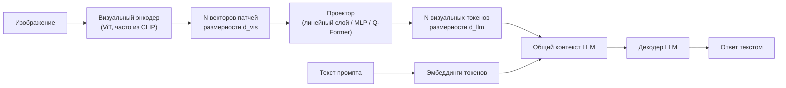

# Мультимодальность

> **Зачем эта глава.** Мультимодальность — единственная тема из «необязательного» раздела,
> которая почти наверняка коснётся вас напрямую: эмбеддинги картинок закрывают холодный старт
> в рекомендациях, CLIP-подобные модели дают zero-shot модерацию за день вместо месяца разметки,
> а VLM уже стоят в продуктовых пайплайнах. После главы вы сможете вывести контрастивную функцию
> потерь, объяснить, как изображение попадает внутрь LLM, и оценить, где мультимодальная модель
> окупается, а где это дорогая замена простому классификатору.

**Уровень:** 🎯 middle → 🧠 middle+
**Предварительно нужно:** [Computer Vision](01-computer-vision.md), [эмбеддинги](../04-nlp/02-embeddings.md), [двухбашенные модели и ANN](../06-recsys/06-two-tower-and-ann.md), [устройство LLM](../05-llm/01-llm-architecture.md)
**Как проработать:** чтение + реализация контрастивного лосса

---

## Карта главы

- [1. Проблема: два пространства, которые не разговаривают](#1-проблема-два-пространства-которые-не-разговаривают)
- [2. Контрастивное обучение и InfoNCE](#2-контрастивное-обучение-и-infonce)
- [3. CLIP: устройство и что он даёт](#3-clip-устройство-и-что-он-даёт)
- [4. Zero-shot классификация](#4-zero-shot-классификация)
- [5. Чего CLIP не умеет](#5-чего-clip-не-умеет)
- [6. VLM: как изображение попадает в LLM](#6-vlm-как-изображение-попадает-в-llm)
- [7. Мультимодальный поиск](#7-мультимодальный-поиск)
- [8. Рекомендации и холодный старт](#8-рекомендации-и-холодный-старт)
- [9. Модерация контента](#9-модерация-контента)
- [10. Компромиссы и что знать не обязательно](#10-компромиссы-и-что-знать-не-обязательно)
- [11. Подводные камни](#11-подводные-камни)
- [12. Проверь себя](#12-проверь-себя)
- [13. Практика](#13-практика)
- [14. Что читать дальше](#14-что-читать-дальше)

---

## 1. Проблема: два пространства, которые не разговаривают

Возьмём практическую задачу. В каталоге маркетплейса есть фотографии товаров и их текстовые
описания. Вы хотите: искать товары по текстовому запросу «красное платье в горошек», находить
дубли по фото, ставить фильтр на запрещённый контент и подкладывать признаки для новых товаров
без истории.

У вас уже есть инструменты. Визуальный энкодер даёт вектор картинки, текстовый — вектор описания.
Но эти векторы живут в **разных пространствах**: косинусная близость между вектором ResNet
и вектором BERT — просто число без смысла. Свести их можно только обучив что-то, что
знает соответствие.

Классический выход — размеченные классы: обучить обе модели предсказывать одну и ту же
таксономию категорий. Он плох тем, что упирается в разметку: категорий тысячи, разметка стоит
дорого, и любой новый класс требует нового цикла обучения.

Ключевое наблюдение, из которого выросла вся современная мультимодальность: **пары «картинка —
её описание» существуют в интернете в промышленных количествах бесплатно**. Alt-текст,
подписи, названия товаров, тексты рядом с изображением. Разметки классов нет, но есть
соответствие. Осталось придумать функцию потерь, которая учится на соответствии, а не на метках.

---

## 2. Контрастивное обучение и InfoNCE

Идея контрастивного обучения (contrastive learning): не предсказывать метку, а **отличать
правильную пару от неправильных**. Если модель умеет из батча в тысячу описаний выбрать то,
которое относится к данной картинке, значит, её представления схватили содержание.

Формально. Пусть в батче $B$ пар. Изображение $i$ прогоняется через визуальный энкодер,
текст $i$ — через текстовый, оба вектора приводятся к одной размерности и **нормируются
на единичную длину**. Обозначим их $z^I_i$ и $z^T_i$. Мера близости — косинусная,
а после нормировки она равна скалярному произведению:

$$
\mathrm{sim}(z^I_i, z^T_j) = \big(z^I_i\big)^{\!\top} z^T_j
$$

где $z^I_i \in \mathbb{R}^d$ — нормированный эмбеддинг $i$-го изображения, $z^T_j \in \mathbb{R}^d$ —
нормированный эмбеддинг $j$-го текста, $d$ — размерность общего пространства (у CLIP 512 или 768).

Теперь строим матрицу близостей $B \times B$ и требуем, чтобы на диагонали (правильные пары)
стояли максимумы — по строкам **и** по столбцам. Это две задачи классификации на $B$ классов,
и функция потерь — симметричная InfoNCE:

$$
\mathcal{L} = -\frac{1}{2B}\sum_{i=1}^{B}\Bigg[
\log \frac{e^{\,\mathrm{sim}(z^I_i, z^T_i)/\tau}}{\sum_{j=1}^{B} e^{\,\mathrm{sim}(z^I_i, z^T_j)/\tau}}
\;+\;
\log \frac{e^{\,\mathrm{sim}(z^I_i, z^T_i)/\tau}}{\sum_{j=1}^{B} e^{\,\mathrm{sim}(z^I_j, z^T_i)/\tau}}
\Bigg]
$$

где $B$ — размер батча, $i$ — индекс правильной (позитивной) пары, $j$ — индекс любой пары
в батче, $\tau > 0$ — температура (temperature), $e$ — основание натурального логарифма.
Первое слагаемое — «найди текст по картинке», второе — «найди картинку по тексту»; они
не эквивалентны, потому что нормировка идёт по разным осям матрицы, поэтому берут оба
и делят на $2B$.

> 📐 **Разбор формулы.** Внутри логарифма — обычный softmax по строке матрицы близостей,
> где «классом» выступает индекс текста в батче. Числитель — близость правильной пары,
> знаменатель — сумма по всем $B$ кандидатам. Максимизируя эту дробь, мы одновременно
> **притягиваем** правильную пару (растёт числитель) и **отталкиваем** все остальные
> (падает знаменатель). Слово «контрастивный» ровно про это: без отталкивания задача имеет
> тривиальное решение — отобразить всё в одну точку, тогда все близости равны и лосс
> не уменьшается. Температура $\tau$ управляет резкостью: при $\tau \to 0$ softmax становится
> почти жёстким максимумом и градиент концентрируется на самом трудном негативе; при большом
> $\tau$ все негативы вносят примерно равный вклад. В CLIP $\tau$ не задаётся, а обучается
> (через $\log(1/\tau)$, чтобы оставаться положительной) и сходится к значению около 0.01.

Отсюда — важнейшее практическое следствие: **негативы берутся из того же батча** (in-batch
negatives), поэтому качество напрямую зависит от размера батча. У CLIP он был 32768, что
потребовало распределённого обучения со сбором эмбеддингов со всех устройств. Это тот же
механизм, что в [двухбашенных моделях](../06-recsys/06-two-tower-and-ann.md) в рекомендациях, —
и там, и там большой батч даёт больше и разнообразнее негативов.

```python
# Симметричная InfoNCE — сердце CLIP. 15 строк, которые стоит уметь написать на доске.
import torch
import torch.nn.functional as F

def clip_loss(img_emb: torch.Tensor, txt_emb: torch.Tensor,
              logit_scale: torch.Tensor) -> torch.Tensor:
    """img_emb, txt_emb: (B, d) — выходы двух энкодеров.
    logit_scale — обучаемый параметр, хранится как log(1/tau): экспонента гарантирует
    положительную температуру и делает оптимизацию устойчивой."""
    img = F.normalize(img_emb, dim=-1)          # нормировка: косинус == скалярное произведение
    txt = F.normalize(txt_emb, dim=-1)
    logits = logit_scale.exp() * img @ txt.T    # (B, B): строка i — близости картинки i ко всем текстам
    labels = torch.arange(img.size(0), device=img.device)   # правильный ответ всегда на диагонали
    # Две задачи классификации: по строкам (картинка->текст) и по столбцам (текст->картинка)
    return 0.5 * (F.cross_entropy(logits, labels) + F.cross_entropy(logits.T, labels))

torch.manual_seed(0)
B, d = 8, 64
img_emb, txt_emb = torch.randn(B, d), torch.randn(B, d)
logit_scale = torch.tensor(2.6, requires_grad=True)   # exp(2.6) ~ 13.5, т.е. tau ~ 0.074
print(round(float(clip_loss(img_emb, txt_emb, logit_scale).detach()), 3))        # 3.536: пары не связаны
print(round(float(clip_loss(img_emb, img_emb.clone(), logit_scale).detach()), 3))  # 0.0: пары совпадают
```

> 💬 **На собеседовании.** Спросят: «Зачем в контрастивном лоссе температура?» Хороший ответ:
> она масштабирует логиты перед softmax и тем самым определяет, насколько сильно градиент
> концентрируется на трудных негативах. Низкая температура делает распределение острым — модель
> учится в основном на самых похожих неправильных парах, что ускоряет обучение, но делает его
> нестабильным; высокая усредняет вклад всех негативов. В CLIP температура обучаемая, чтобы
> не подбирать её вручную, и параметризована логарифмом ради положительности. Плохой ответ:
> «для сглаживания» — это описание эффекта, а не причины.

---

## 3. CLIP: устройство и что он даёт

CLIP (Contrastive Language–Image Pre-training, OpenAI, 2021) — это ровно то, что описано выше,
выполненное на масштабе: две башни (ViT или ResNet для изображений, трансформер для текста),
общее пространство, симметричная InfoNCE, ~400 миллионов пар «изображение — текст» из интернета.

Что даёт **общее пространство**, — это главный вопрос главы, и на него надо отвечать
не «модель понимает картинки», а операционально. В одном пространстве становятся сравнимы
объекты разной природы, и из этого прямо следуют четыре возможности:

1. **Поиск картинки по тексту и текста по картинке.** Обычный ANN-индекс по векторам:
   запрос кодируется той башней, которая соответствует его модальности.
2. **Zero-shot классификация.** Классы описываются словами, а не примерами (см. §4).
3. **Готовые признаки для любых downstream-задач.** Эмбеддинг CLIP оказывается сильным
   признаком даже там, где текста нет вообще: для кластеризации, дедупликации, подачи
   в бустинг.
4. **Оценка соответствия картинки и текста** как самостоятельная метрика — например,
   проверить, что фотография товара соответствует его названию.

Практически вы почти никогда не обучаете CLIP сами: это тысячи GPU-часов. Вы берёте
готовые веса (в open_clip есть десятки чекпоинтов разных размеров и датасетов) и либо
используете как есть, либо дообучаете на своём домене.

Стоит знать про **SigLIP** — модификацию, где softmax-нормировка по батчу заменена
на попарную сигмоидную функцию потерь. Смысл изменения: softmax требует, чтобы все элементы
батча были доступны при подсчёте знаменателя, что делает большие батчи дорогими
в распределённом режиме; сигмоидная формулировка разбивается на независимые пары и потому
масштабируется лучше при меньших батчах. На собеседовании достаточно знать это одно
предложение.

---

## 4. Zero-shot классификация

Механика простая, и её важно понимать буквально, потому что за словом «zero-shot» часто
предполагают магию.

Пусть нужно классифицировать фото товара по 20 категориям. Мы не обучаем ничего. Вместо этого:

1. Для каждой категории пишем текстовое описание-шаблон: «фотография кроссовок»,
   «фотография чайника».
2. Прогоняем эти строки через **текстовую** башню — получаем 20 векторов.
3. Прогоняем картинку через **визуальную** башню — получаем один вектор.
4. Считаем косинусную близость к каждому из 20 и берём максимум. При желании применяем
   softmax с температурой, чтобы получить псевдовероятности.

То есть zero-shot классификация — это построение классификатора, **веса которого заданы
текстом**. Вместо строк матрицы весов, обученных на примерах, — эмбеддинги названий классов.

```python
import numpy as np

def zero_shot(image_emb: np.ndarray, class_embs: np.ndarray, classes: list[str],
              temperature: float = 0.01) -> tuple[str, np.ndarray]:
    """image_emb: (d,), class_embs: (K, d) — эмбеддинги текстовых описаний классов.
    Обе стороны считаем уже нормированными: тогда скалярное произведение и есть косинус."""
    sims = class_embs @ image_emb                     # (K,) — близость к каждому классу
    logits = sims / temperature                       # температура превращает косинусы в логиты
    probs = np.exp(logits - logits.max())             # вычитание максимума — защита от переполнения
    probs /= probs.sum()
    return classes[int(np.argmax(probs))], probs

rng = np.random.default_rng(0)
classes = ["кроссовки", "чайник", "платье"]
class_embs = rng.normal(size=(3, 8)); class_embs /= np.linalg.norm(class_embs, axis=1, keepdims=True)
image_emb = class_embs[1] * 0.8 + rng.normal(scale=0.1, size=8)   # картинка «похожа» на чайник
image_emb /= np.linalg.norm(image_emb)
print(zero_shot(image_emb, class_embs, classes)[0])    # чайник
```

Два практических нюанса, которые дают заметную разницу в качестве.

**Формулировка подсказки важна.** «Кроссовки» и «фотография кроссовок» дают разную близость,
потому что в обучающих парах текст почти всегда был связной подписью, а не голым существительным.
Стандартный приём — ансамбль из нескольких шаблонов («фото X», «изображение X крупным планом»,
«X на белом фоне») с усреднением полученных векторов. Это дешёвый и стабильный источник
нескольких процентов качества.

**Классы должны покрывать пространство.** Softmax по 20 категориям всегда выберет одну из 20,
даже если на картинке ничего похожего нет. Нужен либо класс-«прочее» с несколькими описаниями,
либо порог по абсолютной близости, а не только по максимуму.

> 💬 **На собеседовании.** Спросят: «Как CLIP классифицирует без обучения?» Хороший ответ:
> он не классифицирует, а сравнивает — эмбеддинг картинки сопоставляется с эмбеддингами
> текстовых описаний классов в общем пространстве, и выбирается ближайшее. Фактически это
> линейный классификатор, чьи веса — векторы названий классов, поэтому добавление нового
> класса стоит одной строки текста, а не цикла дообучения. Ограничение — качество полностью
> зависит от того, встречалось ли понятие в обучающих подписях, и от формулировки подсказки.
> Плохой ответ: «CLIP обучен на всех классах ImageNet».

---

## 5. Чего CLIP не умеет

Честный список ограничений — то, что отличает человека, который его применял, от человека,
который про него читал.

**Слабая композициональность.** Текстовая башня ведёт себя ближе к «мешку понятий», чем
к синтаксическому разбору. «Собака слева от кошки» и «кошка слева от собаки» дают почти
одинаковые эмбеддинги. Всё, что требует отношений между объектами, порядка и отрицания
(«платье без рукавов»), работает плохо.

**Не считает.** «Три яблока» против «пять яблок» модель различает едва.

**Плохо с мелкими различиями внутри категории.** Отличить кроссовки от чайника легко,
конкретную модель кроссовок от соседней в линейке — почти невозможно, если названия
не встречались в обучении.

**Не читает текст на изображении надёжно.** Артикулы, состав, цены на упаковке — это задача
OCR, а не CLIP.

**Домен.** На фотографиях из интернета работает отлично; на рентгеновских снимках,
спутниковых картах, чертежах и скриншотах интерфейсов — заметно хуже, потому что таких пар
в обучении было мало.

**Наследует смещения данных.** Ассоциации из веб-корпуса приходят вместе с эмбеддингами;
для модерации и любых решений про людей это прямой риск, требующий отдельной проверки
по срезам.

Практический вывод: zero-shot CLIP — это отличный **бейзлайн за час** и отличный источник
признаков, но редко финальное решение для узкой доменной задачи. Стандартная траектория:
zero-shot → линейная голова поверх замороженных эмбеддингов на 200–500 размеченных примерах
(обычно даёт большой скачок) → полный файн-тюнинг, если нужно ещё.

---

## 6. VLM: как изображение попадает в LLM

CLIP умеет сравнивать, но не умеет отвечать на вопросы. «Что не так с этим фото товара?»
требует генерации текста с опорой на изображение. Так появились **VLM** (vision-language
models) — мультимодальные LLM.

Проблема ясна: LLM работает с последовательностью токенов из своего словаря, а изображение —
это матрица пикселей. Решение во всех современных архитектурах одно и то же по сути:
**превратить картинку в набор векторов той же размерности, что эмбеддинги токенов, и вставить
их в контекст**.



Разберём три звена.

**Визуальный энкодер.** Почти всегда ViT, и почти всегда взятый из CLIP-подобной модели —
именно потому, что его признаки уже согласованы с языком. Обучать энкодер с нуля внутри VLM
никто не делает.

**Проектор** (projector, connector) — то, что переводит визуальные векторы в пространство
эмбеддингов LLM. Варианты, которые стоит различать:

- **Линейный слой или двуслойный MLP** (подход LLaVA). Максимально просто: каждый патч
  становится одним токеном. Патчей много — 576 для ViT-L/14 на входе 336×336, — поэтому
  картинка съедает сотни токенов контекста.
- **Q-Former** (BLIP-2) — маленький трансформер с фиксированным набором обучаемых запросов
  (например, 32), которые через cross-attention «вытягивают» из патчей сжатое представление.
  На выходе всегда 32 токена независимо от разрешения: контекст экономится, часть деталей
  теряется.
- **Cross-attention внутрь LLM** (Flamingo). Визуальные признаки не занимают позиции
  в последовательности вообще: в блоки языковой модели вставляются дополнительные слои
  внимания к изображению. Не тратит контекст, но требует менять архитектуру LLM.

**Обучение** обычно двухстадийное. Сначала на парах «картинка — подпись» учится только
проектор, при замороженных энкодере и LLM: задача — попасть в нужное пространство, не сломав
уже обученные части. Затем — инструкционное дообучение на диалогах с картинками, где размораживают
LLM (полностью или через LoRA). Этот рецепт и сделал VLM доступными: вторая стадия обходится
десятками GPU-часов, а не тысячами.

**Стоимость в токенах** — то, о чём забывают, а зря. Если картинка занимает 576 токенов,
то диалог из десяти изображений — это 5760 токенов только на визуальную часть, до всякого
текста. Отсюда прямые следствия: растёт цена запроса, растёт время prefill, быстрее упирается
контекстное окно. При высоком разрешении многие VLM режут изображение на тайлы и кодируют
каждый — расход токенов растёт кратно. Оценивать бюджет надо заранее, см.
[инференс LLM](../05-llm/05-inference-and-serving.md).

> 💬 **На собеседовании.** Спросят: «Как изображение попадает в LLM?» Хороший ответ:
> визуальный энкодер (обычно ViT из CLIP) превращает картинку в набор векторов патчей,
> проектор переводит их в размерность эмбеддингов языковой модели, и они вставляются
> в контекст наравне с текстовыми токенами; дальше LLM работает как обычно. Варианты проектора
> различаются тем, сколько токенов тратится: MLP даёт один токен на патч (сотни токенов),
> Q-Former сжимает до фиксированных 32, Flamingo вообще не занимает позиции, а добавляет
> cross-attention внутрь блоков. Обучение двухстадийное: сначала проектор на подписях, потом
> инструкционное дообучение. Плохой ответ: «модель обучена на картинках и тексте вместе».

---

## 7. Мультимодальный поиск

Архитектура ровно та же, что у [двухбашенных моделей](../06-recsys/06-two-tower-and-ann.md),
и это главное, что нужно понять: мультимодальный поиск не требует новых инструментов.

Офлайн: все изображения каталога прогоняются через визуальную башню, векторы нормируются
и складываются в ANN-индекс (HNSW или IVF-PQ). Онлайн: запрос — текст или картинка — кодируется
своей башней, и по индексу ищутся ближайшие. Поскольку векторы нормированы, косинусная близость
эквивалентна скалярному произведению, а после нормировки — и евклидову расстоянию с точностью
до монотонного преобразования, поэтому подходит любой стандартный индекс.

Что важно на практике:

**Гибрид почти всегда лучше чистой векторной близости.** Текстовый поиск по названию
и характеристикам (BM25) точен на конкретных запросах («iphone 15 pro 256»), векторный —
на описательных («что-то тёплое на осень»). Их объединяют по [схемам из
RAG](../05-llm/07-rag.md): слияние списков и переранжирование.

**Реранкер поверх.** Первая стадия отдаёт 100–1000 кандидатов по вектору, вторая — более
дорогая модель, видящая пару «запрос, объект» целиком, — упорядочивает их. Так же, как
в рекомендациях и в поиске.

**Дообучение под домен окупается.** Общий CLIP не знает вашей терминологии. Дообучение
на парах «поисковый запрос — кликнутый товар» из ваших логов даёт больший прирост, чем
переход на более крупный чекпоинт. Это ровно та же контрастивная задача, только позитивы
берутся из кликов.

**Обновление индекса.** Каталог живёт: товары появляются и исчезают. Нужен инкрементальный
апдейт индекса и решение, что делать при смене версии модели, — эмбеддинги старой и новой
версии несовместимы, а полный пересчёт миллионов картинок занимает часы GPU. Практика —
двойная запись и переключение поиска на новый индекс атомарно.

---

## 8. Рекомендации и холодный старт

Это, вероятно, самое частое применение мультимодальности для обычного MLE, и его стоит
уметь развернуть на собеседовании.

Проблема. Коллаборативная фильтрация строит эмбеддинг товара из истории взаимодействий.
У нового товара истории нет — эмбеддинга нет, рекомендовать его нечем, а без показов
не появится и история. Замкнутый круг, подробно разобранный в главе про
[холодный старт](../06-recsys/12-cold-start-and-bias.md).

Решение через контент. У нового товара **есть** фотография и описание — с первой минуты.
Прогоняем их через мультимодальный энкодер, получаем вектор, и дальше используем его любым
из способов:

- **Как признаки в ранжирующей модели.** Сжимаем эмбеддинг (PCA до 32–64 компонент, иначе
  бустинг захлебнётся в 768 колонках) и подаём вместе с остальными признаками.
- **Как замену коллаборативному эмбеддингу.** Обучаем отображение из контентного пространства
  в пространство коллаборативных эмбеддингов на товарах, у которых есть и то, и другое.
  Для нового товара предсказываем его коллаборативный вектор по картинке — и он сразу попадает
  в существующий ANN-индекс.
- **Как источник кандидатов «похожее».** Ближайшие соседи по картинке — работающая
  и объяснимая для пользователя выдача, доступная сразу.
- **Как ключ дедупликации.** Один товар, залитый пятью продавцами с чуть разными фото, портит
  и выдачу, и метрики. Близость эмбеддингов ловит такие дубли надёжнее, чем сравнение названий.

Честная оговорка: контентные эмбеддинги **хуже** коллаборативных, когда история есть.
Визуально похожие товары не обязательно взаимозаменяемы, а поведение пользователей содержит
сигнал, которого нет в картинке (цена, бренд, качество, сезонность). Правильная схема —
не замена, а плавный переход: пока взаимодействий мало, вес контентного вектора высокий,
по мере накопления истории он снижается.

> 💬 **На собеседовании.** Спросят: «Как решить холодный старт для нового товара?»
> Хороший ответ: контентные эмбеддинги из фото и описания доступны с первой минуты, поэтому
> их используют либо напрямую как признаки в ранжировании, либо обучают отображение
> «контентный вектор → коллаборативный вектор» на товарах с историей и подставляют предсказание
> для новых. Плюс обязательна эксплорация: без показов история не появится никогда, поэтому
> небольшая доля трафика резервируется под новые товары. И проговорить, что контентный вектор
> уступает поведенческому, когда история есть, — нужен плавный переход по мере накопления.
> Плохой ответ: «покажем новинки в отдельном блоке».

---

## 9. Модерация контента

Задача: не пропускать запрещённые изображения — оружие, откровенный контент, чужие логотипы,
запрещённые товары. Классический подход требует по несколько тысяч размеченных примеров
на каждую категорию, а категории добавляются постоянно решением юристов.

Мультимодальная модель меняет экономику. Zero-shot фильтр на CLIP: описываем категорию
несколькими фразами, считаем близость, ставим порог. Новая категория запускается за час.
Это не даёт precision продакшен-уровня, но даёт две ценные вещи: работающий фильтр в первый
день и **инструмент для сбора разметки** — прогоняем архив, размечаем только то, что модель
считает подозрительным, и получаем обучающую выборку в десятки раз дешевле случайной разметки.

Рабочая архитектура — **каскад**, а не одна модель:

1. Дешёвый быстрый фильтр (маленький классификатор или хеши известных нарушений) отсеивает
   очевидное на всём потоке.
2. Мультимодальная модель разбирает оставшееся, выдавая оценку по каждой категории.
3. VLM применяется точечно — там, где нужен разбор контекста («на фото есть текст с обещанием
   лечения») и где объём после первых стадий уже мал: она в сотни раз дороже за объект.
4. Человек проверяет всё, что попало в серую зону между порогами.

Два порога вместо одного — ключевая деталь. Верхний порог: блокируем автоматически. Нижний:
пропускаем автоматически. Между ними — очередь модератора. Пороги подбираются не по F1,
а по бизнес-ограничению: «пропущенных нарушений не более X%» при «нагрузке на модерацию
не более Y объектов в день». Асимметрия цены ошибок здесь огромная и разная по категориям,
поэтому единый порог на все категории — распространённая и дорогая ошибка.

И обязательное: любая автоматическая блокировка нуждается в апелляции и в логировании
исходных оценок, иначе разбирать инциденты нечем.

---

## 10. Компромиссы и что знать не обязательно

**Знать нужно:** идею контрастивного обучения и формулу InfoNCE с ролью температуры
и in-batch негативов; что даёт общее пространство и как из него получается zero-shot;
ограничения CLIP; схему «визуальный энкодер → проектор → контекст LLM» и три варианта проектора;
стоимость картинки в токенах; применение эмбеддингов в поиске, рекомендациях и модерации.

**Знать не обязательно:** детали архитектуры Q-Former; устройство конкретных VLM по слоям;
методы обработки высокого разрешения (тайлинг, AnyRes); мультимодальный RLHF; генерация
изображений (диффузия) — это отдельная большая тема, не входящая в минимум; аудио-визуальные
модели; методы оценки VLM-бенчмарками.

Главный компромисс, который стоит проговаривать: **мультимодальная модель против специализированной**.
Zero-shot CLIP или VLM дают результат за день без разметки — это огромное преимущество на старте
и для длинного хвоста редких категорий. Но на узкой задаче с фиксированным набором классов
маленький специализированный классификатор, обученный на 2000 примерах, обычно точнее, в сотни
раз дешевле в инференсе и предсказуемее. Правильная траектория почти всегда одна: zero-shot
как бейзлайн и как машина для сбора разметки → специализированная модель на основном потоке →
мультимодальная остаётся на хвосте и на новых категориях.

> 🧠 **Middle+.** Отдельный сигнал зрелости — умение считать деньги. VLM на каждое изображение
> при 100 запросах в секунду — это порядок сотен тысяч запросов в час с сотнями токенов
> контекста на каждый; посчитайте стоимость по прайсу API или по GPU-часам и сравните
> с классификатором на ResNet-18, обрабатывающим тот же поток на одной карте. Разница обычно
> в два-три порядка. Это не аргумент против VLM — это аргумент за каскад, где дорогая модель
> видит доли процента трафика.

---

## 11. Подводные камни

**Эмбеддинги из разных версий модели смешались в одном индексе.**
Симптом: поиск внезапно стал выдавать мусор для части каталога.
Причина: часть векторов посчитана старым чекпоинтом; пространства несовместимы, близости
между ними бессмысленны.
Что делать: хранить версию модели рядом с вектором, пересчитывать индекс целиком при смене
модели, переключать поиск атомарно.

**Zero-shot отлично работает на демо и плохо в проде.**
Симптом: на десяти подобранных примерах всё верно, на потоке precision 0.4.
Причина: выбор из закрытого списка классов всегда возвращает какой-то класс, а реальный поток
содержит объекты вне списка; плюс отсутствие порога по абсолютной близости.
Что делать: добавить класс «прочее», ввести порог, оценивать на случайной выборке трафика,
а не на подобранных примерах.

**Косинусные близости несравнимы между запросами.**
Симптом: порог 0.28 хорошо работает для одной категории и пропускает всё для другой.
Причина: абсолютные значения косинуса зависят от того, насколько «типичен» текст запроса;
распределения сдвинуты по категориям.
Что делать: калибровать пороги по категориям либо переходить от абсолютной близости
к ранговой (насколько ближе, чем медиана случайных объектов).

**Забыли нормировать векторы.**
Симптом: качество поиска заметно хуже ожидаемого, метрики ANN не воспроизводят офлайн-оценку.
Причина: без нормировки скалярное произведение смещено длиной вектора, а популярные индексы
настроены на косинус.
Что делать: нормировать сразу после энкодера, один раз, и проверять норму как инвариант
в тестах.

**Картинка съела контекст.**
Симптом: VLM игнорирует часть инструкции, ответы обрываются, стоимость выше расчётной.
Причина: сотни визуальных токенов на изображение, а при тайлинге высокого разрешения — тысячи.
Что делать: считать бюджет токенов заранее, снижать разрешение до необходимого, использовать
модели со сжимающим проектором, не подавать несколько изображений там, где хватает одного.

**Дообучили CLIP на своём домене и потеряли zero-shot.**
Симптом: на целевой категории стало лучше, на всём остальном — резко хуже.
Причина: катастрофическое забывание при полном файн-тюнинге на узком наборе.
Что делать: обучать только голову или LoRA, держать малый learning rate, подмешивать
общие данные, оценивать на контрольном наборе вне домена до и после.

---

## 12. Проверь себя

<details>
<summary><b>🎯 Вопрос.</b> Объясните, чему учится CLIP и запишите функцию потерь.</summary>

**Короткий ответ.** Он учится помещать изображение и его описание в одну точку общего
пространства и разводить неправильные пары. Функция потерь — симметричная InfoNCE: softmax
по строкам и по столбцам матрицы косинусных близостей внутри батча, правильные ответы
на диагонали.

**Развёрнуто.** Оба энкодера дают нормированные векторы размерности $d$; матрица
$B \times B$ содержит косинусы всех пар в батче, делённые на температуру $\tau$. Лосс —
полусумма двух кросс-энтропий: «найди текст по картинке» и «найди картинку по тексту».
Негативы берутся из того же батча, поэтому размер батча — критичный гиперпараметр
(в CLIP 32768). Температура обучаемая, параметризована через логарифм ради положительности;
она управляет тем, насколько градиент концентрируется на трудных негативах. Без
отталкивающего члена задача имеет вырожденное решение — все векторы в одной точке.

**Чего ждёт интервьюер:** формулу с пониманием роли знаменателя и температуры, а не пересказ
идеи словами.

**Провал:** «CLIP обучен на картинках и текстах» без механики.
</details>

<details>
<summary><b>🎯 Вопрос.</b> Почему в контрастивном обучении важен размер батча?</summary>

**Короткий ответ.** Потому что негативы берутся из батча: чем он больше, тем больше
и разнообразнее множество, из которого модель учится отличать правильную пару, и тем сильнее
обучающий сигнал.

**Развёрнуто.** Знаменатель InfoNCE — сумма по кандидатам батча; при $B = 32$ задача «выбери
один из 32» тривиальна и градиент быстро вырождается, при $B = 32768$ она содержательна.
Отсюда инженерные последствия: нужен сбор эмбеддингов со всех устройств (all-gather),
растёт память, и появляются приёмы вроде очереди негативов из предыдущих батчей.
SigLIP решает ту же проблему иначе — заменяя softmax по батчу на попарный сигмоидный лосс,
который не требует глобального знаменателя и потому лучше масштабируется. Это тот же сюжет,
что с in-batch negatives в двухбашенных моделях рекомендаций.

**Чего ждёт интервьюер:** связи «батч → негативы → сила сигнала» и знания, что это инженерное
ограничение, а не гиперпараметр по вкусу.

**Провал:** «большой батч всегда лучше для обучения» — общее место, не отвечающее на вопрос.
</details>

<details>
<summary><b>🌱 Вопрос.</b> Как работает zero-shot классификация через CLIP?</summary>

**Короткий ответ.** Названия классов превращаются в текстовые эмбеддинги, картинка —
в визуальный, и выбирается класс с максимальной косинусной близостью. Это линейный
классификатор, чьи веса заданы текстом, а не обучены на примерах.

**Развёрнуто.** Практически важны два момента. Первый — формулировка: шаблон
«фотография X» работает лучше голого слова, потому что обучающие подписи были связными
фразами; ансамбль из нескольких шаблонов с усреднением векторов даёт ещё несколько процентов.
Второй — закрытость множества: softmax всегда выберет один из перечисленных классов, поэтому
нужен класс «прочее» или порог по абсолютной близости, иначе на реальном потоке precision
обвалится. Zero-shot стоит воспринимать как бейзлайн за час и как машину для сбора разметки,
а не как финальное решение.

**Чего ждёт интервьюер:** механику плюс осознание проблемы закрытого множества классов.

**Провал:** «CLIP знает все классы».
</details>

<details>
<summary><b>🎯 Вопрос.</b> Как изображение попадает внутрь языковой модели?</summary>

**Короткий ответ.** Визуальный энкодер (обычно ViT из CLIP) даёт векторы патчей, проектор
переводит их в размерность эмбеддингов LLM, и они вставляются в контекст как токены.
Дальше LLM работает как с обычным текстом.

**Развёрнуто.** Варианты проектора различаются ценой в токенах: MLP даёт один токен на патч
(сотни токенов на изображение), Q-Former сжимает до фиксированного числа обучаемых запросов
(например, 32), Flamingo вместо этого добавляет cross-attention к визуальным признакам внутрь
блоков LLM и не занимает позиции в последовательности. Обучение двухстадийное: сначала только
проектор на парах «картинка — подпись» при замороженных энкодере и LLM, затем инструкционное
дообучение с разморозкой LLM или через LoRA. Практически важно считать бюджет: изображение
может стоить сотни токенов, а при тайлинге высокого разрешения — тысячи, что напрямую бьёт
по цене и по времени prefill.

**Чего ждёт интервьюер:** три звена схемы и понимание, что визуальные токены — это обычные
позиции контекста со своей стоимостью.

**Провал:** «модель обучили на картинках вместе с текстом».
</details>

<details>
<summary><b>🎯 Вопрос.</b> Где мультимодальные эмбеддинги помогают в рекомендациях?</summary>

**Короткий ответ.** В холодном старте: у нового товара нет истории, но есть фото и описание.
Контентный вектор идёт либо признаком в ранжирование, либо через обученное отображение
в пространство коллаборативных эмбеддингов, либо как источник кандидатов «похожее»
и ключ дедупликации.

**Развёрнуто.** Отображение «контент → коллаборативный вектор» обучается на товарах, где есть
и то, и другое, и позволяет новому товару сразу попасть в существующий ANN-индекс — это
аккуратнее, чем держать два параллельных пространства. Эмбеддинг в бустинг подают сжатым
(PCA до 32–64 компонент), иначе сотни колонок разрушают модель. Важная честная оговорка:
контентный сигнал слабее поведенческого, когда история есть, потому что визуальное сходство
не равно взаимозаменяемости; нужен плавный переход по мере накопления взаимодействий.
И контент не отменяет эксплорации: без показов история не появится.

**Чего ждёт интервьюер:** конкретной схемы встраивания в существующий пайплайн, а не общего
«используем CLIP».

**Провал:** предложить полностью заменить коллаборативные эмбеддинги контентными.
</details>

<details>
<summary><b>🧠 Вопрос.</b> Каковы ограничения CLIP и как вы их проверите на своей задаче?</summary>

**Короткий ответ.** Слабая композициональность (отношения, порядок, отрицания), неумение
считать, слабость на мелких внутрикатегорийных различиях и на тексте внутри изображения,
падение качества вне веб-домена, унаследованные смещения. Проверяются целевым тестовым набором
с этими типами запросов.

**Развёрнуто.** Практический протокол — собрать небольшой, но злой набор: пары, отличающиеся
только порядком слов; запросы с отрицанием; изображения с разным числом объектов; близкие
модели одного товара; примеры из своего домена, если он не веб. Замерить top-1 и recall@k
на нём отдельно от общего теста. Обычно результат честно показывает, где zero-shot
не справится и нужна голова, обученная на своих данных. Отдельно стоит прогнать срезы
по чувствительным категориям, если решения касаются людей.

**Чего ждёт интервьюер:** что вы проверяете модель адресно, а не по одной агрегированной
метрике.

**Провал:** перечислить ограничения списком без плана проверки.
</details>

<details>
<summary><b>🎯 Вопрос.</b> Спроектируйте модерацию изображений на маркетплейсе.</summary>

**Короткий ответ.** Каскад: дешёвый фильтр и хеши известных нарушений на всём потоке →
CLIP-подобная модель с порогами по категориям → VLM точечно на сложных случаях → человек
в серой зоне между двумя порогами. Пороги подбираются под бизнес-ограничение, а не под F1.

**Развёрнуто.** Два порога вместо одного — ключ: верхний для автоблокировки, нижний
для автопропуска, между ними очередь модератора. Асимметрия цены ошибок разная по категориям,
поэтому пороги калибруются отдельно для каждой. Zero-shot нужен не только как фильтр,
но и как машина сбора разметки: прогоняем архив, размечаем подозрительное, получаем выборку
в разы дешевле. Обязательны логирование оценок, процесс апелляции и мониторинг доли объектов
в серой зоне — её рост означает либо дрифт контента, либо новую схему обхода. Постановка
целиком раскладывается по [каркасу ML System Design](../11-system-design/01-framework.md).

**Чего ждёт интервьюер:** каскада, двух порогов и человека в цикле, а не «обучим классификатор».

**Провал:** одна модель с порогом 0.5 на все категории.
</details>

<details>
<summary><b>🎯 Вопрос.</b> Чем мультимодальный поиск отличается от текстового?</summary>

**Короткий ответ.** Ничем архитектурно: та же двухбашенная схема с ANN-индексом, только
объекты кодируются визуальной башней, а запрос — текстовой или визуальной. Отличия
в практике — гибрид с BM25, реранкер и дообучение на кликах.

**Развёрнуто.** Векторный поиск силён на описательных запросах и слаб на точных, где выигрывает
лексический BM25, поэтому в проде почти всегда стоит гибрид со слиянием списков. Сверху —
реранкер на паре «запрос, объект». Дообучение общего CLIP на своих логах кликов — это та же
контрастивная задача с позитивами из кликов, и оно обычно даёт больше, чем переход
на более крупный чекпоинт. Эксплуатационно главная сложность — обновление индекса и смена
версии модели: эмбеддинги разных версий несовместимы, нужен полный пересчёт и атомарное
переключение.

**Чего ждёт интервьюер:** что вы узнаёте знакомую двухбашенную архитектуру и говорите
про эксплуатацию индекса.

**Провал:** описывать это как принципиально новую технологию.
</details>

<details>
<summary><b>🧠 Вопрос.</b> Когда мультимодальная модель не нужна?</summary>

**Короткий ответ.** Когда задача — фиксированный небольшой набор классов, разметка доступна
и поток большой: специализированный маленький классификатор точнее, дешевле в сотни раз
и предсказуемее.

**Развёрнуто.** Правильная траектория — zero-shot как бейзлайн и как инструмент сбора
разметки, затем специализированная модель на основном потоке, а мультимодальная остаётся
на длинном хвосте редких и новых категорий, где разметки нет и не будет. Считать надо деньги:
VLM на каждом объекте при заметном RPS отличается по стоимости от маленькой CNN на два-три
порядка. Отдельный аргумент против — латентность: VLM отвечает сотни миллисекунд, что не влезает
в онлайн-бюджет большинства сервисов.

**Чего ждёт интервьюер:** что вы не считаете новую технологию самоцелью и умеете оценить
стоимость.

**Провал:** «всегда лучше взять мультимодальную модель, она универсальнее».
</details>

<details>
<summary><b>🎯 Вопрос.</b> Почему эмбеддинги нормируют перед поиском?</summary>

**Короткий ответ.** Чтобы скалярное произведение равнялось косинусу. Без нормировки длина
вектора влияет на близость, и объекты с большой нормой всплывают в выдаче независимо
от содержания.

**Развёрнуто.** Контрастивный лосс обучался на косинусах, поэтому семантика заложена
в направление вектора, а не в длину. Большинство ANN-индексов работают либо с внутренним
произведением, либо с евклидовым расстоянием; на нормированных векторах обе метрики
монотонно связаны с косинусом, и любой индекс подходит. Практическая рекомендация —
нормировать один раз сразу после энкодера и проверять норму как инвариант в тестах:
это ошибка, которую легко внести при рефакторинге и трудно заметить по метрикам сервиса.

**Чего ждёт интервьюер:** связи между тем, на чём обучался лосс, и тем, как считается близость
в проде.

**Провал:** «так принято» или «для численной стабильности».
</details>

---

## 13. Практика

**Задача 1. Контрастивный лосс с нуля (1 час).**
Реализуйте `clip_loss` из §2, не подглядывая, и проверьте три инварианта: при совпадающих
эмбеддингах лосс близок к нулю; при `logit_scale = 0` (то есть $\tau = 1$) и случайных
эмбеддингах он близок к $\log B$ — значению, отвечающему равномерному распределению по батчу;
при перестановке текстов внутри батча лосс резко растёт.
*Сделано правильно: все три проверки проходят, и вы можете объяснить, почему при высокой
температуре лосс стремится именно к $\log B$, а при низкой становится больше.*

**Задача 2. Zero-shot и подсказки (1.5 часа).**
Возьмите любой готовый CLIP-чекпоинт (например, через `open_clip`) и датасет из 5–10 классов.
Сравните три варианта описаний классов: голое слово, шаблон «фотография X», ансамбль
из пяти шаблонов.
*Сделано правильно: у вас есть таблица «формулировка → accuracy», разница между вариантами
измерена, и вы можете назвать классы, где формулировка решает больше всего.*

**Задача 3. Линейная голова против zero-shot (1 час).**
На том же датасете обучите логистическую регрессию поверх замороженных CLIP-эмбеддингов,
используя 10, 50 и 200 примеров на класс.
*Сделано правильно: вы построили кривую «число примеров → accuracy» и знаете, на скольких
примерах обученная голова обгоняет zero-shot. Обычно это происходит быстрее, чем ожидается.*

**Задача 4. Поиск по каталогу (2 часа).**
Постройте векторный индекс по 5–10 тысячам изображений, реализуйте поиск по текстовому запросу
и оцените recall@10 на 30 запросах, размеченных вручную. Затем добавьте простой лексический
поиск по названиям и объедините списки.
*Сделано правильно: гибрид обгоняет обе одиночные схемы, и вы можете показать примеры запросов,
где выигрывает каждая из них.*

---

## 14. Что читать дальше

- [Radford et al. «Learning Transferable Visual Models From Natural Language Supervision» (CLIP, 2021)](https://arxiv.org/abs/2103.00020) —
  первоисточник. Читать разделы про функцию потерь, про инженерию подсказок и, обязательно,
  про ограничения — там честный разбор того, чего модель не умеет.
- [van den Oord et al. «Representation Learning with Contrastive Predictive Coding» (2018)](https://arxiv.org/abs/1807.03748) —
  откуда взялся InfoNCE и его связь с оценкой взаимной информации.
- [Zhai et al. «Sigmoid Loss for Language Image Pre-Training» (SigLIP, 2023)](https://arxiv.org/abs/2303.15343) —
  почему от softmax по батчу можно отказаться и что это даёт при обучении.
- [Li et al. «BLIP-2» (2023)](https://arxiv.org/abs/2301.12597) — Q-Former как способ соединить
  замороженный визуальный энкодер с замороженной LLM малой кровью.
- [Liu et al. «Visual Instruction Tuning» (LLaVA, 2023)](https://arxiv.org/abs/2304.08485) —
  самый простой работающий рецепт VLM: линейный проектор плюс двухстадийное обучение.
  Хорошая точка входа, если строите своё.
- [Alayrac et al. «Flamingo» (2022)](https://arxiv.org/abs/2204.14198) — вариант с cross-attention
  внутрь LLM; полезно для понимания, почему подходы различаются по расходу контекста.
- [open_clip](https://github.com/mlfoundations/open_clip) — открытые реализации и десятки
  чекпоинтов CLIP-подобных моделей с воспроизводимыми метриками; практический старт
  для любой задачи из этой главы.

---

⬅️ [Звук и речь: необходимый минимум](02-audio-and-speech.md) | 🏠 [Оглавление](../index.md) | ➡️ [Процесс найма изнутри](../14-career/01-interview-process.md)
