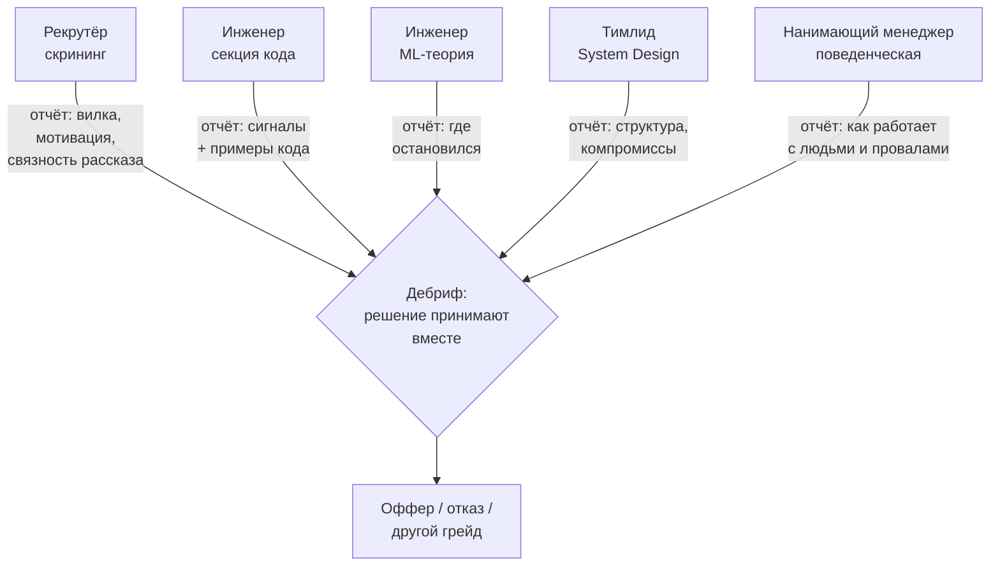

# Процесс найма изнутри

> **Зачем эта глава.** Технической подготовки мало: половина отказов случается не там, где
> кандидат чего-то не знал, а там, где он неверно понял, кто и что оценивает, как читают его
> резюме и что происходит с его кандидатурой между этапами. Здесь — механика найма со стороны
> компании, формат описания проектов, план подготовки по неделям, что делать между секциями
> и после отказа, и как читать вакансию.

**Уровень:** для всех, но акцент на 🎯 middle → 🧠 middle+
**Предварительно нужно:** [Карта собеседования MLE](../00-start/03-interview-map.md) — там разобрано,
что спрашивают на каждой секции; здесь мы этот разбор не повторяем, а смотрим на процесс вокруг него
**Время на проработку:** ~2 часа + один вечер на переписывание резюме

---

## Карта главы

- [1. Воронка глазами компании](#1-воронка-глазами-компании) — почему процесс устроен именно так
- [2. Кто вас оценивает на каждом этапе](#2-кто-вас-оценивает-на-каждом-этапе) — и кто принимает решение
- [3. Резюме: как его читают за сорок секунд](#3-резюме-как-его-читают-за-сорок-секунд)
- [4. Как описывать проекты](#4-как-описывать-проекты) — роль, цифры, компромиссы
- [5. Портфолио и pet-проекты](#5-портфолио-и-pet-проекты) — что реально открывают
- [6. Тайминг: план на восемь недель](#6-тайминг-план-на-восемь-недель)
- [7. Что делать между этапами](#7-что-делать-между-этапами)
- [8. Отказ](#8-отказ) — обратная связь, когда возвращаться
- [9. Красные флаги в вакансии и в процессе](#9-красные-флаги-в-вакансии-и-в-процессе)
- [10. Подводные камни](#10-подводные-камни)
- [11. Проверь себя](#11-проверь-себя)
- [12. Практика](#12-практика)
- [13. Что читать дальше](#13-что-читать-дальше)

---

## 1. Воронка глазами компании

Кандидат видит цепочку испытаний. Компания видит другое: **очередь заявок, ограниченное время
инженеров и асимметричную цену ошибки**.

Посчитаем. Полный цикл на одного кандидата, дошедшего до финала, стоит компании примерно так:
30–40 минут рекрутёра на скрининг и переписку, 4–6 часов инженерного времени на технические
секции (каждая секция — это час интервьюера плюс 20–30 минут на написание отчёта), час на дебриф
с участием трёх-четырёх человек. Итого порядка 8–12 человеко-часов, и это только по тем,
кто дошёл. С учётом отсева на ранних этапах стоимость одного оффера — десятки часов.

Теперь цена ошибки. Неудачный найм middle-инженера — это три-шесть месяцев зарплаты, время
ментора, испорченный проект и болезненный разговор в конце. Разница между «отказали хорошему»
и «взяли неподходящего» для компании не симметрична: первое стоит ещё одного цикла интервью,
второе — квартала.

Отсюда следует главное правило, которое объясняет всё остальное поведение процесса:

> **При сомнении решение принимается против кандидата.** Не потому, что интервьюер злой,
> а потому, что так устроена экономика найма.

Из этого правила выводится почти вся тактика подготовки. Ваша задача — не «понравиться»,
а **не оставить сомнений**. Сомнение возникает там, где ответ общий: «мы использовали бустинг»,
«метрика выросла», «занимался рекомендациями». Конкретика сомнение снимает: «я отвечал за стадию
кандидатов, заменил item2vec на двухбашенку, recall@100 вырос с 0.41 до 0.53, в A/B это дало
+3.1% к конверсии в заказ при неизменной латентности p99».

> ⚠️ **Типичная ошибка.** Считать, что интервью — это экзамен, где надо набрать баллов больше
> порога. На деле это скорее **сбор доказательств**: интервьюер пишет отчёт, в котором должен
> обосновать решение перед коллегами. Помогите ему — давайте формулировки, которые он сможет
> процитировать. Ответ, который невозможно пересказать, не переживёт дебриф.

---

## 2. Кто вас оценивает на каждом этапе

Содержание секций разобрано в [карте собеседования](../00-start/03-interview-map.md).
Здесь — другая ось: **кто перед вами сидит, что он на самом деле решает и чего он решать
не может**.



| Этап | Кто ведёт | Что он реально решает | Чего он НЕ оценивает |
|---|---|---|---|
| Скрининг | рекрутёр, чаще всего не инженер | попадаете ли в вилку, локацию, сроки; звучит ли рассказ связно | вашу техническую глубину |
| Код | инженер, часто из другой команды | пишете ли вы код руками и вслух | ваш опыт и домен |
| ML-теория | инженер вашего или соседнего направления | глубину: до какого «а почему?» вы дойдёте | ваши инженерные навыки |
| System Design | будущий тимлид или сильный инженер | умение вести задачу самому | скорость кодирования |
| Поведенческая | нанимающий менеджер, иногда кросс-функциональный интервьюер | как вы ведёте себя в конфликте и в провале | всё техническое |
| Финал | нанимающий менеджер, иногда руководитель направления | грейд, вилку, совместимость с командой | заново — технику |

Три следствия, которые стоит держать в голове.

**Первое: решение принимается не на интервью, а на дебрифе.** Интервьюер пишет отчёт, и на общей
встрече отчёты сопоставляются. Поэтому важна не «химия» в моменте, а **цитируемость**: числа,
названия, конкретные технические выборы. Впечатление «приятный парень» проигрывает записи
«назвал бюджет латентности по стадиям и сам указал слабое место решения».

**Второе: рекрутёр — не препятствие, а ваш союзник.** Его KPI — закрытая вакансия, то есть
он заинтересован, чтобы вы прошли. С ним можно и нужно обсуждать вилку, сроки, состав секций,
имена интервьюеров, причину отказа. Рекрутёр, с которым вы держите нормальный контакт, будет
подталкивать процесс за вас.

**Третье: разные интервьюеры не сговариваются.** Если вы провалили секцию кода, это не значит,
что на теории надо «отыгрываться» — интервьюер теории вашего провала не видел. Каждую секцию
начинайте с чистого листа.

Отдельно про **грейд**. Его определяют не в конце, а постепенно: каждая секция даёт оценку
не «прошёл / не прошёл», а «на каком уровне». Поэтому распространённый сценарий — оффер
не на ту позицию, на которую вы откликались: сильные технические секции при слабой
поведенческой и отсутствии историй про влияние дают «middle вместо middle+». Если для вас
принципиален грейд, скажите об этом рекрутёру заранее и спросите, чем на их шкале отличаются
соседние ступени: это законный вопрос, и ответ на него подскажет, какие истории готовить.

> 💬 **На собеседовании.** Спросят: «Почему уходите с текущего места?» Это проверка
> на два риска сразу: не сбежите ли вы так же через полгода и не конфликтный ли вы человек.
> Хороший ответ — про то, чего вам не хватает, а не про то, кто виноват: «Мы сделали
> и стабилизировали рекомендации, дальше в моей зоне — поддержка и мелкие итерации.
> Я хочу задачи с онлайн-инференсом под нагрузкой; у нас всё батчевое и в ближайший год
> это не изменится». Плохой ответ — критика бывших коллег и руководителя, даже справедливая:
> интервьюер не может её проверить, зато делает вывод о том, как вы будете говорить о нём.

> 💬 **На собеседовании.** Скрининг почти всегда открывается фразой «расскажите о себе».
> Это не разминка, это оцениваемый вопрос: рекрутёр проверяет, сможете ли вы объяснить
> свою работу человеку без ML-бэкграунда, и заодно решает, какой грейд писать в отчёте.
> Хороший ответ — 90 секунд по схеме «где → что за система → моя зона → результат в числах →
> почему ищу»: «Три года в e-commerce, последние полтора — ранжирование в поисковой выдаче.
> Отвечал за фичи и ранжирующую модель, перевёл её с бустинга на признаках спроса на
> LambdaMART с сессионными фичами: NDCG@10 +8%, в A/B конверсия +2.4%. Сейчас ищу задачи,
> где есть онлайн-инференс под нагрузкой, — у нас всё батчевое». Плохой ответ — хронология
> с 2016 года, перечисление всех проектов и фраза «ну и вот, как-то так».

---

## 3. Резюме: как его читают за сорок секунд

Резюме на позицию middle MLE в крупной компании читают не для того, чтобы понять вас,
а чтобы решить за полминуты: тратить ли на вас час скрининга. Читающий (рекрутёр, а потом
нанимающий менеджер) ищет три вещи, и именно в этом порядке:

1. **Релевантность.** Работал ли человек с похожими задачами и данными.
2. **Доведение до пользователя.** Есть ли следы прода: A/B, латентность, мониторинг, нагрузка.
3. **Масштаб.** Числа: RPS, объёмы данных, размер каталога, размер команды.

Всё остальное — оформление, хобби, курсы — влияет на порядок величины меньше.

**Структура, которая работает.**

- Шапка: имя, роль (**«ML Engineer, рекомендации и ранжирование»**, а не «специалист по данным»),
  город и формат работы, контакты, ссылки на GitHub и профиль. Одна строка стека — то, чем вы
  реально пользуетесь еженедельно.
- Опыт: обратный хронологический порядок, для каждого места 3–5 буллетов о **проектах**,
  а не об обязанностях.
- Образование и курсы: одной строкой в конце, если у вас есть 3+ года опыта.
- Публикации, доклады, соревнования: отдельным коротким блоком, если есть что показать.

**Длина** — одна страница до трёх лет опыта, две — дальше. Формат — PDF с текстовым слоем
(картинку не прочитает ни человек в спешке, ни парсер).

**Чего в резюме быть не должно:** списка из сорока технологий (он обесценивает те пять,
которые вы знаете хорошо), формулировок «участвовал в разработке», «занимался», «помогал»,
процентов без базы («улучшил качество на 30%» — какое качество, с чего до чего), а также
самооценок вроде «отличный командный игрок» — это не проверяемо и потому не читается.

> ⚠️ **Типичная ошибка.** Одно резюме на все вакансии. Не нужно писать новое под каждую,
> но **порядок буллетов** менять надо: на RecSys-вакансию наверх идут проекты про ранжирование,
> на LLM-вакансию — про инференс и качество генерации. Читают первые две трети первой страницы;
> то, что там не оказалось, не существует.

---

## 4. Как описывать проекты

Это самая ценная часть резюме и одновременно то, что вы будете рассказывать на скрининге,
на поведенческой и в начале технических секций. Формат один и тот же.

**Четыре элемента, все обязательны.**

1. **Задача и контекст.** Что было плохо и почему это волновало бизнес.
2. **Ваша личная роль.** Что делали именно вы, а не команда.
3. **Результат в цифрах.** Метрика, база и дельта. Желательно две метрики: ML-ная и продуктовая.
4. **Компромисс.** Что вы выбрали и от чего отказались — и почему.

Четвёртый пункт почти никто не пишет, и именно он отличает middle+ от middle. Он показывает,
что вы принимали решение, а не выполняли инструкцию.

**Было:**

> Разработка модели рекомендаций. Использовались Python, LightGBM, Airflow, Spark.
> Улучшили метрики качества рекомендаций.

**Стало:**

> Персональные рекомендации на главной (12 млн MAU, каталог 4 млн SKU). Отвечал за стадию отбора
> кандидатов: заменил топ-популярного на двухбашенную модель с ANN-поиском (HNSW), поднял
> recall@200 с 0.38 до 0.57; в A/B на 10% трафика — +3.1% конверсии в заказ, p99 выдачи вырос
> с 120 до 140 мс при бюджете 200. Сознательно не стал делать онлайн-обновление эмбеддингов
> пользователя: выигрыш в офлайне был около 1% recall, а поддержка стрим-контура не окупалась
> при команде из двух человек.

Второй вариант длиннее в три раза и стоит в двадцать раз больше. По нему видно масштаб,
личную зону ответственности, обе метрики, guardrail (латентность) и осознанный отказ от
усложнения.

**Что делать, если результата в цифрах нет.** Такое бывает: проект закрыли, A/B не запустили,
цифры под NDA. Варианты по убыванию силы:
- относительные величины без абсолютов — «+6% к CTR» без раскрытия самого CTR (обычно это NDA
  не нарушает, но сверьтесь со своим договором);
- порядок величины — «десятки миллионов событий в сутки», «каталог в единицах миллионов SKU»;
- результат не в метрике, а в решении — «по итогам эксперимента доказали, что модель не окупает
  инфраструктуру, проект закрыли и сэкономили квартал команды». Это полноценный результат,
  и рассказывать его не стыдно, а полезно.

> 💬 **На собеседовании.** Спросят: «А что здесь сделали лично вы?» — и это не подвох,
> а обязательный вопрос по чек-листу. Хороший ответ разделяет вклад явно: «Архитектуру
> обсуждали втроём, идея двухбашенки была тимлида. Я сделал сбор датасета с in-batch negatives,
> обучение, подбор параметров HNSW под бюджет 15 мс и выкатку через shadow-режим. Дашборд
> мониторинга делал коллега из платформы». Плохой ответ — сплошное «мы»: из него невозможно
> вытащить вашу зону, и интервьюер вынужден написать в отчёте «вклад неясен», что на дебрифе
> читается как «вклада не было».

---

## 5. Портфолио и pet-проекты

Честная оценка: **GitHub открывают не всегда, а если открывают — смотрят 30–60 секунд**.
Поэтому вопрос не «есть ли у меня проекты», а «что видно за минуту».

**Кому pet-проект действительно нужен:** тем, у кого в рабочем опыте нет доведения модели
до пользователей — переходящим из аналитики, из академии, из другого домена. Если вы три года
катите модели в прод, дополнительный проект не добавит почти ничего.

**Что смотрят в первую минуту:**

| Смотрят | Хороший сигнал | Плохой сигнал |
|---|---|---|
| README | постановка, схема, метрика против бейзлайна, раздел «что не работает» | «Проект по классификации ирисов» |
| Запуск | `docker compose up` и работает | десять шагов установки, версии не зафиксированы |
| Структура | пакет с модулями, тесты, конфиги | один ноутбук на 900 ячеек |
| Тесты | есть тесты на данные и на модель | нет вовсе |
| Прод-часть | HTTP-сервис, замер латентности под нагрузкой, метрики | только `model.fit()` |
| История коммитов | осмысленные сообщения, работа за несколько недель | один коммит «init» |

Главное, что делает проект ценным на интервью: он даёт вам **материал для историй**. После
такого проекта у вас есть ответы на «а что было, когда сломалось», «какой компромисс приняли»,
«сколько это стоило» — то есть на вопросы, где кандидаты без прод-опыта молчат.

**Про Kaggle.** Соревновательный опыт — узкий, но реальный сигнал: он подтверждает работу
с признаками и валидацией. Ценность резко зависит от результата: золото или топ-1% — сигнал,
«участвовал в трёх соревнованиях» — нет. И почти никогда Kaggle не закрывает вопросы про прод:
там нет ни латентности, ни мониторинга, ни дрифта.

**Про доклады, статьи и опенсорс.** Это сильный, но дорогой сигнал. Доклад на профильной
конференции или разбор в инженерном блоге компании подтверждает сразу две вещи: вы довели
что-то до результата и умеете это объяснять. Принятый пул-реквест в библиотеку, которой
пользуется команда, весит больше десяти собственных репозиториев. Но ни то, ни другое
не заменяет рабочего опыта: это добавка к резюме, а не его основа. Если выбираете между
«довести проект до сервиса» и «написать статью» — сначала первое, потому что статья
без проекта не о чем.

> ⚠️ **Типичная ошибка.** Проект, повторяющий чужой туториал. Он опознаётся мгновенно
> (по структуре и по датасету) и работает в минус: вы потратили время, а сигнала ноль.
> Возьмите вместо этого свою маленькую задачу с некрасивыми данными — и доведите до сервиса
> с мониторингом. Один такой проект стоит пяти форков курсов.

**Отдельный случай — люди из академии.** Публикации читаются как сильный сигнал по глубине
и по самостоятельности, но одновременно поднимают вопрос «доведёт ли до прода». Лечится
одним абзацем в резюме и одной историей: любой, даже маленький, работающий сервис с замеренной
латентностью снимает этот вопрос полностью.

---

## 6. Тайминг: план на восемь недель

Опорная оценка длительности подготовки есть в [карте собеседования](../00-start/03-interview-map.md):
6–8 недель при наличии базы. Здесь — как эти недели устроены и, что важнее, **как их совместить
с откликами**.

| Недели | Фокус подготовки | Что делаем с откликами |
|---|---|---|
| 1–2 | ML-теория: закрыть дыры по ядру (метрики, валидация, бустинг, дисбаланс) | обновляем резюме, собираем список из 10–15 компаний |
| 3–4 | код и SQL до автоматизма, ежедневно по задаче | откликаемся в 2–3 «разогревочные» компании |
| 5 | прод, мониторинг, A/B | разогревочные интервью идут, собираем лог пробелов |
| 6 | System Design: 4–5 прогонов кейсов с таймером | откликаемся в основные компании |
| 7 | поведенческая: банк историй, моки | основные интервью |
| 8 | повторение по логу пробелов | финалы, офферы в одном окне |

Три тактических правила, которые работают лучше, чем содержание плана.

**Разогрев обязателен.** Первые два-три собеседования вы провалите не по знаниям, а по формату:
забудете проговаривать мысли, потеряете время, растеряетесь от «а почему?». Поэтому первыми
идут компании, куда вам не очень надо. Никогда не начинайте с компании мечты.

**Офферы должны прийти в одно окно.** Оффер живёт 1–2 недели. Если вы получите первый в марте,
а второй в мае, сравнить их будет нельзя — придётся решать вслепую. Поэтому основные отклики
делаются пачкой, в интервале одной-двух недель. Это единственный способ получить выбор,
а выбор — единственный реальный рычаг в переговорах (см. [Рост и переговоры](03-growth-and-negotiation.md)).

**Параллельно ведите 4–8 процессов.** Меньше — воронка не наберётся, больше — вы физически
не выдержите (каждый процесс это 5–8 часов интервью плюс подготовка).

Сколько откликов нужно? Ответ зависит от ваших личных конверсий, а не от чужой статистики.
Первые десять откликов дают вам их оценку, дальше считайте:

```python
# Планирование воронки: сколько параллельных процессов нужно,
# чтобы с высокой вероятностью получить 2+ оффера в одном временном окне.
# ВАЖНО: числа ниже — не статистика рынка, а плейсхолдеры. Подставьте свои,
# измеренные на первых 10 откликах, иначе план будет фантазией.
from math import comb

def p_at_least(k: int, n: int, p: float) -> float:
    """P(успехов >= k) при n независимых попытках с вероятностью p каждая."""
    # Биномиальная модель уместна, потому что компании решают независимо:
    # они не согласовывают между собой ни отказы, ни офферы.
    return sum(comb(n, i) * p**i * (1 - p) ** (n - i) for i in range(k, n + 1))

stage_conversions = {
    "отклик -> скрининг": 0.35,   # сильнее всего зависит от резюме и от релевантности
    "скрининг -> техсекции": 0.60,
    "техсекции -> финал": 0.45,   # здесь же обычно и теряют
    "финал -> оффер": 0.70,
}

p_offer = 1.0
for stage, conv in stage_conversions.items():
    p_offer *= conv

print(f"P(оффер | отклик) = {p_offer:.3f}")          # ≈ 0.066
for n in (5, 10, 20, 30, 40):
    print(f"n={n:>3}  P(>=1 оффер)={p_at_least(1, n, p_offer):.2f}  "
          f"P(>=2 офферов)={p_at_least(2, n, p_offer):.2f}")
```

Смысл упражнения не в конкретных числах, а в выводе: при реалистичных конверсиях **два оффера
в одном окне требуют десятков откликов, а не пяти**. Если вы откликнулись в три места и получили
три отказа — это не приговор способностям, это малая выборка. И обратное: если конверсия
«отклик → скрининг» у вас ниже 0.15, проблема почти наверняка в резюме, а не в подготовке,
и чинить надо резюме.

### Как тренировать каждую секцию

Подготовка к разным секциям устроена принципиально по-разному, и это главная причина, почему
«читать хендбук» не работает как единственный метод. Чтение закрывает знание, но не закрывает
навык говорить и писать код под наблюдением.

| Секция | Метод тренировки | Критерий готовности |
|---|---|---|
| Код | решать задачи **на время, в редакторе без подсказок**, проговаривая вслух; 1–2 задачи в день | medium-задача за 25 минут вместе с проверкой на краевых случаях |
| ML-теория | не перечитывать, а **отвечать вслух** по цепочке «что → почему → а если» на каждый вопрос из [карты](../00-start/03-interview-map.md) | по любой теме ядра держите три уточняющих «а почему?» подряд |
| System Design | прогоны по [каркасу](../11-system-design/01-framework.md) с таймером и записью на диктофон | укладываетесь в 45 минут и доходите до мониторинга и рисков |
| Прод и мониторинг | восстановить по памяти архитектуру своей рабочей системы и написать её на бумаге с числами | называете латентности, объёмы и то, что ломалось, без подготовки |
| A/B и статистика | считать руками размер выборки и разбирать чужие кейсы | объясняете p-value и почему нельзя подглядывать за две минуты |
| Поведенческая | письменный банк историй и репетиция вслух (см. [следующую главу](02-behavioral.md)) | 6–8 историй, каждая за 2–3 минуты, с цифрами и выводом |

Отдельный инструмент — **мок-интервью**: прогон с коллегой или знакомым, который задаёт вопросы
и держит время. Даже один прогон на секцию окупается: он вскрывает вещи, которых вы про себя
не знаете, — привычку молчать при размышлении, слова-паразиты, неумение остановиться и перейти
к следующему шагу. Если партнёра нет, минимальная замена — диктофон и последующее прослушивание
записи со списком критериев в руке. Слушать себя неприятно ровно один раз.

> 🌱 **База.** Если вы готовитесь впервые и времени мало, порядок вложений такой: (1) рассказ
> о себе и три истории про проекты — это влияет на все секции сразу; (2) код на время;
> (3) ядро ML-теории; (4) каркас System Design. Остальное — по остаточному принципу. Самая
> частая ошибка новичка — начать с редких тем, потому что они интереснее.

---

## 7. Что делать между этапами

Между секциями обычно проходит от трёх дней до двух недель. Это время работает на вас,
если им управлять.

**В тот же день, пока помните: заведите лог пробелов.** После каждой секции выпишите
все вопросы, на которых вы плавали, дословно. Через пять собеседований у вас будет список
из 20–30 пунктов — и он окажется гораздо точнее любой программы подготовки, потому что составлен
по реальным интервью в реальных компаниях вашего профиля. Закрывайте по 2–3 пункта в день,
начиная с тех, что повторились дважды.

**Follow-up письмо** уместно в двух случаях: если вы дали неточный ответ и нашли правильный,
и если хотите подтвердить интерес. Формат — короткий, без извинений: «Спасибо за разговор.
Про вопрос о снижении дисперсии в A/B: я говорил про стратификацию, но правильнее было начать
с CUPED — он использует предпериодные данные и обычно даёт больший выигрыш при том же трафике.
Готов обсудить дальше». Это иногда переворачивает пограничную оценку. Чего делать не надо:
писать простыню, спорить с интервьюером, отправлять письмо после каждой секции.

**Как торопить процесс.** Если у вас появился дедлайн от другого оффера, сообщите об этом
рекрутёру прямо и с датой: «У меня оффер с ответом до 14-го, хотел бы завершить процесс у вас
до этой даты — возможно ли уплотнить оставшиеся секции?» Это нормальная и распространённая
просьба, компании умеют ускоряться. Врать про несуществующий оффер не стоит: рынок узкий,
а рекрутёры общаются между собой.

**Чего между этапами делать не надо:** учить новые темы с нуля. За четыре дня до System Design
не начинайте изучать графовые нейросети. Прогоняйте то, что уже знаете, вслух и с таймером.

> 💬 **На собеседовании.** Если вы поняли, что ответили неверно, ещё в ходе секции —
> вернитесь к вопросу сами: «Можно я вернусь к вопросу про калибровку? Я сказал, что бустинг
> калиброван, — это неверно: он смещает вероятности к краям, потому что минимизирует logloss
> на деревьях с ограниченной глубиной. Правильный ответ — проверить калибровочную кривую
> и при необходимости применить изотоническую регрессию». Это сильный ход: он попадает
> в «обучаемость» и «честность» одновременно. Плохой вариант — надеяться, что не заметили.
> Заметили и записали.

---

## 8. Отказ

Отказ — это не оценка вас как инженера, а результат конкретного набора секций конкретного дня,
пропущенный через планку конкретной команды. Одна и та же кандидатура в двух компаниях регулярно
даёт разные исходы, и это не парадокс, а нормальная дисперсия процесса с высоким уровнем шума.

**Как просить обратную связь.** Просите, но правильно. Вопрос «почему мне отказали?» ставит
рекрутёра в юридически неудобное положение, и вы получите шаблон. Вопрос, на который отвечают
гораздо охотнее, звучит иначе:

> «Спасибо за ответ. Я планирую вернуться к вам через полгода. Подскажите, пожалуйста,
> на какие одну-две темы мне стоит потратить это время, чтобы в следующий раз результат
> был другим?»

Здесь вы просите не объяснение отказа, а совет по подготовке, и формулируете это как намерение
вернуться. Ответ приходит примерно в половине случаев, и он бывает конкретным: «секция System
Design — не хватило обсуждения эксплуатации» или «алгоритмическая часть, скорость».

**Когда возвращаться.** Стандартная пауза в российских компаниях — **шесть месяцев**; некоторые
публикуют это правило открыто (например, оно описано в публичном плейбуке Авито на GitHub),
у других она составляет от трёх месяцев до года и может отличаться для разных этапов: отказ
после скрининга иногда «сгорает» быстрее, чем отказ после финала. Спрашивайте у рекрутёра прямо,
это обычный вопрос: «Через какой срок корректно откликнуться снова?»

**Как использовать эти месяцы.** Ошибка — начать готовиться заново по всему списку. Правильно —
закрыть **названную** дыру и получить новый практический опыт, о котором можно рассказать.
Возвращение с формулировкой «в прошлый раз мне не хватило опыта эксплуатации; за полгода
я выкатил и полгода веду в проде вот такой сервис, вот что сломалось и как чинили» работает
принципиально лучше, чем «я перечитал учебник».

**Отдельно: не сжигайте контакт.** Эмоциональный ответ рекрутёру закрывает компанию на годы.
Нейтральное «спасибо, вернусь через полгода» стоит вам одной минуты и оставляет дверь открытой —
а команды, планка и даже сам процесс за полгода меняются.

> 🧠 **Middle+.** Полезная привычка — вести собственный «постмортем интервью» в том же формате,
> что и постмортем инцидента: что произошло, где была первопричина (не «я разволновался»,
> а «не отрепетировал рассказ про провалившийся проект»), какое действие предотвратит повторение.
> Через три-четыре процесса вы увидите, что ошибки повторяются — и что их две-три, а не двадцать.

---

## 9. Красные флаги в вакансии и в процессе

Собеседование двустороннее, и часть информации о компании видна ещё до того, как вы туда
пришли. Ни один флаг сам по себе не приговор — но каждый требует вопроса.

| Флаг в тексте вакансии | Что за ним обычно стоит | Что спросить |
|---|---|---|
| «От сбора данных до деплоя и дашбордов, а также аналитика» в вакансию одного человека | ML-функции нет, вы будете единственным и без поддержки | «Сколько человек в команде и кто отвечает за инфраструктуру?» |
| «Работа с большими данными» без единой цифры | объёмы могут оказаться в 10 ГБ | «Какой объём данных в сутки и в каком хранилище?» |
| Нет вилки и отказ назвать её на скрининге | вилка ниже рынка либо вас будут «прощупывать» | назвать свою вилку первым и попросить подтвердить попадание |
| Тестовое на 20+ часов, без обратной связи по нему | неуважение к времени; часто — бесплатная работа | «Сколько часов вы закладываете? Дадите ли развёрнутый разбор?» |
| Шесть и более этапов, растянутых на два месяца | несогласованность внутри, отсутствие владельца вакансии | «Сколько всего секций и в какие сроки вы планируете закрыть?» |
| «Стрессоустойчивость», «многозадачность», «работа в режиме стартапа» | переработки и постоянная смена приоритетов | «Как часто менялись приоритеты команды за последний квартал?» |
| Вакансия висит больше полугода и переписывается | внутри не договорились, кого ищут | «Что не сложилось с предыдущими кандидатами?» |
| «Нужно внедрить AI» без описания данных и метрики | ML как инициатива сверху, без задачи и без данных | «Какая метрика должна вырасти и какие данные уже собираются?» |

Отдельная категория — **флаги в самом процессе**, они честнее текста вакансии:

- Интервьюер не читал ваше резюме (спрашивает то, что там написано на первой строке).
- Интервьюер опаздывает на 15 минут без извинений или отвлекается на переписку.
- Ни на одной секции вас **не спросили** про метрики, эксперименты и прод — вероятно, там
  этого и нет, и вы будете первым, кто это принесёт (иногда это возможность, но знайте,
  на что идёте).
- На ваш вопрос «что сломалось в проде за последний квартал?» отвечают «у нас не ломается».
- Не могут назвать, чем занималась команда последние три месяца, в терминах результата.
- Давление со сроком ответа на оффер («решение нужно завтра») — почти всегда манипуляция;
  нормальный срок 5–10 рабочих дней.

Как задавать эти вопросы, чтобы они звучали как интерес, а не как допрос, — в главе
[Поведенческая секция](02-behavioral.md).

---

## 10. Подводные камни

**Резюме не проходит скрининг.**
Симптом: конверсия «отклик → ответ» ниже 10–15%, при этом на самих интервью всё идёт хорошо.
Причина: резюме описывает обязанности вместо результатов, либо ключевое зарыто на второй
странице.
Что делать: переписать буллеты по формуле «задача → моя роль → цифры → компромисс», поднять
релевантные проекты наверх, сократить стек до реально используемого.

**Начали с компании мечты.**
Симптом: провал на первом же серьёзном интервью по формату, а не по знаниям, и полугодовой
запрет на повторную попытку.
Причина: не было разогрева.
Что делать: планировать порядок откликов заранее; первые два-три процесса — тренировочные.

**Все офферы в разное время.**
Симптом: приходится отвечать на единственный оффер, не зная, что предложат остальные.
Причина: отклики растянуты на месяцы.
Что делать: батчить основные отклики в окно одной-двух недель; при необходимости просить
компанию, которая идёт быстрее, дать дополнительное время (это работает чаще, чем кажется).

**Готовились только к любимой секции.**
Симптом: блестящая ML-теория и провал на алгоритмах или на статистике.
Причина: подготовка распределялась по интересу, а не по числу секций.
Что делать: делить время пропорционально весу секций в воронке конкретной компании; состав
секций можно и нужно спросить у рекрутёра заранее.

**Молчание после отказа.**
Симптом: нет ни обратной связи, ни понимания, что чинить.
Причина: не спросили или спросили в формулировке, на которую нельзя ответить.
Что делать: писать запрос в формате «на какие темы потратить время до следующей попытки».

**Отсутствие своих вопросов.**
Симптом: на «есть ли у вас вопросы?» вы отвечаете «нет, всё понятно».
Причина: воспринимаете интервью как одностороннюю проверку.
Что делать: держать 5–6 заготовленных вопросов; отсутствие вопросов читается как отсутствие
интереса и попадает в отчёт.

---

## 11. Проверь себя

<details>
<summary><b>🎯 Вопрос.</b> Кто принимает решение о вашем найме?</summary>

**Короткий ответ.** Не отдельный интервьюер, а группа на дебрифе, которая сопоставляет
письменные отчёты по секциям. Финальное слово обычно за нанимающим менеджером.

**Развёрнуто.** Каждый интервьюер после секции пишет отчёт с сигналами и примерами. На дебрифе
эти отчёты сравнивают, обсуждают противоречия и принимают решение вместе с грейдом. Практическое
следствие: побеждает то, что **можно процитировать** — числа, конкретные технические выборы,
названные компромиссы. Общее хорошее впечатление в пересказе теряется, а фраза «сам назвал
слабое место своего решения и предложил, как его закрыть» переживает дебриф.

**Чего ждёт интервьюер:** понимания, что вы разговариваете не только с человеком напротив,
но и с его будущим отчётом.

**Провал:** считать, что достаточно понравиться конкретному интервьюеру.
</details>

<details>
<summary><b>🌱 Вопрос.</b> Расскажите о себе.</summary>

**Короткий ответ.** 60–90 секунд: где работал → что за система и её масштаб → за что отвечал
лично → результат в цифрах → почему ищу новое и что именно ищу.

**Развёрнуто.** Это оцениваемый вопрос, а не разминка. Ошибка — хронология с первого места
работы: слушатель теряет нить на третьей минуте, а рекрутёру нужно за это время понять грейд
и релевантность. Рассказ строится от последнего и самого релевантного опыта, с одним-двумя
числами (масштаб системы и достигнутый результат) и с явной связкой «почему именно ваша
вакансия». Отрепетируйте вслух и засеките время: почти у всех первый прогон занимает
три с половиной минуты.

**Чего ждёт интервьюер:** умения структурировать и уложиться, плюс понятной мотивации перехода.

**Провал:** «Ну, я закончил универ в 2016-м, потом работал аналитиком, потом...»
</details>

<details>
<summary><b>🎯 Вопрос.</b> Как описать проект в резюме, если результаты под NDA?</summary>

**Короткий ответ.** Через относительные величины и порядки: «+6% к конверсии», «десятки
миллионов событий в сутки», «каталог в единицах миллионов позиций» — без раскрытия абсолютных
показателей бизнеса.

**Развёрнуто.** NDA обычно запрещает раскрывать абсолютные значения бизнес-метрик и внутренние
детали, но не факт вашей работы и не относительные изменения; сверьтесь с формулировками своего
договора. Если и это невозможно, остаётся описание технической сути и принятых компромиссов:
«перевёл офлайн-пересчёт рекомендаций на инкрементальный, время пересчёта сократилось
в несколько раз, что позволило обновлять выдачу каждый час вместо суток». Отдельный
полноценный результат — обоснованное решение **не** делать проект.

**Чего ждёт интервьюер:** что вы умеете говорить конкретно, оставаясь в рамках обязательств.

**Провал:** «Не могу рассказать, это конфиденциально» — и всё. Так вы обнуляете весь опыт.
</details>

<details>
<summary><b>🎯 Вопрос.</b> Нужен ли pet-проект и что в нём важно?</summary>

**Короткий ответ.** Нужен, если в рабочем опыте нет доведения модели до пользователей. Важна
не модель, а обвязка: воспроизводимый запуск, тесты, сервис, замеренная латентность, мониторинг
и честный раздел «что не работает».

**Развёрнуто.** GitHub открывают на 30–60 секунд, и решает README: постановка задачи, схема,
метрика против бейзлайна, список принятых компромиссов. Главная ценность проекта — не в самом
коде, а в том, что он даёт вам материал для историй на поведенческой секции и для секции
про прод. Повтор чужого туториала опознаётся мгновенно и сигнала не даёт.

**Чего ждёт интервьюер:** следов инженерного мышления, а не знания библиотек.

**Провал:** ноутбук с бустингом на открытом датасете и метрикой без бейзлайна.
</details>

<details>
<summary><b>🧠 Вопрос.</b> Вы откликнулись в пять компаний и получили пять отказов. Что это значит?</summary>

**Короткий ответ.** Статистически — почти ничего: при реалистичной конверсии «отклик → оффер»
порядка 5–10% пять отказов подряд — рядовое событие. Значимую информацию несёт не число
отказов, а **этап**, на котором они происходят.

**Развёрнуто.** Диагностика по этапу. Если не отвечают на отклик — проблема в резюме или
в релевантности, интервью тут ни при чём. Если срезаетесь на скрининге — не отрепетирован
рассказ о себе или расходятся ожидания по деньгам. Если на коде — нужна практика на время.
Если на System Design — нужен каркас и прогоны с таймером. Если на финале — вопрос грейда
или мотивации. Правильное действие: вести лог с указанием этапа и повторяющихся вопросов,
а не увеличивать общий объём подготовки.

**Чего ждёт интервьюер:** способности анализировать данные о себе так же, как данные о модели.

**Провал:** «Значит, я плохой инженер» — вывод из выборки размера пять.
</details>

<details>
<summary><b>🎯 Вопрос.</b> Через сколько можно вернуться после отказа и как это сделать?</summary>

**Короткий ответ.** Обычно через шесть месяцев (диапазон — от трёх месяцев до года, зависит
от компании и этапа). Спросите точный срок у рекрутёра сразу и вернитесь с новым опытом,
а не просто с новым откликом.

**Развёрнуто.** Некоторые компании публикуют это правило открыто. При возврате работает
не повторная подача, а демонстрация закрытого пробела: «в прошлый раз мне не хватило опыта
эксплуатации; за полгода я вывел в прод сервис, вот что мониторю и что чинил». Полезно
сохранить контакт с тем же рекрутёром: у него в системе осталась история, и повторный процесс
часто оказывается короче.

**Чего ждёт интервьюер:** что вы восприняли отказ как данные, а не как обиду.

**Провал:** откликаться повторно через месяц на ту же вакансию без изменений в опыте.
</details>

<details>
<summary><b>🧠 Вопрос.</b> Какие признаки вакансии заставят вас насторожиться?</summary>

**Короткий ответ.** Один человек «от парсинга до дашбордов», «большие данные» без цифр,
отсутствие вилки, тестовое на 20+ часов, шесть и более этапов без сроков, «нужно внедрить AI»
без описания данных и метрики.

**Развёрнуто.** Каждый флаг — повод для вопроса, а не автоматический отказ. Сильнее текста
вакансии говорит поведение в процессе: интервьюер не читал резюме, никто не спрашивает
про метрики и прод, на вопрос «что ломалось за квартал» отвечают «у нас не ломается»,
на оффер дают сутки на размышление. Отдельно важно понимать: вакансия, где ML-практики нет
вовсе, — это одновременно риск (вы будете один) и возможность (вы её и построите). Опасно
не выбрать такую, а выбрать её случайно.

**Чего ждёт интервьюер:** что вы выбираете работу осознанно и будете задавать вопросы,
а не соглашаться на всё.

**Провал:** не задать ни одного вопроса о команде и процессах.
</details>

<details>
<summary><b>🎯 Вопрос.</b> Что делать в перерыве между секциями?</summary>

**Короткий ответ.** Записать по горячим следам все вопросы, на которых плавали, закрыть
повторяющиеся, прогнать вслух то, что уже знаете. Не начинать новые темы.

**Развёрнуто.** Лог пробелов, собранный по реальным интервью вашего профиля, точнее любой
универсальной программы: он показывает, что спрашивают именно на ваших позициях. Отдельный
инструмент — короткое follow-up письмо с уточнением ответа, который вы дали неточно; это иногда
переворачивает пограничную оценку. Начинать за три дня до секции изучение новой большой темы
контрпродуктивно: вы получите поверхностное знание, которое разваливается на первом «а почему?».

**Чего ждёт интервьюер:** этот вопрос вам задаёт не интервьюер, а вы себе: используете ли
вы обратную связь как данные или просто переживаете отказ.

**Провал:** ждать следующей секции, ничего не делая, и приходить с теми же дырами.
</details>

<details>
<summary><b>🌱 Вопрос.</b> Стоит ли называть свои зарплатные ожидания на скрининге?</summary>

**Короткий ответ.** Да, но числом-диапазоном и после того, как вы узнали вилку. Уход
от ответа затягивает процесс и иногда стоит вам приглашения.

**Развёрнуто.** Практичный порядок: сначала спросить вилку («какой диапазон предусмотрен
для этой роли и грейда?»), затем назвать свой, пересекающийся с ней сверху. Если вилку
не называют — назовите диапазон сами, опираясь на рынок; ориентиры дают публичные обзоры
зарплат и площадки, публикующие вилки в описаниях вакансий. Занижение ожиданий не повышает
шансы: у сильных команд слишком низкая запрошенная сумма скорее вызывает сомнение в грейде.
Подробнее о торге и составе оффера — в главе
[Рост и переговоры](03-growth-and-negotiation.md).

**Чего ждёт интервьюер:** адекватности ожиданий и умения говорить о деньгах спокойно.

**Провал:** «Мне не важны деньги, важна интересная задача». Это читается либо как неправда,
либо как отсутствие ориентации в рынке.
</details>

<details>
<summary><b>🧠 Вопрос.</b> Как выбрать порядок компаний в списке откликов?</summary>

**Короткий ответ.** Сначала две-три «разогревочные», через полторы-две недели — основные,
пачкой, чтобы офферы пришли в одно окно.

**Развёрнуто.** У этого порядка две причины. Первая: формат интервью осваивается только
на интервью, и первые попытки уходят на него, а не на знания. Вторая: рычаг в переговорах
даёт только реальная альтернатива, а альтернатива существует, лишь если офферы живы
одновременно. Отсюда же следует, что процессы надо синхронизировать вручную — просить одних
ускориться, других отложить старт. Компании относятся к этому нормально: они делают то же самое
со своей стороны.

**Чего ждёт интервьюер:** —

**Провал:** откликнуться в компанию мечты первой и сгореть на разогреве, получив
шестимесячную паузу.
</details>

---

## 12. Практика

**Задача 1. Переписать три буллета резюме (45 минут).**
Возьмите три пункта из текущего резюме и перепишите каждый по формуле «задача и масштаб →
моя роль → две метрики с базой → компромисс».
*Сделано правильно: в каждом буллете есть минимум два числа, слово «мы» отсутствует, и есть
одно предложение о том, чего вы сознательно делать не стали.*

**Задача 2. Рассказ о себе за 90 секунд (30 минут).**
Запишите себя на диктофон, прослушайте, сократите. Три дубля.
*Сделано правильно: третий дубль укладывается в 90 секунд, содержит масштаб системы, вашу зону
ответственности, один результат в цифрах и явную причину поиска работы.*

**Задача 3. Ревизия GitHub (60 минут).**
Откройте свой профиль в режиме инкогнито и засеките минуту. Что успел бы увидеть человек,
который вас не знает?
*Сделано правильно: закреплены 2–3 проекта, у каждого README с постановкой, схемой, метрикой
против бейзлайна и разделом «ограничения»; учебные форки убраны из закреплённых.*

**Задача 4. Своя воронка (30 минут).**
Заполните скрипт из §6 своими конверсиями (или плейсхолдерами, если данных ещё нет) и посчитайте,
сколько откликов нужно под цель «два оффера в одном окне». Составьте календарь: кто разогревочный,
когда идёт основная пачка.
*Сделано правильно: у вас есть список компаний с датами отклика и обоснованное число процессов,
а не «буду откликаться, пока не возьмут».*

**Задача 5. Разбор вакансий (40 минут).**
Возьмите пять реальных вакансий вашего уровня и разметьте каждую по таблице флагов из §9.
Для каждого флага сформулируйте вопрос, который зададите на скрининге.
*Сделано правильно: у вас есть готовый список из 5–6 вопросов, которые вы задаёте в каждом
процессе, и вы понимаете, какой ответ считаете неприемлемым.*

---

## 13. Что читать дальше

- [Карта собеседования MLE](../00-start/03-interview-map.md) — что именно спрашивают на каждой
  секции и как меняются требования по грейдам; читать до этой главы или сразу после.
- [Поведенческая секция](02-behavioral.md) — банк историй, STAR, вопросы к команде.
- [Рост и переговоры](03-growth-and-negotiation.md) — состав оффера, торг, сравнение
  предложений, выгорание.
- [Треки обучения](../00-start/02-tracks.md) — маршрут подготовки под вашу ситуацию;
  сюда же встраивается календарь из §6.
- [Как проходить ML System Design](../11-system-design/01-framework.md) — секция с наибольшим
  весом на middle+; на неё в плане подготовки закладывайте отдельную неделю.
- **Публичные описания процесса найма от компаний.** Часть компаний публикует устройство своих
  секций и правила повторных попыток: репозитории `avito-tech/playbook` и `Tinkoff/career`
  на GitHub. Если вы идёте в конкретную компанию, первым делом проверьте, нет ли у неё такого
  документа, — он точнее любого пересказа.
- **Chip Huyen, «Machine Learning Interviews»** (открытая книга, репозиторий
  `chiphuyen/ml-interviews-book` на GitHub) — англоязычный взгляд на ту же воронку: как читают
  резюме, как устроены секции, что происходит на дебрифе. Полезна для международных процессов.

---

⬅️ [Мультимодальность](../13-optional/03-multimodal.md) | 🏠 [Оглавление](../index.md) | ➡️ [Поведенческая секция](02-behavioral.md)
